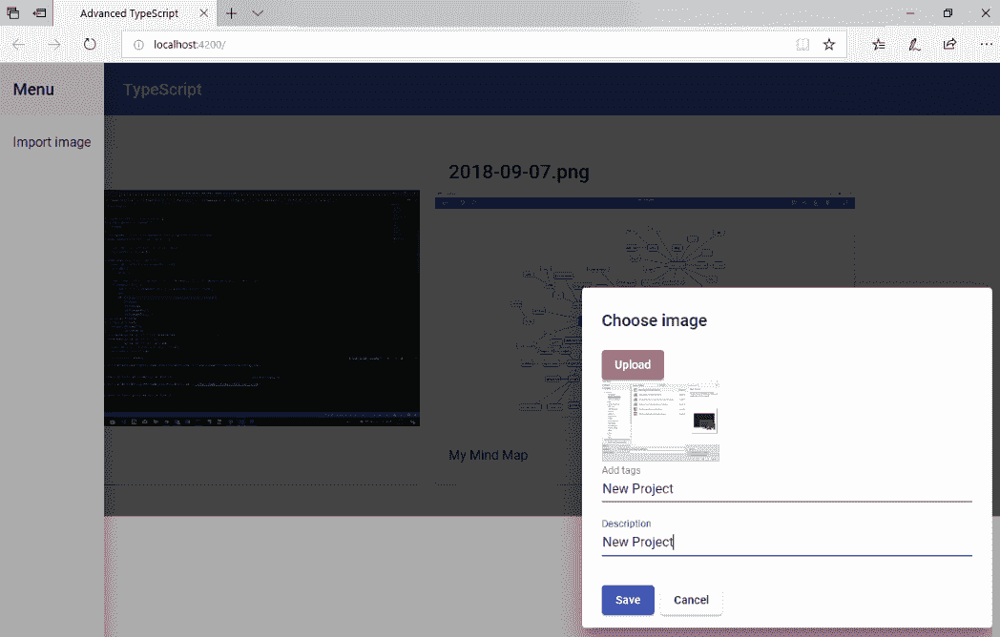
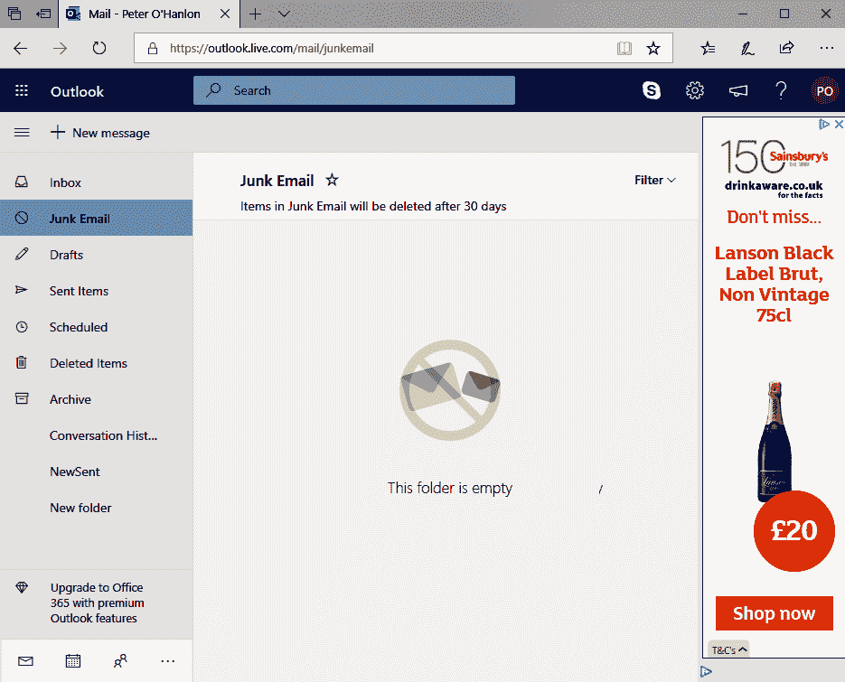

# 四、MEAN 栈——构建画廊

如今，几乎不可能编写 Node.js 应用而不听说 MEAN 堆栈。 MEAN 是描述一组在客户端和服务器端用于构建具有持久服务器端存储的 web 应用的通用技术的首字母缩写。 的技术构成**栈是**MongoDB**,**表达**(有时称为**Express.js**),【显示】角,**node . js**。**

 **我们准备在前面几章中开发的知识的基础上，使用 MEAN 堆栈编写一个图片库应用。 与前几章不同的是，本章中我们不会使用 Bootstrap，而是更倾向于使用 Angular Material。

本章将涵盖以下主题:

*   MEAN 堆栈的组成部分
*   创建应用
*   使用 Angular Material 来创建 UI
*   使用材质添加我们的导航
*   创建文件上传组件
*   使用服务读取文件
*   在我们的应用中引入 Express 支持
*   提供快速路由支持
*   引入 MongoDB
*   显示的图像
*   使用 RxJS 查看图像
*   使用`HttpClient`传输数据

# 技术要求

完成的项目可从[https://github.com/PacktPublishing/Advanced-TypeScript-3-Programming-Projects/tree/master/Chapter04](https://github.com/PacktPublishing/Advanced-TypeScript-3-Programming-Projects/tree/master/Chapter04)下载。

下载项目后，您必须使用`npm install`安装软件包要求。

# 意思是堆栈

当我们使用术语 MEAN 堆栈时，我们指的是一组独立的 JavaScript 技术，它们结合在一起创建跨越客户端和服务器端的 web 应用。 MEAN 是所使用的核心技术的缩写:

*   **MongoDB**:这是一个文档数据库，用来存储 JSON 格式的数据。 文档数据库不同于关系数据库，所以如果您来自 SQL Server 或 Oracle 这样的技术，可能需要一点时间来调整文档数据库的工作方式。
*   **Express**:这是一个后端 web 应用框架，位于 Node.js 之上。 在堆栈中使用 Express 的想法是，它简化了 Node.js 在服务器端提供的东西。 虽然 Node.js 可以做 Express 做的所有事情，但编写代码来做一些事情(比如添加 cookie 或路由网络请求)的复杂性意味着 Express 的简化有助于我们减少开发时间。
*   **:Angular 是一个客户端框架，它运行应用的客户端。 通常，Angular 用来创建**Single-Page Applications**(**spa**)，这样客户端就会更新一小部分，而不是在导航事件发生时重新加载整个页面。**
*   :Node.js 是应用的服务器端运行时环境。 我们可以把它想象成网络服务器。

下图显示了 MEAN 堆栈的组件在应用体系结构中的位置。 我们的用户看到的应用部分，有时称为前端，在这个图中是客户端。 我们应用的其余部分通常被称为后端，在图中是 web 服务器和数据库:


There is an equivalent for using React in place of Angular. It's known as the MERN stack.

# 项目概述

我们将在本章中构建的项目将向我们介绍如何编写服务器端应用，以及流行的 Angular 框架。 我们将构建一个图片库应用，用户可以上传图片并将其保存在服务器端数据库中，以便稍后再次查看。

只要你在 GitHub 存储库中与代码一起工作，本章应该需要大约 3 个小时才能完成。 完成的应用看起来像这样:



This chapter is not intended to be a comprehensive tutorial on all aspects of the MEAN stack. By the end of the chapter, we will only have begun to scratch the surface of what the different parts provide. As we are introducing many topics here, we will focus more on those topics than on advanced features of TypeScript because this could lead to information overload, but we will still be covering features such as generic constraints and fluent code, even though we aren't going to refer to them explicitly. At this point, we should be familiar enough with them to recognize them when we encounter them.

# 开始

和上一章一样，本章将使用 Node.js，可以在[https://nodejs.org](https://nodejs.org)上获得。 我们还将使用以下组件:

*   Angular 的**命令行接口**(**CLI**)(我使用的是 7.2.2 版本)
*   `cors`(版本 2.8.5 或更高)
*   `body-parser`(版本 1.18.3 或更高)
*   `express`(版本 4.16.4 或以上)
*   `mongoose`(版本 5.4.8 或更高)
*   `@types/cors`(版本 2.8.4 或更高)
*   `@types/body-parser`(版本 1.17.0 或更高)
*   `@types/express`(版本 4.16.0 或以上)
*   `@types/mongodb`(版本 3.1.19 或更高)
*   `@types/mongoose`(5.3.11 或更高版本)

我们也将使用 MongoDB。 社区版可在[https://www.mongodb.com/download-center/community](https://www.mongodb.com/download-center/community)上获得。

MongoDB 还提供了一个 GUI，可以更容易地查看、查询和编辑 MongoDB 数据库。 MongoDB 社区版可从[https://www.mongodb.com/download-center/compass](https://www.mongodb.com/download-center/compass)下载。

# 用 MEAN 堆栈创建一个 Angular 的照片库

正如我们在前几章中所做的，我们将从定义应用的需求开始:

*   用户必须能够选择要传输到服务器的图片
*   用户将能够为图片提供额外的元数据，比如描述
*   上传的图片将与元数据一起保存在数据库中
*   用户将能够自动查看上传的图片

# 了解角

Angular 是作为一个使用 HTML 和 TypeScript 组合创建客户端应用的平台而创建的。 最初，Angular 是用 JavaScript 编写的(当时它被称为 Angular.js)，但它经历了一次使用 TypeScript 的完整重写，被重新命名为 Angular。 Angular 自身的架构围绕着一系列模块展开，我们可以将这些模块引入应用或自己编写，这些模块可以包含我们可以用来构建客户端代码的服务和组件。

最初，Angular 背后的一个关键驱动因素是，完全重载网页是一种浪费。 很多网站提供相同的导航、页眉、页脚、侧边栏等等，所以每次用户导航到新页面时重新加载这些内容都是浪费时间，因为它们实际上并没有改变。 Angular 帮助推广了一种称为 spa 的架构，在 spa 架构中，页面中只有一小部分需要更改。 这减少了网页必须处理的流量，因此，如果处理得当，客户端应用的响应性就会增加。

下面的屏幕截图显示了一种典型的 SPA 格式。 页面的绝大部分本质上是静态的，所以它不需要重新发送，但中心的垃圾邮件部分将是动态的，只有那部分需要更新。 这就是 spa 的魅力所在:



This does not mean that we can't create multi-page applications in Angular. It just means that unless we have a real need to create a multi-page application, then Angular SPA applications are the way we should write our Angular applications.

现在我们已经对 Angular 有了一个大致的了解，接下来我们可以使用 Angular 来编写我们的客户端了。

# 创建应用

除非你最近安装了 Angular，否则你需要使用`npm`来安装它。 我们要安装的部分是 Angular CLI。 这为我们提供了从命令提示符运行应用、添加组件、构建应用等所需的一切:

```js
npm install -g @angular/cli
```

As we are going to develop both client and server code, it will be helpful to keep our code together to do this; therefore, we are going to create `Client` and `Server` folders under a common directory. Any Angular commands will be run in the `Client` folder. It is relatively common to share code between the client and server side, so this arrangement is a simple way to keep the application together and simplify sharing.

使用`ng new`命令可以很容易地用 Angular 创建应用，在添加 Angular CLI 时，我们也添加了`ng new`命令。 我们将指定命令行参数来选择 SCSS 来生成我们的 CSS，以及选择我们想给我们创建的任何组件的前缀:

```js
ng new Chapter04 --style scss --prefix atp
```

The naming convention I have chosen to follow reflects the name of the book, so we use `atp` to reflect *Advanced TypeScript Projects*. While we aren't going to make heavy use of CSS in this chapter, I tend to use SCSS as my CSS pre-processor more than I use raw CSS because it has a rich syntax for using things such as style mixins, which means that this is the style engine I tend to go to by default. The reason that we are choosing to use the `atp` prefix is to make our component selectors unique. Suppose that we had a component that we wanted to call label; obviously, this would clash with the built-in HTML label. To avoid the clash, our component selector would be the `atp` label. As HTML controls never use hyphens, we guarantee that we aren't going to *collide* with existing control selectors.

我们将接受安装默认值，所以当提示是否添加 Angular 路由支持时，只需按*Enter*即可。 安装完成后，我们将启动 Angular 服务器，它也会观察文件是否发生变化，并动态地重新构建应用。 通常情况下，我会在做这一部分之前安装所有必需的组件，但看看 Angular 到底给了我们什么作为起点是很有用的，并且查看实时变化的能力非常有用:

```js
ng serve --open
```

与 React 不同，打开我们应用的默认地址是`http://localhost:4200`。 当浏览器打开时，它会显示默认的 Angular 示例页面。 显然，我们将从这个页面中删除很多内容，但在短期内，我们将保持这个页面的原样，同时开始添加一些我们需要的基础设施。

Angular 会为我们创建很多文件，所以有必要确定哪些文件是我们最常使用的，以及它们的用途。

# App.Module.ts

在开发大型 Angular 应用的过程中，特别是当我们只是开发同一个应用不同部分的众多团队之一时，通常会将它们分解成模块。 我们可以将该文件视为说明模块如何分组的入口点。 出于我们的目的，我们对`@NgModule`所涵盖的模块定义中的两个部分感兴趣。

第一部分是`declarations`部分，它告诉 Angular 我们开发了哪些组件。 对于我们的应用，我们将开发三个属于这里的组件——`AppComponent`(默认添加)、`FileuploadComponent`和`PageBodyComponent`。 幸运的是，当我们使用 Angular CLI 来生成组件时，它们的声明会自动添加到本节中。

我们感兴趣的另一个部分是`imports`部分。 这告诉我们需要将哪些外部模块导入应用。 我们不能仅仅在应用中引用外部模块中的特性; 实际上，我们必须告诉 Angular，我们将使用该特性的来源模块。 这意味着，当我们部署应用时，Angular 非常擅长减少依赖项，因为它只会部署我们所说的正在使用的模块。

在我们读这一章的时候，我们会在这一节中添加一些项目，以启用 Angular Material 支持等特性。

# 在 UI 中使用 Angular Material

我们应用的前端将使用 Angular Material，而不是依赖于 Bootstrap。 我们将着眼于 Material，因为它在 Angular 应用中被广泛使用; 因此，如果你打算在商业上使用 Angular 进行开发，你很有可能在职业生涯的某个阶段使用它。

Angular Material 是由 Angular 团队创建的，目的是将 Material Design 组件引入 Angular。 它们背后的想法是，它们可以无缝地集成到 Angular 开发过程中，因此它们与使用标准 HTML 组件没有什么不同。 这些设计组件远远超出了我们使用单一标准控件所能实现的功能，因此我们可以轻松地使用它们构建复杂的导航布局。

材料组件将行为和视觉外观结合在一起，因此，我们可以使用它们来创建专业外观的应用，对我们来说是最小的努力。 在某种程度上，可以将 Material 视为与 Bootstrap 类似的体验。 在本章中，我们将专注于使用 Material 而不是 Bootstrap。

在前面的几段中，我们非常流畅地提到了 Angular Material 给 Angular 带来了 Material Design 组件。 这在很大程度上是一个循环的陈述，直到我们理解什么是材料设计。 如果我们在谷歌中搜索这个词，我们会得到很多文章，告诉我们 Material Design 是谷歌的设计语言。

当然，如果我们做 Android 开发，这个词会经常出现，因为 Android 和 Material 从根本上是联系在一起的。 Material 背后的理念是，如果我们能够以一种一致的方式呈现界面元素，那么它将最符合用户的利益。 因此，如果我们采用 Material，我们的应用对于习惯了 Gmail 之类应用的用户来说会看起来很熟悉。

然而，术语*设计语言*太模糊了。 这对我们到底意味着什么? 为什么它有自己奇特的术语呢? 就像我们自己的语言被分解成单词和标点符号一样，我们也可以将视觉元素分解成颜色和深度等结构。 例如，语言告诉我们颜色的含义，所以如果我们在应用的一个屏幕上看到一个带有一种颜色的按钮，那么它应该在应用的其他屏幕上具有相同的潜在用法; 我们不会用一个绿色按钮在一个对话框上表示 OK，然后在另一个对话框上表示 Cancel。

安装 Angular Material 是一个简单的过程。 我们运行以下命令来添加对 Angular Material、**Component Design Toolkit**(**CDK**)、灵活布局支持和动画支持:

```js
ng add @angular/material @angular/cdk @angular/animation @angular/flex-layout
```

在安装库的过程中，系统会提示我们选择要使用的主题。 主题最明显的方面是应用的配色方案。

我们可以从以下主题中选择(我们也提供了主题的示例):

*   [https://material.angular.io?theme=indigo-pink](https://material.angular.io?theme=indigo-pink)
*   深紫色/琥珀色([https://material.angular.io?theme=deeppurple-amber](https://material.angular.io?theme=deeppurple-amber))
*   [https://material.angular.io?theme=pink-bluegrey](https://material.angular.io?theme=pink-bluegrey)
*   紫/绿([https://material.angular.io?theme=purple-green](https://material.angular.io?theme=purple-green))
*   自定义

对于我们的应用，我们将使用 Indigo/Pink 主题。

我们还会被提示是否要添加 HammerJS 支持。 这个库提供了手势识别功能，因此我们的应用可以响应使用触摸或鼠标进行平移或旋转等操作。 最后，我们必须选择是否要为 Angular Material 设置浏览器动画。

The CDK is an abstraction that says how common Material features work, but it does not say what they will look like. Without installing the CDK, many features of the Material library just won't work, so it's important to ensure that it is installed alongside `@angular/material`.

# 使用材质添加导航

我们将不断地看到，要向应用添加特性，我们需要从`app.module.ts`开始进行更改。 材质也一样，所以我们从添加以下`import`线开始:

```js
import { LayoutModule } from '@angular/cdk/layout';
import { MatToolbarModule, MatButtonModule, MatSidenavModule, MatIconModule, MatListModule } from '@angular/material';
```

现在我们可以使用这些模块，我们需要在`NgModule`的`import`部分引用它们。 本节中列出的任何模块都可以在应用的模板中使用。 例如，当我们添加侧边导航支持时，我们依赖的事实是，我们已经在本节中提供了`MatSidenavModule`:

```js
imports: [
  ...
 LayoutModule,
 MatToolbarModule,
 MatButtonModule,
 MatSidenavModule,
 MatIconModule,
 MatListModule,
]
```

我们将应用设置为使用侧导航(屏幕下方出现的导航条)。 在结构上，我们需要添加三个元素来实现侧边导航:

*   `mat-sidenav-container`主机侧导航
*   `mat-sidenav`显示侧导航
*   添加将要显示的内容

首先，我们将添加以下内容到我们的`app.component.html`页面:

```js
<mat-sidenav-container class="sidenav-container">
  <mat-sidenav #drawer class="sidenav" fixedInViewport="true" [opened]="false">
  </mat-sidenav>
  <mat-sidenav-content>
  </mat-sidenav-content>
</mat-sidenav-container>
```

`mat-sidenav`行设置了我们将要利用的几个行为。 我们希望导航被固定在视口中，我们通过使用`#drawer`给它抽屉的 ID。 我们将很快使用这个 ID，当我们触发切换抽屉是否打开时。

这一行最有趣的部分可能是`[opened]="false"`。 这是在应用中遇到绑定的第一个点。 这里使用的`[]`告诉我们要绑定到一个特定的属性，在本例中是`opened`，并将其设置为`false`。 在本章中我们会看到，Angular 有丰富的绑定语法。

现在我们已经有了容纳导航的容器，接下来我们将添加侧边导航内容。 我们将添加一个工具栏，以保持`Menu`文本和导航列表，允许用户导入图像:

```js
<mat-toolbar>Menu</mat-toolbar>
<mat-nav-list>
  <a mat-list-item>Import Image</a>
</mat-nav-list>
```

在标准锚标记中使用`mat-list-item`只会告诉 Material 引擎，我们希望将锚放置在一个列表中。 实际上，本节是使用 Material 样式设置锚的无序列表。

现在，我们想添加切换导航的功能。 我们的方法是在导航内容区域中添加一个工具栏。 这个工具栏将包含一个按钮，用于触发侧边导航抽屉的打开。 在`mat-sidenav-content`部分，添加以下内容:

```js
<mat-toolbar color="primary">
  <button type="button" aria-label="Toggle sidenav" mat-icon-button (click)="drawer.toggle()">
    <mat-icon aria-label="Side nav toggle icon">menu</mat-icon>
  </button>
</mat-toolbar>
```

按钮使用了另一个绑定示例——在本例中，对`click`事件作出反应——触发带有`drawer`ID 的`mat-sidenav`项上的`toggle`操作。 我们不是使用`[eventName]`来绑定命令，而是使用`(eventName)`。 在按钮内部，我们托管`mat-icon`来表示用于切换导航的图像。 为了与 Material 设计代表一种展示应用的通用方式的理念保持一致，Angular Material 为我们提供了许多标准图标，比如`menu`。

我们使用的 Material 字体代表了一些特定的单词，比如 home 和 menu，作为一种叫做**连词**的特殊图像。 这是一个标准的排版术语，意思是有一些众所周知的字母、数字和符号组合可以表示为图像。 例如，如果我们有`mat-icon`文本`home`，这将表示为一个主图标。

# 创建我们的第一个组件—FileUpload 组件

我们导航上的`Import Image`链接实际上要做一些事情，所以我们要写一个组件，它将显示在对话框中。 当我们要上传一个文件时，我们将调用它`FileUpload`，创建它就像运行以下 Angular CLI 命令一样简单:

```js
ng generate component components/fileupload
```

We can shorten these standard Angular commands if we want, so we can use `ng g c` instead of `ng generate component`.

这个命令为我们创建了四个文件:

*   `fileupload.component.html`:我们组件的 HTML 模板。
*   `fileupload.component.scss`:任何我们需要转换成 CSS 的组件。
*   `fileupload.component.spec.ts`:现在，当我们想要对 Angular 应用运行单元测试时，会使用`spec.ts`文件。 正确地测试 web 应用超出了本书的范围，因为它本身就是一本书。
*   `fileupload.component.ts`:组件逻辑。

Running the `ng` command to generate the component also results in it being added into the `declarations` section in `app.module.ts`.

当我们打开`fileupload.component.ts`时，结构大致是这样的(忽略顶部的导入):

```js
@Component({
  selector: 'atp-fileupload',
  templateUrl: './fileupload.component.html',
  styleUrls: ['./fileupload.component.scss']
})
export class FileuploadComponent implements OnInit {
  ngOnInit() {
  }
}
```

在这里，我们可以看到 Angular 充分利用了我们之前看过的 TypeScript 特性。 在这个例子中，`FileuploadComponent`有一个`Component`装饰器，它告诉 Angular，当我们想在 HTML 中使用`FileuploadComponent`实例时，我们会使用`atp-fileupload`。 当我们使用单独的 HTML 模板和样式时，`@Component`装饰器的其他部分将标识这些元素所在的位置。 我们可以在这个类中直接定义样式和模板，但一般来说，最好将它们分离到各自的文件中。

We can see our naming convention here, having specified `atp` when we created our application. It's a good idea to use something meaningful. When working in a team, you should find out what the standard is that your team follows and, if there is no standard, you should take the time to agree on how you want this to be named up front.

这个对话框的一个特点是，它会向我们展示用户选择的图像的预览。 我们将把读取图像的逻辑从组件中分离出来，以保持良好而清晰的关注点分离。

# 使用服务预览文件

开发 UI 应用的挑战之一是，有一种趋势，逻辑会潜入不属于那里的视图。 把一个逻辑块放到我们的`ts`视图文件中变得很方便，因为我们知道视图将调用它，但它做了一些事情，对客户端没有任何可见的影响。

例如，我们可能希望将一些值从 UI 写入服务器。 唯一与视图相关的部分是数据部分; 实际写入服务器是完全不同的职责。 如果我们有一种简单的方法来创建外部类，我们可以在需要的地方注入这些类，这样我们就不需要担心如何实例化它们，这将对我们很有帮助。 它们只会在我们需要的时候提供给我们使用。 幸运的是，Angular 的作者看到了这种需求，并为我们提供了服务。

服务只是一个使用`@Injectable`装饰器的类，在模块的`declarations`部分有一个条目。 除了这些要求，没有其他需要的，所以我们可以很容易地手工制作类，如果我们需要。 虽然我们可以这样做，但并没有真正的理由这样做，因为 Angular 会用下面的命令帮助我们生成服务:

```js
ng generate service <<servicename>>
```

当我们创建`service`时，我们实际上不需要在名称的末尾添加`service`，因为这个命令会自动为我们做那件事。 看到这是如何工作的,我们将创建一个`service`,选择文件,使用文件选择器,然后读取它,这样它可以显示在主屏幕上的图像上传对话框和,或转移到被保存在数据库中。 我们从以下命令开始:

```js
ng generate service Services/FilePreviewService.
```

I like to generate my services in a `Services` sub-folder. Putting this in the filename creates it in the `Services` folder.

`ng generate service`命令为我们提供了以下基本概要:

```js
import { Injectable } from '@angular/core';
@Injectable({
 providedIn: 'root'
})
export class FilePreviewService {
}
```

读取文件可能是一个耗时的过程，所以我们希望这个操作异步发生。 正如我们在前面的章节中讨论的，我们可以使用回调来实现这一点，但更好的方法是使用承诺。 我们向服务添加以下方法调用:

```js
public async Preview(files: any): Promise<IPictureModel> {
}
```

因为这是我们要读入文件的点，所以这是我们要创建模型的时候，我们要用这个模型在我们的应用中传递数据。 我们将要使用的模型是这样的:

```js
export interface IPictureModel {
 Image: string;
 Name: string;
 Description: string;
 Tags: string;
}
export class PictureModel implements IPictureModel {
 Image: string;
 Name: string;
 Description: string;
 Tags: string;
}
```

`Image`保存我们将要读入的实际图像，`Name`是文件的名称。 这就是为什么我们现在要填充这个模型; 我们使用的是文件本身，所以这是我们可以使用文件名的地方。 图像上传组件将添加`Description`和`Tags`字符串。 虽然我们可以在这一点上创建交集类型，但对于这样一个简单的模型，让一个模型容纳它们就足够了。

我们说我们正在使用`Promise`这一事实意味着我们需要`retu``rn`从我们的`Preview`方法中选取合适的`Promise`:

```js
return await new Promise((resolve, reject) => {});
```

在`Promise`中，我们将创建模型的一个实例。 由于这是一种良好的实践，我们将添加一些防御代码来确保我们有一个图像文件。 如果文件不是一个图像文件，我们将拒绝它，这可以通过调用代码优雅地处理:

```js
if (files.length === 0) {
  return;
}
const file = files[0];
if (file.type.match(/image\/*/) === null) {
  reject(`The file is not an image file.`);
  return;
}
const imageModel: IPictureModel = new PictureModel();
```

当我们到达这一点时，我们知道我们有一个有效的文件，所以我们将使用文件名在模型中设置名称，以及使用`FileReader`来使用`readAsDataURL`读取图像。 当读取完成时，引发`onload`事件，允许我们将图像数据添加到模型中。 此时，我们可以解决我们的承诺:

```js
const reader = new FileReader();
reader.onload = (evt) => {
  imageModel.Image = reader.result;
  resolve(imageModel);
};
reader.readAsDataURL(file);
```

# 使用对话框中的服务

现在我们有了一个正常工作的`preview`服务，我们可以在对话框中使用它。 为了使用它，我们要把它传递到构造函数中。 由于该服务是可注入的，所以只要在构造函数中添加一个适当的引用，就可以让 Angular 替我们注入它。 同时，我们将添加一个对对话框本身的引用，以及一组将在相应的 HTML 模板中使用的声明:

```js
protected imageSource: IPictureModel | null;
protected message: any;
protected description: string;
protected tags: string;

constructor(
  private dialog: MatDialogRef<FileuploadComponent>,
  private preview: FilePreviewService) { }
```

The technique that allows Angular to automatically build up constructors with dependencies, without us having to explicitly instantiate them with `new`, is known as dependency injection. This fancy term simply means that we tell Angular what our class needs and leave the building of the objects for that class to Angular. In effect, we tell Angular *what* we need without worrying about *how* it will be built. The act of building the classes can lead to very complex internal hierarchies, as the dependency injection engine may have to build up classes that our code relies on as well.

有了这个引用，我们将创建一个方法来接受来自文件上传组件的文件选择，并调用我们的`Preview`方法。 `catch`的位置，以迎合我们的防御编码服务，以及满足情况下，用户试图上传一个非图像文件。 如果文件无效，对话框将显示一条消息通知用户:

```js
public OnImageSelected(files: any): void {
  this.preview.Preview(files).then(r => {
    this.imageSource = r;
  }).catch(r => {
    this.message = r;
  });
}
```

我们需要对对话框的代码端做的最后一件事是允许用户关闭对话框并将选择的值传递回调用代码。 我们用相关的局部值更新图像源描述和标签。 `close`方法关闭当前对话框，并返回`imageSource`回调用代码:

```js
public Save(): void {
  this.imageSource.Description = this.description;
  this.imageSource.Tags = this.tags;
  this.dialog.close(this.imageSource);
}
```

# 文件上传组件模板

组件的最后一点工作是在`fileupload.component.html`中创建实际的 HTML 模板。 因为这将是一个材质对话框，我们将在这里使用一些材质标签。 这些标签中最简单的用来添加对话框标题，这是一个带有`mat-dialog-title`属性的标准标题标签。 使用这个属性的原因是将标题锚定在对话框的顶部，这样如果有任何滚动，标题将保持固定的位置:

```js
<h2 mat-dialog-title>Choose image</h2>
```

标题固定在顶部，我们准备添加内容和操作按钮。 首先，我们将使用`mat-dialog-content`标签添加内容:

```js
<mat-dialog-content>
  ...
</mat-dialog-content>
```

内容中的第一个元素是如果设置了组件代码中的消息，则将显示的消息。 显示消息是否显示的测试使用了另一个 Angular 绑定`*ngIf`。 在这里，Angular 绑定引擎会计算表达式，如果表达式为真，就会输出值。 在本例中，它检查是否存在消息。 如果知道看起来很滑稽的`{{}}`代码也是一个绑定，可能不会感到惊讶。 这个用来写出要绑定到的条目的文本，在本例中是消息:

```js
<h3 *ngIf="message">{{message}}</h3>
```

更改的下一部分是应用中我最喜欢的部分之一。 标准 HTML 文件组件没有 Material 版本，所以如果我们想要显示一个现代版的对等组件，我们必须将文件输入显示为一个隐藏组件，并在用户按下 Material 按钮时让它认为它已被激活。 文件上传输入给出了`fileUpload`ID，并在使用`(click)="fileUpload.click()"`点击按钮时触发。 当用户做出选择时，change 事件会触发我们几分钟前编写的`OnImageSelected`代码:

```js
  <button class="mat-raised-button mat-accent" md-button (click)="fileUpload.click()">Upload</button>
  <input hidden #fileUpload type="file" accept="img/*" (change)="OnImageSelected(fileUpload.files)" />
```

添加一个图像预览就像添加一个`img`标签一样简单，它是绑定到预览图像创建时，我们成功读取图像:

```js
<div>
  
</div>
```

最后，我们需要添加用于读取标签和描述的字段。 我们把这些放在`mat-form-field`部分里面。 告诉模板引擎应该为文本输入设置什么样的样式。 最有趣的部分是`[(ngModel)]="..."`部分的使用。 这为我们应用了模型绑定，告诉绑定引擎从底层的 TypeScript 组件代码中使用哪个字段:

```js
<mat-form-field>
  <input type="text" matInput placeholder="Add tags" [(ngModel)]="tags" />
</mat-form-field>
<mat-form-field>
  <input matInput placeholder="Description" [(ngModel)]="description" />
</mat-form-field>
```

If you have previously used an earlier version of Angular (prior to version 6), you have probably come across `formControlName` as a means of binding to values. In Angular 6+, trying to combine `formControlName` and `ngModel` no longer works. See [https://next.angular.io/api/forms/FormControlName#use-with-ngmodel](https://next.angular.io/api/forms/FormControlName#use-with-ngmodel) for more information.

有一些样式需要与`mat-form-field`相关联。 在`fileupload.component.scss`文件中，我们添加`.mat-form-field { display: block; }`来设置字段的样式，使其出现在新行中。 如果我们忽略了这一点，输入字段就会并排出现。

如果一个对话框不能关闭，或者不能将值返回给调用代码，那么它就没有什么好处。 对于这些操作，我们应该遵循的惯例是将 Save 和 Cancel 按钮放在`mat-dialog-actions`区域内。 取消按钮被标记为`mat-dialog-close`，所以它为我们关闭对话，而我们不必采取任何行动。 Save 按钮遵循我们现在应该熟悉的模式，并在检测到按钮点击时调用组件代码中的`Save`方法:

```js
<mat-dialog-actions>
  <button class="mat-raised-button mat-primary" (click)="Save()">Save</button>
  <button class="mat-raised-button" mat-dialog-close>Cancel</button>
</mat-dialog-actions>
```

我们已经到了需要考虑用户选择图像后将在哪里存储图像，以及从哪里检索图像的阶段。 在前一章中，我们使用了一个客户端数据库来存储数据。 从现在开始，我们也将使用服务器端代码。 我们的数据将存储在 MongoDB 数据库中，所以我们现在需要看看如何使用 Node.js 和 Express 连接到 MongoDB 数据库。

# 在我们的应用中引入 Express 支持

当我们用 node . js 开发客户机/服务器应用,它让我们的生活更容易,如果我们可以使用一个框架,使我们能够开发服务器端部分,尤其是如果它有一个丰富的生态系统*插件功能覆盖特性,比如连接到数据库并使用本地文件系统。 这就是 Express 发挥作用的地方; 它是一个中间件框架，与 Node.js 配合得很好。*

 *由于我们将完全从零开始创建服务器端代码，我们应该从创建基本的`tsconfig.json`和`package.json`文件开始。 要做到这一点，在`Server`文件夹中运行以下命令，它也将通过导入 Express 和 TypeScript Express 定义来添加 Express 支持:

```js
tsc --init
npm init -y
npm install express @types/express parser @types/body-parser --save
```

在我们的`tsconfig.json`文件中有许多不必要的选项。 我们只需要最小的选项，所以我们将配置设置为如下所示:

```js
{
  "compilerOptions": {
    "target": "es2015",
    "module": "commonjs",
    "outDir": "./dist",
    "strict": true,
    "allowSyntheticDefaultImports": true,
    "esModuleInterop": true
  },
}
```

我们的服务器端代码将从一个名为`Server`的类开始。 【第一节课】

```js
import express from "express";
```

为了创建 Express 应用的实例，我们将创建一个名为`app`的私有实例，并在构造函数中将其设置为`express()`。 这就为我们初始化了 Express 框架。

构造函数也接受一个端口号，当我们告诉应用在`Start`方法中监听时，我们将使用这个端口号。 显然，我们需要响应 web 请求，所以当我们的应用收到来自`/`的`get`请求时，我们将使用`send`向 web 页面发送消息。 在我们的例子中，如果我们导航到`http://localhost:3000/`，这个方法接收到的网页 URL 是根，调用的函数返回`Hello from the server`给客户端。 如果我们浏览到`/`以外的任何内容，我们的服务器将响应`404`:

```js
export class Server {
  constructor(private port : number = 3000, private app : any = express()) {
  }

  public Start() : void {
    this.OnStart();
    this.app.listen(this.port, () => console.log(`Express server running on port ${this.port}`));
  }

  protected OnStart() : void {
    this.app.get(`/`, (request : any, response : any) => res.send(`Hello from the server`));
  }
}
```

为了启动我们的服务器，我们必须给它一个我们想要提供内容的端口，并调用`Start`:

```js
new Server(3000).Start();
```

The reason that we have started off with a `Server` class, rather than following the approach of most Node.js/Express tutorials we see on the internet, is that we are looking to build the foundations of something that we will be able to re-use in future chapters. This chapter represents a starting point for this class, as future chapters will take what we have done here and grow the capabilities of the server.

在当前状态下，服务器将无法处理来自 Angular 的任何传入请求。 现在应该开始增强服务器，以便它能够处理来自客户机的请求。 当客户端发送它的数据时，它将被视为 json 格式的请求。 这意味着我们需要告诉服务器接受请求，并在我们看到的任何请求的主体中公开它。

当我们讨论路由时，很快，我们将看到一个完整地使用`request.Body`的示例。 我们需要注意的是，我们会收到 Angular 的大量请求; 照片会占用很多空间。 默认情况下，主体解析器有 100 KB 的限制，这还不够大。 我们将把请求的大小限制提高到 100mb，这应该足够我们在图片库中投放任何图像了:

```js
public Start(): void {
  this.app.use(bodyParser.json({ limit: `100mb` }));
  this.app.use(bodyParser.urlencoded({ limit: `100mb`, extended: true }));
  this.OnStart();
  this.app.listen(this.port, () => console.log(`Express server running on port ${this.port}`));
}
```

现在我们讨论的是将要从 Angular 遇到的数据，我们需要考虑一下应用是否会接受这些请求。 在我们进入服务器如何知道根据哪个请求执行哪个操作的主题之前，我们需要解决一个叫做**跨源请求共享**(**CORS**)的问题。

通过 CORS，我们让外界知道可以进入我们站点的受限操作。 由于 Angular 从一个不同的站点运行到我们的 web 服务器(`localhost:4200`而不是`localhost:3000`)，我们需要启用 CORS 支持; 否则，当我们从 Angular 发出请求时，将不会返回任何东西。 我们要做的第一件事是将`cors`中间件添加到 Node.js 服务器:

```js
npm install cors @types/cors --save
```

添加 CORS 支持就像告诉应用使用 CORS 一样简单:

```js
public WithCorsSupport(): Server {
    this.app.use(cors());
    return this;
}
```

CORS support provides a lot of fine-tuning that we don't need to take advantage of. For instance, it allows us to set the types of request methods that we are allowing, using `Access-Control-Allow-Methods`.

现在我们可以接受来自 Angular 的请求了，我们需要把这个机制放在合适的位置，把请求路由到合适的请求处理程序。

# 提供路由支持

每当一个请求进入我们的 web 服务器时，我们必须确定我们想要发回什么响应。 我们正在构建的是响应发布和接收请求，这与我们构建 REST api 的方式类似。 将传入请求路由到响应的能力称为路由。 我们的应用将处理三种类型的请求:

*   一个以`add`为 URL 的`POST`请求(换句话说，当我们看到`http://localhost:3000/add/`时)。 这将向数据库添加图像和相关细节。
*   URL 中带有`get`的`GET`请求(如`http://localhost:3000/get/`)。 它获取所有保存的图片的 id，并将这些 id 的数组返回给调用者。
*   URL 中带有`/id/`的`GET`请求。 这将在 URL 中使用一个附加参数来获取要发送回客户机的单个图片的 ID。

The reason that we are returning an array of IDs is that an individual image can be large. If we were to attempt to return all the images in one go, we would slow down the displaying of the images at the client side as they can be displayed as each one is being loaded. We could also breach the limits of how big the response we are passing back can be. In the case of large chunks of data, it's always worth looking to see how we can minimize what we are transmitting with each request.

每个请求的目的地对应于我们想要采取的唯一操作。 这给了我们一个提示，我们应该能够将每个路由分割成一个类，这个类除了服务该操作之外什么也不做。 为了强制执行单个操作，我们定义了我们希望路由类使用的接口:

```js
export interface IRouter {
  AddRoute(route: any): void;
}
```

我们将添加一个 helper 类，负责实例化每个路由器实例。 这个类开始时很简单，创建一个`IRouter`数组，路由实例将被添加到其中:

```js
export class RoutingEngine {
  constructor(private routing: IRouter[] = new Array<IRouter>()) {
  }
}
```

我们用来添加实例的方法很有趣。 我们要做的是接受泛型类型作为参数并实例化该类型。 要做到这一点，我们必须利用 TypeScript 的特性，它允许我们接受泛型类型，并指定当`new`被调用时，它返回该类型的一个实例。

由于我们在类型上指定了泛型约束，我们将只接受`IRouter`实现:

```js
public Add<T1 extends IRouter>(routing: (new () => T1), route: any) {
  const routed = new routing();
  routed.AddRoute(route);
  this.routing.push(routed);
}
```

The route that is passed into the method comes from Express. It's the router instance that we tell our application to use.

现在已经有了路由支持，我们需要编写与前面标识的路由请求相对应的类。 我们要看的第一个是接受`add`post 的类:

```js
export class AddPictureRouter implements IRouter {
  public AddRoute(route: any): void {
    route.post('/add/', (request: Request, response: Response) => {

  }
}
```

该方法的工作原理是，当我们收到一个`/add/`帖子时，我们将接受请求，处理它，并发送一个响应。 我们对请求做什么取决于我们自己，但是只要路由确定我们在这里有一个匹配，我们就会执行这个方法。 在这个方法中，我们将创建图片的服务器端表示，并将其保存到数据库中。

出于本应用的目的，我们只介绍了快速路由。 Angular 有自己的路由引擎，但出于我们想要在代码中放置的目的，我们不需要它。 在[第 5 章](05.html)、*中，我们介绍了使用 GraphQL 和 Apollo*的 Angular ToDo 应用。

# 引入 MongoDB

使用 MongoDB 需要我们使用一些东西，比如流行的 Mongoose 包。 安装 Mongoose 需要我们同时添加`mongoose`和`@types/mongoose`包:

```js
npm install mongoose @types/mongoose --save-dev
```

在对数据库进行任何操作之前，我们需要创建一个模式来表示要保存到数据库中的对象。 不幸的是，当我们使用 MEAN 开发应用时，这可能会变得有点乏味。 虽然模式表面上代表了我们在 Angular 方面创建的模型，但它不是同一个模型，所以我们必须再次输入它。

更重要的是，这意味着如果我们改变了 Angular 模型，我们就必须重新生成 MongoDB 模式来配合这些变化:

```js
export const PictureSchema = new Schema({
  Image: String,
  Name: String,
  Description: String,
  Tags: String,
});
```

For the purposes of our application, we are going to keep the image in the database—in the `Image` field—because this simplifies the infrastructure we have to put in place. In commercial-grade applications, we would choose to store the actual image separate to the database and the `Image` field would point to the physical location of the image. The location of the image would have to be accessible to our web application, and there would be policies in place to ensure that the images were safely backed up and could be easily restored.

模式就绪后，我们希望创建一个表示它的模型。 考虑模型和模式之间交互的一个好方法是模式告诉我们*我们希望我们的数据是什么样子的。 该模型告诉我们*如何*对数据库进行操作:*

```js
export const Picture = mongoose.model('picture', PictureSchema);
```

现在我们已经准备好了模型，我们需要一些东西来建立到数据库的连接。 MongoDB 数据库的连接字符串有自己的协议，所以它以`mongodb://`模式开始。 对于我们的应用，我们将 MongoDB 运行在与服务器端代码相同的服务器上; 对于更大的应用，我们真的想把这些分离出来，但现在，我们将在连接字符串中使用`localhost:27017`，因为 MongoDB 正在监听`27017`端口。

由于我们希望能够在 MongoDB 中托管许多数据库，所以告诉引擎使用什么数据库的机制将提供数据库名称作为连接字符串的一部分。 如果数据库不存在，将创建它。 对于我们的应用，我们的数据库将被称为`packt_atp_chapter_04`:

```js
export class Mongo {
  constructor(private url : string = "mongodb://localhost:27017/packt_atp_chapter_04") {
  }

  public Connect(): void {
    mongoose.connect(this.url, (e:any) => {
      if (e) {
        console.log(`Unable to connect ` + e);
      } else {
        console.log(`Connected to the database`);
      }
    });
  } 
}
```

只要在我们尝试在数据库内部做任何事情之前调用了`Connect`，我们的数据库就应该是可用的。 在内部，`Connect`使用连接字符串调用`mongoose.connect`。

# 回到我们的路线

有了可用的`Picture`模型，我们可以直接从`add`路线内部填充它。 请求体包含与模式相同的参数，因此映射对我们来说是不可见的。 当它被填充后，我们调用`save`方法。 如果有错误，我们将把它发送回客户端; 否则，我们将把图片发送回客户端:

```js
const picture = new Picture(request.body);
picture.save((err, picture) => {
  if (err) {
    response.send(err);
  }
  response.json(picture);
});
```

In production applications, we wouldn't really want to send the error back to the client as that exposes the inner workings of our application. With a small application, intended for our own use only, it is less of an issue and it is a useful way to determine what has gone wrong with our application because we can simply view the error in the browser console window. Professionally, I would recommend sanitizing the error and sending one of the standard HTTP responses back instead.

`get`请求的处理程序并不复杂。 它开始的方式类似于`add`路由器:

```js
export class GetPicturesRouter implements IRouter {
  public AddRoute(route: any): void {
    route.get('/get/', (request: Request, response: Response) => {

    });
  }
}
```

The `Request` and `Response` types in our routes come from Express, so they should be added as `imports` in the class.

我们试图用这个调用做的是获取用户上传的唯一图片列表。 在内部，每个模式添加一个`_id`字段，所以我们将使用`Picture.distinct`方法获取这些 id 的完整列表，然后将其发送回客户端代码:

```js
Picture.distinct("_id", (err, picture) => {
  if (err) {
    response.send(err);
  }
  response.send(pic);
});
```

我们需要放置的最后一个路由器接受单个 ID 请求并从数据库中检索相关项。 使这个类比前面的类稍微复杂一点的是，在将数据传回客户机之前，我们需要稍微操作模式以排除`_id`字段。

如果我们不删除这个字段，我们的客户端将接收到的数据将与它所期望的类型不匹配，因此它将不能自动填充实例。 这将导致我们的客户端不显示这个数据，即使它收到了它回来，除非我们在客户端手动填充它:

```js
export class FindByIdRouter implements IRouter {
  public AddRoute(route: any): void {
    route.get('/id/:id', (request: Request, response: Response) => {
    });
  }
}
```

The syntax with `:id` tells us that we are going to receive a parameter called `id` here. The request exposes a `params` object, which will expose this parameter as `id`.

我们知道我们接收到的参数`id`是唯一的，所以我们可以使用`Picture.findOne`方法从数据库中检索匹配的条目。 为了从我们将要发送回客户端的结果中排除`_id`字段，我们必须在参数中使用`-_id`来删除这个字段:

```js
Picture.findOne({ _id: request.params.id }, '-_id', (err, picture) => {
  if (err) {
    response.send(err);
  }
  response.json(picture);
});
```

在这一点上，课程需要一点额外的注意。 我们已经创建了`RoutingEngine`和`Mongo`类，但是`Server`类中没有任何东西可以将它们连接起来。 通过扩展构造函数来添加它们的实例，很容易对其进行排序。 我们还需要向数据库中添加一个对`Start`到`connect`的调用。 如果我们将`Server`类更改为抽象类，并添加`AddRouting`方法，我们将阻止任何人直接实例化服务器。

我们的应用将需要从这个类派生，并使用`RoutingEngine`类添加自己的路由实现。 这是将服务器分解为更小的独立单元以分离职责的第一步。 `Start`方法的一个大变化是，一旦我们添加了路由，我们告诉应用使用与路由引擎使用的相同的`express.Router()`，这样任何请求就会自动连接起来:

```js
constructor(private port: number = 3000, private app: any = express(), private mongo: Mongo = new Mongo(), private routingEngine: RoutingEngine = new RoutingEngine()) {}

protected abstract AddRouting(routingEngine: RoutingEngine, router: any): void;

public Start() : void {
  ...
  this.mongo.connect();
  this.router = express.Router();
  this.AddRouting(this.routingEngine, this.router);
  this.app.use(this.router);
  this.OnStart();
  this.app.listen(this.port, () => console.log(`Express server running on port ${this.port}`));
}
```

有了这个，我们现在可以创建一个具体的类来扩展我们的`Server`类，并添加我们创建的路由器。 这是我们运行应用时将要启动的类:

```js
export class AdvancedTypeScriptProjectsChapter4 extends Server {
  protected AddRouting(routingEngine: RoutingEngine, router: any): void {
    routingEngine.Add(AddPictureRouter, router);
    routingEngine.Add(GetPicturesRouter, router);
    routingEngine.Add(FindByIdRouter, router);
  }
}

new AdvancedTypeScriptProjectsChapter4(3000).WithCorsSupport().Start();
```

Don't forget to remove the original call to start the `new Server(3000).Start();` server.

我们的服务器端代码完成了。 我们不打算给它添加更多的特性，所以我们可以回到客户端代码。

# 显示的图像

在我们努力编写服务器端代码并让用户选择他们想要上传的图像之后，我们需要一些东西来实际显示图像。 我们将创建一个`PageBody`组件，我们将在主导航栏中显示并添加它作为一个元素。 同样，我们将让 Angular 来做这些艰苦的工作，并为我们创建基础架构:

```js
ng g c components/PageBody
```

创建了这个组件后，我们将用`PageBody`组件更新`app.component.html`，如下所示:

```js
...
      <span>Advanced TypeScript</span>
    </mat-toolbar>
    <atp-page-body></atp-page-body>
  </mat-sidenav-content>
</mat-sidenav-container>
```

当我们安装了 Material support 时，我们添加的一个特性是 Flex Layout，它为 Angular 提供了灵活的布局支持。 我们将在我们的应用中利用这一点，设置卡片的布局，最初是三行，需要时换行到下一行。 在内部，布局引擎使用**Flexbox**(一个**灵活盒**)来执行布局。

其理念是，引擎可以根据自己的需要调整宽度和高度，以充分利用屏幕空间。 从我们设置 Bootstrap(它采用了 Flexbox)的方式来看，您应该对这种行为很熟悉。 由于 Flexbox 默认尝试在一行中布局项目，我们将首先创建一个`div`标签，改变行为，沿行包装，间距为 1%:

```js
<div fxLayout="row wrap" fxLayout.xs="column" fxLayoutWrap fxLayoutGap="1%" fxLayoutAlign="left">
</div>
```

布局容器就绪后，我们现在需要设置卡片来保存图像和相关细节。 因为我们可以有动态数量的卡片，所以我们真的希望 Angular 有一种方法，允许我们有效地将卡片定义为模板，并在其中添加各个元素。 使用`mat-card`添加一张卡片，并使用一点 Angular 魔法(好的，另一点 Angular 绑定)，我们可以对图片进行迭代:

```js
<mat-card class="picture-card-layout" *ngFor="let picture of Pictures">
</mat-card>
```

本节要做的是使用`ngFor`来设置我们的 card，`ngFor`是一个 Angular 指令，它会在底层数组上迭代，`Pictures`在本例中是这样的，它可以有效地创建一个可以在 card 体中使用的变量。 通过这个，我们将添加一个绑定到`picture.Name`的卡片标题，以及一个绑定源到`picture.Image`的图像。 最后，我们将在图片下面显示`picture.Description`内的段落:

```js
<mat-card-title fxLayout.gt-xs="row" fxLayout.xs="column">
  <span fxFlex="80%">{{picture.Name}}</span>
</mat-card-title>

<p>{{picture.Description}}</p>
```

为了完整性，我们添加了一些样式到我们的`picture-card-layout`:

```js
.picture-card-layout {
  width: 25%;
  margin-top: 2%;
  margin-bottom: 2%;
}
```

这将是很好的看到我们的卡样式看起来像在行动:


这是页面主体的 HTML，但我们需要把 TypeScript 中的代码放在它后面，以便真正开始提供一些我们的卡要绑定到的数据。 特别地，我们必须提供将要填充的`Pictures`数组:

```js
export class PageBodyComponent implements OnInit {
  Pictures: Array<IPictureModel>;
  constructor(private addImage: AddImageService, private loadImage: LoadImageService, 
    private transfer: TransferDataService) {
    this.Pictures = new Array<IPictureModel>();
  }

  ngOnInit() {
  }
}
```

这里有很多服务我们还没有遇到过。 首先，我们将了解应用如何知道`IPictureModel`的实例何时可用。

# 使用 RxJS 查看图像

如果我们不能在页面主体中显示图像，那么让应用能够通过对话框选择图像或在加载过程中从服务器获取图像就没有什么好处。 由于我们的应用具有彼此松散关联的特性，所以我们不希望引入事件作为控制这些事件发生的机制，因为这会在页面主体组件和加载服务之间引入紧密耦合。

我们需要的是位于处理交互(比如加载数据)的代码和页面主体之间的服务，当有趣的事情发生时将通知从一边传递到另一边。 Angular 提供的这种机制被称为**Reactive Extensions for JavaScript**(**RxJS**)。

响应式扩展是一种叫做观察者模式的实现(这里又出现了“模式”这个词)。 这是一个易于理解的简单模式，您可能已经使用它一段时间了，甚至可能还没有认识到它。 关于观察者模式的想法是，我们有一个类，它有一个叫做`Subject`类型的东西。 在内部，这个`Subject`类型维护一个依赖列表，当它需要这样做时，通知那些依赖它们需要作出反应，潜在地传递它们需要作出反应的状态。

这可能给人一种模糊的印象，即这正是事件所要做的，那么我们为什么要关注这个模式呢? 您的理解可能是正确的——事件只是观察者模式的一种非常特殊的形式，但是它们有一些缺点，RxJS 就是为了克服这些缺点而设计的。 假设我们有一个实时的股票交易应用，其中每秒有数万个股票滴答声来到我们的客户端。 显然，我们不希望我们的客户端处理所有这些滴答，所以我们必须在事件处理程序中编写代码来开始过滤通知。 我们需要写很多代码，这些代码可能会在不同的事件中重复。 当我们使用事件时，类之间也必须有紧密的关系，因此一个类必须知道另一个类才能连接到一个事件。

随着我们的应用变得越来越大和复杂，在带来股票行情的类和显示它的类之间可能会有很大的*距离*。 因此，我们最终将构建一个复杂的事件层次结构，其中`class A`侦听`class B`上的事件，当`class B`引发该事件时，它必须重新引发该事件，以便`class C`能够对其做出反应。 我们的代码在内部越分散，我们就越不希望鼓励这种紧密耦合。

有了 RxJS 这样的库，我们可以通过分离事件来解决这些问题(以及更多问题)。 通过 RxJS，我们可以制作复杂的订阅机制，我们可以做一些事情，比如控制我们响应的通知数量，或者选择只订阅满足特定条件的数据和更改。 当在运行时添加新组件时，它们可以查询可观察类，以查看哪些值已经可用，以便用已经接收到的数据预填充屏幕。 这些特性超出了我们在本应用中所需要的范围，但由于我们将在以后的章节中使用它们，所以我们有必要意识到它们是可用的。

我们的应用有两个需要响应的东西:

*   当页面加载时，图像将从服务器加载，因此我们需要对加载的每个图像作出反应
*   当用户从对话框中选择图像时，在由于用户选择 Save 而关闭对话框后，我们需要触发到数据库的保存，并在页面上显示图像

我们将创建满足这两个需求的服务，这可能不会让人感到惊讶。 由于它们在内部执行相同的操作，惟一的区别是订阅者在做出反应后需要做什么。 我们首先创建一个简单的基类，这些服务将从中派生:

```js
export class ContextServiceBase {
}
```

我们在这个类中的起点是定义我们的可观察对象将使用的`Subject`。 正如我们注意到的，RxJS 中有不同的`Subject`专门化。 由于我们只希望我们的`Subject`通知其他类最新的值，我们将使用`BehaviorSubject`，并将当前值设置为`null`:

```js
private source = new BehaviorSubject(null);
```

我们不会将`Subject`暴露给外部类; 相反，我们将创建一个以这个主题作为源的新可观察对象。 我们这样做是为了，如果我们想，我们可以定制订阅逻辑—节流问题是一个例子，为什么我们可能想要这样做:

```js
context: this.source.asObservable();
```

We call this property the `context` property because it will carry the context of the change.

有了这个，外部类现在就可以访问可观察源了，所以每当我们通知它们需要做出反应时，它们就可以。 由于我们想要执行的操作是基于用户添加`IPictureModel`，或数据加载添加 1，我们将调用触发可观察`add`链的方法。 我们的`add`方法将接收我们想要发送给订阅代码的模型实例:

```js
public add(image: IPictureModel) : void {
  this.source.next(image);
} 
```

我们确定需要两个服务来处理接收`IPictureModel`的不同方式。 第一个服务被称为`AddImageService`，正如我们所料，它可以通过 Angular 为我们生成:

```js
ng generate service services/AddImage
```

因为我们已经为我们的可观察对象编写了逻辑，所以我们的服务看起来就像这样:

```js
export class AddImageService extends ContextServiceBase {
}
```

我们的第二项服务叫`LoadImageService`:

```js
ng generate service services/LoadImage
```

同样，这个类将扩展`ContextServiceBase`:

```js
export class LoadImageService extends ContextServiceBase {
}
```

At this point, you might be wondering why we have two services that appear to do the same thing. Theoretically, we could have had both do exactly the same thing. The reason that I chose to implement two versions comes back to understanding that one of the things that we want to do is display the image and trigger a save whenever we raise a notification through `AddImageService`. Suppose we also used `AddImageService` when the page was loaded. If we did this, then whenever the page was loaded, it would also trigger the save so we would end up duplicating images. Now, we could introduce filtering to prevent duplicates from happening, but I chose to keep things simple by using two separate classes for this first visit to RxJS. In the coming chapters, we will see how to make more complex subscriptions.

# 传输的数据

我们已经介绍了客户机/服务器交互的一个方面。 现在是时候解决另一端的问题了，即实际调用服务器公开的路由的代码。 毫不奇怪，我们添加了一个服务来处理这种通信。 我们从创建服务的代码开始:

```js
ng g service services/TransferData
```

我们的服务将利用三件事。 它将依赖的第一件事是一个`HttpClient`实例来管理`get`和`post`操作。 我们还引入了刚刚创建的`AddImageService`和`LoadImageService`类:

```js
export class TransferDataService {
  constructor(private client: HttpClient, private addImage: AddImageService, 
    private loadImage: LoadImageService) {
  }
}
```

服务器和客户端之间的第一个接触点是当用户从对话框中选择图像时我们将使用的代码段。 一旦用户点击了 Save，我们就会触发一系列操作，从而将数据保存到服务器中。 我们将设置 HTTP 报头，将内容类型设置为 JSON:

```js
private SubscribeToAddImageContextChanges() {
  const httpOptions = {
    headers: new HttpHeaders({
      'Content-Type': 'application/json',
    })
  };
}
```

回想一下我们的 RxJS 类，我们知道我们有两个独立的订阅可用。 当`AddImageService`被推出时，我们要使用的这个订阅会发生反应，所以我们要将这个订阅添加到`SubscribeToAddImageContextChanges`:

```js
this.addImage.context.subscribe(message => {
});
```

当我们在这个订阅中收到一条消息时，我们将它发送到服务器，服务器将最终将数据保存到数据库中:

```js
if (message === null) {
  return;
}
this.client.post<IPictureModel>('http://localhost:3000/add/', message, httpOptions)
  .subscribe(callback => { });
```

这篇文章的格式是传递端点地址，它与我们之前编写的服务器端代码以及消息和任何 HTTP 选项紧密相连。 因为我们的消息内容在语义上与服务器端接收到的模型相同，所以它将在服务器端自动解码。 因为我们可以从服务器接收回内容，所以我们有一个订阅，我们可以使用该订阅来解码从 Express 代码库返回的消息。 当我们把这些代码放在一起时，我们会得到这样的结果:

```js
private SubscribeToAddImageContextChanges() {
  const httpOptions = {
    headers: new HttpHeaders({
      'Content-Type': 'application/json',
    })
  };
  this.addImage.context.subscribe(message => {
    if (message === null) {
      return;
    }
    this.client.post<IPictureModel>('http://localhost:3000/add/', message, httpOptions)
      .subscribe(callback => {
    });
  });
}
```

传输服务的另一端负责从服务器取回图像。 您可能还记得我们的 Express 代码，我们将分两个阶段接收数据。 第一阶段是，我们将接收一个 id 数组，该数组与我们可用的所有图片相匹配。 为了获取这个数组，我们在`HttpClient`上调用`get`，告诉它我们将通过指向`/get/`端点来获取一个字符串数组:

```js
private LoadImagesWithSubscription() {
  const httpOptions = {
    headers: new HttpHeaders({
      'Content-Type': 'application/text',
    })
  };
  this.client.get<string[]>('http://localhost:3000/get/', httpOptions).subscribe(pic => {
  });
}
```

现在我们有了字符串数组，我们需要遍历每个元素并再次调用`get`，这次添加`/id/...`来告诉服务器我们感兴趣的是哪个元素。 当数据返回时，我们调用`LoadImageService`上的`add`方法，传入`IPictureModel`。 这又回到了我们的页面主体，我们很快就会看到:

```js
pic.forEach(img => {
  this.client.get<IPictureModel>('http://localhost:3000/id/' + img).subscribe(pic1 => {
    if (pic1 !== null) {
      this.loadImage.add(pic1);
    }
  });
});
```

最后，我们将添加一个`Initialize`方法，我们将使用它来初始化服务:

```js
public Initialize(): void {
  this.SubscribeToAddImageContextChanges();
  this.LoadImagesWithSubscription();
}
```

# 回到页面主体组件

现在我们已经编写了`LoadImageService`、`AddImageService`和`TransferDataService`，我们可以在`ngOnInit`中的`PageBodyComponent`初始化代码中使用它们，该代码在组件初始化时被调用。 我们要做的第一件事就是调用`TransferDataService`中的`Initialize`函数:

```js
ngOnInit() {
  this.transfer.Initialize();

}
```

为了完成这个组件，并实际填充`Pictures`数组，我们需要连接到两个 RxJS 服务的上下文:

```js
this.addImage.context.subscribe(message => {
  if (!message) {
    return;
  }
  this.Pictures.push(message);
});
this.loadImage.context.subscribe(message => {
  if (!message) {
    return;
  }
  this.Pictures.push(message);
});
```

# 通过显示对话框来结束

到目前为止，您可能已经注意到，我们实际上还没有放入任何代码来显示对话框或在用户关闭对话框时触发`AddImageService`。 为了做到这一点，我们将在`app.component.ts`中添加代码，并对相关的 HTML 做一个小的调整。

添加一个构造函数，接受材质对话框和`AddImageService`:

```js
constructor(private dialog: MatDialog, private addImage: AddImageService) {
}
```

我们需要添加一个 HTML 模板将绑定到的公共方法。 我们将其命名为`ImportImage`:

```js
public ImportImage(): void {
}
```

对 HTML 模板的相关更改是在`app.component.html`的菜单列表项上添加对`ImportImage`的调用，通过`(click)`事件绑定来响应`click`事件。 再一次，我们看到 Angular 绑定开始发挥作用了:

```js
<a mat-list-item (click)="ImportImage()">Import image</a>
```

我们将配置我们的对话框以某种方式表现。 我们不希望用户能够通过按*Esc*键自动关闭它。 我们想让它自动对焦，宽度为 500 像素:

```js
const config = new MatDialogConfig();
config.disableClose = true;
config.autoFocus = true;
config.width = '500px';
```

现在，我们可以使用下面的配置显示对话框:

```js
this.dialogRef = this.dialog.open(FileuploadComponent, config);
```

我们希望能够确定关闭对话框时,自动调用我们的添加图像服务`add`方法将通知传输数据服务的数据必须被发送到客户端,并将身体还通知页面,有一个新的图片显示:

```js
this.dialogRef.afterClosed().subscribe(r => {
  if (r) {
    this.addImage.add(r);
  }
});
```

这是我们放入的最后一段代码。 我们的客户端代码现在已经整洁地分隔了服务和组件，这些服务和组件与我们的 Material 对话框合作。 我们的对话框在使用时是这样的:


我们已经完成了将对话框连接到 Angular 代码中。 我们有一个可以完全工作的应用，可以使用它将图像保存到数据库中。

# 总结

在本章中，我们使用 MEAN 堆栈开发了一个应用，允许用户从磁盘加载图像，添加关于图像的信息，并将数据从客户端传输到服务器。 我们编写了代码来创建一个服务器，它可以响应传入的请求，并能够将数据保存到数据库并从数据库中检索数据。 我们学习了如何使用 Material Design，并使用 Angular Material 以及导航元素来布局屏幕。

在下一章，我们将扩展我们的 Angular 知识，并创建一个使用 GraphQL 来可视化数据的 ToDo 应用。

# 问题

1.  当我们说我们正在使用 MEAN 堆栈开发应用时，该堆栈的主要组件是什么?
2.  为什么在创建 Angular 客户端时要提供一个前缀?
3.  如何启动 Angular 应用?
4.  当我们说材料是一种设计语言时，我们的意思是什么?
5.  我们如何告诉 Angular 创建一个服务?
6.  什么是快速路线?
7.  RxJS 实现了哪种模式?
8.  什么是 CORS，我们为什么需要它?

# 进一步的阅读

*   更多地了解完整的堆栈,Packt 具有以下书:*MongoDB,表达,角,node . js 基本面*保罗 Oluyege (https://www.packtpub.com/web-development/mongodb-express-angular-and-nodejs-fundamentals)
*   *精通反应式 JavaScript*Erich de Souza Oliveira([https://www.packtpub.com/in/web-development/mastering-reactive-javascript](https://www.packtpub.com/in/web-development/mastering-reactive-javascript))****