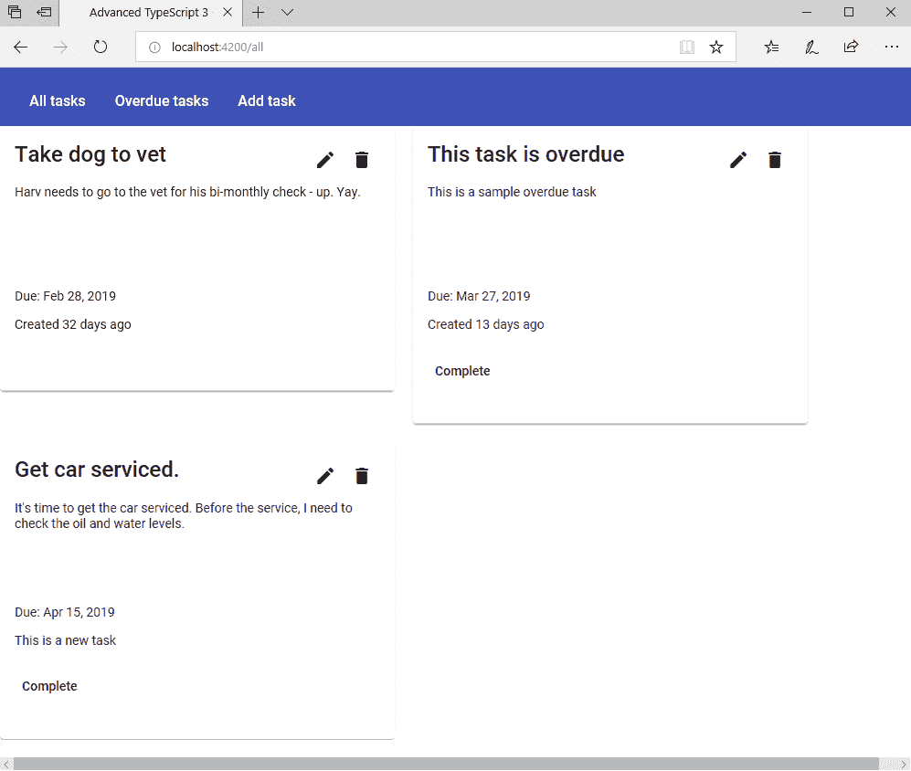

# 五、使用 GraphQL 和 Apollo 的 Angular ToDo 应用

有许多不同的方法可以从客户端向服务器来回传递数据。 在本章中，我们将看看如何使用 GraphQL 从服务器中挑选数据，然后从 Angular 客户端发送和修改数据。 我们还将了解如何利用 GraphQL 计算出的值。 在上一章内容的基础上，我们将再次使用 Angular Material 作为我们的用户界面，看看如何使用 Angular 路由来提供不同的内容。

本章将涵盖以下主题:

*   理解 GraphQL-to-REST 关系
*   创建一个可重用的数据库类
*   预填充数据和使用单例
*   创建一个 GraphQL 模式
*   使用`type-graphql`设置 GraphQL 类型
*   创建带有查询和更改的 GraphQL 解析器
*   使用 Apollo Server 作为我们的应用服务器
*   创建一个 GraphQL Angular 客户端应用
*   向客户机添加阿波罗支持
*   在 Angular 中使用路由
*   使用 Angular 验证控制输入
*   将 GraphQL 突变从客户机发送到服务器
*   将 GraphQL 查询从客户机发送到服务器
*   在只读模板和可编辑模板之间切换

# 技术要求

完成的项目可从[https://github.com/PacktPublishing/Advanced-TypeScript-3-Programming-Projects/tree/master/Chapter05](https://github.com/PacktPublishing/Advanced-TypeScript-3-Programming-Projects/tree/master/Chapter05)下载。

下载项目后，您必须使用`npm install`命令安装软件包要求。

# 理解 GraphQL-to-REST 关系

网络技术的一个伟大之处在于，你可以通过多种方式解决突然出现的常见问题。 对于 REST，我们使用了一种简单但功能强大的方式来从客户端与服务器进行通信; 然而，这并不是我们能做到这一点的唯一方法。 REST 解决了一组问题，但也引入了一些新问题，这些新问题需要新的技术来解决。 需要解决的三个问题是:

*   为了构建复杂的信息，我们可能最终不得不对 REST 服务器进行多次 REST 调用。 例如，对于一个购物应用，我们可以使用一个 REST 调用来获取一个人的姓名，使用另一个 REST 调用来获取他们的地址，需要使用第三个调用来获取他们的购物篮详细信息。
*   随着时间的推移，我们可能会经历多个版本的 REST API。 让我们的客户跟踪版本控制可能是有限制的，这意味着，在我们的 API 开始时，我们还必须定义我们的版本控制体验将会是什么样的。 除非我们的 api 遵循相同的版本标准，否则这可能会导致代码混乱。
*   这些 REST 调用最终可能会带来比我们实际需要多得多的信息。 因此，当我们进行这些详细的调用时，我们实际上只需要 20 或 30 个字段中的 3 或 4 个信息项。

关于 REST 需要了解的一件事是，它实际上不是一项技术。 考虑 REST 的一个好方法是，它更像是一种公认的体系结构标准，可以使用几乎任何传输机制作为通信手段。 好的，澄清一下，虽然我说它是一个标准，但实际上很少有人遵循 REST 的原始概念，这意味着我们也需要理解开发人员的意图。 例如，当我们通过 REST 发布更新时，我们是使用`PUT HTTP`动词还是`POST`动词? 如果我们想要使用第三方 API，了解这个层次的细节是至关重要的。

最初是由 Facebook 开发的，但现在由 GraphQL 基金会维护([https://foundation.graphql.org/](https://foundation.graphql.org/))，GraphQL 是解决这类问题的一个很好的机制。 与纯 REST 不同，GraphQL 只是一种带有工具支持的查询语言。 GraphQL 的核心思想是，我们的代码将与字段交互，只要有如何获得这些字段的定义，我们就可以编写任意复杂的查询来一次从多个位置检索数据，或者修改数据来更新数据。 设计正确的 GraphQL 系统会处理版本控制需求和字段，这些字段可以根据需要添加和弃用。

使用 GraphQL，我们只能通过查询检索所需的信息。 这避免了我们在客户端过度订阅信息。 类似地，我们的查询可以从多个位置将结果拼接在一起，这样我们就不必执行多次往返。 我们从客户机发送查询，并让 GraphQL 服务器检索相关的数据项。 我们也不必担心客户机代码中的 REST 端点。 我们只需与 GraphQL 服务器通信，让查询处理数据。

在这一章,我们将看看如何使用阿波罗 GraphQL 引擎(https://www.apollographql.com/),非常有用的`TypeGraphQL`库(https://typegraphql.ml/),它提供了一个方便的方式针对 GraphQL TypeScript。 有了阿波罗，我们就有了一个完整的由前到后的基础设施来完全管理我们的 GraphQL 行为。 除了提供客户端库，我们还可以在服务器上使用 Apollo，也可以在 iOS 和 Android 应用上使用。

Note that GraphQL is not intended to completely replace RESTful services. There are many cases where we would want REST and GraphQL to work together, side by side. It could be that we have a REST service that communicates with our GraphQL implementation and caches information for us, for example. For the purposes of this chapter, however, we are going to be concentrating purely on creating a GraphQL implementation.

# 项目概述

在本章中，我们的项目将向我们介绍如何在服务器端和客户端编写 GraphQL 应用。 我们还将开始研究 TypeScript 3 中为了创建 ToDo 应用而引入的特性。 我们将扩展上一章中的 Angular 概念，介绍客户端路由，它将允许我们显示不同的内容，并在页面之间有效导航。 我们还将介绍 Angular 验证。

与 GitHub 代码一起工作，本章中的任务需要大约四个小时才能完成。

当完成时，应用应该是这样的:



# 开始项目

和上一章一样，本章将使用 Node.js(可从[https://nodejs.org](https://nodejs.org)获得)。 我们还将使用以下组件:

*   Angular CLI(我使用的是 7.2.2 版本)
*   `express`(版本 4.16.4 或以上)
*   `mongoose`(版本 5.4.8 或更高)
*   `@types/cors`(版本 2.8.4 或更高)
*   `@types/body-parser`(版本 1.17.0 或更高)
*   `@types/express`(版本 4.16.0 或以上)
*   `@types/mongodb`(版本 3.1.19 或更高)
*   `@types/mongoose`(5.3.11 或更高版本)
*   `type-graphql`(版本 0.16.0 或更高)
*   `@types/graphql`(版本 14.0.7 或以上)
*   `apollo-server`(2.4.0 或更高版本)
*   `apollo-server-express`(2.4.0 或更高版本)
*   `guid-typescript`(版本 1.0.9 或更高)
*   `reflect-metadata`(版本 0.1.13 或以上)
*   `graphql`(14.1.1 或更高版本)
*   `apollo-angular`(版本 1.5.0 或更高)
*   `apollo-angular-link-http`(版本 1.5.0 或更高)
*   `apollo-cache-inmemory`(版本 1.4.3 或更高)
*   `apollo-client`(版本 2.4.13 或以上)
*   `graphql`(14.1.1 或更高版本)
*   `graphql-tag`(版本 2.10.1 或以上)

除了使用 MongoDB 之外，我们还将使用 Apollo 来提供 GraphQL 数据。

# 用 GraphQL 和 Angular 创建一个 ToDo 应用

按照我们现在的习惯，我们将从定义需求开始:

*   用户必须能够添加一个由标题、描述和任务截止日期组成的 ToDo 任务
*   验证将确保这些项目始终设置好，并且截止日期不能在今天之前
*   用户将能够看到所有任务的列表
*   用户将能够删除任务
*   用户将能够看到过期任务(其中过期任务是尚未完成且到期日期已过的任务)
*   用户将能够编辑任务
*   使用 GraphQL 向服务器或从服务器传输数据
*   传输的数据将被保存到 MongoDB 数据库中

# 创建应用

对于我们的 ToDo 应用，我们将从服务器实现开始。 和上一章一样，我们将创建一个独立的客户端和服务器文件夹结构，并将 Node.js 代码添加到服务器代码中。

我们将开始使用数据库代码创建一个 GraphQL 服务器。 我们的客户端的所有数据都来自数据库，所以我们有必要把所有需要的东西都放在合适的位置。 和上一章一样，我们将安装 MongoDB 所需的`mongoose`包:

```js
npm install mongoose @types/mongoose --save-dev
```

Something to bear in mind when choosing which command to use to install packages relates to the use of `--save` versus `--save-dev`. These are both used to install packages, but there is a practical difference between them and how we would expect the application to be deployed based on them. When we use `--save`, we are stating that this package must be downloaded for the application to run, even if we install the application on another computer. This can be wasteful if we intend to deploy our application to a machine that already has the correct version of the package installed globally. The alternative case is to use `--save-dev` to download and install the package as something called a development dependency. In other words, the package is installed locally for the developer.

有了这些，我们将开始编写我们在前一章介绍的`Mongo`类的一个变体。 我们不打算重用这个实现的原因是，在我们继续添加通用数据库框架之前，我们将开始引入 TypeScript 3 特有的特性。

类的最大变化是我们将更改`mongoose.connect`方法的签名。 其中一项更改告诉 Mongoose 使用一种新的格式 URL 解析器，但另一项更改与我们用作回调的事件签名有关:

```js
public Connect(): void {
  mongoose.connect(this.url, {useNewUrlParser: true}, (e:unknown) => {
    if (e) {
      console.log(`Unable to connect ` + e);
    } else {
      console.log(`Connected to the database`);
    }
  });
}
```

在前一章中，我们应该记住我们的回调函数有一个签名`e:any`。 现在，我们将它改为使用`e:unknown`。 这是 TypeScript 3 中引入的一个新类型，它允许我们添加额外的类型安全级别。 在很大程度上，我们可以认为`unknown`类型与`any`相似，因为我们可以给它分配任何类型。 但是，我们不能在没有类型断言的情况下将其赋值给另一个类型。 我们将在整个代码中开始将`any`类型移动到`unknown`。

到目前为止，我们已经使用了许多接口来提供类型的形状。 我们也可以将同样的技术应用到 Mongo 模式，这样我们就可以将 ToDo 模式的形状描述为一个标准的 TypeScript 接口，然后将它映射到一个模式。 我们的界面将会很简单:

```js
export interface ITodoSchema extends mongoose.Document {
  Id: string,
  Title: string,
  Description: string,
  DueDate: Date,
  CreationDate: Date,
  Completed: boolean,
}
```

我们将创建一个`mongoose`模式，它将被映射到数据库中。 模式只是使用 MongoDB 所期望的类型声明将要存储的信息。 例如，我们的`ITodoSchema`将`Id`暴露为`string`，但这不是 MongoDB 所期望的类型; 相反，它期望看到`String`。 知道了这一点，创建一个从`ITodoSchema`到`TodoSchema`的映射就足够简单了，如下所示:

```js
export const TodoSchema = new Schema({
  Id: String,
  Title: String,
  Description: String,
  DueDate: Date,
  CreationDate: Date,
  Completed: Boolean,
});
```

现在我们有了一个模式模型，可以用来查询、更新等等。 当然，《蒙戈》并不局限于一个基模。 如果我们想使用更多，没有什么可以阻止我们这样做。

关于我们的模式将要包含什么注释——`Title`和`Description`字段相当简单，因为它们包含关于我们的 todo 项是关于什么的细节。 `DueDate`简单地告诉我们项目什么时候到期，`CreationDate`告诉我们什么时候创建了这个记录。 我们有一个`Completed`标志，当用户完成任务时，将触发该标志来表示。

有趣的领域是`Id`领域。 这个字段不同于 Mongo`Id`字段，后者仍然是内部生成的。 模式`Id`字段被赋值为**global Unique IDentifier**(**GUID**)，这是一个唯一的字符串标识符。 我们希望 UI 添加这个字段的原因是，我们将在数据库查询中使用它作为一个已知字段，我们希望客户端在需要执行任何往返之前知道`Id`的值。 当我们讨论 Angular 方面时，我们将看到这个字段是如何填充的。

我们需要创建一个数据库模型，将`ITodoSchema`的`mongoose.Document`实例映射到`TodoSchema`。 这是一个简单的任务，当使用`mongoose.model`:

```js
export const TodoModel = mongoose.model<ITodoSchema>('todo', TodoSchema, 'todoitems', false);
```

Case is very important when we create our `mongoose.model`. As well as `mongoose.model`, we also have `mongoose.Model` available, which we would have to instantiate with a `new` statement.

现在我们可以编写一个相对通用的数据库类了。 但是，我们有一个约束—我们希望模式有一个`Id`字段。 这个约束纯粹是为了方便我们专注于演示应用的逻辑。

我们要做的第一件事是创建一个泛型基类，接受`mongoose.Document`作为类型。 当我们意识到我们最终将使用的是`ITodoSchema`时，可能并不会感到惊讶。 构造函数将接受一个我们可以用于各种数据库操作的模型。 同样，我们已经创建了模型，我们将使用`TodoModel`:

```js
export abstract class DataAccessBase<T extends mongoose.Document> {
  private model: Model;
  constructor(model: Model) {
    this.model = model;
  }
}
```

这个类的具体实现非常简单:

```js
export class TodoDataAccess extends DataAccessBase<ITodoSchema> {
  constructor() {
    super(TodoModel);
  }
}
```

我们现在要开始添加功能到`DataAccessBase`。 我们将从一个获取与模式匹配的所有记录的方法开始。 在这个阶段，我们应该对承诺感到足够高兴，所以返回`Promise`类型应该是很自然的。 在本例中，`Promise`类型将是一个`T`数组，我们知道它映射到`ITodoSchema`。

在内部，我们调用模型上的`find`方法来检索所有记录，一旦查找完成，我们就回调结果:

```js
GetAll(): Promise<T[]> {
  return new Promise<T[]>((callback, error) => {
    this.model.find((err: unknown, result: T[]) => {
      if (err) {
        error(err);
      }
      if (result) {
       callback(result);
      }
    });
 });
}
```

添加一条记录也很简单。 唯一真正的区别是，我们调用`model.create`方法并返回一个`boolean`值，表明我们成功了:

```js
Add(item: T): Promise<boolean> {
  return new Promise<boolean>((callback, error) => {
    this.model.create(item, (err: unknown, result: T) => {
      if (err) {
        error(err);
      }
      callback(!result);
    });
  });
}
```

除了检索所有记录外，我们还可以选择检索单个记录。 与`GetAll`方法的最大区别在于`find`方法使用的是搜索标准:

```js
Get(id: string): Promise<T> {
  return new Promise<T>((callback, error) =>{
    this.model.find({'Id': id}, (err: unknown, result: T) => {
      if (err) {
        error(err);
      }
      callback(result);
    });
  });
}
```

最后，我们可以删除或更新记录。 它们的写法非常相似:

```js
Remove(id: string): Promise<void> {
  return new Promise<void>((callback, error) => {
    this.model.deleteOne({'Id': id}, (err: unknown) => {
      if (err) {
        error(err);
      }
      callback();
    });
  });
}
Update(id: string, item: T): Promise<boolean> {
  return new Promise<boolean>((callback, error) => {
    this.model.updateOne({'Id': id}, item, (err: unknown)=>{
      if (err) {
        error(err);
      }
      callback(true);
    });
  })
}
```

有了实际的数据库代码之后，我们现在可以将注意力转向访问数据库了。 我们要考虑的是,我们可能会有大量的 todo 项建立随着时间的推移,如果我们尝试从数据库读他们每次我们需要他们,我们会拖慢系统添加越来越多的行动计划。 为此，我们将创建一个基本的缓存机制，该机制将在服务器启动过程中数据库完成加载后立即填充。

因为缓存是预填充的，所以我们想从 GraphQL 和服务器中使用相同的类实例，所以我们要创建一个叫做**单例**的东西。 单例是另一种说法，我们将在内存中只有一个类的实例，并且每个类将使用相同的实例。 为了防止其他类能够创建自己的实例，我们将使用一些技巧。

我们要做的第一件事是用私有构造函数创建类。 私有构造函数意味着只能在类本身内部实例化类:

```js
export class Prefill {
  private constructor() {}
}
```

我们只能从类本身创建类，这似乎有违直觉。 毕竟，如果不能实例化类，如何访问任何成员呢? 这样做的技巧是添加一个字段来保存对类实例的引用，然后提供一个公共静态属性来访问该实例。 如果类还不可用，public 属性会负责实例化类，所以我们总是能够访问类的实例:

```js
private static prefill: Prefill;
public static get Instance(): Prefill {
  return this.prefill || (this.prefill = new this());
}
```

现在我们有了访问将要编写的方法的方法，所以让我们从创建一个方法来填充可用项的列表开始。 由于这可能是一个长时间运行的操作，我们将使它异步:

```js
private items: TodoItems[] = new Array<TodoItem>();
public async Populate(): Promise<void> {
  try
  {
    const schema = await this.dataAccess.GetAll();
    this.items = new Array<TodoItem>();
    schema.forEach(item => {
      const todoItem: TodoItem = new TodoItem();
      todoItem.Id = item.Id;
      todoItem.Completed = item.Completed;
      todoItem.CreationDate = item.CreationDate;
      todoItem.DueDate = item.DueDate;
      todoItem.Description = item.Description;
      todoItem.Title = item.Title;
      this.items.push(todoItem);
    });
  } catch(error) {
    console.log(`Unfortunately, we couldn't retrieve all records ${error}`);
  }
}
```

这个方法通过调用`GetAll`来检索 MongoDB 数据库中的所有记录。 一旦我们有了这些记录，我们将对它们进行迭代，并创建它们的副本，将其推入数组中。

The `TodoItem` class is a special class that we are going to use to map types to GraphQL. We will look at this class shortly when we start writing our GraphQL server functionality.

填充项数组很好，但是如果在代码的其他地方无法访问项，那么这个类就没有多大帮助。 幸运的是，访问元素就像添加一个`Items`属性一样简单:

```js
get Items(): TodoItem[] {
  return this.items;
}
```

# 创建 GraphQL 模式

数据库代码就绪后，现在可以开始编写 GraphQL 服务器了。 在为本章编写示例代码时，我最早做出的决定之一是尽可能地简化代码编写过程。 如果我们看看 Facebook 发布的参考样本，我们会发现代码可能是冗长乏味的:

```js
import {
  graphql,
  GraphQLSchema,
  GraphQLObjectType,
  GraphQLString
} from 'graphql';

var schema = new GraphQLSchema({
  query: new GraphQLObjectType({
    name: 'RootQueryType',
    fields: {
      hello: {
        type: GraphQLString,
        resolve() {
          return 'world';
        }
      }
    }
  })
});
```

这个例子来自[https://github.com/graphql/graphql-js](https://github.com/graphql/graphql-js)。 我们可以看到，我们在很大程度上依赖于特殊类型，这些类型不会一一映射到 TypeScript 类型。

因为我们想让我们的代码对 typescript 更加友好，所以我们将使用`type-graphql`。 我们将通过`npm`、`graphql`类型定义和`reflect-metadata`安装它:

```js
npm install type-graphql @types/graphql reflect-metadata --save
```

在这个阶段，我们也应该设置我们的`tsconfig`文件，看起来像这样:

```js
{
  "compileOnSave": false,
  "compilerOptions": {
    "target": "es2016", 
    "module": "commonjs",
    "lib": ["es2016", "esnext.asynciterable", "dom"],
    "outDir": "./dist",
    "noImplicitAny": true,
    "esModuleInterop": true,
    "experimentalDecorators": true,
    "emitDecoratorMetadata": true,
  }
}
```

The main thing worth mentioning in this `tsconfig` file relates to the fact that `type-graphql` uses features that are only found in ES7, so we need to use ES2016 in the lib (ES7 maps onto ES2016).

# 设置 GraphQL 类型

正如我们刚才看到的，GraphQL 类型的设置可能有点复杂。 借助`type-graphql`和一些方便的装饰器，我们将创建一个模式来表示单个项。

我们现在还不需要为创建表示多个项的类型而担心。 我们的项目将包括以下字段:

*   `Id`(默认为空字符串)
*   `Title`
*   `Description`(我们将把它设置为一个可空值。 当我们创建 UI 时，我们将添加验证以确保我们总是提供一个描述。)
*   任务的截止日期(同样，这是可空的)
*   创建任务时
*   自任务创建以来的天数(在查询数据时将自动计算)
*   无论任务是否已经完成

如果我们仔细观察，就会发现这里的字段与我们在 MongoDB 模式中定义的字段非常接近。 这是因为我们将从数据库填充 GraphQL 类型，并直接从这些类型更新数据库。

就像我们现在习惯做的那样，我们将从一个简单的类开始:

```js
export class TodoItem {
}
```

我提到过，我们将在这个类中使用装饰器。 我们将用`@ObjectType`修饰类定义，它使我们能够创建复杂类型。 作为优秀的开发人员，我们还将提供一个描述，以便我们类型的消费者有关于它所代表的内容的文档。 现在，我们的类定义是这样的:

```js
@ObjectType({description: "A single to do"})
export class TodoItem {
}
```

我们将一步一步地向类型添加字段。 首先，我们要添加`Id`字段，它与数据库中的`Id`字段相匹配:

```js
@Field(type=>ID)
Id: string="";
```

同样，我们为这个字段提供了一个装饰器，它将告诉`type-graphql`如何将我们的类转换为 GraphQL 类型。 通过应用`type=>ID`，我们使用了特殊的 GraphQL`ID`类型。 该类型是一个映射到唯一值的字符串。 毕竟，它是一个标识字段，并且约定标识字段必须是惟一的。

我们将添加三个空字段，接下来是`Description`、`DueDate`和`CreationDate`字段。 当我们在本章的后面开始添加 Angular 验证时，我们将会看到，我们不会真的允许在这些类型中添加空值，但重要的是，我们要看看如何为我们创建的任何未来的 GraphQL 类型添加可空类型:

```js
@Field({ nullable: true, description: "The description of the item." })
Description?: string;
@Field({ nullable: true, description: "The due date for the item" })
DueDate?: Date;
@Field({ nullable: true, description: "The date the item was created" })
CreationDate: Date;
```

我们确实有一些更简单的字段可以使用:

```js
@Field()
Title: string;
@Field(type => Int)
DaysCreated: number;
@Field()
Completed: boolean;
```

我们的`TodoItem`表示构成整个查询类型的模式，现在看起来像这样:

```js
@ObjectType({ description: "A single to do" })
export class TodoItem {
  constructor() {
    this.Completed = false;
  }
  @Field(type=>ID)
  Id: string = "";
  @Field()
  Title: string;
  @Field({ nullable: true, description: "The description of the item." })
  Description?: string;
  @Field({ nullable: true, description: "The due date for the item" })
  DueDate?: Date;
  @Field({ nullable: true, description: "The date the item was created" })
  CreationDate: Date;
  @Field(type => Int)
  DaysCreated: number;
  @Field()
  Completed: boolean;
}
```

除了为查询提供一个类，我们还需要一个类来表示将要用于更改后续查询状态的数据，以及用于更新数据库的数据。

当我们改变状态时，我们正在改变它。 我们希望这些更改在服务器重启时能够持续，这样它们将更新数据库和运行时我们将要缓存的状态。

我们将要使用的突变类与我们的`TodoItem`类非常相似。 关键的区别在于，我们使用`@InputType`代替`@ObjectType`，并且类实现了`TodoItem`的泛型`Partial`类型。 另一个区别是这个类没有`DaysCreated`字段，因为它将由查询计算，所以我们不需要添加任何值来保存它:

```js
@InputType()
export class TodoItemInput implements Partial<TodoItem> {
  @Field()
  Id: string;
  @Field({description: "The item title"})
  Title: string = "";
  @Field({ nullable: true, description: "The item description" })
  Description?: string = "";
  @Field({ nullable: true, description: "The item due date" })
  DueDate?: Date;
  @Field()
  CreationDate: Date;
  @Field()
  Completed: boolean = false;
}
```

If you don't know what `Partial` does, it simply makes all the properties of `TodoItem` optional. This lets us tie our new mutation class back to our old class without having to supply every property. 

# 创建 GraphQL 解析器

`TodoItem`和`TodoItemInput`类旨在为我们提供描述字段、类型和参数的模式。 虽然它们是 GraphQL 拼图的重要组成部分，但我们还有一个缺失的部分—在 GraphQL 服务器上执行函数的能力。

我们需要一种方法来解析类型的字段。 对于 GraphQL，解析器是表示单个字段的东西。 获取我们需要的数据,有效地给 GraphQL 服务器详细说明如何将查询转化为数据项(我们可以把它作为的原因之一,我们有单独的变异模式数据查询数据不能使用相同的逻辑变异字段作为查询字段)。 由此，我们可以得出字段和解析器之间存在一对一的映射。

使用`type-graphql`，我们可以轻松地创建复杂的解析器关系和操作。 我们将从定义类开始。

`@Resolver`装饰器告诉我们，这个类的行为方式与 REST 类型中的控制器类相同:

```js
@Resolver(()=>TodoItem)
export class TodoItemResolver implements ResolverInterface<TodoItem>{
}
```

严格地说，`ResolverInterface`对我们的类来说不是必需的，但当我们向`DaysCreated`字段添加字段解析器时，我们将把它作为一个安全网。 该字段将返回今天的日期和创建任务的日期之间的差值。 因为我们正在创建一个字段解析器，`ResolverInterface`检查字段是否有对象类型的`@Root`装饰器作为参数，并且返回类型是正确的类型。

我们的`DaysCreated`域解析器用`@FieldResolver`装饰，看起来像这样:

```js
private readonly milliSecondsPerDay = 1000 * 60 * 60 * 24;
@FieldResolver()
DaysCreated(@Root() TodoItem: TodoItem): number {
  const value = this.GetDateDifference(...[new Date(), TodoItem.CreationDate]);
  if (value === 0) {
    return 0;
  }
  return Math.round(value / this.milliSecondsPerDay);
}
private GetDateDifference(...args: [Date, Date]): number {
  return Math.round(args[0].valueOf() - args[1].valueOf());
}
```

虽然这些方法看起来很复杂，但实际上非常简单。 我们的`DaysCreated`方法接收当前的`TodoItem`，并使用`GetDateDifference`计算出今天与`CreationDate`值之间的差值。

我们的`type-graphql`解析器还可以定义我们想要执行的查询和突变。 对我们来说，定义一种检索所有 todo 项的方法是有用的。 我们将创建一个带有`@Query`修饰的方法，以确定这将是一个查询操作。 因为查询有可能返回多个项，所以我们告诉解析器返回类型是一个`TodoItem`类型的数组。 就像我们之前创建`Prefill`类的辛苦工作一样，我们的方法就是这样简单:

```js
@Query(() => [TodoItem], { description: "Get all the TodoItems" })
async TodoItems(): Promise<TodoItem[]> {
  return await Prefill.Instance.Items;
}
```

我们希望允许用户执行的操作之一是只查询过期的记录。 我们可以利用与上一个查询类似的逻辑，但我们将过滤那些已经超过到期日期的未完成记录:

```js
@Query(() => [TodoItem], { description: "Get items past their due date" })
async OverdueTodoItems(): Promise<TodoItem[]> {
  const localCollection = new Array<TodoItem>();
  const testDate = new Date();
  await Prefill.Instance.Items.forEach(x => {
    if (x.DueDate < testDate && !x.Completed) {
      localCollection.push(x);
    }
  });
  return localCollection;
}
```

严格地说，对于像这样塑造数据的操作，我通常会将过滤逻辑委托给数据层，以便它只返回适当的记录。 在本例中，我决定在解析器中进行筛选，这样我们就可以看到相同的数据源可以按照我们需要的任何方式被塑造。 毕竟，我们可能从一个不让我们以合适的方式塑造它的源获取了这些数据。

One thing I must emphasize is that we must import reflect-metadata before we attempt to execute any queries or mutations. This has to happen because of the reliance of reflection when working with the decorators. Without reflect-metadata, we will not be able to use the decorators since they use reflection internally.

具有查询数据的能力固然很好，但是解析器还应该能够对数据执行更改。 为此，我们将添加解析器来添加、更新和删除新的 todo 项目，以及在用户决定任务完成时设置`Completed`标志。 我们将从`Add`方法开始。

由于这是一个突变，`type-graphql`提供了`@Mutation`修饰符。 我们的方法将接受一个`TodoItemInput`参数。 这是通过一个匹配的`@Arg`装饰器传入的。 我们需要提供这个显式的`@Arg`的原因是，GraphQL 希望突变将参数作为参数。 通过使用`@Arg`，我们为他们提供了所需的环境。 在提供突变的同时，我们还期望提供一个返回类型，因此正确地获得突变和方法实际返回类型之间的映射是很重要的:

```js
@Mutation(() => TodoItem)
async Add(@Arg("TodoItem") todoItemInput: TodoItemInput): Promise<TodoItem> {
}
```

我们的突变方法的特点之一是，除了更新`Prefill`项外，我们还将更新数据库，这意味着我们必须将方法中的输入转换为`ITodoSchema`类型。

为了帮助我们，我们将使用以下简单的方法:

```js
private CreateTodoSchema<T extends TodoItem | TodoItemInput>(todoItem: T): ITodoSchema {
  return <ITodoSchema>{
    Id: todoItem.Id,
    CreationDate: todoItem.CreationDate,
    DueDate: todoItem.DueDate,
    Description: todoItem.Description,
    Title: todoItem.Title,
    Completed: false
  };
}
```

We accept both `TodoItem` and `TodoItemInput` because we are going to use the same method to create a record that will be acceptable to our database layer. Since the source of that record could come from either finding a particular record from the `Prefill` items, or having been passed over from our UI, we need to make sure that we can handle both cases.

`Add`方法的第一部分涉及创建一个`TodoItem`项，该项将存储在`Prefill`集合中。 将项添加到集合后，我们将向数据库添加记录。 我们完整的`Add`方法如下所示:

```js
@Mutation(() => TodoItem)
async Add(@Arg("TodoItem") todoItemInput: TodoItemInput): Promise<TodoItem> {
  const todoItem = <TodoItem> {
    Id : todoItemInput.Id,
    CreationDate : todoItemInput.CreationDate,
    DueDate : todoItemInput.DueDate,
    Description : todoItemInput.Description,
    Title : todoItemInput.Title,
    Completed : todoItemInput.Completed
  };
  todoItem.Completed = false;
  await Prefill.Instance.Items.push(todoItem);
  await this.dataAccess.Add(this.CreateTodoSchema(todoItem));
  return todoItem;
}
```

现在我们知道了如何添加记录，我们可以将注意力转向使用突变来更新记录。 我们已经有了大部分的代码基础设施，所以更新变得更加简单。 `Update`方法通过搜索与我们修改的`Id`匹配的项来检索已经缓存的项。 如果我们发现了这个记录，在更新匹配的数据库记录之前，我们用相关的`Title`、`Description`和`DueDate`更新它:

```js
@Mutation(() => Boolean!)
async Update(@Arg("TodoItem") todoItemInput: TodoItemInput): Promise<boolean> {
  const item: TodoItem = await Prefill.Instance.Items.find(x => x.Id === todoItemInput.Id);
  if (!item) return false;
  item.Title = todoItemInput.Title;
  item.Description = todoItemInput.Description;
  item.DueDate = todoItemInput.DueDate;
  this.dataAccess.Update(item.Id, this.CreateTodoSchema(item));
  return true;
}
```

删除一条记录并不比`Update`方法更复杂。 为了删除该记录，我们只需要提供`Id`值，因此我们的方法签名从复杂类型作为输入移动到简单类型——在本例中，是一个字符串。 我们搜索缓存的条目，以找到与`Id`匹配的记录的索引，找到后，我们使用 splice 方法删除缓存的条目。 当我们在数组上使用 splice 时，我们实际上是在说删除从相关索引开始的条目并删除我们选择的条目数量。 因此，为了删除`1`记录，我们提供`1`作为该方法的第二个参数。 我们需要确保我们的数据库是一致的，所以我们也删除了数据库条目:

```js
@Mutation(() => Boolean!)
async Remove(@Arg("Id") id: string): Promise<boolean> {
  const index = Prefill.Instance.Items.findIndex(x => x.Id === id);
  if (index < 0) {
    return false;
  }
  Prefill.Instance.Items.splice(index, 1);
  await this.dataAccess.Remove(id);
  return true;
}
```

我们感兴趣的最后一个突变是将`Completed`标记设置为`true`的突变。 这个方法很大程度上是`Remove`和`Update`方法的组合，因为它遵循相同的逻辑来标识一个记录并更新它。 然而，与`Remove`方法一样，它只需要`Id`作为输入参数。 因为我们只打算更新`Completed`字段，这是我们在这个方法中将要涉及的唯一字段:

```js
@Mutation(() => Boolean!)
async Complete(@Arg("Id") id: string) : Promise<boolean> {
  const item: TodoItem = await Prefill.Instance.Items.find(x => x.Id === id);
  if (!item) return false;
  item.Completed = true;
  await this.dataAccess.Update(item.Id, this.CreateTodoSchema(item));
  return true;
}
```

We could have chosen to reuse the `Update` method and set `Completed` to true from our client code, but that would have used a more complex call to achieve a much simpler end. By using a separate method, we are ensuring that we have code that does one thing and one thing only. This keeps us to the principle of single responsibility that we are interested in.

解析器和模式就绪后，我们现在可以将注意力转向添加代码，以便为 GraphQL 服务器提供实际服务。

# 使用阿波罗服务器作为我们的服务器

我们将为这个项目创建一个新的服务器实现，而不是重用前一章中的任何服务器基础设施。 Apollo 提供了自己的服务器实现(称为 Apollo server)，我们将使用它来代替 Express。 像往常一样，我们将从引入必要的类型开始，然后用类定义创建类。 在构造函数中，我们将引入一个对`Mongo`数据库类的引用。

Apollo Server is part of the overall Apollo GraphQL strategy for providing out-of-the-box GraphQL support. The server can either stand on its own or work with server frameworks such as Express for serving up self-documenting GraphQL data. The reason we are going to use Apollo Server is because it has built-in support for working with GraphQL schemas. If we were to try and add this support ourselves, we would end up redoing what we get for free from Apollo Server.

首先，我们要导入我们的类型:

```js
npm install apollo-server apollo-server-express --save
```

然后，我们要写我们的`server`类:

```js
export class MyApp {
  constructor(private mongo: Mongo = new Mongo()) { }
}
```

我们的服务器将公开一个`Start`方法，该方法将负责连接到数据库并启动我们的阿波罗服务器:

```js
public async Start(): Promise<void> {
  this.mongo.Connect();

  await Prefill.Instance.Populate();

  const server = new ApolloServer({ schema, playground: true });
  await server.listen(3000);
}
```

在创建 Apollo Server 实例时，我们指出要使用`GraphQLSchema`，但没有定义关于该模式的任何内容。 我们使用`buildSchema`函数，该函数接受一系列选项，并使用它们引入 Apollo Server 将使用的模式。 `resolvers`接受一个 GraphQL 解析器数组，因此我们将提供`TodoItemResolver`作为我们想要使用的解析器。 当然，这里的含义是我们可以使用多个解析器。

标志表明我们是否要验证传递给解析器参数的对象。 因为我们使用的是简单的对象和类型，所以我们将它设置为`false`。

为了验证我创建的 GQL，我喜欢使用`emitSchemaFile`发出模式。 它使用路径操作来构建完全限定的路径名。 在本例中，我们将解析到`dist`文件夹，在那里我们将输出`apolloschema.gql`文件:

```js
const schema: GraphQLSchema = await buildSchema({
  resolvers: [TodoItemResolver],
  validate: false,
  emitSchemaFile: path.resolve(__dirname, 'apolloschema.gql')
});
```

现在我们已经完成了服务器端的编码，我们可以添加`new MyApp().Start();`来启动和运行应用。 当我们构建并运行服务器端时，它将在`http://localhost:3000`上启动启用 apollo 的 GraphQL 服务器的实例。 我们确实还有一个小惊喜，它与我们提供给阿波罗服务器选项的最后一个参数有关，即`playground: true`。 游乐场是一个视觉编辑器区域，让我们运行`graphql`查询并查看它们带来的结果。

I would recommend switching the playground off in production code. For testing purposes, however, it is an invaluable aid for trying out queries.

为了检查我们是否正确地连接了所有内容，请尝试在查询窗口中输入一个 GraphQL 查询。 在输入查询时，请记住，仅仅因为它与 JavaScript 对象表面上相似，所以不需要使用单独的条目。 下面是一个示例查询。 这个查询练习了我们在`TodoItemResolver`中创建的`TodoItems`查询:

```js
query {
  TodoItems {
    Id
    Title
    Description
    Completed
    DaysCreated
  }
}
```

# GraphQL Angular 客户端

就像我们在上一章中做的那样，我们将创建一个使用 Angular Material 作为 UI 的 Angular 客户端。 同样，我们将使用`ng new`命令来创建一个新应用，并将前缀设置为`atp`。 因为我们想要在应用中添加对路由的支持，所以我们要在命令行中添加一个额外的`--routing`参数。 我们这样做是因为它添加了必要的`AppRoutingModule`项到`app.module.ts`，并为我们创建了`app-routing.module.ts`路由文件:

```js
ng new Chapter05 --style scss --prefix atp --routing true
```

在前一章中，即使我们使用了 Material，我们也没有利用它的路由优势。 在继续使用 Bootstrap 之前，我们将最后一次使用 Material，所以我们需要在我们的应用中添加对 Material 的支持(不要忘记在提示时添加对浏览器动画的支持):

```js
ng add @angular/material @angular/cdk @angular/animation @angular/flex-layout
```

在这个阶段，我们的`app.module.ts`文件应该是这样的:

```js
import { BrowserModule } from '@angular/platform-browser';
import { NgModule } from '@angular/core';
import { AppRoutingModule } from './app-routing.module';
import { AppComponent } from './app.component';
import { BrowserAnimationsModule } from '@angular/platform-browser/animations';
@NgModule({
  declarations: [
    AppComponent
  ],
  imports: [
    BrowserModule,
    AppRoutingModule,
    BrowserAnimationsModule
  ],
  providers: [],
  bootstrap: [AppComponent]
})
export class AppModule { }
```

我们需要将 Material 模块导入添加到我们的`imports`数组中:

```js
HttpClientModule,
HttpLinkModule,
BrowserAnimationsModule,
MatToolbarModule,
MatButtonModule,
MatSidenavModule,
MatIconModule,
MatListModule,
FlexLayoutModule,
HttpClientModule,
MatInputModule,
MatCardModule,
MatNativeDateModule,
MatDatepickerModule,
```

We add `MatNativeDateModule` alongside `MatDatepickerModule` because of the way that the Material date-picker was built. It does not provide any hard assumptions about the way that dates will be implemented, so we need to import an appropriate date representation. While we could write our own date handling module implementation, we are going to have real success by bringing in `MatNativeDateModule`. If we failed to do this, we would end up with a runtime error telling us `No provider found for DateAdapter`.

# 添加客户端 Apollo 支持

在开始创建用户界面之前，我们将设置阿波罗集成的客户端。 虽然我们可以使用`npm`安装阿波罗的所有独立部件，但我们将再次使用`ng`的力量:

```js
ng add apollo-client
```

回到`AppModule`，我们将设置阿波罗与服务器交互。 对于我们来说，`AppModule`构造器是注入 Apollo 以创建到服务器的连接的完美场所。 我们的构造函数开始看起来像这样:

```js
constructor(httpLink: HttpLink, apollo: Apollo) {
}
```

我们通过`apollo.create`命令创建到服务器的连接。 这个选项有很多，但我们只关注其中的三个。 我们需要一个链接，它建立到我们的服务器的链接; 缓存，如果我们想缓存交互的结果; 以及覆盖默认的 Apollo 选项，我们将监视查询设置为总是从网络获取数据。 如果我们不从网络中获取，我们可能会遇到缓存数据变得陈旧的问题，直到刷新:

```js
apollo.create({
  link: httpLink.create({ uri: 'http://localhost:3000' }),
  cache: new InMemoryCache(),
  defaultOptions: {
    watchQuery: {
      // To get the data on each get, set the fetchPolicy
      fetchPolicy: 'network-only'
    }
  }
});
```

Don't forget that injecting components requires us to add the relevant modules to the `imports` section of the `@NgModule` module. In this case, we need to add `HttpLinkModule` and `ApolloModule` if we want to be able to automatically use these elsewhere.

这就是我们需要放置的所有代码，以便我们的客户端与正在工作的 Apollo Server 通信。 当然，在生产系统中，我们将在其他地方获取服务器地址，并使用它而不是硬编码的本地主机。 但对于我们的例子来说，这就是我们所需要的。 我们现在可以继续添加屏幕和使用路由导航到它们的功能。

# 添加路由支持

我们为应用设置的要求是，我们将有三个主屏幕。 我们的主屏幕将显示所有待办任务，包括它们是否已经完成。 第二个将显示过期任务，最后一个将允许用户添加新任务。 每一个都将被创建为独立的组件。 现在，我们将添加它们的虚拟实现，这将允许我们设置我们的路由:

```js
ng g c components/AddTask
ng g c components/Alltasks
ng g c components/OverdueTasks
```

我们的路由是由`app-routing.module.ts`文件配置和控制的。 在这里，我们将定义一组我们希望 Angular 遵循的规则。

在我们开始添加路由之前，我们应该弄清楚这里的路由是什么意思。 考虑路由的简单方法是考虑 URL。 路由对应于 URL，或者更确切地说，对应于 URL 中除基址之外的部分。 由于我们的页面将在`localhost:4000`上运行，所以我们的完整 URL 是`http://localhost:4000/`。 现在，如果我们想让我们的`AllTasks`组件映射到`http://localhost:4000/all`上，我们就会认为这条路由是`all`。

现在我们知道了什么是路由，我们需要将这三个组件映射到它们自己的路由。 我们首先定义一个路由数组:

```js
const routes: Routes = [
];
```

通过在模块定义中提供路由，我们将路由与我们的路由模块关联起来，如下所示:

```js
@NgModule({
  imports: [RouterModule.forRoot(routes)],
  exports: [RouterModule]
})
export class AppRoutingModule { }
```

我们想要将`AllTasks`组件映射到`all`，所以我们在路由中添加了这个数组元素:

```js
{
  path: 'all',
  component: AlltasksComponent
},
```

此时，当我们启动 Angular 应用时，如果我们键入`http://localhost:4000/all`，就可以显示`all`任务页面。 虽然这相当令人印象深刻，但如果我们没有默认登陆页面的概念，就会惹恼用户。 我们的用户通常希望他们可以在不知道任何页面名称的细节的情况下进入网站，他们应该能够从那里导航，因为我们将引导他们到一个合适的页面。 幸运的是，我们可以很容易地做到这一点。 我们将添加另一条包含空路径的路由。 当我们遇到空路径时，我们将把用户重定向到`all`页面:

```js
{
  path: '',
  redirectTo: 'all',
  pathMatch: 'full'
},
```

现在，当用户导航到`http://localhost:4000/`时，他们被重定向到查看所有未完成的任务。

我们还有两个组件，我们希望用户能够导航到:我们的`AddTask`页面和`OverdueTasks`页面。 同样，我们将添加通过新路由导航到这些页面的支持。 一旦我们添加了这些路由，我们就可以关闭这个文件，因为我们已经添加了所有我们需要的核心路由支持:

```js
{
  path: 'add',
  component: AddTaskComponent
},
{
  path: 'overdue',
  component: OverduetasksComponent
}
```

# 路由用户界面

在应用中添加路由支持的最后一部分是设置`app-component.html`的内容。 在这里，我们将添加一个工具栏，它将包含到页面的链接，以及显示页面组件本身的位置。 工具栏只包含三个导航列表项。 每个链接的有趣部分是`routerLink`，它将我们的链接链接回我们之前添加的地址。 实际上，这部分是在告诉代码，当我们链接到该路由时，我们希望内容被呈现到特殊的`router-outlet`标签中，这只是一个实际组件内容的占位符:

```js
<mat-toolbar color="primary">
  <mat-nav-list><a mat-list-item routerLink="all">All tasks</a></mat-nav-list>
  <mat-nav-list><a mat-list-item routerLink="overdue">Overdue tasks</a></mat-nav-list>
  <mat-nav-list><a mat-list-item routerLink="add">Add task</a></mat-nav-list>
</mat-toolbar> 
<div>
  <router-outlet></router-outlet>
</div>
```

现在，当我们运行应用时，单击不同的链接将显示适当的页面，尽管其中只有很少的实际内容。

# 添加内容到我们的页面组件

既然已经对路由进行了排序，就可以开始向页面添加一些功能了。 除了添加内容外，我们还将通过使用 Angular 验证为用户提供即时反馈，为我们的应用添加一些润色。 我们将要开始的组件是`AddTask`组件。 如果没有添加任务的能力，我们将无法显示任何任务，所以让我们给自己一个机会来添加一些 todo 任务。

在开始添加用户界面元素之前，我希望确保组件背后有尽可能多的逻辑。 一旦完成了这一步，实际添加用户界面就变得很简单了。 在某些情况下，这将意味着在考虑如何显示特定的显示块或使用什么控件来显示它之前，我已经决定了 UI 约束。 记住这一点，我们就知道我们的待办事项之一就是`DueDate`。 如果我们仔细思考一下，就会意识到创建一个截止日期已经过去的任务是没有意义的。 为此，我们将设定任务结束的最早日期为今天。 这将被用作对我们用来选择日期的控件的约束:

```js
EarliestDate: Date;
ngOnInit() {
 this.EarliestDate = new Date();
}
```

为了创建 todo 任务，我们要从用户那里获取三样东西。 我们需要捕获任务的标题、描述和截止日期。 这告诉我们，我们将需要三件物品作为我们的模型:

```js
Title: string;
Description?: string;
DueDate: Date;
```

这是我们在 add 任务组件的模型端所需要的全部内容，但是我们缺少将任何内容实际保存到 GraphQL 服务器的能力。 在开始与服务器对话之前，我们需要在组件中引入对 Apollo 的支持。 这就像在构造函数中添加一个对它的引用一样简单:

```js
constructor(private apollo: Apollo) { }
```

我们将要执行的操作必须与解析器所期望的匹配。 这意味着类型必须完全匹配，GraphQL 必须是格式良好的。 因为我们要执行的任务是一个添加操作，我们将调用我们用来添加数据的方法`Add`:

```js
Add(): void {
}
```

add 操作将触发我们在服务器上创建的解析器上的`Add`突变。 我们知道它接受一个`TodoItemInput`实例，因此我们需要将客户端模型转换为`TodoItemInput`实例，如下所示:

```js
const todo: ITodoItemInput = new TodoItemInput();
todo.Completed = false;
todo.Id = Guid.create.toString();
todo.CreationDate = new Date();
todo.Title = this.Title;
todo.Description = this.Description;
todo.DueDate = this.DueDate;
```

前面的代码片段中有一点我们不熟悉，即`Guid.create.toString()`调用。 该命令负责创建一个唯一标识符，称为**Globally unique identifier**(**GUID**)。 GUID 是一个 128 位的数字，外部以字符串和数字格式表示，通常看起来像这样-**a14abe8b-3d9b-4b14-9a66-62ad595d4582**。 由于 guid 是基于数学的，以保证惟一性，而不必调用中央存储库来获得惟一值，因此可以快速生成 guid。 通过使用 GUID，我们给 todo 项一个唯一的值。 如果需要的话，我们可以在服务器上完成此操作，但是我选择在客户机上生成整个消息。

为了使用 GUID，我们将使用`guid-typescript`组件:

```js
npm install --save guid-typescript
```

现在，我们可以将代码放置到位，以便将数据传输到 GraphQL 服务器。 如前所述，我们将使用`Add`突变，这告诉我们，我们将调用`mutate`对我们的`apollo`客户:

```js
this.apollo.mutate({
 ... logic goes here
})
```

突变是一种特殊形式的字符串，涵盖了`gql`。 如果我们能看到整个代码的样子，我们将能够立即分解它:

```js
this.apollo.mutate({
  mutation: gql`
    mutation Add($input: TodoItemInput!) {
      Add(TodoItem: $input) {
        Title
      }
    }
  `, variables: {
    input: todo
  }
}).subscribe();
```

我们已经知道我们将调用一个突变，所以我们的`mutate`方法接受一个突变为`MutationOption`。

One of the parameters we can supply to `MutationOption` is `FetchPolicy`, which we could use to override the default options we set up when we created our Apollo link earlier.

变异使用`gql`来创建特殊格式的查询。 我们的查询被分为两部分:告诉我们查询是什么的字符串文本和我们需要应用的任何变量。 变量部分创建一个映射到我们前面创建的`TodoItemInput`上的输入变量。 这在我们的`gql`字符串中由`$`表示，因此在查询中任何变量名都必须有一个匹配的`$variable`。 当突变完成时，我们告诉它我们想要回标题。 实际上，我们不需要返回任何值，但是当我在前面调试时，我发现使用标题来检查是否从服务器获得响应是很有用的。

We are using the ```js backtick because this lets us spread our input over multiple lines.

`mutate`方法由调用`subscribe`触发。 如果我们不能提供这个，我们的突变体就无法运行。 为了方便起见，我还添加了一个`Reset`方法，以便在用户完成操作时从 UI 中清除值。 我这样做是为了让用户能够立即输入新的值:

```
private Reset(): void {
  this.Title = ``;
  this.Description = ``;
  this.DueDate = null;
}
```js

这就是我们组件内部的逻辑。 我们现在需要做的是添加将显示在组件中的 HTML。 在向组件添加任何元素之前，我们希望显示包含显示的卡片。 这将在显示中垂直和水平居中。 这不是材料自然来的东西，所以我们必须提供我们自己的本地样式。 我们还需要设置一些其他样式，以固定文本区域的大小和卡片的宽度，并设置如何显示表单字段，以确保每个字段都出现在自己的行中。

首先，我们将设置一个样式来居中卡。 卡将显示在一个`div`标签内，所以我们将应用样式到`div`标签，它将卡在里面居中:

```
.centerDiv{
  height: 100vh;
  display: flex;
  justify-content: center;
  align-items: center;
}
```js

现在，我们可以样式化材质卡片和表单字段:

```
.mat-card {
 width: 400px;
}
.mat-form-field {
 display: block;
}
```js

最后，我们将设置用户用来输入他们的描述的`textarea`标签的高度为 100 像素:

```
textarea {
  height: 100px;
  resize: vertical;
}
```js

回到我们的显示，我们将为我们的卡片设置容器，使它居中:

```
<div class="centerDiv" layout-fill layout="column" layout-align="center none">
  .... content here
</div>
```js

现在，我们想要开始利用 Angular 的强大功能来控制用户输入的验证。 为了开始处理用户输入，就好像它是相关的，我们将把显示的输入部分放在一个 HTML 表单中:

```
<form name="form" (ngSubmit)="f.form.valid && Add()" #f="ngForm">
  .... the form content goes here.
</form>
```js

我们需要把这个表格分解一下。 我们将从计算`#f="ngForm"`实际做什么开始。 该语句将`ngForm`组件赋值给一个名为`f`的变量。 当我们使用`ngForm`时，我们指的是`FormsModule`内部的组件(确保它是在`app.module`imports 部分注册的)。 我们这样做的原因是，这个赋值意味着我们可以访问组件本身的属性。 使用`ngForm`意味着我们正在使用顶级表单组，这样我们就可以做一些事情，比如跟踪表单是否有效。

我们可以在`ngSubmit`中看到这个，我们订阅的事件告诉我们用户已经触发了表单提交，这导致验证被检查; 当数据有效时，将触发`Add`方法。 有了这个，我们就不需要在点击 Save 按钮时直接调用`Add`，因为提交事件会为我们处理这件事。

有一个短路逻辑在发挥作用`ngSubmit`。 换句话说，如果表单无效，那么我们就不会调用`Add`方法。

现在我们准备添加卡片本身。 它完全生活在我们的身体里。 标题部分放置在一个`mat-card-title`部分和我们的按钮位于`mat-card-actions`部分，这是对齐按钮在卡片的底部。 正如我们刚刚提到的，我们没有为 Save 按钮提供一个 click 事件处理程序，因为表单提交将处理这个问题:

```
<div layout="row" layout-align="center none">
  <mat-card>
    <mat-card-title>
      <span class="mat-headline">Add ToDo</span>
    </mat-card-title>
  <mat-card-content>

  .... content here.

  <mat-card-content>
    <mat-card-actions>
      <button mat-button class="btn btn-primary">Save</button>
    </mat-card-actions>
  </mat-card>
</div>
```js

我们已经准备好开始添加字段，以便将它们绑定回底层模型中的字段。 我们将从标题开始，因为描述字段在很大程度上也遵循这种格式。 我们将首先添加字段及其相关的验证显示，然后我们将分解发生了什么:

```
<mat-form-field>
  <input type="text" matInput placeholder="Title" [(ngModel)]="Title" name="title" #title="ngModel" required />
</mat-form-field>
<div *ngIf="title.invalid && (title.dirty || title.touched)" class="alert alert-danger">
  <div *ngIf="title.errors.required">
    You must add a title.
  </div>
</div>
```js

输入元素的第一部分基本上是不言自明的。 我们创建它作为一个文本框，并使用`matInput`挂钩标准输入，以便它可以在`mat-form-field`内使用。 通过这个，我们可以将占位符文本设置为适当的内容。

我选择使用`[(ngModel)]`而不是`[ngModel]`，因为绑定的方式。 使用`[ngModel]`，我们得到单向绑定，因此它改变了从底层属性到显示它的 UI 元素的流。 因为我们将允许输入更改值，所以我们需要一种绑定形式，允许我们将信息从模板发送回组件。 在本例中，我们将该值发送回元素中的`Title`属性。

必须设置`name`属性。 如果没有设置，Angular 会抛出内部警告，这样绑定就不能正常工作。 这里我们要做的是设置名称，然后使用名称中设置的值`#`将其绑定到`ngModel`。 所以，如果我们有`name="wibbly"`，我们也会有`#wibbly="ngModel"`。

由于这个字段是必需的，我们只需要提供`required`属性，表单验证将从这里开始工作。

现在我们已经将输入元素与验证连接起来了，我们需要一些方法来显示任何错误。 这就是下一个`div`语句的由来。 `div`开幕式语句基本上就是*如果标题是无效的(因为它是必需的,没有设置,例如),它有一个值改变或者我们有感动现场通过设置集中在某种程度上,我们需要显示使用警报和 alert-danger 属性内部内容*。

由于我们的验证失败可能只是几个不同的失败之一，所以我们需要告诉用户实际的问题是什么。 内部的`div`语句显示适当的文本，因为它的作用域是特定的错误。 因此，当我们看到`title.errors.required`时，我们的模板将显示你必须添加一个标题*。 当没有输入值时输入*文本。

We aren't going to look at the description field because it largely follows the same format. I would recommend looking at the Git code to see how that is formatted.

我们仍然需要在组件中添加`DueDate`字段。 我们将使用 Angular 的日期选择器模块来添加它。 实际上，日期选择器由三部分组成。

我们有一个用户可以直接输入的输入域。 这个输入字段将有一个`min`属性设置在它上，用户可以选择的最早日期绑定到我们在组件背后的代码中创建的`EarliestDate`字段。 就像我们在 title 字段中所做的那样，我们将这个字段设置为 required，这样 Angular 就会对它进行验证，我们还将应用`#datepicker="ngModel"`，通过设置名称，将`ngModel`组件与这个输入字段关联起来:

```
<input matInput [min]="EarliestDate" [matDatepicker]="picker" name="datepicker" placeholder="Due date"
 #datepicker="ngModel" required [(ngModel)]="DueDate">
```js

我们关联输入字段的方法是使用`[matDatepicker]="picker"`。 作为表单字段的一部分，我们添加了一个`mat-datepicker`组件。 我们使用`#picker`将这个组件命名为`picker`，它与输入字段中的`matDatepicker`绑定绑定在一起:

```
<mat-datepicker #picker></mat-datepicker>
```js

我们需要添加的最后一个部分是切换，用户可以按该按钮在页面上显示日历部分。 这是使用`mat-datepicker-toggle`添加的。 我们通过使用`[for]="picker"`告诉它将日历应用到哪个日期选择器:

```
<mat-datepicker-toggle matSuffix [for]="picker"></mat-datepicker-toggle>
```js

现在，我们的表单字段看起来像这样:

```
<mat-form-field>
  <input matInput [min]="EarliestDate" [matDatepicker]="picker" name="datepicker" placeholder="Due date"
    #datepicker="ngModel" required [(ngModel)]="DueDate">
  <mat-datepicker-toggle matSuffix [for]="picker"></mat-datepicker-toggle>
  <mat-datepicker #picker></mat-datepicker>
</mat-form-field>
```js

我们现在所缺少的只是验证。 因为我们已经定义了我们可以选择的最早日期是今天，所以我们不需要添加任何验证。 我们不需要担心最大日期，所以我们需要做的就是检查用户是否选择了日期:

```
<div *ngIf="datepicker.invalid && (datepicker.dirty || datepicker.touched)" class="alert alert-danger">
  <div *ngIf="datepicker.errors.required">
    You must select a due date.
  </div>
</div>
```js

所以，我们已经到了可以将任务添加到待办事项列表中，它们将被保存到数据库中，但如果我们不能实际查看它们，那对我们来说就没有多大用处了。 现在我们将注意力转向`AllTasksComponent`和`OverdueTasksComponent`组件。

我们的`AllTasksComponent`和`OverdueTasksComponent`组件将显示相同的信息。 两者之间的不同之处在于所进行的 GQL 调用。 因为它们有相同的显示，所以我们要添加一个新组件来显示 todo 信息。 `AllTasksComponent`和`OverdueTasksComponent`都将使用此组件:

```
ng g c components/Todo-Card
```js

就像在我们的 add task 组件中一样，`TodoCardComponent`将以`EarliestDate`字段开始，并导入 Apollo 客户端:

```
EarliestDate: Date;
constructor(private apollo: Apollo) {
  this.EarliestDate = new Date();
}
```js

我们已经到了需要考虑这个组件实际要做什么的时候了。 它将从`AllTasksComponent`或`OverdueTasksComponent`接收单个`ITodoItem`作为输入，因此我们需要一种方法让包含该信息的组件能够传递进来。 我们还需要一种方法，在 todo 项被删除时通知包含组件，以便将其从正在显示的任务中删除(我们只在客户端进行此操作，而不是通过 GraphQL 触发请求)。 当用户编辑记录时，我们的 UI 将添加一个 Save 按钮，因此我们需要一些方法来跟踪用户在编辑部分。

通过对组件的这些需求，我们可以添加必要的代码来支持这一点。 首先，我们将解决将值作为输入参数传递给组件的能力。 换句话说，我们将添加一个可以看到的字段，并通过使用容器的数据绑定在其上设置值。 幸运的是，Angular 让这个任务变得非常简单。 通过用`@Input`标记字段，我们将其公开用于数据绑定:

```
@Input() Todo: ITodoItem;
```js

这处理了输入，但是我们如何让容器知道什么时候发生了什么事呢? 当我们删除一个任务时，我们希望从组件中引发一个事件作为输出。 同样，Angular 通过使用`@Output`来暴露某些东西，让这个过程变得简单; 在本例中，我们将暴露`EventEmitter`。 当我们将此事件公开给容器时，它们可以订阅事件并在我们发出事件时作出反应。 当我们创建`EventEmitter`时，我们将创建它来传递任务的`Id`，因此我们需要将`EventEmitter`作为一个字符串事件:

```
@Output() deleted: EventEmitter<string> = new EventEmitter<string>();
```js

有了这些代码，我们可以更新我们的`AllTasksComponent`和`OverdueTasksComponent`模板，它们将连接到我们的组件:

```
<div fxLayout="row wrap" fxLayout.xs="column" fxLayoutWrap fxLayoutGap="20px grid" fxLayoutAlign="left">
  <atp-todo-card 
    *ngFor="let todo of todos"
    [Todo]="todo"
    (deleted)="resubscribe($event)"></atp-todo-card>
</div>
```js

在我们完成对`TodoCardComponent`的逻辑添加之前，让我们回到`AllTasksComponent`和`OverdueTasksComponent`。 在内部，这两者非常相似，所以我们将集中讨论`OverdueTasksComponent`中的逻辑。

现在这些组件将在构造器中接受阿波罗客户端，这就不应该感到惊讶了。 正如我们之前在`ngFor`中看到的，我们的组件还将暴露一个名为`todos`的`ITodoItem`数组，该数组将由查询填充:

```
todos: ITodoItem[] = new Array<ITodoItem>();
constructor(private apollo: Apollo) { }
```js

通过查看存储库中的代码，您可能会注意到，我们没有将此代码添加到组件中。 相反，我们使用了一个名为`SubscriptionBase`的基类，它为我们提供了一个`Subscribe`方法和一个重新订阅事件。

我们的`Subscribe`方法是泛型的，它接受`OverdueTodoItemQuery`或`TodoItemQuery`作为类型，以及`gql`查询，并返回一个可订阅的可观察对象，以便提取底层数据。 我们添加基类的原因是由于`AllTasksComponent`和`OverdueTasksComponent`几乎相同，所以尽可能多地重用代码是有意义的。 **Don't Repeat Yourself**(**DRY**):

```
protected Subscribe<T extends OverdueTodoItemQuery | TodoItemQuery>(gqlQuery: unknown): Observable<ApolloQueryResult<T>> {
}
```js

该方法所做的就是使用`gql`创建一个查询，并将`fetch-policy`设置为`no-cache`，以强制查询从网络读取，而不是依赖于`app-module`中的缓存集。 这只是另一种控制是否从内存缓存中读取的方法:

```
return this.apollo.query<T>({
  query: gqlQuery,
  fetch-policy: 'no-cache'
});
```js

我们扩展两个接口的选择，因为它们都公开相同的项，但名称不同。 因此，`OverdueTodoItemQuery`暴露`OverdueTodoItems`，`TodoItemQuery`暴露`TodoItems`。 之所以必须这样做，而不是只使用一个接口，是因为字段必须与查询的名称匹配。 这是因为阿波罗客户端使用它来自动映射回结果。

当用户点击界面中的删除按钮时，会调用`resubscribe`方法(稍后我们将构建 UI 模板)。 我们看到，我们的`resubscribe`方法被连接到事件，并且它将以字符串的形式接收事件，该字符串将包含我们想要删除的任务的`Id`。 同样，我们要做的就是找到匹配`Id`的记录，然后拼接 todos 列表来删除它:

```
resubscribe = (event: string) => {
  const index = this.todos.findIndex(x => x.Id === event);
  this.todos.splice(index, 1);
}
```js

回到`OverdueTasksComponent`，我们所需要做的就是调用`subscribe`，传入`gql`查询并订阅返回数据。 当数据返回时，我们将填充我们的 todos 数组，它将在 UI 中显示:

```
ngOnInit() {
  this.Subscribe<OverdueTodoItemQuery>(gql`query ItemsQuery {
    OverdueTodoItems {
      Id,
      Title,
      Description,
      DaysCreated,
      DueDate,
      Completed
    }
  }`).subscribe(todo => {
    this.todos = new Array<ITodoItem>();
    todo.data.OverdueTodoItems.forEach(x => {
      this.todos.push(x);
    });
  });
}
```js

A note on our subscription—as we are creating a new list of items to display, we need to clear `this.todos` before we start pushing the whole list back into it.

`AllTasksComponent`和`OverdueTasksComponent`完成后，我们可以将注意力转回`TodoCardComponent`。 在我们完成添加组件逻辑之前，我们确实需要看看创建模板的方式。 该逻辑的很大一部分类似于添加任务 UI 逻辑，因此我们不需要担心如何连接到表单或添加验证。 这里我想集中讨论的是，当用户处于编辑模式时，与只读或基于标签的版本相比，任务组件的显示方式会有所不同。 让我们从标题开始。 当任务处于只读模式时，我们只需要在`span`中显示标题，就像这样:

```
<span>{{Todo.Title}}</span>
```js

当我们编辑任务时，我们想要显示输入元素和验证，如下所示:

```
<mat-form-field>
  <input type="text" name="Title" matInput placeholder="Title" [(ngModel)]="Todo.Title" #title="ngModel"
    required />
</mat-form-field>
<div *ngIf="title.invalid && (title.dirty || title.touched)" class="alert alert-danger">
  <div *ngIf="title.errors.required">
    You must add a title.
  </div>
</div>
```js

我们通过使用 Angular 的一个巧妙技巧来做到这一点。 在幕后，我们维护着一面`InEdit`旗帜。 当该值为 false 时，我们希望显示 span。 如果为真，我们希望在它的位置显示一个包含输入逻辑的模板。 为此，我们首先将 span 包装在一个`div`标签中。 它有一个绑定到`InEdit`的`ngIf`语句。 `ngIf`语句包含一个`else`子句，该子句提取具有匹配名称的模板，并在其位置显示:

```
<div *ngIf="!InEdit;else editTitle">
  <span>{{Todo.Title}}</span>
</div>
<ng-template #editTitle>
  <mat-form-field>
    <input type="text" name="Title" matInput placeholder="Title" [(ngModel)]="Todo.Title" #title="ngModel"
      required />
  </mat-form-field>
  <div *ngIf="title.invalid && (title.dirty || title.touched)" class="alert alert-danger">
    <div *ngIf="title.errors.required">
      You must add a title.
    </div>
  </div>
</ng-template>
```js

其他字段也以类似的方式显示。 在显示只读字段的方式中还有一个有趣的地方。 `DueDate`需要格式化，以便显示为一个有意义的日期，而不是作为原始日期/时间保存在数据库中。 我们使用`|`将`DueDate`输送到一个特殊的日期格式化程序中，该格式化程序控制日期的显示方式。 例如，2018 年 3 月 21 日将显示为`Due: Mar 21st, 2019`，使用的日期管道如下:

```
<p>Due: {{Todo.DueDate | date}}</p>
```js

请花时间复习剩下的`todo-card.component.html`。 交换模板需要大量的工作，所以这是检查如何让相同的 UI 服务于两个目的的好方法。

在组件本身中，我们还有三个操作要看。 我们将介绍的第一个方法是`Delete`方法，当用户按下组件上的 delete 按钮时将触发该方法。 这是一种调用`Remove`突变的简单方法，将`Id`传递到另一边以移除。 当条目从服务器中删除时，我们在`deleted`事件上调用`emit`。 该事件将`Id`传递回包含的组件，这将导致该项目从 UI 中删除:

```
Delete() {
  this.apollo.mutate({
    mutation: gql`
    mutation Remove($Id: String!) {
      Remove(Id: $Id)
    }
    `, variables: {
      Id: this.Todo.Id
    }
  }).subscribe();
  this.deleted.emit(this.Todo.Id);
}
```js

`Complete`方法同样简单。 当用户单击`Complete`链接时，我们调用`Complete`查询，该查询将通过当前的`Id`作为匹配变量进行传递。 此时我们可能处于编辑模式，我们调用`this.Edit(false)`以切换回只读模式:

```
Complete() {
  this.apollo.mutate({
    mutation: gql`
    mutation Complete($input: String!) {
      Complete(Id: $input)
    }
    `, variables: {
      input: this.Todo.Id
    }
  }).subscribe();
  this.Edit(false);
  this.Todo.Completed = true;
}
```js

`Save`方法与 add task 组件中的`Add`方法非常相似。 再次，当这个突变完成时，我们需要从编辑模式切换回来:

```
Save() {
  const todo: ITodoItemInput = new TodoItemInput();
  todo.Completed = false;
  todo.CreationDate = new Date();
  todo.Title = this.Todo.Title;
  todo.Description = this.Todo.Description;
  todo.DueDate = this.Todo.DueDate;
  todo.Id = this.Todo.Id;
  this.apollo.mutate({
    mutation: gql`
      mutation Update($input: TodoItemInput!) {
        Update(TodoItem: $input)
      }
    `, variables: {
      input: todo
    }
  }).subscribe();

  this.Edit(false);
}
```

至此，我们拥有了一个功能完整的基于客户机和服务器的 GraphQL 系统。

# 总结

在本章中，我们研究了将 GraphQL 作为 REST 服务的替代来检索和更新数据所带来的好处。 我们研究了如何将 Apollo 设置为服务器端 GraphQL 引擎，并将 Apollo 添加到 Angular 客户端以与服务器交互，还研究了专业的 GQL 查询语言。 为了充分利用 TypeScript 的强大功能，我们引入了`type-graphql`包来简化 GraphQL 模式和解析器的创建。

基于上一章的经验，我们看到了如何开始构建一个可重用的 MongoDB 数据访问层; 虽然还有一些方法可以使用，但我们已经有了一个良好的开端，为消除应用约束(如需要使用`Id`来查找记录)留下了空间。

本章还向我们介绍了 Angular 路由，根据用户选择的路由来为不同的视图提供服务。 我们继续使用 Material，这样我们就可以看到如何将这个逻辑应用到[第四章](04.html)，*the MEAN Stack - Building a Photo Gallery*中涉及的导航内容。 我们还了解了如何通过查看 Angular 在验证方面提供的内容来防止用户在输入时出错，以及如何将它与内联模板一起使用，以便就任何问题向用户提供一致的反馈。

在下一章中，我们将研究另一种使用 Socket 与服务器通信的方法。 IO 来维护客户端和服务器之间的开放连接。 我们将构建一个 Angular 聊天应用，它会自动将对话转发给所有打开的应用连接。 作为一个额外的好处，我们将看到如何将 Bootstrap 集成到 Angular 中，取代 Material，同时仍然使用路由等特性。 我们还将介绍一个大多数专业应用依赖的特性:用户认证。

# 问题

1.  GraphQL 打算完全替换 REST 客户机吗?
2.  在 GraphQL 中，突变的作用是什么? 我们希望看到他们采取什么样的行动?
3.  在 Angular 中，我们如何将参数传递给子组件?
4.  模式和解析器之间的区别是什么?
5.  如何创建一个单例对象?

complete 函数不会从过期项页面删除已完成的任务。 增强代码，以便在用户单击完成后从页面中删除项目。

# 进一步的阅读

*   为了进一步探究 GraphQL 的奥秘，我推荐 Brian Kimokoti 优秀的*Beginning GraphQL*([https://www.packtpub.com/in/application-development/beginning-graphql](https://www.packtpub.com/in/application-development/beginning-graphql))。
*   为了了解在 React 中使用 GraphQL, Sebastian Grebe 编写了*using GraphQL and React*([https://www.packtpub.com/in/web-development/hands-full-stack-web-development-graphql-and-react](https://www.packtpub.com/in/web-development/hands-full-stack-web-development-graphql-and-react))。