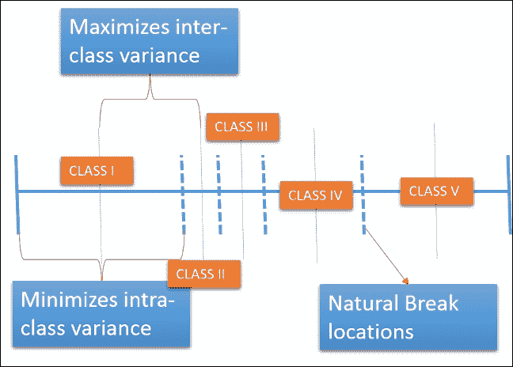
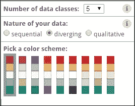
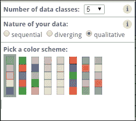
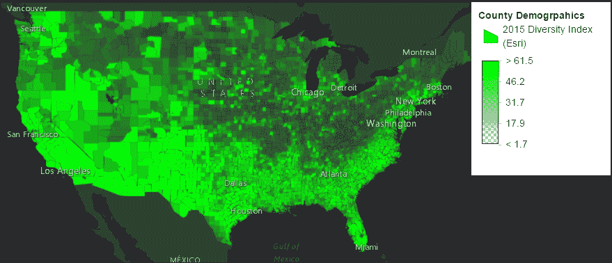
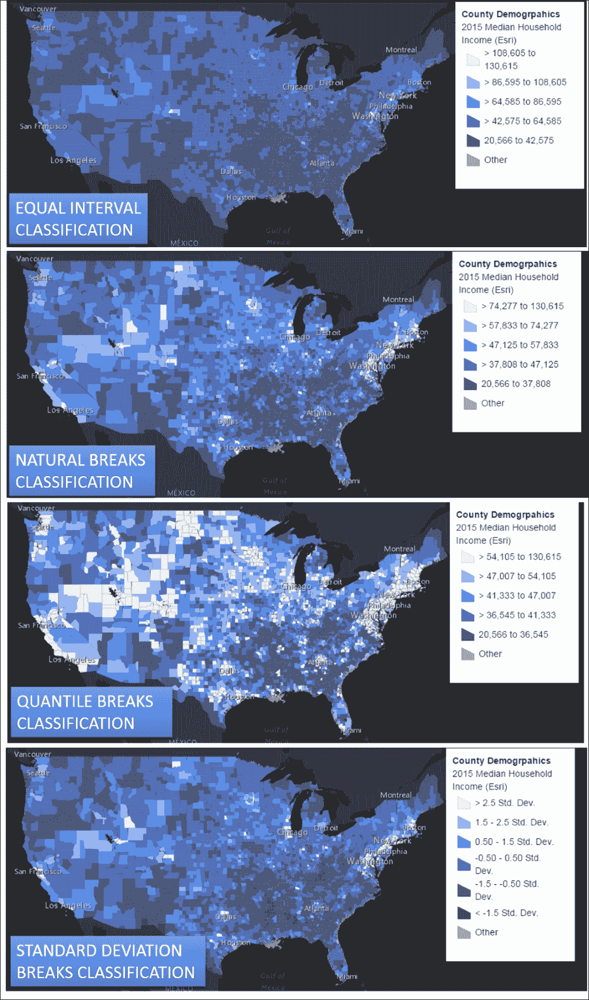

# 七、地图分析和可视化技术

对地图数据进行分析将揭示许多原本会隐藏的空间模式。该应用编程接口提供了许多方法，通过对数据进行高级统计查询来获取此类信息。将此与 API 提供的直观数据可视化方法结合起来，您就离成为地图数据科学家又近了一步。在本章中，我们将首先尝试理解一些基本的统计概念，然后借助于 API 提供的分析和呈现模块，在代码中实际应用这些概念，从而构建一个人口统计分析门户。具体来说，我们将涵盖以下主题:

*   介绍我们将要开发的人口统计分析门户
*   基本统计方法介绍
*   API 提供的用于计算特征统计的模块
*   分类方法简介
*   用可视化变量开发渲染器的代码支持说明
*   执行多元映射
*   使用智能映射执行自动映射

# 构建人口统计分析门户

我们将建立一个人口统计分析门户，展示该应用编程接口的高级分析功能。人口统计学是指根据年龄、受教育程度、国籍、家庭收入中位数、种族、性别等各种社会经济因素对生活在一个地区的人口进行的分类。人口数据主要基于人口普查数据和其他可靠来源。

人口统计数据可用于执行各种分析，对政府决策和企业营销决策同样有用。人口数据的力量在于进行适当的分析，这样我们就可以提取生活在一个地区的人口与其周围人口相比的有用信息。让我们来看看这个网址，它提供了街区级家庭收入中位数的详细统计数据。

该地图服务显示了美国最新的 2015 年人口统计数据。在提供的数百个人口参数中，我们感兴趣的是 2015 年美国的家庭收入中位数。收入数额以现值美元表示，包括对通货膨胀或生活费用上涨的调整。中位数是将家庭收入分配分成两个相等部分的值。有关此地图的更多信息，包括使用条款，请访问此网址:[http://doc.arcgis.com/en/living-atlas/item/?itemId = 6db 428407492470 b8db 45 edaa 0 de 44 C1&子类型=人口统计](http://doc.arcgis.com/en/living-atlas/item/?itemId=6db428407492470b8db45edaa0de44c1&subType=demographics)

这些数据是作为 Esri 的活地图集努力的一部分提供的。要使用这些数据，您需要 ArcGIS Online 组织订阅或 ArcGIS Developer 帐户。要访问此项目，您需要执行以下操作之一:

*   使用属于组织订阅成员的帐户登录
*   使用开发人员帐户登录
*   如果您没有帐户，您可以通过以下链接注册免费试用 ArcGIS 或免费 ArcGIS Developer 帐户:[https://developers.arcgis.com/en/sign-up/](https://developers.arcgis.com/en/sign-up/)

# 基本统计指标

让我们讨论一些基本统计数据，以便我们可以最大程度地利用 API 提供的一些统计功能。在继续下一步之前，我们可能需要清楚了解的五个基本统计参数是:

*   最低限度
*   最高的
*   平均的
*   标准偏差
*   标准化

## 最小值

顾名思义，这个意味着数据集中最小的值。在我们的街区级别的家庭收入的情况下，`minimum`统计数据指示了具有最低家庭收入中位数的街区。

## 最大值

与`minimum`类似，`maximum`统计数据定义了所有考虑区块中最大的家庭收入中位数。

## 总和

`Sum`是一个简单而有效的统计量，它给出了我们正在考虑的所有数据的总值。

## 平均值

一个`Average`统计定义了所有值的算术平均值。通过将`Sum`统计量除以用于计算的数据值的计数得出平均值。

```js
Average = Sum / Count
```

## 标准偏差

标准偏差可能是从任何给定数据中得出的最重要的统计数据。标准偏差是数据分散程度或数据偏离平均值或平均值程度的量度。当我们知道标准差时，我们通常可以观察到:

*   68%的值在平均值标准偏差的正负 1 倍之内
*   95%的值在平均值±两倍的标准偏差范围内
*   99.7%的值在平均值标准偏差的三倍以内

这是基于大多数数据遵循正态分布曲线的事实。当我们对数据进行排序并绘制数值时，直方图看起来像钟形曲线。

## 标准化

知道了标准差和均值的概念，我们就可以对数据进行归一化。这个过程被称为**标准化**，从这个过程得到的统计量被称为**标准分数** ( `z-score`)。当我们有大值的数据集时，标准化是总结数据并对其进行量化的有效方法。

所以要将任何值转换为标准分数(`z-score`)，我们需要先从平均值中减去该值，然后除以标准差。

```js
z-score = (Value – Mean)/Standard_Deviation
```

# API 提供的统计功能

让我们研究一下 API 在这些基本统计指标方面能为我们提供什么。稍后，我们将在应用中使用这些统计度量来更好地洞察数据。我们也将在可视化技术中使用这些技术。

## 统计定义模块

该 API 提供了一个名为`StatisticalDefinition`模块的模块，该模块可以与查询任务和查询模块结合使用，以提取我们刚刚讨论的的基本统计度量。

模块名称:`esri/tasks/StatisticDefinition`

以下是用于定义统计定义对象的属性:

*   `onStatisticField`:用于定义将要计算统计的字段
*   `outStatisticFieldName`:输出字段的名称
*   `statisticType`:用于定义统计的类型。公认的统计类型有:
    *   `min`:获取最小统计量
    *   `max`:获取最大统计量
    *   `sum`:获取总和统计
    *   `avg`:导出平均值统计
*   `stddev`:导出标准差统计量

让我们尝试使用这些，并在本章开头提供的人口统计图层网址上导出这些统计度量。

下面的屏幕截图显示了一个代码片段，并解释了如何为人口统计地图服务中的县图层导出这些统计信息:


可以使用这个简单的代码片段提取所需的统计数据。

执行完代码后，控制台屏幕应该是这样的:

```js
Object {MAX_MEDHINC_CY: 113282, MIN_MEDHINC_CY: 18549, STDDEV_MEDHINC_CY: 10960.43202775655, AVG_MEDHINC_CY: 42115.877187400576}
Object {Plus1StdDev: 53076.309215157125, Plus2StdDev: 64036.741242913675, Plus3StdDev: 74997.17327067023, Minus1StdDev: 31155.445159644027, Mius2StdDev: 20195.013131887477…}

```

`Plus1StdDev`、`Plus2StdDev`、`Plus3StdDev`、`Minus1StdDev`、`Minus2StdDev`、`Minus3StdDev`等派生的统计数据，后面会用到，以便更好的渲染数据。

## 分类方法

当我们有大量数据时，我们使用渲染方法对其进行分类。我们需要确定一个合适的分类方法来创建课间休息。以下分类方法是 API 支持的:

*   相等组距
*   自然休息
*   分位点
*   标准偏差

让我们非常简要地讨论使用每种分类方法的含义。

### 等间隔

这种分类方法将数据分成相等的部分。我们需要知道使用这种分类方法的数据范围。当数据分散且分布良好时，应使用此方法。


### 自然休息

自然中断是一种基于詹克斯中断算法的分类方法。基本上，这个算法会在数据聚集较多的位置创建更多数量的断点。这是通过寻求最小化每个类与类平均值的平均偏差，同时最大化每个类与其他组的平均值的偏差来实现的。换句话说，该方法寻求减少类内的差异并最大化类间的差异。



### 分位数

该方法对数据进行分类，使得每组中有相等数量的数据点。

### 标准偏差

如前所述，标准偏差是数据偏离平均值多少的量度。使用这种分类方法，我们可以发现数据在超过三个标准偏差(异常值)的情况下，在两到三个标准偏差(较高和较低的最终值)之间，以及在与平均值的一个标准偏差之内。


## 归一化概念

规范化数据值对于计算很多东西都很有用。考虑以下情况:

*   **Case 1**: We need to symbolize how densely populated each state is. Symbolizing based on the population field would give a wrong measure or convey wrong information. All we might have to do is to divide each state's population by its geographic area to get a measure of the population density.

    同样，如果我们需要传达青年人口(年龄< 35 岁)占总人口的百分比，我们需要将拥有青年人口的字段除以显示总人口的字段。

*   **案例二**:当试图象征整个世界的收入分配时，我们可能会遇到大范围的价值观。如果我们使用颜色或不透明度渲染器，一些国家将处于光谱的高端，而一些国家将处于底部，中间有许多国家，许多颜色信息并没有真正用完。在这种情况下，使用对数标度来显示收入分布会更有用。
*   **案例三**:当我们在马拉松比赛中需要计算犯罪数据或各州参赛人数等数值占总数的百分比时，需要将数值除以总数。

许多渲染器都有一个`normalizationField`和`normalizationType`属性来实现这种规范化。

`normalizationField`让我们定义用于标准化的字段。例如对于*情况 1* ，则`Area`场和`Total Population`场为`normalizationField`。

`normalizationType`是需要对值执行的规范化类型。`normalizationType`的三个可能值是字段、日志和总百分比。例如*案例 1* ，我们需要使用`normalizationType`作为`field`。对于*情况 2* ，我们需要使用`log`，对于*情况 3* ，我们需要使用`percent-of-total`作为`normalizationType`。

## 要素图层统计

在 3.13 版本的应用编程接口中，引入了这个插件，可以方便地计算要素图层统计数据。使用要素图层统计插件，我们可以计算以下统计信息:

*   要素图层字段的基本统计信息
*   课间统计
*   字段中的唯一值
*   查看图层的建议比例范围
*   获取示例功能
*   计算直方图

可以使用以下代码片段将插件添加到要素图层中:

```js
var featureLayerStats = new FeatureLayerStatistics({
          layer: CountyDemogrpahicsLayer
        });
```

在前面的片段中，`CountyDemogrpahicsLayer`是要添加`FeatureLayerStatistics`插件的要素图层的名称。

插件中使用的方法通常需要的参数是`field`和`classificationMethod`。`field`插件指的是统计所基于的属性字段的名称。`classificationMethod`指的是之前讨论过的统计数据计算所依据的分类方法之一:

```js
var featureLayerStatsParams = {
          field: "MEDHINC_CY",
          classificationMethod : 'natural-breaks'
        };
```

插件上的方法总是返回一个承诺。以下片段计算了在`featureLayerStatsParams`中定义的字段的基本统计值:

```js
featureLayerStats.getFieldStatistics(featureLayerStatsParams).then(function (result) {
          console.log("Successfully calculated %s for field %s, %o", "field statistics", featureLayerStatsParams.field, result);
        }).otherwise(function (error) {
          console.log("An error occurred while calculating %s, Error: %o", "field statistics", error);
        });
```

浏览器控制台中的结果如下图所示:

```js
Successfully calculated field statistics for field MEDHINC_CY,
Object {  
 source:"service-query",
 min:20566,
 max:130615,
 avg:46193.26694241171,
 stddev:12564.308382029049,
 count:3143,
 sum:145185438,
 variance:157861845.1187254
 }

```

之前的结果提供了与我们之前使用的统计定义模块相同或更多的信息。

下面的代码片段计算了在`featureLayerStatsParams`中定义的字段上的分类符值:

```js
featureLayerStats.getClassBreaks(featureLayerStatsParams).then(function (result) {
          console.log("Successfully calculated %s for field %s, %o", "class breaks", featureLayerStatsParams["field"], JSON.stringify(result));
        }).otherwise(function (error) {
          console.log("An error occurred while calculating %s, Error: %o", "class breaks", error);
        });
```

美化后的结果如下:

```js
{
 "minValue": 20566,
 "maxValue": 130615,
 "classBreakInfos": [
 {
 "minValue": 20566,
 "maxValue": 27349.802772469,
 "label": " < -1.5 Std. Dev.",
 "minStdDev": null,
 "maxStdDev": -1.5
 },
 {
 "minValue": 27349.802772469,
 "maxValue": 39912.112219098,
 "label": "-1.5 - -0.50 Std. Dev.",
 "minStdDev": -1.5,
 "maxStdDev": -0.5
 },
 {
 "minValue": 39912.112219098,
 "maxValue": 52474.421665726,
 "label": "-0.50 - 0.50 Std. Dev.",
 "minStdDev": -0.5,
 "maxStdDev": 0.5,
 "hasAvg": true
 },
 {
 "minValue": 52474.421665726,
 "maxValue": 65036.731112354,
 "label": "0.50 - 1.5 Std. Dev.",
 "minStdDev": 0.5,
 "maxStdDev": 1.5
 },
 {
 "minValue": 65036.731112354,
 "maxValue": 77599.040558982,
 "label": "1.5 - 2.5 Std. Dev.",
 "minStdDev": 1.5,
 "maxStdDev": 2.5
 },
 {
 "minValue": 77599.040558982,
 "maxValue": 130615,
 "label": " > 2.5 Std. Dev.",
 "minStdDev": 2.5,
 "maxStdDev": null
 }
 ],
 "source": "service-generate-renderer"
}

```

# 使用连续和间断渲染器

连续渲染器是指渲染器，与唯一值渲染器不同，它对连续值范围内的要素进行符号化。我们需要为这样的渲染器定义几个`stops`或`breakpoints`。这些`stops`定义一个类，渲染器检查每个值属于哪个类。基于该类，数据借助于可视化变量(如颜色、大小、不透明度甚至旋转)进行可视化。

使用可用的统计数据，我们可以使用 API 提供的`ClassBreaksRenderer`轻松创建分类和连续渲染器。`ClassBreaksRenderer`根据某个数值属性的值，用不同的可视化来象征每个图形。

模块名称:`esri/renderers/ClassBreaksRenderer`

借助`colorInfo`、`opacityInfo`和`sizeInfo`等属性，可以在该模块上设置颜色、大小或不透明度。`ClassBreaksRenderer`上有以下方法:

*   `setColorInfo` ( `colorInfo`):设置 `colorInfo`属性
*   `setOpacityInfo` ( `opacityInfo`):根据信息参数的定义，设置渲染器的不透明度信息
*   `setRotationInfo` ( `rotationInfo`):修改渲染器的旋转信息
*   `setSizeInfo` ( `sizeInfo`):设置渲染器的大小信息，根据数据值修改符号大小

让我们更详细地讨论这些。下图提供了开发渲染器的简要指南:


## ColorInfo

`ColorInfo`是一个对象用来定义渲染图层的颜色渐变。我们只需要在`stops`提供离散的颜色值集合，或者有时只提供渐变中的颜色值:

一个简单的`ColorInfo`对象示例如下:

```js
renderer.setColorInfo({
  field: "MEDHINC_CY",
  minDataValue: featureLayerStats.min,
  maxDataValue: featureLayerStats.max,
  colors: [
    new Color([255, 255, 255]),
    new Color([127, 127, 0])
  ]
});
```

为了创建一个分类的颜色渲染器，我们需要定义一个`stops`对象来定义离散的颜色，而不是连续的颜色。一个`stops`对象将包含每个`stop`的颜色。定义`stops`时，需要*而不是*定义`minDataValue`或`maxDataValue`。让我们讨论一下在哪里可以为渲染器获得合适的配色方案。

### 选择配色方案

以下网站为我们提供了一个简单的方法来选择可用于构建`colorInfo`对象或为坡道上色的配色方案:[http://colorbrewer2.org/](http://colorbrewer2.org/)

在该网站中，您可以执行以下操作:

1.  选择数据类别的数量-默认为`3`。API 的默认类数是`5`。因此将下拉值更改为`5`类。
2.  选择数据的性质:
    *   **sequential**: Use this to show an incremental quantity such as population or population density.

        

    *   **diverging**: Use this to emphasize the difference in values, especially at the extreme ends. For example, when mapping median income, the lower end of the income scale may be displayed in red and the higher end in blue.

        

    *   **qualitative**: This color scheme is used when we need to differentiate distinct values or classes using different colors.

        

3.  选择多色调或单一色调的配色方案。
4.  基于以下条件约束颜色色调:
    *   目的:
        *   色盲友好
        *   打印友好
        *   影印保险箱
    *   上下文:
        *   道路
        *   城市
        *   边界
5.  Export the color scheme as:
    *   JavaScript 数组对象——这是最简单的函数
    *   多贝 Pdf

    

### 创建分类颜色渲染器

正如我们之前讨论的，为了创建一个分类的颜色渲染器，我们需要定义一个`stops`对象来定义离散的颜色，而不是连续的颜色。一个`stops`对象将包含每个停靠点的颜色。`stops`对象是分配给渲染器对象的数组对象。一个`stops`数组对象包含具有以下属性的对象:

*   `value`
*   `color`
*   `label`

一个`stops`物体大多是这样的:

```js
var stops =
[
 {
 "value": 27349.802772469,
 "color": {      "b": 226,      "g": 235,       "r": 254,      "a": 1    },
 "label": " < -1.5 Std. Dev."
 },
 {
 "value": 39912.112219098,
 "color": {      "b": 185,      "g": 180,      "r": 251,      "a": 1    },
 "label": "-1.5 - -0.50 Std. Dev."
 },
 {
 "value": 52474.421665726,
 "color": {      "b": 161,      "g": 104,      "r": 247,      "a": 1    },
 "label": "-0.50 - 0.50 Std. Dev."
 },
 {
 "value": 65036.731112354,
 "color": {      "b": 138,      "g": 27,      "r": 197,      "a": 1    },
 "label": "0.50 - 1.5 Std. Dev."
 },
 {
 "value": 77599.040558982,
 "color": {      "b": 119,      "g": 1,      "r": 122,      "a": 1    },
 "label": "1.5 - 2.5 Std. Dev."
 }
]

```

现在让我们找到一种自动填充`stops`对象的方法。请记住，我们可以根据从`colorbrewer2.org`网站选择的配色方案获得一系列颜色。`color`数组可以用来填充`stops`对象中每个对象的`color`属性。`stops`对象中每个对象的`value`属性可以从`featureLayerStatistics`计算的返回对象中导出。`featureLayerStatistics`计算为每个类提供`minimum`、`maximum`和`label`值。我们可以为`stops`对象中的每个对象的`value`属性分配每个类的最大值:

```js
//Create a params object for use getClassBreaks method in 
// FeatureLayerStatistics module
//Define the field upon which Stats is computed,
//The classification method which should be one among the following:
//standard-deviation, equal-interval, natural-breaks, quantile
//Number of classes the data should be classified. Default is 5
var featureLayerStatsParams_color = {
          field: "MEDHINC_CY",
          classificationMethod: selectedClassificationMethod, 
          numClasses: 5
        };

//Compute the Class Break Statitics. This returns a promise

var color_stats_promise = featureLayerStats.getClassBreaks(featureLayerStatsParams_color);
color_stats_promise.then(function (color_stat_result) {

//The classBreakInfos property of the color_stat_result has all the 
//class break values 

var colorStops = [];

//Color JavaScript array exported from colorbrewer2.org
var colors = ['#feebe2', '#fbb4b9', '#f768a1', '#c51b8a', '#7a0177']; 

//Loop through each Break info provided by the Feature Layer Stats
              array.forEach(color_stat_result.classBreakInfos, function (classBreakInfo, i) {
                        colorStops.push({
//Get value property from the Break value's maximum value
                            value: classBreakInfo.maxValue,
//Get color from the color Array
                            color: new Color(colors[i]),
//Get label value from the label value provided by the Feature Layer //Stats
                            label: classBreakInfo.label
                        });
                    });

//Define Default renderer symbol
var symbol = new SimpleFillSymbol();
symbol.setColor(new Color([255, 0, 0]));
symbol.setOutline(new SimpleLineSymbol(SimpleLineSymbol.STYLE_SOLID, new Color([0, 0, 0]), 0.5));

var colorBreakRenderer = new ClassBreaksRenderer(symbol);

//Set the color stops to the stops property to setColorInfo method of //the renderer
colorBreakRenderer.setColorInfo({
              field:"MEDHINC_CY",
              stops: colorStops
          });
});
```


## 不透明性

`opacityInfo`是一个对象，定义如何计算特征的不透明度。`opacityInfo`对象可用于在`ClassBreaksRenderer`中设置类的不透明度。`opacityInfo`对象也可以用来设置连续的不透明度渲染器。

与`colorInfo`对象类似，您可以将不透明度值指定为一个数组以及最小和最大数据值，也可以定义`stops`对象，在该对象中您可以定义不透明度值。

使用`opacityInfo`创建连续渲染器:

```js
var minOpacity = 0.2;
var maxOpacity = 1;

var opacityInfo = {
  field: "DIVINDX_CY",
  minDataValue:  0,
  maxDataValue:  100,
  opacityValues:   [minOpacity, maxOpacity]
};
```

### 使用 opacityInfo 创建一个类不透明度渲染器

让我们使用`opacityInfo`来渲染另一个代表每个县的多样性指数的字段。多样性指数衡量从`0`到`100`的多样性。多样性指数是 Esri 专有指数，定义为从同一地区随机选出的两个人属于不同种族或族裔群体的可能性。多样性指数只衡量一个地区的多样性程度，而不是其种族构成。

我们的目标是显示具有较高不透明度值的较高多样性指数的县，以及具有较低不透明度值的较低多样性指数的县。通过使用以下代码片段，可以在最小值和最大值之间划分不透明度值:

```js
var opacity = minOpacity + i * maxOpacity / (opacity_stat_result.classBreakInfos.length - 1);
```

在前面的片段中，`opacity_stat_result`是`FeatureLayerSatistics`模块的`getClassBreaks()`方法的承诺结果:

```js
var featureLayerStatsParams_opacity = {
  field: "DIVINDX_CY",
  classificationMethod: selectedClassificationMethod, //standard-deviation, equal-interval, natural-breaks, quantile and standard-deviation
  numClasses: 5
};

var opacity_stats_promise = featureLayerStats.getClassBreaks(featureLayerStatsParams_opacity);
opacity_stats_promise.then(function (opacity_stat_result) {

  var opacityStops = [];
  array.forEach(opacity_stat_result.classBreakInfos, function (classBreakInfo, i) {
    var minOpacity = 0;
    var maxOpacity = 1;
//Calculate opacity by dividing between 
    var opacity = minOpacity + i * maxOpacity / (opacity_stat_result.classBreakInfos.length - 1);
    opacityStops.push({
      value: classBreakInfo.maxValue,
      opacity: opacity
    });
  });

var symbol = new SimpleFillSymbol();
symbol.setColor(new Color([255, 0, 0]));
var opacityBreakRenderer = new ClassBreaksRenderer(symbol);
opacityBreakRenderer.setOpacityInfo({
   field:"MEDHINC_CY",
   stops: stops
});

CountyDemogrpahicsLayer.setRenderer(opacityBreakRenderer);
CountyDemogrpahicsLayer.redraw();
```



## 尺寸信息

`SizeInfo`对象定义符号的大小，其中特征大小与数据值成比例。

API 帮助页面提到符号大小可以表示两种不同类型的数据——距离和非距离。距离数据类型是指实地的实际距离，非距离数据类型是指符号的制图尺寸。使用基于树冠实际直径的`sizeInfo`来表示树冠是距离数据类型的一个例子。根据交通密度来表示道路的大小，或根据人口密度或收入中位数来表示州的大小，可以增强要素的制图表达。

## 回转仪

`RotationInfo`可用于定义标记符号的旋转方式。`RotationInfo`可用于描绘风向、车辆航向等。指定旋转角度的字段必须为才能定义`RotationInfo`。允许有两种旋转角度单位。它们是:

*   **地理位置**:代表从地理位置顺时针方向向北的角度。风速和汽车方向通常用地理角度表示。
*   **算术**:表示逆时针方向测量的角度。

下图显示了地理角度和算术角度之间的差异:


## 多元映射

到目前为止，我们一直在讨论使用单个字段名或变量的渲染特征。我们还讨论了各种视觉变量，这些变量可以用来渲染颜色、不透明度、大小、旋转等特征。如果我们可以基于多个字段值来组合视觉变量和渲染特征，会怎么样？

例如，在县一级制图时，我们可以考虑使用颜色来表示人口密度，使用不透明度来表示家庭收入中位数，使用规模来表示联邦教育支出的百分比，这由人口字段进行标准化。我们选择使用的字段数量仅限于四个视觉变量，即:颜色、不透明度、大小和旋转。

多元映射由`ClassBreaksRenderer`中称为`visualVariables`的属性启用。让我们尝试使用两个视觉变量，即`colorInfo`和`opacityInfo`，我们用它们来演示两个不同的人口统计参数，即家庭收入中位数和多样性指数。我们目前的目标是用颜色表示中等收入家庭，同时根据多样性指数确定特征的不透明度值:

```js
function applySelectedRenderer(selectedClassificationMethod) {
        var featureLayerStatsParams_color = {
          field: "MEDHINC_CY",
          classificationMethod: selectedClassificationMethod, //standard-deviation, equal-interval, natural-breaks, quantile and standard-deviation
          numClasses: 5
        };
        var featureLayerStatsParams_opacity = {
          field: "DIVINDX_CY",
          classificationMethod: selectedClassificationMethod, //standard-deviation, equal-interval, natural-breaks, quantile and standard-deviation
          numClasses: 5,
          //normalizationField: 'TOTPOP_CY'
        };

        var color_stats_promise = featureLayerStats.getClassBreaks(featureLayerStatsParams_color);
        var opacity_stats_promise = featureLayerStats.getClassBreaks(featureLayerStatsParams_opacity);
        all([color_stats_promise, opacity_stats_promise]).then(function (results) {
          var color_stat_result = results[0];
          var opacity_stat_result = results[1];

          var colorStops = [];
          var colors = ['#d7191c', '#fdae61', '#ffffbf', '#abd9e9', '#2c7bb6'];
          array.forEach(color_stat_result.classBreakInfos, function (classBreakInfo, i) {
            colorStops.push({
              value: classBreakInfo.maxValue,
              color: new Color(colors[i]),
              label: classBreakInfo.label
            });
          });
          var opacityStops = [];
          array.forEach(opacity_stat_result.classBreakInfos, function (classBreakInfo, i) {
            var minOpacity = 0;
            var maxOpacity = 1;
            var opacity = minOpacity + i * maxOpacity / (opacity_stat_result.classBreakInfos.length - 1);
            opacityStops.push({
              value: classBreakInfo.maxValue,
              opacity: opacity
            });
          });

          var visualVariables = [
            {
              "type": "colorInfo",
              "field": "MEDHINC_CY",
              "stops": colorStops
                            }

            ,
            {
              "type": "opacityInfo",
              "field": "DIVINDX_CY",
              "stops": opacityStops
                        }

                        ];
          console.log(JSON.stringify(visualVariables));
          var symbol = new SimpleFillSymbol();
          symbol.setColor(new Color([0, 255, 0]));
          symbol.setOutline(new SimpleLineSymbol(SimpleLineSymbol.STYLE_SOLID, new Color([0, 0, 0]), 0.5));

          var colorBreakRenderer = new ClassBreaksRenderer(symbol);
          colorBreakRenderer.setVisualVariables(visualVariables);
          CountyDemogrpahicsLayer.setRenderer(colorBreakRenderer);
          CountyDemogrpahicsLayer.redraw();
          legend.refresh();
        });
      }
```


# 智能制图

了解了所有这些统计信息后，现在是使用 API 提供的智能映射模块进行智能映射的时候了。设想一个模块，给定几个基本输入，比如渲染器需要在其上生成的要素图层和分类方法，该模块可以自行自动调用渲染器参数。

模块名称:`esri/renderers/smartMapping`

智能映射模块提供了几种方法，每种方法都产生一个渲染器。智能映射模块可以生成的渲染器有:

*   基于颜色的分类渲染器
*   基于大小的分类渲染器
*   基于类型的渲染器
*   热图渲染器

智能地图甚至会处理基于底图的渲染。例如，特定颜色或不透明度渲染器适用于较暗主题的底图(如卫星地图)，特定渲染器适用于较亮主题的底图(如街道地图)。

通过三个简单的步骤，您可以让 API 决定配色方案并为您创建类颜色渲染器:

*   从 Esri 样式`choropleth`模块构建一个方案对象(导入`esri/styles/choropleth`)
*   使用以下属性构造一个分类颜色参数对象:
    *   `basemap`
    *   `classificationMethod`
    *   `layer`
    *   `field`
    *   `scheme`-从之前构建的方案对象中选择`primaryScheme`属性
    *   `numClasses`
*   将分类的颜色参数对象指定为属于智能映射模块的`createClassedColorRenderer()`方法的参数
*   将智能映射方法返回的渲染器属性作为参数分配给要素图层的`setRenderer()`方法
*   重绘要素图层并刷新图例对象

下面的代码解释了如何使用智能映射来创建分类颜色渲染器:

```js
//Call this function with the classification method as input
function applySmartRenderer(selectedClassificationMethod) {

//Create a scheme object assigning a theme 
var schemes = esriStylesChoropleth.getSchemes({
 //The following options are available for theme: 
 // high-to-low, above-and-below, centered-on, or extremes.
  theme: "high-to-low",
  basemap: map.getBasemap(),
  geometryType: "polygon"
});
console.log(JSON.stringify(schemes));

//Create a classed color Render Parameter object
var classedColorRenderParams = {
  basemap: map.getBasemap(),
  classificationMethod: selectedClassificationMethod,
  field: 'MEDHINC_CY',
  layer: CountyDemogrpahicsLayer,
  scheme: schemes.primaryScheme,
  numClasses: 5
};

SmartMapping.createClassedColorRenderer(classedColorRenderParams).then(function (result) {
  CountyDemogrpahicsLayer.setRenderer(result.renderer);
 //Redraw the feature layer
  CountyDemogrpahicsLayer.redraw();
 //Update the legend
  legend.refresh();
}).otherwise(function (error) {
  console.log("An error occurred while performing%s, Error: %o", "Smart Mapping", error);
});
```

下面的截图显示了使用智能映射模块为四种不同的分类创建的分类颜色渲染器，即等间隔、自然间断、分位数和标准差。用户的判断力用于根据映射数据的目的以及受众来决定哪种方法是最佳的分类方法。

我们可以通过编辑`scheme`对象来手动定义配色方案，这是`createClassedColorRenderer()`方法的参数对象中的一个属性。



# 总结

我们离成为地图数据科学家又近了一步。在这一章中，我们涵盖了很多内容，首先是对一些介绍性统计概念的复习。然后，我们看到了统计数据定义和要素图层统计模块如何为我们提供宝贵的统计数据度量的代码，这些统计数据可以用来有意义地呈现地图数据。然后，我们评估了如何在渲染器中有效地使用视觉变量，如`colorInfo`、`opacityInfo`、`rotationInfo`和`sizeInfo`。我们还尝试组合这些视觉变量，并执行多元渲染。最后，我们尝试使用智能映射模块进行自动渲染。在下一章中，我们将讨论图表和其他先进的可视化技术，为用户提供分析信息。