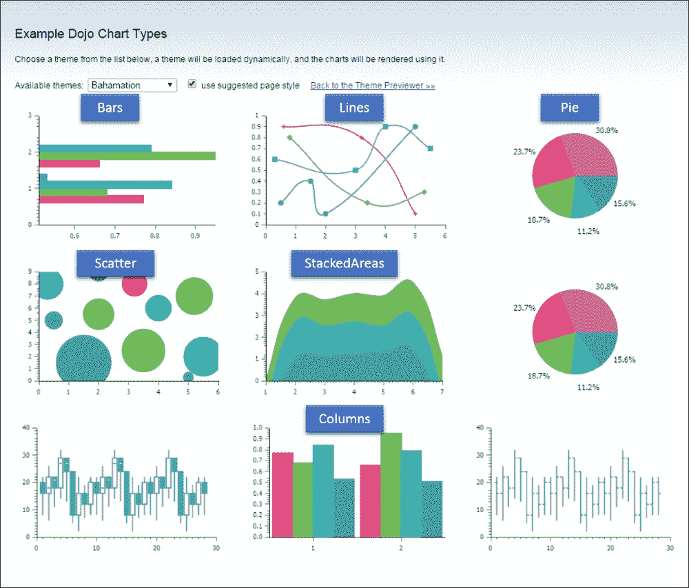
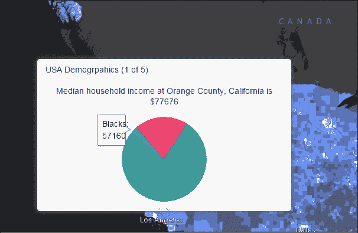
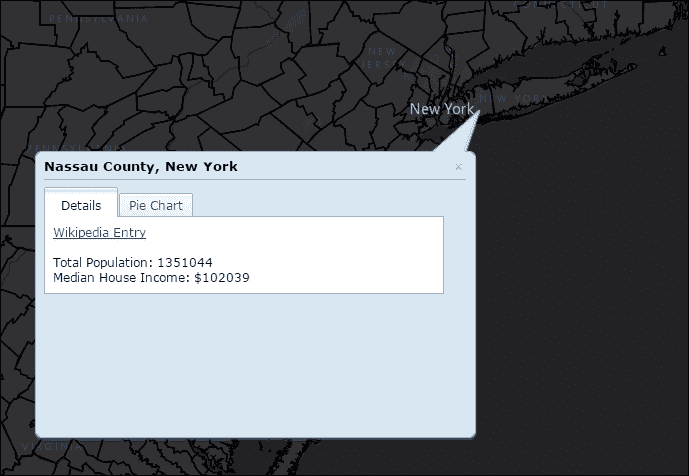
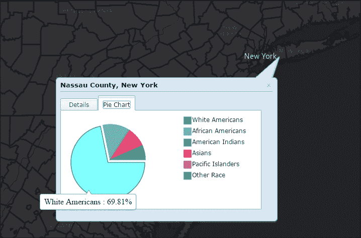
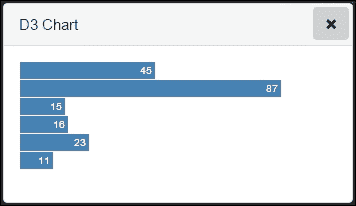
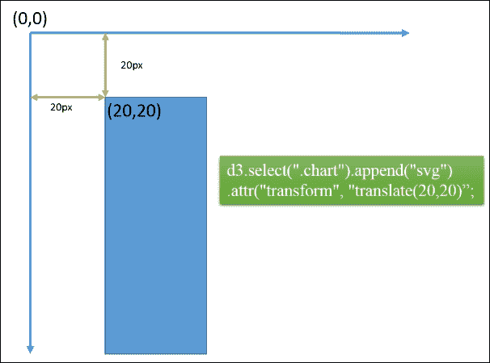
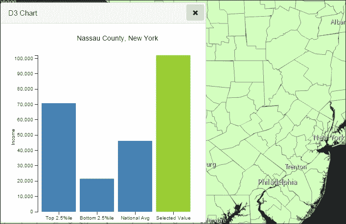
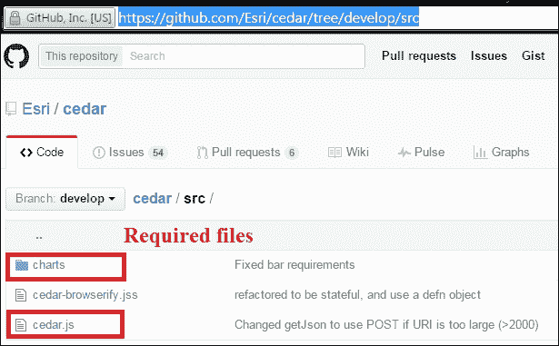
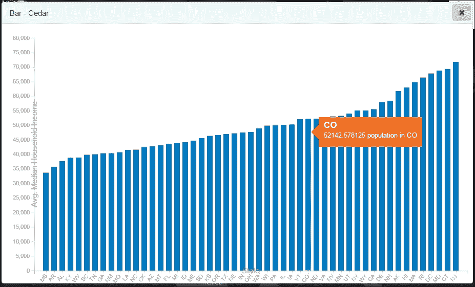

# 八、高级地图可视化和图表库

在地图上渲染可能不是可视化空间数据的唯一方法。为了正确看待数据，我们可能不得不求助于 dojo 和其他流行库提供的非空间分析和制图功能，以补充地图的空间可视化功能。在本章中，我们将借助图表库和其他可视化方法(如数据聚类)来扩展我们在上一章中开始构建的人口统计分析门户。本章涉及以下主要主题:

*   道场制图
*   用 D3 库制作图表
*   用雪松制图

# 用道场制图

ArcGIS 应用编程接口很好地集成了道场制图。制图能力由道场的实验模块提供，因此得名`dojox`，其中`x`指的是模块的实验性质。然而，这些模块足够稳定，可以集成到任何生产环境中。以下模块被认为是使用 dojo 开发制图功能的最基本模块:

*   `dojox/charting`
*   `dojox/charting/themes/<themeName>`
*   `dojox/charting/Chart2D`
*   `dojox/charting/plot2d/Pie`

## 道场图主题

`dojox`图表库提供了很多主题，必须从`dojox`提供的主题列表中选择一个主题名称。`dojox`提供的所有主题列表可在以下网址下找到:http://archive . dojotolkit . org/nightly/dojotolkit/dojox/charging/tests/theme _ preview . html

dojox 图表库提供的主题如下:

<colgroup><col style="text-align: left"> <col style="text-align: left"> <col style="text-align: left"></colgroup> 
| 朱莉三维克莉丝汤姆(男子名)克拉罗红电的带电的好吧土坯砖海藻巴哈马蓝色黄昏 | 沙漠与众不同的美元蝗虫草原灰色的天空和谐愤怒爱尔兰 MiamiNice 中西部有薄荷味的紫色雨 | CubanShirts 皇家紫 SageToLime 石灰蘑菇凝灰岩 WatersEdge 湿地 PlotKit.bluePlotKit .青色 PlotKit.greenPlotKit.orangePlotKit .紫色 PlotKit.red |

测试这些不同图表主题的理想地点是在[http://archive . dojotolkit . org/nightly/dojotolkit/dojox/charging/tests/test _ themes . html？朱莉](http://archive.dojotoolkit.org/nightly/dojotoolkit/dojox/charting/tests/test_themes.html?Julie)。



## 使用弹出模板绘制图表

使用`popup`模板的`mediaInfos`属性，基本制图功能可以显示在要素图层的弹出窗口中。我们将使用上一章中使用的县级人口统计要素图层来创建此图表。我们对以下领域感兴趣:

<colgroup><col style="text-align: left"> <col style="text-align: left"></colgroup> 
| 

菲尔茨

 | 

描述

 |
| --- | --- |
| `NAME` | 国家名称 |
| `STATE_NAME` | 州名 |
| `TOTPOP_CY` | 该县的总人口数 |
| `MEDHINC_CY` | 该县家庭收入中位数 |
| `DIVINDX_CY` | 为县计算的多样性指数 |
| `WHITE_CY` | 白人男性和女性人数 |
| `BLACK_CY` | 黑人男性和女性人数 |
| `AMERIND_CY` | 美国印第安人的数量(男性和女性) |
| `ASIAN_CY` | 亚洲人数量(男性和女性) |
| `PACIFIC_CY` | 太平洋岛民人数(男性和女性) |
| `OTHRACE_CY` | 其他种族(男性和女性)的计数 |

创建一个`mediaInfos`对象涉及到构建一个`fieldInfos`对象，如果我们需要改变字段名称，或者在图表中给它们一个别名。`mediaInfos`对象接受一个`theme`属性。提及其中一个 dojo 图表主题名称或您创建的自定义主题:

```js
var template = new PopupTemplate({
  title: "USA Demograpahics",
  description: "Median household income at {NAME}, {STATE_NAME} is ${MEDHINC_CY}",
 //define field infos so we can specify an alias in the chart
  fieldInfos: [
    { 
      fieldName: "WHITE_CY",
      label: "White Americans"
    },
    { 
      fieldName: "BLACK_CY",
      label: "Blacks"
    },
    { 
      fieldName: "AMERIND_CY",
      label: "American Indians"
    },
    {   fieldName: "ASIAN_CY",
      label: "Asians"
    },
    { 
      fieldName: "PACIFIC_CY",
      label: "Pacific Islanders"
    },
    { 
      fieldName: "OTHRACE_CY",
      label: "Other Race Count"
    }
    ],
  mediaInfos: [{ //define the bar chart
    caption: "",
    type: "piechart", // image, piechart, barchart,columnchart,linechart
    value: 
    {
      theme: "Dollar",
      fields: ["WHITE_CY", "BLACK_CY", "AMERIND_CY", "ASIAN_CY", "PACIFIC_CY", "OTHRACE_CY"]
    }
    }]
});
```



# dojox 模块提供的 2D 图类型

我们已经看到一个饼图在起作用。让我们来讨论一下`dojox`模块提供的更多图表类型，以及一些更流行的图表类型的实用性。请注意条形图和柱形图以及散点图和标记图之间的区别。

<colgroup><col style="text-align: left"> <col style="text-align: left"></colgroup> 
| 

图表类型

 | 

描述

 |
| --- | --- |
| 区域 | 将填充数据线下的区域 |
| 酒吧 | 指水平条 |
| 集群反馈 | 带有分组数据集的水平条 |
| ClusteredColumns | 带有分组数据集的竖线 |
| 列 | 指带有竖线的图表 |
| 格子 | 用于向图表添加网格层 |
| 线 | 基本折线图 |
| 标记 | 标有数据点的折线图 |
| 仅标记 | 仅显示数据点 |
| 馅饼 | 通过在圆形图上表示数据来表示数据的分布 |
| 分散 | 用于绘制数据 |
| 叠放在一起的 | 相对于先前数据集绘制的数据集 |
| 堆叠区域 | 图表线下填充区域的堆叠数据集 |
| StackedBars | 带水平条的堆叠数据集 |
| 堆叠列 | 带有竖线的堆叠数据集 |
| 堆叠线 | 使用线的堆叠数据集 |

## 道场的制图方法

图表模块有四种重要的方法可以帮助我们创建图表。它们是:

*   `addPlot()`:定义图表的类型以及定义图表的其他辅助属性。
*   `setTheme()`:我们给图表设置一个道场主题。主题也可以定制。
*   `addSeries()`:定义图表使用的数据。
*   `render()`:渲染图表。

### 定义你的剧情

使用`addPlot()`方法，你可以定义你的剧情。该图接受一个名称和一个参数数组:

```js
var chart1 = new Chart2D(chartDomNode);
chart1.addPlot("default", plotArguments);
```

我们来看看`plotArguments`物体是由什么构成的。`plotArguments`的属性根据我们选择使用的图表类型而有所不同。如果我们选择使用线条、区域或数据点来定义数据的图表类型，则线条、区域或标记等属性应设置为布尔值。线条选项确定是否使用线条来连接数据点。如果选择了区域类型，数据线下方的区域将被填充。标记选项将决定标记是否放置在数据点。

`plotArguments`可以接受以下属性:

*   `type`:要渲染的图表类型
*   `lines`:布尔值，表示图表数据是否需要用线条括起来
*   `areas`:布尔值，表示数据是否被区域包围
*   `markers`:决定标记是否放置在数据点的布尔值

对于堆叠线或堆叠区域等图表类型，我们可以使用张力和阴影等属性来增强图表的可视化效果。张力平滑了连接数据点的线条，阴影属性将为线条添加阴影。`shadow`属性本身是一个接受名为`dx`、`dy`和`dw`的三个属性的对象，这三个属性定义了 *x* 偏移量、 *y* 偏移量以及阴影线的宽度:

```js
chart1.addPlot("default", {type: "StackedLines", lines: true, markers: false, tension : 3, shadows: {dx:2, dy: 2, dw: 2}});
```

渲染条形图时，使用`gap`属性表示条形图之间的像素数:

```js
chart1.addPlot("default", {type: "Bars", gap: 3});
```

### 定义主题

使用前面提到的主题列表，我们可以使用`setTheme()`方法为图表设置主题:

```js
chart.setTheme(dojoxTheme);
```

### 推送数据

我们可以使用`addSeries()`方法将数据推送到图表中:

```js
chart.addSeries("PopulationSplit", chartSeriesArray);
```

`addSeries()`方法接受两个参数。第一个参数提到数据的名称，第二个参数提到数据的名称。第二个参数是保存实际数据的数组对象。可以是一维数据如`[10,20,30,40,50]`或二维数据，在这种情况下可以提到数据的`x`和`y`属性:

```js
chart.addSeries("Students",[
{x: 1, y: 200 },
{x: 2, y: 185 }
]
});
```

如果是饼图，可以省略`x`组件。

### 图表插件

有几个插件可以添加到 dojo 的图表模块中，为图表功能增加价值。这些插件为图表数据提供了交互性，并且大多数插件揭示了关于数据项的额外信息或者强调了被悬停的数据项。有些借助可视化元素(如图例)提供数据的整体感觉。插件完成的一些功能有:

*   向图表添加工具提示
*   移动馅饼切片并放大它
*   添加图例
*   突出显示数据项

像`dojox/charting/widget/Legend`这样的插件模块提供`Legend`小部件的支持。`dojox/charting/action2d/Tooltip`模块支持图表数据的工具提示支持。包含`dojox/charting/action2d/Magnify`模块将放大悬停在其上的图表数据，从而增强与图表的交互性。`dojox/charting/action2d/MoveSlice`模块将图表数据视为一个切片，并移动悬停在其上的图表数据的位置。这与`Magnify`插件一起，帮助我们有效地给用户一种与图表数据交互的感觉。`dojox/charting/action2d/Highlight`模块用不同的高亮颜色(如青色)高亮显示正在悬停的数据。

实现插件也非常容易。下面几行代码实现了 dojo 图表对象上的插件，如`Highlight`、`Tooltip`和`MoveSlice`:

```js
new Highlight(chart, "default");
new Tooltip(chart, "default");
new MoveSlice(chart, "default");
```

让我们在要素图层的`infotemplate`属性的动态`div`中创建一个完整的图表。

我们也将在此演示中使用县级人口统计要素图层。我们的目标是创建一个饼图来显示我们点击的任何一个县的种族分布。我们将调用一个函数来为每个特性动态创建`Infowindow`内容:

```js
var template = new InfoTemplate();
template.setTitle("<b>${STATE_NAME}</b>");

//Get the info template content from the getWindowContent function
template.setContent(getWindowContent);

var statesLayer = new FeatureLayer("http://demographics5.arcgis.com/arcgis/rest/services/USA_Demographics_and_Boundaries_2015/MapServer/15", {
  mode: FeatureLayer.MODE_ONDEMAND,
  infoTemplate: template,
  outFields: ["NAME", "STATE_NAME", "TOTPOP_CY", "MEDHINC_CY", "DIVINDX_CY", "WHITE_CY", "BLACK_CY", "AMERIND_CY", "ASIAN_CY", "PACIFIC_CY", "OTHRACE_CY"]
});
```

在返回`Infotemplate`内容的函数中，我们将执行以下操作:

1.  创建一个包含两个内容窗格的`Tab`容器。
2.  第一个内容将显示所选县的详细信息和家庭收入中位数数据。
3.  第二个内容窗格将包含 dojo 饼图。
4.  在绘制饼图之前，我们将计算每个种族群体占总人口的百分比。
5.  此外，我们将为每个种族群体指定一个标签。该标签将在使用图例时使用。
6.  此外，饼图数据对象接受工具提示属性，我们将在其中提到标签和数据值。
7.  我们将尝试使用`Highlight`、`Tooltip`、`Moveslice`等图表插件来突出显示所选的子数据项。

现在让我们尝试在代码中实现这些步骤。我们将编写一个构造图表的函数，将图表内容作为`dom`元素返回。我们将使用`infotemplate`的`setContent()`方法来设置以下函数返回的`dom`元素:

```js
function getWindowContent(graphic) {
  // Make a tab container.
  var tc = new TabContainer({
    style: "width:100%;height:100%;"
  }, domConstruct.create("div"));

// Make two content panes, one showing Median household income       //details. And the second showing the pie chart

  var cp1 = new ContentPane({
    title: "Details",
    content: "<a target='_blank' href='http://en.wikipedia.org/wiki/" + graphic.attributes.NAME + "'>Wikipedia Entry</a><br/>" +  "<br/> Total Population: " + graphic.attributes.TOTPOP_CY + " <br/> Median House Income: $" + graphic.attributes.MEDHINC_CY
  });
 // Display a dojo pie chart for the racial distribution in %
  var cp2 = new ContentPane({
    title: "Pie Chart"
  });
  tc.addChild(cp1);
  tc.addChild(cp2);

  // Create the chart that will display in the second tab.
  var c = domConstruct.create("div", {
    id: "demoChart"
  }, domConstruct.create("div"));
  var chart = new Chart2D(c);
  domClass.add(chart, "chart");

  // Apply a color theme to the chart.
  chart.setTheme(dojoxTheme);

  chart.addPlot("default", {
    type: "Pie",
    radius: 70,
    htmlLabels: true
  });
  tc.watch("selectedChildWidget", function (name, oldVal, newVal) {
    if (newVal.title === "Pie Chart") {
      chart.resize(180, 180);
    }
  });

  // Calculate percent of each ethnic race
  //"WHITE_CY", "BLACK_CY", "AMERIND_CY", "ASIAN_CY", "PACIFIC_CY", "OTHRACE_CY"
  var total = graphic.attributes.TOTPOP_CY;
  var white = {
    value: number.round(graphic.attributes.WHITE_CY / total * 100, 2),
    label: "White Americans"
  };
  var black = {
    value: number.round(graphic.attributes.BLACK_CY / total * 100, 2),
    label: "African Americans"
  };
  var AmericanIndians = {
    value: number.round(graphic.attributes.AMERIND_CY / total * 100, 2),
    label: "American Indians"
  };
  var Asians = {
    value: number.round(graphic.attributes.ASIAN_CY / total * 100, 2),
    label: "Asians"
  }
  var Pacific = {
    value: number.round(graphic.attributes.PACIFIC_CY / total * 100, 2),
    label: "Pacific Islanders"
  };
  var OtherRace = {
    value: number.round(graphic.attributes.OTHRACE_CY / total * 100, 2), 
    label: "Other Race"
  };
  var chartFields = [white, black, AmericanIndians, Asians, Pacific, OtherRace];
  var chartSeriesArray = [];
  array.forEach(chartFields, function (chartField) {
    var chartObject = {
      y: chartField.value,
      tooltip: chartField.label + ' : ' + chartField.value + ' %',
      text: chartField.label
    }
    chartSeriesArray.push(chartObject);

  });

  chart.addSeries("PopulationSplit", chartSeriesArray);
  //highlight the chart and display tooltips when you mouse over a slice.
  new Highlight(chart, "default");
  new Tooltip(chart, "default");
  new MoveSlice(chart, "default");

  cp2.set("content", chart.node);
  return tc.domNode;
}
```

当这个代码实现的时候，我们点击任意一个县之后就会得到一个弹出窗口。弹出窗口包含两个标签——第一个标签给出了标签中**总人口**和该县**家庭收入中位数**的详细信息。整个弹出窗口的标题将提到县名和州名。第一个标签的内容将有一个动态生成的维基百科链接到县和州。

弹出容器的第一个选项卡如下图所示:



弹出窗口中的第二个标签显示了道场图。图表中有一个图例元素。当我们将鼠标悬停在饼图中的任何数据上时，它会被切片、放大一点并突出显示。



# 用 D3.js 绘制图表

D3.js 是一个用于基于数据操作文档的 JavaScript 库。D3 代表数据驱动的文档，该库提供了强大的可视化组件和数据驱动的 DOM 操作方法。

要在我们的 JavaScript 应用中使用 D3，我们可以从位于[http://d3js.org/](http://d3js.org/)的 D#网站下载该库。

或者我们可以在脚本标签中使用 CDN:

```js
<script src="//d3js.org/d3.v3.min.js" charset="utf-8"></script>
```

一种更以 dojo 为中心的方法是将其作为包添加到`dojoconfig`中，并将其用作定义函数中的模块。

以下是将 D3 作为包添加到`dojoConfig`的片段:

```js
var dojoConfig = {
  packages: 
  [
    {
      name: "d3",
      location: "http://cdnjs.cloudflare.com/ajax/libs/d3/3.5.5",
      main: "d3.min"
    }
  ]
};
```

在`define`功能中使用`d3`库作为:

```js
define([
  "dojo/_base/declare",
  "d3",
  "dojo/domReady!"
  ], 
function 
(
  declare,
  d3
) 
{
  //Keep Calm and use D3 with dojo
});
```

## 用 D3 创建柱形图

让我们使用县级人口统计数据创建一个带有 D3 的柱形图。我们的目标是使用柱形图显示以感兴趣县的家庭收入中位数为中心的家庭收入中位数的四个衡量标准。这四项措施是:

*   第五百分位的国家最小值或数值(平均值—三个标准偏差)
*   被点击的县的家庭收入中位数
*   家庭收入中位数的全国平均值
*   第 95 百分位的国家最高值或数值

下图是我们打算如何构建图表的模型:


我们选择用 D3 来演示构建这个图表有几个原因。D3 完全是数据驱动的，因此很灵活，尤其是对于数据可视化。许多可视化库都建立在 D3 之上，对 D3 的了解甚至可以帮助我们构建直观的图表和数据可视化。

### D3 选择

D3 是精选作品。D3 中的选择与 jQuery 选择非常相似。要选择`body`标签，您只需声明:

```js
d3.select("body")
```

要选择具有名为`chart`的特定样式类的所有`div`标签，请使用以下代码片段:

```js
d3.select(".chart").selectAll("div")
```

要将`svg`(可缩放矢量图形)标签或任何其他 HTML 标签附加到`div`或正文标签，请使用 append 方法。SVG 元素用于渲染大多数图形元素:

```js
d3.select("body").append("svg")
```

将其与`enter()`方法一起使用，表示元素接受输入:

```js
d3.select("body").enter().append("svg")
```

### D3 数据

D3 顾名思义是由数据驱动的。我们只需要绘制一个简单的图表，将数据输入 D3 选择。数据可以像数组一样简单:

```js
var data = [45, 87, 15, 16, 23, 11];

  var d3Selection = d3.select(".chart").selectAll("div").data(data).enter().append("div");

  d3Selection.style("width", function (d) {
    return d * 3 + "px";
  }).text(function (d) {
    return d;
  });
```

在前面的代码片段中，我们所做的就是为 D3 选择的样式对象设置宽度属性。我们得到了这个:



以像素为单位的每个`div`的宽度值取自数据数组中每个元素的值乘以 20，条内的文本值再次取自单个数据的值。之前需要做一些事情，才能得到这个漂亮的图表——我们需要为`div`设置 CSS 样式。下面是我们使用的一个简单的 CSS 片段:

```js
.chart div {
    font: 10px sans-serif;
    background-color: steelblue;
    text-align: right;
    padding: 3px;
    margin: 1px;
    color: white;
}
```

### D3 缩放

在前面的代码片段中，为了展示一个简单的 D3 图表，我们对数据的每个值使用了被乘数`20`来获得`div`宽度的像素值。由于我们的容器`div`大约有 400 像素宽，这个被乘数值是合适的。但是对于动态数据，我们应该使用什么被乘数值呢？经验法则是，我们应该使用某种缩放机制来缩放像素值，以便我们最大的数据值能够舒适地容纳在图表容器`div`中。D3 提供了一种机制来缩放我们的数据并计算缩放因子，我们使用它来方便地缩放我们的数据。

D3 提供了一种`scale.linear()`方法来计算比例因子。此外，我们还需要使用两种方法，即`domain()`和`range()`，来实际计算比例因子。`domain()`方法接受包含两个元素的数组。第一个元素应该提到最少的数据值或`0`(视情况而定)，第二个元素应该提到最大的数据值。我们可以使用 D3 函数`d3.max`找到数据的最大值:

```js
d3.max(data)
```

`range`函数还接受一个包含两个元素的数组，该数组应该列出容器 div 元素的像素范围:

```js
var x = d3.scale.linear()
    .domain([0, d3.max(data)])
    .range([0, 750]);
```

一旦我们找到比例因子`x`，我们就可以用它作为数据项值的被乘数来导出像素值:

```js
d3.select(".chart").selectAll("div").data(data)
  .enter().append("div").style("width", function (d) {
    return x(d) + "px"; 
  }).text(function (d) {
    return d;
  });
```

### 将 SVG 集成到 D3 图中

SVG 虽然整体上令人生畏，但在处理数据可视化时提供了几个优势，并支持许多用 HTML 呈现的原始形状。需要注意的一点是，SVG 坐标系从左上角开始，我们在计算元素的期望位置时需要记住这一点。

附加一个 SVG 元素类似于给我们的图表类附加一个`div`:

```js
var svg = d3.select(".chart").append("svg")
    .attr("width", 500)
    .attr("height", 500)
    .append("g")
    .attr("transform", "translate(20,20)";
```

在前面的片段中，我们可以实际设置样式和其他属性，如宽度和高度。`transform`是一个重要的属性，通过它我们可以移动`svg`元素的位置(记住 SVG 坐标系原点在左上角)。



因为我们将构建柱形图，所以在计算 D3 线性缩放时，`range()`方法接受的数组中的第一个元素不应是最小最大值，而是最大高度值(以像素为单位)。数组中的第二个元素是最小像素值:

```js
  var y = d3.scale.linear()
    .range([700, 0]);
```

反过来，`x`比例因子应该基于一个序数比例(意思是，我们不用数字来计算条的宽度和间距):

```js
var x = d3.scale.ordinal()
    .rangeRoundBands([0, width], .1);
```

从我们之前讨论的要素统计模块中，我们应该能够获得要素图层中特定字段的平均值和标准差。

从前面两条信息中，我们知道如何计算第 2.5<sup>百分位(收入最低 2.5%)和第 97.5 <sup>百分位(收入最高 2.5%水平)。我们打算将所选特征的家庭收入中位数与这些值进行比较。计算 2.5 <sup>第</sup>和 97.5 <sup>第</sup>百分位的公式如下:</sup></sup>

<colgroup><col style="text-align: left"> <col style="text-align: left"></colgroup> 
| *第一百分位=平均值- 2，33 *标准差* | *第 99 百分位=平均值+ 2，33 *标准差* |
| *2.5 百分位=平均值- 1.96 *标准差* | *97.5 百分位=平均值+ 1.96 *标准差* |
| *第 5 百分位=平均值- 1.65 *标准差* | *第 95 百分位=平均值+ 1.65 *标准差* |

从之前的统计计算中，我们知道了以下数据:

```js
mean = $46193
SD = $12564
```

我们需要第 2.5 <sup>个</sup>和第 97.5 <sup>个</sup>百分位，可以计算如下:

```js
2.5th percentile value = mean – 1.96 * SD
                       =   46193 – 1.96*(12564)  
                       =             21567.56  
```

对于第 97.5<sup>:</sup>

```js
97.5th percentile = mean + 1.96 * SD
                  = 46193 + 1.96*(12564)
                  = 70818.44
```

这将是我们图表的数据:

```js
var data = [
  {
    "label": "Top 2.5%ile",
    "Income": 70818
  },
  {
    "label": "Bottom 2.5%ile",
    "Income": 21568
  },
  {
    "label": "National Avg",
    "Income": 46193
  },
  {
    "label": "Selected Value",
    "Income": 0
  }
];
```

`Selected Value`标签的`Income`值设置为`0`。当我们单击`feature`类中的特征时，该值将被更新。我们还将定义一个`margin`对象以及`width`和`height`变量，以便在我们的图表中使用。我们定义的 margin 对象如下所示:

```js
 var margin = {
      top: 20,
      right: 20,
      bottom: 30,
      left: 60
    },
    width = 400 - margin.left - margin.right,
    height = 400 - margin.top - margin.bottom;
```

构建图表时，我们将考虑以下步骤:

1.  确定 *x* 比例因子和 *y* 比例因子。
2.  定义 *x* 和 *y* 轴。
3.  用`chart`类清除`div`的所有现有内容。
4.  基于`margin`对象定义 *x* 和 *y* 域值，以及`width`和`height`值。
5.  定义保存图表的 SVG 元素。
6.  将轴和图表数据作为矩形图形元素添加到 SVG 中。

我们将在函数中编写功能，并根据需要调用函数:

```js
function drawChart() {

// Find X and Y scaling factor

  var x = d3.scale.ordinal()
    .rangeRoundBands([0, width], .1);

  var y = d3.scale.linear()
    .range([height, 0]);

  // Define the X & y axes

  var xAxis = d3.svg.axis()
    .scale(x)
    .orient("bottom");

  var yAxis = d3.svg.axis()
    .scale(y)
    .orient("left")
    .ticks(10);

  //clear existing 
  d3.select(".chart").selectAll("*").remove();
  var svg = d3.select(".chart").append("svg")
    .attr("width", width + margin.left + margin.right)
    .attr("height", height + margin.top + margin.bottom)
    .append("g")
    .attr("transform", "translate(" + margin.left + "," + margin.top + ")");

  // Define the X & y domains 
  x.domain(data. map(function (d) {
    return d.label;
  }));
  y.domain([0, d3.max(data, function (d) {
    return d.population;
  })]);

  svg.append("g")
    .attr("class", "x axis")
    .attr("transform", "translate(0," + height + ")")
    .call(xAxis);

  svg.append("g")
    .attr("class", "y axis")
    .call(yAxis)
    .append("text")
    .attr("transform", "translate(-60, 150) rotate(-90)")
    .attr("y", 6)
    .attr("dy", ".71em")
    .style("text-anchor", "end")
    .text("Population");

  svg.selectAll(".bar")
    .data(data)
    .enter().append("rect")
    .attr("class", "bar")
    .style("fill", function (d) {
      if (d.label == "Selected Value")
        return "yellowgreen";
    })
    .attr("x", function (d) {
      return x(d.label);
    })
    .attr("width", x.rangeBand())
    .attr("y", function (d) {
      return y(d.population);
    })
    .attr("height", function (d) {
      return height - y(d.population);
    });
}
```

我们可以在要素图层`click`事件上调用前面的函数。在我们的项目中，特性`click`事件在单独的文件中定义，D3 图表代码在单独的文件中。因此，我们可以通过 dojo 主题发送点击结果:

```js
//map.js file

define("dojo/topic",..){
on(CountyDemogrpahicsLayer, "click", function(evt){
            topic.publish("app/feature/selected", evt.graphic);
        });
}
```

使用主题模块下的`subscribe()`方法，可以在任何其他文件中访问结果。在前面的片段中，可以通过引用名为`app/feature/selected`的名称来访问结果:

```js
//chart_d3.js file

topic.subscribe("app/feature/selected", function () {
    var val = arguments[0].attributes.MEDHINC_CY;
    var title = arguments[0].attributes.NAME + ', ' + arguments[0].attributes.STATE_NAME;;
    array.forEach(data, function (item) {
      if (item.label === "Selected Value") {
        item.Income = val;
      }
    });

    drawChart(title);
    console.log(JSON.stringify(data));
  });
```

下面的截图是我们代码输出的表示。D3 图表代表典型的四列柱形图。根据我们的代码，前三个数据值是静态的，因为我们可以根据要素图层数据计算顶部和底部 2.5 <sup>第</sup>百分位以及全国平均值。最后一列是要素图层中所选要素的实际值。在下面的快照中，我们点击了纽约州的拿骚县，数据值略高于 100，000 美元，远高于排名前 2.5 位的<sup>百分位标志:</sup>



在下面的截图中，我们选择了一个家庭收入中位数最少的县。请注意 *Y* 轴如何根据数据的最大值重新校准自己。


使用 SVG 组件绘制 D3 的图表可能很麻烦，但是当我们需要进行高级定制时，对这些组件的基本知识会有很大帮助。

# 用雪松制图

雪松是一个测试版库，由 Esri 作为开源提供，用于基于 ArcGIS Server 数据创建和共享数据可视化。它建立在 D3 和 Vega 图形库本身的基础上。雪松让我们使用一个简单的模板创建高效的数据可视化和图表。

## 加载雪松库

我们可以使用两种方法装载雪松。我们要么使用脚本标签，要么使用 AMD 模式。后一种方法是优选的。

### 使用脚本标签加载

通过包含脚本标签来加载雪松及其依赖关系。这将使雪松全球可用于我们的应用:

```js
<script type="text/javascript" src="http://cdnjs.cloudflare.com/ajax/libs/d3/3.5.5/d3.min.js"></script>
<script type="text/javascript" src="http://vega.github.io/vega/vega.min.js"></script>
<script type="text/javascript" src="https://rawgit.com/Esri/cedar/master/src/cedar.js"></script>

<script>
  var chart = new Cedar({"type": "bar"});
  ...
</script>
```

### 使用 AMD 模式加载

或者，我们可以使用 dojo 加载器，它与用于 JavaScript 的 ArcGIS API 捆绑在一起，通过将雪松及其依赖项声明为包来加载它们:

```js
var package_path = window.location.pathname.substring(0, window.location.pathname.lastIndexOf('/'));
var dojoConfig = {
packages: [{
    name: "application",
    location: package_path + '/js/lib'
  },
  {
    name: "d3",
    location: "http://cdnjs.cloudflare.com/ajax/libs/d3/3.5.5",
    main: "d3.min"
  },
  {
    name: 'vega',
    location: 'http://vega.github.io/vega/',
    main: 'vega.min'
  }, {
    name: 'cedar',
    location: package_path + '/js/cedar',
    main: 'cedar'
  }]
};
```

`dojo`包期望在`/js/cedar`位置有一组雪松库文件。我们可以从位于[https://github.com/Esri/cedar/tree/develop/src](https://github.com/Esri/cedar/tree/develop/src)的 github 资源库下载所需文件。

我们需要在前面提到的网址找到的所有文件。将这些文件放在应用的`/js/cedar`文件夹中。



我们现在可以在自己的定义函数中加载雪松模块，如以下代码片段所示:

```js
define([
  "cedar",
  "dojo/domReady!"
], function (Cedar) 
{
  var chart = new Cedar({
  ...

  });

  chart.show({
    elementId: "#cedarchartdiv",
    width: 900
  });
});
```

要创建一个简单的图表，我们只需要定义两个属性:

*   `type`—定义我们试图构建的图表类型(`bar`、`bubble`、`scatter`、`pie`等)。
*   dataset—定义数据应该来自哪里；这可以来自网址或值(数组)。数据集还接受查询和映射等属性。
*   数据集的 mappings 属性定义了呈现地图所需的对象。相应类型图表的规格见`/js/cedar/charts/<chart_type>.js`。

对于条形图，映射属性需要两个对象， *x* 和 *y* 。让我们尝试为我们的县人口统计图层创建一个摘要。在这里，我们试图总结按州分组的所有县的平均家庭收入中位数。下面的简单代码完成了所有这些，并显示了一个简单的条形图:

```js
var chart = new Cedar({
  "type": "bar",
  "dataset": {
    "url": "/proxy/proxy.ashx?http://demographics5.arcgis.com/arcgis/rest/services/USA_Demographics_and_Boundaries_2015/MapServer/15",
    "query": {
      "groupByFieldsForStatistics": "ST_ABBREV",

//Find the average value of Median Household Income
      "outStatistics": [{
        "statisticType": "avg",
        "onStatisticField": "MEDHINC_CY",
        "outStatisticFieldName": "AVG_MEDHINC_CY"
      }]
    },
    "mappings": {
      "sort": "AVG_MEDHINC_CY",
      "x": {
        "field": "ST_ABBREV",
        "label": "State"
      },
      "y": {
        "field": "AVG_MEDHINC_CY",
        "label": "Avg. Median Household Income"
      }
    }
  }
});

chart.tooltip = {
  "title": "{ST_ABBREV}",
  "content": "{AVG_MEDHINC_CY} population in {ST_ABBREV}"
}

//show the chart
chart.show({
  elementId: "#cedarchartdiv",
  width: 900
});
```

前面几行代码是配置雪松图书馆所需的全部内容，它为我们提供了所有州平均收入水平的这种伟大的可视化，并按升序排列。



这种图表为我们提供了数据的整体情况。让我们把我们的手弄脏，试着构建一个散点图，让我们映射一个以上的变量。

我们的目标是沿着 *X* 轴绘制所有州的收入水平，沿着 *Y* 轴绘制多样性指数，根据州的不同对数据点进行不同的着色。

州级数据的人口统计网址为:[http://Demographics 5 . ArcGIS . com/ArcGIS/rest/services/USA _ persistics _ and _ Boundaries _ 2015/MapServer/21](http://demographics5.arcgis.com/arcgis/rest/services/USA_Demographics_and_Boundaries_2015/MapServer/21)

映射对象应该有一个名为颜色的额外参数:

```js
//Get data from the Query Task

var query = new Query();
var queryTask = new QueryTask("http://demographics5.arcgis.com/arcgis/rest/services/USA_Demographics_and_Boundaries_2015/MapServer/21");
query.where = "1 = 1";
query.returnGeometry = false;
query.outFields = ["MEDHINC_CY", "DIVINDX_CY", "NAME", "TOTPOP_CY"];
queryTask.execute(query).then(function (data) {
  /*scatter*/
  var scatter_chart = new Cedar({
    "type": "scatter",
    "dataset": {
      "data": data,
      "mappings": {
        "x": {
          "field": "MEDHINC_CY",
          "label": "Median Houseold Income"
        },
        "y": {
          "field": "DIVINDX_CY",
          "label": "Diversity Index"
        },
        "color": {
          "field": "NAME",
          "label": "State"
        }
      }
    }
  });

  scatter_chart.tooltip = {
    "title": "{NAME}",
    "content": "Median Income:{MEDHINC_CY}<br/>Diversity:{DIVINDX_CY}"
  }

  scatter_chart.show({
    elementId: "#cedarScatterPlotDiv",
    width: 870,
    height: 600
  });
```

下面的截图是前面给出的代码实现的结果。图表根据不同颜色的值生成图例。在我们的例子中，不同的状态有不同的颜色。如果被着色的值的数量很少，这种着色会更合适，例如，如果我们使用颜色来表示分类为某种区域的州，例如北、东北、南、西南和其他基本方向。


创建气泡图给了一个额外的句柄——用气泡的大小表示第三个变量:

```js
var bubble_chart = new Cedar({
      "type": "bubble",
      "dataset": {
        "data": data,
        "mappings": {
          "x": {
            "field": "MEDHINC_CY",
            "label": "Median Houseold Income"
          },
          "y": {
            "field": "DIVINDX_CY",
            "label": "Diversity Index"
          },
          "size": {
            "field": "TOTPOP_CY",
            "label": "Population"
          }
        }
      }
    });

    bubble_chart.tooltip = {
      "title": "{NAME}",
      "content": "Median Income:{MEDHINC_CY}<br/>Diversity:{DIVINDX_CY}"
    }

    bubble_chart.show({
      elementId: "#cedarBubblePlotDiv"
    });
```

下图为气泡图；泡泡的 *x* 位置代表该县的家庭收入中位数， *y* 位置代表该县的多样性指数，泡泡的半径或大小代表该县的总人口:


我们从在`Infotemplate`中创建一个可以可视化一个变量的简单可定制图表开始，到实际上可以同时可视化三个变量的图表，从而增强我们对数据的理解，增加数据提供的价值。

# 总结

我们已经介绍了如何利用空间数据来补充制图技术，从而全面了解我们所拥有的数据。虽然使用`Infotemplate`和 dojo chart 很方便，但使用 D3 提供了更大的灵活性和对图形元素的更大控制。雪松，一个由 Esri 提供的开源数据可视化库，是一个很好的库，可以非常容易地创建令人耳目一新的新数据可视化。一旦我们掌握了这些技术和统计方法，并学会了从不同的角度看待我们的数据，我们就可以自称为地图数据科学的旗手。我们可视化空间数据的方式还缺少一个组件。那就是时间。在下一章中，我们将看到如何可视化时空数据，以及在高级制图功能和 ArcGIS JavaScript API 本身中获得的知识。