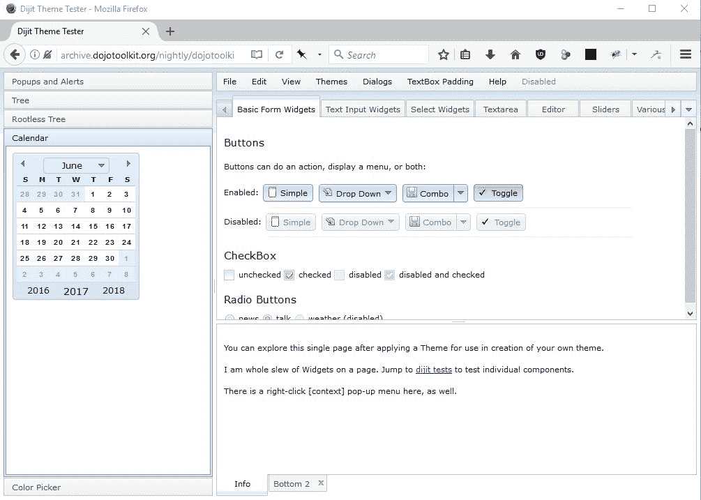
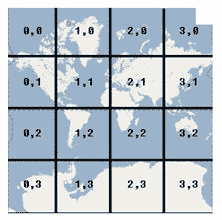
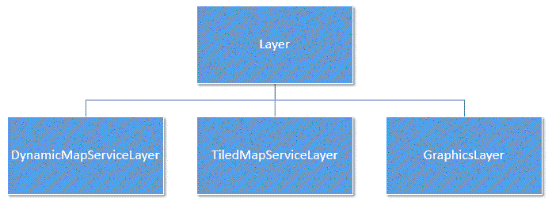
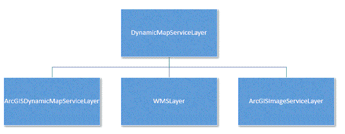
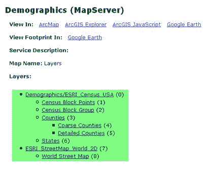
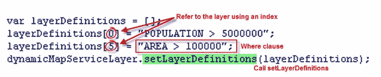
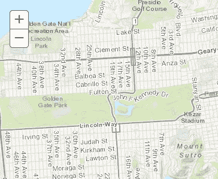
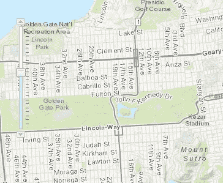
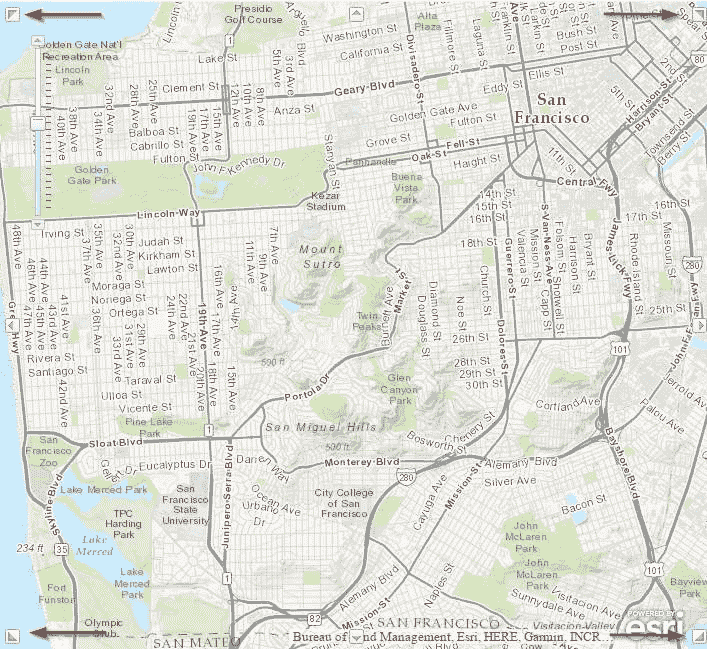
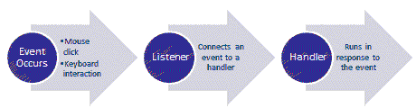

# 二、创建地图和添加图层

当学习一门新的编程语言或**应用编程接口** ( **API** )时，我们都要从某个地方开始。这同样适用于使用用于 JavaScript 的 ArcGIS 应用编程接口创建网络地图应用。您不仅需要了解一些基本的 JavaScript 概念，还需要掌握 HTML、CSS，当然还有用于 JavaScript 的 ArcGIS API，它实际上是建立在 Dojo JavaScript 框架之上的。这是一个很大的问题，所以在本章中，我们将让您创建一个非常基本的应用，作为您在接下来的章节中可以构建的基础。

模仿是学习编程技能的一个很好的方法，所以在这一章中，我将让你输入你看到的代码，我们将提供一些解释。我们将在后面的章节中保存代码的详细描述。

为了熟悉 ArcGIS for JavaScript API，您将在本章中创建一个简单的地图应用，该应用可以创建地图，添加几个数据图层，并提供一些基本的地图导航功能。

我们开始吧！

在本章中，我们将涵盖以下主题:

*   用于 JavaScript 沙盒的 ArcGIS 应用编程接口
*   使用 ArcGIS 应用编程接口创建应用的基本步骤
*   关于地图的更多信息
*   使用地图服务图层
*   切片地图服务图层
*   动态地图服务图层
*   地图导航
*   使用地图范围

# 用于 JavaScript 沙盒的 ArcGIS 应用编程接口

在本书中，您将使用用于 JavaScript 沙盒的 ArcGIS 应用编程接口来编写和测试您的代码。沙盒可以在[https://developers . ArcGIS . com/JavaScript/3/Sandbox/Sandbox . html](https://developers.arcgis.com/javascript/3/sandbox/sandbox.html)找到，加载后会出现如截图所示。您将在左窗格中编写代码，然后单击 REFRESH 按钮在右窗格中查看结果:


# 使用 ArcGIS 应用编程接口创建应用的基本步骤

现在我们已经掌握了 HTML、CSS 和 JavaScript 的一些基础知识，是时候真正开始工作并学习如何构建一些出色的 GIS web 应用了！本章中的材料将向您介绍一些基本概念，这些概念定义了如何创建地图以及如何以图层的形式向地图添加信息。

使用 ArcGIS for JavaScript API 创建任何地理信息系统网络应用都需要遵循几个步骤。如果您打算将地图作为应用的一部分，则总是需要执行这些步骤。考虑到你正在读这本书，我无法想象你不想这么做！简而言之，您需要遵循几个步骤:

*   为页面创建 HTML 代码
*   为 JavaScript 和样式表参考 ArcGIS 应用编程接口
*   加载模块
*   确保 DOM 可用
*   创建地图
*   定义页面内容
*   设置页面样式
*   整个代码

The **HTML Document Object Model** (**DOM**) is a hierarchical representation of all the elements that make up a web page. JavaScript uses the DOM to inspect and change the values of these page elements at runtime.

# 为页面创建 HTML 代码

在前一章中，您学习了 HTML、CSS 和 JavaScript 的基本概念。现在你要开始运用这些技能了。首先，您需要创建一个简单的 HTML 文档，它最终将作为地图的容器。因为我们将 ArcGIS 应用编程接口用于 JavaScript 沙盒，所以这一步已经为您完成了。但是，我确实希望您花一些时间检查代码，以便很好地掌握概念。在沙盒的左窗格中，突出显示的代码引用了网页的基本 HTML 代码。

显然还有一些其他的 HTML 和 JavaScript 代码，但是下面的代码构成了网页的基本组件。这包括几个基本标签，包括`<html>`、`<head>`、`<title>`、`<body>`和其他几个:

```js
<!DOCTYPE html>
  <html>
  <head>
  <meta http-equiv="Content-Type" content="text/html; charset=utf-8">
  <meta name="viewport" content="initial-scale=1, maximum-scale=1,user-scalable=no"/>
  <title>Simple Map</title>
 <!-- The following references the stylesheet for the ArcGIS API for JavaScript UI components -->
  ***<link rel="stylesheet" href="https://js.arcgis.com/3.21/esri/css/esri.css">***
  <style>
    html, body, #map {
      height: 100%;
      margin: 0;
      padding: 0;
    }
  </style>
  <!-- The following references the ArcGIS API for JavaScript -->
  *<script src="https://js.arcgis.com/3.21/"></script>*   <!-- The following script tag contains your custom application code -->
  ***<script>***
    var map;
    require(["esri/map", "dojo/domReady!"], function(Map) {
      map = new Map("map", {
        basemap: "topo", //For full list of pre-defined basemaps, navigate to http://arcg.is/1JVo6Wd
        center: [-122.45, 37.75], // longitude, latitude
        zoom: 13
      });
    });
  ***</script>***
</head>
<body>
  <div id="map"></div>
</body>
</html>
```

# 引用用于 JavaScript 的 ArcGIS 应用编程接口

要开始使用用于 JavaScript 的 ArcGIS 应用编程接口，您需要添加对样式表和应用编程接口的引用。在沙箱中`<head>`标签内添加了以下代码行:

```js
<link rel="stylesheet" href="https://js.arcgis.com/3.21/esri/css/esri.css"> 
... 
<script src="https://js.arcgis.com/3.21/"></script> 
```

`<script>`标签加载 JavaScript 的 ArcGIS API。在撰写本文时，该版本目前为`3.21`。当新版本的应用编程接口发布时，您需要相应地更新这个数字。`<link>`标签加载`esri.css`样式表，该样式表包含特定于 ESRI 小部件和组件的样式。

或者，您可以包含对 Dojo `dijit`主题的一个样式表的引用。JavaScript 的 ArcGIS API 直接构建在 Dojo JavaScript 框架上。Dojo 附带了四个预定义的主题，用于控制添加到应用中的用户界面小部件的外观:`claro`、`tundra`、`soria`和`nihilo`。在下面的代码示例中，我们引用了`claro`主题:

```js
<link rel="stylesheet" href="https://js.arcgis.com/3.21/dijit/themes/claro/claro.css"> 
```

其他可用的样式表可以被引用，如下面的代码示例所示。您不需要*来使用这些样式表中的任何一个，但是如果您打算添加 Dojo 用户界面组件(`dijit`)，那么您需要加载一个相应的样式表来控制这些组件的样式:*

```js
<link rel="stylesheet" href="https://js.arcgis.com/3.20/dijit/themes/tundra/tundra.css"> 
<link rel="stylesheet" href="https://js.arcgis.com/3.20/dijit/themes/nihilo/nihilo.css"> 
<link rel="stylesheet" href="https://js.arcgis.com/3.20/dijit/themes/soria/soria.css">
```

In version 3.16 of the API, ESRI added a new theme called *Calcite*. At the time of writing, it is still in beta and does not support all the Dojo components included in the API. If you want to include it in your applications despite its limitations, check out the documentation here: [https://developers.arcgis.com/javascript/3/jshelp/css.html](https://developers.arcgis.com/javascript/3/jshelp/css.html).

Dojo 工具包提供了一个主题测试器，您可以使用它来感受每个主题如何影响用户界面组件的显示。主题测试器位于[https://archive . dojotolkit . org/nightly/dojotolkit/dijit/themes tester . html](https://archive.dojotoolkit.org/nightly/dojotoolkit/dijit/themes/themeTester.html):



# 正在加载应用编程接口模块

在创建`Map`对象之前，您必须首先引用提供地图功能的模块。这是通过使用`require()`功能来实现的。

Whether to use the older legacy style of Dojo or the new AMD is a source of frustration for many developers. AMD, or Asynchronous Model Definition, was introduced at version 1.7 of Dojo. The 3.4 release of the ArcGIS Server API for JavaScript was the first version to have all modules re-written. For the time being both legacy and AMD style will work just fine, but we advise you to write all your new applications using the AMD style. This is becoming increasingly important as the drop date for Dojo 2.0 gets nearer, because this new version will no longer support the legacy style. We'll follow that convention in this book but keep in mind that applications written prior to version 3.4 of the API still reflect the older style of coding.

在开始向沙箱添加代码之前，请删除列出的以下代码。为确保删除正确的代码，请查找包含对`require()`函数调用的`<script>`标记。您需要移除打开`<script>`和关闭`</script>`标签之间的所有内容。您将自己编写 JavaScript 代码来创建地图:

```js
<script>
  var map;

  require(["esri/map", "dojo/domReady!"], function(Map) {
    map = new Map("map", {
      basemap: "topo", //For full list of pre-defined basemaps, 
      navigate to http://arcg.is/1JVo6Wd
      center: [-122.45, 37.75], // longitude, latitude
      zoom: 13
    });
  });
</script>
```

`require()`功能用于将资源导入您的网页。ArcGIS 应用编程接口为 JavaScript 提供了各种资源，包括`esri/map`资源，在创建地图或处理几何图形、图形和符号之前，必须引用该资源。一旦你有了对`esri/map`的引用，你可以使用`Map`构造器来创建地图。

您想要导入的模块必须包含在新的`<script>`标签中。将以下代码行添加到`<head>`标签内的沙箱中:

```js
<script>
 require([], function() {

 });
</script>
```

`require()`函数接受一个模块名称数组，后跟一个(通常是匿名的)`callback`函数，该函数将在模块所代表的资源被加载并可供应用使用时执行。

`callback`函数的参数是别名，用于引用代码中的模块。因此，函数的第一个参数将引用数组中的第一个模块元素，第二个参数将引用数组中的第二个模块元素，以此类推。

在`require()`函数的`callback`中使用的参数名可以被命名为任何你想要的名称。然而， [ESRI](https://developers.arcgis.com/en/javascript/jsapi/argument_aliases.html) 和[道场](https://docs.google.com/spreadsheet/ccc?key=0Avm8Hjje-xiXdFBVSURNdFpHSmNzOXlMcnU5V3k1Rmc#gid=0)都提供了首选参数名称列表，我们建议遵守这些列表，以便其他人更容易理解您的代码。

The ArcGIS API for JavaScript preferred aliases can be found here: [https://developers.arcgis.com/javascript/3/jsapi/argument_aliases.html](https://developers.arcgis.com/javascript/3/jsapi/argument_aliases.html) and the Dojo preferred aliases can be found in a Google Spreadsheet here: [http://preview.tinyurl.com/y8ajhy7y](http://preview.tinyurl.com/y8ajhy7y).

例如，在您添加的以下代码中，我们提供了对`esri/map`资源的引用，然后在匿名函数内部，我们提供了`Map`的首选参数。您在`require()`函数中引用的每个模块都将有一个关联的参数，该参数将为您的代码提供对该模块的访问，除了一个主要的例外，我们将介绍如下:

```js
<script>     
    require(["esri/map"], function(Map) { 

    });  
</script> 
```

# 确保 DOM 可用

当一个网页被加载时，组成该网页的所有 HTML 元素都会被加载和解释。这就是所谓的 **DOM** ( **文档对象模型**)。在所有元素都被加载之前，您的 JavaScript 不能试图访问这些元素中的任何一个。显然，如果您的 JavaScript 代码试图访问一个尚未加载的元素，它将导致一个错误。为了控制这一点，Dojo 有一个`ready()`函数，您可以将它包含在`require()`函数中，该函数只有在加载了所有的 HTML 元素和任何模块后才会执行。或者，您可以使用`dojo/domReady!`插件来确保所有的 HTML 元素已经被加载。我们将在这里使用第二种方法:

```js
<script>     
require(["esri/map", "dojo/domReady!"], function(Map) { 

    }); 
</script> 
```

注意，即使我们已经将`dojo/domReady!`模块包含在我们想要加载的模块列表中，我们也没有为它提供别名。这是因为尽管我们需要插件来通知应用 DOM 已经准备好了，但我们不需要在代码中明确引用它。这是我们前面提到的规则的例外。

Although it is certainly possible to add JavaScript code directly inside your HTML page, it is better practice to create a separate JavaScript file (`.js`). Most of the code that we write in this book will be done inside an HTML file for simplicity, but as your applications become more complex you'll want to adhere to the practice of writing your JavaScript code in a separate file or files.

# 创建地图

新地图的创建是通过`esri/Map`完成的，它是对您在上一步中导入的`esri/Map`模块中找到的`Map`类的引用。在`require()`函数中，您将使用构造函数创建新的`Map`对象。这个`Map`对象的构造函数接受两个参数，包括对`<div>`标签的引用，该标签是地图在网页上的放置位置，以及一个选项参数，可用于定义各种地图设置选项。选项参数被定义为包含一组键/值对的 **JSON** ( **JavaScript 对象符号**)对象。

也许最明显的选项是`basemap,`，它允许你从`ArcGIS.com`中选择一个预定义的`basemap`。预定义的`basemaps`包括`streets`、`satellite`、`hybrid`、`topo`、`gray`、`oceans`、`national-geographic`和`osm`。

A full list of pre-defined basemaps can be found here: [http://arcg.is/1JVo6Wd](http://arcg.is/1JVo6Wd).

`zoom`选项用于定义地图的起始缩放级别，并且是对应于预定义缩放比例级别的整数值。`minZoom`和`maxZoom`选项分别定义地图的最大和最小比例缩放级别。`center`选项指定将要显示的地图的中心点，并获取包含纬度/经度坐标对的`Point`对象。有许多附加选项可以作为参数传递给`Map`对象的构造函数，以改变地图的行为和外观。

首先，我们将通过添加以下突出显示的代码行来创建一个名为`map`的全局变量:

```js
<script>
  var map;
  require(["esri/map", "dojo/domReady!"], function(Map) {
  });
</script>
```

然后，将以下高亮显示的代码块添加到`require()`功能中。这一行代码是新的`Map`对象的构造函数。传递给构造函数的第一个参数是对 DOM 中出现地图的`<div>`标签的 id 的引用。我们还没有定义这个`<div>`标签，但是我们将在下一步中这样做。传递到`Map`构造器的第二个参数是一个 JSON 对象，它定义了包括地理坐标(用作地图中心)、缩放级别和`basemap: "topo"`在内的选项:

```js
 require(["esri/map", "dojo/domReady!"], function(Map) { 
 map = new Map("map", { 
    basemap: "topo", 
    center: [-122.19, 37.94], // longitude, latitude 
    zoom: 6 
  }); 
});  
```

# 创建页面内容

您需要创建 HTML `<div>`标签，作为地图的容器。您总是希望为`<div>`标签分配一个唯一的 id，以便您的 JavaScript 代码可以引用页面中的那个元素。如果您在沙盒中跟随，您会看到这已经为您完成了:

```js
<body>
  <div id="map"></div>
</body>
```

此外，如果您指定了一个 Dojo 样式表，您还需要为`<body>`标签定义`class`属性来引用它。在本例中，这并不是绝对必要的，因为我们不会使用任何可样式化的`dijit`，但这不会有什么坏处，因此将`<body>`标签更改为如下内容:

```js
<body class="claro"> 
   <div id="map"></div> 
</body> 
```

# 设计页面样式

您可以将 CSS 样式信息添加到`<head>`标签，该标签将修改页面元素的外观。沙盒代码包括以下样式，使地图占据整个 HTML 页面:

```js
<style>
html, body, #map {
  height: 100%;
  margin: 0;
  padding: 0;
}
</style>
```

# 整个代码

这个简单应用的代码应该如下所示:

```js
<!DOCTYPE html>
<html>
<head>
  <meta http-equiv="Content-Type" content="text/html; charset=utf-8">
  <meta name="viewport" content="initial-scale=1, maximum-scale=1,user-scalable=no" />
  <title>Simple Map</title>
  <link rel="stylesheet" href="https://js.arcgis.com/3.21/esri/css/esri.css">
  <style>
    html,
    body,
    #map {
      height: 100%;
      margin: 0;
      padding: 0;
    }
  </style>
  <script src="https://js.arcgis.com/3.21/"></script>
  <script>
    var map;
    require(["esri/map", "dojo/domReady!"], function(Map) {
      map = new Map("map", {
        basemap: "topo",
        center: [-122.19, 37.94], // longitude, latitude
        zoom: 6
      });
    });
  </script>
</head>
<body>
  <div id="map"></div>
</body>
</html>
```

通过单击“刷新”按钮执行代码，如果所有内容都已正确编码，您应该会看到下面的映射。如果您的应用没有按预期工作，请对照示例代码的`Chapter2`文件夹中的`basic_map.html`文件的内容检查您的代码:


# 关于地图的更多信息

您需要遵循前面我们为您使用 ArcGIS for JavaScript API 构建的每个应用描述的过程。

只有当您的 HTML 完成加载，并且所有必需的 DOM 元素和脚本都准备好了，地图的创建才能进行。您通过使用`require()`功能中的`domReady!`插件实现了这一点。这确保了作为第二个参数传递的函数中的代码只在一切就绪时执行。该功能被称为*初始化功能*:

```js
require(["esri/map", "dojo/domReady!"], function(Map) {
  // initialization goes here
});
```

您可以使用初始化功能来创建地图、添加图层以及执行启动应用所需的任何其他设置例程。

创建地图始终是您首先要做的事情之一，在本节中，我们将详细了解您在创建`Map`类实例时所拥有的各种选项。

在面向对象编程中，通过在类上调用一个名为*构造函数*的特殊方法，你可以创建一个类(比如`Map`)的实例(你自己的工作副本)。构造函数经常使用一个或多个参数来设置对象的初始状态。

`Map`构造函数接受两个参数:应该放置地图的 HTML 页面元素(a `<div>`)和一个选项对象，该对象在新创建的地图实例上设置各种属性以定义其行为。这包括要使用的底图、地图的初始范围、导航控件的显示、平移过程中图形的显示方式、要使用的缩放滑块控件类型等等。

构造函数中的第二个参数总是用大括号括起来。这告诉 JavaScript 解释器您正在提供一个 JavaScript 对象。

The JavaScript object syntax is known as JSON, and has many uses outside of JavaScript too.

在大括号内，映射选项(对象的属性)被指定为键/值对。如果提供多个选项，必须用逗号分隔。在以下示例中，我们定义了用作地图中心的地图坐标选项、缩放级别和`streets`底图图层:

```js
      var map = new Map("mapDiv", { 
        center: [-56.049, 38.485], 
        zoom: 3, 
        basemap: "streets" 
      }); 
```

# 使用地图服务图层

没有数据层的地图就像是一个拥有空白画布的艺术家。添加到地图中的数据图层赋予了地图意义，并为分析奠定了基础。这些数据图层来自 ArcGIS Server 发布的地图服务，偶尔也会来自其他 GIS 服务器。ArcGIS Server 提供的两种主要图层类型是动态地图服务图层和切片(或缓存)地图服务图层。

动态地图服务层引用地图服务，这些服务动态创建地图图像，然后将图像返回给应用。这种类型的地图服务可能由一层或多层信息组成。例如，以下屏幕截图中显示的人口统计地图服务由九个不同的图层组成，代表不同地理级别的人口统计信息:


虽然在客户端应用中显示动态地图服务图层可能需要更长时间，因为它们必须“动态”生成，但动态地图服务图层比切片地图服务图层更通用，因为您可以使用图层定义过滤显示的特征，设置服务中各种图层的可见性，并定义图层的时间信息。例如，在上面提到的人口统计地图服务图层中，您可以选择在应用中仅显示人口普查块组。这是动态地图服务图层提供的多功能性类型，您无法通过切片地图服务图层获得。

切片地图服务图层引用预定义的地图切片缓存，而不是动态呈现的图像。理解切片地图服务概念的最简单方法是考虑一个覆盖在地图表面的网格。网格中的每个单元大小相同，将用于将地图切割成称为切片的单个图像文件。单个切片作为图像文件存储在服务器上，并根据地图范围和比例根据需要进行检索。同样的过程经常在不同的地图比例下重复。最终结果是为各种地图比例生成的平铺显示缓存。当地图显示在应用中时，即使它由许多独立的图块组成，它也会看起来是无缝的:



这些切片或缓存的地图图层通常用作基础地图，如影像、街道地图和地形图，或者用于不常更改的数据图层。切片地图服务往往显示得更快，因为服务器不必在每次有地图请求时都动态创建图像。

*操作*图层然后覆盖在平铺的基础地图上，这些通常是动态图层。虽然动态地图服务图层在性能方面可能会稍慢一些，但它具有始终保持最新的优势，并且您的应用能够在浏览器中呈现它们之前更改它们的内容和外观。

# 使用图层类

您可以使用 JavaScript 应用编程接口中的各种图层类来引用由 ArcGIS Server 和其他地图服务器托管的地图服务。所有图层类都继承自`Layer`基类。`Layer`类没有构造函数，因此您不能从该类创建实际的对象实例。这个基类只是定义属性、方法和事件，这些属性、方法和事件必须存在于从它继承的所有类中:



如上图所示，`DynamicMapServiceLayer`、`TiledMapServiceLayer`、`GraphicsLayer`都是直接继承自`Layer`类。(请注意，还有其他几个继承自`Layer`的层，但是其中许多是针对特殊用例的，所以我们的图只显示了这些更常用的类。)

`DynamicMapServiceLayer`和`TiledMapserviceLayer`也作为基类。`DynamicMapServiceLayer`是动态地图服务的基类，`TiledMapServiceLayer`是切片地图服务的基类。`Layer`、`DynamicMapServiceLayer`和`TiledMapServiceLayer`都是基类，这意味着您不能在应用中专门从这些类创建对象。

# 切片地图服务图层

正如我提到的，切片地图服务图层引用预定义图像的缓存，这些图像平铺在一起以创建无缝的地图显示。因为这些切片是预先生成的，所以 ArcGIS Server 不需要动态创建它们，这通常意味着性能非常出色。因此，它们经常被用作底图，这些底图在地图上很丰富，因此渲染成本很高:


当引用由 ArcGIS Server 公开的切片(缓存)地图服务时，将使用`ArcGISTiledMapServiceLayer`类。这是继承自`TiledMapServiceLayer`类的几个切片地图服务图层类型之一，但它是我们图表中显示的唯一一个，因为它是迄今为止最常用的，也是我们将在本书中讨论的唯一一个。

由于这种类型的对象是针对预先生成的地图切片缓存工作的，因此性能通常非常出色。`ArcGISTiledMapServiceLayer`的构造函数需要一个指向地图服务端点的网址，以及一个可选的选项对象，该对象允许您为地图服务分配一个标识，并控制透明度和可见性。下面的代码示例创建一个无选项的`ArcGISTiledMapServiceLayer`，然后调用`Map.addLayer()`将图层添加到地图中:

```js
var basemap = new ArcGISTiledMapServiceLayer("http://server.arcgisonline.com/ArcGIS/rest/services/World_Topo_Map/MapServer"); 
   map.addLayer(basemap); 

```

因此，`ArcGISTiledMapServiceLayer`主要用于快速显示缓存的地图数据:要么是底图，要么是不常变化的复杂制图。(如果数据发生变化，您必须重新创建缓存)。您还可以控制数据显示的级别。例如，当您的用户缩小到 0-6 级时，您可能希望显示来自显示州际公路的更通用的切片地图服务的数据，然后在用户进一步放大时切换到更详细的视图。您还可以控制添加到地图中的每个图层的透明度。

# 动态地图服务图层

顾名思义，`ArcGISDynamicMapServiceLayer`类用于创建由 ArcGIS Server 提供的动态地图，其中所有地图图像都是动态呈现的。

就像`ArcGISTiledMapServiceLayer`一样，`ArcGISDynamicMapServiceLayer`构造函数为地图服务获取一个 URL 端点，以及用于为服务分配 ID、指定地图图像透明度或设置图层初始可见性的可选参数:



类名`ArcGISDynamicMapServiceLayer`可能有些误导。虽然它看起来引用了一个单独的数据层，但实际上并非如此。它指的是地图*服务*而不是数据层。地图服务内的单个图层可以通过类`setVisibleLayers()`方法打开/关闭。

创建`ArcGISDynamicMapServiceLayer`实例的代码看起来非常类似于使用`ArcGISTiledMapServiceLayer`的代码，如下所示。

构造函数接受地图服务端点的 URL。第二个参数接受您可以提供来控制透明度、可见性和图像参数的 options 对象:

```js
var operationalLayer = new ArcGISDynamicMapServiceLayer("https://sampleserver1.arcgisonline.com/ArcGIS/rest/services/Demoimg/ESRI_Population_World/MapServer",{"opacity":0.5}); 
map.addLayer(operationalLayer); 
```

在创建地图的代码行下，将前面两行代码添加到用于 JavaScript 沙盒的 ArcGIS API 中。还要确保在`require()`功能中引用`esri/layers/ArcGISDynamicMapServiceLayer`:

```js
require(["esri/map", "esri/layers/ArcGISDynamicMapServiceLayer", "dojo/domReady!"],
   function(Map, ArcGISDynamicMapServiceLayer) {
      map = new Map("map", {
         basemap: "topo",
         center: [-122.19, 37.94], // longitude, latitude
         zoom: 6
      });
 var operationalLayer = new ArcGISDynamicMapServiceLayer("https://sampleserver1.arcgisonline.com
 ArcGIS/rest/services/Demoimg/ESRI_Population_World/MapServer",{"opacity":0.5});
 map.addLayer(operationalLayer);
});
```

单击沙箱中的刷新按钮，查看添加到地图中的动态图层，如下图所示:


有了`ArcGISDynamicMapServiceLayer`的实例，您可以执行许多操作。显然，您可以创建在服务中显示数据的地图，但也可以从服务中的图层查询数据、通过图层定义控制特征显示、控制单个图层的可见性、显示时态信息、将地图导出为图像、控制背景透明度等等。

# 向地图添加图层

**`Map.addLayer()`** 方法将一个图层的实例(在我们的示例中为`ArcGISDynamicMapServiceLayer`或`ArcGISTiledMapServiceLayer`)作为第一个参数，以及一个可选的索引，该索引指定了该图层应该放置的位置。如果您没有指定索引，图层将被放置在地图中所有其他图层的顶部，这通常是您想要的，这样您就可以确保它是可见的。

在下面的代码示例中，我们创建了`ArcGISDynamicMapServiceLayer`的新实例。然后我们调用`Map.addLayer()`，传入层的新实例。服务中的图层现在将在地图上可见:

```js
var operationalLayer = new ArcGISDynamicMapServiceLayer("http://sampleserver1.arcgisonline.com/ArcGIS/rest/services/Demoimg/ESRI_Population_World/MapServer"); 
map.addLayer(operationalLayer); 
```

如果想一次添加多个图层到地图中，可以使用`Map.addLayers()`，它接受一组图层对象。

除了可以向地图添加图层，您还可以使用`Map.removeLayer(*layer*)`或`Map.removeAllLayers()`移除图层。

# 从地图服务设置可见图层

您可以使用`setVisibleLayers()`方法控制动态地图服务图层中各个图层的可见性。这仅适用于动态地图服务图层，不适用于切片地图服务图层。此方法采用与地图服务中的数据图层相对应的整数数组。该数组从零开始，因此地图服务中的第一个图层占据位置 0。在下图所示的人口统计地图服务中，人口统计/ESRI 人口普查美国(0)占据了索引 0:



因此，如果我们希望只显示该服务中的普查区块点和普查区块组，我们可以使用`setVisibleLayers()`，如代码示例所示，如下所示:

```js
var dynamicMapServiceLayer = new ArcGISDynamicMapServiceLayer("http://sampleserver1.arcgisonline.com
   /ArcGIS/rest/services/Demoimg/ESRI_Census_USA/MapServer"); 
dynamicMapServiceLayer.setVisibleLayers([0,1]); 
map.addLayer(dynamicMapServiceLayer); 

```

# 设置定义表达式

在 ArcGIS Desktop 中，您可以使用定义表达式来指定要显示的数据图层中所有特征的子集。定义表达式只是针对图层数据的一个 SQL 查询。仅显示属性符合查询的特征。例如，如果您只想显示人口超过 100 万的城市，则表达式类似于`POPULATION > 1000000`。用于 JavaScript 的 ArcGIS API 有一个`setLayerDefinitions()`方法，该方法接受一系列定义，这些定义可以应用于`ArcGISDynamicMapServiceLayer`来控制生成的地图中特征的显示。下面的代码示例显示了如何做到这一点:



首先，创建一个包含多个`WHERE`子句的数组，这些子句将作为每个层的定义表达式。在这种情况下，我们为第一层(索引位置 0)和第六层(索引位置 5)定义层定义。请记住，数组是从零开始的，因此第一个数组位于索引位置 0。`WHERE`子句存储在数组中，然后传递到`setLayerDefinitions()`方法中。然后，ArcGIS Server 会渲染与每个图层的定义表达式相匹配的特征。

# 地图导航

现在您已经对地图和地图中的图层有了一些了解，是时候学习如何在应用中控制地图导航了。在大多数情况下，您的用户需要能够通过平移和缩放在地图上导航。用于 JavaScript 的 ArcGIS API 提供了许多用户界面小部件和工具栏，您可以使用它们来允许用户更改当前地图范围。地图导航可以由鼠标、键盘或二者的组合来控制。此外，您可以通过编程方式控制地图导航。

# 地图导航小部件和工具栏

向应用提供地图导航控制的最简单方法是添加各种小部件和工具栏。默认情况下，当您创建新地图并添加图层时，地图会包含缩放滑块。此滑块允许用户通过分别单击加号或减号按钮来放大和缩小地图。缩放滑块如下图所示。您不必编写任何代码来让缩放滑块出现在地图上。默认情况下，它存在:



但是，如果您的应用不需要滑块，您可以通过在传递到`Map`构造函数的地图选项对象中将`slider`选项设置为`false`来移除滑块:

```js
{ slider: false }
```

默认情况下，用于 JavaScript 的 ArcGIS API 显示滑块的*小版本*。如果你想让你的用户更精细地控制地图的缩放级别，你可以使用*大*滑块来代替:

```js
{ sliderStyle: "large" }
```



您还可以添加平移按钮，这些按钮将按单击时箭头指向的方向平移地图。默认情况下，平移按钮不会出现在地图上。创建`Map`对象时，必须特别将`nav`选项设置为`true`:

```js
{ nav: true } 
```

这样做的结果是在地图的角落添加了小的方向按钮:



用于 JavaScript 的 ArcGIS API 还使您能够向应用添加几种类型的工具栏，包括导航工具栏，该工具栏包含用于放大和缩小、平移、完整范围、下一个范围和上一个范围的按钮。工具栏创建的主题将在后面的章节中详细介绍，所以我们将把这个讨论留到以后:


# 用鼠标和键盘进行地图导航

用户还可以使用鼠标和/或键盘设备控制地图导航。默认情况下，用户可以执行以下操作:

*   拖动鼠标平移
*   鼠标向前滚动以放大
*   鼠标向后滚动以缩小
*   *SHIFT +拖动鼠标放大* +拖动鼠标放大
*   *Shift* + *Ctrl* +拖动鼠标缩小
*   *移动* +点击重新设置
*   双击 zenter 并放大
*   *移动* +双击居中并缩小
*   使用箭头键平移
*   使用 *+* 键放大一个级别
*   使用 *-* 键缩小一个级别

可以使用几种`Map`方法中的一种来禁用这些选项。例如，要禁用滚轮缩放，您可以使用`Map.disableScrollWheelZoom()`方法。这些导航功能也可以在地图加载后删除。这可能非常有用。例如，假设您有一个自定义工具，要求用户双击地图来选择特征。当您的工具正在使用时，您会想要呼叫`Map.disableDoubleClickZoom()`，当您的用户使用完它时，您会想要呼叫`Map.enableDoubleClickZoom()`。

# 获取和设置地图范围

你首先要掌握的事情之一是获取和设置地图范围。默认情况下，应用中地图的初始范围是上次保存在用于创建地图服务的地图文档文件(`.mxd`)中时的地图范围。在某些情况下，这可能正是您想要的，但是如果您需要设置默认范围以外的地图范围，您有几个选项。

可以在构造函数中为`Map`对象定义的可选参数之一是`center`参数。您可以结合使用`zoom`对象来设置初始地图范围。您将在下面的代码示例中看到这一点，其中我们为地图中心定义了一个坐标对，缩放级别为 3:

```js
var map = new Map("mapDiv", { 
        center: [-56.049, 38.485], 
        zoom: 3, 
        basemap: "streets" 
      }); 
```

地图的初始范围不是必需的参数，因此如果您忽略此信息，地图将只使用默认范围。下面的代码示例显示了这一点，其中在映射的构造函数中只指定了容器的 ID，而没有提供映射选项对象:

```js
var map = new Map("map"); 
```

创建`Map`对象后，您还可以使用`Map.setExtent()`方法通过传入`Extent`对象来更改范围，如代码示例所示，如下所示:

```js
var extent = new Extent(-95.271, 38.933, -95.228, 38.976); 
map.setExtent(extent); 
```

或者，您可以单独设置`Extent`属性，如代码示例所示，如下所示:

```js
var extent = new Extent(); 
extent.xmin = -95.271; 
extent.ymin = 38.933; 
extent.xmax = -95.228; 
extent.ymax = 38.976; 
map.setExtent(extent); 
```

有时您可能会在应用中使用多个地图服务。在这种情况下，可以通过地图的构造函数或在其中一个服务上使用`Map.fullExtent()`方法来设置初始地图范围。例如，通常使用一个提供包含航空影像的基础图层功能的地图服务，以及一个包含您自己的本地操作数据的地图服务。下面的代码示例使用`fullExtent()`方法将地图的范围设置为`myService2`图层的范围:

```js
map = new Map("mapDiv", {extent: myService2.fullExtent) }); 
```

当前范围可以通过`Map.extent`属性或`onExtentChange`事件获得。我们稍后将讨论地图事件。

Note that the `Map.extent` property is read-only, so don't attempt to set the map extent directly through this property. Always use the `Map.setExtent()` accessor method.

# 地图事件

在编程中，事件是发生在应用中的动作。通常情况下，这些事件由最终用户触发，可能包括鼠标点击、鼠标拖动、键盘操作等，但也可能包括数据的发送和接收、用户界面组件状态的变化以及许多其他情况。

用于 JavaScript 的 ArcGIS 应用编程接口是一个异步应用编程接口，遵循发布/订阅模式，其中应用向侦听器(订阅者)注册(发布)事件。下图说明了这一过程。侦听器负责监视应用的这些事件，然后触发响应事件的处理函数。多个事件可以注册到同一个侦听器中。dojo `on()`函数创建了一个将事件与处理函数相关联的监听器:



您可能还记得，ArcGIS Server JavaScript 应用编程接口是建立在道场之上的。对于 Dojo，事件通过 dojo `on()`方法注册到处理程序。该方法采用三个参数。请看下面的代码示例，以更好地理解事件是如何注册的:


在前面的例子中，`on()`的前两个参数指定了我们想要收听的对象和该对象上的事件类型。在这种情况下，这意味着我们正在注册在`Map`对象上发现的`click`事件。每当用户在地图范围内单击鼠标时，都会触发此事件。最后一个参数`displayCoordinates`指定了事件引发时执行的处理函数。这个函数的内容没有显示，这是我们必须自己写的东西来响应被点击的地图。

因此，每当触发`Map`对象上的`click`事件时，它将触发`displayCoordinates`功能，一旦我们编写好了该功能，它将执行并报告地图的当前范围。虽然事件和它们注册到的处理程序会根据您的情况而变化，但是注册的方法是相同的。

每次事件发生时，都会生成一个`Event`对象。这个`Event`对象包含额外的事件信息，比如点击的鼠标按钮或者按下的键盘按键。这个对象被自动传递到事件处理程序中，在那里它可以被检查。请注意，在下面的代码示例中，`Event`对象作为参数被传递到处理程序中。这是一个动态对象，其属性将根据触发的事件类型而变化。

```js
function addPoint(evt) { 
    alert(evt.mapPoint.x, evt.mapPoint.y); 
} 
```

在应用编程接口的许多不同对象上有许多不同的事件。但是，重要的是要记住，您不必向侦听器注册每个事件。只有那些对你的申请是必要的事件应该被登记。当未向侦听器注册的事件发生时，该事件将被忽略。

`Map`对象包含许多您可以响应的不同事件，包括各种鼠标事件、范围更改事件、底图更改事件、键盘事件、图层事件、平移和缩放事件等。您的应用可以响应任何这些事件。在接下来的章节中，我们将研究其他对象上可用的事件。

当不再需要您的监听器时，总是断开它们是一个很好的编程实践。只需在监听器上调用`remove()`方法，如下所示:

```js
var mapClickEvent = on(myMap, "click", displayCoordinates); 
mapClickEvent.remove(); 
```

# 摘要

我们在这一章中谈了很多。使用用于 JavaScript 的 ArcGIS 应用编程接口创建的所有应用都要求您执行某些步骤。这些包括定义对 API 和样式表的引用、加载模块、创建初始化函数等等。在初始化函数中，您很可能会创建一个`Map`类的实例，添加各种层，并执行在使用应用之前需要执行的其他设置操作。在本章中，您学习了如何执行这些任务。

此外，我们还研究了可以添加到地图中的各种类型的图层，包括切片地图服务图层和动态地图服务图层。切片地图服务图层是在服务器上预先创建和缓存的，最常用作应用中的底图。每次发出请求时，都必须动态创建动态地图服务图层，因此生成时间可能会更长。但是，动态地图服务图层可用于执行多种类型的操作，包括查询、设置定义表达式等，并且始终显示最新版本的数据。

您还学习了如何通过使用小部件和工具栏在应用中提供导航工具。此外，您还学习了如何以编程方式控制地图范围。最后，我们介绍了事件主题，您学习了如何将事件连接到事件处理程序，它只是一个 JavaScript 函数，在特定事件被触发时随时运行。

在下一章中，我们将研究如何向应用中添加图形。*