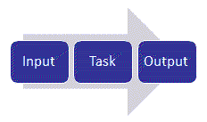
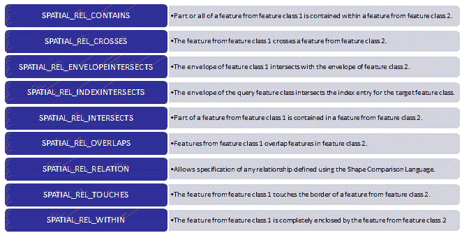
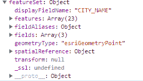
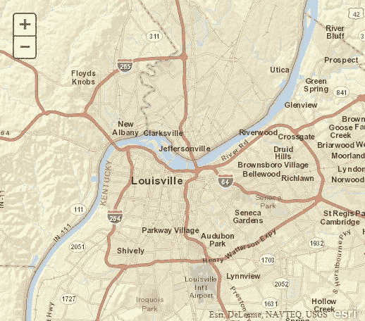
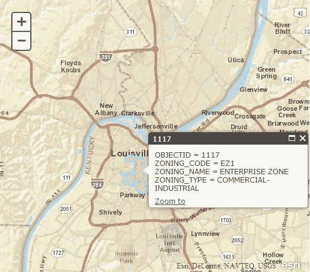

# 六、执行空间和属性查询

JavaScript 的 ArcGIS API`QueryTask`使您能够针对地图服务中的数据图层执行属性和空间查询。您也可以创建两者结合的查询。例如，您可能需要找到评估值大于 100，000 美元的所有地块，这些地块与 100 年的洪泛区相交。

在本章中，您将学习如何在用于 JavaScript 的 ArcGIS API 中使用`Query`、`QueryTask`和`FeatureSet`对象执行属性和空间查询。

我们将涵盖以下主题:

*   在 ArcGIS Server 中介绍任务
*   属性和空间查询概述
*   `Query`对象
*   用`QueryTask`执行查询
*   练习空间查询的时间

# 在 ArcGIS Server 中介绍任务

用于 JavaScript 的 ArcGIS 应用编程接口允许您通过使用任务框架将强大的地理信息系统功能整合到您的应用中。

任务使您能够执行空间和属性查询、基于文本搜索查找特征、地理编码地址、识别特征以及执行各种几何操作，包括缓冲和距离测量。任务及其相关对象位于`esri` / `tasks`命名空间中。

用于 JavaScript 的 ArcGIS API 中的所有任务都遵循相同的通用模式，因此，一旦您学会了如何使用一种类型的任务，就可以轻松地使用另一种类型的任务。

最基本的任务工作流程包括:

*   创建一个对象来表示任务的输入参数
*   执行任务
*   解包任务返回的对象，包含任务输出:



The Task Framework

# 属性和空间查询概述

`QueryTask`也不例外。它包括使用一系列对象向任务提供输入、执行任务以及处理返回的结果。属性或空间查询的输入参数存储在描述您要执行的查询的性质的`Query`对象中。`QueryTask`对象使用`Query`对象中提供的信息执行任务。结果以`FeatureSet`对象的形式返回。这包含一系列`Graphic`特征，您可以在地图上显示这些特征。

用作`QueryTask`输入的`Query`对象包含的属性包括`geometry`、`where`和`text`。

`geometry`属性用于提供用于空间查询的几何图形，可以是点、线或面。

`where`属性用于定义属性查询，而`text`属性用于执行`SQL WHERE *field_name* LIKE *value*`查询。

其他`Query`对象属性包括对查询将返回的字段进行子集化的能力、返回的几何图形的输出空间参考，以及是否返回结果集中特征的几何图形:


上图定义了创建属性和空间查询时将使用的对象序列。

# 查询对象

为了让`QueryTask`对象对地图服务中的图层执行查询，您需要在`Query`对象中定义查询。

`Query`对象将指定查询是空间的、属性的还是两者的组合。

属性查询可以由`where`或`text`属性定义。这些属性用于定义一个 SQL 属性查询。我们一会儿来看看`Query.where`和`Query.text`的区别。

空间查询要求您设置`Query.geometry`属性来定义构成空间查询基础的输入几何图形。

创建`Query`对象的新实例就像在没有参数的情况下调用其构造函数一样简单:

```js
var query = new  Query(); 
```

# 设置查询属性

至少，您需要指定要创建的查询是属性查询、空间查询还是两者都有。

# 属性查询

`Query`对象提供了两个可以在属性查询中使用的属性:`Query.where`和`Query.text`。

在下面的代码示例中，设置`Query.where`属性，以便只返回`STATE_NAME`字段等于`'Texas'`的记录。这只是一个标准的 SQL 查询。请注意，我们已经用引号将德州这个词括起来了。对文本列执行属性查询时，需要用单引号或双引号将要计算的文本括起来。如果要对包含其他数据类型(如数字或布尔值)的列执行属性查询，则不需要这样做:

```js
query.where = "STATE_NAME = 'Texas'";  
```

您也可以使用`Query.text`属性来执行属性查询。这是使用`LIKE`创建一个 SQL `WHERE`子句的简写方式。查询中使用的字段是地图文档中定义的图层的显示字段。您可以通过查看 ArcGIS 服务目录来确定图层的显示字段。下面的截图说明了这一点，其中分区名称是显示字段。

使用`Query.text`属性查询的就是这个显示字段:


下面的代码示例使用`query.text`执行属性查询，该属性查询返回地图服务中图层的所有特征，其中显示字段的值包含用户在网页上的表单字段中输入的状态名称:

```js
query = new Query();
query.returnGeometry = false;  // don't return geometries, just attributes
query.outFields = ['*'];       // return all attribute fields 
query.text = dom.byId("stateName").value; 
queryTask.execute(query, showResults); 
```

# 空间查询

要对图层执行空间查询，您需要传入一个有效的几何对象，以便与空间关系一起在空间过滤器中使用。有效的几何图形包括`Extent`、`Point`、`Polyline`和`Polygon`的实例。空间关系通过`Query.spatialRelationship`属性设置，并在查询过程中应用。空间关系通过使用下表中描述的常数值之一来定义:



以下代码示例将`Point`对象设置为传递到空间过滤器的几何图形，并设置空间关系:

```js
query.geometry = evt.mapPoint; 
query.spatialRelationship = SPATIAL_REL_INTERSECTS; 
```

代码片段中定义的查询实际上是请求与用户在地图上单击的点相交的所有特征。

# 限制返回的字段

附加到`FeatureSet`的每一列信息都是必须从服务器传递到浏览器的附加数据。因此，为了提高性能，您应该只包括应用所需的字段。如果打算在地图上绘制特征几何，也应该只返回它们。

要指定所需的字段，请创建一个包含字段名的数组，并将其分配给`Query.outFields`属性，如下面的代码示例所示。要返回所有字段，您可以使用`outFields = ['*']`。

默认情况下，会返回特征几何。但是如果您不需要，例如，如果您打算在地图上仅显示数据而不显示关联特征的位置，请设置`Query.returnGeometry = false`:

```js
query.outFields = ["NAME", "POP2000", "POP2007"]; 
query.returnGeometry = false; 
```

# 使用 QueryTask 执行查询

一旦在`Query`对象中定义了查询的性质，就可以使用`QueryTask`来执行查询。

首先，创建一个`QueryTask`对象的实例。通过将执行查询的图层的网址传递给其构造函数，可以创建一个`QueryTask`对象。请注意，在下面的代码示例中，地图服务 URL 包含一个索引号，该索引号引用了将被查询的地图服务中的特定图层:

```js
myQueryTask = new 
QueryTask("http://sampleserver1.arcgisonline.com/ArcGIS/rest/services/Demoimg/ESRI_CENSUS_USA/MapServer/5"); 
```

一旦创建了`QueryTask`对象，就可以对其图层执行查询，将`Query`对象传递给其`QueryTask.execute()`方法。

`QueryTask.execute()`接受三个参数:`Query`对象，操作成功时调用的函数，操作失败时调用的函数。

`QueryTask.execute()`的语法如下:

```js
QueryTask.execute(objQuery,callback?,errback?) 
```

假设查询执行无误，将调用成功的`callback`函数，并将一个`FeatureSet`对象传递给该函数。如果在执行查询过程中出现错误，则执行错误`callback`功能。成功和错误`callback`功能都是可选的。这总是让我觉得有点奇怪:如果你对结果不感兴趣，执行查询有什么意义？但是检查任何错误是一个好主意，这样您的应用就可以正常地失败。

此时，您可能会对这些`callback`和`errback`功能感到疑惑。ArcGIS Server 中的大多数任务都会返回一个`dojo.Deferred`实例。一个`Deferred`对象是一个类，在`Dojo`中用作管理异步线程的基础。ArcGIS Server 中的任务可以是同步的，也可以是异步的。

异步和同步定义了客户端(使用任务的应用)如何与服务器交互并检索任务生成的结果。当服务设置为同步时，客户端等待任务完成。通常，同步任务执行得很快(最多一两秒钟)。异步任务通常需要更长的时间来执行，客户端不会等待任务完成。在任务执行期间，最终用户可以继续使用应用。当一个任务在服务器上完成时，它调用`callback`函数，并将结果传递给该函数，然后在那里它们可以以某种方式使用。它们经常显示在地图上。

让我们看一个更完整的代码示例。在下面，我们首先创建一个名为`myQueryTask`的新变量，它指向`ESRI_CENSUS_USA`地图服务中的第 6 层(索引号从零开始)。然后我们创建包含查询输入属性的`Query`对象，最后我们使用`QueryTask`上的`execute()`方法来执行查询。`execute()`方法返回一个包含查询结果的`FeatureSet`对象，这些特征通过一个名为`showResults`的`callback`函数进行处理。如果任务执行过程中出现错误，将调用`errorCallback()`函数:

```js
myQueryTask = new esri.tasks.QueryTask("http://sampleserver1.arcgisonline.com/ArcGIS/rest/services/Demoimg/ESRI_CENSUS_USA/MapServer/5"); 
// build query filter 
myQuery = new esri.tasks.Query();
myQuery.returnGeometry = false;
myQuery.outFields = ["STATE_NAME", "POP2007", "MALES", "FEMALES"];
myQuery.text = 'Oregon';// execute query
myQueryTask.execute(myQuery, showResults, errorCallback);
function showResults(fs) { 
    // do something with the results 
    // they are returned as a FeatureSet object 
} 

Function errorCallback() { 
    alert("An error occurred during task execution"); 
} 

```

# 获取查询结果

正如我前面提到的，查询的结果作为`FeatureSet`对象返回到您的应用。如果您请求了由查询返回的特征的几何图形(默认行为)，这些几何图形将作为一组`Graphic`对象包含在`FeatureSet`对象的`features`属性中。这使得在地图上绘制它们变得微不足道。这在截图中显示如下:



阵列中的每个特征(类型为`Graphic`)可以包含几何图形、属性、符号系统和`InfoTemplate`，如[第 3 章](03.html#21PMQ0-04e5af4e38cd4963a2a647b690867dc7)、*向地图添加图形*所述。

下面的代码示例显示了一个`callback`函数，当查询完成执行时，该函数被执行以处理`FeatureSet`:

```js
Function addPolysToMap(featureSet) { 
var features = featureSet.features; 
var feature; 
for (i=0, il=features.length; i<il; i++) { 
feature = features[i]; 
   attributes = feature.attributes; 
   pop = attributes.POP90_SQMI; 
map.graphics.add(features[i].setSymbol(sym)); 
    } 
}       
```

# 练习空间查询的时间

在本练习中，您将练习在用于 JavaScript 的 ArcGIS API 中使用`Query`、`QueryTask`和`FeatureSet`对象执行空间查询。我们将查询和显示肯塔基州路易斯维尔土地记录层的记录。

按照给定的步骤完成练习:

1.  打开[https://developers . ArcGIS . com/JavaScript/3/Sandbox/Sandbox . html](https://developers.arcgis.com/javascript/3/sandbox/sandbox.html)处的 JavaScript Sandbox。
2.  删除我突出显示的`<script>`标签中的所有 JavaScript 内容，如下所示:

```js
<script> 
  var map; 

  require(["esri/map", "dojo/domReady!"], function(Map) { 
    map = new Map("map", { 
      basemap: "topo",  //For full list of pre-defined basemaps, 
      navigate to http://arcg.is/1JVo6Wd 
      center: [-122.45, 37.75], // longitude, latitude 
      zoom: 13 
    }); 
  }); 
</script> 
```

3.  创建变量来存储`map`对象、`QueryTask`和`Query`对象、符号和信息模板:

```js
<script> 
  var map, query, queryTask; 
  var symbol, infoTemplate; 
</script> 
```

4.  添加`require()`功能，如高亮显示的代码所示，如下所示:

```js
 <script> 
  var map, query, queryTask; 
  var symbol, infoTemplate; 

  require([ 
  "esri/map", "esri/tasks/query",                         
  "esri/tasks/QueryTask", "esri/tasks/FeatureSet",       
  "esri/symbols/SimpleFillSymbol", "esri/symbols/SimpleLineSymbol", 
  "esri/InfoTemplate", "dojo/_base/Color", "dojo/on", 
  "dojo/domReady!" 
  ], function(Map, Query, QueryTask, FeatureSet, 
  SimpleFillSymbol, SimpleLineSymbol,  
  InfoTemplate, Color, on) { 
  }); 
</script>

```

5.  在`require()`功能中，创建`map`对象。地图将以肯塔基州路易斯维尔地区为中心:

```js
<script> 
  var map, query, queryTask; 
  var symbol, infoTemplate; 

  require([ 
  "esri/map", "esri/tasks/query", "esri/tasks/QueryTask", 
  "esri/tasks/FeatureSet", "esri/symbols/SimpleFillSymbol", 
  "esri/symbols/SimpleLineSymbol", "esri/InfoTemplate",  
  "dojo/_base/Color", "dojo/on", "dojo/domReady!" 
  ], function(Map, Query, QueryTask, FeatureSet, 
  SimpleFillSymbol, SimpleLineSymbol, InfoTemplate, Color, on) { 
    map = new Map("map",{ 
      basemap: "streets", 
      center:[-85.748, 38.249], //long, lat 
      zoom: 13  
    }); 
  }); 
</script> 
```

6.  创建将用于显示查询结果的符号:

```js
<script> 
  var map, query, queryTask; 
  var symbol, infoTemplate; 

  require([ 
  "esri/map", "esri/tasks/query", "esri/tasks/QueryTask", 
  "esri/tasks/FeatureSet", "esri/symbols/SimpleFillSymbol", 
  "esri/symbols/SimpleLineSymbol", "esri/InfoTemplate",  
  "dojo/_base/Color", "dojo/on", "dojo/domReady!" 
  ], function(Map, Query, QueryTask, FeatureSet, SimpleFillSymbol, 
  SimpleLineSymbol, InfoTemplate, Color, on) { 
    map = new Map("map",{ 
      basemap: "streets", 
      center:[-85.748, 38.249], //long, lat 
      zoom: 13  
    }); 

 symbol = new SimpleFillSymbol(SimpleFillSymbol.STYLE_SOLID,  
    new SimpleLineSymbol(SimpleLineSymbol.STYLE_SOLID, 
    new Color([111, 0, 255]), 2), 
    new Color([255,255,0,0.25])); 
    infoTemplate = new InfoTemplate("${OBJECTID}","${*}"); 
  }); 
</script> 
```

7.  现在，在`require()`函数中，我们将初始化`queryTask`变量，然后注册`QueryTask.complete`事件。添加以下突出显示的代码行:

```js
<script> 
  var map, query, queryTask; 
  var symbol, infoTemplate; 

  require([ 
  "esri/map", "esri/tasks/query", "esri/tasks/QueryTask", 
  "esri/tasks/FeatureSet", "esri/symbols/SimpleFillSymbol", 
  "esri/symbols/SimpleLineSymbol", "esri/InfoTemplate",  
  "dojo/_base/Color", "dojo/on", "dojo/domReady!" 
  ], function(Map, Query, QueryTask, FeatureSet, SimpleFillSymbol, 
  SimpleLineSymbol, InfoTemplate, Color, on) { 
    map = new Map("map",{ 
      basemap: "streets", 
      center:[-85.748, 38.249], //long, lat 
      zoom: 13  
    }); 

    symbol = new SimpleFillSymbol(SimpleFillSymbol.STYLE_SOLID,  
    new SimpleLineSymbol(SimpleLineSymbol.STYLE_SOLID, new Color([111, 
    0, 255]), 2), new Color([255,255,0,0.25])); 
    infoTemplate = new InfoTemplate("${OBJECTID}", "${*}"); 

 queryTask = new 
    QueryTask("http://sampleserver1.arcgisonline.com/ArcGIS
    /rest/services/Louisville/LOJIC_LandRecords_Louisville
    /MapServer/2"); 
    queryTask.on("complete", addToMap); 

  }); 
</script> 
```

`QueryTask`的构造函数必须是指向地图服务中数据图层的有效网址指针。在这种情况下，我们将在`LOJIC_LandRecords_Louisville`地图服务中创建对分区图层的引用。这表明我们将对该层执行查询。如果你还记得前一章的话，`dojo.on()`是用来记录事件的。在这种情况下，我们正在为新的`QueryTask`对象注册`complete`事件。这个事件在查询完成时触发，在这种情况下，我们将使用指定为`on()`参数的`addToMap()`函数来处理这个事件。

8.  现在我们将通过创建一个`Query`对象来定义任务的输入参数。在第一行中，我们创建了一个新的`Query`实例，然后我们设置了`Query.returnGeometry`和`Query.outFields`属性。将`Query.returnGeometry`设置为`true`表示 ArcGIS Server 应返回与查询匹配的特征的几何图形，以便我们可以在地图上绘制它们。在`Query.outFields`中，我们指定了一个通配符，指示应该返回与分区图层相关联的所有*字段。在上一步输入的代码下添加以下高亮显示的代码行:*

```js
<script> 
  var map, query, queryTask; 
  var symbol, infoTemplate; 

  require([ 
  "esri/map", "esri/tasks/query", "esri/tasks/QueryTask", 
  "esri/tasks/FeatureSet", "esri/symbols/SimpleFillSymbol", 
  "esri/symbols/SimpleLineSymbol", "esri/InfoTemplate",  
  "dojo/_base/Color", "dojo/on", "dojo/domReady!" 
  ], function(Map, Query, QueryTask, FeatureSet, SimpleFillSymbol, 
  mSimpleLineSymbol, InfoTemplate, Color, on) { 
    map = new Map("map",{ 
      basemap: "streets", 
      center:[-85.748, 38.249], //long, lat 
      zoom: 13  
    }); 
    symbol = new SimpleFillSymbol(SimpleFillSymbol.STYLE_SOLID,  
    new SimpleLineSymbol(SimpleLineSymbol.STYLE_SOLID, new Color([111, 
    0, 255]), 2), new Color([255,255,0,0.25])); 
    infoTemplate = new InfoTemplate("${OBJECTID}", "${*}"); 

    queryTask = new  
    QueryTask("http://sampleserver1.arcgisonline.com/ArcGIS
    /rest/services/Louisville/LOJIC_LandRecords_Louisville
    /MapServer/2"); 
    queryTask.on("complete", addToMap); 
    query = new Query(); 
    query.returnGeometry = true; 
    query.outFields = ["*"]; 

  }); 
</script> 
```

9.  在`map`对象声明之后添加一行代码，将`Map.click`事件注册到一个名为`doQuery`的函数中。`doQuery`功能将传递给用户点击的地图上的点。该地图点将用作空间查询的几何图形。在下一步中，我们将创建`doQuery`函数，该函数将接受在地图上单击的点:

```js
<script> 
  var map, query, queryTask; 
  var symbol, infoTemplate; 

  require([ 
  "esri/map", "esri/tasks/query", "esri/tasks/QueryTask", 
  "esri/tasks/FeatureSet", "esri/symbols/SimpleFillSymbol", 
  "esri/symbols/SimpleLineSymbol", "esri/InfoTemplate",  
  "dojo/_base/Color", "dojo/on", "dojo/domReady!" 
  ], function(Map, Query, QueryTask, FeatureSet, SimpleFillSymbol, 
  SimpleLineSymbol, InfoTemplate, Color, on) { 
    map = new Map("map",{ 
      basemap: "streets", 
      center:[-85.748, 38.249], //long, lat 
      zoom: 13  
    }); 

 map.on("click", doQuery); 

    symbol = new SimpleFillSymbol(SimpleFillSymbol.STYLE_SOLID,  
    new SimpleLineSymbol(SimpleLineSymbol.STYLE_SOLID, new Color([111, 
    0, 255]), 2), new Color([255,255,0,0.25])); 
    infoTemplate = new InfoTemplate("${OBJECTID}", "${*}"); 

    queryTask = new 
    QueryTask("http://sampleserver1.arcgisonline.com/ArcGIS
    /rest/services/Louisville/LOJIC_LandRecords_Louisville
    /MapServer/2"); 
    queryTask.on("complete", addToMap); 

    query = new Query(); 
    query.returnGeometry = true; 
    query.outFields = ["*"]; 

  }); 
</script>  
```

10.  现在我们将创建处理`Map.click`事件的`doQuery`函数。该函数用空间查询所需的几何图形填充`Query`对象，然后执行查询。
11.  当`Map.click`事件被触发时，`doQuery`被传递一个`event`对象。`event`对象包含一个`mapPoint`属性，该属性又包含一个`Point`，表示用户在地图上单击的点。
12.  我们使用这个`Point`对象来设置`Query.geometry`属性。我们将使用它来定位包含该点的分区宗地。
13.  最后，我们调用`QueryTask.execute()`来执行查询。任务完成后，将返回一个`FeatureSet`对象，该对象包含满足查询条件的特征:

```js
function doQuery(evt) { 
    //clear currently displayed results 
    map.graphics.clear(); 

    query.geometry = evt.mapPoint; 
    query.outSpatialReference = map.spatialReference; 
    queryTask.execute(query); 
} 
```

现在我们需要某种方式来访问该对象，因为目前 ArcGIS Server 无法将其返回给我们的应用。为`require()`函数在右大括号下添加以下代码块。回想一下，我们注册了`QueryTask.complete`事件来触发`addToMap()`功能。我们还没有创建这个函数，所以让我们开始吧。

14.  创建`addToMap()`功能。该功能将接受从`QueryTask`返回的`FeatureSet`，并使用它在地图上显示特征。我们还将为每个功能创建一个信息模板，以便显示其属性:

```js
function addToMap(results) {              
  var featureArray = results.featureSet.features; 
  var feature = featureArray[0];            
  map.graphics.add(feature.setSymbol(symbol).setInfoTemplate(infoTemplate)); 
}
```

15.  Click the Run button to execute the code. You should see the following map. If not, you may need to recheck your code for accuracy:

    

16.  单击地图上的任意位置运行查询。您应该会看到与您单击的区域相关联的分区多边形:


17.  现在，单击高亮显示的分区多边形以显示与该特征关联的属性:



在本练习中，您学习了如何使用`Query`和`QueryTask`对象创建空间查询，该查询定位与用户在地图上单击的点相交的分区多边形。

# 摘要

在本章中，我们介绍了 ArcGIS Server 中任务的概念。ArcGIS Server 为网络地图应用中的常用操作提供了许多任务，例如属性和空间查询。

要执行查询，您需要一个`QueryTask`对象，该对象引用您将对其执行查询的地图服务中的一个图层。您还需要一个`Query`对象来定义查询本身。

您可以选择在`Query`对象上设置的属性包括定义属性查询的`where`和`text`属性、定义空间查询的`geometry`属性以及对应该返回的字段进行子集化的`outFields`属性。

当 ArcGIS Server 完成查询处理后，它会通过`callback`函数向您的应用返回一个`FeatureSet`对象。您可以在执行查询时指定该函数的名称。

`callback`功能负责处理地图上存储在其`feature`属性中的`FeatureSet`和`Graphic`对象数组。

在下一章中，您将学习如何使用两个附加任务:`IdentifyTask`和`FindTask`。这两种方法都可以用来返回特征的属性，正如你将会看到的，它们的实现方式与你在本章中使用的`QueryTask`非常相似。