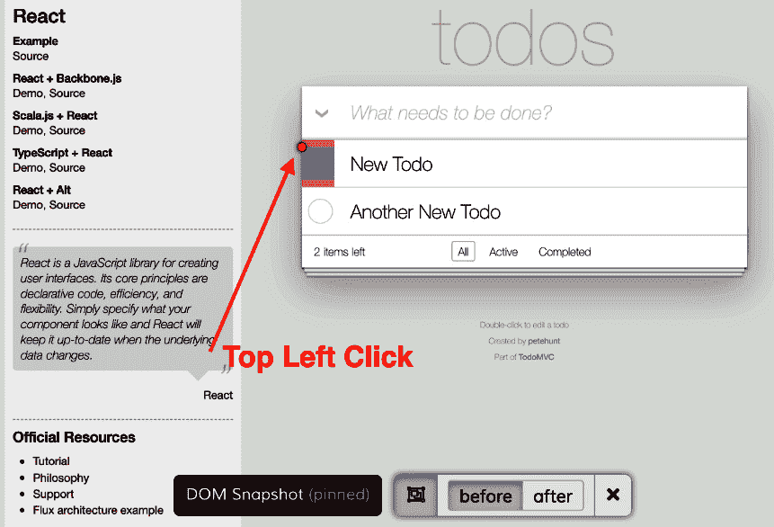
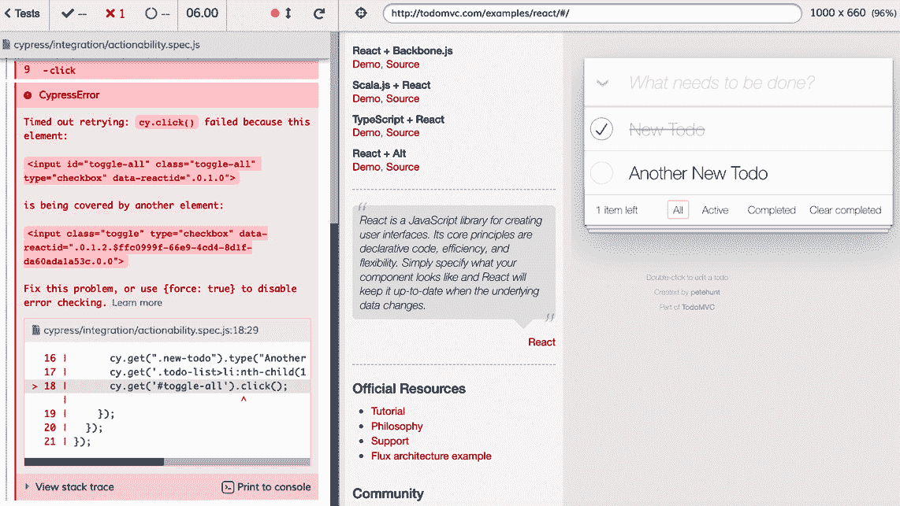
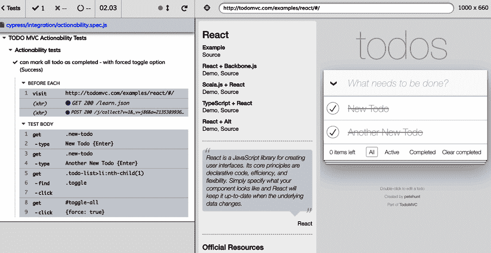

# 七、理解 Cypress 中的元素交互

在我们开始了解运行测试时 Cypress 如何与元素交互之前，最好对构成 Cypress 的原理、工作原理、不同的 Cypress 命令，甚至 Cypress 用法的实际示例有一个坚实的了解。要完全理解这一章，你需要遵循前面的章节，这将使你在学习过程中取得成功。

在本章中，我们将介绍 Cypress 如何与元素交互，以及它如何在交互过程中响应元素的不同状态。我们还将介绍 Cypress 如何通过 Cypress 命令中的内置机制来确定一个元素是否准备好进行交互的基本原理。

我们将在本章中讨论以下关键主题:

*   理解可操作性
*   强制可操作性

一旦你完成了每一个主题，你就有了理解 Cypress 如何在测试执行时解释测试以及如何解释测试执行过程中出现的错误所需要的知识。

## 技术要求

首先，我们建议您从 GitHub 中克隆包含源代码和我们将在本章中编写的所有测试的存储库。

本章的 GitHub 存储库可以在以下站点找到:

[https://github . com/PacktPublishing/端到端-Web-Testing-with-Cypress](https://github.com/PacktPublishing/End-to-End-Web-Testing-with-Cypress)

本章的源代码可以在`chapter-07`目录中找到。

# 理解可操作性

现在我们知道了什么是 Cypress 命令，在什么地方什么时候使用，在执行测试的时候需要了解 Cypress 的思想和操作过程。在本节中，我们将介绍 Cypress 如何与命令交互，如何确保元素可见且可操作，甚至如何处理元素中的动画。我们还将讲述在任何命令完成之前，Cypress 如何决定**的可操作性**。

可操作性是 Cypress 在**文档对象模型** ( **DOM** )中对特定元素执行操作的能力。Cypress 有一些命令，它们的唯一目的是与 DOM 元素交互。这些命令充当“用户”并模拟与应用用户界面的交互。Cypress 事件负责将事件发送到浏览器时命令的行为，使其看起来像是应用用户界面上的用户交互。

以下是 Cypress 中直接与 DOM 交互的一些命令；为了完成动作，DOM 元素必须是可操作的。这些命令带有内置的 Cypress 机制，用于检查与之交互的元素的可操作性。这些命令包括以下内容:

*   `cy.type()`:在一个 DOM 元素中输入
*   `cy.clear()`:清除文本区域或输入框的值
*   `cy.click()`:对 DOM 元素执行点击操作
*   `cy.dbclick()`:对 DOM 元素执行双击操作
*   `cy.rightclick()`:在 DOM 元素上执行右击操作
*   `cy.select()`:从`<select>`下拉列表中选择`<option>`选项
*   `cy.trigger()`:对 DOM 上的元素执行触发事件
*   `cy.check()`:选中 DOM 上的单选按钮和复选框
*   `cy.uncheck()`: Unchecks radios and checkboxes on the DOM

    重要说明

    `cy.rightclick()`命令不会打开浏览器菜单，而是检查与浏览器的**上下文菜单**相关的元素行为。

在前面的任何命令可以运行之前，Cypress 采取行动，以确保 DOM 准备好接收行动。对于要执行的任何命令，Cypress 都会执行自己的检查，以验证条件是否适合在 DOM 元素上执行命令。

所有检查都在指定的时间内进行，该时间可通过**默认命令时间输出**配置选项进行配置，该选项可在`cypress.json`文件中修改。以下是 Cypress 为检查 DOM 元素准备情况而采取的措施:

*   **可见性**:滚动元素进行查看
*   **残疾**:确保元素不被隐藏
*   **分离**:检查元素没有从 DOM 中移除
*   **只读**:检查元素是否处于只读状态
*   **动画**:检查动画是否已经完成
*   **覆盖**:检查一个元素没有被父元素覆盖
*   **滚动**:检查被固定位置的元素覆盖的元素的滚动
*   **坐标**:检查事件是否在期望的坐标触发

为了更好地理解 Cypress 如何解释来自 DOM 的响应，以及它如何确定可操作性，我们将浏览这些列出的操作，并描述当可操作的命令被执行时，Cypress 如何通过每个操作检查状态。

## 能见度

Cypress 使用不同的因素来决定一个元素是否可见。Cypress 确定元素可见性的默认方式是检查该元素的**层叠样式表** ( **CSS** )属性。任何元素的 CSS 属性定义了该元素的行为，如果默认情况下 CSS 属性的定义方式意味着该元素是隐藏的，那么 Cypress 将自动知道该元素由于其属性而不可见。

如果满足以下任一条件，Cypress 认为元素是隐藏的:

*   一个元素的 CSS `width`和`height`就是`0`。
*   元素或其祖先具有`visibility: hidden` CSS 属性。
*   元素或其祖先具有`display: none` CSS 属性。
*   该元素有一个`position: fixed` CSS 属性，它被掩盖或不出现在屏幕上。

此外，Cypress 使用`hidden overflow` CSS 属性来确定一个元素在测试执行期间是否被隐藏。以下是 Cypress 用来确定元素是否隐藏的一些附加实例:

*   祖先有隐藏溢出和`0`的`width`或`height`值，在祖先和有`position: absolute`CSS 属性的元素之间有一个元素。
*   Ancestors have hidden overflow and the element has a CSS property of `position: relative` and is positioned outside the ancestor's bounds.

    重要说明

    隐藏溢出意味着 CSS 属性可以是以下任何溢出:`hidden`、`overflow: auto`、`overflow: scroll`、`overflow-x: hidden`或`overflow-y: hidden`。

以下所有转换和平移的计算都由 Cypress 处理，如果 Cypress 没有发现元素可见，测试将失败，并出现一个错误，表示 Cypress 试图与之交互的元素的可见性被隐藏。

## 残疾

在检查的可操作性时，Cypress 也会检查某个元素是否被禁用。当一个元素具有`disabled: true` CSS 属性时，Cypress 不能与它交互，因为当它在 DOM 上被禁用时，不能对一个元素执行任何操作。当 Cypress 遇到被禁用的元素并需要对该元素执行操作时，它将返回一个错误，描述被禁用元素的状态以及为什么它不能通过 Cypress 可操作命令与该元素交互。

## 分离

分离的元素是已经从 DOM 中移除的元素，但是由于 JavaScript 的原因仍然存在于内存中。大多数应用通过从 DOM 中移除元素并在 DOM 中插入其他元素来工作，因此不断地分离和附加 DOM 中的元素。评估元素的可操作性时，在对元素运行任何可操作的命令之前，Cypress 会检查元素是否已分离。如果 Cypress 遇到分离的元素，它会在 Cypress 对测试执行可操作的命令之前抛出一个错误。

需要注意的是，Cypress 只会在 DOM 中搜索一个元素，不会检查内存中是否存在分离的元素。

## 只读

只读元素被禁用，只能查看，不能接受新内容或编辑。Cypress 在`.type()`命令中检查`readonly` CSS 属性；如果遇到`readonly` CSS 属性，测试将失败并出现错误。

## 动画

Cypress 内置了机制，可以确定动画是否出现在元素中。在评估元素是否可操作时，Cypress 会等待动画完成，然后才开始与元素交互。

对于 Cypress 来说，要确定测试中的元素是否是动画，它必须使用元素最后坐标的样本，然后应用其算法来计算斜率。

重要说明

坡度是通过拾取两个不同的点并记录它们的坐标来计算的。然后记录 y 坐标和 x 坐标之间的差异。然后进行 y 坐标和 x 坐标差的划分，以确定元素的斜率。

元素的动画和斜率是通过检查该元素的当前和先前位置来确定的。Cypress 自带一个内置的动画阈值，用于检查一个元素必须超过的像素距离才能被认为是动画。您可以在`cypress.json`文件中对此进行配置，并更改默认值，如以下代码块所示:

```js
{
"animationDistanceThreshold": 10
}
```

当该值改变时，通过增加或减少它，Cypress 将改变它的灵敏度和决定一个元素是否动画的行为。较高的动画阈值意味着当检测像素的变化距离时，Cypress 将降低其灵敏度，而较低的动画阈值意味着当检测正在动画的元素时，Cypress 的灵敏度更高。

也可以在运行测试时关闭动画。为此，我们需要配置我们的`cypress.json`配置文件来忽略动画并继续执行我们的命令。使用此代码块中的配置可以实现以下功能:

```js
{
"waitForAnimations": false
}
```

当我们指定我们的测试不应该等待动画时，如这里所示，我们的测试将忽略动画，并且将像动画不存在一样执行。然而，这个配置可以被改回`true`值，以继续执行我们的测试，同时等待动画在元素中执行。

## 覆盖

在发出命令之前，作为验证可操作性的一部分，Cypress 检查父元素没有覆盖元素。在很多情况下，一个元素在 DOM 中是可见的，但是被一个父元素覆盖，比如一个模式、一个弹出窗口或者一个对话框。如果存在覆盖元素的父元素，则 Cypress 将不允许执行命令。

在父元素覆盖了 Cypress 应该对其执行操作的元素的情况下，Cypress 会抛出一个错误，因为即使在现实生活中，用户也不可能与被覆盖的元素进行交互。

重要说明

在子元素覆盖元素的情况下，Cypress 将继续向子元素发出事件，并且执行继续，没有任何问题。

在下面的代码块中，我们有一个被`span`元素部分或全部覆盖的`button`元素，将被单击而不是`button`元素本身:

```js
<button>
  <span> Submit </span>
</button>
```

在这个代码块中，虽然`span`元素覆盖了`button`元素，但是 Cypress 会向子`span`元素发出命令，这将触发我们的`button`元素的点击事件而不会遇到错误。

## 滚动

Cypress 对元素执行滚动，并在本节开头指定的可操作命令中默认启用此行为。默认情况下，在与元素交互之前，Cypress 会滚动到该元素的位置，并确保它在视图中。

小费

像`cy.get()`或`cy.find()`这样的命令没有像 Cypress 中的可操作命令那样内置 Cypress 滚动到视图的机制。

丝柏中的滚动是通过一种算法实现的，该算法首先尝试确定一个元素在 DOM 上是否可见。然后，它通过计算从当前元素到 Cypress 所作用元素的期望位置的坐标，使用坐标导航到实际元素。

Cypress 滚动算法不断滚动，直到一个元素变得可见，或者直到一个元素不再被其他元素覆盖。该算法很好地确保了当 DOM 上的大多数元素在视图中时，它们可以被滚动并与之交互。

## 坐标

在 Cypress 完成检查元素是否可操作的验证过程后，默认情况下，它会将事件触发到元素的中心。Cypress 提供了一种机制来覆盖触发事件的默认位置，并且可以为大多数命令定制行为。

下面的代码块显示了如何更改按钮上单击事件的触发行为:

```js
it('can mark a todo as completed - with changed hitbox position', () => {
cy.visit('http://todomvc.com/examples/react/#/')
      cy.get(".new-todo").type("New Todo {Enter}");
      cy.get(".new-todo").type("Another New Todo {Enter}");
      cy.get('.todo-list>li:nth-child(1)').find(
      '.toggle').click({ position: 'topLeft' });
    });
```

在这个代码块中，我们导航到我们的 todo 应用并添加两个 todo 项目，然后将其中一个 Todo 项目标记为已完成。当我们将第一个待办事项标记为完成时，我们改变了点击的位置，并指示 Cypress 点击`topLeft`位置，而不是默认的`center`位置。下面的截图显示了点击的待办事项操作的左上角的`click`命令的**事件点击框**:



图 7.1–更改 Cypress 点击位置的坐标

重要说明

事件点击框是在固定的 Cypress 快照上弹出的高亮显示，以显示测试与元素交互。事件命中框可以由 Cypress 事件触发，如`.click()`方法。

如图 7.1 所示，Cypress 能够计算元素的坐标，并确定单击元素的确切坐标。此外，当击发行为的坐标发生变化时，Cypress 会将其记录在 Cypress 测试运行程序的命令日志中。我们可以进一步检查控制台，查看在执行左上角的元素点击后，Cypress 打印的坐标。下图显示了第一个完成的待办事项的`click`事件的打印坐标:


图 7.2–新点击位置坐标

截图中显示的坐标是我们指示 Cypress 使用的新的`.click()`命令坐标，而不是可操作命令附带的默认命令。

## 回顾–理解可操作性

在本节中，我们学习了关于 Cypress 如何确定元素的可操作性，以及它如何评估不同元素的条件，如可见性、残疾、分离模式、动画、滚动属性、坐标，甚至`readonly`属性。我们还学习了 Cypress 如何计算元素中的动画，以及如何提高动画阈值来降低 Cypress 检测动画的灵敏度。

在下一节中，我们将学习如何强制 Cypress 继续执行操作，即使某个元素的可操作性检查失败，并且在元素上执行强制操作是安全的。

# 强制可操作性

了解了什么是可操作性，以及 Cypress 为确定一个元素是否可操作而需要进行的检查，了解我们如何覆盖 Cypress 设置的检查可操作性的机制也很重要。在本节中，我们将重点关注执行操作和命令，即使元素没有通过 Cypress 为可操作命令执行的可操作性检查。我们还将学习如何为一些元素和测试安全地实现覆盖机制。

## 覆盖 Cypress 可操作性检查

可操作性在 Cypress 测试中非常有用，因为它帮助我们发现用户可能无法与我们的应用元素交互的情况。然而，有时可操作性检查可能会妨碍适当的测试，这将引导我们进行下一个任务:覆盖安全检查。

在一些测试中，“表现得像一个用户”可能不值得，因为归根结底，目标是编写有意义的测试，以自动化的方式防止错误和缺陷。嵌套导航结构和接口之类的实例可能会导致复杂的测试，只需消除嵌套导航结构并直接与我们想要的元素进行交互就可以实现。

要覆盖 Cypress 可操作性检查，我们可以将`{force: true}`参数选项传递给 Cypress 可操作命令。该选项将指示 Cypress 覆盖所有检查可操作性的检查，并继续默认操作。下面的代码块是一个测试，使用 todo 应用中的`toggle-all`按钮将所有待办事项标记为已完成:

```js
it('can mark all todo as completed - with no forced toggle option (Failure)', () => {
      cy.get(".new-todo").type("New Todo {Enter}");
      cy.get(".new-todo").type("Another New Todo {Enter}");
      cy.get('.todo-list>li:nth-child(1)').find(
      '.toggle').click();
      cy.get('#toggle-all').click();
    });
```

当这个测试运行时，它将失败，因为尝试切换第一个元素并将其标记为完成将导致测试失败和错误，因为它已经被标记为完成。下面的截图显示了 Cypress 的可操作性，测试失败是因为它被另一个元素覆盖，所以不能被标记为完成:



图 7.3–使用 Cypress 可操作性检查的失败测试

在进一步的调查中，从*图 7.3* 中，我们可以验证第一项无法切换为已经完成，从而导致失败。我们可以通过告诉 Cypress 在切换所有待办事项完成之前忽略可操作性检查来覆盖这个测试行为，如下面的代码块所示:

```js
it('can mark all todo as completed - with forced toggle option (Success)', () => {
      cy.get(".new-todo").type("New Todo {Enter}");
      cy.get(".new-todo").type("Another New Todo {Enter}");
      cy.get('.todo-list>li:nth-child(1)').find(
      '.toggle').click();
      cy.get('#toggle-all').click({force: true});
    });
```

在运行代码块中显示的测试时，它通过了，因为我们阻止了 Cypress 检查我们需要单击的元素是否被另一个元素覆盖。下面的屏幕截图显示了代码运行情况，以及通过单击 toggle-all 下拉按钮将两个待办事项标记为已完成的成功测试:



图 7.4–通过测试，超越 Cypress 可操作性检查

在*图 7.4* 中，Cypress 忽略了与项目的可操作性相关的检查，而是继续默认操作，在我们的例子中是切换两个待办事项并将其标记为完成。我们通过将`{force: true}`选项传递给切换按钮的`click`命令来实现覆盖。

当使用强制选项强制发生 Cypress 事件时，Cypress 会执行以下操作:

*   继续执行所有默认操作
*   在元素处强制激发事件

但是，Cypress 不会执行以下操作:

*   确保元素可见
*   滚动要查看的元素
*   确保该元素未被禁用
*   确保元素没有分离
*   确保元素没有动画
*   确保元素未被覆盖
*   确保该元素不是只读的
*   Fire the event at the descendant element

    重要说明

    强制可操作性是有用的，尤其是当你不需要经历自动化步骤的痛苦时，这些步骤不值得你花时间去自动化它们；然而，有时，这并不是当前问题的最佳解决方案。当我们强制可操作性时，我们面临的大多数问题可以通过编写更好的应用代码和确保项目的正确对齐来解决，这样就不会有元素阻塞另一个元素。我们还可以利用 Cypress 来克服动画等情况，因为我们可以等待动画停止运行，然后一旦我们确定页面动画已经完成，就执行我们的测试。

当命令的可操作性为时，Cypress 放弃了确保在对元素执行任何操作之前满足正确条件的角色，而只是在测试中执行发布的条件。

## 重述–强制可操作性

在本节中，我们已经了解到可以在元素上强制执行可操作性，这是通过将`{force: true}`参数传递给在元素上发出的可操作命令来实现的。我们还看到，当我们强制在 Cypress 中执行一个命令时，会有很大的不同，例如将我们的待办事项切换为完成的测试。在本节中，我们还了解了何时覆盖 Cypress 可操作性很重要，以及它如何潜在地降低测试复杂性。

# 总结

在本章中，我们已经学习了 Cypress 如何通过确保元素在对元素执行命令之前处于正确的状态来强制元素的可操作性。我们了解到，在对元素执行任何操作之前，Cypress 会检查可见性、残疾、DOM 分离、`readonly`模式、动画、覆盖、滚动和元素坐标。我们还介绍了 Cypress 如何计算元素的动画，甚至当对元素执行动作时它如何改变坐标。我们还了解到，通过在我们的测试中强制可操作性，可以覆盖 Cypress 设置的默认检查。

完成这一章后，我相信你已经掌握了理解 Cypress 如何决定元素的可操作性以及我们如何在测试中覆盖可操作性以降低复杂性所需的技能。在下一章中，我们将研究使用变量和别名，并且我们将深入研究重用我们在测试中不止一次定义的变量和别名。