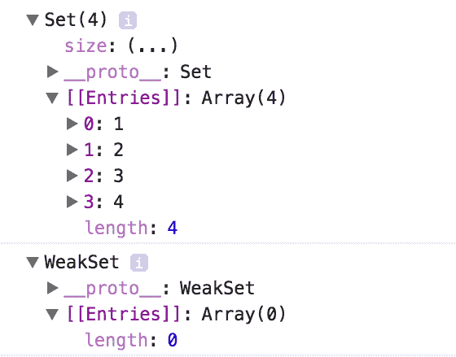
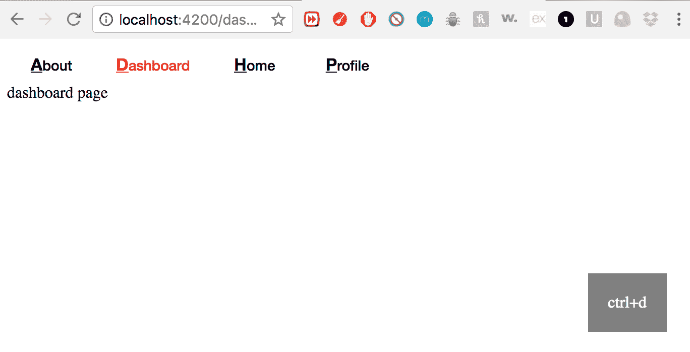
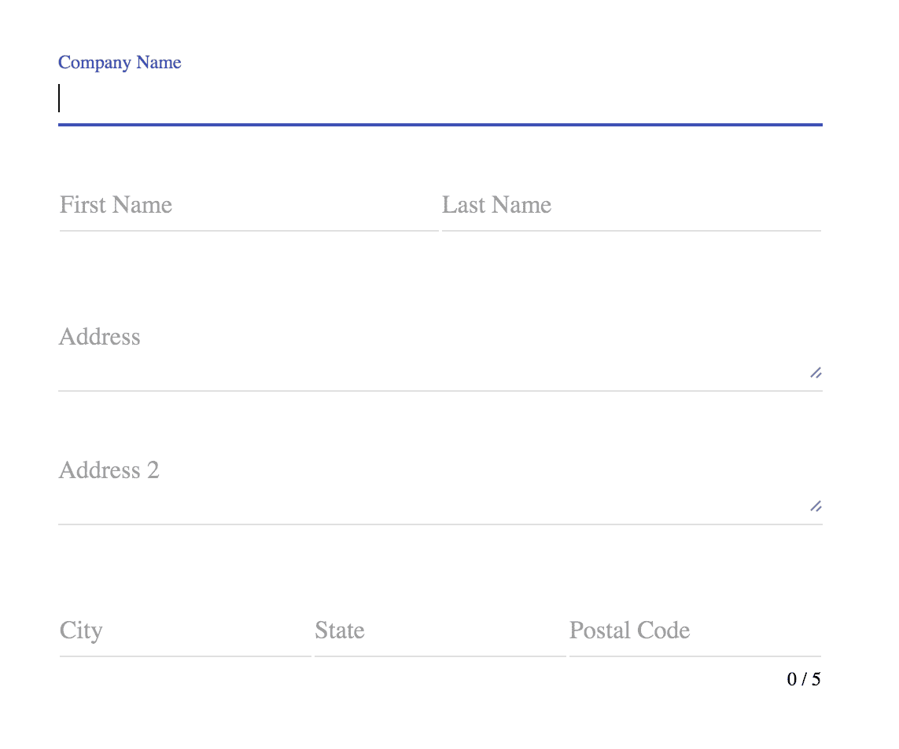
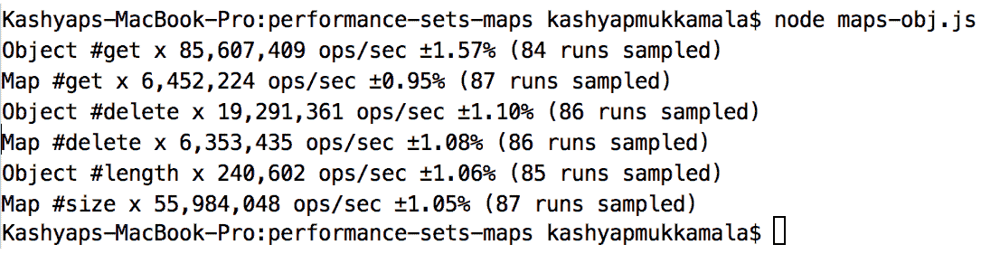

# 三、使用集合和映射实现更快的应用

**set**和**map**是两个出了名的外观简单的数据结构，在最新版本的 ES6 中已经标准化了。

在本章中，我们将涵盖以下主题:

*   为什么我们需要布景和地图？
*   何时以及如何使用集合和地图
*   ES6 应用编程接口集和地图
*   用例
*   性能比较

# 探索集合和地图的起源

在我们尝试并理解如何在现实应用中使用集合和地图之前，首先了解集合和地图的起源以及我们为什么需要它们在 JavaScript 中更有意义。

直到 ES5 之前，传统阵列不支持开发人员通常希望利用的一些主要功能:

*   承认它包含一个特殊的元素
*   添加新元素，不重复

这导致开发人员实现了他们自己版本的集合和地图，，这在其他编程语言中是可用的。使用 JavaScript 的`Object`的集合和映射的常见实现如下:

```js
// create an empty object
var setOrMap = Object.create(null);

// assign a key and value
setOrMap.someKey = someValue;

// if used as a set, check for existence
if(setOrMap.someKey) {
    // set has someKey 
}

// if used as a map, access value
var returnedValue = setOrMap.someKey;
```

虽然通过使用`Object.create` 来创建集合或映射*可以避免很多原型难题，但它仍然不能解决这样一个事实，即正在被持有的主`Key` 只能是一个`string`，因为`Object` 只允许键作为字符串，因此我们可能会无意中以值相互覆盖而告终:*

```js
// create a new map object
let map = Object.create(null);

// add properties to the new map object
let b = {};
let c = {};
map[b] = 10
map[c] = 20

// log map
Object [object Object]: 20
```

# 分析集合和映射类型

在实际使用集合和地图之前，我们需要了解何时何地需要使用它们。每种数据结构，无论是原生的还是定制的，都有自己的优缺点。

不仅利用这些优势很重要，更重要的是避免它们的弱点。为了理解其中的一些，我们将探索集合和映射类型，以及为什么需要它们以及在哪里使用它们。

主要有四种不同的集合和映射类型:

*   **映射**:键-值对，其中键可以是`Object`或基元，可以保存任意值。
*   **WeakMap** :密钥-值对，其中密钥只能是`Object`并且可以保存任意值。键被弱引用；这意味着，如果不使用它们，也不会阻止它们被垃圾收集。
*   **设置**:允许用户存储任何类型的唯一值的数据类型。
*   **WeakSet** :类似于 Set，但保持弱引用。

# WeakMap 有多弱？

到目前为止，我们都知道什么是映射，以及如何添加键和值，至少在理论上是这样。但是，如何确定什么时候使用地图，什么时候使用`WeakMap`？

# 内存管理

根据 MDN([https://developer . Mozilla . org/en-US/docs/Web/JavaScript/Reference/Global _ Objects/WeakMap](https://developer.mozilla.org/en-US/docs/Web/JavaScript/Reference/Global_Objects/WeakMap))对`WeakMap`的官方定义如下:

WeakMap 对象是键/值对的集合，其中键被弱引用。键必须是对象，值可以是任意值。

重点是*弱引用。*

在比较`Map`和`WeakMap`*之前，了解何时使用特定的数据结构至关重要。如果您需要随时知道集合的键，或者如果您需要迭代您的集合，那么您将需要在`WeakMap`上使用`Map`，因为键是不可枚举的，也就是说，您不能获得后者中可用的键的列表，因为它只维护弱引用。*

 *所以，自然地，前面的陈述会在你的头脑中提出两个问题:

*   如果我总是用地图会怎么样？
    *   没什么，生活还在继续。您可能会也可能不会出现内存泄漏，这取决于您对地图的使用情况。在大多数情况下，你会没事的。
*   什么是弱引用？
    *   弱引用是一种允许在移除所有引用者的情况下对对象引用的所有内容进行垃圾收集的东西。迷茫？很好。让我们看一下下面的例子，以便更好地理解它:

```js
var map = new Map();

(function() {
    var key = {}; <- Object

    map.set(key, 10); <- referrer of the Object

    // other logic which uses the map

})(); <- IIFE which is expected to remove the referrer once executed
```

我们都知道 IIFE 主要是用来让我们可以立即执行一个函数并移除它的作用域，这样我们就可以避免内存泄漏。在这种情况下，虽然我们已经将`key`和地图设定器包装在一个 IIFE 中，但是`key` 并没有被垃圾收集，因为在内部`Map` 仍然保存着对`key`及其值的引用:

```js
var myWeakMap = new WeakMap();

(function() {
    var key = {};<- Object

    myWeakMap.set(key, 10);<- referrer of the Object

    // other logic which uses the weak map
})(); <- IIFE which is expected to remove the referrer once executed
```

当用`WeakMap`*写同样的代码时，一旦执行了 IIFE，该键和该键的值将从内存中删除，因为该键被带出范围；这有助于将内存使用保持在最低水平。*

 *# 原料药差异

`Map`和`WeakMap`的 API 在标准操作方面非常相似，比如`set()`和`get()`。这使得应用编程接口非常简单，包含以下内容:

*   `Map.prototype.size`:返回地图的大小；除非循环计数，否则在典型对象上不可用
*   `Map.prototype.set`:为给定的键设置一个值，并返回整个新地图
*   `Map.prototype.get`:获取给定键的值，如果没有找到，返回未定义
*   `Map.prototype.delete`:删除给定键的值，如果删除成功则返回`true`，否则返回`false`
*   `Map.prototype.has`:用提供的键检查地图中是否存在元素；返回布尔值
*   `Map.prototype.clear`:清除地图；不返回任何内容
*   `Map.prototype.forEach`:在地图上循环，并提供对每个元素的访问
*   `Map.prototype.entries`:返回一个迭代器，在这个迭代器上可以应用`next()`方法获取`Map`中下一个元素的值，例如`mapIterator.next().value`
*   `Map.prototype.keys`:类似`entries`*；*返回一个迭代器，可以用来访问下一个值
*   `Map.prototype.values`:类似于`key`；返回对值的访问

主要区别在于访问与某个`WeakMap` *的键和值相关的任何内容时。*如前所述，由于`WeakMap`的枚举挑战，在`WeakMap`中没有`size()`、`forEach()`、`entries()`、`keys()`和`values()`等方法。

# 布景与弱点

现在，我们理解了术语`WeakMap`或`WeakSet` *中弱的基本含义。*预测布景如何工作以及`WeakSet`与布景有何不同并不十分复杂。让我们快速了解一下功能上的区别，然后继续看 API。

# 理解弱点

`WeakSet`与`WeakMap`非常相似；一个`WeakSet`能持有的值只是对象，不能像`WeakMap`那样是基本的。`WeakSets`也是不可枚举的，因此您不能直接访问集合中的可用值。

让我们创建一个小例子，了解一下`Set`和`WeakSet`的区别:

```js
var set = new Set();
var wset = new WeakSet();

(function() {

  var a = {a: 1};
  var b = {b: 2};
  var c = {c: 3};
  var d = {d: 4};

  set.add(1).add(2).add(3).add(4);
  wset.add(a).add(b).add(b).add(d);

})();

console.dir(set);
console.dir(wset);
```

需要注意的一点是`WeakSet`不接受图元，只能接受类似`WeakMap`键的对象。

前面代码的输出如下，这是对`WeakSet`的预期。`WeakSet`不保留超过变量寿命的元素:



不出所料，一旦生命终止，`WeakSet`为空。

# 原料药的区别

在`WeakMap`地图案例中记录的应用编程接口差异也非常接近于您可以找到的集合:

*   `Set.prototype.size`:返回集合的大小
*   `Set.prototype.add`:为给定元素添加一个值，并返回整个新集合
*   `Set.prototype.delete`:删除一个元素，如果删除成功则返回`true`，否则返回`false`
*   `Set.prototype.has`:检查集合中是否存在元素，并返回一个布尔值
*   `Set.prototype.clear`:清除集合，不返回任何内容
*   `Set.prototype.forEach`:在集合上循环，并允许访问每个元素
*   `Set.prototype.values`:返回一个迭代器，可以用来访问下一个值
*   `Set.prototype.keys`:类似于值—返回对集合中值的访问

另一方面，`WeakSet`由于前面讨论的原因，不包含`forEach()`*`keys()`和`values()`方法。*

 *# 用例

在开始使用用例之前，让我们创建一个基础应用，它将被重用到每个示例中，就像我们在[第 1 章](1.html)、*为应用状态管理构建栈*中所做的那样。

以下部分是创建基本角度应用的简要回顾:

# 创建角度应用

在进入单个用例之前，我们将首先创建 Angular 应用，它将作为我们示例的基础。

按照给定的命令启动并运行应用:

1.  安装角度命令行界面:

```js
npm install -g @angular/cli
```

2.  通过运行以下命令，在您选择的文件夹中创建一个新项目:

```js
ng new <project-name>
```

3.  完成这两个步骤后，您应该能够看到新项目已经创建，所有相应的节点模块都已经安装完毕并准备就绪。
4.  要运行应用，请从终端运行以下命令:

```js
ng serve
```

# 为应用创建自定义键盘快捷键

在大多数情况下，创建一个 web 应用意味着拥有一个拥有无障碍数据的漂亮 UI。您希望您的用户拥有流畅的体验，而不必经历点击多个页面的麻烦，这有时会变得相当麻烦。

以任何 IDE 为例。尽管它们很有用，也很容易让我们的日常生活变得简单，但想象一下，它们没有简单的快捷方式，比如代码缩进。抱歉吓到你了，但确实有这样的小细节可以让用户体验非常流畅，让用户回来索取更多。

现在，让我们创建一组简单的键盘快捷键，您可以将其提供给应用，从而让您的最终用户更加轻松。要创建它，您需要以下东西:

*   一个网络应用(我们之前创建了一个)
*   一组您希望能够用键盘控制的功能
*   一个足够简单的实现，使添加新功能变得非常简单

如果您还记得[第 1 章](1.html)、*中的*自定义返回按钮*，我们将创建一个类似的应用。让我们再次快速组装示例应用。有关详细说明，您可以遵循[第 1 章](1.html)、*构建应用状态管理栈*中的相同示例(创建角度应用)。*

# 创建角度应用

1.  创建应用:

```js
 ng new keyboard-shortcuts
```

2.  在`src/pages`文件夹下使用基本模板创建多个状态(关于、仪表板、主页和个人资料):

```js
import { Component } from '@angular/core';

@Component({
   selector: 'home',
   template: 'home page'
})
export class HomeComponent {

}
```

3.  在`<component_name>.routing.ts`下为该状态创建路由:

```js
import { HomeComponent } from './home.component';

export const HomeRoutes = [
   { path: 'home', component: HomeComponent },
];

export const HomeComponents = [
   HomeComponent
];
```

4.  将新的`routes`和`Components`添加到应用主路由文件`app.module.ts`旁边的`app.routing.ts`:

```js
import { Routes } from '@angular/router';
import {AboutComponents, AboutRoutes} from "./pages/about/about.routing";
import {DashboardComponents, DashboardRoutes} from "./pages/dashboard/dashboard.routing";
import {HomeComponents, HomeRoutes} from "./pages/home/home.routing";
import {ProfileComponents, ProfileRoutes} from "./pages/profile/profile.routing";

export const routes: Routes = [
   {
      path: '',
      redirectTo: '/home',
      pathMatch: 'full'
   },
   ...AboutRoutes,
   ...DashboardRoutes,
   ...HomeRoutes,
   ...ProfileRoutes
];

export const navigatableComponents = [
   ...AboutComponents,
   ...DashboardComponents,
   ...HomeComponents,
   ...ProfileComponents
];
```

5.  使用`RouterModule`向您的应用注册路线，并在`app.module.ts`文件中声明您的`navigatableComponents`:

```js
@NgModule({
    declarations: [
        AppComponent,
        ...navigatableComponents
    ],
    imports: [
        BrowserModule,
        FormsModule,
        RouterModule.forRoot(routes)
    ],
    providers: [],
    bootstrap: [AppComponent]
})
export class AppModule { }
```

6.  创建 HTML 模板加载`app.component.html`中的四条路线:

```js
<nav>
    <button mat-button
            routerLink="/about"
            routerLinkActive="active">
        About
    </button>
    <button mat-button
            routerLink="/dashboard"
            routerLinkActive="active">
        Dashboard
    </button>
    <button mat-button
            routerLink="/home"
            routerLinkActive="active">
        Home
    </button>
    <button mat-button
            routerLink="/profile"
            routerLinkActive="active">
        Profile
    </button>
</nav>

<router-outlet></router-outlet>
```

执行完前面列出的所有步骤后，在终端中运行以下命令；web 应用应该启动并运行，有四种状态可供您切换:

```js
ng serve
```

# 使用按键映射创建状态

到目前为止，我们在状态(或路线)中声明的是我们想要与它们一起走的路径和组件。Angular 允许我们做的是在路由配置中添加一个名为 **data** 的新属性。这允许我们添加任何我们想要的关于任何路线的数据。在我们的例子中，它的效果非常好，因为我们希望能够根据用户按下的键来切换路线。

因此，让我们以之前定义的路线为例:

```js
import { HomeComponent } from './home.component';

export const HomeRoutes = [
 { path: 'home', component: HomeComponent },
];

export const HomeComponents = [
 HomeComponent
];
```

我们现在将对此进行修改，并将新的`data`属性添加到路由配置中:

```js
import { HomeComponent } from './home.component';

export const HomeRoutes = [
 { path: 'home', component: HomeComponent, data: { keymap: 'ctrl+h'} },
];

export const HomeComponents = [
 HomeComponent
];
```

你可以看到我们增加了一个名为`keymap`的属性及其值`ctrl+h`；我们也将对定义的所有其他路线进行同样的操作。一开始就要明确的一件重要事情是锚定键(在本例中为`ctrl`)，它将与辅助识别键(用于回家路线的`h`)一起使用。这确实有助于过滤用户在应用中可能进行的按键。

一旦我们有了与每条路线相关联的关键地图，我们就可以在应用加载时注册所有这些关键地图，然后开始跟踪用户活动，以确定他们是否选择了我们预定义的任何关键地图。

要注册关键地图，在`app.component.ts` 文件中，我们将首先定义`Map`，我们将在其中保存所有数据，然后从路线中提取数据，然后将其添加到`Map` *:*

```js
import {Component} from '@angular/core';
import {Router} from "@angular/router";

@Component({
    selector: 'app-root',
    templateUrl: './app.component.html',
    styleUrls: ['./app.component.scss',  './theme.scss']
})
export class AppComponent {

    // defined the keyMap
    keyMap = new Map();

    constructor(private router: Router) {
        // loop over the router configuration
        this.router.config.forEach((routerConf)=> {

            // extract the keymap
            const keyMap = routerConf.data ? routerConf.data.keymap :
            undefined;

            // if keymap exists for the route and is not a duplicate,
            add
            // to master list
            if (keyMap && !this.keyMap.has(keyMap)) {
                this.keyMap.set(keyMap, `/${routerConf.path}`);
            }
        })
    }

}
```

一旦数据被添加到`keyMap`中，我们将需要倾听用户交互并确定用户想要导航到哪里。为此，我们可以使用 Angular 提供的`@HostListener`装饰器，监听任何按键事件，然后根据应用的要求过滤项目，如下所示:

```js
import {Component, HostListener} from '@angular/core';
import {Router} from "@angular/router";

@Component({
    selector: 'app-root',
    templateUrl: './app.component.html',
    styleUrls: ['./app.component.scss',  './theme.scss']
})
export class AppComponent {

    // defined the keyMap
    keyMap = new Map();

    // add the HostListener
    @HostListener('document:keydown', ['$event'])
    onKeyDown(ev: KeyboardEvent) {

        // filter out all non CTRL key presses and 
        // when only CTRL is key press
        if (ev.ctrlKey && ev.keyCode !== 17) {

            // check if user selection is already registered
            if (this.keyMap.has(`ctrl+${ev.key}`)) {

                // extract the registered path
                const path = this.keyMap.get(`ctrl+${ev.key}`);

                // navigate
                this.router.navigateByUrl(path);
            }
        }
    }

    constructor(private router: Router) {
        // loop over the router configuration
        this.router.config.forEach((routerConf)=> {

            // extract the keymap
            const keyMap = routerConf.data ? routerConf.data.keymap :
            undefined;

            // if keymap exists for the route and is not a duplicate,
            add
            // to master list
            if (keyMap && !this.keyMap.has(keyMap)) {
                this.keyMap.set(keyMap, `/${routerConf.path}`);
            }
        })
    }
}
```

找到了。现在，只要用户按键，我们就可以轻松定义和导航到路线。然而，在我们继续之前，我们需要从另一个角度来理解下一步。考虑你是最终用户，而不是开发者。你怎么知道绑定是什么？当您不仅要绑定页面上的路线，还要绑定按钮时，您会怎么做？你怎么知道你是否按错了键？

所有这些都可以通过对我们目前所拥有的和我们需要的进行非常简单的 UX 回顾来解决。有一点很清楚，那就是我们需要向用户展示他们正在选择什么，这样他们就不会不断用不正确的组合键敲打我们的应用。

首先，为了通知我们的用户他们可以选择什么，让我们修改导航，使每个路线名称的第一个字符突出显示。让我们也创建一个变量来保存用户正在选择的值，在用户界面上显示它，并在几毫秒后清除它。

我们可以修改我们的`app.component.scss` 到那个效果，如下所示:

```js
.active {
    color: red;
}

nav {
    button {
      &::first-letter {
        font-weight:bold;
        text-decoration: underline;
        font-size: 1.2em;
      }
    }
}

.bottom-right {
  position: fixed;
  bottom: 30px;
  right: 30px;
  background: rgba(0,0,0, 0.5);
  color: white;
  padding: 20px;
}
```

我们的模板在最后添加了一项，以显示用户按下的键:

```js
<nav>
    <button mat-button
            routerLink="/about"
            routerLinkActive="active">
        About
    </button>
    <button mat-button
            routerLink="/dashboard"
            routerLinkActive="active">
        Dashboard
    </button>
    <button mat-button
            routerLink="/home"
            routerLinkActive="active">
        Home
    </button>
    <button mat-button
            routerLink="/profile"
            routerLinkActive="active">
        Profile
    </button>
</nav>

<router-outlet></router-outlet>

<section [class]="keypress? 'bottom-right': ''">
    {{keypress}}
</section>
```

我们的`app.component.ts`最终形式如下:

```js
import {Component, HostListener} from '@angular/core';
import {Router} from "@angular/router";

@Component({
    selector: 'app-root',
    templateUrl: './app.component.html',
    styleUrls: ['./app.component.scss',  './theme.scss']
})
export class AppComponent {

    // defined the keyMap
    keyMap = new Map();

    // defined the keypressed
    keypress: string = '';

    // clear timer if needed
    timer: number;

    // add the HostListener
    @HostListener('document:keydown', ['$event'])
    onKeyDown(ev: KeyboardEvent) {

        // filter out all non CTRL key presses and
        // when only CTRL is key press
        if (ev.ctrlKey && ev.keyCode !== 17) {

            // display user selection
            this.highlightKeypress(`ctrl+${ev.key}`);

            // check if user selection is already registered
            if (this.keyMap.has(`ctrl+${ev.key}`)) {

                // extract the registered path
                const path = this.keyMap.get(`ctrl+${ev.key}`);

                // navigate
                this.router.navigateByUrl(path);
            }
        }
    }

    constructor(private router: Router) {
        // loop over the router configuration
        this.router.config.forEach((routerConf)=> {

            // extract the keymap
            const keyMap = routerConf.data ? routerConf.data.keymap :
            undefined;

            // if keymap exists for the route and is not a duplicate,
            add
            // to master list
            if (keyMap && !this.keyMap.has(keyMap)) {
                this.keyMap.set(keyMap, `/${routerConf.path}`);
            }
        })
    }

    highlightKeypress(keypress: string) {
        // clear existing timer, if any
        if (this.timer) {
            clearTimeout(this.timer);
        }

        // set the user selection
        this.keypress = keypress;

        // reset user selection
        this.timer = setTimeout(()=> {
            this.keypress = '';
        }, 500);
    }

}
```

通过这种方式，用户总是被告知他们的选项以及他们正在选择什么，这使得你的应用的整体可用性更高。



无论用户选择什么，只要按下 *Ctrl* 键，他们总是会在屏幕的右下角看到他们的选择。

# 网络应用的活动跟踪和分析

每当有人提到分析，尤其是针对网络应用，首先想到的通常是谷歌分析或新遗迹之类的东西。尽管它们在收集分析方面做得非常出色，例如页面视图和自定义事件，但这些工具会将数据保存在其中，不让您下载/导出原始数据。有必要构建您自己的定制模块来跟踪用户动作和活动。

活动跟踪和分析非常复杂，并且会随着应用规模的增长而迅速失控。在这个用例中，我们将构建一个简单的 web 应用，在这个应用中，我们将跟踪用户正在采取的自定义操作，并为将应用数据与服务器同步奠定一些基础。

在我们开始编码之前，让我们简要讨论一下我们的方法是什么，以及我们将如何利用我们可用的 Angular 组件。在我们的应用中，我们将为用户构建一个基本表单，他们可以填写并提交该表单。当用户与表单上可用的不同组件交互时，我们将开始跟踪用户活动，然后根据生成的事件提取一些自定义数据。这种定制数据显然会根据正在构建的应用而改变。为了简洁起见，我们将简单地跟踪事件的时间、 *x* 和 *y* 坐标以及自定义值(如果有)。

# 创建角度应用

首先，让我们像前面的用例一样创建一个 Angular 应用:

```js
ng new heatmap
```

这应该创建应用，它应该准备好了。只需进入您的项目文件夹并运行以下命令，即可看到您的应用正在运行:

```js
ng serve
```

一旦应用启动，我们将包括 Angular 材料，这样我们就可以很快有一个很好的形式启动和运行。要在 Angular 应用中安装材质，请运行以下命令:

```js
npm install --save @angular/material @angular/animations @angular/cdk
```

一旦`material`被安装，在你的主`app.module.js`*中包含你选择的模块，在这种情况下，将是`MatInputModule `和`ReactiveFormsModule`，因为我们将需要它们来创建表单。在这之后，你的`app.module.js`会是这样的:*

```js
import { BrowserModule } from '@angular/platform-browser';
import { NgModule } from '@angular/core';
import {FormsModule, ReactiveFormsModule} from '@angular/forms';
import {BrowserAnimationsModule} from '@angular/platform-browser/animations';
import { MatInputModule } from '@angular/material';

import { AppComponent } from './app.component';

@NgModule({
    declarations: [
        AppComponent
    ],
    imports: [
        BrowserModule,
        FormsModule,
        ReactiveFormsModule,
        BrowserAnimationsModule,
        MatInputModule
    ],
    providers: [

    ],
    bootstrap: [AppComponent]
})
export class AppModule { }
```

现在我们已经设置了应用，我们可以设置我们的模板，这将非常简单，所以让我们将以下模板添加到我们的`app.component.html`文件中:

```js
<form>
    <mat-input-container class="full-width">
        <input matInput placeholder="Company Name">
    </mat-input-container>

    <table class="full-width" cellspacing="0">
        <tr>
            <td>
                <mat-input-container class="full-width">
                    <input matInput placeholder="First Name">
                </mat-input-container>
            </td>
            <td>
                <mat-input-container class="full-width">
                    <input matInput placeholder="Last Name">
                </mat-input-container>
            </td>
        </tr>
    </table>
    <p>
        <mat-input-container class="full-width">
            <textarea matInput placeholder="Address"></textarea>
        </mat-input-container>
        <mat-input-container class="full-width">
            <textarea matInput placeholder="Address 2"></textarea>
        </mat-input-container>
    </p>

    <table class="full-width" cellspacing="0">
        <tr>
            <td>
                <mat-input-container class="full-width">
                    <input matInput placeholder="City">
                </mat-input-container>
            </td>
            <td>
                <mat-input-container class="full-width">
                    <input matInput placeholder="State">
                </mat-input-container>
            </td>
            <td>
                <mat-input-container class="full-width">
                    <input matInput #postalCode maxlength="5"
                    placeholder="Postal Code">
                    <mat-hint align="end">{{postalCode.value.length}} / 5</mat-
                    hint>
                </mat-input-container>
            </td>
        </tr>
    </table>
</form>
```

这是一个简单的表单，其中包含用户详细信息的标准字段；我们将对其进行一点样式化，使其位于页面的中心，这样我们就可以更新我们的`app.component.scss`文件来包含我们的样式:

```js
body {
  position: relative;
}

form {
  position: absolute;
  top: 50%;
  left: 50%;
  transform: translate(-50%, -50%);
}

.full-width {
  width: 100%;
}
```

以下是用户界面的最终结果:



现在我们已经准备好了表单，我们想要一个活动跟踪器，它将是非常轻量级的，因为我们会经常调用它。

A good practice is to have the tracker logic moved into a web worker; that way, your tracker will not take up the only available thread, thus freeing up your application from any extra load.

在我们真正开始创建一个网络工作者之前，我们需要一些东西来调用我们的工作者；为此，我们将创建一个跟踪服务。此外，为了使工人可以包含在 Angular 项目中，我们将把它添加到`.angular-cli.json`文件的`scripts`选项中，这将允许我们将其用作名为`scripts.bundle.js `的外部脚本，该脚本是由`webpack.`从文件`utils/tracker.js`生成的

让我们在名为`services`的文件夹下创建一个名为`tracker`的文件夹，然后创建一个`tracker.service.ts`文件:

```js
import {Injectable} from '@angular/core';

@Injectable()
export class TrackerService {
    worker: any;

    constructor() {
        this.setupTracker();
    }

    setupTracker () {
        this.worker = new Worker('scripts.bundle.js');
    }

    addEvent(key: string, event: any, customValue ?: string) {
        this.worker.postMessage({
            key: key,
            user: 'user_id_here'
            event: {
                pageX: event.pageX,
                pageY: event.pageY
            },
            customValue : customValue
        });
    }
}
```

这里没有什么不寻常的；当我们触发服务时，我们初始化了 worker，并添加了一个`addEvent()`方法，该方法接受一些参数，如事件的名称(键)、事件数据(或其中的一部分)和自定义值(如果有的话)。剩下的逻辑我们交给工作人员，以便我们的应用是无缝的。

然而，为了触发服务的构造函数，我们需要将服务添加到主模块的提供者中。所以，我们的`app.module.ts`现在更新如下:

```js
....
import {TrackerService} from "./service/tracker/tracker.service";

@NgModule({
    ....,
    providers: [
        TrackerService
    ],
    bootstrap: [AppComponent]
})
export class AppModule { }
```

很好，我们现在已经启动了应用并设置了工作程序。然而，实际上是什么在调用`addEvent()`方法来跟踪这些自定义事件呢？您可以执行以下一项或两项操作:

*   将`TrackerService`注入到您的组件/服务中，并使用正确的参数调用`addEvent()`方法
*   使用`TrackerService`上的`addEvent()`方法创建指令来捕获点击并同步数据

对于这个例子，我们将采用第二种方法，因为我们有一个表单，并且不想为每个元素添加点击处理程序。让我们创建一个`directives`文件夹和另一个名为`tracker`的文件夹，其中将包含我们的`tracker.directive.ts`:

```js
import {Directive, Input, HostListener} from '@angular/core';
import {TrackerService} from "../../service/tracker/tracker.service";

@Directive({
    selector: '[tracker]',
})
export class tracker {

    @Input('tracker') key: string;

    constructor(private trackerService: TrackerService) {}

    @HostListener('click', ['$event'])
    clicked(ev: MouseEvent) {
        this.trackerService.addEvent(this.key, ev);
    }
}
```

你可以看到指令相当精简；它注入`TrackerService`然后点击触发`addEvent()`方法。

为了实现这一点，我们只需要将指令添加到我们之前创建的表单的输入元素中，如下所示:

```js
<input matInput placeholder="First Name" tracker="first-name">
```

现在，当用户与表单上的任何字段交互时，我们的工作人员会收到更改通知，现在基本上由我们的工作人员来批处理事件并将它们保存在服务器上。

让我们快速回顾一下迄今为止所做的工作:

1.  我们设置工人并通过我们的`TrackerService`的构造函数调用它，它在应用启动时被实例化。
2.  我们创建了一个简单的指令，能够检测点击，提取事件信息，并将其传递给`TrackerService`以转发给我们的工作人员:


前面的截图显示了到目前为止应用的目录结构。

我们的下一步将是更新我们的工作人员，以便我们可以轻松地处理传入的数据，并根据您的应用认为合适的任何逻辑将其发送到服务器。

让我们把这个在`utils/tracker.js`下的工人分解成简单的步骤，它由:

*   工作人员从`TrackerService`接收消息，然后该消息被转发以添加到主事件列表中:

```js
var sessionKeys = new Set();
var sessionData = new Map();
var startTime = Date.now();
var endTime;

self.addEventListener('message', function(e) {
 addEvent(e.data);
});
```

在这里，我们将通过维护两个列表来做一些不同的事情，一个仅用于保存的密钥，另一个将密钥映射到我们正在接收的数据集合。

*   `addEvent()`方法然后分解传入的数据，并将其存储在正在收集的项目主列表中，以便与数据库同步:

```js
function addEvent(data) {
   var key = data.key || '';
   var event = data.event || '';
   var customValue = data.customValue || '';
   var currentOccurrences;

   var newItem = {
      eventX: event.pageX,
      eventY: event.pageY,
      timestamp: Date.now(),
      customValue: customValue ? customValue : ''
   };

   if (sessionKeys.has(key)) {
      currentOccurrences = sessionData.get(key);
      currentOccurrences.push(newItem);

      sessionData.set(key, currentOccurrences);
   } else {
      currentOccurrences = [];
      currentOccurrences.push(newItem);

      sessionKeys.add(key);
      sessionData.set(key, currentOccurrences);
   }

   if (Math.random() > 0.7) {
      syncWithServer(data.user);
   }
}
```

我们将尝试检查用户是否已经与提供的键的元素进行了交互。如果这是真的，我们将把它附加到现有的事件集合中；否则，我们将创建一个新的。这个检查是我们利用集合和它们的极快`has()`方法的地方，我们将在下一节中探索。

除此之外，我们现在唯一需要的逻辑是根据预定的逻辑将这些数据与服务器同步。正如您所看到的，现在我们只是基于一个随机数这样做，但是，当然，这并不推荐用于生产应用。相反，您可以根据用户与应用交互的程度进行学习，并进行相应的同步。对于一些应用跟踪服务来说，这太多了，所以它们采用更简单的方法，要么以固定的时间间隔(几秒钟的量级)进行同步，要么根据负载大小进行同步。您可以根据应用需求采用这些方法中的任何一种。

然而，一旦你确定了这一点，一切都很简单:

```js
function syncWithServer(user) {
   endTime = Date.now();

   fakeSyncWithDB({
      startTime: startTime,
      endTime: endTime,
      user: user,
      data: Array.from(sessionData)
   }).then(function () {
      setupTracker();
   });
}

function fakeSyncWithDB(data) {
   //fake sync with DB
   return new Promise(function (resolve, reject) {
      console.dir(data);
      resolve();
   });
}

function setupTracker() {
   startTime = Date.now();
   sessionData.clear();
   sessionKeys.clear();
}
```

这里需要注意的一点是，在将数据发送到服务器之前，我们将数据转换为数组的方式。我们能在这里度过整个`sessionData`吗？也许是，但它是一个地图，这意味着数据不能按原样访问，您必须使用`.entires()`或`.values()`来获取迭代器对象，您可以在该对象上进行迭代以从地图中获取数据。在大量使用阵列之后，在将数据发送到服务器之前必须对其进行转换似乎有些落后，但是考虑到 Maps 为我们的应用提供的其他好处，这种努力是非常值得的。

现在让我们看看这一切是如何在我们的`tracker.js`文件中结合在一起的:

```js
var sessionKeys = new Set();
var sessionData = new Map();
var startTime = Date.now();
var endTime;

self.addEventListener('message', function(e) {
   addEvent(e.data);
});

function addEvent(data) {
   var key = data.key || '';
   var event = data.event || '';
   var customValue = data.customValue || '';
   var currentOccurrences;

   var newItem = {
      eventX: event.pageX,
      eventY: event.pageY,
      timestamp: Date.now(),
      customValue: customValue ? customValue : ''
   };

   if (sessionKeys.has(key)) {
      currentOccurrences = sessionData.get(key);
      currentOccurrences.push(newItem);

      sessionData.set(key, currentOccurrences);
   } else {
      currentOccurrences = [];

      currentOccurrences.push(newItem);
      sessionKeys.add(key);

      sessionData.set(key, currentOccurrences);
   }

   if (Math.random() > 0.7) {
      syncWithServer(data.user);
   }
}

function syncWithServer(user) {
   endTime = Date.now();

   fakeSyncWithDB({
      startTime: startTime,
      endTime: endTime,
      user: user,
      data: Array.from(sessionData)
   }).then(function () {
      setupTracker();
   });
}

function fakeSyncWithDB(data) {
   //fake sync with DB
   return new Promise(function (resolve, reject) {
      resolve();
   });
}

function setupTracker() {
   startTime = Date.now();
   sessionData.clear();
   sessionKeys.clear();
}
```

正如您可以在前面的代码中注意到的，设置和映射无声但有效地改变了我们设计应用的方式。我们将不再使用简单的数组和对象，而是使用一些带有固定 API 集的具体数据结构，这使我们能够简化应用逻辑。

# 性能比较

在本节中，我们将把集合和映射的性能与它们的对应物:数组和对象进行比较。如前几章所述，进行比较的主要目标不是知道数据结构优于它们的本地对应物，而是了解它们的局限性，并确保我们在尝试使用它们时做出明智的决定。

It's very important to take benchmarks with a grain of salt. Benchmarking tools often use engines such as V8, which are built and optimized to run in a way that is very different from some other web-based engines. This may cause the results to be a little skewed based on the environment in which your application runs.

我们需要做一些初始设置来运行我们的性能基准。要创建 Node.js 项目，请转到终端并运行以下命令:

```js
mkdir performance-sets-maps
```

这将建立一个空目录；现在，进入目录并运行`npm`初始化命令:

```js
cd performance-sets-maps
npm init
```

这一步会问你一系列的问题，所有的问题都可以根据你的意愿填写或留空。

一旦项目建立，接下来我们将需要基准测试工具，我们可以使用`npm`安装该工具:

```js
npm install benchmark --save
```

现在，我们准备开始运行一些基准测试套件。

# 集合和数组

借助`benchmark`工具，创建和运行套件非常容易。我们只需要建立我们的`sets-arr.js`文件，我们就可以开始了:

```js
var Benchmark = require("benchmark");
var suite = new Benchmark.Suite();

var set = new Set();
var arr = [];

for(var i=0; i < 1000; i++) {
   set.add(i);
   arr.push(i);
}

suite
   .add("array #indexOf", function(){
      arr.indexOf(100) > -1;
   })
   .add("set #has", function(){
      set.has(100);
   })
   .add("array #splice", function(){
      arr.splice(99, 1);
   })
   .add("set #delete", function(){
      set.delete(99);
   })
   .add("array #length", function(){
      arr.length;
   })
   .add("set #size", function(){
      set.size;
   })
   .on("cycle", function(e) {
      console.log("" + e.target);
   })
   .run();
```

你可以看到这个设置非常简单明了。一旦我们创建了新的`suite`，我们为初始负载设置了一些数据，然后我们可以将我们的测试添加到`suite` *:*

```js
var set = new Set();
var arr = [];

for(var i=0; i < 1000; i++) {
    set.add(i);
    arr.push(i);
}
```

要执行此`suite`，您可以从终端运行以下命令:

```js
node sets-arr.js
```

`suite`的结果如下:


请注意，在此设置中，集合比数组快一点。当然，我们在测试中使用的数据也会导致结果的变化；您可以通过在存储在数组和集合中的数据类型之间切换来尝试这种方法。

# 地图和对象

我们将在一个名为`maps-obj.js`的文件中为地图和对象设置类似的设置，它将为我们提供如下内容:

```js
var Benchmark = require("benchmark");
var suite = new Benchmark.Suite();

var map = new Map();
var obj = {};

for(var i=0; i < 100; i++) {
   map.set(i, i);
   obj[i] = i;
}

suite
   .add("Object #get", function(){
      obj[19];
   })
   .add("Map #get", function(){
      map.get(19);
   })
   //
   .add("Object #delete", function(){
      delete obj[99];
   })
   .add("Map #delete", function(){
      map.delete(99);
   })
   .add("Object #length", function(){
      Object.keys(obj).length;
   })
   .add("Map #size", function(){
      map.size;
   })
   .on("cycle", function(e) {
      console.log("" + e.target);
   })
   .run();
```

现在，要运行这个`suite`，在终端上运行以下命令:

```js
node maps-obj.js
```

这将给我们以下结果:



你可以看到`Object`大大优于地图，并且显然是两者中更好的，但是它没有提供地图能够提供的语法糖和一些特征。

# 摘要

在这一章中，我们深入研究了集合和映射、它们的弱对应物以及它们的 API。然后，我们在一些真实世界的例子中使用了集合和地图，例如带有由集合驱动的导航键盘快捷键的应用和由集合和地图驱动的应用分析跟踪器。然后，我们以对象和数组之间的性能比较来结束这一章。

在下一章中，我们将探索树，以及我们如何利用它们来使我们的 web 应用更快，同时降低代码复杂度。*****