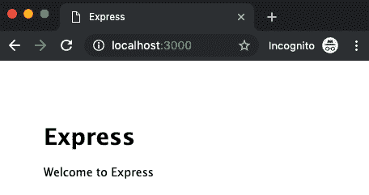
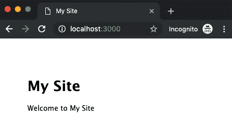
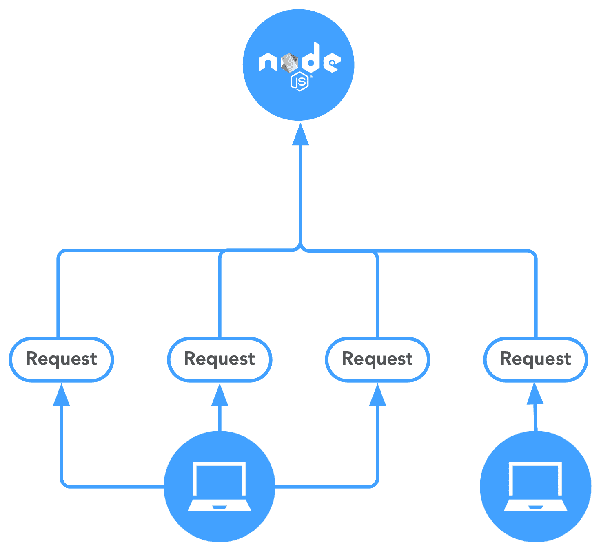

# 二、我们可以使用 JavaScript 服务器端吗？ 当然！

我们通常不认为 JavaScript 已经存在于服务器端，因为它的大部分历史只是在浏览器中的客户端。 然而，归根结底，JavaScript*是一种语言，而语言在某种程度上是不可知的。 虽然 JavaScript 服务器端是可以使用的，因为它开始时只有一些不同的工具，但**Node.js**的引入使 JavaScript 在服务器端成为主流。 Python 和 JavaScript 在这里有更多的相似之处，但在实践中如何使用每种技术之间仍然有很大的差异。 让我们来看看 Node.js，看看我们如何在服务器端利用它的强大功能，以及为什么我们要这么做!*

本章将涵盖以下主题:

*   为什么在服务器端使用 JavaScript ?
*   node . js 的生态系统
*   线程和异步性

# 技术要求

你可以在 GitHub 上的[https://github.com/PacktPublishing/Hands-on-JavaScript-for-Python-Developers](https://github.com/PacktPublishing/Hands-on-JavaScript-for-Python-Developers)找到本章的代码文件。

# 为什么在服务器端使用 JavaScript ?

有许多服务器端语言:Java、PHP、Ruby、Go 和我们的朋友 Python，这只是其中的一些。 那么，我们为什么要使用 JavaScript 作为服务器端语言呢? 一个答案是减少上下文切换。 从理论上讲，同一个开发人员可以编写一个 web 应用的前端和后端，只需要最少的心理变化。 转换成本的编程语言背后的研究是目前光和往往是高度轶事,但一些研究表明,从一个任务切换到另一个的认知开销和降低生产力和增加的时间需要完成的任务。 通过扩展，从 JavaScript 转换到 Python 需要一些心理练习。 当然，通过练习，这种心理负担变得不重要(想想一个能够实时听一种语言并将其翻译成另一种语言的翻译人员)。 然而，随着技术变化的速度，达到这种流利程度变得更加困难。 按理说，任务之间的一致性越高，在任务之间切换所涉及的脑力消耗就越少。

让我们看看我们在语法和风格方面讨论过的编码语言之间的语法相似性，以及更多的历史。

## 语法的相似之处

开发人员喜欢使用 Node.js 的一个原因是，它在语法上几乎与前端 JavaScript 完全相同。

让我们看看我们已经写过的一些代码。

下面是一个 JavaScript 代码示例:

```js
document.getElementById('submit').onclick = event => {
  event.preventDefault()
  fetch('/data')
    .then(res => res.text())
    .then(response => alert(response))
    .catch(err => console.error(err))
}
```

现在，让我们看看一些 Node.js 代码，它们的功能完全不同，但语法相似，有点符号、花括号等等。 这里有一个例子:

```js
const http = require('http')

http.createServer((request, response) => {
  response.writeHead(200, {'Content-Type': 'text/plain'})
  response.end('Hello World!')
}).listen(8080)
```

乍一看，这两个代码片段可能不太相似，所以让我们仔细看看。 在我们的 JavaScript 示例中，看一下`event.preventDefault()`，然后，在我们的 Node.js 示例中，看一下`response.end('Hello World!')`行。 它们都使用**点语法**来指定父对象的**方法**(或函数)。 这两行代码做的是完全不同的事情，但是我们可以根据 JavaScript 的规则来读取它们。 点语法在 JavaScript 中是一个非常重要的概念，因为它本质上是一种面向对象的语言。 就像我们在使用面向对象的 Python 时访问类方法和属性一样，我们可以访问 JavaScript 对象的类方法和属性。 就像在 Python 中一样，JavaScript 中也有类、实例、方法和属性。

那么，*这个 Node.js 的例子到底在做什么? 再一次，我们可以看到 JavaScript 是一种相当清晰的语言! 即使不知道太多关于 Node.js 的内部，我们也可以看到我们正在创建一个服务器，发送一些东西，并侦听输入。 如果我们再比较一下 Flask 的例子，如下所示:*

```js
from flask import Flask, Response

app = Flask(__name__)

@app.route('/')
def main():
    content = {'Hello World!'}
    return Response(content, status=200, mimetype='text/plain')

$ flask run --port=8080
```

这两个片段的工作方式并没有本质上的不同; 它们是用两种不同的语言实现同一目标的两种不同方式。

让我们看一下在客户端 JavaScript 和 Node.js 中做同样工作的函数。 我们还没有详细讨论语法，所以，暂时不要让语法成为一个绊脚石。

下面是一个 JavaScript 示例:

```js
for (let i = 0; i < 100; i++) {
  console.log(i)
}
```

下面是 Node.js 的一个例子:

```js
for (let i = 0; i < 100; i++) {
  console.log(i)
}
```

仔细看看这两个。 这不是一个骗局:它们实际上是一样的。 比较 JavaScript 版本和基本的 Python 循环，如下面的代码片段所示:

```js
for x in range(100):
    print(x)
```

我们将进入语法的 JavaScript 和为什么它出现的时间比神谕的同行在第 3 章,*本质语法*,但是现在,让我们承认*Python 代码是不同于 JavaScript。*

 *## 再讲一点历史

Node.js 由 Ryan Dahl 创建，最初发布于 2009 年，是一个在浏览器之外运行的 JavaScript 开源运行时。 它可能看起来很新，但在当时已经站稳了脚跟，包括大公司。 然而，一个大多数人不知道的事实是，Node.js 是*而不是*第一个实现的服务器端 JavaScript。 多年前，这一殊荣再次属于网景公司(Netscape)。 然而，许多人认为这门语言还不够发达，所以它在这方面的使用被限制到不存在的地步。

Dahl 试图将服务器端和客户端更紧密地结合在一起。 从历史上看，在应用的两个方面之间存在相当大的关注点分离。 JavaScript 可以在前端工作，但查询服务器是一个持续的过程。 据说，当 Dahl 对文件上传进度条必须依赖于与服务器的持续通信而感到沮丧时，他受到了创建 Node.js 的启发。 Node.js 提供了一种更流畅的方式来执行这种通信，它提供了一个*基于事件循环的体系结构*来促进这种通信。 在创建 Node.js 之后，Dahl 继续创建了 Deno，一个类似于 Node.js 的 JavaScript 和 TypeScript 运行时。 然而，出于我们的目的，我们将使用 Node.js。

稍后，我们将讨论 Node.js 使用的回调范例，我们也将看到前端 JavaScript 如何使用它。

让我们通过深入了解 Node.js 的生命周期来了解它是如何工作的。

# node . js 的生态系统

大多数语言都不是范例:只是编写自包含的代码。 独立的代码模块被称为**包**，广泛应用于软件工程和开发中。 从另一个角度来看，即使是一个全新的网络服务器也没有现成的软件来服务一个网站。 你必须安装一个软件包，比如 Apache 或 nginx，才能进入网站的“Hello World!”步骤。 Node.js 也不例外。 不过，它有许多工具可以简化获取这些包的过程。 让我们从头开始看一个使用 Node.js 的服务器的基本“Hello World!”示例。 我们稍后会更详细地讨论这些概念，所以，现在，让我们来看看基本的设置。

## node . js

当然，我们首先需要的是访问语言本身。 有几种方法可以在机器上获得 Node.js，包括包管理器，但最直接的方法是从官方网站[https://nodejs.org](https://nodejs.org/)下载。 您还需要熟悉您的终端程序和基本命令。 请确保在安装时包含**Node Package Manager**(**npm**)。 根据您的环境，可能需要在安装完成后重新启动计算机。

一旦你安装了 Node.js，确保你可以访问它。 打开终端并执行以下命令:

```js
$ node -v
```

您应该看到返回的版本号。 如果是这样，你已经准备好继续前进了!

## npm

Node.js 的强大力量之一是它丰富的开源社区。 当然，这并不是 Node.js 所独有的，但这是一个吸引人的事实。 正如 Python 有`pip`，Node.js 也有`npm`。 `npm`是世界上最大的包注册中心，拥有数十万个包和数十亿次下载。 当然，包是一个相互依赖的网络，并且需要保持它们的更新，所以 npm 提供了一个相当稳定的版本管理方法，以确保你使用的包正确地协调在一起。

就像我们测试 Node 版本一样，我们将测试`npm`，像这样:

```js
$ npm -v
```

如果由于某种原因，您安装了*而不是*，那么是时候研究一下如何安装`npm`了，因为`npm`没有附带 Node 的原始安装。 有几种方法可以安装它，比如使用 Homebrew，但最好还是回顾一下如何安装 Node。

## Express.js

Express 是一种快速、流行的 web 应用框架。 我们将使用它作为 Node.js 工作的基础。 稍后我们将更详细地讨论如何使用它，所以现在，让我们给自己一个快速工作的框架。 我们将在全球安装 Express 和脚手架工具，如下所示:

1.  使用命令行安装 Express 生成器，运行如下命令:`npm install -g express express-generator`。
2.  通过运行以下命令，使用生成器创建一个新目录并构建应用:`express --view=hbs sample && cd sample`。
3.  你的`sample`目录现在应该包含一个骨架，像这样:

```js
├── app.js
├── bin
│ └── www
├── package.json
├── public
│ ├── images
│ ├── javascripts
│ └── stylesheets
│ └── style.css
├── routes
│ ├── index.js
│ └── users.js
└── views
    ├── error.hbs
    ├── index.hbs
    └── layout.hbs
```

4.  现在，我们将运行以下命令来安装应用的依赖项:`npm install`。
5.  它将完成一些下载必要包的工作，然后我们将准备启动服务器，运行以下命令:`npm start`。

6.  访问`http://localhost:3000/`，您将看到有史以来最激动人心的页面，如下截图所示:



Figure 2.1 - Express welcome page

恭喜你! 这是你的第一个 Node.js 应用! 让我们来看看下面的情况:

在`routes`目录下打开`index.js`文件，你会看到类似这样的内容:

```js
var express = require('express');
var router = express.Router();

/* GET home page. */
router.get('/', function(req, res, next) {
  res.render('index', { title: 'Express' });
});

module.exports = router;
```

值得注意的是，您可能会看到一些 Node.js 示例和现代 JavaScript 之间的语法差异。 如果您注意到，这些行以分号结束，而我们前面的示例没有。 我们将在稍后讨论 JavaScript 的不同版本，但现在，如果您对此感到惊讶，请记住这一点。

让我们看一下`router.get`语句，如下面的代码块所示:

```js
router.get('/', function(req, res, next) {
  res.render('index', { title: 'Express' });
});
```

`get`指的是程序正在响应的 HTTP 动词。 类似地，如果我们处理的是 POST 数据，该行的开始将是`router.post`。 所以,从本质上说,这是说:“嘿,服务器,当你得到一个请求的主页,呈现指数模板与`title`变量等于`Express`”。别担心我们会详细在[第十三章](13.html)*,使用表达*,但是现在,让我们玩一个小:

1.  在`res.render`行之前加入`console.log('hello')`行。
2.  将`Express`改为`My Site`。

在修改 Node.js 代码时，需要重新启动本地服务器。 您可以返回终端，使用*Ctrl*+*C*退出快捷键，然后`npm start`重新启动。 当然，有流程管理器可以为您处理这个问题，但目前，我们使用的是一个非常简单的实现。

返回`https://localhost:3000/`。 您应该看到以下内容:



Figure 2.2 - Changed Express page

现在，让我们回到你的终端。 当您点击本地主机时，还会触发一个`console.log()`语句——一个调试打印语句。 你应该看到`hello`与 Express 提供的请求和响应一致，如下面的截图所示:


Figure 2.3 - console.log

事实证明，无论是在客户端还是服务器端，使用控制台对我们来说都是无价的。 这只是它所能做的一小部分! *Ctrl*+*C.*

# 线程和异步性

与传统的 web 架构一样，理解*为什么*在后端使用 Node.js 是很重要的。

我们已经了解了 Node.js 的*运行方式，现在，让我们看看 Node 的客户端-服务器架构与传统模式的区别。*

## 传统的客户机-服务器体系结构

为了理解 Node.js 与传统架构的区别，让我们看看下面的请求图:


Figure 2.4 - Traditional client-server diagram

在传统的设置中，每个服务器请求(或连接)在服务器的内存中生成一个新线程，占用系统**随机访问内存**(**RAM**)，直到可能的线程数达到。 在此之后，一些请求必须等待更多可用内存。 如果您不熟悉**线程**的概念，那么它们基本上就是在计算机上运行的一小段命令序列。 这个*多线程*范式意味着，对于服务器接收到的每一个新请求，都会在内存中创建一个新的唯一位置来处理请求。

现在，请记住，一个*请求*不是一个完整的网页——一个页面可以有数十个对其他辅助资产(如图像)的请求。 在下面的截图中，看看谷歌主页就有 16 个请求:


Figure 2.5 - google.com requests

为什么这很重要? 简而言之:可伸缩性。 每秒请求越多，使用的内存就越多。 我们都见过网站在加载时崩溃的后果——一个令人讨厌的错误页面。 这是我们都想避免的。

## node . js 架构

与此相反，Node.js 是*单线程*，允许数千个非阻塞的输入-输出调用，而不需要额外的开销，如下图所示:



Figure 2.6 - Node.js client-server diagram

不过，有一件事需要注意:这种模式并不是管理服务器上的流量和负载的灵丹妙药。 对于大量的交通问题，目前还没有防弹的解决方案。 然而，这种结构确实有助于提高服务器的性能。

Node.js 与 JavaScript 配合如此之好，其中一个原因是它已经处理了**事件**的想法。 正如我们将看到的，事件在前端是 JavaScript 的一个强大的基石，因此，通过将这个过程带到后端，我们将看到与其他架构有点不同的方法。

# 总结

虽然在服务器上运行 JavaScript 的概念并不新鲜，但 Node.js 极大地扩展了它的流行度、稳定性和特性。 早些时候，服务器端 JavaScript 被抛弃了，但随着 Node.js 的创建，它在 2009 年再次崭露头角。

通过在客户端和服务器端使用相同的基本语法，Node.js 减少了开发人员切换上下文的心理开销。 同一个开发人员可以无缝地完成整个堆栈，因为客户端工作和如何在服务器上使用 Node.js 之间有相当多的相似之处。 与其他更传统的实现相比，在方法上的不同还带来了处理服务器请求的不同基本范式。

它不再只是客户端了!

在下一章中，我们将深入研究 JavaScript 的语法:语法、语义和最佳实践。

# 问题

试着回答下面的问题来测试一下你的知识:

1.  True 或 false: Node.js 是单线程的。
2.  判断题:Node.js 的架构不受**分布式拒绝服务**(**DDoS**)攻击的影响。
3.  最初是谁创建了 Node.js?
    1.  布兰登服从指令
    2.  Linux Torvalds
    3.  Ada Lovelace
    4.  Ryan Dahl
4.  真或假:服务器端的 JavaScript 本质上是不安全的，因为代码是在前端公开的。
5.  真或假:Node.js 天生就优于 Python。

# 进一步的阅读

请参考以下链接获取更多关于这个主题的信息:

*   为什么我要使用 Node.js? [https://www.toptal.com/nodejs/why-the-hell-would-i-use-node-js](https://www.toptal.com/nodejs/why-the-hell-would-i-use-node-js)
*   事件驱动架构:[https://en.wikipedia.org/wiki/Event-driven_architecture](https://en.wikipedia.org/wiki/Event-driven_architecture)*