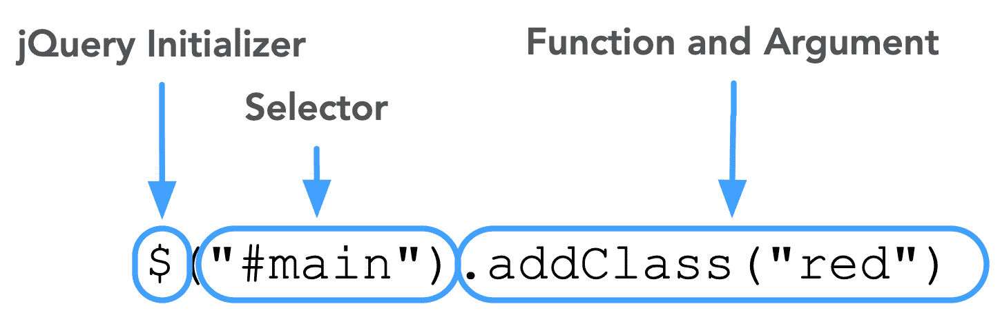
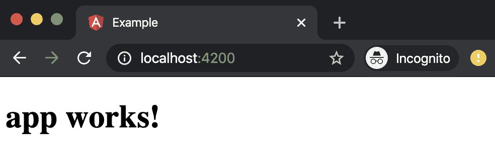
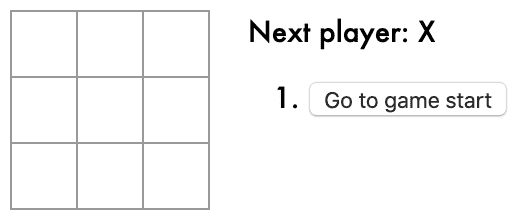
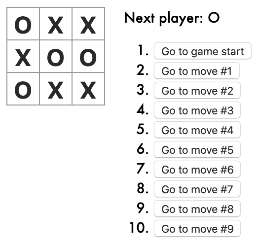
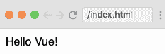
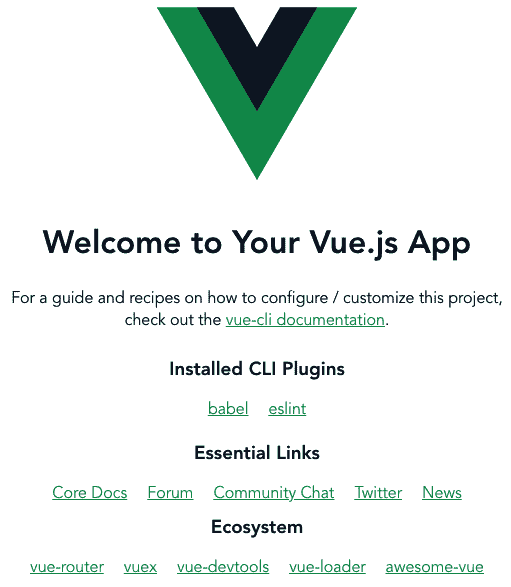

# 八、使用框架和库

很少有语言存在于一个独立的、单一的象牙塔中。 几乎总是在程序中使用第三方代码来增加功能，特别是在任何现代语言中。 使用第三方代码(如库和框架)也是使用 JavaScript 的一个不可分割的部分。 让我们研究一下工具包中一些比较流行的开源工具。

本章将涵盖以下主题:

*   jQuery
*   角
*   React 和 React Native
*   Vue.js

# 技术要求

准备使用存储库的`Chapter-8`目录中提供的代码:[https://github.com/PacktPublishing/Hands-on-JavaScript-for-Python-Developers/tree/master/chapter-8](https://github.com/PacktPublishing/Hands-on-JavaScript-for-Python-Developers/tree/master/chapter-8)。 由于我们将使用命令行工具，还需要提供终端或命令行 shell。 我们需要一个现代化的浏览器和本地代码编辑器。

# jQuery

创建或使用 JavaScript 库的主要原因之一是减轻重复或复杂的任务。 毕竟，你不能用插件或库从根本上*改变*语言——你所能做的只是增加或改变现有的功能。

正如我们在[第 1 章](01.html)，*JavaScript 进入主流编程*中所讨论的，JavaScript 的早期历史有点像狂野的西部场景。 浏览器之战已经全面打响，特性还没有标准化，甚至调用 Ajax 也需要两组不同的代码:一组用于 Internet Explorer，另一组用于其他浏览器。

jQuery 是由 John Resign 在 2006 年创建的。

缺乏跨浏览器的标准化是创建 jQuery 的动力。 从 DOM 操作到 Ajax 调用，jQuery 的语法和结构都是“编写一次，在所有浏览器中使用”的范例。 随着 ES6 和 ES6 之外的开发，JavaScript*越来越标准化。 然而，已经有超过十年的 jQuery 代码在那里，大多数 javascript 密集型网站使用。 由于这些遗留应用，它仍然很受欢迎，因此对我们的讨论很重要。 它也是开源的，所以使用它不需要任何许可费。*

 *## jQuery 的优点

考虑下面的例子，它们做同样的事情:

*   **JavaScript ES6**:`document.querySelector("#main").classList.add`

`("red")`

*   :`$("#main").addClass("red");`

如您所见，jQuery 构造要短得多。 太棒了! 简洁的代码通常是一件好事。 那么，让我们来分析一下这个例子:



Figure 8.1 – jQuery syntax

1.  我们几乎所有的 jQuery 语句都以`$`开头。 这是在许多库中使用的约定，实际上，可以覆盖美元符号并使用任何您想要的符号，因此您可能会看到以`jQuery`开头的示例。

2.  我们的选择器是一个 CSS 选择器，就像我们使用的`document.querySelector()`。 按照惯例，如果您将 DOM 节点存储起来供以后使用，那么通过 jQuery 选择的 DOM 节点将使用美元符号作为前缀。 因此，如果我们将`#main`存储为一个变量，它可能看起来像:`const $main = $("#main")`。
3.  jQuery 有自己的函数列表，这些函数通常是内部功能的简写。

关于 jQuery 有一个有趣的事实:您可以将 jQuery 与普通的 JavaScript(它不使用任何框架或库)混合使用。 事实上，术语“普通 JavaScript”是指非 jquery 代码的一种流行方式。

此外，一些前端库，如 Bootstrap，在 Bootstrap 5 之前，是用 jQuery 构建的，所以理解它的用法可以帮助你理解其他库和框架。 这并不是一件糟糕的事情，但当你在前端开发的美好新世界中航行时，你必须意识到这一点。

## jQuery 的缺点

与使用任何库一样，使用 jQuery 需要在客户端额外下载。 截至本文撰写之时，jQuery 版本 3.4.1 的缩小版只有 88 KB。 现在，虽然这几乎可以忽略不计，并且会被浏览器缓存，但请记住，这必须在每个页面上执行和加载，所以不仅要考虑下载大小，还要考虑执行时间。 Wes Bos 也有一些关于 ES6 和 jQuery 作用域的重要信息:[https://wesbos.com/javascript-arrow-functions/](https://wesbos.com/javascript-arrow-functions/)。

此外，虽然不是在所有情况下都是这样，但很多 jQuery 的使用都是为了标准化 ES5，所以你在在线和示例中看到的大多数代码都是 ES5。

## jQuery 的例子

，*事件，事件驱动设计， 和 api*([https://github.com/PacktPublishing/Hands-on-JavaScript-for-Python-Developers/tree/master/chapter-8/swapi)和一个 jQuery 版本(https://github.com/PacktPublishing/Hands-on-JavaScript-for-Python-Developers/tree/master/chapter-8/swapi-jQuery](https://github.com/PacktPublishing/Hands-on-JavaScript-for-Python-Developers/tree/master/chapter-8/swapi))。 【显示】

现在，我承认这不是 jQuery 中最优雅的部分，但这是有原因的。 让我们来分析一下。

First up—HTML:

| **es6** | **jQuery** |
| 没有变化 | 添加
`<script src="https://code.jquery.com/jquery-3.4.1.min.js"></script>` |

正如我们所讨论的，添加一个 JavaScript 库或框架本质上需要另一个文件下载和/或从本地文件消耗处理时间。 通常情况下，大小是可以忽略的，所以在这种情况下，唯一相关的因素是我们添加了一行 HTML 来从全球内容交付网络加载 jQuery 文件。

CSS 不会像预期的那样发生变化。 那么让我们来看看 JavaScript:

| **es6** | **jQuery** |
| 

```js
class SWAPI {
  constructor() {
    …
  }
}
```

 | 

```js
var swapi;

$(document).ready(function() {
  swapi = new SWAPI;
});
```

 |

现在我们看到了一些主要的区别。 正如前面提到的，这不一定是最理想的 jQuery 程序，但我认为它表达了要点。 首先，虽然 jQuery 和 ES6 是兼容的，但大多数 jQuery 都是在 ES6 不可用的地方使用的——或者代码还没有升级到 ES6。 在大多数 jQuery 代码中，你会注意到的第一件事是它在行尾使用分号，并使用`var`而不是`let`或`const`。 这并不是 jQuery 所独有的; 相反，它们是 ES5 约定。

ES5 通常使用对象原型的操作，而不是使用类，如下所示:

```js
SWAPI.prototype.constructor = function() {
  this.$loader = $('#loader');
  this.people = [];
};
```

类可以说是更干净的工作方式，因为它们在方法和用法上更独立、更显式。 然而，这个约定在 jQuery 流行的时候还没有出现，所以我们将使用 ES5 原型继承。

现在让我们一起来看看使用 ES6 和 jQuery 实现 Ajax 调用的不同之处:

| **es6** | **jQuery** |
| 

```js
fetch(url)
  .then((response) => {
     return response.json()
  })
  .then((json) => {
    … 
  })
```

 | 

```js
$.get(url)
  .done(function(data) {
     …
  };
```

 |

这里有一个很好的例子，说明了为什么要使用 jQuery，以及它的创建是如何在 ES6 中对一些简化做出贡献的。 在 ES5 中，发出 Ajax 请求需要两种不同的方法——一种用于 Internet Explorer，另一种用于其他浏览器——因为请求方法不是标准化的。 jQuery 帮助完成了浏览器检测和代码转换*，这样开发人员只需要编写一条语句。 然而，有了`fetch`，这就不再需要了。 然而，我们看到 jQuery 代码稍微短一些，因为我们没有从请求返回 JSON 的第一个`.then`函数。 这是设计缺陷还是功能? 实际上是后者，因为 api 可以返回许多不同类型的响应。 `fetch`方法在内部为您做了一些转换，而 jQuery 则希望您大致了解您的数据是什么以及如何使用它。*

W3Schools 有很棒的 jQuery 例子和参考材料:[https://www.w3schools.com/jquery/](https://www.w3schools.com/jquery/)。

如果您查看代码的 jQuery 版本中的其余代码，您会发现许多其他有趣的差异示例，但现在从 jQuery 开始! 让我们来看看一个成熟的*web 框架*:Angular。

# 角

Angular 是由谷歌创建的*AngularJS。* 2016 年，它被重写为版本 2，从 AngularJS 中分离出来。 它是开源的，是一个框架，而不是一个库，这就引出了一个问题:**框架**和**库**之间有什么区别?

*库*是一个工具包，可以更轻松地编写代码，用于各种目的。 用建筑的比喻来说，图书馆就像一组可以用来组装房子的砖块。 相反，*框架*更符合用于设计房屋的蓝图。 它可能会使用一些相同的砖块——也可能不会! 主要的区别之一是，一般来说，库允许您按照自己的意愿编写代码，而不需要库来决定如何构造代码。 另一方面，框架更固执己见，要求你用*而不是*框架的最佳实践来构造代码。 它是一个模糊的(有时是超载的)术语，所以关于什么是库，什么是框架有很多可以理解的争论。 只要搜索*Stack Overflow*，你就会发现相互竞争的定义。 简单地说，**框架**可以是具有指定使用模式的技术集合，而**库**更可能是一种帮助操作数据的技术。

让我们来看看这张图:


Figure 8.2 – Framework composition

正如我们所看到的，一个框架实际上可以由多个库组成。 框架的设计模式通常规定了如何以及何时使用这些库。

Angular 使用了*TypeScript*，这是一种开源编程语言。 它最初是由微软开发的，它是带有一些附加功能的 JavaScript，它吸引了一些开发人员。 尽管 TypeScript 被归为自己的语言，但它是 JavaScript 的超集，所以它可以转换为普通的 JavaScript，因此在浏览器中运行不需要任何额外的工作，除了执行 Angular 的构建过程。

## 角的优点

像大多数框架一样，Angular 对你的文件结构和代码语法很有主见(尤其是混合了 TypeScript)。 这听起来可能是一个缺点，但在团队中工作时，这实际上是非常重要的:您已经了解了如何使用代码的现有文件结构，这是一件*好的*事情。

Angular 也不是孤立存在的。 它是**技术栈**的一部分，这意味着它是一个涵盖了数据库前端的全面解决方案。 你可能遇到过**MEAN**stack:**MongoDB、Express、Angular 和 Node.js**。 虽然你可以在这个堆栈之外使用 Angular，但它提供了一个易于设置的开发生态系统，其他人都很容易理解。

如果你不熟悉**模型-视图-控制器**(**MVC**)范式，现在是熟悉它的好时机。 许多跨多种语言的技术栈都利用这个范例来分离代码库中的关注点。 例如,的**模型程序处理的数据采集和操纵数据源(s)(如数据库和/或 api),而【T6 控制器】**管理之间的交互模型,数据源,和【显示】视图层。 **视图**主要控制全栈环境中信息的可视化显示。 在全栈 MVC 社区中，围绕所谓的“胖模型、瘦控制器”方法和相反的方法存在争论。 现在讨论这种区别并不重要，但你会在社区中看到这种争论。

说到社区，Angular 开发者已经形成了一个特别的网络，大家互相帮助。 这些讨论本身就很有价值，可以帮助您更好地把握形势。

Angular 还有其他一些优势，比如双向数据绑定(确保模型和视图彼此通信)和绑定到 HTML 元素的专用指令，但这些细微差别现在不重要讨论。

## 缺点的角

Angular 的主要缺点是它陡峭的学习曲线。 除了原始 AngularJS 和更现代的 Angular 迭代之间的差异之外，不幸的是，Angular 在开发人员中越来越不受欢迎。 此外，它是*相当*冗长和复杂。 根据一些 Angular 开发人员的说法，使用第三方库之类的任务可能是重复的。

使用 TypeScript 而不是标准 ES6 也是一个值得关注的问题。 虽然 TypeScript 很有用，但它也增加了使用 Angular 的学习曲线。 话虽如此，Angular 确实是非常多才多艺的。

## 角的例子

让我们用 Angular 构建一个小的“Hello World”应用。 我们将需要一些工具开始我们的工作，如`npm`。 参考[第 2 章](02.html)，*Can We Use JavaScript server ? 当然! 、*用于安装`npm`及其好友。 如果您愿意，您也可以跟随提供的代码[https://github.com/PacktPublishing/Hands-on-JavaScript-for-Python-Developers/tree/master/chapter-8/angular-example](https://github.com/PacktPublishing/Hands-on-JavaScript-for-Python-Developers/tree/master/chapter-8/angular-example)。

以下是我们的步骤:

1.  首先安装 Angular CLI:`npm install -g @angular-cli`。
2.  用`ng new example`创建一个新的示例项目。 在提示符处按*输入*接受默认安装。
3.  进入刚刚创建的目录:`cd example`。
4.  启动服务器:`ng serve --open`。

此时，你的浏览器应该在`http://localhost:4200/`处打开此页面:



Figure 8.3 – Example start page

好了,好了。 对于我们来说，这看起来是一个足够简单的页面。 下面是 CLI 创建的文件结构:

```js
.
├── README.md
├── angular-cli.json
├── e2e
│   ├── app.e2e-spec.ts
│   ├── app.po.ts
│   └── tsconfig.json
├── karma.conf.js
├── package-lock.json
├── package.json
├── protractor.conf.js
├── src
│   ├── app
│   │   ├── app.component.css
│   │   ├── app.component.html
│   │   ├── app.component.spec.ts
│   │   ├── app.component.ts
│   │   └── app.module.ts
│   ├── assets
│   ├── environments
│   │   ├── environment.prod.ts
│   │   └── environment.ts
│   ├── favicon.ico
│   ├── index.html
│   ├── main.ts
│   ├── polyfills.ts
│   ├── styles.css
│   ├── test.ts
│   └── tsconfig.json
└── tslint.json
```

让我们看看生成的代码。 打开`src/index.html`。 以下是你将看到的:

```js
<!doctype html>
<html lang="en">
<head>
  <meta charset="utf-8">
  <title>Example</title>
  <base href="/">

  <meta name="viewport" content="width=device-width, initial-scale=1">
  <link rel="icon" type="img/x-icon" href="favicon.ico">
</head>
<body>
  <app-root></app-root>
</body>
</html>
```

就是这样! 你看，这只是 Angular 用来创建我们刚刚看到的页面的一个模板，然后 JavaScript 会完成剩下的工作。 如果在浏览器中查看页面的源代码，您将看到一些非常类似的内容，但只有几个脚本调用。 **单页应用**(**SPA**)的所有 JavaScript 将被立即下载，或者可能被分成块，以便和谐使用。

## 单页面应用

SPA 到底是什么值得讨论。 我们之前已经提到过这个话题，但现在让我们看看为什么 Angular(以及 React 和 Vue，我们很快就会讲到)如此受欢迎和迫切需要使用。 想想一个标准的、基于 html 的网站。 它可能有一致的页眉、页脚和样式。 然而，一个标准的网站需要下载(或从本地缓存服务)这些资产，每次导航到不同的页面(更不用说检索 HTML 和重新呈现它)。 SPA 通过将所有相关数据打包到一个统一的包中并传输到浏览器，从而消除了这种冗余。 然后浏览器解析 JavaScript 并呈现它。 其结果是快速、流畅的体验，本质上消除了页面加载时间延迟。 你们已经用过了。 如果您使用 Gmail 或大多数现代在线电子邮件系统，您可能已经注意到页面加载时间可以忽略不计，或者，在最坏的情况下，有一个小的加载图标。 加载时间和表面上浪费资源和内容的重新下载是 spa 设计用来处理的问题之一。

现在我们已经讨论了 SPA 如何帮助我们提高效率，让我们来看看 Angular 例子背后的 JavaScript。

## JavaScript

首先，我们打开`src/app/app.component.html`，看第 2 行`{{ title }}!`。

这些花括号是什么? 如果您熟悉其他模板语言，您可能会认为这是一个模板令牌，打算在呈现之前由我们的呈现语言替换。 那么，替换它的方法是什么?

现在让我们看一下`src/app/app.component.ts`:

```js
import { Component } from '@angular/core';

@Component({
  selector: 'app-root',
  templateUrl: './app.component.html',
  styleUrls: ['./app.component.css']
})
export class AppComponent {
  title = 'app works!';
}
```

我们可以看到模板引用了`app.component.html`，而`AppComponent`类指定`title`为`app works!`。 这就是我们在浏览器中看到的。 欢迎来到威力强大的模板系统!

现在，我们不会深入了解 Angular 的 SPA 特性，但可以在[https://angular.io/tutorial](https://angular.io/tutorial)上查看 Angular 教程，了解更多细节。

现在，让我们继续 React 的巡演。

# React 和 React Native

React 最初是由 Jordan walker 于 2013 年在 Facebook 创建的，它已经迅速发展成为目前使用的领先用户界面库之一。 与 Angular 不同的是，React 并不寻求成为一个完整的框架，而是专注于 web 工作流的特定部分。 由于网页本质上是无状态的*(也就是说，没有真正的信息从一个页面传递到另一个页面)，spa 的目的是在 JavaScript 内存中存储某些状态片段，使后续视图可以用数据填充。 React 是这类架构如何工作的一个主要例子，但它仍然没有包含整个框架范例。 在 MVC 术语中，React 处理视图层。*

 *## 反应的优点

因为 React*本身*只处理视图，所以它依赖于其他库来完善它的特性集，比如 React Router 和 Hooks。 也就是说，React 的基本架构被设计成模块化的，并且有用于完成工作流其他部分的附加组件。 目前，了解 React 路由器、Hooks 或 Redux 并不重要，但要知道 React 只是整个网站谜题的一部分。

那么，为什么这是一个优势呢? 与 Angular 等其他 JavaScript 工具不同，React 并没有试图用自己的规则和规则或语言结构来重新发明轮子。 感觉就像你在用基本的 JavaScript 编码，因为在大多数情况下，你就是这样的!

React 的另一个优点是它处理组件和模板的方式。 组件只是可重用的代码片段，可以在程序的多个位置使用不同的数据填充视图。 React 还在[https://reactjs.org/tutorial/tutorial.html](https://reactjs.org/tutorial/tutorial.html)上提供了一个很棒的循序渐进的教程。 我们将在*React*部分详细分析这个问题。 当然，现在我们需要讨论它的缺点。

## 不利的反应

老实说，React 的学习曲线(尤其是它的新姊妹技术，如简化基于状态的管理的 Redux 和 Hooks)是陡峭的。 然而，对于社区来说，这甚至都不是一个主要的缺点，因为几乎所有的库和框架都是如此。 然而，它的一个主要缺点是发展速度太快。 现在，你可能会想:*但是持续发展的技术是好的*! 这是一个很好的想法，但在实践中，它可能有点令人生畏，特别是在处理破坏的变化时。

另一个让一些开发人员感到厌烦的是 JavaScript 中混合了 HTML 和 JavaScript。 它使用了一个语法扩展，允许在 JavaScript 中添加名为 JSX 的 HTML。 对于纯粹主义者来说，将表示层代码混合到逻辑结构中似乎是外来的，而且是一种体系结构的反模式。 同样，JSX 有一个学习曲线。

现在我们来看看一个经典的 React 示例应用:Tic Tac Toe。

## 反应的例子

可以跟随一个一步一步的教程来构建这个应用在 https://reactjs.org/tutorial/tutorial.html,易于使用,您可以使用此 GitHub 目录——https://github.com/PacktPublishing/Hands-on-JavaScript-for-Python-Developers/tree/master/chapter-8/react-tic-tac-toe——[完成的例子:](https://github.com/PacktPublishing/Hands-on-JavaScript-for-Python-Developers/tree/master/chapter-8/react-tic-tac-toe)

1.  将存储库和`cd`克隆到`react-tic-tac-toe`目录中。
2.  执行`yarn start`。

不要对新的`yarn`命令感到惊讶。 它是一个不同的包管理器，类似于`npm`。

3.  当`yarn start`完成时，它将为您提供一个类似`http://localhost:3000/`的 URL。 在浏览器中打开它。 你应该看到这个:



Figure 8.4 – React Tic Tac Toe, starting

如果你不熟悉井字游戏，它的逻辑很简单。 两名玩家轮流在 3 × 3 的格子中标记一个 X 或一个 O，直到其中一名玩家在一行中有三个标记，无论是水平的、垂直的还是对角线的。

让我们玩! 如果你点击这些框，你可能会得到以下结果:



Figure 8.5 – React Tic Tac Toe, possible end state

注意，该示例还使用屏幕右侧的按钮维护状态历史记录。 你可以通过点击按钮回放到任何一种状态。 这是 React 如何使用**状态**的一个例子，以便在应用的各个部分保持连续性。

### 组件

为了说明可重用组件的概念，请考虑 Tic Tac Toe 网格的第一行代码。 Take a peek at`src/index.js`。

你应该在第 27 行看到这个:

```js
<div className="board-row">
  {this.renderSquare(0)}
  {this.renderSquare(1)}
  {this.renderSquare(2)}
</div>
```

`renderSquare`是一个相当简单的函数，用于渲染 JavaScript XML，或**JSX**。 如前所述，JSX 是 JavaScript 的扩展。 它在一个标准的 JavaScript 文件中引入了类似 XML 的功能，将 JavaScript 语法与一组 HTML 和 XML 结合在一起来构造我们所讨论的组件。 它本身并不是完全成熟的模板语言，但在某些方面，它实际上可能更强大。

这里是`renderSquare`:

```js
renderSquare(i) {
  return (
    <Square
      value={this.props.squares[i]}
      onClick={() => this.props.onClick(i)}
    />
  );
}
```

到目前为止，一切都很好，外观相当标准，除了一件事。 什么是`Square`? 这不是 HTML 标签! JSX 的强大之处在于:我们可以定义我们自己的可重用标签，作为我们一直在谈论的这些奇妙的组件。 把它们想象成我们可以用来组装自己的应用的乐高®积木。 从基本的构建块，我们可以构建一个非常复杂的 SPA。

因此，`Square`只是一个返回带有一些属性的标准 HTML 按钮的函数，例如`onClick`处理程序。 你可以在后面的代码中看到这个处理程序的作用:

```js
function Square(props) {
  return (
    <button className="square" onClick={props.onClick}>
      {props.value}
    </button>
  );
}
```

我们只是触及了 React 的表面，但我希望你已经感受到它的力量。 事实上，它将成为生态系统中占主导地位的前端框架。 在撰写本文时，React 在技术领域的职位空缺数量远远超过了 Angular。

## 反应本地

如果不提到 React Native，关于 React 的讨论就不完整。 本地移动应用开发的一个困难方面是，嗯，本地语言。 Android 平台使用 Java，而 iOS 依赖于 Swift 作为编程语言。 我们不会在此详细介绍手机开发(或 React Native)，但需要注意的是，React 和 React Native 之间存在主要区别。 当我第一次尝试 React 时，我的印象是组件可以在 React 和 React Native 之间重用。 在某种程度上，这是正确的，但两者之间的差异大于相似之处。

Native 的主要优势在于你不用另一种语言写作; 相反，您仍然在编写 JavaScript。 话虽如此，Native 还有一些额外的复杂性，特别是在处理移动设备的原生功能时，比如摄像头。 为此，我建议你在项目生命周期中仔细考虑 React Native 的使用，并采用*而不是*假设所有知识都从一个平台转移到另一个平台。

接下来，让我们讨论一个相对较新的 JavaScript 世界:Vue.js。

# Vue.js

JavaScript 框架生态系统的另一个新来者是 Vue.js(通常简称为 Vue)。 它是由 Evan You 在 2014 年开发的另一个开源框架，旨在为 spa 和用户界面提供高级功能。 你觉得 Angular 中有值得保留的部分，还有改进的空间。 这是一个令人钦佩的目标! 有些人可能会说这个项目成功地做到了这一点，而其他人则认为其他项目更好。 然而，本章的目的不是对任何技术进行评判，而是向您展示各种 JavaScript 扩展，使您的工作更容易，更符合现代标准。

与 React 不同，Vue 包括*路由*、*状态*和*构建工具*。 它也有一个学习曲线，就像许多类似的技术一样，所以如果你选择探索 Vue，一定要给自己空间和时间去学习。

我们将在[https://vuejs.org/v2/guide/](https://vuejs.org/v2/guide/)上调查官方指南中的 Vue 基础示例。 如果你看了*Declarative Rendering*部分的课程，你会发现一个 Scrimba 课程。 您可以随意观看教程或从[https://github.com/PacktPublishing/Hands-on-JavaScript-for-Python-Developers/tree/master/chapter-8/vue-tutorial](https://github.com/PacktPublishing/Hands-on-JavaScript-for-Python-Developers/tree/master/chapter-8/vue-tutorial)访问代码，但这里有一些基础知识。

Vue 的 HTML 看起来与其他使用花括号标记替换内容的框架非常相似:

```js
<html>
   <head>
       <link rel="stylesheet" href="index.css">
       <script src="https://cdn.jsdelivr.net/npm/vue/dist/vue.js"></script>
   </head>
   <body>

       <div id="app">
           {{ message }}
       </div>

       <script src="index.js"></script>
   </body>
</html>
```

值得注意的是，花括号语法可能会与其他模板系统(如 Mustache)发生冲突，但我们目前将继续使用内置的 Vue 技术。

既然你有了`{{ message }}`代币，让我们看看它的动力是什么。

如果你看一下`index.js`文件，你会发现它非常简单:

```js
var app = new Vue({ 
    el: '#app',
    data: {
        message: 'Hello Vue!'
    }
});
```

这个基本结构看起来应该很熟悉:它是一个以对象作为参数的类的实例化。 注意，数据元素包含一个值为`Hello Vue`的消息键。 这是传递给视图层的`{{ message }}`，因此我们的应用渲染我们的消息:



Figure 8.6 – Vue's "Hello World" example

到目前为止，它的功能似乎与我们已经探索过的其他工具类似，所以让我们深入了解一下它的优缺点。

## Vue.js 的特点

由于 Vue 在实践中唯一的竞争对手是 React，所以把这个比较交给你就足够了:[https://vuejs.org/v2/guide/comparison.html](https://vuejs.org/v2/guide/comparison.html)。 然而，让我们以更客观的眼光来分析这一比较的几个点，因为即使是比较的作者也承认它偏向于 Vue(正如人们所预料的):

*   :理想情况下，任何框架或库只会为应用增加可以忽略不计的加载时间或实例化时间，但在实践中，这是不同的。 我相信我们都还记得使用 Ajax 或 Flash(甚至 Java servlet!)加载器的日子，但通常情况下，这些延迟已经通过异步、逐步加载模式得到了缓解。 现代 web 技术的一个标志性细节应该是它对用户体验的低调和渐进的增强。 在这一点上，Vue 在添加体验方面做得非常出色。
*   **HTML + JavaScript + CSS**:Vue 允许前所未有的技术混合和匹配，它可以将标准的 HTML、CSS 和 JavaScript 结合 JSX 和 Vue 特定的语法来构建应用。 很难说这是一种好处还是一种负担，但这是技术的一个事实。
*   :不同于 React，它拒绝了几乎所有的 Angular 约定，Vue 利用了 Angular 的一些学习要点。 对于那些想要离开 Angular 的人来说，这可能会让它成为一个值得使用的框架，尽管这种方法的价值/有效性还有待商榷。

现在，让我们看一个 Vue 的例子。

## Vue.js 的例子

让我们使用 Vue CLI 创建一个示例项目:

1.  使用`npm install -g @vue/cli`安装命令行。
2.  在新目录下执行`vue create vue-example`。 对于我们的目的，您可以使用默认选项，按*在每个提示符输入*。
3.  输入目录:`cd vue-example`。

4.  用`yarn serve`启动程序:



Figure 8.7 – Vue generator home page

Vue 的 CLI 生成器在`vue-example`目录下为我们创建了一些文件:

```js
.
├── README.md
├── babel.config.js
├── package.json
├── public
│ ├── favicon.ico
│ └── index.html
├── src
│ ├── App.vue
│ ├── assets
│ │ └── logo.png
│ ├── components
│ │ └── HelloWorld.vue
│ └── main.js
└── yarn.lock
```

让我们检查一下它为我们创建的部分:

1.  打开`src/App.vue`。 我们将在脚本块中看到:

```js
import HelloWorld from './components/HelloWorld.vue'

export default {
 name: 'app',
 components: {
   HelloWorld
 }
}
```

我们没有看到我们在浏览器中看到的任何链接，但是`import`行告诉我们内容在哪里。

2.  打开`src/components/HelloWorld.vue`。 现在，我们可以在一个`<template>`节点中看到页面的内容。 您可以随意更改一些标记并尝试不同的变量。

简而言之，这就是 Vue ! 在学习了 Angular 和 React 之后，你会发现 Vue 中的概念是一个逻辑的进程，并不难理解。

# 总结

前端框架是功能强大的工具，但它们不能互换。 每种方法都有其优点和缺点，您对它们的使用不仅应取决于当前流行的情况，还应取决于可用的社区支持、性能考虑因素和项目的寿命。 最后，选择框架是一个微妙的过程，需要仔细的思考和计划。 在这个时候，React 的使用率有了很大的提高，但是随着时间的推移，所有的框架都是昙花一现。 我们在这里所介绍的只是这些框架的皮毛，所以在使用一个框架之前一定要做一些研究。

在下一章中，我们将探索调试 JavaScript，因为让我们面对它:我们会犯错误，我们需要知道如何修复它们。

# 进一步的阅读

*   浏览器大战:[https://en.wikipedia.org/wiki/Browser_wars](https://en.wikipedia.org/wiki/Browser_wars)
*   jQuery:[https://en.wikipedia.org/wiki/JQuery](https://en.wikipedia.org/wiki/JQuery)
*   [https://wesbos.com/javascript-arrow-functions/](https://wesbos.com/javascript-arrow-functions/)
*   jQuery 教程及参考:[https://www.w3schools.com/jquery/](https://www.w3schools.com/jquery/)
*   [https://angular.io/tutorial](https://angular.io/tutorial)
*   [https://www.toptal.com/react/navigating-the-react-ecosystem](https://www.toptal.com/react/navigating-the-react-ecosystem)
*   [https://reactjs.org/tutorial/tutorial.html](https://reactjs.org/tutorial/tutorial.html)
*   [https://vuejs.org/v2/guide/](https://vuejs.org/v2/guide/)
*   Vue 与其他框架比较:[https://vuejs.org/v2/guide/comparison.html](https://vuejs.org/v2/guide/comparison.html)**