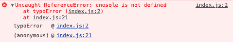
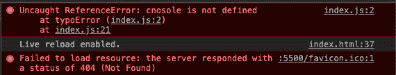
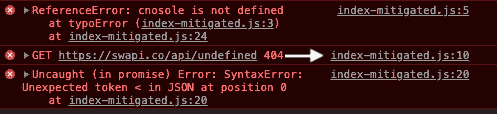
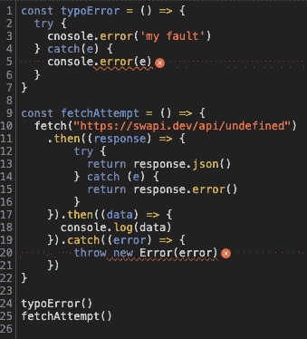
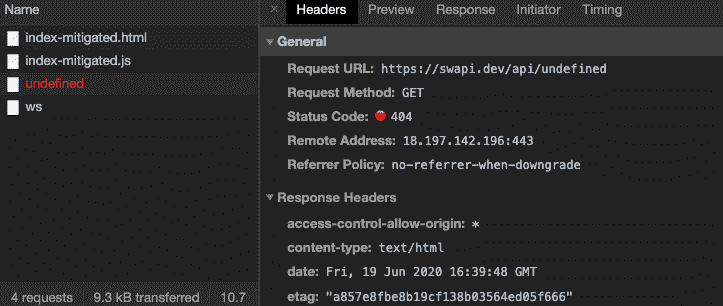
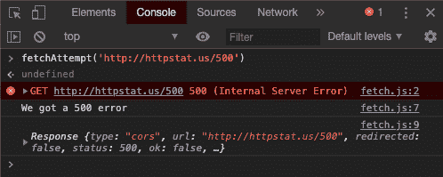
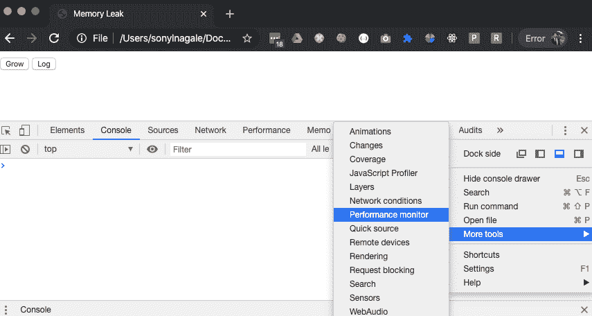

# 九、解密错误信息和性能缺陷

当然，如果没有检测和诊断代码中的问题的方法，任何好的语言都是不完整的。 JavaScript 提供了非常强大和直观的丰富的错误消息，但是当您小心地处理充满错误的代码时，有一些警告和提示。

您可能知道，在您自己的代码中发现问题(“bug”)是开发人员遇到的最令人沮丧的事件之一。 我们为自己的代码完成任务的能力感到自豪，但有时我们不考虑边缘和角落的情况。 此外，错误消息通过提供重要的诊断信息，在编码过程中为我们提供了重要的信息。 幸运的是，有一些工具可以帮助我们理解 JavaScript 中发生的事情。

让我们探索。

本章将涵盖以下主题:

*   错误的对象
*   使用调试器和其他工具
*   适应 JavaScript 的性能限制

# 技术要求

准备好通过[https://github.com/PacktPublishing/Hands-on-JavaScript-for-Python-Developers/tree/master/chapter-9/](https://github.com/PacktPublishing/Hands-on-JavaScript-for-Python-Developers/tree/master/chapter-9/)GitHub 上的`Chapter-9`示例。

我们将与浏览器中的开发工具一起工作，为了说明的目的，说明和截图将来自谷歌 Chrome。 但是，如果您熟悉其他浏览器中的工具，那么概念是相似的。 如果你还没有添加 JSON 解析扩展，你可能还想在 Chrome 中添加 JSON 解析扩展。

本章没有具体的硬件要求。

# 错误的对象

让我们来看看[https://github.com/PacktPublishing/Hands-on-JavaScript-for-Python-Developers/tree/master/chapter-9/error-object](https://github.com/PacktPublishing/Hands-on-JavaScript-for-Python-Developers/tree/master/chapter-9/error-object)。 打开`index.html`文件并检查 JavaScript 控制台。 调用第一个函数`typoError`，并抛出一个非常棒的错误。

它应该是这样的:



Figure 9.1 - Error console

现在，让我们看一下在`index.js`中函数的代码:

```js
const typoError = () => {
  cnosole.error('my fault')
}
```

好的! 这是一个简单的打印错误，我们都做过:应该是`console.error`而不是`cnosole.error`。 如果你从来没有打错过代码，你就是独角兽。 我们在控制台中看到的错误消息使我们很容易看到错误是什么以及它存在于代码的哪一行:第 2 行。 现在，需要注意的是，在调用文件末尾的`typoError()`之后，我们还调用了另一个函数*，但它没有触发。* 我们知道这一点，因为(剧透警告)它也会抛出错误，但我们没有看到它们。 未捕获的 ReferenceError 是一个**阻塞错误**。

在 JavaScript 中，一些被称为阻塞错误的错误会停止代码的执行。 其他错误，称为**非阻塞错误**，通过这样一种方式来减轻，即使问题没有解决，代码也可以继续执行。 有几种处理错误的方法，当您面对错误的潜在向量时，您应该这样做。 你还记得[第 7 章](07.html)、*事件、事件驱动设计和 api*吗?我们在`fetch()`调用中使用了`.catch()`块来优雅地处理 Ajax 错误。 同样的原则也适用于这里。 这显然是一个非常做作的例子，但让我们继续并减轻我们的错误，像这样:

```js
const typoError = () => {
  try {
    cnosole.error('my fault')
  } catch(e) {
    console.error(e)
  }
}
```

对输入错误使用`try/catch`块有点过分，但让我们假设它是更严重的事情，比如异步调用或来自另一个库的依赖。 如果我们现在看一下控制台输出，我们会看到第二个函数`fetchAttempt`已经启动，它也产生了错误。 打开`index-mitigated.js`文件和伴随的`index-mitigated.html`文件。

你应该在`index-mitigated.html`的控制台中看到:



Figure 9.2 - Non-blocking error

在这里，我们看到我们的代码并没有在输入错误时停止; 我们用 try/catch 把它变成了一个非阻塞错误。 我们看到我们的`fetchAttempt`函数正在触发，并给出了另一种错误:`404 Not Found`。 因为我们输入了一个不存在的 URL(故意以`undefined`结尾)，所以在此之后我们收到了另一个错误:来自我们的承诺的`SyntaxError`。

乍一看，这个错误可能很难理解，因为它明确地讨论了 JSON 中的意外字符。 在[第 7 章](07.html)、*事件、事件驱动设计和 API 中，*我们使用了星球大战 API:

1.  让我们看看来自`https://swapi.dev/api/people/1/`的示例响应的 JSON。 这可能是确保你的浏览器中有一个 JSON 解析扩展的好时机:


Figure 9.3 - JSON from https://swapi.dev/api/people/1/

2.  它是格式良好的 JSON，所以即使我们的错误指定了 Syntax error，实际上问题并不在于响应数据的语法。 我们需要深入研究。 让我们看看我们从 Chrome JavaScript 调试器的`fetchAttempt`调用中得到了什么。 让我们点击代码中的第二个错误链接:



Figure 9.4 - Following the trail of the 404...

然后我们看到这个面板，上面有红色的弯弯曲曲的下划线和红色的标记来表示错误:



Figure 9.5 - Errors in the debugger

3.  到目前为止，一切顺利。 如果您将鼠标悬停在第 20 行红色的 X 上，工具提示会提示 404 错误。
4.  导航到 Network 选项卡。 该工具跟踪传入和出站 HTTP 请求。

5.  点击名为 undefined 的调用，然后进入 header 面板，像这样:



Figure 9.6 - The Headers tab

啊哈! 现在我们看到了问题所在:JSON 错误是有帮助的，但却将我们引向了错误的方向。 错误不是 JSON 本身，而是，错误意味着响应*根本不是 JSON*! 这是一个 HTML 404 错误，因此没有 JSON 数据。 我们的问题被确认是在 URL 中获取了一个不存在的地址，因此呈现了一个错误页面，这对`fetch`的 JSON 解析器没有意义。

让我们花更多的时间在调试工具上。

# 使用调试器和其他工具

许多 web 开发人员选择谷歌 Chrome 作为他们的浏览器选择，因为它提供了丰富的开发工具开箱即用。 如果 Chrome 不是你的浏览器选择，这里有一些浏览器有类似的开发工具。

## Safari

Safari 默认的开发模式是关闭的，所以如果你使用 Safari，切换设置底部的高级窗格中的开发菜单:


Figure 9.7 - Adding the Develop Menu to Safari

现在，你将有一个开发菜单，其中的工具可能会呈现与 Chrome 稍有不同的错误消息，但仍然是可访问的。

## Internet Explorer 和 Microsoft Edge

出于真诚和一点点偏见，我建议*而不是*使用 Internet Explorer 或 Microsoft Edge 进行 JavaScript 开发。 跨浏览器测试代码很重要，但我发现 IE 和 Edge 提供的开发工具不足。 例如，让我们看看 Edge 的开发工具中的相同页面:


Figure 9.8 - Edge JavaScript Console

即使我们使用 try/catch 块来减轻错误，Edge 仍然将输入错误视为阻塞错误。 微软浏览器还有其他特点，这可以追溯到我们之前了解到的浏览器大战，所以一个好的经验法则是在 Chrome 上开发，然后在微软浏览器上测试，以确保跨浏览器的兼容性。

虽然在所有主流浏览器中都有开发工具，但这里使用的示例将来自 Chrome。 让我们仔细看看 JavaScript 控制台本身。

## JavaScript 控制台

控制台不仅是查看错误的地方，而且还可以用来执行代码。 这对于快速调试非常有用，特别是在包含另一个代码库的页面上。 控制台有*范围*，所有 JavaScript 加载在页面上，只要它可以从顶层`window`对象访问。 我们不希望访问函数的内部变量，但如果浏览器可以访问数据，我们可以在控制台上访问它。

打开`debugger`文件夹中的`fetch.html`和`fetch.js`文件，查看。 以下是`fetch.js`文件:

```js
const fetchAttempt = (url) => {
  fetch(url)
    .then((response) => {
        return response
    }).then((data) => {
      if (data.status === 500) {
        console.log("We got a 500 error")
      }
      console.log(data)
      }).catch((error) => {
        throw new Error(error)
    })
}
```

它是一个简单的`fetch`请求，带有要获取的 URL 作为函数的参数。 在 HTML 页面的控制台中，我们可以执行这个函数，如下所示:



Figure 9.9 - Executing code in the console

当您输入`fetchAttempt('http://httpstat.us/500')`时，您是否注意到控制台会给您自动完成代码提示? 这是另一个有用的工具，用于确定您是否能够访问正在工作的级别上的函数和变量。 现在我们看到，我们可以在控制台中执行代码，而不必更改 JavaScript 文件。 我们从主机游戏中学到了什么? 我们的`data.status`实际上是`500`，所以我们从第 7 行开始抛出控制台错误。 从第 9 行开始，我们得到了响应数据，它明确地声明了`500`。 不用说，`console.log`、`console.error`和`console.info`函数在调试 JavaScript 时非常有用。 经常使用它们，但一定要记得在将代码推入生产级环境之前删除它们，因为如果您记录大型对象或过于频繁地记录，它们会降低站点性能。

JavaScript 的一个棘手之处是，您可能要处理数百行代码，有时来自第三方。 幸运的是，大多数浏览器的工具都允许在代码中设置*断点*，它会在指定的点停止代码的执行。 让我们看看控制台中以前的文件，并设置几个断点。 如果我们单击第 7 行中的错误，将显示 Sources 面板。 如果单击行号，将设置一个断点，如下所示:


Figure 9.10 - Note the arrow marker on line 6

为了更彻底地跟踪传递给代码的变量，在浏览器抱怨的行之前设置断点通常是有用的。 让我们在页面刷新的情况下再次运行代码，看看会发生什么:

1.  在第 6 行和第 7 行设置断点。
2.  刷新页面。
3.  导航到控制台并执行前面的命令:`fetchAttempt('http://httpstat.us/500')`。

浏览器会再次打开 Sources 选项卡，我们应该会看到类似这样的东西:


Figure 9.11 - Result of the breakpoint

我们可以在 Scope 选项卡中看到，我们得到了在执行代码的上下文中定义的变量列表。 如果我们使用 Step 按钮，如截图所示，我们可以继续通过断点并执行后面的代码行:


Figure 9.12 - The Step button

当我们逐步通过断点时，Scope 面板将更新以显示当前上下文，这比显式的`console.log`函数提供更多信息。

现在让我们看看如何提高 JavaScript 代码的性能。

# 适应 JavaScript 的性能限制

与任何语言一样，编写 JavaScript 有很多方法，也有更好的方法。 然而，在其他语言中不那么明显的是，您的代码对网站用户体验的直接影响。 复杂而低效的代码会阻塞浏览器，消耗 CPU 周期，在某些情况下甚至会导致浏览器崩溃。

看看这个简单的四行代码片段由 Talon Bragg 从[https://hackernoon.com/crashing-the-browser-7d540beb0478](https://hackernoon.com/crashing-the-browser-7d540beb0478)

```js
txt = "a";
while (1) {
    txt = txt += "a"; // add as much as the browser can handle
}
```

**Warning**:do*not*attempt to run this in a browser! 如果您对它的作用感到好奇，那么它最终会在浏览器中创建一个内存不足的异常，并以页面已失去响应的消息终止该选项卡。 这是为什么呢? 我们的`while`循环的条件有一个简单的真值，所以它将继续向字符串文本添加`"a"`，直到分配给浏览器进程的内存耗尽。 根据你的浏览器的行为，它可能会崩溃标签，整个浏览器，甚至更糟。 我们都有过不稳定的程序(Windows 蓝屏死机，有人知道吗?)，但浏览器故障通常是可以避免的。 除了编码最佳实践(如最小化循环和避免重新分配变量)，还有一些特定于 JavaScript 的想法需要指出。 W3Schools 在[https://www.w3schools.com/js/js_performance.asp](https://www.w3schools.com/js/js_performance.asp)上有一些例子，我想特别强调一个。

标准 JavaScript 应用中内存最密集的操作之一是 DOM 访问。 像`document.getElementById("helloWorld")`这样简单的一行实际上是相当昂贵的操作。 作为一种最佳实践，如果您打算在代码中多次使用一个 DOM 元素，那么应该将它保存到一个变量中，并对该变量进行操作，而不是返回 DOM 遍历。 如果你认为回到[第六章](06.html):*文档对象模型(DOM)*,我们储存便利贴的 DOM 元素作为一个变量:[https://github.com/PacktPublishing/Hands-on-JavaScript-for-Python-Developers/blob/master/chapter-6/stickies/solution-code/script.js L13](https://github.com/PacktPublishing/Hands-on-JavaScript-for-Python-Developers/blob/master/chapter-6/stickies/solution-code/script.js#L13)。

## 内存面板

在不详细讨论计算机如何分配内存的情况下，只需说明一个编写不当的程序可能会因为没有正确地释放和回收内存而导致内存泄漏，这可能会导致程序崩溃。 与一些低级语言相反，JavaScript 被认为是自动垃圾收集的:自动内存管理的实践，通过销毁不需要的数据块来释放内存。 然而，在某些情况下，编写不当的代码可能导致内存泄漏，而垃圾收集无法处理这种泄漏。

由于 JavaScript 是在客户端运行的，因此很难准确地解释程序中发生了什么。 幸运的是，有一些工具可以帮助你。 让我们看一个程序的例子，它将分配大量的内存。 看看这个例子:[https://github.com/PacktPublishing/Hands-on-JavaScript-for-Python-Developers/blob/master/chapter-9/memory-leak/index.html。](https://github.com/PacktPublishing/Hands-on-JavaScript-for-Python-Developers/blob/master/chapter-9/memory-leak/index.html)

如果你看一下包含的 JavaScript 文件，你会发现它非常简单，但非常强大:

```js
// Based on https://developers.google.com/web/tools/chrome-devtools/memory-problems

let x = []
const grow = (log = false) => {
  x.push(new Array(1000000).join('x'))
  if (log) {
    console.log(x)
  }
}

document.getElementById('grow').addEventListener('click', () => grow())
document.getElementById('log').addEventListener('click', () => grow(true))
```

让我们检查一下代码，看看当我们使用这个简单的脚本时会发生什么。 注意，根据浏览器和操作系统版本的不同，其中一些指令可能会有所不同:

1.  在 Chrome 中打开`index.html`页面。
2.  打开开发人员工具。
3.  从更多工具菜单中，选择性能监视器:



Figure 9.13 - Investigating the Performance monitor

您将看到一个带有移动时间轴的面板:[https://github.com/PacktPublishing/Hands-on-JavaScript-for-Python-Developers/blob/master/chapter-9/memory-leak/memory-leak.gif。](https://github.com/PacktPublishing/Hands-on-JavaScript-for-Python-Developers/blob/master/chapter-9/memory-leak/memory-leak.gif)

4.  现在，点击 Grow 按钮几次。 您应该会看到 JavaScript 堆大小的增加，可能达到 13 MB 范围。 但是，当您继续单击时，堆大小不应该超过它现有的位置。

这是为什么呢? 在现代浏览器中，意外地创建内存泄漏实际上变得更加困难了。 在这种情况下，Chrome 足够聪明，可以在内存上做一些技巧，当我们重复操作时，不会导致内存大量增加。

5.  但是，现在开始多次单击 Log 按钮。 你会看到控制台的输出以及堆大小的增加:


Figure 9.14 - Memory heap investigation

注意图形是如何增大尺寸的。 但是，随着时间的推移，如果停止单击 Log，内存分配实际上会下降。 这是 Chrome 智能垃圾收集工作的一个例子。

# 总结

在编码时，我们都会犯错误，知道如何发现、诊断和调试这些问题是任何语言的关键技能。 在本章中，我们了解了 Error 对象和控制台是如何为我们提供丰富的诊断信息的，这些信息包括错误发生的位置、在对象上承载了哪些细节以及如何读取这些信息。 不要忘记，有时候，错误可能在表面上看起来是这样的(我们的 JSON 错误在*the error Object*部分)，不要害怕使用控制台语句和断点来尝试跟踪代码。

因为 JavaScript 是在客户端运行的，所以一定要记住用户的性能。 编写 JavaScript 有很多最佳实践，比如重用变量(尤其是与 dom 相关的变量)，所以一定要确保你的代码是**DRY**(**Don't Repeat Yourself**)。

在下一章，我们将结束与前端的工作，并理解 JavaScript 如何真正成为前端的统治者。

# 问题

1.  内存问题的根本原因是什么?
    1.  程序中的变量是全局的。
    2.  低效的代码。
    3.  JavaScript 的性能限制。
    4.  硬件不足。

2.  当使用 DOM 元素时，应该在本地存储对它们的引用，而不是总是访问 DOM。
    1.  真正的
    2.  假
    3.  当不止一次使用它们时
3.  JavaScript 是在服务器端进行预处理的，因此比 Python 更高效。
    1.  真正的
    2.  假
4.  设置断点不能发现内存泄漏。
    1.  真正的
    2.  假
5.  将所有变量存储在全局名称空间中是个好主意，因为引用它们更有效。
    1.  真正的
    2.  假

# 进一步的阅读

欲了解更多信息，请使用以下链接:

*   [https://blog.logrocket.com/isolating-memory-leaks-with-chromes-allocation-timeline-244fa9c48e8e/](https://blog.logrocket.com/isolating-memory-leaks-with-chromes-allocation-timeline-244fa9c48e8e/)
*   垃圾回收:[https://en.wikipedia.org/wiki/Garbage_collection_(computer_science)](https://en.wikipedia.org/wiki/Garbage_collection_(computer_science))
*   JavaScript 性能:[https://www.w3schools.com/js/js_performance.asp](https://www.w3schools.com/js/js_performance.asp)
*   [https://developers.google.com/web/tools/chrome-devtools/memory-problems](https://developers.google.com/web/tools/chrome-devtools/memory-problems)
*   Node.js 内存泄漏检测:[https://medium.com/tech-tajawal/memory-leaks-in-nodejs-quick-overview-988c23b24dba](https://medium.com/tech-tajawal/memory-leaks-in-nodejs-quick-overview-988c23b24dba)