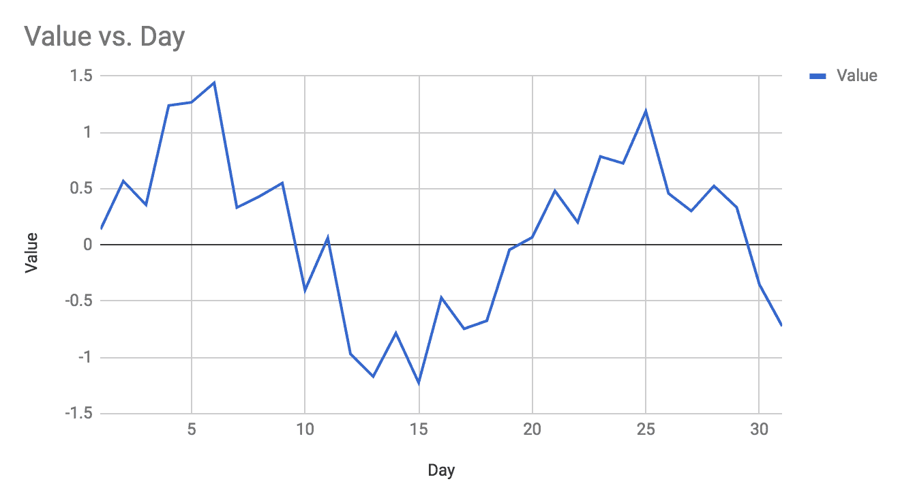
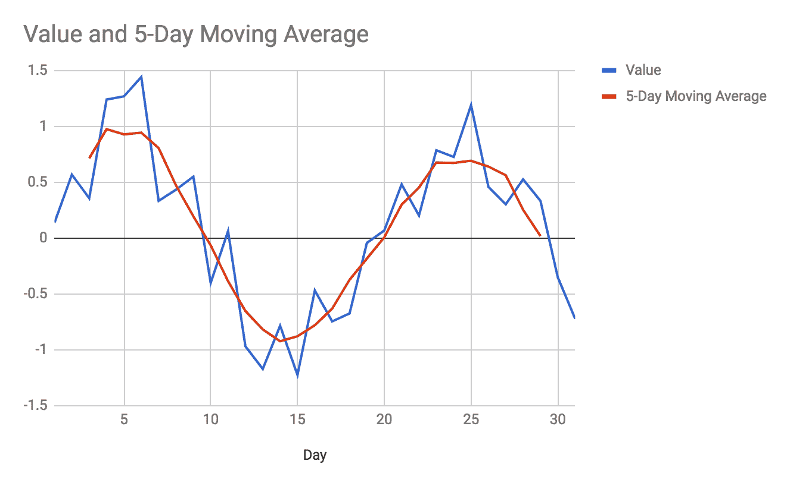
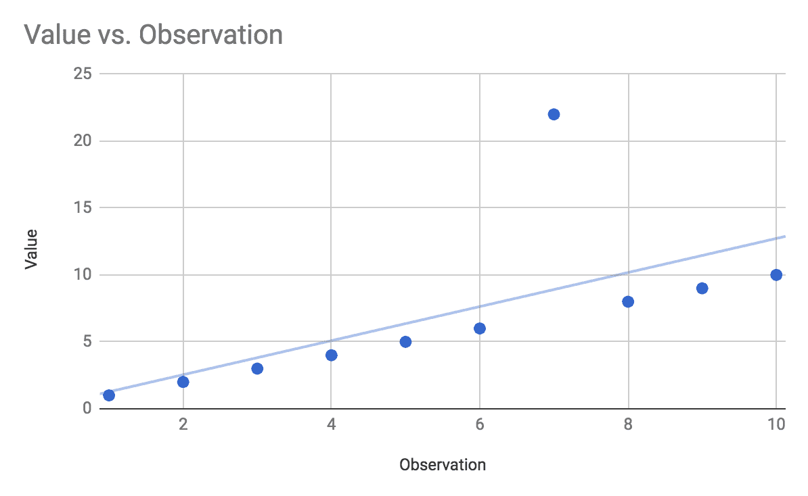
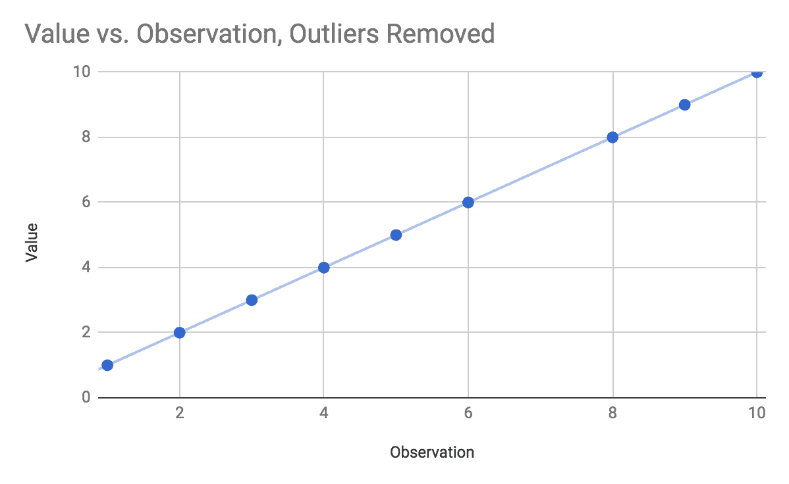
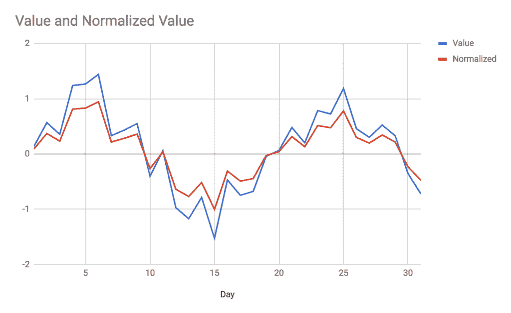

# 二、数据探索

对于初学者来说，了解**机器学习** ( **ML** )最重要的一点就是*机器学习不是魔法*。拿着一个大数据集，天真地将神经网络应用于其中，不会自动给你翻天覆地的见解。ML 是建立在健全和熟悉的数学原理之上的，比如概率、统计、线性代数和向量演算——不包括伏都教(虽然有些读者可能会把向量演算比作伏都教)！

我们将在本章中讨论以下主题:

*   概述
*   变量识别
*   数据清理
*   转换
*   分析类型
*   缺失值处理
*   异常处理

# 概述

我想尽早消除的一个误解是，实现 ML 算法本身是完成某些任务所需做的大部分工作。如果你是新手，你可能会有这样的印象:95%的时间应该花在实现神经网络上，而神经网络对你得到的结果负全部责任。建立一个神经网络，输入数据，神奇地得到结果。还有什么比这更简单的呢？

The reality of ML is that the algorithm you use is only as good as the data you put into it. Furthermore, the results you get are only as good as your ability to process and interpret them. The age-old computer science acronym **GIGO** fits well here: *Garbage In*, *Garbage Out*.

在实现 ML 技术时，还必须密切关注它们对数据的预处理和后处理。需要数据预处理的原因很多，也是本章的重点。后处理与您对算法输出的解释、您对算法结果的信心是否高到足以对其采取行动，以及您将结果应用于业务问题的能力有关。由于结果的后处理很大程度上取决于所讨论的算法，我们将在本书的具体示例中讨论后处理的注意事项。

数据的预处理和数据的后处理一样，往往取决于所使用的算法，因为不同的算法有不同的要求。一个简单的例子是用卷积神经网络进行图像处理，这将在后面的章节中介绍。由单个 CNN 处理的所有图像都应该具有相同的维度，或者至少具有相同数量的像素和相同数量的颜色通道(RGB 对 RGBA 对灰度，等等)。美国有线电视新闻网被配置为期望特定数量的输入，因此你给它的每幅图像都必须经过预处理，以确保它符合神经网络的期望。在将输入图像输入网络之前，您可能需要调整大小、缩放、裁剪或填充输入图像。您可能需要将彩色图像转换为灰度。您可能需要检测并删除数据集中已损坏的图像。

如果你试图给一些算法错误的输入，它们就不会工作。如果美国有线电视新闻网预计有 10，000 个灰度像素强度输入(即 100 x 100 像素的图像)，你不可能给它一个 150 x 200 大小的图像。对我们来说，这是一个最好的情况:算法大声失败，我们能够在尝试使用网络之前改变我们的方法。

然而，如果你给其他算法错误的输入，它们会无声地失败。这个算法看起来是有效的，甚至给你看起来合理但实际上完全不准确的结果。这是我们最糟糕的情况:我们认为算法工作正常，但实际上我们处于 GIGO 的情况。试想一下，你需要多长时间才能发现算法实际上给了你无意义的结果。基于不正确的分析或糟糕的数据，你做过多少次糟糕的商业决策？这些是我们必须避免的情况类型，这一切都从开始开始:确保我们使用的数据适合应用。

大多数 ML 算法对它们处理的数据做出假设。一些算法期望数据具有给定的大小和形状(如在神经网络中)，一些算法期望数据被分块，一些算法期望数据在一个范围内(在 0 和 1 之间或在-1 和+1 之间)被标准化，一些算法对丢失的值有弹性，而另一些则没有。最终，您有责任了解算法对您的数据所做的假设，并根据算法的预期调整数据。

在很大程度上，上述内容与数据的格式、形状和大小有关。还有一个考虑因素:数据的质量。一个数据点可能被完美地格式化并与算法的期望一致，但仍然是*错误的。*也许有人写下了错误的测量值，也许是仪器故障，或者是某种环境影响污染了您的数据。在这些情况下，格式、形状和大小可能是正确的，但数据本身可能会损害您的模型，并阻止它收敛到稳定或准确的结果。在许多情况下，所讨论的数据点是一个**异常值**，或者是一个似乎不符合集合的数据点。

离群值存在于现实生活中，往往是有效的数据。单看数据本身并不总是很明显，离群值是否有效，在确定如何处理数据时，我们还必须考虑上下文和算法。例如，假设您正在进行一项荟萃分析，将患者的身高与其心脏表现联系起来，您有 100 份病历可供分析。其中一名患者身高 7 英尺 3 英寸(221 厘米)。这是错别字吗？记录数据的人实际上是指 6 英尺 3 英寸(190 厘米)吗？在 100 个随机个体中，有一个真的有那么高的几率有多大？你是否应该在你的分析中使用这个数据点，即使它会扭曲你原本看起来非常干净的结果？如果样本量是 100 万条记录而不是只有 100 条呢？在这种情况下，更有可能你确实选择了一个非常高的人。如果样本量只有 100 个，但都是 NBA 球员呢？

如您所见，处理异常值并不简单。您应该始终犹豫是否丢弃数据，尤其是在有疑问的情况下。通过丢弃数据，你冒着创造一个自我实现的预言的风险，通过这个预言，你有意识或无意识地只选择了支持你假设的数据，即使你的假设是错误的。另一方面，使用合法的不良数据会破坏你的结果，阻碍进步。

在本章中，我们将讨论在预处理数据时必须考虑的一些不同因素，包括数据转换、处理丢失的数据、选择正确的参数、处理异常值以及其他有助于数据预处理阶段的分析形式。

# 特征识别

想象一下，你负责在你帮助运营的电子商务商店上投放有针对性的产品广告。目标是分析访问者过去的购物趋势，并选择产品进行展示，这将增加购物者进行购买的可能性。鉴于远见卓识的天赋，几个月来，你一直在收集所有购物者的 50 个不同指标:你一直在记录过去的购买、这些购买的产品类别、每次购买的价格标签、每个用户在购买前在网站上花费的时间，等等。

相信 ML 是一颗银弹，相信数据越多越好，相信对你的模型训练越多越好，你把所有 50 维的数据加载到一个算法中，连续训练几天。当测试你的算法时，你会发现在评估你训练了算法的数据点时，它的准确性非常高，但是当根据你的验证集进行评估时，你也会发现算法非常失败。此外，模型需要很长时间来训练。这里出了什么问题？

首先，您假设您的 50 个维度的数据都与手头的任务相关。事实证明，并非所有的数据都是相关的。ML 非常擅长在数据中寻找模式，但并不是所有的数据都包含模式。有些数据是随机的，有些数据不是随机的，但也是无趣的。符合某种模式的无趣数据的一个例子可能是购物者浏览你网站的时间:用户只能在醒着的时候购物，所以你的大多数用户在早上 7 点到午夜之间购物。这些数据显然遵循一种模式，但实际上可能不会影响用户的购买意图。当然，可能确实有一个有趣的模式:也许夜猫子倾向于深夜冲动购物——但也许不是。

第二，使用所有 50 个维度并长时间训练你的模型可能会导致你的模型过度拟合:你的过度拟合模型现在非常擅长识别某个行为代表斯蒂夫·约翰森(一个特定的购物者)，而不是将史蒂夫的行为概括为一个广泛适用的趋势，而不是能够概括行为模式并做出购物预测。这种过度训练是由两个因素造成的:训练时间长和训练集中不相关数据的存在。如果你记录的某个维度在很大程度上是随机的，并且你花了很多时间在这个数据上训练一个模型，那么这个模型可能最终会使用这个随机数据作为用户的标识符，而不是将其作为非趋势过滤掉。模型可能会了解到，当用户在现场的时间正好是 182 秒时，他们会购买价值 120 美元的产品，这仅仅是因为在训练过程中，您已经在该数据点上训练了模型数千次。

让我们考虑一个不同的例子:人脸识别。你有成千上万张人们的脸的照片，希望能够分析一张照片，并确定拍摄对象是谁。你用你的数据训练了一个 CNN，发现你的算法准确率相当低，只有 60%的时间能正确识别被试。这里的问题可能是，你的美国有线电视新闻网在处理原始像素数据时，无法自动识别真正重要的人脸特征。例如，莎拉·简总是在她的厨房里自拍，她最喜欢的锅铲总是在后台展示。任何其他在图片中碰巧也有锅铲的用户都可能被错误地识别为莎拉·简，即使他们的脸完全不同。这些数据过度训练了神经网络，使其能够将斯派图拉斯识别为莎拉·简，而不是真正看着用户的脸。

在这两个例子中，问题都是从数据预处理不足开始的。在电子商务商店的例子中，您没有正确识别出真正重要的购物者的特征，因此用大量不相关的数据训练了您的模型。同样的问题也存在于人脸检测的例子中:照片中的每个像素并不代表一个人或他们的特征，在看到可靠的铲形图案时，算法已经了解到莎拉·简是一个铲形铲。

为了解决这两个问题，您需要更好地选择您给 ML 模型的特性。在电子商务的例子中，你记录的 50 个维度中可能只有 10 个是相关的，要解决这个问题，你必须确定这 10 个维度是什么，并且只在训练模型时使用它们。在人脸检测的例子中，也许神经网络不应该接收原始像素强度数据，而应该接收面部尺寸，例如*鼻梁长度*、*嘴宽*、*瞳孔之间的距离*、*瞳孔和眉毛之间的距离*、*耳垂之间的距离*、*下巴到发际线之间的距离*等等。这两个例子都表明需要选择最相关和最合适的数据特征。选择合适的特征将有助于提高模型的速度和准确性。

# 维度的诅咒

在 ML 应用中，我们经常有高维数据。如果我们为每个购物者记录 50 个不同的指标，我们就是在一个有 50 个维度的空间中工作。如果我们正在分析 100 x 100 大小的灰度图像，我们正在一个 10，000 维的空间中工作。如果图像是 RGB 颜色的，维度会增加到 30，000 个维度(图像中每个像素的每个颜色通道一个维度)！

This problem is called the **curse of dimensionality**. On one hand, ML excels at analyzing data with many dimensions. Humans are not good at finding patterns that may be spread out across so many dimensions, especially if those dimensions are interrelated in counter-intuitive ways. On the other hand, as we add more dimensions we also increase the processing power we need to analyze the data, and we also increase the amount of training data required to make meaningful models.

一个明显证明维度诅咒的领域是**自然语言处理** ( **NLP** )。假设您正在使用贝叶斯分类器对与品牌或其他主题相关的推文进行情感分析。正如您将在后面的章节中了解到的，自然语言处理的数据预处理的一部分是将输入字符串标记为**n-gram**，或词组。这些 n 图是贝叶斯分类算法的特征。

考虑几个输入字符串:`I love cheese`、`I like cheese`、`I hate cheese`、`I don't love cheese`、`I don't really like cheese`。这些例子对我们来说很简单，因为我们一生都在使用自然语言。然而，算法如何看待这些例子呢？如果我们正在进行 1 克或**单码**分析——这意味着我们将输入字符串分割成单个单词——我们会在第一个示例中看到`love`，在第二个示例中看到`like`，在第三个示例中看到`hate`，在第四个示例中看到`love`，在第五个示例中看到`like`。我们的单幅图分析对于前三个例子可能是准确的，但是对于第四个和第五个就失败了，因为它没有学到`don't love`和`don't really like`是连贯的语句；该算法只关注单个单词的效果。这个算法运行非常快，需要的存储空间很少，因为在前面的例子中，上面的四个短语(`I`、`love`、`cheese`、`like`、`hate`、`don't`和`really`)中只使用了七个唯一的单词。

然后，您可以修改标记化预处理以使用`bigrams`，或者 2 克，或者一次两个单词的组。这增加了数据的维度，需要更多的存储空间和处理时间，但也会产生更好的结果。该算法现在可以看到像`I love`和`love cheese`这样的维度，并且现在还可以识别出`don't love`不同于`I love`。使用二元模型方法，该算法可以正确地识别前四个示例的情感，但是对于第五个示例仍然失败，第五个示例被解析为`I don't`、`don't really`、`really like`和`like cheese`。分类算法会看到`really like`和`like cheese`，并在第二个例子中错误地将其与积极情绪联系起来。尽管如此，二元模型方法仍然适用于我们 80%的例子。

现在，您可能想再次升级标记化，以便一次捕获三元组或三个单词的组。该算法不但没有提高准确性，反而急转直下，无法正确识别任何东西。我们现在的数据中有太多的维度。算法学习`I love cheese`是什么意思，但是没有其他训练例子包含`I love cheese`这个短语，所以知识不能以任何方式应用。第五个例子解析成三个三元组`I don't really`、`don't really like`和`really like cheese`——这些都是以前没有遇到过的！这个算法最终为每个例子提供了 50%的情感，因为训练集中没有足够的数据来捕获所有相关的三元组组合。

这就是维度的诅咒在起作用:**三元模型**方法确实可能比二元模型方法给你更好的准确性，但前提是你有一个巨大的训练集，一次提供三个单词所有不同可能组合的数据。您现在还需要大量的存储空间，因为三个单词的组合比两个单词的组合要多得多。因此，选择预处理方法将取决于问题的背景、可用的计算资源以及您可用的训练数据。如果你有大量的训练数据和大量的资源，三元模型方法可能更准确，但在更现实的条件下，二元模型方法可能总体上更好，即使它确实对一些推文进行了错误分类。

前面的讨论涉及**特征选择**、**特征提取**和**维度**的概念。总的来说，我们的目标是*只选择*相关特征(忽略我们不感兴趣的购物者趋势)*提取*或*导出*更好地代表我们的数据的特征(通过使用面部测量而不是照片像素)，最终*降维*，这样我们可以使用最少、最相关的维度。

# 特征选择和特征提取

特征选择和特征提取都是用于降维的技术，尽管它们是略有不同的概念。特征选择是仅使用与手头问题相关的变量或特征的实践。一般来说，特征选择着眼于单个特征(如`time on site`)，并确定单个特征的相关性。特征提取是相似的，但是特征提取通常会查看多个相关的特征，并将它们组合成一个特征(就像查看数百个单独的像素并将它们转换成瞳孔之间的**距离**测量值)。在这两种情况下，我们都在降低问题的维度，但两者的区别在于，我们是简单地过滤掉不相关的维度(特征选择)还是组合现有的特征，以便导出新的代表性特征(特征提取)。

特征选择的目标是选择优化模型精度的特征子集或数据维度。让我们看看解决这个问题的天真方法:对所有可能的维度子集进行彻底的强力搜索。这种方法在现实应用中是不可行的，但是它为我们解决了这个问题。如果我们以电子商务商店为例，我们的目标是找到一些维度或特征的子集，从我们的模型中给我们最好的结果。我们知道我们有 50 个功能可供选择，但我们不知道有多少在最佳功能集中。通过蛮力解决这个问题，我们将首先一次只挑选一个特征，并为每个特征训练和评估我们的模型。

例如，我们将仅使用`time on site`作为数据点，在该数据点上训练模型，评估模型，并记录模型的准确性。然后我们进入`total past purchase amount`，训练模型，评估模型，记录结果。对于剩余的特性，我们再做 48 次，并记录每个特性的性能。然后我们必须一次考虑两个特征的组合，例如通过在`time on site`和`total past purchase amount`上训练和评估模型，然后在`time on site`和`last purchase date`上训练和评估，等等。在我们的 50 对特征中，有 1，225 对独特的特征，我们必须对每一对重复这个过程。然后我们必须一次考虑三个特征的组，其中有 19600 个组合。然后我们必须考虑四个特征的组，其中有 230，300 个独特的组合。有 2118760 个五个功能的组合，还有近 1600 万个六个功能的组合可供我们使用，以此类推。显然，这种对要使用的最佳特征集的彻底搜索不可能在合理的时间内完成:我们必须训练我们的模型数十亿次，才能找出要使用的最佳特征子集！我们必须找到更好的方法。

In general, feature selection techniques are split into three categories: filter methods, wrapper methods, and embedded methods. Each category has a number of techniques, and the technique you select will depend on the data, the context, and the algorithm of your specific situation.

过滤方法最容易实现，通常性能最好。用于特征选择的过滤方法一次分析单个特征，并尝试确定该特征与数据的相关性。过滤方法通常与之后使用的 ML 算法没有任何关系，更典型的是分析特征本身的统计方法。

例如，您可以使用皮尔逊相关系数来确定特征是否与输出变量有线性关系，并移除相关性非常接近零的特征。这一系列方法在计算时间上非常快，但缺点是无法识别相互交叉关联的特征，并且根据您使用的过滤算法，可能无法识别非线性或复杂的关系。

包装器方法类似于前面描述的暴力方法，但是目标是避免像我们之前所做的那样对每个特性组合进行完全彻底的搜索。例如，您可以使用遗传算法来选择特征子集，训练和评估模型，然后使用模型的评估作为进化压力来寻找下一个要测试的特征子集。

遗传算法方法可能找不到完美的特征子集，但可能会发现一个非常好的特征子集来使用。根据您使用的实际机器学习模型和数据集的大小，这种方法可能仍然需要很长时间，但不会像穷举搜索那样需要很长时间。包装方法的优势在于，它们与您正在训练的实际模型进行交互，因此可以直接优化您的模型，而不是简单地试图独立地统计过滤掉单个特征。这些方法的主要缺点是达到预期结果所需的计算时间。

还有一个叫做**嵌入式方法**的方法家族，然而这个技术家族依赖于内置了自己的特征选择算法的算法，因此相当专门化；我们不会在这里讨论它们。

特征提取技术侧重于将现有特征组合成新的派生特征，这些特征可以更好地表示您的数据，同时还可以消除额外的或冗余的维度。假设您的电子商务购物者数据包含`time on site`和`total pixel scrolling distance while browsing`作为维度。还可以想象，这两个维度确实与购物者在网站上花费的金额密切相关。自然，这两个特性是相互关联的:用户在网站上花费的时间越多，他们滚动的距离就越大。仅使用特征选择技术，例如皮尔逊相关分析，您会发现您应该同时保留`time on site`和`total distance scrolled`作为特征。独立分析这些特征的特征选择技术已经确定这两个特征都与您的问题相关，但是没有理解这两个特征实际上彼此高度相关，因此是多余的。

一种更复杂的特征提取技术，如**主成分分析** ( **主成分分析**)，将能够识别出现场时间和滚动距离实际上可以组合成一个新的单一特征(让我们称之为`site engagement`)，该特征封装了过去由两个独立特征表示的数据。在这种情况下，我们已经*从现场时间和滚动距离测量中提取了*一个新特征，并且我们正在分别使用该单个特征而不是两个原始特征。这不同于特征选择；在特征选择中，我们只是选择在训练模型时使用哪些原始特征，但是在特征提取中，我们从原始特征的相关组合中创建全新的特征。因此，特征选择和特征提取都会降低数据的维度，但方式不同。

# 皮尔逊相关例子

让我们回到电子商务商店购物者的例子，考虑如何使用皮尔逊相关系数来选择数据特征。考虑下面的示例数据，该数据记录了购物者在现场花费的时间以及他们之前购买的金额:

| **购买金额** | **现场时间(秒)** | **过去采购金额** |
| $10.00 | Fifty-three | $7.00 |
| $14.00 | Two hundred and twenty | $12.00 |
| $18.00 | Two hundred and fifty-two | $22.00 |
| $20.00 | Five hundred and seventy-one | $17.00 |
| $22.00 | Three hundred and ninety-seven | $21.00 |
| $34.00 | Two hundred and twenty | $23.00 |
| $38.00 | Seven hundred and seventy-six | $29.00 |
| $50.00 | Four hundred and sixty-two | $74.00 |
| $52.00 | Three hundred and fifty-four | $63.00 |
| $56.00 | Twenty-three | $61.00 |

当然，在这个问题的实际应用中，您可能有几千或几十万行，几十列，每一列代表不同的数据维度。

现在让我们手动选择这些数据的特征。`purchase amount`列是我们的输出数据，或者我们希望我们的算法在给定其他特征的情况下预测的数据。在本练习中，我们可以选择使用现场时间和以前的购买金额、单独的现场时间或单独的以前购买金额来训练模型。

当使用筛选方法进行特征选择时，我们一次只考虑一个特征，因此我们必须独立于过去的购买量与购买量的关系来考察现场时间与购买量的关系。解决这个问题的一种手动方法是将我们的两个候选特征中的每一个绘制在`Purchase Amount`列上，并计算相关系数来确定每个特征与购买量数据的关联程度。

首先，我们将绘制现场时间与购买金额的图表，并使用我们的电子表格工具计算皮尔逊相关系数:


即使是对数据进行简单的视觉检查，也暗示了这样一个事实，即现场时间和购买金额之间只有很小的关系(如果有的话)。计算皮尔逊相关系数得出的相关系数约为+0.1，这是两组数据之间非常弱、基本上不显著的相关性。

但是，如果我们将过去的购买金额与当前的购买金额进行对比，我们会看到非常不同的关系:


在这种情况下，我们的视觉检查告诉我们，过去的购买金额和当前的购买金额之间存在线性但有些嘈杂的关系。计算相关系数给我们的相关值为+0.9，相当强的线性关系！

这种类型的分析告诉我们，当训练我们的模型时，我们可以忽略现场数据的时间，因为这些信息似乎没有什么统计学意义。通过忽略现场数据的时间，我们可以将训练模型所需的维度数量减少一个，从而允许我们的模型更好地概括数据并提高性能。

如果我们有 48 个其他的数字维度要考虑，我们可以简单地计算每个维度的相关系数，并丢弃相关性低于某个阈值的每个维度。然而，并不是每个特征都可以使用相关系数进行分析，因此您只能将皮尔逊算法应用于这种统计分析有意义的特征；例如，使用皮尔逊相关分析列出*最近浏览的产品类别*的特征是没有意义的。对于表示不同类型数据的不同维度，您可以并且应该使用其他类型的要素选择过滤器。随着时间的推移，您将开发出一套分析技术，可以应用于不同类型的数据。

不幸的是，这里不可能对所有可能的特征提取和特征选择算法和工具进行彻底的解释；你将不得不研究各种技术，并确定哪些技术适合你的特征和数据的形状和风格。

滤波技术需要考虑的一些算法是皮尔逊和斯皮尔曼相关系数、卡方检验和信息增益算法，如库尔巴克-莱布勒散度。

包装器技术需要考虑的方法有优化技术，如遗传算法，树搜索算法，如最佳优先搜索，随机技术，如随机爬山算法，以及启发式技术，如递归特征消除和模拟退火。所有这些技术都旨在选择优化模型输出的最佳特征集，因此任何优化技术都可以成为候选技术，然而，遗传算法非常有效且受欢迎。

特征提取有很多算法需要考虑，一般侧重于特征的互相关，以便确定新的特征，最小化一些误差函数；也就是说，如何将两个或多个特征组合起来，以使丢失的数据量最小。相关算法包括主成分分析、偏最小二乘法和自动编码。在自然语言处理中，潜在语义分析非常流行。图像处理有许多专门的特征提取算法，如边缘检测、角点检测和阈值处理，以及基于问题域的进一步专业化，如人脸识别或运动检测。

# 清理和准备数据

预处理数据时，特征选择不是唯一需要考虑的因素。为最终分析数据的算法准备数据，您可能还需要做许多其他事情。也许有一些测量误差会产生显著的异常值。数据中也可能存在仪器噪声，需要消除。您的数据可能缺少某些功能的值。这些都是可以忽略或解决的问题，取决于上下文、数据和所涉及的算法。

此外，您使用的算法可能需要将数据规范化为某个范围的值。或者，您的数据可能是算法无法使用的不同格式，就像神经网络通常期望您提供一个值向量一样，但是您有来自数据库的 JSON 对象。有时，您只需要分析来自更大来源的特定数据子集。如果您正在处理图像，您可能需要调整大小、缩放、填充、裁剪或降低图像的灰度。

这些任务都属于数据预处理领域。让我们看一看一些特定的场景，并讨论每种场景的可能方法。

# 处理丢失的数据

在许多情况下，某些数据点可能缺少某些特征的值。如果您正在查看调查问题的“是/否”回答，几名参与者可能无意或有意跳过了给定的问题。如果您查看的是时间序列数据，则您的测量工具可能在给定的时间段或测量中出现了错误。如果你看的是电子商务购物习惯，有些功能可能与用户无关，例如`last login date`对于以匿名客人身份购物的用户。个别情况和场景，以及您的算法对丢失数据的容忍度，决定了您必须采取的补救丢失数据的方法。

# 缺少分类数据

在分类数据的情况下，例如可能还没有回答的是/否调查问题，或者还没有用其类别标记的图像，通常最好的方法是创建一个名为 *undefined* 、 *N/A* 、 *unknown* 或*类似*的新类别。或者，您可以为这些缺失的值选择一个合理的默认类别，也许从集合中选择最频繁的类别，或者选择一个代表数据点逻辑父项的类别。如果您正在分析用户上传的照片，并且缺少给定照片的类别标签，您可以使用*用户的*指定类别来代替照片的单个类别。也就是说，如果用户被标记为时尚摄影师，您可以将*时尚*类别用于照片，即使用户也上传了许多*旅行*照片。这种方法会以错误分类的数据点的形式向系统添加噪声，但实际上可能会产生积极的整体效果，迫使算法推广其模型；模特可能最终会了解到时尚和旅行摄影是相似的。

使用*未定义的*或*不适用*类别也是一种首选方法，因为数据点本身没有类别这一事实可能很重要— *没有类别*本身可以是有效类别。数据集的大小、使用的算法以及*不适用*类别在数据集内的相对大小将影响这是否是一种合理的方法。例如，在分类场景中，有两种可能的效果。如果未归类的项目*确实*形成了一个模式(比如*时尚*照片比其他照片更常被未归类)，你可能会发现你的分类器错误地得知时尚照片应该归类为 N/A！在这种情况下，完全忽略未分类的数据点可能更好。

但是，如果未分类的照片由来自不同类别的照片组成，分类器可能会将难以分类的照片识别为不适用，这实际上可能是一种理想的效果。在这种情况下，您可以将 N/A 视为一个独立的类，由困难的、破碎的或无法解析的照片组成。

# 缺少数字数据

数值数据的缺省值比分类数据更难处理，因为缺省值通常没有合理的默认值。根据数据集的不同，您可以使用零作为替换，但是在某些情况下，使用该特征的平均值或中值更合适。在其他情况下，根据所使用的算法，用非常大的值来填充缺失的值可能是有用的:如果该数据点需要对其执行错误计算，则使用大的值将会用大的错误来标记该数据点，并阻止算法考虑该点。

在其他情况下，可以使用线性插值来填充缺失的数据点。这在一些时间序列应用中是有意义的。如果您的算法预期 31 个数据点代表某个指标的增长，而您在第 12 天缺少一个值，您可以使用第 11 天和第 13 天的平均值作为第 12 天的估计值。

通常，正确的方法是忽略并过滤掉缺少值的数据点，但是，您必须考虑此类操作的影响。如果缺失值的数据点强烈代表特定类别的数据，您可能最终会产生强烈的选择偏差作为副作用，因为您的分析会忽略一个重要的组。您必须平衡这种类型的副作用与其他方法可能导致的副作用:将缺失值清零会显著扭曲您的分布吗？使用平均值或中位数作为替代会影响分析的其余部分吗？这些问题只能逐案回答。

# 操作噪音

数据中的噪声可以来自许多来源，但通常不是一个重要的问题，因为大多数机器学习技术对噪声数据集具有弹性。噪声可能来自环境因素(例如，空调压缩机随机开启并在附近的传感器中引起信号噪声)，也可能来自转录错误(有人记录了错误的数据点，在调查中选择了错误的选项，或者光学字符识别算法将`3`读取为`8`，也可能是数据本身固有的(例如温度记录的波动，它将遵循季节性模式，但具有嘈杂的日常模式)。

类别数据中的噪声也可能是由未标准化的类别标签引起的，例如当类别被认为是`Fashion`时被标记为`fashion`或`fashions`的图像。在这些场景中，最好的方法是简单地规范化类别标签，也许通过强制所有类别标签都变成单数和全小写——这将把`Fashion`、`fashion`和`fashions`类别组合成一个单一的`fashion`类别。

时间序列数据中的噪声可以通过取多个值的移动平均值来平滑；但是，首先您应该评估平滑数据对您的算法和结果是否重要。通常，如果存在少量噪声，特别是如果噪声是随机的而不是系统的，那么算法对于实际应用来说仍然表现得足够好。

考虑以下某个传感器的日常测量示例:

| **日** | **值** |
| one | 0.1381426172 |
| Two | 0.5678176776 |
| three | 0.3564009968 |
| four | 1.239499423 |
| five | 1.267606181 |
| six | 1.440843361 |
| seven | 0.3322843208 |
| eight | 0.4329166745 |
| nine | 0.5499234277 |
| Ten | -0.4016070826 |
| Eleven | 0.06216906816 |
| Twelve | -0.9689103112 |
| Thirteen | -1.170421963 |
| Fourteen | -0.784125647 |
| Fifteen | -1.224217169 |
| Sixteen | -0.4689120937 |
| Seventeen | -0.7458561671 |
| Eighteen | -0.6746415566 |
| Nineteen | -0.0429460593 |
| Twenty | 0.06757010626 |
| Twenty-one | 0.480806698 |
| Twenty-two | 0.2019759014 |
| Twenty-three | 0.7857692899 |
| Twenty-four | 0.725414402 |
| Twenty-five | 1.188534085 |
| Twenty-six | 0.458488458 |
| Twenty-seven | 0.3017212831 |
| Twenty-eight | 0.5249332545 |
| Twenty-nine | 0.3333153146 |
| Thirty | -0.3517342423 |
| Thirty-one | -0.721682062 |

绘制这些数据显示了一个嘈杂但周期性的模式:



这在许多情况下是可以接受的，但是其他应用可能需要更平滑的数据。

Also, note that several of the data points exceed +1 and -1, which may be of significance especially if your algorithm is expecting data between the -1 and +1 range.

我们可以对数据应用`5-Day Moving Average`来生成更平滑的曲线。要执行`5-Day Moving Average`，从第`3`天开始，将第`1`天到第`5`天的值相加，然后除以 5。结果成为第`3`天的移动平均值。

注意，在这种方法中，我们损失了天`1`和`2`，也损失了天`30`和`31`，因为我们不能在天`1`之前看两天，也不能在天`31`之后看两天。但是，如果您需要这些天的值，您可以使用天`1`、`2`、`30`和`31`的原始值，或者除了天`1`和`31`的单个值之外，还可以使用天`3-Day Moving Averages`和`2`的值。如果你有更多的历史数据，你可以使用前一个月的数据计算`5-Day Moving Average`的天数`1`和`2`(使用前一个月的最后两天计算天数`1`)。如何处理这个移动平均线的方法将取决于您可以获得的数据，以及每个数据点拥有 5 天平均值与在边界将 5 天平均值与 3 天和 1 天平均值相结合的重要性。

如果我们计算本月的`5-Day Moving Average`，数据变成如下:

| **日** | **值** | **5 日移动平均线** |
| one | 0.1381426172 |  |
| Two | 0.5678176776 |  |
| three | 0.3564009968 | 0.7138933792 |
| four | 1.239499423 | 0.974433528 |
| five | 1.267606181 | 0.9273268566 |
| six | 1.440843361 | 0.9426299922 |
| seven | 0.3322843208 | 0.8047147931 |
| eight | 0.4329166745 | 0.4708721403 |
| nine | 0.5499234277 | 0.1951372817 |
| Ten | -0.4016070826 | -0.06510164468 |
| Eleven | 0.06216906816 | -0.3857693722 |
| Twelve | -0.9689103112 | -0.6525791871 |
| Thirteen | -1.170421963 | -0.8171012043 |
| Fourteen | -0.784125647 | -0.9233174367 |
| Fifteen | -1.224217169 | -0.8787066079 |
| Sixteen | -0.4689120937 | -0.7795505266 |
| Seventeen | -0.7458561671 | -0.631314609 |
| Eighteen | -0.6746415566 | -0.3729571541 |
| Nineteen | -0.0429460593 | -0.1830133958 |
| Twenty | 0.06757010626 | 0.006553017948 |
| Twenty-one | 0.480806698 | 0.2986351872 |
| Twenty-two | 0.2019759014 | 0.4523072795 |
| Twenty-three | 0.7857692899 | 0.6765000752 |
| Twenty-four | 0.725414402 | 0.6720364272 |
| Twenty-five | 1.188534085 | 0.6919855036 |
| Twenty-six | 0.458488458 | 0.6398182965 |
| Twenty-seven | 0.3017212831 | 0.561398479 |
| Twenty-eight | 0.5249332545 | 0.2533448136 |
| Twenty-nine | 0.3333153146 | 0.0173107096 |
| Thirty | -0.3517342423 |  |
| Thirty-one | -0.721682062 |  |

在某些情况下，移动平均线与当天的数据点相差很大。例如，在第`3`天，移动平均线是当天测量值的两倍。

这种方法不适用于需要单独考虑某一天的测量值的情况，但是，当我们将移动平均线与每日数据点进行对比时，我们可以看到这种方法的价值:



我们可以看到，移动平均线比日常测量平滑得多，移动平均线更好地代表了我们数据的周期性、正弦性。对我们来说，一个额外的好处是移动平均数据不再包含位于我们[-1，+1]范围之外的点；因为这些数据中的噪声是随机的，随机波动在很大程度上相互抵消，使我们的数据回到了范围内。

增加移动平均线的窗口将导致越来越宽的平均线，降低分辨率；如果我们取一个 *31 天移动平均线*，我们会得到整个月的平均测量值。如果您的应用只是需要平滑数据，而不是将数据降低到较低的分辨率，那么您应该从应用最小的移动平均窗口开始，该窗口足以清除数据，例如 3 点移动平均。

如果你处理的不是时间序列的测量，那么移动平均法可能不合适。例如，如果您在任意和随机的时间测量传感器的值，而测量时间没有记录，移动平均将不合适，因为平均的维度是未知的(也就是说，我们不知道平均移动的时间段)。

如果您仍然需要消除数据中的噪声，您可以通过创建数据直方图来尝试*宁滨*测量。这种方法改变了数据本身的性质，并不适用于每种情况，但是，它可以用来混淆单个测量值的波动，同时仍然表示不同测量值的相对频率。

# 处理异常值

您的数据通常会有外围值，或者数据点远离数据集的预期值。有时，异常值是由噪音或错误引起的(有人记录的高度是 7'3 "而不是 6'3 ")，但其他时候，异常值是合法的数据点(一个推特粉丝达到 1000 万的名人加入你的服务，大多数用户有 10，000 到 100，000 个粉丝)。在这两种情况下，您首先要识别异常值，以便确定如何处理它们。

识别异常值的一种方法是计算数据集的平均值和标准差，并确定每个数据点偏离平均值的标准差。数据集的标准差代表数据的总体方差或离差。考虑以下数据，这些数据代表了您正在分析的账户的推特关注者数量:

| **追随者** |
| One thousand and seventy-five |
| One thousand eight hundred and seventy-nine |
| Three thousand seven hundred and ninety-four |
| Four thousand one hundred and eleven |
| Four thousand two hundred and forty-three |
| Four thousand eight hundred and eighty-five |
| Seven thousand six hundred and seventeen |
| Eight thousand five hundred and fifty-five |
| Eight thousand seven hundred and fifty-five |
| Nineteen thousand four hundred and twenty-two |
| Thirty-one thousand nine hundred and fourteen |
| Thirty-six thousand seven hundred and thirty-two |
| Thirty-nine thousand five hundred and seventy |
| One million two hundred and thirty thousand three hundred and twenty-four |

如您所见，最后一个值比集合中的其他值大得多。然而，如果您正在分析数百万条各有几十个特征的记录，这种差异可能并不那么明显。为了自动化我们的离群点识别，我们应该首先计算我们所有用户的平均平均值，在这种情况下是 **100，205** 追随者的平均值。然后，我们要计算数据集的标准差，对于这个数据是 **325，523** 追随者。最后，我们可以通过确定数据点距离均值多少个标准差来检查每个数据点:找出数据点与均值的绝对差，然后除以标准差:

| **追随者** | **偏差** |
| One thousand and seventy-five | 0.3045078726 |
| One thousand eight hundred and seventy-nine | 0.3020381533 |
| Three thousand seven hundred and ninety-four | 0.2961556752 |
| Four thousand one hundred and eleven | 0.2951819177 |
| Four thousand two hundred and forty-three | 0.2947764414 |
| Four thousand eight hundred and eighty-five | 0.2928043522 |
| Seven thousand six hundred and seventeen | 0.2844122215 |
| Eight thousand five hundred and fifty-five | 0.2815308824 |
| Eight thousand seven hundred and fifty-five | 0.2809165243 |
| Nineteen thousand four hundred and twenty-two | 0.248149739 |
| Thirty-one thousand nine hundred and fourteen | 0.2097769366 |
| Thirty-six thousand seven hundred and thirty-two | 0.1949770517 |
| Thirty-nine thousand five hundred and seventy | 0.1862593113 |
| One million two hundred and thirty thousand three hundred and twenty-four | 3.471487079 |

这种方法产生了很好的结果:除了一个数据点之外，所有数据点都在平均值的一个标准偏差内，我们的异常值距离平均值很远，有近 3.5 个偏差。一般来说，您可以将偏离平均值两到三个标准差以上的数据点视为异常值。

如果您的数据集代表正态分布，那么您可以使用 **68-95-99.7** 规则:68%的数据点预计在一个标准差内，95%的数据点预计在两个标准差内，99.7%的数据点预计在三个标准差内。因此，在正态分布中，只有 0.3%的数据预计会比平均值的三个标准差更远。

Note that the preceding data presented is not a normal distribution, and much of your data will not follow normal distributions either, but the concept of standard deviation may still apply (the ratios of data points expected per standard deviation will differ based on the distribution).

既然识别出了异常值，就必须确定如何处理外围数据点。在某些情况下，最好将异常值保留在数据集中，并像往常一样继续处理；基于真实数据的异常值通常是不可忽视的重要数据点，因为它们代表了数据中不常见但可能存在的值。

例如，如果您正在监控服务器的平均 CPU 负载，发现平均值为 2.0，标准偏差为 1.0，则您不会希望忽略平均负载为 10.0 的数据点—这些数据点仍然代表您的 CPU 实际经历的平均负载，对于许多类型的分析来说，忽略这些数据会弄巧成拙，即使这些数据点离平均值很远。这些要点应该在你的分析中加以考虑和说明。然而，在我们的推特关注者例子中，我们可能想忽略异常值，尤其是如果我们的分析是为了确定推特用户受众的行为模式——我们的异常值很可能展示了一个完全独立的行为模式类别，这可能会简单地混淆我们的分析。

当考虑预期为线性、多项式、指数或周期性的数据时，有另一种处理异常值的方法效果很好，即可以执行回归的数据集类型。考虑预期为线性的数据，如下所示:

| **观察** | **值** |
| one | one |
| Two | Two |
| three | three |
| four | four |
| five | five |
| six | six |
| seven | Twenty-two |
| eight | eight |
| nine | nine |
| Ten | Ten |

对该数据执行线性回归时，我们可以看到外围数据点向上倾斜回归:



对于这一小部分数据点，回归中的误差可能并不显著，但是如果您使用回归来外推未来的值，例如，对于观测值 30，预测值将与实际值相差甚远，因为离群值引入的小误差会使您外推的值越多。在这种情况下，我们希望在执行回归之前移除异常值，以便回归的外推更加准确。

为了识别异常值，我们可以像以前一样执行线性回归，然后根据趋势线计算每个点的平方误差。如果数据点超过例如 25%的误差，我们可以将该点视为异常值，并在第二次执行回归之前将其移除。一旦我们移除了异常值并重新执行回归，趋势线将更好地拟合数据:



# 转换和规范化数据

最常见的预处理任务是将数据转换和/或规范化为算法可以使用的表示形式。例如，您可能会从一个应用编程接口端点接收到 JSON 对象，您需要将其转换为算法使用的向量。考虑以下 JSON 数据:

```js
const users = [
     {
       "name": "Andrew",
       "followers": 27304,
       "posts": 34,
       "images": 38,
       "engagements": 2343,
       "is_verified": false
     },
     {
       "name": "Bailey",
       "followers": 32102,
       "posts": 54,
       "images": 102,
       "engagements": 9488,
       "is_verified": true
     },
     {
       "name": "Caroline",
       "followers": 19932,
       "posts": 12,
       "images": 0,
       "engagements": 19,
       "is_verified": false
     }
];
```

处理数据的神经网络希望输入数据是矢量形式的，例如:

```js
[followers, posts, images, engagements, is_verified]
```

在 JavaScript 中，在这种情况下转换我们的 JSON 数据最简单的方法就是使用内置的`Array.map`函数。下面的代码将生成一个向量数组(数组的数组)。这种形式的转换在本书中非常常见:

```js
const vectors = users.map(user => [
     user.followers,
     user.posts,
     user.images,
     user.engagements,
     user.is_verified ? 1 : 0
   ]);
```

请注意，我们使用的是 ES6 箭头函数的最短形式，它不需要参数周围的括号，也不需要显式的返回语句，因为我们直接返回特性数组。等效的 ES5 示例如下所示:

```js
var vectors = users.map(function(user) {
     return [
       user.followers,
       user.posts,
       user.images,
       user.engagements,
       user.is_verified ? 1 : 0
     ];
   });
```

还要注意的是`is_verified`字段使用三进制运算符`user.is_verified ? 1 : 0`转换为整数。神经网络只能处理数值，因此我们必须将布尔值表示为整数。

We will discuss techniques for using natural language with neural networks in a later chapter.

另一种常见的数据转换是将数据值规范化到给定的范围内，例如在-1 和+1 之间。许多算法依赖于在这个范围内的数据值，然而，大多数真实世界的数据不依赖于此。让我们重温本章前面的嘈杂的日常传感器数据，并假设我们可以在一个名为**measures**的简单 JavaScript 数组中访问这些数据(注重细节的读者会注意到，与前面的示例相比，我更改了 day `15`的值):

| **日** | **值** |
| one | 0.1381426172 |
| Two | 0.5678176776 |
| three | 0.3564009968 |
| four | 1.239499423 |
| five | 1.267606181 |
| six | 1.440843361 |
| seven | 0.3322843208 |
| eight | 0.4329166745 |
| nine | 0.5499234277 |
| Ten | -0.4016070826 |
| Eleven | 0.06216906816 |
| Twelve | -0.9689103112 |
| Thirteen | -1.170421963 |
| Fourteen | -0.784125647 |
| Fifteen | -1.524217169 |
| Sixteen | -0.4689120937 |
| Seventeen | -0.7458561671 |
| Eighteen | -0.6746415566 |
| Nineteen | -0.0429460593 |
| Twenty | 0.06757010626 |
| Twenty-one | 0.480806698 |
| Twenty-two | 0.2019759014 |
| Twenty-three | 0.7857692899 |
| Twenty-four | 0.725414402 |
| Twenty-five | 1.188534085 |
| Twenty-six | 0.458488458 |
| Twenty-seven | 0.3017212831 |
| Twenty-eight | 0.5249332545 |
| Twenty-nine | 0.3333153146 |
| Thirty | -0.3517342423 |
| Thirty-one | -0.721682062 |

如果我们希望将该数据归一化到范围[-1，+1]，我们必须首先发现集合中所有数字的最大*绝对值*，在这种情况下是第 15 天的值`-1.52`。如果我们简单地在这个数据上使用 JavaScript 的`Math.max`，我们会在数字线上找到最大值，这是第 6 天`1.44`的值——然而，第`15`天比第`6`天更负。

在 JavaScript 数组中找到最大绝对值可以通过以下方式实现:

```js
const absolute_max = Math.max.apply(null, measurements.map(Math.abs));
```

`absolute_max`的值将为+1.524217169——当我们使用`measurements.map`调用`Math.abs`时，该数字变为正数。绝对最大值保持正值很重要，因为在下一步中，我们将除以最大值，并希望保留所有数据点的符号。

给定绝对最大值，我们可以将数据点标准化，如下所示:

```js
const normalized = measurements.map(value => value / absolute_max);
```

通过将每个数字除以集合中的最大值，我们确保所有值都在[-1，+1]的范围内。最大值将是(在这种情况下)-1，集合中的所有其他数字将比最大值更接近 0。正常化后，我们的数据现在如下所示:

| **日** | **值** | **归一化** |
| one | 0.1381426172 | 0.09063184696 |
| Two | 0.5678176776 | 0.3725306927 |
| three | 0.3564009968 | 0.2338256018 |
| four | 1.239499423 | 0.8132039508 |
| five | 1.267606181 | 0.8316440777 |
| six | 1.440843361 | 0.9453005718 |
| seven | 0.3322843208 | 0.218003266 |
| eight | 0.4329166745 | 0.284025586 |
| nine | 0.5499234277 | 0.3607907319 |
| Ten | -0.4016070826 | -0.2634841615 |
| Eleven | 0.06216906816 | 0.04078753963 |
| Twelve | -0.9689103112 | -0.6356773373 |
| Thirteen | -1.170421963 | -0.7678839913 |
| Fourteen | -0.784125647 | -0.5144448332 |
| Fifteen | -1.524217169 | -1 |
| Sixteen | -0.4689120937 | -0.3076412623 |
| Seventeen | -0.7458561671 | -0.4893372037 |
| Eighteen | -0.6746415566 | -0.4426151145 |
| Nineteen | -0.0429460593 | -0.02817581391 |
| Twenty | 0.06757010626 | 0.04433102293 |
| Twenty-one | 0.480806698 | 0.3154450087 |
| Twenty-two | 0.2019759014 | 0.1325112363 |
| Twenty-three | 0.7857692899 | 0.5155231854 |
| Twenty-four | 0.725414402 | 0.4759258831 |
| Twenty-five | 1.188534085 | 0.7797668924 |
| Twenty-six | 0.458488458 | 0.3008025808 |
| Twenty-seven | 0.3017212831 | 0.1979516366 |
| Twenty-eight | 0.5249332545 | 0.3443953167 |
| Twenty-nine | 0.3333153146 | 0.2186796747 |
| Thirty | -0.3517342423 | -0.2307638633 |
| Thirty-one | -0.721682062 | -0.4734771901 |

[-1，+1]范围外没有数据点，也可以看到数据绝对值最大的那一天`15`已经归一化为`-1`。数据图表显示了原始值和标准化值之间的关系:



数据的形状被保留了下来，图表只是按一个常数进行了缩放。这些数据现在可以用于需要归一化范围的算法，例如主成分分析。

您的数据可能比前面的例子复杂得多。也许您的 JSON 数据是由带有嵌套实体和数组的复杂对象组成的。您可能只需要对那些具有特定子元素的项目运行分析，或者您可能需要基于用户提供的查询或过滤器生成数据的动态子集。

对于复杂的情况和数据集，您可能需要第三方库的帮助，例如`DataCollection.js`，这是一个向 JavaScript 数组添加 SQL 和 NoSQL 风格查询功能的库。假设我们前面的**用户**的 JSON 数据也包含一个名为 **locale** 的对象，该对象给出了用户的国家和语言:

```js
const users = [
     {
       "name": "Andrew",
       "followers": 27304,
       "posts": 34,
       "images": 38,
       "engagements": 2343,
       "is_verified": false,
       "locale": {
         "country":"US",
         "language":"en_US"
       }
     },
     ...
 ];
```

要仅查找语言为`en_US`的用户，可以使用`DataCollection.js`执行以下查询:

```js
const collection = new DataCollection(users);
   const english_lang_users = collection.query().filter({locale__language__is: "en_US"}).values();
```

当然，您可以用纯 JavaScript 轻松完成上述任务:

```js
const english_lang_users = users.filter(user => user.locale.language === 'en_US');
```

然而，纯 JavaScript 版本需要一些繁琐的修改，以适应未定义或空的`locale`对象，当然，用纯 JavaScript 编写更复杂的过滤器变得更加繁琐。大多数时候，我们会在本书的例子中使用纯 JavaScript，然而，我们的例子会是人为的，比现实世界的用例干净得多；如果觉得需要，可以使用`DataCollection.js`等工具。

# 摘要

在这一章中，我们讨论了数据预处理，或者将最有用的数据传递给机器学习算法的艺术。我们讨论了适当的特征选择的重要性和特征选择的相关性，包括过度拟合和维数灾难。我们将相关系数视为一种帮助我们确定要选择的适当特征的技术，还讨论了用于特征选择的更复杂的包装方法，例如使用遗传算法来确定要选择的最佳特征集。然后，我们讨论了更高级的特征提取主题，这是一类算法，可用于将多个特征组合成新的单个特征，从而进一步降低数据的维度。

然后，我们研究了在处理真实数据集时可能会遇到的一些常见情况，例如缺失值、异常值和测量噪声。我们讨论了可以用来纠正这些问题的各种技术。我们还讨论了您可能需要执行的常见数据转换和规范化，例如将值规范化为一个范围或向量化对象。

在下一章中，我们将大致了解机器学习，并开始介绍具体的算法及其应用。