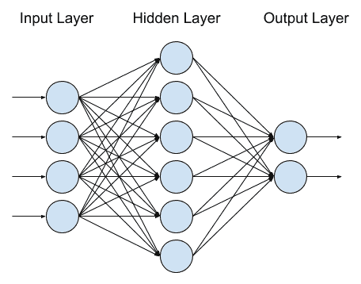
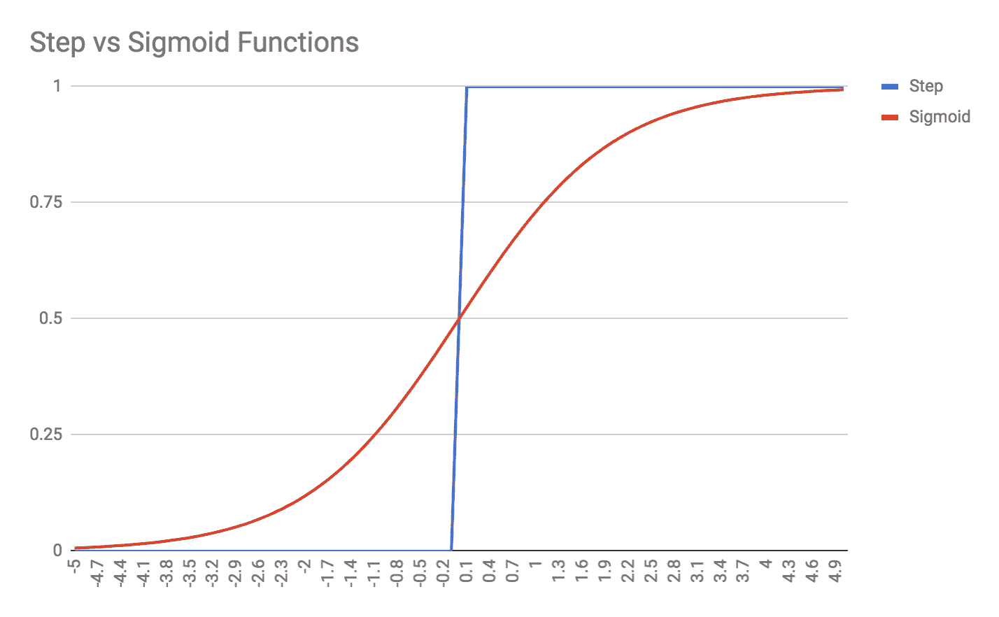

# 八、人工神经网络算法

**人工神经网络** ( **神经网络**)或者简单地说神经网络，可以说是当今最流行的**机器学习** ( **ML** )工具，如果不一定是使用最广泛的话。当今的科技媒体和评论喜欢关注神经网络，它们被许多人视为神奇的算法。相信神经网络会为**人工通用智能** ( **AGI** )铺平道路——但技术现实大不相同。

虽然它们功能强大，但神经网络是高度专业化的 ML 模型，专注于解决单个任务或问题——它们不是神奇的*大脑*，可以开箱即用地解决问题。显示 90%准确度的模型通常被认为是好的。神经网络训练速度慢，需要深思熟虑的设计和实现。也就是说，他们确实是高度熟练的问题解决者，甚至可以解开非常困难的问题，例如图像中的物体识别。

很可能神经网络将在实现 AGI 方面发挥重要作用。但是 ML 和**自然语言处理** ( **NLP** )的很多其他领域都需要涉及。因为人工神经网络只是专门解决问题的工具，所以人们普遍认为，通往 AGI 的道路是由成千上万个人工神经网络组成的大集合，每个人工神经网络都专门完成一项单独的任务。我个人认为，我们很快就会看到类似 AGI 的东西。然而，AGI 最初只能通过巨大的资源来实现——不是在计算能力方面，而是在训练数据方面。

在本章中，你将学习神经网络的基础知识。使用神经网络的方式有很多种，也有很多可能的拓扑——我们将在本章和[第 9 章](09.html)、*深度神经网络*中讨论其中的一些。每个神经网络拓扑都有自己的目的、优势和劣势。

首先，我们将从概念上讨论神经网络。我们将研究它们的组件和结构，并探索它们的应用和优势。我们将讨论反向传播算法以及如何训练人工神经网络。然后，在深入探讨一些关于野生神经网络的实用建议之前，我们将简单地浏览一下人工神经网络的数学。最后，我们将演示一个使用`TensorFlow.js`库的简单神经网络的例子。

以下是我们将在本章中讨论的主题:

*   神经网络概念综述
*   反向传播训练
*   示例-在`TensorFlow.js`中进行异或运算

# 神经网络概念综述

人工神经网络存在的时间几乎和计算机一样长，而且确实最初是由电子硬件构成的。最早的人工神经网络之一是在 20 世纪 70 年代开发的，用于自适应过滤电话线传输中的回声。尽管人工神经网络最初很早就取得了成功，但直到 20 世纪 80 年代中期，反向传播训练算法得到普及，人工神经网络的受欢迎程度才开始下降。

人工神经网络是以我们对生物大脑的理解为模型的。人工神经网络包含许多相互连接的神经元。这些神经元连接的方式、结构和组织被称为网络的**拓扑**(或**形状**)。每个单独的神经元都是一个简单的结构:它接受几个数字输入值，并输出一个数字值，该数字值又可以传递给其他几个神经元。下面是一个简单的神经元概念示例:


神经元通常(但不总是)排列成层。神经元之间的特定排列和连接是由网络的拓扑结构定义的。然而，大多数人工神经网络将有三个或四个完全连接的层，或者层中的每个神经元连接到下一层中的每个神经元的层。在这些常见的拓扑中，第一层是输入层，最后一层是输出层。输入数据直接输入到输入神经元，算法的结果从输出神经元读取。在输入和输出层之间，通常有一两个隐藏层，由用户或程序员不直接与之交互的神经元组成。下图显示了具有三层的神经网络:



输入层有四个神经元，单个隐藏层有六个神经元，输出层有两个神经元。描述这种网络的简写是列出每层神经元的数量，因此这可以简称为 **4-6-2 网络**。这种网络能够接受四种不同的特征，并且能够输出两条信息，例如 X/Y 坐标、两个属性的真/假值，或者如果输出被视为二进制位，甚至是数字 0-3。

当使用人工神经网络进行预测时，您是在前馈模式下使用网络，这实际上非常简单。我们将深入讨论神经元的机制，但目前您需要知道的是，一个神经元接受多个输入，并基于简单的加权和和一个平滑函数(称为**激活函数**)生成单个输出。

为了进行预测，您将输入数据直接加载到输入神经元中。如果你的问题是一个图像识别问题，那么每个输入神经元可能被输入单个像素的灰度强度(你需要 2500 个输入神经元来处理一个 50×50 像素的灰度图像)。输入神经元被激活，这意味着它们的输入被求和、加权、偏置，并且结果被馈送到将返回数值(通常在-1 和+1 之间，或者在 0 和+1 之间)的激活函数。输入神经元依次将其激活输出发送到隐藏层中经历相同过程的神经元，并将结果发送到输出层，输出层再次被激活。算法的结果是输出层的激活函数值。如果你的图像识别问题是一个有 15 个可能类别的分类问题，你将在输出层有 15 个神经元，每个神经元代表一个类别标签。输出神经元将返回 1 或 0 的值(或其间的分数)，具有最高值的输出神经元是最有可能由图像表示的类。

为了理解像这样的网络实际上是如何产生结果的，我们需要更仔细地观察神经元。神经网络中的神经元有一些不同的特性。首先，一个神经元保持一组(一个向量)权重。神经元的每个输入都乘以相应的权重。如果您查看上图中隐藏层最顶端的神经元，您可以看到它从输入层的神经元接收到四个输入。因此，隐藏层神经元必须每个都有一个四个权重的向量，前一层中发送信号的每个神经元都有一个权重。权重基本上决定了特定的输入信号对所讨论的神经元有多重要。例如，最顶层的隐藏层神经元对于最底层的输入神经元的权重可能为 0；在这种情况下，这两个神经元基本上是不相连的。另一方面，下一个隐藏的神经元可能对最底层的输入神经元具有非常高的权重，这意味着它会非常强烈地考虑其输入。

每个神经元也有偏差。该偏差不适用于任何单个输入，而是在激活函数被调用之前被添加到加权输入的总和中。这种偏差可以看作是神经元激活阈值的一种修正。我们将很快讨论激活函数，但让我们看一下神经元的更新图:


描述神经元的数学形式是这样的，黑体数字 **w** 和 **x** 表示输入和权重的向量(即，x <sub>1</sub> 、x <sub>2</sub> 、x <sub>3</sub> )、非黑体数字 *b* 和 *y* 分别表示神经元的偏置和神经元的输出， *fn(...)*代表激活功能。下面是:

*y = fn( **w·x** + b)*

**w** 和 **x** 之间的点是两个矢量的矢量点积。另一种写 **w x** 的方法是*w<sub>1</sub>* x<sub>1</sub>+w<sub>2</sub>* x<sub>2</sub>+w<sub>3</sub>* x<sub>3</sub>+…+w<sub>n</sub>* x<sub>n</sub>*，或者简单地说σ*<sub>j</sub>w*

综合起来，实际上是网络中神经元的权重和偏差在进行学习和计算。当你训练一个神经网络时，你正在逐步更新权重和偏差，目标是配置它们来解决你的问题。两个具有相同拓扑的神经网络(例如，两个完全连接的 10-15-5 网络)，但不同的权重和偏差是不同的网络，将解决不同的问题。

激活功能是如何影响这一切的？人工神经元的原始模型称为感知器，其激活函数是阶跃函数。基本上，如果一个神经元的 ***w x** + b* 大于零，该神经元将输出 1。另一方面，如果 ***w x** + b* 小于零，神经元将输出零。

这个早期的感知器模型非常强大，因为它可以用人工神经元来表示逻辑门。如果你上过布尔逻辑或电路的课程，你就会知道你可以用与非门来构建任何其他类型的逻辑门，用感知器来构建与非门非常简单。

想象一个感知器，它接受两个输入，每个输入的权重为-2。感知器的偏差为+3。如果两个输入都是 0，那么 ***w x** + b = +3* (只是权重，因为所有输入都是零)。由于感知器的激活函数是阶跃函数，在这种情况下，神经元的输出将是 1 (+3 大于零，因此阶跃函数返回+1)。

如果输入为 1 和 0，则以任意顺序，则 ***w x** + b = +1* ，因此感知器的输出也将为 1。但是，如果两个输入都是 1，那么*T5 w x+b =-1*。两个输入均为加权-2，将克服神经元的+3 偏差，激活函数(返回 1 或 0)将返回 0。这是与非门的逻辑:如果两个输入都是 1，感知器将返回 0，否则它将为任何其他输入组合返回 1。

这些早期结果在 20 世纪 70 年代激发了计算机科学和电子社区，人工神经网络受到了大量的炒作。然而，我们很难自动训练神经网络。感知器可以手工制作来表示逻辑门，神经网络的一些自动训练是可能的，但是大规模的问题仍然无法解决。

问题在于用作感知器激活函数的阶跃函数。当训练人工神经网络时，您希望网络的权重或偏差的微小变化同样只导致网络输出的微小变化。但是阶跃函数妨碍了这个过程；权重的一个小变化可能不会导致输出的变化，但是权重的下一个小变化可能会导致输出的巨大变化！发生这种情况是因为阶跃函数不是一个平滑函数——一旦越过阈值，它就会从 0 突然跳到 1，并且在所有其他点都恰好是 0 或 1。感知器的这种局限性，以及人工神经网络的主要局限性，导致了十多年的研究停滞。

最终，研究人员在 1986 年重新发现了几年前发现的一种训练技术。他们发现这种被称为**反向传播**的技术使训练变得更快、更可靠。因此，人工神经网络经历了第二次风。

# 反向传播训练

有一个关键的见解将神经网络研究从停滞带入了现代:为神经元选择更好的激活功能。阶跃函数导致了网络自动训练的问题，因为网络参数(权重和偏差)的微小变化可能对网络没有影响，或者突然产生重大影响。显然，这不是一个可训练系统所期望的特性。

自动训练人工神经网络的一般方法是从输出层开始，向后进行。对于训练集中的每个示例，您以前馈模式(即**预测模式**)运行网络，并将实际输出与期望输出进行比较。用于比较期望结果和实际结果的一个好指标是**均方误差** ( **均方误差**)；测试所有训练示例，并对每个示例计算输出与期望值之间的差值并将其平方。将所有的平方误差相加，取训练样本数的平均值，你就有了一个成本函数或损失函数。成本函数是给定网络拓扑的权重和偏差的函数。训练人工神经网络的目标是将成本函数降低到——理想情况下——零。您可以潜在地使用所有训练示例的神经网络精度作为成本函数，但是均方误差对于训练具有更好的数学属性。

反向传播算法取决于以下见解:如果你知道所有神经元的权重和偏差，如果你知道输入和期望输出，如果你知道神经元使用的激活函数，你可以从输出神经元反向工作，以发现哪些权重或偏差导致了较大的误差。也就是说，如果神经元 Z 的神经元输入 A、B 和 C 的权重分别为 100、10 和 0，那么你就会知道神经元 C 对神经元 Z 没有影响，因此神经元 C 对神经元 Z 的误差没有贡献。另一方面，神经元 A 对神经元 Z 有过大的影响，所以如果神经元 Z 有很大的误差，很可能是神经元 A 的错。反向传播算法就是这样命名的，因为它通过网络反向传播输出神经元中的误差。

将这个概念向前推进一步，如果你也知道激活函数及其权重、偏差和误差之间的关系，你就可以确定一个权重需要改变多少才能得到神经元输出的相应变化。当然，人工神经网络中有许多权重，并且它是一个高度复杂的系统，因此我们使用的方法是对权重进行微小的改变——如果我们对权重的微小变化使用简化近似，我们只能预测网络输出的变化。这部分方法被称为梯度下降，之所以这样命名，是因为我们试图通过对权重和偏差进行小的修改来降低成本函数的梯度(斜率)。

想象一下，挂在两棵树之间的尼龙吊床。吊床代表成本函数，*x**y*轴(从天上看)抽象地代表网络的偏差和权重(现实中这是一个多维度的画面)。吊床挂得最低的地方有一些重量和偏见的组合:这一点是我们的目标。我们是一只坐在吊床表面某处的小蚂蚁。我们不知道吊床的最低点在哪里，我们太小了，即使是织物上的皱纹或折痕也会把我们甩下。但是我们知道吊床是光滑连续的，我们可以感觉到我们周围的区域。只要我们每走一步都保持下坡，我们最终会找到吊床的最低点——或者至少是一个接近我们起点的低点(局部最小值)，这取决于吊床的形状有多复杂。

这种梯度下降的方法要求我们从数学上理解并能够描述代价函数的梯度，这意味着我们还必须理解激活函数的梯度。函数的梯度本质上是它的斜率或导数。我们之所以不能用感知器的原始阶跃函数作为激活函数，是因为阶跃函数不是在所有点都是可微的；阶跃函数中 0 和 1 之间巨大的瞬时跳跃是不可微的不连续性。

一旦我们发现我们应该使用梯度下降和反向传播来训练我们的神经网络，剩下的就很容易了。我们开始使用 sigmoid 函数，而不是使用神经元激活函数的阶跃函数。Sigmoid 函数通常形状像阶跃函数，除了它们是平滑的、连续的和在所有点都是可微的。下面是 sigmoid 函数与阶跃函数的对比示例:



有许多类型的 sigmoid 函数；前一个由方程 *y = 1 / 1+e <sup>-x</sup>* 描述，称为**逻辑函数**或**逻辑曲线**。其他流行的 sigmoid 函数是双曲正切函数(即 tanh)，它的范围是-1 到+1，而不是逻辑函数的范围 0 到+1。另一个流行的激活功能是**整流线性单元** ( **ReLU** )，常用于图像处理和输出层。还有 *softplus* 函数，它的导数其实就是逻辑函数本身。您选择的激活函数将取决于您想要的特定数学属性。在网络的不同层使用不同的激活功能也并不少见；隐藏层通常使用逻辑或 tanh 激活函数，而输出层可能使用 *softmax* ，输入层可能使用 ReLU。你可以为你的神经元发明自己的激活函数，然而，你必须能够区分函数并确定其梯度，以便将其与反向传播算法相结合。

神经元激活功能的这种独特的微小变化对我们训练人工神经网络产生了巨大的影响。一旦我们开始使用可微激活函数，我们就能够计算成本和激活函数的梯度，并使用该信息来精确确定如何更新反向传播算法中的权重。神经网络训练变得更快、更强大，神经网络被推进了现代时代，尽管它们仍然需要等待硬件和软件库来赶上。更重要的是，神经网络训练变成了数学研究——尤其是向量演算——而不是局限于计算机科学家的研究。

# 示例 TensorFlow.js 中的异或运算

在这个例子中，我们将使用`TensorFlow.js`前馈神经网络来解决异或问题。首先，让我们探讨一下异或问题，以及为什么它是我们的一个好的起点。

异或运算，或*异或运算*是一个布尔运算符，如果其输入只有一个为真，但不是两个都为真，则返回真。将此与您更熟悉的常规布尔或进行比较，如果两个输入都为真，则布尔或将返回真，如果两个输入都为真，则异或将返回假。这是一个比较异或和或的表格；我强调了“或”和“异或”不同的情况:

| **输入 1** | **输入 2** | **或** | **异或** |
| 错误的 | 错误的 | 错误的 | 错误的 |
| 错误的 | 真实的 | 真实的 | 真实的 |
| 真实的 | 错误的 | 真实的 | 真实的 |
| 真实的 | 真实的 | **真** | **假** |

为什么异或问题对我们来说是一个很好的测试？让我们在图上画出异或运算:


查看前面的图，我们可以看到**异或**运算中涉及的两个类是不可线性分离的。换句话说，在前面的图中，不可能画出一条直线将圆圈与 X 分开。

异或运算非常简单，而且类不是线性可分的，这两个事实使得异或运算在测试新的分类算法时成为一个很好的切入点。您不需要花哨的数据集来测试新的库或算法是否适合您。

在进入张量流示例之前，让我们首先讨论如何手工构建异或求解神经网络。我们将设计自己的权重和偏差，看看能否开发出一个解决 XOR 的人工神经网络。

首先，我们知道网络需要两个输入和一个输出。我们知道输入和输出是二进制的，所以我们必须选择范围为[0，1]的激活函数；ReLU 或 sigmoid 是合适的，而范围为[-1，1]的 tanh 则不太合适。

最后，我们知道异或不是线性可分的，因此不能简单地求解；我们的网络需要一个隐藏层。因此，让我们尝试构建一个 2-2-1 神经网络:


接下来，我们需要考虑网络中神经元的权重和偏差。我们知道网络需要设计成两个输入都为真时会有损失。因此，一个隐藏层神经元应该代表弱正信号(即，当输入被激活时它被激活)，另一个隐藏层神经元应该代表强负信号(即，如果两个输入都为真，这个神经元应该压倒弱正神经元)。

这里有一组权重的例子，可以实现异或运算:


让我们运行几个示例计算。我将从两个输入都为真的微分情况开始。隐藏的 **h1** 神经元的总加权输入为 4，因为每个输入的权重为 2，并且两个输入都为真。h1 神经元也有-1 的偏置，然而，该偏置不足以使神经元失活。因此，对于 h1 神经元，偏置输入的总和为 3；由于我们还没有决定一个特定的激活功能，我们不会试图猜测实际的激活会变成什么——只要说输入+3 就足以激活神经元。

我们现在把注意力转向隐藏的 **h2** 神经元。它还接收来自两个输入神经元的输入，然而，这些权重是负的，因此它接收的无偏输入和是-4。h2 的偏置为+3，因此 h2 的总偏置输入为-1。如果我们选择 ReLU 激活函数，神经元的输出将为零。在任何情况下，h2 都不会被激活。

最后，我们看看输出节点。它从 h1 接收+2 的加权输入，但没有从 h2 接收输入。由于输出节点的偏置为-3(本质上要求 h1 和 h2 都被激活)，输出节点将返回 0 或假。这是两个输入都设置为真或 1 时异或的预期结果。

让我们同样将其他异或情况的结果制成表格。`h1`、`h2`和`Out`的列表示神经元的加权和偏置输入，然后应用于激活函数(因为我们没有选择一个)。只需记住，每个神经元会将[0，1]中的值传递给下一个神经元；应用激活功能后，它不会发送-1 或 3 等值:

| **在 1 中** | **在 2** 中 | **h1** | **h2** | **出** |
| Zero | Zero | -1 | three | -1 |
| Zero | one | one | one | one |
| one | Zero | one | one | one |
| one | one | three | -1 | -1 |

上表证明了人工神经网络适用于所有异或测试用例。这也让我们对网络的内部运作有了一点了解。隐藏的 h1 和 h2 神经元有特定的作用。h1 神经元默认关闭，但很容易满足，如果任何输入有效，它将被激活；h1 本质上是典型的 OR 运算。另一方面，h2 默认开启，只有当两个输入都开启时才能停用；h2 本质上是 NAND 操作。输出神经元要求 h1 和 h2 都有效，因此输出神经元是“与”运算符。

现在让我们使用`TensorFlow.js`库，看看我们是否能取得同样的成功。在你的电脑上，创建一个名为`Ch8-ANN`的新文件夹。添加以下`package.json`文件，然后发布`yarn install`:

```js
{
  "name": "Ch8-ANN",
  "version": "1.0.0",
  "description": "ML in JS Example for Chapter 8 - ANN",
  "main": "src/index.js",
  "author": "Burak Kanber",
  "license": "MIT",
  "scripts": {
    "build-web": "browserify src/index.js -o dist/index.js -t [ babelify --presets [ env ] ]",
    "build-cli": "browserify src/index.js --node -o dist/index.js -t [ babelify --presets [ env ] ]",
    "start": "yarn build-cli && node dist/index.js"
  },
  "dependencies": {
    "@tensorflow/tfjs": "^0.9.1",
    "babel-core": "^6.26.0",
    "babel-plugin-transform-object-rest-spread": "^6.26.0",
    "babel-preset-env": "^1.6.1",
    "babelify": "^8.0.0",
    "browserify": "^15.1.0"
  }
}
```

现在添加`src/index.js`文件并导入张量流:

```js
import * as tf from '@tensorflow/tfjs';
```

张量流不仅仅是一个人工神经网络库。张量流库提供了许多在人工神经网络和一般的最大似然和线性代数(即向量/矩阵数学)问题中有用的构件。因为 TensorFlow 更多的是一个工具箱，而不是一个单一的工具，所以总是会有很多方法来解决任何给定的问题。

让我们从创建一个顺序模型开始:

```js
const model = tf.sequential();
```

TensorFlow *模型*是本质上运行函数的高级容器；它们从输入映射到输出。您可以使用 TensorFlow 的低级运算符(库附带的线性代数工具)来构建您的模型，也可以使用其中一个高级模型类。在这种情况下，我们正在构建一个*序列模型*，这是 TensorFlow 通用模型的一个特例。你可以把序列模型想象成一个神经网络，它只向前反馈，内部不涉及任何重复或反馈循环。序列模型本质上是一个普通的神经网络。

接下来，让我们向模型添加层:

```js
model.add(tf.layers.dense({units: 4, activation: 'relu', inputDim: 2}));
model.add(tf.layers.dense({units: 4, activation: 'relu'}));
model.add(tf.layers.dense({units: 1, activation: 'sigmoid'}));
```

我们正在给我们的模型增加三层。所有层都是**密集**层，意味着它们完全连接到下一层。这就是你对普通神经网络的期望。我们已经为每一层指定了*单位*，单位是张量流对神经元的名称，因为张量流可以在人工神经网络环境之外使用。我设置了这个例子，每层有四个神经元，而不是两个，因为我发现额外的神经元大大提高了训练过程的速度和弹性。我们在第一层指定了`inputDim` ，告诉该层每个数据点应该有两个输入。第一层和第二层使用 ReLU 激活功能。第三层是输出层，只有一个单位/神经元，使用熟悉的 sigmoid 激活函数，因为我希望结果更容易接近 0 或 1。

现在我们必须先编译模型，然后才能使用它。我们将指定一个损失函数，它可以是库附带的预构建损失函数，也可以是我们提供的自定义损失函数。我们还将指定我们的优化器；我们在本章前面讨论了梯度下降，但是还有许多其他可用的优化器，例如 Adam、Adagrad 和 Adadelta。在这种情况下，我们将使用随机梯度下降优化器(典型的香草神经网络)，然而，我们将选择`binaryCrossentropy`损失函数，它比均方误差更适合我们的二进制分类任务:

```js
const learningRate = 1;
const optimizer = tf.train.sgd(learningRate);
model.compile({loss: 'binaryCrossentropy', optimizer, metrics: ['accuracy']});
```

我们还为梯度下降优化器设置了学习速率；学习速率决定了反向传播训练算法将在每个训练世代或时期中修改多少权重和偏差。较低的学习速率会导致训练网络的时间较长，但会更稳定。较高的学习速率会更快地训练网络，但不太可靠；如果学习率太高，你的网络可能根本不会收敛。

最后，我们在编译步骤中添加了`metrics: ['accuracy']`。这使得我们在最终调用`model.evaluate`时，可以得到一个关于网络准确性的报告。

接下来，我们将设置我们的训练数据，这只是四个数据点。张量流对本质上是数学矩阵的*张量*进行运算。张量流张量是不可变的，对张量执行的所有操作都将返回新的张量，而不是修改现有的张量。如果需要就地修改张量，必须使用张量流的*变量，*，它们是张量周围的可变包装器。张量流要求所有数学运算都通过张量来执行，以便库可以为 GPU 处理优化计算:

```js
// XOR data x values.
const xs = tf.tensor([
    [0, 0],
    [0, 1],
    [1, 0],
    [1, 1]
],
// Shape of the tensor is 4 rows x 2 cols
[4, 2]);

// XOR data y values.
const ys = tf.tensor([ 0, 1, 1, 0 ], [4, 1]);
```

因为张量是矩阵，所以每个张量都有一个*形状*。形状，对于 2D 张量，定义为*【行，列】*。对于 3D 张量，形状为*【行、列、深度】*；图像处理通常使用三维张量，其中行和列表示像素的 Y 和 X 坐标，深度表示该像素的颜色通道(例如，RGBA)。由于我们有四个训练示例，并且每个训练示例需要两个输入字段，因此我们的输入张量具有四行两列的形状。类似地，我们的目标值张量具有四行一列的形状。如果您试图用错误的输入和输出形状运行计算或训练模型，TensorFlow 将抛出错误。

我们的最后一步是用数据训练模型，然后评估模型。TensorFlow 的`model.fit`方法就是训练模型的方法，一旦训练好了我们就可以用`model.evaluate`得到统计量，比如精度和损失，我们也可以用`model.predict`在前馈或者预测模式下运行模型:

```js
model.fit(xs, ys, {epochs: 1000}).then(() => {
    console.log("Done training. Evaluating model...");
    const r = model.evaluate(xs, ys);

    console.log("Loss:");
    r[0].print();
    console.log("Accuracy:");
    r[1].print();

    console.log("Testing 0,0");
    model.predict(tf.tensor2d([0, 0], [1, 2])).print();
    console.log("Testing 0,1");
    model.predict(tf.tensor2d([0, 1], [1, 2])).print();
    console.log("Testing 1,0");
    model.predict(tf.tensor2d([1, 0], [1, 2])).print();
    console.log("Testing 1,1");
    model.predict(tf.tensor2d([1, 1], [1, 2])).print();
});
```

添加代码后，从命令行运行`yarn start`。运行这个模型对我来说需要大约 60 秒。当模型完成时，您应该会看到类似如下的输出。请注意，人工神经网络和随机梯度下降优化器使用随机值进行初始化和处理，因此模型的某些运行可能不成功，这取决于特定的随机初始条件。以下是将获得的输出:

```js
Done training. Evaluating model...
 Loss:
 Tensor
 0.00011571444338187575
 Accuracy:
 Tensor
 1
 Testing 0, 0
 Tensor
 [[0.0001664],]
 Testing 0, 1
 Tensor
 [[0.9999378],]
 Testing 1, 0
 Tensor
 [[0.9999322],]
 Testing 1, 1
 Tensor
 [[0.0001664],]
```

前面的输出显示，模型已经学会模拟异或。损耗值很低，而精度是 1.0，这是这么简单的问题所需要的。在现实问题中，80-90%的准确率更现实。此外，程序的输出显示了四个测试用例中每一个的单独预测。您可以看到 sigmoid 激活函数的效果，因为值非常接近 0 和 1，但并没有完全达到。在内部，TensorFlow 对这些值进行舍入，以确定分类是否正确。

在这一点上，你应该玩一点网络参数。如果你减少训练时期的数量会发生什么？如果将 ReLU 层切换到 sigmoid 层会发生什么？如果你把前两层的单位/神经元减少到两个，会发生什么？如果你增加训练时期的数量是否有效？学习率对培训过程有什么影响？这些东西最好通过反复试验而不是说教来发现。这是一个无限灵活的神经网络模型，能够处理比简单的异或示例复杂得多的问题，因此您应该通过实验和研究来熟悉所有这些属性和参数。

虽然这个例子只是一个简单的异或样本，这种方法也可以用于许多其他类型的人工神经网络问题。我们已经创建了一个三层二进制分类器，它可以自动训练和评估自己——这是一个终极的普通神经网络。我将把这些概念留给你，并把它们应用到你的现实问题中，尽管在下一章中，我们将尝试一些先进的神经模型，如卷积和递归网络。

# 摘要

本章介绍和描述了人工神经网络的概念。我们首先从概念的角度讨论了人工神经网络。您了解到神经网络是由单个神经元组成的，这些神经元是简单的加权加法机器，可以对其输出应用激活函数。您了解到神经网络可以有许多拓扑结构，而实际工作是由网络中神经元之间的拓扑结构以及权重和偏差完成的。您还学习了反向传播算法，这是一种自动训练神经网络的方法。

我们也看了经典的异或问题，通过神经网络的镜头来看。我们讨论了挑战和用人工神经网络解决异或问题的方法，我们甚至建立了——手工！—完全训练好的神经网络，可以解决异或问题。然后我们引入了`TensorFlow.js`库，并用它构建了一个普通的神经网络，并成功地用这个神经网络训练和解决了异或问题。

在下一章中，我们将深入研究高级人工神经网络拓扑。具体来说，我们将讨论在图像处理中广泛使用的**卷积神经网络** ( **CNN** )，我们还将看看在人工智能和自然语言任务中常用的**递归神经网络** ( **RNN** )。