# 二、把事物和树莓派联系起来

您需要学习如何将东西连接到您的树莓 Pi Zero，并查看架构，区分我们可以用于我们定义的目的的引脚。这就是我们有这一部分的原因——帮助您使用我们可以连接的传感器，并提供如何将其他东西连接到您的设备的基本知识。在本节中，我们将解释如何配置树莓皮；现在，您无法避免学习如何连接到您的树莓 Pi 传感器，以读取连接到它的模拟输入。

我们将讨论以下主题，以使我们的硬件与主板通信:

*   连接数字输入:传感器 DS18B20
*   使用 MCP3008 模数转换器连接模拟输入
*   连接一个真实的 **-** 时钟(RTC)

# 连接数字输入传感器 DS18B20

树莓 Pi 具有数字引脚，因此在本节中，我们将了解如何将数字传感器连接到电路板。我们将使用数字传感器 DS18B20，它有一个数字输出，可以完美地连接到我们的树莓皮传感器的数字输入。其主要思想是从传感器获取温度读数，并将其显示在屏幕上。

## 硬件要求

我们需要以下硬件来获取温度读数:

*   温度传感器 DS18B20(防水)
*   一个 4.7 千欧姆的电阻器
*   一些跳线
*   面包板

我们将使用防水传感器 DS18B20 和一个 *4.7* 千欧电阻:


这是我们在这个项目中使用的防水传感器。

## 硬件连接

下图显示了电路板上的电路，包括传感器和电阻:

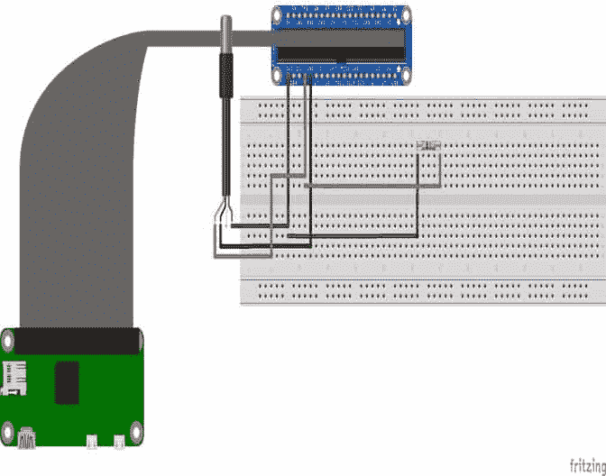

在下图中，我们可以看到带有传感器的电路:

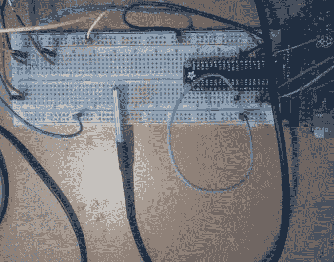

# 配置单线协议

在树莓 Pi 中打开一个终端，并键入以下内容:

```js
sudo nano /boot/config.txt

```

您应该在页面底部键入以下行来配置协议，并定义单线协议将在其中通信的引脚:

```js
dtoverlay=w1-gpio

```

下一步是重启树莓皮。几分钟后，打开终端并键入以下行:

```js
sudo modprobew1-gpio
sudo modprobe w1-therm

```

进入文件夹并选择将要配置的设备:

```js
cd /sys/bus/w1/devices
ls

```

选择要设置的设备。将`xxxx`更改为将在协议中设置的设备的序列号:

```js
cd 28-xxxx
cat w1_slave

```

您将看到以下内容:

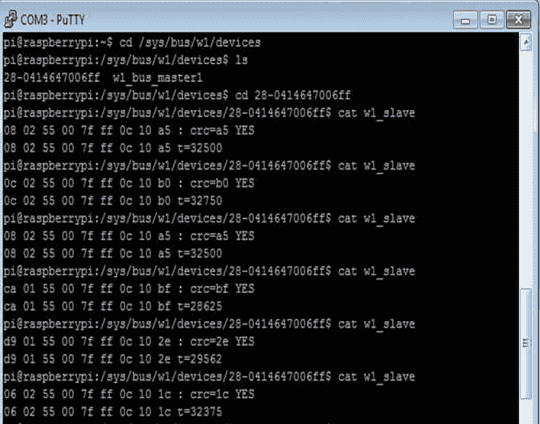

之后，如果看起来温度读数是这样做的，你会看到一行写着*是:t=29.562* 。

## 软件配置

现在让我们看一下在屏幕上每秒钟以摄氏度和华氏度显示温度的代码。

这里我们导入程序中使用的库:

```js
import os1 
import glob1 
import time1 

```

这里我们定义了协议中配置的设备:

```js
os1.system('modprobew1-gpio') 
os1.system('modprobew1-therm1') 

```

这里我们定义了配置设备的文件夹:

```js
directory = '/sys/bus/w1/devices/' 
device_folder1 = glob1.glob(directory + '28*')[0] 
device_file1 = device_folder1 + '/w1_slave' 

```

然后我们定义读取`temperature`和配置传感器的功能:

```js
defread_temp(): 
f = open(device_file1, 'r') 
readings = f.readlines() 
f.close() 
return readings 

```

使用以下功能读取温度:

```js
defread_temp(): 
readings = read_temp() 

```

在这个函数中，我们比较它何时收到消息`YES`并得到`t=`字符。我们还得到了温度的值:

```js
while readings[0].strip()[-3:] != 'YES': 
time1.sleep(0.2) 
readings = read_temp() 
equals = lines[1].find('t=') 

```

然后我们计算温度，`C`和`F`中的`temp`，并返回数值:

```js
if equals != -1: 
temp = readings[1][equals pos+2:] 
tempc = float(temp) / 1000.0 
tempf = temp * 9.0 / 5.0 + 32.0 
returntempc, tempf 

```

它每秒重复一次循环:

```js
while True: 
print(temp()) 
time1.sleep(1) 

```

## 在屏幕上显示读数

现在我们需要执行`thermometer.py`。要显示 Python 脚本的结果，请打开 PuTTY 终端，并键入以下命令:

```js
sudo python thermometer.py

```

该命令意味着，当我们运行温度计文件时，如果一切运行正常，我们将看到以下结果:


# 使用 MCP3008 模数转换器连接模拟输入

如果我们想将模拟传感器连接到树莓 Pi，我们需要使用**模数转换器** ( **模数转换器**)。电路板没有模拟输入；我们使用 **MCP3008** 连接模拟传感器。这是一个 10 位模数转换器，有八个通道。这意味着您最多可以连接八个传感器，这些传感器可以从树莓 Pi Zero 中读取。我们不需要特殊的组件来连接它们。它们可以通过 SPI 连接到树莓皮的 GPIOs。

第一步是启用 SPI 通信:

1.  进入树莓皮终端，输入以下命令:

    ```js
    sudo raspi-config

    ```

2.  Select **Advanced Options,** as shown in the following screenshot:

    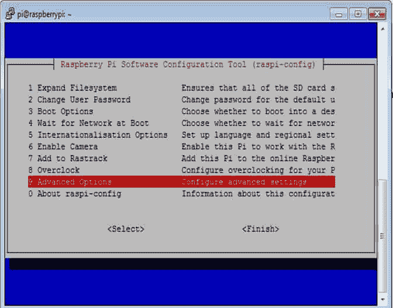

3.  Enable **SPI** communication by selecting the **SPI** option:

    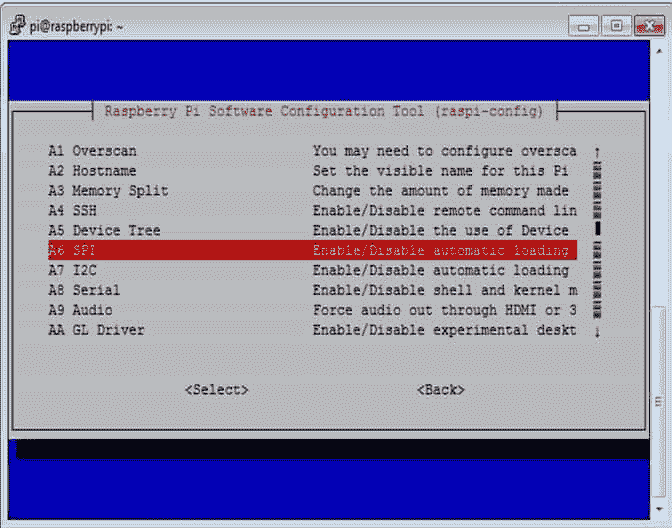

4.  Select **<Yes>** to enable the SPI interface:

    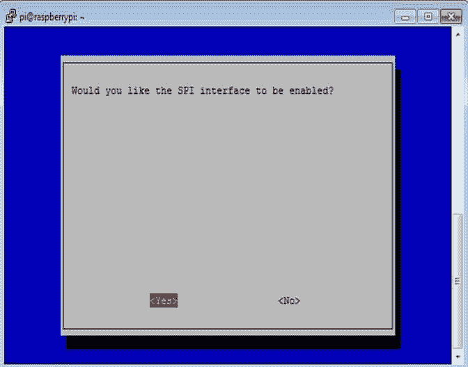

5.  The final screen looks like the following screenshot when we enable the SPI interface. Select **<Ok>**:

    

# 树莓皮 GPIO 头

下面的截图是树莓 Pi Zero 的 GPIO 引脚的图表。在这种情况下，我们将使用 SPI 配置接口(`SPI_MOSI, SPI_MISO, SPI_CLK, SPI_CE0_N`):


下图显示了连接到树莓 Pi 的 MCP3008 芯片的引脚名称:

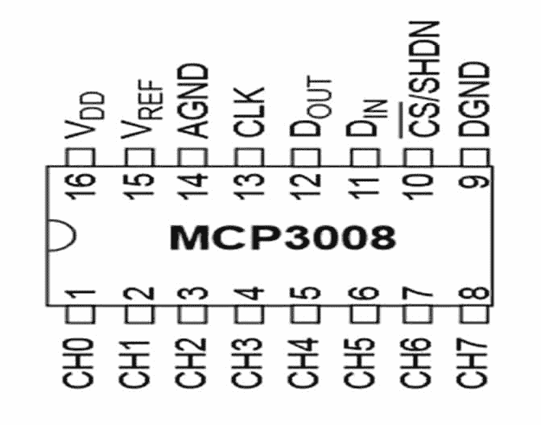

下图显示了温度传感器:


根据下一说明，您需要连接以下引脚:

*   **VDD** 至**T3【3.3】T4**伏
*   从树莓 Pi 零点到 T2 的 3.3 伏电压
*   Pin **AGND** to **GND**
*   将 **CLK** (时钟)固定在树莓皮的 **GPIO11** 上
*   **DOUT** 至 **GPIO9**
*   将 **DIN** 引脚连接至 **GPIO10**
*   将 **CS** 销至 **GPIO8** 并销住
*   将 MCP3008D **GND** 接地

下图显示了这种连接:

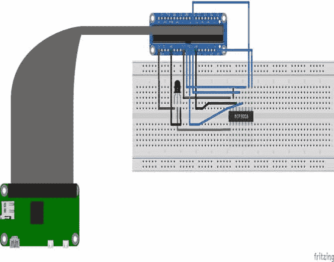

下图显示了传感器与模数转换器 MCP3008 和树莓 Pi 的连接:


## 用 Python 脚本读取数据

在下一节中，您将创建`MCP3008.py`文件；您需要遵循以下步骤:

1.  打开你的树莓皮零终端。
2.  在你的 Pi 终端进入界面。
3.  之前使用`nano`很重要。
4.  键入`sudo nano MCP3008.py`。

它将出现在屏幕上，我们将描述以下几行:

1.  导入库:

    ```js
            import spidev1 
            import os1 

    ```

2.  打开 SPI 总线:

    ```js
            spi1 = spidev1.SpiDev1() 
            spi1.open(0,0) 

    ```

3.  定义模数转换器通道
4.  转换电压的功能如下:

    ```js
            def volts(data1,places1): 
              volts1 = (data1 * 3.3) / float(1023) 
              volts1 = round(volts1,places1) 
              return volts1 

    ```

5.  转换温度的功能如下:

    ```js
            def Temp(data1,places1): 
              temp1 = (data1 * 0.0032)*100 
              temp1 = round(temp1,places1) 
              return temp1 

    ```

6.  从模数转换器定义通道:

    ```js
              channels = 0 

    ```

7.  定义阅读时间:

    ```js
            delay = 10 

    ```

8.  读取温度的功能如下:

    ```js
            while True: 

              temp  = Channels(temp) 
              volts = Volts(temp1,2) 
              temp  = Temp(temp1,2) 

    ```

9.  打印结果:

    ```js
            print"**********************************************" 
            print("Temp : {} ({}V) {} degC".format(temp1,volts,temp)) 

    ```

10.  每 5 秒等待一次:

    ```js
            Time1.sleep(delay) 

    ```

11.  使用以下命令运行 Python 文件:

    ```js
    sudo python MCP3008.py

    ```

12.  On the following screen, we can see the temperature, the ADC measurements, and the volts according to the temperature:

    

# 连接实时时钟

要控制一个系统，有一个能读取时间的电路是非常重要的；它可以帮助控制树莓皮的输出或在特定时间检测动作。我们将把一个 **RTC** 模块 *DS3231* 与树莓 Pi 接口。

## I2C 设置

第一步是通过执行以下步骤来启用 **I2C** 界面:

1.  Select **Advanced Options**:

    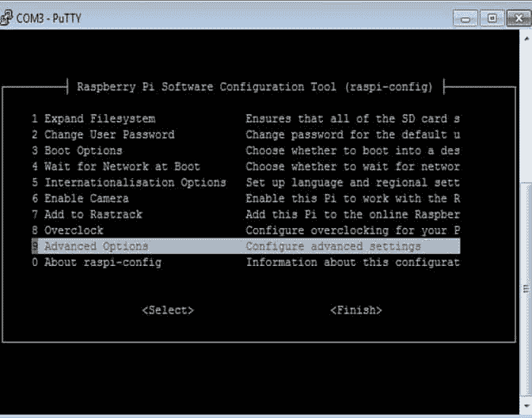

2.  Enable the **I2C** option, as shown in the following screenshot:

    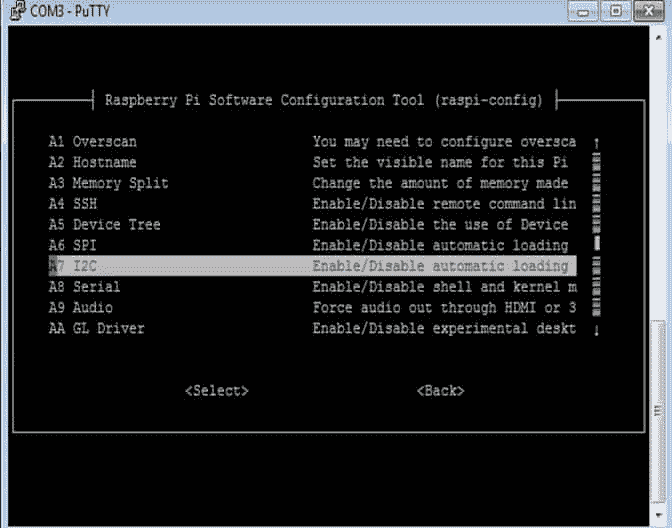

3.  Select **<Yes>** on the next screen:

    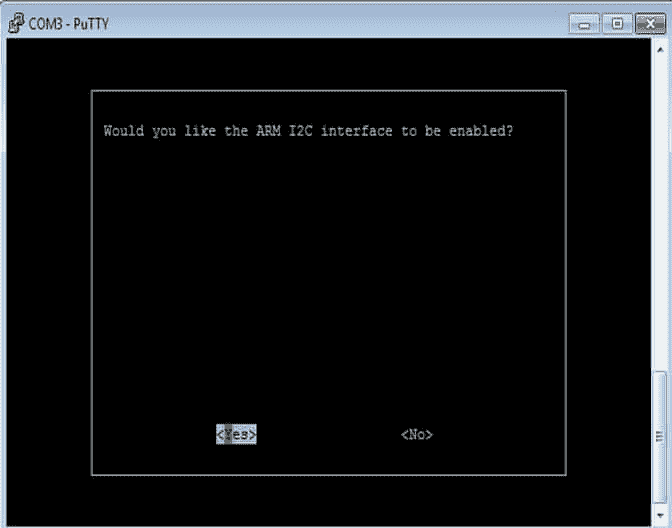

4.  Select **<Ok>**:

    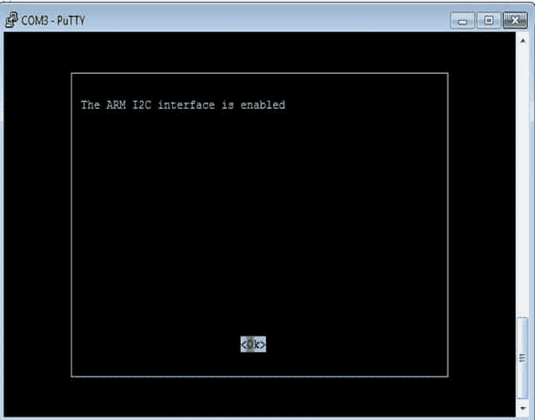

5.  Then select **<Yes>**:

    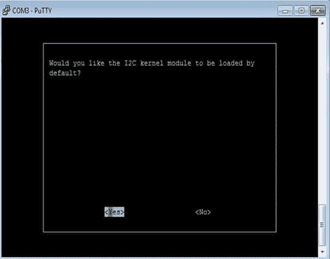

6.  Next, select **<OK>**:

    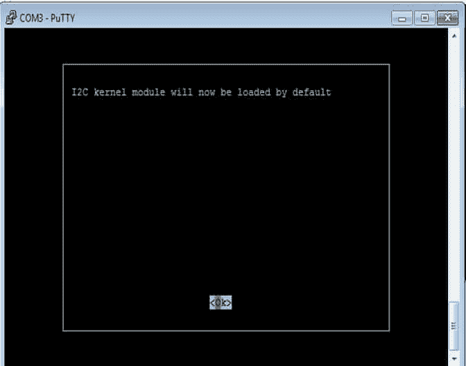

# DS3231 模块设置

DS3231 模块是一个实时时钟。它可以用来从集成电路获得时间和日期，因此它可以与您的系统一起工作，以控制您想要从嵌入式芯片编程的特定事件。它可以完美地与树莓 Pi Zero 一起工作，以便实时获取时间和日期。

你需要确保你有最新的更新。为此，请在终端中键入以下命令:

```js
sudo apt-get update
sudo apt-get -y upgrade

```

使用以下命令修改系统文件:

```js
sudo nano /etc/modules

```

在`modules.txt`文件中添加以下行:

```js
snd-bcm2835 
i2c-bcm2835 
i2c-dev 
rtc-ds1307

```

## 硬件设置

在本节中，我们将了解 RTC 模块的引脚:

```js
DS3231   Pi GPIO 
GNDP     1-06 
VCC      (3.3V) 
SDA      (I2CSDA) 
SCL      (I2CSCL)
```

这是 RTC 模块，我们可以看到芯片的引脚:


下图显示了电路连接:

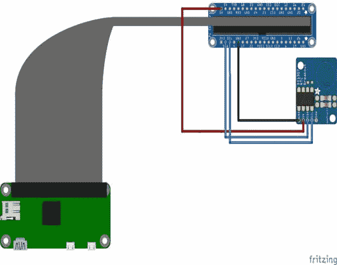

下图显示了最终连接:

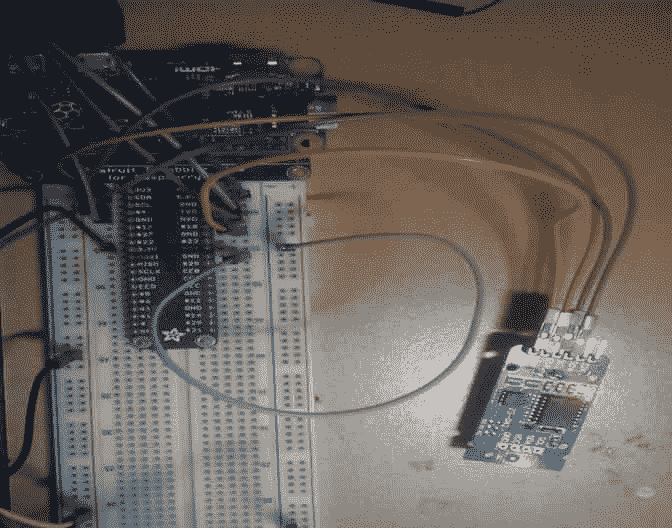

# 测试 RTC

打开终端，键入以下内容:

```js
sudo i2cdetect -y 1

```

您应该会看到类似以下截图的内容:


# I2C 设备设置

下一步是检查时间时钟是否与 RTC 时间同步。在这里，我们定义了 RTC 本地:

```js
sudo nano /etc/rc.local

```

在我们声明新设备和我们配置的路径时，向文件中添加以下行:

```js
echo ds1307 0x68 > /sys/class/i2c-adapter/i2c-1/new_device 

```

以下命令将启动 RTC:

```js
hwclock -s

```

执行此命令后，重新启动 Pi。您将看到以下屏幕，这意味着 RTC 已配置好并准备好工作:

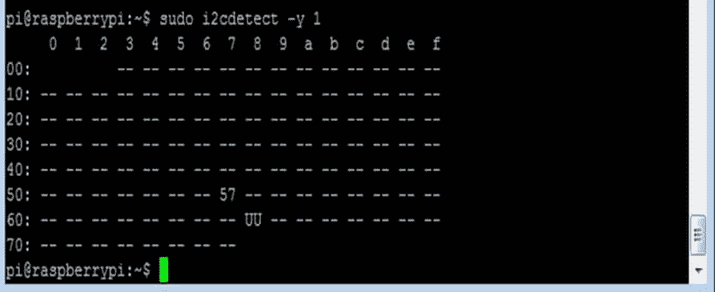

# 将实时时钟置于最终测试

您可以使用以下命令读取 Pi 时间系统:

```js
date

```


一旦 RTC 准备好了，您可以使用以下命令对其进行测试；将时间写入 RTC:

```js
sudo hwclock -w

```

您可以使用此处给出的命令从 RTC 读取时间:

```js
sudo hwclock -r

```

现在是最后的命令。使用这个命令，我们可以看到两个时间值，如下图所示:


# 总结

在本章中，您学习了如何使用 MCP3008 模数转换器，以及如何使用树莓 Pi Zero 温度传感器。我们探索了 GPIO 端口及其所具有的各种接口。我们研究了使用 GPIO 可以连接到树莓 Pi 的各种东西。

在下一章中，我们将深入研究更多的硬件采集，将不同种类的传感器连接到我们的树莓 Pi Zero 和 Arduino 板。这将帮助您在项目中进行真正的测量。那很有趣——坚持下去！