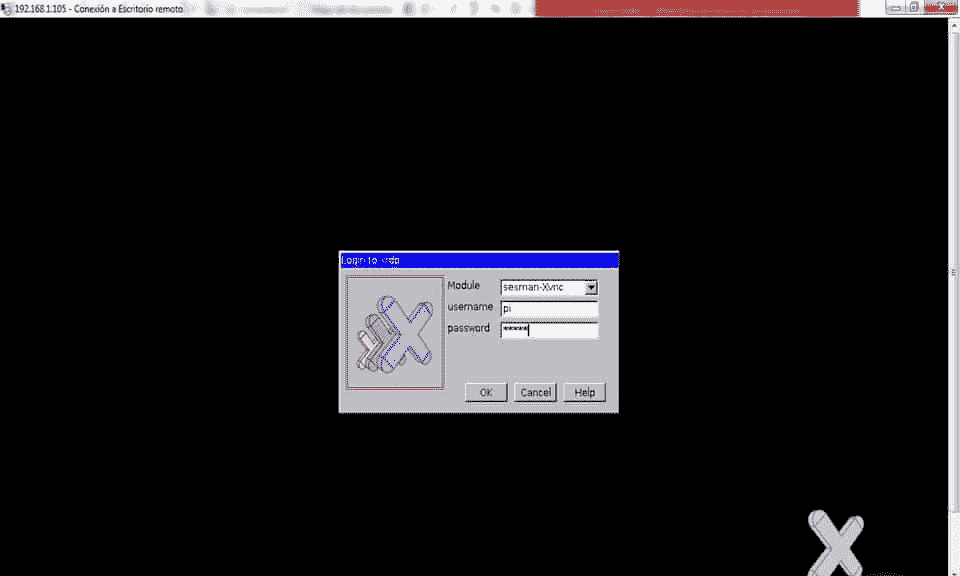
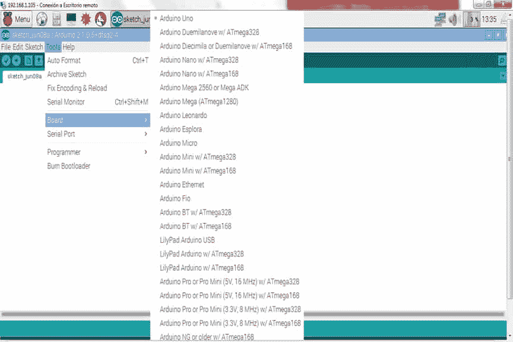
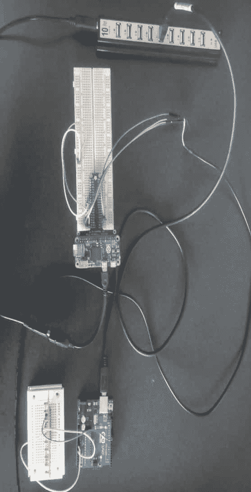
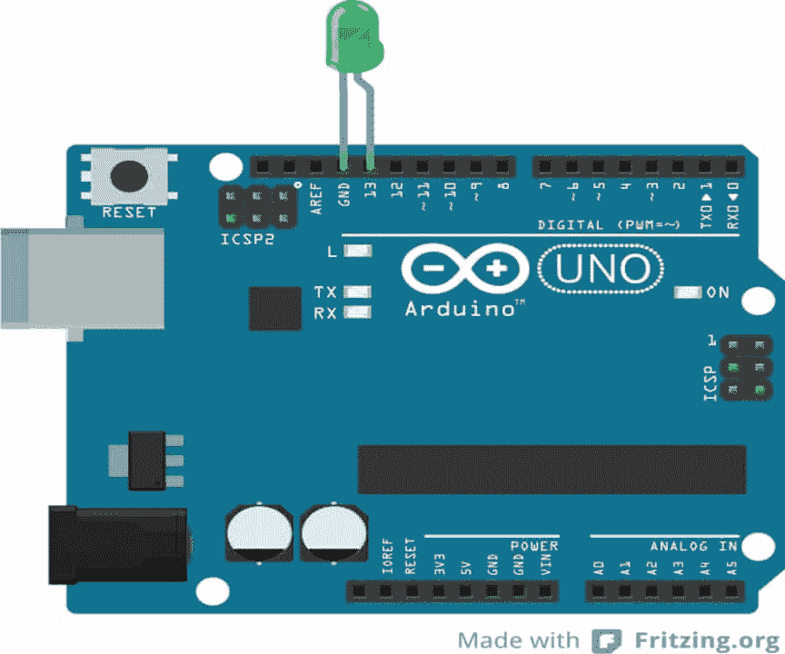
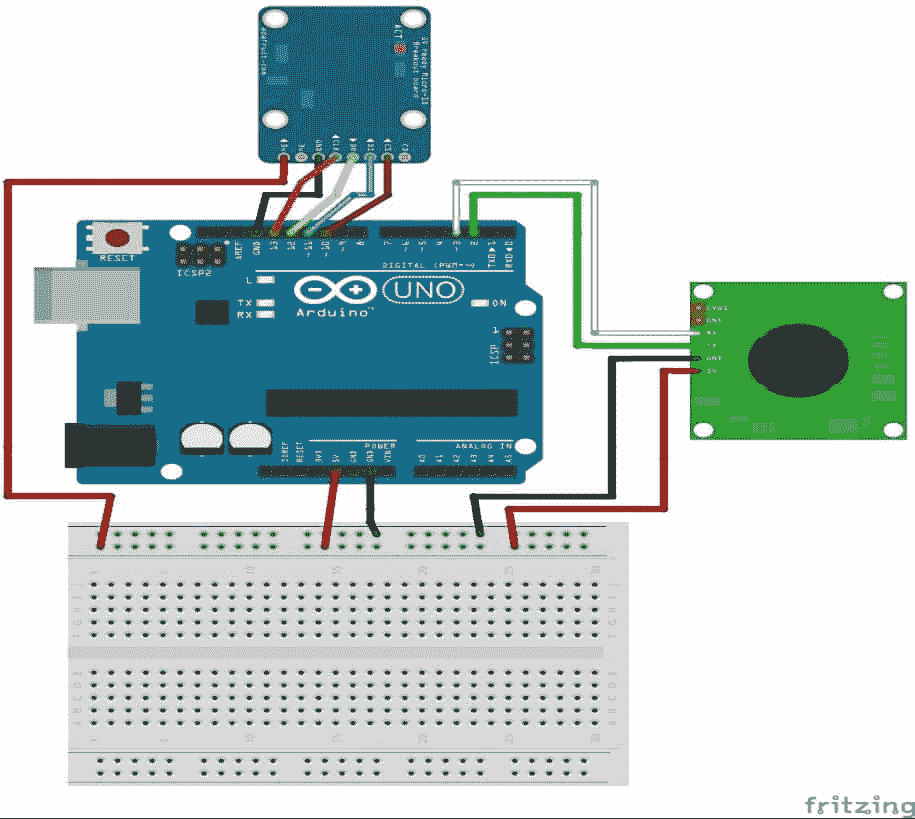
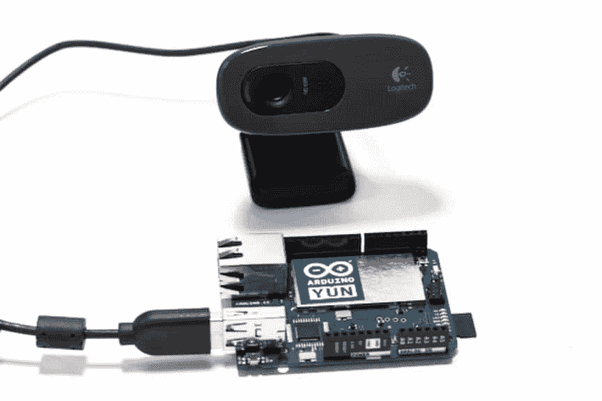
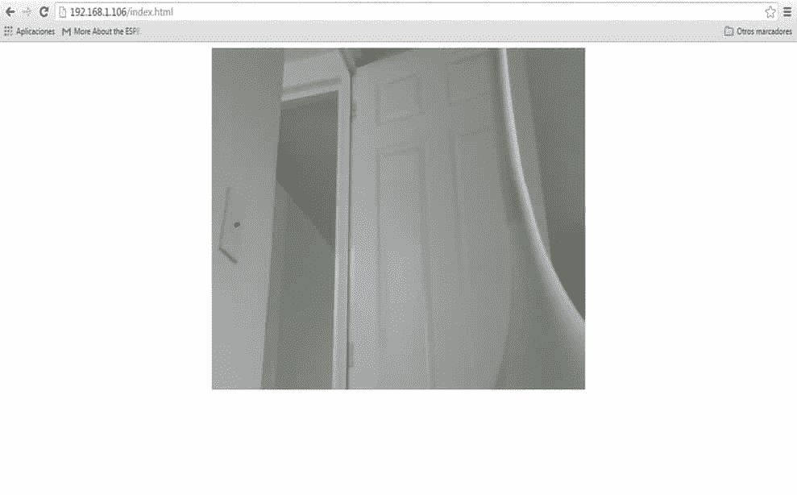

# 五、添加网络摄像头来监控您的安全系统

在前面的章节中，我们讨论了一些主题，例如连接到 Arduino 的传感器和树莓 Pi Zero 的监控，跨设备使用网络，我们的家庭安全项目的重要性，以及监控现实世界中发生的事情的 domotics。为此，我们对这一章有一个建议。

在本章中，我们将配置我们的树莓 Pi Zero 来监控网络摄像头，并安装一个 TTL 串行摄像头来与 Arduino 板交互；我们将通过以下主题实现这一目标:

*   Arduino 与树莓皮的相互作用
*   控制从树莓 Pi 零点连接到 Arduino 的输出
*   将 TTL 串行相机连接到 Arduino，并将图片保存到 Micro SD
*   用串行 TTL 摄像机检测运动
*   从树莓皮控制快照
*   从网页控制您的相机
*   监控您的 USB 摄像头在网络中的安全性

# 【Arduino 与树莓皮的互作

在这一章中，我们将了解树莓 Pi 如何作为终端计算机进行编程，不仅可以将设备作为服务器并部署页面或应用，还可以使用 IDE 对 Arduino 板进行编程。为此，我们需要将树莓皮连接到 Arduino，以便它们可以相互通信。

以下是树莓 Pi 拥有的一些接口，这些都包含在设备中:I2C 协议、SPI 通信、USB 端口和串行 **UART** 端口。在这种情况下，我们将使用 USB 端口在 Arduino 和树莓 Pi 之间进行通信。

以下是配置 Arduino 和树莓 Pi 相互交互的步骤:

1.  为树莓皮安装 Arduino 集成开发环境
2.  用 PuTTY 打开你的终端，检查你的覆盆子 Pi 的 IP 地址
3.  执行远程访问，并键入 IP 地址
4.  在图形界面中打开 Arduino IDE

## 在拉斯扁安装 Arduino IDE

键入以下命令在树莓 Pi 上安装 Arduino IDE:

```js
sudo apt-get install arduino

```

## 远程访问树莓皮

在本节中，我们将查看访问远程桌面以执行安装在 Raspian 操作系统中的 Arduino IDE 的屏幕:一旦屏幕弹出，请键入您的用户名和密码:



## 在图形界面执行 Arduino

现在我们有了主屏幕，我们转到**编程**菜单，如果看到进入 Arduino IDE 的图标，一切都安装好了。点击 **Arduino IDE** 的图标:


# 拉斯平语中的 Arduino 接口

这里我们有 Arduino IDE 的接口，类似于我们在计算机中拥有的接口。从运行在树莓 Pi 中的 Arduino IDE，我们可以在两个板之间进行交互:


## 准备界面

我们需要验证我们选择了合适的电路板；在这种情况下，我们使用的是 Arduino UNO。在以下窗口中选择电路板:



## 选择串口

在我们选择了我们将使用的板之后，我们需要验证并选择将与我们的 Arduino 通信的端口，该端口连接到树莓 Pi 的 USB 端口；我们需要选择名称端口:`/dev/ttyACM0`:


## 从图形界面下载草图

我们需要做的主要事情就是从我们的树莓 Pi Zero 和 Arduino 进行交流，不用电脑就可以把草图下载到 Arduino 板上，这样我们就可以把我们的树莓 Pi 用于其他用途了。

下面的截图显示了草图界面:


我们应该在界面下载草图。下图为连接的 Arduino-rubber Pi:太酷了！



# 控制从树莓 Pi 零点连接到 Arduino 的输出

现在我们将看一个使用 Python 控制树莓 Pi 输出的例子。

首先我们需要将草图下载到 Arduino 板上。为了测试我们的通信，我们将展示一个测试 Arduino 和树莓 Pi 之间的链接的示例:

我们声明以下输出:

```js
int led_output = 13; 

```

我们从程序中的设置开始:

```js
void setup () { 

```

然后我们提到输出引脚:

```js
pinMode(led_output, OUTPUT); 

```

在 9600 开始串行通信:

```js
Serial.begin(9600); 
} 

```

声明程序的循环:

```js
void loop () {
```

这是我们检查串行端口是否可用的地方:

```js
if (Serial.available() > 0){ 

```

如果找到了什么，它会读取什么并将内容保存在`c`变量中:

```js
char c = Serial.read(); 

```

如果它读出一个标记为高的字母`H`:

```js
      if (c == 'H'){ 

```

输出将打开连接到引脚 **13** 的发光二极管

```js
digitalWrite(led_output, HIGH); 

```

如果它读取一个标记为低的字母`L`:

```js
}  
else if (c == 'L'){ 

```

输出将关闭连接到引脚 **13** 的发光二极管:

```js
         digitalWrite(led_output, LOW); 
      }  
   } 
} 

```

# 用 Python 控制 Arduino 板

首先，我们需要安装串行库，因为这有助于通过 USB 端口通信与 Arduino 通信。键入以下命令安装库:

```js
sudo apt-get install python-serial

```

下面的代码控制来自树莓 Pi 的 Arduino 现在，您可以将代码复制到名为`ControlArduinoFromRasp.py`的文件中，或者直接从这个项目的文件夹中获取完整的代码。

以下代码片段导入 Python 中的串行库:

```js
import serial 

```

我们定义串行通信:

```js
Arduino_UNO = serial.Serial('/dev/ttyACM0', 9600) 

```

打印一条消息，查看通信是否完成:

```js
print("Hello From Arduino!") 

```

在此过程中，用户可以输入命令:

```js
while True: 
      command = raw_input('Enter the command ') 
      Arduino_UNO.write(command) 

```

如果是`H`则打印消息；如果为假，则显示指示灯熄灭:

```js
      if command == 'H': 
            print('LED ON') 
      elif command == 'L': 
            print('LED OFF') 

```

关闭连接:

```js
arduino_UNO.close() 

```

## 硬件连接

这是连接到 Arduino UNO 的 LED，可以使用 Python 从树莓 Pi 进行控制:



# 将 TTL 串行相机连接到 Arduino，并将图片保存到微型 SD

这里有一个模式，微型 SD 卡与 TTL 串行相机的连接；我用的是 ada 水果的相机模型。以下链接有你需要的所有信息，[https://www.adafruit.com/product/397](https://www.adafruit.com/product/397)。在下图中，我们有项目的连接:



现在我们将解释如何拍照并保存到微型 SD；主要思想是将摄像头连接到 Arduino，这样我们就可以在家庭安全的监控系统中实现这一点。

以下是测试 TTL 相机、拍照并保存在微型 SD 上的代码。请注意，代码太长了，但我将解释做前面的动作最重要和必要的代码。这些例子的所有代码都包含在书中，以获得更完整的信息。

这里我们有来自 TTL 摄像机的导入文件，以及与 micro SD 通信的文件:

```js
#include <Adafruit_VC0706.h> 
#include <SPI.h> 
#include <SD.h> 

```

我们定义了通过串行通信的库软件:

```js
// comment out this line if using Arduino V23 or earlier 
#include <SoftwareSerial.h>        

```

定义`chipSelect`至引脚 10:

```js
#define chipSelect 10 

```

代码将锁定连接:

```js
SoftwareSerial cameraconnection = SoftwareSerial(2, 3); 
Adafruit_VC0706 cam = Adafruit_VC0706(&cameraconnection); 

```

然后我们需要启动摄像机:

```js
  if (cam.begin()) { 
    Serial.println("Camera Found:"); 
  } else { 
    Serial.println("No camera found?"); 
    return; 
  } 

```

这里我们定义图像大小:

```js
    cam.setImageSize(VC0706_640x480); 

```

这将显示图像大小:

```js
  uint8_t imgsize = cam.getImageSize(); 
  Serial.print("Image size: "); 

```

代码会拍一张照片:

```js
  if (! cam.takePicture())  
    Serial.println("Failed to snap!"); 
  else  
    Serial.println("Picture taken!"); 

```

创建文件以保存拍摄的图像:

```js
  char filename[13]; 

```

保存文件的代码:

```js
  strcpy(filename, "IMAGE00.JPG"); 
  for (int i = 0; i < 100; i++) { 
    filename[5] = '0' + i/10; 
    filename[6] = '0' + i%10; 

```

准备微型 SD 以保存文件:

```js
if (! SD.exists(filename)) { 
      break; 
    } 
  } 

```

打开用于预查看的文件:

```js
  File imgFile = SD.open(filename, FILE_WRITE); 

```

要显示拍摄图像的大小:

```js
  uint16_t jpglen = cam.frameLength(); 
  Serial.print("Storing "); 
  Serial.print(jpglen, DEC); 
  Serial.print(" byte image."); 

```

从文件中读取数据:

```js
  byte wCount = 0; // For counting # of writes 
  while (jpglen > 0) { 

```

将文件写入内存:

```js
    uint8_t *buffer; 
    uint8_t bytesToRead = min(32, jpglen); 
    buffer = cam.readPicture(bytesToRead); 
    imgFile.write(buffer, bytesToRead); 

```

在屏幕上显示文件:

```js
    if(++wCount >= 64) { 
      Serial.print('.'); 
      wCount = 0; 
    } 

```

显示读取的字节数:

```js
Serial.print(bytesToRead, DEC);  
Serial.println(" bytes"); 
jpglen -= bytesToRead; 
  } 

```

关闭打开的文件:

```js
imgFile.close(); 

```

# 用串行 TTL 摄像机检测运动

打开 TTL 摄像机的运动检测:

```js
  cam.setMotionDetect(true); 

```

验证运动是否被激活:

```js
  Serial.print("Motion detection is "); 
  if (cam.getMotionDetect())  
    Serial.println("ON"); 
  else  
    Serial.println("OFF"); 
} 

```

当摄像机检测到运动时会发生什么:

```js
if (cam.motionDetected()) { 
   Serial.println("Motion!");    
   cam.setMotionDetect(false); 

```

如果检测到运动，拍照或显示信息:

```js
  if (! cam.takePicture())  
    Serial.println("Failed to snap!"); 
  else  
    Serial.println("Picture taken!"); 

```

# 从树莓皮控制快照

现在我们已经看到了如何在 Arduino 和 rubber Pi 之间进行通信，以控制电路板，我们可以将此应用到我们的安全系统项目中。我们需要这样做，以便通过树莓皮与我们的摄像机进行通信和控制:

*   将 Arduino 和树莓皮相互连接
*   以 9，600 mbps 的速度创建串行连接
*   调用将拍摄照片并将其保存在微型 SD 中的功能

在树莓皮上，我们需要做以下工作:

*   在 Arduino 中创建调用函数的脚本，该脚本将拍摄图片
*   使用 PuTTY 终端打开并执行脚本

以下部分是应在 Arduino 板上下载的草图:

首先，我们开始串行通信:

```js
void setup () { 
    Serial.begin(9600);  
} 

```

这是告诉相机拍照的功能:

```js
void loop () { 
   if (Serial.available() > 0) { 
      char c = Serial.read(); 
      if (c == 'T') {  

      takingpicture(): 

      }  
   } 
} 

```

## 拍照功能的代码

这里我们讨论定义提示相机拍照的功能的代码。

该函数具有拍摄照片的代码:

```js
void takingpicture(){ 

```

拍照:

```js
  if (!cam.takePicture())  
    Serial.println("Failed to snap!"); 
  else  
    Serial.println("Picture taken!"); 

```

在这里，我们创建要保存的文件:

```js
  char filename[13]; 

```

我们在这里保存文件:

```js
  strcpy(filename, "IMAGE00.JPG"); 
  for (int i = 0; i < 100; i++) { 
    filename[5] = '0' + i/10; 
    filename[6] = '0' + i%10; 

```

准备微型 SD 以保存文件:

```js
if (! SD.exists(filename)) { 
      break; 
    } 
  } 

```

打开文件进行预览:

```js
  File imgFile = SD.open(filename, FILE_WRITE); 

```

保存前获取文件的大小:

```js
  uint16_t jpglen = cam.frameLength(); 
  Serial.print("Storing "); 
  Serial.print(jpglen, DEC); 
  Serial.print(" byte image."); 

```

从保存的文件中读取数据:

```js
  byte wCount = 0; // For counting # of writes 
  while (jpglen > 0) { 

```

将文件写入内存:

```js
    uint8_t *buffer; 
    uint8_t bytesToRead = min(32, jpglen); 
    buffer = cam.readPicture(bytesToRead); 
    imgFile.write(buffer, bytesToRead); 

```

保存后显示文件:

```js
    if(++wCount >= 64) { 
      Serial.print('.'); 
      wCount = 0; 
    } 

```

显示读取的字节数:

```js
Serial.print(bytesToRead, DEC);  
Serial.println(" bytes"); 
jpglen -= bytesToRead; 
  } 

```

关闭打开的文件:

```js
imgFile.close(); 
}
```

# 从网页上控制你的相机

在这一节中，我们将学习如何在 PHP 的网页中控制我们的相机，并在树莓 Pi 中运行一个网络服务器。我们将需要以下内容来运行 PHP 文件和网络服务器:

*   在树莓 Pi 上运行 Apache 服务器
*   安装 PHP 软件

对于网页，为了控制，我们必须在以下路径中创建我们的 PHP 文件:`/var/www/html`，例如，我们需要编辑`index.php`文件，并复制以下行。

下面的 HTML 文件包含 PHP:

```js
<!DOCTYPE html> 
<html> 
 <head> 
 <title>Control Camera</title> 
 </head> 
  <body> 

```

这里我们定义了执行拍照动作的功能:

```js
<form  action="on.php">   
  <button type="submit">Taking the picture</button> 
  </form> 

```

这里，我们定义了在检测到运动时要采取的措施:

```js
  <form action="off.php">   
  <button type="submit">Motion</button> 
  </form> 
</body> 
</html> 

```

## 从 PHP 调用 Python 脚本

在本节中，我们需要从网页中调用 Python 脚本，并执行包含该脚本的文件:

```js
<?php 
$prende= exec('sudo python on.py'); 
header('Location:index.php'); 
?> 

<?php 
$apaga = exec('sudo python motion.py'); 
header('Location:index.php'); 
?> 

```

## Python 脚本的代码

在服务器端，也就是树莓皮，我们有 Python 脚本，可以从网页上调用:

```js
import serial 
import time 
Arduino_1 = serial.Serial('/dev/ttyACM0',9600) 
Arduino_1.open() 
Command='H' 
if command:    
    Arduino_1.write(command) 
Arduino_1.close() 

import serial 
import time 
Arduino_1 = serial.Serial('/dev/ttyACM0',9600) 
Arduino_1.open() 
Command='L' 
if command:    
    Arduino_1.write(command) 
Arduino_1.close() 

```

如果一切配置完善，会出现如下页面:在你喜欢的浏览器中，输入你的`PI/index.php`的 IP 地址:


# 监控您的 USB 摄像头在网络中的安全性

在本节中，我们将创建一个项目，允许我们监控连接到 Arduino YUN 的 USB 摄像机，该摄像机具有 USB 端口，并包括与以太网和 Wi-Fi 的通信。所以，它有很多优点。我们将致力于在树莓皮和 Arduino YUN 之间建立一个网络，所以主要的想法是从一个网页上监控摄像头，从树莓皮。该页面将存储在树莓皮中。

## 配置 Arduino YUN

我们将使用支持 UVC 协议的罗技相机:



现在我们将解释在 Arduino YUN 中安装相机的步骤:

*   将主板连接到无线路由器
*   验证 Arduino YUN 的 IP 地址

输入 IP 地址后，将出现以下屏幕:


我们现在将在命令提示符下发出一系列命令来完成设置:

更新包:

```js
opkg update

```

安装紫外线控制协议:

```js
opkg install kmod-video-uvc

```

安装摄像机驱动程序:

```js
opkg install fswebcam

```

下载`Mjpgstreamer`:

```js
wget http://www.custommobileapps.com.au/downloads/mjpgstreamer.Ipk

```

安装`Mjpgstreamer`:

```js
opkg install mjpg-streamer.ipk

```

要手动启动摄像机，请使用以下代码:

```js
mjpg_streamer -i "input_uvc.so -d /dev/video0 -r 640x480 -f 25" -o
"output_http.so -p 8080 -w /www/webcam" &

```

要自动启动摄像机，我们将使用以下代码:

安装`nano`程序:

```js
opkg install nano

```

输入以下文件:

```js
nano /etc/config/mjpg-streamer

```

使用以下参数配置摄像机:

```js
config mjpg-streamer core   
option enabled    "1"   
option device    "/dev/video0"   
option resolution  "640x480"   
option fps    "30"   
option www    "/www/webcam"   
option port    "8080" 

```

使用以下命令启动服务:

```js
/etc/init.d/mjpg-streamer enable
/etc/init.d/mjpg-streamer stop
/etc/init.d/mjpg-streamer start

```

## 来自 MJPG-STREAM 服务器的监控

一旦你访问了 Arduino YUN 的服务器，在你的网络浏览器中输入你的 Arduino YUN 的 IP 地址`http://Arduino.local:8080`。配置结果如下图所示:


## 从树莓皮监控 USB 摄像头

随着摄像头连接到 Arduino YUN，现在我们可以从树莓 Pi 上发布的网页进行实时监控。

为网页提供标题:

```js
<html> 
<head> 
<title>Monitoring USB Camera</title> 

```

我们把 Arduino YUN 的 IP 地址称为摄像机图像:

```js
</head> 
<body> 
<center> 
 
</center> 
</body> 
</html> 

```

通过键入树莓皮的 IP 地址从浏览器访问网页(`http://192.168.1.106/index.html`):



在下一节中，我们将了解如何配置连接的设备和将在网络中交互的硬件。

下图表示我们使用可监控的设备创建的网络；例如，我们监控一所房子的每个房间，用无线网络连接所有设备，并从树莓皮监控它们:


# 总结

在本章中，您已经学习了如何配置连接到网络的网络摄像头，以及如何监控物联网的安全系统。我们用你的 Arduino 板连接安全摄像头，树莓 Pi Zero 连接网络监控系统。在下一章中，我们将把我们的系统树莓 Pi Zero 与 Arduino 集成，以构建一个完整的系统连接设备和显示器。