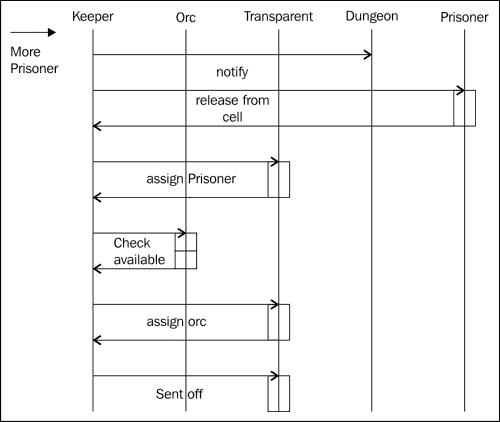
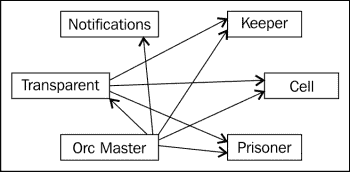

# 二、找到核心问题

每一个软件都是为了解决一个问题而编写的，反过来又是这个问题的完美有效的解决方案。 遗憾的是，一个软件完美解决的问题并不总是软件最初设计时所考虑的问题，甚至不是程序员在编写软件时所考虑的问题。 编程的历史上有很多这样的例子:开发人员尝试了各种方法，首先找到一种能够完美地陈述问题的方法，然后实现解决方案。 基于瀑布模型开发软件就是有一个很好的想法却未能实现承诺的一个很好的例子。 当您询问有关失败的各方时，根据一方的说法，原因很可能是问题偏离了规范，或者规范被误解了，这是一种非常明显的方式。 这是为什么呢?

当开始一个软件项目，特别是一个由业务需求驱动的项目时，我们开始对现实世界的一部分建模，并对其应用一组约束条件和算法，以减轻业务中一个或多个参与方的工作。 问题在于，开发者试图解决的问题的一方很可能不是开发者。 这意味着开发人员首先必须了解请求的真正含义，才能真正知道应该开发什么。

在客户(很可能)没有多年经验的情况下，我们如何对业务的某个部分有足够深入的了解? 解决这个问题的方法，也是最有可能的问题，就是沟通。 我们需要找到一种足够深入地探索问题的方法，并以我们如何在软件中建模世界的知识为后盾，以便能够提出正确的问题。 我们需要这样做，我们不会失去非技术人员，这样我们就可以从他们的理解中吸取教训。 这又回到了开发人员和业务人员之间的语言不匹配，这可能是需要克服的最大障碍。 在领域驱动设计中，这被称为项目的**通用语言**，是项目中所有参与者共享的语言。 建立这种语言使我们能够跨团队边界清晰地沟通，正如前面所提到的，这是领域驱动设计的核心思想之一。

回到我们关于兽人管理地下城的例子，我们不知道这是如何做到的; 我们甚至不完全理解文化方面涉及或应用的限制。 在兽人的世界里，我们是一个局外人，只能观察，问问题，并根据我们的理解来塑造它。 我们自然得信任当地的专家。 尽管在现实世界的问题中，我们并不是一个局外人，但我们应该总是尽可能地从外部来看待问题，因为在一个需要多年发展的业务中，我们自己的假设很可能是错误的。

在下面的文章中，我们将探讨这个问题，并介绍一组有助于解决这个问题的工具。 我们将涉及几个方面，但最重要的是以下几点:

*   使用纸和笔进行编程
*   代码峰值和一次性代码
*   将我们的参与者映射到外部——为我们的域创建一个依赖关系图

# 探索问题

在软件开发中没有多少问题可以很容易地完全指定。 即使是为数不多的几个似乎也留下了解释的空间。 最近，当我在一个项目中实现数据库适配器时，我就遇到了这个问题。 有一个需要实现的规范，以及一组确保实现符合规范的单元测试。 然而，在我实现它的过程中，我发现自己一直在问问题。 主要的问题与我在没有规范的情况下会问的问题非常相似:人们将如何使用这段代码? 在很多情况下，实现某个特性有多种方法，但选择其中一种通常意味着要权衡不同的利弊，比如速度、可扩展性和可读性。

在我们的兽人地下城中，我们必须问同样的基本问题:客户端将如何使用我们的软件? 遗憾的是，这个问题本身不会产生我们所想的结果。 问题是我们的用户不了解我们的软件。 基本上，我们未来的用户会遇到和我们一样的问题:他们不知道软件完成后会是什么样子，但只能猜测它的用途。 这确实是软件开发中的*catch 22*; 因此，为了成功，我们需要找到一种方法。 作为开发人员，我们需要找到一种方法，让我们的未来用户能够掌握开发过程，我们的未来用户需要适应我们使用的高度描述性语言的概念，以尽可能清楚地表达意图。

软件确实是一个抽象的概念，大多数人不习惯谈论抽象的东西。 所以，要更好地理解它，第一步是让用户更容易接近它。 我们需要让概念*可触碰*; 这可以通过多种方式实现，但触觉越强越好。

### 提示

使用纸。 作为开发人员，我们通常更喜欢无纸化，但将内容写在纸上会让大多数人更容易理解概念，所以将内容写下来会非常有帮助。

## 概述问题

就说明和组织信息的技巧而言，*概述*在许多情况下证明是有用的。 但是，我们如何描述软件呢? 其思想是将与业务专家交谈时出现的所有信息以一种易于搜索的格式保存下来。 在许多地方，这是一个*wiki*，但它也可以只是一组共享的文本文件，当需要添加或检索信息时，可以随时访问这些文件。 这里的概述意味着存储按主题嵌套的信息，并根据需要进行深入挖掘。

### 跟踪知识

在开始收集信息时，最重要的部分是尽可能多地收集信息，而要做到这一点，就需要做到无缝对接。 保持信息的组织也是很重要的，以便根据需要添加和重组信息。 就像我们的软件一样，我们不知道开始时大纲的结构，所以当我们识别一个新的实体、参与者或系统的任何重要部分时，我们只是添加一个新的部分。 因此，不要花太多时间去完善当前的结构，而要让它足够好。

### 提示

养成收集你遇到的任何信息的习惯，并将应用大纲放在手边。 在许多公司中，走廊通道通常是非常有价值的信息来源，所以一定要使用它。

让大纲如此有用的是，你可以轻松地重组它，这也是你在决定使用工具来保存这些大纲笔记时应该考虑的。 重新整理笔记需要快速和直观。 现在的目标是尽可能降低改变的成本，这样我们就可以很容易地探索不同的路径。

我们目前所收集到的地下城信息如下:

```js
# Dungeon
receives prisoners
transfers from other dungeons
new captures
loses prisoners
transfers to other dungeons
fleeing
prisoners might flee during transfer
prisoners might flee from the dungeon itself
```

重要的是，这个结构很容易修改，并且随着新信息的到来而更新，我们已经可以看到一个新的实体从轮廓中出现了——囚犯。 有了这个新信息，我们现在将其添加到大纲中，以便有一个地方容纳更多关于囚犯的信息，因为他们显然是我们的地下城应用的一个重要概念。

```js
# Prisoner
can flee a dungeon or transport
needs a cell
is transferred between dungeon
```

这就是大纲的基本内容，记录信息并快速得出结论。

### 介质

根据不同的情况，不同的媒体可能或更可取的持有信息。 这可以从一张纸延伸到一个完整的 wiki 系统。 我更喜欢使用的格式是**Markdown**，它的优点是可以以纯文本的形式存储，无需处理就可以非常容易读懂。 另外，要生成要打印的文档，最好先将其处理为 HTML。 这绝不是最终的选择，您应该选择最自然的，只要它是简单的编辑和易于在尽可能多的地方可用。 有一件事很重要，那就是选择一个系统，它不会把你束缚在它做事的方式或难以导出或更改的数据格式中。

## 纸张编程

在我们寻求让非程序员参与软件创造过程的过程中，重要的是让概念易于理解。 我们需要说明交互以及系统的参与者，并让他们随时可以移动。 通常情况下，当人们谈论一个话题时，有一个东西可以握在手里并在桌子上移动，这是很有帮助的。 实现这一点的最佳方法是创建系统元素的纸质表示。 创建一个纸质的、手工操作的版本，可以当场触摸和交互。 这通常来自 UI 设计，纸上原型是很常见的东西，但它也适用于创建应用的非 UI 部分。

这个想法是在卡片上画出系统的任何部分，然后进行组合、分离和添加。 当这一步完成后，它通常会非常接近我们在系统中稍后会用到的实体表示。 当开始使用这种技术时，重要的是要注意最终结果总是处于某种状态。 当事物在表中移动时，当元素被修改时，我们需要跟踪生成的信息。 确保在讨论过程中记录下特定行动的发展，最终结果只是反映了一种状态。

### 那么，这样一个书面程序是如何工作的呢?

当开始时，我们列出我们当前拥有的所有信息，为所有元素绘制框，并为它们命名。 在我们的情况下，我们将引出地牢，囚犯，牢房和运输工具。 目前，这些是我们与之互动的实体。 此时，我们考虑一个特定的交互，并尝试用我们当前拥有的实体和其他对象来表示它。 让我们把一个囚犯从地牢转移到另一个地牢; 要做到这一点，我们需要思考我们必须做什么:

*   地下城守卫通知另一个地下城
*   囚犯从牢房转移到运输车上
*   一个兽人被派去守卫运输船
*   传送器会去另一个地牢

当把它画在纸上时，结果可能看起来有点像这样，其中的数字是步骤出现的顺序:


此时，我们已经注意到多个部件丢失了，主要是地下城守护者和通知其他地下城的方法。 那么，这些如何添加呢? 地下城守护者显然是管理地下城的实体，所以应该添加一张单独的卡片。 此外，通知是通过消息完成的，所以我们添加了一个消息传递系统。 这是一个新的子系统，但我们现在可以把它看作一个黑盒，我们可以将消息放入其中，使它们到达另一端。

现在系统已经就位，我们可以为系统的参与者添加所需的方法:地下城守护者，为了请求转移，需要发送消息的方法; 牢房需要放弃囚犯的*所有权*; 运输需要拥有所有权; 等等。 当我们进行这种交互时，我们可以清楚地看到建模的一种可能方式，这对于非开发人员来说也更容易接近，因为他们看到实际的盒子在表格中移动。 由于这个模型是不断变化的，所以一定要在大纲中记笔记，以免丢失任何新获得的信息。

## 没有那么可怕的 UML

我们的论文，一个原型，给了我们一个很好的交互画面，我们的大纲捕获了很多关于程序在不同情况下应该如何表现的信息。 它还从业务的角度捕捉事物命名方面的细节。 总而言之，这给了我们很多很好的洞察力，但仍有一部分缺失。 这使得我们的纸上原型的信息足够持久，所以我们在前进时可以更容易地参考它。 我们之前绘制的原型缺少一些对实现很重要的信息。 我们需要捕获更多应用的结构。

这就是**统一建模语言**(**UML**)发挥作用的地方，是的，这个可怕的瀑布注入实践，我们大多数人从来没有想过是有用的。 当谈到 UML 时，它经常被引用为在图中编码所有建模信息的想法; 所以最终代码可以由基本上每个有一定编码技能的人生成和填写。 当然，这是行不通的，但是 UML 仍然有一些有趣的属性使它变得有用。 我们要做的是利用 UML 的一个属性，这就是以简洁的形式捕获交互的能力。 UML 定义了多个类别的图:

*   结构图
*   行为图
*   交互图

**结构图**主要集中在系统中的参与者及其关系上。 在我们的例子中，它将表达守护者与地下城和其他半兽人的关系。 当涉及许多参与者时，这可能很有帮助，但不一定是最重要的信息。


用例图给出了系统中参与者的稍微详细的图片，以及他们彼此之间的交互。 用例图是行为图家族的一部分，因此着重于参与者的行为。 这不仅是我们系统的有用信息，而且在表达信息流和操作时过于粗粒度。


因为我们的特性确实涉及到系统中定义的参与者之间的交互，所以我们需要探索的是事件在系统中发生的顺序。 为此，我们可以使用序列图，这是 UML 中的一种交互图。 这类图表关注的是实现某个目标所需发生的事件的顺序。 其中一些可能是异步的，一些需要等待响应; 所有这些都可以在一个图表中体现出来:



有了这种说明，很容易区分同步和异步消息传递，因此我们可以确定相应的方法建模。 另外，命名是计算机科学中最困难的问题之一，所以一定要向您的领域专家展示这一点，从他们的语言中提取出现在公开的消息和方法的名称。

到目前为止，每个部分的想法都是从不同角度探索问题的工具，但不要喝太多的 Kool-Aid! 我们并不试图创建整个系统的完整描述，而是对其中一部分进行足够深入的探索，以便我们能够了解它的核心功能是什么，以及如何实现它。 然后，我们可以通过提出正确的问题来消除不确定性，因为我们对这个领域非常了解，这样我们就能够与专家一起探索这个业务领域。

# 专家参与

当我们从各个角度探索这个领域时，与尽可能多地了解它的人交谈是很重要的。 领域驱动设计的核心思想之一是围绕领域创建一种可以由相关各方使用的语言。 在讨论这些工具时，我们打算以这样一种方式创建它们，即开发人员和领域专家都可以平等参与，这样每个人都可以从对方的知识中汲取知识来解决问题。

口语本身就是个问题，所以对于开发人员来说，语言需要尽可能明确，因为需要表达非常具体的想法。 不应该有误解的余地。 另一方面，对于业务人员来说，它需要让这些非技术人员能够理解。 现在到了重要的部分，我们实际上要看看我们到目前为止是否已经实现了这个目标，以及我们如何能够来回地交流这个领域的思想。

当涉及到某个领域的专家时，我们首先应该清楚地知道我们要达到的目标是什么，比如获得关于我们目前正在开发的系统的知识。 对于开发人员来说，让他们的系统发光是一种自然的趋势，但我们的目标是暴露我们迄今为止在设计和理解中存在的误解和不确定性。 可以说，我们实际上是想让人措手不及。 对于项目的当前阶段来说，这应该被视为一项成就。 现在，改变是最便宜的，所以如果我们暴露了我们知识上的某种差距，我们的生活就会变得更容易。 现在暴露出误解也意味着我们能够提出所有正确的问题，这样我们就能够成功地传达软件系统的抽象思想; 因此，业务方面能够深入我们的系统并纠正缺陷。 如果我们达到了这一点，非开发人员实际上也参与了开发，我们可以继续开发一个非常适合的系统。 那么，我们如何做到这一点呢?

## 寻找差距

我们现在要做的第一件事是让对话开始。 对于大多数问题，最好是在一个多元化的群体中思考，这样我们就能得到最多的观点。 为了达到这个目的，我们希望创建一个环境，业务领域专家可以向我们解释正在发生的事情。 我们现在可以使用所有不同的技术，以一种可访问的方式来谈论我们的软件。 在这个阶段，纸上编程的想法非常有用。

所以首先我们需要准备，确保所有已经确定的单位都准备好了。 准备好卡片，让每个人都可以移动，并在卡片上写下行动和知识中的差距。 拍一张当前状态的照片，并附上注释，以保存状态，以便在想法发展时参考，这也是很有帮助的。 对话可以从开发人员解释他们认为系统是如何工作的开始，鼓励业务专家在有不清楚或完全错误的地方插话。 这真的可以成为一种游戏。 我们想要表达的动作如何用可用的片段来表达? 当然，这不是一个谜题，所以您可以随意创建新的碎片，并根据需要更改它们。 以这种方式指导整个过程，很可能会在系统中公开几个有价值的属性。

### 提示

精确是关键所在; 一定要问一些问题，比如*，这就是 100%的时间是怎么做到的? as often as possible 尽可能多地*

所以，让我们通过我们的软件的一个示例功能:转移一个囚犯到另一个地牢。

### 谈生意

转移囚犯的过程分为三个步骤:

1.  地下城守卫通知另一个地下城。
2.  囚犯从牢房转移到运输车上。
3.  传送器会去另一个地牢。

我们准备了一些卡片:

*   由信封标识的通知服务
*   地牢里的细胞
*   囚犯
*   运输

有了可用的纸牌，我们就可以让兽人主人准确地描述囚犯转移时需要发生什么。

兽人大师发现了这个问题，如下图所示，并发送了一只乌鸦通知转移到地下城。 然后他去牢房将囚犯转移到运输上，指派一个兽人守卫运输并将其送往另一个地牢。

在这个简短的描述中，我们看到了需要处理的模型的多个不同之处。

1.  1 和 2 的顺序实际上并不重要，只要地牢中至少有一个囚犯，我们可以在通知时间检查。
2.  这还涉及到另一种稀缺资源，这些是负责运输的警卫; 它们需要是可用的，它们的流入和流出需要被跟踪。

有了新的见解，我们现在可以相当准确地将这个事件建模为我们系统中的参与者。 值得注意的是，我们的系统当然不需要在代码中直接表示流，但是，从高层的观点来看，具有一致的流是有意义的，因为它已经通过(可能)多年的实际使用建立了自己。 因此，它至少是一个好的点，毕竟。

## 谈论演员

当谈到如何实现某个特性时，涉及到几种形式的对象，它们在系统中都有特定的角色。 许多这样的角色存在于许多系统中，尽管它们的名称可能不同。 在领域驱动的设计中，这些角色的分类有很大的不同。 原因是，如果我们对某样东西进行分类，有一组特定的模式可以立即应用，因为它已经证明自己是有用的。 这与在企业应用中出现的模式命名的思想非常相似，到目前为止，这几乎是大多数应用开发人员的基本知识。

在领域驱动设计中，我们有多个构建块可供选择:

*   实体
*   值对象
*   总
*   域的事件
*   服务
*   存储库
*   工厂

作为开发人员，这个列表中的大多数元素可能已经对您有意义，但如果没有，我们将在后面更明确地定义每一个元素。 现在，让我们关注我们需要的并且我们已经在系统中使用的事件:聚合事件、值对象事件和域事件。

一个重要的区别是实体和值对象之间的区别。 实体由其标识定义，值对象则由其属性定义。 回到我们的囚犯和牢房，我们可以看到使用这两种分类都是可能的，但它改变了重点。 如果一个囚犯是一个实体，那么每个囚犯都有明确的定义，两个囚犯永远是不同的。 像这样对他们进行分类可以让玩家在整个系统中追踪到囚犯，因为他们从一个地牢移动到另一个地牢，从一个牢房移动到另一个牢房。 这可能真的很有用，但也可能是一种过度杀伤。 这就是当前阶段所要做的——从领域的角度找到项目的焦点。 所以，让我们一步一步地走过整个过程。

从外到内，我们首先要考虑域事件。 顾名思义，这是触发域的特定反应的事件; 在我们的案例中，这是囚犯的转移。 要处理这些事件，我们必须向下移动一层，考虑系统中处理资源事务的部分，即聚合。 可以说，它们是系统中的参与者，因为它们聚集了所有需要的实体、价值对象以及向外部世界呈现一致视图所需的其他一切。 聚合还负责根据领域的需要改变系统中的状态。 就聚集而言，有许多人负责行动:地下城守护者管理细胞、囚犯和守护者，以及移动细胞、囚犯和守护者。 向其他地下城发送的通知位于系统之外，所以将其归类为服务似乎是一件很自然的事。 这并不难，思考不同物体的分类是很自然的。

使用所提供的领域术语可以让我们清楚地陈述预期的重点和部件级别。 其他开发人员，即使他们不熟悉系统，现在也可以从每个命名的实体中假定给定的特性集。 对我们来说，命名是一种文档形式，它允许我们在开始混合概念时迅速注意到。

# 识别困难的问题

在上一节中，我们开始深入了解系统中的交互。 现在是时候利用这种理解并继续实现我们的软件解决方案了。 那么，在开发软件时，我们应该从什么开始呢?

通常，当项目启动时，我们喜欢从简单的部分开始，也许从模板创建一个项目——例如，在一个新文件夹中运行一个框架代码生成器，如 Node.js Express，以设置我们的项目脚手架结构。 乍一看，这似乎是一个非常好的选择，因为它创建了大量样板代码，否则创建 Express 项目就必须编写这些代码。 但是，它是否更接近于解决业务问题呢? 我们现在有一个代码库来探索，但是，由于它是自动生成的，我们显然没有任何特定于领域的代码。 另一方面，我们把自己锁在了一个固定的结构里。 对于某些项目来说，这是一件好事; 这意味着有更少的事情要考虑。 然而，如果我们试图解决一个较低层次的问题，那么将自己锁在一个特定的心态中无疑是不好的。

我们需要识别问题，并确定如何尽可能快地向业务交付价值。 这将进一步推动用户采用和开发该软件。 到目前为止，我们已经探索了该领域的一部分，它似乎对我们的业务非常重要，因此我们将其作为我们的第一个特性进行探索。 现在，是时候深入了解核心问题所在了，看看将涉及的对象以及它们与我们的软件的交互。

## 映射依赖关系

从我们之前的工作中，我们对所涉及的对象有了相当清晰的了解，至少在一个较高的水平上:

*   通知服务
*   细胞
*   囚犯
*   门将
*   兽人的主人
*   运输

考虑到这些，我们现在的任务是找到一个起点。 当布局这些对象时，很明显它们都依赖于其他部分，我们可以利用这一点。 我们画出每个对象，用箭头来说明它依赖于哪些对象。 这就是所谓的**依赖图**:



这个图向我们展示了我们所确定的每个参与者的依赖关系。 例如，守护者对于运输和兽人主人来说都是必要的依赖。 另一方面，兽人主人不仅依赖于守护者，还依赖于运输工具、囚犯和牢房。 通过这个图，我们可以看到需要实现的元素的顺序。 我们之前确定为聚合的元素当然会有最多的依赖。 顾名思义，它们将多个对象聚合到一个单元中以进行公共访问和修改。

解决这个问题的一种方法是按以下顺序开始:

1.  门将。
2.  细胞。
3.  囚犯。
4.  交通工具。
5.  通知服务。
6.  兽人的主人。

好的事情是，在这个过程中，只要有一个聚合体处于正常工作状态，我们就可以呈现一个中间状态。 例如，我们可以讨论我们关于运输的想法，并将其与预期的特征相匹配。 这里的工作条件是很重要的一点，因为人们很难判断一个特定的作品，如果它在多个方面不满足要求。 当然，“工作条件”并不意味着我们实际看到了一些东西，而是随着软件变得越来越复杂，我们能够使用这些聚合体在它们设计的操作中发挥作用。 例如，我们可以创建一个快速原型，该原型重播业务团队指定的一些交互。 当然，这与测试、特性验收测试或行为驱动开发是密切相关的。

### 提示

向领域专家呈现中间状态需要涉及对特性的指导，以及在过程中提出问题。 把部分实现的软件*扔过栅栏*几乎没有任何用处。

## 绘图与代码尖峰

在我们有了从哪里开始开发的想法之后，我们终于可以探索如何进行开发了。 当我们思考这个问题时，我们可能知道它是如何运作的，但也会有一些片段，尽管我们知道高层是如何运作的，但我们不清楚下层是如何运作的。 当开发人员不知道某些东西在现实中是如何工作的时候，弄清楚该做什么最好的方法是实际地尝试它，并探索在此过程中被认为有用的库和工具。

这种方法称为**突刺**。 我们创建了一个一次性代码，它只是用于探索某个困难的部分，而没有将此代码投入生产的意图。 这将我们从创建生产就绪代码时经常涉及的许多复杂问题中解放出来。 代码的存在只是为了解决特定的情况，并帮助我们获得以后如何解决相同问题的知识。 大多数开发人员都知道，第一种方法几乎从来都不是问题的完美解决方案，所以让我们通过创建打算丢弃的第一个版本来处理这个事实。 一个峰值是关于知识的获取，而不是关于代码，所以准备写一些快速和肮脏的东西，只是让它工作。 顺便说一下，这实际上是一个非常有趣的练习!

spike 的一个常见领域是与外部服务的交互，比如我们的通知服务，其中的接口在高层是已知的，但开发人员实际上从未使用过它。 由于我们不知道如何与乌鸦接口，我将暂时离开这个。 当情况出现时，我们需要重新考虑这个问题，但是，正如我们从 UML 图中学到的，无论如何，这个过程是异步的。 因此，在我们的第一个原型中，我们不期望响应可以隐藏在*Mock*后面。

另一个有趣的问题是如何在我们的代码和用户之间创建接口。 我们不能确定用户想要如何与软件交互，因为没有任何类似的使用经验。 界面也能让我们更深入地了解用户想从软件中得到什么。 用户想要使用软件的方式教会了很多关于他的重点和期望的特性，所以点击它是了解更多关于系统的好方法。 这一峰值可以通过多种方式实现，但如果能够在此基础上添加真正的界面元素，并在之后添加更多交互，则会非常有用。 其中一种方法是用 HTML 创建接口，它提供了基本的结构，但没有交互性，并在我们继续前进时用 JavaScript 填补空白。 为了简洁起见，省略了这段代码。 如果您感兴趣，请访问这本书的代码存储库并查看它。

请记住，这实际上不是我们想要保留的界面，但我们现在可以向用户展示一些东西，并解释他们将如何交互。

# 开始吧，是时候了

在完成之前的工作后，我们现在可以开始处理应用的第一个特性了。 我们根据需要探索了我们的想法，现在我们可以与领域专家讨论细节了。 我简化了步骤以达到这里的目的，因为我们只讨论了一次迭代。 实际上，这个过程很可能需要多次迭代，在此过程中，您自己对问题的理解会不断发展。 有时，不仅你的理解会改变，业务方面也会不断完善自己的理解。

## 不创造代码而创造价值

作为程序员，我们常常觉得我们创造的价值与我们创造的代码有关，但这不是真的，我甚至会说我们的价值在于我们没有创造的代码。 问题越简单，项目就越容易推进，而简单性是基于对作为团队与业务一起工作的牢固理解。

### 提示

没有什么比创造复杂性更容易了，所以要小心! 用最简单的方法解决问题是每个软件的目标。

当我们像之前那样走一遍这个过程，让人们解释他们每天都在做什么时，我们就不难发现如何简化和改进某些事情。 尝试改进过程本身也是软件开发过程的一部分。 当我们探索特性背后的想法，并让业务方讨论其自己的操作时，很常见的情况是他们自己注意到不必要的开销，甚至是不需要存在的过程继承的复杂性。 这就是为什么我们要尝试以我们之前在文本形式中所做的方式来探索的原因。 不要吝惜探索的时间，但要记住，现在你已经在为业务创造价值，在这个阶段的改进就是巨大的成功。

## 决定第一个功能

尽管我们已经在推动业务向前发展，但现在是时候真正做开发人员最擅长的事情了——编写代码。 我们现在进行的探索将引导我们从以下特性集开始。

我们想要自动的过程转移囚犯出我们的地牢，并保持在同一时间的囚犯移动的记录。 这似乎很有价值，因为满溢的地下城是兽人大师的主要问题。 这也是保存地牢中囚犯的记录这一更大问题的一部分，这也是大纲的一部分。 最终，这就是我们要做的。 在完成第一个功能后，囚犯的移动将几乎完全自动化，因此将节省我们用于运行地下城其他元素的时间。

我们设计了一个基本的界面来处理这一问题，它似乎非常适合使用。 因此，让我们开始编写代码，并使用领域驱动设计技术来创建项目。

# 小结

在本章中，我们学习了如何在编写代码之前开始一个项目。 我们专注于与业务专家的互动，通过阐述我们的想法向他们提供反馈。 我们讨论了收集知识的重要性，以及如何组织这些知识，以便在项目后期利用这些知识来理解我们正在构建的应用的目标。

随着我们向前推进，我们研究了如何识别核心特性集，并选择一个良好的起点，不仅在早期为业务提供价值，而且还帮助我们进一步理解业务领域。 这个过程类似于敏捷方法的目标，试图尽早解决核心问题，并为业务提供快速的价值和反馈。

在下一章中，我们将开始设置项目，并涵盖一些重要的细节，以便在整个开发过程中更好地管理过程。