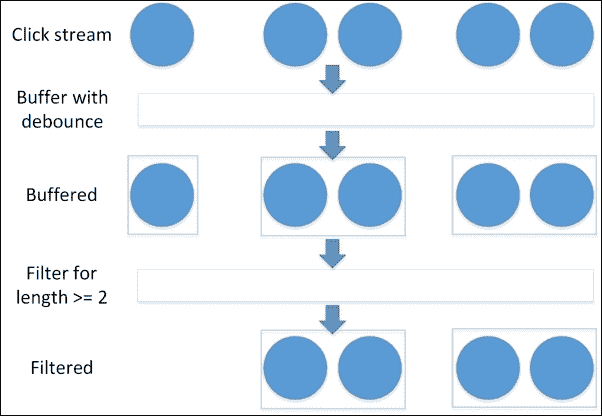

# 七、反应式编程

我曾经读过一本书，书中提到牛顿是在观察芦苇周围的河流流动时产生了微积分的想法。 我从来没有找到任何其他来源支持这个说法。 然而，这是一幅值得你铭记在心的美好画面。 微积分是用来理解系统的状态是如何随时间变化的。 大多数开发人员在日常工作中很少需要处理微积分。 然而，他们将不得不应对系统的变化。 毕竟，拥有一个完全不变的系统是相当乏味的。

在过去的几年里，出现了许多不同的观点，把变化看作一连串的事件——就像牛顿观察到的那样。 给定起始位置和事件流，应该可以计算出系统的状态。 实际上，这就是使用事件存储的想法。 我们不是将聚合的最终状态保存在数据库中，而是跟踪应用于该聚合的所有事件。 通过回放这一系列事件，我们可以重新创建聚合的当前状态。 这似乎是一种存储对象状态的迂回方式，但实际上它在许多情况下都非常有用。 例如，一个断开连接的系统(如手机应用，当手机没有连接到网络时)，使用事件存储的系统可以与其他事件合并，这比简单地保持终端状态要容易得多。 它对于审计场景也非常有用，因为只需在时间索引处停止重播，就可以将系统拉回到它在任何时间点的状态。 您是否经常被问到“为什么系统处于这种状态?”，而您一直无法回答? 使用事件存储，答案应该很容易确定。

在本章中，我们将涵盖以下主题:

*   应用状态的变化
*   流
*   过滤流
*   合并流
*   流的多路复用

# 应用状态改变

在一个应用中，我们可以将所有发生的事件视为一个类似的事件流。 用户点击一个按钮? 事件。 用户的鼠标进入某个区域? 事件。 一个时钟节拍? 事件。 在前端和后端应用中，事件是触发状态变化的事情。 您可能已经在事件监听器中使用了事件。 考虑将点击处理程序附加到按钮上:

```js
var item = document.getElementById("item1");
item. addEventListener("click", function(event){ /*do something */ });
```

在这段代码中，我们给`click`事件附加了一个处理程序。 这是相当简单的代码,但想想这段代码复杂度的增加迅速,当我们添加条件像“忽略额外的点击为 500 毫秒一次点击触发,以防止人们双击“和“火不同的事件如果*Ctrl 键按钮点击”。 响应式编程或函数式响应式编程通过使用流为这些复杂的交互场景提供了简单的解决方案。 让我们探讨一下如何利用响应式编程使代码受益。*

# 溪流

考虑事件流的最简单方法是不要考虑您以前在编程中可能使用过的流，输入阅读器流，而要考虑数组。 假设你有一个数组，里面有一系列的数字:

```js
[1, 4, 6, 9, 34, 56, 77, 1, 2, 3, 6, 10]
```

现在，您想要过滤这个数组，使其只显示偶数。 在现代 JavaScript 中，通过对数组使用`filter`函数很容易做到这一点:

```js
[1, 4, 6, 9, 34, 56, 77, 1, 2, 3, 6, 10].filter((x)=>x%2==0) =>
[4, 6, 34, 56, 2, 6, 10]
```

图示如下:


当数组中有 10 个元素或 1 万个元素时，这里的过滤函数是相同的。 现在，如果源数组一直有新项被添加到它会怎么样呢? 我们希望将任何新的偶数项插入到依赖数组中，使其保持最新。 为此，我们可以使用类似模式的装饰器将其连接到数组的`add`函数中。 使用装饰器，我们可以调用 filter 方法，如果找到匹配项，就将其添加到过滤后的数组中。

实际上，流是未来事件集合上的一个可观察对象。 有许多有趣的问题可以使用流上的操作来解决。 让我们从一个简单的问题开始:处理点击。 这个问题非常简单，从表面上看，使用流似乎没有任何好处。 别担心，我们会越做越难。

本书在很大程度上避免使用任何特定的 JavaScript 库。 其思想是模式应该能够轻松实现，而不需要大量的仪式。 然而，在本例中，我们实际上将使用库，因为流与它们的实现有一些细微差别，我们需要一些语法上的细微差别。 如果您正在寻找如何实现基本流，那么您可以基于[第五章](05.html#page "Chapter 5. Behavioral Patterns")、*行为模式*中概述的观察者模式。

在 JavaScript 中有很多流库，比如 react .js、Bacon.js 和 RxJS。 每一种都有不同的优点和缺点，但细节不在本书的讨论范围之内。 在本书中，我们将使用 JavaScript 的响应式扩展，其源代码可以在 GitHub 上找到[https://github.com/Reactive-Extensions/RxJS](https://github.com/Reactive-Extensions/RxJS)。

让我们从一段简短的 HTML 开始:

```js
<body>
  <button id="button"> Click Me!</button>
  <span id="output"></span>
</body>
```

为此，让我们添加一个快速点击计数器:

```js
<script>
  var counter = 0;
  var button = document.getElementById('button');
  var source = Rx.Observable.fromEvent(button, 'click');
  var subscription = source.subscribe(function (e) {
    counter++;
    output.innerHTML = "Clicked " + counter + " time" + (counter > 1 ? "s" : "");
  });
</script>
```

这里你可以看到我们正在从按钮上的`click`事件创建一个新的事件流。 新创建的流通常被称为 metastream。 每当事件从源流发出时，它都会被自动操作并根据需要发布到 metastream。 我们订阅这个流并增加计数器。 如果我们想只对偶数的事件作出反应，可以通过订阅流的第二个函数来实现:

```js
var incrementSubscription = source.subscribe(() => counter++);
var subscription = source.filter(x=>counter%2==0).subscribe(function (e) {
  output.innerHTML = "Clicked " + counter + " time" +(counter > 1 ? "s" : "");
});
```

这里你可以看到，我们正在对流应用一个过滤器，这样计数器与更新屏幕的函数就不同了。 像这样在流外放一个计数器感觉很脏，不是吗? 无论如何，增加每一次点击都不是这个函数的目标。 更可能的情况是，我们希望只在双击时运行函数。

用传统方法很难做到这一点，但是使用流很容易实现这类复杂的交互。 你可以在下面的代码中看到我们如何处理这个问题:

```js
source.buffer(() => source.debounce(250))
.map((list) => list.length)
.filter((x) => x >= 2)
.subscribe((x)=> {
  counter++;
  output.innerHTML = "Clicked " + counter + " time" + (counter > 1 ? "s" : "");
});
```

在这里，我们采用点击流并使用 debounce 来生成缓冲区的边界来缓冲流。 “去噪”是硬件领域的一个术语，意思是我们将一个噪声信号清除为单个事件。 当一个物理按钮被按下时，通常会有几个额外的高或低信号，而不是我们想要的单点信号。 实际上，我们消除了窗口内发生的重复信号。 在这种情况下，我们等待`250`ms，然后触发事件移动到一个新的缓冲区。 该缓冲区包含在撤销过程中触发的所有事件，并将它们的列表传递给链中的下一个函数。 map 函数生成一个以列表长度作为内容的新流。 接下来，我们过滤流以只显示值为 2 或更多的事件，即两次单击或更多。 事件流如下图所示:



使用传统的事件监听器和回调来执行与此相同的逻辑相当困难。 人们可以很容易地想象一个更加复杂的工作流程，它将螺旋形地失去控制。 FRP 允许使用更精简的方法来处理事件。

# 过滤流

正如我们在前面的小节中看到的，可以过滤事件流并从中生成新的事件流。 您可能对筛选数组中的项很熟悉。 ES5 引入了一些新的数组运算符，如**filter**和**一些**。 第一个方法生成一个新数组，该数组只包含符合过滤器规则的元素。 `Some`是一个类似的函数，如果数组中有匹配的元素，则返回`true`。 流以及函数语言(如 First 和 Last)中您可能熟悉的函数也支持这些相同类型的函数。 除了对数组有意义的函数外，还有许多基于时间序列的函数，当你考虑到流在时间上存在时，它们更有意义。

我们已经看过了 debounce 这是一个基于时间的滤波器的例子。 debounce 的另一个非常简单的应用是防止用户双击提交按钮的恼人 bug。 考虑一下使用流的代码要简单得多:

```js
Rx.Observable.FromEvent(button, "click")
.debounce(1000).subscribe((x)=>doSomething());
```

您可能还会发现，函数类似于 Sample -它从时间窗口生成一组事件。 当我们处理可能产生大量事件的可观察对象时，这是一个非常方便的函数。 以维斯特洛世界为例。

不幸的是，维斯特洛是一个充满暴力的地方，人们似乎以不愉快的方式死去。 死亡人数如此之多，我们不可能对每一个人都进行监控，所以我们想对数据进行取样，并收集一些死亡原因。

为了模拟这个传入的流，我们将从一个数组开始，类似如下:

```js
var deaths = [
  {
    Name:"Stannis",
    Cause: "Cold"
  },
  {
    Name: "Tyrion",
    Cause: "Stabbing"
  },
…
}
```

### 提示

你可以看到我们正在使用数组来模拟事件流。 这可以在任何流中完成，并且是对复杂代码执行测试的一种非常简单的方法。 您可以在数组中构建事件流，然后以适当的延迟发布它们，从而准确地表示从文件系统到用户交互的任何事件流。

现在我们需要将数组变成事件流。 幸运的是，使用`from`方法可以实现一些快捷方式。 这将简单地返回一个立即执行的流。 我们想要的是假装我们有一个定期分布的事件流，或者，在我们相当病态的情况下，死亡。 这可以通过使用 RxJS 中的两个方法来实现:`interval`和`zip`。 `interval`创建一个有规律间隔的事件流。 `zip`匹配来自两个流的事件对。 这两个方法将在一定的时间间隔内发出一个新的事件流:

```js
function generateDeathsStream(deaths) {
  return Rx.Observable.from(deaths).zip(Rx.Observable.interval(500), (death,_)=>death);
}
```

在这段代码中，我们将死亡数组与一个触发每个`500`ms 的间隔流压缩在一起，因为我们对间隔事件不是特别感兴趣，我们只是简单地丢弃它，并从数组中继续投射项目。

现在，我们可以通过简单地获取一个样本，然后订阅它来对这个流进行采样。 这里我们采样每`1500`ms:

```js
generateDeathsStream(deaths).sample(1500).subscribe((item) => { /*do something */ });
```

你可以在一个流中拥有尽可能多的订阅者，所以如果你想要执行一些抽样，以及一些聚合函数，比如简单地计数事件，你可以通过拥有多个订阅者来实现:

```js
Var counter = 0;
generateDeathsStream(deaths).subscribe((item) => { counter++ });
```

# 合并流

我们已经看到了`zip`函数，它将事件一对一地合并到一起来创建一个新的流，但是还有许多其他方法可以组合流。 一个非常简单的示例可能是一个页面，其中有多个代码路径，它们都希望执行类似的操作。 也许我们有几个动作，它们都导致状态消息被更新:

```js
var button1 = document.getElementById("button1");
var button2 = document.getElementById("button2");
var button3 = document.getElementById("button3");
var button1Stream = Rx.Observable.fromEvent(button1, 'click');
var button2Stream = Rx.Observable.fromEvent(button2, 'click');
var button3Stream = Rx.Observable.fromEvent(button3, 'click');
var messageStream = Rx.Observable.merge(button1Stream, button2Stream, button3Stream);
messageStream.subscribe(function (x) { return console.log(x.type + " on " + x.srcElement.id); });
```

在这里你可以看到不同的流是如何被传递到合并函数和结果合并流:


虽然这段代码很有用，但似乎并没有比直接调用事件处理程序更好，实际上它比需要的时间长。 但是，考虑到状态消息的来源不仅仅是按钮推送。 我们可能还想让异步事件写出信息。 例如，向服务器发送请求也可能需要添加状态信息。 另一个奇妙的应用可能是 web worker，它运行在后台，使用消息与主线程通信。 对于基于 web 的 JavaScript 应用，这是我们实现多线程应用的方式。 让我们看看会是什么样子。

首先，我们可以从工作者角色创建一个流。 在我们的例子中，worker 只是计算斐波那契数列。 我们在页面上添加了第四个按钮，并让它触发 worker 进程:

```js
var worker = Rx.DOM.fromWorker("worker.js");
button4Stream.subscribe(function (_) {
  worker.onNext({ cmd: "start", number: 35 });
});
```

现在我们可以订阅合并的流，并将它与之前的所有流结合起来:

```js
var messageStream = Rx.Observable.merge(button1Stream, button2Stream, button3Stream, worker);
messageStream.subscribe(function (x) {
  appendToOutput(x.type + (x.srcElement.id === undefined ? " with " + x.data : " on " + x.srcElement.id));
},
function (err) { return appendToOutput(err, true); }
);
```

这看起来真的很好，但我们不想让用户一次收到几十个通知。 我们可以通过使用我们前面看到的相同的间隔 zip 模式来限制事件流，以便每次只显示一个祝词。 在这段代码中，我们用对 toast 显示库的调用替换了我们的`appendToOutput`方法:

```js
var messageStream = Rx.Observable.merge(button1Stream, button2Stream, button3Stream, worker);
var intervalStream = Rx.Observable.interval(5000);
messageStream.zip(intervalStream, function (x, _) {
  return x;})
.subscribe(function (x) {
  toastr.info(x.type + (x.srcElement.id === undefined ? " with " + x.data : " on " + x.srcElement.id));
},
function (err) { return toastr.error(err); }
);
```

正如您所看到的，这个功能的代码很短，很容易理解，但是它包含了大量的功能。

# 多路复用流

如果一个人不擅长建立间谍网络，他就不可能在维斯特洛的御前会议上获得权力。 通常最好的间谍是反应最快的人。 类似地，我们可能有一些代码，它可以选择调用许多不同的服务中的一个，这些服务可以完成相同的任务。 一个很好的例子就是信用卡处理器:使用哪种处理器并不重要，因为它们几乎都是一样的。

为了实现这一点，我们可以向每个服务发起大量的 HTTP 请求。 如果我们接受每个请求并将它们放入流中，我们可以使用它来选择最快的响应处理器，然后使用该处理器执行其余的操作。

对于 RxJS，这看起来像以下内容:

```js
var processors = Rx.Observable.amb(processorStream1, processorStream2);
```

您甚至可以在`amb`调用中包含一个 timeout，该调用将用于处理处理器没有及时响应的情况。

# 提示和提示

有大量的不同的功能，可以应用到流。 如果你碰巧决定在 JavaScript 中使用 RxJS 库来满足你的 FRP 需求，那么许多最常见的函数已经为你实现了。 更复杂的函数通常可以写成包含函数的链，所以在编写自己的函数之前，请尝试通过链来创建您想要的功能。

JavaScript 中的跨网络异步调用经常会失败。 网络是不可靠的，移动网络更是如此。 在大多数情况下，当网络出现故障时，我们的应用也会出现故障。 流提供了一个简单的解决方案，允许您轻松地重试失败的订阅。 在 RxJS 中，这个方法被称为`Retry`。 将它插入任何可观察到的链中，可以使它在网络故障时更有弹性。

# 小结

函数式响应式编程在服务器和客户端不同的应用中有很多用途。 在客户端，它可以用来将大量事件整合到数据流中，从而实现复杂的交互。 它也可以用于最简单的事情，如阻止用户双击一个按钮。 对于所有的数据更改，简单地使用流并没有巨大的成本。 它们是高度可测试的，对性能的影响很小。

也许 FRP 最好的地方在于它提高了抽象级别。 您必须处理不那么挑剔的流程流代码，相反，可以将重点放在应用的逻辑流上。