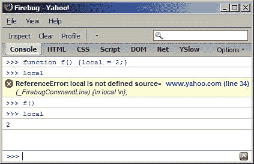

# 三、函数

当你学习任何编程语言时，掌握函数是一项重要的技能，尤其是在 JavaScript 方面。这是因为 JavaScript 对函数有很多用途，语言的很多灵活性和表现力都来自函数。大多数编程语言对一些面向对象的特性有一种特殊的语法，而 JavaScript 只使用函数。本章将包括:

*   如何定义和使用函数

*   将参数传递给函数

*   您可以“免费”使用的预定义功能

*   JavaScript 中变量的范围

*   函数只是数据的概念，尽管是一种特殊类型的数据

理解这些主题将为您进入本章的第二部分打下坚实的基础，第二部分展示了函数的一些有趣的应用:

*   使用匿名函数

*   回收

*   自调用函数

*   内部函数(在函数内部定义的函数)

*   返回函数的函数

*   重新定义自身的功能

*   关闭

# 什么是函数？

函数允许您将一些代码组合在一起，给这些代码一个名称，并在以后重用它，通过名称来寻址它。我们来看一个例子:

```js
function sum(a, b) {
var c = a + b;
return c;
}

```

组成函数的部分有哪些？

*   `function`声明。

*   功能的*名称*，在本例中为 `sum`。

*   预期参数(参数)，在本例中为 `a`和 `b`。一个函数可以接受零个或多个参数，用逗号分隔。

*   一个代码块，也称为函数的*体*。

*   `return`声明。函数总是返回值。如果不显式返回值，则隐式返回值 `undefined`。

请注意，一个函数只能返回一个值。如果您需要返回更多的值，那么只需返回一个数组，该数组包含作为该数组元素的所有值。

## 调用函数

为了利用一个函数，你需要*调用*它。您只需使用名称后跟括号中的任何参数来调用函数。“去*调用”*一个函数是“去调用”的另一种说法。

让我们调用函数 `sum()`，传递两个参数，并将函数返回的值赋给变量 `result:`

```js
>>> var result = sum(1, 2);
>>> result;
3

```

## 参数

定义函数时，可以指定函数在被调用时预期接收哪些参数。一个函数可能不需要任何参数，但是如果它需要参数，而你忘记了传递它们，JavaScript 会给你跳过的参数赋值 `undefined`。在下一个例子中，函数调用返回 `NaN`，因为它试图对 `1`和 `undefined:` 求和

```js
>>> sum(1)
NaN

```

在参数方面，JavaScript 一点也不挑剔。如果传递的参数超过了函数的预期，额外的参数将被忽略:

```js
>>> sum(1, 2, 3, 4, 5)
3

```

此外，您可以创建函数，这些函数可以灵活地接受参数的数量。这是可能的，这要归功于在每个函数内部自动创建的 `arguments`数组。这里有一个函数，它只返回传递给它的任何参数:

```js
>>> function args() { return arguments; }
>>> args();
[]
>>> args( 1, 2, 3, 4, true, 'ninja');
[1, 2, 3, 4, true, "ninja"]

```

通过使用 `arguments`数组，您可以改进 `sum()`功能，以接受任意数量的参数并将其全部相加。

```js
function sumOnSteroids() {
var i, res = 0;
var number_of_params = arguments.length;
for (i = 0; i < number_of_params; i++) {
res += arguments[i];
}
return res;
}

```

如果您通过用不同数量的参数(甚至根本没有参数)调用该函数来测试它，您可以验证它是否如预期那样工作:

```js
>>> sumOnSteroids(1, 1, 1);
3
>>> sumOnSteroids(1, 2, 3, 4);
10
>>> sumOnSteroids(1, 2, 3, 4, 4, 3, 2, 1);
20
>>> sumOnSteroids(5);
5
>>> sumOnSteroids();
0

```

表达式 `arguments.length`返回调用函数时传递的参数数量。如果对语法不熟悉，不要担心，我们将在下一章详细研究它。我们还会看到 `arguments`在技术上不是一个数组，而是一个类似数组的对象。

# 预定义函数

JavaScript 引擎内置了许多函数，可供您使用。让我们看看他们。在这样做的同时，您将有机会体验函数、它们的参数和返回值，并对使用它们感到舒适。内置函数列表为:

*   `parseInt()`

*   `parseFloat()`

*   `isNaN()`

*   `isFinite()`

*   `encodeURI()`

*   `decodeURI()`

*   `encodeURIComponent()`

*   `decodeURIComponent()`

*   `eval()`

### 注

**黑盒功能**

通常，当您调用函数时，您的程序不需要知道这些函数在内部是如何工作的。你可以把一个函数想象成一个黑盒:你给它一些值(作为输入参数)，然后你得到它返回的输出结果。这适用于任何函数——内置于 JavaScript 引擎中的函数、您创建的函数、同事或其他人创建的函数。

## 剖析()

`parseInt()`接受任何类型的输入(最常见的是字符串)，并试图从中得出一个整数。如果失败，则返回 `NaN.`

```js
>>> parseInt('123')
123
>>> parseInt('abc123')
NaN
>>> parseInt('1abc23')
1
>>> parseInt('123abc')
123

```

该函数接受一个可选的第二个参数，即*基数*，告诉函数期望的数字类型——十进制、十六进制、二进制等等。例如试图从字符串 `FF`中提取一个十进制数是没有意义的，所以结果是 **NaN** ，但是如果你尝试将 `FF`作为十六进制，那么你得到的是 255。

```js
>>> parseInt('FF', 10)
NaN
>>> parseInt('FF', 16)
255

```

另一个例子是解析一个带基数 `10`(十进制)和基数 `8`(八进制)的字符串。

```js
>>> parseInt('0377', 10)
377
>>> parseInt('0377', 8)
255

```

如果在调用 `parseInt()`时忽略第二个参数，函数将采用 10(十进制)，但有以下例外:

*   如果您传递一个以 `0x`开头的字符串作为第一个参数，那么第二个参数假定为 16(假定为十六进制数)

*   如果第一个参数以 `0`开始，则函数假设 8 为第二个参数(假设为八进制数)

```js
>>> parseInt('377')
377
>>> parseInt('0377')
255
>>> parseInt('0x377')
887

```

最安全的做法是始终指定基数。如果您省略了基数，您的代码可能在 99%的情况下仍然可以工作(因为大多数情况下您解析小数)，但是偶尔它可能会在调试一些问题时导致您有点脱发。例如，假设您有一个接受日历日的表单域，用户键入**08**；如果省略基数，可能会得到意想不到的结果。

## 解析浮点()

`parseFloat()`与 `parseInt()`相同，但它也在试图从您的输入中计算出一个数字时寻找小数。这个函数只接受一个参数。

```js
>>> parseFloat('123')
123
>>> parseFloat('1.23')
1.23
>>> parseFloat('1.23abc.00')
1.23
>>> parseFloat('a.bc1.23')
NaN

```

与 `parseInt(), parseFloat()`一样，在第一次出现意外字符时放弃，即使字符串的其余部分可能包含可用的数字。

```js
>>> parseFloat('a123.34')
NaN
>>> parseFloat('12a3.34')
12

```

`parseFloat()`理解输入中的指数(不像 `parseInt()`)。

```js
>>> parseFloat('123e-2')
1.23
>>> parseFloat('123e2')
12300
>>> parseInt('1e10')

```

**1**T2】

## 是纳恩 （）

使用 `isNaN()`可以检查输入值是否是可以安全用于算术运算的有效数字。该功能也是检查 `parseInt()`或 `parseFloat()`是否成功的便捷方式。

```js
>>> isNaN(NaN)
true
>>> isNaN(123)
false
>>> isNaN(1.23)
false
>>> isNaN(parseInt('abc123'))
true

```

该函数还会尝试将输入转换为数字:

```js
>>> isNaN('1.23')
false
>>> isNaN('a1.23')
true

```

`isNaN()`功能很有用，因为 `NaN`不等于它自己。所以，令人惊讶的是， `NaN === NaN`是**假的**。

## isFinite()

`isFinite()`检查输入的是否是既不是 `Infinity`也不是 `NaN`的数字。

```js
>>> isFinite(Infinity)
false
>>> isFinite(-Infinity)
false
>>> isFinite(12)
true
>>> isFinite(1e308)
true
>>> isFinite(1e309)
false

```

如果你想知道最后两次调用返回的结果，记得上一章说 JavaScript 中最大的数字是 `1.7976931348623157e+308`。

## 编码/解码 URIs

在网址(统一资源定位符)或 URI(统一资源标识符)中，有些字符有特殊的含义。如果想“转义”那些字符，可以使用 `encodeURI()`或 `encodeURIComponent()`功能。第一个将返回一个可用的网址，而第二个假设您只传递了网址的一部分，例如查询字符串，并将编码所有适用的字符。

```js
>>> var url = 'http://www.packtpub.com/scr ipt.php?q=this and that';
>>> encodeURI(url);
"http://www.packtpub.com/scr%20ipt.php?q=this%20and%20that"
>>> encodeURIComponent(url);
"http%3A%2F%2Fwww.packtpub.com%2Fscr%20ipt.php%3Fq%3Dthis% 20and%20that"

```

`encodeURI()`和 `encodeURIComponent()`的反义词分别是 `decodeURI()`和 `decodeURIComponent()`。有时，在较旧的代码中，您可能会看到类似的函数 `escape()`和 `unescape()`，但是这些函数已经被弃用，不应该使用。

## eval()

`eval()`接受字符串输入，并将其作为 JavaScript 代码执行:

```js
>>> eval('var ii = 2;')
>>> ii
2

```

所以 `eval('var ii = 2;')`和简单的 `var ii = 2`是一样的；

`eval()`有时可能有用，但如果有其他选择就应该避免。大多数时候会有替代方案，在大多数情况下，替代方案更优雅，更容易编写和维护。“Eval 是邪恶的”这句口头禅你经常可以从经验丰富的 JavaScript 程序员那里听到。使用 `eval()`的缺点是:

*   性能—评估“实时”代码比将代码直接放在脚本中要慢。

*   安全性——JavaScript 功能强大，这也意味着它会造成损害。如果不信任传递给 `eval()`的输入来源，就不要使用。

## 奖励—警报()功能

让我们来看看一个非常常见的函数——`alert()`。这不是核心 JavaScript 的一部分(它不在 ECMA 规范中)，但它是由主机环境——浏览器——提供的。它在消息框中显示一串文本。它有时对调试也很有用，尽管 Firebug 调试器在这方面是一个更好的工具。

下面是显示执行代码 `alert("hello!")`结果的截图


在使用该函数之前，请记住它会阻止浏览器线程，这意味着在用户关闭警报之前不会执行其他代码。如果您有一个繁忙的 AJAX 类型的应用，使用 `alert()`通常不是一个好主意。

# 变量的范围

需要注意的是，特别是如果你是从另一种语言学习 JavaScript，JavaScript 中的变量不是在块范围内定义的，而是在*函数范围*内定义的。这意味着，如果在函数内部定义了一个变量，它在函数外部是不可见的。然而，定义在 `if`或 `for`代码块内的变量在代码块外是可见的。术语“全局变量”描述的是在任何函数之外定义的变量，而不是在函数内部定义的“局部变量”。函数内部的代码可以访问所有全局变量以及它自己的局部变量。

在下一个示例中:

*   函数 `f()`可以访问变量 `global`

*   在函数 `f()`之外，变量 `local`不存在

```js
var global = 1;
function f() {
var local = 2;
global++;
return global;
}
>>> f();
2
>>> f();
3
>>> local
local is not defined

```

同样需要注意的是，如果不使用 `var`来声明一个变量，这个变量会被自动分配全局范围。让我们看一个例子:



发生了什么事？函数 `f()`包含变量 `local`。在调用函数之前，变量不存在。第一次调用函数时，变量 `local`是用全局范围创建的。如果你在功能外访问 `local`，它是可用的。

### 注意

**最佳实践提示**

最小化全局变量的数量。想象一下，两个人在同一个脚本中处理两个不同的函数，他们都决定使用同一个名字作为他们的全局变量。这很容易导致意想不到的结果和难以发现的 bug。

始终用 `var`语句声明您的变量。

这里有一个有趣的例子，展示了局部和全局范围的一个重要方面。

```js
var a = 123;
function f() {
alert(a);
var a = 1;
alert(a);
}
f();

```

您可能期望第一个 `alert()`将显示 123(全局变量 `a)`的值)，第二个将显示 1(本地 `a)`。事实并非如此。第一个警报将显示**“未定义”**。这是因为在函数内部，局部范围比全局范围更重要。所以局部变量会覆盖所有同名的全局变量。第一次 `alert() a`还没有定义(因此值**未定义)**但它仍然存在于局部空间中。

# 功能为数据

这是我们稍后需要的一个重要概念 JavaScript 中的函数实际上是数据。这意味着定义函数的以下两种方式完全相同:

```js
function f(){return 1;}
var f = function(){return 1;}

```

定义函数的第二种方式称为*函数文字符号*。

当您在保存函数值的变量上使用 `typeof`运算符时，它会返回字符串“function”。

```js
>>> function f(){return 1;}
>>> typeof f
"function"

```

所以 JavaScript 函数是数据，但是一种具有两个重要特性的特殊数据:

*   它们包含代码

*   它们是可执行的(可以被调用)

如您之前所见，执行函数的方法是在函数名称后添加括号。正如下一个例子所展示的，不管函数是如何定义的，这都是可行的。在示例中，您还可以看到函数是如何被视为普通变量的——它可以被复制到不同的变量中，甚至被删除。

```js
>>> var sum = function(a, b) {return a + b;}
>>> var add = sum;
>>> delete sum
true
>>> typeof sum;
"undefined"
>>> typeof add;
"function"
>>> add(1, 2);
3

```

因为函数是分配给变量的数据，所以命名函数的规则与命名变量的规则相同，函数名不能以数字开头，它可以包含字母、数字和下划线字符的任意组合。

## 匿名函数

在 JavaScript 中，程序周围有一些数据是可以的。假设您的代码中有以下内容。

```js
>>> "test"; [1,2,3]; undefined; null; 1;

```

这段代码看起来可能有点奇怪，因为它实际上没有做任何事情，但是代码是有效的，不会导致错误。您可以说这段代码包含匿名数据——匿名是因为数据片段没有分配给任何变量，因此没有名称。

正如您现在所知，函数就像任何其他变量一样，因此也可以在不指定名称的情况下使用:

```js
>>> function(a){return a;}

```

现在，这些分散在代码中的匿名数据并不真正有用，除非它们碰巧是函数。在这种情况下，它们可以有两种优雅的用途:

*   您可以将匿名函数作为参数传递给另一个函数。接收函数可以对您传递的函数做一些有用的事情。

*   您可以定义一个匿名函数并立即执行它。

让我们更详细地看看匿名函数的这两个应用。

## 回调函数

因为函数就像分配给变量的任何其他数据一样，可以定义、删除、复制，为什么不也作为参数传递给其他函数呢？

这里有一个函数的例子，它接受两个函数作为参数，执行它们，并返回每个函数返回的总和。

```js
function invoke_and_add(a, b){
return a() + b();
}

```

现在让我们定义两个简单的附加函数，它们只返回硬编码值:

```js
function one() {
return 1;
}
function two() {
return 2;
}

```

现在我们可以将这些函数传递给原始函数 `add()`并得到结果:

```js
>>> invoke_and_add(one, two);
3

```

将函数作为参数传递的另一个例子是使用匿名函数。不用定义 `one()`和 `two()`，你可以简单的做:

```js
invoke_and_add(function(){return 1;}, function(){return 2;})

```

当你把一个函数 A 传递给另一个函数 B and B 执行 A 时，人们常说 A 是一个回调函数。如果 A 没有名字，那么可以说是匿名回调函数。

回调函数什么时候有用？让我们看一些例子，展示回调函数的好处，即:

*   它们让你传递函数而不需要命名它们(这意味着有更少的全局变量)

*   您可以将调用一个函数的责任委托给另一个函数(这意味着需要编写的代码更少)

*   他们可以帮助提高性能

## 回调示例

看看这个常见的场景:你有一个函数返回一个值，然后传递给另一个函数。在我们的示例中，第一个函数 `multiplyByTwo()`接受三个参数，循环遍历它们，将它们乘以 2，并返回一个包含结果的数组。第二个函数 `addOne()`取一个值，加 1 后返回。

```js
function multiplyByTwo(a, b, c) {
var i, ar = [];
for(i = 0; i < 3; i++) {
ar[i] = arguments[i] * 2;
}
return ar;
}
function addOne(a) {
return a + 1;
}

```

测试我们目前拥有的功能:

```js
>>> multiplyByTwo(1, 2, 3);
[2, 4, 6]
>>> addOne(100)
101

```

现在假设我们想要一个包含三个元素的数组 `myarr`，每个元素都要通过两个函数传递。首先，我们先来打个电话给 `multiplyByTwo()`。

```js
>>> var myarr = [];
>>> myarr = multiplyByTwo(10, 20, 30);
[20, 40, 60]

```

现在循环每个元素，将其传递给 `addOne()`。

```js
>>> for (var i = 0; i < 3; i++) {myarr[i] = addOne(myarr[i]);}
>>> myarr
[21, 41, 61]

```

如你所见，一切都很好，但仍有改进的余地。一件事是有两个循环。如果循环要经历很多或重复，成本会很高。我们只用一个循环就能达到我们想要的结果。下面是如何修改 `multiplyByTwo()`使其接受一个 `callback`函数并在每次迭代中调用 `callback`:

```js
function multiplyByTwo(a, b, c, callback) {
var i, ar = [];
for(i = 0; i < 3; i++) {
ar[i] = callback(arguments[i] * 2);
}
return ar;
}

```

通过使用修改后的函数，现在只需一次函数调用就可以完成全部工作，该函数调用传递起始值和 `callback`。

```js
>>> myarr = multiplyByTwo(1, 2, 3, addOne);
[3, 5, 7]

```

我们可以使用匿名函数来代替定义 `addOne()`，这样可以节省一个额外的全局变量。

```js
>>> myarr = multiplyByTwo(1, 2, 3, function(a){return a + 1});
[3, 5, 7]

```

如果需要，匿名函数很容易更改:

```js
>>> myarr = multiplyByTwo(1, 2, 3, function(a){return a + 2});

```

**【4、6、8】**

## 自调用函数

到目前为止，我们已经讨论了使用匿名函数作为回调。让我们看看匿名函数的另一个应用——在定义函数后立即调用这个函数。这里有一个例子:

```js
(
function(){
alert('boo');
}
)()

```

语法一开始可能看起来有点吓人，但实际上很简单——只需将一个匿名函数定义放在括号内，后面跟着另一组括号。第二组基本上是“立即执行”，也是放置匿名函数可能接受的任何参数的地方。

```js
(
function(name){
alert('Hello ' + name + '!');
}
)('dude')

```

使用自调用匿名函数的一个很好的理由是在不创建全局变量的情况下完成一些工作。当然，缺点是不能两次执行同一个函数(除非你把它放在一个循环或另一个函数中)。这使得匿名自调用函数最适合一次性或初始化任务。

## 内部(私有)功能

请记住，函数就像任何其他值一样，没有什么能阻止您在另一个函数中定义函数。

```js
function a(param) {
function b(theinput) {
return theinput * 2;
};
return 'The result is ' + b(param);
};

```

使用函数文字符号，这也可以写成:

```js
var a = function(param) {
var b = function(theinput) {
return theinput * 2;
};
return 'The result is ' + b(param);
};

```

当你调用全局函数 `a()`时，它会在内部调用局部函数 `b()`。由于 `b()`是本地的，所以在 `a()`之外是无法访问的，所以我们可以说这是一个私人功能。

```js
>>> a(2);
"The result is 4"
>>> a(8);
"The result is 16"
>>> b(2);
b is not defined

```

使用私有函数的好处如下:

*   您保持了全局命名空间的干净(命名冲突的可能性较小)。

*   隐私—您只向“外部世界”公开您决定的功能，保留不打算由应用的其他部分使用的功能。

## 返回函数的函数

如前所述，函数总是返回值，如果它没有用 `return`显式地返回值，那么它通过返回 `undefined`隐式地返回值。一个函数只能返回一个值，这个值也很容易成为另一个函数。

```js
function a() {
alert('A!');
return function(){
alert('B!');
};
}

```

在这个例子中，函数 `a()`完成它的工作(表示 `A!`)并返回另一个做其他事情的函数(表示`B!`)。您可以将返回值赋给一个变量，然后将该变量用作普通函数:

```js
>>> var newFunc = a();
>>> newFunc();

```

这里第一行会提醒 **A！**还有第二个会报警的 **B！**。

如果您想立即执行返回的函数，而不将其分配给新的变量，您可以简单地使用另一组括号。最终的结果将是一样的。

```js
>>> a()();

```

## 函数，重写你自己！

因为一个函数可以返回一个函数，所以您可以使用新函数来替换旧函数。继续前面的例子，你可以用调用 `a()`返回的值覆盖实际的 `a()`函数:

```js
>>> a = a();

```

以上提醒 **A！**，但是下次你打 `a()`它会提醒 **B！**。

当函数有一些初始的一次性工作要做时，这很有用。函数在第一次调用后覆盖自己，以避免每次调用时做不必要的重复工作。

在上面的例子中，我们从外部重新定义了函数——我们得到了返回值并将其分配回函数。但是这个函数实际上可以从内部重写自己。

```js
function a() {
alert('A!');
a = function(){
alert('B!');
};
}

```

如果您第一次调用此函数，它将:

*   警戒 **A！**(视为一次性准备工作)

*   重新定义全局变量 `a`，给它分配一个新的函数

后续每次调用该函数时，都会提醒 **B！**

下面是另一个例子，它结合了本章最后几节中讨论的几种技术:

```js
var a = function() {
function someSetup(){
var setup = 'done';
}
function actualWork() {
alert('Worky-worky');
}
someSetup();
return actualWork;
}();

```

在这个例子中:

*   你有私人功能——`someSetup()`和`actualWork()`。

*   您有一个自调用函数——函数 `a()`使用其定义后面的括号来调用自己。

*   函数第一次执行，调用 `someSetup()`，然后返回对变量 `actualWork`的引用，这是一个函数。请注意， `return`中没有括号，因为它返回的是一个函数引用，而不是调用这个函数的结果。

*   因为整个事情都是从 `var a =...`开始的，所以自调用函数返回的值被赋值给 `a`。

如果你想测试你对刚才讨论的话题的理解，回答以下问题。当:时，上面的代码会提示什么

*   它最初是加载的吗？

*   事后你打 `a()`了？

这些技术在浏览器环境中工作时非常有用。因为不同的浏览器可以有不同的方式来实现同样的事情，而且你知道浏览器的特性不会在函数调用之间发生变化，所以你可以让一个函数确定在当前浏览器中做这项工作的最佳方式，然后重新定义它自己，这样“浏览器特性嗅探”只做一次。在本书的后面，您将会看到这个场景的具体例子。

# 关闭

本章的其余部分是关于闭包的(有什么更好的方法来结束一章？).闭包最初可能有点难以理解，所以如果在第一次阅读时没有“理解”，不要感到气馁。你应该仔细阅读本章的其余部分，并自己尝试这些例子，但是如果你觉得你没有完全理解这个概念，你可以在本章前面讨论的主题有机会深入理解时再回来。

在讨论闭包之前，让我们回顾并扩展一下 JavaScript 中的范围概念。

## 范围链

如您所知，在 JavaScript 中，与许多其他语言不同，没有花括号作用域，但有函数作用域。函数中定义的变量在函数外不可见，但代码块(一个 `if`或一个 `for`循环)中定义的变量在块外可见。

```js
>>> var a = 1; function f(){var b = 1; return a;}
>>> f();
1
>>> b
b is not defined

```

变量 `a`在全局空间中，而 `b`在函数 `f()`的范围内。所以:

*   在 `f()`内， `a`和 `b`均可见

*   外部 `f(), a`可见，但 `b`不可见

如果你定义了一个嵌套在 `f(), n()`中的函数 `n()`，它将可以访问自己范围内的变量，以及它的“父对象”的范围。这个被称为*范围链*，这个链可以根据你的需要变长(变深)。

```js
var a = 1;
function f(){
var b = 1;
function n() {
var c = 3;
}
}

```

## 词汇范围

在 JavaScript 中，函数有*词法范围*。这意味着函数是在定义时创建其环境(范围)，而不是在执行时。我们来看一个例子:

```js
>>> function f1(){var a = 1; f2();}
>>> function f2(){return a;}
>>> f1();

```

**a 未定义**

在函数 `f1()`内部，我们调用函数 `f2()`。因为本地变量 `a`也在 `f1()`里面，所以人们可能会期望 `f2()`能够访问 `a`，但事实并非如此。在 `f2()`被定义的时候(相对于*执行*，看不到 `a`。 `f2()`和 `f1()`一样，只能进入自己的范围和全局范围。 `f1()`和 `f2()`不共享本地范围。

当一个函数被定义时，它“记住”它的环境，它的范围链。这并不意味着函数还会记住范围内的每个变量。恰恰相反，您可以在函数范围内添加、移除或更新变量，函数将看到变量的最新状态。如果继续上面的例子，声明一个全局变量 `a, f2()`就会看到它，因为 `f2()`知道全局环境的路径，可以访问该环境中的所有内容。还要注意 `f1()`是如何包含对 `f2()`的调用的，它是如何工作的——尽管 `f2()`还没有定义。 `f1()`只需要知道它的范围，这样范围内出现的所有东西都可以立即被 `f1()`使用。

```js
>>> function f1(){var a = 1; return f2();}
>>> function f2(){return a;}
>>> f1();
a is not defined
>>> var a = 5;
>>> f1();
5
>>> a = 55;
>>> f1();
55
>>> delete a;
true
>>> f1();
a is not defined

```

这种行为给了 JavaScript 极大的灵活性——您可以添加和移除变量，然后再次添加它们，这完全没问题。你可以继续实验，删除功能 `f2()`，然后用不同的身体重新定义。最终， `f1()`仍然会起作用，因为它需要知道的只是如何访问它的作用域，而不是在某个时间点这个作用域曾经包含什么。继续上面的例子:

```js
>>> delete f2;
true
>>> f1()
f2 is not defined
>>> var f2 = function(){return a * 2;}
>>> var a = 5;
5
>>> f1();
10

```

## 用一个闭合来断开链条

让我们用一个例子来介绍闭包。

有全球范围。把它想象成宇宙，好像它包含了一切。


可以包含 `a`等变量和 `F`等函数。


函数有自己的私有空间，可以用来存储其他变量(和函数)。在某个时刻，你会得到这样一张图片:


如果你在 `a`点，你就在全球空间内。如果你在 `F`功能空间内的 `b`点，那么你可以进入全局空间和 `F-space`。如果你在功能 `N`内的 `c`点，那么你可以访问全局空间， `F-space`和 `N-space`你不能从 `a`到达 `b`，因为 `b`在 `F`外是不可见的。但是如果你愿意，你可以从 `c`到 `b`，或者从 `N`到 `b`。有趣的是，当 `N`以某种方式脱离 `F`并最终进入全球空间时，就会发生这种关闭。


接下来会发生什么？ `N`与 `a`处于同一个全局空间。由于功能会记住定义它们的环境，因此 `N`仍然可以访问 `F-space`，因此可以访问 `b`。这很有趣，因为 `N`在 `a`所在的地方，而 `N`确实可以访问 `b`，但 `a`却不能。

`N`又是如何断链的？通过使自己全球化(省略 `var`)或让 `F`将其交付(或 `return`)到全球空间。让我们看看如何在实践中做到这一点。

### 关闭#1

看看这个函数:

```js
function f(){
var b = "b";
return function(){
return b;
}
}

```

该函数包含一个变量 `b`，该变量是局部变量，因此无法从全局空间访问:

```js
>>> b
b is not defined

```

查看 `f():`的返回值，这是另一个函数。就当是上图中的 `N`吧。这个新功能可以进入私人空间、 `f()'s`空间和全球空间。所以可以看到 `b`。因为 `f()`可以从全局空间调用(它是一个全局函数)，所以你可以调用它并将返回值赋给另一个全局变量。结果是——一个新的全球功能可以进入 `f()'s`私人空间。

```js
>>> var n = f();
>>> n();
"b"

```

### 关闭#2

下一个示例的最终结果将与上一个示例相同，但实现方式略有不同。 `f()`不返回函数，而是在其体内创建一个新的全局函数 `n()`。

让我们从声明全局函数的占位符开始。这是可选的，但是声明变量总是好的。然后可以这样定义函数 `f()`:

```js
var n;
function f(){
var b = "b";
n = function(){
return b;
}
}

```

现在如果你调用 `f()?` 会发生什么

```js
>>> f();

```

在 `f()`中定义了一个新的函数，由于它缺少 `var`语句，所以它变成了全局函数。在定义时间内， `n()`在 `f()`内，因此可以进入 `f()'s`范围。 `n()`将保持对 `f()'s`范围的访问，即使 `n()`成为全球空间的一部分。

```js
>>> n();
"b"

```

### 定义和结束#3

根据我们到目前为止所讨论的，你可以说，当一个函数保持到它的父函数的作用域的链接时，即使在父函数已经返回之后，闭包也是被创建的。

当你把一个参数传递给一个函数时，它就变成了一个局部变量。您可以创建一个返回另一个函数的函数，该函数又返回其父函数的参数。

```js
function f(arg) {
var n = function(){
return arg;
};
arg++;
return n;
}

```

您可以这样使用函数:

```js
>>> var m = f(123);
>>> m();

```

**124**

请注意 `arg++`在定义函数后是如何递增的，然而，当被调用时， `m()`返回更新的值。这演示了函数如何绑定到其作用域，而不是绑定到作用域中的当前变量及其值。

### 循环中的闭包

这里有一些很容易导致难以发现的错误，因为从表面上看，一切都很正常。

让我们循环三次，每次创建一个返回循环序列号的新函数。新的函数将被添加到数组中，我们将在最后返回数组。功能如下:

```js
function f() {
var a = [];
var i;
for(i = 0; i < 3; i++) {
a[i] = function(){
return i;
}
}
return a;
}

```

让我们运行函数，将结果赋给数组 `a`。

```js
>>> var a = f();

```

现在你有一个由三个函数组成的数组。让我们通过在每个数组元素后添加括号来调用它们。预期的行为是看到循环序列打印出来: `0, 1`，和 `2`。让我们试试:

```js
>>> a[0]()

```

**3**

```js
>>> a[1]()

```

**3**

```js
>>> a[2]()

```

**3**

嗯，不完全是我们所期望的。这里发生了什么？我们创建了三个闭包，它们都指向同一个局部变量 `i`。闭包不记得值，它们只链接(引用) `i`变量，并将返回其当前值。循环后， `i's`值为 **3** 。所以这三个函数都指向同一个值。

(为什么是 3 而不是 2 是另一个值得思考的好问题，以便更好地理解 `for`循环。)

那么如何实施正确的行为呢？你需要三个不同的变量。一个优雅的解决方案是使用另一个闭包:

```js
function f() {
var a = [];
var i;
for(i = 0; i < 3; i++) {
a[i] = (function(x){
return function(){
return x;
}
})(i);
}
return a;
}

```

这给出了预期的结果:

```js
>>> var a = f();
>>> a[0]();

```

**0**

```js
>>> a[1]();

```

**1**

```js
>>> a[2]();

```

**2**

这里，不仅仅是创建一个返回 `i`的函数，而是将 `i`传递给另一个自动执行的函数。对于该功能， `i`成为本地值 `x`， `x`每次都有不同的值。

或者，您可以使用一个“正常”(而不是自调用)的内部函数来达到同样的结果。关键是每次迭代都要用中间函数来“定位” `i`的值。

```js
function f() {
closuresin loopfunction makeClosure(x) {
return function(){
return x;
}
}
var a = [];
var i;
for(i = 0; i < 3; i++) {
a[i] = makeClosure(i);
}
return a;
}

```

## 吸气剂/设置剂

让我们再看两个使用闭包的例子。第一个涉及创建 *getter* 和 *setter* 函数。假设您有一个变量，它将包含一个非常具体的值范围。您不想公开这个变量，因为您不希望代码的任何部分能够改变它的值。您可以在函数中保护这个变量，并提供两个附加函数——一个用来获取值，另一个用来设置值。设置它的那个可以包含一些逻辑，以便在将值赋给受保护变量之前验证它(为了保持示例简单，让我们跳过验证部分)。

您可以将 getter 和 setter 函数放在包含秘密变量的同一个函数中，这样它们就可以共享相同的作用域:

```js
var getValue, setValue;
(function() {
var secret = 0;
getValue = function(){
return secret;
};
setValue = function(v){
secret = v;
};
})()

```

在这种情况下，包含所有内容的函数是一个自调用匿名函数。它将 `setValue()`和 `getValue()`定义为全局函数，而 `secret`变量保持局部且不可直接访问。

```js
>>> getValue()

```

**0**

```js
>>> setValue(123)
>>> getValue()

```

**123**

## 迭代器

最后一个闭包示例(也是本章的最后一个示例)展示了使用闭包来实现*迭代器*功能。

您已经知道如何在一个简单的数组中循环，但是在某些情况下，您可能有一个更复杂的数据结构，对于值的顺序有不同的规则。你可以把复杂的“谁是下一个”逻辑包装成一个简单易用的 `next()`函数。然后每次需要连续值的时候就简单的调用 `next()`。对于这个例子，我们将只使用一个简单的数组，而不是复杂的数据结构。

这里有一个初始化函数，它接受一个输入数组，并定义了一个私有指针 `i`，该指针将始终指向数组中的下一个元素。

```js
function setup(x) {
var i = 0;
return function(){
return x[i++];
};
}

```

用数据数组调用 `setup()`函数会为你创建 `next()`函数。

```js
>>> var next = setup(['a', 'b', 'c']);

```

从这一点来看，它既简单又有趣:一遍又一遍地调用同一个函数会给你带来下一个元素。

```js
>>> next();

"a"
>>> next();
"b"
>>> next();
"c"

```

# 总结

现在，您已经完成了对 JavaScript 中与函数相关的基本概念的介绍。您已经为快速掌握面向对象 JavaScript 的概念和现代 JavaScript 编程中使用的模式打下了基础。到目前为止，我们一直在避免 OO 特性，但是当您在书中到达这一点时，它只会从这里开始变得更加有趣。让我们花点时间回顾一下本章中讨论的主题:

*   如何定义和调用函数的基础知识

*   功能参数及其灵活性

*   内置函数— `parseInt(), parseFloat(), isNaN(), isFinite(), eval()`，以及编码/解码网址的四个功能

*   JavaScript 中变量的作用域——没有花括号作用域，变量只有函数作用域；函数有词法范围，并遵循范围链

*   函数作为数据—函数就像您分配给变量的任何其他数据，许多有趣的应用都是由此而来的，例如:

    *   私有函数和私有变量

    *   匿名函数

    *   回收

    *   自调用函数

    *   函数覆盖它们自己

*   关闭

# 练习

1.  1.编写一个函数，将一个十六进制颜色，例如蓝色`"#0000FF"`，转换为它的 RGB 表示**“RGB(0，0，255)”**。命名您的功能 `getRGB()`并用以下代码进行测试:

```js
>>> var a = getRGB("#00FF00");
>>> a;
"rgb(0, 255, 0)"

```

1.  2.每一行在控制台上都打印了什么？

```js
>>> parseInt(1e1)
>>> parseInt('1e1')
>>> parseFloat('1e1')
>>> isFinite(0/10)
>>> isFinite(20/0)
>>> isNaN(parseInt(NaN));

```

1.  3.下面这个代码 `alert()?`是什么意思

```js
var a = 1;
function f() {
var a = 2;
function n() {
alert(a);
}
n();
}
f();

```

1.  4.所有这些例子都提醒**“嘘！”**。你能解释一下为什么吗？

    4.1.var f =警报；

```js
eval('f("Boo!")');

```

*   4.2 .凡 e；

```js
var f = alert;
eval('e=f')('Boo!');

```

*   4.3.(

```js
function(){
return alert;
}
)()('Boo!');

```