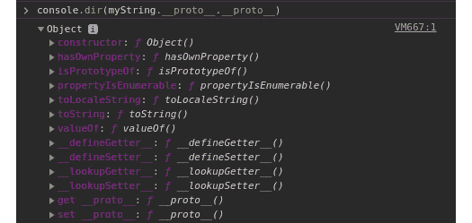
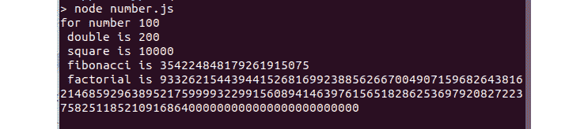
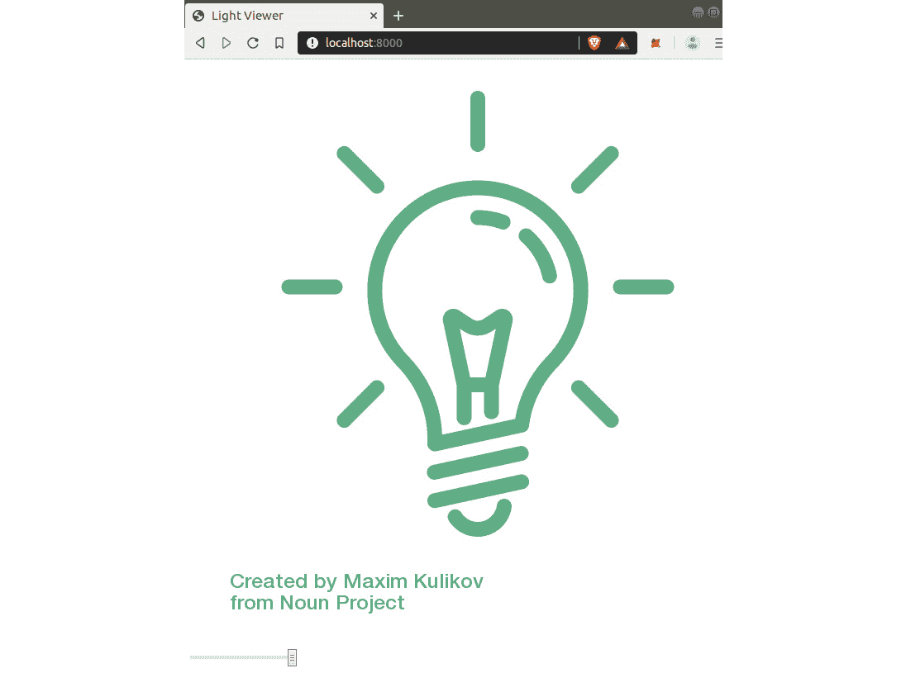
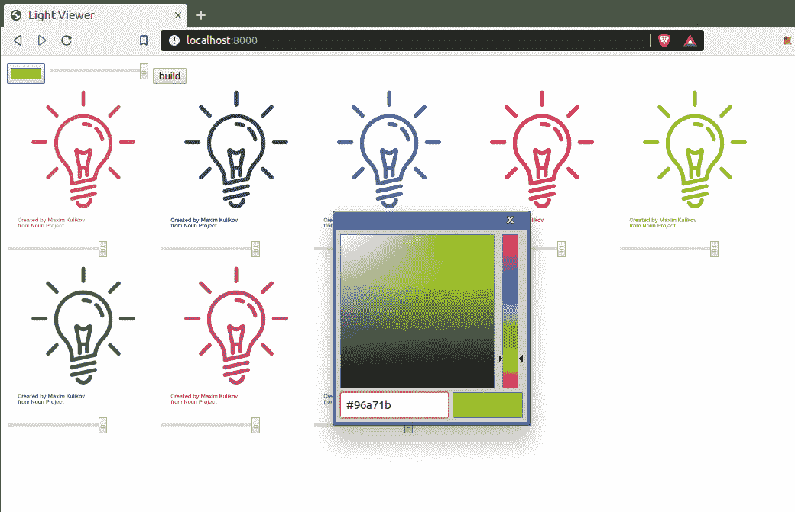
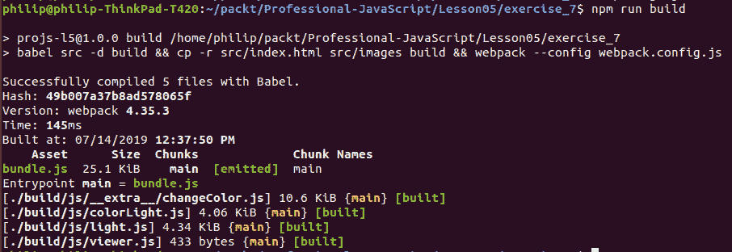
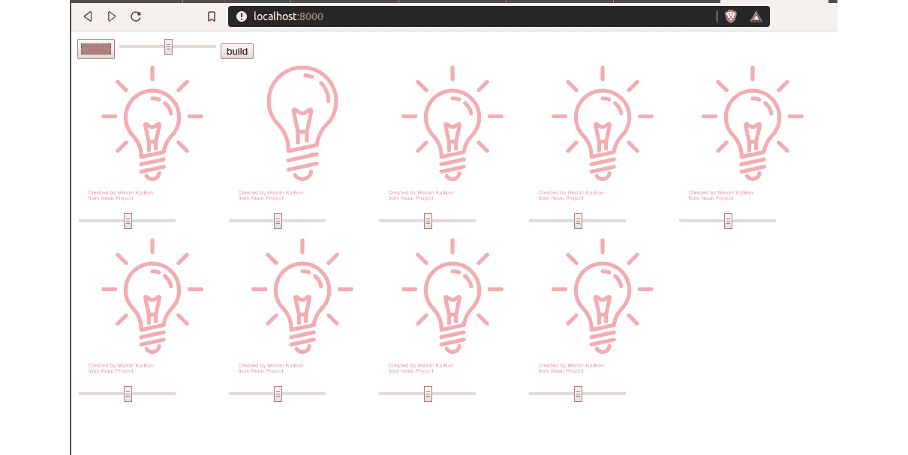
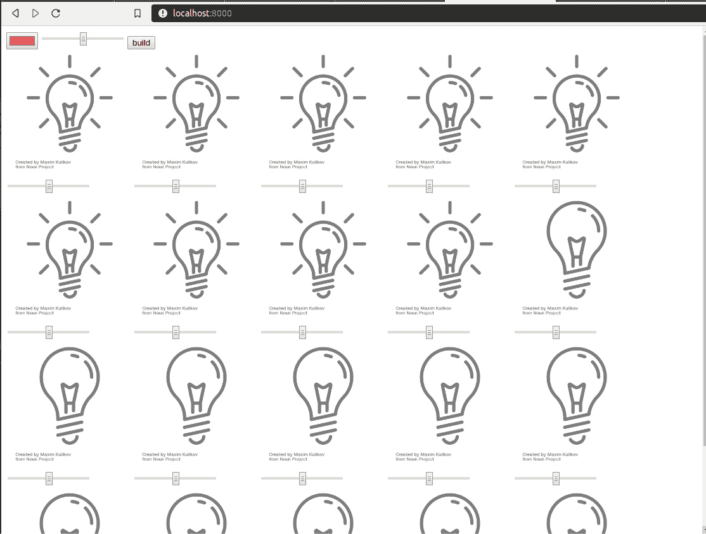

# 五、模块化 JavaScript

## 学习目标

在本章结束时，你将能够:

*   在 JavaScript 中导入和导出函数和对象，以实现代码重用性
*   使用 JavaScript ES6 类来降低代码复杂度
*   在 JavaScript 中实现面向对象的编程概念
*   使用封装为对象创建私有变量
*   使用 Babel 将 ES6 转换为通用 JavaScript
*   用 JavaScript 创建并发布一个 npm 包
*   使用可组合性和策略组合模块以创建更高级别的模块

在本章中，我们将学习现代 JavaScript 中可重用代码的重要性，以及 ES6 如何引入语法来轻松创建和使用模块。 我们将创建一个 JavaScript 模块，它可以被 API 的不同端点导入和使用。

## 简介

在前一章中，我们使用 Node.js 和 Express 构建了一个 API。 我们讨论了 API 结构的设计、HTTP 方法和**JSON Web Token**(**JWT**)认证。 在本章中，我们将探讨 JavaScript 模块和基于模块的设计的各个方面。

模块对于提高编程效率很重要，将软件分解成可重用的模块。 模块化设计鼓励开发人员用小型的、单一焦点的组件构建软件。 您可能熟悉流行的 UI 库，如 Bootstrap、Material-UI 和 jQuery UI。 这些都是组件的集合——有目的地构建的最小图形元素，以便它们可以在许多情况下使用。

由于图形元素和编程方面广泛使用了外部库，大多数开发人员已经熟悉了模块的使用。 也就是说，使用模块要比创建一个模块或以模块化的方式编写应用容易得多。

#### 说明组件、模块和 ES6 模块

关于这些术语的确切用法和关系，众说纷纭。 在本章中，我们将组件称为可在网站上使用的可视化小部件。

我们将模块称为在一个文件中编写并在另一个文件中导入和使用的源代码。 由于大多数组件都是可重用代码(通常由脚本标记导入)，所以我们将它们视为模块。 当然，当您导入 Bootstrap 库时，您将导入所有组件。 也就是说，大多数库提供编译和导入所需的特定组件的能力——例如，[https://getbootstrap.com/docs/3.4/customize/](https://getbootstrap.com/docs/3.4/customize/)。

当我们提到 ES6 模块时，我们谈论的是添加到 ES6 JavaScript 中的特定语法，它允许在一个文件中导出模块，并在另一个文件中导入它。 虽然 ES6 模块是 ES6 标准的一部分，但重要的是要记住，浏览器目前不支持它们。 使用它们需要一个预编译步骤，我们将在本章中介绍。

最近 JavaScript 的流行度和生产率的爆炸式增长，部分是由于**节点包管理器**(**npm**)生态系统。 无论是使用 JavaScript 进行前端开发还是后端开发，在某些时候你都必须使用 npm。 通过简单的`npm install`命令，开发人员可以使用数百个有用的包。

与任何编程语言相比，NPM 已经成为互联网上最大的模块化代码源。 NPM 现在包含近 5 亿个包。

npm 上的所有包的核心都是模块。 通过将相关功能分组为一个模块，我们可以在多个项目或单个项目的多个方面重用该功能。

npm 上所有优秀的包都是以一种很容易在许多项目中重用的方式构建的。 例如，一个好的日期时间选择器小部件可以跨数千个项目使用，节省了许多小时的开发时间，并可能产生更好的最终产品。

在本节中，我们将讨论模块化 JavaScript，以及如何通过模块化的方式编写 JavaScript 来改进代码。 这包括导出和导入的基本语法，但除此之外，还有一些模式和技术可以用来编写更好的模块，比如在模块开发中有用的面向对象编程概念。 然而，JavaScript 在技术上是面向原型的，这是一种特定的面向对象编程风格，在使用原型而不是类方面与经典的面向对象风格有所不同。 我们将在本章后面讨论原型和类。

### 依赖和安全

虽然模块是一种强大的技术，但如果不小心使用，它们也可能失去控制。 例如，添加到`node.js`项目中的每个包都包含自己的依赖项。 因此，密切关注您正在使用的包，以确保您不会恶意导入任何内容，这一点很重要。 有一个有用的工具在网站[http://npm.broofa.com](http://npm.broofa.com)，在那里你可以上传一个`package.json`文件，并得到一个可视化的依赖。

如果我们从*`package.json`文件练习 1 中,创建一个与索引表达项目路线*,在*第四章,基于 rest 的 api 和 node . js*,作为一个例子,它只包含四个`dependencies`:

```js
  "dependencies": {
   "express": "^4.16.4",
   "express-validator": "^5.3.1",
   "jwt-simple": "^0.5.6",
   "mongodb": "^3.2.3"
  }
```

然而，当我们上传这个`package.json`文件时，我们可以看到，当考虑到子依赖项时，我们的 4 个依赖项膨胀到超过 60 个:


###### 图 5.1:package.json 中的 61 个依赖项

这突出了与基于模块的设计相关的风险，以及在制作和使用模块时需要进行深思熟虑的设计。 编写糟糕的包或模块可能会产生意想不到的后果。 近年来，已经出现了被广泛使用的包变成恶意包的故事。 例如，`event-stream`包在 2018 年的 2.5 个月内被下载超过 800 万次。 人们发现，这个曾经合法的模块被更新，试图从用户的机器中窃取加密货币。 除了安全风险和 bug 之外，还存在污染全局名称空间或降低父项目性能的风险。

#### 注意 npm 审计

作为对恶意依赖项或子依赖项的响应，npm 添加了一个`audit`命令，可以用来检查包的依赖项是否为恶意模块。 在 Node.js 项目的目录下运行`npm audit`，检查项目的依赖项。 当你安装从 GitHub 等地方下载的项目时，该命令也会自动作为`npm install`的一部分运行。

### 模块化的其他成本

与模块化设计相关的其他成本包括:

*   装载多个零件的成本
*   坏模块的成本(安全性和性能)
*   使用的模块总数迅速增加

总的来说，这些成本一般是可以接受的，但应该谨慎使用。 当涉及到与加载许多模块相关的开销时，像`webpack`和`babel`这样的预编译器可以帮助您将整个程序转换为单个文件。

当你创建一个模块或导入一个模块时，需要记住以下几点:

*   使用模块是否隐藏了显著的复杂性或节省了大量的工作?
*   模块是否来自可信的源代码?
*   它有很多子依赖关系吗?

以 npm 包`isarray`为例。 这个包包含一个函数，它只运行:

```js
return toString.call(arr) == '[object Array]';
```

在这个例子中，第一个问题“使用模块是否隐藏了显著的复杂性?”的答案是否定的。 第二个问题——“它是可信的消息来源吗?” 不是特别。 最后，在回答关于子依赖关系的最后一个问题时，它没有——这是一件好事。 鉴于此模块的简单性，建议仅根据前面的一行代码编写自己的函数。

应该避免粗心地安装那些在增加项目复杂性的同时没有带来任何好处的包。 如果考虑上述三点，您可能会发现导入`isarray`之类的包并不值得。

### 审核进出口

在最后一节中，我们使用了导入和导出，而没有深入讨论这个主题。 每当我们创建一个新的路由时，我们确保把它放在自己的`routes`文件夹中的文件中。 如果你还记得，我们所有的路由文件都以导出`router`对象的行结束:

```js
module.exports = router;
```

我们还使用 Node.js 内置的`require`函数来使用我们的路由:

```js
let light = require('./routes/devices/light');
```

### 分离关注点

当涉及到设计模块时，其中一个关键概念是**关注点**分离。 关注点分离意味着我们应该将我们的软件分割成处理程序中单个关注点的部分。 一个好的模块将专注于做好功能的单个方面。 受欢迎的例子包括:

*   一个包，有几种方法连接和使用 MySQL 数据库
*   Lodash—一个有效解析和使用数组、对象和字符串的包
*   时刻-一个受欢迎的软件包，用于处理日期和时间

在这些包或在我们自己的项目中，通常会进一步分离成子模块。

#### 注 ES6

我们已经在前面的章节中使用了一些 ES6 特性，但是，作为提醒，ES6，或者更长的 ECMAScript，是欧洲计算机制造商协会脚本的缩写。 ECMA 是负责标准标准化的组织，包括 2015 年标准化的新版 JavaScript。

## ES6 模块

在使用 Node.js 编写 JavaScript 时，使用内置的`require()`函数导入模块的能力早已被使用。 由于这个特性非常有用，许多前端开发人员开始使用它，使用 Babel 之类的编译器对 JavaScript 进行预处理。 JavaScript 预编译器处理在大多数浏览器上通常无法工作的代码，并生成一个兼容的新 JavaScript 文件。

由于在 JavaScript 中对导入样式函数的需求很大，最终在 ES6 版本中将其添加到语言中。 在撰写本文时，大多数浏览器的最新版本几乎完全兼容 ES6。 然而，不能想当然地使用`import`，因为许多设备将继续运行多年的老版本。

ES6 的快速标准化告诉我们，未来，ES6 进口将是最受欢迎的方式。

在上一章中，我们使用 Node.js`require`方法导入模块。 例如，这一行:

```js
const express = require('express');
```

另一方面，ES6`import`函数的语法如下:

```js
import React from 'react';
```

ES6`import`功能还允许您导入模块的一个分段，而不是导入整个模块。 这是 ES6 的`import`优于 Node.js 的`require`函数的一个功能。 导入单个组件有助于节省应用中的内存。 例如，如果我们想使用 Bootstrap 的 React 版本中的`button`组件，我们可以直接导入:

```js
import { Button } from 'reactstrap';
```

如果我们想要导入额外的组件，我们只需将它们添加到列表中:

```js
import { Button, Dropdown, Card } from 'reactstrap';
```

#### 注意反应

如果您曾经使用过流行的前端框架 React，您可能已经见过这种类型的导入。 该框架以其对模块化的关注而闻名。 它采用交互式前端元素并将它们打包为组件。

在传统的普通 JavaScript/HTML 中，项目通常被划分为 HTML/CSS/JavaScript，不同的组件分布在这些文件中。 相反，React 将元素的相关 HTML/CSS/JavaScript 打包到单个文件中。 然后该组件被导入到另一个 React 文件中，并作为应用中的元素使用。

### 练习 22:Writing a Simple ES6 Module

#### 请注意

本章有一个起始目录，可以在[https://github.com/TrainingByPackt/Professional-JavaScript/tree/master/Lesson05/start](https://github.com/TrainingByPackt/Professional-JavaScript/tree/master/Lesson05/start)找到。

这个练习的完成代码可以在[https://github.com/TrainingByPackt/Professional-JavaScript/tree/master/Lesson05/Exercise22](https://github.com/TrainingByPackt/Professional-JavaScript/tree/master/Lesson05/Exercise22)中找到。

在这个练习中，我们将使用 ES6 语法导出和导入一个模块:

1.  将目录改为`/Lesson_05/start/`; 我们将以此作为起点。
2.  使用`npm install`安装项目依赖项。
3.  使用如下代码创建`js/light.js`文件:

    ```js
    let light = {};
    ```

    ```js
    light.state = true;
    ```

    ```js
    light.level = 0.5;
    ```

    ```js
    var log = function () {
    ```

    ```js
      console.log(light);
    ```

    ```js
    };
    ```

    ```js
    export default log;
    ```

4.  打开文件`js/viewer.js`。 这是将在我们的页面上运行的 JavaScript。 在文件的顶部添加:

    ```js
    import light from './light.js';
    ```

5.  在`js/viewer.js`底部添加:

    ```js
    light();
    ```

6.  `js/viewer.js`已经包含在`index.html`中，所以我们现在可以从`npm start`开始。
7.  服务器运行后，打开浏览器，进入`localhost:8000`。 到达后，按*F12*打开开发工具。

如果你做的一切都是正确的，你应该看到我们的对象被记录在谷歌 Chrome 控制台:


###### 图 5.2:在谷歌 Chrome 控制台记录的对象

### JavaScript 中的对象

如果您编写 JavaScript 的时间很短，您很快就会遇到`object`类型。 JavaScript 是使用原型设计的，这是一种基于对象的编程。 JavaScript 中的对象是一个可以包含多个属性的变量。 这些属性可以指向值、子对象甚至函数。

JavaScript 程序中的每个变量要么是对象，要么是原语。 原语是一种更基本的类型，它只包含一条信息，没有属性或方法。 使 JavaScript 复杂化并使对象变得更加重要的是，即使是最基本的类型，如字符串和数字，一旦赋值给变量，也会被包装在对象中。

例如:

```js
let myString = "hello";
console.log(myString.toUpperCase()); // returns HELLO
console.log(myString.length); // returns 5
```

前面的代码表明，即使是 JavaScript 中的基本字符串变量也有属性和方法。

真正的原语没有属性或方法。 例如，直接声明的数字是原语:

```js
5.toString(); // this doesn't work because 5 is a primitive integer
let num = 5;
num.toString(); // this works because num is a Number object
```

### 原型

如前所述，JavaScript 是一种面向原型的语言。 这是面向对象编程的一种变体，使用原型而不是类。 原型是用作另一个对象起点的对象。 例如，在上一节中，我们看了一个简单的字符串变量:

```js
let myString = "hello";
```

正如我们在上一节中看到的，`myString`带有一些内置函数，如`toUpperCase()`和属性，如`length`。 在幕后，`myString`是一个从字符串原型创建的对象。 这意味着存在于字符串原型中的所有属性和函数也存在于`myString`中。

JavaScript 对象包含一个叫做`__proto__`属性的特殊属性，它包含对象的父原型。 要查看这个，让我们在谷歌 Chrome 开发者控制台运行`console.dir(myString)`:


###### 图 5.3:JavaScript 原型(String)

运行该命令将返回`String`，该对象包含多个方法。 内置的`String`对象本身有一个原型。 接下来，运行`console.dir(myString.__proto__.__proto__)`:



###### 图 5.4:JavaScript 中的原型(对象)

使用附加的`__proto__`属性再次运行它将返回`null`。 所有 JavaScript 的原型最终都会变成`null`，这是唯一一个本身没有原型的原型:


###### 图 5.5:额外的 _proto_ 返回 null

这种关系，即一个原型导致另一个原型，以此类推，被称为原型链:


###### 图 5.6:原型链

无论何时在 JavaScript 中使用变量的属性，它都会从当前对象开始，如果找不到，就会在父原型中查找。 因此，当我们运行`myString.toUpperCase()`时，它首先在`myString`中查找。 在没有找到同名的方法后，它检查`String`，在那里找到方法。 在`String`不包含该方法的情况下，它将检查`Object`原型，然后到达`null`，此时返回`not found error`。

JavaScript 提供语法来重新定义任何原型函数的行为，无论是内置的还是用户定义的。 这可以通过以下命令来完成:

```js
Number.prototype.functionName = function () {
  console.log("do something here");
}
```

在下一个练习中，我们将修改内置的`Number`原型，以赋予它一些额外的功能。 记住，这种技术既可以应用于内置原型，也可以应用于定制原型。

### 练习 23:扩展数字原型

在本练习中，我们将看一个扩展 JavaScript 内置原型`Number`的示例，以包含一些附加函数。 在*步骤 1*之后，看你是否能自己想出第二个解决方案:

*   Double(返回值乘以 2)
*   平方(返回与自身相乘的数字)
*   Fibonacci(以 Fibonacci 序列返回`n`，其中每个数字是前两个数字的和)
*   阶乘(返回 1 和`n`之间所有数相乘的结果)

以下是遵循的步骤:

1.  在一个新文件夹中创建一个名为`number.js`的文件。 我们将从添加一个`double`函数到`Number`原型开始。 注意使用`this.valueOf()`来检索数字的值:

    ```js
    Number.prototype.double = function () {
    ```

    ```js
      return this.valueOf()*2;
    ```

    ```js
    }
    ```

2.  接下来，按照同样的模式，我们将添加任意数的平方的解:

    ```js
    Number.prototype.square = function () {
    ```

    ```js
      return this.valueOf()*this.valueOf();
    ```

    ```js
    }
    ```

3.  Again, we'll follow the same pattern, though the solution to this one is a bit trickier, as it uses recursion with memorization, and the use of the `BigInt` prototype:

    ```js
    Number.prototype.fibonacci = function () {
    ```

    ```js
      function iterator(a, b, n) {
    ```

    ```js
       return n == 0n ? b : iterator((a+b), a, (n-1n))
    ```

    ```js
      }
    ```

    ```js
      function fibonacci(n) {
    ```

    ```js
       n = BigInt(n);
    ```

    ```js
       return iterator(1n, 0n, n);
    ```

    ```js
      }
    ```

    ```js
      return fibonacci(this.valueOf());
    ```

    ```js
    }
    ```

    #### BigInt(大整数)

    您将注意到，在前面的步骤中，我们使用了`BigInt`关键字。 `BigInt`和`Number`一样，是另一个 JavaScript 内建的原型。 这是 ES6 中的第一个新原语。 主要的区别是，`BigInt`对于处理非常大的数字是安全的。 `Number`原型开始失效，任何值大于`9007199254740991`。

    一个数字可以通过`BigInt()`或者附加`n`来转换为`BigInt`; 注意`0n`、`1n`的使用。

4.  `BigInt`:

    ```js
    Number.prototype.factorial = function () {
    ```

    ```js
      factorial = (n) => {
    ```

    ```js
       n = BigInt(n);
    ```

    ```js
       return (n>1) ? n * factorial(n-1n) : n;
    ```

    ```js
      }
    ```

    ```js
      return factorial(this.valueOf());
    ```

    ```js
    }
    ```

5.  ```js
    let n = 100;
    ```

    ```js
    console.log(
    ```

    ```js
      "for number " + n +"\n",
    ```

    ```js
      "double is " + n.double() + "\n",
    ```

    ```js
      "square is " + n.square() + "\n",
    ```

    ```js
      "fibonacci is " + n.fibonacci() + "\n",
    ```

    ```js
      "factorial is " + n.factorial() + "\n"
    ```

    ```js
    );
    ```

6.  Run the script using Node.js:

    ```js
    node number.js
    ```

    你应该得到如下类似的结果:

    

###### 图 5.7:扩展 JavaScript 的内置原型后的输出

### ES6 类

如前所述，基于原型的语言和经典的面向对象语言之间的一个关键区别是使用原型而不是类。 然而，ES6 引入了内置类。 首先，我们将通过创建一个`Vehicle`原型/类和`Car`原型/类来比较和创建一个 ES6 类语法中的对象。

一、原型方式:

```js
function Vehicle(name, color, sound) {
   this.name = name;
   this.color = color;
   this.sound = sound;
   this.makeSound = function() {console.log(this.sound);};
}
var car = new Vehicle("car", "red", "beep");
car.makeSound();
```

然后，同样的事情发生在 ES6 类上:

```js
class Vehicle {
   constructor(name, color, sound) {
      this.name = name;
      this.color = color;
      this.sound = sound;
      this.makeSound = () => console.log(this.sound);
   }
}
const car = new Vehicle("car", "red", "beep");
car.makeSound();
```

ES6 的类语法允许我们以面向对象的方式编写代码。 在语言的较低层次上，类只是用于创建原型的语法样式。

在下一节中，我们将讨论使用 ES6 类进行面向对象风格的编程。

## 面向对象编程(OOP)

明确区分 JavaScript 对象和**面向对象编程**(**面向对象**)很重要。 这是两件非常不同的事情。 JavaScript 对象只是一个包含属性和方法的键值对。 另一方面，OOP 是一组可以用来编写更有组织、更高效代码的原则。

OOP 不是模块化 JavaScript 所必需的，但它包含了许多与模块化 JavaScript 相关的概念。 类的使用是 OOP 的一个基本方面，它允许我们通过创建类和子类来重用代码。

它教会我们以一种使维护和调试更容易的方式对程序的相关方面进行分组。 它关注的是类和子类，这使得代码重用更加实用。

从历史上看，OOP 成为处理通常用过程代码编写的意大利式代码(混乱、难以阅读的代码)的流行方法。 通常，由于功能的相互依赖，无组织的过程代码变得脆弱和僵硬。 程序某个方面的更改可能会导致完全无关的错误出现。

想象一下，我们正在修理一辆汽车，由于更换了前灯而导致引擎出了问题。 我们会认为这是糟糕的建筑部分的汽车设计师。 模块化编程包括程序的公共方面的分组。

OOP 有四个核心概念:

*   抽象
*   封装
*   继承
*   多态性

在本章中，我们将研究这四个原则，以及如何使用 ES6 语法在 JavaScript 编程语言中使用它们。 在这一章中，我们会试着把重点放在实际应用上，但又会回到上面的核心概念上来。

### 抽象

抽象是贯穿于编程过程的高级概念，是面向对象编程的基础。 它允许我们创建复杂的系统，而不必处理特定的实现。 当我们使用 JavaScript 时，许多东西都是默认抽象的。 例如，考虑以下数组和内置的`includes()`函数的使用:

```js
let list = ["car", "boat", "plane"];
let answer = list.includes("car") ? "yes" : "no";
console.log(answer);
```

我们不需要知道运行`includes()`时使用的算法或代码。 我们只需要知道，如果`car`在数组中，它将返回`true`，如果不在数组中，则返回`false`。 这是一个抽象的例子。 随着 JavaScript 版本的变化，`include()`算法的内部工作方式也可能发生变化。 它可能在某种程度上变得更快或更智能，但因为它是抽象的，我们不需要担心程序中断。 我们只需要知道返回`true`或`false`的条件。

我们不需要考虑计算机如何将二进制文件转换为屏幕上的可视化文件，或者按下一个键如何在浏览器中创建一个事件。 甚至组成 JavaScript 语言的关键字本身也是代码。

当我们使用内置 JavaScript 函数时，可以查看执行的底层代码，这在浏览器引擎之间是不同的。 与`JSON.stringify()`。

让我们花点时间想想什么是抽象对象。 假设你旁边的桌子上有一个苹果; 这是一个特殊的苹果。 这是苹果的概念或分类的一个例子。 我们也可以讨论苹果的概念以及是什么让苹果成为苹果; 苹果的共同特征是什么?

当我说*苹果*这个词时，一幅水果的画面就会进入你的脑海。 你想象苹果的具体细节是基于你对苹果的想象。 当我们在计算机程序中定义 apple 类时，我们正在定义程序如何定义 apple 类。 就像在我们的想象中一样，对一件事的想法可以是我们想要的具体或不具体。 它可能只包含几个因素，比如形状和颜色，或者几十个因素，包括重量、产地和味道。

### 类和构造函数

在第一个练习中，我们创建了一个光模块。 虽然它是一个模块，但它不是面向对象的。 在本节中，我们将以面向对象的方式重新设计该模块。

类最基本的一个方面是它的构造函数。 构造函数是一个内置函数，在创建类的实例时调用它。 通常，构造函数用于定义对象的属性。 例如，你经常会看到这样的东西:

```js
class Apple {
  constructor(color, weight) {
   this.color = color;
   this.weight = weight;
  }
}
```

传递的参数被保存到实例中供以后使用。 您还可以添加一些不基于所传递参数的额外属性。 例如，假设我们想通过附加日期时间戳给苹果一个生日。 我们可以在构造函数中添加第三行:

```js
  this.birthdate = Date.now();
```

或者我们可能想在 light 模块中调用其他函数。 想象一下，在一款游戏中，每个进入游戏世界的苹果都有十分之一的腐烂几率:

```js
  this.checkIfRotten();
```

我们的类需要包含一个`checkIfRotten`函数，它将在 10 次中有 1 次将`isRotten`属性设置为`true`:

```js
checkIfRotten() {
  If (Math.floor(Math.random() * Math.floor(10)) == 0) {
   this.isRotten = true;
  } else {
   this.isRotten = false;
  }
}
```

### 练习 24:转换光模块到类

#### 请注意

本练习以本章*练习 22,Writing a Simple ES6 Module*的最终产物为起点。 完成本练习后的代码状态可以在[https://github.com/TrainingByPackt/Professional-JavaScript/tree/master/Lesson05/Exercise24](https://github.com/TrainingByPackt/Professional-JavaScript/tree/master/Lesson05/Exercise24)中找到。

让我们回到本章*练习 22,Writing a Simple ES6 Module，*中的轻例。 我们将采用上一章中为 light 模块定义的属性，并在创建时分配它们。 此外，我们将编写检查 light 属性格式的函数。 如果创建的灯的属性值无效，我们将把它设置为默认值。

下面是执行该练习的步骤:

1.  打开`js/light.js`并删除前面练习中的代码。
2.  为`Light`类创建一个类声明:
3.  将`constructor`函数添加到类中，并设置参数的属性以及`datetime`属性。 我们不直接设置`state`和`brightness`，而是首先将参数传递给两个函数以检查正确的格式。 这些函数的逻辑将按照以下步骤编写:

    ```js
    class Light  {
    ```

    ```js
      constructor(state, brightness) {
    ```

    ```js
       // Check that inputs are the right types
    ```

    ```js
       this.state = this.checkStateFormat(state);
    ```

    ```js
       this.brightness = this.checkBrightnessFormat(brightness);
    ```

    ```js
       this.createdAt = Date.now();
    ```

    ```js
      }
    ```

    ```js
    }
    ```

4.  添加`checkStateFormat`和`checkBrightnessFormat`功能类声明:

    ```js
      checkStateFormat(state) {
    ```

    ```js
       // state must be true or false
    ```

    【4】【5】

    ```js
       } else {
    ```

    ```js
        return false;
    ```

    【显示】

    ```js
      }
    ```

    ```js
      checkBrightnessFormat(brightness) {
    ```

    ```js
       // brightness must be a number between 0.01 and 1
    ```

    【病人】

    ```js
        brightness = 1;
    ```

    ```js
       } else if(brightness > 1) {
    ```

    ```js
        brightness = 1;
    ```

    【t16.1】

    ```js
        brightness = 0.01;
    ```

    ```js
       }
    ```

    ```js
       return brightness;
    ```

    ```js
      }
    ```

5.  添加一个`toggle`函数和一个`test`函数，我们将用于调试。 这两个函数也应该在类声明中。 `toggle`函数将简单地将光的状态转换为与当前状态相反的状态;

    ```js
      toggle() {
    ```

    ```js
       this.state = !this.state;
    ```

    ```js
      }
    ```

    ```js
      test() {
    ```

    ```js
       alert("state is " + this.state);
    ```

    ```js
      }
    ```

6.  在`js/lightBulb.js`中，在你的类声明下面，添加一个模块导出，就像我们在前面的练习中做的那样:
7.  打开`js/viewer.js`并替换我们在*练习 22，编写一个简单的 ES6 模块*中编写的`light()`行，使用一个包含`Light`类实例的变量:

    ```js
    let light = new Light(true, 0.5);
    ```

8.  在`js/viewer.js`的上一行下面，添加以下代码。 这段代码连接源图像的`state`,和图像的不透明度`brightness`:

    ```js
    // Set image based on light state
    ```

    【4】【5】

    ```js
    bulb.style.opacity = light.brightness;
    ```

    ```js
    // Set slider value to brightness
    ```

    【显示】

    ```js
    bulb.onclick = function () {
    ```

    ```js
      light.toggle();
    ```

    ```js
      bulb.src = light.state ? onImage : offImage;
    ```

    【病人】

    ```js
    slider.onchange = function () {
    ```

    ```js
      light.brightness = this.value;
    ```

    ```js
      bulb.style.opacity = light.brightness;
    ```

    【t16.1】
9.  Return to the project directory and run `npm start`. With the project running, open `localhost:8000` in your browser. You should see a new picture for the light indicating that it's on:

    

###### 图 5.8:true 状态的光

打开页面后，单击图像，并确保这样做会导致图像发生更改。 另外，请注意页面底部的输入滑块。 尝试改变这个值以确认这样做会更新图像的不透明度。

#### 注意类的命名约定

在前面的代码中，我们创建了一个`Light`类。 注意，我们使用的是大写“L”，而不是 JavaScript 中常用的驼峰大小写。 通常的做法是将类的名称大写; 有关命名约定的更多细节，请参阅谷歌的 JavaScript 样式指南:[https://google.github.io/styleguide/javascriptguide.xml#Naming](https://google.github.io/styleguide/javascriptguide.xml#Naming)。

驼峰式是 JavaScript 中最流行的命名风格。 其他样式包括 snake_case、kebab-case 和 PascalCase。

### 默认属性

在类中最常见的用法之一是使用默认属性值。 通常，你想创建一个类的实例，但不关心属性的细节-不指定参数，例如:

```js
myLight = new Light();
```

`state`和`brightness`默认为`undefined`。

在我们编写的代码中，调用没有属性的`light`不会引发错误，因为我们已经编写了`checkStateFormat`和`checkBrightnessFormat`来解释所有无效值。 然而，在很多情况下，你可以通过在构造函数中提供如下默认值来简化你的代码:

```js
  constructor(state=false, brightness=100) {
```

前面的语法不是特定于类`constructor`，可以用来设置任何函数的默认参数，假设你使用的是 ES6、ES2015 或更新版本的 JavaScript。 在 ES2015 之前的版本中没有默认参数。

### 封装

封装是指模块应该只在必要时提供对象属性供使用。 此外，应该使用函数而不是直接访问和修改属性。 举个例子，让我们回到 light 模块。 在`constructor`函数中，我们确保首先通过状态检查器运行这些值:

```js
  constructor(state, brightness) {
   // Check that input has the right format
   this.brightness = this.checkBrightnessFormat(brightness);
  }
```

假设您开发了前面的模块，并将其发布给您的同事使用。 您不必担心他们用错误的值初始化类，因为如果他们这样做，`checkBrightnessFormat()`将自动更正值。 然而，一旦类的实例存在，就不会阻止其他人直接修改该值:

```js
let light = new Light();
light.brightness = "hello";
```

在一个命令中，省略了`Light`类的`checkBrightnessFormat`功能，我们有一个`brightness`值为`hello`的灯。

封装是指以一种不可能的方式编写代码。 像 c#和 Java 这样的语言使得封装很容易。 不幸的是，即使是 ES6 更新，JavaScript 中封装的使用也不明显。 有几种方法可以做到这一点; 其中最流行的一种利用了内置的`WeakMap`对象类型，这也是 ES6 的新特性。

### WeakMap

WeakMap 对象是一个键值对集合，其中一个键是一个对象。 WeakMap 有一个特殊的特征，如果一个 WeakMap 中的键对象从程序中删除，并且没有对它的引用，则 WeakMap 将从其集合中删除相关的对。 这个删除对的过程称为垃圾收集。 因此，在使用映射可能导致内存泄漏的情况下，该元素特别有用。

在 Map 上使用 WeakMap 的一个例子是一个脚本，它跟踪动态变化的 HTML 页面中的每个元素。 假设 DOM 中的每个元素都被迭代，我们创建了关于 Map 中每个元素的一些额外数据。 然后，随着时间的推移，从 DOM 中添加和删除元素。 使用 Map，所有旧的 DOM 元素将继续被引用，通过存储与删除的 DOM 元素相关的无用信息，导致内存随着时间的推移而增加。 使用 WeakMap，删除 DOM 元素(它是集合中的关键对象)会导致在垃圾收集期间删除集合中的相关条目。

在这里，我们将使用`WeakMap()`。 首先，我们创建一个空的`map`变量，然后创建一个带有一些属性的`light`对象。 然后，我们将对象本身与字符串`kitchen light`关联起来。 这不是在`light`中添加属性的情况; 相反，我们使用对象时，就好像它是映射中的属性名:

```js
var map = new WeakMap();
var light = {state: true, brightness: 100};
map.set(light, "kitchen light");
console.log(map.get(light));
```

此外，重要的是要注意关键对象是基于对该对象的特定引用的。 如果我们用相同的属性值创建第二盏灯，它将被视为一个新键:

```js
let light2 = {state: true, brightness: 100};
map.set(light2, "bedroom light");
// above has not changed kitchen light reference
console.log(map.get(light));
```

如果我们更新一个对象的属性，并不会改变映射:

```js
light.state = false;
// reference does not change
console.log(map.get(light));
```

映射将一直存在，直到键对象超出范围，或者直到它被设置为空并被垃圾回收; 例如:

```js
light = null;
// value will not be returned here
console.log(map.get(light));
```

### Exercise 25: WeakMap for Encapsulation

#### 请注意

本练习使用本章的*练习 24，将光模块转换为类*的最终产物作为起点。 完成本练习后的代码状态可以在[https://github.com/TrainingByPackt/Professional-JavaScript/tree/master/Lesson05/Exercise25](https://github.com/TrainingByPackt/Professional-JavaScript/tree/master/Lesson05/Exercise25)中找到。

在本练习中，我们将使用`WeakMap`来创建不能直接从模块外部访问的私有变量。 执行以下步骤来完成练习:

1.  打开`js/light.js`，并在文件最上方添加一个名为`privateVars`:

    ```js
    let privateVars = new WeakMap();
    ```

    的`WeakMap`对象。
2.  在`js/light.js`,`constructor`修改函数的对象属性保存到`set``privateVars`使用方法,而不是直接在对象:

    ```js
    constructor(state, brightness) { 
    ```

    【5】

    ```js
      state = this.checkStateFormat(state);
    ```

    ```js
      brightness = this.checkBrightnessFormat(brightness);
    ```

    【显示】

    ```js
      let info = {
    ```

    ```js
       "state": state,
    ```

    ```js
       "brightness": brightness,
    ```

    【病人】

    ```js
      };
    ```

    ```js
    // Save info into privateVars 
    ```

    ```js
      privateVars.set(this, info); 
    ```

    【t16.1】
3.  现在，在`js/light.js`中，修改`toggle`函数，以便我们从名为`privateVars`的`WeakMap`对象获取状态信息。 注意，当我们设置变量时，我们发送回一个包含所有信息的对象，而不仅仅是`state`。 在我们的例子中，`light`的每个实例都有一个与`WeakMap`相关的

    ```js
    toggle() { 
    ```

    ```js
      let info = privateVars.get(this); 
    ```

    ```js
      info.state = !info.state;
    ```

    ```js
      privateVars.set(this, info); 
    ```

    ```js
    }
    ```

    的`info`对象。
4.  我们还需要以类似的方式修改`js/light.js`中的`test`功能。 我们将在警报中向用户发送的`state`源更改为`WeakMap`:

    ```js
    test() { 
    ```

    ```js
      let info = privateVars.get(this); 
    ```

    ```js
      alert("state is " + privateVars.get(this).state);
    ```

    ```js
    }
    ```

5.  由于封装剥夺了直接更改状态和亮度的能力，所以我们需要添加允许这一点的方法。 我们将从在`js/light.js`中添加`setState`函数开始。 注意，它几乎与我们的`toggle`功能相同:

    ```js
    setState(state) {
    ```

    ```js
      let info = privateVars.get(this);
    ```

    ```js
      info.state = checkStateFormat(state); 
    ```

    ```js
      privateVars.set(this, info); 
    ```

    ```js
    }
    ```

6.  接下来，在`js/light.js`中添加 getter 方法:

    ```js
    getState() {
    ```

    ```js
      let info = privateVars.get(this); 
    ```

    ```js
      return info.state;
    ```

    ```js
    }
    ```

7.  按照模式从过去的两步骤添加`brightness`属性的 getter 和 setter 函数`js/light.js`:

    ```js
    setBrightness(brightness) { 
    ```

    ```js
      let info = privateVars.get(this);
    ```

    【4】【5】

    ```js
    }
    ```

    ```js
    getBrightness() { 
    ```

    【显示】

    ```js
      return info.brightness;
    ```

    ```js
    }
    ```

8.  我们需要做的最后一个更改是在`js/viewer.js`。 下面的变量声明,每个参考光的亮度和状态更改为使用我们创建的 getter 方法:

    ```js
    // Set image based on light state
    ```

    ```js
    bulb.src = light.getState() ? onImage : offImage;
    ```

    ```js
    // Set opacity based on brightness
    ```

    【4】【5】

    ```js
    slider.value = light.getBrightness();
    ```

    ```js
    bulb.onclick = function () {
    ```

    【显示】

    ```js
      bulb.src = light.getState() ? onImage : offImage;
    ```

    ```js
    }
    ```

    ```js
    slider.onchange = function () {
    ```

    【病人】

    ```js
      bulb.style.opacity = light.getBrightness();
    ```

    ```js
    }
    ```

9.  使用`npm start`运行代码，并在`localhost:8000`在浏览器中查看页面项目。 检查以确保点击图像工作，以及使用输入滑块改变亮度:


###### 图 5.9:使用点击和滑块功能正确渲染站点

### getter 和 Setters

当使用封装时，大多数对象的部分或全部属性都会使用 getter 和 setter 函数，因为我们不再允许用户直接访问属性:

```js
console.log(light.brightness);
// will return undefined
```

相反，我们专门创建允许获取和设置属性的函数。 它们被称为 getter 和 setter，是一种流行的设计模式，特别是在 Java 和 c++等语言中。 如果你在上一个练习中完成了第 7 步，你应该已经为`brightness`添加了 setter 和 getter:

```js
setBrightness(brightness) {
  let info = privateVars.get(this);
  info.brightness = checkBrightnessFormat(state);
  privateVars.set(this, info);
}
getBrightness() {
  let info = privateVars.get(this);
  return info.brightness;
}
```

### 继承

继承是指一个类继承另一个类的属性和方法。 从另一个继承的类称为子类，从另一个继承的类称为超类。

从术语**超类**中，我们得到了内置的`super()`函数，它可以用来调用子类超类的构造函数。 我们将在本章的后面使用`super()`来创建我们自己的子类。

需要注意的是，类既可以是子类，也可以是超类。 例如，假设我们有一个模拟不同种类动物的程序。 在我们的程序中，我们有一个哺乳动物类，它是动物类的子类和狗类的超类。

通过以这种方式组织我们的程序，我们可以在动物类中放置与所有动物相关的属性和方法。 哺乳动物亚纲包含与哺乳动物相关的方法，但与爬行动物无关; 例如:


###### 图 5.10:JavaScript 中的继承

一开始这听起来可能很复杂，但它通常会节省大量的编码。 如果不使用类，我们就只能将方法从一个动物复制和粘贴到另一个动物。 随之而来的是必须在多个地方更新函数的困难。

回到我们的智能住宅场景，假设我们收到了一个新的彩色灯泡设备。 我们希望我们的彩色灯泡具有灯泡中包含的所有属性和功能。 此外，有色光应该有一个额外的属性`color`，包括一个十六进制颜色代码，一个颜色格式检查器，以及与改变颜色相关的功能。

我们的代码也应该这样写:如果我们对底层的`Light`类进行更改，彩色灯泡将自动获得任何添加的功能。

### Exercise 26: extended a Class

#### 请注意

本练习使用*练习 25 的最终产品(WeakMap for Encapsulation*)作为起点。 完成本练习后的代码状态可以在[https://github.com/TrainingByPackt/Professional-JavaScript/tree/master/Lesson05/Exercise26](https://github.com/TrainingByPackt/Professional-JavaScript/tree/master/Lesson05/Exercise26)中找到。

为了扩展前面练习中编写的`Light`类，我们将创建一个新的`ColorLight`类:

1.  在`/js/colorLight.js`处创建一个新文件。 在第一行，我们将导入`./light.js`，我们将使用它作为起点:

    ```js
    import Light from './light.js';
    ```

2.  接下来，我们将为私有变量创建`WeakMap`。 然后，我们将为我们的`ColorLight`类创建一个 class 语句，并使用`extends`关键字告诉 JavaScript 它将使用`Light`作为起点:

    ```js
    let privateVars = new WeakMap();
    ```

    ```js
    class ColorLight extends Light {
    ```

    ```js
    }
    ```

3.  在`ColorLight`类的声明中,我们将创建一个新的`super()``constructor`,它使用内置的功能,运行我们的`constructor()`功能基类,`Light`:

    ```js
    class ColorLight extends Light {
    ```

    ```js
      constructor(state=false, brightness=100, color="ffffff") {
    ```

    ```js
       super(state, brightness);
    ```

    【显示】

    ```js
       let info = {"color": this.checkColorFormat(color)};
    ```

    ```js
       // Save info into privateVars
    ```

    ```js
       privateVars.set(this, info);
    ```

    【病人】

    ```js
    }
    ```

4.  注意，在前面的构造函数中，我们调用了`checkColorFormat()`，这个函数将检查提供的颜色值是否为有效的十六进制值。 如果没有，我们将设置白色的十六进制值(#FFFFFF)。

    ```js
      checkColorFormat(color) {
    ```

    ```js
       // color must be a valid hex color
    ```

    ```js
       var isHexColor  = /^#[0-9A-F]{6}$/i.test('#'+color);
    ```

    ```js
       if(!isHexColor) {
    ```

    ```js
        // if invalid make white
    ```

    ```js
        color = "ffffff";
    ```

    ```js
       }
    ```

    ```js
       return color;
    ```

    ```js
      }
    ```

5.  添加 getter 和 setter 函数，就像我们在后面的练习中做的那样:
6.  在`js/colorLight.js`的底部，添加一个`export`语句，使模块可用于导入:
7.  打开文件顶部的`js/viewer.js`，将`Light`导入与`ColorLight`导入切换。 下面，我们将导入一个预先编写的脚本`changeColor.js`:

    ```js
    import ColorLight from './colorLight.js';
    ```

    ```js
    import changeColor from './__extra__/changeColor.js';
    ```

8.  下面，在`js/viewer.js`中，找到初始化`light`变量的行，并将其替换为:

    ```js
    let light = new ColorLight(true, 1, "61AD85");
    ```

9.  在`js/viewer.js`的底部增加以下内容:

    ```js
    // Update image color
    ```

    ```js
    changeColor(light.getColor());
    ```

10.  Start the program again using `npm start` and go to `localhost:8000` in your browser:

    如果正确地遵循了说明，现在应该看到浅绿色的光，如下图所示。 尝试打开`js/viewer.js`并改变十六进制值; 这样做应该会为光线图像产生不同的颜色:



###### 图 5.11:变色功能应用 CSS 过滤器使灯泡变绿

### 多态性

多态只是覆盖父类的默认行为。 在像 Java 和 c#这样的强类型语言中，多态性可能需要一些努力。 使用 JavaScript，多态很简单。 您只需重写一个函数。

例如，在前面的练习中，我们将`Light`与`ColorLight`类一起扩展。 假设我们想使用用`Light`编写的`test()`函数并覆盖它，这样我们就不会警报灯的状态，而是警报灯的当前颜色值。

所以，我们的`js/light.js`文件将包含以下内容:

```js
  test() {
   let info = privateVars.get(this); 
   alert("state is " + privateVars.get(this).state);
  }
Then all we have to do is create a new function in js/colorLight.js which has the same name, and replace state with color:
  test() { 
   let info = privateVars.get(this); 
   alert("color is " + privateVars.get(this).color);
  }
```

### 练习 27:灯泡建造者

#### 请注意

本练习以*练习 26*的终产物为起点。 完成本练习后的代码状态可以在[https://github.com/TrainingByPackt/Professional-JavaScript/tree/master/Lesson05/Exercise27](https://github.com/TrainingByPackt/Professional-JavaScript/tree/master/Lesson05/Exercise27)中找到。

在这个练习中，我们将使用到目前为止学到的概念来增强我们的示例项目。 不是只有一个灯泡，我们将修改项目，以允许我们创建无限的`lightbulb`类实例，选择颜色、亮度和状态:

1.  打开`js/light.js`，在`WeakMap`参比下面添加两个图像源:

    ```js
    let onImage = "img/bulb_on.png";
    ```

    ```js
    let offImage = "img/bulb_off.png";
    ```

2.  接下来，在`js/light.js`定义`info`变量的下面，添加以下内容:

    ```js
       // Create html element
    ```

    ```js
       let div = document.createElement("div");
    ```

    ```js
       let img = document.createElement("img");
    ```

    ```js
       let slider = document.createElement("input");
    ```

    ```js
       // Save reference to element as private variable
    ```

    ```js
       info.div = div;
    ```

    ```js
       info.img = img;
    ```

    ```js
       info.slider = slider;
    ```

    ```js
       this.createDiv(div, img, slider, state, brightness);
    ```

3.  在`js/light.js`的最后一步中，我们参考了`this.createDiv`。 在这一步中，我们将在`js/light.js`的构造函数下面创建该函数。 这个函数创建 HTML`Light`类的每个实例:

    ```js
      createDiv(div, img, slider, state, brightness) {
    ```

    【5】

    ```js
       let that = this;
    ```

    ```js
       // modify html
    ```

    【显示】

    ```js
       div.style.float = "left";
    ```

    ```js
       img.onclick = function () { that.toggle() };
    ```

    ```js
       img.width = "200";
    ```

    【病人】

    ```js
       img.style.opacity = brightness;
    ```

    ```js
       slider.onchange = function () { that.setBrightness(this.value) };
    ```

    ```js
       slider.type = "range";
    ```

    【t16.1】

    ```js
       slider.max = 1;
    ```

    ```js
       slider.step = 0.01;
    ```

    ```js
       slider.value = brightness;
    ```

    ```js
       div.appendChild(img);
    ```

    ```js
       div.appendChild(slider);
    ```

    ```js
       // append to document
    ```

    ```js
       document.body.appendChild(div);
    ```

    ```js
      }
    ```

4.  接下来，在`js/light.js`中，找到`setState`函数，并在函数中添加以下行:
5.  在`js/light.js`:

    ```js
    info.img.src = info.state ? onImage : offImage;
    ```

    中添加同一行`toggle`函数
6.  同样，我们将更新`js/light.js`中的`setBrightness`功能，根据亮度设置图像的不透明度:
7.  `js/light.js`中的最后一个变化是为`img`HTML 对象添加了一个 getter 函数。 将其置于`getBrightness`和`toggle`功能之间:

    ```js
      getImg() {
    ```

    ```js
       let info = privateVars.get(this);
    ```

    ```js
       return info.img;
    ```

    ```js
      }
    ```

8.  在`js/colorLight.js`中，我们将导入预构建的`colorChange`函数。 这应该与您的进口只是在`Light`下的进口:

    ```js
    import changeLight from './__extra__/changeColor.js';
    ```

9.  接下来，在`js/colorLight.js`中，我们将通过添加以下行来更新构造函数:
10.  在`js/viewer.js`中，删除所有代码，并替换为:

    ```js
    import ColorLight from './colorLight.js';
    ```

    ```js
    let slider = document.getElementById("brightnessSlider");
    ```

    ```js
    let color = document.getElementById("color");
    ```

    ```js
    let button = document.getElementById("build");
    ```

    ```js
    button.onclick = function () {
    ```

    ```js
      new ColorLight(true, slider.value, color.value);
    ```

    ```js
    }
    ```

11.  最后更改为`index.html`; 取下`img`、`input`标签，替换为

    ```js
      <div style="position: 'fixed', top: 0, left: 0">
    ```

    ```js
       <input type="color" id="color" name="head" value="#e66465">
    ```

    ```js
       <input id="brightnessSlider" min="0.01" max="1" step="0.01" type="range"/>
    ```

    ```js
       <button id="build">build</button>
    ```

    ```js
      </div>
    ```

12.  完成所有更改后，运行`npm start`并打开浏览器到`localhost:8000`。 如果你做对了，点击`build`按钮会根据所选的颜色为页面添加一个新元素:



###### 图 5.12:创建 lightclub 类的多个实例

如您所见，一旦您创建了单个事物的许多实例，类就真的开始派上用场了。 在下一节中，我们将研究 npm 包，以及如何导出`Light`类。

## npm 包

**npm 包**是一个 JavaScript 模块，已经打包并上传到 npm 服务器。 一旦一个模块被上传到 npm，它就可以被任何人快速安装和使用。

这对您来说可能并不新鲜，因为任何使用过 Node.js 的人都会很快安装一个包。 不太常见的是如何创建和上传一个包。 在不需要发布公共模块的情况下，作为开发人员花费数年时间是很容易的，但这是值得了解的。 它不仅可以帮助您导出自己的模块，还可以帮助您阅读和理解项目使用的包。

创建 npm 模块的第一步是确保你有一个完整的`package.json`文件。 在本地运行项目时，通常不需要担心**author**和**description**等字段。 当您准备一个模块供公众使用时，情况就不同了。 您应该花时间填写与您的软件包相关的所有字段。

下表包含了 npm 推荐的常用属性。 其中许多都是可选的。 更多信息和完整列表，请参考[https://docs.npmjs.com/files/package.json](https://docs.npmjs.com/files/package.json)。

元数据至少应该包括名称、版本和描述。 此外，大多数包将需要一个`dependencies`属性; 但是，当使用`npm install`安装依赖项时，应该使用`--save`或`-s`选项自动生成:


###### 图 5.13:npm 属性表

下表显示了 npm 的更多属性:


###### 图 5.14:npm 属性表继续

### npm 链接命令

完成了`package.json`以及您想测试的包的第一个版本之后，您就可以使用`npm link`命令了。 link 命令将你的本地 npm 项目与一个命名空间相关联。 例如，首先导航到你想使用本地`npm`包的项目文件夹:

```js
cd ~/projects/helloWorld
npm link
```

然后，进入另一个你想要使用该包的项目文件夹，并运行`npm link helloWorld`，其中`helloWorld`是你要测试的包的名称:

```js
cd ~/projects/otherProject
npm link helloWorld
```

这两个步骤将允许您使用`npm install helloWorld`安装`helloWorld`。 通过这样做，您可以确保在另一个项目中使用您的包时在本地工作。

### Npm 发布命令

一旦你对本地测试的结果感到满意，你可以很容易地使用`npm publish`命令将它上传到 npm。 使用`publish`命令，首先需要在[https://www.npmjs.com/](https://www.npmjs.com/)处创建一个帐号。 一旦您有了一个帐户，您就可以通过在命令行上运行`npm login`来本地登录它。

一旦登录，发布包就非常简单。 简单地导航到您的`project`文件夹并运行`npm publish`。 下面是一个成功上传到 npm 供其他人使用的包的例子:


###### 图 5.15:npm 包发布的例子

### ESM 与 CommonJS

ESM 是 ECMAScript Modules 的简称，是 ES6 中用于模块的标准。 所以，你可能会听到“ES6 模块”被称为 ESM。 这是因为 ESM 标准在 ES6 成为标准之前就已经在开发了。

你可能在前一章看到过 CommonJS 格式:

```js
const express = require('express');
```

ES6 模块样式的相同代码如下:

```js
import express from 'express';
```

ES6 模块很棒，因为它们让 JavaScript 开发人员对导入有更多的控制。 然而，需要注意的是，JavaScript 目前正处于过渡时期。 ES6 对 ES6 模块的工作方式给出了明确的标准。 虽然大多数浏览器都实现了它，但 npm 仍然在使用自己的标准 CommonJS。

也就是说，ES6 的引入很快就被接受了。 npm 现在发布了一个实验性的旗帜，`--experimental-modules`，允许使用 es6 风格的模块。 但是，不建议使用此标志，因为它增加了不必要的复杂性，例如必须将文件扩展名从`.js`更改为`.mjs`。

### 通天塔

在 Node.js 中使用 ES6 模块更常见和推荐的方法是运行 JavaScript 编译器。 最流行的编译器是`Babel.js`，它接受 ES6 代码，并将其编译为可以在任何地方运行的旧版本 JavaScript。

Babel 是 Node.js 生态系统中广泛使用的工具。 通常，项目会使用内置 Babel 和其他捆绑工具(如 webpack)的启动器模板。 这些启动项目允许开发人员在开始使用 ES6 导入时无需考虑需要编译步骤这一事实。 例如，Facebook 的 create-react-应用，每当对文件进行更改时，它就会编译并显示应用。

React 是推动 ES6 的最大社区之一。 在 React 生态系统中，使用的标准导入是 ES6。 以下内容取自 React 创建组件的文档:

```js
import React, { Component } from 'react';
class Button extends Component {
  render() {
   // ...
  }
}
export default Button; // Don't forget to use export default!
```

请注意前面的代码与我们正在处理的代码之间的相似性。 这是遗传的一个例子，`Button`继承了`Component`的属性，就像`ColorLight`继承了`Light`的属性一样。 React 是一个基于组件的框架，大量使用了 ES6 的特性，比如导入和类。

### webpack

另一个常见的 JavaScript 编译器是 webpack。 webpack 接受多个 JavaScript 文件，并将它们编译成一个单独的打包文件。 此外，webpack 还可以采取措施来提高性能，比如最小化代码以减少总大小。 webpack 在使用模块时特别有用，因为每一个单独的文件加载到 HTML 站点会增加加载时间，因为要进行额外的 HTTP 调用。

使用 webpack，我们可以非常简单地指定要编译的 JavaScript 的入口点，它会自动合并任何引用的文件。 例如，如果我们想编译上一个练习中的代码，我们可以创建一个`webpack.config.js`文件来指定入口点:

```js
const path = require("path");
module.exports = {
  mode: 'development',
  entry: "./src/js/viewer.js",
  output: {
   path: path.resolve(__dirname, "build"),
   filename: "bundle.js"
  }
};
```

注意上面定义了`entry`; 这将是我们程序的起点，从这里 webpack 将自动找到所有引用的文件。 另一个需要注意的重要值是`output`。 它定义了编译器创建的绑定 JavaScript 文件的位置和文件名。

在下一个练习中，我们将使用 Babel 将代码从 ES6 转换为通用 JavaScript。 一旦我们转换了 JavaScript，我们将使用 webpack 将结果文件编译成一个单独的 JavaScript 文件。

### 练习 28:使用 webpack 和 Babel 转换 ES6 和 Packages

#### 请注意

本练习使用*练习 27，灯泡建造者*的最终产品作为起点。 完成本练习后的代码状态可以在[https://github.com/TrainingByPackt/Professional-JavaScript/tree/master/Lesson05/Exercise28](https://github.com/TrainingByPackt/Professional-JavaScript/tree/master/Lesson05/Exercise28)中找到。

在这个练习中，我们将使用 Babel 将我们的 ES6 转换为通用 JavaScript，以兼容旧的浏览器，如 Internet Explorer。 我们要做的第二件事是运行 webpack 将所有的 JavaScript 文件编译成一个单独的文件:

1.  在你的项目基础上创建两个新文件夹，一个叫`build`，另一个叫`src`:

    ```js
    mkdir src build
    ```

2.  将`images`、`index.html`和`js`文件夹移动到新的`src`文件夹中。 后续将使用源文件夹生成`build`文件夹的内容:
3.  安装`babel-cli`和`babel preset`作为开发依赖:

    ```js
    npm install --save-dev webpack webpack-cli @babel/core @babel/cli @babel/preset-env
    ```

4.  添加一个名为`.babelrc`的文件到根目录。 在其中，我们将告诉巴别塔使用预置设置:

    ```js
    {
    ```

    ```js
      "presets": ["@babel/preset-env"]
    ```

    ```js
    }
    ```

5.  ```js
    const path = require("path");
    ```

    ```js
    module.exports = {
    ```

    ```js
      mode: 'development',
    ```

    ```js
      entry: "./build/js/viewer.js",
    ```

    ```js
      output: {
    ```

    ```js
       path: path.resolve(__dirname, "build"),
    ```

    ```js
       filename: "bundle.js"
    ```

    ```js
      }
    ```

    ```js
    };
    ```

6.  To generate the contents of the `build` folder from `src`, we need to add a new script command to our project. Open up `package.json` and look for the section that lists scripts. In that section, we'll add a `build` command that runs Babel and webpack and copies our `image` files to the `build` folder. We will also modify the `start` command to reference our `build` folder, so we can test it after building:

    ```js
      "scripts": {
    ```

    ```js
       "start": "ws --directory build",
    ```

    ```js
       "build": "babel src -d build && cp -r src/index.html src/images build && webpack --config webpack.config.js"
    ```

    ```js
      },
    ```

    #### 请注意

    Windows 用户应使用以下命令:

    `"build": "babel src -d build && copy src build && webpack --config webpack.config.js"`

7.  To make sure the command has been added properly, run `npm run build` on the command line. You should see output like this:

    

    ###### 图 5.16:npm 运行 build 输出

8.  接下来，打开`build/index.html`，更改`script`标签，导入我们新创建的文件`bundle.js`:

    ```js
    <script src="bundle.js"></script>
    ```

9.  To test, run `npm start` and open `localhost:8000` in the browser. You should see the same website as the last exercise. Press the `build` button a few times to ensure that it is working as expected:

    

    ###### 图 5.17:使用构建按钮测试运行

10.  要再次检查所有的编译是否正确，请到浏览器中的`localhost:8000/bundle.js`。 你应该会看到一个大文件，其中包含我们所有 JavaScript 源文件的编译版本:


###### 图 5.18:我们所有 JavaScript 源文件的编译版本

如果你做的一切都是正确的，你应该有一个`bundle.js`文件，其中包含我们所有的 JavaScript 代码编译成一个文件。

### 可组合性和组合模块的策略

我们已经看到一个模块可以是另一个模块的扩展，就像`ColorLight`是`Light`。 当项目增长时，另一个常见的策略是拥有由多个子模块组成的模块。

子模块的使用很简单，就像在模块文件中导入模块一样。 例如，我们想要改善光模块的亮度滑块。 也许，如果我们创建一个新的`Slider`模块，除了`Light`类之外，我们可以在多个情况下使用它。 在这种情况下，我们会建议将我们的“高级滑块输入”作为子模块。

另一方面，如果你认为你的新滑块只会在`Light`类中使用，那么添加它是一个新类只会产生更多的开销。 不要因为你有能力就陷入过度模块化的陷阱。 这里的关键因素是可重用性和实用性。

### 活动 6:创建闪光灯模式的灯泡

你工作的灯泡公司要求你为他们的产品做一个版本的工作。 他们想要一种能在活动和音乐会中使用的特殊“闪光模式”的灯泡。 闪光模式灯应该允许人们将灯置于闪光模式，并在给定的时间间隔自动开启和关闭。

创建一个扩展`Light`的`FlashingLight`类。 该类应该与`Light`相同，除了它有一个名为`flashMode`的属性。 如果`flashMode`开启，则状态值每 5 秒切换一次。

创建了这个新组件后，将它添加到`js/index.js`中的包导出中，并使用 Babel 编译项目。

执行以下步骤来完成活动:

1.  安装`babel-cli`和`babel`预设作为开发者依赖。
2.  加`.babelrc`告诉巴别塔使用`preset-env`。
3.  添加一个 webpack 配置文件，指定模式、条目和输出位置。
4.  创建一个新文件`js/flashingLight.js`; 它应该作为一个扩展`Light`的空白 ES6 组件开始。
5.  在文件的顶部，添加一个`weakMap`类型的`privateVars`变量。
6.  在构造函数中，设置`flashMode`属性并将其保存为`privateVars`。
7.  为`FlashingLight`对象添加一个 setter 方法。
8.  为`FlashingLight`对象添加一个 getter 方法。
9.  在第 2 行中，添加一个空变量，该变量将在类的全局级别跟踪闪烁的计时器。
10.  创建一个引用父类的`lightSwitch()`函数的`startFlashing`函数。 这一步很棘手，因为我们必须把它绑定到`setInterval`上。
11.  创建一个可以用来关闭计时器的`stopFlashing`函数。
12.  在构造函数中，检查`flashMode`是否为 true，如果为 true，运行`startFlashing`。
13.  同时，当设置`mode`时，检查`flashMode`，如果为 true，`startFlashing`; 否则，`stopFlashing`。
14.  在`index.js`中导入导出新组件。
15.  使用 npm 运行`build`函数编译代码。

**预期输出**



###### 图 5.19:有闪光模式的灯泡

#### 请注意

这个活动的解决方案可以在 599 页找到。

## 小结

在本章中，我们探讨了模块化设计的概念、ES6 模块以及它们在节点中的使用。 当设计一个由多层模块组成的复杂系统的程序时，面向对象设计的原则是有用的。

ES6 类允许我们比以前的 JavaScript 版本更容易地创建类。 这些类可以通过使用`extends`关键字来构建。 这允许在简单对象的基础上构建更复杂的对象，等等。

我们还看到了新的 ES6`WeakMap`类型如何允许我们创建私有变量。 这种模式限制了将被其他人使用的模块中的错误数量。 例如，通过要求更改属性，我们可以在允许更改之前检查格式和值。 这就是 light 示例的情况，我们想在允许设置`state`之前检查它是否是一个布尔值。 我们通过为每个私有变量创建 getter 和 setter 方法来实现这一点，我们想让代码的其他部分使用这些私有变量。

在那之后，我们讨论了为什么目前 Node.js 不支持 ES6 模块，即使像 facebook 支持的 React 这样的大牌项目大量使用了它们。 为了解决这个问题，我们安装了 Babel，一个 ES6-to-JavaScript 编译器，并使用它将我们的`src`文件夹转换为最终的构建代码。

我们还讨论了，一旦你有一个本地工作的项目，你如何将它转换为一个可以通过 npm 共享和更新的 npm 包。 这个过程涉及使用`npm link`在本地进行测试。 然后，一旦对包的工作方式感到满意，就使用`npm publish`发布它。

在下一章中，我们将着眼于代码质量，以及如何在更新代码时实现自动化测试以防止回归。