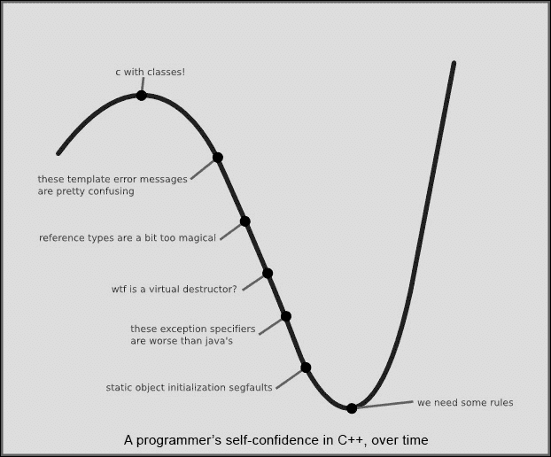
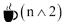

# 三、反应式编程——基本理论

反应式编程，包括后面将要讨论的函数式反应式编程，是一种可以在多参数语言中使用的编程范例，例如 JavaScript、Python、Scala 等等。它主要区别于命令式编程，在命令式编程中，语句通过所谓的*副作用*来做一些事情，在文献中，这是关于函数式和反应式编程的。不过，请注意，这里的副作用不是普通英语中的副作用，在普通英语中，所有药物都有一些影响，这是服用药物的要点，而其他一些影响是不需要的，但主要是有益的。例如，服用苯那君的明确目的是减轻空气过敏症状，而事实上，苯那君，在某种程度上类似于其他一些过敏药物，也可以引起困倦是(或至少曾经；现在它也作为助眠剂出售)一种*副作用*。这是不受欢迎的，但被人们视为两害相权取其轻，他们宁愿有点累，不被过敏困扰，也不愿警觉，但被频繁打喷嚏困扰。药物副作用很少是程序员通常认为的唯一副作用。对他们来说，*副作用*是语句的主要预期目的和效果，通常通过改变程序的存储状态来实现。

反应式编程的根源在于观察者模式，正如 Erich Gamma、Richard Helm、Ralph Johnson 和 John Vlissides 的经典著作*设计模式:可重用面向对象软件的元素*(这本书的作者通常被称为 *GoF* 或*四人组*)。在观察者模式中，有一个可观察的主体。它有一个侦听器列表，当它有东西要发布时会通知所有的侦听器。这比发布者/订阅者(PubSub)模式稍微简单一些，不需要对哪些消息到达哪个订阅者进行复杂的过滤，这是一个正常的特性。

反应式编程已经发展出了自己的生活，有点像 MVC 模式转变成的时髦词，但是它最好与 GoF 中探索的更广泛的背景联系起来。反应式编程，包括 ReactJS 框架(在本标题中探讨)，旨在避免共享的可变状态，并且是幂等的。这意味着，与 RESTful web 服务一样，无论您调用一次还是一百次，您都会从函数中获得相同的结果。皮特·亨特以前来自脸书，也许是现在 ReactJS 的代言人，他说他宁愿被预测，也不愿意做正确的事。如果他的代码中有一个错误，亨特宁愿界面每次都以同样的方式失败，也不愿为海森堡进行精心的搜寻。这些 bug 只出现在一些特殊和棘手的情况下，本书的后面将对此进行探讨。

ReactJS 被称为 *MVC* 的 *V* 。也就是说，它旨在用于用户界面工作，几乎没有提供其他标准功能的意图。但是，正如画家查尔斯·塞尚在谈到印象派画家克洛德·莫内时所说的那样，“莫奈只是一只眼睛，但却是一只眼睛！”关于 MVC 和 ReactJS，我们可以说，“ReactJS 只是一个视图，但又是怎样的一个视图！”

在本章中，我们将涵盖以下主题:

*   声明式编程
*   对海森堡的战争
*   通量建筑
*   从绝望的深渊到成功的深渊
*   一个完整的用户界面拆卸和重建
*   作为特定领域语言的 JavaScript
*   大咖啡符号

在本书中探索的图书馆 ReactJS 是由脸书开发的，并在不久的过去成为开源的。它是由脸书的一些考虑形成的，即制造一个可以安全调试和工作的大规模网站，并允许大量程序员在不同的组件上工作，而不必在他们的头脑中存储令人费解的复杂程度。“简单就是缺少交错”这句话可以在【http://facebook.github.io/react】的视频中找到，它不是关于绝对尺度上有多少或有多少东西，而是关于在一个系统上工作需要同时处理多少移动部件(更多思考请参见*大咖符号*一节)。

# 声明式编程

可能，ReactJS 框架最大的理论优势是编程是声明性的，而不是命令性的。在命令式编程中，您指定需要执行哪些步骤；声明式编程是这样一种编程，在这种编程中，您指定需要完成什么，而不告诉它需要如何完成。一开始从命令式范式转变为声明式范式可能很难，但一旦转变完成，就非常值得为此付出努力。

与命令式范例相反，声明式范例的常见例子包括 SQL 和 HTML。如果您必须指定如何准确地查找记录并适当地过滤它们，更不用说如何使用索引，那么 SQL 查询将会更加冗长；如果您必须指定如何呈现图像，而不是使用 IMG 标记，那么 HTML 将会更加冗长。例如，许多库比从头开始滚动自己的解决方案更具声明性。有了库，您更有可能只指定需要做什么，而不指定——除此之外——如何做。ReactJS 从任何意义上来说都不是唯一一个旨在提供更具声明性的 JavaScript 的库或框架，但这是它的卖点之一，同时它还提供了其他更好的细节来帮助团队合作并提高工作效率。同样，ReactJS 已经从脸书在管理 bug 和认知负载方面的一些努力中脱颖而出，同时使开发人员能够为大型项目做出很大贡献。

# 对海森堡的战争

在现代物理学中，海森堡的测不准原理笼统地说，粒子的位置和速度在理论上是有绝对限制的。不管实验室的测量设备有多好，当你试图把事情看得太重时，有趣的事情总是会发生。

不严格地说，Heisenbugs 是一种微妙、狡猾的 bug，很难确定。它们只在非常特定的条件下表现出来，甚至在试图研究它们时可能无法表现出来(请注意，这个定义与行话文件在[http://www.catb.org/jargon/html/H/heisenbug.html](http://www.catb.org/jargon/html/H/heisenbug.html)的更窄且更具体的定义略有不同，后者规定试图测量海森堡可能会抑制它的表现)。这一向海森堡宣战的动机源于脸书自身的困境，以及大规模工作和目睹海森堡不断涌现的经历。皮特·亨特提到的一件事，一点也不讨人喜欢，那就是脸书的广告系统只有两名工程师能很好地理解，他们能很好地修改它。这是一个需要避免的例子。

相比之下，看看皮特·亨特的评论，他“宁愿可预测而不是正确的”是一种说法，如果一个设计有缺陷的灯能着火并燃烧，他更愿意让它着火并立即燃烧，同样，每一次，比只是在月亮相位的错误点有东西燃烧。在第一种情况下，在制造商进行测试时，灯将无法通过测试，问题将会被注意到并得到解决，在缺陷得到财产解决之前，灯不会被运送到公众手中。与 Heisenbug 相反的情况是，灯在错误的条件下会发出火花并着火，这意味着只有在 laps 已经发货并开始烧毁客户的房屋后，缺陷才会被发现。“可预测”意味着“每次都以同样的方式失败，如果它真的会失败的话。”“正确意味着”成功通过测试，但我们不知道它们使用起来是否安全[可能不是]。“事实上，现在他最终关心的是正确与否，但脸书围绕“反应”所做的选择源于一种认识，即可预测是正确的一种手段。当消费者插上电源时，制造商装运的东西总是会着火，这是不可接受的。然而，可预测性将问题推到了前沿和中心，而不是在一些罕见的情况下会产生不可接受的后果的微妙的、难以确定的相互作用的偶然结果。Flux 和 ReactJS 中的选择旨在使失败变得显而易见并将它们带到表面，而不是它们只在软件迷宫的角落和缝隙中显现。

脸书对共享可变状态的战争在他们关于聊天 bug 的经历中得到了说明。聊天 bug 成为用户最关心的问题。对脸书来说，启蒙的一个关键时刻来了，他们宣布了一个完全不相关的功能，对这个功能的第一个评论是请求修复聊天；它得到了 898 个赞。此外，他们评论说这是一个更礼貌的请求。问题是，当没有可用的消息时，未读消息的指示器可能会有一个虚拟的正消息计数。事情发展到了这样一个地步，人们似乎不关心脸书增加了什么改进或新功能，而只是希望他们修复幻影消息计数。他们一直在调查和解决边缘案件，但虚假信息的数量一直在增加。

除了 ReactJS 之外，解决方案还可以在通量模式或架构中找到，这将在下一节中讨论。在经历了没有太多人觉得做改变很舒服的情况后，突然之间，更多的人觉得做改变很舒服。这些事情使事情变得足够简单，以至于新的开发人员不需要以前给予的加速时间和处理。此外，当出现 bug 时，更有经验的开发人员可以相当准确地猜测系统的哪个部分是罪魁祸首，而较新的开发人员在处理完 bug 后，往往会感到自信，并对系统如何工作有一个大致的了解。

# 通量架构

相对于 ReactJS，脸书向海森堡宣战的方式之一是向易变的国家宣战。Flux 是一种架构和模式，而不是一种特定的技术，它可以与 ReactJS 一起使用(或不使用)。它有点像 MVC，相当于该方法的松散竞争对手，但它与简单的 MVC 变体有很大不同，并被设计为具有*成功坑*提供像这样的单向数据流:从动作到调度器，然后到商店，最后到视图(但有人说这两者有很大不同，以至于直接比较 Flux 和 MVC，就试图确定 Flux 的哪个部分对应于 MVC 中的哪个概念挂钩而言，并没有太大帮助)。行动就像事件——它们被输入一个顶部漏斗。调度程序通过漏斗，不仅可以传递动作，还可以确保在前一个动作完全解决之前，不会调度其他动作。商店与模型有相似之处，也有不同之处。他们就像模型，因为他们记录状态。它们不同于模型，因为它们只有获取器，没有设置器，这阻止了程序的任何部分访问模型的效果，因为模型能够改变它的设置器中的任何东西。商店可以接受输入，但是是以一种非常受控制的方式，一般来说，商店不会受任何拥有对它的引用的东西的支配。视图是根据从商店获得的信息显示当前输出的内容。与模型相比，商店在某些方面有吸气剂，但没有设置剂。这有助于培养一种不受任何能够访问 setter 的人支配的数据流。事件有可能被过滤为动作，但是调度程序充当交通警察，并确保只有在商店完全结算后才处理新的动作。这大大降低了复杂性。

Flux 简化了交互，这样脸书开发人员就不再有微妙的边缘案例和不断出现的 bug——聊天 bug 终于死了，再也没有出现过。

# 从绝望的坑到成功的坑

路易斯·布兰迪警告过 C++的危险，自 OS/360 项目以来，c++冒着引起争议的风险，被称为*第二系统效应*([http://tinyurl.com/reactjs-second-system](http://tinyurl.com/reactjs-second-system))的最大例子。在一个模糊的 *XKCD* 风格的图形中，他说“永远不要相信说自己懂 C++的程序员”([http://tinyurl.com/reactjs-cpp-valley](http://tinyurl.com/reactjs-cpp-valley))。

下图显示了 C++程序员的信心水平:

他继续说道:

> *“程序员(尤其是来自 C 的程序员)在 C++中可以非常快速地上手，感觉相当熟练。这些程序员会告诉你他们懂 C++。他们在撒谎。作为一名继续从事 C++的程序员，他经历了这个沮丧的低谷，在那里他完全接受了语言的复杂性。好消息是，C++程序员在低谷前和低谷后真的很容易区分(在这次采访中)。只需提到 C++是一种极其庞大和复杂的语言，后低谷时代的人们会给你 127 种不同的微小挫折，他们对这种语言有。山谷前的人们会说，“是的，我想。我的意思是，这只是 C 与类。”*

Eric Lippert 告诉我们一些不仅仅与 C++程序员相关的事情；这导致了比 C++更大的东西:

> *我经常把 C++当成自己个人的 Pit of degree 编程语言。非托管 C++让它很容易陷入陷阱。想想缓冲区溢出、内存泄漏、双重释放、分配器和释放器之间的不匹配、使用释放的内存、数不清的清理堆栈或堆的方法——这些只是一些内存问题。C++中有更多的“陷阱”。C++经常把你扔进绝望的深渊，你不得不爬上质量之山。(不要与攀登《疯狂的悬崖》混淆。那不一样。)*
> 
> *现在就像我之前说的，C#的设计不是减法过程。它不是“去掉了愚蠢部分的 C++”但话虽如此，如果我们不看看人们在其他语言上遇到了什么问题，并努力确保那些完全相同的问题不会出现在 C#用户身上，那将是相当愚蠢的。我希望 C#成为一种“质量坑”语言，这种语言的规则鼓励你首先编写正确的代码。你必须非常努力地将缓冲区溢出错误写入 C#程序，这是故意的。*
> 
> *我从来没有用 C#写过缓冲区溢出。我从来没有写过这样的 bug:在 C#中，我不小心隐藏了另一个作用域中的变量。我从来没有在 C#中函数返回后使用过堆栈内存。我在 C++中多次做了所有这些事情，这并不是因为我是个白痴，而是因为 C++让所有这些事情变得容易，而 C#让它变得非常难。让做好事变得容易显然是好事；思考如何让做坏事变得困难，其实更重要。*

或者，就像在一个 Python 邮件列表上发生的那样，有人用明显的 133t hax0r 拼写询问如何用 Python 编写缓冲区溢出，一个更高级的列表成员回答说:“我们很抱歉，但是 Python 不支持这个功能。”这个迷因的观点是，有人问如何找到一种特定的漏洞，得到的回答是 Python 有这种语言设计出来的基本缺陷类型。正如针对 C#所指出的，字符串是以一种理智的方式处理的，在这种方式下，任何幼稚的使用都不会导致缓冲区覆盖漏洞。

埃里克·里佩尔现在是，而且仍然是 C#中的一个关键人物，他的文章雄辩地阐明了一个人是如何聪明地不同意比雅尼·斯特劳斯特鲁普的话的:

> *“我们思考/编程的语言与我们能想象到的问题和解决方案之间的联系非常紧密。因此，以消除程序员错误为目的来限制语言特性充其量是危险的。”*

今天不同意斯特劳特鲁普的人可能不会对这两个句子提出异议，但可能只会对第二个句子提出异议:语言和解决方案之间的联系可能确实看起来是真实的，但对语言特征和成功的陷阱却有完全相反的含义。类似这样的事情可能会被考虑到决策中，比如 T2·道格拉斯·克洛克福特的《JavaScript:好的部分》一书中的决策。这个或那个细节可能会受到挑战，但是使用精心挑选的 JavaScript 子集而留下一些其他部分的核心思想完全源于寻找和改进这样一个事实，即一旦可能性被指出，成功的陷阱几乎是不需要动脑的。

所有这些都引出了里科·马里亚尼在《绝望的深渊》中提出的观点。成功的深渊，与一座高峰、一座山峰或穿越沙漠的旅程形成鲜明对比，通过许多考验和惊喜来寻找胜利。我们希望我们的客户使用我们的平台和框架简单地“陷入”成功的实践中。就我们容易陷入麻烦的程度而言，我们失败了。

# 完成 UI 拆除和重建

迪杰斯特拉引用的一句话很受皮特·亨特等 ReactJS 开发者的喜爱:我们的智力相当倾向于掌握静态关系，而我们及时可视化进化过程的能力相对较差。因此，我们应该尽最大努力缩短静态程序和动态过程之间的概念差距，使程序(在文本空间中展开)和过程(在时间中展开)之间的对应关系尽可能微不足道。

ReactJS 在概念上发挥这种优势的一种方式是将一切都吹走，重新渲染，这样程序和过程之间的对应关系就很简单了。您没有跟踪 DOM 的当前状态和需要牢记的 300 个 jQuery 更改，以便准确地从一个状态转换到另一个状态。你所需要做的就是告诉它现在应该是什么样子。事实上，ReactJS 并没有把所有的东西都吹走。它拥有相当复杂的设施，可以制作出闪电般快速的纯 JavaScript 合成 DOM(与在 Internet Explorer 8 中启用 HTML5 功能的合成 DOM 相同)，并协调和尽可能快速地进行更改(“快速”在此上下文中包括在非 JIT iPhone 5 上管理每秒 60 帧更新的令人印象深刻的壮举。)然而，从概念上来说，使用 ReactJS 意味着简单地对待一切，就像它被吹走并从头重新绘制一样，并信任 ReactJS 将它需要的所有小精灵灰尘聚集在一起，以进行最少的足够的 DOM 更改。这样做是为了根据请求更新页面，可能不会丢失现有的输入或惯性滚动。

ReactJS 提供了优化钩子，以便对呈现的内容提供更细粒度的控制。这些都是有据可查的，但应该很少需要。记住 Knuth 的话，“过早优化是万恶之源。”我自己没有使用这个特性进行优化，尽管在 ClojureScript 中用于 reactj 的 Om 绑定要快得多，因为它们只需要检查引用相等性，而不是深度相等性，因为对象在 ClojureScript 中是不可变的，尽管我做了一个二次使用，要求 reactj 放弃 DOM 的某些部分的所有权，这样它就可以很好地与第三方功能配合使用。参见[第 11 章](11.html "Chapter 11. Demonstrating Functional Reactive Programming in JavaScript with a Live Example Part IV – Adding a Scratchpad and Putting It All Together")、*用一个真实的例子演示 JavaScript 中的函数式反应式编程第四部分——添加一个草稿栏并把它放在一起*了解一个实际操作的例子。默认情况下，ReactJS 的性能非常好，而不仅仅是你如何定制它的默认行为。

# 作为特定领域语言的 JavaScript

模板系统中的一种普遍做法是为模板提供 DSL。在通常的过程中，例如前端的下划线([)http://underscorejs.org](http://underscorejs.org))或后端的姜戈模板([)http://djangoproject.com](http://djangoproject.com)，会提供一种经过精心选择但故意弱化的模板语言。例如，在姜戈，权力被故意限制，这样模板就可以交给不受信任的设计者，而设计者也不能做任何会损害人们不希望被损害的事情。

这也许是一个吸引人的特性，但是它提到了一种有限的模板语言。如果模板化需要更强大的东西，那么在服务器端的非标准调整满足它们的任何需求之前，它们都处于绑定状态。与哥德尔不完全定理和停顿问题相关的一个基本观点是，如果你把某人的手绑得足够紧，以至于这个人原则上不能造成任何伤害，那么你就极大地限制了这个人的能力。最好的结果至少需要一点信任。如果你希望人们能够做出他们最有用的贡献，他们很可能无法做到这一点。

在 ReactJS 中，模板化的 DSL 是 JavaScript，拥有它所有的功能。有些人可能觉得让设计师处理原始的 JavaScript 很奇怪；ReactJS 的人似乎有一种*给它五分钟*的方法(见[http://tinyurl.com/reactjs-five-minutes](http://tinyurl.com/reactjs-five-minutes)，并说设计师比他们有时被认为的更聪明，并且非常有能力编写非常特定类型的 JavaScript 代码。但这也意味着，如果你有一个特殊的情况，你的复杂情况要求你做一些在某些特定的——故意不够强大的——模板语言中被排除的事情，这是个好消息。有了 ReactJS，您就拥有了处理模板时使用 JavaScript 的全部能力。有了 ReactJS，如果你愿意，你也可以使用模板语言中非常有限的一部分，皮特·亨特和其他人似乎相信设计师足够敏锐，能够处理它。但更好的消息是，当你有一个困难的需求需要一些真正的力量可用。你拥有 JavaScript 提供的同样多的能力，这将产生相当大的不同。

# 大咖啡符号

史蒂夫·卢舍是 ReactJS 的权威和脸书之外的爱好者，后来被脸书雇佣，他在 reacts 的一段视频中谈到了大咖啡符号。基本的见解是，我们不应该只使用大 0 符号来表示运行时的复杂性(运行时变慢的时间是问题粗略大小的函数，或者偶尔是其他维度，如内存使用)，我们应该有一个大咖啡符号来表示对可怜的开发人员的需求规模，他们必须把事情留在自己可怜的、含咖啡因的大脑中。

杰拉尔德·温伯格的经典著作《计算机编程心理学》以令人钦佩的篇幅阐述了一个基本观点。核心观点是*程序员编程计算机*不仅仅是一项涉及计算机的活动。这也是一项涉及到人的活动，我们最好这样对待它。也许我们也应该知道计算机的局限性，但从任何意义上来说，这种人性化的一面都不是微不足道的。温伯格可能是第一个做出这种观察的人，也可能是其他人在他之前做出了这种观察，但无论是哪种情况，这种观察自从被吸收以来，一直是严肃的软件工程文献的基石。例如，这是史蒂夫·麦康奈尔的《T4 代码全集:软件构建实用手册》中的一个核心观点。我们不会完全探索这个想法，但它非常值得探索，尤其是如果你以前没有探索过，大咖啡符号就在这个领域。核心思想是，在跟踪大 O 符号或复杂性的同时，我们还应该关注日益复杂的问题是如何根据开发人员提出的适当需求进行扩展的。这些要求是根据一个人的头脑中需要保留多少活动部件来确定的。

在大 0 符号中，根据上下文的不同，有各种各样的*运行时复杂性*，当给定一个逐渐变大的问题要解决时，它们提供了运行时升级的上限。对于任何用例， *O(1)* 运行时都有一个固定的上限。 *O(log n)* 例如与某些数据结构上的单一操作相关联。 *O(n)* 也称为**线性**，指的是某事物运行所需要的时间存在线性上限的运行时间。你保证至少是某个常数乘以项目数。 *O(n log n)* 可能是下一个主要的上升步骤，它与某些排序算法相关联。 *O(n ^ 2)* 被称为**二次**(前面提到的所有复杂性都被称为亚二次，这意味着比二次更快)，当事情真的没有扩展到大规模时，可能会被视为阈值复杂性。*(o(n *(n–1))*也被认为是二次的，并被归入 *O(n ^ 2)* 。在此之后，还有一些更慢的多项式时间和指数，而不会关闭更慢的升级的大门，例如阶乘。著名的 NP 完全问题是已知在指数时间内可解的某些 NP 完全问题是否也总能在某个多项式时间内求解的问题。

Steve Luscher 关于命令式 UI 和声明式 UI 的区别的介绍是，如果有人正在制作一个小部件来显示他们队列中未读项目的数量，命令式 UI 会在两种状态之间进行一次转换，让可怜的程序员跟踪，对于来说，这意味着二次或复杂度，即可怜的程序员大脑中项目的数量与状态的数量之比。如果有三种状态，则有六种转换。如果添加第四个状态，将会有 12 个，或者两倍多的转换。添加第五个状态，您将看到二十个过渡。程序员理解代码的解释是*二次*，意思是*陡*。但是，如果您以声明的方式给出用户界面代码，就像在 ReactJS 编程中一样，那么对于每个可能的呈现状态，您只需要描述一次代码。三种状态意味着只有三种描述。四种状态意味着只有四种描述。五种状态意味着只有五种描述。只是，还是线性的。不断升级要求可怜的程序员的含咖啡因的大脑跟踪代码中发生的事情，这远不是需要跟踪的升级。就像快速算法一样，运行起来要轻松得多。

我没有听说过迪杰斯特拉的 *The Humble Programmer* 被 ReactJS 社区引用，但是智力上的谦逊是程序员的一种美德，在软件工程文献中已经被认可很长时间了。在*代码全集:软件构造实用手册*等经典中有所强调，程序员是有分歧的，不是那些有大有小的人，而是那些知道自己没什么想法的人和那些没什么想法却不注意的人。编程的优秀部分源于对自身认知极限的认识。Dijkstra 写道:

> *有能力的程序员完全意识到自己的头骨大小受到严格限制；因此，他完全谦逊地对待编程任务，除了其他事情之外，他还避免像瘟疫一样的巧妙把戏。就一种众所周知的对话式编程语言而言，我从各个方面被告知，一旦编程社区为其配备了终端，就会出现一种特定的现象，甚至有一个广为人知的名字:它被称为“俏皮话”。它采取两种不同的形式之一:一个程序员把一个单行程序放在另一个程序员的桌子上，要么他自豪地讲述它的功能，并增加一个问题“你能用更少的符号来编码它吗？”—好像这与概念有关！——或者他只是问“猜猜它是干什么的！”。根据这一观察，我们必须得出结论，这种语言作为一种工具，是对聪明技巧的公开邀请；虽然这可能正是它的一些吸引力的解释，即。对于那些喜欢展示自己有多聪明的人，我很抱歉，但我必须把这看作是对一种编程语言可以说的最糟糕的事情之一……*

这个挑战，也就是与编程任务的对抗，已经给我们上了几课，我在这次演讲中选择强调的是:

> *我们将做得更好，前提是我们在处理任务时充分认识到它的巨大难度，前提是我们坚持使用谦虚优雅的编程语言，前提是我们尊重人类思维的内在局限性，并且以非常谦逊的程序员的身份来处理任务*。**

 *# 总结

我们刚刚用 ReactJS 快速浏览了一些关于反应式编程的理论。这包括声明式编程，这是 ReactJS 的卖点之一，它提供了比命令式编程更容易处理的东西。对海森堡的战争是围绕脸书所做决定的一个压倒一切的问题，包括 ReactJS。这是通过脸书对共享的易变状态宣战来实现的。脸书和 ReactJS 使用通量体系结构来避免一些讨厌的 bug。成功的坑和绝望的坑，它从别人的痛苦中学习，这种痛苦集中在与 C++编程语言的联系中，并着眼于我们应该追求的目标。

我们介绍了完整的用户界面拆卸和重建，提供了一个简单的替代方法来跟踪如何更新界面的状态。我们还将 JavaScript 看作是一个 DSL，在设计 ReactJS 时考虑一个有意的决定，意在为您提供所需的功能。然后讨论了“大咖记法”与健康地认识自己的极限，而不是打破自己的小腿，这是可以预防的。

在下一章中，我们将继续研究一个用 ReactJS 构建的用户界面的具体案例。*