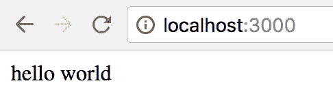

# 二、建立开发环境

除了是 OCaml 的一个新语法，Reason 还是一个工具链，让你很容易上手。在本章中，我们将执行以下操作:

*   了解原因工具链
*   配置我们的编辑器
*   使用`bsb`开始一个纯理性项目
*   了解`bsconfig.json`
*   编写一个操作 DOM 的示例纯理性应用
*   使用`bsb`开始一个推理重组项目
*   在原因项目中轻松使用`webpack`

接下来，克隆这本书的 GitHub 存储库，并从本章的目录开始。也欢迎您从空白项目开始:

```js
git clone https://github.com/PacktPublishing/ReasonML-Quick-Start-Guide.git
cd ReasonML-Quick-Start-Guide
cd Chapter02/pure-reason-start
npm install
```

本章旨在让您熟悉原因工具链。我们将为纯理性项目和理性真实项目提供单独的开发环境。在跟随之后，你会很舒服地根据自己的喜好调整开发环境。不要担心把事情搞砸，因为我们将从另一个目录的[第 3 章](3.html)、*创建推理 React 组件*中重新开始。

# 原因工具链

在撰写本文时，Reason 工具链本质上是 BuckleScript——Reason 的合作伙伴项目——和熟悉的 JavaScript 工具链，即`npm`和`webpack`(或另一个 JavaScript 模块 bundler)。

不再需要`babel`，因为 BuckleScript 编译成了 JavaScript 的 ES5 版本。编译后的输出可以配置为使用通用、AMD 或 ES 模块格式。Reason 强大的静态类型系统取代了对 Flow 和 ESlint 的需求。此外，理智的编辑器插件都带有`refmt`，本质上就是【理智的 T2】。

# 安装 BuckleScript

BuckleScript 是一个编译器，它接受 OCaml AST 并发出干净、可读和高性能的 JavaScript。可以通过`npm`进行安装，如下:

```js
npm install -g bs-platform
```

安装`bs-platform`提供了一个名为`bsb`的二进制文件，这是 BuckleScript 的构建系统。

In the future, the Reason toolchain will make it much easier to target native platforms as well as JavaScript. Currently, Reason compiles to native by using a fork of `bsb`, called `bsb-native`.

# 编辑器配置

Reason 支持多种编辑器，包括 VSCode、崇高文本、Atom、Vim 和 Emacs。VSCode 是推荐的编辑器。要配置 VSCode，只需安装`reason-vscode`扩展即可。就这样！

有关特定于编辑器的说明，请参见文档。

The Reason editor support documentation can be found at [https://reasonml.github.io/docs/editor-plugins.](https://reasonml.github.io/docs/editor-plugins)

# 设置纯理性项目

`bsb`二进制包括一个项目生成器。我们将使用它来创建一个使用`basic-reason`主题的纯理性项目。运行`bsb -themes`查看所有可用的项目模板:

```js
Available themes: 
basic
basic-reason
generator
minimal
node
react
react-lite
tea
```

因为 BuckleScript 同时适用于 OCaml 和 Reason，所以有些主题只适用于 OCaml 项目。也就是说，在任何 BuckleScript 项目中，随意混合 OCaml 的`.ml`文件和 Reason 的`.re`文件。

在本章中，我们将重点讨论使用`basic-reason`和`react`模板。如果你好奇的话，`react-lite`主题就像`react`主题一样，除了`webpack`被一个更简单、更快速、更可靠的模块 bundler 所取代，该模块仅用于开发目的。

让我们首先创建一个纯理性项目:

```js
bsb -init my-first-app -theme basic-reason
cd my-first-app
```

当我们在编辑器中打开项目时，我们会看到以下项目结构:

```js
├── .gitignore
├── README.md
├── bsconfig.json
├── node_modules
│   ├── .bin
│   │   ├── bsb
│   │   ├── bsc
│   │   └── bsrefmt
│   └── bs-platform
├── package.json
└── src
    └── Demo.re
```

总的来说，这里没有太多来自 JavaScript 的令人耳目一新的东西。在`node_modules`中，我们看到`bs-platform`以及一些二进制文件:

*   `bsb`:构建系统
*   `bsc`:编译器
*   `bsrefmt`:这本质上是 JavaScript 的`prettier`，但是出于理智

正如我们将很快看到的那样，`npm`脚本中使用了`bsb`二进制。这个`bsc`二进制很少直接使用。编辑插件使用`bsrefmt`二进制。

在`Demo.re`中，我们看到一条简单的日志消息:

```js
/* Demo.re */
Js.log("Hello, BuckleScript and Reason!");
```

`package.json`看起来有些眼熟。`scripts`字段显示我们当前可用的`npm`脚本:

```js
/* package.json */
{
  "name": "my-first-app",
  "version": "0.1.0",
  "scripts": {
    "build": "bsb -make-world",
    "start": "bsb -make-world -w",
    "clean": "bsb -clean-world"
  },
  "keywords": [
    "BuckleScript"
  ],
  "author": "",
  "license": "MIT",
  "devDependencies": {
    "bs-platform": "^4.0.5"
  }
}
```

运行`npm run build`将`Demo.re`编译成 JavaScript。默认情况下，编译后的输出显示在源文件的右侧作为`Demo.bs.js`。它如何知道编译哪些文件，在哪里输出？这就是`bsconfig.json`的作用。

# bsconfig.json 文件

`bsconfig.json`文件是所有 BuckleScript 项目的必备文件。让我们来探索一下:

```js
// This is the configuration file used by BuckleScript's build system bsb. Its documentation lives here: http://bucklescript.github.io/bucklescript/docson/#build-schema.json
// BuckleScript comes with its own parser for bsconfig.json, which is normal JSON, with the extra support of comments and trailing commas.
{
  "name": "my-first-app",
  "version": "0.1.0",
  "sources": {
    "dir" : "src",
    "subdirs" : true
  },
  "package-specs": {
    "module": "commonjs",
    "in-source": true
  },
  "suffix": ".bs.js",
  "bs-dependencies": [
      // add your dependencies here. You'd usually install them normally through `npm install my-dependency`. If my-dependency has a bsconfig.json too, then everything will work seamlessly.
  ],
  "warnings": {
    "error" : "+101"
  },
  "namespace": true,
  "refmt": 3
}
```

我们将很快更改其中的一些默认值，以便更好地使用 BuckleScript 的配置文件。我们先给`Demo.re`添加以下代码:

```js
type decision =
  | Yes
  | No
  | Maybe;

let decision = Maybe;

let response =
  switch (decision) {
  | Yes => "Yes!"
  | No => "I'm afraid not."
  };

Js.log(response);
```

如您所见，`switch`表达式并没有处理`decision`的所有可能情况。运行`npm run build`会产生以下输出:

```js
ninja: Entering directory `lib/bs'
[3/3] Building src/Demo.mlast.d
[1/1] Building src/Demo-MyFirstApp.cmj

  Warning number 8
  .../Demo.re 9:3-12:3

   7 │ 
   8 │ let response =
   9 │ switch (decision) {
  10 │ | Yes => "Yes!"
  11 │ | No => "I'm afraid not."
  12 │ };
  13 │ 
  14 │ Js.log(response);

  You forgot to handle a possible value here, for example: 
Maybe
```

# 警告字段

如果我们想强制这个警告抛出一个错误，我们从前面的片段中记录错误号，并将`bsconfig.json`的`warnings`字段改为如下:

```js
"warnings": {
  "error": "+101+8" // added "+8"
},
```

要将所有警告转化为错误，请使用以下代码:

```js
"warnings": {
  "error": "A"
},
```

For a complete list of warning numbers, check out [https://caml.inria.fr/pub/docs/manual-ocaml/comp.html#sec281](https://caml.inria.fr/pub/docs/manual-ocaml/comp.html#sec281) (scroll down a bit).

# 包装规格字段

`package-specs`字段包含两个字段:`module`和`in-source`。

`module`字段控制 JavaScript 模块格式。默认为`commonjs`，其他可用选项包括`amdjs`、`amdjs-global`、`es6`和`es6-global`。`-global`部分告诉 BuckleScript 将`node_modules`解析为浏览器的相对路径。

`in-source`字段控制生成的 JavaScript 文件的目的地；`true`导致生成的文件沿着侧源文件放置，`false`导致生成的文件放置在`lib/js`中。将`in-source`设置为`false`在现有的 JavaScript 项目中使用推理时非常有用，这样就可以使用现有的构建管道，而不必进行更改。

现在我们使用`"es6"`模块格式，将我们编译的资产放在`lib/js`中:

```js
"package-specs": {
  "module": "es6",
  "in-source": false
},
```

# 后缀字段

`suffix`字段配置生成的 JavaScript 文件的扩展名。通常最好保留`".bs.js"`后缀，因为这有助于`bsb`更好地跟踪生成的工件。

# 源字段

由于以下配置，BuckleScript 知道在`src`目录中查找:

```js
"sources": {
  "dir" : "src",
  "subdirs" : true
},
```

如果`subdirs`是`false`，那么位于`src`子目录下的任何`.re`和`.ml`文件都不会被编译。

For more information regarding `bsconfig.json`, see the following section of the BuckleScript documentation: [https://bucklescript.github.io/docs/build-configuration](https://bucklescript.github.io/docs/build-configuration).

# 使用 DOM

让我们先尝试在纯理性中使用 DOM，然后再进入理性推理。我们将编写一个执行以下操作的模块:

*   创建一个 DOM 元素
*   设置该元素的`innerText`
*   将该元素追加到文档正文中

在项目根目录下创建一个`index.html`文件，内容如下:

```js
<html>
  <head></head>
  <body>
    <!-- if "in-source": false -->
    <script type="module" src="lib/es6/src/Demo.bs.js"></script>

    <!-- if "in-source": true -->
    <!-- <script type="module" src="src/Demo.bs.js"></script> -->
  </body>
</html>
```

注意`script`标签上的`type="module"`属性。如果所有模块依赖项都符合**专家系统模块** ( **专家系统模块**)的要求，并且它们都可以从浏览器中获得，那么您不需要模块捆绑器就可以开始使用(假设您使用的是支持专家系统模块的浏览器)。

在`Greeting.re`中，增加如下问候功能:

```js
let greeting = name => {j|hello $name|j};
```

并在`Demo.re`中，添加以下代码:

```js
[@bs.val] [@bs.scope "document"]
external createElement : string => Dom.element = "";

[@bs.set] external setInnerText : (Dom.element, string) => unit = "innerText";

[@bs.val] [@bs.scope "document.body"]
external appendChild : Dom.element => Dom.element = "";

let div = createElement("div");
setInnerText(div, Greeting.greeting("world"));
appendChild(div);
```

使用 BuckleScript 强大的互操作性特性(我们将在[第 4 章](4.html)、 *BuckleScript、Belt 和互操作性*中深入讨论)，前面的代码绑定到现有的浏览器 API，即`document.createElement`、`innerText`和`document.body.appendChild`，然后使用这些绑定创建一个带有附加到文档正文中的一些文本的`div`。

运行`npm run build`，在项目的根目录下启动一个服务器(可能在新的控制台选项卡中有`php -S localhost:3000`，然后导航到`http://localhost:3000`查看我们新创建的 DOM 元素:



要点是，以这种方式使用 DOM 真的很乏味。由于 JavaScript 的动态特性，很难键入 DOM APIs。例如，`Element.innerText`用于获取和设置元素的`innerText`，这取决于它的使用方式，因此会产生两种不同的类型签名:

```js
[@bs.get] external getInnerText: Dom.element => string = "innerText";
[@bs.set] external setInnerText : (Dom.element, string) => unit = "innerText";
```

幸运的是，我们有 React，它很大程度上为我们抽象了 DOM。使用 React，我们不需要担心 DOM APIs 的类型。很高兴知道，当我们想要与各种浏览器 API 交互时，BuckleScript 拥有我们完成工作所需的工具。虽然用纯理性编写前端 web 应用当然是可能的，但当使用 ReasonReact 时，这是一种更愉快的体验，尤其是当第一次开始使用 ReasonReact 时。

# 设置推理推理项目

要创建新的推理推理项目，请运行以下命令:

```js
bsb -init my-reason-react-app -theme react
cd my-reason-react-app

```

打开文本编辑器后，我们看到一些事情发生了变化。`package.json`文件列出了相关的 React 和 webpack 依赖项。让我们安装它们:

```js
npm install
```

我们还有以下与 webpack 相关的 npm 脚本:

```js
"webpack": "webpack -w",
"webpack:production": "NODE_ENV=production webpack"
```

在`bsconfig.json`中，我们有一个新的领域打开了 JSX，原因如下:

```js
"reason": {
  "react-jsx": 2
},
```

我们有一个简单的`webpack.config.js`文件:

```js
const path = require("path");
const outputDir = path.join(__dirname, "build/");

const isProd = process.env.NODE_ENV === "production";

module.exports = {
  entry: "./src/Index.bs.js",
  mode: isProd ? "production" : "development",
  output: {
    path: outputDir,
    publicPath: outputDir,
    filename: "Index.js"
  }
};
```

注意配置的入口点是怎样的`"./src/Index.bs.js"`，这是有意义的，因为默认情况下`"in-source"`在`bsconfig.json`中被设置为`true`。剩下的只是普通的网络包。

要运行这个项目，我们需要同时运行`bsb`和`webpack`:

```js
npm start

/* in another shell */
npm run webpack

/* in another shell */
php -S localhost:3000
```

由于`index.html`文件位于`src`目录中，我们访问`http://localhost:3000/src`查看默认应用。

# 改善开发者体验

现在，我们已经了解了工具链在基本层面上是如何工作的，让我们改进我们的开发人员体验，这样我们只需一个命令就可以开始我们的项目。我们需要安装几个依赖项，如下所示:

```js
npm install webpack-dev-server --save-dev
npm install npm-run-all --save-dev
```

现在，我们可以更新我们的 npm 脚本:

```js
"scripts": {
  "start": "npm-run-all --parallel start:*",
  "start:bsb": "bsb -clean-world -make-world -w",
  "start:webpack": "webpack-dev-server --port 3000",
  "build": "npm-run-all build:*",
  "build:bsb": "bsb -clean-world -make-world",
  "build:webpack": "NODE_ENV=production webpack",
  "test": "echo \"Error: no test specified\" && exit 1"
},
```

接下来，要让`webpack-dev-server`在`http://localhost:3000`而不是`http://localhost:3000/src`上服务`index.html`文件，我们需要安装并配置`HtmlWebpackPlugin`:

```js
npm install html-webpack-plugin --save-dev
```

我们可以删除`src/index.html`中的默认`<script src="../build/Index.js"></script>`标签，因为`HTMLWebpackPlugin`会自动插入脚本标签。

我们还删除了`publicPath`设置，以便使用`"/"`的默认路径:

```js
const path = require("path");
const HtmlWebpackPlugin = require("html-webpack-plugin");

const isProd = process.env.NODE_ENV === "production";

module.exports = {
  entry: "./src/Index.bs.js",
  mode: isProd ? "production" : "development",
  output: {
    path: path.join(__dirname, "build/"),
    filename: "Index.js"
  },
  plugins: [
    new HtmlWebpackPlugin({
      template: "./src/index.html"
    })
  ]
};
```

现在，我们运行`npm start`并访问`http://localhost:3000`来查看运行相同原因的应用。

# 摘要

在这一章中，我们看到了从理性开始是多么容易。在[第 3 章](3.html)、*创建 ReasonReact 组件*中，我们将开始构建一个 ReasonReact 应用，我们将在本书中使用它。这个应用将有助于提供上下文，因为我们了解了更多关于推理语义、BuckleScript 互操作性和推理推理细节的信息。

如果您还不了解这些生成的项目中的所有内容，请不要担心。到[第三章](3.html)、*创造理性 React 组件*结束时，你会舒服很多。但是，如果您在此过程中有任何疑问，请不要犹豫，通过理智的不和谐频道寻求实时帮助:[https://discord.gg/reasonml](https://discord.gg/reasonml)。

我希望你会发现理性社区和我一样受欢迎和乐于助人。