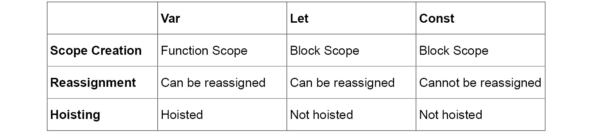
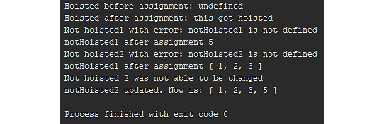
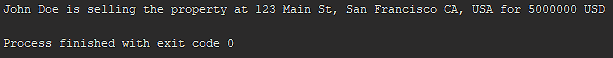
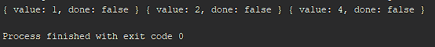

# *第一章*

# ECMAScript 6 简介

## 学习目标

在本章结束时，你将能够:

*   在 JavaScript 中定义不同的作用域并描述变量声明
*   简化 JavaScript 对象定义
*   解构对象和数组，并构建类和模块
*   为了兼容性而 Transpile JavaScript
*   编写迭代器和生成器

在本章中，您将学习如何使用 ECMAScript 的新语法和概念。

## 简介

**JavaScript**，通常缩写为 JS，是一种编程语言，旨在让程序员构建交互式 web 应用程序。 JavaScript 与 HTML 和 CSS 一样，是 web 开发的支柱之一。 几乎所有主要网站，包括谷歌、Facebook 和 Netflix，都大量使用 JavaScript。 JS 最初是在 1995 年为 Netscape 网络浏览器创建的。 第一个 JavaScript 原型是由 Brendan Eich 在短短 10 天内编写的。 自创建以来，JavaScript 已成为当今最常用的编程语言之一。

在本书中，我们将加深您对 JavaScript 核心及其高级功能的理解。 我们将介绍 ECMAScript 标准中引入的新特性、JavaScript 的异步编程特性、DOM 和 HTML 事件与 JavaScript 的交互、JavaScript 的函数式编程范例、测试 JavaScript 代码和 JavaScript 开发环境。 有了从本书中获得的知识，您将准备好开始在专业环境中使用 JavaScript 来构建强大的 web 应用程序。

## 以 ECMAScript 开头

**ECMAScript**是由**ECMA International**标准化的脚本语言规范。 它的创建是为了标准化 JavaScript，试图允许独立和兼容的实现。 **ECMAScript 6**，或**ES6**，最初于 2015 年发布，此后经历了几次小的更新。

#### 请注意

您可以参考以下链接了解更多关于 ECMA 规范的信息:[https://developer.mozilla.org/en-US/docs/Web/JavaScript/Language_Resources](https://developer.mozilla.org/en-US/docs/Web/JavaScript/Language_Resources)。

## 了解范围

在计算机科学中，**作用域**是计算机程序的区域，在该区域中，一个名称与一个实体(如变量或函数)的绑定或关联是有效的。 JavaScript 有以下两种不同类型的作用域:

*   **功能范围**
*   **块范围**

在 ES6 之前，函数作用域是 JavaScript 中作用域的唯一形式; 所有变量和函数声明都遵循函数作用域规则。 块作用域在 ES6 中被引入，只被用新的变量声明关键字`let`和`const`声明的变量使用。 这些关键字将在*声明变量*一节中详细讨论。

### 功能范围

**函数范围**在 JavaScript 中是在函数内部创建的。 当一个函数被声明时，一个新的作用域块会在函数体中创建。 在新函数作用域内声明的变量不能从父作用域访问; 但是，函数作用域可以访问父作用域中的变量。

要创建具有函数作用域的变量，必须使用`var`关键字声明该变量。 例如:

`var example = 5;`

下面的代码片段提供了函数作用域的示例:

```js
var example = 5;
function test() {
  var testVariable = 10;
  console.log( example ); // Expect output: 5
  console.log( testVariable ); // Expect output: 10
}
test();
console.log( testVariable ); // Expect reference error
```

###### 代码片段 1.1:功能范围

**父作用域**是定义函数的代码段的作用域。 这通常是全局范围; 然而，在某些情况下，在函数中定义函数可能是有用的。 在这种情况下，嵌套函数的父作用域将是定义它的函数。 在前面的代码片段中，函数作用域是在函数测试中创建的作用域。 父作用域是全局作用域，也就是函数定义的地方。

#### 请注意

父作用域是定义函数的代码块。 它不是调用函数的代码块。

### 功能范围吊装

当一个变量被创建为函数作用域时，它的声明将自动提升到作用域的顶部。 **提升****意味着解释器将实体的实例化移动到它声明的作用域的顶部，而不管它是在作用域块的哪个位置定义的。 使用`var`声明的函数和变量在 JavaScript 中被悬挂; 也就是说，函数或变量可以在声明之前使用。 下面的代码演示了这一点:**

```js
example = 5; // Assign value
console.log( example ); // Expect output: 5
var example; // Declare variable
```

###### 片段 1.2:功能范围吊装

#### 请注意

由于使用`var`声明的悬挂变量可以在声明之前使用，所以我们必须小心，不要在给该变量赋值之前使用它。 如果一个变量在被赋值之前被访问，它将以`undefined`的形式返回该值，这可能会导致问题，特别是在全局作用域中使用变量时。

### 块范围

JavaScript 中的新块作用域是用大括号(`{}`)创建的。 一对**大括号**可以放在代码中的任何位置，以定义一个新的作用域块。 If 语句、循环、函数和任何其他花括号对都有自己的块作用域。 这包括与关键字(if, for 等)不关联的浮动花括号对。 下面的代码片段是块作用域规则的示例:

```js
// Top level scope
function scopeExample() {
  // Scope block 1
  for ( let i = 0; i < 10; i++ ){ /* Scope block 2 */ }
  if ( true ) { /* Scope block 3 */ } else {  /* Scope block 4 */ }
  // Braces without keywords create scope blocks
  { /* Scope block 5 */ } 
  // Scope block 1
}
// Top level scope
```

###### 代码片段 1.3:块作用域

用关键字`let`和`const`声明的变量具有**块作用域**。 当一个变量用块作用域声明时，它不具有与在函数作用域中创建的变量相同的提升变量。 块作用域变量不会被提升到作用域的顶部，因此在声明它们之前无法访问它们。 这意味着用块作用域创建的变量服从于**Temporal Dead Zone**(**TDZ**)。 TDZ 是在输入范围和声明变量之间的句号。 当变量被声明而不是赋值时，它就结束了。 下面的例子演示了 TDZ:

```js
// console.log( example ); // Would throw ReferenceError
let example;
console.log( example ); // Expected output: undefined
example = 5;
console.log( example ); // Expected output: 5
```

###### 片段 1.4:暂时的死区

#### 请注意

如果在 Temporal Dead Zone 内访问变量，则会抛出一个运行时错误。 这是很重要的，因为它允许我们的代码更健壮地构建，减少由变量声明引起的语义错误。

要更好地理解作用域块，请参考下表:


###### 图 1.1:函数作用域与块作用域

总之，作用域为我们提供了一种方法来分离变量并限制代码块之间的访问。 变量标识符名称可以在作用域块之间重用。 创建的所有新作用域块都可以访问父作用域，或它们在其中创建或定义的作用域。 JavaScript 有两种类型的作用域。 为定义的每个函数创建一个新的函数范围。 可以使用`var`关键字将变量添加到函数范围，并将这些变量提升到范围的顶部。 块作用域是 ES6 的一个新特性。 为每一组花括号创建一个新的块作用域。 使用`let`和`const`关键字将变量添加到块作用域。 所添加的变量不会被提升，并受 TDZ 的约束。

### 练习 1:实现块范围

要用变量实现块作用域原则，请执行以下步骤:

1.  创建一个名为`fn1`的函数，如图(`function fn1())`所示。
2.  将字符串记录为`scope 1.`
3.  创建一个名为`scope`的变量，值为 5。
4.  对变量`scope`的值做对数。
5.  用花括号(`{}`)在函数内部创建一个新的块作用域。
6.  在新的范围块中，记录名为`scope 2.`的字符串
7.  在 scope 块中创建一个名为`scope`的新变量，并赋值为`different scope`。
8.  在块作用域(作用域 2)中记录值变量`scope`。
9.  在步骤 5(作用域 2)中定义的块作用域之外，创建一个新的块作用域(使用花括号)。
10.  记录字符串`scope 3.`
11.  在 scope 块(scope 3)中创建一个与变量同名的变量(称为`scope`)，并赋值为`a third scope`。
12.  记录新变量的值。
13.  调用`fn1`并观察其输出

**编码**

index.js:

```js
function fn1(){
 console.log('Scope 1');
 let scope = 5;
 console.log(scope);
 {
   console.log('Scope 2');
   let scope = 'different scope';
   console.log(scope);
 }
  {
   console.log('Scope 3');
   let scope = 'a third scope';
   console.log(scope);
 }
}
fn1();
```

[https://bit.ly/2RoOotW](https://bit.ly/2RoOotW)

###### 代码片段 1.5:块实现输出

**结果**


###### 图 1.2:范围输出

您已经成功地在 JavaScript 中实现了块作用域。

在本节中，我们介绍了 JavaScript 作用域的两种类型，函数和块作用域，以及它们之间的区别。 我们演示了如何在每个函数中创建函数作用域的新实例，以及如何在每组花括号中创建块作用域。 我们讨论了每种类型作用域的变量声明关键字，`var`表示函数作用域，`let/const`表示块作用域。 最后，我们介绍了吊装的基本知识，包括吊装的功能和吊装块的范围。

## 声明变量

基本 JavaScript 使用关键字`var`来声明**变量**。 ECMAScript 6 引入了两个新的关键字来声明变量; 它们是`let`和`const`。 在 JavaScript 专业变量声明领域，`var`是目前最薄弱的环节。 在本主题中，我们将介绍新关键词`let`和`const`，并解释为什么它们比`var`好。

JavaScript 中声明变量的三种方法是使用`var`、`let`和`const`。 所有的功能都略有不同。 这三个变量声明关键字之间的主要区别在于它们处理变量重分配、变量作用域和变量提升的方式。 这三个特点可以简单解释如下:

**变量重赋:可以随时改变或重赋变量的值。**

**变量范围:**可以访问变量的代码的范围或区域。

**变量提升时间**:变量实例化和赋值时间与变量声明相关。 有些变量可以在声明之前使用。

关键字`var`是较旧的变量声明关键字，用于在 JavaScript 中声明变量。 所有用`var`创建的变量都可以重新分配，具有功能范围，具有可变提升。 这意味着用`var`创建的变量会被提升到作用域块的顶部，在这里定义它们并在声明之前访问它们。 下面的代码片段演示了这一点:

```js
// Referenced before declaration
console.log( example ); // Expect output: undefined
var example = 'example';
```

###### 代码片段 1.6:使用 var 创建的变量将被悬挂

因为用关键字`var`创建的变量不是常量，所以可以随意创建、赋值和重新赋值。 下面的代码演示了`var`的这方面功能:

```js
// Declared and assigned
var example = { prop1: 'test' };
console.log( 'example:', example );
// Expect output: example: {prop1: "test"}
// Value reassigned
example = 5;
console.log( example ); // Expect output: 5
```

###### 代码片段 1.7:使用 var 创建的变量不是常量

用`var`创建的变量可以在任何时候重新赋值，一旦创建了变量，就可以从函数中的任何地方访问它，甚至在原始声明点之前。

关键字`let` 的功能类似于`var`。 正如预期的那样，关键字 let 允许我们声明一个可以在任何时候重新赋值的变量。 如下代码所示:

```js
// Declared and initialized
let example = { prop1: 'test' };
console.log( 'example:', example );
// Expect output: example: {prop1: 'test"}
// Value reassigned
example = 5;
console.log( example ); // Expect output: 5
```

###### 代码片段 1.8:使用 let 创建的变量不是常量

`let`与`var`之间存在显著差异。 `let`和`var`的不同之处在于它们的范围和可变起重性能。 用`let`声明的变量的作用域是块级别; 也就是说，它们只在包含在匹配的花括号(`{}`)中的代码块中定义。

用`let`声明的变量不受变量提升的影响。 这意味着在赋值之前访问用`let`声明的变量将抛出一个运行时错误。 如前所述，这是暂时的死亡区。 下面的代码显示了一个例子:

```js
// Referenced before declaration
console.log( example );
// Expect ReferenceError because example is not defined
let example = 'example';
```

###### 代码片段 1.9:使用 let 创建的变量不会被悬挂

最后一个变量声明关键字是`const`。 `const`关键字与`let`关键字具有相同的作用域和可变提升规则; 用`const`声明的变量具有块作用域，不会被提升到作用域的顶部。 如下代码所示:

```js
// Referenced before declaration
console.log( example );
// Expect ReferenceError because example is not defined
const example = 'example';
```

###### 代码片段 1.10:使用 const 创建的变量不会被悬挂

`const`和`let`之间的关键区别是`const`表示标识符不会被重新分配。 标识符表示对一个值的只读引用。 换句话说，写入`const` 变量的值是不可更改的。 如果用`const`初始化的变量的值被更改，则会抛出`TypeError`。

尽管用`const`创建的变量不能被重新赋值，但这并不意味着它们是不可变的。 如果数组或对象存储在用`const`声明的变量中，则该变量的值不能被覆盖。 但是，数组内容或对象属性可以更改。 可以使用`push()`、`pop()`或`map()`等函数修改数组的内容，也可以添加、删除或更新对象属性。 如下代码所示:

```js
// Declared and initialized
const example = { prop1: 'test' };
// Variable reassigned
example = 5;
// Expect TypeError error because variable was declared with const
// Object property updated
example.prop1 = 5;
// Expect no error because subproperty was modified
```

###### 代码片段 1.11:使用 const 创建的变量是常量，但不是不可变的

要更详细地了解不同的关键词，请参考下表:



###### 图 1.3:var、let 和 const 之间的区别

既然我们了解了`var`、`let`和`const`之间的细微差别，我们就可以决定使用哪一个了。 在专业领域，我们应该始终使用`let`和`const`，因为它们提供了`var`的所有功能，并允许程序员对变量范围和用法进行特定和限制。

综上所述，`var`、`let`、`const`功能相似。 关键的区别在于`const`的性质、范围和提升。 `Var`是作用范围，不是恒定的，并被提升到示波器块的顶部。 `let`和`const` 都是分段的，不进行吊装。 `let`不是不变的，`const`是不变的。

### 练习 2:利用变量

要使用`var`、`const`和`let`变量声明关键字来实现变量提升和重分配属性，请执行以下步骤:

1.  记录字符串`Hoisted before assignment:`和`hoisted`变量的值。
2.  用关键字`var`定义一个名为`hoisted`的变量，并赋值`this got hoisted`。
3.  记录字符串`hoisted after assignment:`和`hoisted`变量的值。
4.  创建一个 try-catch 块。
5.  在`try`块中，记录变量`notHoisted1`的值。
6.  在`catch`块内部，给 catch 块提供`err`参数，然后记录字符串`Not hoisted1 with error:`和`err.message`的值。
7.  在 try-catch 块之后，用`let`关键字创建`notHoisted1`变量，并赋值`5`。
8.  记录字符串`notHoisted1 after assignment`和`notHoisted1`的值。
9.  创建另一个 try-catch 块。
10.  在`try`块中，记录`notHoisted2`变量的值。
11.  在 catch 块内部，给 catch 块一个`err`参数，然后记录字符串`Not hoisted2 with error:`和`err.message`的值。
12.  在第二个 try-catch 块之后，用关键字`const`创建`notHoisted2`变量，并赋值[`1`，`2`，`3`]。
13.  记录字符串`notHoisted2 after assignment`和`notHoisted2`的值。
14.  定义一个最后的 try catch 块。
15.  在`try`块内部，将`notHoisted2`重新赋值给`new value`字符串。
16.  在 catch 块内部，给 catch 块一个`err`参数，然后记录字符串`Not hoisted 2 was not able to be changed`。
17.  在 try-catch 块之后，将值`5`推入`notHoisted2`中的数组。
18.  记录字符串`notHoisted2 updated. Now is:`和`notHoisted2`的值。

**编码**

##### index.js:

```js
var hoisted = 'this got hoisted';
try{
 console.log(notHoisted1);
} catch(err){}
let notHoisted1 = 5;
try{
 console.log(notHoisted2);
} catch(err){}
const notHoisted2 = [1,2,3];
try{
 notHoisted2 = 'new value';
} catch(err){}
notHoisted2.push(5);
```

###### 代码片段 1.12:更新对象的内容

[https://bit.ly/2RDEynv](https://bit.ly/2RDEynv)

**结果**



###### 图 1.4:提升变量

您已经成功地使用关键字来声明变量。

在本节中，我们讨论了 ES6 中的变量声明，以及使用`let`和`const`变量声明关键字比`var`变量声明关键字的好处。 我们讨论了每个关键字:变量重分配属性、变量作用域和变量提升属性。 关键字`let`和`const`都是块作用域中的`create`变量，其中`var`在函数作用域中创建一个变量。 用`var`和`let`创建的变量可以随意重新分配。 然而，使用`const`创建的变量不能被重新分配。 最后，用关键字`var`创建的变量将被提升到定义它们的作用域块的顶部。 用`let`和`const`创建的变量不会被悬挂。

## 介绍箭头函数

**箭头函数**，或者**胖箭头函数**，是 ECMAScript 6 中创建函数的一种新方法。 箭头函数简化了函数语法。 它们被称为**胖箭头函数**，因为它们用字符=>表示，这些字符放在一起看起来就像一个胖箭头。 JavaScript 中的箭头函数经常用于回调链、承诺链、数组方法，在任何需要使用未注册函数的情况下。

JavaScript 中箭头函数与普通函数的关键区别在于，箭头函数是**匿名**的。 箭头函数没有命名，也没有绑定到标识符。 这意味着箭头函数是动态创建的，不像普通函数那样有名称。 但是，可以将箭头函数赋值给变量，以便重用。

当创建一个箭头函数时，我们只需要删除 function 关键字，并在函数参数和函数体之间放置一个箭头。 箭头函数用以下语法表示:

```js
( arg1, arg2, ..., argn ) => { /* Do function stuff here */ }
```

###### 代码片段 1.13:箭头函数语法

从前面的语法可以看出，箭头函数是用 JavaScript 编写函数的一种更简洁的方法。 它们可以使我们的代码更简洁、更容易阅读。

箭头函数的语法也可能不同，这取决于几个因素。 根据传入函数的参数数量和函数体中的代码行数，语法可能略有不同。 下面的列表简要列出了特殊的语法条件:

*   单一的输入参数
*   没有输入参数
*   单线函数体
*   在多行上分割的单个表达式
*   对象字面值返回值

### 练习 3:转换箭头函数

要通过将标准函数转换为箭头函数来演示简化的语法，请执行以下步骤:

1.  创建一个函数，接受参数并返回两个参数的和。 将函数保存到一个名为`fn1`的变量中。
2.  Convert the function you just created to an arrow function and save into another variable called `fn2`.

    要转换函数，请删除`function`关键字。 接下来，在函数参数和函数体之间放置一个箭头。

3.  调用这两个函数并比较输出。

**编码**

##### index.js:

```js
const fn1 = function( a, b ) { return a + b; };
const fn2 = ( a, b ) => { return a + b; };
console.log( fn1( 3 ,5 ), fn2( 3, 5 ) );
```

###### 代码片段 1.14:调用函数

[https://bit.ly/2M6uKwN](https://bit.ly/2M6uKwN)

**结果**


###### 图 1.5:比较函数的输出

您已经成功地将普通函数转换为箭头函数。

### 箭头函数语法

如果有多个参数被传递到函数中，那么我们就像往常一样用圆括号括住参数来创建函数。 如果只有一个参数要传递给函数，则不需要在参数周围包含圆括号。

该规则有一个例外，即参数不是简单的标识符。 如果在函数实参中包含默认值或执行操作，则必须包含圆括号。 例如，如果包含默认形参，则需要在实参周围加上圆括号。 以下代码显示了这两个规则:

```js
// Single argument arrow function
arg1 => { /* Do function stuff here */ }
// Non simple identifier function argument
( arg1 = 10 ) => { /* Do function stuff here */ }
```

###### 片段 1.15:单参数箭头函数

如果我们创建一个没有参数的箭头函数，那么我们需要包含圆括号，但它们将是空的。 如下代码所示:

```js
// No arguments passed into the function
( ) => { /* Do function stuff here */ }
```

###### 代码片段 1.16:没有参数

箭头函数也可以有不同的语法，这取决于函数体。 如预期的那样，如果函数体是多行的，则必须用花括号将其括起来。 但是，如果函数体是单行，则不需要在函数体周围加上花括号。 如下代码所示:

```js
// Multiple line body arrow function
( arg1, arg2 ) => { 
  console.log( `This is arg1: ${arg1}` );
  console.log( `This is arg2: ${arg2}` );
  /* Many more lines of code can go here */
}
// Single line body arrow function
( arg1, arg2 ) => console.log( `This is arg1: ${arg1}` )
```

###### 代码片段 1.17:单行正文

当使用箭头函数时，如果函数只有一行，也可以排除 return 关键字。 箭头函数自动返回该行表达式的解析值。 该语法如下面的代码所示:

```js
// With return keyword - not necessary
( num1, num2 ) => { return ( num1 + num2 ) }
// If called with arguments num1 = 5 and num2 = 5, expected output is 10
// Without return keyword or braces
( num1, num2 ) => num1 + num2
// If called with arguments num1 = 5 and num2 = 5, expected output is 10
```

###### 代码片段 1.18:返回 value 时的单行正文

由于带有单个表达式体的箭头函数可以在没有花括号的情况下定义，因此需要特殊的语法来允许我们将单个表达式分割到多行上。 为此，我们可以将多行表达式包装在括号中。 JavaScript 解释器会看到一行代码被括在括号中，并将其视为一行代码。 如下代码所示:

```js
// Arrow function with a single line body
// Assume numArray is an array of numbers
( numArray ) => numArray.filter( n => n > 5).map( n => n - 1 ).every( n => n < 10 )
// Arrow function with a single line body broken into multiple lines
// Assume numArray is an array of numbers
( numArray ) => (
  numArray.filter( n => n > 5)
          .map( n => n - 1 )
          .every( n => n < 10 )
) 
```

###### 代码片段 1.19:将单行表达式分解为多行

如果我们有一个单行箭头函数返回一个对象字面量，我们将需要特殊的语法。 在 ES6 中，作用域块、函数体和对象字面量都是用花括号定义的。 由于单行箭头函数不需要花括号，我们必须使用特殊的语法来防止对象字面量的花括号被解释为函数体的花括号或作用域块的花括号。 为此，我们用括号将返回的对象字面值括起来。 这指示 JavaScript 引擎将圆括号内的花括号解释为表达式，而不是函数体或作用域块声明。 如下代码所示:

```js
// Arrow function with an object literal in the body
( num1, num2 ) => ( { prop1: num1, prop2: num2 } ) // Returns an object
```

###### 代码片段 1.20:对象字面量返回值

在使用箭头函数时，必须注意调用这些函数的作用域。 在 JavaScript 中，除了`this`作用域外，箭头函数遵循正常的作用域规则。 回想一下，在基本的 JavaScript 中，每个函数都被分配了一个作用域，即`this`作用域。 箭头函数没有分配`this`范围。 他们继承父母的`this`范围，不能有新的`this`范围绑定到他们。 这意味着，如预期的那样，箭头函数可以访问父函数的范围，然后访问该范围中的变量，但不能在箭头函数中更改`this`的范围。 使用`.apply()`、`.call()`或`.bind()`函数修饰符不会改变箭头函数的`this`属性的范围。 如果您处于必须将`this`绑定到另一个作用域的情况下，那么您必须使用正常的 JavaScript 函数。

总之，箭头函数为我们提供了一种简化匿名函数语法的方法。 要编写一个箭头函数，只需省略 function 关键字，并在参数和函数体之间添加一个箭头。

然后可以对函数参数和函数体应用特殊语法，从而进一步简化箭头函数。 如果函数只有一个输入参数，则可以省略它周围的括号。 如果函数体只有一行，可以省略关键字`return`和它周围的花括号。 但是，返回对象字面量的单行函数必须用括号括起来。

我们还可以在函数体周围使用括号，将一个行体分割成多行，以提高可读性。

### 练习 4:升级箭头功能

要使用 ES6 箭头函数语法来编写函数，请执行以下步骤:

1.  参考`exercises/exercise4/exercise.js`文件并执行该文件中的更新。
2.  Convert `fn1` with basic ES6 syntax.

    在函数参数之前删除 function 关键字。 在函数参数和函数体之间添加一个箭头。

3.  Convert `fn2` with single statement function body syntax.

    在函数参数之前删除 function 关键字。 在函数参数和函数体之间添加一个箭头。

    删除函数体周围的花括号`({})`。 删除 return 关键字。

4.  Convert `fn3` with Single input argument syntax.

    在函数参数之前删除 function 关键字。 在函数参数和函数体之间添加一个箭头。

    删除函数输入参数周围的括号。

5.  Convert `fn4` with no input argument syntax.

    在函数参数之前删除 function 关键字。 在函数参数和函数体之间添加一个箭头。

6.  Convert `fn5` with object literal syntax.

    在函数参数之前删除 function 关键字。 在函数参数和函数体之间添加一个箭头。

    删除函数体周围的花括号`({})`。 删除 return 关键字。

    用括号包围返回的对象。

**编码**

##### index.js:

```js
let fn1 = ( a, b ) => { … };
let fn2 = ( a, b ) => a * b;
let fn3 = a => { … };
let fn4 = () => { … };
let fn5 = ( a ) => ( …  );
```

###### 代码片段 1.21:箭头函数转换

[https://bit.ly/2M6qSfg](https://bit.ly/2M6qSfg)

**结果**


###### 图 1.6:转换函数的输出

您已经成功地使用了 ES6 箭头函数语法来编写函数。

在本节中，我们介绍了箭头函数，并演示了如何使用它们极大地简化 JavaScript 中的函数声明。 首先，我们介绍了箭头函数的基本语法:`( arg1, arg2, argn ) => { /* function body */ }`。 我们接着讨论了高级箭头函数的五种特殊语法，如下表所示:

*   单输入参数:`arg1 => { /* function body */ }`
*   没有输入参数:`( ) => { /* function body */ }`
*   单线功能体:`( arg1, arg2, argn ) => /* single line */`
*   单个表达式在多行上拆分:`( arg1, arg2, argn ) => ( /* multi line single expression */ )`
*   对象的返回值:`( arg1, arg2, argn ) => ( { /* object literal */ } )`

## 学习模板文字

**模板文字**是在 ECMAScript 6 中引入的一种新的字符串形式。 它们由**反勾**符号(```js`)括起来，而不是通常的单引号或双引号。 模板字面量允许您在运行时计算的字符串中嵌入表达式。 因此，我们可以很容易地从变量和变量表达式中创建动态字符串。 这些表达式用美元符号和花括号(`${ expression }`)表示。 模板字面量语法如下面的代码所示:

```
const example = "pretty";
console.log( `Template literals are ${ example } useful!!!` ); 
// Expected output: Template literals are pretty useful!!!
```js

###### 代码片段 1.22:模板文字的基本语法

模板字面量像 JavaScript 中的其他字符串一样被转义。 要转义模板文字，只需使用反斜杠(`\`)字符。 例如，下列等式计算为 true:``\`` === "`",`\t` === "\t"`和``\n\r` === "\n\r".`

模板字面值允许多行字符串。 插入到源文件中的任何换行符都是模板文字的一部分，并将导致输出中出现换行符。 简单地说，在模板字面量内，我们可以按键盘上的**Enter**键，并将其分成两行。 源代码中的这个换行符将被解析为模板文字的一部分，并在输出中产生一个换行符。 要用普通字符串复制这一点，我们必须使用`\n`字符来生成一个新行。 使用模板字面值，我们可以在模板字面值源文件中断行，并实现相同的预期输出。 下面的代码显示了一个例子:

```
// Using normal strings
console.log( 'This is line 1\nThis is line 2' );
// Expected output: This is line 1
// This is line 2
// Using template literals
console.log( `This is line 1
This is line 2` );
// Expected output: This is line 1
// This is line 2
```js

###### 代码片段 1.23:模板字面量多行语法

### 练习 5:转换为模板文字

要将标准字符串对象转换为模板字面值以演示模板字面值表达式的强大功能，请执行以下步骤:

1.  创建两个变量`a`和`b`，并将数字保存到其中。
2.  `a`和`b`的和用普通字符串记录，格式为`a + b`等于`<result>`。
3.  使用单个模板文字记录`a`和`b`的和，格式为`a + b`等于`<result>` 。

**编码**

##### index.js:

```
let a = 5, b = 10;
console.log( a + ' + ' + b + ' is equal to ' + ( a + b ) );
console.log( `${a} + ${b} is equal to ${a + b}` );
```js

###### 代码片段 1.24:模板文字和字符串的比较

[https://bit.ly/2RD5jbC](https://bit.ly/2RD5jbC)

**结果**


###### 图 1.7:记录变量输出的和

您已经成功地将标准字符串对象转换为模板文字。

模板字面量允许表达式嵌套，也就是说，新的模板字面量可以放在模板字面量的表达式中。 由于嵌套的模板字面量是表达式的一部分，它将被解析为一个新的模板字面量，并且不会与外部模板字面量发生冲突。 在某些情况下，嵌套模板字面量是创建字符串最简单、最易读的方法。 下面的代码显示了一个模板字面量嵌套的例子:

```
function javascriptOrCPlusPlus() { return 'JavaScript'; }
const outputLiteral = `We are learning about ${ `Professional ${ javascriptOrCPlusPlus() }` }`
```js

###### 代码片段 1.25:模板文字嵌套

模板字面量的更高级形式是**标记模板字面量**。 带标签的模板字面值可以用一个叫做**标签函数**的特殊函数进行解析，并且可以返回一个经过处理的字符串或任何其他值。 标记函数的第一个输入参数是一个包含字符串值的数组。 字符串值表示输入字符串的各个部分，在每个模板表达式处分解。 其余参数是字符串中模板表达式的值。 标签函数不像普通函数那样被调用。 要调用标记函数，省略括号和模板字面量参数周围的任何空格。 该语法如下面的代码所示:

```
// Define the tag function
function tagFunction( strings, numExp, fruitExp ) { 
  const str0 = strings[0]; // "We have"
  const str1 = strings[1]; // " of "
  const quantity = numExp < 10 ? 'very few' : 'a lot';
  return str0 + quantity + str1 + fruitExp + str2;
}
const fruit = 'apple', num = 8;
// Note: lack of parenthesis or whitespace when calling tag function
const output = tagFunction`We have ${num} of ${fruit}. Exciting!`
console.log( output )
// Expected output: We have very few of apples. Exciting!!
```js

###### 片段 1.26:带标记的模板文字示例

一个名为`raw`的特殊属性可用于标记模板的第一个参数。 此属性返回一个数组，其中包含分割模板字面量每个部分的未转义原始版本。 如下代码所示:

```
function tagFunction( strings ){ console.log( strings.raw[0] ); }
tagFunction`This is line 1\. \n This is line 2.`
// Expected output: "This is line 1\. \n This is line 2." The characters //'\' and 'n' are not parsed into a newline character
```js

###### 代码片段 1.27:带标签的模板 raw 属性

总之，模板字面量允许简化复杂的字符串表达式。 模板字面量允许你将变量和复杂的表达式嵌入字符串中。 模板字面量甚至可以嵌套到其他模板字面量的表达式字段中。 如果一个模板字面量在源代码中被分割成多行，解释器将把它解释为字符串中的新行，并相应地插入一行。 模板字面值还提供了一种新的方法来使用带标记的模板函数解析和操作字符串。 这些函数为您提供了一种通过特殊函数执行复杂字符串操作的方法。 带标记的模板函数还允许在输入原始字符串时访问它们，忽略任何转义序列。

### 练习 6:模板文字转换

你正在为一家房地产公司建立一个网站。 您必须构建一个函数，该函数接受一个带有属性信息的对象，并返回一个格式化字符串，该字符串声明属性所有者、属性位于何处(`address`)以及他们以多少价格(`price`)出售该属性。 考虑以下对象作为输入:

```
{
  address: '123 Main St, San Francisco CA, USA',
  floors: 2,
  price: 5000000,
  owner: 'John Doe'
}
```js

###### 代码片段 1.28:对象输入

要使用模板文字来美化打印对象，请执行以下步骤:

1.  创建一个名为`parseHouse`的函数，它接受一个对象。
2.  从函数返回一个模板字面量。 使用表达式，以`<Owner> is selling the property at <address> for <price>`格式嵌入所有者、地址和价格。
3.  创建一个名为`house`的变量，并将以下对象保存到其中:
4.  调用`parseHouse`函数并传入`house`变量。
5.  日志输出。

**编码**

##### index.js:

```
function parseHouse( property ) {
 return `${property.owner} is selling the property at ${property.address} for ${property.price} USD`
}
const house = {
 address: "123 Main St, San Francisco CA, USA",
 floors: 2,
 price: 5000000,
 owner: "John Doe"
};
console.log( parseHouse( house ) );
```js

###### 代码片段 1.29:使用表达式的模板文字

[https://bit.ly/2RklKKH](https://bit.ly/2RklKKH)

**结果**



###### 图 1.8:模板文字输出

您已经成功地利用模板字面量来美化打印对象。

在本节中，我们介绍了模板字面量。 模板字面量通过允许我们将运行时解析的表达式嵌套到字符串中来升级字符串。 表达式插入语法如下:``${ expression }``。 然后，我们向您展示了如何转义模板字面量中的特殊字符，并讨论了如何将模板字面量中的编辑器内换行字符解析为输出中的换行字符。 最后，我们介绍了模板字面量标记和标记函数，它们允许我们执行更复杂的模板字面量解析和创建。

## 增强的对象属性

ECMAScript 6 对对象字面量进行了一些增强，作为 ES6**语法糖**的一部分。 ES6 增加了三种方法来简化对象字面量的创建。 这些简化包括从变量初始化对象属性的更简洁语法，定义函数方法的更简洁语法，以及计算对象属性名。

#### 请注意

语法糖是一种旨在使表达式更容易阅读和表达的语法。 它使语法“更甜”，因为代码可以简洁地表达。

### 对象属性

初始化对象属性的简写允许您创建更简洁的对象。 在 ES5 中，我们需要定义一个带有键名和值的对象属性，如下面的代码所示:

```
function getPersionES5( name, age, height ) {
  return {
    name: name,
    age: age,
    height: height
  };
}
getPersionES5( 'Zachary', 23, 195 )
// Expected output: { name: 'Zachary', age: 23, height: 195 }
```js

###### 代码片段 1.30:ES5 对象属性

注意函数返回的对象字面量中的重复。 我们将对象中的属性命名为变量名，这会导致重复(`<code>name: name</code>`)。 在 ES6 中，我们可以简化每个属性并删除重复。 在 ES6 中，我们可以简单地在对象文字声明中声明变量，它将创建一个属性，其键与变量名匹配，值与变量值匹配。 如下代码所示:

```
function getPersionES6( name, age, height ) {
  return {
    name,
    age,
    height
  };
}
getPersionES6( 'Zachary', 23, 195 )
// Expected output: { name: 'Zachary', age: 23, height: 195 }
```js

###### 代码片段 1.31:ES6 对象属性

正如您所看到的，ES5 和 ES6 示例输出完全相同的对象。 然而，在大型对象字面量声明中，使用这种新的简写可以节省大量空间和重复。

### 函数声明

ES6 还添加了在对象内部声明函数方法的简写。 在 ES5 中，我们必须声明属性名，然后将其定义为函数。 下面的例子显示了这一点:

```
function getPersonES5( name, age, height ) {
  return {
    name: name,
    height: height,
    getAge: function(){ return age; }
  };
}
getPersonES5( 'Zachary', 23, 195 ).getAge()
// Expected output: 23
```js

###### 片段 1.32:ES5 函数属性

在 ES6 中，我们可以定义一个函数，但工作量要少得多。 与属性声明一样，我们不需要键和值对来创建函数。 函数名变成键名。 如下代码所示:

```
function getPersionES6( name, age, height ) {
  return {
    name,
    height,
    getAge(){ return age; }
  };
}
getPersionES6( 'Zachary', 23, 195 ).getAge()
// Expected output: 23
```js

###### 片段 1.33:ES6 函数属性

注意函数声明中的区别。 我们省略了 function 关键字和属性键名后面的冒号。 再一次，这为我们节省了一些空间，也简化了一些事情。

### 计算属性

ES6 还添加了一种新的、高效的方法来从变量中创建属性名。 这是通过计算属性表示法实现的。 我们已经知道，在 ES5 中，只有一种方法可以创建一个由变量指定名称的动态属性; 这是通过括号表示法，即`: obj[ expression ] = 'value'`。 在 ES6 中，我们可以在对象文字的声明中使用相同类型的表示法。 下面的例子显示了这一点:

```
const varName = 'firstName';
const person = {
  [ varName ] = 'John',
  lastName: 'Smith'
};
console.log( person.firstName ); // Expected output: John
```js

###### 代码片段 1.34:ES6 Computed 属性

从前面的代码片段中可以看到，`varName`的属性名被计算为`firstName`。 当访问属性时，我们简单地引用它为`person.firstName`。 在对象字面值中创建计算属性时，括号中计算的值不需要是变量; 它几乎可以是任何表达式，甚至是函数。 下面的代码显示了一个例子:

```
const varName = 'first';
function computeNameType( type ) {
  return type + 'Name';
}
const person = {
  [ varName + 'Name' ] = 'John',
  [ computeNameType( 'last' ) ]: 'Smith'
};
console.log( person.firstName ); // Expected output: John
console.log( person.lastName ); // Expected output: Smith
```js

###### 代码片段 1.35:函数的计算属性

在前面的代码片段所示的示例中，我们创建了两个变量。 第一个包含字符串`first`，第二个包含返回字符串的函数。 然后，我们创建了一个对象，并使用计算属性表示法来创建动态对象键名。 第一个键名等于`firstName`。 当访问`person.firstName`时，返回保存的值。 第二个键名等于`lastName`。 当访问`person.lastName`时，返回保存的值。

总之，ES6 增加了三种方法来简化对象字面量的声明，即属性表示法、函数表示法和计算属性。 为了简化对象中的属性创建，当从变量创建属性时，可以省略键名和冒号。 创建的 name 属性被设置为变量名，值被设置为变量的值。 要将函数作为属性添加到对象中，可以省略冒号和 function 关键字。 创建的属性的名称被设置为函数名，属性的值是函数本身。 最后，我们可以在声明对象字面量期间从计算表达式创建属性名。 只需用括号中的表达式替换键名。 这三种简化可以节省代码中的空间，并使对象字面量的创建更容易阅读。

### 练习 7:实现增强的对象属性

您正在构建一个简单的 JavaScript 数学包发布到**节点包管理器(NPM)**。 您的模块将导出一个包含几个常量和函数的对象。 使用 ES6 语法，使用以下函数和值创建导出对象:pi 的值、英寸与英尺的比值、两个参数相加的函数和两个参数相减的函数。 在创建对象之后记录它。

要使用 ES6 增强的对象属性创建对象并演示简化的语法，请执行以下步骤:

1.  创建一个对象并将其保存到`exportObject`变量中。
2.  创建一个名为`PI`的变量，它包含 pi(3.1415)的值。
3.  Create a variable called `INCHES_TO_FEET` and save the value of the inches to feet conversion ratio (0.083333).

    使用 ES6 增强的属性表示法，从变量 PI 添加一个名为`PI`的属性。 从`INCHES_TO_FEET`变量中添加一个名为`INCHES_TO_FEET`的属性，该属性包含英寸到英尺的转换比率。

    添加一个名为`sum`的函数属性，它接受两个输入参数并返回两个输入参数的和。

    添加一个名为`subtract`的函数属性，该属性接受两个输入参数并返回两个输入参数的减法。

4.  记录对象`exportObject`。

**编码**

##### index.js:

```
const PI = 3.1415;
const INCHES_TO_FEET = 0.083333;
const exportObject = {
 PI,
 INCHES_TO_FEET,
 sum( n1, n2 ) {
   return n1 + n2;
 },
 subtract( n1, n2 ) {
   return n1 - n2;
 }
};
console.log( exportObject );
```js

###### 代码片段 1.36:增强的对象属性

[https://bit.ly/2RLdHWk](https://bit.ly/2RLdHWk)

**结果**


###### 图 1.9:增强的对象属性输出

您已经成功使用 ES6 增强的对象属性创建了对象。

在本节中，我们向您展示了增强的对象属性，这是一种帮助将对象属性创建压缩为更少字符的语法糖。 我们介绍了从变量和函数初始化对象属性的简写方法，还介绍了计算对象属性的高级特性，即在定义对象时，内联地从计算值创建对象属性名的方法。

## 析构赋值

**析构赋值**是 JavaScript 中的语法，它允许你从数组中解包值或从对象中解包属性，并将它们保存到变量中。 这是一个非常方便的功能，因为我们可以直接从数组和对象中提取数据并保存到变量中，所有这些都在一行代码中。 它的强大之处在于，它使我们能够在同一个表达式中提取多个数组元素或对象属性。

### 阵列析构

**Array destructuring**允许我们提取多个数组元素并将它们保存到变量中。 在 ES5 中，我们通过定义每个变量及其数组值来实现这一点，每次一个变量。 这使得代码很长，并且增加了编写代码所需的时间。

在 ES6 中，要对数组进行解构，我们只需创建一个数组，其中包含要将数据赋值到的变量，并将其设置为被解构的数据数组。 数组中的值被解压缩，并从左到右分配给左边数组中的变量，每个数组值一个变量。 下面的代码显示了基本数组解构的示例:

```
let names = [ 'John', 'Michael' ];
let [ name1, name2 ] = names;
console.log( name1 ); // Expected output: 'John'
console.log( name2 ); // Expected output: 'Michael'
```js

###### 片段 1.37:基本数组解构

从这个例子中可以看出，我们有一个名称数组，我们想将它分解为两个变量，`name1`和`name2`。 我们只需用括号将变量`name1`和`name2`括起来，并设置该表达式等于数据数组名称，然后 JavaScript 将分解`names`数组，将数据保存到每个变量中。

按照数组项的顺序，从左到右将输入数组中的数据解构为变量。 第一个索引变量将始终被赋值为第一个索引数组项。 这就引出了一个问题，如果数组项多于变量，我们该怎么办? 如果数组项多于变量，那么剩余的数组项将被丢弃，而不会被解构成变量。 解构是按数组顺序的一对一映射。

如果变量多于数组项呢? 如果试图将数组分解为包含比数据数组中数组元素总数更多的变量的数组，其中一些变量将被设置为 undefined。 数组从左到右解构。 访问 JavaScript 数组中不存在的元素会返回一个未定义的值。 这个未定义的值被保存到变量数组中的剩余变量中。 下面的代码显示了一个例子:

```
let names = [ 'John', 'Michael' ];
let [ name1 ] = names
let [ name2, name3, name4 ] = names;
console.log( name1 ); // Expected output: 'John'
console.log( name2 ); // Expected output: 'John'
console.log( name3 ); // Expected output: 'Michael'
console.log( name4 ); // Expected output: undefined
```js

###### 代码片段 1.38:使用不匹配的变量和数组项进行数组解构

#### 请注意

在解构数组时必须小心，以确保不会无意中假定变量将包含值。 如果数组不够长，则可以将变量的值设置为 undefined。

ES6 数组解构允许跳过数组元素。 如果我们有一个值数组，而我们只关心第一个和第三个值，我们仍然可以对数组进行解构。 要忽略一个值，只需忽略表达式左侧数组索引的变量标识符。 该语法可用于忽略数组中的单个项、多个项甚至所有项。 下面的代码片段中显示了两个例子:

```
let names = [ 'John', 'Michael', 'Jessica', 'Susan' ];
let [ name1,, name3 ] = names;
// Note the missing variable name for the second array item
let [ ,,, ] = names; // Ignores all items in the array
console.log( name1 ); // Expected output: 'John'
console.log( name3 ); // Expected output: 'Jessica'
```js

###### 代码片段 1.39:使用跳过的值进行数组解构

数组解构的另一个非常有用的特性是能够为使用解构创建的变量设置默认值。 当我们想要添加一个默认值时，我们只需要在解构表达式的左边将变量设置为所需的默认值。 如果我们要解构的对象不包含要赋值给变量的索引，那么将使用默认值。 下面的代码显示了一个例子:

```
let [ a = 1, b = 2, c = 3 ] = [ 'cat', null ]; 
console.log( a ); // Expected output: 'cat'
console.log( b ); // Expected output: null
console.log( c ); // Expected output: 3
```js

###### 代码片段 1.40:使用跳过的值进行数组解构

最后，可以使用数组析构来方便地交换变量的值。 如果我们希望交换两个变量的值，我们可以简单地将数组解构为反向数组。 我们可以创建一个数组，其中包含我们想要反转的变量，并将其设置为相同的数组，但变量的顺序改变了。 这将导致引用被交换。 如下代码所示:

```
let a = 10;
let b = 5;
[ a, b ] = [ b, a ];
console.log( a ); // Expected output: 5
console.log( b ); // Expected output: 10
```js

###### 代码片段 1.41:使用跳过的值进行数组解构

### 练习 8:数组析构

要使用数组解构赋值从数组中提取值，请执行以下步骤:

1.  创建一个具有三个值`1`、`2`和`3`的数组，并将其保存到一个名为`data`的变量中。
2.  Destructure the array created with a single expression.

    将第一个数组值分解为一个名为`a`的变量。 跳过数组的第二个值。

    将第三个值分解为一个名为`b`的变量。 尝试将第四个值分解为一个名为`c`的变量，并提供一个默认值`4`。

3.  对所有变量取对数。

**编码**

##### index.js:

```
const data = [ 1, 2, 3 ];
const [ a, , b, c = 4 ] = data;
console.log( a, b, c );
```js

###### 代码片段 1.42:数组解构

[https://bit.ly/2D2Hm5g](https://bit.ly/2D2Hm5g)

**结果**


###### 图 1.10:解构变量的输出

您已经成功应用了数组解构赋值来从数组中提取值。

总之，数组解构允许我们快速地从数组中提取值并将它们保存到变量中。 变量从左到右依次赋值给数组值。 如果变量的数量超过数组项的数量，则将变量设置为未定义，如果指定，则设置为默认值。 我们可以通过在变量数组中留下一个洞来跳过数组的索引。 最后，我们可以使用解构赋值来在一行代码中快速交换两个或多个变量的值。

### Rest and Spread Operators

ES6 还引入了两个新的数组运算符:**rest****和**spread**。 其余操作符和扩展操作符都在标识符(`...array1`)之前用三个省略号或句号表示。 rest 操作符用于将无限个参数表示为数组。 扩展操作符用于将可迭代对象展开为多个参数。 为了确定正在使用的是哪一个，我们必须查看正在应用该参数的项目。 如果该操作符应用于可迭代对象(数组、对象等等)，那么它就是扩展操作符。 如果该操作符应用于函数参数，那么它就是剩余操作符。**

 **#### 请注意

在 JavaScript 中，如果某些东西(通常是值或键/值对)可以一次单步执行，就认为它是可迭代的。 例如，数组是可迭代的，因为数组中的项可以一次单步执行。 对象被认为是可迭代的，因为键/值对可以一次单步执行。

**剩余操作符**用于将不定数量的参数表示为数组。 当函数的最后一个形参以三个省略号作为前缀时，它就变成一个数组。 数组元素由传递给函数的实际参数提供，不包括在函数的正式声明中已经指定了单独名称的参数。 下面的代码显示了 rest 解构的示例:

```
function fn( num1, num2, ...args ) {
  // Destructures an indefinite number of function parameters into the
//array args, excluding the first two arguments passed in.
  console.log( num1 );
  console.log( num2 );
  console.log( args );
}
fn( 1, 2, 3, 4, 5, 6 );
// Expected output
// 1
// 2
// [ 3, 4, 5, 6 ]
```js

###### 代码片段 1.43:使用跳过的值进行数组解构

类似于 JavaScript 函数的**参数对象**，rest 操作符包含一个函数参数列表。 然而，rest 操作符与 arguments 对象有三个明显的区别。 正如我们已经知道的，arguments 对象是一个类似数组的对象，它包含传递给函数的每个参数。 差异如下。 首先，rest 操作符只包含在函数表达式中没有单独正式声明的输入参数。

其次，arguments 对象不是一个**Array**对象的实例。 rest 参数是一个数组实例，这意味着可以直接应用数组函数`sort()`、`map()`、`forEach()`。

最后，arguments 对象具有其他形参没有的特殊功能。 例如，调用者属性存在于参数对象上。

rest 参数可以像解构数组一样进行解构。 不用在省略号之前放一个变量名，我们可以用一个我们想要填充的变量数组替换它。 传递给函数的参数将按照数组的预期进行解构。 如下代码所示:

```
function fn( ...[ n1, n2, n3 ] ) {
  // Destructures an indefinite number of function parameters into the
// array args, which is destructured into 3 variables
  console.log( n1, n2, n3 );
}
fn( 1, 2 ); // Expected output: 1, 2, undefined
```js

###### 代码片段 1.44:解构的 rest 操作符

扩展操作符允许可迭代对象(如数组或字符串)展开为多个参数(用于函数调用)、数组元素(用于数组字面量)或键值对(用于对象表达式)。 这本质上意味着我们可以将数组展开成参数，用于创建另一个数组、对象或调用函数。 下面的代码显示了扩展语法的示例:

```
function fn( n1, n2, n3 ) {
  console.log( n1, n2, n3 );
}
const values = [ 1, 2, 3 ];
fn( ...values ); // Expected output: 1, 2, 3
```js

###### 片段 1.45:扩展运算符

在前面的示例中，我们创建了一个简单的函数，它接收三个输入并将它们记录到控制台。 我们创建了一个有三个值的数组，然后使用`spread`操作符调用该函数，将值数组分解为函数的三个输入参数。

rest 操作符可用于解构对象和数组。 在解构数组时，如果数组元素多于变量，则可以使用 rest 操作符在解构过程中捕获或捕获所有额外的数组元素。 当使用 rest 操作符时，它必须是数组析构或函数实参列表中的最后一个形参。 如下代码所示:

```
const [ n1, n2, n3, ...remaining ] = [ 1, 2, 3, 4, 5, 6 ];
console.log( n1 ); // Expected output: 1
console.log( n2 ); // Expected output: 2
console.log( n3 ); // Expected output: 3
console.log( remaining ); // Expected output: [ 4, 5, 6 ]
```js

###### 片段 1.46:扩展运算符

在前面的代码片段中，我们将前三个数组元素解构为三个变量:`n1`、`n2`和`n3`。 然后，我们使用 rest 操作符捕获剩下的数组元素，并将它们解构为剩下的变量。

总之，其余操作符和扩展操作符允许可迭代实体扩展为许多参数。 它们在标识符名称前用三个省略号表示。 这允许我们在解构实体时捕获函数中的参数数组或未使用的项。 当使用 rest 和 spread 操作符时，它们必须是传递到使用它们的表达式中的最后一个参数。

### 对象的结构

**对象解构**的使用方式与数组解构非常相似。 对象解构用于从对象中提取数据并将值赋给新变量。 在 ES6 中，我们可以在一个 JavaScript 表达式中做到这一点。 要解构一个对象，我们用花括号(`{}`)包围要解构的变量，并将该表达式设置为要解构的对象。 下面的代码显示了一个基本的对象解构示例:

```
const obj = { firstName: 'Bob', lastName: 'Smith' };
const { firstName, lastName } = obj;
console.log( firstName ); // Expected output: 'Bob'
console.log( lastName ); // Expected output: 'Smith'
```js

###### 代码片段 1.47:对象解构

在前面的示例中，我们创建了一个键为`firstName`和`lastName`的对象。 然后我们将该对象解构为变量`firstName`和`lastName`。 注意，变量的名称和对象参数是匹配的。 下面的例子显示了这一点:

#### 请注意

在进行基本对象解构时，对象中的形参的名称和要赋值给它的变量的名称必须匹配。 如果我们要解构的变量没有匹配的参数，那么该变量将被设置为 undefined。

```
const obj = { firstName: 'Bob', lastName: 'Smith' };
const { firstName, middleName } = obj;
console.log( firstName ); // Expected output: 'Bob'
console.log( middleName ); // Expected output: undefined
```js

###### 代码片段 1.48:没有定义键的对象解构

正如我们所看到的，`middleName`键在对象中不存在。 当我们试图分解键并将其保存到变量中时，它无法找到一个值，变量被设置为 undefined。

使用高级对象解构语法，我们可以将提取的键保存到具有不同名称的变量中。 这是通过在解构表示法的键名后面添加冒号和新的变量名来实现的。 如下代码所示:

```
const obj = { firstName: 'Bob', lastName: 'Smith' };
const { firstName: first, lastName } = obj;
console.log( first ); // Expected output: 'Bob'
console.log( lastName ); // Expected output: 'Smith'
```js

###### 代码片段 1.49:对象解构为新变量

在前面的例子中，我们可以清楚地看到，我们正在从对象中解构`firstname`键，并将其保存到新变量 first 中。 `lastName`键正在被正常解构，并被保存到一个名为`lastName`的变量中。

很像数组解构，我们可以解构一个对象并提供一个默认值。 如果提供了默认值，而我们试图解构的键在对象中不存在，那么变量将被设置为默认值，而不是 undefined。 如下代码所示:

```
const obj = { firstName: 'Bob', lastName: 'Smith' };
const { firstName = 'Samantha', middleName = 'Chris' } = obj;
console.log( firstName ); // Expected output: 'Bob'
console.log( middleName ); // Expected output: 'Chris'
```js

###### 代码片段 1.50:使用默认值解构对象

在前面的示例中，我们为试图从对象中解构的两个变量设置了默认值。 指定了`firstName`的默认值，但该对象中存在`firstName`键。 这意味着存储在`firstName`键中的值将被解构，并且默认值将被忽略。 `middleName`键在对象中不存在，我们已经指定了一个在解构时使用的默认值。 解构赋值不是使用`firstName`键的未定义值，而是将解构变量设置为默认值`Chris`。

当提供默认值并将键赋给新变量名时，必须将默认值赋值放在新变量名之后。 下面的例子显示了这一点:

```
const obj = { firstName: 'Bob', lastName: 'Smith' };
const { firstName: first = 'Samantha', middleName: middle = 'Chris' } = obj;
console.log( first ); // Expected output: 'Bob'
console.log( middle); // Expected output: 'Chris'
```js

###### 代码片段 1.51:对象解构为具有默认值的新变量

`firstName`键存在。 `obj.firstName`的值保存到新变量`first`中。 `middleName`键不存在。 这意味着创建了新的变量 middle 并将其设置为默认值`Chris`。

### 练习 9:对象解构

要使用对象解构概念从对象中提取数据，请执行以下步骤:

1.  创建一个字段为`f1`、`f2`和`f3`的对象。 分别设置为`v1`、`v2`、`v3`。 将对象保存到`data`变量中。
2.  Destructure this object into variables with a single statement, as follows:

    将`f1`属性分解为`f1.`变量将`f2` 属性分解为`field2.`变量将`f4`属性分解为`f4`变量并提供默认值`v4`。

3.  记录创建的变量。

**编码**

##### index.js:

```
const data = { f1: 'v1', f2: '2', f3: 'v3' };
const { f1, f2: field2, f4 = 'v4' } = data;
console.log( f1, field2, f4 );
```js

###### 代码片段 1.52:对象解构

[https://bit.ly/2SJUba9](https://bit.ly/2SJUba9)

**结果**


###### 图 1.11:创建的变量的输出

您已经成功地应用了对象解构概念从对象中提取数据。

如果在对象解构表达式之前声明变量，JavaScript 需要特殊的语法。 必须用圆括号将整个对象解构表达式括起来。 数组解构不需要此语法。 如下代码所示:

```
const obj = { firstName: 'Bob', lastName: 'Smith' };
let firstName, lastName;
( { firstName: first, lastName } = obj );
// Note parentheses around expression
console.log( firstName ); // Expected output: 'Bob'
console.log( lastName ); // Expected output: 'Smith'
```js

###### 代码片段 1.53:将对象解构为预定义的变量

#### 请注意

确保以这种方式进行的对象解构在同一行或前一行前面有一个分号。 这可以防止 JavaScript 解释器将圆括号解释为函数调用。

**rest 操作符**也可以用来解构对象。 因为对象键是可迭代的，所以可以使用 rest 操作符来捕获在原始析构表达式中未捕获的其余键。 这类似于数组。 我们对要捕获的键进行解构，然后可以将 rest 操作符添加到变量中，并从对象中捕获尚未被解构的其余键/值对。 下面的例子显示了这一点:

```
const obj = { firstName: 'Bob', middleName: 'Chris', lastName: 'Smith' };
const { firstName, ...otherNames } = obj;
console.log( firstName ); // Expected output: 'Bob'
console.log( otherNames );
// Expected output: { middleName: 'Chris', lastName: 'Smith' }
```js

###### 代码片段 1.54:使用 rest 操作符进行对象解构

总之，对象解构允许我们快速地从对象中提取值并将它们保存到变量中。 键名必须与简单对象解构中的变量名匹配，但是我们可以使用更高级的语法将键值保存到新对象中。 如果在对象中没有定义键，那么变量将被设置为`false`，也就是说，除非我们为它提供一个默认值。 可以将其保存到预定义的变量中，但必须用圆括号括住解构表达式。 最后，可以使用 rest 操作符捕获剩余的键值对并将它们保存到新对象中。

对象和数组解构支持嵌套。 嵌套解构可能有点令人困惑，但它是一个强大的工具，因为它允许我们将几行解构代码压缩为一行。

### 练习 10:嵌套解构

使用嵌套解构的概念从对象内嵌套的数组中解构值，执行以下步骤:

1.  创建一个具有属性`arr`的对象，即设置为一个包含`1`、`2`和`3`值的数组。 将对象保存到`data`变量中。
2.  Destructure the second value of the array into a variable by doing the following:

    从对象中分解`arr`属性并将其保存到一个名为`v2`的新变量中，该变量是数组。 用数组解构替换`v2`。

    在数组解构中，跳过第一个元素。 将第二个元素保存到一个名为`v2`的变量中。

3.  日志的变量。

**编码**

##### index.js:

```
const data = { arr: [ 1, 2, 3 ] };
const { arr: [ , v2 ] } = data;
console.log( v2 ); 
```js

###### 代码片段 1.55:嵌套数组和对象解构

[https://bit.ly/2SJUba9](https://bit.ly/2SJUba9)

**结果**


###### 图 1.12:嵌套的解构输出

您已经成功地对对象中的数组中的值进行了解构。

总之，ES6 引入了对象和数组解构，以减少代码，并允许从对象和数组快速创建变量。 数组解构是通过将变量数组设置为项数组来表示的。 对象解构是通过将变量的对象设置为键值对的对象来表示的。 为了获得更大的效果，可以嵌套解构语句。

### 练习 11:实现析构

您已经注册了大学课程，需要购买课程所需的教材。 您正在构建一个程序来从图书列表中获取数据，并获取所需的每本教科书的 ISBN 编号。 使用对象和数组嵌套解构获取课程数组中第一本书的第一个文本的 ISBN 值。 课程安排遵循以下格式:

```
[
 {
   title: 'Linear Algebra II',
   description: 'Advanced linear algebra.',
   texts: [ {
     author: 'James Smith',
     price: 120,
     ISBN: '912-6-44-578441-0'
   } ]
 },
 { ... },
 { ... }
]
```js

###### 片段 1.56:航向数组格式

通过使用嵌套解构从复杂的数组和对象嵌套中获取数据，执行以下步骤:

1.  将提供的数据结构保存到`courseCatalogMetadata`变量中。
2.  将第一个数组元素分解为一个名为`course`的变量:

    ```
    [ course ] = [ … ]
    ```js

3.  将`course`变量替换为对象解构，将文本字段保存为一个名为`textbooks`:

    ```
    [ { texts: textbooks} ] = [ … ]
    ```js

    的变量
4.  将`textbooks`变量替换为数组解构，以获取文本数组的第一个元素，并将其保存到名为`textbook`的变量中:

    ```
    [ { texts: [ textbook ] } ] = [ … ]
    ```js

5.  将`textbook`变量替换为对象解构，获取`ISBN`字段，并将其保存到`ISBN`变量中:

    ```
    [ { texts: [ { ISBN } ] } ] = [ … ]
    ```js

6.  记录`ISBN`的值。

**编码**

##### index.js:

```
const courseCatalogMetadata = [
 {
   title: 'Linear Algebra II',
   description: 'Advanced linear algebra.',
   texts: [ {
     author: 'James Smith',
     price: 120,
     ISBN: '912-6-44-578441-0'
   } ]
 }
];
const [ course ] = courseCatalogMetadata;
const [ { texts: textbooks } ] = courseCatalogMetadata;
const [ { texts: [ textbook ] } ] = courseCatalogMetadata;
const [ { texts: [ { ISBN } ] } ] = courseCatalogMetadata;
console.log( course );
console.log( textbooks );
console.log( textbook );
console.log( ISBN );
```js

###### 代码片段 1.57:实现代码的解构

[https://bit.ly/2TMlgtz](https://bit.ly/2TMlgtz)

**结果**


###### 图 1.13:数组解构输出

您已经使用解构和嵌套解构成功地从数组和对象中获取数据。

在本节中，我们讨论了数组和对象的解构赋值。 我们演示了数组和对象解构如何简化代码，并允许我们快速地从对象和数组中提取值。 解构赋值允许我们从对象和数组中解包值，提供默认值，并在解构时将对象属性重命名为变量。 我们还引入了两个新的算子——剩余算子和扩展算子。 其余操作符用于将不定数量的参数表示为数组。 扩展操作符用于将可迭代对象分解为多个参数。

## 课程与模块

类和模块被添加到 ES6 中。 引入类是为了通过添加一些面向对象的概念来扩展基于原型的继承。 引入模块是为了在 JavaScript 中组织多个代码文件，并扩展代码可重用性和文件之间的作用域。

### Classes

**类和**主要作为语法糖添加到 ECMAScript 6 中，以扩展现有的基于原型的继承结构。 类语法没有将面向对象的继承引入 JavaScript。 JavaScript 中的类继承不像面向对象语言中的类那样工作。

在 JavaScript 中，可以用关键字 class 定义类。 创建类的方法是调用关键字 class，然后是类名和花括号。 在花括号内，我们定义了类的所有函数和逻辑。 语法如下:

```
class name { /* class stuff goes here */ }
```js

###### 代码片段 1.58:类语法

可以使用**可选函数构造函数**创建类。 构造函数，如果 JavaScript 类不是必需的，但是类中只能有一个带有名称构造函数的方法。 当类的实例处于初始化状态时调用构造函数，该构造函数可用于设置所有默认的内部值。 下面的代码显示了一个类声明的例子:

```
class House{
  constructor(address, floors = 1, garage = false) {
    this.address = address;
    this.floors = floors;
    this.garage = garage;
  }
}
```js

###### 代码片段 1.59:基本类的创建

在这个示例中，我们创建了一个名为`House`的类。 我们的`House`类有一个`constructor`方法。 当实例化类时，它调用构造函数。 我们的`constructor`方法接受三个参数，其中两个具有默认值。 构造函数将这些值保存到`this`作用域的变量中。

关键字 this 被映射到每个类实例化。 它是一个全局作用域类对象。 它用于在类中全局范围内定义所有函数和变量。 在类根中添加的每个函数都将被添加到`this`作用域。 所有添加到`this`作用域的变量都可以在类中的任何函数中访问。 此外，任何添加到`this`作用域的内容都可以在类之外公开访问。

### 练习 12:创建自己的班级

要创建一个简单的类并演示内部类变量，请执行以下步骤:

1.  声明一个名为`Vehicle`的类。
2.  向类添加构造函数。 让构造函数接受两个变量，`wheels`和`topSpeed`。
3.  在构造函数中，将输入变量保存到`this`作用域中的两个变量，即`this.wheels`和`this.topSpeed`。
4.  用`wheels = 3`和`topSpeed = 20`实例化类，并将其保存到`tricycle`变量中。
5.  从`tricycle`中保存的类中记录轮子和`topSpeed`的值。

**编码**

##### index.js:

```
class Vehicle {
  constructor( wheels, topSpeed ) {
    this.wheels = wheels;
    this.topSpeed = topSpeed;
  }
}
const tricycle = new Vehicle( 3, 20 );
console.log( tricycle.wheels, tricycle.topSpeed );
```js

###### 代码片段 1.60:创建一个类

[https://bit.ly/2FrpL8X](https://bit.ly/2FrpL8X)

**结果**


###### 图 1.14:创建类输出

您已经成功地创建了一个具有值的简单类。

我们用 new 关键字实例化了一个类的新实例。 要创建一个新类，只需声明一个变量，并将其设置为表达式`new className()`。 当实例化一个新类时，传递给类调用的参数将传递给构造函数(如果存在的话)。 下面的代码显示了一个类实例化的例子:

```
class House{
  constructor(address, floors = 1) {
    this.address = address;
    this.floors = floors;
  }
}
// Instantiate the class
let myHouse = new House( '1100 Fake St., San Francisco CA, USA', 2, false );
```js

###### 代码片段 1.61:类实例化

在本例中，类实例化发生在带有 new 关键字的行上。 这行代码创建了一个新的`House`类的实例，并将其保存到`myHouse`变量中。 当实例化类时，我们提供了`address`、`floors`和`garage`的参数。 这些值传递到构造函数中，然后保存到实例化的类对象中。

为了向类中添加函数，我们使用新的 ES6 对象函数声明来声明它们。 作为一个快速提醒，当使用新的 ES6 对象函数声明时，我们可以省略 function 关键字和对象键名。 当一个函数被添加到一个对象时，它会自动附加到`this`作用域。 此外，添加到类中的所有函数都可以访问`this`作用域，并能够调用附加到`this`作用域的任何函数和访问任何变量。 下面的代码显示了一个例子:

```
class House{
  constructor( address, floors = 1) {
    this.address = address;
    this.floors = floors;
  }
  getFloors() {
    return this.floors;
  }
}
let myHouse = new House( '1100 Fake St., San Francisco CA, USA', 2 );
console.log( myHouse.getFloors() ); // Expected output: 2
```js

###### 代码片段 1.62:创建一个带有函数的类

正如我们从这个例子中所看到的，两个函数`getFloors`和`setFloors`被添加到新的 ES6 增强的对象属性语法中，用于函数声明。 这两个函数都可以访问`this`作用域。 它们可以获取和设置该作用域中的变量，以及调用已附加到`this`作用域的函数。

在 ES6 中，我们也可以使用`extends`关键字创建子类。 **子类从父类继承属性和方法。 子类是通过在类名后面加上关键字`extends`和父类的名称定义的。 子类声明的例子如下所示:**

```
class House {}
class Mansion extends House {}
```js

###### 代码片段 1.63:扩展类

### 类-子类

在这个例子中，我们将创建一个名为`House`的类，然后我们将创建一个名为`Mansion`的子类，它扩展了类`House`。 在创建子类时，需要注意构造函数方法的行为。 如果提供构造函数方法，则必须调用`super()`函数。 `super`是一个调用父对象构造函数的函数。 如果我们试图在没有调用`super`的情况下访问`this`作用域，那么我们将得到一个运行时错误，我们的代码将崩溃。 父构造函数需要的任何参数都可以通过`super`方法传入。 如果不为子类指定构造函数，默认构造函数行为将自动调用超构造函数。 下面的代码显示了一个例子:

```
class House {
  constructor( address = 'somewhere' ) {
    this.address = address;
  }
}
class Mansion extends House {
  constructor( address, floors ) {
    super( address );
    this.floors = floors;
  }
}
let mansion = new Mansion( 'Hollywood CA, USA', 6, 'Brad Pitt' );
console.log( mansion.floors ); // Expected output: 6
```js

###### 代码片段 1.64:扩展一个有或没有构造函数的类

在这个例子中，我们创建了一个子类，扩展了`House`类。 `Mansion`子类有一个已定义的构造函数，因此必须调用 super 才能访问`this`作用域。 当调用`super`时，我们将 address 参数传递给父构造函数，该构造函数将其添加到`this`作用域。 然后，`Mansion`的构造函数继续执行，并将 floors 变量添加到`this`作用域。 正如我们在本例末尾的输出日志中所看到的，子类的`this`作用域还包括在父类中创建的所有变量和函数。 如果在子类中重新定义了变量或函数，它将覆盖从父类继承的值或函数。

总之，通过引入一些面向对象的概念，类允许我们扩展 JavaScript 基于原型的继承。 类用关键字`class`定义，用关键字`new`初始化。 定义类时，会为它创建一个特殊的作用域`this`。 `this`范围内的所有项都可以在类之外公开访问。 我们可以向`this`作用域添加函数和变量来提供类的功能。 实例化类时，调用构造函数。 我们还可以扩展类，用`extends`关键字创建子类。 如果一个扩展类有一个构造函数，我们必须调用超函数来调用它的父类构造函数。 子类可以访问父类的方法和变量。

### 模块

几乎每一种编码语言都有一个模块的概念。 **模块**是允许程序员将代码分解成更小的独立部分，可以导入和重用的功能。 模块是程序设计的关键，用于防止代码重复和减少文件大小。 在 ES6 之前，普通 JavaScript 中并不存在模块。 而且，并不是所有的 JavaScript 解释器都支持这个特性。

模块是从当前文件中引用其他代码文件的一种方法。 代码可以分解为多个部分，称为**模块**。 模块允许我们将不相关的代码分开，这样我们就可以在大型 JavaScript 项目中拥有更小、更简单的文件。

模块还允许所包含的代码在没有任何代码复制的情况下快速、轻松地共享。 ES6 中的模块引入了两个新的关键字:`export`和`import`。 这些关键字允许我们在加载文件时使某些类和变量公开可用。

#### 请注意

JavaScript 模块并没有对所有平台的完全支持。 在撰写本书时，并不是所有的 JavaScript 框架都支持模块。 确保你发布代码的平台能够支持你所编写的代码。

### 导出关键字

模块使用`export`关键字来暴露文件中包含的变量和函数。 默认情况下，ES6 模块中的所有内容都是私有的。 使所有内容公开的唯一方法是使用 export 关键字。 模块可以通过两种方式导出属性，通过**命名的导出**或**默认的导出**。 命名导出允许每个模块进行多个导出。 如果您正在构建一个导出许多函数和常量的数学模块，那么多个导出可能会很有用。 默认导出只允许每个模型进行一次导出。 如果您正在构建包含单个类的模块，那么单个导出可能很有用。

有两种方法可以使用`export`关键字公开模块的已命名内容。 可以通过在变量或函数声明前加上`export`关键字来单独导出每一项，也可以导出一个对象，其中包含引用要导出的每个变量和函数的键值对。 以下示例显示了这两种导出方法:

```
// math-module-1.js
export const PI = 3.1415;
export const DEGREES_IN_CIRCLE = 360;
export function convertDegToRad( degrees ) {
  return degrees * PI / ( DEGREES_IN_CIRCLE /2 );
}
// math-module-2.js
const PI = 3.1415;
const DEGREES_IN_CIRCLE = 360;
function convertDegToRad( degrees ) {
  return degrees * PI / ( DEGREES_IN_CIRCLE /2 );
}
export { PI, DEGREES_IN_CIRCLE, convertDegToRad };
```js

###### 片段 1.65:命名的导出

前面示例中概述的两个模块都导出了三个常量变量和一个函数。 第一个模块，`math-module-1.js`，每次导出一个条目。 第二个模块，`math-module-2.js`，通过一个对象一次导出所有的导出。

要将模块的内容导出为默认导出，必须使用**default****关键字**。 关键字`default`出现在`export`之后。 当默认导出模块时，还可以省略要导出的类、函数或变量的标识符名称。 下面的代码显示了一个例子:

```
// HouseClass.js
export default class() { /* Class body goes here */ }
// myFunction.js
export default function() { /* Function body goes here */ }
```js

###### 代码片段 1.66:默认导出

在前面的示例中，我们创建了两个模块。 一个导出类，另一个导出函数。 注意我们是如何在`export`关键字之后包含`default`关键字的，以及如何省略类/函数的名称。 当导出默认类时，没有命名`export`。 当我们导入默认的导出模块时，我们导入的对象的名称是通过模块的名称派生的。 这将在下一节中显示，在那里我们将讨论`import`关键字。

### 导入关键字

关键字`import`允许您导入一个 JavaScript 模块。 导入模块允许您将该模块中的任何项提取到当前代码文件中。 当我们导入一个模块时，我们用`import`关键字开始表达式。 然后，我们确定要导入模块的哪些部分。 然后，我们接着使用`from`关键字，最后我们完成模块文件的路径。 关键字`from`和文件路径告诉解释器在哪里找到我们要导入的模块。

#### 请注意

ES6 模块可能不会得到所有浏览器版本或 Node.js 版本的完全支持。 您可能必须使用像 Babel 这样的转换器来在某些平台上运行您的代码。

`import`关键字有四种使用方法，如下代码所示:

```
// math-module.js
export const PI = 3.1415;
export const DEGREES_IN_CIRCLE = 360;
// index1.js
import { PI } from 'math-module.js'
// index2.js
import { PI, DEGREES_IN_CIRCLE } from 'math-module.js'
// index3.js
import { PI as pi, DEGREES_IN_CIRCLE as degInCircle } from 'math-module.js'
// index4.js
import * as MathModule from 'math-module.js'
```js

###### 代码片段 1.67:导入模块的不同方法

在前面的代码片段中，我们创建了一个简单的模块，用于导出几个常量和四个导入示例文件。 在第一个`import`示例中，我们从模块导出中导入单个值，并使其在变量 API 中可访问。 在第二个`import`示例中，我们从模块中导入多个属性。 在第三个示例中，我们导入属性并将它们重命名为新的变量名。 然后可以从新变量访问属性。 在第四个示例中，我们使用了稍微不同的语法。 星号表示我们想要从模块导入所有导出的属性。 在使用星号时，还必须使用`as`关键字为导入的对象指定一个变量名。

下面的代码片段更好地解释了导入和使用模块的过程:

```
// email-callback-api.js
export function authenticate( … ){ … }
export function sendEmail( … ){ … }
export function listEmails( … ){ … }
// app.js
import * as EmailAPI from 'email-callback-api.js';
const credentials = { password: '****', user: 'Zach' };
EmailAPI.authenticate( credentials, () => {
  EmailAPI.send( { to: 'ceo@google.com', subject: 'promotion', body: 'Please promote me' }, () => {} );'
} );
```js

###### 代码片段 1.68:导入模块

要在浏览器中使用导入，必须使用`script`标签。 模块导入可以内联或通过源文件进行。 要导入模块，我们需要创建一个`script`标签，并将 type 属性设置为`module`。 如果我们通过源文件导入，我们必须将`src`属性设置为文件路径。 这在以下语法中显示:

```
<script type="module" src="./path/to/module.js"></script>
```js

###### 代码片段 1.69:浏览器导入内联

#### 请注意

脚本标记是一个 HTML 标记，它允许我们在浏览器中运行 JavaScript 代码。

我们也可以内联导入模块。 要做到这一点，我们必须省略`src`属性，并在脚本标记的主体中直接编写导入代码。 如下代码所示:

```
<script type="module">
  import * as ModuleExample from './path/to/module.js';
</script>
```js

###### 代码片段 1.70:在脚本主体中导入浏览器

#### 请注意

在浏览器中导入模块时，不支持 ES6 模块的浏览器版本将不会运行 type="module"的脚本。

如果浏览器不支持 ES6 模块，我们可以使用`nomodule`属性提供一个回退选项。 模块兼容的浏览器会忽略带有`nomodule`属性的脚本标签，这样我们就可以使用它来提供后备支持。 如下代码所示:

```
<script type="module" src="es6-module-supported.js"></script>
<script nomodule src="es6-module-NOT-supported.js"></script>
```js

###### 代码片段 1.71:浏览器导入与兼容性选项

在前面的示例中，如果浏览器支持模块，则运行第一个脚本标记，而不运行第二个脚本标记。 如果浏览器不支持模块，那么第一个脚本标记将被忽略，然后运行第二个脚本标记。

关于模块的最后一个注意事项:要注意您构建的任何模块都没有循环依赖项。 由于模块的加载顺序，JavaScript 中的循环依赖在 ES6 转换为 ES5 时可能会导致很多逻辑错误。 如果在你的模块中有一个循环依赖，你应该重组你的依赖树，使所有的依赖都是线性的。 例如,考虑依赖链:模块依赖于 B, B 模块依赖于 C, C 和模块依赖于 A。这是一个循环模块链,因为通过附属关系链,取决于 C,这依赖于代码应该是 A .重组,这样循环依赖链坏了。

### 练习 13:实施课程

你被一家汽车销售公司雇佣来设计他们的销售网站。 您必须创建一个 vehicle 类来存储汽车信息。 课程必须包括汽车的制造、型号、年份和颜色。 汽车应该有改变颜色的方法。 要测试类，创建一个灰色(颜色)2005(年份)Subaru(制造)Outback(模型)的实例。 记录汽车的变量，改变汽车的颜色，并记录新的颜色。

要构建一个函数类来演示类的功能，执行以下步骤:

1.  Create a `car` class.

    添加一个接受`make`、`model`、`year`和`color`的构造函数。 将`make`、`model`、`year`、`color`保存在构造函数的内部变量(`this`作用域)中。

    添加一个名为`setColor`的函数，该函数接受单个参数 color，并将内部变量`color`更新为所提供的颜色。

2.  用参数`Subaru`、`Outback`、`2005`和`Grey`实例化类。 将类保存到`Subaru`变量中。
3.  对存储在`Subaru.`的类的内部变量`make`、`model`、`year`、`color`进行日志记录。
4.  使用存储在`Subaru`类方法中的类的`setColor` 更改颜色。 设置颜色为`Red`。
5.  记录新颜色。

**编码**

##### index.js:

```
class Car {
 constructor( make, model, year, color ) {
   this.make = make;
   this.model = model;
   this.year = year;
   this.color = color;
 }
 setColor( color ) {
   this.color = color;
 }
}
let subaru = new Car( 'Subaru', 'Outback', 2005, 'Grey' );
subaru.setColor( 'Red' );
```js

###### 代码片段 1.72:完整的类实现

[https://bit.ly/2FmaVRS](https://bit.ly/2FmaVRS)

**结果**


###### 图 1.15:实现类输出

您已经成功地构建了一个函数类。

在本节中，我们介绍了 JavaScript 类和 ES6 模块。 我们讨论了基于原型的继承结构，并演示了类创建和 JavaScript 类继承的基础知识。 在讨论模块时，我们首先展示了如何创建模块并导出其中存储的函数和变量。 然后，我们向您展示了如何加载模块并导入其中包含的数据。 最后，我们讨论了浏览器兼容性，并提供了 HTML 脚本标记选项，以支持那些还不支持 ES6 模块的浏览器。

## Transpilation

**Transpilation**定义为源对源编译。 人们已经编写了一些工具来实现这一点，它们被称为转译器。 **Transpilers**获取源代码并将其转换为另一种语言。 翻译器之所以重要有两个原因。 首先，并不是所有浏览器都支持 ES6 中的所有新语法，其次，许多开发人员使用基于 JavaScript 的编程语言，如 CoffeeScript 或 TypeScript。

#### 请注意

ES6 兼容表请参见[https://kangax.github.io/compat-table/es6/](https://kangax.github.io/compat-table/es6/)。

看看 ES6 浏览器的兼容性表，我们可以清楚地看到在支持方面存在一些漏洞。 一个转译器允许我们在 ES6 中编写代码，并将其翻译成普通的 ES5，它可以在所有浏览器中工作。 确保我们的代码能够在尽可能多的网络平台上运行是至关重要的。 翻译器是确保兼容性的宝贵工具。

翻译器还允许我们用其他编程语言开发 web 或服务器端应用程序。 TypeScript 和 CoffeeScript 等语言可能无法在浏览器中本地运行; 然而，有了转译器，我们就可以用这些语言构建一个完整的应用程序，并将它们转换成 JavaScript，以供服务器或浏览器执行。

最流行的 JavaScript 转译器之一是**Babel**。 Babel 是一种帮助在不同版本的 JavaScript 之间进行转译的工具。 Babel 可以通过节点包管理器(npm)安装。 首先，打开终端和包含 JavaScript 项目的文件夹的路径。

如果该目录中没有`package.json`文件，则必须创建该文件。 这可以通过`npm init`命令来完成。 命令行界面将要求您输入几个条目，以便您可以填写`package.json`文件的缺省值。 您可以输入值或简单地按返回键并接受默认值。

安装 Babel 命令行界面时，使用如下命令:`npm install --save-dev babel-cli`。 在此结束之后，`babel-cli`字段将被添加到`package.json`文件的`devDependencies`对象中:

```
{
 "devDependencies": {
   "babel-cli": "^6.26.0"
 }
}
```js

###### 代码片段 1.73:添加第一个依赖项

这个命令只安装了基本的 Babel，没有用于在 JavaScript 版本之间转换的插件。 使用`npm install --save-dev babel-preset-es2015`命令安装插件，以便编译到 ECMAScript 2015。 一旦命令运行完毕，我们的`package.json`文件将包含另一个依赖项:

```
"devDependencies": {
 "babel-cli": "^6.26.0",
 "babel-preset-es2015": "^6.24.1"
}
```js

###### 代码片段 1.74:添加第二个依赖项

安装 ES6 预设。 要使用这些预设，我们必须告诉巴别塔使用这些预设来配置自己。 创建一个名为`.babelrc`的文件。 注意名称中的前导句点。 `.babelrc`文件是 Babel 的配置文件。 这就是我们告诉 Babel 将要使用的预置、插件等等的地方。 一旦创建，将以下内容添加到文件中:

```
{
  "presets": ["es2015"]
}
```js

###### 片段 1.75:安装 ES6 预设

### Babel- Transpiling

现在已经配置了 Babel，我们必须创建要进行 transpile 的代码文件。 在项目的根文件夹中，创建一个名为`app.js`的文件。 在这个文件中，粘贴以下 ES6 代码:

```
const sum5 = inputNumber  => inputNumber + 5;
console.log( `The sum of 5 and 5 is ${sum5(5)}!`);
```js

###### 代码片段 1.76:粘贴代码

现在已经配置好了 Babel，我们有了一个想要进行 transpile 的文件，我们需要更新`package.json`文件，为 npm 添加一个 transpile 脚本。 在你的`package.json`文件中添加以下几行:

```
"scripts": {
 "transpile": "babel app.js --out-file app.transpiled.js --source-maps"
}
```js

###### 代码片段 1.77:更新包。 json 文件

scripts 对象允许我们从 npm 运行这些命令。 我们将把 npm 脚本命名为`transpile` ，它将运行命令链`babel app.js --out-file app.transpiled.js --source-maps`。 `App.js`是我们的输入文件。 命令指定要编译的输出文件。 `App.transpiled.js`是我们的输出文件。 最后，`--source-maps`创建一个源映射文件。 这个文件告诉浏览器编译后的代码的哪一行对应于原始源代码的哪一行。 这允许我们直接在原始源文件中调试，也就是`app.js`。

现在我们已经设置好了一切，我们可以通过在终端窗口中输入`npm run transpile`来运行 transpile 脚本。 这将把我们的代码从`app.js`转换为`app.transpiled.js`，根据需要创建或更新文件。 经过检查，我们可以看到`app.transpiled.js`中的代码已经被转换为 ES5 格式。 您可以在两个文件中运行代码，并看到输出是相同的。

Babel 为不同的模块和 JavaScript 版本提供了许多插件和预置。 有足够的方法建立和运行巴别塔，我们可以写一整本书。 这只是将 ES6 代码转换为 ES5 的一个小预览。 有关 Babel 和每个插件的使用的完整文档和信息，请访问文档。

#### 请注意

看看巴别塔的主页[https://babeljs.io](https://babeljs.io)。

总之，翻译器允许您进行源到源的编译。 这是非常有用的，因为当我们需要在一个不支持 ES6 的平台上部署时，它允许我们将 ES6 代码编译为 ES5。 最流行和最强大的 JavaScript 转译器是 Babel。 Babel 可以在命令行上设置，允许我们在不同版本的 JavaScript 中构建整个项目。

### 练习 14:编译 ES6 代码

你的办公室团队已经用 ES6 编写了你的网站代码，但是用户使用的一些设备不支持 ES6。 这意味着您必须在 ES5 中重写整个代码库，或者使用转译器将其转换为 ES5。 以*升级箭头函数*章节中编写的 ES6 代码为例，使用 Babel 将其转换为 ES5。 运行原始代码和转译代码，并比较输出。

要演示 Babel 将代码从 ES6 转换到 ES5 的能力，请执行以下步骤:

在开始之前确保 Node.js 已经安装。

1.  如果 Node.js 尚未安装，请安装它。
2.  使用命令行命令`npm init`设置 Node.js 项目。
3.  将*升级箭头函数*部分的代码放入`app.js`文件中。
4.  使用`npm install`安装 Babel 和 Babel ES6 插件。
5.  通过添加一个预设 es2015 的`.babelrc`文件来配置 Babel。
6.  向`package.json`添加一个 transpile 脚本，调用 Babel，并从`app.js`transpile 到`app.transpiled.js`。
7.  运行 transpile 脚本。
8.  在`app.transpiled.js`中运行代码。

**编码**

##### package.json:

```
// File 1: package.json
{
 "scripts": {
   "transpile": "babel ./app.js --out-file app.transpiled.js --source-maps"
 },
 "devDependencies": {
   "babel-cli": "^6.26.0",
   "babel-preset-es2015": "^6.24.1"
 }
}
```js

###### 片段 1.78:包。 json 配置文件

[https://bit.ly/2FsjzgD](https://bit.ly/2FsjzgD)

##### .babelrc:

```
// File 2: .babelrc
{ "presets": ["es2015"] }
```js

###### 片段 1.79:通天塔配置文件

[https://bit.ly/2RMYWSW](https://bit.ly/2RMYWSW)

##### app.transpiled.js:

```
// File 3: app.transpiled.js
var fn1 = function fn1(a, b) { … };
var fn2 = function fn2(a, b) { … };
var fn3 = function fn3(a) { … };
var fn4 = function fn4() { … };
var fn5 = function fn5(a) { … };
```js

###### 代码片段 1.80:完全编译的代码

[https://bit.ly/2TLhuR7](https://bit.ly/2TLhuR7)

**结果**


###### 图 1.16:Transpiled 脚本输出

您已经成功实现了 Babel 将代码从 ES6 转换到 ES5 的能力。

在本节中，我们讨论了转译的概念。 我们介绍了转译巴别塔，并通过如何安装巴别塔。 我们讨论了设置 Babel 以将 ES6 转换为 ES5 兼容代码的基本步骤，并在活动中使用 ES6 代码构建了一个简单的 Node.js 项目来测试 Babel。

## 迭代器和生成器

在最简单的形式中，**迭代器**和**生成器**是两种增量处理数据集合的方法。 它们通过跟踪集合的状态而不是集合中的所有项来提高循环的效率。

### 迭代器

**迭代器**是一种遍历集合中的数据的方法。 在数据结构上迭代意味着按顺序遍历它的每个元素。 例如，`for/in`循环是一个用于在 JavaScript 对象中迭代键的方法。 当一个对象知道如何一次从集合中访问一个项，同时跟踪位置和终结时，它就是一个迭代器。 迭代器可用于遍历自定义的复杂数据结构，或遍历无法一次性全部加载的大数据块。

要创建迭代器，必须定义一个函数，该函数接受集合作为形参并返回对象。 返回对象必须有一个名为 next 的函数属性。 当调用 next 时，迭代器步进到集合中的下一个值，并返回一个具有迭代值和已完成状态的对象。 下面的代码显示了一个迭代器示例:

```
function createIterator( array ){
  let currentIndex = 0;
  return {
    next(){
      return currentIndex < array.length ?
        { value: array[ currentIndex++ ], done: false} :
        { done: true };
    }
  };
}
```js

###### 代码片段 1.81:迭代器声明

这个迭代器接受一个数组并返回一个对象，该对象只有一个 function 属性 next。 在内部，迭代器跟踪数组和我们目前正在查看的索引。 要使用迭代器，只需调用下一个函数。 调用 next 将导致迭代器返回一个对象并将内部索引加 1。 迭代器返回的对象必须至少具有属性值和 done。 值将包含当前正在查看的索引处的值。 `Done`将包含一个布尔值。 如果布尔值等于 true，则完成了对输入集合的**遍历。 如果是**fsy**，则可以继续调用下一个函数:**

```
// Using an iterator 
let it = createIterator( [ 'Hello', 'World' ] );
console.log( it.next() );
// Expected output: { value: 'Hello', done: false }
console.log( it.next() );
// Expected output: { value: 'World' , done: false }
console.log( it.next() );
// Expected output: { value: undefined, done: true }
```js

###### 代码片段 1.82:迭代器的使用

#### 请注意

当迭代器的 finality 属性为真时，它不应该返回任何新数据。 为了演示`iterator.next()`的使用，可以提供前面代码片段中所示的示例。

总之，迭代器为我们提供了一种遍历可能很复杂的数据集合的方法。 迭代器跟踪它的当前状态，每次调用下一个函数时，它提供一个具有值和终结布尔值的对象。 当迭代器到达集合的末尾时，调用`iterator.next()`将返回一个真值的 finality 形参，并且不会接收到新的值。

### 发电机

****生成器**提供了一种迭代的方法来构建数据集合。 生成器可以每次返回一个值，同时暂停执行，直到请求下一个值。 生成器跟踪内部状态，每次被请求时，它都会在序列中返回一个新数字。**

 **要创建`generator`，必须定义一个函数，函数名前面有星号，函数体中有`yield`关键字。 例如，要创建一个名为`testGenerator`的生成器，可以这样初始化它:

```
function *testGen( data ) { yield 0; }.
```js

星号表示这是一个`generator function`。 关键字`yield`在正常的函数流中指定一个中断，直到再次调用生成器函数。 下面的代码片段显示了一个生成器示例:

```
function *gen() {
 let i = 0;
 while (true){
   yield i++;
 }
}
```js

###### 代码片段 1.83:生成器创建

我们在前面的代码片段中创建的这个`generator`函数叫做`gen`，它有一个内部状态变量叫做`i`。 当`generator`被创建时，它会自动用内部的 next 函数初始化。 当第一次调用`next`函数时，执行开始，循环开始，当到达`yield`关键字时，函数的执行停止，直到再次调用下一个函数。 当调用`next` 函数时，程序返回一个包含一个值和`done`的对象。

### 练习 15:创建生成器

要创建生成 2n 序列值的生成器函数，以显示生成器如何构建一组序列数据，请执行以下步骤:

1.  Create a `generator` called `gen`.

    在标识符名称前加星号。

2.  Inside the generator body, do the following:

    创建一个名为`i`的变量，并将初始值设置为 1。 然后，创建一个无限 while 循环。

    在 while 循环体中，`yield``i`并将`i` 设置为`i * 2.`

3.  初始化`gen`并将其保存到一个名为`generator`的变量中
4.  多次调用您的`generator`并记录输出以查看值的变化。

**编码**

##### index.js:

```
function *gen() {
 let i = 1;
 while (true){
   yield i;
   i = i * 2;
 }
}
const generator = gen();
console.log( generator.next(), generator.next(), generator.next() );
```js

###### 代码片段 1.84:简单的生成器

[https://bit.ly/2VK7M3d](https://bit.ly/2VK7M3d)

**结果**



###### 图 1.17:调用生成器输出

您已经成功创建了一个生成器函数。

与迭代器类似，`done`值包含生成器的完成状态。 如果将`done`值设置为`true`，则表示生成器已完成执行，不再返回新值。 value 参数包含关键字`yield`所在行的表达式的结果。 在这种情况下，它将返回当前的`i`值，在增量之前。 如下代码所示:

```
let sequence = gen();
console.log(sequence.next());
//Expected output: { value: 0, done: false }
console.log(sequence.next());
//Expected output: { value: 1, done: false }
console.log(sequence.next());
//Expected output: { value: 2, done: false }
```js

###### 代码片段 1.85:生成器的使用

生成器在达到`yield`关键字时暂停执行。 这意味着循环将暂停执行。 生成器的另一个强大工具是通过下一个函数和`yield`关键字传入数据的能力。 当一个值传递给下一个函数时，`yield`表达式的返回值将被设置为传递给 next 的值。 下面的代码显示了一个例子:

```
function *gen() {
 let i = 0;
 while (true){
   let inData = yield i++;
   console.log( inData );
 }
}
let sequence = gen();
sequence.next()
sequence.next( 'test1' )
sequence.next()
sequence.next( 'test2' )
// Expected output:
// 'test1'
// undefined
// 'test2'
```

###### 代码片段 1.86 Yield 关键字

总之，生成器是构建数据集合的一种迭代方式。 在跟踪内部状态时，每次返回一个值。 当到达`yield`关键字时，停止内部执行并返回一个值。 当调用`next`函数时，继续执行，直到到达`yield`。 数据可以通过下一个函数传递到生成器中。 传入的数据通过`yield`表达式返回。 当生成器发出一个将`done`参数设置为 true 的值对象时，对`generator.next()`的调用不应产生任何新值。

在最后一个主题 topic I 中，我们介绍了迭代器和生成器。 迭代器遍历数据集合中的数据，并在每一步返回请求的值。 一旦它们到达集合的末尾，done 标志将被设置为 true，并且不会对任何新项进行迭代。 生成器是生成数据集合的一种方法。 在每一步中，生成器根据其内部状态生成一个新值。 迭代器和生成器都在生命周期中跟踪它们的内部状态。

### 活动 1:实现生成器

您的任务是建立一个简单的应用程序，生成在斐波那契数列的请求。 应用程序为每个请求生成序列中的下一个数字，并重置作为输入的序列。 使用生成器生成斐波那契序列。 如果一个值被传递到生成器，重置序列。

要使用生成器构建复杂的迭代数据集，请执行以下步骤:

1.  查找斐波那契数列。
2.  创建一个生成器，提供斐波那契序列中的值。
3.  如果生成器的`yield`语句返回一个值，重置序列

**结果**


###### 图 1.18:实现生成器输出

您已经成功地创建了一个生成器，可用于构建基于斐波那契序列的迭代数据集。

#### 请注意

这个问题的答案在 280 页。

## 小结

在本章中，我们了解了 ECMAScript 是如何成为现代 JavaScript 的一种脚本语言规范的。 ECMAScript 6，简称 ES6，于 2015 年发布。 通过这一章，我们涵盖了 ES6 的一些关键点以及它们与之前版本的 JavaScript 的不同之处。 我们重点介绍了变量作用域规则、声明变量的关键字、胖箭头函数语法、模板字面量、增强的对象属性表示法、解构赋值、类和模块、翻译以及迭代器和生成器。 现在可以开始将这些知识应用到您的专业 JavaScript 项目中了。

在下一章中，我们将学习什么是异步编程语言，以及如何编写和理解异步代码。******