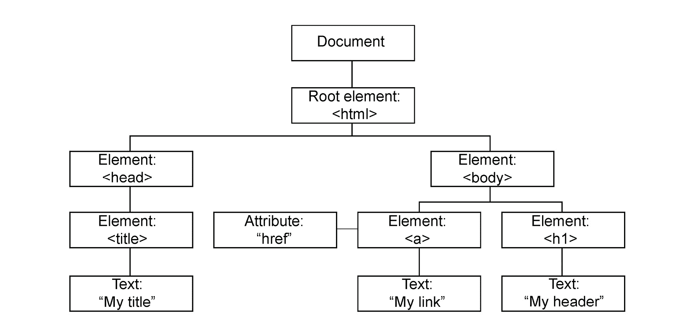
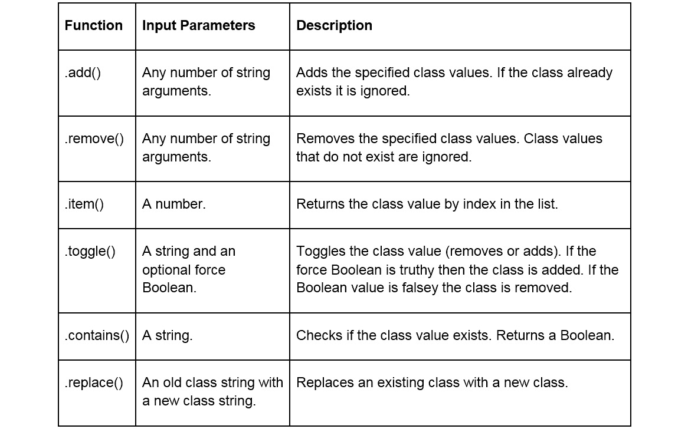
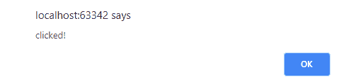
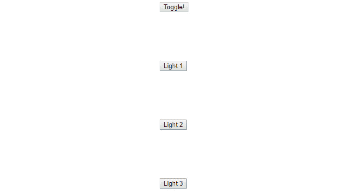
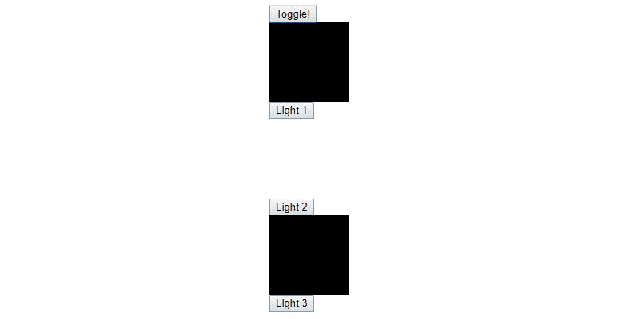

# 三、DOM 操作和事件处理

## 学习目标

在本章结束时，你将能够做到以下几点:

*   解释 DOM 遍历和操作
*   创建事件对象和浏览器事件
*   组织事件传播和冒泡
*   委托事件有效
*   使用 JQuery 处理事件和 DOM 操作

本章将介绍文档节点、事件对象以及链接、导航和处理事件的过程。

## 简介

在第一章中，我们介绍了 ES6 中发布的许多新的强大特性。 我们讨论了 JavaScript 的演变，并重点介绍了 ES6 中增加的关键功能。 我们讨论了作用域规则、变量声明、箭头函数、模板字面量、增强的对象属性、解构赋值、类和模块、编译以及迭代器和生成器。

在第二章中，我们介绍了 JavaScript 的异步编程范例。 我们讨论了 JavaScript 的事件循环、回调、承诺和 async/await 语法。 本章为我们应用*第 1 章，介绍 ECMAScript 6*中的内容，编写功能强大的异步程序做好准备。

在本章中，我们将学习**文档****对象模型(DOM)**和**JavaScript 事件对象**。 在第一个主题中，我们将定义文档对象模型，并解释 DOM 链接、导航和操作。 然后，我们将解释 JavaScript 事件对象，并演示如何与 DOM 事件交互和处理。 在本章中，我们将介绍 jQuery，并使用它来遍历 DOM 和处理事件。

## DOM 链接、导航和操作

文档对象模型(DOM)是一个 HTML 文档的接口。 DOM 以一种程序可以改变文档结构、样式和内容的方式来表示 web 页面。 DOM 是 web 页面的面向对象表示。

DOM 有两个标准:**万维网联盟(W3C)**标准和**Web 超文本应用技术工作组(WHATWG)**标准。 WHATWG 是为了响应 W3C 标准的缓慢发展而开发的。 这两个标准都将 HTML 元素定义为可被 JavaScript 代码访问的对象，以及所有 HTML 元素的属性、访问器方法和事件。 DOM 对象方法是可以在 HTML 元素上执行的操作，而 DOM 对象属性是可以获得或设置的值。 DOM 标准为 JavaScript 提供了一种以编程方式添加、获取、更改或删除 HTML 元素的方法。

#### 请注意

大多数现代浏览器(Chrome、Firefox 和 Edge)都实现了 W3C DOM 标准和 WHATWG DOM 标准，许多浏览器都对该标准进行了扩展。 当与 DOM 交互时，我们必须确保所使用的所有函数都与用户可能使用的浏览器兼容。

网页的 DOM 被构造成一个对象树，称为**节点**。 树的头部对象是一个**文档节点**。 **文档**是作为页面内容(DOM 树)入口点的接口。 页面中的 HTML 元素被添加到文档下的 DOM 树中。 它们被称为**元素节点**。

DOM 树中的元素与周围的元素有三种关系:**parent**，**sibling**，**child**。 元素的父元素是包含该元素的元素。 元素的兄弟节点也包含在元素的父节点中。 元素的子节点是元素所包含的元素。 DOM 树的示例如下图所示:



###### 图 3.1:DOM 树结构

在上面的图表中，我们可以看到全局父对象是**文档对象**。 文档对象有一个子节点，即`<html>`元素。 `<html>`元素的父节点是文档，它有两个子节点:`<head>`和`<body>`元素。 `<head>` 和`<body>`元素彼此是兄弟节点，因为它们都有相同的父节点。

### 练习 20:从 DOM 树结构构建 HTML 文档

这里的目的是创建一个网页，“我的标题”，其中显示标题“我的标题”和链接“我的链接”。 参考前面的 DOM 树结构图。

要从 DOM 树结构构建 HTML 文档，执行以下步骤:

1.  创建一个 HTML 文件。
2.  添加一个`<html>`标签到文件。
3.  在`<html>`标签内添加`<head>`标签。
4.  在`<head>`标签后加`<title>`标签。
5.  在`<title>` 标签中添加文字**我的标题**。
6.  在`<head>`标签下面添加`<body>`标签。
7.  在`<body>`标签下添加`<a>`、`<h1>`元素。
8.  添加`href`属性到`<a>`标签，并将其内部文本设置为**我的链接**。
9.  在`<h1>`标签内添加文字**My header**。
10.  关闭`body`和`html`标签并获取输出。

**编码**

##### index.js

```js
<html>
  <head>
    <title>My title</title>
  </head>
  <body>
    <a href>My link</a>
    <h1>My header</h1>
  </body>
</html>
```

https://bit.ly/2FiLgcE

###### 片段 3.1:演示 DOM 树的简单站点

**结果**


###### 图 3.2:我的头链接输出

你已经成功地从一个 DOM 树结构构建了一个 HTML 文档。

### DOM 导航

既然我们了解了 DOM 的基本结构，就可以开始在应用中与它进行接口了。 在开始用 JavaScript 修改 DOM 之前，我们必须在 DOM 树中导航，以找到我们想要修改的特定元素节点。 我们可以通过以下两种方式找到一个特定的节点:**通过标识符**找到它，或者**在 DOM 树**中导航。 最快的查找方法是通过标识符查找元素。 DOM 元素可以通过以下四种方式查找:

*   ID
*   标签名
*   类
*   查询 CSS 选择器

### 查找 DOM 节点

通过`document.getElementById( id )`方法获取元素 ID。 这个方法接受一个参数 id，它表示要查找的元素的 id，并返回一个元素对象。 返回的对象将是描述指定 id 的 DOM 节点的元素对象。 如果没有元素匹配提供的 id，函数将返回 null。 下面的代码片段显示了一个`getElementById`函数的示例:

```js
<div id="exampleDiv">Some text here</div>
<script>
  const elem = document.getElementById( 'exampleDiv' );
</script>
```

###### 片段 3.2:通过 id 获取元素

使用`document.getElementsByTagName( name )`方法获取标签名称的元素。 该函数接受一个表示要搜索的 HTML 标记名称的参数。 `getElementsByTagName`返回与给定标记名匹配的元素的动态`HTMLCollection`。 返回的列表是活动的，这意味着它使用 DOM 树自动更新自身。 不需要使用相同的元素和参数多次调用函数。 下面的代码片段显示了一个`getElementsByTagName`示例:

```js
<div id="exampleDiv1">Some text here</div>
<div id="exampleDiv2">Some text here</div>
<div id="exampleDiv3">Some text here</div>
<script>
  const elems = document.getElementsByTagName( 'div' );
</script>
```

###### 片段 3.3:根据标记名获取元素

#### 请注意

`HTMLCollection`是表示元素节点集合(类似数组的对象)的接口。 它可以被迭代，并提供方法和属性，以便从列表中进行选择。

要根据类名获取元素，我们使用`document.getElementsByClassName( name )` 方法。 该函数接受一个表示 HTML 类名的参数，用于搜索并返回与给定的`classname`匹配的元素的动态`HTMLCollection`。 下面的代码片段显示了一个`getElementsByClassName`示例:

```js
<div class="example">Some text here</div>
</img>
<style class="example"></style>
<script>
  const elems = document.getElementsByClassName( 'example' );
</script>
```

###### 代码片段 3.4:根据类名获取元素

`querySelector()`和`querySelectorAll()`这两个函数用于 CSS 查询选择器获取 HTML 元素。 它们都接受一个表示 CSS 选择器字符串的字符串参数。 `querySelector`将返回单个元素。 `querySelectorAll`将返回与查询匹配的静态(非活动)`NodeList`元素。 通过创建包含每个选择器的逗号分隔字符串，可以将多个查询选择器传递到函数中。 如果多个选择器被传递到查询选择器函数中，该函数将匹配并返回满足选择器要求的元素。 `querySelector`和`querySelectorAll`的功能如下所示:

```js
<div id="id1">Some text here</div>
</img>
<script>
  const elem = document.querySelector( 'img.class' );
  const elems = document.querySelectorAll( 'img.class, #id1' );
</script>
```

###### 片段 3.5:使用 CSS 选择器获取元素

#### 请注意

A`NodeList`与`HTMLCollection`相似。 它是一个类似数组的 HTML 节点集合，可以对其进行迭代。

前面介绍的每个方法及其函数语法如下表所示:


###### 图 3.3:方法和语法

`getElementsByTagName`、`getElementsByClassName`、`querySelector`、`querySelectorAll`函数不仅限于文档对象; 也可以在元素节点上调用它们。 如果在元素节点上调用它们，则函数返回的结果元素集合将仅限于调用该函数的元素的子元素。 下面的示例显示了这一点。

**示例**:我们获取 id 为`div1`的 div 的元素对象，并将其保存在`elem`变量中。 然后使用`getElementsByTagName`获取其他 div 元素。 函数调用保存在`elem`中的元素对象，因此搜索空间被限制在`div1`的子节点。 `getElementsByTagName`将返回`HTMLCollection`和`div2`、`div3`，因为他们是`div1`的后代:

```js
<div id="div1">
  <div id="div2">
    <div> id="div3"> Some text here </div>
  </div>
</div>
<div> Some other text here </div>
<script>
  const elem = document.getElementById( 'div1' );
  const elems = elem.getElementsByTagName( 'div' );
</script>
```

###### 片段 3.6:返回一个 HTMLCollection

找到 DOM 元素的第二种方法是通过元素关系在 DOM 树中导航。 一旦找到要处理的 DOM 元素，就可以使用几个属性来获取该元素的子节点、父节点和兄弟节点。 我们可以通过属性`parentNode`、`childNodes`、`firstChild`、`lastChild`、`previousSibling`和`nextSibling`从一个节点到另一个节点遍历 DOM 树。

属性返回一个节点的父节点。 父节点是 DOM 树中的一个节点，该节点是其后代节点。 父节点将始终存在，除非在文档节点上调用`parentNode`。 由于文档节点位于 DOM 树的顶部，所以它没有父节点，调用`parentNode`将返回 null。 DOM 树可以通过`parentNode`属性进行爬树。 `parentNode`的示例如下:

```js
<div id="div1">
  <div id="div2">
    <div id="div3"> Some text here </div>
  </div>
</div>
<script>
  const div3 = document.getElementById( 'div3' );
  const div2 = div3.parentNode;
  const div1 = div2.parentNode;
</script>
```

###### 代码片段 3.7:父节点

`nextSibling`和`previousSibling`属性用于获取一个节点在 DOM 树中的兄弟。 `previousSibling`将返回 DOM 树中前一个兄弟节点(在当前节点之前添加到父节点上的兄弟节点)，`nextSibling`将返回 DOM 树中下一个兄弟节点(在当前节点之后添加到父节点上的兄弟节点)。 当绘制 DOM 树时，节点的上一个同级节点通常显示在左边，下一个同级节点通常显示在右边。 DOM 树可以用`nextSibling`和`previousSibling`函数横向遍历。 以下示例显示了这些属性:

```js
<div id="div0">
  <div id="div1"> Some text here </div>
  <div id="div2"> Some text here </div>
  <div id="div3"> Some text here </div>
</div>
<script>
  const div2 = document.getElementById( 'div2' );
  const sibling1 = div2.previousSibling; //div1
  const sibling2 = div2.nextSibling; // div3
</script>
```

###### 片段 3.8:遍历同级节点

最后三个属性用于导航到节点的子节点; 它们是`childNodes`、`firstChild`和`lastChild`。 属性返回元素的子节点的动态`NodeList`。 `firstChild`和`lastChild`属性分别返回子`NodeList`的第一个或最后一个节点。 下面的代码片段显示了这些属性的使用:

```js
<div id="div0">
  <div id="div1"> Some text here </div>
  <div id="div2"> Some text here </div>
  <div id="div3"> Some text here </div>
</div>
<script>
  const div0 = document.getElementById( 'div0' );
  const child1 = div0.firstChild; //div1
  const child2 = div0.childNodes[1]; // div2
  const child3 = div0.lastChild; // div3
</script>
```

###### 代码段 3.9:遍历同级节点

### 遍历 DOM

DOM 树导航属性汇总如下表:


###### 图 3.4:DOM 树导航属性

### DOM 操作

当你编写一个应用或网页时，你拥有的最强大的工具之一就是以某种方式操纵文档结构。 这是通过 DOM 操作函数实现的，用于控制 HTML 和应用或页面的样式化。 当用户使用应用或网站时，能够操纵 HTML 文档，这允许我们在不完全重新加载内容的情况下动态更改页面的部分内容。 例如，当你在手机上使用一个消息应用时，该应用的代码正在操作你正在查看的文档。 每次发送消息时，它都会更新文档，以附加组成消息的元素和样式。 操作 DOM 有三种基本方法。 我们可以添加元素或节点，删除元素或节点，以及更新元素或节点。

向 DOM 树中添加新元素是交互式应用必须具备的条件。 在你使用的大多数 web 应用中都有很多这样的例子。 谷歌的 Gmail 和微软的 Skype 都会在你使用应用时主动向 DOM 添加元素。 向 DOM 添加新元素有两个步骤。 首先，我们必须为要添加的元素创建一个节点，然后必须将新节点添加到 DOM 树中。

要创建新元素或节点，可以使用`document.createElement(),``Node.cloneNode()`和`document.createTextNode()` 函数。 在全局文档对象上调用`CreateElement`，并接受两个参数。 第一个是`tagName`。 **tagName**是一个指定要创建的元素类型的字符串。 如果我们想创建一个新的 div 元素，我们将通过`tagName`传入`div`字符串。 第二个参数是一个称为 options 的可选参数。 Options 是一个`ElementCreationObject`，它包含一个名为'is'的属性。 这个属性允许我们指定要添加的元素是否是自定义元素。 我们不会使用这个属性，但是知道它的用途是很重要的。 返回一个新创建的 Element 对象。 下面的代码片段显示了`document.createElement()`的语法和用法:

```js
<script>
  const newElem = document.createElement( 'div' );
</script>
```

###### 片段 3.10:使用 document.createElement

还可以使用`cloneNode`函数创建新的元素节点。 在 DOM 节点对象上调用`cloneNode`，并复制调用它的节点。 它接受一个参数，一个名为`deep`的布尔值，并返回一个要克隆的节点副本。 如果将`deep`设置为`false`，`cloneNode`将进行浅克隆，并且只克隆调用它的节点。 如果`deep`设置为`true`，`cloneNode`将做一次深度复制，并复制节点及其所有子节点(节点的完整 DOM 树)。 克隆一个节点复制它的所有属性及其值。 这包括在 HTML 中内联添加的事件监听器，但不包括通过 JavaScript 添加的`addEventListener`监听器，或使用元素属性分配的监听器。

`cloneNode`的例子如下:

```js
<div id="div1">
  <div id="div2"> Text </div>
</div>
<script>
  const div1 = document.getElementById( 'div1' );
  const div1Clone = div1.cloneNode( false );
  const div1Div2Clone = div1.cloneNode( true )
</script>
```

###### 代码片段 3.11:克隆节点

在前面的示例中，我们创建了一个具有两个 div 的文档，`div1`和`div2`。 `div2`嵌套在`div1`内。 在上面的代码中，我们通过它的 id 选择了`div1`，并通过一个浅`nodeClone`将其克隆到`div1Clone`中。 然后我们做了一个深入的`nodeClone`，并将`div1`及其嵌套子`div2`克隆到`div1Div2Clone`。

#### 请注意

`cloneNode`可能导致文档中的元素 id 重复。 如果你复制一个带有 id 的节点，你应该更新该节点的 id 属性到唯一的东西。

DOM 的规范最近已经更新。 在 DOM4 规范中，deep 是`cloneNode`的可选参数。 如果省略，该方法将默认值为 true，使用深度克隆作为默认行为。 创建浅克隆时，深度必须设置为 false。 在最新的 DOM 规范中，这种行为已经更改。 Deep 仍然是一个可选参数; 但是，它默认为 false。 我们建议始终提供 deep 参数以实现向后和向前的兼容性。

`CreateTextNode`用于创建纯文本节点。 在用文本填充页面时使用纯文本 DOM 节点。 我们使用`createTextNode`将新文本放入元素(如 div)，`CreateTextNode`接受一个参数，一个名为`data`的字符串，并返回一个文本节点。 下面的代码片段显示了一个`createTextNode`示例:

```js
<script>
  const textNode = document.createTextNode( 'Text goes here' );
</script>
```

###### 代码片段 3.12:创建文本节点

现在我们知道了如何创建新的 DOM 节点，我们必须将新节点添加到 DOM 树中，以查看应用中的更改。 我们可以通过两个函数添加新节点:`Node.appendChild()`和`Node.insertBefore()`。 这两个函数都是在 DOM 节点对象上调用的。

`Node.appendChild`将一个节点添加到调用它的节点的子列表的末尾。 `Node.appendChild`接受一个参数`aChild`，并返回附加的子节点。 参数是我们想要附加到父节点的子节点列表中的节点。 如果在一个已经存在于 DOM 树中的节点中传递`appendChild`，该节点将作为指定父节点的子节点从当前位置移动到 DOM 中的新位置。 如果将`appendChild`传递给`DocumentFragment`，则`DocumentFragment`的全部内容将移动到父节点的子列表中，并返回一个空的 Document Fragment。 下面的代码片段显示了`appendChild`的语法和用法:

```js
<div id="div1"></div>
<script>
  const div1 = document.getElementById( 'div1' ); 
  const aChild = document.createElement( 'div' );
  parent.appendChild( aChild );
</script>
```

###### 片段 3.13:使用 appendChild 插入节点

#### 请注意

`DocumentFragment`只是一个没有父元素的 DOM 树。

在前面的例子中，我们创建了一个 div`div1`的 HTML 文档。 然后我们创建了一个新的 div`div2`，然后使用`appendChild`函数将其附加到`div1`子列表中。

也可以使用`Node.insertBefore()`函数将节点插入 DOM 中。 函数的作用是:在指定的参考节点之前，将一个节点插入到调用它的节点的子列表中。 `insertBefore`函数接受两个参数`newNode`和`referenceNode`，返回插入的节点。 参数`newNode`表示我们要插入的节点。 参数`referenceNode`是父节点的子节点列表中的一个节点或值`null`。 如果`referenceNode`是来自父节点的子节点，`newNode`将被插入到该节点的前面，但如果`referenceNode`是值`null`，`newNode`将被插入到父节点的子节点列表的末尾。 与`Node.appendChild()`类似，如果给函数一个已经在 DOM 树中要插入的节点，该节点将从 DOM 树中的旧位置删除，并作为父节点的子节点放到新的位置。 `InsertBefore`还可插入整个`DocumentFragment`。 如果`newNode`是`DocumentFragment`，函数将返回一个空的`DocumentFragment`。

下面的代码片段显示了`appendChild`的示例:

```js
<div id="div1">
  <div id="div2"></div>
</div>
<script>
  const div1 = document.getElementById( 'div1' );
  const div2 = document.getElementById( 'div2' );
  const div3 = document.createElement( 'div' );
  const div4 = document.createElement( 'div' );
  div1.insertBefore( div3, div2 );
  div1.insertBefore( div4, null );
</script>
```

###### 代码片段 3.14:使用 insertBefore 插入节点

在前面的示例中，我们创建了一个 div`div1`，其中包含一个嵌套的子 div`div2`。 在脚本中，我们通过元素 id 获得`div1`和`div2`。 然后我们创建了两个新的 div，`div3`和`div4`。 我们将`div3`插入到 div1 的子列表中。 我们传递`div2`作为参考节点，因此在 div1 的子列表中`div2`前面插入`div3`。 然后将`div4`插入到`div1`子列表中。 我们传入 null 作为引用节点。 这导致将`div4`附加到 div1 子列表的末尾。

#### 请注意

`referenceNode`不是可选参数。 您必须显式地传入一个节点或值为空。 不同的浏览器和浏览器版本对无效值的解释不同，应用的功能可能会受到损害。

操作 DOM 的另一个关键功能是能够从 DOM 树中删除 DOM 节点。 这个功能可以在 Gmail 和 Facebook 中看到。 当您在 Gmail 中删除电子邮件或删除 Facebook 帖子时，与该电子邮件或帖子关联的 DOM 元素将从 DOM 树中删除。 DOM 节点移除是通过`Node.removeChild()`函数完成的。 从调用它的父节点中删除指定的子节点。 它接受一个参数 child，并返回被删除的子 DOM 节点。 子参数必须是父节点的子节点列表中的子节点。 如果子元素不是父节点的子元素，则会抛出异常。

下面的代码片段显示了`removeChild`功能的一个示例:

```js
<div id="div1">
  <div id="div2"></div>
</div>
<script>
  const div1 = document.getElementById( 'div1' );
  const div2 = document.getElementById( 'div2' );
  div1.removeChild( div2 );
</script>
```

###### 代码片段 3.15:从 DOM 中删除一个节点

在前面的示例中，我们创建了一个 div`div1`，其中包含一个嵌套的子 div`div2`。 在这个脚本中，我们通过元素 id 获取两个 div，然后从`div1`子列表中删除`div2`。

既然我们可以从 DOM 中添加和删除节点，那么能够修改已经存在的节点将非常有用。 节点更新方式如下:

*   替换节点
*   更改内部 HTML
*   改变属性
*   改变类
*   改变风格

### 更新 DOM 中的节点

修改 DOM 节点的第一种方法是用一个新的 DOM 节点完全替换它。 一个 DOM 节点可以用`Node.replaceChild()`函数替换它的任何子节点。 `ReplaceChild`替换父节点的一个子节点，并使用新的指定节点调用它。 它接受两个参数`newChild`和`oldChild`，并返回替换的节点(`oldChild`)。 参数`oldChild`是父节点的子列表中将要替换的节点，参数`newChild`是将要替换`oldChild`的节点。

下面的代码片段显示了一个例子:

```js
<div id="div1">
  <div id="div2"></div>
</div>
<div id="div3"></div>
<script>
  const div1 = document.getElementById( 'div1' );
  const div2 = document.getElementById( 'div2' );
  const div3 = document.getElementById( 'div3' );
  div1.replaceChild( div3, div2 );
</script>
```

###### 代码片段 3.16:替换 DOM 中的节点

在前面的示例中，我们创建了两个 div，`div1`和`div2`。 `Div1`是用嵌套的子 div`div2`创建的。 在这个脚本中，我们根据每个 div 的元素 id 来获取它。 然后将`div1`患儿`div2`替换为`div3`。

操作 DOM 节点的第二种方法是更改节点的内部 HTML。 节点的`innerHTML`属性可用于获取或设置元素中包含的 HTML 或 XML 标记。 属性可用于更改元素子元素的当前 HTML 代码。 它可以用来更新或覆盖 DOM 树中元素下面的任何内容。 要将 HTML 插入到节点中，将参数`innerHTML`设置为包含要添加的 HTML 元素的字符串。传入参数的字符串将被解析为 HTML 并创建新的 DOM 节点; 然后将它们作为子节点添加到引用属性的父节点。 下面的代码片段显示了一个`innerHTML`属性的示例:

```js
<div id="div1"></div>
<script>
  const div1 = document.getElementById( 'div1' );
  div1.innerHTML = '<p>Paragraph1</p><p>Paragraph2</p>';
</script>
```

###### 代码片段 3.17:替换节点的 innerHTML

#### 请注意

设置`innerHTML`值将完全覆盖旧值。 DOM 节点将被移除，并替换为从 HTML 字符串中解析出来的新节点。

出于安全原因，`innerHTML`将不会解析和执行 HTML 字符串内`<script>`标签中包含的脚本。 然而，还有其他方法可以通过`innerHTML`属性来执行 JavaScript。 永远不要使用`innerHTML`附加你无法控制的字符串数据。

操作元素节点的第三种方法是更改节点的属性。 元素节点属性可以通过三个函数进行交互:`Element.getAttribute()`、`Element.setAttribute()`、`Element.removeAttribute()`。 必须在元素节点上调用所有这三个函数。

#### 请注意

某些应用于元素节点的属性具有特殊含义。 在添加或删除属性时要小心。 HTML 属性列表如下:[https://developer.mozilla.org/en-US/docs/Web/HTML/Attributes](https://developer.mozilla.org/en-US/docs/Web/HTML/Attributes)。

函数接受一个参数，即属性的名称，并返回指定属性的值。 如果属性不存在，函数将返回 null 或空字符串("")。 现代 DOM 规范规定该函数应该返回 null 值，大多数浏览器都遵循该规范，但有些浏览器仍然遵循旧的 DOM3 规范，该规范规定正确的返回值应该是空字符串。 处理这两种情况都很重要。

函数的作用是:设置或更新指定属性的值。 它接受两个参数:**name**和**value**，不返回任何值。 参数是要设置的属性的名称。 参数`value`是将属性设置为的字符串值。 如果传入的值不是字符串，它将在设置之前转换为字符串。 由于值被转换为字符串，将属性设置为对象或空将没有预期的值。 属性将被设置为传入值的字符串化版本。

函数的作用是:从节点中删除指定的属性。 它接受一个参数`attrName`，并且不返回值。 参数`attrName`是要删除的属性的名称。 您可以使用`removeAttribute`而不是尝试使用`setAttribute`将属性的值设置为空。 以下片段显示了`getAttribute`、`setAttribute`和`removeAttribute`的示例:

```js
<div id="div1"></div>
<script>
  const div1 = document.getElementById( 'div1' );
  div1.setAttribute( 'testName', 'testValue' );
  div1.getAttribute( 'testName' );
  div1.removeAttribute( 'testName' );
</script>
```

###### 片段 3.18:获取、设置和删除属性

在前面的示例中，我们创建了一个名为`div1`的 div。 然后根据 div 的 id 获取 div，添加`testName`属性，并将其值设置为`testValue`。 然后我们获取`testName`的值并删除它。

操作节点的第四种方法是更改其类信息。 元素类信息用于关联类似的 HTML 元素，以实现样式化和分组目的。 元素的类可以通过两种方式访问，`className`属性或`classList`属性。 属性返回一个包含元素所有类信息的字符串。 此属性可用于获取或设置类值。 属性返回一个活动的`DOMTokenList`对象。 这个对象只是当前类信息的一个活动列表，带有用于获取和更新类信息的特殊方法。

### 更新 DOM 中的节点

`classList`对象有六个辅助函数。 详情见下表:



###### 图 3.5:Helper 函数

以下代码片段使用了这些 helper 函数:

```js
<div id="div1" class="testClass"></div>
<script>
  const classes = document.getElementById( 'div1' ).classList;
  classes.add( 'class1', 'class2' ); // adds class1 and class2
  classes.remove( 'testClass' ); // removes testClass
  classes.item( 1 ); // gets class at index 1: class2
  classes.toggle( 'class2' ); // removes class2 because it exists
  classes.contains( 'class2' ); // checks for class2: false
  classes.replace( 'class1', 'class0' ) // replaces class1 with class3  
</script>
```

###### 代码片段 3.19:使用 classList 对象

第五种也是最后一种修改节点的方法是通过 style 对象。 样式对象反映了节点的 CSS 样式，每个元素节点都有一个样式对象。 style 对象可以通过`Element.style`获取。 样式对象包含可以分配给该对象的每个 CSS 样式的属性。 该对象是只读的，因此不应该通过覆盖 style 对象来直接设置元素样式。 相反，我们应该改变 style 对象的单个属性:

```js
<div id="div1" style="color:blue">Hello World!</div>
<script>
  const style = document.getElementById( 'div1' ).style;
  style[ 'color' ]; // Returns blue
  style[ 'background-color' ] = 'red'; // Sets background-color to red
</script>
```

###### 代码片段 3.20:使用 classList 对象

#### 请注意

所有可用的样式属性的列表可以在网上找到[https://www.w3schools.com/jsref/dom_obj_style.asp](https://www.w3schools.com/jsref/dom_obj_style.asp)。

DOM 操作是 web 页面中最重要的部分之一。 可以通过查找、添加、删除和更新树中的节点来操作 DOM。 我们可以通过几种方式查找 DOM 节点——惟一 id、通过类或通过 CSS 查询选择器。 一旦我们找到了一个 DOM 节点，我们就可以遍历 DOM 树，通过步进到该元素的子节点、兄弟节点或父节点。 要向 DOM 树中添加新元素，必须首先创建一个新元素节点，然后将该元素追加到 DOM 中的某个位置。 要删除元素，只需获取想要删除的元素的节点，然后调用 node remove 函数。 要更新一个节点，我们可以更改它的任何属性、属性，或者直接替换节点。 DOM 操作允许我们构建动态网页，掌握它很重要。

**结论**

由 HTML 代码构建的 Web 文档由文档对象模型(Document Object Model, DOM)表示。 DOM 是由节点构建的树状结构。 每个节点对应于 HTML 源中的一个元素。 作为程序员，我们可以与 DOM 交互来动态更新网页。 我们可以通过查找、创建、删除和更新元素节点与 DOM 进行交互。 结合所有这些概念，我们可以创建动态网页，可以根据用户交互更新视图。 这种功能可以在几乎所有的网站上看到，包括亚马逊、Facebook 和谷歌。

### 练习 ise 21: DOM 操作

你的团队正在建立一个电子邮件网站。 站点需要从 JSON 文件中加载用户的电子邮件数据，并使用加载的电子邮件数据动态填充表。 示例代码文件中提供了电子邮件。 电子邮件表应该显示**From**，**To**和**Subject**字段，每个电子邮件都有一行。 通过本章学习的 DOM 操作，使用电子邮件对象在 DOM 中构建电子邮件表。

使用 DOM 操作技术用 JavaScript 构建一个电子邮件列表，执行以下步骤:

1.  从**/exercises/exercise21/exercise.html 中打开**exercise**文件。**
2.  在文件底部的`script`标签中，编写 JavaScript 代码(在本练习的最后，在*code*下)。
3.  创建一个新的表元素(`<table>`)，并将其保存到一个名为`table`的变量中。
4.  Create a new scope block with curly braces (`{}`).

    创建一个数组来保存标题类型**to**，**From**和**Subject**。 将数组保存到变量头文件中。

    创建一个表行元素(`<tr>`)并将其保存到变量行中。 使用`forEach`函数循环头数组。

5.  Inside the callback of `forEach`, do the following:

    创建表头元素(`<th>`)并将其保存到`header`变量中。 使用`appendChild()`，添加一个新的文本节点到`header`。 文本节点应该包含`header`名称。

    将存储在`header`中的头元素作为子元素附加到存储在`row`中的表行。

6.  Append the table row stored in `row` as a child to the table stored in `table`. The output is shown in the following figure:

    

    ###### 图 3.6:步骤 4 输出

7.  用花括号(`{}`)创建一个新的作用域块。
8.  Loop over the data array, `data`, with a `forEach` loop and do the following:

    创建一个新的表行元素(`<tr>`)，并将其保存在`row`变量中。 创建另一个新的表数据元素(`<td>`)，并将其保存在`to`变量中。

    接下来，再创建两个表数据元素(`<td>`和`<td>`)，并将它们保存为变量(`subject`和`from)`)。

    向存储在`to`中的表数据元素添加一个文本节点，该节点包含`forEach`循环的数据对象的`to`值。 将另一个文本节点附加到存储在`from`中的表数据元素，其中包含`forEach`循环的数据对象的`from`值。

    向存储在`subject`中的表数据元素添加一个文本节点，该节点包含`forEach`循环的数据对象的`subject`值。

    将存储在`to`中的元素附加到存储在`row`中的表行。 将存储在`from`中的元素附加到存储在`row`中的表行。

    将存储在`subject`中的元素附加到存储在`row`中的表行。 将存储在`row`中的行追加到存储在`table`中的表。

9.  获取`emailTableHolder`DOM 节点，并将存储在`table`变量中的表附加为子节点。
10.  在浏览器中加载 HTML 文件以查看结果:


###### 图 3.7:最终输出

**编码**

##### solution.html

```js
const table = document.createElement( 'table' );
const row = document.createElement( 'tr' );
[ 'to', 'from', 'subject' ].forEach( h => { 
  const header = document.createElement( 'th' );
  header.appendChild( document.createTextNode( h ) );
  row.appendChild( header );
} );
table.appendChild( row );
data.forEach( email => {
  const row = document.createElement( 'tr' );
  /* code omitted for brevity */
  table.appendChild( row );
} );
document.getElementById( 'emailTableHolder' ).appendChild( table );
```

###### 代码片段 3.21:创建电子邮件列表的 DOM 操作

https://bit.ly/2FmvdK1

**结果**

您已经成功地分析了 DOM 操作技术。

## DOM 事件和事件对象

DOM 事件是功能性和响应性 web 应用的支柱。 事件用于任何具有任何用户交互形式的网站。 像 Facebook，谷歌和 Skype 这样的网站都大量使用了事件。 事件是一个信号，告诉程序员某个 DOM 节点发生了什么事。 几乎任何原因都可以触发事件。 我们可以使用 JavaScript 监听事件并在事件发生时运行函数。

### 唐夏娃 nt

**DOM 事件**是一个由 DOM 节点发送的通知，让程序员知道 DOM 节点发生了什么事。 这可以是从用户点击一个元素或按键盘上的一个键到视频播放结束的任何内容。 有很多事件可以被触发。 每个可以触发的事件都可以附加一个事件监听器。 事件监听器是等待事件触发，然后调用事件处理程序的接口。 事件处理程序是响应事件而运行的代码。 事件处理程序是我们作为程序员分配给事件的 JavaScript 函数。 这称为注册事件处理程序。

#### 请注意

完整的赛事列表可以在这里找到:[https://developer.mozilla.org/en-US/docs/Web/Events](https://developer.mozilla.org/en-US/docs/Web/Events)。

添加事件处理程序的最佳方法是使用`addEventListener`函数。 函数设置了当指定类型的事件触发时要调用的指定事件处理程序。 该功能有三个参数，**type**，**listener**，**options**或**useccapture**。 第一个参数 type 是要监听的区分大小写的事件类型。 第二个参数 listener 是可以接收通知的对象，通常是一个 JavaScript 函数。 选项和**useccapture**参数是可选的，你只能提供其中一个。 options 参数指定具有**capture**、**once**和**passive**属性的选项对象。 在 options 参数中，名为“capture”的属性是一个布尔值，表示事件在被推入 DOM 树之前将被分派给事件处理程序。 名为“once”的属性是一个布尔值，指示事件处理程序在被调用一次后是否应该被删除。 名为'passive'的属性是一个布尔值，表示事件处理程序永远不会调用`preventDefault`函数(在处理事件子主题中讨论)。 useccapture 参数的作用方式与`options.capture`属性相同。

### 事件监听

**事件监听器**可以附加到任何 DOM 节点。 要附加事件监听器，必须选择需要监听事件的节点，然后在该节点上调用`addEventListener`函数。 如下代码片段所示:

```js
<button id="button1">Click me!</button>
<script>
  const button1 = document.getElementById( 'button1' );
  button1.addEventListener( 'click', () => {
    console.log( 'Clicked' );
  }, false );
</script>
```

###### 片段 3.22:获取、设置和删除属性

在前面的示例中，我们创建了一个 id 为`button1`的按钮。 在脚本中，我们选择了该按钮并添加了一个事件监听器。 事件监听器监听单击事件。 当单击事件发生时，它调用处理程序函数，该函数记录到控制台。

#### 请注意

您可能会在 HTML 代码中看到内联事件处理程序，例如，`<button onclick="alert( 'Hello! ')">Press me</button>`。 你不应该这样做。 最好的做法是将 JavaScript 和 HTML 分开。 当您混合 HTML 和 JavaScript 时，代码很快就会变得难以管理、效率低下，并且难以解析和解释。

以后，如果我们决定不再需要事件监听器，我们可以使用`removeEventListener`函数删除它。 函数的作用是:从指定的事件类型中删除指定的处理函数。 它的参数与`addEventListener`相同。 为了正确地删除事件监听器，`removeEventListener`必须将其与已添加的监听器匹配。 `RemoveEventListener`寻找具有相同类型、侦听器函数和捕获选项的侦听器。 如果找到匹配，则删除事件侦听器。 以下片段显示了`removeEventListener`的示例:

```js
<button id="button1">Click me!</button>
<script>
  const button1 = document.getElementById( 'button1' );
  function eventHandler() { console.log( 'clicked!' }
  button1.addEventListener( 'click', eventHandler, true );
  button1.removeEventListener( 'click', eventHandler, true );
</script>
```

###### 片段 3.23:获取、设置和删除属性

在前面的示例中，我们创建了一个 id 为`button1`的按钮。 在这个脚本中，我们通过为 click 事件添加一个事件监听器来获取按钮的 id。 然后，我们删除相同的侦听器，提供与`addEventListener`函数完全相同的参数，以便`removeEventListener`能够与我们想要删除的侦听器适当匹配。

### 事件 O 对象和事件处理

每个事件处理函数都接受一个参数。 这是事件对象。 你会经常看到这个参数被定义为`event`，`evt`，或者简单的`e`。 它被自动传递给事件处理程序以提供有关事件的信息。 事件处理程序可以利用事件对象中的信息来操作 DOM，并允许用户与页面进行交互:

```js
<div id="div1">Click me!</div>
<script>
  const div1 = document.getElementById( 'div1' );
  button1.addEventListener( 'click', ( e ) => {
    e.target.style.backgroundColor = 'red';
  }, false);
</script>
```

###### 片段 3.24:使用事件处理程序来操作 DOM

事件对象的新实例可以通过调用事件类的新实例(`new Event()`)来创建。 构造函数接受两个参数:**类型**和**选项**。 Type 是事件的类型，options 是一个可选对象，包含以下字段:**bubbles**，**cancable**，**composed**。 所有这三个字段也是可选的。 bubbles 属性指示事件是否应该冒泡。 属性表示事件是否可以取消。 组合属性指示事件是否应该在影子根之外触发侦听器。 所有三个默认值都为 false。

事件对象有许多有用的属性和函数。 可以利用这些属性来获取有关事件的附加信息。 例如，我们可以使用`Event.target`属性来获取最初触发事件的 DOM 节点，或者使用`Event.type`来查看事件的名称。 当您想对多个元素使用同一个处理程序时，`Event.target`非常有用。 我们可以重用一个处理程序，简单地使用`Event.target`来检查是哪个元素触发了事件，而不是为每个事件使用新的处理程序函数。

当从 DOM 元素触发事件时，它会通知附加到 DOM 节点的事件监听器。 然后，该事件沿着 DOM 树向上传播到每个父节点，直到它到达树的顶部。 这种效果称为事件传播或事件冒泡。 通过减少页面中需要的事件监听器的数量，可以使代码更高效。 如果我们有一个元素，它有许多子元素，这些子元素都需要相同的用户交互，那么我们可以向父元素添加一个事件监听器，并捕捉从子节点弹出的任何事件。 这被称为事件委托。 我们不是将侦听器附加到每个子节点，而是将事件处理委托给父节点。

### 事件传播

事件传播可以通过`stopPropagation`功能进行控制。 这个函数是事件对象中的众多函数之一。 不接受任何参数。 当调用它时，它会阻止当前事件的进一步传播。 这意味着它完全捕获事件，并防止它向上冒泡到任何其他父节点。 如果我们正在使用委托，或者如果子节点和父节点上有侦听同一事件但执行不同任务的事件监听器，停止事件传播可能非常有用。

### 触发事件

标准 DOM 事件由浏览器自动触发。 JavaScript 为我们提供了两个非常强大的工具，使我们能够更好地控制页面中的事件如何触发。 第一个工具是通过 JavaScript 触发事件。 第二个是自定义事件。

在本章前面，我们已经学习了如何创建事件对象的新实例。 如果我们不能触发事件并通知 DOM 树发生了什么事情，那么单独的事件就不是很有用。 DOM 节点有一个成员函数`dispatchEvent()`，它允许我们触发或分派事件对象的实例。 `DispatchEvent()`应该在您想要触发事件节点的 DOM 节点上调用。 它接受一个参数并返回一个布尔值。 此参数是将在目标 DOM 节点上触发的事件对象。 如果事件是可取消的，并且处理该事件的事件处理程序之一被称为`Event.preventDefault()`，则`DispatchEvent()`返回值为 false。 否则，`dispatchEvent()`将返回 true。 以下片段显示了`dispatchEvent()`的示例:

```js
const event = new MouseEvent( 'click' , { 
  bubbles:true,
  cancelable: true
} );
const element = document.getElementById( 'button' );
const canceled = element.dispatchEvent(event);
```

###### 片段 3.26:触发事件

如果没有正确指定事件的类型，`dispatchEvent`方法将抛出一个`UNSPECIFIED_EVENT_TYPE_ERR`错误。 这意味着如果事件的类型为空或空字符串，或者事件在调用`dispatchEvent()`之前没有初始化，则会抛出一个运行时错误。

需要注意的是，使用`dispatchEvent()`触发的事件不会通过事件循环异步调用。 由 DOM 节点触发的普通事件通过事件循环异步调用事件处理程序。 当使用`dispatchEvent()`时，事件处理程序将被同步调用。 在代码继续`dispatchEvent`调用后的代码之前，所有适用的事件处理程序都被执行并返回。 如果某个事件有许多事件处理程序，或者某个事件处理程序执行了大量同步工作，则其他事件可能会被阻塞。

#### 请注意

一些浏览器实现了用于在 DOM 节点上触发事件的`fireEvent()`函数。 这个函数是一个非标准函数，在大多数浏览器上都不能工作。 不要在产品代码中使用此方法。

### 练习 22:处理你的第一件事

要设置事件监听器并捕获触发的事件，请执行以下步骤:

1.  创建一个带有`body`标签的 HTML 文件。
2.  在`body`标签内，创建一个带有文本`Click Me!`和 id`button1`的按钮。
3.  在按钮后添加`script`标签。
4.  在`script`标签中，按 id 选择按钮并将其保存到`button1`变量中。
5.  Add an event listener for the `click` event to the element stored in `button1`.

    #### 请注意

    回调应该调用 alert 函数并使用`clicked!`字符串警告浏览器。

**编码**

##### index . html

```js
<html>
<body>
 <button id="button1">Click me!</button>
 <script>
   const button1 = document.getElementById( 'button1' );
   button1.addEventListener( 'click', ( e ) => {
     alert('clicked!');
   }, false );
 </script>
</body>
</html>
```

###### 代码片段 3.25:DOM 事件处理

https://bit.ly/2M0Bcp5

**结果**

###### 

###### 图 3.8:步骤 2 点击我! 按钮



###### 图 3.9:输出视图

您已经成功设置了事件监听器并捕获了触发的事件。

### 自定义事件

JavaScript 还允许创建自定义事件。 自定义事件是用自定义类型触发事件和监听事件的一种方法。 事件的类型可以是任何非空字符串。 创建自定义事件的最基本方法是用事件类型作为自定义事件名称初始化事件对象的新实例。 这是通过以下语法完成的:`const event = new Event( 'myCustomEvent' )`。 创建这样的事件不允许您向事件添加任何自定义信息或属性。 要创建带有附加信息的自定义事件，可以使用`CustomEvent`类。 `CustomEvent`类构造函数有两个参数。 第一个参数是一个字符串，表示要创建的自定义事件的类型名称。 第二个参数是一个表示自定义事件初始化选项的对象。 它接受与传递给事件类初始化式的选项相同的字段，只是添加了一个名为`detail`的字段。 detail 字段默认为空，是一个与事件相关的事件值。 我们想要传递给自定义事件的任何信息都可以通过 detail 参数传递。 此参数中的数据也传递给所有侦听自定义事件的处理程序。

#### 请注意

事件构造函数适用于所有现代浏览器，Internet Explorer 除外。 为了完全兼容 IE，您必须使用后面讨论的`createEvent()`和`initEvent()`方法，或者使用`polyfill`来模拟`CustomEvent`类。

为了最大化代码浏览器兼容性，我们还必须讨论用于创建自定义事件的`initEvent()`和`createEvent()`方法。 这些方法已被弃用，并已从 web 标准中删除。 然而，有些浏览器仍然支持这些功能。 要在旧浏览器中创建自定义事件，首先必须使用`var event = document.createEvent( 'Event' )`创建事件(在旧浏览器中必须使用`var`而不是`const`)，然后使用`event.initEvent()`初始化新事件。 `CreateEvent()`接受一个参数，type。 这是将要创建的事件对象的类型。 该类型必须是标准的 JavaScript 事件类型之一，例如`Event`、`MouseEvent`等等。 `InitEvent()`有三个参数。 第一个参数是表示事件类型名称的字符串。 例如，单击事件的类型为**单击**。 第二个参数是一个布尔值，表示事件的冒泡行为。 第三个参数是一个布尔值，表示事件的可取消行为。 这两种行为在本主题的*事件对象和处理事件*部分进行了讨论。

为了捕获和处理自定义事件，我们可以使用标准的事件侦听器行为。 我们所需要做的就是用`addEventListener()`附加一个事件监听器，用于监听添加的自定义事件类型。 例如，如果我们创建一个事件类型为`myEvent`的`CustomEvent`，那么要监听该事件，我们只需要在该类型上添加一个`addEventListener( 'myEvent', e => {} )`的事件监听器。 每当触发类型为`myEvent`的事件时，将调用添加的事件监听器回调。

当事件监听器回调被调用时，回调中的事件参数将有一个额外的字段`detail`。 该字段将包含通过自定义事件选项对象的`detail`字段传递给自定义事件的信息。 任何与自定义事件相关的信息都应该通过`detail`对象传递。 下面的代码片段显示了 detail 对象的一个示例:

```js
const element = document.getElementById( 'button' );
element.addEventListener( 'myClick', e => {
  console.log( e.detail );
} );
const event = new CustomEvent( 'myClick' , { detail: 'Hello!' } );
const canceled = element.dispatchEvent( event );
```

###### 片段 3.27:用细节中的数据触发自定义事件

### 练习 23:处理和委派事件

您正在构建一个购物清单页面，以帮助忙碌的购物者管理购物清单，而无需铅笔和纸。 我们的购物列表应用将是一个带有表格、文本输入和添加行按钮的页面。 添加行按钮将向购物列表表添加新行。 添加的行有购物列表项(来自文本输入的文本)和删除按钮。 删除按钮将从购物列表表中删除该行。

以下步骤将构建应用:

1.  在**exercises/exercise23/exercise.html**处打开启动器文件。
2.  In the HTML `body`, in the `userInteractionHolder` `div`, add a text input and a button.

    给按钮 id`addButton`。

    向 id 为`shoppingListHolder`的`div`添加一个 id 为`shoppingList`的表元素。

    向上一步(`id = "shoppingList"`)创建的表中添加一行。

    添加两个标题项到表中，一个带有文本`Item`，一个带有文本`Remove`。

    

    ###### 图 3.10:步骤 2 后的输出

3.  In the `script` tag, select the button by its id and add a click listener that calls the `_addRow` function. Create the `_addRow` function with the following functionality:

    接收一个参数，`e`，它是事件对象。 使用事件目标上的`previousSibling`属性通过 DOM 遍历获取文本输入。 将文本输入元素节点保存为变量`inputBox`。

    将`inputBox`中的文本值保存为`value`变量。

    通过将文本区域设置为空字符串(`""`)来清除文本区域的值。

    创建一个表行元素并将其保存在`row`变量中。

    使用 DOM 操作和链接将表数据元素追加到表行。 将文本节点追加到表数据元素。

    #### 请注意

    文本节点应该包含存储在`value`中的值。

4.  使用 DOM 操作和链接将表数据追加到表行。
5.  将一个按钮附加到表数据元素。
6.  将文本`remove`附加到按钮。
7.  导航回按钮元素。
8.  给按钮添加一个监听器，让它调用`_removeRow`函数。
9.  选择`shopingList`表并将行追加到其中。
10.  Create the `_removeRow`  function with the following functionality:

    接受一个参数，`e`，它将包含事件对象。

    获取在 DOM 遍历中发生按钮单击的 row 元素和`parentNode`属性。 记录行元素。

    使用 DOM 遍历和链接，获取包含该行的表，然后从表中删除该行:


###### 图 3.11:最终输出

**编码**

##### solution.html

```js
<body>
<h1>Shopping List</h1>
<div id="userInteractionHolder">
  <!-- add a text input and an add button -->
</div>
 <div id="shoppingListHolder">
  <!-- add a table with a row for column headers -->
</div>
<script>
  /* add event listener to add button */
  function _addRow( e ) { /* get input data and add row with it */ }
  function _removeRow( e ) { /* get row from event and it */ }
</script>
```

###### 代码片段 3.28:构建购物列表应用的 DOM 操作和事件处理

https://bit.ly/2D1c3rC

**结果**

Yo 已经成功地应用了事件处理的概念来构建一个有用的 web 应用。

## JQuery

**jQuery**是一个轻量级的 JavaScript 库，旨在简化 DOM 的交互。 它是 web 开发中最流行的库之一。 jQuery 旨在简化对 DOM 的调用，并使代码更加流线型。 在本主题中，我们将概述什么是 jQuery，如何在项目中安装 jQuery, jQuery 基础知识，使用 jQuery 进行 DOM 操作，以及使用 jQuery 处理事件。

jQuery 是一个库，旨在简化 DOM 遍历、操作、事件处理、动画和 AJAX 请求的使用，并使使用这些元素的代码更加流畅。 jQuery 是一个扩展的 JavaScript 库。 对 JavaScript 的熟练掌握对于充分利用 jQuery 的强大功能至关重要。

jQuery 提供了一个易于使用的 API，具有广泛的跨浏览器兼容性。 jQuery 实现了所谓的“当前”浏览器支持。 这仅仅意味着 JQuery 将在浏览器的当前版本和以前的版本(v23)上运行并受支持。 x 和 22。 X，但不是 v21.x)。 代码可以在较旧的浏览器版本上成功运行，但对 jQuery 的错误修复不会针对较旧的浏览器版本出现的任何错误进行推送。 jQuery 浏览器兼容性也扩展到 Android 和 IOS 设备上的移动浏览器。

#### 请注意

JQuery 官方网站:[https:// jquery.com/](https://jquery.com/)。

安装 jQuery 的第一种方法是直接下载源 JavaScript 文件。 文件可在[http://code.jquery.com](http://code.jquery.com)上找到。 JavaScript 文件可以直接添加到项目的文件结构中。 由于文件较小，您应该在产品代码中使用简化版本。

#### 请注意

**代码缩减**是从源代码中删除不必要的字符而不改变其功能的过程。 最小化是为了减少代码文件的大小。 这对 JavaScript、HTML 和 CSS 文件很重要，因为它减少了发送和加载网页所需的资源。

第二种安装 JQuery 的方法是使用包管理器。 最流行的命令行包管理器是 NPM、Yarn 和 Bower。 NPM 将在本书的最后一章进行更详细的讨论。 要使用这些 CLI(命令行接口)包管理器之一安装 jQuery，首先安装并配置相关的包管理器。 要使用 NPM 进行安装，运行以下代码:`npm install jquery`。 这将把 jQuery 文件放在`node_modules`文件夹下`node_modules/jquery/dist/`。 使用 Yarn 安装时，使用以下命令:`yarn add jquery`。 使用 Bower 安装时，使用如下命令:`bower install jquery`。 使用 Bower 安装时会将文件放置在`bower_components/jquery/dist/`下的`bower_components`文件夹中。

一旦安装了 JQuery，我们就可以开始将 JQuery 加载到项目中了。 这就像在 HTML 文件中添加一个脚本标记一样简单。 在主 HTML 文件中，只需添加一个脚本标签，源文件为 jQuery 库文件`(<script src="path/to/jquey.js"></script>`)。 JQuery 现在已经安装好了，可以在项目中使用了!

### jQuery Basics

JQuery 是一个围绕选择和处理 DOM 节点而构建的库。 默认情况下，所有 JQuery 操作都在库名`jQuery`和快捷变量`$`下可用。 我们将通过引用快捷键变量来调用所有 JQuery 函数。

当创建或选择 DOM 节点时，jQuery 总是返回 jQuery 对象的实例。 JQuery 对象是一个类似数组的集合，它包含一个索引为零的 DOM 元素序列、一些熟悉的数组函数和属性，以及所有内置的 JQuery 方法。 关于 JQuery 对象，需要注意两点。 首先，JQuery 对象不是活动对象。 JQuery 对象的内容不会随着 DOM 树的变化而更新。 如果 DOM 发生了变化，则可以通过重新运行相同的 JQuery 选择器来更新 JQuery 对象。 其次，JQuery 对象也不相等。 使用相同查询构建的两个 JQuery 对象之间的相等比较将不为真。 要比较 JQuery 对象，必须检查集合中包含的元素。

#### 请注意

0 索引意味着对象具有数字属性，可用于引用项序列(0,1,2，…，n)中的项。

JQuery 对象不是数组。 JQuery 对象上可能不存在内置数组属性和函数。

### jQuery 选择器

JQuery 的核心功能围绕着选择和操作 DOM 元素。 这是通过 jQuery 核心选择器完成的。 要选择 DOM 元素，我们调用 jQuery 选择器函数`jQuery( selector )`，或简称`$( selector )`。 传递给 jQuery 函数的选择器可以接受几乎任何有效的 CSS 选择器、回调函数或 HTML 字符串。 如果将 CSS 选择器传递给 JQuery 选择器，将在 JQuery 对象中返回匹配元素的集合。 如果传入的选择器是一个 HTML 字符串，则将从提供的 HTML 字符串创建一个节点集合。 如果将回调函数传递给选择器函数，则回调函数将在 DOM 完成加载后运行。 jQuery 也可以接受一个 DOM 节点并从中创建一个 jQuery 对象。 如果将一个 DOM 节点传递给 jQuery 选择器函数，该节点将被自动选择并在 jQuery 集合中返回。 JQuery 选择器函数的示例如下所示:

```js
const divs = $( "div" ); // JQuery select all divs
const div1 = document.getElementById( 'div1' ); // DOM select a div
const jqueryDiv1 = $( div1 ); // Create a JQuery object from div
```

###### 代码片段 3.29:选择 DOM 节点

大多数 jQuery 函数操作 DOM 节点(`$()`); 然而，JQuery 也提供了一组不需要的函数。 这些是通过$变量直接引用的。 这两者之间的区别可能会让 jQuery 新用户感到困惑。 记住这一区别的最简单方法是注意`$`名称空间中的函数通常是实用程序方法，与选择无关。 有些情况下，选择器方法和核心实用程序方法具有相同的名称，例如，`$.each()`和`$().each()`。 在阅读 jQuery 文档和学习新函数时，请确保所研究的函数是正确的。

只有创建了基本 DOM 结构，才能安全地操作 HTML 页面的 DOM。 JQuery 提供了一种方法，可以在运行任何代码之前安全地等待 DOM 就绪。 这是通过 JQuery 对象函数`ready()`完成的。 这个函数应该在包含 HTML 文档(`$( document ).ready()`)的 jQuery 对象上调用。 `ready()`函数有一个参数，一个回调函数。 一旦 DOM 准备好了，这个函数就会运行。 操作 DOM 的代码应该放在这个回调函数中。

在 JavaScript 中使用多个库时，名称空间冲突总是一个问题。 jQuery 及其所有插件和功能都包含在`jQuery`命名空间中。 因此，jQuery 和其他库之间不应该有冲突。 不过，有一个警告，jQuery 默认使用`$`作为 jQuery 名称空间的快捷方式。 如果您正在使用另一个使用`$`变量的库，则可能会与 jQuery 发生冲突。 为了避免这种情况，可以将 JQuery 设置为无冲突模式。 为此，调用 jQuery 名称空间(`jQuery.noConflict()`)上的`noConflict()`函数。 这将开启无冲突模式，并允许您为 jQuery 库分配一个新的快捷方式变量名。 变量名可以是任何你喜欢的，从`$`到`mySuperAwesomeJQuery`。 下面的代码片段显示了启用无冲突模式和更改 jQuery 快捷方式变量名的完整示例:

```js
<script src="jquery.js"></script>
<script>
  // Set the jQuery alias to $j instead of $
  const $j = jQuery.noConflict();
</script>
```

###### 片段 3.30:启用无冲突模式

### jQuery DOM 操作

JQuery 是围绕 DOM 操作构建的。 在这里，我们将介绍 JQuery DOM 操作的基本知识。 我们将从选择元素开始，然后继续遍历和操作 DOM，最后以链接结束。

### 选择元素

DOM 操作的第一步总是选择要处理的 DOM 节点。 JQuery 最基本的概念是“选择一些元素并使用它们做一些事情”，JQuery 使用选择器函数`: $()`使选择元素变得非常简单。 选择器。 jQuery 支持大多数 CSS3 选择器来选择节点。 选择元素的最简单方法是根据 id、类名、属性和 CSS。

通过 id 选择一个元素是通过传递 CSS 元素 id 选择器到 jQuery 选择器函数:`$( '#elementId' )`完成的。 这将返回一个包含与该 id 匹配的元素的 JQuery 对象。 按类名选择就像按 id 选择一样。 将 CSS 类名选择器传递到 jQuery 选择器函数:`$( '.className' )`。 这将返回一个包含与类名匹配的所有元素的 jQuery 对象。 根据属性选择元素是通过将属性 CSS 选择器传递给 jQuery 选择器函数:`$( "div[attribute-name='example']" )`来完成的。 这将返回一个 JQuery 对象，该对象包含与指定的元素类型和属性名/值匹配的所有元素。 jQuery 还支持更复杂的选择器。 你可以传入复合 CSS 选择器，逗号分隔的选择器列表，和伪选择器，如`:visible`。 这些选择器都返回包含匹配元素的 JQuery 对象。

#### 请注意

如果 jQuery 选择器不匹配任何节点，它仍然返回一个 jQuery 对象。 JQuery 对象将在集合中没有节点，对象的 length 属性将等于 0。 如果要检查选择器是否找到节点，则必须检查 length 属性，而不是 JQuery 对象的真实性。

一旦获得了节点的选择，就可以使用 JQuery 对象函数来筛选和优化选择。 一些非常有用的简单函数是`has()`、`not()`、`filter()`、`first()`和`eq()`。 所有这些函数都接受一个选择器，并返回一个带有筛选过的节点集的 JQuery 对象。 `has()`函数过滤列表，以包含匹配`has()`提供的 CSS 选择器的子元素。 `not()`函数过滤 JQuery 对象的节点，只包含不匹配提供的 CSS 选择器的节点。 `filter()`函数过滤节点，只显示与提供的 CSS 选择器匹配的节点。 `First()`返回 JQuery 对象内部节点列表中的第一个节点。 函数的作用是:返回一个包含该索引处节点的 JQuery 对象。 关于这些方法和其他过滤方法的完整、深入的文档可以在 JQuery 网站上找到。

### 遍历 DOM

一旦使用 jQuery 选择器选择了节点，我们就可以遍历 DOM 以找到更多的元素。 DOM 节点可以从三个方向遍历:父节点、子节点和兄弟节点。

遍历父节点有很多方法，但最简单的方法是调用 JQuery 对象上的四个函数之一。 第一种方法是通过调用`parent()`函数来遍历父节点。 这个函数只是返回一个包含原始节点的父节点的 JQuery 对象。 第二个函数是`parents()`函数。 这个函数接受一个 CSS 选择器并返回一个包含匹配节点的 JQuery 对象。 `parents()`遍历 DOM 树，选择与提供的查询条件匹配的任何父节点，直到树的顶部。 如果没有给出条件，它将选择所有父节点。 第三个父遍历函数是`parentsUntil()`函数。 它还接受一个 CSS 选择器并返回一个 JQuery 对象。 这个函数遍历父树，选择元素，直到找到与所提供的选择器匹配的元素。 与所提供的选择器匹配的节点不包含在新的 JQuery 对象中。 最后一种方法是`closest()`法。 这个函数接受一个 CSS 选择器，并返回一个 JQuery 对象，该对象包含与所提供的选择器匹配的第一个父节点。

#### 请注意

`Closest()`总是从调用它的 JQuery 对象中包含的节点开始搜索。 如果传递给`closest()`的选择器匹配该节点，它将始终返回自己。

遍历子节点有两种方法:`children()`和`find()`。 `children()`函数接受一个 CSS 选择器并返回一个 JQuery 对象的直接后代节点，并匹配它被调用的节点的选择器。 函数接受一个 CSS 选择器，并返回 DOM 树中任何子节点的 JQuery 对象，包括与提供的 CSS 选择器匹配的嵌套子节点。

通过使用`next()`、`prev()`和`siblings()`函数，可以以最简单的方式遍历同级节点。 `next()`获取下一个兄弟姐妹，`prev()`获取上一个兄弟姐妹。 这两个函数都返回 JQuery 对象中的新节点。 `Siblings()`采用 CSS 选择器，并在两个方向(前一个和下一个)选择元素的兄弟元素，以匹配提供的选择器。 `Prev()`、`next()`也有类似的功能:`prevAll()`、`prevUntil()`、`nextAll()`、`nextUntil()`。 如您所料，`All`函数选择所有前面或后面的节点。 `Until`函数选择节点，直到但不包括与提供的 CSS 选择器匹配的节点。

### 修改 DOM

现在我们可以选择 DOM 节点了，接下来需要学习如何修改和创建它们。 要创建节点，只需将 HTML 字符串传递给 selector 函数。 JQuery 将解析 HTML 字符串并在字符串中创建节点。 这是这样做的:`$( '<div>' )`。 HTML 字符串将被解析为 div 元素，并返回一个包含该元素的 JQuery 对象。

要向 DOM 中添加元素，可以使用`append()`、`before()`和`after()`函数。 append 函数接受一个 JQuery 对象，并将其附加到调用 append 的 JQuery 对象的子对象。 然后它返回一个 JQuery 对象，其中包含调用`append()`函数的节点。 `Before()`和`after()`的作用类似。 它们都接受一个 JQuery 对象，并在调用它们的 JQuery 对象中包含的节点之前或之后插入该对象。

要删除 DOM 节点，可以使用`remove()`和`detach()`函数。 Remove 永久删除与传递给函数的 CSS 选择器匹配的节点。 `Remove()`返回一个包含被删除节点的 JQuery 对象。 从节点中删除所有事件监听器和相关数据。 如果它们被返回到 DOM，侦听器和数据将必须被重置。 `Detach()`删除节点，但持续事件和数据。 与`remove()`一样，它返回 JQuery 对象中分离的节点。 如果您计划最终将节点返回到页面，则应该使用`Detach()`。

使用 JQuery 修改节点非常简单。 一旦我们选择了节点，遍历树，然后将选择过滤到单个节点，我们就可以调用 JQuery 对象函数来修改属性和 CSS 之类的东西。 要修改属性，可以使用`attr()`函数。 `Attr()` 取两个值。 第一个是要修改的属性的名称。 第二个值设置属性等于什么。 要修改元素的 CSS，可以使用`css()`函数。 这个函数接受两个参数。 第一个参数是要修改的 CSS 属性。 第二个参数值设置 CSS 属性的值。 这两个函数也可以作为`get`函数使用。 如果省略第二个值，`attr()`和`css()`函数将返回属性或 CSS 属性的值，而不是设置它。

### 连锁

大多数 jQuery 对象函数返回 jQuery 对象。 这允许我们将调用链在一起，而不是用分号和换行符分隔每个函数调用。 当链接 jQuery 函数时，jQuery 跟踪对 jQuery 对象中的选择器和节点的更改。 我们可以使用`end()`功能将当前选择恢复到原始选择。 下面的代码片段显示了一个例子:

```js
$( "#myList" )
  .find( ".boosted" ) // Finds descendents with the .boosted class
  .eq( 3 ) // Select the third index of the <li> filtered list
    .css( 'background-color', 'red' ) // Set css
    .end() // Restore selection to .boosted items in #myList
  .eq( 0 )
    .attr( 'age', 23 );
```

###### 代码片段 3.31:链接和.end()

### jQuery Events

正如之前在*DOM Events*部分所讨论的，任何响应性和功能性的 web 页面都必须依赖于事件。 jQuery 还为添加事件处理程序和处理事件提供了一个简单的接口。

**Registering Handlers**处理程序

用 jQuery 注册事件非常简单。 jQuery 对象提供了许多注册事件的方法。 注册事件的最简单方法是使用`on()`函数。 可以用两组不同的数据调用`On()`。

第一种方法设置一个事件侦听器是通过调用`on()`有四个参数:**事件**、**选择**,**数据**,和【显示】处理程序。 Events 是由空格分隔的事件类型和可选名称空间(`click hover scroll.myPlugin`)组成的字符串。 将为提供的每个事件创建一个侦听器。 第二个参数是 selector。 它是可选的。 如果提供了 CSS 选择器字符串，事件监听器也将被添加到与选择器匹配的选定元素的所有后代中。 第三个参数是数据。 这可以是任何内容，并且是可选的。 如果提供了数据，那么当事件触发时，它将被传递给数据字段中的事件对象。 最后一个参数是处理函数。 这个函数将在事件触发时被调用。

设置事件监听器的第二种方法是使用三个参数调用`on()`:**事件**、**选择器**和**数据**。 与第一个方法非常相似，events 指定将为其创建侦听器的事件。 然而，在本例中，events 是一个对象。 关键是事件名称，侦听器将为其设置，值是事件触发时将调用的函数。 与第一个方法一样，选择器和数据参数是可选的。 它们的功能与第一种方法相同。

要删除事件监听器，可以使用`off()`方法。 用 off 删除事件监听器的最简单方法是提供要删除监听器的事件的名称。 像`on()`一样，我们可以在空格分隔的字符串中或通过对象提供事件类型。

### nts

jQuery 提供了一种从 JavaScript 触发事件的简单方法:`trigger()`函数。 应该使用`trigger()`函数来触发一个事件，并接受事件类型和无限数量的额外参数。 事件类型是将被触发的事件类型。 额外的参数被传递给事件处理函数，并在事件对象之后作为参数传入。

### nts

jQuery 中的自定义事件非常简单。 与使用香草 JavaScript 的自定义事件不同，在 jQuery 中，要为自定义事件设置一个事件处理程序，我们所需要做的就是创建一个带有`on()`函数的监听器，事件类型作为自定义事件。 要触发事件，我们只需要使用`trigger()`来触发它，事件类型作为自定义事件。

### 活动 3:实现 jQuery

你想制作一个网络应用来控制家里的智能 LED 照明系统。 你有三个 led，可以单独打开或关闭，或全部切换在一起。 您必须构建一个简单的 HTML 和 jQuery 界面，以显示灯的打开状态，并具有控制灯的按钮。

要使用 JQuery 构建一个功能强大的应用，执行以下步骤:

1.  在命令行中用`npm run init`设置一个 Node.js 项目，并安装 jQuery。
2.  创建加载 jQuery 脚本的 HTML 文件。
3.  在 HTML 文件中，添加三个以白色开头的 div。
4.  在 div 上面添加一个切换按钮，在每个 div 后面添加一个按钮。
5.  为每个按钮的单击事件设置事件监听器。
6.  The toggle button should change the color of all divs. Other buttons should change the color of the associated `div`.

    在颜色改变时，在黑色和白色之间交换颜色

**编码**

**结果**



###### 图 3.12:步骤 4 输出后



###### 图 3.13:步骤 6 输出后

您已经成功地使用 jQuery 构建了一个功能强大的应用。

#### 请注意

这个活动的解决方案可以在 285 页找到。

## 小结

Web 开发围绕文档对象模型和事件对象进行。 JavaScript 可以快速高效地与 DOM 和 DOM 事件交互，为我们提供强大的交互式网页。 在本章的第一个主题中，我们介绍了 DOM 树，并讨论了导航和操作 DOM 的方法。 在本章的第二个主题中，我们讨论了 JavaScript Event 对象，演示了如何与 DOM 事件交互，并演示了如何设置处理程序来捕获事件。 在本章的最后一个主题中，我们讨论了 jQuery 模块。 我们讨论了 jQuery 对象和 jQuery 选择器，并展示了如何使用 jQuery 进行 DOM 操作和事件处理。 有了本章学到的主题，你应该准备好开始写你自己的强大的交互式网页。

在下一章中，您将分析测试和构建代码测试环境的好处。