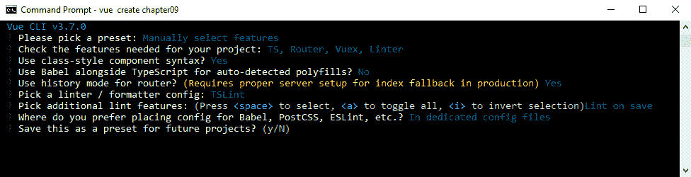
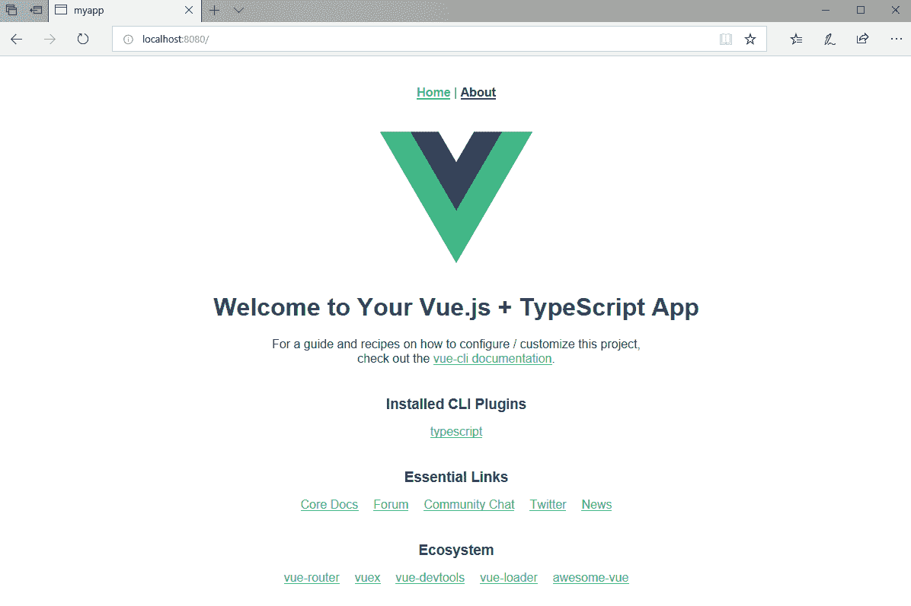
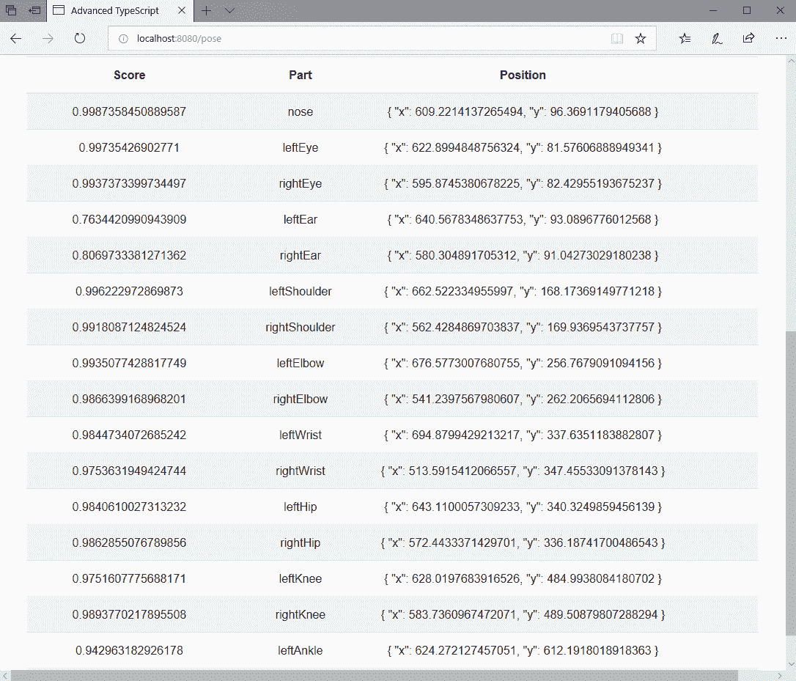
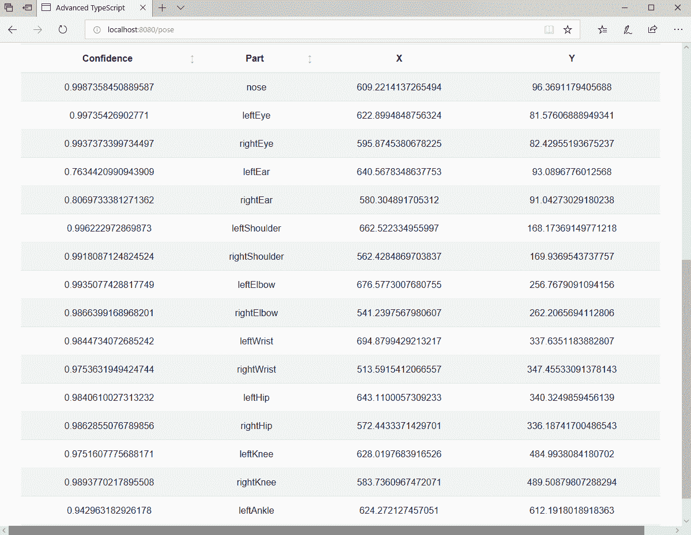

# 九、将 Vue.js 和 TensorFlow.js 用于图像识别

目前计算机领域最热门的话题之一是机器学习。 在本章中，我们将进入机器学习的世界，并看看使用流行的`TensorFlow.js`包来执行图像分类，以及检测姿态。 我们暂时离开 Angular 和 React，转而使用 Vue.js 来提供我们的客户端实现。

本章将涵盖以下主题:

*   什么是机器学习，以及它与人工智能的关系
*   如何安装 Vue
*   使用 Vue 创建应用
*   显示带有 Vue 模板的主页
*   在 Vue 中使用路由
*   卷积神经网络(**cnn**)是什么
*   如何在 TensorFlow 中训练模型
*   使用预先训练的 TensorFlow 模型构建图像分类类
*   TensorFlow 支持的图像类型用于图像分类和位姿检测
*   使用姿势检测显示身体关节

# 技术要求

完成的项目可从[https://github.com/PacktPublishing/Advanced-TypeScript-3-Programming-Projects/tree/master/chapter09](https://github.com/PacktPublishing/Advanced-TypeScript-3-Programming-Projects/tree/master/chapter09)下载。 本项目使用 TensorFlow，所以以下附加组件将在本章中使用:

*   `@tensorflow-models/mobilenet`
*   `@tensorflow-models/posenet`
*   `@tensorflow/tfjs`

我们还将在 Vue 中使用 Bootstrap，因此我们需要安装以下 Bootstrap 组件:

*   `bootstrap`
*   `bootstrap-vue`

下载项目后，您必须使用`npm install`命令安装软件包要求。

# 什么是机器学习，TensorFlow 是如何融入其中的?

现在很难摆脱人工智能机器的想法。 人们已经习惯使用 Siri、Alexa 和 Cortana 等工具，这些工具创造出的外观是，这些技术能够理解我们，并能够与我们互动。 这些声控系统使用自然语言处理来识别句子，例如:*科斯今天的天气怎么样?*

这些系统的神奇之处在于机器学习。 为了选择其中一个系统，我们先来看看 Alexa 在幕后做了什么，然后再看看机器学习与人工智能的关系。

当我们问 Alexa 一个问题，*她*认出*她*的名字，所以她知道她应该开始听后面的内容，开始处理。 这相当于在软件上轻拍别人的肩膀以引起他们的注意。 然后 Alexa 会记录下下面的句子，直到到达某个点，Alexa 可以通过互联网将录音传输到 Alexa 语音服务。 这个极其复杂的服务尽可能地解析录音(有时，重音可能会使服务混淆)。 然后该服务对解析的录音进行操作，并将结果发送回你的 Alexa 设备。

除了回答有关天气的问题，用户还可以使用大量的 Alexa 技能，亚马逊鼓励开发人员创造超出他们时间所能想到的技能。 这意味着点一份披萨和查看最新的比赛结果一样简单。

这篇序言让我们开始接触机器学习与 Alexa 有什么关系。 Alexa 背后的软件使用机器学习来不断更新自己，所以每次它犯了错误，这是反馈进来，这样系统是*更聪明*下次周围，在未来不会犯同样的错误。

你可以想象，口译是一项非常复杂的任务。 这是我们人类从很小的时候就开始学习的东西，与机器学习的类比非常惊人，因为我们也通过重复和强化来学习语言。 因此，当婴儿随机说出*dada*时，婴儿已经学会了发出这些声音，但还不知道该声音的正确语境。 强化通常由父母指着自己提供，用来将声音与人联系起来。 类似的强化也发生在我们使用图画书的时候; 当我们教婴儿*cow*这个词时，我们指着一张奶牛的图片。 这样，婴儿就学会了把单词和图片联系起来。

由于语音翻译是如此复杂，它需要巨大的处理能力，也需要一个庞大的预先训练的数据集。 想象一下，如果我们必须把一切都教给 Alexa，那会是多么令人沮丧。 这就是为什么机器学习系统现在才真正发挥作用的部分原因。 我们现在有足够的基础设施来卸载计算到可靠的，强大的，专用的机器。 此外，我们现在拥有的互联网，总的来说，足够强大和快速，可以处理传输到这些机器学习系统的大量数据。 如果我们还在使用 56K 的调制解调器，我们肯定无法做到现在的一半。

# 什么是机器学习?

我们知道计算机擅长回答是和不是，或者 1 和 0。 这意味着计算机根本不能用一个近似于*的*回答，所以它不能对一个问题说近似于【是】。 请容忍我一会儿，因为这一点很快就会变得清楚。

在最基本的层面上，我们可以说，机器学习归结为教计算机以和我们一样的方式学习。 他们学习解读各种来源的数据，并利用这种学习对数据进行分类。 机器将从成功和失败中学习，这将反过来使它更准确，并有能力做出更复杂的推断。

回到电脑处理的想法是或否的答案,当我们想出一个答案,相当于*嗯,这取决于*,我们主要提出多个答案基于相同的输入相当于多个航线是或否的答案。 机器学习系统在学习方面变得越来越好，所以它们背后的算法能够利用越来越多的数据，以及越来越多的强化来建立更深的联系。

在幕后，机器学习应用了一系列令人难以置信的算法和统计模型，这样系统就可以执行既定任务，而不需要得到如何完成这些任务的详细说明。 这种水平的推理与我们传统的构建应用的方式相去甚远，而且它利用的事实是，只要有正确的数学模型，计算机就非常、非常善于发现模式。 与此同时，它们同时做大量相关的任务，这意味着支撑学习的数学模型可以将它们的计算结果作为自己的反馈，以便更好地理解世界。

在这一点上，我们必须提到人工智能和机器学习是不一样的。 机器学习是人工智能的一种应用，基于无需编程处理特定任务就能自动学习的能力。 机器学习的成功是建立在有足够的数据让系统自己学习的基础上的。 可以应用许多算法类型。 一些被称为无监督学习算法，而另一些被称为监督学习算法。

无监督算法接收以前没有分类或标记的数据。 算法在这样的数据集上运行，以寻找潜在的或隐藏的模式，这些模式可用于创建推论。

监督学习算法采用之前的学习，并使用标记示例将其应用到新数据中。 这些标记的例子帮助它学习正确的答案。 在这些场景背后，有一个训练数据集，学习算法使用它来提炼知识并从中学习。 训练数据的水平越高，算法越有可能产生正确的答案。

还有其他类型的算法，包括强化学习算法和半监督学习算法，但这些不在本书的范围之内。

# 什么是 TensorFlow，它与机器学习有什么关系?

我们已经讨论过什么是机器学习，如果我们自己尝试和实施它，可能会非常令人生畏。 幸运的是，有一些库可以帮助我们创建自己的机器学习实现。 TensorFlow 最初由谷歌 Brain 团队创建，是一个这样的库，旨在支持大规模机器学习和数值计算。 最初，TensorFlow 是作为 Python/ c++混合库编写的，其中 Python 提供了用于构建学习应用的前端 API，并由 c++端执行它们。 TensorFlow 将许多机器学习和神经网络(有时称为**深度学习**)算法结合在一起。

鉴于最初的 Python 实现的成功，我们现在有了一个用 TypeScript 编写的 TensorFlow 实现(正确地称为`TensorFlow.js`)，可以在我们的应用中使用。 这是我们将在本章中使用的版本。

# 项目概述

我们将在本章中编写的项目是我在为本书撰写提案时最激动的项目。 我对所有人工智能的东西都有一段长期的感情; 这个话题使我着迷。 随着`TensorFlow.js`等框架的兴起(我将把它缩短为 TensorFlow)，执行复杂机器学习的能力从未像现在这样在学术界之外更容易获得。 正如我所说的,这一章真的让我非常兴奋,所以我们不会使用一个机器学习操作,我们将使用图像分类来确定是什么图片,我们将使用造成检测要点,如重大关节和一个人的面部地标。

与 GitHub 代码一起工作，这个主题应该花大约一个小时来完成，当你完成它时，它应该是这样的:


既然我们知道了要构建什么项目，就可以开始实现了。 在下一节中，我们将从安装 Vue 开始。

# 在 Vue 中开始使用 TensorFlow

如果尚未安装 Vue，第一步是安装 Vue**command line Interface**(**CLI**)。 使用`npm`安装，命令如下:

```js
npm install -g @vue/cli
```

# 创建基于 vue 的应用

我们的 TensorFlow 应用将完全在客户端浏览器中运行。 这意味着我们需要编写一个应用来承载 TensorFlow 功能。 我们将使用 Vue 来提供我们的客户机，因此需要执行以下步骤来自动构建我们的 Vue 应用。

创建客户端非常简单，只需运行`vue create`命令，如下所示:

```js
vue create chapter09
```

这将启动创建应用的过程。 有许多的决策点,需要通过客户端创建过程时发生,开始有选择是否接受默认值或手动选择我们想要添加的功能。因为我们想添加 TypeScript 的支持,我们需要选择手动选择预设的特性。 下面的截图显示了我们为 Vue 应用选择功能的步骤:


我们可以向项目中添加许多特性，但我们只对其中少数感兴趣，所以取消选择 Babel，从列表中选择添加 TypeScript、Router、VueX 和 Linter / Formatter。 选择/取消选择通过使用空格键来完成:


当我们按*输入*时，会出现许多其他选项。 按*Enter*将设置前三个选项的默认值。 当我们进入选择**linter**(简称**词法解释器**)选项时，从列表中选择 TSLint，然后继续按*输入*进行其他选项。 linter 是一种自动解析代码、查找潜在问题的工具。 它通过查看我们的代码来查看它是否违反了一组预定义的规则，这可能表明存在 bug 或代码样式问题。

当我们完成了整个过程，我们的客户端将被创建; 这将需要一些时间来完成，因为有很多代码正在下载和安装:



现在我们已经创建了应用，我们可以通过在客户端文件夹的根目录中运行`npm run serve`来运行它。 与 Angular 和 React 不同，浏览器默认不会显示页面，所以我们需要使用`http://localhost:8080`打开页面。 当我们这样做时，页面看起来像这样:



在编写图像分类器时，我们将简化工作，因为我们将通过修改主页来实际显示图像分类器，从而重用 Vue CLI 为我们创建的一些现有基础设施。

# 显示带有 Vue 模板的主页

类似于 React 给我们提供了特殊的`.jsx`/`.tsx`扩展，让我们可以将代码和网页放在一起，Vue 为我们提供了作为`.vue`文件创建的单文件组件。 这些文件允许我们将代码和网页模板混合在一起来创建我们的页面。 在我们继续创建第一个 TensorFlow 组件之前，让我们打开我们的`Home.vue`页面并分析它。

我们可以看到，我们的`.vue`组件被分成了两个独立的部分。 有一个模板部分定义将显示在屏幕上的 HTML 的布局，还有一个单独的脚本部分，我们在其中包含代码。 因为我们使用的是 TypeScript，所以`script`部分的语言是`ts`。

脚本部分首先定义`import`部分，方法与我们在标准`.ts`文件中看到的基本相同。 当我们在导入中看到`@`时，它告诉我们导入路径是相对于`src`目录的，所以`HelloWorld.vue`组件位于`src/components`文件夹中:

```js
<script lang="ts">
import { Component, Vue } from 'vue-property-decorator';
import HelloWorld from '@/components/HelloWorld.vue';
</script>
```

接下来我们需要做的是创建一个从`Vue`类扩展的类。 我们正在做的是使用`@Component`创建一个名为`Home`的组件注册，可以在其他地方使用:

```js
@Component
export default class Home extends Vue {}
```

我们还有别的事要做。 我们的模板将引用一个外部的`HelloWorld`组件。 我们必须用模板将要使用的组件来装饰类，像这样:

```js
@Component({
  components: {
    HelloWorld,
  },
})
export default class Home extends Vue {}
```

这个模板非常简单。 它包含一个单独的`div`类，我们将把`HelloWorld`组件渲染成:

```js
<template>
  <div class="home">
    <HelloWorld />
  </div>
</template>
```

从前面的代码模板中，我们可以看到，与 React 不同，Vue 没有给我们一个显式的`render`函数来处理 HTML 和状态的呈现。 相反，渲染的构建更接近 Angular 模型，在这个模型中，模板被解析为可以提供的内容。

The reason that we mentioned Angular here is because Vue.js started off being developed by Evan You, who was working on the AngularJS project at Google; he wanted to create a more performant library. While AngularJS was a great framework, it did require a complete buy-in to the Angular ecosystem in order to work with it (the Angular team is working to rectify this). So, while Vue leverages Angular features such as templates, it has a very light touch in that you can just add a script tag to your existing code and start slowly migrating your existing code base over to Angular.

Vue 借鉴了 React 的一些概念，比如 Virtual DOM 的使用(就像我们在介绍 React 时讨论的那样)。 Vue 也使用了虚拟 DOM，但实现方式略有不同，主要是 Vue 只重新呈现出有变化的组件，而 React 默认情况下也会重新呈现子组件。

我们现在要做的是修改`HelloWorld`组件，这样我们就可以使用 TensorFlow 了。 但是，在此之前，我们需要编写几个支持类，用 TensorFlow 完成繁重的工作。 就代码而言，这些不是大类，但它们非常重要。 我们的`ImageClassifier`类从一个标准的类定义开始，如下所示:

```js
export class ImageClassifier {
}
```

下一步是可选的，但如果应用运行在 Windows 客户端上，它会对应用的稳定性产生重大影响。 在封面下面，TensorFlow 使用 WebGLTextures，但是在 Windows 平台上创建 WebGLTextures 有一个问题。 为了解决这个问题，我们的构造函数需要被修改为如下所示:

```js
constructor() {
  tf.ENV.set('WEBGL_PACK', false);
}
```

由于我们可以多次运行图像分类，我们将添加一个私有变量来表示标准的`MobileNet`TensorFlow:

```js
private model: MobileNet | null = null;
```

# 引入 MobileNet

在这一点上，我们需要绕道进入 cnn 的世界。 `MobileNet`是一个 CNN 模型，所以稍微了解一下 CNN 是什么可以帮助我们理解它与我们正在解决的问题之间的关系。 别担心，我们不会深入研究 cnn 背后的数学，但了解他们的工作将帮助我们欣赏他们为我们带来的东西。

CNN 分类器的工作原理是接收输入图像(可能来自视频流)，处理图像，并将其分类在预定义的类别下。 为了理解它们是如何工作的，我们需要退一步，从计算机的角度来思考这个问题。 假设我们有一张马的照片。 对计算机来说，这张图片只是一系列像素，所以如果我们要展示的是一匹略有不同的马，计算机不能仅仅通过比较像素来判断它们是否匹配。

CNN 将图像分解成碎片(比如，3x3 像素网格)，并对这些碎片进行比较。 简单地说，它所寻找的是与这些部件匹配的数量。 比赛的次数越多，我们就越有信心拥有一场比赛。 这是对 CNN 功能的一个非常简单的描述，涉及到许多步骤和过滤器，但它应该提供一个理解，为什么我们想要使用 TensorFlow 中的`MobileNet`CNN。

`MobileNet`是 CNN 的一个专家，除其他外，它为我们提供了图像分类，已经针对 ImageNet 数据库中的图像进行了训练([http://www.image-net.org/](http://www.image-net.org/))。 当我们加载模型时，我们加载的是为我们创建的预先训练的模型。 我们使用预训练网络的原因是它已经在服务器上的一个大数据集上训练过了。 我们不希望在浏览器中运行图像分类训练，因为为了执行训练，从服务器转移到浏览器需要太多的负载。 所以，无论你的客户端 PC 有多强大，复制训练数据集都是太多了。

我们提到了`MobileNetV1`和`MobileNetV2`，但没有详细说明它们是什么，以及它们使用的是什么数据集。 基本上，`MobileNet`模型是由谷歌开发的，并在 ImageNet 数据集上进行训练，这个数据集包含 140 万张图像，分成 1000 类图像。 这些型号之所以被称为`MobileNet`型号，是因为它们在训练时考虑到了移动设备，所以它们被设计为在低功耗和/或低存储设备上运行。

With a pre-trained model, we can use it as it is or we could customize it to use it for transfer learning.

# 分类的方法

现在我们已经对 cnn 有了一些了解，我们准备把这些知识应用到实践中去。 我们将创建一个异步分类方法。 TensorFlow 在需要检测图像时可以使用多种格式，所以我们将一般化我们的方法，只接受适当的类型:

```js
public async Classify(image: tf.Tensor3D | ImageData | HTMLImageElement | 
  HTMLCanvasElement | HTMLVideoElement):
    Promise<TensorInformation[] | null> {
}
```

Only one of these types is specific to TensorFlow—the `Tensor3D` type. All the other types are standard DOM types, so this can be easily consumed in a web page without having to jump through numerous hoops to convert the image into a suitable format.

我们还没有介绍我们的`TensorInformation`界面。 当我们从`MobileNet`收到分类返回时，我们收到分类名称和分类的置信度。 从分类操作返回的结果是`Promise<Array<[string, number]>>`，因此我们将其转换为对消费代码更有意义的内容:

```js
export interface TensorInformation {
  className: string;
  probability: number;
}
```

现在我们知道我们将返回一个分类数组和一个概率(置信水平)。 回到我们的`Classify`方法，如果之前没有加载`MobileNet`，我们需要加载`MobileNet`。 这个操作可能会花费一些时间，这就是为什么我们要缓存它，这样我们就不必在下次调用这个方法时重新加载它:

```js
if (!this.model) {
  this.model = await mobilenet.load();
}
```

我们已经接受了`load`操作的默认值。 如果我们需要，我们可以提供许多选项:

*   `version`:设置`MobileNet`版本号，默认为 1。 目前，我们可以设置两个值:`1`表示使用`MobileNetV1`，`2`表示使用`MobileNetV2`。 实际上，对我们来说，版本之间的差异与模型的准确性和性能有关。
*   `alpha`:可设置为`0.25`、`0.5`、`0.75`、`1`。 令人惊讶的是，这与图片上的`alpha`频道无关。 相反，它指的是将被使用的网络的宽度，有效地用准确性换取性能。 数字越高，准确度越高。 相反，数值越大，性能越慢。 默认的`alpha`是`1`。
*   `modelUrl`:如果我们想使用自定义模型，我们可以在这里提供。

如果模型加载成功，那么我们现在可以执行图像分类。 这是对`classify`方法的直接调用，接收已经传递到方法中的`image`。 在完成这个操作之后，我们返回分类结果数组:

```js
if (this.model) {
  const result = await this.model.classify(image);
  return {
    ...result,
  };
}
```

默认情况下，`model.classify`方法返回三个分类，但如果我们想要，我们可以传递一个参数来返回不同数量的分类。 如果我们想要检索前 5 个结果，我们将更改`model.classify`行，如下所示:

```js
const result = await this.model.classify(image, 5);
```

最后，在不太可能的情况下，模型未能加载，我们返回`null`。 有了这个，我们完成的`Classify`方法看起来像这样:

```js
public async Classify(image: tf.Tensor3D | ImageData | HTMLImageElement | 
  HTMLCanvasElement | HTMLVideoElement):
    Promise<TensorInformation[] | null> {
  if (!this.model) {
    this.model = await mobilenet.load();
  }
  if (this.model) {
    const result = await this.model.classify(image);
    return {
      ...result,
    };
  }
  return null;
}
```

TensorFlow 真的可以这么简单。 显然，在幕后隐藏着大量的复杂性，但这正是设计良好的库的魅力所在。 它们应该保护我们不受复杂性的影响，同时给我们留下空间，让我们进入更复杂的操作和定制，如果我们需要的话。

这就是我们写的图像分类组件。 但是，我们如何在 Vue 应用中使用它呢? 在下一节中，我们将看到如何修改`HelloWorld`组件来使用这个类。

# 修改 HelloWorld 组件以支持图像分类

当我们创建 Vue 应用时，CLI 很有帮助地为我们创建了一个包含`HelloWorld`组件的`HelloWorld.vue`文件。 我们会利用我们已经有这个组件的优势，我们会用它来分类预加载的图像。 如果需要，我们可以使用它来使用文件上传组件加载图像，并在更改时驱动分类。

现在，让我们看看我们的`HelloWorld`TypeScript 代码是什么样的。 显然，我们将从类定义开始。 就像我们之前看到的，我们已经用`@Component`装饰器标记了这个，表示这是一个组件:

```js
@Component
export default class HelloWorld extends Vue {
}
```

我们有两个成员变量要在类中声明。 我们知道我们想使用我们刚刚写的`ImageClassifier`类，所以我们将把它带进来。 我们还希望创建一个由分类操作的`TensorInformation`结果组成的数组。 我们将它们存储为类级值的原因是，当操作完成时，我们必须绑定到这个:

```js
private readonly classifier: ImageClassifier = new ImageClassifier();
private tensors : TensorInformation[] | null = null;
```

在完成类的编写之前，我们需要看看模板是什么样子的。 我们从`template`定义开始:

```js
<template>
  <div class="container">
  </div>
</template>
```

正如我们所看到的，我们正在使用 Bootstrap，所以我们将使用一个`div`容器来布局我们的内容。 我们要添加到容器的第一件事是一个图像。 我在这里选择使用一组边境牧羊犬的图片，很大程度上是因为我是狗的粉丝。 为了读取 TensorFlow 中的图像，我们需要将`crossorigin`设置为`anonymous`。 在这部分特别注意`ref="dogId"`，因为我们很快会再次需要它:

```js

```

接下来，我们将使用`row`和`col`类进一步添加 Bootstrap 支持:

```js
<div class="row">
  <div class="col">
  </div>
</div>
```

在这一行中，我们将创建一个 Bootstrap 列表。 我们看到 Vue 有自己的 Bootstrap 支持，所以我们将使用它的版本来支持列表，`b-list-group`:

```js
<b-list-group>
</b-list-group>
```

现在，我们终于到了模板的核心部分。 我们在类中公开张量数组的原因是，当数组被填充时，我们可以对数组中的每个结果进行迭代。 在下面的代码中，我们通过使用`v-for`自动迭代每个张量项来创建一个动态的`b-list-group-item`数。 这将创建`b-list-group-item`项，但我们仍然需要显示单独的`className`和`probability`项。 在 Vue 中，我们使用`{{ <<item>> }}`来绑定文本项:

```js
<b-list-group-item v-for="tensor in tensors" v-bind:key="tensor.className">
  {{ tensor.className }} - {{ tensor.probability }}
</b-list-group-item>
```

The reason we have added `v-bind:key` alongside `v-for` is because Vue provides something it calls an **in-place patch** by default. This means that Vue uses this key as a hint to uniquely track the item so that it can keep the values up to date on changes.

这是它; 我们的模板已经完成了。 正如我们所看到的，下面是一个简单的模板，但它有很多内容。 我们有一个 Bootstrap 容器显示一个图像，然后，让 Vue 在`tensor`细节中动态绑定:

```js
<template>
  <div class="container">
    
    <div class="row">
      <div class="col">
        <b-list-group>
          <b-list-group-item v-for="tensor in tensors" 
              v-bind:key="tensor.className">
            {{ tensor.className }} - {{ tensor.probability }}
          </b-list-group-item>
        </b-list-group>
      </div>
    </div>
  </div>
</template>
```

回到 TypeScript 代码，我们要写一个方法来获取图像，然后用它来调用我们的`ImageClassifier.Classify`方法:

```js
public Classify(): void {
}
```

因为我们正在将图像加载到客户机上，所以我们必须等待页面与图像一起呈现，这样我们才能检索它。 我们将从构造函数中调用我们的`Classify`方法，因此，当它运行时，页面正在被创建，我们需要使用一个小技巧来等待图像加载。 具体来说，我们将使用一个名为`nextTick`的 Vue 函数。 重要的是要理解对 DOM 的更新是异步发生的。 当值更改时，不会立即呈现更改。 相反，Vue 请求一个 DOM 更新，然后由一个计时器触发。 因此，通过使用`nextTick`，我们等待下一个 DOM 更新 tick 并执行相关操作:

```js
public Classify(): void {
  this.$nextTick().then(async () => {
  });
}
```

The reason why we mark the `async` function inside the `then` block is that we are going to perform an await inside this section, which means that we have to scope this as `async` as well.

在模板中，我们用一个`ref`语句定义了图像，因为我们想从类内部访问它。 为此，我们查询 Vue 在这里为我们维护的`ref`语句的映射，由于我们已经用`dogId`设置了自己的引用，现在我们可以访问图像了。 这个技巧使我们不必使用`getElementById`来检索 HTML 元素:

```js
/* tslint:disable:no-string-literal */
const dog = this.$refs['dogId'];
/* tslint:enable:no-string-literal */
```

When we built our Vue application, the CLI automatically set up TSLint rules for us. One of these rules related to accessing elements via string literals. We disable the rule temporarily by using `tslint:disable:no-string-literal`. To re-enable the rule, we use `tslint:enable:no-string-literal`. There is an alternative way to disable this rule for a single line, which is to use `/* tslint:disable-next-line:no-string-literal */`. The approach you take doesn't really matter; what matters is the end result.

一旦我们有了 dog 图像的引用，我们现在可以将图像强制转换为`HTMLImageElement`，并在`ImageClassifier`类的`Classify`方法调用中使用它:

```js
if (dog !== null && !this.tensors) {
  const image = dog as HTMLImageElement;
  this.tensors = await this.classifier.Classify(image);
}
```

当调用`Classify`返回时，只要模型已经加载并成功找到分类，它就会通过绑定的强大功能填充屏幕上的列表。

在我们的示例中，我尽量保持代码库的整洁和简单。 代码被分离到不同的类中，这样我们就可以创建小而强大的功能块。 要知道为什么我喜欢这样做，这是我们的`HelloWorld`代码看起来像:

```js
@Component
export default class HelloWorld extends Vue {
  private readonly classifier: ImageClassifier = new ImageClassifier();
  private tensors: TensorInformation[] | null = null;

  constructor() {
    super();
    this.Classify();
  }
  public Classify(): void {
    this.$nextTick().then(async () => {
      /* tslint:disable:no-string-literal */
      const dog = this.$refs['dogId'];
      /* tslint:enable:no-string-literal */
      if (dog !== null && !this.tensors) {
        const image = dog as HTMLImageElement;
        this.tensors = await this.classifier.Classify(image);
      }
    });
  }
}
```

In total, including `tslint` formatters and white space, this code is only 20 lines long. Our `ImageClassifier` class is only 22 lines long, and that's an `ImageClassifier` class that could be used elsewhere without modification. By keeping classes simple, we decrease the number of ways that they could go wrong and we increase our chances of being able to reuse them. More importantly, we stick to the rather unfriendly named **Keep It Simple, Stupid** (**KISS**) principle, which states that systems work best if they are inherently as simple as they can possibly be.

既然我们已经看到了图像分类的实际应用，我们可以考虑将姿态检测添加到应用中。 在我们这么做之前，我们需要看看其他一些对我们很重要的 Vue 领域。

# Vue 应用入口点

我们还没有涉及到 Vue 应用的入口点是什么。 我们已经看到了`Home.vue`页面，但那只是在其他地方渲染的一个组件。 我们需要后退一步，看看我们的 Vue 应用实际上是如何处理自身加载和显示相关组件的。 在我们这样做的同时，我们还将接触到 Vue 中的路由，以便我们可以看到所有这些是如何联系在一起的。

我们的起点在`public`文件夹中。 在这里，我们有一个`index.html`文件，我们可以将其视为应用的主模板。 这是一个相当标准的 HTML 文件，我们可能想给它一个更合适的`title`(这里，我们将使用`Advanced TypeScript - Machine Learning`):

```js
<!DOCTYPE html>
<html lang="en">
  <head>
    <meta charset="utf-8">
    <meta http-equiv="X-UA-Compatible" content="IE=edge">
    <meta name="viewport" content="width=device-width,
      initial-scale=1.0">
    <link rel="icon" href="<%= BASE_URL %>favicon.ico">
    <title>Advanced TypeScript - Machine Learning</title>
  </head>
  <body>
    <noscript>
      <strong>We're sorry but chapter09 doesn't work properly without 
        JavaScript enabled. Please enable it to continue.</strong>
    </noscript>
    <div id="app"></div>
    <!-- built files will be auto injected -->
  </body>
</html>
```

这里的重要元素是`div`，它的`id`属性设置为`app`。 这是我们要渲染组件的元素。 我们这样做的方式是由`main.ts`文件控制的。 让我们从添加 Bootstrap 支持开始，通过添加 Bootstrap CSS 文件和使用`Vue.use`注册`BootstrapVue`插件:

```js
import 'bootstrap/dist/css/bootstrap.css';
import 'bootstrap-vue/dist/bootstrap-vue.css';
Vue.use(BootstrapVue);

```

即使我们有 Bootstrap 支持，我们也没有任何东西将我们的组件挂接到`app div`上。 我们添加这种支持的原因是为了创建一个新的 Vue 应用。 它接受一个路由器、一个用于包含 Vue 状态和突变等内容的 Vue 存储，以及一个在呈现组件时调用的`render`函数。 传递到我们的`render`方法中的`App`组件是顶级的`App`组件，我们将使用它来渲染所有其他组件。 当 Vue 应用创建完成后，它被从`index.html`安装到`app`div 中:

```js
new Vue({
  router,
  store,
  render: (h) => h(App),
}).$mount('#app');

```

我们的`App.vue`模板由两个独立的区域组成。 在我们添加这些区域之前，让我们定义`template`元素并包含`div`标签:

```js
<template>
  <div id="app">
  </div>
</template>
```

在这个`div`标签中，我们将添加第一个逻辑部分——我们的老朋友，导航栏。 由于这些都来自于 Vue Bootstrap 实现，所以它们都带有`b-`前缀，但现在不需要对它们进行分解，因为此时它们应该非常熟悉了:

```js
<b-navbar toggleable="lg" type="dark" variant="info">
  <b-collapse id="nav-collapse" is-nav>
    <b-navbar-nav>
      <b-nav-item to="/">Classifier</b-nav-item>
      <b-nav-item to="/pose">Pose</b-nav-item>
    </b-navbar-nav>
  </b-collapse>
</b-navbar>
```

当用户导航到一个页面时，我们需要显示适当的组件。 在幕后，显示的组件是由 Vue 路由器控制的，但是我们需要某个地方来显示它。 这是通过使用导航栏下面的标签来实现的:

```js
<router-view/>
```

这是我们的`App`模板完成后的样子。 正如我们所看到的，如果我们想要路由到其他页面，我们需要在这个列表中添加单独的`b-nav-item`条目。 如果我们愿意，我们可以使用`v-for`动态创建这个导航列表，就像我们在使用图像分类器视图构建分类时看到的那样:

```js
<template>
  <div id="app">
    <b-navbar toggleable="lg" type="dark" variant="info">
      <b-collapse id="nav-collapse" is-nav>
        <b-navbar-nav>
          <b-nav-item to="/">Classifier</b-nav-item>
          <b-nav-item to="/pose">Pose</b-nav-item>
        </b-navbar-nav>
      </b-collapse>
    </b-navbar>
    <router-view/>
  </div>
</template>
```

当我们第一次开始研究路由时，在所有那些章节之前，您可能认为路由是添加到应用中的一件非常复杂的事情。 到目前为止，您应该对路由更加熟悉了，并且在 Vue 中添加路由支持是简单明了的，这一点也不会让您感到惊讶。 我们首先使用以下命令在 Vue 中注册`Router`插件:

```js
Vue.use(Router);
```

有了这一点，我们现在就可以构建路由支持了。 我们导出一个可以在`new Vue`调用中使用的`Router`实例:

```js
export default new Router({
});
```

现在我们需要添加路由选项。 我们要设置的第一个选项是路由模式。 我们将使用 HTML5`history`API 来管理我们的链接:

```js
mode: 'history',
```

We could use URL hashing for routing. This works in all the browsers that Vue supports and is a good choice if the HTML5 `history` API is unavailable. Alternatively, there is an abstract routing mode that works across all JavaScript environments, including Node. If the browser API is not present, no matter what we set the mode to, the router will automatically be forced to use this.

我们想要使用`history`API 的原因是，它允许我们修改 URL 而不触发整个页面刷新。 因为我们知道我们只想替换组件，而不是替换整个`index.html`页面，所以我们最终利用这个 API 只重新加载页面的组件部分，而不重新加载整个页面。

我们还想设置应用的基 URL。 例如，如果我们想覆盖这个位置以服务于`deploy`文件夹中的所有内容，那么我们可以将其设置为`/deploy/`:

```js
base: process.env.BASE_URL,
```

虽然设置路由模式和基础 URL 都很好，但我们忽略了重要的部分——设置路由本身。 每条路由至少包含一条路径和一个组件。 该路径与 URL 中的路径相关联，并且该组件标识将作为该路径的结果显示哪些组件。 我们的路线是这样的:

```js
routes: [
  {
    path: '/',
    name: 'home',
    component: Home,
  },
  {
    path: '/pose',
    name: 'Pose',
    component: Pose,
  },
  {
    path: '*',
    component: Home,
  }
],
```

We have a special path match in our route. If the user types in a URL that doesn't exist, then we use `*` to capture that and redirect it to a particular component. We must put this as the last entry because otherwise, it would take precedence over the exact matches. The eagle-eyed reader will notice that, strictly speaking, we don't need the first path because our routing would still show the `Home` component due to our `*` fallback.

我们添加到路由中的一件事是对一个还不存在的组件的引用。 我们现在要通过添加`Pose`组件来解决这个问题。

# 添加姿态检测功能

在开始处理姿态检测之前，我们将添加一个组件，该组件将充当相关功能的宿主。 因为这是我们的第一个组件*从零开始*，我们也将从头开始覆盖它。 在我们的`views`文件夹中，创建一个名为`Pose.vue`的文件。 这个文件将包含三个逻辑元素，所以我们将从添加它们开始，并设置我们的模板使用 Bootstrap:

```js
<template>
  <div class="container">
  </div>
</template>
<script lang="ts">
</script>
<style scoped>
</style>
```

The only one of these that we haven't looked at so far is the `style` section. Scoped styles allow us to apply styling that just applies to the current component. We will apply local styling shortly, but first, we need to set up the image that we are going to display.

对于我们的示例代码，我选择了一张 1200 像素宽、675 像素高的图片。 这个信息很重要,因为,当我们做检测,我们要画出这些点在图像,这意味着我们需要做一些造型安排放一个画布,我们可以画出图像上的点匹配的位置。 首先，我们使用两个容器来保存图像:

```js
<div class="outsideWrapper">
  <div class="insideWrapper">
  </div>
</div>
```

现在，我们将在样式范围部分中添加一些 CSS 来固定尺寸。 我们首先将外部包装设置为具有我刚才描述的维度。 然后，我们将内部包装器相对于外部包装器进行定位，并将宽度和高度设置为 100%，以便它们精确地填充边界:

```js
.outsideWrapper{
  width:1200px; height:675px;
}
.insideWrapper{
  width:100%; height:100%;
  position:relative;
}
```

回到`insideWrapper`，我们需要在里面添加我们的图像。 我为我们的例子选择的图像是一个中立的姿势，展示了身体的关键点。 我们的图像标签的格式看起来应该很熟悉，已经用图像分类代码完成了这一点:

```js

```

在同样的`insideWrapper``div`标签中，就在我们的图像下面，我们需要添加一个画布。 我们将使用画布，当我们想要绘制关键的身体点。 关键是画布的宽度和高度与容器尺寸完全匹配:

```js
<canvas ref="posecanvas" id="canvas" class="coveringCanvas" width=1200 height=675></canvas>
```

此时，我们的`template`看起来像这样:

```js
<template>
  <div class="container">
    <div class="outsideWrapper">
      <div class="insideWrapper">
        
        <canvas ref="posecanvas" id="canvas" 
          class="coveringCanvas" width="1200" height="675"></canvas>
      </div>
    </div>
  </div>
</template>

```

我们已经向图像和画布添加了类，但还没有添加它们的定义。 我们可以使用一个类来覆盖这两个类，但我很高兴我们有足够的地方分开的一个，将宽度和高度设置为 100%，并将它们绝对放在容器内:

```js
.coveredImage{
  width:100%; height:100%;
  position:absolute; 
  top:0px; 
  left:0px;
}
.coveringCanvas{
  width:100%; height:100%;
  position:absolute; 
  top:0px;
  left:0px;
}
```

我们完成的，样式部分看起来像这样:

```js
<style scoped>
  .outsideWrapper{
    width:1200px; height:675px;
  }
  .insideWrapper{
    width:100%; height:100%;
    position:relative;
  }
  .coveredImage{
    width:100%; height:100%;
    position:absolute; 
    top:0px; 
    left:0px;
  }
  .coveringCanvas{
    width:100%; height:100%;
    position:absolute; 
    top:0px; 
    left:0px;
  }
</style>

```

在这一点上，我们有两个需要编写的 helper 类——一个用于进行姿态检测，另一个用于在图像上绘制点。

# 在画布上画出关键点

当我们发现一个姿势时，我们会收到一些关键点。 每个关键点由一个位置(*x*和*y*坐标)、分数(或置信度)和关键点所代表的实际部分组成。 我们想要在点上循环，并在画布上绘制它们。

像往常一样，让我们从类定义开始:

```js
export class DrawPose {
}
```

我们只需要获取 canvas 元素一次，因为它不会改变。 这表明我们可以将其作为画布传递，并且因为我们对画布的二维元素感兴趣，所以我们可以直接从画布中提取绘图上下文。 在这个背景下，我们清除画布上之前绘制的所有元素，并将`fillStyle`颜色设置为`#ff0300`，我们将使用它来为我们的姿态点着色:

```js
constructor(private canvas: HTMLCanvasElement, private context = canvas.getContext('2d')) {
  this.context!.clearRect(0, 0, this.canvas.offsetWidth, this.canvas.offsetHeight);
  this.context!.fillStyle = '#ff0300';
}
```

为了绘制关键点，我们编写了一个方法，该方法循环遍历每个`Keypoint`实例并调用`fillRect`来绘制关键点。 矩形与*x*和*y*坐标偏移 2.5 像素，因此绘制 5 像素矩形实际上绘制的是一个大致以点为中心的矩形:

```js
public Draw(keys: Keypoint[]): void {
  keys.forEach((kp: Keypoint) => {
    this.context!.fillRect(kp.position.x - 2.5, 
                           kp.position.y - 2.5, 5, 5);
  });
}
```

一旦完成，我们的`DrawPose`类看起来像这样:

```js
export class DrawPose {
  constructor(private canvas: HTMLCanvasElement, private context = 
    canvas.getContext('2d')) {
      this.context!.clearRect(0, 0, this.canvas.offsetWidth, 
        this.canvas.offsetHeight);
      this.context!.fillStyle = '#ff0300';
  }

  public Draw(keys: Keypoint[]): void {
    keys.forEach((kp: Keypoint) => {
      this.context!.fillRect(kp.position.x - 2.5, 
                             kp.position.y - 2.5, 5, 5);
    });
  }
}
```

# 对图像进行位姿检测

在前面，我们创建了一个`ImageClassifier`类来执行图像分类。 为了与本课程的精神保持一致，我们现在将编写一个`PoseClassifier`类来管理物理姿势检测:

```js
export class PoseClassifier {
}
```

我们将为我们的类设置两个私有成员。 该模型是一个`PoseNet`模型，当我们调用相关的 load 方法时，它将被填充。 `DrawPose`是我们刚刚定义的类:

```js
private model: PoseNet | null = null;
private drawPose: DrawPose | null = null;
```

在我们进一步研究姿态检测代码之前，我们应该开始了解什么是姿态检测，它的一些优点，以及一些约束条件。

# 一个关于姿势检测的简短旁白

我们在这里使用术语**姿势检测**，但这也被称为**姿势估计**。 如果你还没有接触过姿势估计，这只是指从图像或视频中检测人体形象的计算机视觉操作。 一旦图像被检测出来，该模型就能够大致确定关键关节和身体部分(如左耳)的位置。

姿态检测技术发展迅速，具有明显的应用价值。 例如，我们可以使用姿势检测来执行动画的动作捕捉; 越来越多的电影公司开始使用动作捕捉技术来捕捉真人表演，并将其转换成 3D 图像。 另一种用法是在体育领域; 事实上，运动捕捉有很多潜在的用途。 假设你是一个大联盟棒球队的投手。 姿势检测可以用来确定你在释放球时的姿势是否正确; 也许是你身体倾斜得太厉害了，或者是你的肘部位置不对。 有了姿势检测，教练就更容易与球员一起纠正潜在的问题。

在这一点上，值得注意的是姿势检测并不等同于人的识别。 我知道这似乎是显而易见的，但有些人被这项技术弄糊涂了，他们认为这在某种程度上可以确定一个人是谁。 这是一种完全不同的机器学习形式。

# PoseNet 是如何工作的?

即使是基于摄像头的输入，执行姿态检测的过程也不会改变。 我们从一个输入图像开始(一个视频的单一静止图像就足够了)。 图像通过 CNN 进行第一部分，并确定人们在场景中的位置。 下一步从 CNN 获取输出，通过一个姿势解码算法(我们一会儿再回来讨论这个)，并使用这个来解码姿势。

我们说*pose 解码算法*的原因是为了掩盖我们实际上有两种解码算法的事实。 我们可以检测单个的姿势，或者如果有很多人，我们可以检测多个姿势。

我们选择了单一姿势算法，因为它是更简单和更快的算法。 如果图片中有多个人，算法就有可能将不同人的关键点合并到一起; 因此，像遮挡这样的事情可能意味着算法检测到 2 个人的右肩是 1 个人的左肘。 在下图中，我们可以看到右边女孩的肘部是如何遮蔽了中间人的左肘部的:


Occlusion is when one part of an image hides another part.

`PoseNet`检测的关键点如下:

*   鼻子
*   左眼
*   右眼
*   左耳
*   右耳
*   左肩
*   右肩
*   左肘
*   右手肘
*   左腕关节
*   右手腕
*   左髋部
*   右髋部
*   左膝盖
*   右膝
*   左脚踝
*   右脚踝

我们可以看到它们在应用中的位置。 当它完成检测点时，我们得到图像的叠加，如:


# 回到我们的姿势检测代码

回到我们的`PoseClassifier`类，我们的构造函数处理完全相同的 WebGLTexture 问题，我们讨论了我们的`ImageClassifier`实现:

```js
constructor() {
  // If running on Windows, there can be issues 
  // loading WebGL textures properly.
  // Running the following command solves this.
  tf.ENV.set('WEBGL_PACK', false);
}
```

现在我们将编写一个异步的`Pose`方法，该方法返回一个`Keypoint`项数组，如果`PoseNet`模型未能加载或找到任何姿势，则返回`null`。 除了接受图像，这个方法还将接受 canvas，它提供了我们要在上面绘制点的上下文:

```js
public async Pose(image: HTMLImageElement, canvas: HTMLCanvasElement): Promise<Keypoint[] | null> {
  return null;
}
```

以与`ImageClassifier`检索`MobileNet`模型作为缓存操作相同的方式，我们将检索`PoseNet`模型并缓存它。 我们也将利用这个机会实例化`DrawPose`实例。 执行这样的逻辑的目的是确保我们只执行一次，不管我们调用这个方法多少次。 一旦模型不为空，代码将阻止我们再次尝试加载`PoseNet`:

```js
if (!this.model) {
  this.model = await posenet.load();
  this.drawPose = new DrawPose(canvas);
}
```

当我们加载模型时，我们可以提供以下选项:

*   **乘法器**:这是所有卷积操作的通道数(深度)的浮点乘法器。 从 1.01、1.0、0.75 或 0.50 中选择。 这里存在速度和准确性的权衡，较大的值越准确。

最后，如果模型加载成功，我们将用我们的图像调用`estimateSinglePose`来检索`Pose`预测，其中也包含我们将要绘制的`keypoints`:

```js
if (this.model) {
  const result: Pose = await this.model.estimateSinglePose(image);
  if (result) {
    this.drawPose!.Draw(result.keypoints);
    return result.keypoints;
  }
}
```

再一次，把所有这些放在一起来展示我们如何不需要编写大量的代码来完成所有这些工作，以及如何将代码分离成小的、自包含的逻辑块，使我们的代码更容易理解，也更容易编写。 这是完整的`PoseClassifier`类:

```js
export class PoseClassifier {
  private model: PoseNet | null = null;
  private drawPose: DrawPose | null = null;
  constructor() {
    // If running on Windows, there can be 
    // issues loading WebGL textures properly.
    // Running the following command solves this.
    tf.ENV.set('WEBGL_PACK', false);
  }

  public async Pose(image: HTMLImageElement, canvas: 
    HTMLCanvasElement): Promise<Keypoint[] | null> {
      if (!this.model) {
        this.model = await posenet.load();
        this.drawPose = new DrawPose(canvas);
      }

      if (this.model) {
        const result: Pose = await 
             this.model.estimateSinglePose(image);
        if (result) {
          this.drawPose!.Draw(result.keypoints);
          return result.keypoints;
        }
      }
      return null;
    }
  }
```

# 完成我们的姿态检测组件

回到我们的`Pose.vue`部分，我们现在要填写`script`部分。 我们将需要下面的`import`语句和组件的类定义(记住，我承诺过我们将从头开始构建这个类)。 再次，我们可以看到使用`@Component`给我们一个组件注册。 在 Vue 组件中，我们一次又一次地看到这种情况:

```js
import { Component, Vue } from 'vue-property-decorator';
import {PoseClassifier} from '@/Models/PoseClassifier';
import {Keypoint} from '@tensorflow-models/posenet';
@Component
export default class Pose extends Vue {
}
```

现在我们可以编写`Classify`方法了，该方法将在创建图像和画布时检索它们，并将其传递给`PoseClassifier`类。 我们需要几个私有字段来保存`PoseClassifier`实例和返回的`Keypoint`数组:

```js
private readonly classifier: PoseClassifier = new PoseClassifier();
private keypoints: Keypoint[] | null;
```

在我们的`Classify`代码中，我们将使用相同的生命周期技巧，在检索到`poseId`引用的图像和`posecanvas`引用的画布之前等待`nextTick`:

```js
public Classify(): void {
  this.$nextTick().then(async () => {
    /* tslint:disable:no-string-literal */
    const pose = this.$refs['poseId'];
    const poseCanvas = this.$refs['posecanvas'];
    /* tslint:enable:no-string-literal */
  });
}
```

一旦我们有了图像引用，在调用`Pose`方法并使用结果值填充`keypoints`成员之前，我们将它们转换为适当的`HTMLImageElement`和`HTMLCanvasElement`类型:

```js
if (pose !== null) {
  const image: HTMLImageElement = pose as HTMLImageElement;
  const canvas: HTMLCanvasElement = poseCanvas as HTMLCanvasElement
  this.keypoints = await this.classifier.Pose(image, canvas);
}
```

现在，我们可以运行应用了。 这是非常令人满意的看到`keypoints`结果被叠加到图像上，但我们可以走得更远。 只需要一点额外的努力，我们就可以在 Bootstrap 表中显示`keypoints`结果。 回到我们的模板，添加以下`div`语句，在图像下面添加引导行和列:

```js
<div class="row">
  <div class="col">
  </div>
</div>
```

因为我们已经公开了`keypoints`结果，所以我们可以简单地使用`b-table`创建一个 Vue Bootstrap 表。 我们使用`:items`设置绑定到项，将其设置为在类中定义的`keypoints`结果。 这意味着，每当`keypoints`项获得新值时，表将更新以显示这些值:

```js
<b-table striped hover :items="keypoints"></b-table>
```

刷新我们的应用会在图像下面添加一个表格，这个表格看起来像这样:



虽然这是一个合理的开始，但如果我们能多掌握一点主动权就好了。 现在，字段被`b-table`提取并自动格式化。 只需稍加修改，我们就可以将`Position`实例分离为两个单独的条目，并使`Score`和`Part`字段可排序。

在我们的`Pose`课程中，我们将创建一个`fields`条目。 `fields`项将分数项映射为使用`Confidence`标签，并将其设置为`sortable`。 `part`字段映射到`Part`的`label`值，也设置为`sortable`。 我们将`position`分解为两个单独的映射项，分别标记为`X`和`Y`:

```js
private fields =
    {'score':
      { label: 'Confidence', sortable: true},
    'part':
      { label: 'Part', sortable: true},
    'position.x':
      {label:'X'},
    'position.y': {label: 'Y'}};
```

我们需要做的最后一件事是将`fields`条目连接到`b-table`。 我们使用`:fields`属性来做这件事，像这样:

```js
<b-table striped hover :items="keypoints" :fields="fields"></b-table>
```

刷新我们的应用就会显示出这些小更改的效果。 这是一个更吸引人的屏幕，用户可以对`Confidence`(最初称为`score`)和`Part`字段进行排序，这一点显示出 Vue 的强大:



就这样，我们已经完成了 TensorFlow 和 Vue 的介绍。 我们已经避开了 CNN 背后的数学方面，因为尽管它们乍一看可能令人生畏，但它们实际上并没有那么糟糕，但一个典型的 CNN 有很多部分。 我们还可以用 Vue 做更多事情; 对于这么小的一个图书馆来说，它的强大令人难以置信，这种小尺寸和强大的结合是它变得越来越受欢迎的原因之一。

# 总结

在本章中，我们已经迈出了使用流行的`TensorFlow.js`库编写机器学习应用的第一步。 除了了解机器学习是什么，我们还看到了它如何融入人工智能领域。 在编写连接到`MobileNet`和姿态检测库的类时，我们还介绍了 cnn 是什么。

除了关注`TensorFlow.js`，我们还开始了使用 Vue.js 的旅程，这个崭露头角的客户端库与 Angular 和 React 一起迅速流行起来。 我们学习了如何使用`.vue`文件，以及如何将 TypeScript 与 web 模板挂钩，包括使用 Vue 的绑定语法。

在下一章中，我们将采取一个根本性的步骤，看看如何将 TypeScript 与 ASP 结合起来。 结合 c#和 TypeScript 来构建一个音乐库。

# 问题

1.  TensorFlow 最初是用什么语言发布的?
2.  什么是有监督的机器学习?
3.  什么是`MobileNet`?
4.  默认情况下返回给我们多少分类?
5.  我们使用什么命令来创建 Vue 应用?
6.  我们如何在 Vue 中表示一个组件?

# 进一步的阅读

包有大量的张量流的书籍和视频，如果你想提高你的张量流的知识。 这些书不仅仅局限于`TensorFlow.js`，所以有一个令人难以置信的深度主题，可以追溯到 TensorFlow 的原始实现。 以下是我推荐的一些方法:

*   *TensorFlow 强化学习快速入门指南*([https://www.packtpub.com/in/big-data-and-business-intelligence/tensorflow-reinforcement-learning-quick-start-guide):起床,跑步训练和部署智能和自学习代理使用 Python Kaushik·:ISBN 978 - 1789533583。](https://www.packtpub.com/in/big-data-and-business-intelligence/tensorflow-reinforcement-learning-quick-start-guide)
*   *TensorFlow 机器学习项目*([https://www.packtpub.com/big-data-and-business-intelligence/tensorflow-machine-learning-projects):与先进的数值计算建立 13 个实际项目使用 Python 生态系统由 Ankit Jain 和 Amita Kapoor: ISBN 978 - 1789132212。](https://www.packtpub.com/big-data-and-business-intelligence/tensorflow-machine-learning-projects)
*   *实践计算机视觉 TensorFlow 2*([https://www.packtpub.com/in/application-development/hands-computer-vision-tensorflow-2):利用深度学习创建强大的图像处理应用与 TensorFlow 2.0 和 Keras 本杰明 Planche 和艾略特•安德烈斯:ISBN 978 - 1788830645。](https://www.packtpub.com/in/application-development/hands-computer-vision-tensorflow-2)

除了 TensorFlow，我们还研究了使用 Vue，所以以下内容也将有助于你进一步了解:

*   ([https://www.packtpub.com/in/web-development/vue-cli-3-quick-start-guide](https://www.packtpub.com/in/web-development/vue-cli-3-quick-start-guide))by Ajdin Imsirovic: ISBN 978-1789950342