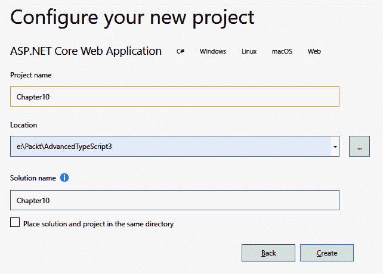
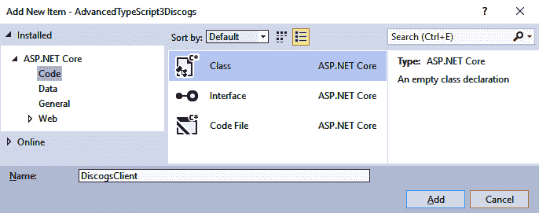
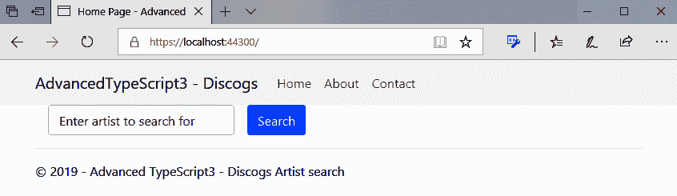
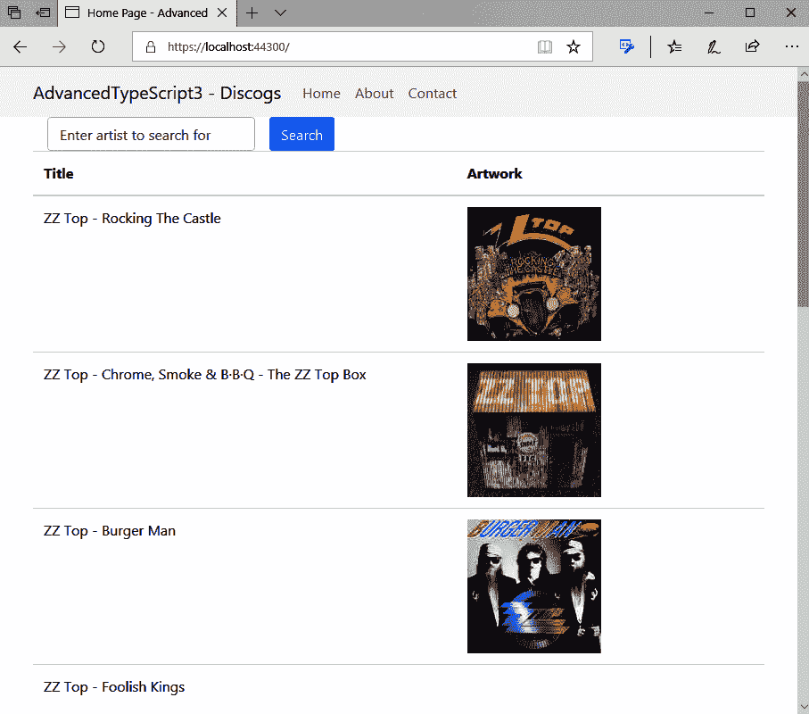

# 建造一个 ASP。 NET Core 音乐库

这一章标志着我们的方向发生了变化。 在前面的章节中，我们集中讨论了如何使用 TypeScript 作为我们的主要开发语言。 在这一章中，我们将看看如何在微软的 ASP 中使用 TypeScript。 NET Core，以学习如何混合 asp.net。 NET Core, c#和 TypeScript 来创建一个艺术家搜索程序，在这个程序中我们可以搜索音乐家并检索他们的音乐细节。

本章将涵盖以下主题:

*   Visual Studio 安装
*   理解为什么我们有 ASP。 净 MVC 核心
*   创建一个 ASP。 网络核心应用程序
*   理解为什么我们有`Program.cs`和`Startup.cs`
*   在 asp.net 中添加 TypeScript 支持。 网络应用程序
*   在 TypeScript 中使用`fetch`承诺

# 技术要求

本章要求。net 核心框架版本 2.1 或更高。 安装这个框架最简单的方法是下载并安装 Visual Studio; 微软提供了一个功能齐全的社区版，你可以从[https://visualstudio.microsoft.com/downloads/](https://visualstudio.microsoft.com/downloads/)获得。

完成的项目可从[https://github.com/PacktPublishing/Advanced-TypeScript-3-Programming-Projects/tree/master/Chapter10](https://github.com/PacktPublishing/Advanced-TypeScript-3-Programming-Projects/tree/master/Chapter10)下载。

.NET 应用程序不倾向于使用`npm`来下载软件包; 相反，他们使用 NuGet 来管理。net 包。 构建源代码将自动下载包。

# 介绍 ASP。 净 MVC 核心

微软在 web 框架方面有着漫长且相对曲折的历史。 我第一次开始开发基于服务器的应用程序是在 20 世纪 90 年代末，当时使用的是他们的**活动服务器页面**技术，现在被称为经典**ASP**。 这种技术允许开发人员根据用户请求创建动态网页，并将结果网页发送回客户端。 该技术需要一个特殊的**Internet Information Services**(**IIS**)插件才能工作，所以它完全基于 windows，是专有的 VBScript 语言和 HTML 的奇怪组合。 这意味着我们经常看到这样的代码:

```js
<%
Dim connection
Set connection = Server.CreateObject("ADODB.Connection")
Response.Write "The server connection has been created for id " & Request.QueryString("id")
%>
<H1>Hello World</H1>
```

事实上，在混合动态内容和 HTML 时，该语言是如此冗长，并且底层类型不是类型安全的，这意味着使用 ASP 开发特别容易出错，而且至少可以说，调试是具有挑战性的。

ASP 发展的下一步在 2002 年正式发布，并被称为 ASP。 净(或 ASP。 净 Web 表单)。 这是基于微软新的。net 框架，从根本上改变了我们构建 web 应用程序的方式。 使用这个，我们可以使用 c#或 VB 等语言构建应用程序。 NET 和组合用户控件在我们的网页，以创建小的自包含组件插槽到我们的网页。 这对微软来说是一个伟大的举动，但仍然有一些基本的问题，人们花了很多时间来解决。 最大的问题是 web 页面本质上与逻辑混合在一起，因为实际的服务器端实现是使用后面的代码处理的。 还有一个严格的页面编译周期，因此默认架构基于客户机和服务器之间的往返。 同样，这是可以解决的(而且经常是这样)，但是作为默认的体系结构，它还有很多需要改进的地方。 此外，这项技术是与 Windows 平台捆绑在一起的，所以它没有达到它本可以达到的范围。 尽管. net 和 c#已经标准化，可以创建其他的实现，但 Web Forms 仍然是一种专有技术。

认识到 Web Forms 模型的局限性，微软内部的一个团队决定开发一种不再受 Web Forms 代码隐藏限制的 ASP 形式。 这是向前迈出的重要一步，因为它向开发人员开放了体系结构，使他们能够更好地遵循面向对象的最佳实践，包括关注点分离。 突然之间，微软给了开发人员一个战斗的机会来开发遵循 SOLID 设计原则的应用程序。 这个框架被称为 ASP。 NET MVC，允许我们按照**Model View Controller**(**MVC**)模式开发应用程序。 这是一个强大的模式，因为它允许我们将代码分离到独立的逻辑区域。 MVC 代表以下内容:

*   **模型**:这是代表驱动应用程序行为的逻辑的业务层
*   **View**:这是用户看到的显示器
*   **控制器**:处理输入和交互

下图展示了 MVC 模式中的交互:


当我们想要开发全栈 web 应用程序时，这个架构代表了我们又向前迈出了一大步; 然而，它仍然存在依赖 Windows 的问题。

Indirectly, from this diagram, we can work out that ASP.NET represents code that runs both on the client and on the server. This means that we don't need a server-side instance of Node running, so we can leverage the power and features of the .NET stack with this architecture.

让很多人感到惊讶的是，微软开始将重心从 windows(长期以来一直被认为是公司的摇钱树)转移到更开放的模式，在这种模式下，运行应用程序的操作系统变得不那么重要了。 这反映了其核心优先级的转变，通过其顶级 Azure 产品，云操作在很大程度上已成为焦点。 如果微软继续保持现有的网络架构，那么它将会错过很多正在出现的机会; 因此，它开始了多年来对。net 框架的重新架构，以消除对 Windows 的依赖，并使其对使用它的开发人员具有平台无关性。

这导致微软发布了 ASP。 NET Core MVC，完全消除了对 Windows 的依赖。 从一个代码库，我们现在可以针对 Windows 或 Linux。 突然之间，我们可以在上面存放代码的服务器数量激增，运行服务器的成本潜在地下降了。 与此同时，随着 Microsoft 相继发布的每个 Core 版本，他们都在调优和优化性能，以大幅提高请求服务器的统计数据。 此外，我们可以免费开发这些应用程序，并以 Linux 主机为目标，这意味着这项技术对初创企业来说更加令人兴奋。 我非常希望有更多的初创企业使用 ASP。 随着成本壁垒的降低，NET 核心 MVC 在接下来的几年里会有显著的增长。

# 提供项目概述

我们在本章中构建的项目与我们到目前为止所写的项目有很大的不同。 这个项目见证了我们从纯 TypeScript 转向混合编程语言，即 c#和 TypeScript，因为我们看到了如何将 TypeScript 合并到 ASP 中。 NET 核心 web 应用程序。 应用程序本身使用了 Discogs 音乐 API，这样我们的用户就可以搜索艺术家，并检索他们的唱片和艺术作品的细节。 搜索部分使用纯 ASP 实现。 NET，而图像检索是使用 TypeScript 完成的。

只要你在 GitHub 仓库的代码旁边工作，本章应该花大约 3 个小时来完成，这看起来不会太多，因为我们一起尝试代码! 完成的应用程序看起来像这样:


所以，让我们开始吧!

# 开始使用 ASP 创建音乐库。 NET Core、c#和 TypeScript

我是个音乐迷。 我弹吉他很多年了，这使我听了很多音乐家的音乐。 跟踪他们制作的所有音乐可能是一项非常复杂的任务，所以我一直对公开可用的 api 感兴趣，它可以让我们搜索所有与音乐家相关的东西。 我认为，为查询专辑、艺术家、曲目等提供最广泛选择的公共 API 是 Discog 库。

在本章中，我们将利用这个 API 并编写一个利用 ASP 的应用程序。 为了向你展示如何协同使用 c#和 TypeScript。

为了运行这个应用程序，你需要在 Discogs 设置一个帐户，如下所示:

1.  从[https://www.discogs.com/users/create](https://www.discogs.com/users/create)开始，注册一个账号。
2.  虽然我们可以创建一个 Discogs API 应用程序如果我们想,特别是如果我们想利用特性,比如身份验证和获得完整的 API,我们所需要的对于我们的目的是生成一个个人访问令牌通过单击生成令牌按钮,如下截图所示:


现在我们已经注册了 Discogs 并生成了令牌，我们准备创建 ASP。 网络核心应用程序。

# 创造我们的 ASP。 NET 核心应用程序与 Visual Studio

在前几章中，我们从命令行创建应用程序。 然而，使用 Visual Studio，通常的做法是可视化地创建应用程序。

让我们看看这是如何做到的:

1.  打开 Visual Studio 并选择 Create a New Project 来启动创建新项目的向导。 我们将创建一个 ASP。 NET 核心 Web 应用程序，如下所示:


Older versions of .NET were only capable of running on Windows platforms. While .NET is an excellent framework, and C# is a wonderful language, this lack of cross-platform capability meant that .NET was only ever favored by companies with Windows desktops or Windows servers available. A while back, Microsoft decided to address this deficiency by stripping .NET back and rearchitecting it from the ground up as something that could run cross-platform. This has broadened the reach of .NET immensely and is known as .NET Core. What this means to us is that we can develop on one platform and deploy our application to another platform. Internally, .NET Core applications have platform-specific code that gets hidden behind a single .NET API so, for example, we can do file access without worrying about how the underlying operating system handles files.

2.  我们需要选择把代码放在哪里。 我的本地 Git 存储库是基于`E:\Packt\AdvancedTypeScript3`目录下的，所以以这个位置为目标告诉 Visual Studio 在该目录下的一个文件夹中创建必要的文件。 在这种情况下，Visual Studio 将创建一个名为`Chapter10`的解决方案，其中将包含我们的所有文件。 点击 Create 来创建我们需要的所有文件:



3.  一旦 Visual Studio 完成了我们的解决方案的创建，它应该有以下文件可用。 在开发应用程序时，我们将讨论更重要的文件，并看看如何使用它们:


4.  我们也可以构建和运行我们的应用程序(按*F5*将做这个)，导致应用程序像这样启动:


创建了应用程序后，在下一节中，我们将讨论生成代码的要点，首先是启动文件和程序文件，然后再开始修改它并引入搜索功能。

# 理解应用程序结构

在行为方面，我们的应用程序的起点是`Startup`类。 这个文件的目的是在启动过程中设置系统，因此我们需要关注一些特性，比如配置应用程序如何处理 cookie，以及添加 HTTP 支持。 虽然这个类在功能上很大程度上是样板，但为了添加对我们将要编写的 Discogs 客户机的支持，我们将在稍后再回到它。 问题是，这个功能从哪里被调用? 实际启动物理应用程序的是什么? 这些问题的答案就是`Program`课。 如果我们快速分解这段代码，我们将看到启动功能是如何引入的，以及它如何帮助构建宿主应用程序。

. net -可执行应用程序从`Main`方法开始。 有时候，这对开发人员来说是隐藏的，但在某个地方总是有一个。 这是可执行应用程序的标准入口点，我们的 web 应用程序也不例外。 这个静态方法简单地调用`CreateWebHostBuilder`方法，在调用 Build 和 Run 之前传入任何命令行参数来构建并运行主机:

```js
public static void Main(string[] args)
{
  CreateWebHostBuilder(args).Build().Run();
}
public static IWebHostBuilder CreateWebHostBuilder(string[] args) =>
  WebHost.CreateDefaultBuilder(args)
    .UseStartup<Startup>();
```

这里使用的`=>`和使用胖箭头是不一样的。 在这个特定的上下文中，它所做的是替换`return`关键字，因此如果您有一个带有单个`return`操作的方法，则可以简化这个操作。 等效的代码，用`return`语句完成，看起来像这样:

```js
public static IWebHostBuilder CreateWebHostBuilder(string[] args)
{
   return WebHost.CreateDefaultBuilder(args).UseStartup<Startup>();
}
```

`CreateDefaultBuilder`用于配置我们的服务主机选项，如设置 Kestrel web 引擎，加载配置信息，并设置日志支持。 `UseStartup`方法告诉默认构建器，它需要使用`Startup`类来启动服务。

# 启动类

那么，我们的`Startup`班实际上是什么样子的呢? 好吧，就像我们用 TypeScript 开发一样，c#从类定义开始:

```js
public class Startup
{
}
```

与 JavaScript 不同，c#没有特殊的`constructor`关键字。 相反，c#使用类名来表示构造函数。 注意，就像 JavaScript 在创建构造函数时一样，我们没有给它一个返回类型(我们将很快看到 c#是如何处理返回类型的)。 构造函数将接收一个配置条目，以允许我们读取配置。 我们使用下面的`get;`属性将其作为 c#属性公开:

```js
public Startup(IConfiguration configuration)
{
  Configuration = configuration;
}
public IConfiguration Configuration { get; }
```

当运行时启动我们的主机进程时，将调用`ConfigureServices`方法。 在这里，我们可以连接到任何我们需要的服务; 在这段代码中，我添加了一个`IDiscogsClient`/`DiscogsClient`注册，它将这个特殊的组合添加到 IoC 容器中，以便我们以后可以将它注入到其他类中。 我们已经看到了在这个类中发生的依赖项注入的一个示例，该示例将配置提供给构造函数。

不要担心，我们还没有看到`IDiscogsClient`和`DiscogsClient`。 我们很快就会将类和接口添加到代码中。 在这里，我们将它们注册到服务集合中，以便它们可以自动注入到类中。 你可能还记得我们在本书前面说过的，一个单例只会给出一个类的实例，不管它在哪里被使用。 这与我们在 Angular 中生成服务时非常相似，在 Angular 中我们将服务注册为单例:

```js
public void ConfigureServices(IServiceCollection services)
{
  services.Configure<CookiePolicyOptions>(options =>
  {
    options.CheckConsentNeeded = context => true;
    options.MinimumSameSitePolicy = SameSiteMode.None;
  });

  services.AddHttpClient();
  services.AddSingleton<IDiscogsClient, DiscogsClient>();
  services.AddMvc().SetCompatibilityVersion(
    CompatibilityVersion.Version_2_1);
}
```

Something to note here is that the place where we set the return type differs from TypeScript. Like we saw in our TypeScript, we set the return type at the very end of the method declaration. With C#, the return type is set before the name so we know that `ConfigureServices` has a `void` return type.

`AddSingleton`上的语法表明 c#也支持泛型，所以语法对我们来说不应该是可怕的。 虽然在语言中有很多奇偶性，但 TypeScript 也有一些有趣的区别，比如没有专用的`any`或`never`类型。 如果我们想要我们的 c#类型做一些类似于`any`的事情，它就必须使用`object`类型来代替。

现在已经配置了基础服务，该类的最后一步是配置 HTTP 请求管道。 这仅仅意味着它告诉应用程序如何响应 HTTP 请求。 在这段代码中，我们可以看到我们已经启用了对静态文件的支持。 这对我们来说非常重要，因为我们要依赖静态文件支持来挂钩 TypeScript(其实是编译后的 JavaScript 版本)，以便它能与 c#应用程序共存。 我们还可以看到路由已经为我们的请求设置好了:

```js
public void Configure(IApplicationBuilder app, IHostingEnvironment env)
{
  if (env.IsDevelopment())
  {
    app.UseDeveloperExceptionPage();
  }
  else
  {
    app.UseExceptionHandler("/Home/Error");
    app.UseHsts();
  }

  app.UseHttpsRedirection();
  app.UseStaticFiles();
  app.UseCookiePolicy();

  app.UseMvc(routes =>
  {
    routes.MapRoute(
              name: "default",
              template: "{controller=Home}/{action=Index}/{id?}");
  });
}
```

创建 c#基础设施来启动我们的应用程序是很好的，但是如果我们没有任何东西可以显示，那么我们就是在浪费时间。 现在我们来看看将要提供的基本文件。

# 构成基本视图的文件

我们的视图的入口点是特殊的`_ViewStart.cshtml`文件。 该文件定义应用程序将显示的公共布局。 不是直接将内容添加到这个文件中，而是将内容放在一个名为`_Layout.cshtml`的文件中，并在设置`Layout`文件时引用这个(减去文件扩展名)，如下所示:

```js
@{
    Layout = "_Layout";
}
```

Files that end with `.cshtml` have a special meaning to ASP.NET. This tells the application that these files are a combination of C# and HTML, which the underlying engine will have to compile before serving the result to the browser. We should be very familiar with this concept by now, having seen similar behavior with both React and Vue.

现在我们已经介绍了视图入口点，我们需要考虑`_Layout`本身。 默认的 ASP。 NET 实现目前使用 Bootstrap 3.4.1，因此，当我们浏览这个文件时，我们将为使用 Bootstrap 4 做必要的更改。 让我们从当前的头部开始:

```js
<!DOCTYPE html>
<html>
<head>
    <meta charset="utf-8" />
    <meta name="viewport" content="width=device-width, 
      initial-scale=1.0" />
    <title>@ViewData["Title"] - Chapter10</title>

    <environment include="Development">
        <link rel="stylesheet" 
          href="~/lib/bootstrap/dist/css/bootstrap.css" />
        <link rel="stylesheet" href="~/css/site.css" />
    </environment>
    <environment exclude="Development">
        <link rel="stylesheet" 
          href="https://stackpath.bootstrapcdn.com/bootstrap/3.4.1/
                css/bootstrap.min.css"
          asp-fallback-href="~/lib/bootstrap/dist/
                             css/bootstrap.min.css"
          asp-fallback-test-class="sr-only" 
          asp-fallback-test-property="position" 
          asp-fallback-test-value="absolute" />
        <link rel="stylesheet" href="~/css/site.min.css" 
          asp-append-version="true" />
    </environment>
</head> 
```

这个标题看起来像一个相当正常的标题，但有一些小怪癖在它。 在标题中，我们从`@ViewData`中选取`Title`。 我们使用`@ViewData`在控制器和视图之间传输数据，所以如果我们查看`index.cshtml`文件(例如)，文件的顶部会这样说:

```js
@{
    ViewData["Title"] = "Home Page";
}
```

结合我们的布局，这一节所做的是将我们的`title`标签设置为`Home Page - Chapter 10`。 `@`符号告诉编译器: NET 的模板引擎 Razor 将不得不对这段代码做一些事情。

标题的下一部分根据我们是否处于开发环境来划分应该包含哪些样式表的逻辑。 如果我们正在运行一个开发构建，我们得到一组文件，而发布版本得到的是缩小版。

我们将通过从 CDN 提供 Bootstrap 来简化我们的头部，无论我们是否处于开发模式，并稍微改变我们的标题:

```js
<head>
  <meta charset="utf-8"/>
  <meta name="viewport" content="width=device-width, 
    initial-scale=1.0"/>
  <title>@ViewData["Title"] - AdvancedTypeScript 3 - Discogs</title>

  <link rel="stylesheet" href="https://maxcdn.bootstrapcdn.com/
    bootstrap/4.0.0/css/bootstrap.min.css" 
    integrity="sha384-  
      Gn5384xqQ1aoWXA+058RXPxPg6fy4IWvTNh0E263XmFcJlSAwiGgFAW/dAiS6JXm" 
        crossorigin="anonymous">
  <environment include="Development">
    <link rel="stylesheet" href="~/css/site.css"/>
  </environment>
  <environment exclude="Development">
    <link rel="stylesheet" href="~/css/site.min.css" 
      asp-append-version="true"/>
  </environment>
</head>
```

我们页面布局的下一部分是`body`元素。 我们一节一节地把它分解。 从`body`元素开始，我们先来看`navigation`元素:

```js
<body>
    <nav class="navbar navbar-inverse navbar-fixed-top">
        <div class="container">
            <div class="navbar-header">
                <button type="button" class="navbar-toggle" 
                    data-toggle="collapse" 
                    data-target=".navbar-collapse">
                    <span class="sr-only">Toggle navigation</span>
                    <span class="icon-bar"></span>
                    <span class="icon-bar"></span>
                    <span class="icon-bar"></span>
                </button>
                <a asp-area="" asp-controller="Home" 
                  asp-action="Index" class="navbar-brand">Chapter10</a>
            </div>
            <div class="navbar-collapse collapse">
                <ul class="nav navbar-nav">
                    <li><a asp-area="" asp-controller="Home" 
                      asp-action="Index">Home</a></li>
                    <li><a asp-area="" asp-controller="Home" 
                      asp-action="About">About</a></li>
                    <li><a asp-area="" asp-controller="Home" 
                      asp-action="Contact">Contact</a></li>
                </ul>
            </div>
        </div>
    </nav>

</body>
```

总的来说，这是一个熟悉的`navigation`组件(尽管是 Bootstrap 3 格式)。 将`navigation`组件转换为 Bootstrap 4 可以得到以下结果:

```js
<nav class="navbar navbar-expand-lg navbar-light bg-light">
  <div class="container">
    <a class="navbar-brand" asp-area="" asp-controller="Home" 
      asp-action="Index">AdvancedTypeScript3 - Discogs</a>
    <div class="navbar-header">
      <button class="navbar-toggler" type="button" 
        data-toggle="collapse" 
        data-target="#navbarSupportedContent" 
        aria-controls="navbarSupportedContent" 
        aria-expanded="false" 
        aria-label="Toggle navigation">
        <span class="navbar-toggler-icon"></span>
      </button>
    </div>
    <div class="navbar-collapse collapse">
      <ul class="nav navbar-nav">
        <li>
          <a class="nav-link" asp-area="" asp-controller="Home" 
            asp-action="Index">Home</a>
        </li>
        <li>
          <a class="nav-link" asp-area="" asp-controller="Home" 
            asp-action="About">About</a>
        </li>
        <li>
          <a class="nav-link" asp-area="" asp-controller="Home" 
            asp-action="Contact">Contact</a>
        </li>
      </ul>
    </div>
  </div>
</nav>
```

在这里，不熟悉的区域位于`a`链接内。 `asp-controller`类将视图链接到`controller`类; 按照惯例，这些类名扩展为`<<name>>Controller`，因此`Home`变成了`HomeController`。 有一个相关的`asp-action`，它与我们将要调用的控制器类中的方法相关。 点击`About`链接将调用`HomeController.cs`内的`About`方法:

```js
public IActionResult About()
{
  ViewData["Message"] = "Your application description page.";
  return View();
}
```

此方法设置将写入`About`页面的消息，然后返回该视图。 ASP。 NET 足够聪明，可以使用`View()`计算出它应该为此返回`About.cshtml`页面，因为这是`About`操作。 这是我们开始看到控制器部分连接到 MVC 中的视图部分的地方。

回到`_Layout`文件，我们感兴趣的下一节是下面的部分，在这里我们使用`@RenderBody`渲染主体内容:

```js
<div class="container body-content">
    @RenderBody()
    <hr />
    <footer>
        <p>&copy; 2019 - Chapter10</p>
    </footer>
</div>
```

我们选择在控制器中显示的视图将在声明`@RenderBody`时呈现，因此我们可以假设该命令的目的是充当占位符，将相关视图放入其中。 我们将稍微改变一下，以正确地使用 Bootstrap 知识，并添加一个更有意义的页脚。 考虑以下代码:

```js
<div class="container">
  <div class="row">
    <div class="col-lg-12">
      @RenderBody()
    </div>
  </div>
  <hr/>
  <footer>
    <p>&copy; 2019 - Advanced TypeScript3 - Discogs Artist search</p>
  </footer>
</div>
```

我们不需要覆盖此文件的其余部分,因为我们真的需要开始看模型和视图我们要渲染,但请阅读源代码从 GitHub,使相关的 JavaScript 更改在这个文件中,使用引导引导 3 4。

现在，我们可以开始编写 MVC 代码库中的模型部分了。 我们将通过编写模型来实现这一点，该模型将向 Discogs API 发送请求，并获取和转换结果，将其发送给客户端。

# 创建一个 Discogs 模型

您将记得，我们在前面添加了一个`IDiscogsClient`模型的注册。 那时我们实际上还没有添加任何代码，所以我们的应用程序将无法编译。 现在，我们将创建接口和实现。 `IDiscogClient`是一个模型，所以我们要在模型目录中创建它。 要在 Visual Studio 中创建界面和模型，我们需要右键点击`Models`文件夹，弹出一个上下文菜单。 在菜单中，选择 Add>Class.... 下面的截图显示了这一点:


这将打开下面的对话框，我们可以在其中创建类或相关的接口:



为了简洁起见，我们可以在同一个文件中创建接口和类定义。 我已经在 GitHub 代码中把它们分开了，但是这里的类不需要这样做。 首先，我们有接口定义，如下:

```js
public interface IDiscogsClient
{
  Task<Results> GetByArtist(string artist);
}
```

在我们的定义中使用`Task<Results>`类似于在 TypeScript 中指定一个返回特定类型的 promise。 我们在这里所说的是，我们的方法将异步运行，并且在某个点上，它将返回一个`Results`类型。

# 设置 Results 类型

我们从 Discogs 返回的数据是一个字段层次结构。 最终，我们想要的代码将转换和返回结果，类似如下:


在幕后，我们将把调用的 JSON 结果转换成一组类型。 顶级类型是`Results`类型，我们将从`GetByArtist`调用中返回该类型。 这个层次结构如下图所示:


为了了解映射是什么样的，我们将从头开始构建`CommunityInfo`类型。 这个类将用于我们的`SearchResult`类，以提供我们在之前的 QuickWatch 截图中选择的社区字段。 创建一个名为`CommunityInfo`的类，并在文件的顶部添加以下行:

```js
using Newtonsoft.Json;
```

我们添加这一行是因为这里有我们想要使用的功能; 具体来说，我们想使用`JsonProperty`将 c#属性的名称映射到 JSON 结果中出现的属性。 我们有两个字段，`CommunityInfo`需要返回-一个识别多少人`want`音乐标题，另一个识别多少人`have`它。 我们将遵循标准的 c#命名约定，并使用 Pascal 格式的属性名(这意味着第一个字母大写)。 由于属性名使用 Pascal 大小写，我们将使用`JsonProperty`属性将该名称映射到相应的 REST 属性名，因此在结果中`Want`属性将被映射到`want`:

```js
public class CommunityInfo
{
  [JsonProperty(PropertyName = "want")]
  public int Want { get; set; }
  [JsonProperty(PropertyName = "have")]
  public int Have { get; set; }
}
```

我们不会讲所有的类和属性。 我绝对推荐阅读 GitHub 代码以获得更多细节，但这肯定有助于澄清项目结构是什么。

# 编写 disgsclient 类

在编写`DiscogsClient`类时，我们已经有了它所基于的契约，以及接口定义。 这告诉我们，我们的类是这样开始的:

```js
public class DiscogsClient : IDiscogsClient
{
  public async Task<Results> GetByArtist(string artist)
  {
  }
}
```

类的定义看起来与接口略有不同，因为我们不必说`GetByArtist`是`public`或者方法是`async`。 当在方法声明中使用`async`时，我们设置了一个编译期望，该方法将在其中包含`await`关键字。 从 TypeScript 使用的`async`/`await`中，我们应该很熟悉这一点。

当我们调用 Discogs API 时，它总是以`https://api.discogs.com/`URL 开始。 为了让我们的代码库更简单，我们将在类中定义这个常量:

```js
private const string BasePath = "https://api.discogs.com/";
```

我们的类将与 REST 端点通信。 这意味着我们必须能够从代码中访问 HTTP。 为了做到这一点，我们的构造函数将有一个实现注入其中的`IHttpClientFactory`接口的类。 客户端工厂将实现一个称为工厂模式的模式，以构建一个合适的`HttpClient`实例，供我们在需要时使用:

```js
private readonly IHttpClientFactory _httpClientFactory;
public DiscogsClient(IHttpClientFactory httpClientFactory)
{
  _httpClientFactory = httpClientFactory ?? throw new 
     ArgumentNullException(nameof(httpClientFactory));
}
```

This rather strange-looking syntax in the constructor simply states that we are going to set the member variable with the HTTP client factory that we pass in. If the client factory is null, `??` means that the code falls through to the next statement, which will throw an exception stating that the argument is null.

那么，我们的`GetByArtist`方法是什么样的呢? 我们要做的第一件事是检查是否向方法传递了一个美工。 如果没有，则返回一个空的`Results`实例:

```js
if (string.IsNullOrWhiteSpace(artist))
{
  return new Results();
}
```

为了创建 HTTP 请求，我们需要构建请求地址。 当我们构建地址时，我们将用常量定义的`BasePath`字符串附加从`GetByArtist`开始的路径。 假设我们想作为艺术家搜索`Peter O'Hanlon`。 我们将构建搜索字符串，以便转义用户输入的文本，以防止发送危险请求; 因此，我们最终将构建一个 HTTP 请求字符串，如[https://api.discogs.com/database/search?artist=Peter O%27Hanlon&per_page=10](https://api.discogs.com/database/search?artist=Peter%20O%27Hanlon&per_page=10)所示。 我们已经限制结果的数量为 10，以保持良好的迪斯科请求限制。 我们从 helper 方法开始，它将两个字符串添加到一起:

```js
private string GetMethod(string path) => $"{BasePath}{path}";
```

有了 helper，我们就可以构建`GET`请求。 正如我们前面所讨论的，我们需要更改艺术家，以便消除潜在的危险搜索词。 在使用`Uri.EscapeDataString`时，我们将我名字中的撇号替换为它的等效 ASCII 值`%27`:

```js
HttpRequestMessage request = new HttpRequestMessage(HttpMethod.Get, 
  GetMethod($"database/search?artist={Uri.EscapeDataString(artist)}&per_page=10"));
```

创建请求后，我们需要向它添加两个头信息。 我们需要添加一个`Authorization`token 和一个`user-agent`，因为 Discogs 期待收到它们。 `Authorization`令牌采用`Discogs token=<<token>>`的格式，其中`<<token>>`是我们之前注册时创建的令牌。 `user-agent`只需要一些有意义的东西，所以我们将它设置为`AdvancedTypeScript3Chapter10`:

```js
request.Headers.Add("Authorization", "Discogs token=MyJEHLsbTIydAXFpGafrrphJhxJWwVhWExCynAQh");
request.Headers.Add("user-agent", "AdvancedTypeScript3Chapter10");
```

我们拼图的最后一部分是使用工厂创建`HttpClient`。 当这个创建完成后，我们调用`SendAsync`将请求发送到 Discogs 服务器。 当这个返回时，我们读取`Content`响应，当这个返回时，我们需要使用`DeserializeObject`转换类型:

```js
using (HttpClient client = _httpClientFactory.CreateClient())
{
  HttpResponseMessage response = await client.SendAsync(request);
  string content = await response.Content.ReadAsStringAsync();
  return JsonConvert.DeserializeObject<Results>(content);
}
```

当我们把这些放在一起时，我们的类看起来是这样的:

```js
public class DiscogsClient : IDiscogsClient
{
  private const string BasePath = "https://api.discogs.com/";
  private readonly IHttpClientFactory _httpClientFactory;
  public DiscogsClient(IHttpClientFactory httpClientFactory)
  {
    _httpClientFactory = httpClientFactory ?? throw new 
                 ArgumentNullException(nameof(httpClientFactory));
  }

  public async Task<Results> GetByArtist(string artist)
  {
    if (string.IsNullOrWhiteSpace(artist))
    {
      return new Results();
    }
    HttpRequestMessage request = new HttpRequestMessage(HttpMethod.Get, 
      GetMethod($"database/search?artist=
        {Uri.EscapeDataString(artist)}&per_page=10"));
    request.Headers.Add("Authorization", "Discogs 
      token=MyJEHLsbTIydAXFpGafrrphJhxJWwVhWExCynAQh");
    request.Headers.Add("user-agent", "AdvancedTypeScript3Chapter10");
    using (HttpClient client = _httpClientFactory.CreateClient())
    {
      HttpResponseMessage response = await client.SendAsync(request);
      string content = await response.Content.ReadAsStringAsync();
      return JsonConvert.DeserializeObject<Results>(content);
    }
  }
  private string GetMethod(string path) => $"{BasePath}{path}";
}
```

我们提到了利率限制。 那到底是什么意思呢?

# Discogs 率限制

Discog 限制从单个 IP 发出的请求数量。 对于经过身份验证的请求，Discog 将请求速率限制为每分钟 60 次。 对于未经身份验证的请求，在大多数情况下，每分钟可以发送 25 个请求。 使用移动窗口监视请求的数量。

我们已经编写了 Discogs API 模型; 现在，我们来看看如何将模型连接到控制器。

# 连接控制器

我们将使用依赖注入的强大功能来传递我们刚刚编写的 Discogs 客户端模型:

```js
public class HomeController : Controller
{
  private readonly IDiscogsClient _discogsClient;
  public HomeController(IDiscogsClient discogsClient)
  {
    _discogsClient = discogsClient;
  }
}
```

你可能还记得，当我们设置导航时，我们将`asp-action`设置为`Index`。 当我们执行搜索时，我们的视图将把搜索字符串传递给`Index`并调用`GetByArtist`方法。 当我们得到搜索的结果时，我们用结果列表设置`ViewBag.Result`。 最后是`View`，这将是`Index`页面:

```js
public async Task<IActionResult> Index(string searchString)
{
  if (!string.IsNullOrWhiteSpace(searchString))
  {
    Results client = await _discogsClient.GetByArtist(searchString);
    ViewBag.Result = client.ResultsList;
  }

  return View();
}
```

但是我们的视图是什么样的呢? 现在我们需要设置`Index`视图。

# 添加 Index 视图

在文件的顶部，我们将`ViewData`设置为`Title`。 当我们查看`_Layout.cshtml`时，我们看到了它的作用，但值得重复的是，我们在这里设置的值是用来帮助构建主布局页面中的标题的。 当我们运行我们的应用程序时，这会将标题设置为`Home Page - AdvancedTypeScript 3 - Discogs`:

```js
@{
  ViewData["Title"] = "Home Page";
}
```

用户通过搜索控件与应用程序交互。 是时候把它加进去了。 我们将添加一个`div`ID，我们将调用`pageRoot`，它将包含一个`form`元素:

```js
<div id="pageRoot">
  <form asp-controller="Home" asp-action="Index" class="form-inline">
  </form>
</div>
```

同样，我们可以看到我们正在使用 ASP 的全部功能。 NET 在这里对我们有利。 我们的表单是 mvc 感知的，所以我们通过使用`asp-controller`告诉它我们正在使用`HomeController`(记住控制器的约定)。 我们将操作设置为`Index`，因此我们将调用与导航到该页面时相同的`Index`方法。 我们这样做的原因是，当我们完成搜索时，我们仍然希望显示当前页面，以便用户可以在必要时搜索不同的艺术家。 我们的`Index`方法足够聪明，可以知道我们是否传递了一个搜索字符串来触发搜索，所以当用户在我们的表单中触发搜索时，将提供搜索字符串，这将触发搜索本身。

在表单中，我们需要添加一个输入搜索字段和一个按钮，当按下时触发`submit`表单。 这里的 class 元素只是用来在引导版本中创建我们的`button`和`input`字段:

```js
<div class="form-group mx-sm-3 mb-10">
  <input type="text" name="SearchString" class="form-control" 
    placeholder="Enter artist to search for" />
</div>
<button type="submit" class="btn btn-primary">Search</button>
```

有了这个，这是我们的搜索部分看起来像:

```js
<div id="pageRoot">
  <form asp-controller="Home" asp-action="Index" class="form-inline">
    <div class="form-group mx-sm-3 mb-10">
      <input type="text" name="SearchString" class="form-control" 
        placeholder="Enter artist to search for" />
    </div>
    <button type="submit" class="btn btn-primary">Search</button>
  </form>
</div>
```

如果我们现在运行这个应用程序，我们将看到以下内容。 如果我们输入一个艺术家的细节，并按下 Search 按钮，搜索将被触发，但数据不会显示在屏幕上:



现在我们有了返回的搜索结果，我们需要从我们添加了结果的`ViewBag`中得到结果。 `ViewBag`和`ViewData`很容易让人混淆，所以值得花点时间讨论一下，因为它们都有相同的目的，在控制器和视图之间双向传递数据，只是略有不同:

*   当我们添加搜索结果时，我们将其设置为`ViewBag.Result`。 但是，如果我们看一下`ViewBag`的源代码，我们实际上不会找到一个名为**Result**的属性。 原因在于`ViewBag`是动态的; 换句话说，它允许我们创建任意值，这些值可以在控制器和视图之间共享，可以被称为任何东西。 使用`ViewBag`一般来说,是一个合理的选择,但因为它是动态的,它没有编译器的检测是否有错误,所以一定要确保你设置的属性给出的控制器名称相同的属性视图中设置。
*   然而，`ViewData`依赖于字典的使用(类似于 TypeScript 中的`map`)，在那里我们可能有许多键/值对保存数据。 在内部，这个值是一个对象，所以如果我们在视图中设置这个值并将它传递回控制器，因为我们必须将对象强制转换为合适的类型，这将会有影响。 的作用是,在视图中设置`ViewBag.Counter = 1`意味着我们可以直接将`ViewBag.Counter`作为一个整数在我们的控制器,但在视图中设置`ViewData["Counter"] = 1`意味着我们必须把`ViewData["Counter"]`一个整数之前我们可以做任何事情。 演员阵容大概是这样的:

```js
int counter = (int)ViewData["Counter"];
```

出于我们的目的，我们可以使用任何一种方法，因为设置结果的责任是由控制器承担的，但我很乐意使用`ViewBag`来设置结果。 那么，我们如何添加数据呢? 我们知道我们的`Index`页面是一个`.cshtml`文件，所以我们可以混合 c#和 HTML 在一起。 我们的表示方式是使用 c#部分`@{ }`,为了呈现出结果,我们需要检查在`ViewBag.Result`有一个值(注意,c#使用`!=`,而不是`!==`的 JavaScript 格式,测试结果不是零)。 我们用来呈现结果的代码是这样开始的:

```js
@{ if (ViewBag.Result != null)
  {
  }
}
```

在我们的结果中，我们将创建一个 Bootstrap 表，其中`Title`和`Artwork`作为两列。 我们将要构建的表格的 HTML 标记是这样开始的:

```js
<table class="table">
  <thead>
    <tr>
      <th>Title</th>
      <th>Artwork</th>
    </tr>
  </thead>
  <tbody>
  </tbody>
</table>
```

在我们的表体(`tbody`)中，我们将不得不循环遍历结果中的每一项，并写出相关的值。 我们要做的第一件事是创建一个名为`index`的变量。 现在，我们将把它放到合适的位置，因为我们需要添加一个具有唯一名称的图像(我们将在下一节中讨论它)。

接下来，我们将使用`foreach`遍历`ViewBag.Result`中的每一项。 对于每个项目，我们将使用`<tr></tr>`创建一个新表行，在行中，我们将写出包含标题和资源 URL 的两个表数据单元格(`<td></td>`)，如下所示:

```js
<tbody>
  @{
    int index = 0;
  }
  @foreach (var item in ViewBag.Result)
  {
    <tr>
      <td>@item.Title</td>
      <td>@item.ResourceUrl</td>
    </tr>
    index++;
  }
</tbody>
```

如果我们现在运行我们的应用程序，我们将得到结果，这些结果将被写入表:


显然，美术元素是错误的。 这不是一张图片，因此我们需要在适当的地方放置一些东西，以便启动并检索图片本身，这需要我们的代码对每个结果进行另一个 REST 调用。 我们希望在返回结果时发生这种情况，所以当我们看到如何利用 TypeScript 获得图像结果时，我们将转向客户端功能。

# 在应用中添加 TypeScript

typescript 的起点——和往常一样——是我们的`tsconfig.json`文件。 我们要把它做得尽可能的细。 我们将在这里设置这个特殊的`outDir`，因为我们的项目创建时在`wwwroot`中设置了一些文件。 在`wwwroot/js`文件夹中，ASP。 NET 已经创建了一个`site.js`文件，所以我们要把我们的脚本放在它旁边:

```js
{
  "compileOnSave": true,
  "compilerOptions": {
    "lib": [ "es2015", "dom" ],
    "noImplicitAny": true,
    "noEmitOnError": true,
    "removeComments": true,
    "sourceMap": true,
    "target": "es2015",
    "outDir": "wwwroot/js/"
  },
  "exclude": [
    "wwwroot"
  ]
}
```

我们将使用一个方法来调用 Discogs API 来检索相关的图像。 我们不会依赖任何从外部源加载的 TypeScript 包来进行 API 调用，因为 JavaScript 为我们提供了`fetch`API，它允许我们在没有任何依赖项的情况下进行 REST 调用。

我们首先添加一个名为`discogHelper.ts`的文件，它将包含我们将要从 ASP. net 调用的函数。 网络应用程序。 我们将其作为 TypeScript 方法添加的原因是，我们希望它在客户端运行，而不是在服务器端。 这减少了将初始结果加载到客户端屏幕所花费的时间，因为我们将让客户端获取并异步加载图像。

函数的签名如下:

```js
const searchDiscog = (request: RequestInfo, imgId: string): Promise<void> => {
  return new Promise((): void => {
  }
}
```

`RequestInfo`参数将在服务器上接受图像请求的 URL。 这是因为 Discog 不返回关于特定音乐名称的完整细节，所以目前还无法获得专辑插图。 相反，它返回我们必须进行的 REST 调用来检索完整的细节，然后我们可以解析这些细节来检索艺术品。 例如，Steve Vai 的《Passion and Warfare》专辑信息返回[https://api.discogs.com/masters/44477](https://api.discogs.com/masters/44477)链接的`ResourceUrl`。 这将成为我们作为`request`传入的 URL，以检索完整的细节，包括艺术品。

我们接受的第二个参数是`img`对象的`id`。 在迭代初始搜索结果以构建结果表时，除了添加专辑标题外，还包含一个惟一标识的图像，并将其传递到函数中。 这允许我们在检索完相册的详细信息后动态更新`src`。 有时，这可能会在客户机中产生有趣的效果，因为一些相册比其他相册需要更长的时间来检索，所以完全有可能图像列表的更新顺序不一致，这意味着后面的图像比前面的图像填充得更快。 这没什么好担心的，因为我们这样做是为了表明我们的客户端代码是真正异步的。

If we really wanted to worry about making our images display sequentially, we would change our function to accept an array of requests and image placeholders, issue our calls, and only update the images once all the REST calls had finished.

不出所料，`fetch`API 使用了一个名为`fetch`的承诺来让我们进行调用。 它接受请求和一个可选的`RequestInit`对象，允许我们将自定义设置传递给我们的调用，包括我们想要应用的 HTTP 动词和我们想要设置的任何头部:

```js
fetch(request,
  {
    method: 'GET',
    headers: {
      'authorization': 'Discogs 
           token=MyJEHLsbTIydAXFpGafrrphJhxJWwVhWExCynAQh',
      'user-agent': 'AdvancedTypeScript3Chapter10'
    }
  })
```

Guess what? We are using the same `authorization` and `user-agent` headers here that we set in the C# code.

我们已经说过，`fetch`API 是基于承诺的，所以我们可以期待`fetch`调用在返回结果之前等待完成。 为了得到图像，我们要做一些变换。 第一个转换是将响应转换为 JSON 表示:

```js
.then(response => {
  return response.json();
})
```

转换操作是异步的，因此转换的下一阶段也可以在它自己的`then`块中进行。 现在，如果一切顺利，我们应该有一个反应机构。 我们使用传递给函数的图像 ID 检索`HTMLImageElement`。 如果这是一个有效的图像，那么我们将`src`设置为我们返回的第一个`uri150`结果，这将给我们来自服务器的 150 x 150 像素图像的地址:

```js
.then(responseBody => {
  const image = <HTMLImageElement>document.getElementById(imgId);
  if (image) {
    if (responseBody && responseBody.images && 
         responseBody.images.length > 0) {
      image.src = responseBody.images["0"].uri150;
    }
  }
})
```

把这些放在一起，我们的搜索函数看起来像这样:

```js
const searchDiscog = (request: RequestInfo, imgId: string): Promise<void> => {
  return new Promise((): void => {
    fetch(request,
      {
        method: 'GET',
        headers: {
          'authorization': 'Discogs 
            token=MyJEHLsbTIydAXFpGafrrphJhxJWwVhWExCynAQh',
          'user-agent': 'AdvancedTypeScript3Chapter10'
        }
      })
      .then(response => {
        return response.json();
      })
      .then(responseBody => {
        const image = <HTMLImageElement>document.getElementById(imgId);
        if (image) {
          if (responseBody && responseBody.images && 
               responseBody.images.length > 0) {
            image.src = responseBody.images["0"].uri150;
          }
        }
      }).catch(x => {
        console.log(x);
      });
  });
}
```

Discogs allows us to issue JSONP requests, which means that we have to pass a callback query string parameter. In order to issue a JSONP request, we would have to install the Fetch JSONP package from [https://github.com/camsong/fetch-jsonp](https://github.com/camsong/fetch-jsonp). This requires changing the signature of the `fetch` call to `fetchJsonp` instead. Apart from that, the rest of our functions look the same.

到目前为止，我们应该已经习惯了使用`async`/`await`内部承诺。 如果我们想要一个稍微不那么冗长的函数，我们可以将代码改为:

```js
const searchDiscog = (request: RequestInfo, imgId: string): Promise<void> => {
  return new Promise(async (): void => {
    try
    {
      const response = await fetch(request,
        {
          method: 'GET',
          headers: {
            'authorization': 'Discogs 
              token=MyJEHLsbTIydAXFpGafrrphJhxJWwVhWExCynAQh',
            'user-agent': 'AdvancedTypeScript3Chapter10'
          }
        });
      const responseBody = await response.json();
      const image = <HTMLImageElement>document.getElementById(imgId);
      if (image) {
        if (responseBody && responseBody.images && 
             responseBody.images.length > 0) {
          image.src = responseBody.images["0"].uri150;
        }
      }
    }
    catch(ex) {
      console.log(ex);
    } 
  });
}
```

在下一节中，我们将讨论如何从 ASP.NET 调用 TypeScript 功能。

# 从 ASP 调用 TypeScript 功能。 净

回到我们的 ASP。 NET 代码，我们现在可以连接`searchDiscog`函数来检索图像。 我们需要做的第一件事是包含对搜索脚本的引用:

```js
<script src="~/js/discogHelper.js"></script>
```

有了这个，我们现在可以扩展我们的图像部分，包括搜索脚本:

```js
<td>
  
  <script type="text/javascript">
      searchDiscog('@item.ResourceUrl', 'img_@index');
  </script>
</td>
```

把这些放在一起，我们的`Index`页面现在看起来像这样:

```js
@{
  ViewData["Title"] = "Home Page";
}
<div id="pageRoot">
  <form asp-controller="Home" asp-action="Index" class="form-inline">
    <div class="form-group mx-sm-3 mb-10">
      <input type="text" name="SearchString" class="form-control" 
         placeholder="Enter artist to search for" />
    </div>
    <button type="submit" class="btn btn-primary">Search</button>
  </form>
</div>
@{ if (ViewBag.Result != null)
  {
    <script src="~/js/discogHelper.js"></script>
    <table class="table">
      <thead>
        <tr>
          <th>Title</th>
          <th>Artwork</th>
        </tr>
      </thead>
      <tbody>
        @{
          int index = 0;
        }
        @foreach (var item in ViewBag.Result)
        {
          <tr>
            <td>@item.Title</td>
            <td>
              
              <script type="text/javascript">
                  searchDiscog('@item.ResourceUrl', 'img_@index');
              </script>
            </td>
          </tr>
          index++;
        }
      </tbody>
    </table>
  }
}
```

现在，当我们运行应用程序时，在执行搜索之后，标题和图像都将返回。 重新运行同样的搜索结果是这样的:



就是这样。 我们有 ASP。 NET 核心 MVC 应用程序，我们可以使用它来搜索艺术家和检索标题和艺术品。 所有这些都是使用 ASP。 NET MVC, HTML, Bootstrap, c#和 TypeScript。

# 总结

在我们的最后一章中，我们转移到使用 ASP 开发应用程序。 NET Core、c#和 TypeScript。 我们借此机会了解了 Visual Studio 在创建 ASP 时为我们生成了什么。 NET 核心 web 应用程序。 我们发现 ASP。 NET Core 强调使用 MVC 模式来帮助我们分离代码的职责。 为了构建这个应用程序，我们注册了 Discogs 站点，并注册了一个令牌，让我们开始使用 c#检索艺术家的详细信息。 从 artist 结果中，我们创建了一些 TypeScript 功能，调用同一个站点来检索专辑作品。

在构建应用程序时，我们介绍了如何在构成视图的`.cshtml`文件中混合 c#和 HTML 代码。 我们编写了自己的模型来执行艺术家搜索，并研究了如何更新控制器来将模型和视图联系在一起。

我希望你在使用 TypeScript 的过程中过得很愉快，也希望我们已经提高了你的知识，让你能够越来越多地使用它。 TypeScript 是一种很棒的语言，使用起来总是充满乐趣，所以请和我一样去享受它吧。 我很期待看到你的作品。

# 问题

1.  为什么 TypeScript 看起来像 c# ?
2.  什么 c#方法启动我们的程序?
3.  如何 ASP。 NET Core 与 ASP.NET 有何不同?
4.  Discog 的价格限制是什么?

# 进一步的阅读

ASP。 NET Core 是一个庞大的主题，需要比这一章更多的时间来介绍。 记住这一点，我推荐以下书籍，以便您继续您的 ASP。 NET 的旅程:

*   【翻译】 ([https://www.packtpub.com/in/web-development/aspnet-core-2-fundamentals](https://www.packtpub.com/in/web-development/aspnet-core-2-fundamentals)):由 Onur Gumus 和 Mugilan T. S. Ragupathi 编写，使用此服务器端 web 应用程序框架构建跨平台应用程序和动态 web 服务。 ISBN: 978 - 1789538915
*   *掌握 ASP。 NET Core 2.0*([https://www.packtpub.com/in/application-development/mastering-aspnet-core](https://www.packtpub.com/in/application-development/mastering-aspnet-core)):MVC 模式，配置，路由，部署等。 ISBN: 978 - 1787283688
*   *与。net 核心 2.0 建立 Microservices*([https://www.packtpub.com/in/application-development/building-microservices-net-core-20-second-edition):过渡整体架构使用。net 核心 2.0 使用 c# 7.0 的 Microservices Gaurav Aroraa。 ISBN: 978 - 1788393331](https://www.packtpub.com/in/application-development/building-microservices-net-core-20-second-edition)
*   *学习 ASP。 asp.net Core 2.0*([https://www.packtpub.com/application-development/learning-aspnet-core-20](https://www.packtpub.com/application-development/learning-aspnet-core-20)):使用 ASP 构建现代的 web 应用程序。 由 Jason De Oliveira 和 Michel Bruchet 编写的。NET Core 2.0, MVC 和 EF Core 2。 ISBN: 978 - 1788476638