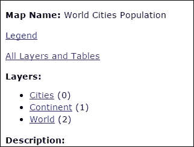
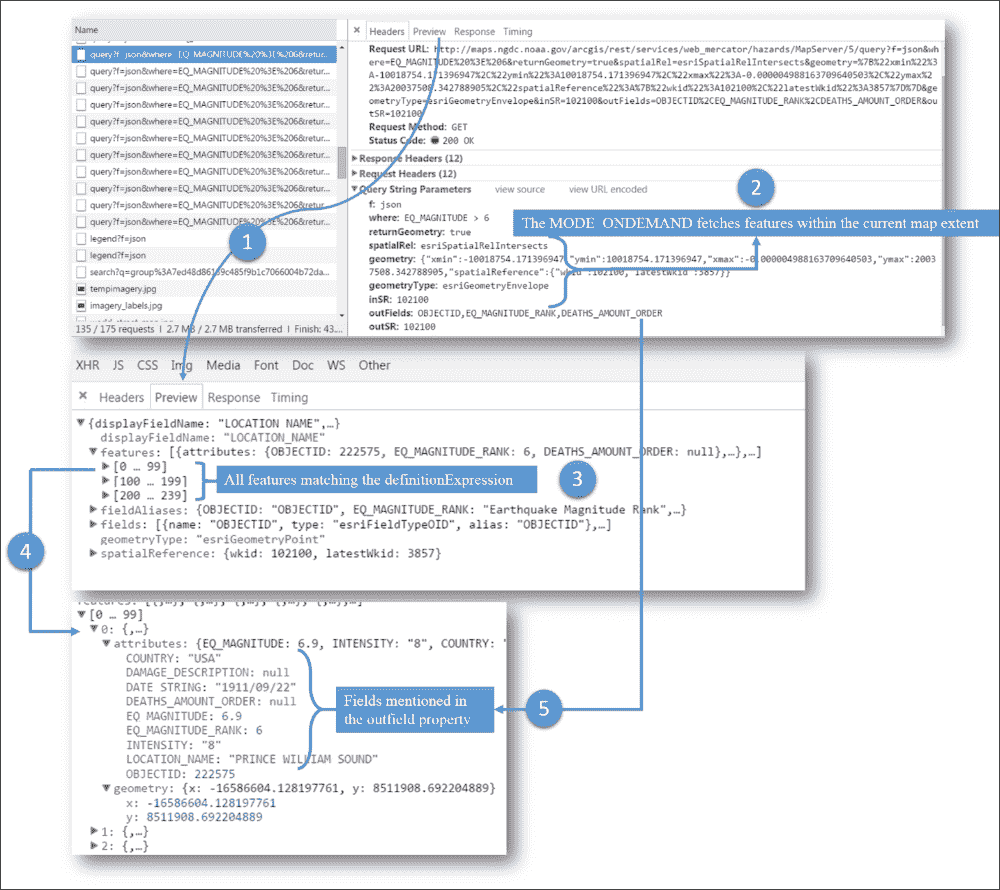
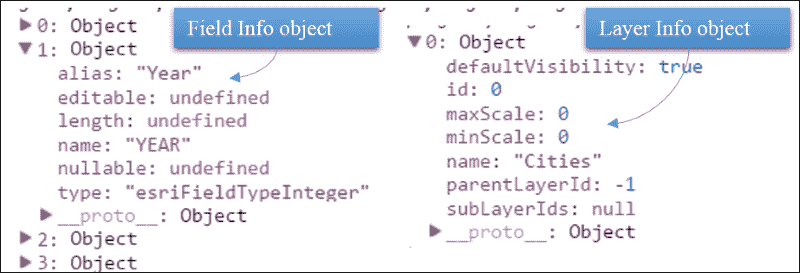
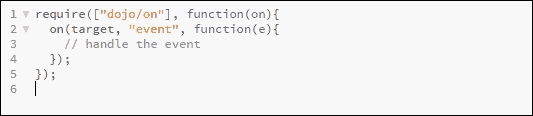

# 二、图层和小部件

组成我们的网络地图应用程序的两个基本组件是层和小部件。地图对象类似于包含所有图层的画布，用户可以与之交互，例如平移和放大地图。图层主要与特定的数据源相关联。小部件由 JavaScript 逻辑和一个 HTML 模板(如果需要用户交互的话)组成。小部件可以与地图交互，也可以独立运行。Esri 开发了许多通用小部件，这些小部件与 API 捆绑在一起。我们将在本书中讨论如何使用这些小部件。我们还将在下一章中看到如何开发定制小部件。本章设定了开发显示历史地震数据的完整网络地图应用程序的起点。随着本章的深入，我们将在以下主题中站稳脚跟:

*   应用编程接口支持的数据源
*   应用编程接口上下文中的层概念
*   层的功能分类
*   不同类型的层及其属性
*   功能层对动态地图服务对图形层
*   使用 Esri 的内置小部件

# API 支持的数据源

ArcGIS JavaScript API 是一款功能强大且灵活的客户端制图软件，为集成多种空间数据源提供支持，目前已投入生产。它还支持可视化平面文件格式，如 CSV，以及一些纬度和经度信息。

为了充分利用 ArcGIS JavaScript API 提供的功能，了解它支持的数据源列表及其公开的属性和方法非常重要。

截至 3.14 版本，ArcGIS JavaScript API 支持的数据源可大致分为以下几类:

*   ArcGIS 服务器服务
*   符合 OGC 标准的地理信息系统服务
*   平面文件格式
*   定制网络服务(最好是 REST 服务)

让我们回顾一下不同的数据源格式，了解如何在 ArcGIS JavaScript API 中获取要使用的数据的必要信息。

## 平面文件格式

应用编程接口提供本地支持来渲染平面文件格式，如 KML 和 CSV。

### KML

**锁眼标记语言** ( **KML** )是一种空间文件格式，最初由谷歌开发，目前由 OGC 维护。它支持点、线和多边形几何图形，甚至图像叠加。KML 是一个以其多功能性而闻名的 XML，但是它非常冗长，并且在谷歌地图中使用。KML 文件可以在任何文本编辑器中打开，如记事本++。

### CSV 文件

CSV 文件是一种纯文本文件格式，存储表格数据，字段值用逗号分隔。CSV 文件在单独的字段中包含经纬度信息或坐标值，如 *X* 和 *Y* 坐标。应用编程接口可以读取 CSV 文件，位置信息可以转换为指向应用编程接口上的位置。

## ArcGIS 服务器

ArcGIS Server 可用于通过网络共享空间数据。在我们的案例中，如果我们有形状文件、个人地理数据库、文件地理数据库或企业地理数据库等数据，我们可以使用 ArcGIS Server 通过网络将数据作为 REST 服务提供。ArcGIS JavaScript 能够消费这些服务并将其显示在地图上。对于其他空间格式，如 DWG，我们可以使用 ArcGIS desktop 或**要素操作引擎** ( **FME** )，这是一个用于转换为 Esri 文件格式并通过 ArcGIS Server 发布的空间 ETL 工具。

# 层次的概念

如果你学过地理信息系统的入门课程，你会熟悉地理信息系统图层相互叠加的经典图像。在应用编程接口的上下文中，层是作为 REST 端点或 JSON 对象可用的数据资源。(没错，您可以使用 JSON 字符串构建一个网络地图图层。)我们将很快处理这些地图图层的来源和类型，但在此之前，让我们列出任何地图图层最重要的注意事项:

*   图层是任何数据源的容器对象
*   可以使用图层对象将数据添加到地图对象中
*   Layers form a stack architecture—the first layer added is at the bottom

    标准是底部有*底图图层*

*   The map object has a special in-built layer to contain all map graphics

    这被称为*图形层*，位于顶层*始终*

*   所有其他功能层都添加在中间
*   可以随时打开或关闭图层的可见性

## 向地图添加图层

在处理不同类型的图层之前，我们将讨论如何向地图对象添加任何图层，因为任何图层类型的过程都是一样的，而且非常简单。在下图中，我们可以看到所有类型的图层:


有两种方法可以向地图对象添加任何图层。假设`prjMap`是定义的地图对象的名称，我们需要增加一个图层；您可以采用以下两种方法之一:

*   **方法 1** :

    ```js
    //Method 1
    prjMap.addLayer(layer1);
    /*layer1 is the layer object we would like to add to the map. */
    ```

*   **方法二** :

    ```js
    //Method 2
    prjMap.addLayers([layer1]);
    ```

就这么简单！第二种方法是首选方法，因为有些小部件或功能必须等到地图中的所有图层都已加载。使用第二种方法将使我们能够使用一个事件处理程序，该程序在所有层都被加载后被激发。我们将在本章的最后讨论这些事件处理程序。

## 蛋鸡的功能分类

在功能上，可以添加到地图中的不同类型的图层可以分类如下:

*   底图或 Tiledmap 图层
*   功能层
*   图形层

让我们单独讨论其中的每一个。

### 底图图层

底图图层是可以作为参考背景图的图层。通常，卫星图像、地形图(显示海拔的地图)或街道地图都可以达到这个目的。底图通常是缓存的图像切片。这意味着底图是一种静态资源。由于它们是静态的，并且用作图像切片，因此我们无法与底图上的要素进行交互(如查询或选择)。因为这是底图，所以这是最底层的图层，也是首先添加到地图中的图层。

现在，应用编程接口提供了不同的方法向地图添加`basemap`属性:

*   将`basemap`属性添加到地图对象:

    ```js
    var map = new Map("mapDiv", {basemap: "streets"});
    ```

*   Use the in-built `basemap` gallery provided by the API.

    这允许我们在多个底图之间切换，例如卫星图像、街道地图、地形图、国家地理地图、开放街道地图等。

*   通过向地图对象添加 Tiledmap 图层来创建您自己的底图(我们将很快讨论 Tiledmap 图层)。

下载名为`B04959_02_CODE_01`的项目文件夹并打开`index.html`来感受一下底图图库小部件:


### 功能层

功能图层显示所有最近的变化，因此本质上是动态的，而不是底图或缓存切片图层的相对静态。功能层是您可以与之交互的层。该应用编程接口提供了在大多数这些层上执行不同操作的选项，例如:

*   选择功能
*   检索要素的属性和几何
*   对数据执行查询
*   渲染要素(使用不同的符号、颜色、宽度和其他图形属性对要素应用样式)
*   允许对要素进行创建、更新和删除(CRUD)操作

基于底图的空间参考，功能图层将被*动态重新投影*。这意味着功能图层可能与底图属于不同的空间参考系统，并且它们仍将与底图对齐，因为应用编程接口将从服务器请求功能图层的重新投影数据。有不同类型的功能层，如动态层和要素层，这将很快得到处理。

### 图形层

图形图层在操作方面的通用性最大。在这里，您可以向 attributes 对象添加任意多的数据。您可以分配或修改其几何图形(使用**绘制**工具栏或甚至以编程方式)，添加符号系统，查询它(对于功能图层，查询或更新操作可能被禁用)，删除它，使用它从功能图层中选择要素，或者仅将其用作标记工具。但是图形层也有最短的寿命，因为它不会在一个会话后持续——这些只是存储在客户端。而由于的这些属性，让图形层作为最顶层是有意义的，不是吗？

### 注

开发人员在处理图形图层时，需要小心输入数据源的空间参考。`esri/geometry/webMercatorUtils`是一个方便的模块，可以让我们将网络墨卡托坐标转换为地理坐标，反之亦然。

## 层数类型

我们瞥见了层的功能分类。该应用编程接口提供了大量模块来加载来自不同数据源的层，这些层通常属于我们研究的功能分类之一。我们将回顾 API 提供的一些最重要的层类型及其公开的方法和属性。

### ArcGIS Tiledmap 服务层

这是由 ArcGIS Server 提供的缓存 Tiledmap 图层:

<colgroup><col style="text-align: left"> <col style="text-align: left"></colgroup> 
| 

名字

 | 

价值

 |
| --- | --- |
| 模块名 | `esri/layers/ArcGISTiledMapServiceLayer` |
| 数据源类型 | `ArcGIS REST Service` |
| 图层类型 | `BaseMap /Tiled Cache Layer` |
| 响应类型 | `Cached image tiles` |
| 构造器 | `new ArcGISTiledMapServiceLayer(url, options?)` |
| 首选别名 | `ArcGISTiledMapServiceLayer` |

### 类型

**首选别名**

首选别名由 API 提供，作为代码约定的一部分，可通过[https://developers . ArcGIS . com/JavaScript/jsapi/argument _ alias . html](https://developers.arcgis.com/javascript/jsapi/argument_aliases.html)访问。

既然 Esri 已经提供了许多选项，为什么我们还需要使用不同的底图呢？我们从美国国家海洋和大气管理局找到了一个美观且视觉信息丰富的瓷砖地图服务，显示了世界地形和水深(海底高差)的彩色阴影地形:


您可以考虑将其用作底图来显示世界范围内的任何现象，如危险或地震。我们该怎么做？如果您查看这个模块的构造函数，它会查找一个必需的`URL`参数和一个可选的`options`参数。

我们刚才说的 NOAA 服务的网址是[。](http://maps.ngdc.noaa.gov/arcgis/rest/services/etopo1/MapServer)

现在，让我们试着把这个消费为`ArcGISTiledMapLayer`(代码参考:`B04959_02_CODE1.html`):

```js
require([
"esri/map",
"esri/layers/ArcGISTiledMapServiceLayer",
"dojo/domReady!"
    ], function (
            Map, ArcGISTiledMapServiceLayer
        ) {
var map = new Map("mapDiv");
vartileMap = new ArcGISTiledMapServiceLayer("http://maps.ngdc.noaa.gov/arcgis/rest/services/etopo1/MapServer");
map.addLayer(tileMap);
        });
```

这就是在屏幕上看到美丽地图所需的全部代码。

Tiledmap 服务的服务目录为我们提供了很多有用的信息，开发人员在应用程序中使用 Tiledmap 服务之前应该考虑这些信息。我们来查阅一下前面提到的`ArcGISTiledMapServiceLayer`的服务目录。在下一节提供的服务目录截图中，开发人员可以理解关于数据源的许多信息:

*   空间参考
*   TileInfo
*   初始范围和完整范围
*   最小刻度和最大刻度
*   构成瓷砖的层

### 空间参考

Tiledmap 服务或底图的**空间参考** 是开发人员在编码的初始阶段忽略的重要属性之一。Tiledmap 服务的**空间参考**被设置为整个地图的空间参考。操作图层，如动态地图服务和要素图层，添加到符合此条件的地图中的是**空间参考**，无论它们各自的空间参考是什么。


#### TileInfo

**TileInfo** 提供了关于跟随`TiledMapService`的平铺方案的信息。**详细等级**可用于设置地图的缩放范围。

#### 范围和比例信息

范围和比例信息为我们提供了关于图块可见范围的信息。

从项目文件夹`B04959_02_CODE_02`下载完整代码，看到你漂亮的 Tiledmap 在行动。

### ArcGIS 动态地图服务层

顾名思义，这个模块是来自 ArcGIS Server REST 应用编程接口的动态托管资源:

<colgroup><col style="text-align: left"> <col style="text-align: left"></colgroup> 
| 

名称

 | 

价值观念

 |
| --- | --- |
| 模块名 | `esri/layers/ArcGISDynamicMapServiceLayer` |
| 数据源类型 | `ArcGIS REST Service` |
| 图层类型 | `Functional Layer` |
| 响应类型 | `Dynamically generated images` |
| 构造器 | `new ArcGISDynamicMapServiceLayer(url, options?)` |

动态地图图层实际上代表非缓存地图服务公开的所有数据。出于同样的原因，动态地图图层是一种复合图层，因为地图服务通常有多个图层。

我们一会儿就知道这意味着什么。我们将参考服务目录(是的，这是当我们导航到地图服务 URL 时出现的界面的奇特术语)。

在浏览器中打开某个地图服务的此 URL—[http://maps . ngdc . NOAA . gov/ArcGIS/rest/services/sampleworld city/MapServer](http://maps.ngdc.noaa.gov/arcgis/rest/services/SampleWorldCities/MapServer)。

您将能够看到地图服务公开的所有数据图层。因此，当您使用此地图服务时，所有数据都将作为单个 DynamicMapService 图层的一部分显示在地图上:



### 注

如果您看不到前面显示的任何服务的服务目录，这并不意味着该服务处于离线状态；生产机器上的服务浏览可能已关闭。

确保通过附加名为`f`的查询参数来尝试该网址，该参数的值为`json`，例如`{{url}}?f=json`。

之前，我们讨论了如何将`ArcGISTiledMapServiceLayer`添加到地图中。以下代码在现有平铺图层上添加了`ArcGISDynamicMapService`图层:

```js
require(["esri/map",
"esri/layers/ArcGISTiledMapServiceLayer",
"esri/layers/ArcGISDynamicMapServiceLayer",
"dojo/domReady!"
],
function (
Map,
ArcGISTiledMapServiceLayer,
ArcGISDynamicMapServiceLayer
) {
var map = new Map("mapDiv");
varshadedTiledLayer = new ArcGISTiledMapServiceLayer('http://maps.ngdc.noaa.gov/arcgis/rest/services/web_mercator/etopo1_hillshade/MapServer');

varworldCities = new ArcGISDynamicMapServiceLayer("http://maps.ngdc.noaa.gov/arcgis/rest/services/SampleWorldCities/MapServer");

map.addLayers([shadedTiledLayer, worldCities]);
    });
```

现在，如果你观察到的话，`ArcGISDynamicMapServiceLayer`和`ArcGISTiledMapServiceLayer`都使用地图服务。那么，我们实际上如何知道哪个地图服务应该被用作 Tiledmap 服务，或者哪个可以被用作 dynamic map 服务呢？你可能猜对了。服务目录就是答案。您必须在地图服务中查找服务目录中的特定标题，以区分缓存切片地图服务和非缓存地图服务。这叫 **TileInfo** 。

### 注

区分缓存切片地图服务和非缓存地图服务的属性称为切片信息。

TileInfo 有详细信息级别的信息。细节级别决定了地图显示的离散比例级别。这些细节级别也称为缩放级别，地图缩放控件中的标记与这些缩放级别相对应。

现在，Tiledmap 服务和 DynamicMapService 响应的服务方式有了相似之处。两者都作为图像。虽然 Tiledmap 服务为每个范围提供多个图像切片，但 DynamicMapService 只为给定范围提供一个图像。

如果您注意到您的**网络**标签，将有一个名为`export`的`GET`请求方法附加到我们声明的动态地图服务中。这是从服务器获取动态地图图像的`GET`请求:


观察前面`GET`请求的查询字符串中的名称-值对。您会注意到以下字段名:

*   `dpi`字段名以每英寸点数定义图像的分辨率
*   `transparent`字段名定义响应图像是透明的，因此可以查看背景底图
*   `format` fieldname 的值为`png`，这是响应图像的格式
*   `bbox`字段名的值请求请求图像的范围(由四个坐标组成— `Xmin`、`Ymin`、`Xmax`和`Ymax`
*   `bboxSR`字段名的值定义了定义`bbox`坐标的空间参考，`imageSR`定义了请求响应图像的空间参考
*   The value last fieldname called `f` defines the format of the response; it's an `image` of course

    ### 注

    **运动**

    在前面的`GET`请求中，将`f`字段名的值从`image`更改为`html`，看看您得到了什么。

如果你查看 API 页面，你会发现这个模块提供了很多属性和方法。下表显示了一些最重要的方法:

<colgroup><col style="text-align: left"> <col style="text-align: left"></colgroup> 
| 

方法名

 | 

描述

 |
| --- | --- |
| `exportMapImage(imageParameters?, callback_function?)` | 这将使用`imageParameters`对象指定的值导出地图。回调函数事件返回地图图像。 |
| `refresh()` | 这将通过向服务器发出新请求来刷新地图。 |
| `setDPI(dotsPerInch)` | 这允许为导出的地图设置以每英寸点数为单位的图像分辨率。 |
| `setLayerDefinitions(stringArray of Layerdefintions)` | 这使我们能够过滤动态地图服务显示的数据。 |
| `setVisibleLayers(Array_of_LayerIds)` | 这使得只有其标识作为参数传入的图层才可见。 |

现在，确保您有以下要求来显示动态地图服务:

*   仅显示`Cities`层
*   为动态地图图像提供 0.5 的透明度
*   仅显示人口超过 100 万的城市

以下代码片段指导您如何实现这一点(代码参考:`B04959_02_CODE2.html`):

```js
varworldCities = new ArcGISDynamicMapServiceLayer("http://maps.ngdc.noaa.gov/arcgis/rest/services/SampleWorldCities/MapServer", {
"id": "worldCities",
"opacity": 0.5,
"showAttribution": false
});
worldCities.setVisibleLayers([0]);
worldCities.setLayerDefinitions(["POP > 1000000"]);

```

### 注

当任何地图对象的选项对象中的`showAttribution`属性设置为`true`时，数据源的所有属性都显示在地图的右下角。

`setLayerDefinitions()`方法接受一个由`where`子句组成的字符串数组。在传递动态地图服务的图层定义时，请记住以下几点。

定义表达式(`where`子句)的索引应该与应用表达式的图层的索引相匹配。例如，如果在前面的地图服务中`Cities`图层的索引为`5`，则图层定义如下所示:

```js
VarlayerDefintion = [];
layerDefinition[5] = "POP > 1000000";
worldCities.setLayerDefinitions(layerDefinition);
```

一旦满足这些条件，生成的地图将如下所示。半透明的蓝色圆点代表人口超过一百万的世界城市:


### 要素图层

要素图层是具有几何类型的地图服务的单个图层。地图服务中的单个图层可以是要素图层，甚至是栅格图层；例如，[http://sample server 4 . ArcGIS online . com/ArcGIS/rest/services/Elevation/ESRI _ Elevation _ World/MapServer/1](http://sampleserver4.arcgisonline.com/ArcGIS/rest/services/Elevation/ESRI_Elevation_World/MapServer/1)和[http://maps . ngdc . NOAA . gov/ArcGIS/rest/services/web _ mercator/危害/MapServer/0](http://maps.ngdc.noaa.gov/arcgis/rest/services/web_mercator/hazards/MapServer/0) 都是地图服务的单个图层，但前者 URL 是栅格图层资源，后者是要素图层资源。栅格图层在服务目录中没有几何类型属性，而要素图层具有点、多点、折线或面几何类型之一。

要素图层是一个非常通用的实体，因为它支持高级查询、选择、渲染，有时甚至支持编辑功能。要素图层(或栅格图层)使用其所属地图服务中的索引进行识别:

<colgroup><col style="text-align: left"> <col style="text-align: left"></colgroup> 
| 

名称

 | 

价值观念

 |
| --- | --- |
| 模块名 | `esri/layers/FeatureLayer` |
| 数据源类型 | `ArcGIS REST Service` |
| 图层类型 | `Functional Layer` |
| 响应类型 | `Feature Collection (Feature has geometry, attribute and symbology)` |
| 构造器 | `new FeatureLayer(url, options?)` |

向地图添加要素图层与添加 DynamicMapService 图层或 Tiledmap 服务图层相同:

```js
define([
"esri/map",
"esri/layers/FeatureLayer"
],
function(
Map,
FeatureLayer
){
var map = new Map("mapDiv");
var featureLayer1 = new FeatureLayer(featureLayer1URL);
var featureLayer2 = new FeatureLayer(featureLayer2URL);
map.addLayers([featureLayer1, featureLayer2]);
});
```

#### 要素图层构造器

`FeatureLayer`构造函数有两个参数——一个`FeatureLayer`网址和一个可选的`options`对象。`options`对象提供了一系列选项来配置`FeatureLayer`构造器。其中最重要的`options`属性被命名为`mode`。

`mode`属性定义了要素图层在地图上的渲染方式。由于要素图层流传输要素的实际几何，与地图服务(提供动态生成的图像)或 Tiledmap 服务(仅提供预渲染的缓存切片)不同，在地图上渲染要素图层需要考虑一些性能问题。可以通过四种模式渲染要素图层。这四种模式是由应用编程接口作为常量提供的数值。如果要素图层模块的回调函数别名是要素图层，可以使用以下装饰访问四种模式:

*   `FeatureLayer.MODE_SNAPSHOT`
    *   这个一次从服务器获取所有特性并驻留在客户机上——一次性开销
    *   当应用额外的过滤器时，这将被更新
*   `FeatureLayer.MODE_ONDEMAND`
    *   根据需要获取特征
    *   连续的小块开销
    *   默认`MODE`
*   `FeatureLayer.MODE_SELECTION`
    *   仅显示使用`selectFeatures()`方法选择的特征
*   `FeatureLayer.MODE_AUTO`
    *   此在`MODE_SNAPSHOT`或`MODE_ONDEMAND`之间切换(此选择由 API 做出)
    *   两全其美

我们将尝试在地图上添加一个历史地震的`FeatureLayer`构造器。提供这些要素图层的地图服务可在[http://maps . ngdc . NOAA . gov/ArcGIS/rest/services/web _ mercator/hards/MapServer](http://maps.ngdc.noaa.gov/arcgis/rest/services/web_mercator/hazards/MapServer)上找到。

地震层是地图服务的第五层。但是您也可以尝试其他要素图层。下面的代码片段允许您向地图对象添加要素图层(代码参考:`B04959_02_CODE3.html`):

```js
define(["esri/map",
"esri/layers/FeatureLayer",
"dojo/domReady!"],
function (Map, FeatureLayer
) {
varearthQuakeLayerURL = 'http://maps.ngdc.noaa.gov/arcgis/rest/services/web_mercator/hazards/MapServer/5';
earthQuakeLayer = new FeatureLayer(earthQuakeLayerURL, {
id: "Earthquake Layer",
outFields : ["EQ_MAGNITUDE", "INTENSITY", "COUNTRY", "LOCATION_NAME", "DAMAGE_DESCRIPTION", "DATE_STRING" ],
opacity: 0.5,
mode: FeatureLayer.MODE_ONDEMAND,
definitionExpression: "EQ_MAGNITUDE > 6",
});

map.addLayers([earthQuakeLayer]);
});
```

前面的代码可以解释如下:

*   `id`属性为要素图层指定一个标识
*   `opacity`属性允许我们定义地图的不透明度
*   `definitionExpression`属性是一个`where`子句，允许我们过滤地图上显示的要素
*   一个`outFields`属性允许我们定义由要素图层提供的字段

这是叠加在 DynamicMapService 层和 Tiledmap 服务层上的`FeatureLayer`的截图。半透明的彩色圆圈代表曾经发生过里氏 6 级以上地震的地点:


当您平移地图或缩放地图时，会提取要素并触发相应的`GET`请求，该请求会根据需要提取要素*。如果您在加载要素图层后立即打开开发人员控制台中的**网络**选项卡，您将能够理解许多事情:*

 **   API 使用要素图层的`query`方法获取要素。
*   在查询字符串中，会有查询参数，如`geometry`、`spatialRel`、`geometryType`和`inSR`，它们定义了需要提取特征的范围。查询字符串中还可以找到其他`FeatureLayer`构造函数选项，如`outFields`和`where`子句(对应于`definitionExpression`)。
*   If you click on the **Preview** or **Response** tab, you will notice that the `GET` request fetches an array of features. Each feature has an attributes object and a geometry object. The attributes object will contain the field names mentioned in the `outFields` array and the corresponding field value of the particular feature:

    

我们将在下一章讨论如何查询和选择要素图层中的要素。从现在开始，我们最好了解以下方法对要素图层对象的作用:

<colgroup><col style="text-align: left"> <col style="text-align: left"></colgroup> 
| 

方法

 | 

描述

 |
| --- | --- |
| `clear()` | 清除所有图形 |
| `clearSelection()` | 清除当前选择 |
| `getSelectedFeatures()` | 获取当前选定的功能 |
| `hide()` | 将图层的可见性设置为`false` |
| `isEditable()` | 如果`FeatureLayer`可编辑，则返回真 |
| `setInfoTemplate(infoTemplate)` | 指定或更改图层的`info`模板 |
| `setOpacity(opacity)` | 图层的初始不透明度(其中`1`不透明，`0`透明) |
| `show()` | 将图层的可见性设置为`true` |

#### 信息模板

信息模板提供了一种简单的方法，当我们点击一个特性时，它会显示该特性的信息。我们将在下一章详细讨论信息模板。


### 图形层

我们已经对图形层进行了一些讨论。我们知道，默认情况下，地图对象包含一个图形层，可以使用地图对象的`graphics`属性来引用它。我们还可以创建自己的图形图层，并将其添加到地图中。但是，地图提供的默认图形图层仍保留在顶部。

让我们更多地了解图形层和添加到图形层的`Graphic`对象。图形层是`Graphic`对象的容器。

一个`Graphic`对象具有以下值:

*   几何学
*   标志
*   属性
*   信息模板

#### 几何图形

几何图形将具有类型(点、多点、折线、多边形和范围)、空间参考和构成几何图形的坐标。

#### 符号

符号是一个复杂得多的物体，因为它与它所象征的几何图形相关联。此外，符号的样式由用于填充符号的颜色或图片以及符号的大小来定义。

让我们回顾一个片段来更好地理解这一点。这是构造多边形符号的简单片段:


#### 属性

图形的属性是存储图形信息的键值对对象。

#### 信息模板

`InfoTemplate` 是当我们点击一个图形时，可以用来显示该图形相关信息的 HTML 模板。

## 地图和图层属性

图层之间有很多共同的属性，给我们提供了图层的相关信息。例如，`fullExtent`、`id`、`infoTemplates`、`initialExtent`、`layerInfos`、`maxRecordCount`、`maxScale`、`minScale`、`opacity`、`spatialReference`、`units`、`url`和`visibleLayers`等属性对于动态地图图层以及 Tiledmap 图层是相同的，而`dynamicLayerInfos`和`layerDefinitions`等属性是动态地图服务图层特有的。那么，`tileInfo`属性是不是特定于 Tiledmap 层的？

尝试通过将属性记录到控制台来探索这些属性。例如，如果需要打印要素图层中的字段列表，请使用要素图层的`fields`属性。

下面是一个代码片段，它将关于要素图层和 DynamicMapService 图层的某些信息记录到控制台(代码参考:`B04959_02_CODE5.html`):

```js
on(map, "layers-add-result", function (evt) {
console.log("1.", earthQuakeLayer.id);
console.log("2.", earthQuakeLayer.fields);
console.log("3.", earthQuakeLayer.geometryType);
console.log("4.", earthQuakeLayer.maxRecordCount);

console.log("5.", worldCities.layerInfos);
});
```

以下是您将在控制台中获得的屏幕输出:

```js
1\. Earthquake Layer
2\. [Object,
Object,
. . .
Object]
 3\. esriGeometryPoint
4\. 1000
5\. [Object, Object, Object]

```

`Featurelayer.fields`返回字段对象的数组。每个对象都包含诸如`alias`、`length`、`name`、`nullable`和`type`等属性。`DynamicLayer.layerInfos`返回`layerInfo`对象的数组。`layerInfo`对象提供关于图层的信息:



## 地图和图层事件

改变地图的范围，给地图增加一个图层，给地图增加一组图层，甚至点击地图或者鼠标 API 都有一个事件处理程序。在使用事件时，让我们坚持使用 dojo 的 on 模块来处理事件。使用 dojo 的`"dojo/on"`模块找到处理事件的原型:



<colgroup><col style="text-align: left"> <col style="text-align: left"> <col style="text-align: left"></colgroup> 
| 

目标

 | 

事件

 | 

描述

 |
| --- | --- | --- |
| 地图 | `extent-change` | 当地图范围改变时激发 |
| 地图 | `layers-add-result` | 加载所有添加到地图的图层后，使用`map.addLayers()`方法时触发 |
| 地图 | `load` | 这个很明显 |
| 地图 | `basemap-change` |   |
| 要素图层 | `selection-complete` | 从要素图层中选择要素后 |

在上面的代码片段中，记录了某些层属性，您可能已经注意到整个代码片段包含在一个`on`语句中:

```js
on(map, "layers-add-result", function (evt) {
console.log("1.", earthQuakeLayer.id);
...
console.log("5.", worldCities.layerInfos);
});
```

我们需要打印出`on`事件中所有与层相关的属性，因为我们需要等到所有的层都被加载，否则我们将得到大多数属性的未定义。这个名为`layers-add-result`的特殊事件只有在添加到地图中的所有图层数组被加载后才会被触发。

# 使用 Esri 小部件——精灵之灯

小部件是道场的基石。小部件是可以在 dojo 中构建、配置和扩展以完成特定任务的 UI 组件。因此，当有人向我们提供一个小部件来完成我们需要完成的任务时，我们要做的就是对它进行一点配置，并向它提供小部件应该驻留的容器节点引用。

因此，好消息是 Esri 为我们提供了内置的小部件，可以完成许多事情，例如查询要素、地理编码地址(将文本地址转换为地图上的位置)、添加小部件以显示地图图例、添加小部件以搜索属性，甚至添加小部件以在多个底图之间切换。所有 Esri 构建的小部件都可以位于 API 参考页面目录部分的`esri/dijits`下。

## BaseMapGallery 小部件

嗯，你对这个小部件的存在并不感到惊讶，对吗？在本章开头，当我们处理`TiledMapLayers`时，我们给了你一个提示。底图图层小部件为我们提供了一个小部件，通过该小部件，我们可以从底图图库切换底图。请参见以下将底图集成到我们的应用程序中的原型代码(代码参考:`B04959_02_CODE6`):

```js
require(["esri/map",
"esri/dijit/BasemapGallery"], function (Map, BasemapGallery){
varbasemapGallery = new BasemapGallery({
showArcGISBasemaps: true,
map: map
        }, "basemapGalleryDiv");
});
```

## 传说小部件

一个地图图例列出了地图中的图层以及所有图层使用的符号系统。我们自己构建一个传奇需要获得`layerinfos`和`drawinginfos`，并将它们列在一个`div`中——这个过程听起来很痛苦。幸运的是，Esri 为我们提供了`dijit`(可能是道场和小部件的组合体)来构建传奇:


我们使用以下代码启动**传奇**小部件(代码参考:`B04959_02_CODE6`)

```js
require(["esri/map",
"esri/dijit/Legend"],  function (Map, Legend){
    on(map, "layers-add-result", function (evt) {
varlegendDijit = new Legend({
map: map,
            }, "legendDiv");
legendDijit.startup();
        });
});
```

# 总结

我们在这一章中谈了很多。我们试图确定将数据添加到地图中的过程。我们确定了数据源，如 ArcGIS Server 服务、OGC 数据、CSV、KML 等。然后，我们介绍了提供的 API 模块，这些模块支持三个主要的 ArcGIS REST 服务数据源的显示和进一步操作，即 ArcGIS Tiledmap 服务层、ArcGIS dynamic map 服务层和要素层。您还学习了如何实例化这些层，以及如何导航它们的属性和事件。我们还处理了一种特殊的图层，即图形图层，它是地图中最顶层的图层，用作地图中所有图形的容器对象。我们体验了 Esri 提供的大量内置小部件。在下一章中，我们将深入研究空间查询的编写和结果的检索。您还将学习如何使用几何服务和几何引擎来处理几何操作。*