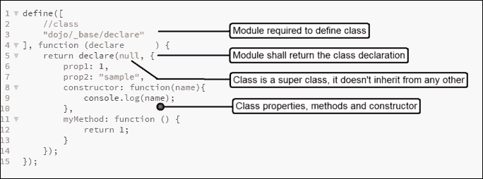
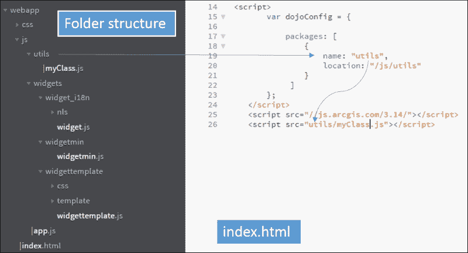
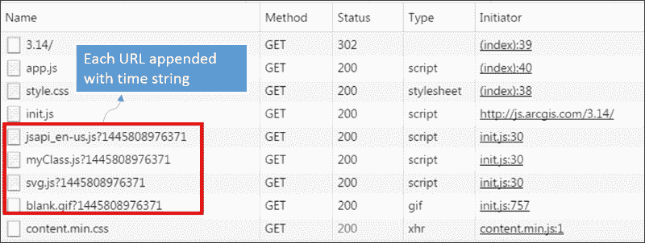
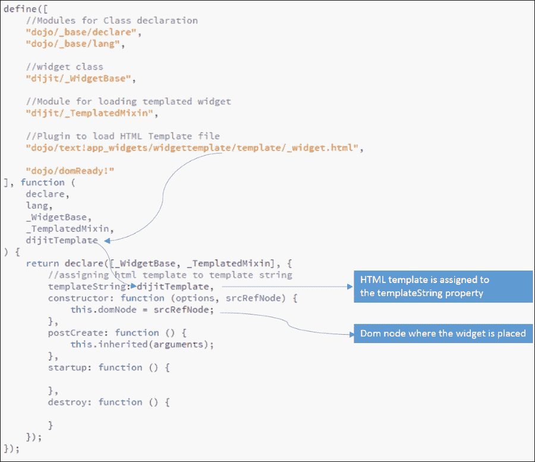
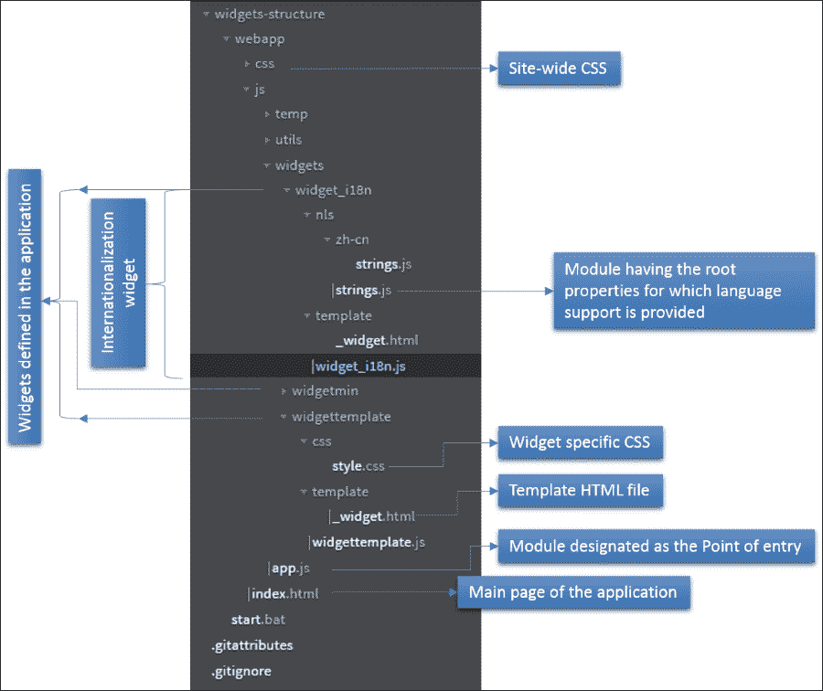
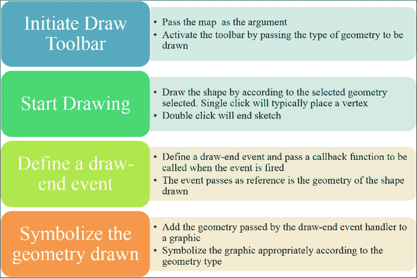
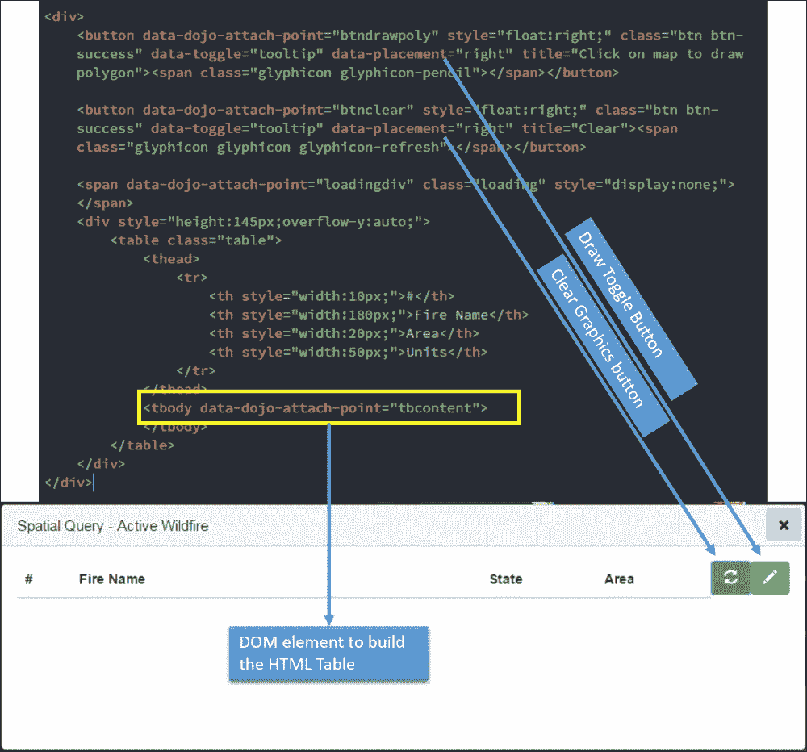
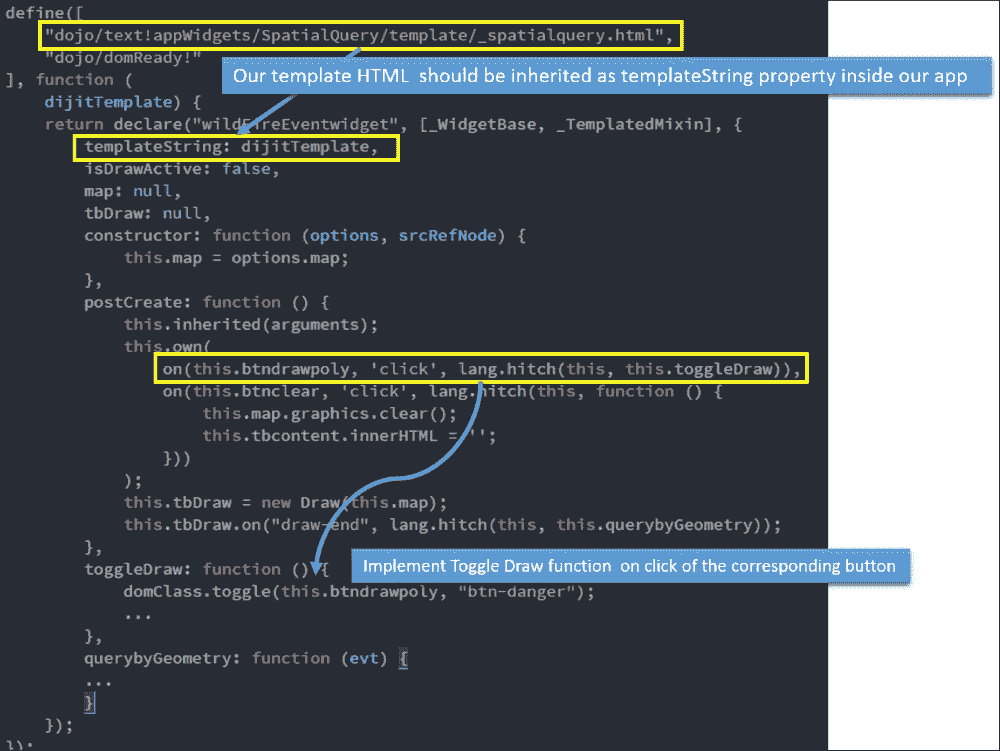
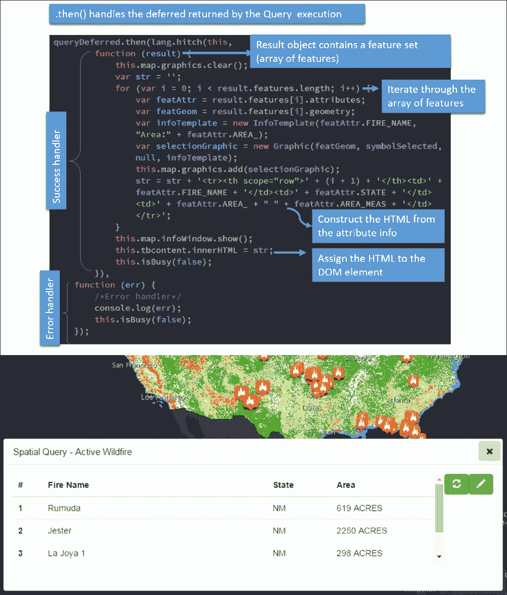

# 第四章。构建自定义小部件

本章的主要目标是开发一个定制的小部件，它可以执行空间查询并在一个简单的 HTML 表格中显示结果。在构建自定义小部件的过程中，您将了解以下主题:

*   如何使用 dojo 创建一个简单的类
*   如何全局配置 dojo
*   dojo 小部件的生命周期是什么
*   如何创建模板小部件
*   如何为国际化提供支持
*   如何组织道场代码
*   绘图工具栏如何工作
*   如何使用本章中讨论的所有功能构建自定义小部件

# 创建一个简单的类

Dojo 类提供了一种继承和扩展其他模块的方法，以使用模板和创建小部件。dojo 中的类驻留在模块中，模块返回类声明。要在模块内声明类，需要加载一个名为`dojo/_base/declare`的模块，为声明类提供支持。

下面的截图显示了一个简单的 dojo 类声明:



在这张截图中，`declare`是`dojo/_base/declare`模块的回调函数装饰。类声明接受三个参数:*类名*、*超类*和*属性*。

类名参数是可选的。当提供类名字符串时，声明被称为名为类的 **。当它被省略时，就像我们的例子一样，它被称为一个 **匿名类**。我们将继续使用匿名类一段时间，因为命名类只能在特定条件下使用。**

超类是我们想要扩展的模块或者模块数组。如果超类参数为空(如我们的代码片段)，这意味着我们的类声明本身就是一个超类。

类声明中的第三个参数是类属性。我们可以在这里定义类构造函数、其他类属性和类方法。

## 配置道场

道场有一个名为`dojoConfig`的全局对象，保存所有配置参数。我们可以修改`dojoConfig`对象，为 dojo 工具包的各个方面配置选项和默认行为。

`dojoConfig`对象允许我们定义在 web 应用程序中定义的自定义模块的位置，并用包名对其进行标记。因此，当我们需要加载这些自定义模块时，我们可以使用包名来引用文件夹位置。

### 注

引用 Esri JS API 之前必须先声明`dojoConfig`对象。



还有、`parseOnLoad`、`waitSeconds`、`cacheBust`等其他配置选项。有关`dojoConfig`主题的详细信息，请参考位于[https://dojotolkit . org/documents/tutorials/1.10/dojo _ config/](https://dojotoolkit.org/documentation/tutorials/1.10/dojo_config/)的 Dojo 工具包文档。

*   `async`选项定义了是否应该异步加载 dojo 内核。推荐值为`true`。
*   `locale`选项允许我们覆盖浏览器提供给 dojo 的默认语言。这将帮助我们为不同的目标区域开发应用程序，并使用 dojo 的`i18n`模块测试我们的小部件的国际化支持。
*   `cacheBust`选项是一个非常有用的选项，当配置为`true`时，会将时间字符串附加到来自模块的每个 URL，从而避免模块缓存。

让我们看看这些选项对我们的效果如何:

```js
<script>
        var dojoConfig = {
            has: {
                "dojo-debug-messages": true
            },
            parseOnLoad: false,
            locale: 'en-us',
            async: true,  
            cacheBust: true,
            packages: [
                {
                    name: "widgets",
                    location: "/js/widgets"
            },
                {
                    name: "utils", 
                    location: "/js/utils"
                }
         ]
        };
    </script>
    <script src="//js.arcgis.com/3.14/"></script>
    <script src="js/app.js"></script>
```



在 dojoConfig 对象中将 cacheBust 配置为 True 的效果

# 开发独立的小部件

开发独立小部件是在道场编写类的主要目的。Dojo 专门为我们提供了一个支持小部件开发的模块:`dijit/_WidgetBase`。我们还需要其他辅助模块，如`dijit`模板模块、dojo 解析和 dojo 国际化模块，以在 web 应用程序中开发一个成熟的小部件。

与`WidgetBase`模块相关的关键方面是小部件生命周期的概念。小部件生命周期为我们提供了在小部件的不同阶段工作的方法，也就是说，从小部件的初始化，到其`dom`节点被应用程序完全加载和利用的阶段，直到小部件的销毁。

这个模块应该作为类声明中的超类数组传入。下面是一个基本小部件的片段:

```js
define([
    //class
    "dojo/_base/declare",

    //widgit class
    "dijit/_WidgetBase",

    "dojo/domReady!"
], function (
    declare,
    _WidgetBase
) {
 return declare([_WidgetBase], {
/*Class declaration inherits "dijit/_WidgetBase" module*/

        constructor: function () {}
    });
});
```

## 迪吉特的生命周期

`_WidgetBase`选项提供了程序流将按特定顺序执行的几种方法。以下信息图显示了按顺序执行的一些最重要的方法:


小部件生命周期信息图

前面的图可以描述如下:

*   **构造器**:这个是小部件实例化时调用的第一个方法。`constructor`函数可以用作名为`domNode`的特殊属性。这可以包含对将放置小部件的`domNode`的引用值。`constructor`函数的第一个参数将是一个`options`对象，我们可以将任何想要发送到小部件的对象值发送到该对象:

    ```js
    constructor: function (options, srcRefNode) {
                this.domNode = srcRefNode;
            }
    ```

*   **后期创建**:这个方法是在小部件的所有属性都执行完之后执行的。这里将定义小部件的所有事件处理程序。应该在`postCreate()`方法中添加一行特定的代码，以便在`WidgetBase`中所做的所有定义都能被正确继承。在下面的代码片段中，突出显示了特定的代码行:

    ```js
    postCreate: function(){
                this.inherited(arguments);
            }
    ```

*   **postCreate()** :这个法也是举办特殊`this.own()`法的合适地点。此方法中定义的事件处理程序将在小部件实例被销毁时释放事件处理程序。
*   **启动**:这个方法是在 dom 节点构造好之后触发的。因此，对 dom 节点的任何修改都将在这里完成。这是从外部调用小部件来执行的方法。

## 创建模板化小部件

模板化小部件允许开发人员在运行时将一个 HTML 文件作为模板字符串加载。所有特定于小部件的 dom 节点都应该在这个 HTML 模板中定义。Dojo 提供了另外两个模块，使我们使用模板的体验更容易、更高效。这些模块被命名为`dijit/_TemplatedMixin`和`dijit/_WidgetsInTemplateMixin`。除了这两个模块，我们还需要加载一个名为`dojo/text!`的 dojo 插件，它实际上将 HTML 页面加载为模板字符串。该插件的工作方式是在`dojo/text!`中的感叹号(`!`)后附加 HTML 文件路径:

```js
    "dojo/text!app_widgets/widgettemplate/template/_widget.html"
```

类属性应该包括一个名为`templateString`的特定属性。该属性的值将是用来表示`dojo/text!<filename.html>`插件的回调函数装饰。

让我们看一个基本的代码片段，它涵盖了前面讨论的所有主题，并试图开发一个模板小部件:



我们的模板文件非常无害，包含一个简单的`h1`头文件标签。`templateString`属性持有的正是这个 HTML 字符串。

`app_widgets/widgettemplate/template/_widget.html`文件的内容如下:

```js
<h1>This is Templated widget</h1>
```

现在，让我们看看如何实例化这个小部件。如前所述，我们需要在小部件中调用`startup`方法来执行这个小部件。我们将从另一个 JavaScript 文件中调用它，该文件将传递一个对放置小部件的 dom 节点的引用:


/js/widgets/app.js 的内容

该文件将从`index.html`文件调用，该文件具有名为`templatedWidgetDiv`的`dom`元素:

```js
<!DOCTYPE html>
<html>

<head>
    <meta charset="utf-8">
    <meta http-equiv="X-UA-Compatible" content="IE=edge,chrome=1">
    <title></title>
    <meta name="description" content="">
    <meta name="viewport" content="width=device-width">
    <link rel="stylesheet" type="text/css" href="css/style.css">

</head>

<body>
    <h1>Using Dojo Classes</h1>
    <div id="templatedWidgetDiv"/>
    <script>
        /* dojo config */
        var dojoConfig = {
            has: {
                "dojo-debug-messages": true
            },
            parseOnLoad: false,
            locale: 'en-us',
            async: true,  
            cacheBust: true,
            packages: [
                {
                    name: "app_widgets",
                    location: "/js/widgets"
            },
                {
                    name: "utils", 
                    location: "/js/utils"
                }
         ]
        };
    </script>
    <!--Call the esri JS API library-->
    <script src="//js.arcgis.com/3.14/"></script>
    <!--Call the /js/utils/app.js file-->
    <script src="js/app.js"></script> 
</body>

</html>
```

# Widget 文件夹结构

现在是到了讨论小部件文件夹结构的时候了。当开发大型项目时，文件夹结构是项目构建练习的重要部分，我们需要在项目本身的初始阶段定义它。我们将提供如何决定文件夹结构的一般指南。这可以修改以适合您的偏好和项目需求。

## 创建项目文件夹的指南

创建项目文件夹的指南如下图所示:


让我们详细讨论一下每一个问题。

### 创建单一入口点

我们需要不要用所有小部件实例化拥挤索引页面。如果我们能定义一个模块作为单一入口点来实例化我们需要的所有小部件，那就更好了。

我们的 HTML 页面将只包含对 JS API 和这个单点登录 JavaScript 模块的引用:

```js
    <!--Call the esri JS API library-->
    <script src="//js.arcgis.com/3.15/"></script>
    <!--Call the javaScript file which serves as the single point of entry-->
 <script src="js/app.js"></script>

```

用作单一入口点的文件内容如下:


### 定义道场配置

我们之前讨论过这个问题。`dojoConfig`对象将在索引页本身中声明。这是一个全局对象，通过加载名为`dojo/_base/config`的模块，可以在程序中的任何地方访问其值。

### 代码模块化

这是 AMD 编码模式的核心宗旨。模块化的概念意味着我们应该去耦合任何功能不同的代码。正如我们所知，dojo 模块返回一个公共可访问的对象。正如我们之前看到的，这个对象可以是一个类声明。该模块的另一种用途是，它可以用作应用程序的配置文件。

提供了一个从 dojo 模块创建的示例`config`文件，供您参考:

```js
define(function () {
    /* Private variables*/
    var baseMapUrl = "http://maps.ngdc.noaa.gov/arcgis/rest/services/web_mercator/etopo1_hillshade/MapServer";
    var NOAAMapService = "http://maps.ngdc.noaa.gov/arcgis/rest/services/web_mercator/hazards/MapServer";
    var earthquakeLayerId = 5;
    var volcanoLayerId = 6;
    /*publicly accessible object returned by the COnfig module */
    return {
        app: {
            currentVersion: "1.0.0"
        },

        // valid themes: "claro", "nihilo", "soria", "tundra", "bootstrap", "metro"
        theme: "bootstrap",

        // url to your proxy page, must be on same machine hosting you app. See proxy folder for readme.
        proxy: {
            url: "proxy/proxy.ashx",
            alwaysUseProxy: false,
            proxyRuleUrls: [NOAAMapService]
        },

        map: {

            // basemap: valid options: "streets", "satellite", "hybrid", "topo", "gray", "oceans", "national-geographic", "osm"
            defaultBasemap: "streets",
            visibleLayerId: [this.earthquakeLayerId, this.volcanoLayerId];

            earthQuakeLayerURL: this.NOAAMapService + "/" + this.earthquakeLayerId,
            volcanoLayerURL: this.NOAAMapService + "/" + this.volcanoLayerId
        }
    }
});
```

### 为国际化提供支持

定制根据用户所在地区在应用中显示的文本称为**国际化**。Dojo 提供了一个名为`dojo/i18n!`的插件来提供这种支持。当我们提到 plugin 时，它意味着它需要一个文件路径作为感叹号(`!`)之后的参数。文件路径引用了一个 JavaScript 模块，其中提到了一个名为`root`的对象，并列出了所有支持的语言环境。

例如，`dojo/i18n!app_widgets/widget_i18n/nls/strings`指的是在`app_widgets/widget_i18n/nls`文件夹中定义的`strings`模块(记住`app_widgets`是指`/js/widgets`位置的名称包)。

当前的语言环境由用户的浏览器决定。道场中的 A `locale`通常是五个字母的字符串；前两个字符代表语言，第三个字符是连字符，最后两个字符代表国家。

例如，看看以下内容:

*   `en-us`值代表英语为语言，美国为国家
*   `ja-jp`值代表日语为语言，日本为国家
*   `zh-cn`值代表简体中文为语言，中国为国家
*   The `zh-tw` value represents Simplified Chinese as the language and Taiwan as the country

    

#### 提供国际化支持的步骤

提供国际化支持的步骤如下:

1.  在小部件所在的文件夹中创建一个名为`nls`的文件夹。
2.  定义一个模块，该模块有一个名为`root`的对象，并列出`root`对象下支持的所有区域设置。比如看看下面:

    ```js
    "zh-cn" : true,
    "de-at" : true
    ```

3.  `root`对象将包含所有提供语言支持的字符串变量，例如`widgetTitle`和`description`。
4.  为每个定义的区域设置创建一个文件夹，如`zh-cn`和`de-at`。
5.  在每个`language`文件夹中创建一个与`root`模块同名的模块。
6.  新模块将包含`root`对象的所有属性。属性值将包含相应值的特定于语言的翻译。
7.  加载名为`dojo/i18n!`的模块，该模块附有根模块的路径。
8.  在`declare`构造函数中，将`i18n`模块的`callback`函数声明分配给名为`this.nls`的属性:

    ```js
    define([
        //class
        "dojo/_base/declare",
        "dojo/_base/lang",

        //widgit class
        "dijit/_WidgetBase",

        //templated widgit
        "dijit/_TemplatedMixin",

        // localization
     "dojo/i18n!app_widgets/widget_i18n/nls/strings",

        //loading template file
        "dojo/text!app_widgets/widget_i18n/template/_widget.html",

        "dojo/domReady!"
    ], function (
        declare, lang,
        _WidgetBase,
        _TemplatedMixin,
        nls,
        dijitTemplate
    ) {
        return declare([_WidgetBase, _TemplatedMixin], {
            //assigning html template to template string
            templateString: dijitTemplate,
            constructor: function (options, srcRefNode) {
                console.log('constructor called');
                // widget node
                this.domNode = srcRefNode;
     this.nls = nls;
            },
            // start widget. called by user
            startup: function () {
                console.log('startup called');
            }
        });
    });
    ```

### 小部件文件夹结构概述

让我们再次回顾一下`widget`文件夹结构，这样我们就可以在开始任何项目之前将其用作模板:

1.  我们需要一个主文件(比如`index.html`)。主文件应该有`dojoConfig`对象，对应用程序中使用的所有 CSS 的引用，以及 Esri CSS。它还应该有对 API 的引用和对模块的引用，作为入口点(`app.js`)。
2.  所有部件都进入`js`文件夹。
3.  所有站点范围的 CSS 和图像分别进入应用程序`root`目录中的`CSS`和`image`文件夹。
4.  所有小部件将被放置在`js`文件夹内的`widgets`文件夹中。每个小部件也可以放在`widgets`文件夹中的一个单独的文件夹中。
5.  模板将放置在`widget`文件夹内的`template`文件夹内。
6.  Place the resources needed for internationalization within a folder named `nls`:

    

# 构建自定义小部件

我们将用先进的功能和模块化的代码重构来扩展我们在上一章开发的应用。让我们在应用程序中创建一个自定义小部件，它执行以下操作:

*   允许用户在地图上绘制多边形。多边形将由半透明的红色填充和黄色虚线轮廓进行符号化。
*   多边形应该获取多边形边界内的所有主要野火事件。
*   这应显示为图形，数据应在网格中。
*   必须提供国际化支持。

## 小部件所需的模块

让我们列出定义类所需的模块以及它们对应的预期回调函数装饰。

### 类声明和 OOPS 的模块

<colgroup><col style="text-align: left"> <col style="text-align: left"></colgroup> 
| 

模块

 | 

价值观念

 |
| --- | --- |
| `dojo/_base/declare` | `declare` |
| `dijit/_WidgetBase` | `_WidgetBase` |
| `dojo/_base/lang` | `lang` |

### 使用 HTML 模板的模块

<colgroup><col style="text-align: left"> <col style="text-align: left"></colgroup> 
| 

模块

 | 

价值观念

 |
| --- | --- |
| `dijit/_TemplatedMixin` | `_TemplatedMixin` |
| `dojo/text!` | `dijitTemplate` |

### 使用事件的模块

<colgroup><col style="text-align: left"> <col style="text-align: left"></colgroup> 
| 

模块

 | 

价值观念

 |
| --- | --- |
| `dojo/on` | `on` |
| `dijit/a11yclick` | `a11yclick` |

### 用于操作 dom 元素及其样式的模块

<colgroup><col style="text-align: left"> <col style="text-align: left"></colgroup> 
| 

模块

 | 

价值观念

 |
| --- | --- |
| `dojo/dom-style` | `domStyle` |
| `dojo/dom-class` | `domClass` |
| `dojo/domReady!` |   |

### 使用绘图工具栏和显示图形的模块

<colgroup><col style="text-align: left"> <col style="text-align: left"></colgroup> 
| 

模块

 | 

价值观念

 |
| --- | --- |
| `esri/toolbars/draw` | `Draw` |
| `esri/symbols/SimpleFillSymbol` | `SimpleFillSymbol` |
| `esri/symbols/SimpleLineSymbol` | `SimpleLineSymbol` |
| `esri/graphic` | `Graphic` |
| `dojo/_base/Color` | `Color` |

### 数据查询模块

<colgroup><col style="text-align: left"> <col style="text-align: left"></colgroup> 
| 

模块

 | 

价值观念

 |
| --- | --- |
| `esri/tasks/query` | `Query` |
| `esri/tasks/QueryTask` | `QueryTask` |

### 国际化支持模块

<colgroup><col style="text-align: left"> <col style="text-align: left"></colgroup> 
| 

模块

 | 

价值观念

 |
| --- | --- |
| `dojo/i18n!` | `nls` |

## 使用绘制工具栏

绘制工具栏使我们能够在地图上绘制图形。这个工具栏有相关的事件。绘制操作完成后，它会将地图上绘制的对象作为几何图形返回。按照以下步骤使用绘图工具栏创建图形:



### 启动绘制工具栏

绘制工具栏由名为`esri/toolbars/draw`的模块提供。绘图工具栏接受地图对象作为参数。在`postCreate`功能中实例化绘制工具栏。绘图工具栏还接受一个名为`options`的附加可选参数。`options`对象中的一个属性被命名为`showTooltips`。这可以设置为`true`，这样我们就可以在绘图时看到相关的工具提示。工具提示中的文本可以自定义。否则，将显示与绘制几何图形关联的默认工具提示:

```js
return declare([_WidgetBase, _TemplatedMixin], {
    //assigning html template to template string
    templateString: dijitTemplate,
    isDrawActive: false,
    map: null,
 tbDraw: null,
    constructor: function (options, srcRefNode) {
      this.map = options.map;
    },
    startup: function () {},
    postCreate: function () {
      this.inherited(arguments);
 this.tbDraw = new Draw(this.map, {showTooltips : true});
    }
...
```

可以在按钮的`click`或`touch`事件(智能手机或平板电脑的情况下)上激活绘制工具栏，用于指示`draw`事件的开始。道场提供了一个处理`touch`和`click`事件的模块。该模块命名为`dijit/a11yclick`。

要激活绘制工具栏，我们需要提供要绘制的符号类型。绘图工具栏提供了一个常数列表，对应于绘图符号的类型。这些常数是`POINT`、`POLYGON`、`LINE`、`POLYLINE`、`FREEHAND_POLYGON`、`FREEHAND_POLYLINE`、`MULTI_POINT`、`RECTANGLE`、`TRIANGLE`、`CIRCLE`、`ELLIPSE`、`ARROW`、`UP_ARROW`、`DOWN_ARROW`、`LEFT_ARROW`和`RIGHT_ARROW`。

激活绘图工具栏时，必须使用这些常数来定义所需的绘图操作类型。我们的目标是在点击绘制按钮时绘制一个多边形。代码显示在下面的截图中:


### 绘制操作

一旦绘制工具栏被激活，绘制操作开始。对于点几何图形，绘制操作只是单击一下。对于多段线和多边形，单击会向多段线添加一个顶点，双击会结束草图。对于手绘折线或多边形，`click`和`drag`操作绘制几何图形，`mouse-up`操作结束绘制。

### 绘制结束事件处理程序

当绘制操作完成时，我们需要一个事件处理程序来处理由绘制工具栏绘制的形状。该应用编程接口提供了一个`draw-end`事件，一旦绘制操作完成，就会触发该事件。此事件处理程序必须连接到绘图工具栏。该事件处理程序将在小部件的`postCreate()`方法内的`this.own()`函数中定义。事件结果可以传递给命名或匿名函数:

```js
postCreate: function () {
...
 this.tbDraw.on("draw-end", lang.hitch(this, this.querybyGeometry));
    },
...
querybyGeometry: function (evt) {
      this.isBusy(true);
      //Get the Drawn geometry
      var geometryInput = evt.geometry;
...
}
```

### 象征绘制的形状

在 `draw-end`事件回调函数中，我们将得到绘制形状的几何图形作为结果对象。要将此几何图形添加回地图，我们需要对其进行符号化。符号与其所象征的几何图形相关联。此外，符号的样式由用于填充符号的颜色或图片及其大小来定义。为了符号化一个多边形，我们需要使用`SimpleFillSymbol`和`SimpleLineSymbol`模块。我们可能还需要`esri/color`模块来定义填充颜色。

让我们回顾一个片段来更好地理解这一点。这是一个简单的片段，用于为多边形构建一个符号，该符号具有半透明的纯红色填充和黄色点划线:


在前面的截图中，`SimpleFillSymbol.STYLE_SOLID`和`SimpleLineSymbol.STYLE_DASHDOT`分别是`SimpleFIllSymbol`和`SimpleLineSymbol`模块提供的常量。这些常数用于设置多边形和直线的样式。

在符号的构造中定义了两种颜色:一种用于填充多边形，另一种用于给轮廓着色。一种颜色可以由四个部分定义。它们如下:

*   红色
*   格林（姓氏）；绿色的
*   蓝色
*   不透明

红色、绿色和蓝色分量从`0`到`255`取值，不透明度从`0`到`1`取值。根据 RGB 颜色理论，红色、绿色和蓝色成分的组合可用于产生任何颜色。所以，为了创建黄色，我们使用红色分量的最大值(`255`)和绿色分量的最大值(`255`)；我们不希望蓝色成分影响我们的颜色，所以我们使用`0`。`0`的不透明度值表示 100%透明度，`1`的不透明度值表示 100%不透明度。我们使用了`0.2`作为填充颜色。这意味着我们需要我们的多边形有 20%不透明，或者 80%透明。该组件的默认值为`1`。

一个符号只是一个类属对象。这意味着任何多边形几何体都可以使用该符号来渲染自身。现在，我们需要一个容器对象来显示地图上先前定义的符号所绘制的几何图形。`esri/Graphic`模块提供的图形对象充当容器对象，可以接受几何图形和符号。图形对象可以添加到地图的图形层。

### 注

地图对象中始终存在一个图形图层，可以使用地图(`this.map.graphics`)的`graphics`属性进行访问。


## 执行查询

小部件的主要功能是根据用户的绘图输入定义和执行查询。下图将为我们构建`querytask`和处理执行提供一个通用的方法:


### 初始化查询任务和查询对象

我们将使用我们在上一章中使用的活动野火要素图层。当提供输入几何图形时，我们将使用从`draw-end`事件获得的几何图形，而不是使用地图的当前范围几何图形，就像我们在上一章中所做的那样。我们将获取绘制几何中的所有特征，因此我们将使用真实表达式(`1=1`)作为`where`子句。下面几行代码解释了如何构造`query`对象以及如何执行`queryTask`并将其存储为延迟变量:

```js
var queryTask = new QueryTask(this.wildFireActivityURL);
var query = new Query();
query.where = "1=1";
query.geometry = geometryInput;
query.returnGeometry = true;
query.outFields = ["FIRE_NAME", "AREA_", "AREA_MEAS"];
var queryDeferred = queryTask.execute(query);
```

### 查询事件处理程序

`QueryTask`对象上的`execute` 方法返回一个延迟变量。这意味着我们应该使用`.then()`操作来引出任务执行结果。成功处理程序返回`featureset`。`featureset`是一系列的特征。要素包含图形和一些属性。

现在，我们需要执行两个操作来显示查询结果:

1.  通过对查询结果进行适当的符号化并将其作为适当的图形添加到地图上来突出显示查询结果。
2.  在一个简单的 HTML 表格中显示满足查询条件的活动野火的详细信息。HTML 表应该来自一个 HTML 模板文件。

#### 定义 HTML 模板

我们需要一个 HTML 模板来渲染小部件。此小部件将包含以下组件:

*   其`click`事件将切换绘制事件的按钮
*   清除绘图图形、结果图形和 HTML 表格的按钮
*   一个`dom`元素，用于保存正在构建的 HTML 表

下面的截图解释了如何构建 HTML 模板:



这个 HTML 文件应该使用`dojo/text!`插件作为插件加载。一旦这样做了，`dojo-attach-point`引用的所有`dom`元素都可以在代码中使用这个符号访问。此外，应该实现处理`toggleDraw`按钮和`clear`按钮的点击事件的功能。下面的屏幕截图显示了这一点的大致实现:



#### 象征查询结果

查询返回的要素是野火位置，所有这些都具有点几何。我们可以使用`SimpleMarkerSymbol`或`PictureMarkerSymbol`来对查询返回的要素进行符号化。`PictureMarker`符号接受以下属性:

*   `angle`
*   `xoffset`
*   `yoffset`
*   `type`
*   `url`
*   `contentType`
*   `width`
*   `height`

我们将使用一个巴布亚新几内亚资源作为应用程序的一部分来定义`PictureMarkerSymbol`:

```js
  var symbolSelected = new PictureMarkerSymbol({
  "angle": 0,
  "xoffset": 0,
  "yoffset": 0,
  "type": "esriPMS",
  "url": "img/fire_sel.png",
  "contentType": "img/png",
  "width": 24,
  "height": 24
});
```

#### 将图形添加到地图中

所有的查询结果特征都要转换成我们刚才定义的`PictureMarkerSymbol`图形。此外，我们还将为每个图形添加一个`infotemplate`。`infotemplate`内容取自查询结果属性。还可以通过迭代查询结果对象返回的特征来构建 HTML 表。下面的截图清楚地说明了整个过程:



完整的代码列表可以在名为`B049549_04_CODE02`的文件夹中找到。

# 总结

在本章中，您学习了如何在 dojo 中创建类和自定义小部件，还学习了 dojo 小部件的生命周期。然后，我们浏览了为任何 dojo 相关项目创建文件夹结构的指南。我们还研究了如何使用 dojo 模块提供的国际化特性为不同的语言提供支持。最后，我们创建了一个自定义小部件，它使用绘制工具来接受用户绘制的多边形，并使用它来查询要素图层。我们在 HTML 表格和地图上显示了结果。在接下来的章节中，我们将讨论如何使用一种称为渲染的技术来更好、更直观地对图形进行符号化。渲染是一种很好的可视化技术，它允许我们根据要素中特定属性的值，定义不同的规则来对要素进行符号化。在后面的章节中，我们将扩展可视化技术，以涵盖数据的非空间表示，如图表和图形。