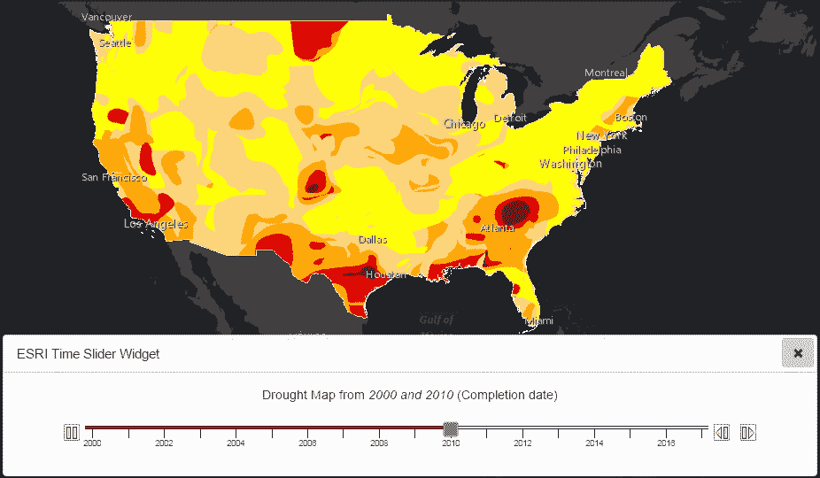
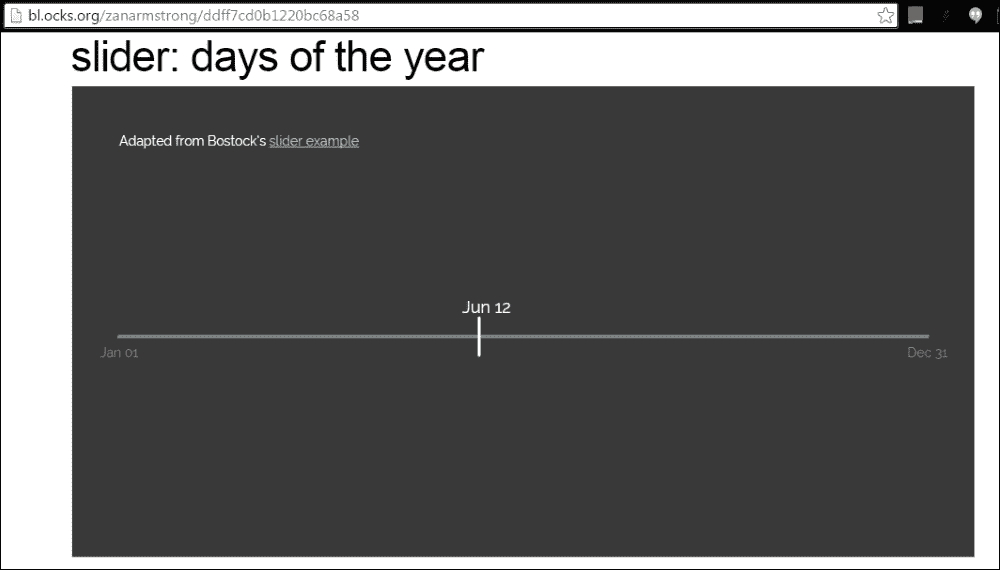
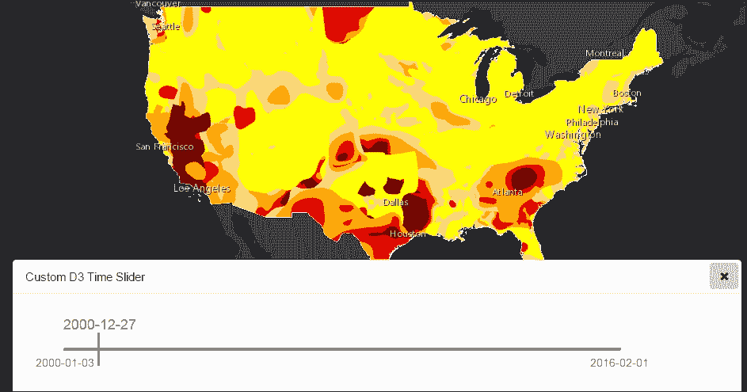

# 九、实用时间感知层的可视化

在前面的章节中，我们已经讨论了阅读和显示基于时间的数据，以及使用 D3 和雪松等创新库的非空间制图方法。本章涉及使用空间可视化来可视化时空数据，以及其他非空间可视化辅助工具，如时间滑块和时间图。本章将讨论以下主题:

*   时间感知层及其需求
*   使用时间滑块构建干旱应用程序
*   使用 D3 基于时间数据进行查询
*   使用雪松图的高级时空可视化

# 时间感知层

ArcGIS 10 及以上版本包括对时间感知图层的支持。时间感知图层是具有`TimeInfo`属性的动态地图服务或要素图层。以下屏幕截图显示了时间感知要素图层的服务目录。

查看图像中的`TimeInfo`属性:


服务目录中时间信息的快照

让我们讨论一下`TimeInfo`物体的成分，它和我们在上一张图片中看到的相似。`TimeInfo`物业为我们提供以下信息:

*   图层中的哪个字段存储时间信息(状态时间字段、结束时间字段)。
*   数据可用的最短时间和最长时间(时间范围)。
*   时间参考属性是指存储日期时间值的时区(如果为空，则遵循世界协调时时间；这将详细讨论)。
*   时间间隔单位是每个要素数据可用的时间间隔。
*   *有实时数据*属性是指一个布尔值，表示数据是否持续更新。
*   导出选项提供了属性列表，如使用时间、时间数据累积和时间偏移。时间数据累积是一个布尔值，表示检索到的要素是否随时间累积。

## 需要时间感知层

时间感知层让我们了解时空背景下的数据；这意味着我们可以看到空间信息在一段时间内的变化。这种数据有各种实际应用，例如:

*   随着时间的推移，了解犯罪热点在城市中的位置
*   跟踪飓风并显示其当前位置
*   洪水事件在一个地区短时间内的蔓延
*   展示一个状态下油井的扩散
*   随着时间的推移，干旱是如何影响一个地方的

## 理解时间感知层

对 ArcGIS 中时间概念的某种基本理解将有助于我们更好地处理时间感知图层。以下几点值得注意:

*   时间应始终参照**协调世界时** ( **UTC** )，这在功能上相当于**格林威治时间** **平均时间** ( **格林尼治时间**)。
*   就像地图的空间范围一样，我们可以定义地图的时间范围，它具有时间感知层。这只会影响具有`timeInfo`属性的地图图层。时间范围由`esri/TimeExtent`模块提供。我们可以使用以下任一属性定义`TimeExtent`对象:
    *   `startTime`
    *   `endTime`
    *   `startTime`和`endTime`

        ```js
        require(["esri/TimeExtent", ... ], 
        function(TimeExtent, ... ){
          var timeExtent = new TimeExtent();
          timeExtent.startTime = new Date("1/15/1989 UTC");
          map.setTimeExtent(timeExtent);
        });
        ```

*   时间信息对象下导出选项对象的**时间数据累计**属性决定了数据是否可以累计。
*   当时间感知图层中的数据无法在地图显示中累积时，我们应该在时间滑块中仅使用一个拇指。我们将很快讨论时间滑块。

# 构建干旱应用

让我们构建一个显示美国干旱状况的应用程序，以了解 ArcGIS 中支持时间感知图层的功能。

以下网址提供了从 2000 年至今美国干旱强度的每周更新值:[http://earth OBS 1 . ArcGIS . com/ArcGIS/rest/services/US _ drug/MapServer](http://earthobs1.arcgis.com/arcgis/rest/services/US_Drought/MapServer)

您可能需要 ArcGIS Developer 帐户来访问这些数据。

一个地区的干旱被定义为在一段延长的时间内，水供应和水需求之间的不平衡。由于干旱会产生直接和间接的环境、经济和社会后果，因此监测干旱有助于各级政府的规划、备灾和减灾工作。

我们的应用程序试图显示整个美国的当前和历史干旱值。自 2000 年 1 月 4 日以来，这些数据由美国干旱监测中心每周生成，完整的时间序列在此存档。每周四都会发布一张新地图来反映前一周的情况。

## 使用时间滑块

应用编程接口提供的`TimeSlider`模块能够与时间感知层交互。`TimeSlider`是 API 提供的小部件，我们可以在代码中使用它，并动态查询时间感知层。它还为动画提供支持，这样我们就可以看到空间特征是如何随时间变化的，或者特征是如何在一个时间间隔内累积的。

要使用`TimeSlider`，我们需要加载名为`esri/dijit/TimeSlider`的 Esri `dijit`。除了`TimeSlider dijit`，我们可能还需要加载名为`esri/TimeExtent`的模块。时间范围有助于定义停靠点。下图试图显示一个`TimeSlider dijit`的组成部分以及与`TimeSlider dijit`相关的编程术语的物理表示，如`stops`、`timeInterval`、`thumb`等:


### 创建时间滑块的步骤

以下是创建时间滑块的步骤:

1.  在动态地图服务或要素图层的加载事件中，获取图层的时间范围。
2.  初始化`TimeSlider dijit`并将其分配给容器元素，如`div`或内容面板。将时间滑动也分配给地图。
3.  设置 timeslider 的其他属性，例如 thumb count，根据图层的时间范围和时间单位创建时间停止。
4.  设置拇指的移动速度。
5.  为时间滑块创建标签。
6.  开始时间滑块动画。

时间滑块的时间范围可以从图层的`timeInfo`属性本身获得:

```js
on(droughtcMapServiceLayer, "load", function (evt) {
var layerTimeExtent = evt.layer.timeInfo.timeExtent;
  _createEsriTimeSlider(layerTimeExtent);
});
```

下面的代码片段解释了如何将时间滑块设置到地图并开始动画:

```js
//Pass the time extent to the function

function _createEsriTimeSlider(layerTimeExtent) {

/*Time Slider*/
  var timeSlider = new TimeSlider({
    style: "width: 100%;"
  }, dom.byId("timeSliderDiv"));
  map.setTimeSlider(timeSlider);

/* We just need one thumb for our time aware data */

  timeSlider.setThumbCount(1);

//Though a weekly data is available, let us Create Time stops
//for Yearly intervals
//

timeSlider.createTimeStopsByTimeInterval(layerTimeExtent, 1, "esriTimeUnitsYears");

//Waits at each stop for 2 seconds

  timeSlider.setThumbMovingRate(2000);

//Start the time slider animation

  timeSlider.startup();

  //add labels for every other time stop

  var labels = array.map(timeSlider.timeStops, function (timeStop, i) {
    if (i % 2 === 0) {
      return timeStop.getUTCFullYear();
    } else {
      return "";
    }
  });

  timeSlider.setLabels(labels);

//Wait for the map service to load at each stop

  timeSlider.on("time-extent-change", function (evt) {
    //update the text

    var currentValString = evt.endTime.getUTCFullYear();
    dom.byId("daterange").innerHTML = "<i>" + currentValString + "<\/i>";
  });

  on(droughtcMapServiceLayer, "update-start", function (evt) {

  //When updating layer, pause the time slider animation

    timeSlider.pause();
  });

  on(droughtcMapServiceLayer, "update-end", function (evt) {

//When update is done, play the time slider animation

    timeSlider.play()
  });
}
```

使用之前的代码块，我们能够用`timeSlider`小部件开发一个简单的应用程序；此处可以看到应用程序在初始时间停止期间的快照:


点击播放按钮后，拇指开始移动。在每次停止时，拇指可能会暂停超过播放动画中规定的时间间隔。此暂停是地图服务在特定时间点获取动态地图服务所需的时间。在下图中，时间滑块动画停止了几秒钟，这让我们有机会捕捉 2004 年地图的实例:


如果你正在观察你的浏览器的网络标签，你会注意到每次拇指沿着时间滑块移动到一个停止点时都会发出一个 HTTP `GET`请求调用。在每一站，都会获取一个新的动态地图图像，每次对应一个地图实例。让我们看一下这张图片，它显示了一个时间实例的快照，时间实例是 2010 年:



向发出的生成您之前看到的动态图像的 HTTP `GET`请求是这个网址，它的每个查询参数由一个新行分隔:

```js
http://localhost:9095/proxy/proxy.ashx?
http://earthobs1.arcgis.com/arcgis/rest/services/US_Drought/MapServer/export?
dpi=96
&transparent=true
&format=png8
&time=946944000000%2C1262563200000
&bbox=-17599814.30461256%2C1159119.7738912208%2C-4234952.783009615%2C6765317.176437697
&bboxSR=102100
&imageSR=102100
&size=1366%2C573
&f=image
```

该网址提供了许多关于正在生成的图像类型的信息。应该注意的是，请求通过代理页面。时间参数以刻度表示 2010 年。

# 使用 D3 基于时间的查询

前面的例子是基于使用 API 提供的内置`TimeSlider dijit`查询时间感知层。利用 D3 库提供的对基于时间的数据的丰富支持，我们可以进一步增强时间滑块的功能。

我们在这一部分的目标是创建一个 D3 时间滑块，它可以与我们的时间感知层交互。

以下代码的灵感来自于在[http://bl.ocks.org/zanarmstrong/ddff7cd0b1220bc68a58](http://bl.ocks.org/zanarmstrong/ddff7cd0b1220bc68a58)给出的代码列表。

该网页解释了如何有效地使用 D3 对象来读取和显示时间滑块中的时间数据。



下面是在实现代码之前我们必须理解的一些重要概念。

## 缩放和格式化时间

在我们前面的一章中，我们讨论了 D3 函数如何用于缩放数值和序数。当我们处理时间时，我们需要处理应用于时间的缩放。下面的代码片段解释了如何将时间范围缩放到容器的宽度:

```js
// parameters
    var margin = {
        top: 10,
        right: 50,
        bottom: 50,
        left: 50
      },
      width = 800 - margin.left - margin.right,
      height = 150 - margin.bottom - margin.top;

// scale function
    var timeScale = d3.time.scale()
      .domain([startDate, endDate])
      .range([0, width])
      .clamp(true);
```

在前面的片段中，我们假设我们能够从图层的`timeInfo`属性向 D3 时间缩放函数提供开始和结束数据值。我们还需要一个合适的日期格式来呈现我们拥有的日期值。下面一行代码为我们提供了日期-月-日格式的日期:

```js
var formatDate = d3.time.format("%Y-%m-%d");
```

## D3 刷

D3 画笔相当于时间滑块`dijit`中的拇指。Brush 是接受时间范围的 D3 SVG 元素对象。在下面的代码片段中，我们有一个接受 x 轴时间刻度因子的 brush 元素:

```js
    // defines brush
    var brush = d3.svg.brush()
      .x(timeScale)    
      .extent([startingValue, startingValue])
      .on("brush", brushed);
```

关于画笔，我们需要了解的另一个重要方面是关于`mousedown`等事件。当用户移动画笔时(在`mousedown`后面的`mousemove`上)，将通过调用`timescale.invert`来重新计算范围。这将让我们为画笔设置新的范围。下面的代码解释了这一点:

```js
svg.on("mousedown", function (data) {
      var value = brush.extent()[0];

      if (d3.event.sourceEvent) { // not a programmatic event
        value = timeScale.invert(d3.mouse(this)[0]);
        brush.extent([value, value]);
      }
      console.log(formatDate(value));
    });
```

除了网页中提供的代码清单之外，我们还需要一段额外的代码，以便在画笔上的`mousedown`事件持续至少 500 毫秒时，触发查询来检索时间感知数据。否则，当我们沿着时间刻度移动画笔时，事件将被触发无数次。移动画笔时触发的以下函数将发布标题为`application/d3slider/timeChanged`的主题:

```js
function brushed() {
  var value = brush.extent()[0];

  if (d3.event.sourceEvent) { // not a programmatic event
    value = timeScale.invert(d3.mouse(this)[0]);
    brush.extent([value, value]);
  }

  handle.attr("transform", "translate(" + timeScale(value) + ",0)");
  handle.select('text').text(formatDate(value));
  var reqValue = formatDate(value);

  if (timer) {
    clearTimeout(timer);
  }
  timer = setTimeout(function () {
    //alert(reqValue);
    topic.publish("application/d3slider/timeChanged", value);
  }, 500);

}
```

订阅主题的代码会将地图设置为画笔所指向的时间范围:

```js
topic.subscribe("application/d3slider/timeChanged", function () {
  console.log("received:", arguments);
  var startDate = arguments[0];
  if (startDate) {
    var timeExtent = new TimeExtent();
    timeExtent.startTime = startDate;
    map.setTimeExtent(timeExtent);
  }
});
```

找到完整的代码列表构建 D3 滑块:

```js
define([
  "dojo/_base/declare",
  "d3",
  "dojo/topic",
  "dojo/_base/array",
  "dojo/domReady!"
], function (
    declare,  
    d3,  
    topic,
    array) {
    //http://bl.ocks.org/zanarmstrong/ddff7cd0b1220bc68a58

    var isInitilaized = false;

    topic.subscribe("application/d3slider/initialize", function () {
        if (!isInitilaized) {
            console.log("received:", arguments);
            var startDate = arguments[0];
            var endDate = arguments[1];

            var formatDate = d3.time.format("%Y-%m-%d");
            var timer;
            // parameters
            var margin = {
                    top: 10,
                    right: 50,
                    bottom: 50,
                    left: 50
                },
                width = 800 - margin.left - margin.right,
                height = 150 - margin.bottom - margin.top;

            // scale function
            var timeScale = d3.time.scale()
                .domain([startDate, endDate])
                .range([0, width])
                .clamp(true);

            // initial value
            var startValue = timeScale(new Date('2012-03-20'));
            startingValue = new Date('2012-03-20');

            //////////

            // defines brush
            var brush = d3.svg.brush()
                .x(timeScale)
                .extent([startingValue, startingValue])
                .on("brush", brushed);

            var svg = d3.select("#d3timeSliderDiv").append("svg")
                .attr("width", width + margin.left + margin.right)
                .attr("height", height + margin.top + margin.bottom)
                .append("g")
                // classic transform to position g
                .attr("transform", "translate(" + margin.left + "," + margin.top + ")");

            svg.on("mousedown", function (data) {
                var value = brush.extent()[0];

                if (d3.event.sourceEvent) { // not a programmatic event
                    value = timeScale.invert(d3.mouse(this)[0]);
                    brush.extent([value, value]);
                }
                console.log(formatDate(value));
            });

            svg.append("g")
                .attr("class", "x axis")
                // put in middle of screen
                .attr("transform", "translate(0," + height / 2 + ")")
                // inroduce axis
                .call(d3.svg.axis()
                    .scale(timeScale)
                    .orient("bottom")
                    .tickFormat(function (d) {
                        return formatDate(d);
                    })
                    .tickSize(0)
                    .tickPadding(12)
                    .tickValues([timeScale.domain()[0], timeScale.domain()[1]]))
                .select(".domain")
                .select(function () {
                    console.log(this);
                    return this.parentNode.appendChild(this.cloneNode(true));
                })
                .attr("class", "halo");

            var slider = svg.append("g")
                .attr("class", "slider")
                .call(brush);

            slider.selectAll(".extent,.resize")
                .remove();

            slider.select(".background")
                .attr("height", height);

            var handle = slider.append("g")
                .attr("class", "handle");

            handle.append("path")
                .attr("transform", "translate(0," + height / 2 + ")")
                .attr("d", "M 0 -20 V 20");

            handle.append('text')
                .text(startingValue)
                .attr("transform", "translate(" + (-45) + " ," + (height / 2 - 25) + ")");

            slider.call(brush.event);

            function brushed() {
                var value = brush.extent()[0];

                if (d3.event.sourceEvent) { // not a programmatic event
                    value = timeScale.invert(d3.mouse(this)[0]);
                    brush.extent([value, value]);
                }

                handle.attr("transform", "translate(" + timeScale(value) + ",0)");
                handle.select('text').text(formatDate(value));
                var reqValue = formatDate(value);

                if (timer) {
                    clearTimeout(timer);
                }
                timer = setTimeout(function () {
                    //alert(reqValue);
                    topic.publish("application/d3slider/timeChanged", value);
                }, 500);

            }
            isInitilaized = true;
        }
    });
});
```

当我们在应用程序中合并之前的代码时，我们得到了这个不错的 D3 时间滑块，如下图所示，它允许我们通过连续的时间谱进行查询，而不是每年的停止:



当我们沿着时间滑块将 D3 笔刷(拇指)移动到不同的位置时，获取动态地图图像的查询不会触发。只有当我们让拇指停留在某个位置超过 0.5 秒时，它才会被触发。这是性能和响应性之间的安全权衡。下面的截图显示了一个时间点(2002 年 8 月 24 日)的动态地图图像:


# 雪松的高级时空可视化

时间感知层提供关于数据的有价值的信息——每个要素在每个时间点的全部要素值。到目前为止，我们一直在使用时间滑块或 D3 中的类似方法可视化不同时区的整个空间数据集。我们从未能够在整个时间范围内或者至少在多个时间范围内可视化特定要素的值。我们在这一部分的目标就是——在整个时间范围内可视化所选特征的值。

我们将使用以下图层进行可视化，可在[http://earth OBS 1 . ArcGIS . com/ArcGIS/rest/services/US _ dry _ by _ country/feature server/0](http://earthobs1.arcgis.com/arcgis/rest/services/US_Drought_by_County/FeatureServer/0)获得。

这一层按县显示了 2000 年至今美国的干旱强度。数据的时间范围为 2000 年 4 月 1 日至今，每周四更新，以反映前一周发生的情况。

我们的目标是提取所选功能的所有数据。可以遵循以下步骤来实现我们的目标:

1.  选择一个特征并对其执行识别任务以获取特征标识。
2.  使用要素标识查询上一个要素图层。
3.  将数据传递给雪松图表类型`time`。

下面这段代码解释了标识参数是如何形成的。每次点击地图时都会执行识别任务:

```js
  function initIdentify () {
            map.on("click", doIdentify);

            identifyTask = new IdentifyTask("http://server.arcgisonline.com/arcgis/rest/services/Demoimg/USA_1990-2000_Population_Change/MapServer");

            identifyParams = new IdentifyParameters();
            identifyParams.tolerance = 1;
            identifyParams.layerIds = [3];
            identifyParams.returnGeometry = true;
            identifyParams.layerOption = IdentifyParameters.LAYER_OPTION_ALL;
            identifyParams.width = map.width;
            identifyParams.height = map.height;
    }
```

地图点击事件调用以下名为`doIdentify()`的函数:

```js
function doIdentify (event) {
      map.graphics.clear();

//Use the map click point for the identify task

      identifyParams.geometry = event.mapPoint;
      identifyParams.mapExtent = map.extent;
      identifyTask.execute(identifyParams, function (results) {
      console.log(results[0].feature.attributes);

//Initiate a Query Task

      var queryTask = new QueryTask("http://earthobs1.arcgis.com/arcgis/rest/services/US_Drought_by_County/FeatureServer/0");
      var query = new Query();
      query.returnGeometry = true;
      query.outFields = ["*"];

//Query based on the feature id returned by the identify task

      query.where = "countycategories_admin_fips = '"+results[0].feature.attributes.ID+"'";
      query.orderByFields = ["countycategories_date"];
      queryTask.execute(query).then(function(qresult){
      console.log(qresult);

//Send the query result to the topic "some/topic"

      topic.publish("some/topic", qresult);
    });
  });
}
```

发送查询数据的主题应该是将构建雪松图的函数所订阅的。所需的雪松图表类型为`time`。

`time`类型雪松图在字段映射中期望以下类型的字段:

*   Esri 日期时间字段
*   任何数值

在我们的例子中，我们将映射字段，即`countycategories_date`(日期时间字段)和`countycategories_d0`(数字字段):

```js
topic.subscribe("some/topic", function () {
            var data = arguments[0];
            var chart = new Cedar({
                "type": "time"
            });
            var dataset = {
                "data": data,
                "mappings": {
                    "time": {
                        "field": "countycategories_date",
                        "label": "Date"
                    },
                    "value": {
                        "field": "countycategories_d0",
                        "label": "Countycategories D0"
                    },
                    "sort": "countycategories_date"
                }
            };

//tool tip field
            chart.tooltip = {
                "title": "Countycategories D0",
                "content": "{countycategories_d0}"
            };

        chart.dataset = dataset;

//show the chart

chart.show({
            elementId: "#droughtHistoryMap",
            autolabels: true,
            height:150,
            width:800
        });
        chart.on('click', function(event,data){
            console.log(event,data);
            topic.publish("application/d3slider/timeChanged", new Date(data.countycategories_date));
        });
    });
```

将之前的代码合并到应用程序中，我们能够看到选定县一段时间内干旱值的时间图。在下图中，图表表示所选要素干旱值的时间线:


这种表达方式以多种方式给出了多维视角。一个是，我们仍然可以看到在某个特定的时间点，整个国家干旱的空间分布。同时，我们能够使用非空间可视化辅助工具，例如时间图，来可视化县一级特定特征在整个时间段内的整个干旱值集。

# 总结

我们已经介绍了如何使用三种方法，即时间滑块、D3 和雪松，以时空方式可视化数据。虽然时间滑块是`dijit`提供的内置应用编程接口，但 D3 解决方案更加广泛和灵活。使用雪松`time`型图表绘制时空数据提供了时空数据的不同视角。我们从应用编程接口的基础开始，逐步发展到用小部件构建一个成熟的 dojo web 应用程序。我们处理了 API 提供的通用查询功能，并以不同的形式在各个章节中使用了它。显示查询结果是我们后来的重点。查询结果可以显示为空间图形和表格形式。我们后来深入研究了使用渲染技术渲染地图上显示的空间数据的更直观的方法。

然后我们意识到，一点统计知识不仅可以帮助我们更好地理解数据，还可以更好地可视化数据，以便用户可以对数据获得新的见解。最后三章是关于借助非空间组件(如制图技术和时间维度)向我们的地图添加多维度。这一章的高潮是在所有讨论的维度中感知我们的地图，但这当然不是极限。相反，这是像你这样有进取心的地图数据科学家的起点！