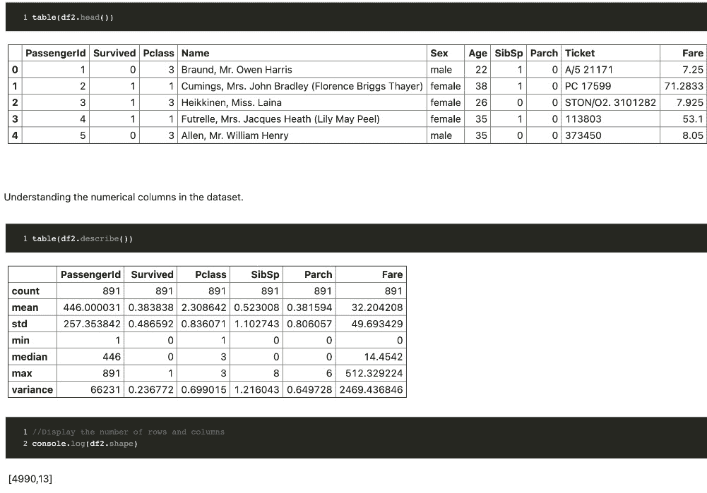
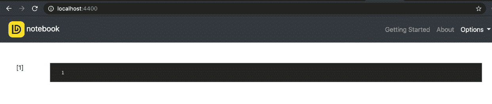
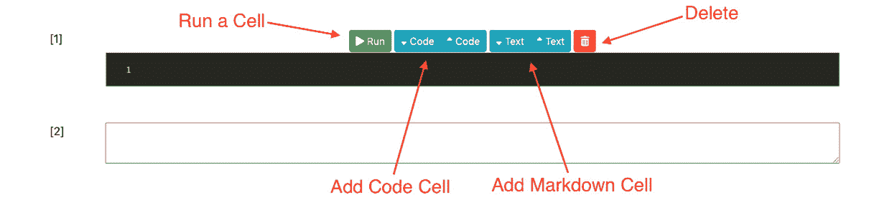
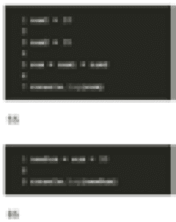
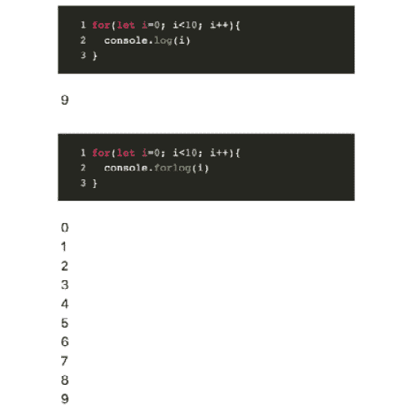

# 二、Dnotebook——一个 JavaScript 的交互式计算环境

唐纳德·克努特(Donald Knuth)很好地开创了让我们的代码具有足够的表现力，让人类阅读，而不仅仅是让机器消费的想法，他还写了一本关于它的书，名为《识字编程》(T0)([https://www . Amazon . com/literable-Programming-by Knuth-Knuth/DP/B004 KFC4S](https://www.amazon.com/Literate-Programming-byKnuth-Knuth/dp/B004WKFC4S))。像 Jupyter Notebook 这样的工具同样重视散文和代码，因此程序员和研究人员可以通过代码和文本(包括图像和工作流)自由地广泛表达自己。

在这一章中，你将学习**Dnotebook**——一个 JavaScript 的交互式编码环境。您将学习如何在本地安装 Dnotebook。您还将学习如何编写代码并在其中进行标记。此外，您还将学习如何保存和导入保存的笔记本。

本章将涵盖以下主题:

*   Dnotebook 简介
*   Dnotebook 的设置和安装
*   Dnotebook 中交互式计算背后的基本概念
*   编写交互式代码
*   使用标记单元格
*   保存笔记本

# 技术要求

要成功完成本章，您需要在计算机上安装 **Node.js** 和现代浏览器，如 Chrome、Safari、Firefox 或 Opera。

要安装 Node.js，可以按照这里的官方指南:[https://nodejs.org/en/](https://nodejs.org/en/)。

本章代码可用，可从 GitHub[https://GitHub . com/PacktPublishing/Building-Data-Driven-Applications-with-danfo . js/tree/main/chapter 02](https://github.com/PacktPublishing/Building-Data-Driven-Applications-with-Danfo.js/tree/main/Chapter02)处克隆

# Dnotebook 简介

过去几年在数据科学领域，Jupyter Notebook 和 JupyterLab 等交互式计算环境实际上在代码如何共享方面产生了巨大的影响，这增强了想法的快速迭代。

近年来，数据科学正在向浏览器端发展，以支持不同的用户，如网络开发人员。这意味着 Python 生态系统中许多成熟的数据科学工具也需要移植或在 JavaScript 中提供。按照这种思路，我们，这本书的作者，以及 Danfo.js 的创作者，决定创建一个新版本的 Jupyter Notebook，专门针对 JavaScript 生态系统。

Dnotebook，我们称之为，帮助你在 JavaScript 中执行快速和交互式的实验/原型制作。这意味着您可以编写代码，并以交互式和类似笔记本的方式即时查看结果，如下图所示:



图 2.1–使用 Dnotebook 的交互式编码示例

Dnotebook 可用于许多领域和不同的事物，例如:

*   **数据科学/分析**:可以帮助你使用 *Danfo.js* 、 *Plotly.js* 、 *Vega* 、 *Imagecook* 等高效的 JavaScript 包，轻松进行交互式数据探索和分析。
*   **机器学习**:使用 *Tensorflow.js* 等机器学习库，可以帮助你轻松构建、训练和原型化机器学习模型。
*   **交互学习 JavaScript**:可以帮助你以交互、可视化的方式学习或教授 JavaScript。这可以促进学习和理解。
*   **简单的实验/原型制作**:任何可以用 JavaScript 编写的实验都可以在 Dnotebook 上运行，因此这有助于快速实验想法。

现在您已经了解了 Dnotebook 是什么，让我们学习如何在本地设置和使用它。

# 数据手册的设置和安装

要在本地安装并运行 Dnotebook ，需要确保安装了 node . js。一旦安装了 Node.js，就可以通过在终端中运行以下命令来轻松安装 Dnotebook:

```js
npm install –g dnotebook
```

前面的命令全局安装 Dnotebook。这是推荐的安装方式，因为它可以确保 Dnotebook 服务器可以从我们计算机上的任何地方启动。

注意

您也可以在线使用 Dnotebook，而无需安装它；查看 Dnotebook 游乐场([https://playnotebook.jsdata.org/demo](https://playnotebook.jsdata.org/demo))。

安装后，您可以通过在终端/命令提示符下运行以下命令来启动服务器:

```js
> dnotebook
```

此命令将在端口 http://localhost:4400 的默认浏览器中打开一个选项卡，如下图所示:



图 2.2–Dnotebook 主页

打开的页面是 Dnotebook 界面的默认页面，从这里可以开始编写 JavaScript 和 Markdown。

注意

我们目前使用的是**Dnotebook 0 . 1 . 1 版**，作为这样的，未来使用这本书的时候，你可能会注意到一些小的改动，尤其是 UI 方面。

# Dnotebook 中交互计算背后的基本概念

为了在 Dnotebook 中编写交互代码/Markdown，你需要理解一些概念，比如单元格和持久/状态。我们从解释这些概念开始这一节。

## 细胞

Dnotebook 中的单元格是一个单元块，代码或文本可以在其中写入以便执行。以下是显示代码和标记单元格的示例屏幕截图:


图 2.3–Dnotebook 中的空代码和减价单元格

每个单元格都有编辑按钮，可以用于不同的目的，如下图所示:



图 2.4–每个单元格中可用的操作按钮

现在，让我们了解这些按钮的作用:

*   **运行**:**运行**按钮可用于执行单元格，以显示输出。
*   **添加代码**:添加代码按钮有箭头方向指定的两种变体(向上和向下)。它们可用于在当前单元格的上方或下方添加代码单元格。
*   **添加标记**:添加标记按钮和添加代码按钮一样，有两种变体可以在当前单元格的下方或上方添加标记单元格。
*   **删除**:顾名思义这个按钮可以用来删除一个单元格。

有两种类型的单元格，即代码单元格和减价单元格。

## 编码单元格

一个**代码单元**是一个单元，在这里可以编写和执行任何 JavaScript 代码。新笔记本的第一个单元格总是一个代码单元格，我们可以用经典的 hello world 示例来测试一下。

在打开的数据手册中，写下以下命令并点击**运行**按钮:

```js
console.log('Hello World!')
```

注意

悬停在代码单元格上显示**运行**按钮。或者，您可以使用快捷方式 *Ctrl* + *在窗口中输入*或在 Mac 中使用*命令* + *输入*来运行代码单元格。

hello world 代码和输出应该类似于下面的截图:


图 2.5–Dnotebook 中的代码单元和执行输出

接下来，让我们了解一下 Markdown 细胞。

## 标记细胞

**标记单元格**类似于代码单元格，除了它们只能执行标记或文本。这意味着 Markdown 文本可以编译任何用 Markdown 语法编写的文本。

Dnotebook 中的标记单元格通常是白色的，可以通过单击打开单元格中的**文本**按钮来打开。**文本**按钮通常适用于每个单元格，如下图所示:


图 2.6–在 Dnotebook 中打开降价单元格

点击**文本**按钮，打开一个标记单元格，如下图所示:


图 2.7–在标记单元格中写入标记文本

在这里，您可以编写任何带有标记的文本，当执行时，结果将被编译为文本，并显示在标记单元格的位置，如下所示:


图 2.8–降价单元格的输出

现在，我们来谈谈交互编程中的另一个重要概念，叫做**持久性** / **状态**。

## 持续/状态

交互计算中的持久性或状态是环境变量或数据比创建它的细胞存活(持久)的能力。这意味着在一个单元格中声明/创建的变量可用于另一个单元格，而与单元格的位置无关。

Dnotebook 的每个实例都运行一个持久状态，在没有`let`和`const`声明的单元格中声明的变量对所有单元格都可用。

注意

在 Dnotebook 中工作时，我们鼓励您声明变量的主要方式有两种。

选项 1–没有声明关键字(首选方法):

`food_price = 100`

`clothing_price = 200`

`total = food_price + clothing_price`

选项 2–使用`var`全局关键字(这很有效，但不可取):

`var food_price = 100`

`var clothing_price = 200`

`var total = food_price + clothing_price`

使用`let`或`const`等关键字会使变量在新单元格中不可访问。

为了更好地理解这一点，让我们声明一些变量，并尝试在之后或之前创建的多个单元格中访问它们:

1.  Create a new cell in your open notebook and add the following code:

    ```js
    num1 = 20
    num2 = 35
    sum = num1 + num2
    console.log(sum)
    //output 55
    ```

    运行此代码单元格，您将看到单元格正下方打印的总和，如下图所示:

    

    图 2.9–添加两个数字的简单代码

2.  Next, create a new cell following your first cell, by clicking on a code cell button, and try to use the `sum` variable as shown in the following code block:

    ```js
    newSum = sum + 30
    console.log(newSum)
    //outputs 85
    ```

    通过执行前面的单元格，得到`85`的输出。这意味着从第一个单元格到第二个单元格以及您将创建的任何其他单元格的变量总和将持续存在，如下图所示:



图 2.10–两个代码单元共享一个持久状态

注意

标记单元格不保存变量，因为它们不执行 JavaScript 代码。

现在，您已经理解了什么是单元和持久性，您现在可以轻松地在 Dnotebook 中编写交互式代码，在下一节中，我们将向您展示如何做到这一点。

# 编写交互代码

在本节中，我们将重点介绍在 Dnotebook 中编写交互代码时需要了解的一些重要事项。

## 装载外部包裹

在编写 JavaScript 时，将外部包导入笔记本非常重要，因此，Dnotebook 有一个名为`load_package`的内置函数来实现这一点。

`load_package`方法帮助您通过外部包/库的 CDN 链接轻松将其添加到笔记本中。例如，要加载`Tensorflow.js`和`Plotly.js`，您可以将它们的 CDN 链接传递给`load_package`功能，如以下代码所示:

```js
load_package(["https://cdn.jsdelivr.net/npm/@tensorflow/tfjs@3.4.0/dist/tf.min.js","https://cdn.plot.ly/plotly-latest.min.js"])
```

这将加载包并将它们添加到笔记本状态，以便可以从任何单元访问它们。在下面的部分中，我们使用刚刚导入的`Plotly`库。

将以下代码添加到笔记本的新单元格中:

```js
trace1 = {
  x: [1, 2, 3, 4],
  y: [10, 11, 12, 13],
  mode: 'markers',
  marker: {
    size: [40, 60, 80, 100]
  }
};

data = [trace1];
layout = {
  title: 'Marker Size',
  showlegend: false,
  height: 600,
  width: 600
};

Plotly.newPlot(this_div(), data, layout); //this_div is a built-in function that returns the current output's div name.
```

执行上一节的代码单元格会显示一个图，如下图所示:


图 2.11–用外部封装绘制曲线图

因此，通过使用`load_package`，您可以添加您选择的任何外部 JavaScript 包，并在 Dnotebook 中以交互方式使用它。

## 加载 CSV 文件

将数据输入您的笔记本，尤其是数据框，非常重要。因此，我们在这里介绍的另一个内置函数是`load_csv`。

注意

数据帧以行和列的形式表示数据。它们类似于电子表格或由行和列组成的数据库集合。我们将在 [*第 3 章*](03.html#_idTextAnchor066)*中深入介绍数据帧和系列。*

`load_csv`功能帮助您通过互联网将 CSV 文件异步加载到`Danfo.js`数据框中。当你读取大文件并且想要跟踪进度时，你应该使用这个来代替Danfo.js内置的`read_csv`功能。这是因为`load_csv`在导航栏上显示一个微调器来指示进度。

让我们用一个例子来更好地理解这一点。在新的代码单元格中，添加以下代码:

```js
load_csv("https://raw.githubusercontent.com/plotly/datasets/master/finance-charts-apple.csv")
.then((data)=>{
  df = data
})
```

在执行单元格时，如果您查看右上角，您会注意到一个微调器，指示数据加载的进度。

在执行单元之后，您可以像使用 Danfo 数据框一样与数据集交互。例如，您可以使用另一个内置功能`table`以表格形式轻松显示数据。

在新单元格中，添加以下代码:

```js
table(df)
```

执行时，您应该会看到一个数据表格，如下图所示:


图 2.12–加载和显示 CSV 文件

接下来，我们将简要了解另一个内置功能，它有助于在笔记本中显示情节。

## 获取地块的 div 容器

为了显示地块，大多数地块库需要某种容器或 HTML `div`。这是使用 Danfo.js 和 Plotly.js 库进行绘图所必需的。为了更容易访问输出`div`，Dnotebook 内置了`this_div`功能。

`this_div`函数将返回当前代码单元格输出的 HTML 标识。例如，在下面的代码中，我们将`this_div`值传递给数据帧的`plot`方法:

```js
const df = new dfd.DataFrame({col1: [1,2,3,4], col2: [2,4,6,8]})

df.plot(this_div()).line({x: "col1", y: "col2"})
```

这会将当前单元格的`div` ID 传递给数据框的`plot`方法，执行时会显示结果图，如下图所示:


图 2.13–绘制数据帧

最后，在接下来的部分，我们将简要讨论在`for`循环中打印值。这并不像预期的那样有效，我们将解释原因。

## 使用 for 循环时遇到问题

当您编写一个`for`循环并尝试打印 Dnotebook 代码单元格中的每个元素时，您只得到最后一个元素。这个问题与控制台在浏览器中的工作方式有关。例如，尝试执行以下代码并观察输出:

```js
for(let i=0; i<10; i++){
  console.log(i)
}
//outputs 9
```

如果想在运行`for`循环时看到所有输出，尤其是在 Dnotebook 中调试时，可以使用 Dnotebook 内置的`forlog`方法。此方法已附加到默认控制台对象中，可以按如下代码块所示使用:

```js
for(let i=0; i<10; i++){
  console.forlog(i)
}
```

执行前面的代码单元格会返回所有值，如下图所示:



图 2.14–比较 for 和 for 方法

您会注意到，当使用`console.forlog`方法时，每个输出都会打印在新的一行上，就像脚本环境中`console.log`的默认行为一样。

在本节中，我们已经介绍了在 Dnotebook 环境中编写交互式代码时有用的一些重要功能和特性。在下一节中，我们将了解如何使用 Markdown 单元格。

# 使用 Markdown 细胞

Dnotebook 支持 Markdown，它能够将您的代码与文本和多媒体混合在一起，从而使能够访问笔记本的人容易理解。

Markdown 是一种标记语言，用于使用纯文本编辑器创建格式化文本。它广泛用于博客、文档页面和自述文件。如果你使用 GitHub 这样的工具，那么你可能已经使用了 Markdown。

像许多其他工具一样，Dnotebook 支持所有的标记语法、图像导入、添加链接等等。

在接下来的部分中，我们将看到在 Dnotebook 中使用 Markdown 时可以利用的一些重要特性。

## 创建减价单元格

为了在 Dnotebook 环境中编写标记，您需要通过单击**文本**按钮(向上或向下)来添加标记单元格。此操作会在您的笔记本中添加一个新的标记单元格。下面的屏幕截图显示了写在标记单元格中的示例文本:


图 2.15–在标记单元格中写入简单文本

在标记单元格中写入标记文本后，可以点击**运行**按钮执行。这将在读取模式下用透明文本替换单元格。双击文本会在编辑模式下再次显示标记单元格。

## 添加图像

为了将图像添加到标记单元格，您可以使用以下代码片段中显示的图像语法:

```js

```

以下是输出:


图 2.16–添加图像

例如，在前面的截图中，我们添加了一个指向互联网上可用图像的链接。代码如下所示:

```js

```

提供的链接是狗图像的链接。需要点击**运行**按钮查看图像结果，如下图所示:


图 2.17–降价图像结果

在接下来的几节中，您将学习一些基本的 Markdown 语法，也可以将其添加到笔记本中。要查看综合指南，您可以访问网站[https://www.markdownguide.org/basic-syntax/](https://www.markdownguide.org/basic-syntax/)。

## 标题

要创建标题，您只需在单词或短语前面添加井号符号`(#)`:

```js
# First Heading
## Second Heading 
### Third Heading
```

如果我们将前面的文本粘贴到标记中，并点击**运行**按钮，我们将得到以下输出:


图 2.18–添加标题文本

结果，您会注意到文本前面不同数量的磅符号会导致不同的大小。

## 列表

列表对于枚举对象很重要，可以通过在文本前放置一个星形符号( ***** )来添加。我们在下一节中提供了一个示例:

```js
* Food
* Cat
    * kitten
* Dog
```

前面的例子创建了一个无序的物品列表**食物**、**猫**和**狗**，其中**小猫**作为**猫**的子列表。

为了创建数字列表，只需在文本前面添加数字，如下所示:

1.  **第一项**
2.  **第二项**
3.  **更多**

前面的文本在输入到标记输入字段时应该输出以下内容:


图 2.19–列表

在下一节中，我们将介绍 Dnotebook 的一个重要部分——储蓄。这对于重复使用笔记本并与他人共享非常重要。

# 保存笔记本

Dnotebook 支持保存和导入保存的笔记本。保存和导入笔记本使您/他人能够重复使用您的笔记本。

保存和导入笔记本，点击**文件**菜单，选择**下载笔记本**或**上传笔记本**按钮，具体取决于你想做什么。选项显示在以下屏幕截图中:


图 2.20–保存和导入笔记本

点击**下载笔记本**将笔记本保存为 JSON 格式，这个很容易分享或者重装。

保存和导入

要测试该功能，请前往[https://playnotebook.jsdata.org/demo](https://playnotebook.jsdata.org/demo)。尝试保存演示笔记本。然后打开一个新的笔记本，[https://playnotebook.jsdata.org](https://playnotebook.jsdata.org)，导入保存的文件。

# 总结

在这一章中，我们介绍了 Dnotebook，一个支持文本和多媒体的交互式库。首先，我们介绍了在本地安装 Dnotebook，并指出您可以在线免费运行部署的版本。接下来，我们介绍了使用代码和 Markdown 时的一些基本概念和陷阱，最后，我们向您展示了如何保存笔记本以供共享和重用。

在下一章中，我们将从 Danfo.js 开始，并介绍这个令人敬畏的库的一些基本概念。