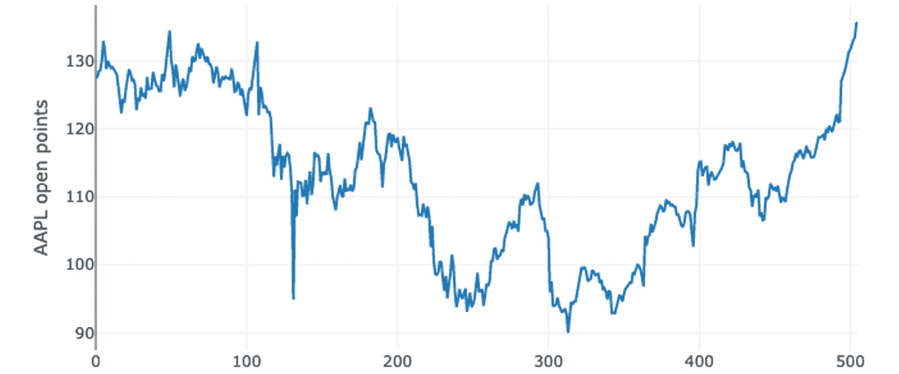
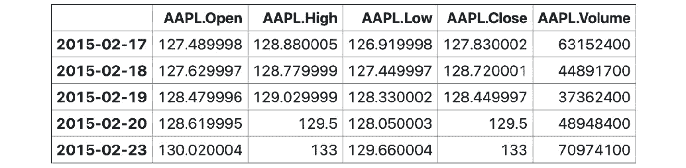
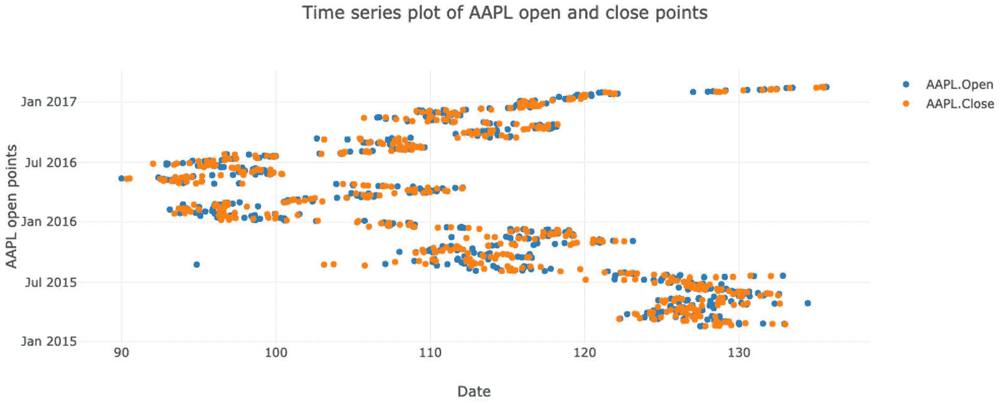
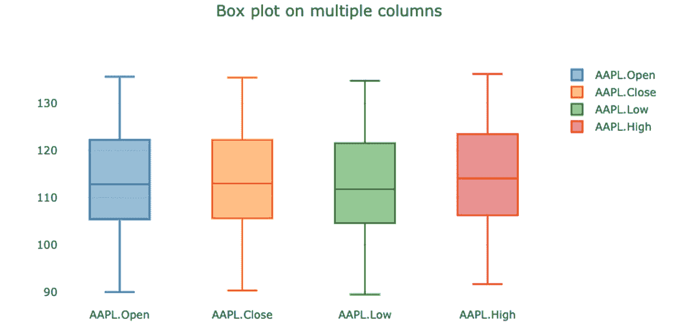
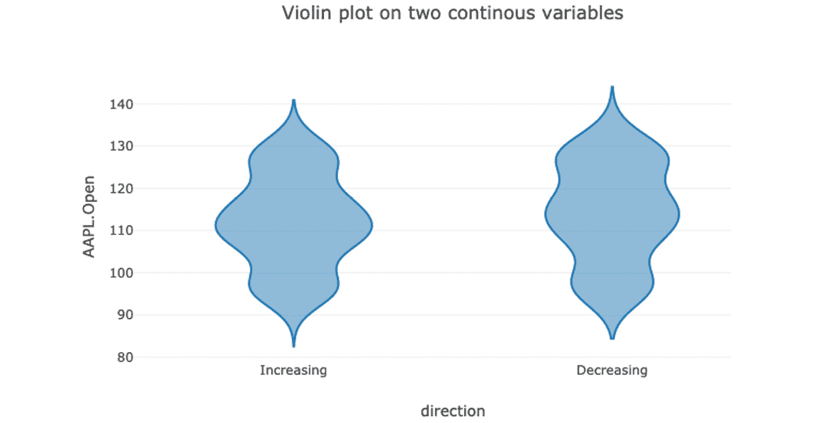
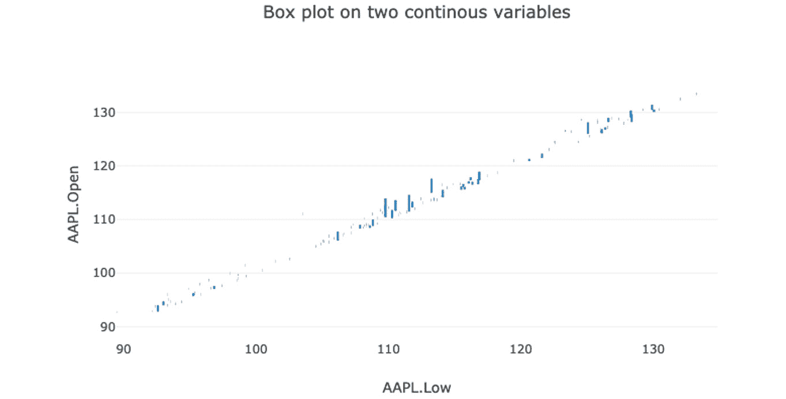
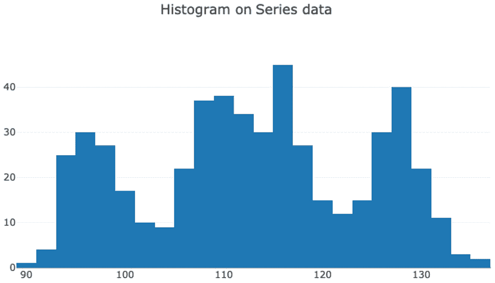
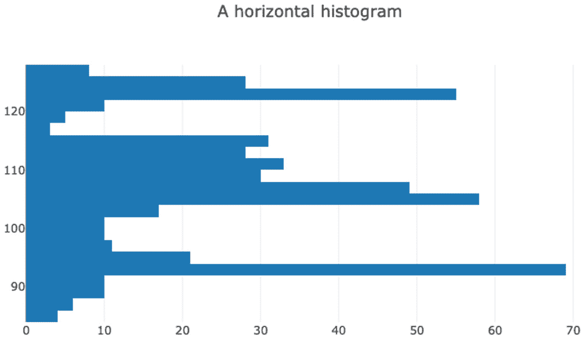
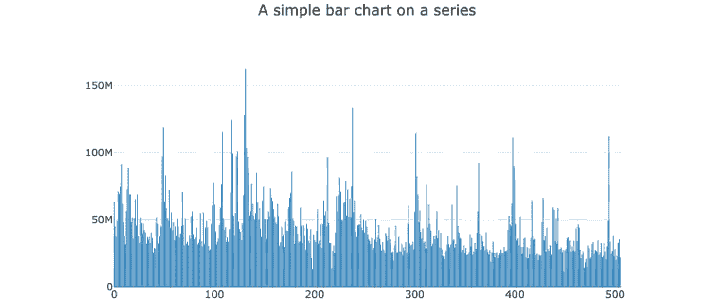
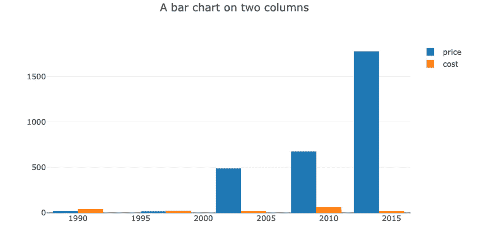

# 六、Danfo.js数据可视化

在前一章中，您学习了如何使用 Plotly.js 创建丰富的交互式绘图，这些绘图可以嵌入到任何网络应用中。我们还提到了 Danfo.js 如何在内部使用 Plotly 直接在数据框或系列上制作图。在本章中，我们将向您展示如何使用 Danfo.js 绘图 API 轻松创建这些图表。具体来说，在本章中，我们将介绍以下内容:

*   设置用于绘图的 Danfo.js
*   使用 Danfo.js 创建折线图
*   使用 Danfo.js 创建散点图
*   使用 Danfo.js 创建盒子和小提琴情节
*   使用 Danfo.js 创建直方图
*   使用 Danfo.js 创建条形图

# 技术要求

为了遵循本章，您应该具备以下条件:

*   现代浏览器，如 Chrome、Safari、Opera 或火狐
*   安装在系统上的 Node.js、Danfo.js 和可选的 Dnotebook
*   用于下载数据集的稳定互联网连接

Danfo.js 的安装说明可以在 [*第三章*](03.html#_idTextAnchor066) 、*danfo . js 的入门*中找到，而 Dnotebook 的安装步骤可以在 [*第二章*](02.html#_idTextAnchor045) 、*Dnotebook–一个 JavaScript 的交互式计算环境*中找到。

# 设置Danfo.js进行绘图

默认情况下，Danfo.js 提供一些基本的图表类型。这些图表可以在任何数据框或系列对象上调用，如果传递了正确的参数，它将显示相应的图表。

在撰写本文时，Danfo.js 附带了以下图表:

*   折线图
*   盒子和小提琴情节
*   桌子
*   饼图
*   散点图
*   条形图
*   直方图

这些图表通过`plot`功能显示。也就是说，如果您有一个数据框或系列对象，在它们上面调用`plot`函数会显示这些图表。

`plot`方法需要一个`div`标识来显示该图。例如，假设`df`是一个数据帧，我们可以调用`plot`函数，如下面的代码片段所示:

```js
const df = new DataFrame({...})
df.plot("my_div_id").<chart type>
```

图表类型可以是`line`、`bar`、`scatter`、`hist`、`pie`、`box`、`violin`或`table`。

每种剧情类型都会接受特定剧情的参数，但它们都有一个共同的参数`config`。`config`对象用于自定义绘图和布局。将`config`参数视为我们在 [*第 5 章*](05.html#_idTextAnchor099)*中使用的布局和配置属性的组合。*

`config`参数是一个具有以下格式的对象:

```js
config = {
  layout: {…}, // plotly layout parameters like title, font, e.t.c.
  ... // other Plotly configuration parameters like showLegend, displayModeBar, e.t.c.
}
```

在下面的部分，我们将展示一些使用不同图表类型的例子，以及如何配置它们。

注意

在接下来的部分中，我们将下载并使用两个真实世界的数据集。这意味着你需要一个互联网连接来下载数据集。

## 将 Danfo.js 添加到代码中

要使用 Danfo.js 进行打印，需要将其添加到项目中。如果您在 Dnotebook 中工作，我们将在示例中使用，然后使用`load_package`函数加载 Danfo.js 和 Plotly.js，如以下代码片段所示:

```js
load_package(["https://cdn.plot.ly/plotly-1.58.4.min.js","https://cdn.jsdelivr.net/npm/danfojs@0.2.3/lib/bundle.min.js"])
```

前面的代码将在 Dnotebook 中安装 Danfo.js 和 Plotly.js。Danfo.js 使用安装的 Plotly.js 制作地块。除非显式加载 Plotly，否则绘图将不起作用。

注意

旧版本的 Danfo . js(0 . 2 . 3 之前的版本)附带 Plotly.js。如这里显示的发行说明中所述，它在新版本中已被删除:[https://Danfo . jsdata . org/发行说明#最新-发行-node-v-0-2-5-browser-0-2-4](https://danfo.jsdata.org/release-notes#latest-release-node-v-0-2-5-browser-0-2-4) 。

如果您在一个 HTML 文件中制作图表，请确保将`script`标签添加到您的标题中，如以下代码片段所示:

```js
...
<head>
<script src="https://cdn.plot.ly/plotly-1.2.0.min.js"></script> 
<script src="https://cdn.jsdelivr.net/npm/danfojs@0.2.3/lib/bundle.min.js"></script>
</head>
...
```

最后，在 UI 库如 React 或 Vue 中，确保通过包管理器如 npm 或 yarn 安装 Danfo.js 和 Plotly.js。

## 下载用于绘图的数据集

在这一部分，我们将下载一个真实世界的金融数据集，这个数据集将用于我们所有的例子。在 Dnotebook 中，您可以在顶部单元格中下载数据集一次，并将其提供给其他单元格，如下所示:

```js
var financial_df;
dfd.read_csv("https://raw.githubusercontent.com/plotly/datasets/master/finance-charts-apple.csv")
    .then(data => {
          financial_df  = data
    })
```

注意

确保用`var`申报`financial_df`。这使得`financial_df`对你的电话簿中的每个单元格都可用。如果在 React 或者纯 HTML 中工作，那么建议使用`let`或者`const`。

在下面的代码片段中，我们可以使用`head`函数和`table`作为 s 显示`financial_df`的前五行:

```js
table(financial_df.head())
```

运行前面的代码会产生以下输出:


图 6.1–显示财务数据集前五行的表格

既然我们有了数据集，我们就可以开始制作一些有趣的图了。首先，我们将从一个简单的折线图开始。

# 用Danfo.js创建折线图

折线图是简单的图表类型，主要用于系列数据或单列。它们可以显示数据点的趋势。要在单个柱上制作折线图，比如说在`financial_df`中的`AAPL.Open`，我们可以做以下操作:

```js
var layout = {
    yaxis: {
      title: 'AAPL open points',
    }
}
var config = {
  displayModeBar: false,
  layout
}
financial_df ['AAPL.Open'].plot(this_div()).line(config)
```

运行前面的代码给出如下输出:



图 6.2 -财务数据集的前五行

请注意，我们正在使用 DataFrame 子集设置(`financial_df["column name"]`)将单个列–`AAPl.Open`–作为一个系列。然后，我们调用`.line`图表类型并传入一个`config`对象。`config`对象接受`layout`属性以及 Danfo.js 和 Plotly 使用的其他参数。

如果要绘制特定的列，可以将列名数组传递给`config`参数，如下面的代码片段所示:

```js
var layout = {
    yaxis: {
      title: 'AAPL open points',
    }
}
var config = {
  columns: ["AAPL.Open", "AAPL.Close"],
  displayModeBar: true,
  layout
}
financial_df.plot(this_div()).line(config)
```

运行前面的代码给出以下输出:


图 6.3–将两列绘制成折线图

默认情况下，图表的 *x* 轴是数据框或系列的索引。在`financial_df`数据框的情况下，索引是在我们使用`read_csv`功能下载数据集时自动生成的。如果要更改索引，可以使用`set_index`功能，如下面的代码片段所示:

```js
var new_df = financial_df.set_index({key: "Date"})
table(new_df.head())
```

输出如下:



图 6.4–显示索引设置为最新的前五行的表格

如果我们绘制与前面相同的图，我们会看到 *x* 轴会自动格式化为日期:


图 6.5–相对于日期指数的两列图表

您可以通过将选项传递给`layout`属性或`config`对象的主体中的来指定其他“绘图”配置选项，如宽度、字体等。例如，要配置字体、文本大小、布局宽度等属性，甚至在绘图中添加自定义按钮，您可以执行以下操作:

```js
var layout = {

  ...  legend: {bgcolor: "#fcba03", 
          bordercolor: "#444", 
          borderwidth: 1, 
          font: {family: "Arial", size: 10, color: "#fff"}
  },
  ...}
var config = {
  columns: ["AAPL.Open", "AAPL.Close"],
  displayModeBar: true,
  modeBarButtonsToAdd: [{ 
      name: 'about', 
      icon: Plotly.Icons.question, 
      click: function (gd) { 
        alert('An example of configuring Danfo.Js Plots') 
      } 
    }] ,
  layout
}
new_df.plot(this_div()).line(config)
```

运行前面的代码单元给出以下输出:


图 6.6–指定了各种配置和布局属性的线图

有了前面的信息，您就可以开始从数据集制作漂亮的折线图了。在下一节中，我们将介绍另一种类型的图——散点图，可在 Danfo.js 中找到

# 用Danfo.js创建散点图

我们可以通过将绘图类型指定为`scatter`来轻松制作散点图。例如，使用前面部分中的代码，*使用Danfo.js*创建折线图，我们可以将绘图类型从`line`更改为`scatter`，并获得所选列的散点图，如以下代码块所示:

```js
var layout = {
  title: "Time series plot of AAPL open and close points",
  width: 1000,
  yaxis: {
    title: 'AAPL open points',
  },
  xaxis: {
    title: 'Date',
  }
}
var config = {
  columns: ["AAPL.Open", "AAPL.Close"],
  layout
}
new_df.plot(this_div()).scatter(config)
```

运行前面的代码单元会产生以下输出:



图 6.7–两列散点图

如果您需要在数据框中的两个特定列之间进行散点图，您可以在`config`对象、中指定`x`和`y`值，如下代码所示:

```js
var layout = {
  title: "Time series plot of AAPL open and close points",
  width: 1000,
  yaxis: {
    title: 'AAPL open points',
  },
  xaxis: {
    title: 'Date',
  }
}
var config = {
  x: "AAPL.Low",
  y: "AAPL.High",
  layout
}
new_df.plot(this_div()).scatter(config)
```

运行前面的代码单元给出以下输出:


图 6.8–明确指定的 x 和 y 列上的散点图

要自定义布局或设置`config`，您可以将相应的选项传递给`config`对象，就像我们在*用Danfo.js*创建折线图部分所做的那样。

在下一节中，我们将简要介绍两种类似类型的情节——盒子情节和小提琴情节。

# 用 Danfo.js 创作盒子和小提琴的剧情

框和小提琴图相似，一般会使用相同的参数。因此，我们将在本节中介绍它们。

在下面的示例中，我们将首先制作一个方框图，然后通过仅更改绘图类型选项将其更改为小提琴图。

## 为一个系列制作盒子和小提琴的情节

要为数据框中的一个系列或单个列绘制方框，首先，我们对进行子集化以获得系列，然后我们将在其上调用绘图类型，如以下代码片段所示:

```js
var layout = {
  title: "Box plot on a Series",
}
var config = {
  layout
}
new_df["AAPL.Open"].plot(this_div()).box(config)
```

运行前面的代码单元会产生以下输出:


图 6.9–系列的方框图

现在，为了将前面的剧情改为小提琴剧情，你只需将剧情类型改为`violin`，如下图所示:

```js
...
new_df["AAPL.Open"].plot(this_div()).violin(config)
…
```

运行前面的代码单元会产生以下输出:


图 6.10–系列中的小提琴图

当我们需要一次为多个列制作方框图时，该怎么办？在下一节中，我们将向您展示如何。

## 多列的方框图和小提琴图

为了为数据框中的多个列制作 box/violin 图，您可以将列名数组传递给该图，如我们在下面的代码片段中所示:

```js
var layout = {
  title: "Box plot on multiple columns",
}
var config = {
  columns: ["AAPL.Open", "AAPL.Close", "AAPL.Low", "AAPL.High"],
  layout
}
new_df.plot(this_div()).box(config)
```

运行前面的代码单元会产生以下输出:



图 6.11–一次多个柱的箱线图

重用之前的代码，通过改变剧情类型，我们可以很容易的把方块剧情改成小提琴剧情，如下:

```js
…
new_df.plot(this_div()).violin(config)
...
```

我们得到以下输出:


图 6.12–一次绘制多列的小提琴图

最后，如果我们要指定`x`和`y`值呢？我们将在下一节展示这一点。

## 具有特定 x 和 y 值的方框图和小提琴图

我们可以用特定的`x`和`y`值制作方块和小提琴图。`x`和`y`值是必须出现在数据框中的列名。

注意

建议箱线图的`x`值是绝对的，即有固定的类数。这确保了可解释性。

在下面的示例中，我们向您展示了如何为绘图显式指定`x`和`y`值:

```js
var layout = {
  title: "Box plot on x and y values",
}
var config = {
  x: "direction",
  y: "AAPL.Open",
  layout
}
new_df.plot(this_div()).box(config)
```

运行前面的代码单元会产生以下输出:


图 6.13–特定 x 和 y 值的箱线图

注意的`x`值是一个名为`direction`的分类变量。此栏有两个固定类别–`Increasing`和`Decreasing`。

和往常一样，我们可以通过改变类型得到相应的小提琴剧情:

```js
...
new_df.plot(this_div()).violin(config)
…
```

运行前面的代码单元会产生以下输出:



图 6.14–特定 x 和 y 值的小提琴图

现在，如果我们同时为`x`和`y`指定连续值，会发生什么？让我们在下面的例子中找到答案:

```js
var layout = {
  title: "Box plot on two continuous variables",
}
var config = {
  x: "AAPL.Low",
  y: "AAPL.Open",
  layout
}
new_df.plot(this_div()).box(config)
```

运行前面的代码单元会产生以下输出:



图 6.15–两个连续变量的箱线图

从前面的输出中，您可以看到图表变得几乎无法解释，并且使用方框/小提琴图的目标没有实现。因此，建议使用方框/小提琴图来分类`x`值。

在下一节中，我们将介绍制作直方图的`hist`图类型。

# 用Danfo.js创建直方图

正如我们前面解释的，直方图是数据传播的一种表现形式。由绘图命名空间公开的`hist`函数可用于从数据帧或系列中制作直方图，我们将在下一节中演示。

## 从序列创建直方图

为了从系列中创建直方图，可以调用系列上的`hist`函数，或者如果在数据框上绘图，可以使用列名对数据框进行子集化，如下例所示:

```js
var layout = {
   title: "Histogram on a Series data",
}
var config = { 
  layout 
} 
new_df["AAPL.Open"].plot(this_div()).hist(config)
```

运行前面的代码单元会产生以下输出:



图 6.16–系列数据直方图

接下来，我们将一次为数据框中的多个列制作直方图。

## 从多列创建直方图

如果希望为数据框中的多列生成直方图，可以将列名作为列名的数组传递，如下面的代码片段所示:

```js
var layout = {
  title: "Histogram of two columns",
}
var config = { 
  columns: ["dn", "AAPL.Adjusted"],
  layout 
} 
new_df.plot(this_div()).hist(config)
```

运行前面的代码单元会产生以下输出:


图 6.17–两列直方图

如果需要指定生成直方图的单个值`x`或`y`，可以将`x`或`y`值传递给`config`对象。

注意

一次只能指定`x`或`y`中的一个。这是因为直方图是单变量图表。因此，如果您指定`x`值，直方图将是垂直的，如果指定`y`，它将是水平的直方图。

在下面的示例中，我们通过指定`y`值来制作水平直方图:

```js
var layout = {
  title: "A horizontal histogram",
}
var config = { 
  y: "dn",
  layout 
} 
new_df.plot(this_div()).hist(config)
```

运行前面的代码单元会产生以下输出:



图 6.18–水平直方图

默认情况下，直方图是垂直的，这相当于设置`x`参数。

在下一节中，我们将介绍条形图。

# 用 Danfo.js 创建条形图

条形图用矩形条呈现分类数据，其中长度与它们所代表的值成比例。

`bar`函数也可以在`plot`命名空间上调用，也可以应用各种配置选项。在接下来的几节中，我们将演示如何从一个系列以及一个具有多列的数据框中创建条形图。

## 从序列创建条形图

要从系列中制作一个简单的条形图，您可以执行以下操作:

```js
var layout = { 
   title: "A simple bar chart on a series",
} 
var config = {  
  layout  
}  
new_df["AAPL.Volume"].plot(this_div()).bar(config)
```

运行前面的代码单元会产生以下输出:



图 6.19–系列的条形图

查看上图，您会注意到我们有大量的酒吧。这是因为`AAPL.Volume`列是一个连续变量，每个点都有一个条。

为避免出现此类无法解释的图表，建议数值类数量固定的变量使用条形图。我们可以通过创建一个简单的系列来演示这一点，如以下代码所示:

```js
custom_sf = new dfd.Series([1, 3, 2, 6, 10, 34, 40, 51, 90, 75])
custom_sf.plot(this_div()).bar(config)
```

运行前面的代码单元会产生以下输出:


图 6.20–具有固定值的系列条形图

在下一节中，我们将向您展示如何根据指定的列名列表制作分组条形图。

## 从多列创建条形图

要从列名列表中创建分组条形图，您可以将列名传递给`config`对象，如下例所示:

```js
var layout = { 
  title: "A bar chart on two columns", 
} 
var config = {  
  columns: ["price", "cost"],
  layout  
}   
var df = new dfd.DataFrame({'price': [20, 18, 489, 675, 1776],
                           'cost': [40, 22, 21, 60, 19],
                           'count': [4, 25, 281, 600, 1900]},
                        {index: [1990, 1997, 2003, 2009, 2014]})
df.plot(this_div()).bar(config)
```

运行前面的代码单元给出以下输出:



图 6.21–两列条形图

注意，在前面的例子中，我们创建了一个新的数据帧。这是因为财务数据集不包含我们前面说过的条形图所需的数据类型。

这就结束了这一章。祝贺你走到这一步！我们相信您已经学到了很多，并且可以在您的个人项目中使用在这里获得的知识。

# 总结

在这一章中，我们用 Danfo.js 讲述了绘图和可视化。首先，我们向您展示了如何在新项目中设置 Danfo.js 和 Plotly，然后继续下载数据集，并将其加载到数据框中。接下来，我们向您展示了如何创建基本图表，如折线图、条形图和散点图，然后是统计图表，如直方图、箱线图和小提琴图。最后，我们向您展示了如何配置用 Danfo.js 创建的地块。

您在这一章以及 [*第 5 章*](05.html#_idTextAnchor099)*中通过 Plotly.js* 获得的知识将在创建数据驱动的应用以及自定义仪表板时有实际用途。

在下一章中，您将了解数据聚合和分组操作，从而了解如何执行数据转换，如合并、连接和串联。