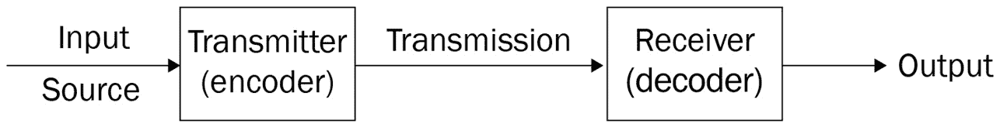
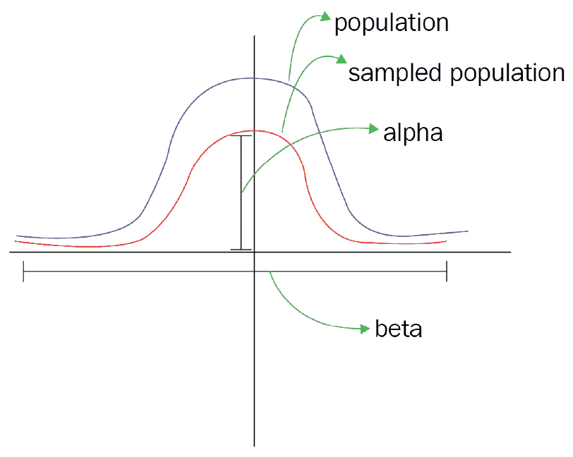
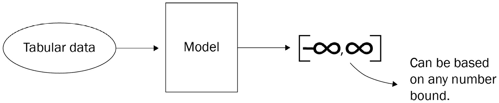

# 九、机器学习基础

**机器学习** ( **ML** )领域每天都在变大，做了成吨的研究，用 ML 算法构建了各种类型的智能/智能应用。这个领域正获得越来越多的兴趣，越来越多的人着迷于了解它是如何工作的以及如何利用它。

在这一章中，我们将试图对 ML 为什么以及它是如何工作的有一个基本的了解，并且还将看到它在现实生活中应用的各种形式。

在本章中，我们将通过以下主题来了解 ML 的基础知识:

*   机器学习导论
*   机器学习为什么有效
*   机器学习问题/任务
*   JavaScript 中的机器学习
*   机器学习的应用
*   深入了解机器学习的资源

# 技术要求

本章以简单的形式介绍了 ML，因此不需要任何先验知识。

# 机器学习入门

在这一节中，我们将通过一个简单的类比来介绍 ML，这个类比可以作为建立我们的解释的共同点。我们还将看到 ML 为什么以及如何工作。

我们将通过使用信息传输系统作为 ML 的简单类比来开始这一部分。

## 机器学习系统的简单类比

我记得有一次我在推特上讨论关于人工智能和其他一些很酷的话题。我被告知给那些感兴趣但没有完全理解要点的人简单介绍一下 ML。

这个推特空间中的大多数人都是软件工程师，以前没有数学、统计或任何与 ML 相关的主题的知识，我遇到过这样的情况，由于添加了一些技术术语，人们无法理解主题的术语。

本节旨在通过避免过多的技术术语和找到解释 ML 的共同点来解释 ML。

使用信息传输系统，如电话，从信号源获取信息，然后将其编码为数字信号，并通过传输通道传输到接收器，接收器将信号解码为信号源输入，可以是语音、图像等。

下图显示了信息传输的完整概念:

图 9.1–信息传输

前面的定义适用于发送方和接收方位于不同端点的信息传输系统，但对于扩音器等系统，输入语音被编码为数字信号，然后在输出端进行解码和放大。

下面是扩音器的示意图:

图 9.2–简单的信息传输系统

使用前面的段落，我们可以建立 ML 的概述。在上一段中，我们提到了一些特定的关键词，它们被编码和解码。

在信息传输系统中，大量的信息——无论是语音还是图像——在源端被编码或压缩成数字信号，然后在输出端被解码回源信息。

上一段中描述的同样的事情也适用于 ML 系统——大量的信息被编码或压缩成*种表示形式*(记住高亮显示的单词)，然后被解码成概念或智能或决策输出。

注意前面两段中的术语*数字信号*和*表示形式*。在信息传输系统中，有一些信息论负责将任何形式的输入(任何类型的图像、任何类型的声音/语音)转换成数字信号。

但是在 ML 中，我们有一些理论和算法的形式。这些算法不仅仅处理输入信息并给出输出。首先，获取一个信息样本。这些信息被处理并用于构建一种表示形式，该形式总结了整个信息并将其映射到决策输出。

这种表示形式用于构建最终的 ML 系统，该系统获取输入源，将其与表示形式进行比较，并输出与源输入和表示形式之间的比较相匹配的解码决策(智能输出)。

下图显示了前两段的概念图:

图 9.3–机器学习的概念说明

从前面的段落中，关于 ML 有一些关键的事情需要注意，如下所示:

*   首先，我们从大量信息中生成一种表示形式。另外，请注意从一组信息中生成一种表示形式的过程被称为**训练**。
*   然后生成的表示形式用于创建最终的 ML 系统，这个过程称为**推理**。

在下一小节中，我们将看到这种表示形式是如何生成的，从一大组信息中生成一种表示形式背后的整个思想，然后使用这种表示来构建最终的 ML 系统。

# 机器学习为什么有效

在我们训练 ML 模型的示例中，我们讨论了生成一种用于构建 ML 系统的表示形式。需要注意的一点是，这些信息或用于生成表示形式的数据是我们未来信息来源的数据表示。为什么我们需要未来信息来源的数据表示？在这一小节中，我们将研究这一点，看看它如何帮助创建 ML 模型。

让我们假设我们被告知在一个特定的社区进行关于产品兴趣的研究。想象一下，这个社区由大量的人组成，而我们只能接触到几个人——假设社区人口的 50%。

这个想法是，根据从 50%的人口中获得的信息，我们应该能够对剩余的 50%的人口进行归纳。我们之所以这样假设，是因为来自同一个社区或人口的一组人被认为拥有相当多相同的属性和信仰。因此，如果我们使用从这个群体中 50%的个体获得的信息来训练我们的模型，我们的模型应该能够区分来自属于同一群体的任何个体的任何信息。

在最坏的情况下，人口中可能会有一些异常值——与其他人没有相同信仰的人，或者我们从 50%的人口中获得的个人信息可能无法捕捉到其他 50%人口的属性。在这种情况下，如果将此信息传递到模型中，模型将失败。

上一段展示了为什么在默认情况下，ML 中的数据越多，ML 模型就越好。下图显示了样本分布(我们 50%的个人信息)和人口本身:

图 9.4–人口分布

从*图 9.3* 中，当我们说我们在 ML 中训练时，我们的意思是 ML 算法正在从我们采样的总体中学习控制和概括总体的参数(在这种情况下，该参数是表示的形式)。我们有两个参数，β和α，我们训练的目标是让模型从这些控制种群的参数中获得最佳值。

让我们看一个更具体的例子:我们想创建一个应用，只给狗分配一种特定的产品。但是你知道，我们有不同品种的狗，狗也有一些与猫相似的面部特征。

为了创建这个应用的 ML 模型，我们对一些狗的图像进行了采样，但是这个样本并没有捕获所有品种的狗。ML 模型的目标是从给它的数据中单独捕获狗的唯一属性/参数(这些唯一属性/参数是表示的形式)。

如果模型好的话应该能分辨出输入的图像是不是狗。那我们如何衡量模型的好坏呢？以下方法用于实现这一点:

*   **目标功能**
*   **评估指标**

在下面的小节中，我们将看到这些方法是如何工作的。

## 目标函数

我们已经看到了如何从大量人群中采样数据，并使用它来训练我们的模型，并希望该模型能够很好地推广。在培训过程中，我们希望衡量我们的模型离我们的目标有多近，并为此创建一个目标函数。有些人用不同的名字来称呼这个函数，如损失函数或错误率。这个函数返回的分数越低，我们的模型就越好。

例如，为了分类图像是否是狗，我们有包含狗和猫的图像的数据集。该数据集还包含标签。数据集中的每个图像都有一个标签，它告诉我们数据集中的图像是狗的图像还是猫的图像。

下面显示了数据集的外观示例:

图 9.5–数据集示例

训练时，数据中的每一张图像，如图*图 9.5* 所示，作为输入传递到模型中，模型预测标签。通过目标函数将模型预测的标签与*图 9.4* 所示的标签进行比较。我们继续训练模型，直到模型预测到数据集中每个图像的真实标签。

该模型可能能够基于目标函数对数据集中的所有图像进行正确分类，但这并不意味着该模型能够很好地概括，也就是说，该模型可能能够在训练过程中对一些狗的图像进行正确分类，但当给定的图像在数据集中不可用时，如图*图 9.4* 所示，该模型会对图像进行错误分类。这就引出了第二种方法。

## 评估指标

我们已经训练了我们的模型，它给了我们一个非常低的损失分数，这很好，但是我们需要确定模型是捕获了整个群体的属性，还是只捕获了用于训练的数据集的采样群体的属性。我在说什么？模型在训练时表现良好是可能的，但如果我们要在包含狗和猫的其他图像上测试它，它实际上是不好的。

为了检查该模型是否良好，并且已经捕获了每一群狗和猫所特有的属性，我们在一组数据集上测试该模型，该数据集也是来自与用于训练的种群相同的种群的样本。如果模型能够给我们一个更好的分数，那么模型就是好的；如果与来自目标函数的分数相比，该分数是差的，则该模型是差的。这个过程称为评估过程，我们使用不同的指标来衡量模型的性能。这些指标被称为**评估指标**。

下图显示了 ML 模型的管道:

图 9.6–机器学习管道

在本节中，我们讨论了基于 ML 的信息传递。我们看到了 ML 模型是如何工作的，以及 ML 模型的基本工作流程。在下一节中，我们将讨论如何将 ML 任务分成不同的类别。

# 机器学习问题/任务

ML 问题或分类问题等任务可以根据模型学习的方式分为不同的组。

在本节中，我们将研究两类最常见的 ML 问题:

*   **监督学习**
*   **无监督学习**

首先，我们将研究监督学习。

## 监督学习

在这一类别中，模型在监督下学习。监管，我们的意思是模型知道它是否做得很好基于提供的标签。在训练时，我们为模型提供了一个包含一组标签的数据集，用于校正和改进模型。有了这个，我们就可以衡量模型的表现了。

以下 ML 问题/任务属于此类别:

*   **分类问题**:在这种类型的问题中，模型用于将输入分类为一组离散的类别，例如将图像分类为狗还是猫。
*   **回归问题**:这涉及到模型将输入映射到一组连续值。例如，创建一个模型来预测房子的价格，给出房子的一些特征。

下图显示了什么是分类:

图 9.7–分类问题

下图显示了回归问题的图示:

图 9.8–回归问题

综上所述，有监督学习算法用于数据集提供有标签的问题，其中标签用于衡量模型的性能。有时候我们有数据，但是我们没有一个基本的事实来衡量模型的表现。这就导致了无监督学习。

## 无监督学习

当我们没有标签，但我们有我们的数据时，我们能做什么？最好的办法是从数据中汲取洞察力。

还记得本节开头的人口例子吗？假设我们从一个群体中抽样一些实体集合，但是没有它们行为的先验知识。最好的办法是研究他们一段时间，这样我们就能了解他们的好恶，找出他们的独特之处。

通过这种观察，我们可以根据他们的信仰、职业、食物口味等将人口分组。

下列最大似然问题属于无监督学习范畴:

*   **聚类问题**:聚类问题涉及到揭示一个数据集(我们的抽样群体)中的一些隐藏属性，然后根据这个属性对群体中的每个实体进行分组。
*   **关联问题**:这涉及到在种群中发现关联规则。它包括知道从事一种活动的人是否也从事另一种活动。

这主要是因为我们想要从这个数据集中获得隐藏的洞察力，如下图所示:

图 9.9–无监督学习(聚类示例)

在这一节中，我们研究了 ML 问题的一些类别，并且我们还看到了一个场景，其中每个 ML 问题类别都很重要，并且它们应该用于哪种任务。

在下一节中，我们将讨论如何让 ML 更容易访问。

# JavaScript 中的机器学习

网络是最容易访问的平台，而 JavaScript 是网络上使用的语言，因此 JavaScript 中的 ML 给了我们更多的控制和可访问性。在 [*第三章*](03.html#_idTextAnchor066)*为什么需要丹佛寺*一节中，我们谈到了将 ML 带入网络的重要性。我们还讨论了浏览器的计算能力是如何增加的，以及这对 ML 的 JavaScript 有什么好处。

在这一部分，我将在浏览器中列出一些用于 ML 任务的开源工具:

*   **tensorflow . js**(**tfjs**)([https://github.com/tensorflow/tfjs](https://github.com/tensorflow/tfjs)):一个用于训练和部署 ML 模型的 WebGL 加速 JavaScript 库。
*   **数据烹饪**([https://github.com/imgcook/datacook](https://github.com/imgcook/datacook)):一个用于数据集上特征工程的 JavaScript 框架。
*   **Nlp . js**([https://github.com/axa-group/nlp.js](https://github.com/axa-group/nlp.js)):一个用于情感分析、自动语言识别、实体提取等 NLP 任务的 JavaScript 框架。
*   **自然**([https://github.com/NaturalNode/natural](https://github.com/NaturalNode/natural)):还有，NLP，它几乎涵盖了 NLP 任务的所有必要算法。
*   **pip cook**([https://github.com/alibaba/pipcook](https://github.com/alibaba/pipcook)):一个面向 web 开发者的机器学习平台。
*   **Jimp**([https://github.com/oliver-moran/jimp](https://github.com/oliver-moran/jimp)):完全用 JavaScript 编写的图像处理库。
*   **brain . js**([https://github.com/BrainJS/brain.js](https://github.com/BrainJS/brain.js)):一个 GPU 加速了浏览器和 Node.js 的 JavaScript 中的神经网络。

上述工具是最受欢迎的，并且有最新的更新。通过使用这些工具，您可以将 ML 集成到下一个 web 应用中。

在下一节中，我们将研究 ML 在现实世界中的一些应用。

# 机器学习的应用

ML 正在转变软件开发，也在让事情变得更加*自动**自动驾驶**自动操作*。在本节中，我们将研究一些 ML 应用的例子。

以下是机器学习应用的示例:

*   **机器翻译** : ML 使我们能够构建软件，轻松地将一种语言翻译成另一种语言。
*   **游戏**:有了一些先进的 ML 算法，一些软件越来越擅长玩更复杂的游戏，比如围棋，在自己最擅长的地方击败世界冠军。比如这里有一个关于**alpha go**:[https://www.youtube.com/watch?v=WXuK6gekU1Y](https://www.youtube.com/watch?v=WXuK6gekU1Y)的视频。
*   **Vision**: Machines are getting better at seeing and providing meaning for what they see.

    a) **自动驾驶汽车** : ML 正在帮助打造全自动驾驶汽车。

    b) **特斯拉自动驾驶汽车演示**:[https://www.youtube.com/watch?v=VG68SKoG7vE](https://www.youtube.com/watch?v=VG68SKoG7vE)

*   **Recommendation engines**: ML algorithms are improving recommendation engines and hooking customers.

    *网飞*如何使用 ML 进行个性化推荐:[https://netflixtechblog . com/article-personalization-c 589 f 074 ad 76](https://netflixtechblog.com/artwork-personalization-c589f074ad76)

*   **Art**: ML is used to generate artworks, new stories, new paintings, and new images.

    a)这里有一个生成从未存在过的人的图像的网站:[https://thispersondoesnotexist.com/](https://thispersondoesnotexist.com/)。

    b)生成的美术馆:[https://www.artaigallery.com/](https://www.artaigallery.com/)。

    c)ML 建筑设计:[https://span-arch.org/](https://span-arch.org/)

在这一节中，我们看到了一些 ML 如何被用于不同目的的例子。在下一节中，我们将提供一些材料来更好地理解 ML。

# 深度理解机器学习的资源

在本节中，我们将提供资源，以便更深入地理解 ML，并更好地利用 ML 算法创建软件。

以下是可用于理解 ML 的资源:

*   **fastai**([https://www.fast.ai/](https://www.fast.ai/)):这个社区为 ML 从业者提供课程、框架和书籍。
*   **cs231 n**([http://cs231n.stanford.edu/](http://cs231n.stanford.edu/)):本课程给出**深度学习**的基础知识，为您介绍计算机视觉。
*   **拥抱脸**:拥抱脸为**自然语言处理**和不同的变压器型号提供了最好的框架。它还有一门课程([https://huggingface.co/course/chapter1](https://huggingface.co/course/chapter1))提供了变压器型号和部署的全部细节。
*   **吴恩达课程**:在 *YouTube* 上的一门 ML 课程，也提供完整的 ML 细节。

网上有大量关于 ML 的资料可以学习。只要走一条路，一直走到最后，避免从一个讲座跳到另一个讲座。

# 总结

在这一章中，我们使用信息传递的概念来研究 ML。然后我们研究了它是如何以及为什么工作的。我们还谈到了从人群中取样以了解人群的想法。

我们讨论了不同类别的 ML 问题，还讨论了网络平台 ML 所需的一些工具，我们还展示了一些 ML 的真实应用示例。

这一章的目的是获得 ML 的整体概念，以帮助个人学习过程中的理解。

下一章我们将介绍 **TensorFlow.js** 。TensorFlow.js 在将 ML 集成到您的网络应用中时非常有用。