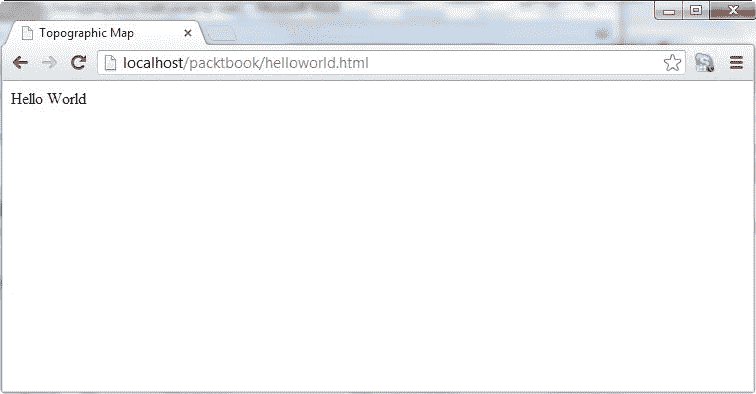
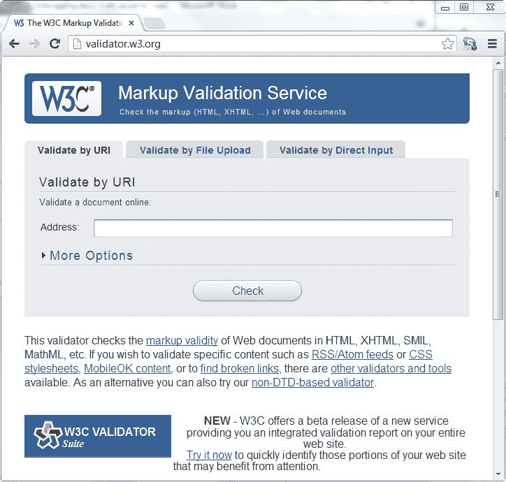
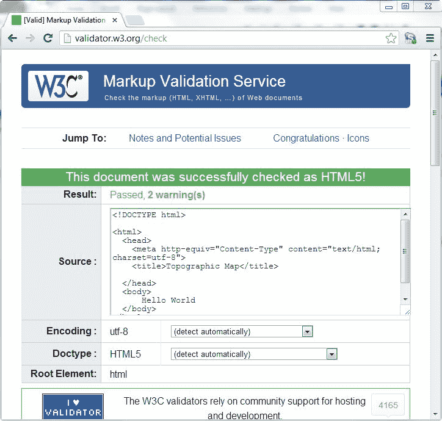
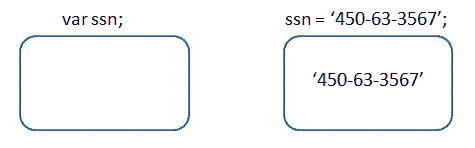

# 一、HTML、CSS 和 JavaScript 简介

在开始使用 ArcGIS for JavaScript API 开发地理信息系统应用之前，您需要了解某些基本概念。对于那些已经熟悉 HTML、JavaScript 和 CSS 的人来说，您可能希望跳到下一章。然而，如果你是这些概念的新手，请继续阅读。我们只在非常基础的层面上讨论这些话题。足以让你开始。对于这些科目中的任何一门，有许多学习资源可供选择，包括书籍和在线教程。有关这些资源的更全面列表，请参考[附录](01.html)。

在本章中，我们将涵盖以下主题:

*   基本的网页概念
*   JavaScript 基础知识
*   基本 CSS 原则

# 基本的网页概念

在我们深入研究创建地图和添加信息层的细节之前，您需要了解当您使用 ArcGIS for JavaScript API 开发应用时，代码将放置在哪里的上下文。您编写的代码将放在一个 HTML 页面或 JavaScript 文件中。HTML 文件的扩展名通常为`.html`或`.htm`，而 JavaScript 文件的扩展名为`.js`。一旦创建了基本的 HTML 页面，就可以通过必要的步骤，使用 ArcGIS for JavaScript 应用编程接口创建基本地图。

网页的核心是一个 HTML 文件。编写这个基本文件非常重要，因为它是应用其余部分的基础。当您的 JavaScript 代码试图访问这些标签时，您在基本的 HTML 编码中犯的错误可能会导致进一步的问题。

下面是一个非常简单的 HTML 页面的代码示例。这个例子就像一个 HTML 页面能得到的一样简单。它只包含主要的 HTML 标签`<DOCTYPE>`、`<html>`、`<head>`、`<title>`和`<body>`:

```js
<!DOCTYPE html> 
<html> 
  <head> 
    <meta http-equiv="Content-Type" content="text/html; charset=utf-8"> 
    <title>Topographic Map</title> 
   </head> 
  <body> 
      Hello World 
  </body> 
</html> 
```

目前使用的 HTML 有多种风格。今天开发的大多数新的 HTML 页面都使用 HTML5，所以我们将在整本书中关注 HTML5，但不深入研究它的许多高级功能。你可能在野外遇到的其他版本的 HTML 包括 HTML 4.0.1 和 XHTML 1.0。

# 文档类型

您的 HTML 页面的第一行将包含 DOCTYPE。这是用来告诉浏览器应该如何解释 HTML 的。我们将在本书中关注 HTML5，因此您在下面看到的第一个示例使用了 HTML5 DOCTYPE。另外两种常见的文档类型是 HTML 4.01 Strict 和 XHTML 1.0 Strict:

*   HTML5:

```js
<!DOCTYPE html>      
```

*   HTML 4.01 严格:

```js
<!DOCTYPE html PUBLIC "-//W3C//DTD HTML 4.01//EN" "http://www.w3.org/TR/html4/strict.dtd">
```

*   XHTML 1.0 严格:

```js
<!DOCTYPE html PUBLIC "-//W3C//DTD XHTML 1.0 Strict//EN" "http://www.w3.org/TR/xhtml1/DTD/xhtml1-strict.dtd"> 
```

# 主要标签

至少，你所有的网页都需要包含`<html>`、`<head>`和`<body>`标签。`<html>`标签定义了整个 HTML 文档。所有其他标签必须放在此标签内。定义网页在浏览器中的显示方式的标签位于`<body>`标签内。例如，您的地图应用将在`<body>`标签中包含一个`<div>`标签，用作显示地图的容器。

在浏览器中加载这个 HTML 页面会产生您在下面的截图中看到的内容。您编写的大多数用于 JavaScript 代码的 ArcGIS API 将被放置在`<head></head>`标签之间，或者在`<script>`标签内，或者在单独的 JavaScript 文件内。随着经验的积累，您可能会开始将 JavaScript 代码放入一个或多个 JavaScript 文件中，然后从`<head>`部分引用它们。我们稍后将探讨这个话题。现在只需将代码放在`<script>`标签内，放在`<head>`标签内:



# 验证 HTML 代码

我已经提到，正确编码您的 HTML 标签非常重要。你说的这些都很好，但是我怎么知道我的 HTML 编码是正确的呢？嗯，有很多 HTML 代码验证器可以用来检查你的 HTML。下面截图中显示的 W3C HTML 验证器([http://validator.w3.org/](http://validator.w3.org/))可以通过 URI、文件上传或直接输入来验证 HTML 代码:



假设您的 HTML 代码成功验证，您将看到一个漂亮的屏幕，显示一条消息，表明验证成功，如下图所示:



另一方面，它会用红色的错误信息来识别任何问题，如下图所示。详细描述了错误，这使得纠正问题更加容易。通常一个错误会导致许多其他错误，因此看到一长串错误项目并不罕见。如果是这样，不要惊慌。修复一个错误通常会解决许多其他错误:


要更正前面文档中的错误，您需要在文本 Hello World 周围加上段落标记:

```js
<p>Hello World</p>
```

# JavaScript 基础知识

顾名思义，用于 JavaScript 的 ArcGIS API 要求您在开发应用时使用 JavaScript 语言。在开始构建应用之前，您需要了解一些基本的 JavaScript 编程概念。

JavaScript 是一种轻量级脚本语言，嵌入在所有现代网络浏览器中。尽管 JavaScript 在其他应用中肯定可以存在于 web 浏览器环境之外，但它最出名的还是与 web 应用的集成。

包括 Chrome、Firefox、Safari 和 Edge 在内的所有现代网络浏览器都嵌入了 JavaScript。在 web 应用中使用 JavaScript 可以创建动态应用，而不需要往返服务器获取数据，因此应用的响应速度更快，感觉像本地应用。然而，JavaScript 可以向服务器提交请求以获取更多(或更最新的)信息，并且是 **AJAX** ( **异步 JavaScript 和 XML** )堆栈中的核心技术。

One common misconception regarding JavaScript is that it is actually a simplified version of Java. The two languages are actually unrelated: only the names and C-like syntax are similar.

# 注释代码

最好的做法是始终使用注释来记录您的 JavaScript 代码。至少，这应该包括代码的作者，最后一次修订的日期，以及代码的一般用途。此外，在整个代码中的不同点，您应该包括定义应用特定部分用途的注释部分。本文档的目的是让您或其他程序员在代码需要以某种方式更新时更容易快速跟上进度。

您在代码中包含的任何注释都不会被执行。它们只是被 JavaScript 解释器忽略了。JavaScript 可以通过多种方式进行注释，包括单行注释和多行注释。单行注释以`//`和您添加到行中的任何附加字符开始。下面的代码示例显示了如何创建单行注释:

```js
//this is a single line comment.  This line will not be executed
```

JavaScript 中多行注释以`/*`开始，以`*/`结束。中间的任何一行都被视为注释，不会被执行。下面的代码示例显示了多行注释(也称为*块*注释)的示例:

```js
/* 
Copyright 2012 Google Inc. Licensed under the Apache License, Version 2.0 (the "License"); you may not use this file except in compliance with the License. You may obtain a copy of the License at http://www.apache.org/licenses/LICENSE-2.0 Unless required by applicable law or agreed to in writing, software distributed under the License is distributed on an "AS IS" BASIS, WITHOUT WARRANTIES OR CONDITIONS OF ANY KIND, either express or implied. See the License for the specific language governing permissions and limitations under the License. 
*/ 
```

# 变量

变量是一个基本概念，在使用任何编程语言时都需要理解。变量只是我们用来与数据值关联的名称。在较低的层次上，这些变量是计算机内存中用来存储数据的空间区域。

你可以把一个变量想象成一个盒子，它有一个名字并包含某种数据。当我们最初创建变量时，它是空的，直到数据被赋值。基本上，变量给了我们存储和操作数据的能力。在下图中，我们创建了一个名为 ssn 的变量。最初，该变量为空，但随后被赋值为 450-63-3567。分配给变量的数据值可以是各种类型，包括数字、字符串、布尔值、对象和数组:



在 JavaScript 中，变量是用 var 关键字声明的。一般来说，分配给变量的名称完全由您决定。但是，在创建变量时，您需要遵守某些规则:

*   变量名可以包含文本和数字，但绝不能以数字开头。始终以字母或下划线作为变量名的开头。
*   不允许有空格。如果您希望您的变量名包含多个单词，请使用*骆驼大小写*符号。这个惯例要求第一个单词使用小写字母，随后单词的第一个字母大写。例如:`myVariableName`。
*   变量名中不允许使用特殊字符，如百分比符号和&符号。但是，下划线是允许的，可以出现在变量名的任何地方。

除此之外，您可以随意创建变量名，但是您应该尝试分配描述将要分配给变量的数据的变量名。用相同的`var`关键字声明多个变量也是完全合法的，如下面的代码示例所示:

```js
var i, j, k; 
```

您也可以将变量声明与数据赋值相结合，如以下示例所示:

```js
var i = 10;
var j = 20;
var k = 30;
```

您可能还注意到，每个 JavaScript 语句都以分号结尾。分号表示 JavaScript 中语句的结尾，应该始终包含在内。缺少分号是许多 JavaScript 编程错误的原因。

# JavaScript 区分大小写

我们需要明确的一点是，JavaScript 是一种区分大小写的语言。您必须非常小心，因为它会在您的代码中引入一些难以追踪的 bug。所有变量、关键字、函数和标识符都必须用一致的大写字母键入。当您考虑到 HTML 不区分大小写时，这变得更加令人困惑。

这往往是新的 JavaScript 开发人员的绊脚石。我创建了三个变量，它们都有相同的拼写，但是因为它们不遵循相同的大写模式，所以最后有三个不同的变量，如下所示:

```js
var myName = 'Eric';
var myname = 'John';
var MyName = 'Joe';
```

# 可变数据类型

JavaScript 支持可以分配给变量的各种类型的数据。与其他强类型语言不同，例如。NET 或 C++，JavaScript 是一种松散类型的语言。这意味着您不必指定将占用您的变量的数据的*类型*。JavaScript 解释器会随时为您完成这项工作。您可以为变量分配文本、数字、布尔`true/false`值、数组或对象的字符串。

在大多数情况下，数字和字符串是非常直接的。字符串只是由单引号或双引号括起来的文本。例如:

```js
var baseMapLayer = "Terrain";
var operationalLayer = 'Parcels';
```

数字不包含在引号内，可以是整数或浮点数:

```js
var currentMonth = 12;
var layered = 3;
var speed = 34.35;
```

我们要向新程序员指出的一点是，可以通过使用单引号或双引号将数值赋给字符串变量。这有时会让一些新程序员感到困惑。例如，不带单引号或双引号的值 3.14 是一种数字数据类型，而带单引号或双引号的值“3.14”被赋予一种字符串数据类型。

其他数据类型包括简单为真或假值的布尔值，以及数据值集合的数组。一个数组基本上充当多个值的容器。例如，您可以在数组中存储地理数据图层名称列表，并根据需要单独访问数组中的每个元素。

数组允许您在单个变量中存储多个值。例如，您可能希望存储要添加到地图中的所有图层的名称。您可以使用数组将所有变量存储在一个变量中，而不是为每个层创建单独的变量。然后，您可以使用索引号或通过`for`循环来引用数组中的单个值。下面的代码示例演示如何在 JavaScript 中创建一个数组，并通过其索引值引用其各个成员:

```js
var myLayers=new Array();  
myLayers[0]="Parcels";        
myLayers[1]="Streets"; 
myLayers[2]="Streams"; 
```

您还可以简化此数组变量的创建，如下面的代码示例所示，其中数组被创建为用括号括起来的逗号分隔的列表:

```js
var myLayers = ["Parcels", "Streets", "Streams"]; 
```

请记住，如果通过数组元素的索引来访问数组元素，则索引编号是从零开始的。这意味着数组中的第一项占据位置 0，并且数组中的每个连续项都递增 1:

```js
var layerName = myLayers[0]; //returns Parcels
```

# 决策支持声明

JavaScript 和其他编程语言中的`if/else`语句是一种控制语句，允许在代码中进行决策。这种类型的语句基于您在语句顶部指定的表达式执行测试。如果测试返回一个值`true`，那么与`if`块相关的语句将运行。如果测试返回`false`值，则执行跳到第一个`else if`块。这种模式一直持续到测试中返回`true`值或者执行达到`else`语句。下面的代码示例显示了该语句的工作原理:

```js
var layerName = 'streets'; 
if (layerName == 'aerial') { 
    alert("An aerial map"); 
} 
else if (layerName == "hybrid") { 
    alert("A hybrid map"); 
} 
else { 
    alert("A street map"); 
} 
```

# 循环语句

循环语句使您能够一次又一次地运行同一代码块。JavaScript 中有两种基本的循环机制。当条件为`true`时，`for`循环执行一个代码块指定次数，`while`循环执行一个代码块。一旦条件变为`false`，循环机构停止。

`for`循环的语法如下所示。您会注意到，它接受一个整数的循环计数器的起始值和一个条件表达式，如果它的计算结果为`false`，将导致循环终止。您还应该提供一个增量，在循环的每次迭代中增加循环计数器的值:

```js
for (start value; condition statement; increment) 
{ 
  the code block to be executed 
} 
```

在以下示例中，起始值被设置为 0，并被分配给名为`i`的变量。条件语句是当`i`小于或等于 10 时，`i`的值使用`++`运算符在循环的每次迭代中递增 1。循环体中的代码打印当前迭代的`i`值:

```js
var i = 0; 
for (i = 0; i <= 10; i++) { 
    document.write("The number is " + i); 
    document.write("<br/>"); 
} 
```

JavaScript 中的另一个基本循环机制是`while`循环。当条件为`true`时，当您想要执行代码块时，使用此循环。一旦条件设置为`false`，执行停止。`while`循环接受单个参数，该参数是将被测试的条件表达式。在以下示例中，当`i`小于或等于 10 时，代码块将执行。最初`i`设置为 0 值。在代码块的末尾，您会注意到`i`增加 1(`i = i + 1`):

```js
var i = 0; 
while (i <= 10) 
{ 
    document.write("The number is " + i); 
    document.write("<br/>"); 
    i = i + 1; 
} 
```

重复`while`循环，直到`i`达到值 11。

# 功能

现在让我们讨论函数这个非常重要的话题。函数只是被调用时执行的命名代码块。您在本课程和开发工作中编写的绝大多数代码都将出现在您定义的函数中。

最佳实践要求您将代码拆分成执行小型离散任务的函数。这些代码块通常在网页的`<script>`标签内的`<head>`部分定义，但也可以在`<body>`部分定义。然而，在大多数情况下，您需要在`<head>`部分定义您的函数，这样您就可以确保一旦页面被加载，它们就可用了。

要创建一个函数，您需要使用`function`关键字，后跟您定义的函数名和作为参数变量传入的函数执行所需的任何变量。如果您需要您的函数向调用代码返回值，您将需要结合您想要传回的数据使用`return`关键字。

函数也可以接受参数，这些参数只是用来将信息传递给函数的变量。在下面的代码示例中，`multiplyValues()`函数被传递了两个变量:`a`和`b`。该信息以变量的形式可以在函数中使用，在这种情况下，函数返回`a`和`b`的乘积，该乘积被分配给变量`x`:

```js
  var x;  
  function multiplyValues(a, b) {
     x = a * b;
     return x;
  }

```

# 目标

现在我们已经了解了一些基本的 JavaScript 概念，我们将在这一节中讨论最重要的概念。为了使用用于 JavaScript 的 ArcGIS API 有效地对地图应用进行编程，您需要对对象有一个很好的基础理解，因此这是一个关键概念，您需要在继续之前掌握它。

用于 JavaScript 的 ArcGIS 应用编程接口广泛使用对象。我们将详细介绍这个编程库的细节，但现在我们将关注高级概念。对象是复杂的结构，能够将多个数据值和动作聚合到一个结构中。这与我们的原始数据类型(如数字、字符串和布尔值)有很大不同，后者只能保存一个值。

对象由数据和动作组成。属性形式的数据包含关于对象的信息。例如，对于在 ArcGIS Server JavaScript API 中找到的`Map`对象，有许多属性，包括地图范围、与地图关联的图形、地图的高度和宽度、与地图关联的图层等。这些属性包含有关对象的信息。

对象也有我们通常称为*方法*的动作，但是我们也可以将构造函数和事件归入这个类别。方法是地图可以执行的操作，例如添加图层、设置地图范围或获取地图比例。

构造函数是特殊用途的函数，用于创建对象的新实例。对于某些对象，还可以将参数传递给构造函数，以便对创建的对象进行更多控制。下面的代码示例显示了如何使用构造函数创建`Map`对象的新实例。你可以看出这个方法是一个构造函数，因为使用了我强调的`new`关键字。`new`关键字后跟对象名称和用于控制新对象的任何参数定义了对象的构造函数。在这个特殊的例子中，我们创建了一个新的`Map`对象，并将其存储在一个名为`map`的变量中。三个参数被传递到构造器中以控制`Map`对象的各个方面，包括地图的`basemap`、`center`和`zoom`比例级别:

```js
var map = new Map("mapDiv", {  
  basemap: "streets", 
  center:[-117.148, 32.706], //long, lat 
  zoom: 12 
}); 
```

事件是发生在对象上的动作，由最终用户或应用触发。这包括单击地图、平移地图或向地图添加图层等事件。

属性和方法是通过点标记法访问的，其中对象实例名与属性或方法之间用点隔开。例如，要访问当前地图范围，您可以在代码中输入`map.extent`。以下示例演示了如何访问对象的属性:

```js
var theExtent = map.extent; 
var graphics = map.graphics; 
```

方法也是如此，只是方法名称的末尾有括号。数据可以通过使用参数传递到方法中。在下面的第一行代码中，我们将一个名为`pt`的变量传递到`map.centerAt(pt)`方法中:

```js
map.centerAt(pt); 
map.panRight(); 
```

# 基本 CSS 原则

CSS 或级联样式表是一种用来描述网页上应该如何显示 HTML 元素的语言。例如，CSS 通常用于定义页面或页面集的通用样式元素，如字体、背景颜色、字体大小、链接颜色以及与网页视觉设计相关的许多其他内容:

```js
<style>
       html, body { height: 100%; width: 100%; margin: 0; padding: 0; } 
       #map{ 
         padding:0;
         border:solid 2px #94C7BA;
         margin:5px;
       }
       #header {
         border: solid 2px #94C7BA;
         padding-top:5px;
         padding-left:10px;
         background-color:white; 
         color:#594735; 
         font-size:14pt;
         text-align:left; font-weight:bold;
         height:35px;
         margin:5px;
         overflow:hidden;
       }
       .roundedCorners{
         -webkit-border-radius: 4px;
         -moz-border-radius: 4px;
         border-radius: 4px;
       }
       .shadow{

         -webkit-box-shadow: 0px 4px 8px #adadad;
         -moz-box-shadow: 0px 4px 8px #adadad;
         -o-box-shadow: 0px 4px 8px #adadad;      box-shadow: 0px 4px 8px #adadad;
       }
</style>
```

# CSS 语法

CSS 遵循某些规则，这些规则定义了选择什么样的 HTML 元素以及应该如何设置该元素的样式。CSS 规则有两个主要部分；一个选择器和一个或多个声明。选择器通常是您想要设置样式的 HTML 元素。在下面的例子中，选择器是`p`。HTML 中的一个`<p>`元素代表一个段落。CSS 规则的第二部分是一个或多个声明，每个声明由一个属性和值组成。属性表示要更改的样式属性。在我们的示例中，我们将`color`属性设置为红色。实际上，我们对这个 CSS 规则所做的是定义我们段落中的所有文本都应该是红色的`p {color:red}`:


下面是一个 CSS 规则的例子:

```js
p {color:red;text-align:center} 
```

您可以在 CSS 规则中包含多个声明，如您在前面的示例中所见。声明总是用花括号括起来，每个声明以分号结束。此外，应该在属性和值之间放置一个冒号。在这个特定的例子中，已经进行了两次声明；一个用于段落的颜色，另一个用于段落的文本对齐。请注意，声明由分号分隔。

CSS 注释用来解释你的代码。您应该养成习惯，像对待任何其他编程语言一样，总是对您的 CSS 代码进行注释。注释以斜杠后跟星号开始，以星号后跟斜杠结束。这样，它们就等同于 JavaScript 中的块注释。这些标记之间的所有内容都被视为注释，并被浏览器忽略:

```js
/* 
h1 {font-size:200%;} 
h2 {font-size:140%;} 
h3 {font-size:110%;} 
*/ 
```

除了为特定的 HTML 元素指定选择器之外，您还可以使用`id`选择器为任何具有与`id`选择器匹配的`id`值的 HTML 元素定义样式。在 CSS 中通过使用井号(`#`)后跟`id`值来定义`id`选择器。

例如，在下面的代码示例中，您会看到三个`id`选择器:`rightPane`、`leftPane`和`map`。在用于 JavaScript 应用的 ArcGIS API 中，您几乎总是有一张地图。当你定义一个`<div>`标签作为地图的容器时，你指定一个`id`并给它赋值，这个值通常是单词`map`。在本例中，我们使用 CSS 为地图定义了几种样式，包括 5 个像素的边距以及特定颜色的纯色边框和边框半径:

```js
#rightPane { 
    background-color:white; 
    color:#3f3f3f; 
    border: solid 2px #224a54; 
    width: 20%; 
} 
#leftPane { 
    margin: 5px; 
    padding: 2px; 
    background-color:white; 
    color:#3f3f3f; 
    border: solid 2px #224a54; 
    width: 20%; 
} 
#map { 
    margin: 5px; 
    border: solid 4px #224a54; 
    -mox-border-radius: 4px; 
} 
```

这导致以下布局:


与用于为单个元素指定样式的`id`选择器不同，`class`选择器用于为一组元素指定样式，所有元素都具有相同的 HTML `class`属性。类选择器用句点后跟类名来定义。您还可以指定只有具有特定类的特定 HTML 元素才会受到样式的影响。代码示例中显示了两者的示例，如下所示:

```js
.center {text-align:center;} 
p.center {text-align:center;} 

```

然后，您的 HTML 代码将引用`class`选择器，如下所示:

```js
<p class="center">This is a paragraph</p> 
```

如果你想对不同类型的几个 HTML 元素的样式进行分组，这种方法很有用。

There are three ways to insert CSS into your application: inline, or by using internal or external style sheets.

# 内嵌样式

为 HTML 元素定义 CSS 规则的一种方法是使用内嵌样式。不建议使用这种方法，因为它将风格和表达方式混合在一起，并且难以维护。尽管在某些情况下，您只需要定义一组非常有限的 CSS 规则，但这是一个选项。要使用内联样式，只需将`style`属性放在相关的 HTML 标记中:

```js
<p style="color:sienna;margin-left:20px">This is a paragraph.</p>
```

现在让我们把重点放在级联样式表的*级联*上。如您现在所知，样式可以在外部样式表、内部样式表或内联中定义。还有第四个层次，我们没有讨论是浏览器默认的。但是你无法控制。在 CSS 中，内联样式具有最高优先级，这意味着它将覆盖内部样式表、外部样式表或浏览器默认中定义的样式。如果没有定义内联样式，那么在内部样式表中定义的任何样式规则都将优先于在外部样式表中定义的样式。这里需要注意的是，如果在 HTML `<head>`中把外部样式表的链接放在内部样式表之后，那么外部样式表将会覆盖内部样式表！

# 内部样式表

内部样式表将所有的 CSS 规则移动到特定的网页中。只有该特定页面中的 HTML 元素才能访问规则。所有 CSS 规则都在`<head>`标签中定义，并包含在`<style>`标签中，如代码示例所示:

```js
<head>
     <style type="text/css"> 
        hr {color:sienna;} 
        p {margin-left:20px;} 
        body {background-image:url("images/back40.gif");} 
    </style> 
</head> 

```

# 外部样式表

外部样式表只是一个包含 CSS 规则的文本文件，以文件扩展名`.css`保存。然后，通过使用 HTML `<link>`标签，该文件被链接到所有想要实现外部样式表中定义的样式的网页中。这是从主网页中分离样式的常用方法，通过使用单个外部样式表，您可以改变整个网站的外观。

这些是你需要理解的关于 CSS 的基本概念。您可以使用 CSS 为网页上的几乎任何内容定义样式，包括背景、文本、字体、链接、列表、图像、表格、地图和任何其他可见对象。

That's a lot to remember! Just keep in mind that style rules defined further down in the hierarchy override style rules defined higher in the hierarchy.

# 分离 HTML、CSS 和 JavaScript

您可能想知道这些代码都放在哪里了。您应该将所有的 HTML、CSS 和 JavaScript 代码放在同一个文件中，还是将它们拆分成不同的文件？对于非常简单的应用和示例，将所有代码放入扩展名为`.html`或`.htm`的单个文件中并不罕见。在这种情况下，CSS 和 JavaScript 代码将驻留在你的 HTML 页面的`<head>`部分。

但是，创建应用的首选方式是将演示与内容和行为分开。应用的用户界面项应该位于一个 HTML 页面中，该页面只包含用于定义应用内容的标签，以及对作为应用一部分的任何 CSS(表示)或 JavaScript(行为)文件的引用。最终结果是一个单一的 HTML 页面和一个或多个 CSS 和 JavaScript 文件。这将导致一个类似于下面截图所示的文件夹结构，其中我们有一个名为`index.html`的文件和几个保存 CSS、JavaScript 和其他资源(如图像)的文件夹。

css 和 js 文件夹将包含一个或多个文件:


CSS 文件可以链接成带有`<link>`标签的 HTML 页面。在下面，您将看到一个代码示例，它向您展示了如何使用`<link>`标签来导入一个 CSS 文件。到 CSS 文件的链接应该在你的网页的`<head>`标签中定义:

```js
<!DOCTYPE html> 

<html> 
  <head> 
    <title>GeoRanch Client Portal</title> 
    <meta name="viewport" content="initial-scale=1.0, user-scalable=no"> 
    <link rel="stylesheet" href="bootstrap/css/bootstrap.css"> 
  </head> 
  <body> 
  </body> 
</html> 
```

JavaScript 文件被导入到带有`<script>`标签的 HTML 页面中，如下面的代码示例所示。这些`<script>`标签可以放在您的网页的`<head>`标签中，就像对`creategeometries.js`文件所做的那样，在接近页面末尾的`</body>`标签之前，可以看到对用于 JavaScript 的 ArcGIS API 的引用:

```js
<!DOCTYPE html>
<html>
    <head>
        <title>GeoRanch Client Portal</title>
        <meta name="viewport" content="initial-scale=1.0, user-scalable=no">
        <script src="https://js.arcgis.com/3.20/"></script>
    </head>
    <body>
        <script src="js/creategeometries.js"></script>
    </body>
</html> 
```

一些开发人员建议在接近结束`</body>`标签的地方导入你的 JavaScript 文件。这是因为，在呈现一个 HTML 页面时，浏览器会依次考虑 HTML 的每一行，直到当前的一行被处理完，才会进入下一行。如果您在`<head>`部分加载大型外部 JavaScript 文件，那么用户只会看到一个空白页面，直到脚本完全加载。他们的基本原理是，如果这些文件是最后加载的，用户至少会在下载时看到页面上呈现的内容。在作者看来，对于大多数用户来说，这通常不是问题，因为连接速度通常很快，即使是很大的外部文件也几乎可以瞬间下载。但是一定要记住。

当使用像 Dojo 这样的 JavaScript 库时，建议在`<head>`部分放一个`<script>`，这些库在与`<body>`部分的 HTML 元素交互之前必须被解析。这就是为什么我们总是在`<head>`部分引用 JavaScript 的 ArcGIS API。

The Dojo Toolkit is an open source modular JavaScript library, designed to enable the rapid development of web applications. The ArcGIS API for JavaScript is built upon Dojo, so we will be talking about it extensively in this book. Find out more about Dojo here: [https://dojotoolkit.org/](https://dojotoolkit.org/). Splitting your code into several files allows for a clean separation of your code and it should be much easier to maintain.

# 摘要

在我们开始详细讨论用于 JavaScript 的 ArcGIS API 之前，您需要了解一些基本的 HTML、CSS 和 JavaScript 概念。本章只提供了这些，但是您需要继续学习与这些主题相关的许多其他概念。现在你知道的已经足够危险了。

应用的视觉外观是通过您开发的 HTML 和 CSS 代码定义的，而它的功能是使用 JavaScript 控制的。这些是非常不同的技能组合，许多人擅长其中一种，但不一定擅长另一种。大多数应用开发人员将专注于通过 JavaScript 开发应用的功能，并将 HTML 和 CSS 留给设计人员！尽管如此，重要的是你至少要很好地理解所有这些主题的基本概念。在下一章中，我们将深入到用于 JavaScript 的 ArcGIS API 中，并开始学习如何创建`Map`对象，以及如何将动态和切片地图服务图层添加到地图中。