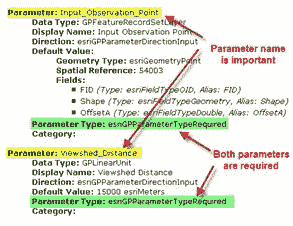
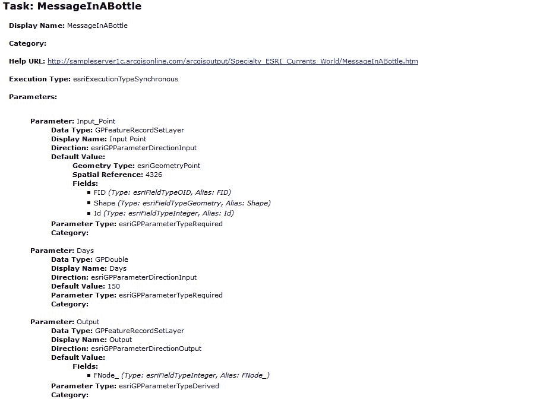
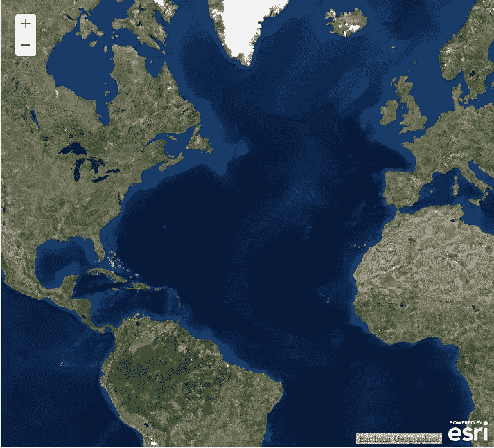
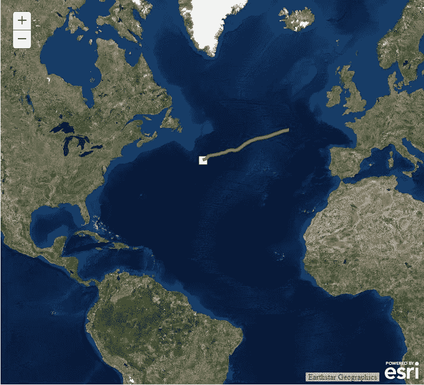

# 地理处理任务

地理处理是操作地理和相关数据的行为。Esri 的 ArcGIS Desktop 软件提供了大量地理处理工具，您可以将这些工具链接到模型中以完成特定的工作流，如下图所示。例如，您可以创建一个模型来缓冲一个层，然后将第二个层剪辑到其中。您可以将模型与缓冲区的流层和剪辑的植被层一起使用。但是，一旦创建了这个模型，您就可以使用它在其他层上执行相同的操作，而不必从头开始重新创建它。您也可以将其自动化，作为批处理操作的一部分。

但是，从我们作为 JavaScript 开发人员的 ArcGIS API 的角度来看，有趣的地方在于能够在 ArcGIS Server 中将这些地理处理工具作为服务发布，并在我们的网络地图应用程序中使用它们。

考虑一下。这意味着我们可以创建任何我们想要的地理信息系统工作流，让服务器执行它，并在我们的应用程序中访问它的结果。这是真正的力量，只需要很少的代码。

在本章中，我们将涵盖以下主题:

*   ArcGIS 服务器中的模型
*   使用`Geoprocessor`任务-你需要知道什么
*   了解地理处理任务的服务目录页面
*   `Geoprocessor`任务
*   执行任务
*   练习地理处理任务的时间


# ArcGIS 服务器中的模型

模型在 ArcGIS Pro 中使用`ModelBuilder.`构建完成后，您可以通过 ArcGIS Server 将其发布为地理处理服务。网络应用程序可以使用 ArcGIS 应用编程接口中的`Geoprocessor`任务对象来执行模型和检索结果。

虽然客户端负责向模型提供正确的参数并对结果进行解包，但实际模型是在 ArcGIS Server 上运行的。这是因为它们的计算成本很高，并且为了发挥它们的魔力，需要客户端上不可用的各种 ArcObjects。

地理处理作业由您的应用程序使用`Geoprocessor`任务对象提交给服务器。服务完成后，结果将被提取。下图说明了这一过程:


# 使用地质处理器任务-你需要知道什么

使用地理处理服务时，您需要了解三件事:

*   首先，您需要知道模型所在的 URL。示例网址如下。要使模型通过 ArcGIS Server 可用，请发布包含该模型的工具箱。工具箱可以包含多个模型，因此地理处理服务也可以包含。例如，以下网址引用了`ESRI_Population_World`地理处理服务中的`PopulationSummary`模型:
*   您需要知道模型需要什么输入参数，以及返回什么类型的数据。
*   最后，您需要知道任务是异步的还是同步的，因为这将影响您编写代码的方式。

所有这些信息都可以在地理处理任务的服务页面上找到:


# 了解地理处理任务的服务页面

地理处理服务的服务目录页面提供了将其包含在应用程序中所需的所有信息。

这包括同步或异步的执行类型。在下面截图中看到的`PopulationSummary`服务的情况下，它是一个同步任务。这意味着一旦应用程序执行完毕，在地理处理任务的结果返回之前，它不会执行任何其他操作。这种类型的执行通常只用于您期望快速执行的任务。

异步地理处理任务作为作业提交，允许您的应用程序在地理处理服务工作时继续运行。任务完成后，它会通知您的应用程序处理已经完成，结果已经准备好。

您需要从服务目录页面获得的其他服务信息包括参数名称、参数数据类型、参数是输入类型还是输出类型，以及参数是必需的还是可选的:


# 输入参数

几乎所有地理处理任务都需要一个或多个输入参数。这些参数可以指定为必需的或可选的，并作为 JSON 对象创建。您将看到一个代码示例，展示如何创建这些 JSON 对象，如下所示。当创建参数作为 JSON 对象时，您必须记住按照它们在服务页面上出现的确切顺序来创建它们。参数名称也必须与服务页面上的名称相同，如下例所示:



下面的代码示例是正确的，因为参数名称的拼写与在服务页面中看到的完全一样(并且使用相同的大小写:名称区分大小写)，并且它们是以正确的顺序提供的:

```js
var params = { 
    Input_Observation_Point: featureSetPoints, 
    Viewshed_Distance: 250 
}; 

```

相比之下，以下代码示例可能不正确，因为参数是以相反的顺序提供的:

```js
var params = { 
    Viewshed_Distance: 250, 
    Input_Observation_Point: featureSetPoints 
}; 
```

# 地质处理器任务

JavaScript 的 ArcGIS API 中的`Geoprocessor`类是协调输入参数、执行地理处理任务和协调任务结果集合的类。这样，它与你在本书中处理过的其他任务非常相似，比如`QueryTask`。

您可以通过调用`Geoprocessor.execute()`或`Geoprocessor.submitJob()`并输入所需的输入参数来启动地理处理操作。稍后我们将讨论这两种方法的区别。执行地理处理任务后，结果将返回到`Geoprocessor`对象，并由回调函数进行处理。

要创建`Geoprocessor`任务的实例，请导入`esri/tasks/Geoprocessor`模块，并将地理处理服务的网址提供给类构造器:

```js
require(["esri/tasks/Geoprocessor"], function(Geoprocessor) { 
    var url = "<gp service url>"; 
    var gp = new Geoprocessor(url); 
}); 
```

# 执行任务

您在`Geoprocessor`对象上调用的执行任务的方法取决于任务是同步的还是异步的。此信息可在地理处理服务的服务目录页面的*执行类型*下获得。当模型作为服务发布时，将设置执行类型。作为开发人员，在类型发布后，您无法对其进行任何控制。

只是提醒您，同步执行要求客户端在继续执行应用程序代码之前等待结果。在异步执行中，客户端提交一个作业，继续运行其他函数，并在稍后检查作业的完成情况。默认情况下，客户端每秒检查一次完成情况，直到作业完成。

# 同步任务

同步任务要求您的应用程序代码提交一个作业，并在继续之前等待响应。因为最终用户必须等待任务完成后才能继续与应用程序交互，所以仅当您期望地理处理服务非常快速地返回结果时，才使用同步任务。如果一个任务花费的时间不仅仅是几秒钟，可以考虑以异步方式重新发布服务。用户很快就会对看起来比这更长时间挂起的应用程序感到沮丧。

要执行同步任务，调用`Geoprocessor.execute()`方法，传入所需的参数和回调函数。回调函数在操作结果可用时执行，操作结果作为参数传递给回调函数。结果存储在`ParameterValue`的数组中。

# 异步任务

异步任务要求您提交作业，允许应用程序继续执行它必须执行的任何其他操作，然后在任务完成后使用 ArcGIS Server 重新检入以检索结果。这种方法的优势在于，它不会强迫最终用户等待结果。

要执行异步任务，请调用`Geoprocessor.submitJob()`方法。您需要提供输入参数、成功或错误回调函数，以及可选的状态回调函数。每次应用程序检查服务器以查看作业是否完成时，都会执行状态回调函数。默认情况下，每秒检查一次状态。但是，您可以通过调用`Geoprocessor.setUpdateDelay()`方法来更改该间隔。每次检查状态时，服务器都会返回`JobInfo`对象，该对象包含指示作业状态的信息。当`JobInfo.jobStatus`设置为`STATUS_SUCCEEDED`时，成功回拨功能执行。

下图说明了这一系列事件:


# 练习地理处理任务的时间

在本练习中，您将编写一个简单的应用程序，该程序使用粒子跟踪模型来估计瓶子在 180 天后会落在哪里，如果您将瓶子放入海洋中的某个特定点的话。服务目录条目如下所示。可以看到，这是一个同步服务，需要两个输入参数:一个`FeatureSet`包含表示瓶子掉落位置的点对象，一个`Double`表示应该允许瓶子漂移的天数。它返回单个输出参数，同样是`FeatureSet`类型，表示瓶子将走的路线:



1.  打开[https://developers . ArcGIS . com/JavaScript/3/Sandbox/Sandbox . html](https://developers.arcgis.com/javascript/3/sandbox/sandbox.html)处的 JavaScript Sandbox。
2.  从我突出显示的`<script>`标签中删除 JavaScript 内容，如下所示:

```js
<script> 
  var map; 

  require(["esri/map", "dojo/domReady!"], function(Map) { 
    map = new Map("map", { 
      basemap: "topo",  //For full list of ... 
      center: [-122.45, 37.75], // longitude, latitude 
      zoom: 13 
    }); 
  }); 
</script> 
```

3.  创建您的`require()`函数来导入我们将在本练习中使用的模块:

```js
<script> 
    require(["esri/map", 
        "esri/config", 
        "esri/geometry/webMercatorUtils", 
        "esri/tasks/Geoprocessor", 
        "esri/symbols/SimpleMarkerSymbol", 
        "esri/symbols/SimpleLineSymbol", 
        "esri/Color", 
        "esri/tasks/FeatureSet", 
        "dojo/_base/array", 
        "dojo/domReady!"], function (Map, esriConfig,  
            webMercatorUtils, Geoprocessor, SimpleMarkerSymbol, 
            SimpleLineSymbol, Color, FeatureSet, array) { 
    }); 
</script> 
```

4.  定义保存`Map`和`Geoprocessor`对象的变量，并使用以下选项实例化地图:

```js
<script> 
    var map, gp; 

    require(["esri/map", 
        "esri/config", 
        "esri/geometry/webMercatorUtils", 
        "esri/tasks/Geoprocessor", 
        "esri/symbols/SimpleMarkerSymbol", 
        "esri/symbols/SimpleLineSymbol", 
        "esri/Color", 
        "esri/tasks/FeatureSet", 
        "dojo/_base/array", 
        "dojo/domReady!"], function (Map, esriConfig, webMercatorUtils, Geoprocessor, SimpleMarkerSymbol, SimpleLineSymbol, Color, FeatureSet, array) { 

            map = new Map("map", { 
                basemap: "satellite", 
                center: [-43.682, 32.99], 
                zoom: 3 
            }); 
</script>
```

5.  在实例化`Map`的代码之后，为`Map.click`事件注册一个名为`executeGPTask`的事件处理程序:

```js
map.on("click", executeGPTask); 
```

6.  在`require()`功能中，创建新的`Geoprocessor`任务对象，并将输出空间参考设置为网络墨卡托(`wkid: 102100`):

```js
gp = new Geoprocessor("http://sampleserver1.arcgisonline.com/ArcGIS/rest/services/Specialty/ESRI_Currents_World/GPServer/MessageInABottle"); 
gp.setOutSpatialReference({ wkid: 102100 });
```

7.  现在，您将创建`executeGPTask()`函数，作为`Map.click()`事件的处理程序。此功能将清除任何现有图形，创建一个代表用户单击地图的点的新点图形，并执行地理处理任务。首先，在实例化`Geoprocessor`对象的代码行下面创建`executeGPTask()`函数的存根:

```js
gp = new Geoprocessor("http://sampleserver1.arcgisonline.com/ArcGIS/rest/services/ 
    Specialty/ESRI_Currents_World/GPServer/MessageInABottle"); 
gp.setOutSpatialReference({ wkid: 102100 }); 

function executeGPTask(evt) { 

} 
```

8.  清除任何现有图形并创建新的`SimpleMarkerSymbol`，它将代表在地图上单击的点:

```js
function executeGPTask(evt) { 
    map.graphics.clear(); 

    var ptSymbol = new SimpleMarkerSymbol() 
    ptSymbol.setStyle(SimpleMarkerSymbol.STYLE_SQUARE); 
    ptSymbol.setColor(new Color([255, 255, 255, 1.0])); 
    ptSymbol.setSize(15); 
}
```

9.  当`Map.click()`事件被触发时，一个`MouseEvent`对象被创建并传递到`executeGPTask()`功能。这个对象在我们的代码中由`evt`变量表示。在这一步中，您将使用包含从地图点击返回的`Point`几何图形的`Event.mapPoint`属性创建一个新的`Graphic`对象，并用您在上一步中创建的`SimpleMarkerSymbol`对其进行符号化。然后，您将这个新图形添加到`GraphicsLayer`中，以便它可以显示在地图上:

```js
function executeGPTask(evt) { 
    map.graphics.clear(); 

    var ptSymbol = new SimpleMarkerSymbol() 
    ptSymbol.setStyle(SimpleMarkerSymbol.STYLE_SQUARE); 
    ptSymbol.setColor(new Color([255, 255, 255, 1.0])); 
    ptSymbol.setSize(15); 

    var graphic = new esri.Graphic(evt.mapPoint, ptSymbol); 
    map.graphics.add(graphic); 
} 
```

10.  现在创建一个名为`features`的数组，并将`graphic`放入数组中。该图形阵列最终将被传递到`FeatureSet`对象，该对象将被传递到地理处理任务:

```js
function executeGPTask(evt) { 
    map.graphics.clear(); 

    var ptSymbol = new SimpleMarkerSymbol() 
    ptSymbol.setStyle(SimpleMarkerSymbol.STYLE_SQUARE); 
    ptSymbol.setColor(new Color([255, 255, 255, 1.0])); 
    ptSymbol.setSize(15); 

    var graphic = new esri.Graphic(evt.mapPoint, ptSymbol); 
    map.graphics.add(graphic); 

    var features = []; 
    features.push(graphic); 
}
```

11.  创建一个新的`FeatureSet`对象，并将图形阵列添加到`FeatureSet.features`属性中:

```js
function executeGPTask(evt) { 
    map.graphics.clear(); 

    var ptSymbol = new SimpleMarkerSymbol() 
    ptSymbol.setStyle(SimpleMarkerSymbol.STYLE_SQUARE); 
    ptSymbol.setColor(new Color([255, 255, 255, 1.0])); 
    ptSymbol.setSize(15); 

    var graphic = new esri.Graphic(evt.mapPoint, ptSymbol); 
    map.graphics.add(graphic); 

    var features = []; 
    features.push(graphic); 
    var featureSet = new FeatureSet(); 
    featureSet.features = features;     
}
```

12.  创建一个包含地理处理任务输入参数的 JSON 对象。输入参数为`Input_Point`、`Days`。请记住，每个输入参数必须完全按照服务目录页面中显示的顺序提供。我们将`Input_Point`定义为包含一组图形的`FeatureSet`对象(本例中只有一个单点图形)，并且`Days`应该被赋予`180`的数值。最后，由于这是一个同步服务，我们将使用`Geoprocessor.execute()`方法调用它，传递输入参数和成功回调(`displayResults`)和错误回调(`showError`)函数。接下来我们将创建这些回调函数:

```js
function executeGPTask(evt) { 
    map.graphics.clear(); 

    var ptSymbol = new SimpleMarkerSymbol() 
    ptSymbol.setStyle(SimpleMarkerSymbol.STYLE_SQUARE); 
    ptSymbol.setColor(new Color([255, 255, 255, 1.0])); 
    ptSymbol.setSize(15); 

    var graphic = new esri.Graphic(evt.mapPoint, ptSymbol); 
    map.graphics.add(graphic); 

    var features = []; 
    features.push(graphic); 
    var featureSet = new FeatureSet(); 
    featureSet.features = features; 

    var params = { "Input_Point": featureSet, 
                   "Days": 180 }; 
    gp.execute(params, displayResults, showError); 
} 

```

13.  在最后一步中，我们定义了一个名为`displayResults()`的回调函数，该函数将在地理处理服务成功完成时被调用。让我们创建这个`displayResults()`函数。`displayResults()`函数接受两个参数:结果对象和返回的任何消息。我们将忽略这个例子的消息，但是我们当然对结果感兴趣！在`executeGPTask()`功能的右括号下输入以下存根:

```js
function displayResults(results, messages) { 

}
```

14.  我们只希望此地理处理任务返回单个要素，即表示瓶子将采用的路径的折线。让我们深入到`results`对象中，并将该单个特征存储在名为`feature`的变量中，以使结果更容易处理:

```js
function displayResults(results, messages) { 
    var feature = results[0].value.features[0]; 
} 
```

15.  该要素将是一条折线，因此创建一个合适的`SimpleLineSymbol`以便我们可以在地图上显示它，并在将其添加到地图之前为其分配符号:

```js
function displayResults(results, messages) { 
    var feature = results[0].value.features[0]; 

    var lineSymbol = new SimpleLineSymbol(); 
    lineSymbol.setColor( 
        new Color([255, 0, 0])); 
    lineSymbol.setWidth(5);     

    feature.setSymbol(lineSymbol);     
    map.graphics.add(feature);     
}
```

16.  最后，让我们为我们的错误处理程序创建代码，称为`showError()`。现在，让我们将这个处理程序收到的任何错误对象转储到浏览器的控制台:

```js
function showError(err) { 
    console.log(err); 
}
```

17.  您可能需要查看示例代码的`Chapter10`文件夹中的解决方案文件(`geoprocessing.html`)，以验证您的代码是否已正确编写
18.  单击沙箱中的刷新按钮。你应该会看到下面的地图。如果没有，您可能需要重新检查代码的准确性:



19.  点击地图上的某个地方。您单击的点应出现一个正方形，地理处理任务将执行。耐心点。有时这可能需要几秒钟。当它完成时，您应该看到瓶子将采取的路径:



# 摘要

ArcGIS Server 可以将地理处理模型公开为服务，您的用于 JavaScript 应用程序的 ArcGIS API 可以访问这些服务。这些模型在 ArcGIS Server 上执行，因为它们的计算量很大，而且它们需要应用编程接口中不可用的 ArcGIS 组件来完成工作。您通过应用程序将这些请求连同所需的参数一起提交给服务器，任务完成后会返回结果。

地理处理任务可以同步或异步执行，并由 ArcGIS Server 管理员配置为以同步或异步方式运行。作为一名应用程序程序员，了解您正在访问的地理处理服务的类型非常重要，因为执行任务必须调用的方法取决于这些信息。您还需要仔细注意服务所需的参数，这些信息可以在服务目录中找到。在下一章中，您将学习如何使用几何服务。几何服务允许您执行某些常见操作，否则您将不得不依赖地理处理服务来提供这些操作。