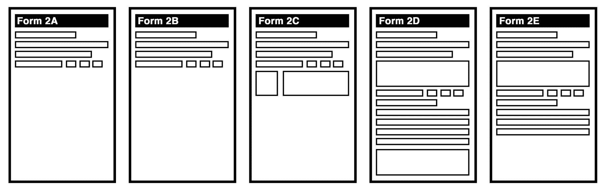

# SOLID 和其他原则

软件世界充斥着各种原则和缩写。 关于我们应该如何编写代码，有许多根深蒂固的想法。 它们的数量之多可能会让人不知所措，这使得在设计抽象时很难知道该走哪条路。 JavaScript 适应许多不同范例的能力是它作为编程语言的优势之一，但它也会使我们的工作更加困难。 JavaScript 程序员需要实现他们自己的范例。

这一章，希望使事情变得不那么复杂，将采取各种众所周知的原则，并将它们分解，以便我们可以看到它们的潜在意图。 我们将探讨这些原则如何与我们已经讨论过的干净代码原则相关联，使我们能够自己做出明智的决定，使用什么方法来追求干净的代码。

我们将涵盖面向对象和函数式编程原则。 通过探索这些原则，我们将能够为自己制作一幅指导思想的地图，它将使我们能够批判性地思考如何在我们所从事的任何范式中编写干净的代码。

在本章中，我们将涵盖以下主题:

*   **得米特定律**(**LoD**)
*   固体
*   抽象的原则
*   函数式编程的原则

# 得墨忒耳法则

在我们深入研究 SOLID 领域之前，先探讨一个不太为人所知的原则，即 LoD，或最小知识原则是很有用的。 这条所谓的定律有三个核心思想:

*   一个单位应该对其他单位只有有限的了解
*   一个单位只能和它最亲近的朋友交谈
*   单位不应与陌生人交谈

你可能会有理由想知道一个单元与一个*陌生人*交谈意味着什么。 在这个上下文中，单元是一个特定的编码抽象:可能是一个函数、一个模块或一个类。 在这里，*谈论*意味着*与*的接口，例如调用另一个模块的代码或让另一个模块调用您的代码。

这是一个非常有用和简单的法则，可以学习，然后应用到我们所有的编程中，无论是编写单独的代码行还是设计整个架构。 然而，它经常被遗忘或忽视。

让我们以在商店购买商品的简单行为为例。 我们可以用`Customer`和`Shopkeeper`抽象来表达这种相互作用:

```js
class Customer {}
class Shopkeeper {}
```

我们还假设，`Customer`类有一个钱包，用来存放他们的钱:

```js
class Customer {
  constructor() {
    this.wallet = new CustomerWallet();
  }
}

class CustomerWallet {
  constructor() {
    this.amount = 0;
  }
  addMoney(deposit) {
    this.amount += deposit;
  }
  takeMoney(debit) {
    this.amount -= debit;
  }
}
```

`Shopkeeper`和`Customer`之间交互作用的简化版本可能在全局上类似如下:

```js
class Shopkeeper {
  processPurchase(product, customer) {
    const price = product.price();
    customer.wallet.takeMoney(price);
    // ...
  }
}
```

这看起来可能不错，但让我们考虑一下这种互动的现实类比。 店主从顾客的口袋里取出钱包，然后继续打开钱包，取出想要的数量，而不与顾客进行任何直接的交互。

很明显，这在现实生活中永远不会是一种合适的社交互动，但关键是，店主的假设超出了他们的职权范围。 客户可能希望使用不同的机制支付，或者甚至可能没有钱包。 客户付款的性质是他们自己的事情。 这就是我们说*只与朋友交谈的意思*:你应该只与你应该了解的抽象事物接触。 这里的店主不应该(也不会)知道顾客的钱包，所以不应该对它*说话*。

有了这些经验教训，我们可以编写一个更清晰的抽象，如下所示:

```js
class Shopkeeper {
  processPurchase(product, customer) {
    const price = product.price();
    customer.requestPayment(price);
    // ...
  }
}
```

现在看来，这似乎更合理。 `Shopkeeper`和`Customer`直接对话。 反过来，客户将与*他们的`CustomerWallet`实例对话，获取所需的数量，然后将其交给店主。*

我们可能都写过违背 LoD 的代码。 当然，我们编写的代码并不总是像商店老板和顾客之间的交互那样是精心设计的，也不总是像实际生活中那样是整洁的，但是 LoD 仍然适用。 我们可以用一个典型的 JavaScript 来进一步说明这一点，它负责通过**文档对象模型**(**DOM**)向用户显示消息:

```js
function displayHappyBirthday(name) {
 const container = document.createElement('div');
 container.className = 'message birthday-message';
 container.appendChild(
   document.createTextNode(`Happy Birthday ${name}!`)
 );
 document.body.appendChild(container);
}
```

这是非常典型和惯用的前端 JavaScript。 要在文档中显示`Birthday`消息，我们首先自己构造字符串，并将其放在文本节点中，该文本节点本身用`message `和`birthday-message`类附加到`<div>`元素。 然后我们取这个 DOM 树并将它添加到文档中，以便用户可以查看它。

The DOM is a set of APIs that enables us to interface with a parsed HTML document, usually within the browser. The DOM, as a term, is also used to describe the tree of nodes generated by this parsing process. So, a DOM tree can be derived from a given HTML document, but we can also construct our own DOM trees and manipulate them freely.

上述守则是否符合 LoD 规定? 我们这里的抽象，即`displayHappyBirthday`函数，与生日快乐消息的概念有关，它是直接与 DOM 进行*对话的。 然而，DOM 并不是它的朋友。 DOM 是一个实现细节——在`Happy Birthday`消息的概念中是一个陌生人。 `Happy Birthday`消息机制不应该要求具有关于 DOM 的知识。 因此，我们应该建立另一个抽象概念来连接这两个陌生人:*

```js
function displayMessage(message, className) {
  const container = document.createElement('div');
  container.className = `message ${className}`;
  container.appendChild(
    document.createTextNode(message)
  );
  document.body.appendChild(container);
}
```

在这里，我们有一个更通用的`displayMessage`函数，它直接与 DOM-a 朋友接口。 我们的`displayHappyBirthday`函数可以被改变，以便它纯粹与`displayMessage`抽象交互:

```js
function displayHappyBirthday(name) {
  return displayMessage(
    `Happy Birthday ${name}!`,
    'birthday-message'
  );
}
```

这段代码现在可以说是与`displayMessage`的实现松散耦合。 我们可以稍后决定，在不改变`displayHappyBirthday`功能的情况下，改变我们用来显示消息的确切机制。 因此，我们加强了代码的可维护性。 通过一般化一个通用的功能—显示消息—我们也使未来的功能更加无缝—例如，显示`Happy New Year`消息:

```js
function displayHappyNewYear(name) {
  return displayMessage(
    `Happy New Year! ${name}`,
    'happy-new-year-message'
  );
}
```

LoD*，*的核心是关注哪些抽象应该与其他抽象相接口。 它没有提供指导，例如什么是朋友，什么是陌生人，或者一个单位对其他单位只有有限的了解意味着什么。 法律要求我们为自己定义这些术语，以及我们正在构建的抽象概念。 我们有责任停下来思考我们的抽象是如何交互的，以及我们是否应该以不同的方式设计它们。

我选择先写这个原则，因为我觉得它是用清晰的抽象来编写清晰代码的最令人难忘和最普遍有用的工具。

接下来，我们将讨论 SOLID 和其他原则，它们都以各自的方式补充 LoD。

# 固体

SOLID 是一组通常打包的原则，在构建单个模块或更大的架构时都很有用。 具体来说，它是五个特定的**面向对象编程**(**OOP**)设计原则的首字母缩写:

*   (**SRP**)
*   原则
*   Liskov 替换原则
*   接口隔离原则
*   依赖性倒置原则

记住这些名称或缩略词本身并不重要，但这些原则背后的思想是有用的。 在这一节中，我们将结合 JavaScript 示例探讨每一个原则。 值得注意的是，虽然 SOLID 主要与 OOP 有关，但它背后有更深层的真理，无论您的编程范式如何，这些真理都是有用的。

# 单一职责原则

当我们编写代码时，我们不断地构建抽象; 当这样做时，我们感兴趣的是建立正确的，以正确的方式描述的。 SRP 帮助我们了解如何通过查看它们的职责来描述这些抽象。

在这个上下文中，责任指的是您的抽象所包含的目的和关注点。 验证电话号码的函数可以说具有单一的职责。 但是，用国家代码验证和规范这些数字的函数有两个职责。 SRP 会告诉我们，我们需要将抽象划分为两个独立的部分。

SRP 的目标是达到高度内聚的代码。 内聚性是指一个抽象的各个部分都以某种方式在功能上统一起来，在这种情况下，它们都可以说是一起工作来实现抽象的目的。 一个关于识别单一责任的有用问题是:*您的抽象设计有多少原因需要更改*?

我们可以用一个例子来探究这个问题。 假设我们的任务是构建一个小型日历应用。 一开始，我们可以想象，这里有两个截然不同的抽象概念:

```js
class Calendar {}
class Event {}
```

`Event`类可以说包含时间和事件的元信息，`Calendar`类可以说包含事件。 基本的开始前提是，您可以向`Calendar`实例添加或从`Calendar`实例中删除一个或多个`Event`实例。 这里，我们表达了用于从`Calendar`中添加和删除事件的方法:

```js
class Calendar {
  addEvent(event) {...}
  removeEvent(event) {...}
}
```

随着时间的推移，我们不得不在我们的`Calendar`中添加各种其他功能，比如在特定日期内检索事件的方法，以及以各种格式导出事件的方法:

```js
class Calendar {

  addEvent(event) {...}
  removeEvent(event) {...}
  getEventsBetween(stateDate, endDate) {...}

  setTimeOfEvent(event, startTime, endTime) {...}
  setTitleOfEvent(event, title) {...}

  exportFilteredEventsToXML(filter) {...}
  exportFilteredEventsToJSON(filter) {...}

}
```

即使没有实现，您也可以看到添加所有这些方法是如何创建一个复杂得多的类的。 从技术上讲，所有这些方法都与日历的功能相关，所以有一个理由让它们保持在一个抽象内，但如果我们回到我们提出的问题——*我们的抽象设计有多少理由需要改变? -*我们可以看到`Calendar`类现在有很多可能的原因:

*   在事件上定义时间的方式可能需要改变
*   在事件上定义标题的方式可能需要改变
*   搜索事件的方式可能需要改变
*   XML 模式可能需要更改
*   JSON 模式可能需要更改

考虑到潜在变更的不同原因的数量，将变更划分为更适当的抽象是有意义的。 方法设置一个特定的事件的时间和标题(`setTimeOfEvent`、`setTitleOfEvent`),例如,肯定意义`Event`类本身,因为他们是高度相关的目的`Event`类:包含关于一个特定的事件的细节。 同时导出到 JSON 和 XML 的方法也应该被移动，可能被移动到单独负责导出逻辑的类中。 下面的代码显示了我们所做的更改:

```js
class Event {
  setTime(startTime, endTime) {...}
  setTitle(title) {...}
}

class Calendar {
  addEvent(event) {...}
  removeEvent(event) {...}
  getEventsBetween(stateDate, endDate) {...}
}

class CalendarExporter {
  exportFilteredEventsToXML(filter) {...}
  exportFilteredEventsToJSON(filter) {...}
}
```

正如您所希望看到的那样，我们的每个抽象似乎都具有内在的内聚性，而且每个抽象都将其职责封装得更加内聚性，这比所有功能单独驻留在`Calendar`类中的情况要好得多。

SRP 不仅仅是关于创建易于使用和维护的抽象，它还允许我们编写更专注于其关键目的的代码。 以这种方式更加集中精力为我们优化和测试代码单元提供了一条更清晰的路径，这有利于我们代码库的可靠性和效率。 SRP 指导下的内聚抽象的正确描述，可能是提高代码整洁性的最重要的方法之一。

# 原则

**开闭原理**(**OCP**)说明如下:

*Software entities (classes, modules, functions, and so on) should be open for extension, but closed for modification
                                                                                                                                                                            -Meyer, Bertrand (1988)*

当构建抽象时，我们应该允许它们对扩展开放，这样其他开发人员就可以在他们的行为上进行构建，调整抽象以满足他们的需求。 在这种情况下，扩展最好被认为是一个宽泛的术语，包括所有类型的适应。 如果一个模块或函数的行为不符合我们的要求，那么我们最好能够使其适应我们的需求，而不必修改它或创建我们自己的替代方案。

考虑一下我们的`Calendar`应用中的`Event`类和`renderNotification`方法:

```js
class Event {

  renderNotification() {
    return `
      You have an event occurring in
      ${this.calcMinutesUntil()} minutes!
    `;
  }

  // ...

}
```

我们可能希望有一个单独类型的事件，以呈现一个带有单词`Urgent!`前缀的通知，以确保用户更加关注它。 实现这种适应的最简单的方法是通过继承`Event`类，如下所示:

```js
class ImportantEvent extends Event {
  renderNotification() {
    return `Urgent! ${super.renderNotification()}`;
  }
}
```

通过覆盖`renderNotification`方法并调用超类的`renderNotification`来填充通知字符串的剩余部分，我们将紧急消息作为前缀。 这里，通过继承，我们实现了扩展，使`Event`类适应我们的需要。

继承只是实现扩展的一种方式。 我们还可以采取其他各种方法。 一种可能是，在最初的`Event`实现中，我们预见到对自定义通知字符串的需求，并实现了一种配置`renderCustomNotifcation`功能的方法:

```js
class Event {

  renderNotification() {
    const defaultNotification = `
      You have an event occurring in
      ${this.calcMinutesUntil()} minutes!
    `;
    return (
      this.config.renderCustomNotification
        ? this.config.renderCustomNotification(defaultNotification)
        : defaultNotification
    );
  }

  // ...

}
```

这段代码假定有一个可用的`config`对象。 我们可以选择调用`renderCustomNotification`并传递默认的通知字符串。 如果没有配置，则使用默认的通知字符串。 这与继承方法有很大的不同，因为`Event`类本身规定了存在的可能性。

通过配置提供适应性意味着用户不需要担心扩展类时所需的内部实现知识。 适应的途径简化了:

```js
new Event({
  title: 'Doctor Appointment',
  config: {
    renderCustomNotification: defaultNotification => {
      return `Urgent! ${defaultNotifcation}`;
    }
  }
});
```

这种方法要求您的实现能够预见到最可能的适应，并且这些适应可预测性地内部化到抽象本身中。 然而，预测所有的需求是不可能的，即使我们尝试这样做，我们可能最终会创建一个如此复杂和庞大的配置，用户和维护人员将会受到影响。 所以这里有一个平衡:适应性是一件好事，但我们也必须平衡它与一个有限制目的的集中和连贯的抽象。

# Liskov 替换原则

**Liskov 替换原则**说明类型应该能够被它们的子类型替换，而不改变程序的可靠性。 从表面上看，这是一个模糊的原则，所以有必要用现实世界的类比来解释它。

现实世界中的许多技术创新都有这种替代的特点。 沃尔沃 XC90 是一款车，福特福克斯也是一款。 两者都提供了我们期望从汽车中得到的公共接口。 对于我们来说，作为这些车辆的人类用户，我们可以假设它们各自的操作方式继承了车辆操作的一个共同模式，比如拥有方向盘、门、刹车踏板等等。

人类的假设是，这两种汽车模型是超类型 c*ar*的子类型，所以作为人类，我可以依赖于它们各自从超类型(汽车)继承的方面。 另一种描述 Liskov 替换原则的方法是:*类型的消费者应该只关心可靠地操作它所必需的最不特定的类型*。 根据这个类比，如果我们要在代码中编写一个`Driver`抽象，我们会希望它通常与所有`Car`抽象接口，而不是编写依赖于特定车型的特定代码(如沃尔沃 XC90)。

为了让 Liskov 替换原理更具体一些，让我们回到我们的`Calendar`应用示例。 在前面关于开闭原理的小节中，我们探讨了如何通过继承一个新的`ImportantEvent`类来扩展`Event`类:

```js
class ImportantEvent extends Event {
  renderNotification() {
    return `Urgent! ${super.renderNotification()}`;
  }
}
```

这样做隐含的假设是，我们的`Calendar`类及其实现不会关心事件是`Events`还是`Events`的子类。 我们希望政府对他们一视同仁。 例如，`Calendar`类可能有一个`notifyUpcomingEvents`方法，该方法遍历所有即将发生的事件，并对每个事件调用`renderNotification`:

```js
class Calendar {

  getEventsWithinMinutes(minutes) {
    return this.events.filter(event => {
      return event.startsWithinMinutes(minutes);
    });
  }

  notifiyUpcomingEvents() {
    this.getEventsWithinMinutes(10).forEach(event => {
      this.sendNotification(
        event.renderNotification()
      );
    });
  }

  // ...
}
```

这里的关键是，`Calendar`实现没有考虑它正在处理的`Event`实例的类型。 事实上，前面的代码(它没有说明整个实现)只规定了事件对象有一个`startsWithinMinutes`方法和一个`renderNotification`方法。

与 Liskov 替换原则相关的是我们已经讨论过的一个思想:最小信息原则(LoD)，它促使我们问:为了实现它的目的，这个抽象需要的最小信息是什么? 在`Calendar`的情况下，它只需要规定事件具有它将使用的方法和属性。 它没有充分的理由进行超出这一范围的审议。 `Calendar`实现现在不仅可以处理事件的子类，还可以处理任何提供所需属性和方法的对象。

# 接口隔离原则

**界面隔离原则**是指保持界面高度内聚，只参与一个或一组高度相关的任务。 它指出，*不应该强迫客户端依赖于它不使用*的方法。

这个原则在精神上类似于单一职责的原则:它的目标是确保您创建只关心单一职责区域的集中的和高度内聚的抽象。 但它不会让你考虑责任本身的概念，而是让你审视你正在创建的接口，并考虑它们是否被适当地分隔。

以当地政府办公室为例。 他们有一份纸质表格(我们称之为 1A 表格)，用来更改一个人的详细信息。 这是一种存在了 50 多年的形式。 通过此表格，当地公民可以更改一些个人信息，包括但不限于以下内容:

*   改名
*   婚姻状况的改变
*   地址变更
*   改变社区税优惠身份(学生/长者)
*   残疾状况的改变

你可以想象，这是一个非常复杂和密集的表格，有许多独立的部分，公民必须确保他们填写正确。 我们可能都接触过复杂的政府文件，如下所示:


表格 1A 提供了一组接口，用于当地政府办公室提供的各种变更功能。 接口隔离原则要求我们考虑这个表单是否强迫它的客户端依赖于它们不使用的方法。 在此上下文中，客户端是表单的用户，公民，方法是表单提供的所有可用函数:注册名称更改、地址更改等的能力。

到目前为止，很明显，1A 表格并没有很好地遵循界面分离原则。 如果我们要重新设计它，我们可能会把它服务的各个功能分离成各自独立的形式。 我们的方法是使用我们在本章开始时学到的东西:最小信息原则(LoD)，它问我们一个非常简单的问题:每个抽象(例如，更改一个人的地址)需要的最少信息量是多少? 然后，我们可以选择只在每一种形式中包含实现其功能所需的内容:



在纸上的表单中分离并只包含必要的字段，这似乎是很明显的，但这是程序员在编码抽象中不断忽视的事情。 接口分离原则提醒我们正确地将我们的抽象分离成不同且内部内聚的接口的重要性。 这样做有以下好处:

*   **增加的可靠性**:适当地隔离接口，真正解耦，使代码更容易测试和验证，从而帮助其总体可靠性和稳定性随时间的推移。
*   **可维护性增强**:有分隔的接口意味着对一个接口的更改不需要影响其他接口。 正如我们在表格 1A 的布局中所看到的，位置和可用空间很大程度上取决于表格的每个部分。 然而，一旦我们解耦了这些依赖，我们就可以自由地维护和更改我们认为合适的每一个，而不必担心其他的。
*   **增加可用性**:根据界面的目的和功能进行分离，意味着用户能够用更少的时间和认知努力理解和导航界面。 用户是我们接口的消费者，所以他们是最依赖于被清晰描述的接口的。

# 依赖性倒置原则

依赖倒置原则表述如下:

*   高级模块不应该依赖于低级模块。 两者都应该依赖于抽象(即接口)
*   抽象不应该依赖于细节。 细节(比如具体实现)应该依赖于抽象

第一点可能会让你想起 LoD。 它主要讨论的是同一个概念:高层与低层的分离。

我们的抽象应该以这样一种方式分离(解耦)，这样我们就可以在以后很容易地更改低级的实现细节，而不必重构所有的代码。 依赖倒置原则的第二点建议我们通过中间抽象来实现这一点，通过中间抽象高级模块可以与低级细节进行接口。 这些中间抽象有时被称为适配器，因为它们调整低级抽象以供高级抽象使用。

Why is it called dependency inversion?A high-level module may initially depend on a low-level module. In languages that provide OOP concepts such as abstract classes and interfaces *(*a type of schematic for classes*)*, such as Java, it can be said that a low-level module may end up depending upon the interface, as it is the interface that provides the scaffolding on which the low-level module is implemented. The high-level module also depends on this interface, so that it may utilize the low-level module. We can see here how the dependencies are inverted so that both high- and low-level modules depend on the same interface.

再次考虑我们的`Calendar`应用，假设我们想实现一种方法来检索发生在固定位置的特定半径内的事件。 我们可以选择这样实现一个方法:

```js
class Calendar {

  getEventsAtLocation(targetLocation, kilometerRadius) {

    const geocoder = new GeoCoder();
    const distanceCalc = new DistanceCalculator();

    return this.events.filter(event => {

      const eventLocation = event.location.address
        ? geocoder.geocode(event.location.address)
        : event.location.coords;

      return distanceCalc.haversineFormulaDistance(
        eventLocation,
        targetLocation
      ) <= kilometerRadius / 1000;

    });

  }

  // ... 

}
```

这里的`getEventsAtLocation`方法负责检索距离给定位置一定半径(以公里为单位)内的事件。 如您所见，它同时使用`GeoCoder`类和`DistanceCalculator`类来实现其目的。

`Calendar`类是一个高级抽象，涉及日历及其事件的广泛概念。 然而，`getEventsAtLocation`方法包含许多与位置相关的细节，这些细节更多是低级别的关注。 这里的`Calendar`类关注的是在`DistanceCalculator`上使用哪个公式和在计算中使用的计量单位。 例如，您可以看到如何将`kilometerRadius`参数除以`1000`得到以米为单位的距离，然后将其与`haversineFormulaDistance`方法返回的距离进行比较。

所有这些细节都不应该是高级抽象(如`Calendar`)的业务。 依赖倒置原则要求我们考虑如何将这些关注点抽象到一个充当高级和低级之间桥梁的中介抽象。 其中一种方法是通过一个新的类`EventLocationCalculator`:

```js
const distanceCalculator = new DistanceCalculator();
const geocoder = new GeoCoder();
const METRES_IN_KM = 1000;

class EventLocationCalculator {
  constructor(event) {
    this.event = event;
  }

  getCoords() {
    return this.event.location.address
      ? geocoder.geocode(this.event.location.address)
      : this.event.location.coords
  }

  calculateDistanceInKilometers(targetLocation) {
    return distanceCalculator.haversineFormulaDistance(
      this.getCoords(),
      targetLocation
    ) / METRES_IN_KM;
  }
}
```

这个类可以被`Event`类在它自己的`isEventWithinRadiusOf`方法中使用。 下面的代码显示了一个例子:

```js
class Event {

  constructor() {
    // ...
    this.locationCalculator = new EventLocationCalculator();
  }

  isEventWithinRadiusOf(targetLocation, kilometerRadius) {
    return locationCalculator.calculateDistanceInKilometers(
      targetLocation
    ) <= kilometerRadius;
  }

  // ...

}
```

因此，`Calendar`类需要关注的是`Event`实例具有`isEventWithinRadiusOf`方法。 它不需要信息，也不规定确定距离的具体实现; 细节留给我们较低水平的`EventLocationCalculator`类:

```js
class Calendar {

  getEventsAtLocation(targetLocation, kilometerRadius) {
    return this.events.filter(event => {
      return event.isEventWithinRadiusOf(
        targetLocation,
        kilometerRadius
      );
    });
  }

  // ...

}
```

依赖倒置原则类似于与描述抽象相关的其他原则，如接口分离原则，但它特别关注依赖关系以及这些依赖关系是如何指向的。 当我们设计和构建抽象时，我们隐式地建立了一个依赖关系图。 例如，如果我们要映射我们到达的实现的依赖关系，那么它将看起来像这样:


画这样的依赖关系图非常有用。 它们是探索代码真正复杂性的有用方法，并且经常可以突出可能改进的领域。 最重要的是，它们让我们观察我们的低级实现(细节)在哪里(如果在哪里)影响我们的高级抽象。 只有当我们看到这种情况时，我们才能补救它们。 所以，当你读这本书的时候，在脑海中始终要有一个依赖关系的图表; 它将有助于引导您编写更可靠的解耦代码。

依赖倒置原则是 SOLID 的最后一个缩写，正如我们所看到的，SOLID 主要关注的是*如何*构建抽象。 我们将讨论的下一个原则将我们到目前为止讨论的许多内容结合在一起，因为它是抽象原则本身。 如果我们不记得本章的其他内容，那么我们至少应该记住**抽象原则**。

# 抽象的原则

在第一章中，我们介绍了抽象塔的概念，以及每个抽象都是隐藏复杂性的简化杠杆的想法。 编程中的抽象原则声明如下:

Implementation should be separate from interface.

实现是抽象的复杂底面:它隐藏的部分。 界面是简化的上层界面。 这就是为什么我们说抽象是隐藏复杂性的简化杠杆。 创建将实现与接口分离到适当程度的抽象的工艺并不像看起来那么简单。 因此，编程界给我们提供了两个警告:

*   (**DRY**):这是一个警告，告诉我们不要写重复我们写过的代码。 如果你发现自己不得不重复自己的话，那么这表明你没有抽象出什么东西，或者没有抽象出什么东西。
*   (**YAGNI**):也被称为**keep it simple, stupid!** (**KISS**)，这个警告告诉我们要警惕过度抽象的代码，这些代码不需要被抽象。 这是 DRY 的对立面，它提醒我们，除非有必要，否则我们不应该尝试抽象(如果我们开始重复自己，也许)。

在这两个警告之间，在中间的某个地方，存在着完美的抽象。 设计抽象，使其尽可能简单和有用是一种平衡行为。 一方面，我们可以说我们有抽象不足(DRY 警告我们这一点)，另一方面，我们有过度抽象(YAGNI 警告我们这一点)。

# Over-abstraction

过度抽象是指移除或替换了过多的复杂性，从而使底层的复杂性变得难以利用。 过度抽象的风险在于，我们要么为了简单而删除了太多的复杂性，要么添加了新的不必要的复杂性，从而混淆了抽象的用户。

例如，假设我们需要一个图库抽象，我们想用它在我们的网站和各种移动应用上显示图库。 根据平台的不同，图库将使用可用的接口来生成布局。 在 web 上，它会生成 HTML 和 DOM，但在移动应用上，它会使用各种可用的本地 UI sdk。 抽象为所有跨平台的复杂性提供了一个杠杆。

我们对画廊的初始要求非常简单:

*   显示一个或多个图像的能力
*   在图片旁边显示标题的能力
*   控制单个图像的尺寸的能力

一个外部团队已经创建了一个 Gallery 组件供我们使用。 我们打开文档，看到它有以下示例代码，向我们展示了如何创建一个带有两张图片的图库:

```js
const gallery = new GalleryComponent(
  [
    new GalleryComponentImage(
      new GalleryComponentImage.PathOfImage('JPEG', '/fimg/Picture1.jpg'),
      new GalleryComponentImage.Options({
        imageDimensionWidth: { unit: 'px', amount: 200 },
        imageDimensionHeight: { unit: 'px', amount: 150 },
        customStyleStrings: ['border::yellow::1px']
      }),
      [
        new GalleryComponentImage.SubBorderCaptionElementWithText({
          content: { e: 'paragraph', t: 'The caption for this employee' }
        })
      ]
    }),
    new GalleryComponentImage(
      new GalleryComponentImage.PathOfImage('JPEG', '/fimg/Picture2.jpg'),
      new GalleryComponentImage.Options({
        imageDimensionWidth: { unit: 'px', amount: 200 },
        imageDimensionHeight: { unit: 'px', amount: 150 },
        customStyleStrings: ['border::yellow::1px']
      }),
      [
        new GalleryComponentImage.SubBorderCaptionElementWithText({
          content: { e: 'paragraph', t: 'The caption for this employee' }
        })
      ]
    })
  ]
);
```

对于只显示两个图像的基本目的来说，这个界面似乎非常复杂。 考虑到我们的简单需求，我们可以说前面的接口是过度抽象的证据:它没有简化底层的复杂性，而是引入了一个全新的复杂性领域和我们甚至不需要的各种特性。 它确实在技术上满足了我们的需求，但我们必须驾驭它的复杂领域，以实现我们想要的。

像这样的抽象，编码了新的复杂性，并规定了自己的特性和命名约定，不仅不能降低复杂性，而且还会增加复杂性! 抽象不需要增加复杂性; 这与整个抽象概念是对立的。

Keep in mind that the appropriate level of abstraction is context-dependent. What may be over-abstracted for your use case may be under-abstracted for another. The driver of an F1 racing car would require different levels of abstraction over their engine than a Ford Focus driver. Abstraction, like many clean-code concepts, is audience- and user-dependent. 

令人好奇的是，过度抽象也可能以过度简化的形式出现，在这种形式下，我们无法利用杠杆来实现潜在的复杂性。 `GalleryComponent`界面的简化版本如下:

```js
const gallery = new GalleryComponent(
  '/fimg/PictureOne.jpg',
  '/fimg/PictureTwo.jpg'
);
```

这个最小的接口可能看起来与前面的代码完全相反，在某种程度上确实如此，但奇怪的是，它也是一个过度抽象的例子。 请记住，抽象是指我们通过接口提供底层复杂性的杠杆。 在本例中，杠杆太简单了，仅为我们希望驾驭的复杂性提供了非常有限的杠杆。 它不允许我们添加标题或控制图像尺寸; 它只允许我们列出一组图像，仅此而已。

通过前面的两个例子，您已经看到了过度抽象是如何以两种截然不同的方式出现的:一种是过度复杂的，另一种是过度简化的。 这些都是不可取的。

# Under-abstraction

如果过度抽象是指*过多的*复杂性被移除或替换，那么过抽象是指*过少的*复杂性被移除或替换。 这导致了这样一种情况，即抽象的用户需要关注底层的复杂性。 想象一下，你有一辆车，你必须在没有方向盘或仪表盘的情况下驾驶。 你必须直接通过引擎控制它，用你的双手拉动杠杆和启动油齿轮，同时保持对道路的关注。 我们可以说这辆车有一种不太抽象的控制方法。

我们探索了 gallery 组件的过度抽象版本，所以让我们看看一个欠抽象的版本是什么样的:

```js
const gallery = new GalleryComponent({
  web: [
    () => {
      const el = document.createElement('div');
      el.className = 'gallery-container';
      return el;
    },
    {
      data: [
        `
         <span>The caption</span>`,
        `
         <span>The caption</span>`
       ]
    }
  ],
  android: [
    (view, galleryPrepData) => {
      view.setHasFixedSize(true);
      view.setLayoutManager(new GridLayoutManager(getApplicationContext(),2));
      return new MyAdapter(getApplicationContext(), galleryPrepData());
    },
    {
      data: [
        ['/fimg/PictureOne.jpg', 200, 150, 'The Caption']
        ['/fimg/PictureTwo.jpg', 200, 150, 'The Caption']
      ]
    }
  ]
});
```

这个版本的`GalleryComponent`似乎迫使我们定义特定于 web 的 HTML 和特定于 android 的代码。 理想情况下，我们是依靠抽象来隐藏这种复杂性，给我们一个简化的接口来利用它——但它没有做到这一点。 编写特定于平台的代码的复杂性在这里还没有得到充分的抽象，因此我们可以说这是一个缺乏抽象的例子。

从前面的代码中，您还可以看到，我们要重复图像和标题文本的源 URL。 这应该提醒我们前面讨论过的一个警告:DRY，它表明我们还没有充分抽象某些东西。

如果我们关注那些被迫重复的领域，那么我们就有希望构建更好的抽象。 但是要注意，抽象不足并不总是显而易见的。

各种抽象可以被称为*渗漏抽象*，因为它们*渗漏*部分复杂性，通过它们的接口向上渗漏。 前面的代码就是这样一个例子:我们可以说，它向上泄露了跨平台复杂性的实现细节。

# 平衡的抽象

根据我们对抽象不足和抽象过度的了解，我们可以说一个平衡的抽象恰好位于这两个不受欢迎的对立面之间。 创造平衡抽象的技巧既是一门艺术也是一门科学，它要求我们对问题领域以及用户的能力和意图都有很好的理解。 通过采用本章中的许多原则和警告，我们可以希望在代码构建中保持平衡。 对于前面的`GalleryComponent`示例，我们应该再次探索抽象的需求:

*   显示一个或多个图像的能力
*   在图片旁边显示标题的能力
*   控制单个图像的尺寸的能力

我们可以说，这些是我们必须为底层跨平台复杂性提供的*杠杆*。 我们的抽象应该只着眼于暴露这些杠杆，而不是其他不必要的复杂性。 下面是这样一个抽象的例子:

```js
const gallery = new GalleryComponent([
  {
    src: '/fimg/PictureOne.jpg',
    caption: 'The Caption',
    width: 200,
    height: 150
  },
  {
    src: '/fimg/PictureTwo.jpg',
    caption: 'The Caption',
    width: 200,
    height: 150
  },
]);
```

通过这个界面，我们可以定义一个或多个图像，设置它们的尺寸，并为每个图像定义标题。 它可以满足所有需求，而不会引起新的复杂性或从底层实现泄露复杂性。 因此，这是一个平衡的抽象。

# 函数式编程的原则

JavaScript 允许我们以各种不同的方式编程。 到目前为止，我们在本书中分享的许多示例都更倾向于 OOP，它主要使用对象来表达问题域。 函数式编程的不同之处在于，它主要使用纯函数和不可变数据来表示问题域。

All programming paradigms are broadly interested in the same thing: making it easier to express problem domains, to communicate our intent as programmers, and to accommodate the creation of useful and usable abstractions. The best principles we adopt from one paradigm may still apply to another, so adopt an open-minded approach!

通过研究一个示例，最容易观察和讨论 OOP 和函数式编程之间的区别。 假设我们希望构建一种机制，以便从服务器获取分页数据。 为了以面向对象的方式实现这一点，我们可以创建一个`PaginatedDataFetcher`类:

```js
// An OOP approach

class PaginatedDataFetcher {

  constructor(endpoint, startingPage) {
    this.endpoint = endpoint;
    this.nextPage = startingPage || 1;
  }

  getNextPage() {
    const response = fetch(
      `/api/${this.endpoint}/${this.nextPage}`
    );
    this.nextPage++;
    return fetched;
  }

}
```

以下是如何使用`PaginatedDataFetcher`类的示例:

```js
const pageFetcher = new PaginatedDataFetcher('account_data', 30);

await pageFetcher.getNextPage(); // => Fetches /api/account_data/30
await pageFetcher.getNextPage(); // => Fetches /api/account_data/31
await pageFetcher.getNextPage(); // => Fetches /api/account_data/32
```

如您所见，每次调用`getNextPage`，我们都会检索下一页的数据。 `getNextPage`方法依赖于它所记住的对象`endpoint`和`nextPage`的状态，以便知道接下来请求哪个 URL。

A **state** can be thought of as the underlying remembered data of any program or piece of code that its results or effects are derived from. The state of a car may mean its current upkeep, its fuel and oil levels, and so on. Likewise, the state of a running program is the underlying data that it derives its functionality from.

函数式编程与 OOP 不同，它只对使用函数和不可变状态来实现其目标感兴趣。 在探索函数式编程时，人们通常遇到的第一个心理障碍与状态有关，会提出诸如*我应该将状态存储在哪里?* 和*我如何在不改变状态的情况下使事物改变?* 我们可以通过查看与分页数据获取器相当的函数式编程来探讨这个问题。

我们已经创建了一个函数，`getPage`，我们将向它传递一个`endpoint`和一个`pageNumber`，如下所示:

```js
// A more functional approach

const getPage = async (endpoint, pageNumber = 1) => ({
 endpoint,
 pageNumber,
 response: await fetch(`/api/${endpoint}/${pageNumber}`)
 next: () => getPage(endpoint, pageNumber + 1)
});
```

当调用`getPage`函数时，将返回一个对象，该对象包含来自服务器的响应，以及所使用的`endpoint`和`pageNumber`。 除了这些属性外，对象还将包含一个名为`next`的函数，该函数本身如果被调用，将通过后续调用`getPage`*触发另一个请求。* 可按以下方式使用:

```js
const page1 = await getPage('account_data');
const page2 = await page1.next();
const page3 = await page2.next();
const page4 = await page3.next();

// Etc.
```

您会注意到，在使用此模式时，我们只需要对最后检索的页面的引用，就可以发出下一个请求。 第 3 页通过第 2 页返回的`next()`函数检索。 第 4 页通过第 3 页返回的`next()`函数检索。

我们的`getPage`函数不改变任何数据:它只使用传递的数据来派生新的数据，因此，可以说它使用了不变性。 它也可以说是一个纯函数，在给定的一组输入参数(一个`endpoint`和一个`pageNumber`)，它总是返回相同的东西。 `getPage`返回的`next`函数也是纯函数，因为它总是返回相同的东西:如果我调用`page2.next()`一百万次，它总是会获取`page 3`。

函数的纯洁性和不变性是最重要的函数概念，需要理解，并且是适用于所有编程范例的原则。 在这里，我们并不是要彻底地探索函数式编程，而是要介绍它最适用的原则，以增强我们的抽象能力。

# 功能性纯度

如果函数的返回值仅由其输入值(也称为**等幂**)派生，且没有副作用，则可以称其为纯函数。 这些特点给我们带来了以下好处:

*   **可预测性:**对程序的其他区域没有任何副作用的函数是一个很容易推理的函数。 如果一个函数改变了它不拥有的状态，可能会在代码的其他区域产生一系列的变化，要想理清这些变化可能会非常复杂，造成维护和可靠性问题。
*   **可测试性**:一个纯函数，由于其在给定相同输入时总是返回相同结果的特性，非常容易验证。 纯函数可能会变得复杂，但如果保持纯函数，它们总是很容易测试的。

Idempotence is the characteristic of always deriving the same result when provided with a certain input. An idempotent function is therefore highly deterministic. An idempotent function may still have side-effects, so it may not always be a *pure* function, but from the perspective of an abstraction user, idempotence is highly desirable, as it means that we always know what to expect.

通常在 OOP 中，对象上的方法不能被称为纯方法，因为它们会改变(对象上的)状态，或者使用相同的输入参数返回不同的结果。 例如，考虑以下的`Adder`类:

```js
class Adder {
  constructor() {
    this.total = 0;
  }
  add(n) {
    return this.total += n;
  }
}

const adder = new Adder();
adder.add(10); // => 10
adder.add(10); // => 20
adder.add(5);  // => 25
```

这里的`add`方法并不纯粹。 即使给定相同的参数，它也会返回不同的结果，而且它还有一个副作用:改变它不拥有的状态(即对象的总属性)。 相反，我们可以非常简单地创建一个纯功能添加抽象:

```js
const add = (a, b) => a + b;

add(10, 10); // => 20
add(10, 20); // => 30
```

这可能看起来有些做作，但纯函数背后的概念是，从复杂的需求中派生出构建它所需的真正纯原语和函数。 函数的纯粹性在这里给了我们一个通用的教训:将功能分解为最基本的部分，直到你有一个真正可测试的独立单元。 然后，我们可以将这些较小的单元组合成更大的单元，以完成更复杂的工作。

# 不变性

本章主要讨论了我们如何构建和分离抽象，但同样重要的是考虑在这些抽象之间*传递的数据的期望。*

不变性指的是数据不应该发生变化。 这意味着，当我们初始化一个对象时，例如，我们不应该向它添加新的属性或随着时间的推移改变现有的属性。 相反，我们应该派生一个全新的对象，并且只对自己的副本进行更改。 不变性是数据的一个特征，也是函数式编程的一般原则。 语言还可以通过禁止对已声明的变量或对象进行变异来强制执行不变性。 JavaScript 的`const`就是一个例子:

```js
const name = 'James';
name = 'Samuel L. Jackson';
// => Uncaught TypeError: Assignment to constant variable.
```

知道某物是不变的意味着我们可以放心它不会改变; 我们可以依赖它的特性，而不必担心程序的其他部分可能在我们不知道的情况下改变它。 这在 JavaScript 的异步世界中尤其重要，在这个世界中，数据以复杂的方式在作用域和接口之间穿梭。

就像我们在本章中提到的许多原则一样，不需要虔诚地遵循不变性来从中获益。 某些领域的不变性和其他领域的不变性可能是一种可行的方法。 想象一下，一份官方文件在政府大楼里穿梭。 每个部门都有一个隐含的假设，即文件没有被意想不到的人任意修改; 一个特定的部门可以选择制作文件的副本，然后为自己独特的目的对自己的副本进行各种修改。 代码库与此没有太大区别。 通过构建抽象并让它们相互依赖，我们有意地使它们能够操作彼此的数据和功能。

# 总结

在这一章中，我们涵盖了大量的理论和实践技能。 我们讨论了 LoD(或最小信息原则)、所有 SOLID 原则、抽象原则，以及函数式编程范例中的几个关键原则。 即使您不能记住所有的名称，您也有希望记住每个原则所包含的基本知识和关键教训。

编程既是一门艺术，也是一门科学。 它涉及到在追求真正平衡抽象的过程中平衡所有这些原则。 这些原则都不应被视为硬性规定。 它们只是在我们的旅程中帮助我们的指导方针。

在下一章，我们将继续这段旅程，探索编程中最具挑战性的一个方面，无论是在 JavaScript 内部还是外部:命名问题。