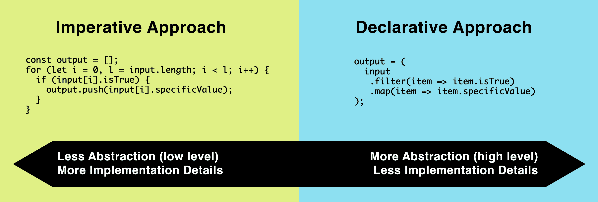

# 控制流

这是我们探索 JavaScript 语法的最后一章。 到目前为止，我们已经介绍了它的更多原子组件——它的许多类型、操作符、声明和语句。 流利地掌握这些是在基础水平上有效地使用语言的关键，并且允许我们现在退一步来考虑一个更大的问题:控制程序的流程。 我们将把学到的所有语法组合成简洁易懂的程序。

在本章中，我们将涵盖以下主题:

*   什么是控制流?
*   命令式编程与声明式编程
*   控制动作
*   控制流语句
*   处理圈复杂度
*   异步控制流

# 什么是控制流?

控制流指的是表达式和语句(以及整个代码块)运行的顺序。 在某种程度上，编程是控制流程的艺术。 通过编写代码，我们可以在任何时刻指定控制驻留的位置。

在细粒度级别上，执行顺序由表达式中使用的单个操作符决定。 我们研究了操作符的优先级和结合性在最后一章,发现,即使你有一系列的运营商,一个接一个,他们的确切顺序执行定义的各个运营商的优先级和结合性,因此,在表达,`1 + 2 * 3`,`2 * 3`操作将发生之前添加。

在表达式外部，在语句级，我们以以下方式控制流:

*   我们可以通过按希望的顺序排列语句来实现。
*   我们可以通过使用条件或迭代语言结构来做到这一点，包括以下内容:
    *   `switch()`语句
    *   `if()`语句
    *   `for()`语句
    *   `while()`语句
    *   `do{...} while()`语句
*   我们可以通过调用函数或生成器，然后返回或返回(*返回*和*返回*都是*将控制权*交还给调用者的方式)。

最简单的方法是全局地将控制流想象为一种总是指向特定表达式或代码语句的*光标*或*手指*。 当程序执行时，控制流将逐行下行，直到遇到将控制重定向到另一段代码的语法。 如果它遇到一个函数的调用，那么该函数将以相同的方式执行; 控件将与函数中的每一行连续在一起，直到它通过`return`语句返回给函数的调用者。 当*控制*遍历一个程序时，它遇到的每个语言结构都将被赋予对执行的控制权，直到它们各自完成。 考虑下面这段简单的代码:

```js
let basket = [];
for (let i = 0; i < 3; i++) {
  basket.push(
    makeEgg()
  );
}
```

在前面的代码中采取的控制流程如下:

1.  我们从`let basket = [];`开始
2.  `for`循环开始:
3.  检查`i < 3`(`true`!)
    1.  运行`makeEgg()`
    2.  通过`basket.push(...)`推送结果
    3.  `i++`(`i`改为`1`)

1.  检查`i < 3`(`true`!)
    1.  运行`makeEgg()`
    2.  通过`basket.push(...)`推送结果
    3.  `i++`(`i`改为`2`)
2.  检查`i < 3`(`true`!)
    1.  运行`makeEgg()`
    2.  通过`basket.push(...)`推送结果
    3.  `i++`(`i`改为`3`)
3.  检查`i < 3`(`false`!)
4.  结束程序

即使对于这样一个相当简单的程序，流程也可能相当复杂和冗长。 为了我们的程序员伙伴的利益，尽可能地减少这种复杂性是有意义的。 实现这一点的方法是通过抽象。 抽象一些东西并不能消除这种复杂性，但它会隐藏它，这样程序员就不需要关心它了。 因此，在深入研究 JavaScript 中控制流的特定语言构造之前，我们将通过命令式编程和声明式编程这两种相反的方法来探索这些控制流和抽象概念是如何相互关联的。

# 命令式编程与声明式编程

命令式编程关注的是**如何**完成某件事，而声明式编程关注的是**我们想要完成的**。 很难看出它们之间的区别，所以最好用一个简单的程序来说明它们:

```js
function getUnpaidInvoices(invoiceProvider) {
  const unpaidInvoices = [];
  const invoices = invoiceProvider.getInvoices();
  for (var i = 0; i < invoices.length; i++) {
    if (!invoices[i].isPaid) {
      unpaidInvoices.push(invoices[i]);
    }
  }
  return unpaidInvoices;
}
```

该函数的问题域是:*获得未付发票*。 这就是功能所具有的任务，也是我们在功能中想要达到的*。 然而，这个特殊的功能很大程度上与*如何*实现其任务有关:*

*   它初始化一个空数组
*   它初始化一个计数器
*   它检查计数器(*多次*)
*   它增加计数器(*多次*)

这些和我们功能的其他元素完全与*获得未付发票*的问题域无关。 相反，它们是相当恼人的实现细节，我们必须通过它们才能获得所需的输出。 这样的函数被称为**命定函数**，因为它们主要关注*如何*。

而*命令式编程的*形式忙于与程序性低级任务所涉及的步骤,*声明式的编程使用抽象来避免使用直接控制流,而是表达事物只有在问题领域本身。 下面是我们的`getUnpaidInvoices`函数的声明性版本:*

```js
function getUnpaidInvoices(invoiceProvider) {
  return invoiceProvider.getInvoices().filter(invoice => {
    return !invoice.isPaid;
  });
}
```

在这里，我们委托给`Array#filter`，所以它处理初始化一个新数组、迭代和条件检查的细节。 通过使用抽象，我们将自己从传统控制流的复杂性中解放出来。

这样的声明式模式已经成为现代 JavaScript 的主要内容。 它们允许您在问题领域的层次上表达您想要的逻辑，而不必担心较低的抽象层，如*如何迭代*。 重要的是要看到声明式方法和命令式方法并不是完全不同的。 它们处于光谱的两端。 在谱系的声明性方面，您是在更高的抽象级别上操作的，因此不会像没有这样的抽象时那样暴露于实现细节。 在这个范围的命令式方面，你在较低的抽象级别上操作，利用较低级别的命令式构造来告诉机器你想要完成什么:



这两种方法对我们的控制流都有影响。 更命定的方法直接声明它将遍历数组一次，然后有条件地推到输出数组。 声明性更强的方法不要求数组如何遍历。 当然，我们知道原生的`Array#filter`和`Array#map`方法将独立地遍历它们的输入数组，但这不是我们所指定的。 我们所指定的只是过滤和映射数据的条件。 数据的迭代方式完全取决于`Array#filter`和`Array#map`抽象。

The benefit of a more declarative approach is that it can increase clarity for the human reader and enable you to more efficiently model complex problem domains. Since you're not having to worry about *how* things are occurring, your mind is left free to purely concern itself with *what* you wish to achieve. 

假设我们有一个任务，要有条件地执行特定的代码段，但前提是启用了某个特性。 在我们看来，它应该是这样工作的:

```js
if (feature.isEnabled) {
  // Do the task.
}
```

这是我们想要编写的代码，但我们后来发现事情并非如此简单。 对于初学者来说，特性对象上没有可以使用的`isEnabled`属性。 然而，有一个`flags`数组属性，当完全禁用时，将包括`Feature.DISABLED_FLAG`:

```js
// A feature that is disabled:
feature.flags; // => [Feature.DISABLED_FLAG]
```

这似乎很简单。 但随后我们发现，即使该特性没有这个标志，因此似乎启用了，我们也需要检查当前的时间与存储在`feature.enabledTimeSlots`中的时间集一致。 如果当前时间不在一个启用的时隙中，那么我们必须断定该特性是禁用的，不管它是否有标志。

这开始变得相当复杂。 除了检查*disabled*标志外，我们还需要通过这些时间槽来发现基于当前时间的特性当前是否已启用。 因此，我们简单的`if`语句很快就变成了一个难以处理的混乱，有几个控制流层:

```js
let featureIsEnabled = true;

for (let i = 0; i < feature.flags.length; i++) {
  if (feature.flags[i] === Feature.DISABLED_FLAG) {
    featureIsEnabled = false;
    break;
  }
}

if (!featureIsEnabled) {
  for (let i = 0; i < feature.enabledTimeSlots.length; i++) {
    if (feature.enabledTimeSlots[i].isNow()) {
      featureIsEnabled = true;
      break;
    }
  }
}

if (featureIsEnabled) {
  // Do the task.
}
```

这是不受欢迎的复杂代码。 它与我们想要编写的原始声明性代码相去甚远。 为了理解这段代码，程序员必须在他们的头脑中保持`featureIsEnabled`的状态，同时扫描每个单独的结构。 这是一段精神上很繁重的代码，因此更容易产生误解、错误和一般的不可靠性。

我们现在必须问自己的关键问题如下:我们要怎样才能抽象掉所有这些嵌套的控制层，以便我们能够返回简单的`if`语句?

我们最终决定将所有这些逻辑放在`Feature`类中新创建的`isEnabled`方法中——但不仅如此! 我们决定进一步抽象逻辑，委托给两个内部方法`_hasDisabledFlag`和`_isEnabledTimeSlotNow`。 这些方法本身将它们的迭代逻辑委托给数组方法`includes(...)`和`filter(...)`:

```js
class Feature {
  // (Other methods of the Feature class here,..)

  _hasDisabledFlag() {
    return this.flags.includes(Feature.DISABLED_FLAG);
  }

  _isEnabledTimeSlotNow() {
    return this.enabledTimeSlots.filter(ts => ts.isNow()).length;
  }

  isEnabled() {
    return !this._isDisabledFlag() && this._isEnabledTimeSlotNow();
  }
}
```

这些非常小的声明性添加到`Feature`类中，使我们能够编写我们最初的目标声明性代码:

```js
if (feature.isEnabled()) {
  // Do the task.
}
```

这不仅仅是一个简单的抽象练习。 这是减少控制流层的练习。 我们避免了对`if`和`for`块使用嵌套层的需要，减少了我们自己和我们的程序员同伴面临的认知负担，并以最干净的方式完成了我们最初打算完成的任务。

通过仔细地重构和抽象我们原来混乱的控制流，非常奇怪的是，我们最终得到了一组代码，其中包括很少的传统控制流语句(`if`、`for`、`switch`，等等)。 这并不意味着我们的代码没有控制流; 相反，它意味着控制流要么最小化，要么隐藏在抽象层之下。 在使用 JavaScript 语言的本地控制流构造时，重要的是要记住，它们不是你表达程序流的唯一工具; 您可以将复杂的逻辑重定向并拆分为抽象，每个抽象处理程序流程中非常特定的部分。

现在我们已经对什么是控制流以及它是如何与我们所知道的抽象相结合有了坚实的基础理解，我们可以浏览 JavaScript 的每个单独的控制流机制，突出挑战和潜在的陷阱。

# 控制动作

在 JavaScript 中，有几种方法可以将控件从一段代码转移到另一段代码。 一般情况下，代码将从*从左到右*和*从上到下*进行计算，直到达到以下任一情况:

*   **调用**(通过`fn()`、`fn```js或`new fn()`调用函数)
*   **返回**(隐式或显式从函数返回`return`)
*   (通过`yield`产生)
*   **断开**(通过`break`从环路或开关断开)
*   **继续**(通过`continue`继续迭代)
*   **抛出**(通过`throw`抛出异常)

# 调用

调用以最简单的形式发生，显式地调用一个函数。 为此，我们将调用括号(`(...)`)附加到已知为函数的值上。 `(...)`左边的这个值可以是一个变量或属性的直接引用，该变量或属性包含一个函数或任何求值为函数的表达式:

```
someFunction();
(function(){})();
someObject.someMethod();
[function(){}][0]();
```js

如我们所述，要构造实例，可以使用`new`操作符。 这也是一种调用类型，尽管在没有参数的情况下，它在技术上不需要调用括号:

```
function MyConstructor() {}

// Both equivalent:
new MyConstructor();
new MyConstructor;
```js

在调用圆括号(在`(...)`的左边)之前求值的确切语法并不重要，只要它求值为一个函数。 如果没有，那么您将收到`TypeError`:

```
1();     // ! TypeError: 1 is not a function
[]();    // ! TypeError: [] is not a function
'wat'(); // ! TypeError: "wat" is not a function
```js

当一个函数被调用时,JavaScript 将创建一个新的**词汇环境**(范围),这个函数将被评估,和函数将成为当前*执行上下文,将控制从当前区域的代码函数的代码。 这应该不是太不直观。 在代码中，`foo();`、`baz();`和`foo()`将被赋予控制，并在`baz()`被赋予控制之前运行到完成，这是有意义的。*

 *函数将通过以下方式将控制权返回给你:

*   通过*返回*(隐式或通过显式`return`语句)
*   通过*抛出*(隐式由于`SyntaxError`、`TypeError`等或通过显式`throw`语句)
*   通过*产生*(以发电机为例)

调用也可以通过 JavaScript 的内部机制间接发生。 例如，在强制的情况下，如上一章所探讨的，方法，如`valueOf`，`toString`，或`Symbol.toPrimitive`可能在各种场景中被调用。 此外，JavaScript 允许您定义*setter*和*getter*，以便您的自定义功能被激活时，给定的属性被访问或分配:

```
const person = {
  set name(name) {
    console.log('You are trying to set the name to', name);
  }
};

person.name = 'Leo';
// Logs: "You are trying to set the name to Leo"
```js

通过在这里赋值给`name`属性，我们有效地调用了一个函数，这个函数本身可以做所有的事情，潜在地调用其他函数本身。 您可以想象，当存在许多这样的隐式调用方法时，给定程序的控制流可能变得难以理解。 这种隐式机制确实有其优点，但如果太多的问题域逻辑嵌入到这些地方，那么对我们的程序员同伴来说就不那么明显了，因此更有可能引起混淆。

# 返回

*返回*是将控制从一个函数转移到它的调用者。 它可以通过函数本身的显式`return`语句实现，也可以在函数运行到完成时隐式实现:

```
function sayHiToMe(name) {

 if (name) {
   return `Hi ${name}`;
 }

 // In the case of a truthy `name` this code is never arrived at
 // because `return` exists on a previous line:
 throw 'You do not have a name! :(';

}

sayHiToMe('James'); // => "Hi James"
```js

在这里，您会注意到，我们不会在它自己的 else 块(`else {...}`)中放置假名称的隐含`else`条件，因为这是不必要的。 因为我们在名称为真时返回，因此 return 语句后面的任何代码将只在隐含的`else`条件下运行。 在执行抢占式输入检查的函数中，这样的模式很常见:

```
function findHighestMountain(mountains) {

  if (!mountains || !mountains.length) {
    return null;
  }

  if (mountains.length === 1) {
    return mountains[0];
  }

  // Do the actual work of finding the 
  // highest mountain here...
}
```js

正如我们在这里看到的，返回不仅用于将控制权返回给调用者，而且还用于其副作用:避免在其函数中自身下面的行中存在的工作。 这通常被称为*提前返回*，可以显著帮助降低功能的整体复杂性。

# 屈服

yield 指的是发电机和调用者之间的控制转换。 它是由`yield`表达式实现的，该表达式可以选择在其右侧指定一个值(生成的值)。 只有在生成器函数中使用`yield`语句才有效:

```
function* makeSomeNumbers() {
  yield 645;
  yield 422;
  yield 789;
}

const iterable = makeSomeNumbers();
iterable.next(); // => {value: 645, done: false}
iterable.next(); // => {value: 422, done: false}
iterable.next(); // => {value: 789, done: false}
```js

如果 yield 没有值(`yield;`)，那么结果将与 yield`undefined`相同。

yield 将迫使对生成器函数的后续调用从 yield 点继续计算(就好像 yield 没有发生一样)。 屈服可以被认为是*暂停*一个函数，以期待以后再回到它。 如果我们记录生成器在连续调用期间运行的部分，就可以看到这一点:

```
function* myGenerator() {
  console.log('Chunk A');
  yield;
  console.log('Chunk B');
  yield;
}

const iterable = myGenerator();

console.log('Calling first time');
iterable.next();
console.log('Done calling first time');

console.log('Calling second time');
iterable.next();
console.log('Done calling second time');
```js

这将记录以下内容:

*   `"Calling first time"`
*   ``"Chunk A"``
*   `"Done calling first time"`
*   `"Calling second time"`
*   `"Chunk B"`
*   `"Done calling second time"`

也可以使用常规的`return;`语句从生成器函数返回。 这和最后一次屈服是一样的。 也就是说，不会再在生成器中运行任何代码。

# 屈服于产量

屈服并不一定是在一个方向上的控制权转移。 您可以使用生成器作为*数据消费者*或*观察者*。 在这种情况下，当调用者通过调用`iterable.next()`请求下一个生成值时，它可以选择性地向这个`next()`方法传递参数。 无论传递的是什么值，都会导致生成器中的`yield`表达式求值为那个值。

用一个例子更容易解释。 在这里，我们已经创建了一个生成器，它消耗数字并生成之前所消耗的所有数字的和:

```
function* createAdder() {
  let n = 0;
  while (true) n += yield n;
}

const adder = createAdder();

adder.next(); // Initialize (kick things off!)

adder.next(100).value; // => 100
adder.next(100).value; // => 200
adder.next(150).value; // => 350
```js

这里，我们使用的是表达式`yield`的返回值(`yield n`)，然后在每次运行生成器时将其添加到现有的`n`值中。 我们最初需要调用`next()`一次来启动事情，因为在此之前，`n += yield n`表达式还没有运行，因此还没有*等待*`next()`调用。

使用生成器作为消费者并没有很多用例，而且可能是一种非常尴尬的模式，因为我们必须使用指定的`next()`方法来传递数据。 然而，了解`yield`表达的灵活性是有用的，因为您可能在野外遇到它。

# 产生的复杂性

对于程序员同行来说，理解生成器内部的控制流程可能会很复杂，而且有违直觉，因为它涉及到调用者和生成器之间的大量*来回*。 要知道在任何特定的点上运行的确切代码可能很难确定，所以建议保持生成器简短，并确保它们一致地产生结果——换句话说， 不要在你的生成器中设置太多不同的生成路径，并尽量将*圈复杂度*保持在较低的水平(如果你跳过*处理圈复杂度*章节，你可以阅读更多相关内容)。

# 打破

*中断*是从当前`for`、`while`、`switch`或标记语句内的控制转移到语句后面的代码。 它有效地终止语句，防止执行下面的任何代码。

在迭代的背景下,是否继续或从迭代通常是由`ConditionExpression`在构造本身(例如,`counter < array.length`),或者通过数据结构的长度的情况下`for..in`和`for..of`。 然而，有时仍有必要提早*突破*的迭代。

例如，如果您正在一个数据结构中寻找一个特定的项(一个*大海捞针*的情况)，那么在找到项后停止寻找是有意义的。 我们通过打破:

```
for (let i = 0; i < array.length; i++) {
  if (myCriteriaIsMet(array[i]) {
    happyPath();
    break;
  }
}
```js

从迭代中中断将立即停止并退出迭代，这意味着包含`IterationBody`的任何剩余代码将不会运行。 紧接着`IterationBody`的代码将运行。

`break`语句也用于从`switch`语句中跳出来，通常是在执行了相关的`case`语句之后。 正如我们将在本章后面讨论,`switch`语句将控制转移到`case`声明被认为是严格相等(`===`)的值传递给`switch(...)`,然后运行下面所有的代码,直到一个显式的【显示】`case`声明(或`return;`、`yield;`或`throw;`)发生:

```
switch (2) {
  case 1: console.log(1);
  case 2: console.log(2);
  case 3: console.log(3);
  case 4: console.log(4); break;
  case 5: console.log(5);
}

// Logs: 2, 3, 4
```js

在这里，我们看到值`2`将控制转移到匹配的`case 2`，然后交换机主体中的所有以下代码将自然运行，直到遇到`break;`语句。 因此，我们只看到了`2`、`3`和`4`的日志。 避免出现`1`日志，因为`case 1`与`2`不匹配;避免出现`5`日志，因为`break;`在该日志之前。

When `case` within `switch` does not break, it is called **fallthrough**. This common technique used in `switch` statements is useful when you want to carry out a single action or cascade of actions based on more than one matching condition (we will cover this concept more in the *The* *switch statement se*).

在`break`关键字的右侧可能有一个指向`switch`、`for`或`while`语句的标签。 如果您没有提供标签，那么 JavaScript 将假定您引用的是当前包含的迭代或`switch`构造。 这只在相互之间有两个或多个可破坏结构时有用，例如，迭代中的迭代。 观察我们是如何用`outerLoop`标签来标记外部的`for`循环，使我们能够从内部的`for`循环中跳出来:

```
outerLoop: for (let obj in objects) {
  for (let key in obj) {
    if (/* some condition */) {
      break outerLoop;
    }
  }
}
```js

事实上，你可以跳出任何带标签的语句(即使它在迭代或`switch`构造之外)，但你必须显式地提供标签:

```
specificWork: {
  doSomeSpecificWork();
  if (weAreFinished) {
    break specificWork;
      // immediately exits the `specificWork: {...}` block
  }
  doOtherWork();
}
```js

这很少适用，但在您遇到这样的代码时还是值得了解的。

最后一件事需要注意在*爆发的迭代或`switch`语句是,尽管我们通常通过使用`break;`一个显式的声明,它还可以有效地通过其他机制发生移动的控制如收益率*、*返回【显示】或*。 例如，很常见的情况是，迭代使用`return;`到*跳出*，不仅是自身，还包括包含的函数。****

 *# 继续

*continue*是将控制从当前语句转移到下一次迭代的可能开始。 它是通过一个`continue`语句实现的。

The `continue` statement is valid in all iteration constructs, including `for`, `while`, `do...while`, `for...in`, and `for...of`.

下面是一个有条件继续的例子，这样迭代的主体不会针对特定的项目执行，但迭代仍然继续进行:

```
const numbers = [1, 2, 3];

for (const n of numbers) {
  if (n === 2) continue;
  console.log(n);
}

// Logs: 1, 3
```js

*继续*跳过当前迭代中`continue`之后的所有代码，然后进入下一个自然发生的内容。

类似于`break`语句，`continue`关键字的右侧可以是一个标签，指示应该继续哪个迭代构造。 如果您没有提供它，那么 JavaScript 将假定您引用的是当前迭代构造。 如果你有两个或多个相互嵌套的迭代构造，那么可能需要使用显式标签:

```
objectsIteration: for (let obj in objects) {
  for (let key in obj) {
    if (/* some condition */) {
      continue objectsIteration;
    }
  }
}
```js

The `continue` statement will only work in our native looping constructs. If we wish to continue in an abstracted looping construct such as `Array#forEach`, then we'll typically want to use a `return` statement instead (to return from the callback and hence continue the iteration).

因为*继续*是一种控制的运动，所以我们要保持谨慎，尽量清楚地表达我们的意图。 如果我们有几层循环或几个`continue`或`break`语句，它会给读者带来不必要的复杂性。

# 扔

*抛出*是将控制从当前语句转移到调用堆栈上最近的包含`try...catch`语句的语句。 如果不存在这样的`try...catch`语句，则程序将完全终止执行。 throw 通常用于在不满足特定要求或期望时引发异常:

```
function nameToUpperCase(name) {
  if (typeof name !== 'string') {
    throw new TypeError('Name should be a string');
  }
  return name.toUpperCase();
}
```js

为了捕获这个错误，我们需要在调用栈的某个地方有一个`try...catch`块，包装对`nameToUpperCase`函数的调用或对调用它的函数的调用(等等):

```
let theUpperCaseName;
try {
  theUpperCaseName = nameToUpperCase(null);
} catch(e) {
  e.message; // => "Name should be a string"
}
```js

抛出作为本机提供的泛型`Error`构造函数实例的对象是一种最佳实践。 `Error`有几个原生的子类构造函数:

*   `SyntaxError`:表示发生了解析错误
*   `TypeError`:当其他`Error`对象都不合适时，表示操作不成功
*   `ReferenceError`:表示检测到无效的参考值
*   `RangeError`:表示不在允许值集或范围内的值
*   `URIError`:这表明 URI 处理函数的使用方式与其定义不兼容

如果您误用本机 api 或产生无效语法，JavaScript 自然会向您抛出此类异常，但您也可以自己使用这些构造函数，为其他程序员提供更多语义上有意义的错误。 如果以上方法都不适用，可以直接使用`Error`，也可以从`Error`中进行扩展，生成自己的专用实例，如下所示:

```
class NetworkError extends Error {}

async function makeDataRequest() {
  try {
    const response = await fetch('/data');
  } catch(e) {
    throw NetworkError('Cannot fetch data');
  }
  // ... (process response) ...
}
```js

所有的`Error`实例都包含一个`name`和`message`属性。 根据 JavaScript 实现，可能还存在与错误的堆栈跟踪相关的其他属性。 在 V8 JavaScript 引擎(在 Chromium 和 Node.js 中使用)和 SpiderMonkey (Mozilla)中，都有一个 stack 属性给我们序列化的调用堆栈信息:

```
try {
  throw new Error;
} catch(e) {
  e.stack; // => "Error\n at filename.js:2:9"
}
```js

在某些特殊情况下，您可能希望抛出一个不是`Error`实例的值，从技术上讲，这是完全合法的，但这样做很少有用。 最好只在出现实际错误的情况下抛出，在这种情况下，最好使用适当的`Error`对象来表示错误。

# 控制流语句

现在我们已经巩固了对*控制*如何在高层移动的理解，我们可以进一步研究 JavaScript 提供给我们控制流的特定语句和机制。 我们将把对每个语句语法的探索与一些最佳实践和要避免的缺陷结合起来。

# if 语句

`if`语句由`if`关键字、括号表达式和附加语句组成:

```
if (ConditionExpression) Statement
```js

`ConditionExpression`可以是无限的复杂性，只要它是一个真正的表达式:

```
if (true) {}
if (1 || 2 || 3) {}
if ([1, 2, 3].filter(n => n > 2).length > 0) {}
```js

括号表达式后面的语句可以是单行语句，也可以是块语句，它指定了当`ConditionExpression`计算为真值时应该运行的代码:

```
// These are equivalent
if (true) { doBaz(); }
if (true) doBaz();
```js

作为`ConditionExpression`传递的值将与布尔值进行比较，以确定其真实性。 我们已经恰当地引入真实的概念和 falsiness 第六章*,原始和内置类型,*但是以防你生锈的:只有七 falsy 值在 JavaScript 中,这样,只有 7 个可能的值,您可以通过一个`if`声明,不满足:

```
if (false) {}
if (null) {}
if (undefined) {}
if (0n) {}
if (0) {}
if ('') {}
if (NaN) {}
```js

当`if`语句不满足时，它将运行一个可选的`else`语句，您可以在`if`语句之后立即指定`else`语句。 就像使用`if`一样，你也可以在这里使用 block:

```
if (isLegalDrinkingAge) drink(); else leave();

// Equivalent, with Blocks:
if (isLegalDrinkingAge) {
  drink();
} else {
  leave();
}
```js

您可以有效地*连锁*一起`if`/`else`语句如下:

```
if (number > 5) {
  // For numbers larger than five
} else if (number < 3) {
  // For numbers less than three
} else {
  // For everything else
}
```js

从句法上讲，这不是一个独立的结构(没有`if`/`else`/`if`/`else`结构); 它只是一个常规的`if`语句，后面跟着一个本身包含自己的`if`/`else`duo 的`else`语句。 因此，也许这样看会更准确一些:

```
if (number > 5) {
  // For numbers larger than five
} else {
  if (number < 3) {
    // For numbers less than three
  } else {
    // For everything else
  }
}
```js

当一个条件有一个或两个可能的结果时，最适合使用`if`语句。 如果有更多可能的结果，那么最好使用 switch 语句。 长`if`/`else`链会变得笨拙。 请参阅本章后面的*处理圈复杂度*小节，探索处理复杂条件逻辑的其他新方法。

# for 语句

`for`语句用于遍历集合，通常是数组或任何可迭代结构。 它有四种类型:

*   **常规**:包括以下内容:
    *   :`for (initializer; condition; incrementer) {...}`
    *   :通常用于自定义方式遍历索引结构
*   **For… 在**:这包括以下内容:
    *   :`for (let item in object) {...}`
    *   :用于遍历任何对象的键(通常用于*普通对象*)
*   **For…** :这包括以下内容:
    *   :`for (let item of iterable) {...}`
    *   :用于在可迭代对象(通常是类似数组的)结构上进行迭代

您将使用的`for`构造的类型取决于您希望迭代的内容。 例如，对于简单的索引和类数组结构，`for...of`构造将是最有用的。 我们将仔细研究每一个构造，以探索用例和潜在的挑战。

# 传统的

常规的`for`语句用于遍历所有类型的数据结构或概念循环场景。 它包括三个表达式，用圆括号括起来并由分号分隔，最后是一个语句，它被认为是迭代的主体:

```
for (
  InitializerExpression;
  ConditionExpression;
  UpdateExpression
) IterationBody
```js

各部分的目的如下:

*   `InitializerExpression`初始化迭代; 这将首先进行评估，并且只进行一次。 这可以是任何语句(它通常包括一个`let`或`var`赋值，但不需要)。
*   `ConditionExpression`检查迭代是否可以继续; 在每次迭代之前，这将被评估并强制转换为布尔值(就像通过`Boolean(...)`)，以确定是否将出现下一个迭代。 这可以是任何表达式，尽管它通常用于检查当前索引是否小于某个上限(通常是迭代所遍历的数据结构的长度)。
*   `UpdateExpression`完成每个迭代，为下一次迭代做好准备。 这将在每次迭代结束时进行评估。 这可以是任何语句，尽管最习惯地用于增加或减少当前索引。
*   `IterationBody`包含实际的迭代逻辑——将在每次迭代中计算的代码。 这通常是一个*块*，但也可以是单行语句。

使用常规的`for`语句来循环一个数组如下所示:

```
for (let i = 0; i < array.length; i++) {
  array[i]; // => (Each `array` item)
}
```js

如果只是在常规数组或可迭代结构上迭代，最好使用`for...of`。 然而，如果您需要在一个非常规索引的结构上迭代，那么使用常规的`for`循环可能是合适的。

异常地索引结构的一个例子是一个`<canvas>`的像素数据元素,形成一个数组包含 RGBA(*红、绿、蓝色*,和*α)的每个像素值连续,像这样:*

```
[r, g, b, a, r, g, b, a, ...]
```js

由于每个像素占用数组的 4 个元素，我们需要一次遍历它的 4 个索引。 传统的`for`循环非常适合这个:

```
const pixelData = canvas.getContext('2d').getImageData(0, 0, 100, 100).data;

for (let i = 0; i < pixelData.length; i += 4) {
  let red = pixelData[i];
  let blue = pixelData[i + 1];
  let green = pixelData[i + 2];
  let alpha = pixelData[i + 3];
  // (do something with RGBA)
}
```js

传统的`for`语句是一种易于理解和惯用的语法。 最好确保你使用它的每个部分的目的。 完全有可能(尽管不建议)通过在结构的括号部分包含迭代的实际逻辑来利用它的语法，但这种和其他误用对人类来说很难解析:

```
var copy = [];
for (
  let i = 0;
  i < array.length;
  copy[i] = array[i++]
); 
```js

这里的`UpdateExpression`包含了`copy[i] = array[i++]`表达式，它将在当前索引处复制数组的元素，然后增加索引。 后缀`++`操作符确保返回其操作数的前一个值，确保在`copy[i]`上访问的索引总是等于`array[i++]`。 这是一个聪明但相当模糊的语法。 使用惯用的`for`结构会更清晰，它将迭代逻辑放在`for(...)`之后的语句中:

```
for (
  let i = 0;
  i < array.length;
  i++
) {
  copy[i] = array[i];
}
```js

对于大多数程序员来说，这是一段更熟悉和更容易理解的代码。 它更冗长，也许编写起来没有那么有趣，但最终，正如本书最初章节所探讨的，我们最感兴趣的是编写清楚地传达其意图的代码。

Naturally, this fictional scenario, copying the contents of one array to another array, would be better solved by using the `Array#slice` method (`array.slice()`) but we used it here as an illustration.

# 对…

`for...in`结构用于遍历对象的可枚举属性名集。 它的语法如下:

```
for (LeftSideAssignment in Object) IterationBody
```js

各部分有以下约束:

*   `LeftSideAssignment`可以是任何在赋值表达式左侧有效的值，并在每次新迭代的`IterationBody`范围内求值
*   `Object`可以是对对象求值(或被强制)的任何表达式，换句话说，除了`null`或`undefined`以外的任何表达式。
*   `IterationBody`是任何单行或块语句

`for...in`结构通常用于遍历普通对象的属性:

```
const city = { name: 'London', population: 8136000 };
for (const key in city) {
  console.log(key);
}
// Logs: "name", "population"
```js

你可以看到我们在这里使用`const key`来初始化每个迭代的`key`变量。 这是使用的首选声明，除非您对`let`的可变行为或`var`的不同作用域行为有特定需求。 当然，除了不使用任何声明之外，所有这些声明都是完全有效的:

```
for (let key in obj) {}
for (var key in obj) {}
for (const key in obj) {}
for (key in obj) {}
```js

为每个迭代创建一个新的块范围。 当你使用`let`或`const`声明时，它的作用域将是该迭代，而通过`var`声明的变量，正如我们所知，将作用域限定为最近的执行上下文的作用域(*函数作用域*)。 不使用任何声明都可以，但你应该确保你已经预先初始化了标识符:

```
let key;
for (key in obj) {}
```js

由于在赋值表达式左侧有效的任何内容在`in`左侧也有效，我们也可以在这里放置属性引用，如下面的示例所示:

```
let foo = {};
for (foo.key in obj) {}
```js

这将导致随着迭代的进行，`foo.key`被分配到`obj`的每个键。 这将是一件相当奇怪的事情，但将正确地工作。

现在我们已经了解了语法，我们可以讨论`for..in`的行为和用例。 如前所述，它在遍历对象的属性时很有用。 默认情况下，这将包括从对象的`[[Prototype]]`链继承的所有属性，但仅当它们是*enumerable*:

```
const objectA = { isFromObjectA: true };
const objectB = { isFromObjectB: true };

Object.setPrototypeOf(objectB, objectA);

for (const prop in objectB) {
 console.log(prop);
}

// Logs: "isFromObjectB", "isFromObjectA"
```js

如您所见，对象本身的属性会在继承对象的属性之前迭代。 但是，不应该依赖迭代的顺序，因为这可能在不同的实现之间有所不同。 如果您希望以特定的顺序遍历一组键，那么最好通过`Object.keys(obj)`收集键，然后作为数组遍历。

因为`for...in`会自然地迭代继承的属性，所以通常在迭代体中放置一个额外的检查来避免这些属性:

```
for (const key in obj) {
  if (obj.hasOwnProperty(key)) {
    // `key` is a non-inherited (direct) property of `obj`
  }
}
```js

如果你有一个可迭代对象(比如数组)，建议使用`for...of`，对于这种情况，这更有性能和习惯。

# 的……

`for...of`结构用于在可迭代对象上进行迭代。 本地提供的可迭代对象包括`String`、`Array`、`TypedArray`、`Map`和`Set`。 `for...of`在句法上具有`for...in`的特点:

```
for (LeftSideAssignment in IterableObject) IterationBody
```js

各部分的目的如下:

*   `LeftSideAssignment`可以是任何在赋值表达式左侧有效的值，并在每次新迭代的`IterationBody`范围内求值
*   `IterableObject`可以是任何求值为*可迭代*对象的表达式——换句话说，任何实现`[Symbol.iterator]`作为方法的表达式
*   `IterationBody`是任何单行或块语句

一个惯用的`for...of`用法看起来像这样:

```
const array = [1, 2, 3];

for (const i of array) {
  console.log(i);
}

// Logs: 1, 2, 3
```js

Since its introduction into the language, `for...of` has become the most idiomatic way to loop over arrays, replacing the previously idiomatic `for (var i = 0; i < array.length; i++) {...}` pattern.

`let`、`var`和`const`的作用域行为与上一节`for...in`中描述的相同。 建议使用`const`，因为它将为每次迭代初始化一个新鲜的不可变变量。 使用`let`并不可怕，但是，除非你有一个特定的理由需要自己在`IterationBody`内改变变量，否则使用`const`会更好。

# 在声明中

`while`语句用于运行一段代码，直到某个条件停止满足为止。 它的语法如下:

```
while (ConditionExpression) IterationBody
```js

各部分的目的如下:

*   评估`ConditionExpression`以确定`IterationBody`是否应该运行。 如果计算结果为`true`，则`IterationBody`部分将运行。 `ConditionExpression`将被重新评估等等。 循环仅在`ConditionExpression`计算为`false`时停止。
*   `IterationBody`可以是单行语句，也可以是块语句，只要`ConditionExpression`的值等于`true`，`IterationBody`就会运行多次。

很少使用`while`进行直接迭代，因为有更合适的结构(例如，`for...of`)，但如果我们想，它可能看起来像以下内容:

```
const array = ['a', 'b', 'c'];

let i = -1;
while (++i < array.length) {
  console.log(array[i]);
}

// Logs: 'a', 'b', 'c'
```js

由于我们将`i`初始化为`-1`，并且使用了前缀自增操作符(`++i`)，`ConditionExpression`将计算为`0 < array.length`、`1 < array.length`、`2 < array.length`和`3 < array.length`。 当然，最后一次检查将失败，因为`3`不小于`array.length`，这意味着`while`语句将停止运行其`IterationBody`。 这意味着`Body`总共只会`3`次。

当迭代的极限未知或以复杂的方式计算时，通常使用`while`。 在这种情况下，通常会看到`true`直接作为`ConditionExpression`传递到`while(...)`，然后在迭代中使用手动`break;`语句强制结束:

```
while (true) {
  if (/* some custom condition */) {
    break;
  }
}
```js

如果生成器函数想要产生无限的输出，则也可以使用`while`语句。 例如，您可能希望创建一个生成器，它总是生成字母表中的*下一个*字母，然后当它到达`z`时，循环到字母表的开头:

```
function *loopingAlphabet() {
 let i = 0;
 while (true) {
   yield String.fromCharCode(
     97 + (i >= 26 ? i = 0 : i++)
   );
 }
}

const alphabet = loopingAlphabet();

alphabet.next(); // => { value: "a" }
alphabet.next(); // => { value: "b" }
alphabet.next(); // => { value: "c" }
// ...
alphabet.next(); // => { value: "z" }
alphabet.next(); // => { value: "a" }
alphabet.next(); // => { value: "b" }
// ...
```js

这种无限应用的发电机是罕见的，但它们确实存在，是一个完美的地方使用`while(...)`。 `while`的其他大部分应用已被`for...in`、`for...of`等更简洁、更包含的迭代方法所取代。 尽管如此，知道如何干净地使用它还是很有用的。

# 该做…… 在声明中

`do...while`语句与 while 语句类似，但它保证在执行检查之前进行一次迭代。 它的语法是:关键字`do`后面跟着它的主体，然后是一个典型的`while`括号表达式:

```
do IterationBody while (ConditionExpression)
```js

各部分的目的如下:

*   `IterationBody`可以是单行语句，也可以是块语句，初始运行一次，然后`ConditionExpression`求值为`true`时多次运行。
*   评估`ConditionExpression`以确定`IterationBody`是否应该运行不止一次。 如果计算结果为`true`，则`Body`部分将运行。 `ConditionExpression`将被重新评估等等。 循环仅在`ConditionExpression`计算为`false`时停止。

尽管`do...while`语句的行为与常规`while`语句不同，但其语义和广泛的应用程序是相同的。 当您在检查是否继续或更改迭代的主题之前，总是需要完成迭代的至少一个步骤时，它是最有用的。 一个例子是向上 DOM 遍历。 如果你有一个 DOM 元素，并希望在它和它的每个 DOM 祖先上运行某些代码，那么你可能希望使用如下的`do...while`语句:

```
do {
  // Do something with `element`
} while (element = element.parentNode);
```js

不管`element`是什么值，这样的循环只执行一次 body，然后对赋值表达式`element = element.parentNode`求值。 这个赋值表达式将计算为它新赋值的值，这意味着，在`element.parentNode`为假的情况下(例如，`null`)，`do...while`将停止它的迭代。

在`while`或`do...while`语句的`ConditionExpression`部分赋值是相对常见的，尽管它可能对其他程序员来说是模糊的，所以最好只在代码的意图很明显的时候这样做。 如果前面的代码被包装在一个名为`traverseDOMAncestors`的函数中，那么这将提供有用的线索。

# switch 语句的

`switch`语句用于将控制转移到一个特定的内部`case`子句，该子句指定一个与传递给`switch(...)`的值相匹配的值。 它的语法如下:

```
switch (SwitchExpression) SwitchBody
```js

`SwitchExpression`将被计算一次，并将其值与`SwitchBody`中的 case 语句严格相等进行比较。 在`SwitchBody`内可以有一个或多个`case`条款和/或`default`条款。 `case`表示`CaseExpression`，将`CaseExpression`的值与`SwitchExpression`的值进行比较，其语法如下:

```
case CaseExpression:
  [other JavaScript statements or additional clauses]
```js

`switch`语句通常用于指定基于特定值的两个或多个互斥结果的选择。 在条件较少的情况下，通常使用`if...else`构造，但为了容纳更多的潜在条件，使用`switch`更为简单:

```
function generateWelcomeMessage(language) {

  let welcomeMessage;

  switch (language) {
    case 'DE':
      welcomeMessage = 'Willkommen!';
      break;
    case 'FR':
      welcomeMessage = 'Bienvenue!';
      break;
    default:
      welcomeMessage = 'Welcome!';
  }

  return welcomeMessage;
}

generateWelcomeMessage('DE'); // => "Willkommen!"
generateWelcomeMessage('FR'); // => "Bienvenue!"
generateWelcomeMessage('EN'); // => "Welcome!"
generateWelcomeMessage(null); // => "Welcome!"
```js

一旦`switch`机制找到了合适的`case`，它将执行`case`语句之后的所有代码，直到`switch`语句的末尾或遇到`break`语句为止。 `break`语句用于当期望的工作完成时，*跳出`SwitchBody`的*。

# 打破和 fallthrough

鉴于`switch`语句通常用于执行依赖于值的特定且互斥的代码段，通常在每个`case`语句之间使用`break`，以确保对任何给定值只运行适当的代码。 然而，有时我们希望避免在不同情况之间进行分割，并让`SwitchBody`*代码继续运行多个`case`语句和其他语句。 这样做被称为**fallthrough**:*

```
switch (language) {

  case 'German':
  case 'Deutsche':
  case 'DE':
    welcomeMessage = 'Willkommen!';
    break;

  case 'French':
  case: 'Francais':
  case 'FR':
    welcomeMessage = 'Bienvenue!';
    break;

  default:
    welcomeMessage = 'Welcome!';
}
```js

在这里，您可以看到我们使用了 fallthrough，以便使用`'German'`、`'Deutsche'`或`'DE'`的语言将导致运行`welcomeMessage = 'Willkommen!'`的相同代码。 随后，我们立即中断，以防止更多的`SwitchBody`运行。

It's unfortunately quite easy to accidentally forget the odd `break;` statement, resulting in accidental fallthrough and a very confused programmer. To avoid this, I'd recommend using a linter that has a rule that warns or gives an error in such cases unless given a specific directive. (We will cover linters in more detail in [Chapter 15](15.html), *Tools for Cleaner Code*.)

# 直接从开关返回

当函数中有一个`switch`语句时，有时最好使用`return`来代替`break`语句。 例如，在`generateWelcomeMessage`中，我们可以简单地返回欢迎字符串。 不需要通过初始化变量、赋值变量和在不同情况之间切换的繁琐程序:

```
function generateWelcomeMessage(language) {
  switch (language) {
    case 'DE':
      return 'Willkommen!';
    case 'FR':
      return 'Bienvenue!';
    default:
      return 'Welcome!';
  }
}
```js

以这种方式直接返回比在每一种情况下中断更清晰，特别是在每个情况的逻辑相当简单的情况下。

# 情况下块

通常，`case`或`default`子句后面的代码不会只占一行。 因此，用块包装这些语句已经成为一种惯例，这样就有了一种包容的感觉:

```
switch (speed) {
  case 'slow': {
    console.log('Initiating slow speed');
    car.changeSpeedTo(speed);
    car.enableUrbanCollisionControl();
  }
  case 'fast': {
    console.log('Initiating fast speed');
    car.changeSpeedTo(speed);
    car.enableSpeedLimitWarnings();
    car.enableCruiseControlOption();
  }
  case 'regular':
  default: {
    console.log('Initiating regular speed');
    car.changeSpeedTo(speed);
  }
}
```js

这并不是必须的，也不会改变任何功能，但它确实为代码的读者提供了更清晰的理解。 它还为任何块级变量铺平了道路，如果我们希望在后面引入这些变量的话。 如我们所知，在一个块(用`{`和`}`分隔)中，我们可以使用`const`和`let`声明变量，该变量将只作用于该块:

```
switch (month) {
  case 'December':
  case 'January':
  case 'February': {
    const message = 'In the UK, Spring is coming soon!';
    // ...
  }
  //...
}
```js

在这里，我们能够声明特定的变量，这些变量的作用域仅限于`February`情况。 如果我们有大量的逻辑需要分离，这是很有用的。 然而，此时，我们应该考虑以其他方式抽象该逻辑。 冗长的`switch`语句很难理解。

# 多变的环境

通常，需要在每个`case`中表达更复杂的条件，而不仅仅是匹配一个奇异值。 如果我们将`true`传递为`SwitchExpression`，那么我们可以在每个`CaseExpression`中自由表达自定义条件逻辑，只要每个`CaseExpression`在成功时计算为`true`:

```
switch (true) {
  case user.role === 'admin' || user.role === 'root': {
    // ...
    break;
  }
  case user.role === 'member' && user.isActive: {
    // ...
    break;
  }
  case user.role === 'member' && user.isRecentlyInactive: {
    // ...
    break;
  }
}
```js

这种模式允许我们表达更多的多元和混合条件。 你可能会倾向于使用多个`if`/`else`/`if`/`else`语句，但如果你的逻辑可以用`switch`语句来表达，那么最好选择`switch`语句。 与往常一样，您应该考虑问题域的性质及其逻辑，并寻求对希望如何实现控制流做出明智的决定。 在某些情况下，`switch`语句只会让人更加困惑。

在下一节中，我们将介绍一些其他方法，您可以使用这些方法来处理不适合`switch`等本机构造的复杂而冗长的逻辑。

# 处理圈复杂度

**圈复杂度**是通过一个程序代码有多少*线性无关*的度量。

考虑一个包含几个条件检查和函数调用的简单程序:

```
if (a) {
 alpha();
 if (b) bravo();
 if (c) charlie();
}
if (d) delta();
```js

即使在这段容易误导人的简单代码中，也可以采用 9 条不同的路径。 因此，根据`a`、`b`、`c`和`d`的值，有 9 个可能的`alpha`、`bravo`、`charlie`和`delta`序列将运行:

*   `alpha()`
*   `alpha()`和`bravo()`
*   `alpha()`、`bravo()`、`charlie()`
*   `alpha()`、`bravo()`、`charlie()`、`delta()`
*   `alpha()`、`bravo()`、``delta()``
*   `alpha()`和`charlie()`
*   `alpha()`、`charlie()`、`delta()`
*   `alpha()`和`delta()`
*   `delta()`

高度的圈复杂度是不可取的。 它可以导致以下结果:

*   **认知负担**:对于程序员来说，圈状复杂的代码很难理解。 有许多分支的代码很难内化和保存在我们的头脑中，因此更难以维护或更改。
*   **不可预见性**:圈复杂度的代码可能是不可预见性的，特别是当出现不可预见性的状态转换或数据的潜在变化等罕见情况时。
*   **脆弱性**:圈状复杂的代码在面对变化时可能是脆弱的。 更改一行会对许多其他行的功能产生不成比例的影响。
*   :圈状复杂的代码可能导致模糊的 bug。 如果在一个单一函数中有十几条或更多的代码路径，那么维护人员可能看不到所有的代码路径，从而导致回归。

There are tools that can quantify a code base's cyclomatic complexity. We will cover these in [Chapter 15](https://cdp.packtpub.com/clean_code_in_javascript/wp-admin/post.php?post=415&action=edit#post_508), *Tools for Cleaner Code*. Knowing areas of high cyclomatic complexity can help us to focus on those areas for maintenance and testing.

令人沮丧的是，在一个单一的模块中有如此多的不同条件和分支，以至于没有人能够理解发生了什么。 除了使用工具帮助我们识别高度复杂的领域外，我们还可以使用自己的判断和直觉。 以下是一些我们很容易识别和避免的复杂性的例子:

*   具有多个`if`/`else`/`if`组合的函数
*   具有多个子条件的`if`语句(在`if`语句中包含多个`if`语句)
*   在每个`case`子句之后有许多子句的`switch`语句
*   在一个`switch`块中有许多`case`子句(例如，超过 20 个子句将引起警告!)

这些不是精确的警告，但它们应该让你知道你应该注意什么。 当我们发现这种复杂性时，我们应该做的第一件事就是坐下来，重新考虑我们的问题领域。 我们能以不同的方式描述我们的逻辑吗? 我们能形成新的或不同的抽象吗?

让我们研究一个具有高度圈复杂度的代码片段的示例，并考虑如何在头脑中考虑这些问题来简化它。

# 简化条件的意大利面

为了说明太多的圈复杂度以及我们应该如何简化它，我们将重构一段代码，这段代码负责从一组许可证中派生一组 ID 号和类型:

```
function getIDsFromLicenses(licenses) {
  const ids = [];
  for (let i = 0; i < licenses.length; i++) {
    let license = licenses[i];
    if (license.id != null) {
      if (license.id.indexOf('c') === 0) {
        let nID = Number(license.id.slice(1));
        if (nID >= 1000000) {
          ids.push({ type: 'car', digits: nID });
        } else {
          ids.push({ type: 'car_old', digits: nID });
        }
      } else if (license.id.indexOf('h') === 0) {
        ids.push({
          type: 'hgv',
          digits: Number(license.id.slice(1))
        });
      } else if (license.id.indexOf('m') === 0) {
        ids.push({
          type: 'motorcycle',
          digits: Number(license.id.slice(1))
        });
      }
    }
  } 
  return ids;
}
```js

该函数接受一个许可证数组，然后提取这些许可证的 ID 号(避免了`null`或`undefined`ID 的情况)。 我们根据在其 ID 中找到的字符来确定许可证的类型。 有四种类型的许可证需要识别和提取:

*   `car`:这些是`c{digits}`形式，其中数字构成一个大于或等于 1,000,000 的数字
*   `car_old`:这些是`c{digits}`形式，其中数字组成一个小于 1,000,000 的数字
*   `hgv`:这些是`h{digits}`
*   `motorcycle`:这些是`m{digits}`

下面是`getIDsFromLicenses`函数的输入和导出输出的示例:

```
getIDsFromLicenses([
    { name: 'Jon Smith', id: 'c32948' },
    { name: 'Marsha Brown' },
    { name: 'Leah Oak', id: 'h109' },
    { name: 'Jim Royle', id: 'c29283928' }
]);
// Outputs:
[
  {type: "car_old", digits: 32948}
  {type: "hgv", digits: 109}
  {type: "car", digits: 29283928}
]
```js

您可能已经注意到，我们用来提取 id 的代码非常复杂。 您可能会认为这是非常合理的代码，确实如此，但它还可以更简单。 我们的函数必须完成它的结果，使用了大量的语法来解释*如何完成它的任务，而不是*想要完成什么。**

 **为了简化我们的代码，首先重新审视问题域是有用的。 我们想要完成的任务是获取一个输入数组，并从中派生一组许可 ID 类型和值。 输出数组将是输入数组的一个几乎是**1:1**的映射，除非许可证具有假的`id`属性(在本例中为`null`)。 下面是我们的 I/O 流程示例:

```
[INPUT LICENSES] ==> (DERIVATION LOGIC) ==> [OUTPUT ID TYPES AND DIGITS]
```js

从抽象的角度来看，这似乎是使用`Array#map`的绝佳机会。 `map`方法允许我们在数组中的每个元素上运行一个函数来派生一个包含映射值的新数组。

我们想要映射的第一件事是许可证到它的`id`:

```
ids = licenses.map(license => license.id)
```js

我们将处理没有`id`的情况。 为此，我们可以对派生的 id 应用一个过滤器:

```
ids = ids.filter(id => id != null)
```js

而且，事实上，因为我们知道所有有效的 id 都是真实的，我们可以简单地做一个布尔检查，直接传递`Boolean`作为我们的过滤函数:

```
ids = ids.filter(Boolean)
```js

从这里，我们将收到我们的许可证数组，但只有那些与真实的`id`属性。 接下来，我们可以考虑希望应用于数据的下一个转换。 我们想把`id`值分割成其组成部分:我们需要的初始角色 ID(`id.charAt(0)`),然后我们想要提取剩余的字符(数字)和把他们`Number`类型(`Number(id.slice(1))`)。 然后我们可以将这些部分传递给另一个函数，该函数将负责从该信息中提取正确的 ID 字段(`type`和`digits`):

```
ids = ids.map(id => getIDFields(
  id.charAt(0),
  Number(id.slice(1))
));
```js

`getIDFields`函数需要从 ID 的单个字符和数字确定类型，返回一个`{ type, digits }`形式的对象:

```
function getIDFields(idType, digits) {
  switch (idType) {
    case 'c': return {
      type: digits >= 1000000 ? 'car' : 'car_old',
      digits
    };
    case 'h': return { type: 'hgv', digits };
    case 'm': return { type: 'motorcycle', digits };
  }
}
```js

因为我们已经将这部分逻辑抽象为一个单独的函数，所以我们可以独立地观察和测试它的行为:

```
getIDFields('c', 1000); // => { type: "car_old", digits: 1000 }
getIDFields('c', 2000000); // => { type: "car", digits: 1000 }
getIDFields('h', 1000); // => { type: "hgv", digits: 1000 }
getIDFields('i', 1000); // => { type: "motorcycle", digits: 1000 }
```js

把所有的东西结合在一起，我们最终得到了一个新的`getIDsFromLicenses`实现，看起来像这样:

```
function getIDsFromLicenses(licenses) {
  return licenses
    .map(license => license.id)
    .filter(Boolean)
    .map(id => getIDFields(
      id.charAt(0),
      Number(id.slice(1))
    ))
}
```js

我们在这里所取得的成就是显著地减少了我们的程序员同伴需要应付的圈复杂度。 我们正在利用`Array#map`和`Array#filter`来抽象决策和迭代逻辑。 这意味着我们最终得到一个更具*声明性*的实现。

你可能也注意到了，我们提取了重复逻辑并将其一般化。 例如，在最初的实现中，我们实现了许多调用来发现 ID 的第一个字符(例如，`license.id.indexOf('m') === 0`)。 我们的新实现通过映射到一个数据结构来概括这一点，该数据结构已经将第一个字符作为一个独特的值，然后我们可以将其传递到`getIDFields`，以获得该 ID 的相关`type`和`digits`。

总而言之，我们一般的重构方法涉及以下考虑事项:

*   我们以全新的视角考虑了这个问题领域
*   我们已经考虑了对于 I/O 是否有一个通用的函数式或声明式习惯用法
*   我们已经考虑过个体逻辑是否可以抽象或分离

我们的代码现在更容易理解，因此也更容易维护和调试。 它也可能更可靠和稳定，因为它的单个单位可以更简单地测试，从而可以避免未来的回归。 由于使用更高抽象的声明式习惯用法和函数而不是命令式代码，自然会有性能略微下降的可能，但这是一个难以置信的边际差异，而且在绝大多数情况下， 是值得实现的，因为重构在可维护性和可靠性方面带来了显著的好处。

# 异步控制流

到目前为止，我们看到的大多数结构都用于同步代码，其中语句按顺序计算，每一行在下一行开始之前完成:

```
const someValue = getSomeValue();
doSomethingWithTheValue(someValue);
```js

这样的代码很简单。 我们直观地知道这两行代码将一个接一个地运行。 还有一个假设是，这两行代码的执行时间都不会很长，可能不会超过几毫秒。

但是，如果我们希望绑定到用户 Event 或获取一些远程数据，会发生什么呢? 这些都是需要时间的事情，只有在未来发生某些事件时才会完成。 在一个不那么仁慈的宇宙中，除了简单地等待它们完成，然后继续执行我们的程序之外，没有其他方法来处理这种情况:

```
fetchSomeData();
processFetchedData();
```js

在这个不友善的世界里，`fetchSomeData()`将是一个*阻塞*函数调用，这样命名是因为它将阻塞所有其他代码的执行，直到它最终完成。 这意味着我们将无法执行任何其他重要任务，而我们的应用程序在任务完成之前将处于停滞状态，这将对用户体验产生负面影响。

值得庆幸的是，JavaScript 为我们提供了一个比这个更好的空间——在这个空间中，我们可以初始化一个任务，比如获取数据，然后在该任务运行时继续执行程序的其余部分。 这样的任务被命名为*异步*，因为它们发生和完成的时间是非同步的，比*现在的*晚。 当它们最终完成时，JavaScript 可以有帮助地通知我们这一事实，调用依赖于该任务完成的任何代码。

# 事件循环

为了实现这一点，JavaScript 维护了一个单线程*事件循环*。 当*事件循环*启动时，它将运行我们的程序。 在执行一段代码(比如启动我们程序的代码)之后，*事件循环*将等待消息(或事件)，表明发生了一些事情(例如，网络请求已经完成或浏览器 UI 事件已经发生)。 当它接收到消息时，它将执行依赖或侦听该事件的任何代码。 *事件循环*将再次运行该代码直至完成，然后继续等待其他消息。 这个过程会无限重复，直到 JavaScript 程序停止(例如，通过关闭浏览器中的选项卡)。

*事件循环*将始终运行给定的代码段直至完成，这意味着任何长时间运行的或*阻塞的*代码将阻止任何其他代码执行，直到它完成。 一些较老的浏览器 API 方法，如`alert()`和`prompt()`，是您可能遇到的阻塞函数的例子。 调用这些函数将有效地阻止 JavaScript 程序的进一步执行:

```
alert('Hello!');
console.log('The alert has been dismissed by the user');
```js

在这里，`console.log()`将不会被评估，直到警告对话框被用户解散。 这可能是毫秒，分钟，甚至小时。 在此期间，我们的 JavaScript 程序停止，无法继续。 它的*事件循环*可能正在接收事件，但它不会运行与这些事件相关的代码，直到`alert()`最终完成。

# 本机异步 api

现在，浏览器和服务器中的 api 通常会提供非阻塞异步方法来调用本机机制。 这些 api 的常见例子包括:

*   DOM 事件 API，支持`window.addEventListener('click', callback)`之类的代码
*   Node.js 文件 API，支持`fs.readFile(path, callback)`等代码
*   浏览器获取 API，启用代码如`fetch().then(callback)`

所有这些接口都有一个共同点:它们都提供了一种方式来侦听它们的完成。 通常，这是通过提供的回调(一个函数)来实现的。 这个回调将在稍后任务完成时被调用。 类似地，一些本地 API 返回 Promise，这支持更丰富的异步控制流机制，但基本上仍然依赖于通过 Promise API 传递回调。 此外，ECMAScript 2017 引入了异步函数(`async function() {}`)的概念和`await`关键字，最终为 promise 提供了语言支持，这意味着完成异步工作不再需要回调。

让我们分别研究这些异步控制流机制。

# 回调

回调是一种传统的方法，它提供了一种连接到异步任务的方法。 回调只是一个传递给另一个函数的函数，并期望在稍后的某个点被调用，可能是立即调用，可能是很快调用，也可能永远不会调用。 考虑以下`requestData`功能:

```
function requestData(path, callback) {
  // (Implementation of requestData)
}
```js

如您所见，它接受一个回调作为它的第二个参数。 当调用`requestData`时，回调函数通常会以内联方式匿名传递，如下所示:

```
requestData('/data/123', (response) => { /* ... */ });
```js

当然，提前声明回调是完全没问题的，这样做可以帮助理解，因为现在代码的读者将对何时可能调用回调有一些暗示。 注意这里，我们是如何调用我们的`onResponse`回调，以明确它是预期被调用时，响应变得可用(当它完成):

```
function onResponse(response) {
  // Do something with the response...
}

requestData('/data/123', onResponse);
```js

类似地，在具有多个异步状态更改的复杂 api 中，经常会看到通过*对象字面量*批量注册命名回调:

```
createDropdownComponent({
  onOpen() {},
  onSelect() {},
  onClose() {},
  onHover() {} // etc.
});
```js

回调通常会被传递一些参数，这些参数指示从异步工作中确定的一些重要状态。 例如，Node.js`readFile`函数用两个参数调用它的回调函数，一个(可能是空的)错误和文件本身的(可能是空的)数据:

```
fs.readFile('/path/to/file', (error, data) => {
  if (error) {
    // Handle the error!
  } else {
    // Handle the data! (No error has occurred!)
  } 
});
```js

将回调传递给的函数完全控制何时调用回调、如何调用以及随调用传递的数据。 这就是为什么有时说回调是控制的*反转*。 通常，你可以控制你调用的函数，但当使用回调时，控制是反向的，所以你依赖于另一个函数或抽象(在某个点上)以预期的方式调用你的回调。

*回调地狱*是指在一段代码中不希望出现的多个嵌套回调的增殖现象，通常是为了执行一系列的异步任务，每个任务都依赖于之前的另一个异步任务。 下面是这种情况的一个例子:

```
requestData('/data/current-user', (userData) => {
  if (userData.preferences.twitterEnabled) {
    requestData(userData.twitterFeedURL, (twitterFeedData) => {
      renderTwitterFeed(twitterFeedData, {
        onRendered() {
          logEvent('twitterFeedRender', { userId: userData.id });
        }
      });
    });
  }
});
```js

在这里，你可以看到我们有三个不同的回调，都出现在一个作用域层次结构中。 我们等待`/data/current-user`的响应，然后选择性地向`twitterFeedURL`发出请求，然后，在呈现 twitter feed(`renderTwitterFeed()`)时，最后记录`"twitterFeedRender"`事件。 最后的日志依赖于前两个异步任务的完成，因此(似乎不可避免地)嵌套得非常深。

我们可以观察到，这段深度嵌套的代码处于一种*水平金字塔*缩进的峰值。 这是*回调地狱*的一个共同特征，因此，你可以使用这些*水平金字塔**的存在作为注意的东西。 当然，并不是所有的深度缩进都是由于回调，但它通常是最容易被怀疑的:*

 *

为了避免由*水平金字塔*指示的*回调地狱*，我们应该考虑重新思考并潜在地重新抽象我们的代码。 在前面的例子中，记录一个 Twitter 提要渲染 Event，例如，我们可以有一个通用函数，用于*获取和呈现 Twitter 提要数据*。 这将简化程序的顶层:

```
requestData('/data/current-user', (userData) => {
  if (userData.preferences.twitterEnabled) {
    renderTwitterForUser(userData);
  }
});
```js

观察我们是如何缩短*水平金字塔*的。 我们现在可以随心所欲地实现`renderTwitterForUser`，并将其作为依赖项导入。 即使它的实现可能涉及到它自己的回调，它仍然降低了程序员的总体复杂性，因为它抽象了*金字塔*的一半为一个整洁的分离抽象。 大多数*回调地狱*场景可以用类似的方法重新设计和抽象来解决。 不过，这是一个简单的场景。 对于更复杂的异步任务，使用异步控制流的其他机制可能是有用的。

# 事件订阅/发射

JavaScript 是一种在订阅和发出 Events 时感觉非常熟悉的语言。 事件在大多数 JavaScript 程序中非常常见，无论是在浏览器中处理用户派生的事件，还是在 Node.js 中处理服务器端事件。

在 JavaScript 中，与事件相关的操作有各种各样的名称，所以提前知道所有这些名称是很有用的，这样当我们遇到它们时就不会感到困惑。 事件是导致调用已订阅该事件的任何回调的及时发生的事件。 订阅一个事件有许多名称，它们实际上都有相同的含义:*订阅*，*注册*，*监听*，*绑定*，等等。 当事件发生时，将调用订阅的回调。 它也有许多名称:*调用*，*呼叫*，*发射*，*触发*，或*触发*。 实际被调用的函数也可以有不同的名称:*function*，*callback*，*listener*，或者*handler*。

在其核心，任何支持事件的抽象通常都是通过存储回调以便稍后调用，并用特定的事件名称进行键控。 我们可以想象，一个 DOM 元素可能会将它的 Event 监听器存储在如下结构中:

```
{
  "click": [Function, Function, Function],
  "mouseover": [Function, Function],
  "mouseout": [Function]
}
```js

任何支持事件的抽象都将简单地存储一系列回调，以便稍后调用。 因此，当订阅一个 Event 时，您将需要提供希望它调用的回调函数和它将绑定到的 Event 名称。 在 DOM 中，我们这样做:

```
document,body.addEventListener('mousemove', e => {
  e; // => the Event object
});
```js

在这里，我们看到一个`Event`对象被传递给回调函数。 为了简洁，它被习惯地命名为`e`或`evt`。 大多数提供事件 API 的抽象都将特定的与事件相关的信息传递给回调。 这可以是一个单数对象或几个参数的形式。

需要注意的是，尽管已经出现了一些惯例，但实际上并没有针对 Events 的单一标准。 通常总会有一个方法用于注册或订阅一个 Event，然后还有另一个方法用于删除该订阅。 下面是一个使用 Node.js 事件发射器 API 的例子，它是由原生 HTTP 模块支持的:

```
const server = http.createServer(...);

function onConnect(req, cltSocket, head) {
  // Connect to an origin server...
}

// Subscribe
server.on('connect', onConnect);

// Unsubscribe
server.off('connect', onConnect);
```js

在这里，您可以看到，`on()`方法用于订阅 Events，`off()`方法用于取消订阅。 大多数事件 api 有类似的事件注册和注销方法，尽管它们可能以不同的方式实现它们。 如果您正在制作自己的*Events*实现，那么最好确保您提供了一组熟悉的方法和抽象。 要做到这一点，可以从本地 DOM Events 接口或 Node.js**Event Emitter**中汲取灵感。 这将确保您的 Events 实现不会让其他程序员感到太惊讶或恐惧。

尽管 Events API 本质上只是一系列在特定时间存储和调用的回调函数，但要做好它仍然存在挑战。 其中包括:

*   确保单个事件触发时的调用顺序
*   处理触发事件而其他事件处于中期触发的情况
*   处理每个回调都可以完全取消或删除事件的情况
*   处理可以冒泡、传播或委托事件的情况(这通常是一个 DOM 挑战)

*Propagation*, *bubbling*, and *delegation* are terms related to firing Events within a hierarchical structure. In the DOM, since `<div>` may exist within `<body>`, the Events API has prescribed that, if the user clicks on `<div>`, the emitted Event will propagate or *bubble* upward, first triggering any `click` listeners on `<div>` and then `<body>`. Delegation is intentional listening at a higher level of hierarchy, for example, listening at the `<body>` level and then reacting in a certain way, depending on what the Event object tells you about the Event's `target` node.

事件比简单的回调提供了更多的可能性。 由于它们允许侦听多个不同的事件，并允许多次侦听同一事件，因此任何消费代码在如何构造异步控制流方面都具有更大的灵活性。 具有 Events 接口的对象可以在整个代码库中传递，并可能被多次订阅。 不同事件的本质也意味着不同的异步概念或事件被有效地分隔开来，这样程序员就可以很容易地知道在特定的情况下会采取什么动作:

```
const dropdown = new DropDown();
dropdown.on('select', () => { /*...*/ });
dropdown.on('deselect', () => { /*...*/ });
dropdown.on('hover', () => { /*...*/ });
```js

这种透明的分离有助于在程序员的头脑中编码期望。 很容易看出在每种情况下调用哪个函数。 将其与一个带有内部`switch`语句的*某事发生*`event`比较:

```
// Less transparent & more burdensome:
dropdown.on('action', event => {
  switch (event.action) {
    case 'select': /*...*/; break;
    case 'deselect': /*...*/; break;
    // ...
  }
});
```js

实现良好的事件在概念上不同的事件之间提供了良好的语义分离，因此，为程序员提供了一系列可预测的异步操作，他们可以很容易地进行推理。

# 承诺

承诺是一种围绕最终价值概念的抽象概念。 最简单的方法是将*Promise 想象成一个简单的对象，在某个点上包含一个值。 Promise 提供了一个接口，通过这个接口，您可以传递回调来等待最终实现的值或错误。*

*Promise*在任何给定的时间都有一定的状态:

*   **Pending**:*Promise*正在等待解析(异步任务尚未完成)。
*   :The*Promise*has no longer pending and has been completed or rejected:*Promise*has no longer pending and has been completed or rejected:
    *   **fulfillment**:*Promise*has been successful and now has a value
    *   **Rejected**:The*Promise*has failed with an error

承诺可以通过构造*承诺*构造函数,通过一个单一的函数参数(称为一个*执行人)调用`resolve`或`reject`功能来显示一个值或解决一个错误,分别是:*

```
const answerToEverything = new Promise((resolve, reject) => {
   setTimeout(() => {
     resolve(42);
   }, 1000);
});
```js

实例化的`Promise`有以下可用的方法，以便我们可以访问它的更改状态(当它从*pending*移动到*completed*或*rejected):*

*   `then(onFulfilled[, onRejected])`:这将附加一个完成回调到*Promise*和一个可选的*rejection*回调。 它将返回一个新的*Promise*对象，该对象将解析为调用的 fulfillment 或 rejection 处理程序的返回值，或者如果没有处理程序，将按照原来的*Promise*解析。
*   `catch(onRejected)`:这将添加一个*拒绝回调*承诺,将返回一个新的*承诺,决心回调的返回值或(如果原*【显示】成功)承诺其实现价值。****
***   `finally(onFinally)`:这将附加一个处理程序到*Promise*，当*Promise*被解析时，该处理程序将被调用，无论解析是实现还是拒绝。**

 **我们可以通过向其`then`方法传递一个回调函数来访问最终解析的`answerToEverything`值:

```
answerToEverything.then(answer => {
  answer; // => 42
});
```js

我们可以通过探索大多数现代浏览器支持的本机 Fetch API 来说明*Promise*的确切性质:

```
const promiseOfData = fetch('/some/data?foo=bar');
```js

`fetch`函数返回一个*Promise*，我们将它赋给变量`promiseOfData`。 然后，我们可以像这样挂钩请求的最终成功(或失败):

```
const promiseOfData = fetch('/some/data');

promiseOfData.then(
  response => {
    response; // The "fulfilled" Response
  },
  error => {
    error; // The "rejected" Error 
  }
);
```js

似乎承诺只是比回调更冗长的抽象。 实际上，在最简单的情况下，您可能只是传递一个*实现*回调和*拒绝*回调。 可以说，这并没有提供比原始回调方法更有用的东西。 但承诺的意义远不止于此。

由于*Promise*只是一个普通对象，它可以像其他值一样在程序中传递，这意味着任务的最终解析不再需要绑定到原始任务调用站点的代码。 此外，每个`then`、`catch`或`finally`调用都返回自己的*Promise*，我们可以将依赖于某些原始实现的任意数量的同步或异步任务链接在一起。

例如，在`fetch()`的情况下，已完成的`Response`对象提供了一个`json()`方法，该方法本身异步完成并返回*Promise*。 因此，要从给定资源获取实际的 JSON 数据，您必须执行以下操作:

```
fetch('/data/users')
  .then(response => response.json())
  .then(jsonDataOfUsers => {
    jsonDataOfUsers; // the JSON data that we got from response.json()
  });
```js

链接在一起`then`调用是一种流行的模式，用于从先前的值派生新的值。 给定响应，我们希望计算 JSON，给定 JSON，我们可能希望计算其他东西:

```
fetch('/data/users')
  .then(response => response.json())
  .then(users => users.map(user => user.forename))
  .then(userForenames => userForenames.sort());
```js

这里，我们使用多个`then`调用来计算已排序的用户名。 事实上，这里有四个不同的承诺，如下所示:

```
const promiseA = fetch('/data/users');
const promiseB = promiseA.then(response => response.json());
const promiseC = promiseB.then(users => users.map(user => user.forename))
const promiseD = promiseC.then(userForenames => userForenames.sort());

promiseA === promiseB; // => false
promiseB === promiseC; // => false
promiseC === promiseD; // => false
```js

每一个*承诺*只会解决一个单一的值。 一旦它被满足了，或者被拒绝了，就没有其他价值可以取代它了。 但正如我们在这里看到的，我们可以自由地从原来的*Promise*衍生出一个新的*Promise*，只需通过`then`、`catch`或`finally`注册一个回调。 只解析一次和返回新的派生承诺的性质意味着我们可以以多种有用的方式组合承诺。 在我们的例子中，我们可以从我们的`users`数据*Promise*中派生出两个承诺:一个收集用户的名字，另一个收集用户的姓氏:

```
const users = fetch('/data/users').then(r => r.json());
const forenames = users.then(users => users.map(user => user.forename));
const surnames = users.then(users => users.map(user => user.surname));
```js

然后我们可以自由传递这些`forenames`和`surnames`承诺，任何消耗代码都可以用它们做它想做的事情。 例如，当一个 DOM 元素最终可用时，我们想用它的名字来填充它:

```
function createForenamesComponent(forenamesPromise) {

  const div = document.createElement('div');

  function render(forenames) {
    div.textContent = forenames ? forenames.join(', ') : 'Loading...';
  }

  render(null); // Initial render

  forenamesPromise.then(forenames => {
    // When we receive the forenames we want to render them:
    render(forenames);
  });

  return div; 
}
```js

这个`createForenamesComponent`函数接受`forenames`*Promise*作为参数，然后返回一个`<div>`元素。 如您所见，我们最初使用`null`调用`render()`，它使用`"loading..."`文本填充 DIV 元素。 一旦*Promise*被实现，我们就用新填充的名称重新渲染。

以这种方式传递承诺的能力使它们比回调要灵活得多，并且在精神上与实现 Events API 的对象相似。 然而，对于所有这些机制，都有必要创建和传递函数，以便您可以侦听未来的 Events，然后对它们进行操作。 如果您有大量的异步逻辑要表达，这可能是一个真正的斗争。 充满回调、事件和承诺的程序控制流可能是不清晰的，即使对那些熟悉特定代码库的人来说也是如此。 即使是少量的独立异步事件也可以在整个应用程序中创建大量的*状态*。 结果，程序员会变得非常困惑; 混淆与*在*时发生的情况有关。**

*The *state* of your program is determined at runtime. When a value or piece of data changes, no matter how small, it will be considered a *change of state*. *State* is typically expressed in terms of outputs from the program, such as a GUI or a CLI can be also be held internally and manifest in a later observed output.

为了避免混淆，最好尽可能透明地实现任何与时间相关的代码，这样就不会有误解的空间。 下面是一个可能导致误解的代码示例:

```
userInfoLoader.init();

appStartup().then(() => {
  const userID = userInfoLoader.data.id;
  const userName = userInfoLoader.data.name;
  renderApplication(userID, userName);
});
```js

此代码似乎假定`appStartup()`返回的*Promise*在`userInfoLoader`完成其工作后将始终履行。 也许这段代码的作者碰巧知道`appStartup()`逻辑总是在`userInfoLoader`之后完成。 也许这是必然的。 但是对于第一次阅读这段代码的我们来说，我们没有信心`userInfoLoader.data`会在`appStartup()`完成时被填充。 最好是让时间更加透明，例如，从`userInfoLoader.init()`返回*Promise*，然后在明确实现*Promise*的基础上执行`appStartup()`。

```
userInfoLoader.init()
  .then(() => appStartup())
  .then(() => {
    const userID = userInfoLoader.data.id;
    const userName = userInfoLoader.data.name;
    renderApplication(userID, userName);
  });
```js

在这里，我们对代码进行了安排，这样就可以清楚地看到哪些操作依赖于哪些其他操作，以及这些操作将以什么顺序发生。 使用承诺本身，就像任何其他异步控制流抽象一样，并不能保证您的代码很容易理解。 总是考虑你的程序员同事的观点和他们会做的暂时假设是很重要的。 接下来,我们将探讨一个新的 JavaScript 之外,给了我们本地语言支持异步代码:你会看到这些增加使我们能够编写异步代码更清晰的*是*当*发生。*

 *# 异步和等待

ECMAScript 2017 规范以`async`和`await`关键词的形式为 JavaScript 语言引入了新的概念。 关键字`async`用于指定一个函数为异步:

```
async function getNumber() {
  return 42;
}
```js

这样做，有效地包装了函数在`Promise`(如果它还不是`Promise`)*中返回的任何内容。 因此，如果我们尝试调用这个函数，我们将收到`Promise`:*

```
getNumber() instanceof Promise; // => true
```js

如我们所知，我们可以通过它的`then`方法订阅`Promise`的实现:

```
getNumber().then(number => {
  number; // => 42
});
```js

为了配合返回*promise 的异步函数，*我们也有一个`await`关键字。 这使我们能够通过简单地将`Promise`传递到`await`的右侧来等待`Promise`的完成(或拒绝)。 例如，这可能是从`async`函数调用返回的`Promise`:

```
await someAsyncFunction();
```js

或者它可能是一个*Promise*inline 指定，如下:

```
const n = await new Promise(fulfill => fulfill(123));
n; // => 123
```js

正如您所看到的，关键字`await`将等待它的*Promise*解析，从而阻止后面的任何行在此发生之前执行。

下面是另一个例子——一个`setupFeed`异步函数，它同时等待`fetch()`和`response.json()`:

```
async function setupFeed() {
  const response = await fetch('/data');
  const json = await response.json();
  console.log(json);
}
```js

值得注意的是，`await`关键字不会像`alert()`或`prompt()`那样阻塞。 相反，它只是暂停异步函数的执行，释放*事件循环*以继续其他工作，然后，当它的*Promise*解析时，它将在停止的地方继续执行。 记住，`await`只是语法上的*糖*而不是我们已经能够实现的功能。 如果我们想在没有`async`/`await`的情况下实现`setupFeed`函数，我们可以很容易地通过返回到`Promise#then`的旧模式来实现:

```
function setupFeed() {
  fetch('/data').then(response => {
    return response.json()
  }).then(json => {
    console.log(json);
  });
}
```js

观察一下，当我们不使用`await`时，代码是如何变得稍微笨拙和更加拥挤的。 与异步函数一起使用`await`，我们可以获得与常规同步代码相同的令人满意的线性和过程性外观。 这可以极大地简化原本复杂的异步控制流程，让程序员更清楚地知道*在时*发生了什么。**

 *await 关键字也可以在`for...of`迭代构造中使用。 这样做将等待迭代的每个值。 如果在迭代过程中，遇到的任何值都是*Promise，*迭代将不会继续，直到*Promise*被解决:

```
const allData = [
  fetch('/data/1').then(r => r.json()),
  fetch('/data/2').then(r => r.json()),
  fetch('/data/3').then(r => r.json())
];

for await (const data of allData) {
  console.log(data);
}

// Logs data from /data/1, /data/2 and /data/3
```

如果没有*Promises*或`await`和`async`，表达这种异步过程不仅需要更多的代码，还需要更多的时间来理解。 这些构造和抽象的美妙之处在于，它们允许我们忽略异步操作的实现细节，使我们能够完全专注于表达问题域。 随着本书的深入，我们将在处理一些更大、更难以处理的问题领域时进一步探索这种抽象精神。

# 总结

在本章中，我们完成了对 JavaScript 语言的探索，讨论了命令式语法和声明式语法之间的区别，探索了如何干净地控制流，并学习了如何在同步和异步上下文中处理圈复杂度的情况。 这涉及到对语言中的所有迭代和条件构造的深入研究，指导它们的使用，以及对反模式的警告。

在下一章中，我们将利用我们积累的关于 JavaScript 语言的所有知识，并将其与对真实世界的设计模式和范例的一些探索结合起来，这将帮助我们构建干净的抽象和架构。***********