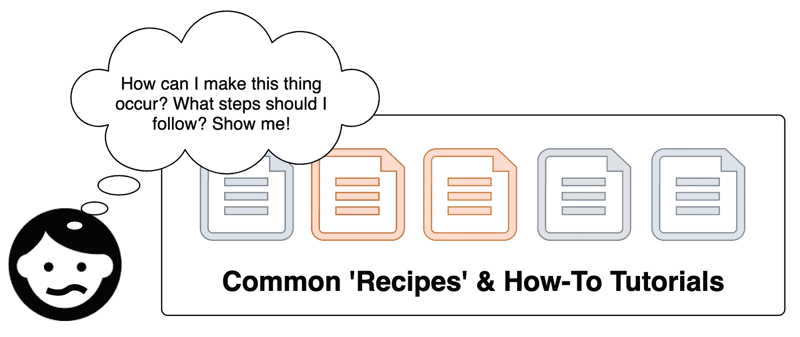
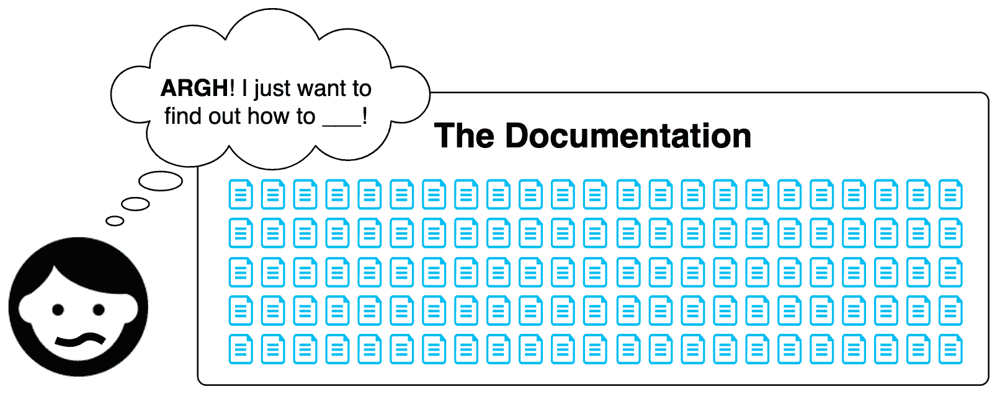

# 记录你的代码

文档的名声不好。 很难找到写它的动机，维护它很麻烦，而我们多年来对它的接触使我们确信，它是最枯燥、最乏味的知识转移方法之一。 不过，事情并不一定要这样!

如果我们选择完全关注用户，那么我们的文档就可以简单而令人愉快。 要做到这一点，我们必须首先考虑文档的用户是谁。 他们想要什么? 每个用户，无论是 GUI 终端用户还是程序员同事，都是带着一个任务开始使用我们的软件的旅程。 无论是在软件中还是在文档中，我们的职责是使他们能够尽可能少地痛苦和混乱地执行任务。 考虑到这一点，在本章中，我们将探讨构建这样的轻松文档可能意味着什么。 我们将特别涵盖以下内容:

*   清洁文件的各个方面
*   文档是无处不在
*   为非技术观众写作

# 清洁文件的各个方面

文档的目的是沟通**软件做了什么**和**如何使用**。 我们可以把干净的文档的特点分为四个方面:一块干净的文档沟通**软件的概念,提供了一个**规范其行为,并包含**【显示】说明如何执行特定的操作。 这一切都集中在**可用性**上。 在本节结束时，我们将有希望理解用户在构建*干净*文档的过程中至关重要的*。***

**Documentation is something most people don't think about a lot. It's usually an afterthought. My task in this chapter is to convince you that it can be, and should be, so much more than this. As we step into these *aspects,* forget what you know about documentation – start with a fresh canvas and see if you come away with revelations of your own.

# 概念

一份清晰的文档将传达软件的*概念*。 它将通过解释软件的目的，让潜在用户看到他们可能如何使用它来做到这一点。 这可以被认为是文档的教育部分:设置术语和范例，使读者能够轻松地理解文档的其他部分及其所描述的软件。

为了正确地表达软件的概念，有必要站在用户的角度，从他们的角度看问题，并根据他们的条件与他们进行交流:

*   :他们是谁，他们的一般技术熟练程度是多少?
*   :对于这个特定的软件项目、API 或代码库，他们已经知道多少?
*   :你如何以一种对他们有意义的方式进行沟通，并与他们当前的知识很好地集成?

编写好的文档是一个考虑用户，然后为他们设计适当的抽象的过程。 你可能会注意到这与制作干净代码的过程是多么的相似。 事实上，它们之间的差别非常小。 当构建文档时，我们正在制作一个工具，用户可以使用它来完成一组特定的任务。 我们的责任是将它制作成这样一种方式，即用户可以轻松地实现他们的最终目标，而不会被软件的庞大数量和复杂性所压倒:


考虑一个需要几个星期才能完成的项目。 它是一个被称为`SuperCoolTypeAnimator`的**JavaScript**(**JS**)库，其他程序员可以使用它来创建字体转换。 它允许他们向用户显示从一种字体到另一种字体的动画文本块(例如，从 Helvetica 到 Times New Roman)。 手动计算这些转换是相当复杂的代码库。 它的复杂性的深度意味着你，程序员，已经发现了更多关于连接，衬线，和路径插值比你想象的可能。 在沉浸在这个日益深入的问题领域几个月之后，可以理解，要分享一个没有像你这样接触过的用户的观点对你来说是一个挑战。 因此，文档的初稿可能会以以下方式开始:

*SuperCoolTypeAnimator 是一个 SVG 符号动画工具，允许创建和逐帧操作源符号和它们各自的目标符号之间的过渡，并计算适当的动态过渡锚。*

让我们将其与下面的替代介绍进行比较:

*SuperCoolTypeAnimator 是一个 JS 库，允许你从一个字体到另一个字体的小块文本动画轻松。*

作为介绍，后者更容易被广泛理解，甚至允许非专业用户立即理解库的功能。 前一种介绍虽然信息丰富，但可能会导致当前和潜在用户感到困惑或疏远。 我们构建软件的全部目的就是抽象复杂性，以一种简洁的方式将其包装起来。 我们应该以后悔和考虑的方式让我们的用户耗费复杂性:这通常是*最后的*手段。

The *concept* that we are attempting to communicate in our documentation concerns, above all, how our software can *help* the user. For them to understand how it can help them, we need to describe it in a way that meshes with their current understanding. 

这两篇介绍强调的另一个因素是它们使用的特殊术语(如*字形*和*锚*)。 这种特定于领域的术语的使用是一种平衡行为。 如果您的用户对*字体/字体*问题域有很好的理解，可以使用*字形*和*字形*。 有争议的是，对您的库感兴趣的用户很可能也知道这些概念。 但是，使用诸如*过渡性锚*等更微妙的术语可能有些过头了。 这很可能是您在抽象中用来描述高度复杂的实现领域的术语。 它对您是一个有用的术语，对希望对库进行更改的任何人可能也是如此，但对库的用户可能用处不大。 因此，在我们的文档介绍中避免使用它是明智的。

# 规范

除了为软件提供一个概念，好的文档还将提供一个*规范*，详细说明软件提供的接口的具体特征和行为。 文档的这一部分详细说明了用户或程序员在使用软件时可以期望得到的合同。

*规范*应该是最简单的文档编写部分，原因如下:

*   :行为规范包含在代码和测试中，通常使手动编写这些信息作为文档变得非常简单。 但是，如果难于编写，则表明代码及其接口中存在潜在的复杂性，可能需要优先修复。
*   **可以自动生成**:有许多文档生成器要么依赖于静态类型注释，要么依赖于注释注释(例如，*JSDoc*)。 这允许您通过 CLI 或构建工具为整个接口生成文档。
*   :一个规范将遵循一种简单的、易于编写的格式。 它通常包含各个端点或方法签名的标题，以及解释每个参数的句子。

提供规范最重要的目的是回答用户对代码操作可能产生的特定问题:


下面是一个名为`removeWords`的函数的规范示例。

```js
removeWords( subjectString, wordsToRemove ); 
```

这个函数将从指定的主题字符串中删除指定的单词，并向您返回一个新的字符串。 这里的单词定义为由单词边界(`\b`)限定的字符串。 例如，为`wordsToRemove`指定`"I like apple juice"`subjectString 和`["app", "juice"]`只会删除`"juice"`，因为`"app"`存在于主题中，但不受单词边界的约束。 以下是论点:

*   `subjectString`(`String`):指定的单词将从该字符串中删除。 如果您没有传递`String`类型，那么您传递的值将被转换为`String`。
*   `wordsToRemove`(`Array`):这是一个包含你想要删除的单词的数组。 一个空或空数组将不会导致字被删除。

正如您所希望的那样，该规范纯粹是对函数行为的技术解释。 它准确地告诉用户他们必须提供什么参数以及他们将收到什么输出。 在编写文档的规范部分时，最需要遵守的品质是清晰和正确。 注意以下陷阱:

*   提供足够的关于你的实现的信息是很重要的，这样其他不了解你的软件的程序员就可以开始使用它。 例如，仅指定参数类型是不够的。 如果某一知识领域特别模糊，则提供额外的信息。
*   :文档很容易过时或不正确。 这就是为什么从注释代码自动生成文档是很常见的。 这样，信息不正确或过时的可能性就大大降低了。
*   :通常只列出模块、方法和参数签名，而不提供任何示例。 如果这样做，混淆和痛苦的可能性就会大得多，所以提供合理的示例或将读者链接到更类似教程的文档总是值得的。

规范可以说是文档中最重要的部分，因为它用清晰的术语解释了软件相关 api 的每个部分的行为。 确保您在编写代码时也像编写代码时那样小心和勤勉地编写文档。

# 指令

除了*概念*和*规范*之外，一份整洁的文档还将*指导*用户如何完成常见任务。 这些通常被称为*攻略*、*教程、**how-to -tos*或*食谱。*

首先，用户，无论他们是程序员还是最终用户，关心的是如何从他们现在的位置到达他们想要到达的位置。 他们感兴趣的是要采取哪些步骤。 如果没有关于常用用例的说明，他们将会绝望地从直觉或其他文档片段中拼凑出他们对您的软件的了解。 考虑一本关于烹饪的书，它只详细介绍了食材和它们在烹饪时的行为，但没有包含任何具体的食谱，以特定的顺序组合食材。 那将是一本极具挑战性的烹饪书。 虽然它可能提供了一套非常详细的烹饪信息，但它不能帮助用户回答他们的实际问题:



在编写说明时，无论它们是以形式、视频教程还是书面攻略的形式，重要的是要考虑哪些用例对用户来说是最普遍的或最具挑战性的。 就像生活中的许多事情一样，你只能合理地迎合大部分的前景，而不是全部。 为每一个可能的用例创建教程是不合理的。 同样，从用户的角度来看，只提供最常见用例的单一教程也是不合理的。 明智的做法是做出妥协，并收集一些教程来表达:

*   :一组说明应该指定作者对读者的硬件，软件环境和能力的期望。 它还应该说明读者在开始下面的步骤之前是否需要准备什么。
*   :说明应该有一些特定的步骤，用户可以遵循这些步骤来达到他们想要的目标。 在遵循这些步骤时，用户不应该使用太多(或任何)主动性; 这些步骤应该清晰而详尽地概括出用户需要做什么，如果可能的话还应该提供代码示例。 用户也应该清楚地知道他们已经成功地完成了每个步骤(例如，*您现在应该收到 X 输出*)。
*   :说明书应朝着用户能够观察到的目标工作。 会扰乱教程说的最后一步*目前这不会工作,由于 X 或 Y,但通常你会期望看到 z*确保您的软件操作以这样一种方式,可以完成本教程的结束,用户可以去获得接近无论他们的总体目标。

**Don't just tell a user what to do**. Tell them what they're accomplishing at each stage, and why it matters. That is, don't just tell me to put salt in the dish, tell me why it needs salt!

文档的指导部分可能是最具挑战性的。 它要求我们扮演老师的角色，从另一个相对无知的人的立场来看事情。 把重点放在我们所教授的人，用户上，这是非常重要的。 这很好地为我们干净文档的最后一个方面提供了素材:可用性。

# 可用性

可用性是干净文档的最后一个组成部分。 就像我们的软件一样，我们的文档必须关注用户及其特定的需求。 前面的三个方面(*概念*,*规范*,*指令*)重点内容,而可用性*纯粹是我们表达的内容。 当用户了解你的软件时，不要让他们不知所措或感到困惑，这一点至关重要:*

 *

我们有很多方式可以迷惑和压倒。 其中有以下几点:

*   :这可以压倒用户谁可能只想执行一些特定的和狭窄的任务。 他们可能不明白在大量的文档中爬行只是为了实现他们的简单任务的意义。
*   :如果用户希望做一些没有充分记录的事情，那么他们的选择就很少。 他们要么希望在某个地方有社区驱动的文档，要么希望接口足够容易理解，无需帮助就能破译。
*   **内部不一致**:当文档的不同区域在不同时间被更新时，这种情况很常见。 用户会想知道哪个文档或示例是正确的、最新的。
*   :如果没有结构，用户就不能很容易地浏览或获得对整个软件的概念理解。 他们在细节中爬行，却无法得到一个清晰的*大画面*。 层次结构在软件中很重要，所以在我们的文档中反映这一点很重要。
*   :如果没有良好的 UX/UI 考虑，文档可能很难浏览。 如果它不是集中式的、可搜索的和可访问的，那么导航就会受到影响，用户也会处于一种困惑和痛苦的状态。
*   :除了导航，文档中另一个重要的用户体验组件是它的美学和排版布局。 一份布局良好的文件很容易阅读和学习。 *设计*文档是完全合理的。 它不应该是枯燥的*垃圾场*无尽的散文，而应该是一次美丽的教育经历!

在[第二章](02.html)，*Clean Code*的原则中，我们详细介绍了*可用性*的含义。 我们讨论了如何不仅是关于直观的设计和可访问性，而且关于考虑用户故事的*和*用户希望执行的特定任务，以及如何适应这些任务。 文档与我们提供的任何其他接口没有区别; 它必须解决用户的问题。 考虑如何设计文档以满足这些示例用户故事:

*   *作为一个用户*，我希望了解这个框架做什么，以及我如何将它应用到我的项目
*   *作为一个用户*，我想知道如何将这个框架安装到我的 Node.js 项目中
*   *作为一个用户*，我希望了解使用这个框架的最佳实践
*   *作为一个用户*，我想了解如何使用这个框架构建一个简单的示例应用

Every user is different. Some users will prefer to read through a long and technical document, others will prefer short self-contained tutorials. Consider the different learning styles that people have (visual, aural, social, solitary, and so on). Some learn by studying things at length; others learn by *doing*. 

我们可以考虑为用户寻找的不同类型的信息构建不同风格的文档。 更多面向规范的信息(例如，*这个特定框架是如何工作的?* )可能最适合传统的长格式文档格式，而更面向指令的信息(例如，*我如何使用这个框架构建一个应用程序? )可能最适合于富媒体(例如，视频教程)。*

由于用户可能寻求多种类型的信息，以及我们所服务的所有不同的个人用户，因此花大量时间来规划、设计和执行干净的文档是绝对值得的。 它不应该是事后才想到的。

现在我们已经探索了干净文档的四个方面，让我们来探索我们可以用来表达文档的各种可用媒介。 我们不必只使用一份单调的、可滚动的文档:我们可以通过许多其他方式向用户和同事提供信息和教育。

# 文档是无处不在

如果我们慷慨地将文档定义为*一种学习软件*的方法，我们可以观察到存在着几十种不同的文档媒介。 其中许多是隐性的或偶然的; 其他的则是由软件的创造者或围绕它聚集的专家社区精心设计的:

*   书面文档(*API 规范，概念解释*)
*   解释性图像和图表(例如*流程图*)
*   书面教程(*攻略，食谱，如何做 X*)
*   丰富的媒体介绍和教程(*视频，播客，屏幕直播*)
*   公共问答或问题(例如*GitHub 问题，解释如何修复某些东西*)
*   社区驱动问答(例如*StackOverflow*)
*   程序员之间独立沟通(*在线或离线*)
*   聚会、会议和研讨会(*业主或社区驱动*)
*   官方支持(*付费支持热线、电子邮件、现场会议*)
*   例如*Coursera*。
*   解释概念、流程和期望的测试(T0)
*   良好的抽象(*有助于解释概念*)
*   易读且熟悉的代码(*易于理解*)
*   结构和描述(*目录结构、项目名称、*等)
*   直观设计的界面(*通过良好的设计教育使用*)
*   错误流和消息(例如，*X 不工作? 尝试 Z。* )

值得考虑的是，所有这些媒体都是如何服务的。 当官方文档不能帮助解决用户的问题时，在完全放弃您的软件之前，他们还会探索哪些其他途径呢? 我们如何尽可能快且流畅地将用户的困难或问题引向解决方案? 如果用户不太可能阅读完整的规范文档，那么我们可以为他们创建哪些其他媒介呢?

# 为非技术观众写作

正如我们所看到的，在编写文档时，需要调整所使用的语言以适应受众。 要做到这一点，我们必须在脑海中有一个很好的画面，关于观众是谁，他们目前的知识水平是什么，以及他们想要实现什么。 程序员面临的一个恶名昭彰的挑战是与技术水平较低或非技术人员交流。 这是他们作为软件创建者的角色中非常常见和重要的一部分。 无论是在用户体验的特定点与终端用户沟通，还是与非技术涉众合作，都需要根据用户的需求调整我们的沟通。 要做到这一点，我们应该做到以下几点:

*   :找到一个被观众完全理解的抽象层次是至关重要的。 利用他们的角色和熟练程度来提供你用来解释事物的类比。 例如，如果您与患者谈论一款医疗软件，您可能更喜欢说*请添加您的医疗信息*，而不是*请填充医疗配置文件字段*。
*   :避免使用那些对观众没有意义的词。 使用常规语言来解释详细的概念。 例如，你可能会说 v*视觉增强*，而不是*CSS 修改*。
*   :确保你的听众理解你的意思。 不要因为别人没有明确地说，就认为他们理解你。 在文档或软件中考虑面向用户的提示(例如，*该消息是否有帮助? 【是】【否】*

与非技术人员沟通可能是一个明显的挑战，但这与与任何人沟通没有什么不同。 正如我们应该一直做的那样，我们只需要*遇到他们*所在的人，并根据他们目前对问题领域的理解进行沟通。

# 总结

在这一章中,我们探讨了困难的艺术创作干净的文档,把它分解成干净的四个重要方面文档:*概念*,*规范*,*指令*,*【显示】可用性。 我们已经讨论了正确识别受众的挑战，以及如何精心制作适合他们的沟通方式。 这些知识不仅在制作正式文档时有用，而且在我们与涉众的日常交流以及在软件内部需要与用户交流时也有用。*

 *在下一章中，我们将迅速转向处理他人代码的独特挑战。 当我们在接收潜在的糟糕文档或不直观的代码时，需要提高生产率，会发生什么? 我们会找到答案。****