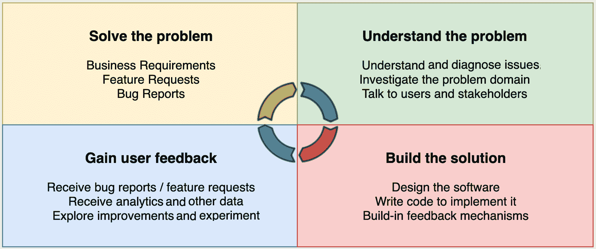
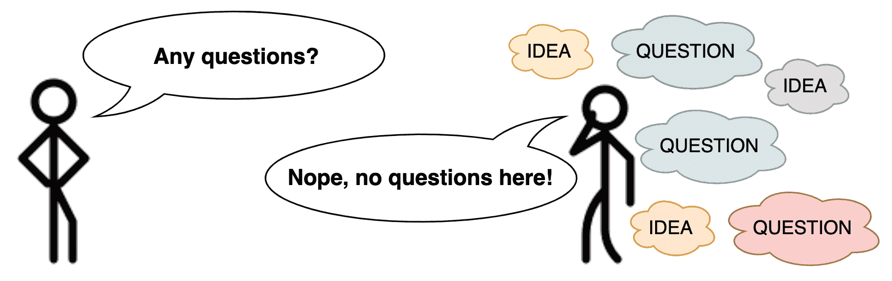
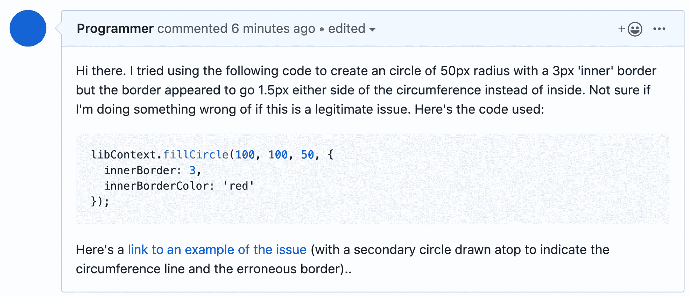

# 沟通和宣传

我们不会孤立地编写代码。 我们生活在一个高度混乱的社会世界里，我们必须不断地与他人交流。 我们的软件本身，通过它的接口，将成为这种交流的一部分。 此外，如果我们在一个团队、一个工作场所或一个社区中运作，我们就会面临有效沟通的挑战。

沟通对我们的代码库产生影响的最重要的方式是设置需求、提出问题和反馈。 软件开发本质上是一个非常长时间的反馈过程，其中每一个更改都是由通信促成的:

在本章中，我们将学习如何有效地与他人协作和沟通，如何计划和设置需求，一些常见的协作陷阱，以及它们的解决方案。 我们还将学习如何识别和提出阻碍我们编写干净 JavaScript 的更大问题。 在这一章中，我们希望能够开始认识到我们在软件开发的反馈周期中所扮演的重要角色。

在本章中，我们将看到以下主题:

*   规划和设置要求
*   传播策略
*   识别问题并推动变革

# 规划和设置要求

最常见的沟通难题之一在于决定到底要构建什么。 程序员通常会花很多时间与经理、设计人员和其他涉众会面，以将真正的用户需求转化为可行的解决方案。 理想情况下，这个过程应该很简单: 我们创建(解决方案)。 故事结束了! 然而，不幸的是，它可能要复杂得多。

有大量的技术限制和沟通偏见，可以使甚至看起来简单的项目变成惩罚的长期斗争。 这与 JavaScript 程序员的关系就像与其他程序员的关系一样，因为我们现在操作的是一个系统复杂性级别，而在此之前，只有使用 Java、c#或 c++的企业程序员才能操作这个级别。 形势已经发生了变化，所以卑微的 JavaScript 程序员现在必须准备学习新的技能，并就他们所构建的系统提出新的问题。

# 理解用户需求

确定用户需求是至关重要的，但这通常被认为是理所当然的。 对于程序员和其他项目成员来说，假设他们理解了某个用户的需求，而没有真正深入研究细节，这是很典型的，所以有一个过程可以依靠是很有用的。 对于每一个表面上的*需要*或*问题*，我们应确保了解以下几个方面:

*   **谁是我们的用户? 他们有什么特点? 他们使用什么设备?**
*   他们想做什么? 他们想采取什么行动? 他们的最终目标是什么?
*   他们现在是怎么做的? :他们目前采取了哪些步骤来达到他们的目标? 他们目前的方法有什么值得注意的问题吗?
*   他们这样做会遇到什么问题? 要花很长时间吗? 它在认知上昂贵吗? 它很难使用吗?

在本书的开头，我们问自己为什么要写代码，我们探索了真正理解问题领域的本质意味着什么。 理想情况下，我们应该能够站在用户的角度，亲自体验问题领域，然后根据第一手经验制定可行的解决方案。

不幸的是，我们并不总是能够直接与用户对话或站在他们的角度思考问题。 相反，我们可能依赖于项目经理和设计师等中间体。 因此，我们依赖于他们的沟通效率，以一种让我们能够建立正确解决方案的方式，将用户的需求传递给我们。

在这里，我们看到了用户的需求，以及技术和业务约束，是如何转化为一种思想的，这种思想被构建到解决方案中，并在此基础上进行迭代。 将**用户需求**转化为**理念**至关重要，反馈过程让我们能够迭代和改进我们的解决方案:

因为用户需求对开发过程至关重要，所以我们必须仔细考虑如何平衡用户需求和其他限制因素。 通常不可能建立理想的解决方案，以满足每一个用户。 几乎每一个软件，无论是以 GUI 还是 API 的形式呈现，都是一种折衷方案，它很好地迎合了普通用户，这不可避免地意味着边缘用户只能得到部分解决方案的服务。 重要的是要考虑我们如何能够充分适应尽可能多的用户需求，微妙地平衡时间、金钱和技术能力等约束。

根据我们对用户需求的理解，我们可以开始设计和实现系统如何工作的原型和模型。 接下来我们将简要讨论这个过程。

# 快速原型和 PoCs

软件，尤其是网络平台，为我们提供了快速构建周期的好处。 我们可以在很短的时间内从概念发展到 UI。 这意味着，在头脑风暴的过程中，想法可以被付诸实践，几乎是实时的。 然后，我们可以将这些原型放在真正的用户面前，获得真正的反馈，然后快速迭代出最佳解决方案。 的确，web 平台——HTML、CSS 和 javascript 三位一体——的长处在于它提供了一种快速而又简单的解决方案，可以轻松地在多个平台和设备上运行:

我们很容易被 JavaScript 框架和库的多样性和复杂性所拖累; 仅仅是它们的负担就能迫使我们以慢得多的速度前进。 这就是为什么在创建原型时，最好坚持使用你已经很好理解的更简单的堆栈。 如果您已经习惯了框架，或者准备花一些时间来学习，那么从许多可用的骨架样板初学者库中选择一个作为起点是值得的。 下面是一些例子:

*   [github.com/react-boilerplate/react-boilerplate](http://github.com/react-boilerplate/react-boilerplate)
*   Angular bootstrap 样板文件([github.com/mdbootstrap/Angular-Bootstrap-Boilerplate](http://github.com/mdbootstrap/Angular-Bootstrap-Boilerplate))
*   余烬样板([github.com/mirego/ember-boilerplate](http://github.com/mirego/ember-boilerplate))
*   苗条模板([github.com/sveltejs/template](http://github.com/sveltejs/template))

它们都提供了一个相对简单的项目模板，您可以使用该模板快速建立新原型。 尽管每个工具中使用的工具涉及多个构建工具和框架选项，但安装成本非常低，因此开始处理项目的实际问题域所需的时间非常短。 当然，你可以在服务器端 Node.js 项目、同构 web 应用程序、甚至机器人或硬件项目中找到类似的样板和示例应用程序。

既然我们已经探索了计划和设置需求的技术过程，我们可以继续探索一些重要的沟通策略，这些策略将帮助我们在代码基础上与他人协作。

# 传播策略

我们直觉地知道，沟通对于一个有效的项目和一个干净的代码库来说是至关重要的，然而，我们经常会发现自己遇到以下这种恼人的情况:

*   我们觉得自己没有被倾听
*   我们觉得我们没有把自己的观点表达清楚
*   我们对一个话题或计划感到困惑
*   我们觉得自己脱离了圈子或被忽视了

这些困难的产生是由于缺乏沟通的文化和实践。 这不仅是我们工作中的士气和总体实现的问题，而且也会成为我们代码库的清洁度和我们所构建的技术的可靠性的巨大问题。 为了建立一个干净的代码库，我们必须关注我们所采用的底层通信实践。 一套良好的沟通策略和实践对于确保一个干净的代码库是非常有用的，特别是在以下方面帮助我们:

*   确保与同事得到良好的反馈
*   接收正确的错误报告
*   操作改进和修复
*   接收用户的要求和愿望
*   宣布变更或问题
*   商定约定和标准
*   制定关于库和框架的决策

但是我们如何真正完成良好的沟通呢? 我们天生倾向于自己的社会化沟通实践，所以很难改变，甚至很难发现我们的沟通存在问题。 出于这个原因，识别一套沟通策略和陷阱是有用的，这些策略和陷阱可以让我们重新偏向更好、更高的信号沟通。

**High signal** communication is any piece of communication that compresses a lot of highly valuable or insightful information in a minimally noisy fashion. Expressing a bug report in a brief and highly objective paragraph may be an example of high signal, while expressing it as a three-part essay with rhetoric and opinion thrown in is an example of low signal.

# 倾听和回应

无论是在线交谈还是离线交谈，我们都很容易陷入一个陷阱，我们总是用*代替*，而不是用*代替*。 一个好的和有用的对话是参与者真正地倾听对方，而不是仅仅等待轮到他们说话。

**#1**和**#2**之间的对话:

*   **第 1 人**:*我们应该使用 React 框架，它有良好的记录。*
*   :我同意它的业绩记录。 我们是否要探讨其他选择，权衡利弊?
*   **第 1 号人**:*React 非常快，有很好的文档，并且 API 非常好用。 我喜欢它*。

在这里，**人**没有注意到**人****人**在说什么。 相反，他们只是继续他们现有的思路，重申他们对 React 框架的偏好。 如果**#1**人努力倾听**#2**人的观点，然后具体回应，这将更有利于良好的团队合作和更健康的项目。 将前面的对话与下面的对话进行比较:

*   **第 1 人**:*我们应该使用 React 框架，它有良好的记录。*
*   :我同意它的业绩记录。 我们是否要探讨其他选择，权衡利弊?
*   :这是个好主意，你认为我们应该考虑其他的框架吗?

在这里，**第 1 人**是接受性的，而不是单纯地谈论*而不是***第 2 人**。 这表明了他对谈话的敏感和关注。 这似乎是显而易见的，甚至是毫无意义的，但你可能会惊讶于我们经常会相互指责，并为此付出代价。 考虑在你的下一次会议中扮演观察的角色，观察人们没有恰当地集中注意力、倾听或回应的情况。 你可能会对它的盛行感到惊讶。

# 从用户的角度进行解释

在几乎所有关于代码库的在线或离线交流中，用户应该是最重要的。 我们工作的目的是满足用户的期望，为用户提供直观、实用的用户体验。 无论我们的最终产品是消费类软件还是开发者 API，这都是相关的。 用户仍然是我们的优先事项。 然而，我们经常会发现自己处于这样的情况:我们需要做一个决定，但却不知道如何去做; 我们最终依赖于直觉或自己的偏见。 考虑以下:

*   当然，用户必须满足我们的密码强度要求
*   当然，我们的 API 应该进行严格的类型检查
*   当然，我们应该使用下拉组件来选择国家

这些似乎是无可非议的陈述，但我们应该始终从用户的角度来限定它们。 如果我们做不到这一点，那么这个决定很有可能是站不住脚的，应该受到挑战。

对于前面的每一个陈述，我们可以如下为我们的推理辩护:

*   **当然用户应该满足我们的密码强度要求**:用户拥有更强的密码将最终更安全，以对抗暴力破解密码攻击。 虽然作为一项服务，我们需要确保密码的安全存储，但确保一个强大的密码是用户的责任，也非常符合他们的利益。
*   :一个严格的类型检查 API 将确保用户得到更多关于错误使用的信息警告，从而可以更快地达到他们想要的目标。
*   **当然，我们应该使用下拉式组件进行国家选择**:下拉式组件是用户所期望的既定约定。 我们还可以添加一个自动完成功能。

请注意，我们是如何通过与用户相关的推理来扩展我们的 course 语句的。 我们很容易到处走动，对事情应该是什么样子，而实际上没有强有力的推理支持我们的主张。 这样做可能会导致毫无意义、争论不休的反对意见。 最好总是从用户的角度考虑我们的决定，这样，如果有争论，我们是基于什么对用户是最好的，而不仅仅是什么观点最受欢迎或最强烈。 总是从用户的角度进行解释也有助于逐渐形成一种文化，在这种文化中，我们和我们的同事总是不断地考虑用户，而不管我们是在编程一个高度专业化的 API 还是开发一个通用的 GUI。

# 有小而集中的沟通

在精神上类似于我们在编码时使用的单一责任原则*，理想情况下，我们的交流应该一次只涉及一件事情。 这大大提高了参与者之间的理解，并将确保所作的任何决定都与手头的问题有关。 此外，保持会议或交流的简短能够确保人们能够在整个过程中集中注意力。 长时间的会议，就像长时间的电子邮件一样，最终会导致无聊和愤怒。 随着每一个话题或话题的增加，每个问题单独解决的机会就会大大减少。 在提出问题和 bug 时，记住这一点也很重要。 保持简单。*

# 问愚蠢的问题，有疯狂的想法

有一种趋势，特别是在专业环境中，假装非常自信和理解。 这可能会损害知识转移。 如果每个人都假装精通，那么就没有人会谦逊地接受需要学习的职位。 在回答问题时诚实(甚至是愚蠢)是很有价值的。 如果我们是一个团队的新成员，或者对代码库的某个区域感到困惑，那么提出我们真正拥有的问题是很重要的，这样我们就可以建立必要的理解，从而在我们的任务中保持高效和可靠。 如果没有这样的理解，我们就会陷入困境，可能会导致漏洞和其他问题。 如果团队中的每个人都假装自信，团队很快就会变得无效，没有人能够解决他们的问题或困惑:

我们所要针对的这类提问可称为**开放式提问***; 在这个过程中，我们最大限度地暴露自己的无知，以便在某一特定领域获得尽可能多的了解。 与这种开放式的提问类似，我们可以说还有**开放式的构想**，我们在其中最大限度地探索和透露我们的任何想法，希望有一些子集是有用的。*

有时候没有说出来的想法才是最有效的。 一般来说，如果你觉得一个想法或问题太愚蠢或太疯狂，说出来通常是一个好主意。 最坏的情况(不利方面)是，这是一个不适用或明显的问题或想法。 但最好的情况(上行)是,你要么获得理解,问了一个问题,很多人对他们的思想(因此辅助理解),或想出了一个主意,彻底转换团队的有效性或代码库的质量。 开放带来的好处肯定值得它带来的坏处。

# 结对编程和 1:1

程序员的大部分时间都被编写代码所占用。 对于许多程序员来说，这是他们理想的情况; 他们能够把世界上的其他地方隔离开来，找到流畅的生产力，快速流畅地写出逻辑。 然而，这种隔离的一个风险是，代码库或系统的重要知识可能会积累在少数人的头脑中。 如果不进行分布式，代码库将会变得越来越专门化和复杂，从而限制了新来者和同事轻松驾驭代码的能力。 因此，必须考虑如何在程序员之间有效地传递知识。

正如之前在书中所讨论的，我们已经有了许多正式的方法来传递关于一段代码的知识:

*   通过所有形式的文档
*   通过代码本身，包括注释
*   通过测试，包括单元和端到端变体

即使这些媒介，如果建立正确，可以有效地传递知识，似乎总是需要其他的东西。 人类的基本习惯——特设沟通——是一种经受住了时间考验的方法，仍然是最有效的方法之一。

了解一个新的代码库的最好方法之一是通过**配对编程**，在这个活动中，你和一个更有经验的程序员坐在一起，在 bug 修复或特性实现上一起协作。 这对不熟悉的程序员尤其有用，因为他们可以从他们的编程伙伴的现有知识和经验中获益。 当需要解决特别复杂的问题时，结对编程也很有用。 让两个或两个以上的大脑来处理问题可以大大提高解决问题的能力，并限制出现 bug 的可能性。

即使在结对编程之外，通常有问答或师生动态也是非常有用的。 留出时间和那些拥有你想要的知识的人交谈，问他们一些有针对性但探索性的问题，通常会产生很多理解。 不要低估与拥有你渴望的知识的人进行专注对话的力量。

# 识别问题并推动变革

作为一名程序员，很大一部分工作是识别问题并修复它们。 作为我们工作的一部分，我们使用许多不同的移动部件，其中许多将由其他团队或个人维护，因此，我们需要有效地识别并提出我们没有完全理解的代码和系统问题。 就像我们作为程序员所做的任何事情一样，我们表达这些问题的方式必须考虑到我们所表达的问题或 bug 报告的目标受众(用户)*。 当我们开始将这些交流视为用户体验时，我们就会成为真正有效的沟通者。*

 *# 提高缺陷

养虫子是一种技能。 它可以做得很差，也可以做得很有效。 为了说明这一点，让我们考虑 GitHub 上的两个问题。 他们都提出了同样的问题，但方式却截然不同。 这是第一种变体:

这是第二种变体:

作为这个代码库的维护者，您希望收到哪个错误报告? 很明显第二。 然而，我们一次又一次地看到，成千上万的漏洞报告和开源项目中提出的问题，不仅没有准确地传递手头的问题，而且急躁的措辞和对项目所有者的时间和努力的不尊重。

通常，在引发错误时，最好至少包含以下信息:

*   **问题总结**:您应该以常规的方式简要总结所遇到的问题，以便问题能够快速理解和分类(可能由不擅长诊断或修复确切问题的人)。
*   **所采取的步骤**:您应该显示可用于复制您收到的实际行为的确切代码。 错误的读者应该能够获取您的共享代码或输入参数，并自行重现行为。
*   :你应该展示你所期望的行为或输出是什么，给定输入。
*   **实际行为**:您应该演示您观察到的错误输出或行为。

以下是一个虚构的`sum()`函数的 bug 报告示例:

*   **问题总结**:`sum()`在给定零输入时表现不直观
*   **采取的步骤**:称为`sum(null, null)`
*   **预期行为**:`sum(null,  null)`应返回`NaN`
*   **实际行为**:**`sum(null, null)`返回`0`**

 **包含代码运行环境的信息也很有用，包括硬件和软件(例如，*MacBook 2013 Retina, Chrome 43.01*)。 提出 bug 的全部目的是用一定程度的准确性和细节来传达一个意想不到的或不正确的行为，从而允许快速解决。 如果我们限制我们所提供的信息的数量，或者完全不礼貌，我们就会大大降低问题得到解决的可能性。

除了我们在提出问题时应该采取的具体步骤外，还有一个更广泛的问题，即我们应该如何推动和激发一个软件或文化的系统性变化。 接下来我们将探讨这个问题。

# 驾驶系统变化

错误通常被认为是硬件或软件的一个独立的技术问题。 然而，我们每天都面临着更大或更系统的问题，这些问题可以通过一种文化或我们在整个系统中使用的日常惯例和模式来表达。 以下是来自典型 IT 咨询公司的一些虚构的问题示例:

*   我们倾向于在整个设计中使用难以使用的字体
*   对于如何编写优秀的 JavaScript，我们有上百种不同的标准
*   我们似乎总是忘记更新第三方依赖项
*   我们不向开源社区反馈信息

这些问题过于宽泛或主观，不能用明确的*bug*来表述，所以我们需要探索其他方法来暴露它们并解决它们。 将这些系统性问题视为成长的机会而不是*bug*，这可能是有用的，因为这将极大地影响人们对你所提议的更改的看法。

总的来说，创造系统性变革所涉及的步骤如下:

1.  **:用具体的例子阐明问题 确保这些示例清楚地显示了问题，并且不是太复杂。 用一种甚至对那些没有完全沉浸在*问题领域*的人也有意义的方式来描述问题。**
2.  :收集他人的想法和建议。 问他们一些开放性的问题，如:What do you think about[…]? 。 接受没有问题的可能性，或者你遇到的问题从另一个角度来看是最好的。
3.  **IDEATE:协作解决方案 不要白费力气。 有时候最简单的解决方案就是最好的。 系统性问题也很有可能无法通过纯技术方式解决。 你可能需要考虑社交和沟通的解决方案。**
4.  :根据问题是什么，向适当的人提出问题。 这可以通过团队会议，1:1 聊天，或在线交流。 确保你以一种非对抗性的方式提出这个问题，并专注于改善和成长。
5.  **实现:****合作选择一个解决方案,并开始工作**:假设你还考虑这个问题是值得追求的,您就可以开始实现最首选的解决方案,可能在一个孤立的,*概念证明【5】。 例如,如果这个问题被解决,*我们有一百种不同的标准如何编写好的 JavaScript,*然后你可以开始合作实现一套奇异的标准使用短绒或格式化程序,达到了反馈,然后慢慢更新旧代码与这些标准相一致。*
6.  :从人们那里获得反馈，并寻找可量化的数据，以辨别所选的解决方案是否如预期的那样工作。 如果不是，那么考虑回到绘图板并探索其他解决方案。

创造系统性变革的陷阱之一是等待时间过长或在处理问题时过于谨慎。 从别人那里获得反馈是很有价值的，但是完全依靠他们的认可是没有必要的。 有时候，人们很难跳出自己的视角去看待某些问题，尤其是当他们非常习惯于当前的做法时。 与其等着他们以你的方式来看待问题，不如采用你提出的解决方案的一个独立版本，然后再证明它对他们的有效性。

When people reactively defend how things are currently done, they are typically expressing the **status quo bias**, which is an emotional bias that prefers the current state of affairs. In the face of such a reaction, it is very normal for people to be unwelcoming of a change. So be cautious of placing too much value in others' negative feedback about your proposed change.

在我们每天工作的技术和系统中，我们希望改变的许多事情并不容易解决。 它们可能是复杂的、难以处理的，而且通常是多学科的问题。 在围绕标准迭代的讨论论坛和社区反馈中很容易找到这类问题的例子，比如 ECMAScript 语言规范。 对语言的添加或更改很少是简单地完成的。 耐心、考虑和沟通都是解决这些问题、推动我们自己和我们的技术向前发展所需要的。

# 总结

在本章中，我们尝试探索在技术背景下有效沟通所面临的挑战，并广泛讨论了将问题从构思阶段带到原型阶段所涉及的沟通过程。 我们还讨论了沟通和倡导技术变革的任务，无论是以错误报告的形式，还是提出与系统问题相关的更广泛的问题。 程序员不仅仅是代码的作者; 它们作为所构建的系统的一部分运行，作为迭代反馈周期中产生干净软件的关键代理。 理解我们在这些系统和反馈循环中所扮演的重要角色将极大地增强我们的能力，并开始了解作为一名干净的 JavaScript 程序员意味着什么。

在下一章，也就是最后一章，我们将把到目前为止我们在这本书中学到的所有东西结合起来，通过一个案例研究来探索一个新的问题领域。 这将结束我们对 JavaScript 整洁代码的探索。***