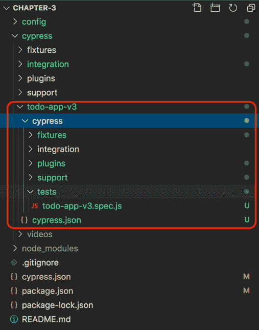

# *第三章*:使用柏树命令行工具

在前一章中，我们学习了 Cypress 与其他测试自动化工具(如 Selenium)的不同之处，以及它在 web 自动化测试中的突出表现。在这一章中，我们将利用我们的知识，使用命令行工具使用柏树。为此，我们将介绍您可以用来利用赛普拉斯功能的命令。

一些命令将涉及一些功能，例如运行单独或所有测试、调试 Cypress、在不同浏览器上启动 Cypress 测试以及其他 Cypress 命令行功能。我们将在本章中引用 GitHub 存储库文件夹，将要编写的每个命令和代码都将包含在存储库中，供您参考和实践。

我们将在本章中讨论以下关键主题:

*   运行柏树命令
*   理解基本的柏树命令
*   命令行上的 Cypress 调试

一旦你完成了这些题目，你就可以开始写你的第一个测试了。

## 技术要求

本章的 GitHub 资源库可在[https://GitHub . com/packt publishing/端到端-Web-Testing-with-Cypress](https://github.com/PacktPublishing/End-to-End-Web-Testing-with-Cypress) 上找到。

本章的源代码可以在`chapter-03`目录中找到。

要运行本章中的示例，您需要克隆本书的 GitHub 存储库，并遵循`READMe.md`文件中关于如何正确设置和运行测试的说明。您可以在[https://docs . GitHub . com/en/free-pro-team @ latest/GitHub/creating-cloning-and-archive-repository/cloning-a-repository](mailto:https://docs.github.com/en/free-pro-team@latest/github/creating-cloning-and-archiving-repositories/cloning-a-repository)上阅读更多关于如何使用 GitHub 在本地机器上克隆项目的信息。

# 运行柏树命令

Cypress 框架的有效利用需要您了解 Cypress 以及如何使用命令行运行不同的功能。赛普拉斯命令允许赛普拉斯框架的用户自动化过程，并且在初始化和运行时向框架和测试提供特定的指令。

在大多数情况下，通过命令行运行赛普拉斯测试比使用浏览器运行测试更快。这是因为通过命令行运行测试减少了运行特定测试所需的资源数量。这样做的原因是，在命令行中运行的测试通常是无头的，这意味着分配给运行测试的资源更少，这与在有头模式下执行测试不同。

重要说明

Headed 模式是在浏览器上可以直观地看到测试运行的时候，而在 headed 模式下，测试执行过程不会打开一个可见的浏览器。相反，所有测试都在命令行上运行和输出。

首先，让我们看看如何运行全局和本地的 Cypress 命令。

## 全局和局部命令

赛普拉斯命令可以从包含赛普拉斯安装和代码的特定目录运行，或者从全局赛普拉斯安装运行。在全球范围内安装赛普拉斯确保用户可以从操作系统中的任何目录运行赛普拉斯，而在本地安装赛普拉斯时，只能从安装它的单个目录访问赛普拉斯。

### 运行全局赛普拉斯命令

柏树中的全局命令通过访问柏树的全局安装版本来运行。运行 Cypress 的全局版本时调用的命令不一定是由用户生成或定义的，因为它们是内置在框架中的。为了能够全局运行 Cypress 命令，您需要使用以下命令全局安装 Cypress:

```js
npm install cypress --global
or (shorter version)
npm i -g cypress
```

前面的命令将全局安装赛普拉斯，并确保根据所提供命令的执行情况，从任何赛普拉斯安装目录调用任何已知的赛普拉斯命令都会产生结果或错误。

要运行全局命令，需要使用`cypress`关键字定义命令，然后是命令；例如`cypress run`或`cypress open`。

### 运行本地赛普拉斯命令

本地赛普拉斯命令是从赛普拉斯全局命令派生的，是全局运行命令的替代。要在本地运行 Cypress 命令，您需要使用以下命令在目录中安装 Cypress:

```js
npm install cypress 
or (shorter version)
npm i cypress
```

我们可以通过在`scripts`部分下的`package.json`文件中定义所需的命令来将它们集成到开发环境中，如下所示:

```js
{
  "scripts": {
    "cypress:run": "cypress run",
    "cypress:open": "cypress open"
  }
}
```

向`package.json`添加命令允许我们使用这些命令，就像我们对 JavaScript 包执行 npm 命令一样。在`package.json`文件中定义的命令是由 Node.js 环境在运行时解释的，当执行时，它们就像命令是全局命令一样被执行。

重要说明

建议您在运行`npm install cypress`命令之前，在终端中运行`npm init`命令。如果在没有初始化项目的情况下运行柏树，柏树的目录将不可见。通过运行`init`命令，赛普拉斯将项目目录识别为现有项目，因此它初始化并创建其目录，而无需我们在终端上运行额外的命令。

在`package.json`中定义命令不仅让开发人员和 QA 工程师更容易知道要运行哪些命令，还简化了一个人在运行、调试或维护他们的测试时需要运行的命令的性质。

重要说明

赛普拉斯开发团队建议每个项目安装赛普拉斯，不要使用全局安装方法。本地安装提供了某些优势，例如用户能够快速更新赛普拉斯依赖关系，并减少循环依赖问题，这些问题会破坏不同项目中的一些测试，而赛普拉斯在另一个项目中运行良好。

要在命令行中运行脚本，您需要调用`npm run`，后跟命令的名称。在我们之前定义的命令中，您只需要运行以下命令来同时执行这些命令:

```js
npm run cypress:run  // command  to run tests on terminal
npm run cypress:open // command to run tests on cypress runner
```

是时候快速回顾一下了。

## 回顾–运行赛普拉斯命令

在本节中，我们学习了如何调用本地或全局命令，以及如何从赛普拉斯终端或测试运行程序运行测试，该程序使用图形用户界面。在下一节中，我们将基于我们已经获得的运行 Cypress 命令的知识来了解不同的命令在 Cypress 中是如何使用的。

# 理解基本的柏树命令

在本节中，我们将探索各种柏树命令，我们可以通过终端或使用柏树测试运行程序来运行我们的测试。我们还将观察如何使用命令来获得不同的结果。本节还将向我们介绍定制不同的测试，这些测试与我们的应用程序交互以获得特定的结果。我们将深入探讨最常见的 Cypress 命令，以及如何通过预构建在 Cypress 框架中的选项来扩展这些命令。我们将探索的命令如下:

*   `cypress run`
*   `cypress open`
*   `cypress info`
*   `cypress version`

先说`cypress run`。

## 柏树跑

`cypress run`命令以无头方式执行一个赛普拉斯套件中的所有测试，默认情况下在电子浏览器中运行测试。如果没有扩展任何其他配置，该命令将运行柏树的`integration`文件夹中所有`.spec.js`格式的文件。`Cypress run`命令可以通过以下配置选项运行:

```js
cypress run {configuration-options}
```

最常见的赛普拉斯配置选项包括:


接下来的几节将对上表中显示的每个配置选项进行扩展。

### 赛普拉斯跑步-环境<env-variable></env-variable>

赛普拉斯环境变量是*动态名称-值对*，影响赛普拉斯执行测试的方式。当需要在多个环境中运行测试时，或者当定义的值易于快速变化时，这些环境变量非常有用。

在 Cypress 中，您可以将单个或多个环境变量定义为字符串或 JSON 对象。

在这一部分，我们将为一个开源的应用程序编写测试。这些测试的代码库可以在本书的 GitHub 存储库中的`chapter 03`目录中找到。正在测试的应用程序是一个在 React 中开发的**待办事项列表**应用程序。使用该应用程序，我们可以添加我们的待办事项，将其标记为已完成，删除它们，查看已完成的项目，甚至可以在*活动的*、*所有*和*已完成的*待办事项之间切换。

使用该应用程序，我们可能计划扩展该应用程序，以使用 **HTTPS** 而不是当前的 **HTTP** 协议来提供该应用程序的安全版本。尽管目前不支持 HTTPS 的功能，但我们可以在赛普拉斯测试中使用我们的环境变量为其添加规定。为了实现这一点，我们将把**传输协议** URL 部分定义为一个环境变量，然后将其传递给我们在`package.json`中的命令，如下例所示。

以下代码片段可以在`chapter 03`子文件夹中提到的 GitHub 资源库中找到。`Todo-app.spec.js`文件的完整源代码位于`Cypress/integration/examples`文件夹下。我们将在本章中探索的赛普拉斯测试是版本 1 测试。

下面的`Todo-app.spec.js`文件演示了当导航到一个 URL 时如何使用环境变量。它是主要的测试文件，位于本书 GitHub 存储库中的`chapter-03/cypress/integration/examples/todo-app.spec.js`:

```js
... 
context('TODO MVC Application Tests', () => {
  beforeEach(() => {
    cy.visit(
      `${Cypress.env('TransferProtocol')}://todomvc.com/examples/react/#/`)
  });
...
```

下面的`package.json`文件也位于`chapter-03/`目录中，保存了用来执行 JavaScript 应用程序的测试或执行命令的所有命令。它位于`chapter-03/`目录的根位置:

```js
...
"scripts": {
    "cypress:run": "cypress run --env 
    TransferProtocol='http'",
    "cypress:run:v2": "cypress run --env 
    TransferProtocol='https'",
  },
...
```

前面的脚本演示了在网址协议发生变化的情况下，我们可以运行前面提到的任何测试命令来替换我们在运行柏树测试时在网址中声明的环境变量。我们可以用`npm run cypress:run`和`npm run cypress:run:v2`连续执行前面的脚本。

重要说明

HTTPS 和 HTTP 一样，不同的是 HTTPS 更安全。这是因为发送请求和接收响应的过程是使用 TLS(SSL)安全协议加密的。

传输协议是 URL 的一部分，它决定了 URL 是使用 HTTP 协议还是 HTTPS 协议。使用 HTTP 协议的网址以`http://`开头，而使用 HTTPS 的网址以`https://`开头。

### 赛普拉斯跑步浏览器<browser-name></browser-name>

赛普拉斯命令行内置了在不同浏览器中运行赛普拉斯测试的功能，这些浏览器已经在主机上安装了，并且受到赛普拉斯框架的支持。赛普拉斯尝试自动检测已安装的浏览器，并且可以在`chrome`、`chromium`、`edge`、`firefox`或`electron`中运行测试。要在特定浏览器中运行测试，您需要使用`--browser`配置选项提供浏览器名称。您也可以选择提供浏览器路径而不是浏览器名称；只要 Cypress 有效并支持，它仍将在提供的浏览器路径中运行测试。

下面的代码片段显示了已经在本书 GitHub 存储库的`chapter-03`目录中的`package.json`的`scripts`部分定义的脚本。这些脚本定义了我们的测试将在其中运行的浏览器，并且还为 URL 的一部分传入了一个环境变量:

```js
...
"scripts": {
    "cypress:chrome": "cypress run --env 
    TransferProtocol='http' --browser chrome",
    "cypress:firefox": " cypress run --env 
    TransferProtocol='http' --browser firefox"
  },
...
```

在前面的命令中，我们可以分别使用`npm run cypress:chrome`和`npm run cypress:firefox`命令在 Chrome 或 Firefox 中运行测试。

重要说明

要在特定的浏览器中运行测试，浏览器必须安装在您的机器上，并且它也必须在赛普拉斯支持的浏览器列表中。

### 柏树运行配置<configuration></configuration>

赛普拉斯可以使用终端上运行的命令设置和覆盖配置。“Cypress”配置既可以作为单个值传递，也可以作为用逗号分隔的多个值传递，还可以作为字符串化的 JSON 对象传递。在赛普拉斯中定义的任何配置都可以通过`cypress run --config`配置选项进行更改或修改。配置选项可能包括指定替代的`viewportHeight`和`ViewportWidth`、超时和文件更改等配置。在我们的脚本中，我们将更改 Cypress 运行测试的视口，我们将在 763x700 的平板电脑视口中运行测试，而不是默认视口 1000x660。

下面的代码片段是在我们的`chapter-03`根目录的`package.json`文件中定义的。以下脚本用于在平板电脑视口中运行测试。为此，必须覆盖视口高度和宽度的“柏树”默认配置:

```js
...
"scripts": {
"cypress:tablet-view": "cypress run --env TransferProtocol='http' --config viewportHeight=763,viewportWidth=700",
}
...
```

上一个脚本可以用`npm run cypress:tablet-view`命令运行。

重要说明

在 Cypress 中传递多个配置选项时，不同配置的逗号分隔值之间不要留有空格(如前面的代码所示)；否则，Cypress 将抛出一个错误。

### 柏树运行配置文件<configuration-file></configuration-file>

赛普拉斯可以覆盖位于`/cypressRootDirectory/cypress.json`的默认配置文件。您可以定义一个或多个辅助赛普拉斯配置文件，以便运行它们的测试。Cypress 还允许您完全禁用配置文件的使用。

下面的脚本位于我们的`chapter-03`目录的根目录下的`package.json`中，是一个命令，它使赛普拉斯能够覆盖它用来运行测试的配置文件。执行命令时，将使用位于`chapter-03/config/cypress-config.json`下的`cypress-config.json`文件，而不是使用位于`chapter-03`的默认`cypress.json`文件:

```js
...
"scripts": {
"cypress:run:secondary-configuraton": "cypress run --env TransferProtocol='http' --browser chrome --config-file config/cypress-config.json"
},...
```

要运行前面的脚本，您需要运行`npm run cypress:run:secondary-configuraton`命令，该命令将使用位于`/cypressRootDirectory/config/cypress-config.json`的配置文件运行测试。

### 柏树奔跑

Cypress 提供了一个命令，允许你在无头和头模式下运行浏览器。定义了 headed 模式后，测试运行时会打开浏览器。该选项可以在赛普拉斯附带的默认电子浏览器中使用。在 electronic 中使用`run`命令运行 Cypress 测试的默认模式是无头模式，要覆盖这一点，我们需要在测试运行时通过`--headed`配置。

以下脚本可以在`package.json`文件中找到，该文件位于本书 GitHub 资源库的`chapter-03`目录中。运行以下脚本命令将使 Cypress 能够在 headed 模式下运行，这允许正在运行的测试在浏览器上可见:

```js
...
"scripts": {
"cypress:electron:headed": "cypress run --env TransferProtocol='http' --headed"
},
...
```

上一个脚本可以用`npm run cypress:electron:headed`命令运行。

### 赛普拉斯无头跑

赛普拉斯在 headed 模式下同时在 Chrome 和 Firefox 浏览器中运行测试，每次运行测试时都会启动一个浏览器。要改变这种行为并确保测试运行在不启动浏览器的情况下进行，您需要配置运行 Chrome 或 Firefox 浏览器的命令，以便它们无标题运行。

以下脚本可以在`package.json`文件中找到，该文件位于本书 GitHub 资源库的`chapter-03`目录中。运行以下命令将使 Cypress 能够以无头模式运行，在无头模式下，只能看到测试命令在命令行界面上运行:

```js
...
"scripts": {
"cypress:chrome:headless": "cypress run --env TransferProtocol='http' --browser chrome --headless",
"cypress:firefox:headless": "cypress run --env TransferProtocol='http' --browser firefox --headless"
},
...
```

要使用前面的命令在无头模式下运行 Chrome，您需要运行`npm run cypress:chrome:headless`。要在 Firefox 中以无头模式运行命令，您需要运行`npm run cypress:firefox:headless`命令。

### 赛普拉斯跑步规范

赛普拉斯允许我们指定可以运行的不同测试文件。使用该命令，可以指定一个*单个*测试文件在一个目录中运行，而不是在一个目录中运行*所有的*测试文件。还可以在不同的目录中指定不同的测试，以便它们同时运行，并指定与特定目录匹配的正则表达式模式。

以下代码片段是`package.json`文件的一部分，该文件位于本书 GitHub 存储库的`chapter-03`目录中。第一个脚本只能运行目录中的特定文件，而第二个脚本可以运行单个目录中的多个文件:

```js
... 
"scripts": {
  "cypress:integration-v2:todo-app": "cypress run --env 
  TransferProtocol='http' --spec 'cypress/integration/
  integration-v2/todo-app.spec.js'",
  "cypress:integration-v2": "cypress run --env 
  TransferProtocol='http' --spec 'cypress/
  integration/integration-v2/**/'"
},
...
```

第一个命令指定测试将运行`todo-app.spec.js`文件，该文件位于`integration-v2`文件夹中。第二个命令将运行位于`integration-v2`文件夹中的所有测试文件。

## 柏树开

`cypress open`命令在测试运行程序中运行赛普拉斯测试，配置选项应用于您正在运行的项目的测试。运行`cypress open`命令时通过的配置选项也会覆盖`cypress.json`文件中指定的默认值，如果在测试运行时指定了配置，该文件位于`tests root`文件夹中。以下命令显示了如何运行任何`cypress open`命令:

```js
cypress open {configuration-options}
```

命令的第一部分显示`cypress open`命令，第二部分显示可以与之链接的配置选项。

最常见的赛普拉斯配置选项包括:


在接下来的几节中，我们将详细讨论每个选项。

### 柏树开放环境<env-variable></env-variable>

就像运行`cypress run`命令一样，`cypress open`命令可以用测试运行时声明的指定环境变量来运行。与`cypress run`命令类似，在测试运行程序中运行测试时，可以使用`--env`配置选项声明一个或多个环境变量。

在前一节中，我们通过在`cypress run`命令中传递一个环境变量，指定了如何通过命令行运行测试。我们将通过相同的环境变量，使用我们的赛普拉斯测试运行程序运行测试，测试应该运行良好。传递的环境变量将决定**到**应用程序网址的传输协议是 **HTTP** 还是安全的 **HTTPS** 。

下面的代码片段位于`Todo-app.spec.js`文件中，这是我们`chapter-03/`目录中的主测试文件。`todo-app.spec.js`文件可以在`chapter-03/`目录下的`integration/examples`下找到。在下面的片段中，就像在`cypress run`中一样，我们可以使用`cypress open`命令将环境变量传递给网址:

```js
... 
context('TODO MVC Application Tests', () => {
  beforeEach(() => {
    cy.visit(
      `${Cypress.env('TransferProtocol')}://todomvc.com/examples/react/#/`)
  });
...
```

以下代码片段位于`package.json`文件中的`chapter-03/`根目录。使用这个片段，我们将`'http'`环境变量传递给我们的测试。这时我们可以完成我们的网址并执行我们的测试:

```js
...
"scripts": {
    "cypress:open": "cypress open --env 
    TransferProtocol='http'"
  },
...
```

要打开测试运行器并验证测试是否运行，您可以运行`npm run cypress:open`，此时会自动将**传输协议**环境变量添加到运行测试的配置中。

### 赛普拉斯打开浏览器

指定后，`--browser`选项指向，这是一个自定义浏览器，将被添加到测试运行程序的可用浏览器列表中。要添加的浏览器必须得到赛普拉斯的支持，并且必须安装在运行赛普拉斯测试的机器上。

默认情况下，在选择要运行的规范之前，通过单击测试运行程序中的浏览器选择按钮，可以在柏树中查看所有可用的浏览器。浏览器选择下拉列表包含系统上已安装的所有浏览器，并且受赛普拉斯支持。浏览器选择下拉菜单还允许您切换测试浏览器，从而在不同的浏览器下测试功能:


图 3.1–测试浏览器选择下拉列表

要指定路径以便可以添加浏览器(例如，Chromium)，您需要具有以下配置来将 Chromium 添加到可用浏览器列表中。在这里，你需要运行`npm run cypress:chromium`命令。

以下脚本位于本书 GitHub 存储库中`package.json`文件下的`chapter-03/`目录中。当脚本作为命令执行时，它将在指定位置查找浏览器，并将其添加到用于运行赛普拉斯测试的浏览器列表中:

```js
...
"scripts": {
    "cypress:chromium": "cypress open --browser 
    /usr/bin/chromium"
  },
..
```

为了执行前面的脚本来运行我们的测试，我们需要在我们的终端中运行`npm run cypress:chromium`命令。这将在`location` `/usr/bin/chromium`中找到铬浏览器，并使用它来运行我们的测试。

### 柏树开放配置<configuration-option></configuration-option>

赛普拉斯框架允许我们在测试运行器中运行测试，并提供初始化测试运行器时必须通过的配置选项。在传递`--config`选项时，可以传递一个环境变量，也可以传递多个用逗号分隔的环境变量。以下脚本指定视口尺寸应为平板电脑的尺寸，并且配置通过`–config`选项传递。要运行所需的命令，您需要运行`npm run cypress:open:tablet-view`。

以下脚本位于本书`chapter-03/`根目录的`package.json`文件中，用于更改在可见浏览器上运行的测试的视口配置:

```js
...
"scripts": {
    "cypress:open:tablet-view":"cypress open --env 
    TransferProtocol='http' --config 
    viewportHeight=763,viewportWidth=700"
  },
...
```

执行时，命令修改浏览器大小的默认柏树配置。提供的视口高度和视口宽度将以类似于平板显示器的方式显示内容。

重要说明

使用`--config`选项指定的配置选项将覆盖`cypress.json`文件中指定的默认配置。

### 柏树打开配置文件<configuration-file></configuration-file>

就像在`Cypress run`命令的情况下一样，通过测试运行器运行的赛普拉斯测试可以有一个覆盖默认`cypress.json`文件的覆盖配置文件，该文件包含默认赛普拉斯配置。它位于测试文件的根文件夹中。

以下代码片段位于`chapter-03/`目录的`package.json`文件的根文件夹中，覆盖了默认的柏树配置文件，该文件被标识为`cypress.json`。执行时，该命令将读取已经在`chapter-03/config/cpress-config.json`中声明的替代配置文件:

```js
..."scripts": {
"cypress:open:secondary-configuraton": "cypress open --env TransferProtocol='http' --config-file config/cypress-config.json"
},...
```

要执行前面的命令并更改默认的 Cypress 配置文件的位置，您需要在命令行界面中运行以下命令:

```js
npm run cypress:open:secondary-configuration
```

现在，让我们看看另一个命令。

### 赛普拉斯开放全球

前面我们提到过，丝柏可以全球安装。您可以使用全局赛普拉斯安装来运行不同的赛普拉斯测试，而不是在每个项目中安装它。这种全局安装还允许您触发全局命令，而不必在调用 Cypress 命令的特定目录中安装 Cypress。要在全局模式下打开柏树，您需要输入`--global`选项，如下所示:

```js
cypress open --global 
```

通过运行该命令，赛普拉斯将认识到我们希望使用赛普拉斯的全局版本来执行测试，而不是我们的本地实例。

### 柏树露天项目<project-path></project-path>

赛普拉斯自带内置功能，可以覆盖赛普拉斯在运行测试时启动的默认路径。当`--project`选项被定义时，它指示赛普拉斯放弃默认目录/项目路径，而是使用提供的项目路径来运行位于指定项目路径中的赛普拉斯测试。在这个设置中，可以运行位于不同目录或嵌套目录中的完全不同的 Cypress 项目。

以下代码片段位于本书`chapter-03/`根目录的`package.json`文件中，在一个完全不同的柏树项目中执行测试。脚本执行位于`chapter-03/cypress/todo-app-v3`的项目:

```js
"scripts": {
"cypress:project:v3": "cypress open --env TransferProtocol='http' --project 'cypress/todo-app-v3/'"
},
```

在前面的脚本中，用户可以运行位于`cypress/todo-app-v3`文件夹中的不同的 Cypress 项目。要运行脚本，我们需要运行`npm run:cypress:project:v3`命令。`version-3`项目是一个独立的项目，不依赖于父赛普拉斯项目。它可以使用其`cypress.json`文件来确定其运行配置，如下图所示:



图 3.2–todo-app-v3 项目测试文件夹

如上图截图所示，我们修改了`todo-app-v3` 项目中的`integrationFolder`属性，将主测试文件夹中的`cypress/integration`设置为 todo-app-v3 项目中的`cypress/tests`。

### 柏树开口

默认情况下，赛普拉斯运行在端口`8080`上。在通过`--port`选项的同时运行`cypress run`命令，可以将运行测试的默认端口覆盖到您选择的特定端口。

以下代码片段是位于本书 GitHub 存储库的`chapter-03/`目录中的`package.json`文件的一部分。运行以下命令会更改赛普拉斯运行的默认端口:

```js
"scripts": {"cypress:open:changed-port": "cypress open --env TransferProtocol='http' --port 3004"
  },
```

要运行之前的 Cypress 脚本，需要运行`npm run cypress:open:changed-port`命令。运行此命令将确保测试在端口`3004`上运行，而不是在测试运行程序上默认情况下赛普拉斯运行测试的端口上运行:


图 3.3–覆盖默认的赛普拉斯测试端口

前面的截图显示了如何使用`--port`选项在端口`3004`上运行测试，该选项被传递给`cypress run`命令。此处使用的端口仅用于演示目的；用户机器上的任何可用端口都可以作为柏树应用程序的覆盖端口。

## 使用柏树信息命令

在终端上运行`cypress info`命令将在终端上打印柏树安装信息和环境配置。该命令打印的信息包括以下内容:

*   已经安装在机器上并且被赛普拉斯检测到的浏览器。
*   关于主机操作系统的信息。
*   赛普拉斯二进制缓存的位置。
*   运行时数据存储的位置。
*   前缀为 **CYPRESS** 的环境变量，用于控制系统代理等配置。

## 使用柏树版本命令

`cypress version`命令打印出二进制版本的赛普拉斯和已经安装的 npm 版本的赛普拉斯模块。虽然大多数情况下，版本应该是相同的，但当安装的模块(如二进制版本)无法作为 npm 的包模块安装时，它们可能会有所不同，从而导致版本不同。`cypress version`命令的输出如下图所示:


图 3.4–柏树版本命令的输出

前面的截图显示了我的机器上安装的 Cypress 软件包和二进制版本。Cypress 的包和二进制版本都是相同的版本。

## 赛普拉斯命令用法的可选练习

使用项目规范中定义的**至**项目，创建一个可以运行以下测试场景的脚本:

*   使用边缘浏览器的无头测试。
*   在测试运行程序上进行测试，其中`TransferProtocol`环境变量在`chapter 03`根文件夹的`cypress.json`中指定。

在本练习结束时，您将了解如何运行 headed 和 headed 测试，以及如何将环境变量添加到脚本中，我们可以使用这些脚本来执行不同的 Cypress 命令。您还将学习如何使用不同的浏览器来执行 Cypress 测试。

## 回顾–理解基本的柏树命令

在这一节中，我们学习了如何使用不同的赛普拉斯命令来使用命令行或赛普拉斯测试运行程序运行赛普拉斯，该测试运行程序使用系统上安装的不同浏览器运行。我们了解到，尽管 Cypress 附带了运行测试的默认命令，但我们可以扩展这些命令，并通过利用可用于为我们的用例定制 Cypress 的命令和选项来提高运行测试的效率。我们还提供了一个练习，以便您可以应用通过使用`cypress run`和`cypress open`命令获得的知识。在下一节中，您将学习如何使用内置的 Cypress 调试器来查看重要的调试信息，这些信息对于使用我们的终端排除错误是必要的。

# 柏树在命令行调试

在本节中，我们将探讨如何使用 Cypress 的命令行调试属性来解决我们在运行测试时可能遇到的问题。我们还将探索 Cypress 通过命令行提供的不同调试选项。

Cypress 有一个内置的调试模块，在您使用`cypress run`或`cypress open`运行测试之前，可以通过传递调试命令向用户公开该模块。要从终端接收调试输出，`DEBUG`环境变量需要在赛普拉斯在苹果或 Linux 环境中测试运行之前设置。

以下脚本可以在`chapter-03/`根目录的`package.json`文件中找到，用于在执行命令时显示调试输出。当使用`cypress open`命令运行测试时，第一个脚本可用于显示调试输出，而当使用`cypress run`命令运行测试时，第二个脚本可用于显示调试输出:

```js
"scripts": {
"cypress:open:debugger": "DEBUG=cypress:* cypress open --env TransferProtocol='http'",
    "cypress:run:debugger": "DEBUG=cypress:* cypress run --
    env TransferProtocol='http'"
  },
} 
```

如前面的命令所示，运行`npm run cypress:open:debugger`将在终端中运行赛普拉斯测试，并记录运行的调试输出。第二个命令可以用`npm run cypress:run:debugger`运行，它将在赛普拉斯测试运行器上运行测试的同时运行调试器。

赛普拉斯使得通过过滤调试输出变得容易，因为您可以选择拥有关于特定模块的调试信息，例如赛普拉斯服务器、命令行界面或启动器模块。

以下脚本位于本书 GitHub 存储库的`chapter-03/`目录下的`package.json`文件中。运行时，它将为柏树服务器模块下的所有日志提供调试输出:

```js
...
"scripts": {
"cypress:open:server-debugger": "DEBUG=cypress:server:* cypress open --env TransferProtocol='http'"
} 
...
```

用`npm run cypress:run:server-debugger`运行前面的命令只会输出与 Cypress 服务器相关的调试器信息。使用过滤命令不仅可以轻松缩小赛普拉斯的问题范围，还可以帮助过滤掉噪音，留下对调试赛普拉斯信息非常重要的日志，这些日志将引导我们找到问题的根源。

## 赛普拉斯调试可选练习

使用项目规范中定义的**至**项目，创建一个运行以下测试场景的脚本:

*   调试赛普拉斯命令行界面模块
*   调试`cypress:server`项目模块

在本练习结束时，您将会掌握丝柏中调试的概念，并了解如何在`package.json`文件中创建和运行丝柏脚本。

## 重述–在命令行上进行柏树调试

在本节中，我们学习了如何通过设置`DEBUG`环境变量，利用赛普拉斯查看关于我们的测试运行的附加信息。我们还学习了如何利用 Cypress 的`debug`变量来过滤掉我们需要的调试输出，并执行了一个练习来扩展我们使用命令行进行调试的知识。

# 总结

在本章中，我们了解了`cypress open`和`cypress run`命令，以及如何将这两个命令与配置选项链接起来以扩展它们的使用。我们还学习了如何检查我们系统上安装的赛普拉斯信息和赛普拉斯版本。在最后一节中，我们学习了如何使用 Cypress 提供调试输出，并找出测试失败的原因。在下一章中，我们将深入编写 Cypress 测试并理解测试的不同部分。