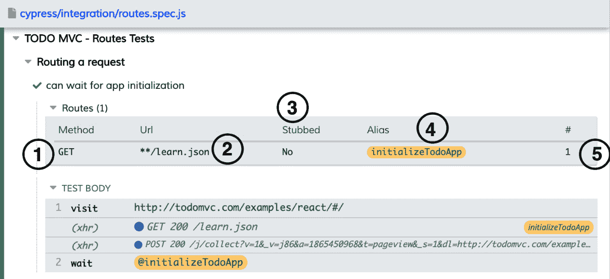
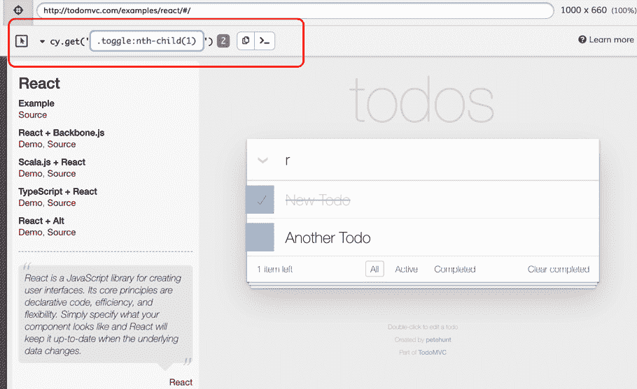

# *第九章*:赛普拉斯试飞员的进阶使用

在我们开始测试运行器的高级使用之前，了解赛普拉斯如何工作、测试运行器的角色以及测试如何在测试运行器中执行是至关重要的。本章基于您在前八章中获得的关于赛普拉斯的知识，将重点帮助您理解我们在本书中尚未探索的测试运行器的高级功能。

在本章中，我们将利用测试运行器，并学习如何利用测试运行器的内置功能编写更好的测试。通过学习如何使用测试运行器，我们将对测试如何运行、失败时会发生什么以及如何改进有更深入的了解。我们将在本章中讨论以下关键主题:

*   了解仪表板
*   了解选择器游乐场
*   测试运行程序键盘快捷键

一旦你完成了这些主题中的每一个，你将对测试运行器有一个全面的了解，以及如何在编写测试的过程中充分利用它。

## 技术要求

首先，我们建议您从 GitHub 中克隆包含源代码和我们将在本章中编写的所有测试的存储库。

重要说明

我们已经在 [*第 5 章*](05.html#_idTextAnchor119)*调试赛普拉斯测试*中讲述了如何阅读和解读《测试跑者》中的赛普拉斯错误。在那一章中，我们还介绍了如何在测试运行器中与 DOM 快照进行交互，其中我们介绍了元素和命令日志之间的交互。在本章中，我们可以参考 [*第 5 章*](05.html#_idTextAnchor119) 、*调试柏树试验*，或者进一步阐述该章中提供的信息。

本章的 GitHub 资源库可在[https://GitHub . com/packt publishing/端到端-Web-Testing-with-Cypress](https://github.com/PacktPublishing/End-to-End-Web-Testing-with-Cypress) 上找到。

本章的源代码可以在`chapter-09`目录中找到。

# 了解仪表盘

仪表板是赛普拉斯测试运行器中的特殊面板，只有赛普拉斯向您提供测试的附加信息时才可见。仪表板的外观由提供更多测试信息的特定命令触发。触发仪表盘的命令包括`cy.stub()`、`cy.intercept()`和`cy.spy()`。在本节中，我们将探讨如何使用仪表板来显示有关测试的附加信息。

为了实现我们理解仪表盘如何工作的目标，我们必须了解**拦截**、**存根**和**间谍**是如何工作的，以及在赛普拉斯测试中调用存根、路线和间谍时，仪表盘上会显示哪些具体信息。

## 截获

赛普拉斯使用`cy.intercept()`命令来管理测试网络层中 HTTP 请求的行为。要理解拦截，我们首先需要了解网络请求是如何在赛普拉斯发生的。当运行测试发出**XHR**(**XMLHttpRequest**)请求时，赛普拉斯会自动在测试运行器上显示。此外，Cypress 还创建了一个 DOM 快照，记录了调用请求的时刻和收到响应的时刻，这让我们了解了请求前后的 DOM 是什么样子的。下面的代码块是一个请求的例子，该请求从我们的 Todo 应用获取对 XHR 请求的响应:

```js
describe(Routing a request', () => {
    it('can wait for a app initialization, () => {
 	cy.intercept('POST','**/j/** 
     ').as('initializeTodoApp');
      cy.visit('http://todomvc.com/examples/react/#/');
      cy.wait('@initializeTodoApp'); // wait for intercept
      response
    })
  });
```

前面的代码块显示了 Cypress 的`cy.intercept()`命令正在监听 XHR 响应，它希望 Cypress 在应用初始化时做出响应。在测试中，我们正在验证请求确实是向应用发出的，因为我们正在等待路由响应在测试完成之前被调用。

Cypress 具有解释请求的能力，这使得框架可以通过监听测试正在进行的 HTTP 请求并知道请求调用返回的响应来轻松管理 HTTP 请求。

通过使用`cy.intercept()`命令，在赛普拉斯中的拦截提供了覆盖赛普拉斯测试在执行过程中发出的请求所返回的 XHR 响应的能力。覆盖我们的应用做出的 XHR 响应的是我们称之为**的存根**，我们将在本章的后面讨论这个概念。

赛普拉斯将所有截获的信息记录在仪表盘上，通过查看仪表盘，我们可以得知测试中匹配的路线数量，是否有任何与我们的路线匹配的响应，以及它们是否被存根。下面的截图说明了如何使用仪表板来详细说明赛普拉斯记录的路线信息:



图 9.1–赛普拉斯仪表板

*图 9.1* 显示了标有**路线**的仪表板所代表的区域，其中包含了当测试完成运行时路线响应所具有的不同类型信息的列。路线仪表板中不同的栏有不同的用途，对运行测试和仪表板都有重要意义。以下是不同的列，分别描述了它们在赛普拉斯布线中的用途和意义:

*   **方法**(**1**):**方法**列代表`cy.intercept()`命令所期待的请求，根据所期待的请求，可以是 **GET** 、 **POST** 、 **PUT** 、 **PATCH** ，甚至 **DELETE** 。
*   **网址**(**2**):**网址**栏将显示运行赛普拉斯测试时我们的`cy.intercept()`命令所期望的网址。在这种情况下，我们已经告诉赛普拉斯寻找任何以`learn.json`结束的路线，如果它遇到它，那么我们的测试应该会通过。
*   **短粗**(**3**):**短粗**栏将显示我们的路线是否被短粗。当路由被截断时，赛普拉斯不会返回收到的响应，而是返回我们传递给路由的响应。
*   **别名**(**4**):**别名**列显示了我们在赛普拉斯给出的路线的别名。在 [*第 8 章*](08.html#_idTextAnchor183)*理解赛普拉斯*中的变量和别名中，我们了解了别名，以及当我们需要访问一个元素、一条路线甚至一个请求的信息时，别名如何有用。**别名**列中提供的别名是我们用来调用路由的，我们将通过在别名前附加一个`@`前缀来实现。
*   **#** ( **5** ):此匹配栏将显示匹配我们路线的响应计数。在我们的例子中，对我们的网址的请求只被发出一次，因此在我们的测试中我们的路由只被调用一次。

路线上的仪表面板信息足以让您了解是否对我们测试中已经声明的路线提出了任何 XHR 请求，以及请求的方法和次数是否与应用中预期的一致。

## 存根

赛普拉斯中的存根用于替换一个函数，控制它的行为，或者记录它的用法。存根可以用来用我们自己编写的合成响应代替实际的方法。在下面的代码块中，我们将只验证我们可以在测试运行时存根一个名为`foo`的方法:

```js
it('can stub a method', () => {
      let obj = {
        foo () {},
      }
      const stub = cy.stub(obj, 'foo').as('foo')
      obj.foo('foo', 'bar')
      expect(stub).to.be.called
    })
```

前面代码块中显示的`foo()`方法说明了存根的作用，从代码中，我们可以看到我们希望赛普拉斯知道我们的存根是在测试中调用`foo`函数时被调用的。下面的截图显示了正在执行的测试和通过的测试的详细信息，包括存根类型、存根名称和存根被调用的次数:


图 9.2–柏树修剪

在*图 9.2* 中，赛普拉斯在仪表盘中显示了我们创建的存根，还显示了在测试执行过程中存根被调用的次数。存根化很有用，因为我们可以存根化我们不一定想在我们的范围内测试的依赖项或函数。

## 间谍

间谍的行为就像存根，不同的是他们在间谍中包装了一个方法，让他们记录函数的调用和参数。间谍仅用于验证赛普拉斯的工作要素或方法。测试中最常见的用途是验证某些调用是在测试中进行的，而不一定像存根那样用于改变调用的预期。下面的截图显示了一个方法的间谍，其中我们验证了`foo`方法是在我们的`cy.spy()`方法中调用的:


图 9.3–赛普拉斯间谍活动

在*图 9.3* 中，仪器面板在向我们显示对我们的`spy`函数的调用、函数的名称、分配给我们的间谍方法的别名以及我们的测试方法的类型方面起着至关重要的作用。

## 回顾–了解仪表板

在这一节中，我们学习了如何利用仪表盘来理解 Cypress 中的拦截、间谍和存根。我们还了解了拦截、间谍和存根实际上是如何工作的，以及仪表板上的信息如何有助于了解我们的实现是否正确。在下一节中，我们将深入了解赛普拉斯的选择器操场，看看它是如何工作的。

# 了解 Sel 户外游乐场

选择器操场是赛普拉斯测试跑者的互动功能。选择器游乐场使您能够确定唯一的选择器，检查与特定选择器匹配的元素，以及检查与赛普拉斯应用中特定文本匹配的元素。在这一节中，我们将看看赛普拉斯用来选择元素的不同策略，以及我们如何从测试运行器中识别出我们可以在测试中使用的选择器。在本节结束时，您将学习如何使用柏树来使用选择器操场唯一地选择元素，以及如何使用柏树用来运行测试的选择器策略。

## 选择独特元素

选择器游乐场可能是赛普拉斯测试运行器中最未被充分利用的特性之一，但对于任何想要编写具有有意义的选择器的测试的人来说也是最有用的特性之一。选择器游乐场使我们能够为测试应用中的元素识别有效的选择器和唯一的选择器。

在选择器操场中，赛普拉斯为目标元素计算唯一的选择器，并通过评估测试框架中默认启用的内置选择器策略来确定选择器。下面显示了两个添加的待办事项和一个打开的柏树选择器游乐场，展示了我们如何唯一地选择任何待办事项:


图 9.4–柏树选择游乐场

第一步是点击选择器操场按钮，一旦点击，选择器操场菜单出现，如图*图 9.4* 所示。在选择器游乐场菜单中，您可以选择更改选择器的类型，使用`cy.get()`或使用元素文本(可通过将选择器切换为`cy.contains()`找到)选择元素。在内部，`cy.get()`命令或`cy.contains()`命令是我们希望从应用预览中获得的特定元素或文本。对于任何有资格成为唯一元素选择器的元素或文本，匹配元素的数量，由选择器操场上的灰色表示，应该是 **1** ，以确保我们没有重复的元素或文本。匹配元素标签旁边的按钮表示将选择器复制到剪贴板的复制命令，而下一个按钮是打印按钮，它将把我们选择的命令打印到浏览器的控制台日志中。

当点击选择器操场下方的鼠标按钮时，当用户悬停在一个元素上时，Cypress 会自动显示一个弹出窗口，并自动选择一个唯一的选择器，该选择器可用于在我们的测试中识别该元素。在*图 9.4* 中，我们可以看到一旦**新托多**项目悬停在上方，柏树会显示唯一的选择器作为工具提示，并在单击该元素时填充`cy.get()`命令。当在选择器操场菜单上选择一个元素时，赛普拉斯将返回选择器操场上的唯一选择器。

### 选择器的确定

对于赛普拉斯来说确定选择器游乐场中唯一的选择器，它使用优先选择策略，其中所选择的选择器基于赛普拉斯已知的一系列策略。在为元素选择和分配唯一选择器时，Cypress 优先选择以下策略:

*   `data-cy`
*   `data-test`
*   `data-testid`
*   `id`
*   `class`
*   `tag`
*   `attributes`
*   `nth-child`

    重要说明

    选择器游戏场更喜欢识别格式中以`data-*`开头的选择器策略。在大多数情况下，选择器策略是定制的，因此消除了由于使用动态标识、应用中的类名或由于内容变化而改变 CSS 而导致测试失败的可能性。使用自定义`data-*`标签，选择器标识符不会改变，并且可以在应用的整个生命周期中保持不变。

当一个元素可以通过这些选择器策略中的任何一个来识别时，赛普拉斯将显示该元素的唯一选择器。虽然这些策略是赛普拉斯喜欢的，但是通过将其添加到可识别的选择器策略列表中，可以改变配置并使赛普拉斯识别您的选择器策略。

## 编辑选择器元素

选择器游乐场为用户提供了编辑所选元素的选择器的能力。拥有编辑选择器元素的能力很重要，因为一个更有针对性的选择和一个更精细的选择器标签可以以一种赛普拉斯自己可能无法做到的方式生成。赛普拉斯会自动识别对选择器操场所做的更改，当与编辑的选择器元素匹配时，它会以蓝色突出显示选择器操场，如果在应用预览的选择器操场中与编辑的选择器标识符不匹配，它会以红色突出显示选择器操场。*图 9.5* 和*图 9.6* 显示使用正确的元素选择器和不正确的元素选择器编辑选择器游乐场:


图 9.5–操场中的有效元素选择器

在*图 9.5* 中，使用无效元素选择器编辑选择器操场显示一个错误，并用红色突出显示选择器操场，以向我们显示使用我们提供的选择器元素没有找到元素。*另一方面，图 9.6* 显示编辑选择器操场元素选择器成功:



图 9.6–操场中无效的元素选择器

正如在*图 9.6* 中观察到的，我们能够用我们在选择器操场中编辑的选择器来选择我们的两个待办事项。蓝色表示赛普拉斯找到了我们正在搜索的元素，并通过在选择器操场的元素选择器输入的右侧显示元素计数来实现。

## 回顾–了解选择器操场

在本节中，我们学习了选择器操场是什么，以及在使用测试运行器运行测试时它有多重要。我们学习了如何使用选择器操场来选择元素，修改元素，甚至从赛普拉斯测试运行器的应用预览中选择和复制独特的元素。我们还学习了赛普拉斯如何识别元素以及选择元素时首选的选择器策略。最后，我们学习了如何在选择器操场中编辑定位器，以及如何识别选择器是否有效。在下一节中，我们将看看快捷键在测试运行器上是如何工作的。

# 测试运行程序键盘快捷键

当我们不想在浏览器上执行涉及一系列步骤的手动操作时，键盘快捷键会派上用场。在本节中，我们将学习如何使用三个键盘快捷键来控制赛普拉斯测试运行器，并有效地运行我们的测试。使用测试运行器，我们将比使用浏览器操作显式触发操作时更快地执行常见操作。

以下是不同键盘按键及其相关动作的映射:

*   *R*–重新运行规格文件的测试
*   *S*–停止运行测试
*   *F*–在规格窗口中查看所有测试

根据用户的按键，这些键盘按键将在测试运行器上触发不同的操作。

## 重述–测试运行程序键盘快捷键

在本节中，我们学习了如何使用键盘上的三个键来控制测试运行程序的常见操作。我们还了解到，使用键盘执行动作比使用浏览器动作触发相同动作产生更快的动作。

# 总结

在本章中，我们了解了赛普拉斯测试跑中的仪表板、选择器操场和键盘快捷键。我们探讨了仪表板如何与存根、间谍和路线一起工作，并探讨了路线、存根和间谍如何工作，以及仪表板中显示了哪些信息。我们还研究了选择器操场如何在赛普拉斯中使用，以及我们如何利用它来为测试中的应用识别元素，并优化赛普拉斯用来唯一选择元素的选择器。最后，我们学习了 Cypress 键盘快捷键的功能，以及哪些键被映射到使用浏览器功能时可用的操作。

现在我们知道并理解了柏树中不同的元素是如何结合在一起的，我们可以进一步测试我们通过练习学到的主题知识。在下一章中，我们将测试我们在导航、网络请求和导航配置选项方面的知识。