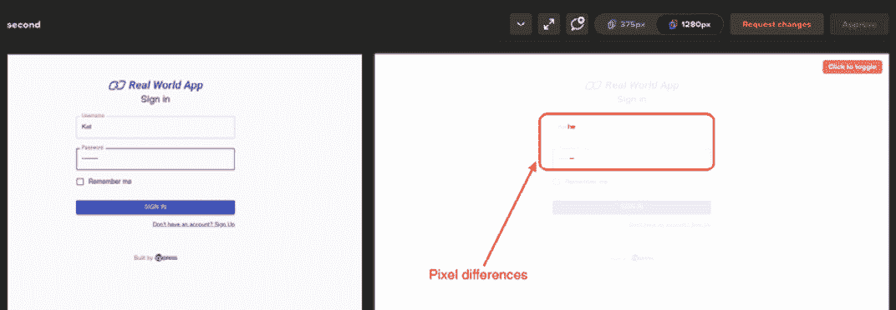

# 十二、Cypress 的视觉测试

在我们开始视觉测试之前，您应该对其他形式的测试以及我们如何使用 Cypress 来实现这一点有所了解。本书的前几章从基础到中级，讲述了如何轻松地开始使用 Cypress，如何配置 Cypress，以及如何优化对 Cypress 的使用，为您的测试编写过程开发更具创造性的工作流。前几章中的背景信息将为您提供处理本章所需的上下文。我们在本书最后一章的重点将是使用 Cypress 的视觉测试。

在本章中，我们将介绍视觉测试的基础知识，并了解我们为什么需要它。我们还将学习一些可以用来进行视觉测试的工具。作为一名工程师或测试人员，本章中的主题将帮助您理解为什么可视化测试对 web 应用很重要，以及我们如何利用它来编写更好的测试。

我们将在本章中讨论以下关键主题:

*   视觉测试
*   理解视口
*   Cypress 测试中的可视化测试工具

一旦你完成了每一个主题，你就可以开始你的自动化测试之旅了。

## 技术要求

首先，我们建议您为这本书克隆 GitHub 存储库，其中包含源代码以及我们将在本章中编写的所有测试、练习和解决方案。

本章的 GitHub 资源库可在[https://GitHub . com/packt publishing/端到端-Web-Testing-with-Cypress](https://github.com/PacktPublishing/End-to-End-Web-Testing-with-Cypress) 上找到。

本章的源代码可以在`chapter-12`目录中找到。

在我们的 GitHub 存储库中，我们有一个财务测试应用，我们将在本章的不同示例和练习中使用它。

重要提示:在窗口中运行命令

注意:默认的 Windows 命令提示符和 PowerShell 不能正确解析目录位置。

请遵循进一步列出的专门在以单词`*windows`为后缀的 Windows 操作系统上工作的 Windows 命令。

要确保测试应用正在您的计算机上运行，请从您的计算机终端上的存储库的根目录运行以下命令:

```js
$ cd cypress/chapter-12;
$ npm install -g yarn or sudo npm install -g yarn
$ npm run cypress-init; (for Linux or Mac OS)
$ npm run cypress-init-windows; (for Windows OS)
// run this command if it's the first time running the
application
or
$ npm run cypress-app (for Linux or Mac OS)
$ npm run cypress-app-windows; (for Windows OS)
// run this command if you had already run the application
previously
Optionally
$ npm run cypress-app-reset; (for Linux or Mac OS)
$ npm run cypress-app-reset-windows; (for Windows OS)
// run this command to reset the application state after
running your tests
```

重要说明

我们的测试位于`chapter-12`目录中，测试应用位于存储库的根目录中。为了正确运行我们的测试，我们必须同时运行我们的应用和 Cypress 测试，因为测试是在实时应用上运行的，而实时应用必须在我们的机器上本地运行。需要注意的是，测试应用需要使用端口`3000`作为前端应用，使用端口`3001`作为服务器应用。

第一个命令将我们导航到`cypress-realworld-app`目录，这是我们的应用所在的位置。`npm run cypress-init`命令将安装应用运行所需的依赖项，而`npm run cypress-app`命令将启动应用。或者，您可以使用`npm run cypress-app-reset`命令重置应用状态。重置应用会删除添加的不属于应用的任何数据，从而使应用的状态恢复到克隆存储库时的状态。

# 视觉测试

无论您是 web 开发人员还是测试人员，都需要确保正在开发的应用保持项目构思时的外观和感觉。作为开发人员，您可能希望验证您的应用在不同版本之间没有视觉方面的变化。作为测试人员，您可能希望验证应用的用户界面在不同版本之间保持一致，并且与设计保持一致。

**功能测试**可以是用于检查视觉方面，例如验证按钮或输入框是否存在。然而，这可能需要编写大量的代码，并且在大多数情况下，不允许您测试应用的每个方面，例如当我们使用 CSS 来验证用户界面元素时的 CSS 变化。可视化测试是验证应用用户界面的可视化方面并确保它们与预期一致的能力。

在本节中，我们将学习什么是可视化测试，什么是不同类型的可视化测试，手动和自动可视化测试的区别，以及何时使用不同类型的可视化测试方法。

## 为什么是视觉测试？

视觉测试采用了一种实用的方法，因为你必须直接映射页面的视觉方面，并将这些方面与预期的设计进行比较。有可能不考虑视觉测试的想法，因为我们认为我们的眼睛对于验证目的来说足够精确，这是一个有缺陷的假设。虽然肉眼可以注意到可见的页面变化，但眼睛检测微小的细节要稍微困难一点，例如 CSS 属性的变化使输入元素移动了几个像素或最小的像素变化 s。

可视化测试的存在是为了让开发人员和测试人员相信网页的用户界面没有被开发人员所做的任何更改所破坏。例如，对于可视化测试，如果部署到生产环境中的应用版本缺少注册按钮，而该应用的早期版本有注册按钮，则无需担心。

视觉测试有两种类型，如下:

*   人工视觉测试
*   自动化视觉测试

这两种类型的视觉测试将向我们展示视觉测试有多重要，以及我们如何利用这两种测试方法来编写更好的测试。

### 人工视觉测试

手动可视化测试包括用肉眼验证开发团队所做的更改是否没有破坏任何可见的用户界面功能。手动可视化测试包括测试人员或开发团队对开发的用户界面进行可视化测试，并将其与最初创建的设计进行比较。对应用进行可视化测试的过程确认了用户界面的行为、外观和感觉没有任何意想不到的变化。手动视觉测试很好，适合用户界面中的小变化，但这可能不是验证具有大量页面和视觉元素或不同视口的应用的非常准确的方法。为了识别手动视觉测试的局限性，下图由 *Atlantide Phototravel* 展示了埃菲尔铁塔的并排比较。它们非常相似，但在第二帧中省略了微小的细节。花几秒钟对比图像不看第二张图像中的圆形区域，试着找出视觉差异:


图 12.1–发现埃菲尔铁塔图像中的差异

即使对训练有素的人来说，也有一些细节，比如鸟的图案、失踪的人，甚至失踪的云，这些细节可能会使人几乎无法从视觉上分辨出两张照片之间是否真的有差异。通过应用手动视觉测试的相同思想，非常有可能遗漏细节，并且不能发现它们之间的任何差异，即使当一些元素缺失或者已经被添加到被测试的应用中时。

### 自动化视觉测试

自动化视觉测试包括测试页面的视觉元素。使用自动过程来检查应用页面的一致性，而不是使用手动方法。为了正确运行自动化视觉测试，我们必须保存并定义我们想要的用户界面作为**基线**。我们可以然后在我们的测试中使用它来检查我们是否需要更新基线或者修改对我们的应用所做的更改。

自动化视觉测试源于功能测试。自动化可视化测试不是断言页面中的每个元素，也不是检查页面中元素的属性，而是采用用单个断言检查整个页面的方法。

自动视觉测试有两种类型:

*   快照测试
*   视觉人工智能测试

让我们详细看看每一个。

#### 快照测试

快照测试是一种自动视觉测试，在测试运行时记录特定屏幕的光栅图形或位图。然后将记录的位图与之前记录的基线位图(基线)进行核对。快照测试工具中的算法只通过对比**十六进制色码**来检查位图中是否有像素差异。如果识别出任何颜色代码差异，则报告快照错误或生成显示视觉差异的图像。

与手动测试相比，快照测试是识别用户界面中错误的一种非常快速的方法。如果应用本质上有些静态，并且在用户界面中没有很多动态内容变化，那么快照测试是测试 web 应用的首选方式。快照测试无法正确处理动态内容，因为算法会将内容中的任何变化检测为像素变化导致的视觉差异。随着所有的视觉变化被识别为视觉差异或潜在的错误，不可能有包含动态数据的页面的一致快照图像。

#### 视觉人工智能测试

视觉 AI 测试是自动化视觉测试的新一代，利用了 **AI** ( **AI** )。可视化 AI 测试的主要目标是改善快照测试的缺点，比如在测试应用时处理动态内容。通过使用计算机视觉，视觉人工智能算法可以识别图像和我们的测试可以运行的区域，甚至在动态内容的情况下，它们可以识别我们的内容被允许动态的区域和应该保持不变的区域。

可视化 AI 测试也让开发人员和测试人员更容易进行跨浏览器测试。使用跨浏览器应用，用户可以编写一个测试，然后在应用支持的不同**视口**中运行。**视口测试**是一个方便的工具，因为它消除了开发人员(或为每个设备编写快照测试的测试人员)检查每个视口以验证没有视觉变化的负担。

## 回顾–视觉测试

在本节中，我们了解了什么是视觉测试，视觉测试的不同类型，以及何时使用每种类型的视觉测试。我们了解了自动化视觉测试和手动视觉测试的区别，也了解了不同类型的自动化视觉测试。然后，我们了解了为什么可视化测试是手动测试的首选方法，以及为什么新一代可视化测试改进了第一代可视化测试工具中存在的缺点。现在我们已经了解了视觉测试的所有知识，在下一节中，我们将通过了解什么是视口以及如何测试它们来探索更多需要视觉测试的领域。

# 理解视口

视口是用户网页的可见区域。因此，术语“视口”用于测量用户设备上的矩形观看区域。当计算机第一次被发明时，只有几个可用的视窗，尽管由于创建了更多的设备，这个数字已经大大增加了。在撰写本文时，折叠手机或翻转屏幕等设备以及不同尺寸的智能电视正在创建新的视窗，因此开发人员有责任确保他们的应用与用户的设备兼容。对于不同的视口，在使应用与这些视口兼容方面出现了新的挑战，这对于测试人员来说是一个更大的噩梦，因为实际上不可能通过每个可用的视口测试应用。

在本节中，我们将探讨视口的重要性，如何在不同的视口中进行测试，以及视口在视觉测试中的作用。

## 视口和测试

视口在测试网络应用时扮演着重要角色，因为它们显示实际用户将如何查看正在测试的网络应用。撰写本文时，移动视口是最常用的视口。这是因为手机已经发展成为最强大的便携式和手持技术。为了给用户提供良好的体验，视口测试应该是重中之重。通过视口测试，我们可以检查质量，例如 web 应用对不同屏幕尺寸的响应程度。

开发响应性网络应用比非响应性网络应用具有优势，因为与独立的移动应用相比，它们需要更少的时间和资源来开发，而独立的移动应用要么在 iOS 上运行，要么在安卓上运行，并且执行相同的功能。

所有现代浏览器都允许我们在构建应用时检查和测试响应性。以下截图显示了在 Chrome 浏览器上渲染的 iPhone 6 视口，显示了 Cypress 文档页面在手机上的显示方式:


图 12.2–iphone 6 移动视口

我们可以使用浏览器上的**切换设备工具栏**在普通网页视图和移动设备视图之间切换。这使我们能够看到不同的 web 应用是如何在不同的视口中呈现的。在网络应用响应的情况下，测试不同的视口没有问题，因为应用将自动适应变化的视口。然而，对于无响应的 web 应用，情况并非如此。在下面的屏幕截图中，您可以看到当前视口的选项，以及添加浏览器尚未定义的自定义视口的功能:


图 12.3–浏览器视口选择

如前面的截图所示，可以添加 Chrome 浏览器设备列表中不存在的新测试视口。

选择视口时，Chrome 网页区域会自动调整浏览器上可见的内容。作为开发人员或测试人员，很容易发现应用是否需要更改。

## 视口和自动视觉测试

考虑到前面截图中显示的视口数量，手动测试每一个视口并验证没有任何改变破坏了应用的用户界面，或者任何引入了不必要的非预期改变是很麻烦的。为了确保视口得到测试，我们可以使用自动视觉测试通过不同的视口检查应用的一致性。通过可视化测试，我们可以验证在测试中配置的不同视口中，我们的应用没有发生意外的变化。

## 回顾–视口

视口是视觉测试的一个重要方面，尤其是因为大多数关于网络应用响应的主要问题都是视口错误造成的。在本节中，我们了解了不同类型的视口，以及如何使用浏览器的切换选项检查网络应用的响应性，该选项在不同的设备视口和普通计算机视口之间切换。我们还了解到，通过使用自动化视觉测试，我们可以为不同的视口自动化不同的测试用例，并自动知道是否对应用进行了非预期的更改。在下一节中，我们将探索如何使用自动化视觉 AI 工具和 Percy(利用快照记录视觉测试)使用 Cypress 编写自动化视觉测试。

# 自动化视觉测试工具

视觉测试是 Cypress 的一个重要部分，因为它是我们熟悉的功能测试的过渡。借助可视化测试，Cypress 展示了一个全新的机会世界，关于我们如何测试用户界面，而不必编写数百行功能代码来断言页面上的独立元素。

在本节中，我们将通过将两个自动化的可视化测试工具与 Cypress 集成来深入研究它们，然后了解如何使用它们来实现可视化测试应用的目标。其中一个工具使用快照记录**基线位图**和一个接一个地比较位图图像像素，检查十六进制颜色是否有任何差异。另一个工具使用人工智能算法来比较我们的网络应用的快照。

在这一节结束时，我们将了解使用什么工具，Cypress 何时以及如何在创建测试工具的简单集成以及测试本身中发挥作用。我们要看的两个工具是 Applitools Eyes SDK 和 Percy。

## 珀西

Percy 是一个与测试工具集成的可视化测试和评审平台。这使得开发人员和质量保证工程师能够识别视觉缺陷，否则这些缺陷很难识别和报告。珀西在公园里散步进行视觉测试——你只需要下载珀西 npm 模块，配置**浏览器返回**，并将珀西添加到你的测试中。完成所有必要的配置后，您可以复制珀西提供的**令牌**，该令牌将在您的机器中用作环境变量，如果您希望将测试快照上传到 Browserstack 云以查看和识别视觉差异(如果有)，则需要该令牌。

重要说明

Browserstack 是一个可视化测试和评审工具，它拥有 **Percy** 工具。要配置珀西，需要配置 Browserstack 所有配置将在两个平台之间同步。

珀西主要依赖火狐和 Chrome 浏览器。为了测试一个应用，Percy 在不同的视窗中通过一组浏览器运行它，并且记录对不同视窗所做的任何更改。记录并保存第一张图像后，珀西会在您的测试中制作图像**基线**，并在突出显示任何可能出现的视觉差异之前，使用该图像检查类似图像的后续测试运行中的任何变化。

### 陷害珀西

设置珀西并不复杂，包括以下步骤:

1.  使用浏览器返回([https://www.browserstack.com/](https://www.browserstack.com/))创建账户。
2.  验证您的浏览器确认电子邮件地址。
3.  在浏览器跟踪仪表板中创建组织。
4.  使用您的浏览器登录帐户登录珀西仪表板。
5.  在珀西仪表板上创建一个项目。
6.  使用珀西网站([https://docs.percy.io/docs/cypress](https://docs.percy.io/docs/cypress))上的说明，在您的本地项目中配置珀西。
7.  将珀西令牌作为环境变量添加到您的本地计算机中。
8.  瞧啊。你现在可以开始写测试了！

一旦*步骤 1-4*完成，珀西为您提供了一个 TOKEN，您必须在执行测试之前将它添加到您的机器环境变量中。您可以访问珀西文档([https://docs.percy.io/docs/cypress](https://docs.percy.io/docs/cypress))了解更多关于如何使用 Cypress 设置珀西的信息。

一旦一切都设置好了，我们就可以运行我们的第一个测试，这将涉及检查当内容更改时，我们是否可以在登录页面上看到视觉差异。如下图所示，我们通过在登录页面输入用户名和密码来运行测试:


图 12.4–珀西–新快照

在这里，我们可以看到上传到珀西仪表板的快照图像。上传的快照是我们的登录页面。上传快照后，珀西立即给了我们切换 Chrome 和 Firebox 浏览器的选项，这样我们就可以检查快照的一致性。在珀西主仪表板上，我们可以选择批准所有快照、拒绝和接受单个快照，甚至在呈现给我们的桌面视口和移动视口之间切换。

重要说明

Percy 仅在测试执行终止且运行测试的终端关闭时将快照上传到仪表板。这与 Applitools 工具不同，Applitools 工具在测试完成后会立即连续上传测试快照。

正如我们前面提到的，我们可以使用珀西来比较我们记录的基线图像和新生成的位图图像的位图图像。然后，所涉及的算法逐个像素地检查差异，当基线图像与在我们的测试应用的第二次运行中生成的新生成的图像不相似时，这些差异被记录为视觉差异。下面的截图显示了我们在珀西仪表板上的第二次测试。这里，我们省略了用户名和密码字段中的一些字符，我们想检查珀西是否识别出这些差异:



图 12.5–珀西像素差异

如前面的截图所示，一旦我们运行了第二次构建，我们就省略了用户名和密码字段中的一些字符。当快照上传到珀西时，程序通过检查不同图像的像素来识别视觉差异，并为我们提供识别像素差异的区域。在第二次运行中，当我们*批准*这些变更时，珀西采用我们的第二个图像作为**基线**。如果我们*请求更改图像*，那么珀西将保留我们的第一个图像作为这个特定快照的基线。

仔细查看，我们的第一个快照登录用户名是 *Kathe* ，而在我们的第二个快照中，登录用户名是 *Kat* 。密码中的一些字符和用户名中的一些字符的省略是触发珀西显示这些视觉差异的原因。这让我们可以选择接受更改并更改我们的基线，或者在更改与我们的预期不一致时向开发人员请求更改。

催单

为了成功运行测试并将快照上传到珀西仪表板，您需要使用 Browserstack 创建一个帐户，在 BrowserStack 中创建一个组织，在您的珀西仪表板上使用 BrowserStack 登录，在珀西中创建一个项目，并将珀西项目仪表板上提供的令牌添加到您机器的环境变量中。

珀西很快就在机器本地和测试中设置好了。要调用珀西，只需要在测试中添加一行代码。下面的代码块显示了正在生成的第一个和第二个快照，以及传递给`cy.percySnapshot()`命令用于命名快照的参数:

```js
describe('Percy Login Snapshots', () => {
    it('percy: signin page snapshot - first build ', () => 
      {
        cy.visit('signin'); 
        cy.get('#username').type('Kathe');
        cy.get('#password').type('passwor');
        cy.percySnapshot('first');
    });
    it('percy: signin page snapshot - second build, () => {
        cy.visit('signin'); 
        cy.get('#username').type('Kat');
        cy.get('#password').type('passd');
        cy.percySnapshot('second');
    });  
});
```

前面代码块中的第一个测试是在第一个构建中运行的，而第二个测试是在第二个构建中运行的，并带有修改后的用户名和密码详细信息，以在我们的登录页面中提供像素差异。要自己运行这些测试，您只需要按照前面提到的珀西设置过程获取珀西令牌，并将您的珀西项目令牌添加为机器的环境变量。这些测试的完整源代码可以从本书的 GitHub 资源库`chapter-12`目录中获得。

### 练习 1

在本练习中，我们将练习我们在上一节中学到的内容:我们将学习如何使用 Percy 执行可视化测试，然后与 Percy 配置和仪表板进行交互。请遵循以下步骤:

1.  使用 Percy 和 Cypress，登录到我们的测试应用并导航到仪表板。然后，使用`Percy`命令，拍摄公共事务页面的快照。
2.  通过点击应用上的**新交易**按钮添加新交易，并添加交易详情。
3.  Take another snapshot and use Percy to compare the transactions page's differences when another transaction is added.

    重要说明

    在运行测试之前，记得将您的 Percy **TOKEN** 变量添加到您的本地机器上，这样 Percy 拍摄的快照就可以成功上传到 Percy 仪表板上。

本练习的解答可以在`chapter-12/cypress/integration/percy/percy-excercise.spec.js`目录中找到。

通过完成本练习并能够在 Cypress 中正确设置 Percy，我相信您现在了解了如何使用 Percy 来识别测试中的视觉差异，以及在应用的用户界面发生变化时快速识别差异。您可以通过对我们应用的位图图像进行逐个像素的比较来实现这一点。

## 应用工具

Applitools 是一个工具，它利用人工智能来可视化测试和监控应用。就像珀西一样，Applitools 使用 Cypress 很容易设置，并且专注于改进珀西等工具的缺点。珀西通过比较单个像素来识别视觉差异，而 Applitools 通过使用其人工智能算法来检查这些变化是预期的变化还是 bug 来识别视觉差异。使用 applietools，更容易测试动态变化，因为我们可以省略不想让 applietools 检查视觉差异的区域。

在测试涉及动态内容的应用时，通过指定应该检查的区域和应该忽略的其他区域来识别 bug 的能力使 Applitools 成为更好的工具。

### 设置应用工具

就像珀西一样，applietools Eyes SDK 相对来说很容易用 Cypress 设置。这可以通过执行以下步骤来实现:

1.  使用应用工具([https://auth.applitools.com/users/register](https://auth.applitools.com/users/register))创建一个账户。
2.  验证您的应用工具电子邮件地址。
3.  导航到应用工具仪表板以获取应用编程接口密钥。
4.  在本地项目中配置应用工具。
5.  将应用工具**作为环境变量添加到您的本地机器上。**
6.  派对！

一旦*步骤 1* 和*步骤 2* 完成，applietools 会为您提供一个**applietools _ API _ KEY**，类似于 Percy **TOKEN** ，您必须在执行测试之前将它作为环境变量添加到您的机器中。您可以访问贴花工具和 Cypress 文档([https://applitools.com/tutorials/cypress.html](https://applitools.com/tutorials/cypress.html))了解更多关于如何使用 Cypress 设置贴花工具眼睛软件开发工具包的信息。

一旦一切都设置好了，我们现在可以使用 Cypress 和应用工具眼睛软件开发工具包运行我们的第一个测试。Applitools 是一个非常丰富的工具，所以我们无法涵盖它附带的所有功能。相反，我们将关注 Applitools 作为可视化测试工具的优势。在下面的截图中，我们运行了与珀西示例中相同的登录测试，但针对 Applitools Eyes 测试进行了修改:


图 12.6–应用工具登录页面快照

在这里，我们可以看到代表第一个登录页面快照的快照，该快照是 Applitools Eyes SDK 拍摄并上传到 applietools 仪表板的。Applitools 使用三个命令来控制 Cypress 测试。第一个命令`cy.eyesOpen()`用于初始化和启动测试，第二个命令`cy.eyesCheckWindow()`负责截图，与前面的情况一样，第三个命令`eyesClose()`完成 Applitools Eyes 会话，并将截图上传到仪表板。

我们的登录测试可以用以下格式编写。这将打开 Applitools Eyes SDK，拍摄截图，并在将截图上传到 applietools 仪表板之前关闭 SDK，以便 Applitools AI 算法可以直观地比较它们。下面的代码块显示了前面截图中提供的第二个构建:

```js
it('applitools: can signin on login page - second build snapshot', () => {
    cy.eyesOpen({
      appName: 'SignIn Page',
      browser: { width: 1200, height: 720 },
    });
    cy.get('#username').type('Kat');
    cy.get('#password').type('passd');
    cy.eyesCheckWindow('loginPage');

    cy.eyesClose();
  });
```

在这里，我们可以观察到，要运行测试，我们需要初始化 Applitools Eyes SDK，然后在关闭我们的测试之前拍摄截图。Eyes SDK 使用的所有三种方法都可以根据您的需要更改配置参数。例如，在我们的代码块中，我们配置了`cy.eyesOpen()`命令，这样我们的测试批次名称和浏览器窗口的配置就可见了。

Applitools 在报告错误方面更进一步。在 Percy 中，我们发现，由于逐像素比较，用户界面中的任何变化都被检测为视觉差异，并可能是用户界面错误。在下面的截图中，我们可以看到，在用不同的用户界面渲染运行类似的测试后，我们可以告诉 Applitools 忽略我们屏幕中的某些区域，并将我们的测试标记为通过:


图 12.7–应用工具忽略区域选项

在这里，我们可以看到 Applitools 提供的不同选项。即使当不同的区域具有不同的视觉元素时，如果这些区域不是视觉 bug 或者它们是从动态内容生成的，也有可能忽略这些区域。在忽略有视觉差异的区域后，我们继续将截图标记为已接受。

重要说明

在运行测试之前，记得将您的**applietools _ API _ KEY**变量作为环境变量添加到您的本地机器上，该变量是从 applietools 仪表板获得的。此令牌可确保 Applitools Eyes SDK 拍摄的快照成功上传到您的 applietools 仪表板。

下面的截图显示了 Cypress 重新运行测试，现在在本地通过测试。之所以这样做，是因为我们已经指示 Applitools Eyes SDK 接受与基线快照相比呈现的视觉变化:


图 12.8–忽略应用工具仪表板中的测试区域后通过测试

瞧，我们的测试通过了！对应用工具测试仪表板所做的任何更改都会反映在本地测试运行中。这是通过应用编程接口键实现的，在运行应用工具可视化测试之前，您必须将该键添加到您的环境变量中。您可以阅读更多关于 applietools Eyes([https://applitools.com/tutorials/cypress.html](https://applitools.com/tutorials/cypress.html))的信息，了解如何使用 applietools 在动态的现代网络上测试用户界面。

### 练习 2

在本练习中，我们将测试我们对 Applitools Eyes SDK 工具的了解，以及我们如何使用它来执行视觉测试。这个练习将帮助我们实际实现本章的理论部分，并了解如何使用 Cypress 和 Applitools 编写可视化测试。请执行以下步骤:

1.  使用 Applitools 和 Cypress，登录我们的测试应用并导航到仪表板。然后，使用`Applitools Eyes SDK` 快照命令，对公共事务页面进行快照。
2.  通过单击应用上的“新交易”按钮添加另一个新交易，并添加交易详细信息。
3.  拍摄另一个快照，并使用 Applitools 来比较新事务创建时的事务页面差异。
4.  忽略 Applitools 仪表板中创建新交易的区域，并使用忽略区域重新运行测试。

前面练习的解决方案可以在`chapter-12/cypress/integration/applitools/applitools-excercise.spec.js`目录中找到。

有了这些，我相信你已经学会了如何使用 Applitools 的自动化视觉测试，并且这个练习已经帮助你利用你的技能和知识使用 Cypress 进行自动化视觉测试。至此，我们已经走到了这本书的最后，我以赋予我的权力，宣布你是一个合格的“臭虫猎人！”

## 重述——自动化视觉测试工具

在本节中，我们了解了两个自动化的视觉测试工具，Percy 和 Applitools，以及它们如何与 Cypress 测试集成。然后，我们了解了珀西和 applietools 之间的区别，以及珀西如何使用快照的测试方式与 applietools 不同，applietools 使用人工智能来分析测试中的视觉差异。最后，我们学习了在哪里可以通过使用工具(如 Applitools)来利用测试。我们通过了解浏览器上的内容如何随着时间而变化，以及更多动态网站如何要求工具来“适应”现代网络上的动态内容来做到这一点。

# 总结

在本章中，我们开始了解如何进行视觉测试及其重要性，以及我们可以用来执行自动化视觉测试的视口和工具。在本章中，我们学习了如何正确地进行视觉测试。这包括了解如何创建视口，如何在不同的视口上进行测试，以及为什么我们需要在多个视口上运行自动视觉测试。然后，我们探索了两个测试工具，珀西和 Applitools Eyes SDK，并广泛介绍了它们的用例、设置过程以及如何使用它们编写 Cypress 测试。最后，我们做了一些练习来提高我们对这些工具的熟悉程度和交互作用。

至此，本书到此结束。如果你一直阅读这本书的所有章节，我相信你比你开始时有更多的 Cypress 知识。我希望这本书挑战了你的思维方式，让你对作为测试工具的 Cypress 产生了热爱，也让你在成为更好的测试人员或开发人员方面发生了改变。