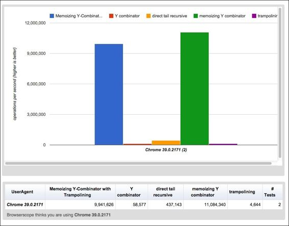

# 第六章。JavaScript 中的高级主题和陷阱

JavaScript 曾被称为“网络的汇编语言”。类比(不是很完美，但是哪个类比是？)来源于 JavaScipt 经常是编译的目标，即来自 **Clojure** 和 **CoffeeScript** ，但也来自许多其他来源，如**睡衣** (python 到 JS)和谷歌 Web Kit (Java 到 JS)。

但这个类比也提到了一个愚蠢的想法，即 JavaScript 像 x86 汇编一样具有表现力和低级。也许这种想法源于这样一个事实，即自 1995 年首次与网景一起发布以来，JavaScript 就因其设计缺陷和疏忽而受到抨击。它是匆忙开发和发布的，还没有完全开发出来。正因为如此，一些有问题的设计选择进入了 JavaScript，这种语言很快成为了事实上的网络脚本语言。分号是个大错误。它定义函数的模糊方法也是如此。是`var foo = function();`还是`function foo();`？

函数式编程是避开这些错误的好方法。通过关注 JavaScript 是真正的函数式语言这一事实，很明显，在前面关于声明函数的不同方法的示例中，最好将函数声明为变量。分号大部分只是语法糖，让 JavaScript 看起来更像 C。

但是永远记住你使用的语言。JavaScript 像任何其他语言一样，也有它的缺陷。而且，当以一种经常绕过可能发生的流血边缘的方式进行编程时，那些小失误可能会变成不可挽回的陷阱。其中一些陷阱包括:

*   递归
*   可变范围和闭包
*   函数声明与函数表达式

然而，只要稍加注意，这些问题是可以克服的。

# 递归

递归对于任何语言的函数式编程都非常重要。许多函数语言甚至通过不提供`for`和`while`循环语句来要求迭代递归；只有当语言保证尾部调用消除时，这才是可能的，而 JavaScript 不是这样。在[第二章](2.html#page "Chapter 2. Fundamentals of Functional Programming")、*函数编程基础*中给出了递归的快速入门。但是在这一节中，我们将深入探究递归在 JavaScript 中是如何工作的。

## 尾部递归

JavaScript 处理递归的例程被称为*尾部递归*，一种基于堆栈的递归实现。这意味着，对于每个递归调用，堆栈中都有一个新的帧。

为了说明这个方法可能产生的问题，让我们使用阶乘的经典递归算法。

```js
var factorial = function(n) {
  if (n == 0) {
    // base case
    return 1;
  }
  else {
    // recursive case
    return n * factorial(n-1);
  }
}
```

算法会调用自身`n`次得到答案。简直就是在计算`(1 x 1 x 2 x 3 x … x N)`。这意味着时间的复杂性是`O(n)`。

### 注

`O(n)`，发音为“big oh to the n”，意味着随着输入的大小增长，算法的复杂度将以`n`的速度增长，这是更瘦的增长。`O(n2)`是指数增长，`O(log(n))`是对数增长，以此类推。这种符号可用于时间复杂度和空间复杂度。

但是，因为每次迭代都会在内存堆栈中分配一个新帧，所以空间复杂度也是`O(n)`。这是一个问题。这意味着内存将以这样的速度消耗，内存限制将很容易被超过。在我的笔记本电脑上，`factorial(23456)`返回`Uncaught Error: RangeError: Maximum call stack size exceeded`。

虽然计算 23，456 的阶乘是一项无意义的工作，但您可以放心，许多用递归解决的问题将不会有太大的麻烦。考虑数据树的情况。树可以是任何东西:搜索应用程序、文件系统、路由表等等。下面是一个非常简单的树遍历函数的实现:

```js
var traverse = function(node) {
  node.doSomething(); // whatever work needs to be done
  node.childern.forEach(traverse); // many recursive calls
}
```

每个节点只有两个子节点，时间复杂度和空间复杂度(在最坏的情况下，必须遍历整个树才能找到答案)都将是`O(n2)`，因为每个节点都有两个递归调用。每个节点有许多子节点，复杂性将是`O(nm)`，其中`m`是子节点的数量。而递归是树遍历的首选算法；`while`循环将更加复杂，并且需要维护堆栈。

像这样的指数增长意味着不需要很大的树就能抛出`RangeError`异常。肯定有更好的办法。

### 尾呼消除

我们需要一种方法来消除为每次递归调用分配新堆栈帧。这就是所谓的*尾呼淘汰*。

使用尾部调用消除，当一个函数返回调用自己的结果时，语言实际上并不执行另一个函数调用。它为你把整个事情变成一个循环。

好吧，那我们怎么做呢？用懒惰的评价。如果我们可以重写它来覆盖一个惰性序列，这样函数返回一个值，或者它返回调用另一个函数的结果，而不对该结果做任何事情，那么就不需要分配新的堆栈帧。

为了将其置于“尾部递归形式”，阶乘函数必须被重写，使得内部过程`fact`在控制流中最后调用自己，如下面的代码片段所示:

```js
var factorial = function(n) {
  var _fact = function(x, n) {
    if (n == 0) {
      // base case
      return x;
    }
    else {
      // recursive case
      return _fact(n*x, n-1);
    }
  }
  return fact(1, n);
}
```

### 注

结果不是由递归尾部的第一个函数产生的(就像在`n * factorial(n-1)`中一样)，而是沿着递归尾部(通过调用`_fact(r*n, n-1)`)计算，并由这个尾部的最后一个函数产生(通过`return r;`)。计算只会向下进行，不会向上进行。对于解释器来说，将它作为迭代来处理相对容易。

然而，*尾调用消除在 JavaScript* 中不起作用。把上面的代码放到你喜欢的 JavaScript 引擎中`factorial(24567)`还是会返回`Uncaught Error: RangeError: Maximum call stack size exceeded`异常。尾部调用消除被列为下一版 ECMAScript 中将包含的一项新功能，但所有浏览器实现它还需要一段时间。

JavaScript 无法优化以尾部递归形式出现的函数。这是语言规范和运行时解释器的一个特点，简单明了。这与解释器如何获取堆栈帧的资源有关。有些语言在不需要记住任何新东西的时候会重用同一个栈帧，就像前面函数中的。这就是尾部调用消除降低时间和空间复杂性的方法。

不幸的是，JavaScript 没有做到这一点。但是如果它这样做了，它会重新组织堆栈帧:

```js
call factorial (3)
  call fact (3 1)
    call fact (2 3)
      call fact (1 6)
        call fact (0 6)
        return 6
      return 6
    return 6
  return 6
return 6
```

分成以下几部分:

```js
call factorial (3)
  call fact (3 1)
  call fact (2 3)
  call fact (1 6)
  call fact (0 6)
  return 6
return 6
```

## 蹦床

解决方案？一个被称为“践踏 T2”的过程。这是一种通过使用 **thunks** 将尾呼消除的概念“黑”进程序的方式。

### 注

为此，Thunks 是带有参数的表达式，这些参数包装匿名函数而没有自己的参数。例如:`function(str){return function(){console.log(str)}}`。这将阻止表达式被计算，直到接收函数调用匿名函数。

蹦床是一个函数，它以一个函数作为输入，并重复执行其返回值，直到返回函数以外的东西。下面的代码片段显示了一个简单的实现:

```js
var trampoline = function(f) {
  while (f && f instanceof Function) {
    f = f.apply(f.context, f.args);
  }
  return f;
}
```

为了真正实现尾部调用消除，我们需要使用 thunks。为此，我们可以使用`bind()`功能，该功能允许我们将方法应用于一个对象，并将`this`关键字分配给另一个对象。在内部，它与`call`关键字相同，但是它被链接到方法并返回一个新的绑定函数。`bind()`功能实际上只是部分应用，尽管方式非常有限。

```js
var factorial = function(n) {
  var _fact = function(x, n) {
    if (n == 0) {
      // base case
      return x;
    }
    else {
      // recursive case
      return _fact.bind(null, n*x, n-1);
    }
  }
  return trampoline(_fact.bind(null, 1, n));
}
```

但是编写`fact.bind(null, ...)`方法很麻烦，会让任何阅读代码的人感到困惑。相反，让我们编写自己的函数来创建 thunks。有一些功能必须做的事情:

*   `thunk()`函数必须模拟返回非求值函数的`_fact.bind(null, n*x, n-1)`方法
*   `thunk()`函数应该包含另外两个函数:
    *   用于处理给定函数，以及
    *   用于处理调用给定函数时将使用的函数参数

这样，我们就可以编写函数了。我们只需要几行代码来编写它。

```js
var thunk = function (fn) {
  return function() {
    var args = Array.prototype.slice.apply(arguments);
    return function() { return fn.apply(this, args); };
  };
};
```

现在我们可以在阶乘算法中使用`thunk()`函数，如下所示:

```js
var factorial = function(n) {
  var fact = function(x, n) {
    if (n == 0) {
      return x;
    }
    else {
      return thunk(fact)(n * x, n - 1);
    }
  }
  return trampoline(thunk(fact)(1, n));
}
```

但是，我们可以通过将`_fact()`函数定义为`thunk()`函数来进一步简化它。通过将内部函数定义为`thunk()`函数，我们不必在内部函数定义和返回语句中使用`thunk()`函数。

```js
var factorial = function(n) {
  var _fact = thunk(function(x, n) {
    if (n == 0) {
      // base case
      return x;
    }
    else {
      // recursive case
      return _fact(n * x, n - 1);
    }
  });
  return trampoline(_fact(1, n));
}
```

成绩漂亮。递归调用的函数`_fact()`看起来像是一个无尾递归，但实际上是作为一个迭代被透明处理的！

最后，让我们看看`trampoline()`和`thunk()`函数如何与我们更有意义的树遍历示例一起工作。下面是一个使用蹦床和 thunks 遍历数据树的简单例子:

```js
var treeTraverse = function(trunk) {
  var _traverse = thunk(function(node) {
    node.doSomething();
    node.children.forEach(_traverse);
  }
  trampoline(_traverse(trunk));
}
```

我们已经解决了尾部递归的问题。但是有更好的方法吗？如果我们能简单地把递归函数转换成非递归函数呢？接下来，我们将看看如何做到这一点。

## Y 组合子

Y-combinator 是计算机科学中让最灵巧的编程大师都感到惊讶的东西之一。它能够自动将递归函数转换为非递归函数，这就是为什么道格拉斯·克洛克福特称之为“计算机科学中最奇怪和最奇妙的人工产物之一”，苏斯曼和斯蒂尔曾经说过，“这种工作方式真的很了不起”。

所以，一个真正非凡的、奇妙的计算机科学神器，把递归函数带到他们的膝盖上，一定是巨大而复杂的，对吗？不，不完全是。它在 JavaScript 中的实现只有 9 行非常奇怪的代码。它们如下:

```js
var Y = function(F) {
  return (function (f) {
    return f(f);
  } (function (f) {
    return F(function (x) {
      return f(f)(x);
    });
  }));
}
```

它是这样工作的:它找到作为参数传入的函数的“不动点”。不动点提供了另一种思考函数的方式，而不是计算机编程理论中的递归和迭代。它只使用匿名函数表达式、函数应用程序和变量引用来实现这一点。注意`Y`并不引用自身。事实上，所有这些函数都是匿名的。

正如你可能已经猜到的，Y 组合子来自于λ演算。它实际上是在另一个叫做 U 组合子的组合子的帮助下推导出来的。组合子是特殊的高阶函数，只使用函数应用程序和早期定义的组合子来定义来自其输入的结果。

为了演示 Y 组合子，我们将再次转向阶乘问题，但是我们需要稍微不同地定义阶乘函数。我们写的不是递归函数，而是返回阶乘数学定义的函数。然后我们可以把这个传递给 Y 组合器。

```js
var FactorialGen = function(factorial) {
  return (function(n) {
    if (n == 0) {
      // base case
      return 1;
    }
    else {
      // recursive case
      return n * factorial(n – 1);
    }
  });
};
Factorial = Y(FactorialGen);
Factorial(10); // 3628800
```

然而，当我们给它一个非常大的数字时，堆栈溢出，就好像使用了没有践踏的尾部递归一样。

```js
Factorial(23456); // RangeError: Maximum call stack size exceeded
```

但是我们可以使用用 Y 组合符蹦床，如下所示:

```js
var FactorialGen2 = function (factorial) {
  return function(n) {
    var factorial = thunk(function (x, n) {
      if (n == 0) {
        return x;
      }
      else {
        return factorial(n * x, n - 1);
      }
    });
    return trampoline(factorial(1, n));
  }
};

var Factorial2 = Y(FactorialGen2)
Factorial2(10); // 3628800
Factorial2(23456); // Infinity
```

我们也可以重新排列 Y 组合子来执行一些叫做记忆化的操作。

### 记忆化

记忆是存储昂贵函数调用结果的技术。当以后用相同的参数调用该函数时，将返回存储的结果，而不是再次计算结果。

虽然 Y-combinator 比递归快得多，但它仍然相对较慢。为了加快速度，我们可以创建一个记忆定点组合器:一个类似 Y 的组合器，它缓存中间函数调用的结果。

```js
var Ymem = function(F, cache) {
  if (!cache) {
    cache = {} ; // Create a new cache.
  }
  return function(arg) {
    if (cache[arg]) {
      // Answer in cache
      return cache[arg] ; 
    }
    // else compute the answer
    var answer = (F(function(n){
      return (Ymem(F,cache))(n);
    }))(arg); // Compute the answer.
    cache[arg] = answer; // Cache the answer.
    return answer;
  };
}
```

那么它有多快呢？通过使用[http://jsperf.com/](http://jsperf.com/)，我们可以比较性能。

以下结果是 1 到 100 之间的随机数。我们可以看到记忆 Y 组合子要快得多。加上蹦床并不会让它慢很多。您可以在以下网址查看结果并自己运行测试:http://jsperf . com/memoizing-y-combinator-vs-tail-call-optimization/7。



最下面的行是:在 JavaScript 中执行递归最有效最安全的方法是使用记忆 Y 组合器，通过践踏和 thunks 消除尾调用。

# 可变范围

JavaScript 中变量的作用域并不自然。其实有时候简直是反直觉。他们说，可以通过 JavaScript 程序员对范围的理解程度来判断他们。

## 范围决议

首先，让我们浏览一下 JavaScript 中不同的范围分辨率。

JavaScript 使用范围链来建立变量的范围。解析变量时，它从最里面的范围开始，向外搜索。

### 全球范围

在此级别定义的变量、函数和对象可用于整个程序中的任何代码。这是最外层的范围。

```js
var x = 'hi';
function a() {
  console.log(x);
}
a(); // 'hi'
```

### 局部范围

描述的每个函数都有自己的局部范围。在另一个函数中定义的任何函数都有一个链接到外部函数的嵌套局部作用域。几乎总是源中的位置定义了范围。

```js
var x = 'hi';
function a() {
  console.log(x);
}
function b() {
  var x = 'hello';
  console.log(x);
}
b(); // hello
a(); // hi
```

局部范围只针对函数，不针对任何表达式语句(`if`、`for`、`while`等)，这与大多数语言对待范围的方式不同。

```js
function c() {
  var y = 'greetings';
  if (true) {
    var y = 'guten tag';
  }
  console.log(y);
}

function d() {
  var y = 'greetings';
  function e() {
    var y = 'guten tag';
  }
  console.log(y)
}
c(); // 'guten tag'
d(); // 'greetings'
```

在函数式编程中，这并不是一个很大的问题，因为函数的使用频率更高，而表达式语句的使用频率更低。例如:

```js
function e(){
  var z = 'namaste';
  [1,2,3].foreach(function(n) {
    var z = 'aloha';
  }
  isTrue(function(){
    var z = 'good morning';
  });
  console.log(z);
}
e(); // 'namaste'
```

### 对象属性

对象属性也有自己的范围链。

```js
var x = 'hi';
var obj = function(){
  this.x = 'hola';
};
var foo = new obj();
console.log(foo.x); // 'hola'
foo.x = 'bonjour';
console.log(foo.x); // 'bonjour'
```

对象的原型在链的更下游。

```js
obj.prototype.x = 'greetings';
obj.prototype.y = 'konnichi ha';
var bar = new obj();
console.log(bar.x); // still prints 'hola'
console.log(bar.y); // 'konnichi ha'
```

这甚至还没有接近全面，但这三种类型的范围足以开始。

## 关闭

这个范围结构的一个问题是它没有给私有变量留下空间。考虑以下代码片段:

```js
var name = 'Ford Focus';
var year = '2006';
var millage = 123456;
function getMillage(){
  return millage;
}
function updateMillage(n) {
  millage = n;
}
```

这些变量和函数是全局的，这意味着程序后面的代码很容易不小心覆盖它们。一种解决方案是将它们封装到一个函数中，并在定义该函数后立即调用它。

```js
var car = function(){
  var name = 'Ford Focus';
  var year = '2006';
  var millage = 123456;
  function getMillage(){
    return Millage;
  }
  function updateMillage(n) {
    millage = n;
  }
}();
```

在函数之外没有发生任何事情，所以我们应该通过使函数名匿名来丢弃它。

```js
(function(){
  var name = 'Ford Focus';
  var year = '2006';
  var millage = 123456;
  function getMillage(){
    return millage;
  }
  function updateMillage(n) {
    millage = n;
  }
})();
```

要使函数`getValue()`和`updateMillage()`在匿名函数之外可用，我们需要在对象文字中返回它们，如下面的代码片段所示:

```js
var car = function(){
  var name = 'Ford Focus';
  var year = '2006';
  var millage = 123456;
  return {
    getMillage: function(){
      return millage;
    },
    updateMillage: function(n) {
      millage = n;
    }
  }
}();
console.log( car.getMillage() ); // works
console.log( car.updateMillage(n) ); // also works
console.log( car.millage ); // undefined
```

这给了我们伪私有变量，但问题不止于此。下一节将探讨更多关于 JavaScript 中变量范围的问题。

## 明白了

许多变量范围的细微差别可以在整个 JavaScript 中找到。以下绝不是一个全面的列表，但它涵盖了最常见的情况:

*   The following will output 4, not 'undefined' as one would expect:

    ```js
    for (var n = 4; false; ) { } console.log(n);
    ```

    这是因为在 JavaScript 中，变量定义发生在相应范围的开始，而不仅仅是在声明时。

*   If you define a variable in the outer scope, and then have an `if` statement define a variable inside the function with the same name, even if that `if` branch isn't reached, it is redefined. An example:

    ```js
    var x = 1;
    function foo() {
      if (false) {
        var x = 2;
      }
      return x;
    }
    foo(); // Return value: 'undefined', expected return value:
    2
    ```

    同样，这是由于用`undefined`值移动范围开头的变量定义造成的。

*   In the browser, global variables are really stored in the `window` object.

    ```js
    window.a = 19;
    console.log(a); // Output: 19
    ```

    全局范围内的`a`表示作为当前上下文属性的`a`，因此浏览器中的`a===this.a`和`window`对象相当于全局范围内的`this`关键字。

前两个例子是 JavaScript 的一个被称为提升的特性的结果，这将是下一节关于编写函数的关键概念。

# 函数声明对函数表达式对函数构造函数

这三种说法有什么区别？

```js
function foo(n){ return n; }
var foo = function(n){ return n; };
var foo = new Function('n', 'return n');
```

乍一看，它们只是编写相同函数的不同方式。但这里还有更多的事情发生。如果我们要充分利用 JavaScript 中的函数，以便将它们操作成函数式编程风格，那么我们最好能够做到这一点。如果在计算机编程方面有更好的方法，那么这种方法应该是唯一的方法。

## 函数声明

函数声明，有时称为函数语句，通过使用`function`关键字来定义函数。

```js
function foo(n) {
  return n;
}
```

用此语法声明的函数被*提升*到当前范围的顶部。这实际上意味着，即使函数被定义了几行，JavaScript 也知道它，并且可以在范围内更早地使用它。例如，以下内容将在控制台上正确打印 6:

```js
foo(2,3);
function foo(n, m) {
  console.log(n*m);
}
```

## 函数表达式

命名函数也可以通过定义匿名函数并将其分配给变量来定义为表达式。

```js
var bar = function(n, m) {
  console.log(n*m);
};
```

它们不像函数声明那样被提升。这是因为，当函数声明被提升时，变量声明没有被提升。例如，这将不起作用，并将引发一个错误:

```js
bar(2,3);
var bar = function(n, m) {
  console.log(n*m);
};
```

在函数式编程中，我们将希望使用函数表达式，这样我们就可以像对待变量一样对待函数，使它们可以用作更高阶函数(如`map()`函数)的回调和参数。将函数定义为表达式可以更明显地看出它们是分配给函数的变量。同样，如果我们要用一种风格写函数，为了一致性和清晰性，我们应该用那种风格写所有的函数。

## 函数构造器

JavaScript 实际上有第三种方法来创建函数:使用`Function()`构造函数。就像函数表达式一样，用`Function()`构造器定义的函数不会被挂起。

```js
var func = new Function('n','m','return n+m');
func(2,3); // returns 5
```

但是`Function()`构造器不仅混乱，而且高度危险。不可能进行语法纠正，也不可能进行优化。编写与相同的函数要容易得多，安全得多，也不容易混淆如下:

```js
var func = function(n,m){return n+m};
func(2,3); // returns 5
```

## 不可预知的行为

所以的区别是函数声明被提升，而函数表达式没有。这会导致意想不到的事情发生。请考虑以下几点:

```js
function foo() {
  return 'hi';
}
console.log(foo());
function foo() {
  return 'hello';
}
```

控制台上实际打印的是`hello`。这是因为`foo()`函数的第二个定义被提升到了顶部，使其成为了 JavaScript 解释器实际使用的定义。

虽然起初这似乎不是一个关键的区别，但在函数式编程中，这可能会造成混乱。考虑以下代码片段:

```js
if (true) {
  function foo(){console.log('one')};
}
else {
  function foo(){console.log('two')};
}
foo();
```

当`foo()`功能被调用时，`two`被打印到控制台，而不是`one`！

最后，有一种方法可以将函数表达式和声明结合起来。它的工作原理如下:

```js
var foo = function bar(){ console.log('hi'); };
foo(); // 'hi'
bar(); // Error: bar is not defined
```

使用这种方法意义不大，因为声明中使用的名称(前面例子中的`bar()`函数)在函数外不可用，导致混淆。它只适用于递归，例如:

```js
var foo = function factorial(n) {
  if (n == 0) {
    return 1;
  }
else {
    return n * factorial(n-1);
  }
};
foo(5);

```

# 总结

JavaScript 被称为“web 的汇编语言”，因为它和 x86 汇编一样无处不在，不可避免。它是所有浏览器上运行的唯一语言。它也有缺陷，但是称它为低级语言是没有意义的。

相反，把 JavaScript 想象成网络上的生咖啡豆。当然，有些豆子坏了，还有一些烂了。但是，如果好的咖啡豆被一个熟练的咖啡师挑选、烘焙和酿造，它们就可以变成一种辉煌的果酱，不能只拥有一次就被遗忘。它的消费变成了一种日常习惯，没有它的生活将是静态的，更难执行，也更不令人兴奋。有些人甚至更喜欢用插件和诸如奶油、糖和可可的附加产品来增强酿造效果，这些都是很好的补充。

引用 JavaScript 最大的批评者之一道格拉斯·克劳福德的话说，“肯定有很多人拒绝考虑 JavaScript 做对的可能性。我曾经是那种人。但现在我继续对那里的辉煌感到惊讶”。

事实证明，JavaScript 非常棒。