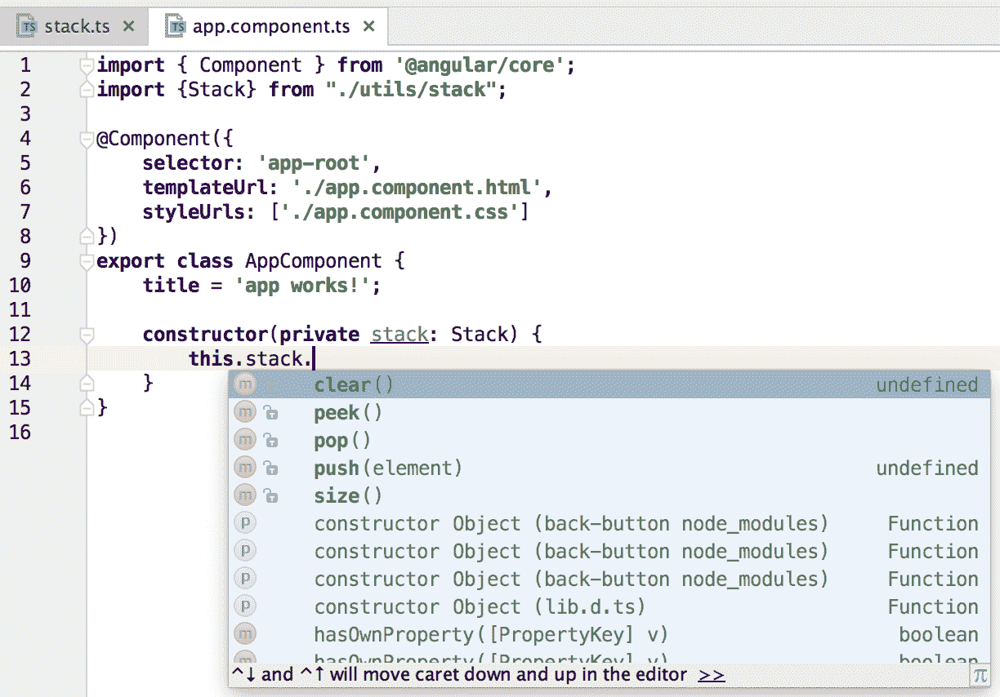
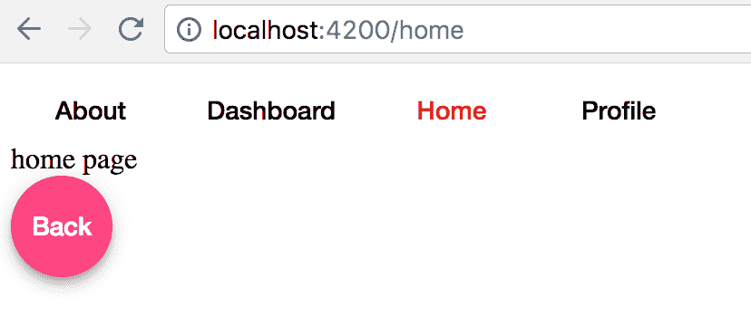
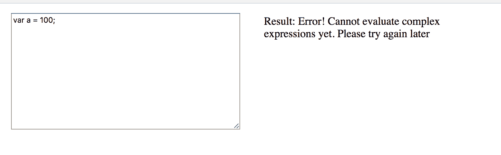

# 为应用状态管理构建堆栈

栈是人们能想到的最常见的数据结构之一。它们在个人和专业机构中无处不在。堆栈是一种**后进先出** ( **后进先出**)的数据结构，它提供了一些常见的操作，如推送、弹出、查看、清除和大小。

在大多数面向对象编程语言中，你会发现堆栈数据结构是内置的。另一方面，JavaScript 最初是为 web 设计的；它还没有一堆烤好的。然而，不要让这阻止你。使用 JS 创建堆栈相当容易，使用最新版本的 JavaScript 进一步简化了这一点。

在这一章中，我们的目标是理解堆栈在新时代网络中的重要性，以及它们在简化不断发展的应用中的作用。让我们探索堆栈的以下方面:

*   对堆栈的理论理解
*   它的应用编程接口和实现
*   真实网络中的用例

在我们开始构建一个堆栈之前，让我们看一下我们希望我们的堆栈拥有的一些方法，以便行为与我们的需求相匹配。不得不自己创建 API 是塞翁失马焉知非福。你永远不需要依赖别人的库*来纠正它*，甚至不需要担心任何缺失的功能。您可以添加您需要的内容，并且在需要之前不必担心性能和内存管理。

# 先决条件

以下是下一章的要求:

*   对 JavaScript 的基本理解
*   安装了 Node.js 的电脑(可从[https://nodejs.org/en/download/](https://nodejs.org/en/download/)下载)

本章所示代码的代码示例可在[https://github.com/NgSculptor/examples](https://github.com/NgSculptor/examples)找到。

# 术语

在这一章中，我们将使用以下特定于 Stacks 的术语，因此让我们进一步了解它:

*   **顶部**:表示栈顶
*   **底部**:表示堆叠的底部

# 应用接口

这是棘手的部分，因为很难提前预测您的应用需要什么样的方法。因此，从任何规范开始，然后根据应用的需求进行更改，通常是一个好主意。按照这种方式，您最终会得到一个类似如下的 API:

*   **推**:将一个物品推到堆叠的顶部
*   **弹出**:从堆栈顶部移除一个项目
*   **查看**:显示最后一个推入堆栈的项目
*   **清空**:清空堆栈
*   **大小**:获取当前堆栈的大小


# 我们没有阵列吗？

从我们目前看到的情况来看，你可能想知道为什么首先需要一个堆栈。它非常类似于一个数组，我们可以在一个数组上执行所有这些操作。那么，有栈的真正目的是什么呢？

优先选择堆栈而不是数组的原因有多种:

*   使用栈给你的应用赋予了更多的语义含义。考虑这个类比，你有一个背包(一个数组)和一个钱包(一叠)。你能把钱放在背包和钱包里吗？最肯定的是；然而，当你看一个背包时，你不知道你可能会在里面找到什么，但是当你看一个钱包时，你有一个非常好的想法，那就是里面装着钱。然而，它持有什么类型的资金(即数据类型)，如美元、印度卢比和英镑，仍然未知(支持，除非您从 TypeScript 获得支持)。
*   本机阵列操作具有不同的时间复杂性。我们以`Array.prototype.splice``Array.prototype.push`*为例。拼接的最坏情况时间复杂度为 O(n)，因为当一个元素被拼接出数组时，它必须搜索所有索引并重新调整。`Push`当内存缓冲区已满但被摊销为 O(1)时，具有 O(n)的最坏情况复杂性。堆栈避免元素被直接访问，内部依赖于`WeakMap()`，这是内存高效的，您将很快看到。*

 *# 创建堆栈

现在，我们知道了何时以及为什么要使用堆栈，让我们继续实现一个堆栈。如前所述，我们将使用`WeakMap()` 来实现。您可以使用任何本机数据类型来实现，但是`WeakMap()`成为强有力的竞争者是有一定原因的。`WeakMap()`保留了对其持有的钥匙的微弱提及。这意味着，一旦您不再引用该特定键，它将与值一起被垃圾收集。然而，`WeakMap()` 有它自己的缺点:键只能是非主键，不可枚举，也就是说，你不能得到所有键的列表，因为它们依赖于垃圾收集器。然而，在我们的例子中，我们更关心的是我们的`WeakMap()`所持有的价值观，而不是钥匙和它们的内部记忆管理。

# 实现堆栈方法

实现堆栈是一项相当简单的任务。我们将遵循一系列步骤，其中我们将使用 ES6 语法，如下所示:

1.  定义一个`constructor`:

```js
class Stack {
    constructor() {

    }
}
```

2.  创建一个`WeakMap()`来存储堆栈项目:

```js
const sKey = {};
const items = new WeakMap();

class Stack {
    constructor() {
        items.set(sKey, [])
    }
}
```

3.  在`Stack`类中实现前面 API 中描述的方法:

```js
const sKey = {};
const items = new WeakMap();

class Stack {
    constructor() {
        items.set(sKey, []);
    }

    push(element) {
        let stack = items.get(sKey);
        stack.push(element);
    }

    pop() {
        let stack = items.get(sKey)
        return stack.pop()
    }

    peek() {
       let stack = items.get(sKey);
       return stack[stack.length - 1];
    }

    clear() {
       items.set(sKey, []);
    }

    size() {
       return items.get(sKey).length;
    }
}
```

5.  因此，`Stack`的最终实现如下:

```js
var Stack = (() => {
    const sKey = {};
    const items = new WeakMap();

    class Stack {

        constructor() {
            items.set(sKey, []);
        }

        push(element) {
            let stack = items.get(sKey);
            stack.push(element);
        }

        pop() {
            let stack = items.get(sKey);
            return stack.pop();
        }

        peek() {
           let stack = items.get(sKey);
           return stack[stack.length - 1];
        }

        clear() {
           items.set(sKey, []);
        }

        size() {
           return items.get(sKey).length;
        }
    }

    return Stack;
})();
```

这是一个 JavaScript 堆栈的总体实现，它绝不是全面的，可以根据应用的需求进行更改。然而，让我们来看看这个实现中使用的一些原则。

我们在这里使用了`WeakMap()`，如前一段所述，它有助于基于对堆栈项的引用进行内部内存管理。

另一个需要注意的重要事情是，我们已经将`Stack`类包装在一个 IIFE 中，因此常量`items `和`sKey`在内部对`Stack`类可用，但不对外公开。这是当前 JS 类 *s* 实现的一个众所周知且有争议的特性，它不允许声明类级变量。TC39 本质上是这样设计 ES6 类的，它应该只定义和声明它的成员，这是 ES5 中的原型方法。此外，由于向原型添加变量不是常态，因此没有提供创建类级变量的能力。但是，仍然可以执行以下操作:

```js
    constructor() {
        this.sKey = {};
        this.items = new WeakMap();
        this.items.set(sKey, []);
    }
```

然而，这将使`items` 也可以从我们的`Stack` 方法之外获得，这是我们想要避免的。

# 测试堆栈

为了测试我们刚刚创建的`Stack`，让我们实例化一个新的堆栈，并调用每个方法，看看它们如何向我们呈现数据:

```js
var stack = new Stack();
stack.push(10);
stack.push(20);

console.log(stack.items); // prints undefined -> cannot be accessed directly

console.log(stack.size()); // prints 2

console.log(stack.peek()); // prints 20

console.log(stack.pop()); // prints 20

console.log(stack.size()); // prints 1

stack.clear();

console.log(stack.size()); // prints 0

```

当我们运行上面的脚本时，我们会看到上面注释中指定的日志。不出所料，堆栈提供了操作每个阶段的预期输出。

# 使用堆栈

要使用先前创建的`Stack` 类，您必须进行一个小的更改，以允许根据您计划使用它的环境来使用堆栈。使这种变化通用是相当简单的；这样，您就不需要担心要支持多个环境，并且可以避免每个应用中重复的代码:

```js
// AMD
if (typeof define === 'function' && define.amd) {

    define(function () { return Stack; });

// NodeJS/CommonJS

} else if (typeof exports === 'object') {

    if (typeof module === 'object' && typeof module.exports ===
    'object') {

        exports = module.exports = Stack;
    }

// Browser

} else {

    window.Stack = Stack;
}
```

一旦我们将这个逻辑添加到堆栈中，它就为多环境做好了准备。出于简单和简洁的目的，我们不会在看到堆栈的任何地方添加它；然而，总的来说，在代码中包含它是一件好事。

If your technology stack comprises ES5, then you need to transpile the preceding stack code to ES5\. This is not a problem, as there are a plethora of options available online to transpile code from ES6 to ES5.

# 用例

现在我们已经实现了一个`Stack`类，让我们看看如何在一些 web 开发挑战中使用它。

# 创建角度应用

为了探索堆栈在 web 开发中的一些实际应用，我们将首先创建一个 Angular 应用，并将其用作基础应用，我们将在后续用例中使用它。

从最新版本的 Angular 开始非常简单。作为先决条件，您所需要的就是在您的系统中预先安装 Node.js。要测试您的计算机上是否安装了 Node.js，请转到 Mac 上的终端或 Windows 上的命令提示符，然后键入以下命令:

```js
node -v
```

这将向您显示已安装的 Node.js 版本。如果您有类似以下的东西:

```js
node: command not found
```

这意味着您的机器上没有安装 Node.js。

一旦在机器上设置了 Node.js，就可以访问`npm`，也称为节点包管理器命令行工具，可用于设置全局依赖关系。使用`npm` 命令，我们将安装 Angular CLI 工具，该工具为我们提供了许多 Angular 实用程序方法，包括但不限于创建新项目。

# 安装角度命令行界面

要在终端中安装 Angular CLI，请运行以下命令:

```js
npm install -g @angular/cli
```

这将在全局范围内安装 Angular CLI，并允许您访问`ng` 命令来创建新项目。

要测试它，您可以运行以下命令，该命令将向您显示可供使用的功能列表:

```js
ng
```

# 使用命令行界面创建应用

现在，让我们创建 Angular 应用。为了清楚起见，我们将为每个示例创建一个新的应用。如果你觉得舒服，你可以把它们放在同一个应用中。要使用命令行界面创建角度应用，请在终端中运行以下命令:

```js
ng new <project-name>
```

将`project-name` 替换为你的项目名称；如果一切顺利，您应该会在终端上看到类似的内容:

```js
 installing ng
 create .editorconfig
 create README.md
 create src/app/app.component.css
 create src/app/app.component.html
 create src/app/app.component.spec.ts
 create src/app/app.component.ts
 create src/app/app.module.ts
 create src/img/.gitkeep
 create src/environments/environment.prod.ts
 create src/environments/environment.ts
 create src/favicon.ico
 create src/index.html
 create src/main.ts
 create src/polyfills.ts
 create src/styles.css
 create src/test.ts
 create src/tsconfig.app.json
 create src/tsconfig.spec.json
 create src/typings.d.ts
 create .angular-cli.json
 create e2e/app.e2e-spec.ts
 create e2e/app.po.ts
 create e2e/tsconfig.e2e.json
 create .gitignore
 create karma.conf.js
 create package.json
 create protractor.conf.js
 create tsconfig.json
 create tslint.json
 Installing packages for tooling via npm.
 Installed packages for tooling via npm.
 Project 'project-name' successfully created.
```

如果遇到任何问题，请确保如前所述安装了 angular-cli。

在为这个应用编写任何代码之前，让我们将之前创建的堆栈导入到项目中。由于这是一个助手组件，我想将其与其他助手方法一起分组到应用根目录下的`utils` 目录下。

# 创建堆栈

由于 Angular 应用的代码现在在 TypeScript 中，我们可以进一步优化我们创建的堆栈。由于可以在类型脚本类中创建`private`变量，使用类型脚本使代码更易读。

因此，我们的 TypeScript 优化代码如下所示:

```js
export class Stack {
    private wmkey = {};
    private items = new WeakMap();

    constructor() {
        this.items.set(this.wmkey, []);
    }

    push(element) {
        let stack = this.items.get(this.wmkey);
        stack.push(element);
    }

    pop() {
        let stack = this.items.get(this.wmkey);
        return stack.pop();
    }

    peek() {
        let stack = this.items.get(this.wmkey);
        return stack[stack.length - 1];
    }

    clear() {
        this.items.set(this.wmkey, []);
    }

    size() {
        return this.items.get(this.wmkey).length;
    }
}
```

要使用之前创建的`Stack`，您可以简单地将堆栈导入到任何组件中，然后使用它。你可以在下面的截图中看到，当我们制作了`Stack` 类的`WeakMap()` 和关键的私人成员时，他们不再可以从类外访问:

> Public methods accessible from the Stack class

# 为 web 应用创建自定义后退按钮

如今，网络应用都是关于用户体验的，采用平面设计和小负载。每个人都希望他们的应用快速而紧凑。使用笨重的浏览器后退按钮正在慢慢成为过去。要为我们的应用创建自定义后退按钮，我们需要首先从先前安装的`ng` cli 客户端创建一个 Angular 应用，如下所示:

```js
ng new back-button
```

# 设置应用及其路由

现在我们已经设置了基本代码，让我们列出构建应用的步骤，该应用将使我们能够在浏览器中创建自定义的后退按钮:

1.  为应用创建状态。
2.  当应用的状态改变时进行记录。
3.  检测到点击我们的自定义后退按钮。
4.  更新正在跟踪的状态列表。

让我们快速给应用添加几个状态，它们在 Angular *中也被称为路由。*所有 SPA 框架都有某种形式的路由模块，您可以使用它为您的应用设置一些路由。

一旦我们设置了路由和路由，我们将得到一个目录结构，如下所示:


Directory structure after adding routes

现在让我们设置导航，这样我们就可以在路线之间切换。要在 Angular 应用中设置路由，您需要创建要路由到的组件以及该特定路由的声明。例如，您的`home.component.ts` 将如下所示:

```js
import { Component } from '@angular/core';

@Component({
    selector: 'home',
    template: 'home page'
})
export class HomeComponent {

}
```

`home.routing.ts` 文件如下:

```js
import { HomeComponent } from './home.component';

export const HomeRoutes = [
    { path: 'home', component: HomeComponent },
];

export const HomeComponents = [
    HomeComponent
];
```

我们可以根据需要为任意多的路由设置类似的配置，一旦设置完成，我们将为应用路由创建一个应用级文件，并将所有路由和`navigatableComponents`注入到该文件中，这样我们就不必一遍又一遍地接触我们的主模块。

所以，你的文件`app.routing.ts` 应该如下所示:

```js
import { Routes } from '@angular/router';
import {AboutComponents, AboutRoutes} from "./pages/about/about.routing";
import {DashboardComponents, DashboardRoutes} from "./pages/dashboard/dashboard.routing";
import {HomeComponents, HomeRoutes} from "./pages/home/home.routing";
import {ProfileComponents, ProfileRoutes} from "./pages/profile/profile.routing";

export const routes: Routes = [
    {
        path: '',
        redirectTo: '/home',
        pathMatch: 'full'
    },
    ...AboutRoutes,
    ...DashboardRoutes,
    ...HomeRoutes,
    ...ProfileRoutes
];

export const navigatableComponents = [
    ...AboutComponents,
    ...DashboardComponents,
    ...HomeComponents,
    ...ProfileComponents
];
```

您会注意到我们正在做一些特别有趣的事情:

```js
{
    path: '',
    redirectTo: '/home',
    pathMatch: 'full'
}
```

这是 Angular*设置默认路由重定向的方式，这样，当应用加载时，它会被直接带到`/home`路径，我们不再需要手动设置重定向。*

 *# 检测应用状态变化

幸运的是，为了检测状态变化，我们可以使用 Angular 路由器的变化事件，并基于此采取行动。因此，在您的`app.component.ts` 中导入`Router` 模块，然后使用该模块检测任何状态变化:

```js
import { Router, NavigationEnd } from '@angular/router';
import { Stack } from './utils/stack';

...
...

constructor(private stack: Stack, private router: Router) {

    // subscribe to the routers event
    this.router.events.subscribe((val) => {

        // determine of router is telling us that it has ended
        transition
        if(val instanceof NavigationEnd) {

            // state change done, add to stack
            this.stack.push(val);
        }
    });
}
```

用户采取的导致状态改变的任何操作现在都被保存到我们的堆栈中，我们可以继续设计布局和转换状态的后退按钮。

# 布局用户界面

我们将使用有角度的材料来设计应用，因为它快速可靠。要安装`angular-material`、运行以下命令:

```js
npm install --save @angular/material @angular/animations @angular/cdk
```

一旦 angular-material 保存到应用中，我们就可以使用提供的`Button`组件来创建必要的用户界面，这将非常简单。首先，导入我们想要用于该视图的`MatButtonModule`，然后将该模块作为依赖项注入到您的主`AppModule`中。

`app.module.ts`的最终形式如下:

```js
import { BrowserModule } from '@angular/platform-browser';
import { NgModule } from '@angular/core';
import { FormsModule } from '@angular/forms';
import { HttpModule } from '@angular/http';
import { BrowserAnimationsModule } from '@angular/platform-browser/animations';
import { MatButtonModule } from '@angular/material';

import { AppComponent } from './app.component';
import { RouterModule } from "@angular/router";
import { routes, navigatableComponents } from "./app.routing";
import { Stack } from "./utils/stack";

// main angular module
@NgModule({
    declarations: [
        AppComponent,

        // our components are imported here in the main module
        ...navigatableComponents
    ],
    imports: [
        BrowserModule,
        FormsModule,
        HttpModule,

        // our routes are used here
        RouterModule.forRoot(routes),
        BrowserAnimationsModule,

        // material module
        MatButtonModule
    ],
    providers: [
        Stack
    ],
    bootstrap: [AppComponent]
})
export class AppModule { }
```

我们将在顶部放置四个按钮，在我们创建的四个状态之间切换，然后在 Angular 提供的`router-outlet` 指令中显示这些状态，后面是后退按钮。完成所有这些后，我们将得到以下结果:

```js
<nav>
    <button mat-button 
        routerLink="/about" 
        routerLinkActive="active">
      About
    </button>
    <button mat-button 
        routerLink="/dashboard" 
        routerLinkActive="active">
      Dashboard
    </button>
    <button mat-button 
        routerLink="/home" 
        routerLinkActive="active">
      Home
    </button>
    <button mat-button 
        routerLink="/profile"
        routerLinkActive="active">
      Profile
    </button>
</nav>

<router-outlet></router-outlet>

<footer>
    <button mat-fab (click)="goBack()" >Back</button>
</footer>
```

# 在状态之间导航

从这里开始给后退按钮添加逻辑相对更简单。当用户点击后退按钮时，我们将从堆栈中导航到应用的前一个状态。如果当用户单击后退按钮时堆栈为空，这意味着用户处于开始状态，那么我们将其设置回堆栈中，因为我们执行`pop()`操作来确定堆栈的当前状态。

```js
goBack() {
    let current = this.stack.pop();
    let prev = this.stack.peek();

    if (prev) {
        this.stack.pop();

        // angular provides nice little method to 
        // transition between the states using just the url if needed.
        this.router.navigateByUrl(prev.urlAfterRedirects);

    } else {
        this.stack.push(current);
    }
}
```

注意这里我们用的是`urlAfterRedirects` 而不是平原`url` *。*这是因为我们不关心某个特定 URL 在到达其最终形式之前的所有跳转，所以我们可以跳过它之前遇到的所有重定向路径，并在重定向后直接将用户发送到最终 URL。我们所需要的是我们需要导航到的最终状态，因为这是他们导航到当前状态之前的位置。

# 最终应用逻辑

所以，现在我们的应用已经准备好了。我们已经添加了逻辑来堆叠正在导航到的状态，并且我们还拥有用户点击后退按钮时的逻辑。当我们把所有这些逻辑放在我们的`app.component.ts`*中时，我们有以下几点:*

```js
import {Component, ViewEncapsulation} from '@angular/core';
import {Router, NavigationEnd} from '@angular/router';
import {Stack} from "./utils/stack";

@Component({
    selector: 'app-root',
    templateUrl: './app.component.html',
    styleUrls: ['./app.component.scss', './theme.scss'],
    encapsulation: ViewEncapsulation.None
})
export class AppComponent {
    constructor(private stack: Stack, private router: Router) {
        this.router.events.subscribe((val) => {
            if(val instanceof NavigationEnd) {
                this.stack.push(val);
            }
        });
    }

    goBack() {
        let current = this.stack.pop();
        let prev = this.stack.peek();

        if (prev) {
            this.stack.pop();
            this.router.navigateByUrl(prev.urlAfterRedirects);
        } else {
            this.stack.push(current);
        }
    }
}
```

我们还有一些应用中使用的补充样式表。根据您的应用和产品的整体品牌，这些是显而易见的；在这种情况下，我们要做一些非常简单的事情。

对于 AppComponent 样式，我们可以在`app.component.scss`中添加组件特定的样式:

```js
.active {
  color: red !important;
}
```

对于应用的整体主题，我们向`theme.scss`文件添加样式:

```js
@import '~@angular/material/theming';
// Plus imports for other components in your app.

// Include the common styles for Angular Material. We include this here so that you only
// have to load a single css file for Angular Material in your app.
// Be sure that you only ever include this mixin once!
@include mat-core();

// Define the palettes for your theme using the Material Design palettes available in palette.scss
// (imported above). For each palette, you can optionally specify a default, lighter, and darker
// hue.
$candy-app-primary: mat-palette($mat-indigo);
$candy-app-accent:  mat-palette($mat-pink, A200, A100, A400);

// The warn palette is optional (defaults to red).
$candy-app-warn:    mat-palette($mat-red);

// Create the theme object (a Sass map containing all of the palettes).
$candy-app-theme: mat-light-theme($candy-app-primary, $candy-app-accent, $candy-app-warn);

// Include theme styles for core and each component used in your app.
// Alternatively, you can import and @include the theme mixins for each component
// that you are using.
@include angular-material-theme($candy-app-theme);
```

上述主题文件取自 Angular 材质设计文档，可根据您应用的配色方案进行更改。

准备好所有更改后，我们可以通过从应用的根文件夹运行以下命令来运行应用:

```js
ng serve
```

这应该会加速应用，可以在`http://localhost:4200`访问。



从前面的截图中，我们可以看到应用已经启动并运行，我们可以使用刚刚创建的后退按钮在不同的状态之间导航。

# 构建一个基本的 JavaScript 语法解析器和评估器的一部分

该应用的主要目的是展示在计算密集型环境中多个堆栈的并发使用。我们将解析和评估表达式，并生成它们的结果，而不必使用邪恶的评估。

例如，如果您想要构建自己的`plnkr.co` 或类似的东西，您将被要求在理解更复杂的解析器和 lexers 之前采取类似的步骤，这些解析器和 lexers 在全尺寸在线编辑器中使用。

我们将使用与前面描述的类似的基础项目。为了用 angular-cli 创建一个新的应用，我们将使用之前安装的 cli 工具。要创建应用，请在终端中运行以下命令:

```js
ng new parser
```

# 构建一个基本的网络工作者

一旦我们创建并实例化了应用，我们将首先使用应用根目录下的以下命令创建`worker.js` 文件:

```js
cd src/app
mkdir utils
touch worker.js
```

这将生成`utils`文件夹和其中的`worker.js`文件。

请注意以下两点:

*   它是一个简单的 JS 文件，而不是一个 TypeScript 文件，即使整个应用都在 TypeScript 中
*   它被称为`worker.js`*，这意味着我们将为将要执行的解析和评估创建一个网络工作人员*

 *Web 工作人员习惯于在 JavaScript 中模拟**多线程** 的概念，通常情况下并非如此。此外，由于这个线程是孤立运行的，我们没有办法提供依赖关系。这对我们来说效果很好，因为我们的主应用只接受用户的输入，并在每次按键时将其提供给工作人员，而评估该表达式并在必要时返回结果或错误是工作人员的责任。

由于这是一个外部文件，而不是标准的 Angular 文件，我们将不得不将其作为外部脚本加载，以便我们的应用随后可以使用它。为此，请打开您的`.angular-cli.json`文件并更新`scripts`选项，如下所示:

```js
...
"scripts": [
  "app/utils/worker.js"
],
...
```

现在，我们可以使用注入的工作人员，如下所示:

```js
this.worker = new Worker('scripts.bundle.js');
```

首先，我们将向`app.component.ts`文件添加必要的更改，以便它可以根据需要与`worker.js`交互。

# 布局用户界面

我们将再次使用角形材料，如前例所述。因此，安装并使用您认为合适的组件来设计应用的用户界面:

```js
npm install --save @angular/material @angular/animations @angular/cdk
```

我们将使用`MatGridListModule`来创建应用的用户界面。在主模块中导入之后，我们可以如下创建模板:

```js
<mat-grid-list cols="2" rowHeight="2:1">
    <mat-grid-tile>
        <textarea (keyup)="codeChange()" [(ngModel)]="code"></textarea>
    </mat-grid-tile>
    <mat-grid-tile>
        <div>
            Result: {{result}}
        </div>
    </mat-grid-tile>
</mat-grid-list>
```

我们正在铺两块瓷砖；第一个包含`textarea`写代码，第二个显示生成的结果。

我们已经用`ngModel`绑定了输入区域，这将提供我们需要的`between`视图和组件的双向绑定。此外，我们利用`keyup`事件来触发名为`codeChange()`的方法，该方法将负责将我们的表达式传递给工人。

`codeChange()`方法的实施会相对容易。

# 基本的网络工作者交流

随着组件的加载，我们将需要设置工人，这样我们就不必重复几次。所以，想象一下，如果有一种方法，你可以有条件地设置某个东西，并且只在你想要的时候执行某个动作。在我们的例子中，您可以将其添加到构造函数或任何生命周期钩子中，这些钩子表示组件处于哪个阶段，如`OnInit`、OnContentInit、`OnViewInit`等，由 Angular 提供，如下所示:

```js
this.worker = new Worker('scripts.bundle.js');

this.worker.addEventListener('message', (e) => {
 this.result = e.data;
});
```

一旦初始化，我们就使用`addEventListener()`方法来监听任何新消息——也就是说，来自我们的工作人员的结果。

每当代码被更改时，我们只需将这些数据传递给我们现在已经设置好的工作人员。其实现如下所示:

```js
codeChange() {
    this.worker.postMessage(this.code);
}
```

正如您所注意到的，主要的应用组件是有意精简的。我们利用工人的唯一原因是 CPU 密集型操作可以远离主线程。在这种情况下，我们可以将包括验证在内的所有逻辑转移到工作器中，这正是我们所做的。

# 启用网络工作者通信

现在，应用组件已经设置好并准备好发送消息，工作人员需要能够从主线程接收消息。为此，将以下代码添加到您的`worker.js`文件中:

```js
init();

function init() {
   self.addEventListener('message', function(e) {
      var code = e.data;

      if(typeof code !== 'string' || code.match(/.*[a-zA-Z]+.*/g)) {
         respond('Error! Cannot evaluate complex expressions yet. Please try
         again later');
      } else {
         respond(evaluate(convert(code)));
      }
   });
}
```

如您所见，我们添加了监听可能发送给工作人员的任何消息的功能，然后工作人员只需获取该数据，并在尝试评估和返回表达式的任何值之前对其进行一些基本验证。在我们的验证中，我们简单地拒绝了任何字母字符，因为我们希望用户只提供有效的数字和运算符。

现在，使用以下命令启动您的应用:

```js
npm start
```

你应该会在`localhost:4200` *看到这个应用出现。*现在，只需输入任何代码来测试您的应用；例如，输入以下内容:

```js
var a = 100;
```

您会在屏幕上看到以下错误弹出:



现在，让我们详细了解正在使用的算法。算法将分为两部分:解析和评估*。*算法的分步分解如下:

1.  将输入表达式转换为机器可理解的表达式。
2.  评估`postfix`表达式。
3.  将表达式的值返回给父组件。

# 将输入转换为机器可理解的表达式

输入(用户键入的任何内容)将是中缀符号的表达式，这是人类可读的。举个例子:

```js
(1 + 1) * 2
```

然而，这不是我们可以直接评估的东西，所以我们将其转换为`postfix`符号或反向波兰符号。

将中缀转换为`postfix`符号需要一点时间来适应。我们在维基百科上有一个淡化版的算法，如下所示:

1.  获取输入表达式(也称为中缀表达式)并对其进行标记化，即拆分。
2.  迭代评估每个令牌，如下所示:
    1.  如果遇到的字符是数字，则将标记添加到输出字符串(也称为`postfix`符号)
    2.  如果是`(`即左括号，将其添加到输出字符串中。
    3.  如果是`)`也就是一个闭括号，将所有操作符一直到上一个开括号都弹出到输出字符串中。
    4.  如果角色是一个操作符，即`*`、`^`、`+`、`-`、`/`和`,` ，那么在弹出堆栈之前，先检查操作符的优先级。
3.  弹出标记化列表中的所有剩余运算符。
4.  返回结果输出字符串或`postfix`符号。

在我们将它翻译成一些代码之前，让我们简单地谈谈运算符的优先级和结合性，这是我们需要预定义的东西，这样我们就可以在将中缀表达式转换为`postfix`时使用它。

顾名思义，优先级决定了特定运算符的`priority`，而结合性决定了表达式是从左向右求值，还是在没有括号的情况下从右向左求值。接下来，因为我们只支持简单的操作符，让我们创建一个操作符的地图，它们的`priority`和`associativity`:

```js
var operators = {
    "^": {
        priority: 4,
        associativity: "rtl" // right to left
    },
    "*": {
        priority: 3,
        associativity: "ltr" // left to right
    },
    "/": {
        priority: 3,
        associativity: "ltr"
    },
    "+": {
        priority: 2,
        associativity: "ltr"
    },
    "-": {
        priority: 2,
        associativity: "ltr"
    }
};
```

现在，按照算法，第一步是标记输入字符串。考虑以下示例:

```js
(1 + 1) * 2
```

它将转换如下:

```js
["(", "1", "+", "1", ")", "*", "2"]
```

为了实现这一点，我们基本上移除所有额外的空格，用空字符串替换所有空格，并将剩余的字符串拆分到任何 *`*`、`^`、`+`、`-`、`/`* 运算符上，并移除空字符串的任何出现。

由于没有简单的方法从数组中移除所有空字符串`""` ，我们可以使用一个名为 clean 的小实用程序方法，它可以在同一个文件中创建。

这可以被翻译成如下代码:

```js
function clean(arr) {
    return arr.filter(function(a) {
        return a !== "";
    });
}
```

因此，最终表达式如下:

```js
expr = clean(expr.trim().replace(/\s+/g, "").split(/([\+\-\*\/\^\(\)])/));
```

现在我们已经分割了输入字符串，我们准备分析每个标记以确定它是什么类型，并相应地采取行动将其添加到`postfix`符号输出字符串中。这是前面算法的*第 2 步*，我们将使用一个堆栈来增加代码的可读性。让我们将堆栈包含到我们的工人中，，因为它无法访问外部世界。我们只需将堆栈转换为 ES5 代码，如下所示:

```js
var Stack = (function () {
   var wmkey = {};
   var items = new WeakMap();

   items.set(wmkey, []);

   function Stack() { }

   Stack.prototype.push = function (element) {
      var stack = items.get(wmkey);
      stack.push(element);
   };
   Stack.prototype.pop = function () {
      var stack = items.get(wmkey);
      return stack.pop();
   };
   Stack.prototype.peek = function () {
      var stack = items.get(wmkey);
      return stack[stack.length - 1];
   };
   Stack.prototype.clear = function () {
      items.set(wmkey, []);
   };
   Stack.prototype.size = function () {
      return items.get(wmkey).length;
   };
   return Stack;
}());
```

如你所见，方法附在`prototype` 上，瞧，我们已经准备好了堆栈。

现在，让我们在中缀到后缀的转换中使用这个堆栈。在我们进行转换之前，我们要检查用户输入的输入是否有效，也就是说，我们要检查括号是否平衡。我们将使用下面代码中描述的简单`isBalanced()`方法，如果不平衡，我们将返回一个错误:

```js
function isBalanced(postfix) {
   var count = 0;
   postfix.forEach(function(op) {
      if (op === ')') {
         count++
      } else if (op === '(') {
         count --
      }
   });

   return count === 0;
}
```

我们将需要堆栈来保存我们遇到的操作符，以便我们可以根据它们的`priority`和`associativity`在`postfix`字符串中重新排列它们。我们需要做的第一件事是检查遇到的令牌是否是数字；如果是，那么我们将其附加到`postfix`结果中:

```js
expr.forEach(function(exp) {
    if(!isNaN(parseFloat(exp))) {
        postfix += exp + " ";
    }
});
```

然后，我们检查遇到的令牌是否是一个开括号，如果是，那么我们将它推送到操作符堆栈，等待结束括号。一旦遇到右括号，我们将中间的所有内容(运算符和数字)分组，并弹出`postfix`输出，如下所示:

```js
expr.forEach(function(exp) {
    if(!isNaN(parseFloat(exp))) {
        postfix += exp + " ";
    }  else if(exp === "(") {
        ops.push(exp);
    } else if(exp === ")") {
        while(ops.peek() !== "(") {
            postfix += ops.pop() + " ";
        }
        ops.pop();
    }
});
```

最后一步(也是稍微复杂的一步)是确定令牌是否是`*`、`^`、`+`、`-`、`/`中的一个，然后我们先检查当前操作员的`associativity`。当从左到右时，我们检查以确保当前操作员的优先级*小于或等于前一个操作员的优先级*。当从右向左时，我们检查当前操作员的优先级是否严格小于前一个操作员的优先级。如果满足这些条件中的任何一个，我们弹出操作符，直到条件失败，将它们附加到`postfix`输出字符串，然后将当前操作符添加到操作符堆栈，用于下一次迭代。

我们严格检查从右到左而不是从左到右的原因是我们有多个具有相同“T2”的运算符。

之后，如果还有其他操作符，我们就把它们添加到`postfix`输出字符串中。

# 将中缀转换为后缀表达式

将上面讨论的所有代码放在一起，将中缀表达式转换为`postfix`的最终代码如下所示:

```js
function convert(expr) {
    var postfix = "";
    var ops = new Stack();
    var operators = {
        "^": {
            priority: 4,
            associativity: "rtl"
        },
        "*": {
            priority: 3,
            associativity: "ltr"
        },
        "/": {
            priority: 3,
            associativity: "ltr"
        },
        "+": {
            priority: 2,
            associativity: "ltr"
        },
        "-": {
            priority: 2,
            associativity: "ltr"
        }
    };

    expr = clean(expr.trim().replace(/\s+/g, "").split(/([\+\-\*\/\^\(\)])/));

    if (!isBalanced(expr) {
        return 'error';
    }    

    expr.forEach(function(exp) {
        if(!isNaN(parseFloat(exp))) {
            postfix += exp + " ";
        }  else if(exp === "(") {
            ops.push(exp);
        } else if(exp === ")") {
            while(ops.peek() !== "(") {
                postfix += ops.pop() + " ";
            }
            ops.pop();
        } else if("*^+-/".indexOf(exp) !== -1) {
            var currOp = exp;
            var prevOp = ops.peek();
            while("*^+-/".indexOf(prevOp) !== -1 && ((operators[currOp].associativity === "ltr" && operators[currOp].priority <= operators[prevOp].priority) || (operators[currOp].associativity === "rtl" && operators[currOp].priority < operators[prevOp].priority)))
            {
                postfix += ops.pop() + " ";
                prevOp = ops.peek();
            }
            ops.push(currOp);
        }
    });

    while(ops.size() > 0) {
        postfix += ops.pop() + " ";
    }
    return postfix;
}
```

这将把提供的中缀运算符转换成`postfix`符号。

# 计算后缀表达式

从这里开始，执行这个`postfix`符号相当容易。算法相对简单；您将每个操作符弹出到最终结果堆栈中*。*如果操作者是`*` *、* `^` *、* `+` *、* `-` *、* `/` *、*中的一个，那么就对其进行相应的评价；否则，继续将其附加到输出字符串中:

```js
function evaluate(postfix) {
    var resultStack = new Stack();
    postfix = clean(postfix.trim().split(" "));
    postfix.forEach(function (op) {
        if(!isNaN(parseFloat(op))) {
            resultStack.push(op);
        } else {
            var val1 = resultStack.pop();
            var val2 = resultStack.pop();
            var parseMethodA = getParseMethod(val1);
            var parseMethodB = getParseMethod(val2);

            if(op === "+") {
                resultStack.push(parseMethodA(val1) + parseMethodB(val2));
            } else if(op === "-") {
                resultStack.push(parseMethodB(val2) - parseMethodA(val1));
            } else if(op === "*") {
                resultStack.push(parseMethodA(val1) * parseMethodB(val2));
            } else if(op === "/") {
                resultStack.push(parseMethodB(val2) / parseMethodA(val1));
            } else if(op === "^") {
                resultStack.push(Math.pow(parseMethodB(val2), 
                parseMethodA(val1)));
            }
       }
    });

    if (resultStack.size() > 1) {
        return "error";
    } else {
        return resultStack.pop();
    }
}
```

在这里，我们使用一些辅助方法，如`getParseMethod()` 来确定我们处理的是整数还是浮点数，这样我们就不会不必要地舍入任何数字。

现在，我们需要做的就是指示我们的工作人员返回刚刚计算的数据结果。这与我们返回的错误消息的方式相同，因此我们的`init()`方法更改如下:

```js
function init() {
    self.addEventListener('message', function(e) {
        var code = e.data;

        if(code.match(/.*[a-zA-Z]+.*/g)) {
            respond('Error! Cannot evaluate complex expressions yet. Please try
            again later');
        } else {
            respond(evaluate(convert(code)));
        }
    });
}
```

# 摘要

我们有了，使用堆栈的真实网络示例*。*这两个例子中需要注意的重要一点是，预期的大部分逻辑并不围绕数据结构本身。它是一个补充组件，大大简化了访问，并保护您的数据免受无意的代码气味和错误的影响。

在本章中，我们介绍了为什么需要特定的堆栈数据结构而不是内置数组的基础知识，使用所述数据结构简化了我们的代码，并指出数据结构的应用。这只是一个激动人心的开始，还有很多事情要做。

在下一章中，我们将沿着同样的路线探索**队列**数据结构，并分析一些额外的性能指标，以检查构建和/或使用定制数据结构是否值得。****