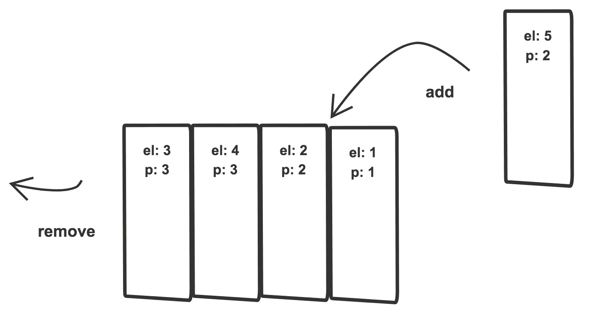
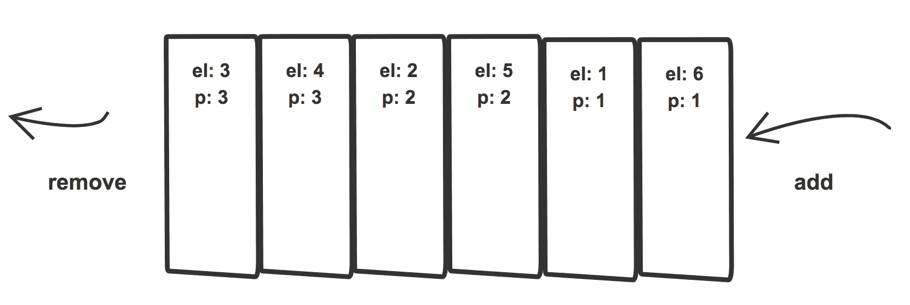
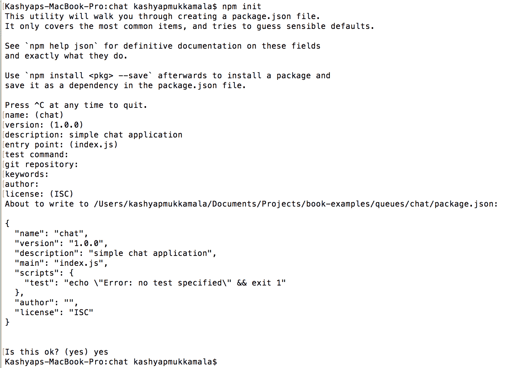
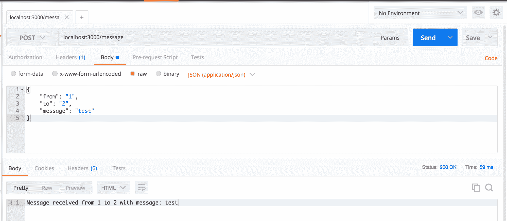
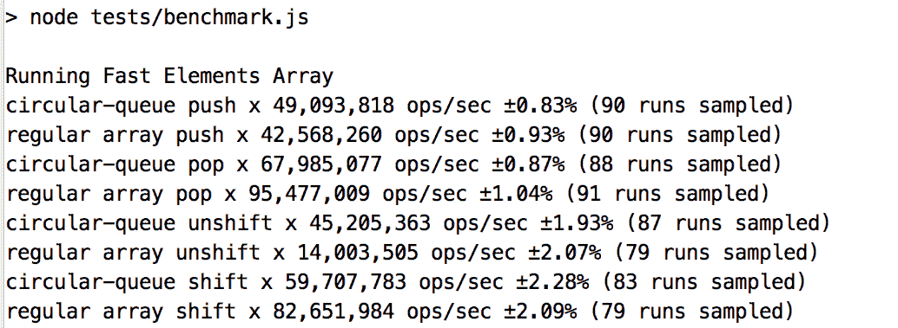
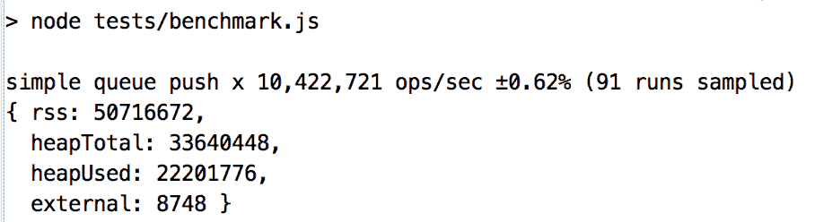

# 为有序执行创建队列

队列是一种编程构造，与现实世界的队列非常相似，例如电影院、自动取款机或银行的队列。与堆栈相反，队列是**先进先出** ( **先进先出**)，所以先入先出也是如此。当您希望按照数据流入的相同顺序维护数据时，这尤其有用。

队列的计算机/科学定义如下:

<q>一种抽象的数据集合，其中元素可以被添加到后面称为入队，从前面移除称为出列，这使得它成为一种先进先出的数据结构。</q>

当然，仅仅让*入队*和*出队*操作对于大多数情况来说可能足以涵盖我们可能遇到的更广泛的问题；然而，我们可以扩展 API，使我们的队列面向未来。

在本章中，我们将讨论以下主题:

*   队列类型
*   不同类型队列的实现
*   展示队列有用性的用例
*   与其他本机数据结构相比，队列的性能

# 队列类型

在我们开始了解队列之前，让我们快速了解一下我们可能希望在应用中使用的队列类型:

*   **简单队列**:在简单的 FIFO 队列中，顺序被保留，数据按照进入的顺序离开
*   **优先级队列**:给元素赋予预定义优先级的队列
*   **循环队列**:类似于简单队列，只是队列的后面跟在队列的前面
*   **双端队列** ( **出列**):类似于简单队列，但可以在队列的前面或后面添加或删除元素

# 实现应用编程接口

如前所述，实现一个应用编程接口从来没有看起来那么容易。当创建泛型类时，我们永远无法预测我们的队列将被用于哪种情况。考虑到这一点，让我们为我们的队列创建一个非常通用的应用编程接口，并在将来我们认为合适的时候扩展它。我们可以添加到队列中的一些最常见的操作如下:

*   `add()`:将一个项目推到队列的后面
*   `remove()`:从队列的开始处移除一个项目
*   `peek()`:显示添加到队列的最后一个项目
*   `front()`:返回队列最前面的项目
*   `clear()`:清空队列
*   `size()`:获取队列的当前大小

# 创建队列

在我们之前讨论的四种队列类型中，首先，我们将实现一个简单的队列，然后继续为后续队列的每种类型*修改它。*

# 简单的队列

类似于堆栈，我们将使用以下步骤创建一个队列:

1.  定义一个`constructor()`:

```js
class Queue {
    constructor() {

    }
}
```

2.  我们将使用`WeakMap()`进行内存数据存储，就像我们对堆栈所做的那样:

```js
    const qKey = {};
    const items = new WeakMap();

    class Queue {
        constructor() {

        }
    }
```

3.  实现前面在应用编程接口中描述的方法:

```js
var Queue = (() => {
    const qKey = {};
    const items = new WeakMap();

    class Queue {

        constructor() {
            items.set(qKey, []);
        }

        add(element) {
            let queue = items.get(qKey);
            queue.push(element);
        }

        remove() {
            let queue = items.get(qKey);
            return queue.shift();
        }

        peek() {
            let queue = items.get(qKey);
            return queue[queue.length - 1];
        }

        front() {
            let queue = items.get(qKey);
            return queue[0];
        }

        clear() {
            items.set(qKey, []);
        }

        size() {
            return items.get(qKey).length;
        }
    }

    return Queue;
})();
```

我们再次把整个班级包装在一个生活里，因为我们不想制造；`Queue`可从外部接触到的物品:


# 测试队列

要测试这个队列，您可以简单地实例化它，并在队列中添加/删除一些项目:

```js
var simpleQueue = new Queue();
simpleQueue.add(10);
simpleQueue.add(20);

console.log(simpleQueue.items); // prints undefined

console.log(simpleQueue.size()); // prints 2

console.log(simpleQueue.remove()); // prints 10

console.log(simpleQueue.size()); // prints 1

simpleQueue.clear();

console.log(simpleQueue.size()); // prints 0
```

从前面的代码中可以注意到，所有元素都被同等对待。不管它们包含什么数据，元素总是以先进先出的方式处理。虽然这是一个很好的方法，但有时我们可能需要更多的东西:对进入和离开队列的元素进行优先级排序的能力*，*，正如我们在下一节中所注意到的。

# 优先级队列

优先级队列在操作上类似于简单队列，也就是说，它们支持相同的应用编程接口，但是它们保存的数据有一点增加。除了元素(您的数据)，它们还可以保持优先级，这只是一个数字值，表示您的元素在队列中的优先级。

从队列中添加或删除这些元素取决于优先级。您可以有一个最小优先级队列或一个最大优先级队列，以帮助确定您是根据增加优先级还是减少优先级来添加元素。我们将看看`add()`方法如何替代我们之前定义的简单队列的`add()`方法:

```js
add(newEl) {
    let queue = items.get(pqkey);
    let newElPosition = queue.length;

    if(!queue.length) {
        queue.push(newEl);
        return;
    }

    for (let [i,v] of queue.entries()) {
        if(newEl.priority > v.priority) {
             newElPosition = i;
             break;
        }
    }

    queue.splice(newElPosition, 0, newEl);
}
```

由于我们在元素被插入堆栈时考虑了它们的优先级，所以当我们从队列中移除元素时，我们不必关心优先级，因此`remove()` 方法对于简单队列和优先级队列都是相同的。其他实用方法，如`front()`、`clear()`、`peek()`和`size()`，与队列中保存的数据类型没有关联，因此它们也保持不变。

A smart move while creating a priority queue would be to optimize your code and decide whether you would like to determine the priority at the time of addition or removal. That way, you are not overcalculating or analyzing your dataset at each step.

# 测试优先级队列

让我们首先设置测试队列的数据:

```js
var priorityQueue = new PriorityQueue();

priorityQueue.add({ el : 1, priority: 1});

// state of Queue
// [1]
//  ^

priorityQueue.add({ el : 2, priority: 2});

// state of Queue
// [2, 1]
//  ^

priorityQueue.add({ el : 3, priority: 3});

// state of Queue
// [3, 2, 1]
//  ^

priorityQueue.add({ el : 4, priority: 3});

// state of Queue
// [3, 4, 2, 1]
//     ^

priorityQueue.add({ el : 5, priority: 2});

// state of Queue
// [3, 4, 2, 5, 1]
//           ^
```

从视觉上看，前面的步骤将生成如下所示的队列:



从上图中，我们可以注意到当我们添加一个优先级为 **2** 的元素时，它是如何被放置在所有优先级为 **1** 的元素之前的:

```js
priorityQueue.add({ el : 6, priority: 1});

// state of Queue
// [3, 4, 2, 5, 1, 6]
//                 ^

```

当我们添加优先级为 1(最低)的元素时，它会被添加到队列的末尾:



我们在这里添加的最后一个元素恰好也是优先级最低的元素，这使得它成为队列的最后一个元素，从而保持所有元素根据优先级排序。

现在，让我们从队列中移除元素:

```js
console.log(priorityQueue.remove());

// prints { el: 3, priority: 3}

// state of Queue
// [4, 2, 5, 1, 6]

console.log(priorityQueue.remove());

// prints { el: 4, priority: 3 }

// state of Queue
// [2, 5, 1, 6]

console.log(priorityQueue.remove());

// prints { el: 2, priority: 2 }

// state of Queue
// [5, 1, 6]

priorityQueue.print();

// prints { el: 5, priority: 2 } { el: 1, priority: 1 } { el: 6, priority: 1 }
```

我们有了:使用`WeakMap()`在 JavaScript 中创建简单的优先级队列。现在让我们来看看这些队列的一些实际应用。

# 队列用例

在开始使用用例之前，我们需要一个 Node.js 应用形式的基础起点。要创建一个，请确保安装了最新的 Node.js:

```js
node -v
```

这会显示您当前安装的 Node.js 版本；如果没有，那么从[https://nodejs.org/en](https://nodejs.org/en/)下载并安装最新版本的 Node.js。

# 创建一个节点应用

要启动一个示例 Node.js 项目，只需首先创建一个项目文件夹，然后从该文件夹运行以下命令:

```js
npm init
```

运行此命令时，节点会提示您一系列问题，您可以填写或留空:



创建空白应用后，您看到的只是一个名为`package.json` *的文件。*您现在可以添加创建 Node.js 应用所需的依赖项:

```js
npm install body-parser express --save
```

`body-parser`模块帮助解析 POST 请求体，而`express` 模块帮助创建 Node.js 服务器。

# 启动节点服务器

一旦我们创建了应用外壳，创建一个名为`index.js`的文件，它将是您的应用的主文件；你可以称它为任何你喜欢的东西，但是一定要在你的`package.json`中相应地更新`main`属性。

现在，让我们在`index.js`文件中添加一些代码来启动一个快速服务器:

```js
var express = require('express');
var app = express();

app.listen(3000, function () {
    console.log('Chat Application listening on port 3000!')
});
```

就这样！服务器现在在`3000`端口上启动并运行。要测试它，只需添加一个空路由来告诉您应用是否启动:

```js
app.get('/', function (req, res) {
    res.status(200).send('OK!')
});
```

你可以进入你的浏览器，导航到`localhost:3000`*，这会显示你的服务器状态为`OK!`或者如果你的服务器停机了会给你一个错误。*

 *# 创建聊天端点

现在我们已经启动并运行了服务器，我们可以创建一个内存中的聊天端点，它将接受来自两个用户的消息，并使用队列将其转发给预期的接收者，同时保留订单。

在添加逻辑之前，我们需要做一些基础工作，以模块化的方式设置应用。首先，让我们包含`body-parser` 并将其用在一个快速中间件中，这样我们就可以轻松访问请求的`body`。所以，更新后的`index.js`文件看起来如下:

```js
var express = require('express');
var app = express();
var bodyParser = require('body-parser');

app.use(bodyParser.json());
app.use(bodyParser.urlencoded({ extended: true }));

app.get('/', function (req, res) {
    res.status(200).send('OK!')
});

app.listen(3000, function () {
    console.log('Chat Application listening on port 3000!')
});
```

现在，要为消息添加端点，我们可以在`routes`文件夹下创建一个名为`messages.js`的新文件，我们可以向其中添加基本的`post` 请求:

```js
var express = require('express');
var router = express.Router();

router.route('/')
   .post(function(req, res) {

         res.send(`Message received from: ${req.body.from} to ${req.body.to} with message ${req.body.message}`);

});

module.exports = router;
```

然后，我们可以将其注入我们的`index.js`中，并使其成为我们应用的一部分:

```js
var message = require('./routes/messages');

...
...
...

app.use('/message', message);
```

现在，为了测试这一点，我们可以启动我们的服务器，并使用邮递员向`localhost:3000/message`发送消息；然后我们可以看到发布的响应，如下所示:



Figure: Sample post message

现在，我们可以开始添加在两个用户之间发送消息的逻辑。我们将对应用的聊天部分进行抽象、模拟和简化，并在如此复杂的应用中更多地关注队列应用。

工作流程本身就比较直白:用户 A 给用户 B 发消息，我们的服务器尝试转发给用户 B，如果顺利通过没有任何问题，那么一切都好，消息传递给用户 B；但是如果失败了，那么我们调用`FailureProtocol()`、重试发送每个会话的最后一条失败消息。为了简单起见，我们假设现在只有一个频道，即用户 A 和用户 B 之间的*。*

当消息在一个通道上失败时，通过为特定通道创建一个新的`FailureProtocol()`处理程序，生产对应方将能够同时处理多个通道，并且可以灵活地将作业推迟到多个线程。

现在让我们在一个名为`messaging-utils.js`的文件中模拟出`sendMessage()`和`getUniqueFailureQueue()`方法，这将是我们的包装器，这样我们就可以将它们移动到自己的模块中，因为在这个场景中，它们的内部工作对于理解队列并不重要:

```js
var PriorityQueue = require('./priority-queue');

var Utils = (()=> {
    class Utils {

        constructor() {

        }

        getUniqueFailureQueue(from, to) {
            // use from and to here to determine 
            // if a failure queue already 
            // exists or create a new one

            return new PriorityQueue();
        }

        sendMessage(message) {
            return new Promise(function(resolve, reject) {
                // randomize successes and failure of message being
                   sent
                if(Math.random() < 0.1) {

                    resolve(message)

                } else {

                    reject(message);

                }

            });
        }

    }

    return Utils;
})();

module.exports = Utils;
```

现在，当我们收到新消息时，我们会尝试将其发送给预期的最终用户:

```js
var express = require('express');
var router = express.Router();
var Utils = require('../utils/messaging-utils');
const msgUtils = new Utils();

router.route('/')
    .post(function(req, res) {
        const message = req.body.message;
        let failedMessageQueue;

        // try to send the message
        msgUtils.sendMessage(req.body)
            .then(function() {

                res.send(`Message received from: ${req.body.from} to ${req.body.to} with message ${req.body.message}`);

            }, function() {

               failedMessageQueue = 
                   msgUtils.getUniqueFailureQueue(req.body.from,
                   req.body.to);

               failedMessageQueue.add(message);

               // trigger failure protocol
               triggerFailureProtocol();

         });
```

如果消息发送成功，我们需要立即确认并发送成功消息——否则，我们将在两个用户之间获得唯一的`failedMessageQueue`，然后将消息添加到其中，然后触发失败协议。

一个失败的协议对不同的应用可能意味着任何事情。虽然有些应用选择只显示失败的消息，但像我们这样的应用会重试发送消息，直到消息成功发送:

```js
function triggerFailureProtocol() {

    var msg = failedMessageQueue.front();

    msgUtils.sendMessage(msg)
        .then(function() {

             failedMessageQueue.remove();

             res.send('OK!');

         }, function(msg) {

             //retry failure protocol
             triggerFailureProtocol();

         });
}
```

我们可以使用`Queue`中可用的方法来选择顶部的消息，然后尝试发送它。如果成功，则将其移除；否则，重试。正如您所看到的，使用队列极大地简化和抽象了失败消息实际排队的逻辑，更好的是，您可以随时升级和增强队列，而不必考虑其他组件会受到什么影响。

现在我们已经准备好了 API 调用来解析传入的请求，将其发送给预期的接收者并触发我们的自定义失败协议。当我们将所有这些逻辑结合在一起时，我们会得到以下结果:

```js
var express = require('express');
var router = express.Router();
var Utils = require('../utils/messaging-utils');
const msgUtils = new Utils();

router.route('/')
    .post(function(req, res) {
        const message = req.body.message;
        let failedMessageQueue;

        // try to send the message
        msgUtils.sendMessage(req.body)
            .then(function() {

                 console.log("Sent Successfully : " + message);

                 res.send(`Message received from: ${req.body.from} to ${req.body.to} with message ${req.body.message}`);

            }, function(msg) {

                 console.log('Failed to send: ' + message);

                 failedMessageQueue = 
                     msgUtils.getUniqueFailureQueue(req.body.from,
                     req.body.to);

                 failedMessageQueue.add(message);

                 // trigger failure protocol
                 triggerFailureProtocol();
            });

        function triggerFailureProtocol() {

            var msg = failedMessageQueue.front();

            msgUtils.sendMessage(msg)
                .then(function() {

                    failedMessageQueue.remove();

                    res.send('OK!');

                 }, function(msg) {

                    //retry failure protocol
                    triggerFailureProtocol();

                 });
        }
});

module.exports = router;
```

# 使用优先级队列实现日志记录

端点失效，这是不可避免的。虽然我们可以尝试重新发送失败的消息，但我们需要在某个时候意识到我们这边有问题，并停止用转发消息的请求轰炸服务器。这是优先级队列可以派上用场的地方。

我们将替换现有的逻辑，使用优先级队列，以便检测何时停止尝试重新发送消息，并通知支持团队。

最大的变化是在`triggerFailureProtocol()`方法中，我们检查消息失败的次数是否超过预设的`retryThreshold`；如果有，那么我们将消息添加到具有关键优先级的队列中，我们稍后使用它来防止随后对服务器的轰击，直到支持团队解决问题。这个解决方案虽然相当幼稚，但在保护服务器资源方面非常有效。

因此，具有优先级队列的更新代码如下:

```js
function triggerFailureProtocol() {

    console.log('trigger failure protocol');

    // get front message from queue
    var frontMsgNode = failedMessageQueue.front();

    // low priority and hasnt hit retry threshold
    if (frontMsgNode.priority === 0 
        && failureTriggerCount <= failureTriggerCountThreshold) {

        // try to send message
        msgUtils.sendMessage(frontMsgNode.message)
            .then(function() {

                console.log('resend success');
                // success, so remove from queue
                failedMessageQueue.remove();

                // inform user
                res.send('OK!');

             }, function() {

                console.log('resend failure');

                // increment counter
                failureTriggerCount++;

                //retry failure protocol
                triggerFailureProtocol();

             });

    } else {

        console.log('resend failed too many times');

        // replace top message with higher priority message
        let prevMsgNode = failedMessageQueue.remove();

        prevMsgNode.priority = 1;

        // gets added to front
        failedMessageQueue.add(prevMsgNode);

        res.status(500).send('Critical Server Error! Failed to send
        message');

    }
}
```

在前面的代码中，我们将同一个登录包装在一个`if-else` 块中，以便能够重试发送消息，或者创建一个严重错误并停止重试。

因此，下一次该通道的新消息进来时，您可以验证已经存在严重错误，并直接拒绝请求，而不是经历发送消息失败的麻烦，这会使失败队列不断膨胀。

这当然是解决这个问题的一种方法，但更合适的方法是在用户尝试访问频道时通知用户任何关键错误，而不是在用户向频道发布消息时通知用户，这不在本示例的范围内。

以下是包含优先级队列的完整代码:

```js
var express = require('express');
var router = express.Router();
var Utils = require('../utils/messaging-utils');
const msgUtils = new Utils();

router.route('/')
    .post(function(req, res) {
        const message = req.body.message;
        let failedMessageQueue;
        let failureTriggerCount = 0;
        let failureTriggerCountThreshold = 3;
        let newMsgNode = {
            message: message,
            priority: 0
        };

        // try to send the message
        msgUtils.sendMessage(req.body)
            .then(function() {

                console.log('send success');

                // success
                res.send(`Message received from: ${req.body.from} to ${req.body.to} with message ${req.body.message}`);

         }, function() {

                console.log('send failed');

                // get unique queue
                failedMessageQueue = 
                    msgUtils.getUniqueFailureQueue(req.body.from,
                    req.body.to);

               // get front message in queue
               var frontMsgNode = failedMessageQueue.front();

               // already has a critical failure
               if (frontMsgNode && frontMsgNode.priority === 1) {

                   // notify support

                   // notify user
                   res.status(500)
                      .send('Critical Server Error! Failed to send
                      message');

               } else {

                   // add more
                   failedMessageQueue.add(newMsgNode);

                   // increment count
                   failureTriggerCount++;

                   // trigger failure protocol
                   triggerFailureProtocol();

               }
        });

        function triggerFailureProtocol() {

            console.log('trigger failure protocol');

            // get front message from queue
            var frontMsgNode = failedMessageQueue.front();

            // low priority and hasnt hit retry threshold
           if (frontMsgNode.priority === 0 
               && failureTriggerCount <= failureTriggerCountThreshold) {

               // try to send message
               msgUtils.sendMessage(frontMsgNode.message)
                   .then(function() {

                       console.log('resend success');
                       // success, so remove from queue
                       failedMessageQueue.remove();

                       // inform user
                       res.send('OK!');

                    }, function() {

                       console.log('resend failure');

                       // increment counter
                       failureTriggerCount++;

                       //retry failure protocol
                       triggerFailureProtocol();

                     });

            } else {

                console.log('resend failed too many times');

                // replace top message with higher priority message
                let prevMsgNode = failedMessageQueue.remove();

                prevMsgNode.priority = 1;

                // gets added to front
                failedMessageQueue.add(prevMsgNode);

                res.status(500)
                   .send('Critical Server Error! Failed to send 
                   message');

           }
        }
});

module.exports = router;
```

# 比较性能

前面，我们看到了如何简单地将一个简单的队列换成一个优先级队列，而不用担心它可能导致的功能变化；类似地，我们可以将优先级队列换成性能更高的队列变体:循环出列*。*

在我们开始进行比较之前，我们需要讨论循环队列以及为什么需要它们。

循环队列和简单队列的区别在于队列的后面跟在队列的前面。也就是说，它们在功能上没有什么不同。它们仍然执行相同的操作，并产生相同的结果；你可能想知道它们到底有什么不同，如果最终结果是一样的，那还有什么意义。

在 JavaScript 数组中，内存位置是连续的。因此，在创建队列和执行`remove()`等操作时，我们需要担心将剩余的元素移动到更新后的*前面*而不是*空*，从而增加操作的数量；这也是内存命中，除非您的队列有无限/动态数量的插槽。

现在，想象一个循环队列——由于它的循环性质，这个队列有固定数量的内存位置，当一个元素被移除或添加时，您可以重用内存位置并减少执行的操作数量，这使得它比常规队列更快。

在我们对这个队列相对于 JavaScript 中的本机数组的性能做出类似的判断之前，让我们看看 Chrome 的 JavaScript 引擎 V8 的引擎盖下，看看它在我们的案例中是否真的有意义。我们之所以考虑这一点，是因为 JavaScript 中经常被忽略的稀疏和密集数组的概念，尽管这是一个不为人知的实现，可能会时不时地发生变化。大多数时候，JavaScript 数组是密集的，如果处理不当，很容易变得稀疏。一个简单的测试方法是创建一个数组，如下所示:

*   考虑示例 1:

```js
const a = [undefined, undefined, 10];
```

当您记录它时，您会看到同样的情况:

```js
[undefined, undefined, 10];
```

现在，创建一个像这样的数组:

*   考虑示例 2:

```js
const b = [];
b[3] = 10; // hole as we missed out index 0,1,2
```

当您记录它时，您会得到相同的结果:

```js
[undefined x 3, 10];
```

这很有趣，因为它显示了 JavaScript 数组的密集(示例 1)和稀疏(示例 2)行为之间的区别。当您创建这些密集数组时，已知数组的元素具有特定的值，并且这些值在初始化时是已知的，这使得 JavaScript 可以选择将这些值保存在连续的内存中。

JavaScript 数组实现的 V8 代码有以下注释，这是另一个有趣的观察结果，与我们到目前为止讨论的一致

```js
// The JSArray describes JavaScript Arrays
// Such an array can be in one of two modes:
//           - fast, backing storage is a FixedArray and length <= elements.length();
//           Please note: push and pop can be used to grow and shrink the array.
//         - slow, backing storage is a HashTable with numbers as keys.
class JSArray: public JSObject {
```

因此，根据保存在数组中的数据的类型和大小，数组在内部会得到不同的处理。根据经验，始终使用数组文字创建一个空数组，并从 0 索引开始递增地为元素赋值，同时在数组中不留下间隙或孔。这使数组保持快速，并且它不会进入字典模式，除非数据的绝对大小需要它。

双端循环队列，也称为循环出列，也类似于简单队列，只是`add()`和`remove()`可以从队列的前面或后面进行。

这与您的数组基本上是相同的 API，我们可以构建一个提供这种功能的类的示例，但是让我们更进一步，看看我们如何使用循环队列实现前面讨论的所有内容，并使其尽可能具有性能:


首先，我们将假设这个队列的大小是有限的；它可以在以后扩展为动态的，但这不是现在要考虑的问题。到目前为止，`WeakMap()`一直被用作内存中的数据存储，我们在其中保存了队列所需的数据，但是在性能方面，它只是给我们的数据结构增加了另一层检索，所以在这种情况下，我们将转移到标准数组，因为无论如何，这是我们在基准测试中要比较的。将它翻译成一些代码，我们可以得到我们的`CircularDequeue`，如下所示:

```js
var CircularDequeue = (()=> {
    class CircularDequeue {
        constructor() {
            // pseudo realistic 2^x value
            this._size = 1024;
            this._length = 0;
            this._front = 0;
            this._data = [];
        }

        push (item) {
            // get the length of the array
            var length = this._length;

            // calculate the end
            var i = (this._front + length) & (this._size - 1);

            // assign value to the current end of the data
            this._data[i] = item;

            // increment length for quick look up
            this._length = length + 1;

            // return new length
            return this._length;
        }

        pop () {
            // get the length of the array
            var length = this._length;

            // calculate the end
            var i = (this._front + length - 1) & (this._size - 1);

            // copy the value to return
            var ret = this._data[i];

            // remove the value from data
            this._data[i] = undefined;

            // reduce length for look up
            this._length = length - 1;

            // return value
            return ret;
       }

       shift () {
            // get the current front of queue
            var front = this._front;

            // capture return value
            var ret = this._data[front];

            // reset value in the data
            this._data[front] = undefined;

            // calculate the new front of the queue
            this._front = (front + 1) & (this._size - 1);

            // reduce the size
            this._length = this._length - 1;

            // return the value
            return ret;

        }

        unshift (item) {
            // get the size
            var size = this._size;

            // calculate the new front
            var i = (((( this._front - 1 ) & ( size - 1) ) ^ size ) -
            size );

            // add the item
            this._data[i] = item;

            // increment the length
            this._length = this._length + 1;

            // update the new front
            this._front = i;

            // return the acknowledgement of the addition of the new
            item
            return this._length;
        }
    }

    return CircularDequeue;
})();

module.exports = CircularDequeue;
```

当然，这只是实现循环出列的一种方式；您可以通过将属性添加到类的构造函数本身来获得更好的性能，而不是将它们包装在一个 IIFE 中(也就是说，避免范围链查找)，如果您使用的是 TypeScript，还可以进一步简化代码，TypeScript 允许私有类成员，如堆栈所讨论的那样。

# 运行基准测试

在运行基准测试之前，了解我们将队列与本机阵列进行比较的意图非常重要。我们并不试图证明队列比数组快，这就是为什么我们应该使用它们。与此同时，我们不想使用速度慢得离谱的东西。这些测试的目标是帮助我们了解队列相对于本地数据结构的位置，以及如果需要，我们是否可以依赖它们来提供一个高性能的定制数据结构。

现在，让我们运行一些基准测试来比较循环出列和数组*。*我们将使用`benchmark.js`来设置和运行我们的基准测试。设置非常简单；我们将比较循环出列 API 和常规数组的本机操作。

首先，让我们在项目中包含基准节点模块。要安装它，请在项目根目录下的终端上运行以下命令:

```js
npm install benchmark --save-dev
```

一旦安装完成，我们就可以创建我们的测试套件了。创建一个`tests`文件夹，并在其下添加一个名为`benchmark.js`的文件。为了创建测试套件，我们将首先设置数据。如前所述，我们将把我们的`CircularDequeue`与数组进行比较:

```js
var Benchmark = require("benchmark");
var suite = new Benchmark.Suite();
var CircularDequeue = require("../utils/circular-dequeue.js");

var cdQueue = new CircularDequeue();
var array = [];

for(var i=0; i < 10; i++) {
    cdQueue.push(i);
    array.push(i);
}
```

这里，我们从循环出列和数组中的一个小数据集开始。这将允许阵列密集，从而允许 V8 引擎以快速模式运行并应用内部优化。

现在，我们可以继续向我们的测试套件添加测试:

```js
suite
   .add("circular-queue push", function(){
        cdQueue.push(cdQueue.shift());
   })
   .add("regular array push", function(){
        array.push(array.shift());
   })
   .add("circular-queue pop", function(){
        cdQueue.pop();
   })
   .add("regular array pop", function(){
        array.pop();
   })
   .add("circular-queue unshift", function(){
        cdQueue.unshift(cdQueue.shift());
   })
   .add("regular array unshift", function(){
        array.unshift( array.shift());
   })
   .add("circular-queue shift", function(){
        cdQueue.shift();
   })
   .add("regular array shift", function(){
        array.shift();
   })
   .on("cycle", function(e) {
       console.log("" + e.target);
   })
   .run();
```

在前面的测试中需要注意的一点是，我们总是将两个操作结合在一起，如下所示:

```js
.add("regular array push", function(){
      array.push(array.shift());
});
```

如果我们在做`push()`方法之前不做`shift()`方法，而是推一个数字，例如`1`或`2`，那么我们将很快遇到`out of memory`错误，因为内部测试的迭代次数太多，数组无法处理；另一方面，循环队列会很好，因为它们是循环的:它们会覆盖以前的值。

现在，将测试添加到您的`package.json`脚本中，以便于访问:

```js
"scripts": {
    "start": "node index.js",
    "test": "node tests/benchmark.js"
},
```

要运行基准测试套件，请运行以下命令:

```js
npm run test
```

结果如下:



从前面的截图中可以看出，循环队列的推送和卸载比本机推送和卸载操作快得多，而弹出和移位操作几乎慢 30%。

现在，让我们使数组变得稀疏，这样我们就可以强制 V8 在字典模式下运行数组方法(这对于某些人来说可能是一个真实的用例，在处理混合数据类型的数组时有时也是一种可能性):

```js
var i = 1000;

while(i--){
    cdQueue.push(i);
    array.push(i);
}
```

当我们使用稀疏数组运行类似的测试时，结果如下:


您可以看到`push()`操作的性能与快速模式有很大不同，而其他模式基本保持不变。这是理解采用特定编码实践的后果的好方法。您需要了解您的应用的要求，并相应地为合适的工作选择合适的工具。

比如内存优先的时候，我们就用简单队列代替，和`WeakMap()`配合使用，而不是常规数组。我们可以创建两个新的测试，分别运行来跟踪它们各自的内存使用情况:

```js
suite
   .add("regular array push", function(){
        array.push(array.shift());
   })
   .on("cycle", function(e) {
        console.log("" + e.target);
        console.log(process.memoryUsage());
   })
   .run();
```

它会产生以下结果:


我们可以从前面的截图中注意到，它记录了我们测试运行的结果，即 ops/sec，还记录了该周期的总内存使用量。

同样，我们可以在简单队列上运行`remove`操作的基准，这与我们对移位操作所做的非常相似:

```js
suite
   .add("simple queue push", function(){
        simpleQueue.add(simpleQueue.remove());
   })
   .on("cycle", function(e) {
        console.log("" + e.target);
        console.log(process.memoryUsage());
   })
   .run();
```

这会产生以下结果:



可以看到简单队列明显比数组慢了`4`倍，但这里重要的是要注意两种场景的`heapUsed`。这是让您决定何时以及如何选择特定类型的数据结构的另一个因素。

# 摘要

至此，我们结束了关于队列的这一章。我们了解了简单队列、优先级队列和循环队列，以及它的双端变体。我们还学习了何时基于用例应用它们，并通过示例看到了我们如何根据需要利用基准测试任何算法或数据结构的能力。在下一章中，我们将把集合、地图和散列放在显微镜下，以了解它们的内部工作方式，并看看它们在什么情况下会有用。*