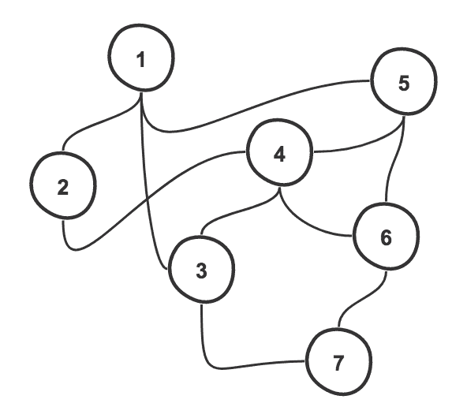
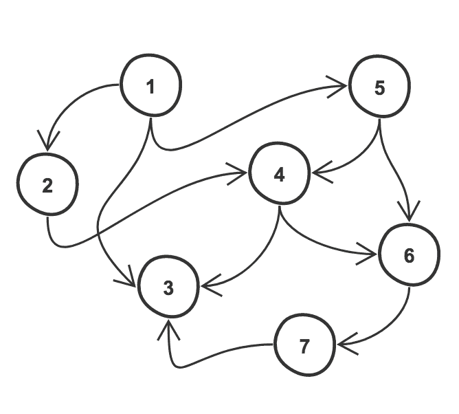
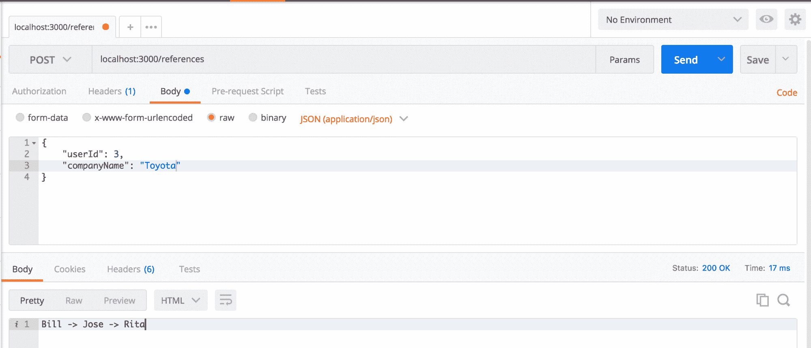
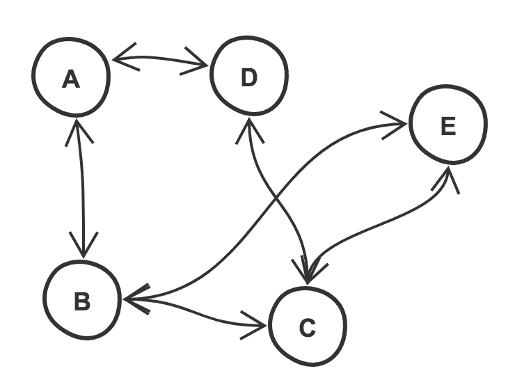
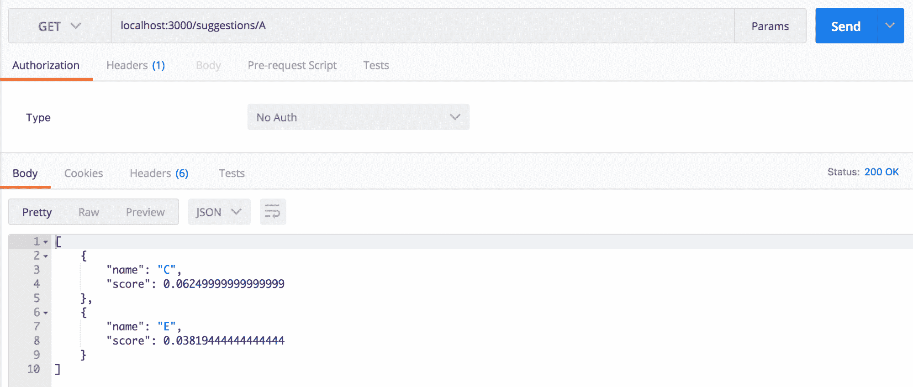

# 使用图形简化复杂的应用程序

定义一个图的最简单的方法是任何节点的集合，其中节点通过边连接。图形是计算机科学中最流行的数学概念之一。如今，图形实现的流行例子是任何社交媒体网站。脸书以*好友*为节点，*友情*为边；另一方面，推特将*追随者*定义为节点，将*跟随*定义为边缘，以此类推。请看下图:


在上图中，您可以看到一个典型的图，其中有*节点*和*边*。正如您所注意到的，没有列出到我们边缘的方向，也没有提到我们节点上的细节。这是因为有不同类型的图，这些不同类型的图之间的节点和边略有不同，我们将在后续章节中看到。

在本章中，我们将首先讨论以下主题:

1.  图的类型
2.  为职务门户创建参考生成器
3.  创建朋友推荐系统

# 图的类型

从前面的描述中，我们可以推测图形的类型。这一章甚至这本书涵盖的内容太多了。但是，让我们来看看一些最重要和最受欢迎的图表，我们将在本章中通过示例来探讨这些图表:

*   **简单图**:简单图是一个无向的、未加权的图，它不包含环或多边(即两个节点之间的多条边，也称为平行边)节点:


*   **无向图**:这是一个边定义可以互换的图。例如，在下图中，节点 **1** 和 **2** 之间的边缘可以表示为(1，2)或(2，1)。因此，这些节点由一条线连接，而箭头不指向任何节点:



*   **有向图**:这是一个根据函数或逻辑条件给边指定预定义方向的图。边缘用箭头画出，表示流动的方向，例如，一个用户在推特上跟随另一个用户。请看下图:


*   **循环图**:这是边在节点之间形成循环连接的图，也就是开始和结束节点相同。例如，在下图中，我们可以注意到节点**1**>>**5**>>**6**>>**7**>>**3**>1 形成图内循环:


*   **有向无环图**:这是一个没有圈的有向图。这些是最常见的图表。在以下示例中，节点为 **1** 、 **2** 、 **3** 、 **4** 、 **5** 、 **6** 、 **7** ，边为{(1，2)、(1，3)、(1，5)、(2，4)、(4，3)、(4，6)、(5，4)、(5，6)、(6，7)、(7，3)}:



*   **加权图**:这是一个根据遍历边的成本或成本为边分配数值权重的图。每个边的权重的使用可以根据用例而变化。在以下示例中，您可以注意到图形根据它们之间的边被分配了权重( **0** 、 **1** 、 **3** 或 **5** ):


幸运的是，或者不幸的是，我们在日常挑战中面临的问题并没有直接告诉我们是否可以用一个图来解决它们，如果可以，它需要是什么样的图，或者我们需要使用什么样的解析算法。这是我们在逐个案例的基础上采取的措施，这也是我们将对以下用例所做的。

# 用例

实现一个图类似于树；没有固定的方法来创建一个。但是，根据您的用例，您可以将您的图构造为有向图、循环图或前面解释的任何其他形式。这样做可以使它们的遍历更加容易，这反过来又会使数据检索更加容易和快速。

让我们先看一些需要基础应用程序的例子。

# 创建一个节点服务器

让我们首先使用 Node.js 创建一个 web 服务器，稍后我们将使用它来创建端点，以访问我们基于图形的应用程序:

1.  第一步是创建应用程序的项目文件夹；为此，请从终端运行以下命令:

```js
 mkdir <project-name>
```

2.  然后，要初始化一个 Node.js 项目，在项目的根文件夹中运行`init`命令。这将提示一系列问题生成`package.json` 文件。您可以填写您想要的答案，或者只需点击`return` 接受提示的默认值:

```js
 cd <project-name>
 npm init
```

3.  接下来，由于我们想要创建一个 web 服务器，我们将使用`express` *、*这是 Node.js 非常强大和流行的框架，我们还将使用另一个名为`body-parser`的库，它可以帮助我们轻松解析传入的 JSON 主体请求。最后，我们还将使用`lodash`来帮助一些复杂的数据操作。要安装`lodash`、`express`和`body-parser`，运行以下命令:

```js
 npm install express body-parser lodash --save
```

4.  一旦我们完成了应用程序设置，我们将需要使用 express 启动应用程序服务器，并包括我们的`body-parser`中间件。因此，我们现在可以在根目录下创建一个`server.js`文件，然后向其中添加以下代码:

```js
        var express = require('express');
        var app = express();
        var bodyParser = require('body-parser');

        // middleware to parse the body of input requests
        app.use(bodyParser.json());

        // test url
        app.get('/', function (req, res) {
           res.status(200).send('OK!')
        });

        // start server
        app.listen(3000, function () {
           console.log('Application listening on port 3000!')
        });
```

5.  现在，该应用程序已准备好推出。在您的`package.json`文件的`scripts`标签下，添加以下内容，然后从终端运行`npm start`来启动您的服务器:

```js
        {

        ...

        "scripts": {
          "start": "node server.js",
          "test": "echo \"Error: no test specified\" && exit 1"
        },

        ...

        }
```

# 为职务门户创建参考生成器

在本例中，我们将为作业门户创建一个参考生成器。例如，我们有几个彼此是朋友的用户，我们将为每个用户创建节点，并将每个节点与数据相关联，例如他们的姓名和他们工作的公司。

一旦我们创建了所有这些节点，我们将根据节点之间的一些预定义关系来连接它们。然后，我们将使用这些预定义的关系来确定用户必须与谁交谈才能被推荐到他们选择的公司面试。比如在 X 公司工作的 A 和在 Y 公司工作的 B 是朋友，在 Z 公司工作的 B 和 C 是朋友。所以，如果 A 想被推荐给 Z 公司，那么 A 就和 B 谈，B 可以把他们介绍给 C，让他们推荐给 Z 公司。

在大多数生产级应用程序中，您不会以这种方式创建图表。您可以简单地使用图形数据库，它可以开箱即用地执行许多功能。

回到我们的例子，用更专业的术语来说，我们有一个无向图(把用户看作节点，把友谊看作它们之间的边)，我们想确定从一个节点到另一个节点的最短路径。

为了完成我们到目前为止所描述的，我们将使用一种被称为**广度优先搜索***(**【BFS】**)*的技术。* BFS 是一种图遍历机制，在该机制中，在进入下一级之前，首先检查或评估相邻节点。这有助于确保在结果链中找到的链接数量总是最小的，因此我们总是获得从节点 A 到节点 b 的最短可能路径*

 *虽然还有其他算法，如**迪克斯特拉**，可以获得类似的结果，但我们还是选择 BFS，因为迪克斯特拉是一种更复杂的算法，非常适合每条边都有相关成本的情况。例如，在我们的例子中，如果我们的用户的友谊具有与之相关联的权重，例如*熟人*、*朋友*和*密友*，这将帮助我们将权重与这些路径中的每一个相关联，那么我们将选择 Dijkstra 。

考虑 Dijkstra 的一个很好的用例是地图应用程序，它会根据中间的流量(即与每个边相关联的权重或成本)为您提供从 A 点到 B 点的方向。

# 创建双向图

我们可以通过在`utils/graph.js`下创建一个新的文件来为我们的图从逻辑开始，该文件将保存边，然后提供一个简单的`shortestPath` 方法来访问该图，并在生成的图上应用 BFS 算法，如以下代码所示:

```js
var _ = require('lodash');

class Graph {

   constructor(users) {
      // initialize edges
      this.edges = {};

      // save users for later access
      this.users = users;

      // add users and edges of each
      _.forEach(users, (user) => {
         this.edges[user.id] = user.friends;
      });
   }
}

module.exports = Graph;
```

一旦我们将边添加到我们的图中，它就有了节点(用户标识)，边被定义为`friends`数组中每个用户标识和朋友之间的关系，每个用户都可以使用。由于我们数据的结构化方式，形成图表是一项简单的任务。在我们的示例数据集中，每个用户都有一组好友列表，如以下代码所示:

```js
[
   {
      id: 1,
      name: 'Adam',
      company: 'Facebook',
      friends: [2, 3, 4, 5, 7]
   },
   {
      id: 2,
      name: 'John',
      company: 'Google',
      friends: [1, 6, 8]
   },
   {
      id: 3,
      name: 'Bill',
      company: 'Twitter',
      friends: [1, 4, 5, 8]
   },
   {
      id: 4,
      name: 'Jose',
      company: 'Apple',
      friends: [1, 3, 6, 8]
   },
   {
      id: 5,
      name: 'Jack',
      company: 'Samsung',
      friends: [1, 3, 7]
   },
   {
      id: 6,
      name: 'Rita',
      company: 'Toyota',
      friends: [2, 4, 7, 8]
   },
   {
      id: 7,
      name: 'Smith',
      company: 'Matlab',
      friends: [1, 5, 6, 8]
   },
   {
      id: 8,
      name: 'Jane',
      company: 'Ford',
      friends: [2, 3, 4, 6, 7]
   }
]
```

正如您可以在前面的代码中注意到的，我们并不需要在这里专门建立双向边，因为如果用户`1`是用户`2`的朋友，那么用户`2`也是用户`1.`的朋友

# 为最短路径生成生成伪代码

在实现之前，让我们快速记下我们将要做的事情，以便实际实现变得更加容易:

```js
INITIALIZE tail to 0 for subsequent iterations

MARK source node as visited

WHILE result not found

    GET neighbors of latest visited node (extracted using tail)

    FOR each of the node

        IF node already visited

            RETURN

        Mark node as visited

        IF node is our expected result

            INITIALIZE result with current neighbor node

            WHILE not source node

               BACKTRACK steps by popping users 
               from previously visited path until
               the source user

            ADD source user to the result

            CREATE and format result variable

        IF result found return control

        NO result found, add user to previously visited path

        ADD friend to queue for BFS in next iteration

    INCREMENT tail for next loop

RETURN NO_RESULT
```

# 实现最短路径生成

现在，让我们创建我们定制的 BFS 算法来解析该图，并为我们的用户生成最短的可能路径，以便推荐给公司 A:

```js
var _ = require('lodash');

class Graph {

   constructor(users) {
      // initialize edges
      this.edges = {};

      // save users for later access
      this.users = users;

      // add users and edges of each
      _.forEach(users, (user) => {
         this.edges[user.id] = user.friends;
      });
   }

   shortestPath(sourceUser, targetCompany) {
      // final shortestPath
      var shortestPath;

      // for iterating along the breadth
      var tail = 0;

      // queue of users being visited
      var queue = [ sourceUser ];

      // mark visited users
      var visitedNodes = [];

      // previous path to backtrack steps when shortestPath is found
      var prevPath = {};

      // request is same as response
      if (_.isEqual(sourceUser.company, targetCompany)) {
         return;
      }

      // mark source user as visited so
      // next time we skip the processing
      visitedNodes.push(sourceUser.id);

      // loop queue until match is found
      // OR until the end of queue i.e no match
      while (!shortestPath && tail < queue.length) {

         // take user breadth first
         var user = queue[tail];

         // take nodes forming edges with user
         var friendsIds = this.edges[user.id];

         // loop over each node
         _.forEach(friendsIds, (friendId) => {
            // result found in previous iteration, so we can stop
            if (shortestPath) return;

            // get all details of node
            var friend = _.find(this.users, ['id', friendId]);

            // if visited already,
            // nothing to recheck so return
            if (_.includes(visitedNodes, friendId)) {
               return;
            }

            // mark as visited
            visitedNodes.push(friendId);

            // if company matched
            if (_.isEqual(friend.company, targetCompany)) {

               // create result path with the matched node
               var path = [ friend ];

               // keep backtracking until source user and add to path
               while (user.id !== sourceUser.id) {

                  // add user to shortest path
                  path.unshift(user);

                  // prepare for next iteration
                  user = prevPath[user.id];
               }

               // add source user to the path
               path.unshift(user);

               // format and return shortestPath
               shortestPath = _.map(path, 'name').join(' -> ');
            }

            // break loop if shortestPath found
            if (shortestPath) return;

            // no match found at current user,
            // add it to previous path to help backtracking later
            prevPath[friend.id] = user;

            // add to queue in the order of visit
            // i.e. breadth wise for next iteration
            queue.push(friend);
         });

         // increment counter
         tail++;
      }

      return shortestPath ||
            `No path between ${sourceUser.name} & ${targetCompany}`;
   }

}

module.exports = Graph;
```

代码中最重要的部分是找到匹配的时候，如前面代码中的代码块所示:

```js
// if company matched
if (_.isEqual(friend.company, targetCompany)) {

   // create result path with the matched node
   var path = [ friend ];

   // keep backtracking until source user and add to path
   while (user.id !== sourceUser.id) {

      // add user to shortest path
      path.unshift(user);

      // prepare for next iteration
      user = prevPath[user.id];
   }

   // add source user to the path
   path.unshift(user);

   // format and return shortestPath
   shortestPath = _.map(path, 'name').join(' -> ');
}
```

在这里，我们采用了一种称为回溯的技术，它可以帮助我们在找到结果时回溯我们的步骤。这里的想法是，只要没有找到结果，我们就将迭代的当前状态添加到映射中——键作为当前访问的节点，值作为我们访问的节点。

因此，例如，如果我们从节点 3 访问节点 1，那么映射将包含{ 1: 3 }，直到我们从某个其他节点访问节点 1，当这种情况发生时，我们的映射将更新以指向我们从中到达节点 1 的新节点，例如{ 1: newNode }。一旦我们设置了这些先前的路径，我们就可以通过查看这张地图轻松地追溯我们的脚步。通过添加一些日志语句(仅在 GitHub 代码中可用，以避免混淆)，我们可以轻松地查看长而简单的数据流。让我们举一个我们之前定义的数据集的例子，所以当比尔试图寻找可以推荐他去丰田的朋友时，我们会看到以下日志语句:

```js
starting the shortest path determination
added 3 to the queue
marked 3 as visited
    shortest path not found, moving on to next node in queue: 3
    extracting neighbor nodes of node 3 (1,4,5,8)
        accessing neighbor 1
        mark 1 as visited
        result not found, mark our path from 3 to 1
        result not found, add 1 to queue for next iteration
        current queue content : 3,1
        accessing neighbor 4
        mark 4 as visited
        result not found, mark our path from 3 to 4
        result not found, add 4 to queue for next iteration
        current queue content : 3,1,4
        accessing neighbor 5
        mark 5 as visited
        result not found, mark our path from 3 to 5
        result not found, add 5 to queue for next iteration
        current queue content : 3,1,4,5
        accessing neighbor 8
        mark 8 as visited
        result not found, mark our path from 3 to 8
        result not found, add 8 to queue for next iteration
        current queue content : 3,1,4,5,8
    increment tail to 1
    shortest path not found, moving on to next node in queue: 1
    extracting neighbor nodes of node 1 (2,3,4,5,7)
        accessing neighbor 2
        mark 2 as visited
        result not found, mark our path from 1 to 2
        result not found, add 2 to queue for next iteration
        current queue content : 3,1,4,5,8,2
        accessing neighbor 3
        neighbor 3 already visited, return control to top
        accessing neighbor 4
        neighbor 4 already visited, return control to top
        accessing neighbor 5
        neighbor 5 already visited, return control to top
        accessing neighbor 7
        mark 7 as visited
        result not found, mark our path from 1 to 7
        result not found, add 7 to queue for next iteration
        current queue content : 3,1,4,5,8,2,7
    increment tail to 2
    shortest path not found, moving on to next node in queue: 4
    extracting neighbor nodes of node 4 (1,3,6,8)
        accessing neighbor 1
        neighbor 1 already visited, return control to top
        accessing neighbor 3
        neighbor 3 already visited, return control to top
        accessing neighbor 6
        mark 6 as visited
        result found at 6, add it to result path ([6])
        backtracking steps to 3
            we got to 6 from 4
            update path accordingly: ([4,6])
        add source user 3 to result
        form result [3,4,6]
        return result
    increment tail to 3
return result Bill -> Jose -> Rita
```

这里我们基本上有一个迭代过程，使用 BFS 遍历树并回溯结果。这是我们功能的核心。

# 创建 web 服务器

我们现在可以添加一条路线来访问这个图及其相应的`shortestPath`方法。让我们首先在`routes/references`下创建路由，并将其作为中间件添加到 web 服务器:

```js
var express = require('express');
var app = express();
var bodyParser = require('body-parser');

// register endpoints
var references = require('./routes/references');

// middleware to parse the body of input requests
app.use(bodyParser.json());

// route middleware
app.use('/references', references);

// start server
app.listen(3000, function () {
   console.log('Application listening on port 3000!');
});
```

然后，创建如下代码所示的路由:

```js
var express = require('express');
var router = express.Router();
var Graph = require('../utils/graph');
var _ = require('lodash');
var userGraph;

// sample set of users with friends 
// same as list shown earlier
var users = [...];

// middleware to create the users graph
router.use(function(req) {
   // form graph
   userGraph = new Graph(users);

   // continue to next step
   req.next();
});

// create the route for generating reference path
// this can also be a get request with params based
// on developer preference
router.route('/')
   .post(function(req, res) {

      // take user Id
      const userId = req.body.userId;

      // target company name
      const companyName = req.body.companyName;

      // extract current user info
      const user = _.find(users, ['id', userId]);

      // get shortest path
      const path = userGraph.shortestPath(user, companyName);

      // return
      res.send(path);
   });

module.exports = router;
```

# 运行参考发生器

要测试这一点，只需从项目的根目录运行`npm start`命令来启动 web 服务器，如前所示。

服务器启动并运行后，您可以使用任何工具将请求发布到 web 服务器，如下图所示:



正如您在前面的截图中看到的，我们得到了预期的响应。当然，这可以通过返回所有用户对象的方式来改变，而不仅仅是名称。这可能是这个例子的有趣延伸，你可以自己尝试。

# 为社交媒体创建朋友推荐系统

你不能简单地否认社交网站都是关于数据的。这就是为什么这些网站中构建的大多数功能都依赖于您提供给它们的数据。其中的一个例子是你可能认识的一个人或一个 T2，你可以在许多网站上找到他们。

从前面的例子中，我们知道数据可以分为`nodes`和`edges`，其中节点是人，边是你想要在节点之间建立的关系。

我们可以简单地形成一个双向图，然后应用 BFS 算法来确定第 *n* 次的连接节点，然后我们可以去重以显示朋友或节点推荐。然而，考虑到我们已经在前面的例子中做到了这一点，并且在生产应用程序中这些用户和朋友的实际列表非常庞大，我们将采取不同的方法。我们将假设我们的数据集存储在一个图形数据库中，例如**neo4j***，然后我们将使用一个名为**个性化 PageRank** 的算法，这是一个 BFS 和 PageRank 的组合，我们将在下一节中探讨。*

 *# 理解 PageRank 算法

在我们生命中的某个时刻，我们一定遇到过这个词，PageRank。PageRank 是谷歌对网页进行搜索和索引排名的众多方式之一。一个简单的谷歌搜索(一语双关)将返回结果，告诉你它基本上是如何包含一组节点的集合，我们可以从这些节点中随机前进。然而，这到底意味着什么？

假设控件落在图中的任何节点上，我们说控件可以以`alpha`、的概率无偏地跳到图上的任何节点，并且当它落在任何节点上时，它在以`(1 - alpha)`的概率随机沿着这些节点边缘之一遍历之前，与其所有连接的节点平等地共享其等级的一部分。

这有什么关系，为什么有关系？它只是从一个节点跳到另一个节点，然后随机遍历到其他连接的节点，对吗？

如果你这样做足够长的时间，你会在所有的节点和一些节点上着陆更多次。你明白我的意思了吗？这将告诉您哪些节点比其他节点更频繁，这可能是由于以下两个原因:

*   我们只是碰巧多次跳到同一个节点
*   该节点连接到多个节点

第一种情况可能会发生，但是，因为我们知道我们的跳跃是无偏的，并且大数定律规定，当时间足够长时，这将产生归一化值，所以我们可以安全地排除它。

另一方面，第二种情况不仅可能，而且对 PageRank 非常重要。一旦你在这些节点中的一个上着陆，那就是我们计算那个节点的 PageRank 的时候——基于 alpha 和从前一个节点继承的 Rank。

我们用抽象的术语来谈论节点和边；然而，让我们简单地看一下谢尔盖·布林和劳伦斯·佩奇在《第一次出版的 PageRank》中所做的一个声明:

We assume page A has pages T1...Tn which point to it (i.e., are citations). The parameter d is a damping factor which can be set between 0 and 1\. We usually set d to 0.85. There are more details about d in the next section. Also, C(A) is defined as the number of links going out of page A. The PageRank of page A is given as follows:

PR(A) = (1-d) + d (PR(T1)/C(T1) + ... + PR(Tn)/C(Tn))

Note that the PageRanks form a probability distribution over web pages, so the sum of all web pages' PageRanks will be one.

从前面的陈述中，我们可以看到给定页面/节点的 PageRank *(PR* )来源于其引用( *T1)的 *PR* ...Tn* )，但是既然我们需要知道它的引用来计算 *T1* 的 PR，怎么知道从哪里开始。简单的答案是，事实上我们不需要知道 *PR(T1)* 或任何其他引用的价值。相反，我们可以做的是简单地猜测 *PR(T1)* 的值，并递归地应用从上一步导出的值。

然而，你会问，这究竟是为什么？答案很简单，还记得大数定律吗？如果你重复一个动作足够长的时间，所述动作的结果将收敛到中间值。然后，还有关于你如何为数百万和数十亿的网页做到这一点并有效的问题？有方式方法，超出了本章和本书的范围；然而，对于那些感兴趣的人来说，这本书解释了谷歌的页面排名是一个很好的阅读，可在[https://press.princeton.edu/titles/8216.html](https://press.princeton.edu/titles/8216.html)获得。我希望这本书能阐明其中的基本原理。

# 理解个性化页面排序(PPR)算法

现在我们对 PageRank 有了一个简单的了解，什么是个性化 PageRank？实际上很简单，我们不是每次都跳到一个随机节点，而是跳到一个预定义的节点，然后在使用 BFS 遍历时递归地累积命中每个节点的概率。

假设我们有几个朋友，他们的结构如下图所示:



这很简单；我们在节点之间有双向边，表示它们之间的友谊。在这个问题中，我们可以假设我们想向用户 **A** 推荐新朋友。

最简单的部分也是我们在进入 PPR 的代码之前需要讨论的重要事情。我们将总是从我们的目标节点开始，也就是说，跳跃不再是随机开始的。我们从目标节点开始，假设控件平均遍历所有边，然后回到父节点。然后，我们递归地重复这个过程，同时一次将度数扩大一条边，直到达到我们的目标度数。

此外，每次我们从目标节点增加一个搜索度，我们就与邻居共享该节点的概率，但是如果我们共享所有的概率，则该节点变为 0，因此我们要做的是应用阻尼因子(α)。

例如，假设我们在节点 *X* ，概率为 1(即它是目标节点)，并且这个节点 *X* 有两个邻居， *Y* ，和 *Z* 。我们设置的 alpha(例如 0.5)会应用在这里，所以第一次迭代后， *X* 的概率为 0.5，然后 *Y* 和 *Z* 的概率相等为 0.25。然后，这个过程会递归地重复到下一个程度，用我们刚刚创建的概率图。

# 个性化 PageRank 伪代码

让我们将前一节中讨论的内容转换为伪代码，以便于实现:

```js
START at root node

    assign it a probability of 1 in the probabilityMap

    trigger CALC_PPR with current node, probabilityMap and iterations count

FUNCTION CALC_PPR

    IF number of iteration left is 0

        remove target and its neighbors from probabilityMap

        return rest of probabilityMap

    ELSE

        determine an ALPHA

        extract all nodes at the current degree

        FOR each nodes at current degree

            extract neighbors

            calculate the probability to propagate to neighbor

            IF neighbor already has a probability

                add to existing probability

            ELSE

               assign new probability

        CALC_PPR with decreased iteration count                 
```

这并不可怕，不是吗？现在实现 PPR 算法将会很容易。

# 创建 web 服务器

在为我们的个性化页面库编写任何代码之前，让我们首先创建一个 Node.js 应用程序，如前所述。

一旦应用程序准备好了，让我们创建一个路由，为我们提供用户建议。类似于上例中的例子，我们可以在`routes/suggestions.js`下快速拼凑出以下路线:

```js
const express = require('express');
const router = express.Router();
const _ = require('lodash');

// sample set of users with friends extracted from some grapgh db
const users = {
   A: { neighbors: [ 'B', 'D' ] },
   B: { neighbors: [ 'A', 'C', 'E' ] },
   C: { neighbors: [ 'B', 'D', 'E' ] },
   D: { neighbors: [ 'A', 'C' ] },
   E: { neighbors: [ 'B', 'C' ] }
};

// middleware 
router.use(function(req) {
   // intercept, modify and then continue to next step
   req.next();
});

// route
router.route('/:userId')
   .get(function(req, res) {
      var suggestions;

      // take user Id
      const userId = req.params.userId;

      // generate suggestions

      // return suggestions
      res.send(userId);
   });

module.exports = router;
```

我们还可以快速组装我们的快递服务器:

```js
var express = require('express');
var app = express();
var bodyParser = require('body-parser');

// suggestion endpoints
var suggestions = require('./routes/suggestions');

// middleware to parse the body of input requests
app.use(bodyParser.json());

// route middleware
app.use('/suggestions', suggestions);

// start server
app.listen(3000, function () {
   console.log('Application listening on port 3000!');
});
```

# 实现个性化页面库

现在，让我们继续创建我们的**个性化页面排名** ( **PPR** )算法。我们将创建一个`ES6`类，一旦我们向它提供了图和目标节点，它将处理生成建议的所有逻辑。请注意，在前面的代码中，我已经向您展示了图形的样子:

```js
const users = {
   A: { neighbors: [ 'B', 'D' ] },
   B: { neighbors: [ 'A', 'C', 'E' ] },
   C: { neighbors: [ 'B', 'D', 'E' ] },
   D: { neighbors: [ 'A', 'C' ] },
   E: { neighbors: [ 'B', 'C' ] }
};
```

我们通过将两个节点指定为彼此的邻居来建立双向关系。现在，我们可以从 PPR 的代码开始:

```js
const _ = require('lodash');

class PPR {

   constructor(data) {
      this.data = data;
   }

   getSuggestions(nodeId) {
      return this.personalizedPageRankGenerator(nodeId);
   };
}

module.exports = PPR;
```

我们将首先接受图形作为我们`constructor`的输入。接下来，我们将定义我们的`getSuggestions`方法，它将接受输入`nodeId`，然后通过它来计算 PPR。这也是我们前面伪代码的第一步，如下面的代码所示:

```js
personalizedPageRankGenerator(nodeId) {
   // Set Probability of the starting node as 1
   // because we will start from that node
   var initProbabilityMap = {};

   initProbabilityMap[nodeId] = 1;

   // call helper to iterate thrice
   return this.pprHelper(nodeId, initProbabilityMap, 3);
};
```

由于我们的控制被定义为从一个固定的节点开始，所以我们将其设置为`1`的概率。我们将迭代三次，仅仅是因为我们只需要三个层次就可以得到建议。1 级是目标节点，2 级是目标节点的邻居(即当前好友)，然后 3 级是邻居的邻居(即好友的好友)。

现在，我们进入有趣的部分。我们将递归计算我们跳到每个相邻节点的概率，从目标节点开始:

```js
pprHelper(nodeId, currentProbabilitiesMap, iterationCount) {
   // iterations done
   if (iterationCount === 0) {

      // get root nodes neighbors
      var currentNeighbors = this.getNeighbors(nodeId);

      // omit neighbors and self node from calculated probabilities
      currentProbabilitiesMap = _.omit(currentProbabilitiesMap,
      currentNeighbors.concat(nodeId));

      // format data and sort by probability of final suggestions
      return _.chain(currentProbabilitiesMap)
         .map((val, key) => ({ name: key, score: val }))
         .orderBy('score', 'desc')
         .valueOf();

   } else {
      // Holds the updated set of probabilities for the next iteration
      var nextIterProbabilityMap = {};

      // set alpha
      var alpha = 0.5;

      // With probability alpha, we teleport to the start node again
      nextIterProbabilityMap[nodeId] = alpha;

      // extract nodes within current loop
      var parsedNodes = _.keys(currentProbabilitiesMap);

      // go to next degree nodes of each of the currently parsed nodes
      _.forEach(parsedNodes, (parsedId) => {

         // get current probability of each node
         var prob = currentProbabilitiesMap[parsedId];

         // get connected nodes
         var neighbors = this.getNeighbors(parsedId);

         // With probability 1 - alpha, we move to a connected node...
         // And at each node we distribute its current probability
         equally to
         // its neighbors

         var probToPropagate = (1 - alpha) * prob / neighbors.length;

         // spreading the probability equally to neighbors
         _.forEach(neighbors, (neighborId) => {
            nextIterProbabilityMap[neighborId] =
         (nextIterProbabilityMap[neighborId] || 0) + probToPropagate;
         });
      });

      // next iteration
      return this.pprHelper(nodeId, nextIterProbabilityMap, iterationCount - 1);
   }
}

getNeighbors(nodeId) {
   return _.get(this.data, [nodeId, 'neighbors'], []);
}
```

没你想的那么糟，对吧？一旦我们准备好了 PPR 算法，我们现在可以将这个类导入到我们的`suggestions`路线中，并可以使用它为任何输入用户生成推荐，如下面的代码片段所示:

```js
const express = require('express');
const router = express.Router();
const _ = require('lodash');
const PPR = require('../utils/ppr');

// sample set of users with friends extracted from some grapgh db
const users = .... // from previous example

....

// route
router.route('/:userId')
   .get(function(req, res) {
      var suggestions;

      // take user Id
      const userId = req.params.userId;

----> // generate suggestions
----> suggestions = new PPR(users).getSuggestions(userId);

      // return suggestions
      res.send(suggestions);
   });

module.exports = router;
```

# 结果和分析

现在，为了测试这一点，让我们从根文件夹运行`npm start`命令来启动我们的 web 服务器。应用程序启动后，您将在终端上看到以下消息:

```js
Application listening on port 3000!
```

消息出现后，您可以打开 Postman 或您选择的任何其他东西，让 API 调用建议:



我们可以看到用户`C`比用户`E`获得了更多的分数。这是因为从输入数据集我们可以看到用户`A`和`C`比用户`A`和`E`有更多的共同好友。这就是为什么，根据我们之前的推断，我们的控制在节点`C`上落地的几率高于节点`E`的原因。

此外，有趣的是，分数的实际值在这里并不重要。你只需要看分数的对比，就能确定哪一个更有可能发生。您可以根据自己的意愿更改 alpha，以决定每个节点在其邻居之间拆分的概率，这将最终更改每个结果节点的分数，例如，显示名称和分数的结果，如我们前面看到的，alpha 值为 0.5；我们现在将它改为`0.33`，即父节点保留三分之一，其余与邻居分割:


为了更加清晰起见，在每次递归调用之前，很少添加日志语句:

```js
.....

console.log(`End of Iteration ${ 4 - iterationCount} : ${JSON.stringify(nextIterProbabilityMap)}`);

// next iteration
return this.pprHelper(nodeId, nextIterProbabilityMap, iterationCount - 1);
```

前面的日志语句产生以下结果:


从前面的截图可以注意到，在第一次迭代结束时，我们分配给目标节点`A`的总概率 1，在我们的逻辑通过 BFS 遍历确定节点`A`的邻居是节点`B`和`D`后，已经被分成了三部分。现在，这变成了迭代 2 的输入，在迭代 2 中，我们重复这个过程直到最后一次迭代，在迭代结束时，我们移除当前目标节点`A`及其直接邻居节点`B`和`D`(因为它们已经是朋友了)并返回剩余的节点，即节点`C`和`E`。

# 摘要

在这一章中，我们直面现实世界中的一些挑战，并根据手头的问题创建了一些定制的解决方案。这是本章最重要的要点之一。你很难找到一个理想的解决方案。我们采用了一种称为 BFS 的图论算法，并利用它为我们的工作门户和用户建议生成推荐。我们还简要讨论了任何开发人员都应该熟悉的 PageRank 算法。这就带来了为什么以及何时使用一种算法而不是另一种算法的问题。选择算法的利弊是什么？这将是我们下一章的主题，我们将分析不同类型的算法，以及我们可以在哪里应用它们。**