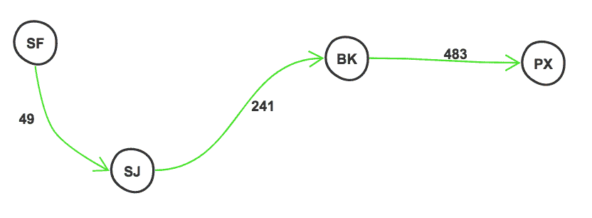
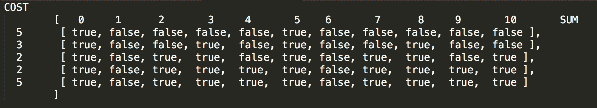
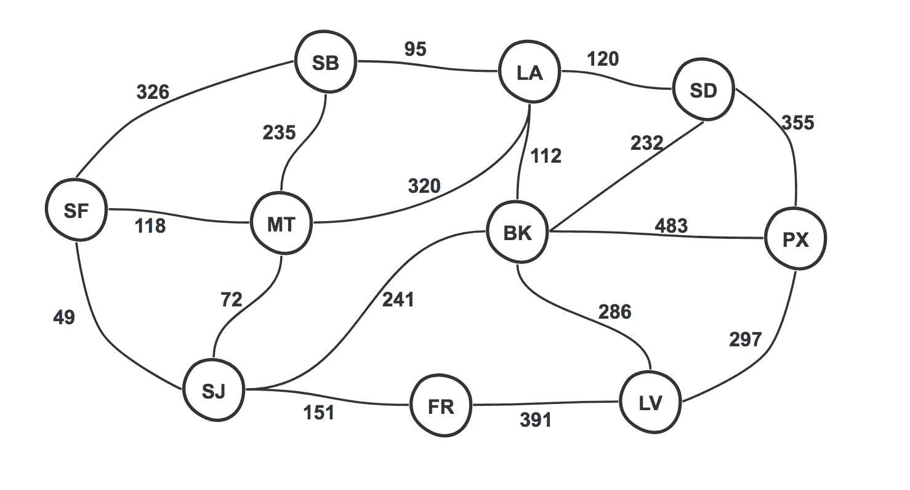
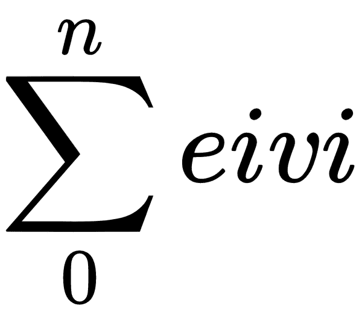
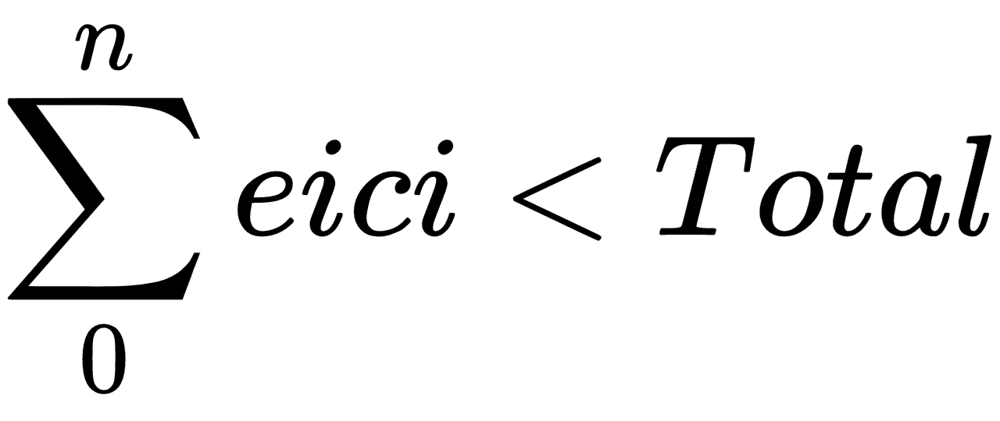

# 探索算法的类型

计算机科学世界中的算法是一组指令，需要有限的空间和时间来执行。它从应用的初始状态开始，然后逐步执行一组指令来实现最终结果。

算法有各种各样的形状和大小，当你把它与算法的过于一般化的定义进行比较时，它们都会符合要求。最大的问题是决定在哪种情况下使用哪种算法，并根据应用的需求进行修改以增强其功能。

正如我在前面章节的用例中所展示的，大多数情况下，现有的算法并不直接适用于手头的问题。这时，对算法的透彻理解就派上了用场。这正是我们在本章将要做的事情；我们将看一看一系列算法，然后借助一些例子来尝试更好地理解它们。

在本章中，我们将通过一些示例讨论以下算法:

*   递归
*   Dijkstra
*   广度优先搜索(BFS)
*   动态规划
*   贪婪算法
*   分支和绑定

在开始查看用例之前，让我们建立一个基本的 Node.js 项目。

# 创建一个节点应用

在这一章中，我们将使用一个非常简单的 Node.js 应用，它将保存我们的示例脚本。这里的主要目标是能够单独运行每个用例，而不是为每个用例拥有一个完整的 web(客户机或服务器)应用。这有助于我们有一个统一的基础项目。

1.  第一步是创建应用的项目文件夹。从终端运行以下命令:

```js
mkdir <project-name>
```

2.  然后，要初始化一个 Node.js 项目，在项目的`root`文件夹中运行`init`命令。这将提示一系列问题生成`package.json` 文件。您可以填写您想要的答案，或者只需点击返回接受提示的默认值:

```js
cd <project-name>
npm init
```

3.  让我们也安装我们喜爱的`lodash`来帮助我们解决一些琐碎的数组和对象操作和实用程序:

```js
npm install --save lodash
```

# 用例

一旦您的项目准备就绪，我们现在可以在项目的根目录中添加必要的脚本，然后独立运行它们。

# 使用递归序列化数据

递归是一种非常流行的**编程范式**，其中一个问题语句可以分解成几个更小的问题，这些问题可以根据其本身来定义。递归通常与**分而治之**、**T5】混淆，后者将问题语句分解为不重叠的子问题，可以同时求解。**

在下一节中，我们将采用一个简单的树，其中我们有一个根元素，后跟一些子元素。我们将序列化这个树数据，然后可以轻松地将其发送到用户界面或保存在数据库中。

让我们首先在我们的项目中创建一个名为`recursion`的文件夹，它是基于前面的部分创建的。然后，我们可以在这个文件夹中创建我们的`serializer.js`文件，它将包含用于序列化树数据的类。

# 伪代码

在实现递归序列化程序之前，让我们用伪代码来表达我们的算法:

```js
INITIALIZE response

FOR each node

    extract child nodes

    add current node info to serialized string

    IF childNodes exist

        repeat process for child nodes

    ELSE

        add ^ to indicate end of the level 

IF rootnode

    return serialized string

ELSE

   add ^ to indicate child node of root

```

# 序列化数据

现在我们已经有了伪代码，序列化的代码变得非常简单，让我们将以下内容添加到序列化程序旁边名为`recursion.js`的文件中:

```js
var _ = require('lodash');

class Recursion {
   constructor(tree) {
      this.tree = tree;
   }

   // serialize method which accepts list of nodes
   serialize(nodes) {
      // initialize response
      this.currentState = this.currentState || '';

      // loop over all nodes
      _.forEach(nodes, (node) => {

         // depth first traversal, extracting nodes at each level
         // traverse one level down
         var childNodes = this.tree[node];

         // add current node to list of serialized nodes
         this.currentState += ` ${node}`;

         // has child nodes
         if (childNodes) {

            // recursively repeat
            this.serialize(childNodes);
         } else {

            // mark as last node, traverse up
            this.currentState += ` ^`;
         }
      });

      // loop complete, traverse one level up
      // unless already at root otherwise return response
      if (!this.isRoot(nodes)) {
         this.currentState += ` ^`;
      } else {
         return this.currentState.trim();
      }
   }

   isRoot(nodes) {
      return _.isEqual(this.tree.root, nodes);
   }
}

module.exports = Recursion;
```

请注意，在前面的代码中，我们根据问题本身来划分问题，我们确定了一个级别需要做什么，然后递归地对所有节点**重复该过程。**现在，要使用这个序列化方法，创建一个`serialization.js`文件，然后向其中添加以下代码:

```js
var fs = require('fs');
var Recursion = require('./recursion');

// set up data
const tree = {
   root: ['A'],
   A: ['B', 'C', 'D'],
   B: ['E', 'F'],
   D: ['G', 'H', 'I', 'J'],
   F: ['K']
};

// initialize
var serializer = new Recursion(tree);

// serialize
var serializedData = serializer.serialize(tree.root);

console.log(serializedData);
```

当我们从项目的根目录用`node recursion/serializer.js`命令运行前面的文件时，我们得到了记录在控制台上的序列化响应:

```js
A B E ^ F K ^ ^ ^ C ^ D G ^ H ^ I ^ J ^ ^ ^
```

从前面的响应中，您可以注意到，基于我们的输入数据集，深度优先方法可以非常明显地看到。`B`是`A`的孩子，`E`是`B`的叶子孩子(用`E`后面的`^`符号表示)。使用递归反序列化这些序列化数据也是一个简单的过程，您可以自己尝试。

# 用迪克斯特拉法确定最短路径

直到前一章，我们只探索了简单的图遍历方式，**广度优先搜索** ( **BFS** )和**深度优先搜索** ( **DFS** )。在前一章中，我们简要讨论了 Dijkstra，以及它如何帮助我们确定图中从节点 **A** 到节点 **B** 的路径，前提是图是有加权边的有向图。

在这个例子中，我们只有这个。我们有一个节点(城市)和边(以英里为单位的近似距离)的图表，我们需要确定用户从给定的开始节点到达目的地节点的最快路径，前提是其他因素，如速度、交通和天气保持不变:


我们的行程从**旧金山** ( **旧金山**)开始，到**凤凰城** ( **PX** )结束。我们已经确定了一些用户可以停车休息或加油的中间城市:**蒙特雷**(**MT**)**圣何塞**(**SJ**)**圣巴巴拉**(**SB**)**洛杉矶**(**LA**)**圣地亚哥** ( **SD** )到这些城市中的每一个的距离由与城市之间的每一条边相关联的权重来指示。

# 伪代码

让我们看看实现迪克斯特拉算法的伪代码:

```js
INITIALIZE Costs, Previous Paths, Visited Nodes

ADD each neighbor of start node to Previous Paths

GET cheapest node from start node and set as current node

WHILE node exists

    GET cost of current node from costs

    GET neighbors of current node

    FOREACH neighbor

        ADD cost of neighbor to current nodes cost as new cost

        IF cost of neighbor not recorded OR cost of 
            neighbor is the lowest amongst all neighbors

            SET cost of neighbor as new cost

            SET the path of neighbor as current node

    MARK current node as visited

    GET cheapest node from start node and set as current node

INITIALIZE response

BACKTRACK path from end to start

RETURN distance and path    
```

# 实现迪克斯特拉算法

让我们基于上一节描述的伪代码来分解 Dijkstra 算法的实现。第一步是初始化所有的变量。我们将使用一个来跟踪通过每个节点的成本，一个用于跟踪我们正在走的路径，另一个用于跟踪已经访问过的节点，以避免重新计算:

```js
var _ = require('lodash');

class Dijkstra {
   solve (graph, start, end) {

      // track costs of each node
      const costs = graph[start];

      // set end to infinite on 1st pass
      costs[end] = Infinity;

      // remember path from
      // which each node was visited
      const paths = {};

      // add path for the start nodes neighbors
      _.forEach(graph[start], (dist, city) => {
         // e.g. city SJ was visited from city SF
         paths[city] = start;
      });

      // track nodes that have already been visited nodes
      const visitedNodes = [];

      ....
```

我们这里的`solve()`方法已经用开始节点的`cost`初始化了`costs`，然后将结束节点`cost`设置为`Infinity`，因为还没有计算。这意味着在开始时，`costs` `set`将包含与节点和边完全相同的数据，从开始节点开始。

我们还相应地计算了路径，例如，由于我们在示例中从`SF`开始，节点— `SJ`、`MT`和`SB`都是从节点`SF`到达的。下面的代码解释了我们如何在每个节点提取最低成本:

```js
...

// track nodes that have already been visited nodes
const visitedNodes = [];

// get current nodes cheapest neighbor
let currentCheapestNode = this.getNextLowestCostUnvisitedNode(costs, visitedNodes);

// while node exists
while (currentCheapestNode) {

   // get cost of reaching current cheapest node
   let costToReachCurrentNode = costs[currentCheapestNode];

   // access neighbors of current cheapest node
   let neighbors = graph[currentCheapestNode];

   // loop over neighbors
   _.forEach(neighbors, (dist, neighbor) => {

      // generate new cost to reach each neighbor
      let newCost = costToReachCurrentNode + dist;

      // if not already added
      // or if it is lowest cost amongst the neighbors
      if (!costs[neighbor] || costs[neighbor] > newCost) {

         // add cost to list of costs
         costs[neighbor] = newCost;

         // add to paths
         paths[neighbor] = currentCheapestNode;

      }

   });

   // mark as visited
   visitedNodes.push(currentCheapestNode);

   // get cheapest node for next node
   currentCheapestNode = this.getNextLowestCostUnvisitedNode(costs, visitedNodes);
}

...
```

这可能是代码中最重要的部分；我们基于`costs`和`visitedNodes`数组计算`currentCheapestNode`，第一次迭代的值将是`SJ`，正如我们从前面的图中看到的。

一旦我们有了第一个节点，我们就可以访问它的邻居，并且只有当它的`costs`小于该节点的当前`cost`时，才更新到达这些邻居的`costs`。此外，如果成本较低，我们希望通过该节点到达末端节点也是合乎逻辑的，因此我们也更新了到该邻居的路径。然后，我们在标记被访问的节点后递归地重复这个过程。在所有迭代结束时，我们将得到所有节点的更新成本，从而得到到达一个节点的最终成本:

```js
....

        // get cheapest node for next node
          currentCheapestNode = 
          this.getNextLowestCostUnvisitedNode(costs, visitedNodes);
       }

       // generate response
       let finalPath = [];

       // recursively go to the start
       let previousNode = paths[end];

       while (previousNode) {
          finalPath.unshift(previousNode);
          previousNode = paths[previousNode];
       }

       // add end node at the end
       finalPath.push(end);

       // return response
       return {
          distance: costs[end],
          path: finalPath
       };
    }

    getNextLowestCostUnvisitedNode(costs, visitedNodes) {
       //extract the costs of all non visited nodes
       costs = _.omit(costs, visitedNodes);

       // return the node with minimum cost
       return _.minBy(_.keys(costs), (node) => {
          return costs[node];
       });
    }
}

module.exports = Dijkstra;
```

一旦生成了所有节点的`costs`，我们将简单地回溯到达端节点所采取的步骤，并且我们可以返回端节点的成本和到达端节点所采取的路径。最后增加了获取成本最低的未访问节点的效用方法。

现在，为了使用这个类，我们可以在`dijkstra`文件夹下创建一个名为`shortest-path.js`的文件以及我们刚刚创建的`dijkstra.js`类:

```js
var Dijkstra = require('./dijkstra');

const graph = {
   'SF': { 'SB': 326, 'MT': 118, 'SJ': 49 },
   'SJ': { 'MT': 72, 'FR': 151, 'BK': 241 },
   'MT': { 'SB': 235, 'LA': 320 },
   'SB': { 'LA': 95 },
   'LA': { 'SD': 120 },
   'SD': { 'PX': 355 },
   'FR': { 'LV': 391 },
   'BK': { 'LA': 112, 'SD': 232, 'PX': 483, 'LV': 286 },
   'LV': { 'PX': 297 },
   'PX': {}
};

console.log(new Dijkstra().solve(graph, 'SF', 'PX'));
```

现在，要运行该文件，只需运行以下命令:

```js
node dijkstra/shortest-path.js 
```

前面的命令记录了以下代码:

```js
{ distance: 773, path: [ 'SF', 'SJ', 'BK', 'PX' ] } 
```

当基于原始图示进行可视化时，会如下所示:



# 用 BFS 来确定关系

好吧，不是听起来的那样。我们并没有走上一条浪漫的道路，在这条道路上，我们互相问对方这个难题。然而，我们谈论的是一个简单的图，例如，一个家谱(是的，树是图的形式)。在这个例子中，我们将使用 BFS 来确定两个节点之间的最短路径，然后可以建立这两个节点之间的关系。

让我们首先设置测试数据，以便准备好输入图形:


从上图可以注意到，我们有一个小家庭，其中的节点`A`、`E`和`F`是兄弟姐妹。`A`与`B`结婚，节点`C`和`D`为子女。节点`G`是节点`F`的子节点。这里没有什么复杂或不寻常的。我们将使用这些数据来确定节点`C`和`G`之间的关系。你当然可以看着图表自己告诉它，但这现在不好玩了，是吗？

现在让我们将它转换成我们的程序能够理解的格式:

```js
[
  {
    "name": "A",
    "connections": [
      {
        "name": "E",
        "relation": "Brother"
      },
      {
        "name": "F",
        "relation": "Sister"
      },
      {
        "name": "B",
        "relation": "Wife"
      },
      {
        "name": "D",
        "relation": "Son"
      },
      {
        "name": "C",
        "relation": "Daughter"
      }
    ]
  },
  {
    "name": "B",
    "connections": [
      {
        "name": "A",
        "relation": "Husband"
      },
      {
        "name": "D",
        "relation": "Son"
      },
      {
        "name": "C",
        "relation": "Daughter"
      }
    ]
  },
  {
    "name": "C",
    "connections": [
      {
        "name": "A",
        "relation": "Father"
      },
      {
        "name": "B",
        "relation": "Mother"
      },
      {
        "name": "D",
        "relation": "Brother"
      }
    ]
  },
  {
    "name": "D",
    "connections": [
      {
        "name": "A",
        "relation": "Father"
      },
      {
        "name": "B",
        "relation": "Mother"
      },
      {
        "name": "C",
        "relation": "Sister"
      }
    ]
  },
  {
    "name": "E",
    "connections": [
      {
        "name": "A",
        "relation": "Brother"
      },
      {
        "name": "F",
        "relation": "Sister"
      }
    ]
  },
  {
    "name": "F",
    "connections": [
      {
        "name": "E",
        "relation": "Brother"
      },
      {
        "name": "A",
        "relation": "Brother"
      },
      {
        "name": "G",
        "relation": "Son"
      }
    ]
  },
  {
    "name": "G",
    "connections": [
      {
        "name": "F",
        "relation": "Mother"
      }
    ]
  }
]
```

很快就变得复杂了，不是吗？这对于您想要建立关系的节点(即，带标签的边)来说是一个挑战。让我们将这些数据添加到`family.json`文件中，然后查看 BFS 的伪代码，以便在实现之前更好地理解它。

# 伪代码

BFS 的伪代码与 DFS 非常相似，主要区别在于，在 BFS，我们先遍历所有连接的节点，然后再移动到另一个层次寻找目标节点:

```js
INITIALIZE paths, nodes to visit (queue), visited nodes

SET start node as visited

WHILE nodes to visit exist

    GET the next node to visit as current node from top of queue

    IF current node is target

        INITIALIZE result with target node

        WHILE path retrieval not at source

            EXTRACT how we got to this node

            PUSH to result

        FORMAT and return relationship

    ELSE

        LOOP over the entire graph

            IF node is connected to current node

                SET its path as current node

                MARK node as visited

                PUSH it to queue for visiting breadth wise

RETURN Null that is no result

```

听起来很像我们用 DFS 处理的另一个例子，不是吗？这是因为英国外交部和 BFS 在处理问题的方式上非常相似。两者之间的细微差别在于，我们在 BFS 再扩展一层之前评估所有连接的节点，而在 DFS 的情况下，我们选择一个连接的节点，然后遍历它直到整个深度。

# 实施 BFS

为了实现前面讨论的伪代码，我们将首先稍微简化一下我们的数据。有两种方法可以做到这一点，如下所示:

1.  创建图形数据的邻接矩阵，将图形表示为大小为 *m x m* 的二维数组，由 1 和 0 组成。 *1s* 表示 *mrow* 节点与*MC column*和 *0s* 之间没有连接。
2.  我们简化数据集，仅将节点提取为一个映射，其中键是节点，值是与其连接的节点列表。

虽然这两种方法都是解决问题的好方法，但第一种方法通常是首选的，而且很受欢迎，因为第二种方法的代码复杂度更高，因为它会带来集合和列表的开销。

然而，现在，我们不需要担心代码的复杂性，因为我们想得到最简单的解决方案，所以我们将选择第二个选项。

首先，我们将简化输入数据，以便将转换后的输入传递到我们将要创建的 BFS 算法中:

```js
var _ = require('lodash');
var BFS = require('./bfs');
var familyNodes = require('./family.json');

// transform familyNodes into shorter format for simplified BFS
var transformedFamilyNodes = _.transform(familyNodes, (reduced, currentNode) => {

      reduced[currentNode.name] = _.map(currentNode.relations, 'name');

      return reduced;
}, {});
```

这基本上将`transformedFamilyNodes`设置为前面描述的结构，在我们的例子中，它看起来如下:

```js
{ 
    A: [ 'E', 'F', 'B', 'D', 'C' ],
    B: [ 'A', 'D', 'C' ],
    C: [ 'A', 'B', 'D' ],
    D: [ 'A', 'B', 'C' ],
    E: [ 'A', 'F' ],
    F: [ 'E', 'A', 'G' ],
    G: [ 'F' ] 
}
```

然后，我们为 BFS 搜索创建类，然后添加一个方法来实现搜索功能:

```js
var _ = require('lodash');

class BFS {

   constructor(familyNodes) {
      this.familyNodes = familyNodes;
   }

   search (graph, startNode, targetNode) {

   }

}

module.exports = BFS;
```

我们在构造函数中接受原始族节点的列表，然后在我们的搜索方法中接受修改后的图，我们将对其进行迭代。那么，为什么我们需要原始的家庭节点呢？因为一旦我们提取了从一个节点到另一个节点的路径，我们就需要建立它们之间的关系，这种关系被记录在原始的未处理的家族节点上。

我们将继续执行`search()`方法:

```js
search (graph, startNode, targetNode) {
   // initialize the path to traverse
   var travelledPath = [];

   // mark the nodes that need to be visited breadthwise
   var nodesToVisit = [];

   // mark all visited nodes
   var visitedNodes = {};

   // current node being visited
   var currentNode;

   // add start node to the to be visited path
   nodesToVisit.push(startNode);

   // mark starting node as visited node
   visitedNodes[startNode] = true;

   // while there are more nodes to go
   while (nodesToVisit.length) {

      // get the first one in the list to visit
      currentNode = nodesToVisit.shift();

      // if it is the target
      if (_.isEqual(currentNode, targetNode)) {

         // add to result, backtrack steps based on path taken
         var result = [targetNode];

         // while target is not source
         while (!_.isEqual(targetNode, startNode)) {

            // extract how we got to this node
            targetNode = travelledPath[targetNode];

            // add it to result
            result.push(targetNode);
         }

         // extract the relationships between the edges and return
         // value
         return this.getRelationBetweenNodes(result.reverse());
      }

      // if result not found, set the next node to visit by traversing
      // breadth first
      _.forOwn(graph, (connections, name) => {

         // if not current node, is connected to current node 
         // and not already visited
         if (!_.isEqual(name, currentNode)
            && _.includes(graph[name], currentNode)
            && !visitedNodes[name]) {

            // we will be visiting the new node from current node
            travelledPath[name] = currentNode;

            // set the visited flag
            visitedNodes[name] = true;

            // push to nodes to visit
            nodesToVisit.push(name);
         }
      });
   }

   // nothing found
   return null;
}
```

这是快速和无痛的。如果您注意到了，我们正在调用`getRelationBetweenNodes`，它基于`familyNodes`提取节点之间的关系，一旦确定了两个节点之间的路径，这些关系就会被传递到构造函数中。这将提取每个节点与以下节点的关系:

```js
getRelationBetweenNodes(relationship) {
   // extract start and end from result
   var start = relationship.shift();
   var end = relationship.pop();

   // initialize loop variables
   var relation = '';
   var current = start;
   var next;
   var relationWithNext;

   // while end not found
   while (current != end) {
      // extract the current node and its relationships
      current = _.find(this.familyNodes, { name: current });

      // extract the next node, if nothing then set to end node
      next = relationship.shift() || end;

      // extract relationship between the current and the next node
      relationWithNext = _.find(current.relations, {name : next });

      // add it to the relation with proper grammar
      relation += `${relationWithNext.relation}${next === end ? '' : 
      '\'s'} `;

      // set next to current for next iteration
      current = next;
   }

   // return result
   return `${start}'s ${relation}is ${end}`;
}
```

现在我们已经准备好了类，我们准备通过调用`node bfs/relations.js`来调用它:

```js
var _ = require('lodash');
var BFS = require('./bfs');
var familyNodes = require('./family.json');

// transform familyNodes into shorter format for simplified BFS
var transformedFamilyNodes = _.transform(familyNodes, (reduced, currentNode) => {

      reduced[currentNode.name] = _.map(currentNode.relations, 'name');

      return reduced;
}, {});

var relationship = new BFS(familyNodes).search(transformedFamilyNodes, 'C', 'G');

console.log(relationship);
```

上述代码记录了以下内容:

```js
C's Father's Sister's Son is G

```

根据最初的图示，这可以直观地表示如下:


# 用动态规划构建财务规划师

**动态规划** ( **DP** )是解决某类问题非常常见且强大的方法。这些问题以这样的方式出现，即主要问题可以分成子问题，子问题可以进一步分解成更小的问题，其间有一些重叠。

由于它们的相似性，DP 经常与递归混淆。动态规划问题只是一种类型的问题，而递归是这类问题的解决方案的一部分。我们可以通过两种主要方式来解决这些问题:

*   将问题分解为子问题:如果子问题已经解决，则返回保存的解决方案，否则在返回之前解决并保存解决方案。这也被称为**记忆**。这也称为自上而下的方法。
*   把问题分解为子问题:从解决最小的子问题开始，向上努力。这种方法被称为**自下而上**方法。

在这个例子中，我们有一个用户拥有的一系列费用；我们需要根据用户设定的总数向用户提供所有可能的结果。我们希望用户能够选择他们喜欢的选项，因此我们将采用自下而上的方法。首先，让我们分解输入数据，然后从伪代码中推导出代码:

```js
let expenses = [
   {
      type: 'rent',
      cost: 5
   },
   {
      type: 'food',
      cost: 3
   },
   {
      type: 'entertainment',
      cost: 2
   },
   {
      type: 'car and gas',
      cost: 2
   },
   {
      type: 'ski-trip',
      cost: 5
   }
];

let total = 10;
```

您可以从前面的代码中注意到，为了简单和代码效率，示例输入数据已经过规范化。一旦我们有了这个设置，我们就可以创建我们的伪代码来理解算法。

# 伪代码

在本例中，对于这种类型的问题，我们将创建一个二维数组，其中一维(y)表示元素的值(即每个费用的成本:5、3、2、2 和 5)，另一维(x)表示递增的总成本(即 0 到 10)。这就是为什么我们在第一步标准化我们的数据——这有助于我们保持阵列的小尺寸。

一旦我们有了数组，我们将分配每个数组位置——`arr[i][j]`——如果任何一个`0 to i`成本可以在任何一点产生`j`和，那么它就是真的，否则它就是假的:

```js
CREATE empty 2d array with based on input data

IF expected total 0, any element can achieve this, so set [i][0] to true

IF cost of first row is less than total, set [0][cost] to true

LOOP over each row from the second row

    LOOP over each column

        IF current row cost is less than the current column total

            COPY from the row above, the value of the current column if
            it is true
                or else offset the column by current rows cost

        ELSE

            Copy value from the row above for the same column

IF last element of the array is empty

   No results found

generate_possible_outcomes()

FUNCTION generate_possible_outcomes

    IF reached the end and sum is non 0

       ADD cost as an option and return options

    IF reached the end and sum is 0

        return option

    IF sum can be derived without current row cost

        generate_possible_outcomes() from the previous row

    IF sum cannot be derived without current row

        ADD current row as an option

        generate_possible_outcomes() from the previous row
```

请注意，在前面的代码中，算法非常简单；我们只是将问题分解成更小的子问题，并试图回答每个子问题的问题，同时努力解决更大的问题。一旦我们完成了数组的构造，我们就从数组的最后一个单元格开始，然后遍历，并根据当前单元格是否为真，向所采用的路径添加一个单元格。一旦我们到达`0`的总数，即第一列，递归过程就停止了。

# 动态规划算法的实现

现在我们理解了方法，让我们首先为我们的算法创建类，并添加`analyze()`方法，该方法将在生成算法之前首先创建 2D 数组。

当类被初始化时，我们将构造我们的 2D 数组，其中的所有值都设置为`false`。然后，我们将使用这个 2D 阵列，并根据我们的条件更新其中的一些值，我们将很快讨论这些值:

```js
var _ = require('lodash');

class Planner {

   constructor(rows, cols) {
      // create a 2d array of rows x cols
      // all with value false
      this.planner = _.range(rows).map(() => {
         return _.range(cols + 1).map(()=> false);
      });

      // holds the response
      this.outcomes = [];
   }
}

module.exports = Planner;
```

现在，我们可以实现`analyze()`方法，它将在 2D 阵列的每个单元中设置适当的值。

首先，我们将设置第一列的值，然后设置第一行的值:

```js
analyze(expenses, sum) {
   // get size of expenses
   const size = _.size(expenses);

   // if sum 0, result can be done with 0 elements so
   // set col 0 of all rows as true
   _.times(size, (i)=> {
      this.planner[i] = this.planner[i] || [];
      this.planner[i][0] = true;
   });

   // for the first row, if the first cost in the expenses
   // is less than the requested total, set its column value
   // to true
   if(expenses[0].cost <= sum) {
      this.planner[0][expenses[0].cost] = true;
   }

```

尽管第一列全部为真，但另一方面，第一行的单元格只有在与该行相关联的成本小于总和时才为真，也就是说，我们只能用一个元素构建请求的总和。接下来，我们获取已填充的行和列，并使用它们构建数组的其余部分:

```js
   // start from row #2 and loop over all other rows
   for(let i = 1; i < size; i++) {

      // take each column
      _.times(sum + 1, (j) => {

         // if the expenses cost for the current row
         // is less than or equal to the sum assigned to the
         // current column
         if (expenses[i].cost <= j) {

            // copy value from above row in the same column if true
            // else look at the value offset by the current rows cost
            this.planner[i][j] =  this.planner[i - 1][j] 
                                || this.planner[i - 1][j -
                                expenses[i].cost];
         } else {
            // copy value from above row in the same column
            this.planner[i][j] =  this.planner[i - 1][j];
         }
      });
   }

   // no results found
   if (!this.planner[size - 1][sum]) {
      return [];
   }

   // generate the outcomes from the results found
   this.generateOutcomes(expenses, size - 1, sum, []);

   return this.outcomes;
}
```

接下来，我们可以实现`generateOutcomes()`方法，这将允许我们递归地捕获可能的路径。当我们列出我们的 2D 阵列，看看生成的阵列是什么样子时，如下所示:



在前面的截图中可以看到`0`(即总和`0`)一栏全部为`true`，对于`0`(成本`5`)一行，唯一其他所有值都为真的一栏为第 5 栏(即总和`5`)。

现在进入下一行，我们来逐一分析一下数值，比如在那个阶段，成本`5`和`3`(取自当前行及其上一行的成本)加起来不能给出`1`或`2`的成本，但是可以给出`3`、`5`和`8`，所以只有它们是`true`，其余的是`false`。

现在，转到下一行的每一行，如果它为真，我们可以尝试从上面的行导入值，如果不是，则从列总和中减去当前行的成本，并检查上面行的列是否为真。这使我们能够确定总和是否由较早的子集确定。

例如，在行`3`列`1`中，我们只是从父行导入(记住列`0`始终是`true`)。当我们到达列`2`时，我们看到父行的列`2`是`false`，所以我们用当前的行成本(`2`)来抵消这个列总和(`2`)，所以我们以行`2`列`0`结束，这是`true.`，因此我们给行`2`列`2`分配一个值`true`，然后我们继续下一列的这个过程直到结束。

一旦构造了整个数组，我们将需要从最末端开始，在这种情况下是`array[4][10]`，并且递归地向上遍历，直到我们到达`0`的和或者到达具有非零和的顶部:

```js
generateOutcomes(expenses, i, sum, p) {
   // reached the end and the sum is non zero
   if(i === 0 && sum !== 0 && this.planner[0][sum]) {
      p.push(expenses[i]);
      this.outcomes.push(_.cloneDeep(p));
      p = [];
      return;
   }

   // reached the end and the sum is zero
   // i.e. reached the origin
   if(i === 0 && sum === 0) {
      this.outcomes.push(_.cloneDeep(p));
      p = [];
      return;
   }

   // if the sum can be generated
   // even without the current value
   if(this.planner[i - 1][sum]) {
      this.generateOutcomes(expenses, i - 1, sum, _.cloneDeep(p));
   }

   // if the sum can be derived
   // only by including the the current value
   if(sum >= expenses[i].cost && this.planner[i - 1][sum -
   expenses[i].cost]) {
      p.push(expenses[i]);
      this.generateOutcomes(expenses, i - 1, sum - expenses[i].cost,
      p);
   }
}
```

现在，这可以在我们的规划器中使用，以生成可供用户选择的选项列表:

```js
var Planner = require('./dp');

let expenses = [
   {
      type: 'rent',
      cost: 5
   },
   {
      type: 'food',
      cost: 3
   },
   {
      type: 'entertainment',
      cost: 2
   },
   {
      type: 'car and gas',
      cost: 2
   },
   {
      type: 'ski-trip',
      cost: 5
   }
];
let total = 10;

var options = new Planner(expenses.length, total).analyze(expenses, total);

console.log(options);
```

运行前面的代码记录了符合我们预算的不同组合，结果是:

```js
[ 
    [ { type: 'entertainment', cost: 2 },
      { type: 'food', cost: 3 },
      { type: 'rent', cost: 5 } 
    ],
    [ { type: 'car and gas', cost: 2 },
      { type: 'food', cost: 3 },
      { type: 'rent', cost: 5 } 
    ],
    [ { type: 'ski-trip', cost: 5 }, 
      { type: 'rent', cost: 5 } 
    ],
    [ { type: 'ski-trip', cost: 5 },
      { type: 'entertainment', cost: 2 },
      { type: 'food', cost: 3 } 
    ],
    [ { type: 'ski-trip', cost: 5 },
      { type: 'car and gas', cost: 2 },
      { type: 'food', cost: 3 } 
    ] 
]
```

# 用贪婪算法建立旅行路线

贪婪算法是一种将问题分解成更小的子问题，并在每一步基于局部优化选择拼凑出每个子问题的解决方案的算法。这意味着，例如，在加权边图的情况下，下一个节点是根据从当前节点出发的最小成本来选择的。这可能不是最好的选择，但是，在贪婪算法的情况下，得到一个解决方案是主要目标，而不是得到完美或理想的解决方案。

在这个用例中，我们有一组城市以及与前往这些城市相关的权重*(旅行/住宿成本+享受系数等等)*。目的是想出一个我们想去旅行和参观这些城市的方法，这样旅行才完整和有趣。当然，对于给定的一组城市，你可以通过多种可能的方式前往它们，但这并不能保证路径会得到优化。为了解决这个问题，我们将使用 Kruskal 的最小生成树算法，这是一种贪婪算法，将为我们生成最佳可能的解决方案。图中的生成树是指所有节点都是连接的，并且节点之间没有循环。

让我们假设我们的输入数据是以下格式，这与我们在前面的 Dijkstra 示例中看到的相同，只是我们没有定义节点之间的任何方向，允许我们从任何一个方向行进:



该数据可以通过编程方式编写如下:

```js
const graph = {
   'SF': { 'SB': 326, 'MT': 118, 'SJ': 49 },
   'SJ': { 'MT': 72, 'FR': 151, 'BK': 241 },
   'MT': { 'SB': 235, 'LA': 320 },
   'SB': { 'LA': 95 },
   'LA': { 'SD': 120 },
   'SD': { 'PX': 355 },
   'FR': { 'LV': 391 },
   'BK': { 'LA': 112, 'SD': 232, 'PX': 483, 'LV': 286 },
   'LV': { 'PX': 297 },
   'PX': {}
};
```

根据这些信息，我们可以提取独特的边缘，如下所示:

```js
[ 
  { from: 'SF', to: 'SB', weight: 326 },
  { from: 'SF', to: 'MT', weight: 118 },
  { from: 'SF', to: 'SJ', weight: 49 },
  { from: 'SJ', to: 'MT', weight: 72 },
  { from: 'SJ', to: 'FR', weight: 151 },
  { from: 'SJ', to: 'BK', weight: 241 },
  { from: 'MT', to: 'SB', weight: 235 },
  { from: 'MT', to: 'LA', weight: 320 },
  { from: 'SB', to: 'LA', weight: 95 },
  { from: 'LA', to: 'SD', weight: 120 },
  { from: 'SD', to: 'PX', weight: 355 },
  { from: 'FR', to: 'LV', weight: 391 },
  { from: 'BK', to: 'LA', weight: 112 },
  { from: 'BK', to: 'SD', weight: 232 },
  { from: 'BK', to: 'PX', weight: 483 },
  { from: 'BK', to: 'LV', weight: 286 },
  { from: 'LV', to: 'PX', weight: 297 } 
]
```

# 理解生成树

在我们继续实现伪代码和代码之前，让我们花一些时间来了解什么是生成树，以及我们如何使用它们来简化前面提到的问题。

图中的生成树是一系列边，这些边可以连接所有的节点，而没有任何循环。这么说，很明显，对于任何给定的图，都可以有多个生成树。就我们的例子而言，现在我们想要生成**最小生成树** ( **MST** )也就是组合边权重最小的生成树就更有意义了。

但是，我们如何生成生成树并确保它具有最小值呢？解决办法虽然不太明显，但很简单。让我们探索伪代码的方法。

# 伪代码

现在手头的问题归结为以下几点——用最小权边和无圈连接我们的图的所有节点。为了实现这一点，首先，我们需要隔离所有的边，并按权重以递增的顺序进行排序。然后，我们使用一种称为`union by rank`的技术来获得最终的边列表，该列表可用于创建 MST:

```js
SORT all edges by weight in increasing order

DIVIDE all nodes into their own subsets whose parent is the node iteself

WHILE more edges are required

    EXTRACT the first edge from the list of edges

    FIND the parent nodes of the from and to nodes of that edge

    IF start and end nodes do not have same parent

        ADD edge to results

        GET parent of from node and to node

        IF parent nodes of from and to are the same rank

            SET one node as the parent of the other and increment rank 
            of parent

        ELSE

            SET parent of element with lesser rank            

RETURN Results
```

在`find()`方法中，我们将执行一个名为路径压缩的小优化。听起来很花哨，但实际上不是。假设我们处于一个节点`A`，其父节点为`B`，其父节点为`C`。当我们试图确定这一点时，我们只解析整个路径一次，下一次，我们记住节点`A`的父节点最终是节点`C`。我们的方法也相对简单——每次我们遍历树寻找一个节点时，我们都会更新它的`parent`属性:

```js
FIND_PARENT(all_subsets, currentNode)

    IF parent of currentNode is NOT currentNode

        FIND_PARENT(all_subsets, currentNode.parent)

    RETURN currentNode.parent
```

# 用贪婪算法实现最小生成树

到目前为止，我们已经如前所述建立了数据集。现在，我们将根据该数据生成边，然后将其传递给我们的生成树类来生成 MST。因此，让我们将以下代码添加到`greeds/travel.js`中:

```js
const _ = require('lodash');
const MST = require('./mst');

const graph = {
   'SF': { 'SB': 326, 'MT': 118, 'SJ': 49 },
   'SJ': { 'MT': 72, 'FR': 151, 'BK': 241 },
   'MT': { 'SB': 235, 'LA': 320 },
   'SB': { 'LA': 95 },
   'LA': { 'SD': 120 },
   'SD': { 'PX': 355 },
   'FR': { 'LV': 391 },
   'BK': { 'LA': 112, 'SD': 232, 'PX': 483, 'LV': 286 },
   'LV': { 'PX': 297 },
   'PX': {}
};

const edges= [];

_.forEach(graph, (values, node) => {
   _.forEach(values, (weight, city) => {
      edges.push({
         from: node,
         to: city,
         weight: weight
      });
   });
});

var mst = new MST(edges, _.keys(graph)).getNodes();

console.log(mst);
```

我们的 MST 类可以添加到`greedy/mst.js`中，如下所示:

```js
const _ = require('lodash');

class MST {

   constructor(edges, vertices) {
      this.edges = _.sortBy(edges, 'weight');
      this.vertices = vertices;
   }

   getNodes () {
      let result = [];

      // subsets to track the parents and ranks
      var subsets = {};

      // split each vertex into its own subset
      // with each of them initially pointing to themselves
      _.each(this.vertices, (val)=> {
         subsets[val] = {
            parent: val,
            rank: 0
         };
      });

      // loop over each until the size of the results
      // is 1 less than the number of vertices
      while(!_.isEqual(_.size(result), _.size(this.vertices) - 1)) {

         // get next edge
         var selectedEdge = this.edges.shift();

         // find parent of start and end nodes of selected edge
         var x = this.find(subsets, selectedEdge.from);
         var y = this.find(subsets, selectedEdge.to);

         // if the parents nodes are not the same then
         // the nodes belong to different subsets and can be merged
         if (!_.isEqual(x, y)) {

            // add to result
            result.push(selectedEdge);

            // push is resultant tree as new nodes
            this.union(subsets, x, y);
         }
      }

      return result;
   }

   // find parent with path compression
   find(subsets, i) {
      let subset = subsets[i];

      // until the parent is not itself, keep updating the
      // parent of the current node
      if (subset.parent != i) {
         subset.parent = this.find(subsets, subset.parent);
      }

      return subset.parent;
   }

   // union by rank
   union(subsets, x, y) {
      // get the root nodes of each of the nodes
      let xRoot  = this.find(subsets, x);

      let yRoot  = this.find(subsets, y);

      // ranks equal so it doesnt matter which is the parent of which
      node
      if (_.isEqual(subsets[xRoot].rank, subsets[yRoot].rank)) {

         subsets[yRoot].parent = xRoot;

         subsets[xRoot].rank++;

      } else {
         // compare ranks and set parent of the subset
         if(subsets[xRoot].rank < subsets[yRoot].rank) {

            subsets[xRoot].parent = yRoot;
         } else {

            subsets[yRoot].parent = xRoot;
         }
      }
   }

}

module.exports = MST;
```

运行前面的代码将记录边缘，如下所示:

```js
[ { from: 'SF', to: 'SJ', weight: 49 },
  { from: 'SJ', to: 'MT', weight: 72 },
  { from: 'SB', to: 'LA', weight: 95 },
  { from: 'BK', to: 'LA', weight: 112 },
  { from: 'LA', to: 'SD', weight: 120 },
  { from: 'SJ', to: 'FR', weight: 151 },
  { from: 'MT', to: 'SB', weight: 235 },
  { from: 'BK', to: 'LV', weight: 286 },
  { from: 'LV', to: 'PX', weight: 297 } ]
```

连接后，这些路径将如下所示:


# 使用分支定界算法创建自定义购物清单

分支定界算法应用于一组涉及组合优化的问题。这意味着，我们手头可能有一个问题，不一定有一个正确的解决方案，但有了我们掌握的信息，我们将需要从有限但非常多的可用解决方案中产生最佳的可能解决方案。

我们将使用分支定界算法来优化和解决一类特殊的动态规划问题，即 0/1 背包问题。在这种情况下，考虑我们有一个购物清单，其中我们有一个项目列表，它们的成本以美元为单位，它们对您的重要性(价值)从 0 到 10 不等。例如，考虑以下示例列表:

```js
const list = [
   {
      name: 'vegetables',
      value: 12,
      cost: 4
   },
   {
      name: 'candy',
      value: 1,
      cost: 1
   },
   {
      name: 'magazines',
      value: 4,
      cost: 2
   },
   {
      name: 'dvd',
      value: 6,
      cost: 2
   },
   {
      name: 'earphones',
      value: 6,
      cost: 3
   },
   {
      name: 'shoes',
      value: 4,
      cost: 2
   },
   {
      name: 'supplies',
      value: 9,
      cost: 3
   }
];
```

给定清单，我们现在需要找到最佳的可能组合，在给定固定预算(例如，10 美元)的情况下实现价值最大化。这个算法被称为 0/1 背包，因为你能做的决定只有一个二进制数，即要么拿走一个物品，要么扔掉它。

现在，让我们试着从数学的角度来理解问题陈述是什么。我们希望在不超出预算的情况下实现价值最大化，因此，如果我们假设我们有`e<sub>1</sub>, e<sub>2</sub>, e<sub>3</sub>`等直到`e<sub>n</sub>`元素，并且知道这些元素中的每一个都可以被挑选(这将为其分配值 1)或不被挑选(这将为其分配值 0)，以确定总价值，我们可以将其表述如下:



在我们努力保持价值最大化的同时，我们也希望总成本低于预算:



好的，很好，现在我们知道问题了，但是有什么解决办法呢？因为我们知道该值总是 0 或 1，所以我们可以创建一个二叉树来表示我们的解决方案的状态空间，然后在每个节点为每个可能性布局一个分支；例如，在我们的例子中，我们将有 *2* <sup>*n*</sup> 种可能性(n = 7)，总共是 128 种。现在，研究 128 种可能性中的每一种听起来都不是很理想，我们可以注意到这个数字将呈指数级增长。

# 理解分支定界算法

在编写伪代码之前，让我们分解解决方案，以便更好地理解。我们要做的是创建一个二叉树，在树的每一层，我们要分配到达该节点的成本、节点的值以及到达该节点所需成本的上限。

然而，我们如何计算树的上限呢？为了确定这一点，让我们首先将问题分解成更小的部分:

```js
const costs = [4, 1, 2, 2, 3, 2, 3];
const value = [12, 1, 4, 6, 6, 4, 9];
const v2c = [12/4, 1/1, 4/2, 6/2, 6/3, 4/2, 9/3];
const maxCost = 10
```

一旦我们有了这些，我们将按照价值与成本比率的递减顺序重新排列我们的元素，因为我们希望选择价值最高、成本最低的元素:

```js
const costs = [4, 2, 3, 3, 2, 2, 1];
const value = [12, 6, 9, 6, 4, 4, 1];
const v2c = [3, 3, 3, 2, 2, 2, 1];
const maxCost = 10;
```

为了确定上限，我们现在将使用贪婪算法(元素以降序排列)，其中我们将允许小数值获得最高可能的上限。

那么，我们来挑选明显的第一个元素，它的值为`12`，成本为`4`，那么这一步的总价值上限为`12`，总成本为`4`，小于最大值，即`10`。然后，我们继续下一个元素，此时上限变为 *12+6=18* ，成本为 *4+2 = 6* ，仍然小于`10`。然后，我们选择下一个，这使得值的上限为 *18+9=27* ，成本为 *6+3=9* 。如果我们取成本为`3`的下一个要素，我们将超过最大成本，所以我们将分数地取它，即*(项目的剩余成本/成本)*等于(1/3)*6* 的项目值，即`2`。所以，根元素的上限是 *27+2 = 29* 。

所以，我们现在可以说，在给定的约束条件下，比如成本和价值，我们可以得到的上界值是`29`。现在我们已经有了这个值的上限，我们可以用这个上限值为我们的二叉树创建一个根元素，每个根元素的成本和值都是 0。

一旦计算出根节点的最大上限，我们就可以从第一个节点开始对后续节点递归地重复这个过程。在每个级别，我们将更新成本、值和上限，以反映选择节点和不选择节点时的值:


在上图中，您可以注意到我们已经为几个级别构建了状态空间树，该树显示了当分支被采用时以及当分支未被采用时每个节点的状态。如您所见，很少有分支低于 **27** 的最大上限(我们之前计算过)，而其中一个分支超过了 **27** ，因此我们可以将该分支排除在进一步考虑之外。现在，在这些步骤中的每一步，我们的主要目标是继续遍历状态空间，同时增加累积的值，并保持低于或等于上限。任何偏离上限太远或超过上限的分支都可以安全地从考虑范围中移除。

# 实现分支定界算法

到目前为止，我们已经讨论了如何一步一步地为每个可用的元素构建状态空间树，但这不是必需的，我们只需要根据我们的边界和已经设置的最大成本选择性地添加节点。

那么，这对我们的实施意味着什么呢？我们将一个接一个地获取节点，考虑如果包含它或不包含它会发生什么，然后将它添加到队列中，以便在它符合我们设置的条件(界限)时进行进一步处理(最大总成本和每个分支的最大上限)。

由于我们已经有了一个项目列表，我们将首先进行一些转换，使算法的其余部分更简单:

```js
const _ = require('lodash');

class BranchAndBound {

   constructor(list, maxCost) {
      // sort the costs in descending order for greedy calculation of 
      upper bound
      var sortedList = _.orderBy(list, 
                     (option) => option.value/option.cost,
                     'desc');

      // original list
      this.list = list;

      // max allowed cost
      this.maxCost = maxCost;

      // all costs
      this.costs = _.map(sortedList, 'cost');

      // all values
      this.values = _.map(sortedList, 'value');
   }
}

module.exports = BranchAndBound;
```

一旦我们对成本和值进行了排序和提取，我们就可以实现算法来计算每个节点的最大值，无论有没有当前节点:

```js
const _ = require('lodash');

class BranchAndBound {

   constructor(list, maxCost) {
      // sort the costs in descending order for greedy calculation of
      upper bound
      var sortedList = _.orderBy(list,
                     (option) => option.value/option.cost,
                     'desc');

      // original list
      this.list = list;

      // max allowed cost
      this.maxCost = maxCost;

      // all costs
      this.costs = _.map(sortedList, 'cost');

      // all values
      this.values = _.map(sortedList, 'value');
   }

   calculate() {
      // size of the input data set
      var size = _.size(this.values);

      // create a queue for processing nodes
      var queue = [];

      // add dummy root node
      queue.push({
         depth: -1,
         value: 0,
         cost: 0,
         upperBound: 0
      });

      // initialize result
      var maxValue = 0;

      // initialize path to the result
      var finalIncludedItems = [];

      // while queue is not empty
      // i.e leaf node not found
      while(!_.isEmpty(queue)) {

         // initialize next node
         var nextNode = {};

         // get selected node from queue
         var currentNode = queue.shift();

         // if leaf node, no need to check for child nodes
         if (currentNode.depth !== size - 1) {

            // increment depth of the node
            nextNode.depth = currentNode.depth + 1;

            /*
            *
            *  We need to calculate the cost and value when the next
               item
            *  is included and when it is not
            *
            *
            *  First we check for when it is included
            */

            // increment cost of the next node by adding current nodes
            cost to it
            // adding current nodes cost is indicator that it is
            included
            nextNode.cost =  currentNode.cost +
            this.costs[nextNode.depth];

            // increment value of the next node similar to cost
            nextNode.value =  currentNode.value +
            this.values[nextNode.depth];

            // if cost of next node is below the max and the value
            provided
            // by including it is more than the currently accrued value
            // i.e. bounds and constrains satisfied
            if (nextNode.cost <= this.maxCost && nextNode.value >
            maxValue) {

               // add node to results
               finalIncludedItems.push(nextNode.depth);

               // update maxValue accrued so far
               maxValue = nextNode.value;
            }

            // calculate the upper bound value that can be
            // generated from the new node
            nextNode.upperBound = this.upperBound(nextNode, size,
                              this.maxCost, this.costs, this.values);

            // if the node is still below the upper bound
            if (nextNode.upperBound > maxValue) {

               // add to queue for further consideration
               queue.push(_.cloneDeep(nextNode));
            }

            /*
             *  Then we check for when the node is not included
             */

            // copy over cost and value from previous state
            nextNode.cost = currentNode.cost;
            nextNode.value = currentNode.value;

            // recalculate upper bound
            nextNode.upperBound = this.upperBound(nextNode, size,
                              this.maxCost, this.costs, this.values);

            // if max value is still not exceeded,
            // add to queue for processing later
            if (nextNode.upperBound > maxValue) {

               // add to queue for further consideration
               queue.push(_.cloneDeep(nextNode));
            }
         }
      }

      // return results
      return { val: maxValue, items: _.pullAt(this.list,
      finalIncludedItems) };
   }

   upperBound(node, size, maxCost, costs, values) {
      // if nodes cost is over the max allowed cost
      if (node.cost > maxCost) {
         return 0;
      }

      // value of current node
      var valueBound = node.value;

      // increase depth
      var nextDepth = node.depth + 1;

      // init variable for cost calculation
      // starting from current node
      var totCost = node.cost;

      // traverse down the upcoming branch of the tree to see what
      // cost would be at the leaf node
      while ((nextDepth < size) && (totCost + costs[nextDepth] <=
      maxCost)) {
         totCost    += costs[nextDepth];
         valueBound += values[nextDepth];
         nextDepth++;
      }

      // allow fractional value calculations
      // for the last node
      if (nextDepth < size) {
         valueBound += (maxCost - totCost) * values[nextDepth] / 
         costs[nextDepth];
      }

      // return final value at leaf node
      return valueBound;
   }
}

module.exports = BranchAndBound;
```

在运行相同的算法时，我们会得到返回最大值的结果:

```js
const _ = require('lodash');
const BnB = require('./bnb');

const list = [
   {
      name: 'vegetables',
      value: 12,
      cost: 4
   },
   {
      name: 'candy',
      value: 1,
      cost: 1
   },
   {
      name: 'magazines',
      value: 4,
      cost: 2
   },
   {
      name: 'dvd',
      value: 6,
      cost: 2
   },
   {
      name: 'earphones',
      value: 6,
      cost: 3
   },
   {
      name: 'shoes',
      value: 4,
      cost: 2
   },
   {
      name: 'supplies',
      value: 9,
      cost: 3
   }
];

const budget = 10;

var result = new BnB(list, budget).calculate();

console.log(result);
```

这将记录以下内容:

```js
{ 
  val: 28,
  items:[ 
     { name: 'vegetables', value: 12, cost: 4 },
     { name: 'candy', value: 1, cost: 1 },
     { name: 'magazines', value: 4, cost: 2 },
     { name: 'supplies', value: 9, cost: 3 } 
  ] 
}
```

# 当不使用暴力算法时

蛮力算法是一种解决问题的技术，在选择或拒绝其中一个解决方案作为问题的最终解决方案之前，会探索特定问题的所有可能解决方案。

当遇到挑战时，最自然的反应是强行解决问题，或者先尝试强行解决，然后再优化。然而，这真的是解决这些问题的最好方法吗？有没有更好的做事方法？

答案肯定是肯定的，正如我们在整个章节中所看到的那样。暴力不是解决办法，直到它成为唯一的解决办法。有时候，我们可能会觉得我们正在创建一个定制的算法来寻找给定问题的解决方案，但我们需要问自己，我们是否真的在研究问题的所有可能的解决方案，如果是的话，那么这又是蛮力。

不幸的是，暴力并不是我们检测它的固定算法。方法随着问题陈述不断变化，因此需要看看我们是否试图生成所有解决方案并避免这样做。

然而，你可能会问，我如何知道什么时候应该强行解决一个问题，什么时候应该尝试找到一个最佳解决方案？对于这样的问题，我如何知道有更优的解决方案或算法存在？

没有快速和肮脏的方法来判断是否有比暴力计算更容易的解决方案。例如，以本章中的任何一个例子为例，一个问题可以用暴力的方式解决。我们可以列出所有可能性的清单(不管生成这个清单有多难，因为其中可能存在大量可能性)，然后列出我们认为是解决方案的清单。

在我们生成最短路径的示例中，我们使用了迪克斯特拉算法来使用与前往每个城市相关的成本。这方面的一个强力解决方案是计算图中从开始到结束节点的所有可用路径，然后计算每个路径的成本，最后选择成本最低的路径。

了解问题陈述有助于降低问题的复杂性，也有助于我们避免暴力解决方案。

# 强力斐波那契发生器

让我们以斐波那契发生器为例，强力生成一些数字:

```js
var _ = require('lodash');

var count = 10;

bruteForceFibonacci(count);

function bruteForceFibonacci(count) {
   var prev = 0;
   var next = 1;
   var res = '';

   res += prev;
   res += ',' + next;

   _.times(count, ()=> {
      var tmp = next;
      next = prev + next;
      prev = tmp;

      res += ',' + next;
   });

   console.log(res);
}
```

在这里，我们可以看到，我们没有应用任何领域知识；我们只需从数列中取出前面的两个数字并相加。这是一个很好的方法，但我们可以看到这里有一些改进。

# 递归斐波那契发生器

我们可以使用递归生成斐波那契数列，如下所示:

```js
function recursiveFibonacci(num) {
   if (num == 0) {
      return 0;
   } else if (num == 1 || num == 2) {
      return 1;
   } else {
      return recursiveFibonacci(num - 1) + recursiveFibonacci(num - 2);
   }
}
```

你可以看到，我们应用了与前面相同的概念，下一个数字是斐波那契数列的前两个数字的总和。然而，当需要新值时，我们依赖递归来重新计算所有旧值。

# 记忆斐波那契发生器

我们可以使用记忆来进一步增强生成器，记忆是一种只计算一次值并在以后记住它的技术:

```js
function memoizedFibonacci(num) {
   if (num == 0) {
      memory[num] = 0;
      return 0;
   } else if (num == 1 || num == 2) {
      memory[num] = 1;
      return 1;
   } else {
      if (!memory[num]) {
         memory[num] = memoizedFibonacci(num - 1) +
         memoizedFibonacci(num - 2);
      }

      return memory[num];
   }
}
```

在这里，我们依赖于一个名为`memory`的内存变量来存储和检索序列中斐波那契数的先前计算值，从而避免了一系列重复计算。

如果记录每种方法花费的时间，可以看到随着输入数的增加，递归方法的性能确实显著下降。仅仅因为一个算法是强力的，并不意味着它是最差/最慢/最昂贵的。然而，通过对递归(记忆化)的简单更改，您可以看到它再次比暴力技术更快。

当试图为任何问题编写解决方案时，最大的帮助是减少不必要的空间和时间复杂性。

# 摘要

在本章中，我们介绍了一些重要的算法类型，并针对一些示例用例实现了它们。我们还讨论了各种算法优化技术，如记忆和回溯。

在下一章中，我们将讨论一些排序技术，并应用它们来解决一些例子。