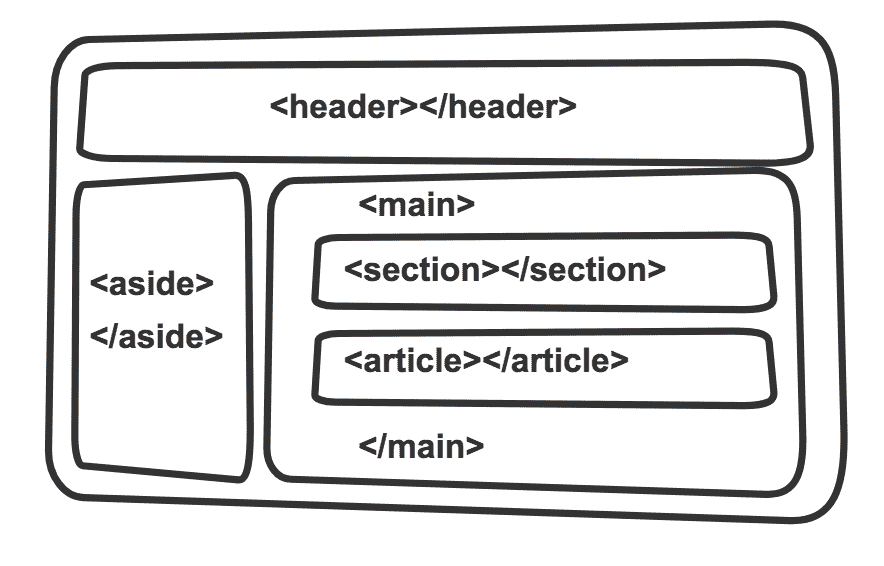
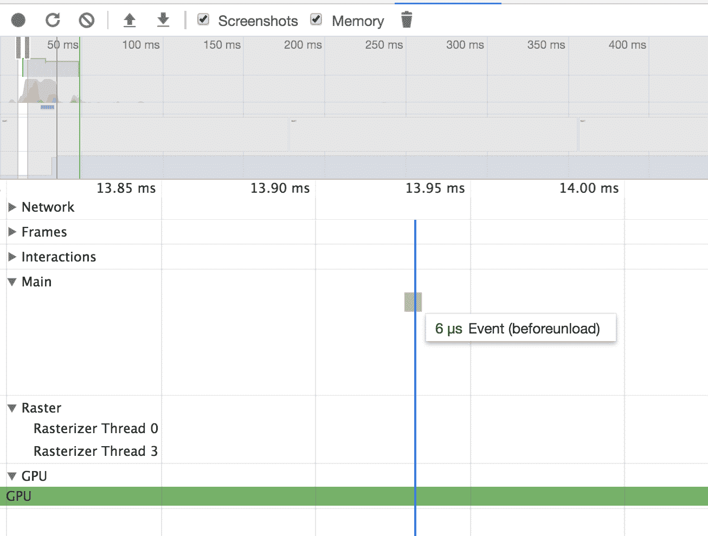
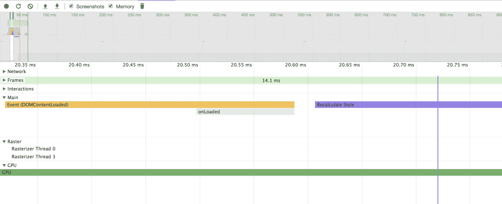
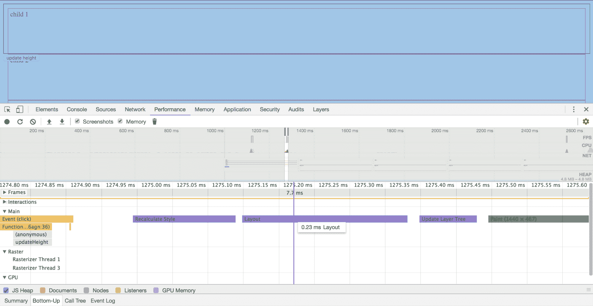
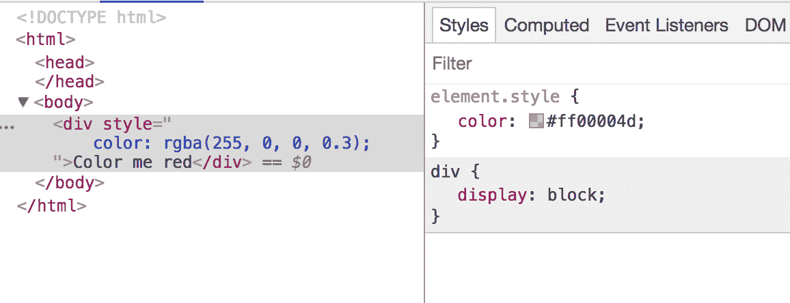
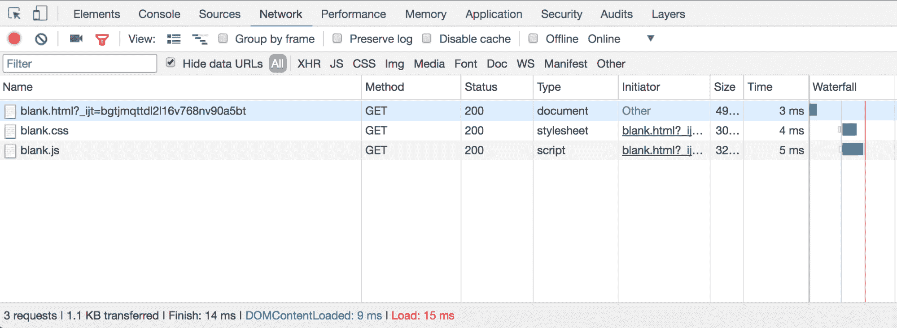
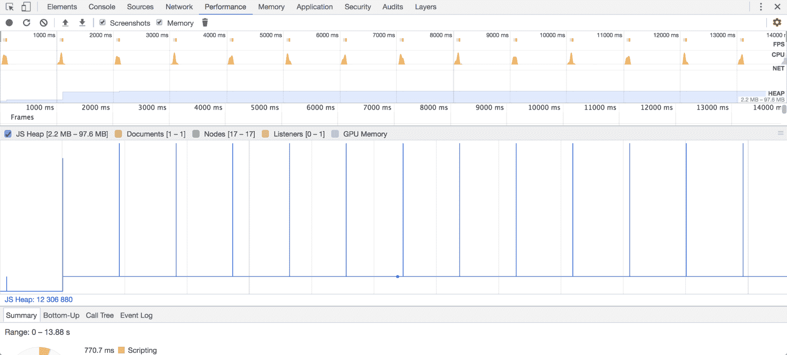

# 九、微优化和内存管理

在本章中，我们将介绍 HTML、CSS、JavaScript 的一些基本概念，以及我们期望所有这些在其中联合运行的浏览器。我们一直有，也将一直有某种风格的代码，这是很自然的。然而，我们是如何发展这种风格的呢？是好还是能好起来？我们如何决定我们应该和不应该要求别人遵循什么？这些是我们将在本章中尝试回答的一些问题。

在本章中，我们将讨论以下内容:

*   最佳实践的重要性，并看一些例子。
*   探索不同种类的 HTML、CSS 和 JavaScript 优化
*   深入研究 Chrome 的一些特性的内部工作。

# 最佳实践

出于显而易见的原因，最佳实践是一个相对术语。什么是最好的取决于你所在的团队和你使用的 JavaScript 版本。在本节中，我们将尝试对这些最佳实践中的一些进行广泛的调查，并了解其中一些实践是什么样子的，以便我们也能适应和使用它们。

# 超文本标记语言的最佳实践

让我们自上而下地处理这一部分，并针对 HTML 文件中的每一部分提出最佳实践。

# 声明正确的 DOCTYPE

你有没有想过为什么我们的页面顶部会有`<!DOCTYPE html>`？我们可以清楚地忽略它，但这一页似乎仍然有效。那么，我们到底为什么需要这个？答案是 **a** **避免向后兼容**——如果我们不指定 DOCTYPE，解释和呈现我们的 HTML 的浏览器就会进入怪癖模式，这是一种支持真正古老的网站的技术，这些网站是用过时的 HTML、CSS 和 JS 版本和标记构建的。Quirks 模式模拟了旧版本浏览器中存在的许多错误，我们不想处理这些错误。

# 向页面添加正确的元信息

任何网页在呈现时，都需要一些元信息。虽然这些信息不会呈现在页面上，但是正确呈现页面是非常重要的。以下是添加元信息的一些良好实践:

*   为您的`html`标签添加正确的`lang`属性，以符合 w3c 的国际化标准:

```js
<html lang="en-US">
```

*   声明正确的`charset`以支持网页上的特殊字符:

```js
<meta charset="UTF-8">
```

*   添加正确的`title`和`description`标签，支持搜索引擎优化:

```js
<title>This is the page title</title>

<meta name="description" content="This is an example description.">
```

*   添加适当的`base`网址，避免到处提供绝对网址:

```js
<base href="http://www.mywebsite.com" />
...
...
 // relative to base

```

# 删除不必要的属性

这看似显而易见，但仍被广泛使用。当我们添加一个`link`标签来下载一个`stylesheet`时，我们的浏览器已经知道它是一个`stylesheet`。没有理由指定该链接的类型:

```js
<link rel="stylesheet" href="somestyles.css" type="text/css" />
```

# 让您的应用移动就绪

你见过那些在桌面和手机上看起来一模一样的网站吗，不知道他们为什么要这样建？在网络开发的新时代，为什么有人不利用最新的 HTML 和 CSS 版本提供的响应能力呢？这可能发生在任何人身上；我们已经定义了所有正确的断点，并且正在按预期使用媒体查询，但是什么也没有发生。这通常是因为我们忘记了包含`viewport`、`meta`标签；包括`viewport`的`meta`标签解决了我们所有的问题:

```js
<meta name="viewport" content="width=device-width, initial-scale=1">
```

`viewport`基本上是用户的总可视区域，在移动端会更小，在桌面端会更大；基于`viewport`的大小，`meta`标签定义了浏览器应该如何呈现网站。

# 在中加载样式表

这是一个偏好和选择的问题。我们能在页面加载结束时加载样式表吗？当然，我们可以，但是我们想避免它，这样我们的用户就不会看到没有样式的页面在它选择正确的样式之前闪烁。我们的浏览器在提供 CSS 和 HTML 时，会创建一个 **CSS 对象模型** ( **CSSOM** )和**文档对象模型** ( **DOM** )。当一个 DOM 正在被构建的时候，浏览器会查找 CSSOM 来检查是否有任何对应于这个 DOM 节点的样式。因此，我们希望确保构建了 CSSOM，并为 DOM 的呈现做好了准备。

另一种方法是首先在页面的 head 标签中只加载基本的样式，其余的样式可以在正文的末尾请求。这意味着我们的页面可以呈现得更快一点，但值得注意的是，根据您的应用大小和用例，有时这可能不值得付出努力。

# 避免内嵌样式

通过直接在 HTML 文件中的元素上提供内联样式来使用它们是不好的，原因有很多:

*   我们不能重用应用于一个元素的样式
*   我们的 HTML 充斥着 CSS，使得它非常嘈杂
*   我们不能利用伪元素，比如`before`和`after`

# 使用语义标记

有了 HTML5，我们再也不用担心用一个`<div>`标签做什么了。我们被赋予了一组更强大的语义标签，帮助我们以更有意义的方式构建模板:



A point worth noting is that these new tags only provide meaning to our template but no styling. If we want it to look a certain way, we will need to style the elements as we want them to look. Also, the new HTML5 tags are not available in browsers older than IE9, so we need to prepare for fallbacks such as HTML5shiv.

# 使用可访问的丰富互联网应用属性

每当我们开发 web 应用时，我们都需要确保我们的应用与屏幕阅读器兼容，以支持残疾用户:

```js
<div id="elem" aria-live="assertive" role="alert" aria-hidden="false"> An error occurred </div>
```

这些信息不会与屏幕上的任何现有信息相冲突，它使屏幕阅读器能够拾取和处理这些信息。当然，这一切只有在 HTML 渲染器支持 ARIA 的情况下才有可能，ARIA 在所有最新的浏览器中都可以使用。

# 在最后加载脚本

任何应用的核心都存在于开发人员定义的 JavaScript 文件中。因此，当我们试图加载和执行这些文件时，我们需要格外注意，这些文件可能比对应的 HTML 和 CSS 文件大得多。当我们试图使用脚本标签加载外部 JS 文件时，浏览器首先下载它们，然后执行它们(在解析和编译之后)。我们需要确保我们的应用在正确的时间被加载和执行。这对我们来说意味着，如果我们的应用逻辑依赖于 DOM，我们需要确保在执行脚本之前呈现 DOM。这使得我们有很好的理由在应用中的 body 标签末尾加载脚本。

即使我们不依赖于 JavaScript 中的 DOM，我们仍然希望在最后加载我们的脚本，因为默认情况下，脚本标签是呈现阻塞的，也就是说，如果您的浏览器在头部遇到您的脚本标签(例如)，它会开始下载并执行 JS 文件，并且直到执行完成才呈现页面的其余部分。此外，如果我们有太多的 JS 文件，那么页面看起来已经挂起，并且在所有的 JS 文件被成功下载和执行之前，不会向最终用户完全呈现 UI。

如果您仍然想添加脚本标签和链接标签来下载样式表，那么有一个解决方法。您可以将`defer`或`async`属性添加到脚本标签中。`Defer`允许您下载与 DOM 渲染并行的文件，并在渲染完成后执行脚本。`async`与 DOM 渲染并行下载文件，暂停渲染执行，执行后恢复。明智地使用它们。

# CSS 最佳实践

CSS 最佳实践的列表没有 HTML 的长。此外，许多潜在的问题可以通过使用预处理语言得到显著缓解，例如 **Sassy CSS** ( **SCSS** )。让我们假设你出于某种原因不能使用 SCSS，并讨论普通旧 CSS 的好与坏。

# 避免内嵌样式

这一点非常重要，足以成为 HTML 和 CSS 最佳实践的一部分。只是不要应用内嵌样式。

# 不要使用！重要的

说起来容易，做起来难。使用`!important`是将样式应用于元素的最简单的变通方法之一。然而，这是有代价的。CSS 或级联样式表依赖于这样一个事实，即样式将根据应用的优先级(标识、类和元素标签)或它们出现的顺序进行级联。使用`!important`会搞砸这一点，如果你有多个 CSS 文件，那么纠正起来就会变得一团糟。最好避免这样的做法，从一开始就以正确的方式去做。

# 按字母顺序排列类中的样式

这听起来没什么大不了的，不是吗？好吧，如果你只有一个包含几个类的 CSS 文件，那么也许没问题。然而，当你有一个复杂层次的大文件时，你最不想做的就是犯一个小错误，这会花费你很多时间。看看下面的例子:

```js
.my-class {
    background-image: url('some-image.jpg');
 background-position: 0 100px;
 background-repeat: no-repeat;
    height: 500px;
    width: 500px;
    ...
    ...
    margin: 20px;
    padding: 10px;
 background: red;
}
```

请注意，在前面的代码中，我们为元素的 background 属性添加了冲突的样式，现在呈现时，它都是红色的。这很容易被发现，但是由于类中属性的顺序，它丢失了。

# 以升序定义媒体查询

随着应用规模的增长，定义媒体查询是另一个令人困惑的领域。定义媒体查询时，请始终以递增的顺序定义它们，以便您可以隔离样式并保留开放的上限，如下所示:

```js
...

Mobile specific styles

...

// if screen size is greater than a small mobile phone
@media only screen and (min-width : 320px) { 
    // overrides which apply
} 

// if screen size is greater than a small mobile phone in portrait mode
// or if screen size is that of a tablet
@media only screen and (min-width : 480px) { 
    // overrides that apply
 } 

// if screen size is greater than a tablet
@media only screen and (min-width : 768px) { 
    // overrides that apply
} 

// large screens
@media only screen and (min-width : 992px) { ... } 

// extra large screens and everything above it
@media only screen and (min-width : 1200px) { ... }
```

请注意，在前面的代码中，我们将最后一个媒体查询留给了所有尺寸为`1200px`或更大的屏幕，包括显示器、电视等。如果我们用另一种方法，根据屏幕尺寸的最大宽度来设置样式，这将不会很好地工作。如果我们在投影仪上打开它会发生什么？它肯定不会像你希望的那样工作。

# JavaScript 的最佳实践

这个话题没有起点和终点。关于在 JavaScript 中应该如何做事情，有很多观点，事实证明大多数都是正确的(取决于你的背景、经验和用例)。让我们来看看一些最常被讨论的 JavaScript 最佳实践。

# 避免全球范围的污染

不要向全局范围添加属性或方法。这些会使你的窗口对象膨胀，使你的页面变得缓慢和结结巴巴。相反，始终在方法中创建一个变量，当方法被销毁时，将会处理这个变量。

# 使用“使用严格”

这是一个单行的变化，当涉及到捕捉代码气味和任何代码不规则时，比如删除一个变量，这可能会有很大的帮助。`use strict`子句在运行时执行非法操作时会抛出一个错误，所以它不一定会阻止我们的应用崩溃，但是我们可以在问题部署之前捕捉并修复它们。

# 严格检查(== vs ===)

当涉及到类型转换或类型转换时，JavaScript 可能是一种相当棘手的语言。没有数据类型的事实并没有使这变得更简单。与=== **相比，使用== 强制隐式类型转换。**所以，除非你希望 12== 12 为真，否则建议始终使用===。

有关理解其工作原理的更多细节，请参考位于[https://www.ecma-international.org/ecma-262/5.1/#sec-11.9.3](https://www.ecma-international.org/ecma-262/5.1/#sec-11.9.3)的抽象等式比较算法。

# 使用三元运算符和布尔||或&&

始终建议保持代码可读，但是，如果有必要，请使用三元运算符使代码简洁易读:

```js
if(cond1) {
    var1 = val1;
} else {
    var1 = val2
}

if(cond2) {
    var2 = val3;
} else {
    var2 = val4
}
```

例如，前面的代码可以压缩如下:

```js
var1 = cond1 ? val1 : val2;
var2 = cond2 ? val3 : val4;
```

设置默认值也很容易实现，如下所示:

```js
var1 = ifThisVarIsFalsy || setThisValue;
var2 = ifThisVarIsTruthy && setThisValue;
```

# 代码模块化

当我们创建一个脚本时，很明显，我们希望它做多件事，例如，如果我们有一个登录页面，登录页面的脚本应该处理登录(很明显)、重置密码和注册。所有这些操作都需要电子邮件验证。将这些操作中的验证部分保持在自己的方法中被称为模块化。它帮助我们保持我们的方法小，可读，并使单元测试容易得多。

# 避免毁灭金字塔

末日金字塔是一个经典的场景，我们有大量的嵌套或分支。这使得代码过于复杂，单元测试是一项非常复杂的工作:

```js
promise1()
    .then((resp) => {
        promise2(resp)
            .then((resp2) => {
                promise3(resp2)
                    .then((resp3) => {
                        if(resp3.something) {
                            // do something
                        } else {
                            // do something else
                        }
                    });
            });
    });
```

相反，请执行以下操作:

```js
promise1()
    .then((resp) => {
        return promise2(resp);
    })
   .then((resp2) => {
        return promise3(resp2);
    })                
    .then((resp3) => {
        if(resp3.something) {
            // do something
        } else {
            // do something else
        }
    })

```

# 将 DOM 访问保持在最低限度

DOM 访问是一个昂贵的操作，我们需要尽可能地减少它，以避免我们的页面死亡。一旦 DOM 元素在一些局部变量中被访问，就尝试缓存它们，或者利用虚拟 DOM，这更有效，因为它将所有的 DOM 更改进行批处理，并将它们一起调度。

# 验证所有数据

注册新用户？确保所有输入的字段在用户界面和后端都经过验证。在这两个地方进行验证会让它的效果提高一倍，并且在用户界面上进行验证有助于比服务器端验证更快地将错误消息发送给用户。

# 不要重新发明轮子

在开源软件和项目方面，JavaScript 社区非常慷慨。利用他们；不要重写其他地方已经有的东西。不值得花时间和精力去重写一些社区测试过的免费软件。如果一个软件只完成了你需要的 90%，考虑把剩下的 10%的功能贡献给开源项目。

# html 优化

作为 web 开发人员，我们非常擅长创建模板。在本节中，我们将探索尽可能提高这一过程效率的方法。

# DOM 结构化

虽然这看起来很明显，但是在呈现用户界面时，DOM 结构可以带来很大的不同。一个 HTML 模板要变成 DOM，需要经过一系列步骤:

1.  **模板解析**:解析器读取 HTML 文件
2.  **标记化**:解析器识别标记，如`html`和`body`
3.  **乐兴**:解析器将标记转换为标签，如`<html>`和`<body>`
4.  **DOM 构建**:这是浏览器将标签转换成树的最后一步，同时为元素应用适用的样式和规则

考虑到这一点，重要的是我们不要不必要地嵌套元素。尝试将样式应用于元素，而不是将它们嵌套在其他元素中。话虽如此，人们可能会想，这到底有多重要？浏览器在这方面做得很好，所以如果我的 DOM 中有一个额外的元素真的有关系吗？老实说，不，如果你有额外的元素也没关系。然而，想想所有不同的浏览器。还有，你要在多少地方添加这个额外的元素；想想这种做法会开创的先例。随着时间的推移，你的开销会变得越来越重要。

# 预取和预加载资源

`<link>`标签的一些不太为人所知的属性是`rel=prefetch`和`rel=preload`选项。它们允许浏览器预加载后续页面甚至当前页面所需的一些内容。

# <link rel="prefetch">

让我们讨论一个相当简单的例子来理解预取:加载图像。加载图像是网页执行的最常见操作之一。我们决定使用 HTML 模板中的`img`标签或者 CSS 中的`background-image`属性来加载哪个图像。

无论哪种方式，在解析元素之前，图像都不会被加载。此外，假设您的图像非常大，并且下载需要大量时间，那么您将不得不依赖于一系列回滚，例如提供图像维度以使页面不会闪烁，或者使用`alt`属性以防下载失败。

一个可能的解决方案是预取您在不久的将来需要的资源。这样，在用户登陆该页面之前，您可以避免下载资源。一个简单的例子如下:

```js
<!DOCTYPE html>
<html lang="en">
<head>
    <!-- a very large image -->
    <link rel="prefetch" href="http://gfsnt.no/oen/foto/Haegefjell_Jan_2013_Large.jpg">
</head>

<body>
    <script>
        window.onload = function() {
            setTimeout(function() {
                var x = document.createElement("IMG");
                x.setAttribute("src",
             "http://gfsnt.no/oen/foto/Haegefjell_Jan_2013_Large.jpg");
                document.body.appendChild(x);
            }, 5000);
        }
    </script>
</body>
</html>
```

我们有意延迟`img`标签的加载，直到预取完成。理想情况下，您会预取下一页所需的资源，但这也能实现同样的目的。

运行此页面后，我们可以看到对图像的请求如下:


这听起来好得难以置信，对吧？是的，尽管这个特性很有用，但是在处理跨多个浏览器的预取时，我们会遇到一些问题。Firefox 只在空闲时预取；一些浏览器能够在用户触发另一个动作时暂停下载，然后在浏览器再次空闲时重新下载图像的剩余部分，但这同样取决于服务器如何提供可缓存的内容(也就是说，服务器需要支持提供多部分文件)。然后，有些浏览器可以并且将会因为网络太慢而放弃预取。

# <link rel="preload">

预加载与预取非常相似，区别在于一旦资源下载被触发，浏览器在任何时候都没有选择以任何理由放弃下载。

语法也非常相似，只是我们定义了我们试图预加载的资源类型:

```js
<link rel="preload" href="http://gfsnt.no/oen/foto/Haegefjell_Jan_2013_Large.jpg" as="image">
```

在下载字体和字体系列时，预取和预加载也是非常常见的选择，因为加载字体的请求直到 CSSOM 和 DOM 都准备好了才会被触发。

# HTML 的布局和分层

作为一名网络开发人员，想出一个 HTML 模板来在用户界面上呈现元素是最简单的任务之一。在本节中，我们将讨论 Chrome 如何处理模板并将其呈现在用户界面上。HTML 模板有两个至关重要的部分，布局和层，我们将看一看每个部分的例子以及它们如何影响页面性能。

# 超文本标记语言布局

让我们从一个极其简单的网页开始，看看 chrome 如何处理这个页面的呈现:

```js
<!DOCTYPE html>
<html>
    <head></head>

    <body>
        <div>test</div>
    </body>
</html>
```

一旦我们加载了页面，我们将使用 Chrome **开发工具** ( **开发工具**)来生成这个模板加载的性能快照。为此，请导航至 Chrome 浏览器上的 CDT(设置- >更多工具- >开发者工具)。

一旦我们到了那里，让我们通过点击刚刚打开的面板左上角的记录按钮来记录一个新的快照。页面加载后，停止记录，让快照加载到面板中。其结果如下:


不可理解，对吧？好吧，让我们把它分成我们能理解的小块。我们主要关注`main`部分(在截图中展开)。让我们放大一点，看看从左到右是什么事件。

首先，我们将看到 beforeunload 事件:



接下来，我们将看到更新层树(我们将在后面讨论):


我们现在注意到一个小的垃圾收集，这是一个特定于浏览器的事件(我们将在后面的章节中讨论):


然后，我们会注意到`DOMContentLoaded`事件之后是`Recalculate Style`事件，此时我们的页面已经准备好进行交互:



很酷，对吧？这与我们之前听说的浏览器完全一致。他们加载页面，然后当一切准备就绪时`DOMContentLoaded`被触发。但是，请注意，还有另一个名为 Minor GC 的事件也正在被触发。我们可以忽略这一点，因为它是由浏览器内部处理的，与我们的代码构造方式关系不大。

一旦加载了 DOM，我们注意到我们有另一个被触发的事件叫做`Recalculate Style`，这听起来就是这样的。DOM 准备好了，浏览器检查并应用需要应用到这个元素的所有样式。然而，你可能会想，我们没有在模板中添加任何样式，对吗？那么，我们说的是什么风格呢？默认情况下，所有浏览器都将样式应用于它们呈现的所有元素，这些元素被称为用户代理样式表。浏览器仍然需要将用户代理样式表样式添加到 CSSOM 中。

我们仍然没有真正讨论`Layout`是什么，除了它是浏览器将排列元素的几何结构，包括但不限于它们的大小、形状和在页面上的位置。`Layout`也是一个事件，会被 CDT 记录下来，向你展示浏览器花了多长时间试图重新安排你的布局。非常重要的是，我们尽量将布局事件保持在最低限度。为什么呢？因为`Layout`不是一个孤立的事件。它由一系列其他事件(如更新层树和绘制用户界面)链接，这些事件是完成用户界面上元素排列所必需的。

另一个需要考虑的重要事情是`Layout`事件是为页面上所有受影响的元素触发的，也就是说，即使一个深度嵌套的元素被更改，您的整个元素(或基于更改的元素周围的事件)也会被重新布局。让我们看一个例子:

```js
<!DOCTYPE html>
<html>
    <head>

        <style>
            .parent {
                border: 1px solid black;
                padding: 10px;
            }

            .child {
                height: 20px;
                border: 1px solid red;
                padding: 5px;
            }
        </style>

    </head>

    <body>
        <div class="parent">
            <div class="child">
                child 1
            </div>
            <div class="child">
                child 2
            </div>
            <div class="child">
                child 3
            </div>
            <div class="child">
                child 4
            </div>
        </div>

        <button onclick="updateHeight();">update height</button>

        <script>
            function updateHeight() {
                var allEl = document.getElementsByTagName('div');
                var allElemLength = allEl.length;

                for(var i = 0; i < allElemLength; i++) {
                    allEl[i].style.height = '100px';
                }

            }
        </script>
    </body>
</html>
```

这很简单；我们有一个由四个子元素组成的非常小的父页面。我们有一个按钮，可以将所有元素的高度设置为`100px`。现在让我们运行这个页面，并跟踪当我们点击按钮`update height`来改变元素的高度时的性能，我们在用户界面上看到以下内容:



从前面的截图中我们可以看到，一旦点击事件开始，它就会触发我们的功能，然后引发一系列事件，包括需要 0.23 毫秒的`Layout`，然而，人们可能会想，为什么我们会在`Function`和`Layout`之间有一个`Recalculate Style`事件？还记得我们的老朋友用户代理样式表吗？当按钮激活时，它会在按钮上设置一些样式，从而触发`Recalculate Style`事件。

If you want to remove all the styles of an element (such as a button in the case described earlier), you can do so by applying the `all:unset`; property to the element of your choice. This will completely un-style the element. However, it will reduce the `Recalculate Style` event to a fraction of what it is with the User Agent Styles applied.

现在让我们将 JavaScript 函数更改为仅更改第一个子元素的样式，而不是页面上的所有元素，并看看这如何影响我们案例中`Layout`事件的执行:

```js
function updateHeight() {
    var allEl = document.getElementsByTagName('div');    
    allEl[1].style.height = '100px';
}
```

现在，当我们运行页面并分析 click 方法的执行时，我们将在 profiler 中看到以下内容:


正如您在前面的截图中看到的，布局整个页面仍然需要 0.21 毫秒，这与我们之前的值没有太大不同。在前面的例子中，我们还有五个元素。然而，在生产应用中，这可以并且将扩展到 1000 个元素，为了平稳过渡，我们希望将`Layout`事件保持在 16 毫秒(60fps)以下。

很有可能你从来没有遇到过这个问题，但是如果你遇到了，最简单的处理方法就是首先检查你使用的是浏览器支持的最新布局模型。在大多数浏览器中，它会是 flexbox 或 grid，所以比起 floats、percentages 或 positioning，我更喜欢它。

# HTML 层

正如我们在前面的例子中看到的，一旦元素被重新布局，我们`Paint`元素，也就是用颜色填充像素，这应该是给定位置(由`Layout`确定)元素的一部分。

一旦`Paint`事件完成，浏览器接着执行`Composition`，这基本上是我们的浏览器把页面的所有部分放在一起。这些部分越少，页面加载就越快。此外，如果`Composition`的某个部分花费太长时间，则整个页面加载会延迟。

我们如何处理这些耗时过长的操作？我们可以通过将它们提升到自己的层来处理它。我们可以对元素执行某些 CSS 操作，这将把它们提升到自己的层。这对我们意味着什么？这些升级的元素现在将被延迟，并作为纹理在 GPU 上执行。我们不再需要担心浏览器会为这些提升的元素触发`Layout`或`Paint`事件，我们只关心元素的`Composition`。

从前面的例子中，到目前为止，我们已经建立了任何变更流程的前四个步骤，如下所示:

1.  JavaScript 文件被执行
2.  样式的重新计算
3.  `Layout`事件
4.  `Paint`事件

现在，在该列表中，我们可以添加以下步骤来完全呈现用户界面上的元素:

5.`Composition`

6.多线程光栅化

*第 6 步*只是把我们的像素渲染到 UI 上，可以批量化，在并行线程上运行。让我们创建一个简单的 HTML，看看它是如何呈现在用户界面的单个层上的:

```js
<!DOCTYPE html>
<html>
<head>

</head>

<body>
    <div>
        Default Layer
    </div>
</body>
</html>
```

我们可以通过导航到设置选项，然后选择更多工具和图层，从开发工具访问图层。在加载之前显示的页面时，我们将在图层中看到以下内容:


当我们分析前面的页面时，我们可以看到，正如预期的那样，页面在`Main`线程上加载并呈现 UI:


现在让我们改变这个例子，加载到它自己的层，这样我们就可以完全跳过`Layout`和`Paint`部分。要将一个元素加载到它自己的层上，我们需要做的就是给它一个 CSS 转换或者设置`will-change`属性来转换:

```js
.class-name {
    will-change: transform:
    // OR
    transform: translateZ(0); <- does nothing except loading to a new Layer
}
```

下面是一个更新的示例模板，它使用了 CSS3 `transform`属性:

```js
<!DOCTYPE html>
<html>
<head>
    <style>
        div {
            width: 100px;
            height: 100px;
            margin: 200px;
            border: 1px solid black;
            animation: spin 1s infinite;
            transition: all 0.35s ease;
        }

        @keyframes spin {
            from {
                transform: rotate(0deg);
            }

            to {
                transform: rotate(360deg);
            }
        }
    </style>
</head>

<body>
    <div></div>
</body>
</html>
```

在前面的代码中，我们添加了一个非常小的动画，它将无限旋转元素。当我们重新加载页面时，我们可以看到它已经被添加到自己的层:


不仅如此，当我们记录修改后的模板的性能时，我们可以看到一些非常有趣的东西:


正如我们在前面的截图中看到的，浏览器完全将`Layer`作为一个新的纹理延迟到 GPU 上，从那时起，GPU 处理元素的渲染/更新，而不是浏览器。

好吧，那么，这是否意味着我们将每个元素加载到它自己的`Layer`上，然后让 GPU 从那里取用它？不，当然不是，因为每个`Layer`内部都需要内存，在每个图层上加载 1000 个元素会适得其反。例如，我们唯一应该有意识地将元素提升到自己的`Layer`的时候是在`Composition`中某个元素花费了太长时间，并且正在进行窒息操作，例如滚动或滑动。另一个用例可能是当您让一个元素执行多个更改时，例如设置高度、宽度和背景颜色的动画。这将持续调用渲染过程的所有步骤(从`Layout`到光栅化)，如果我们知道它仅限于这几个变化，我们就不需要做所有这些。我们可以简单地将这个元素提升到它自己的层，然后就完成了。

# CSS 优化

如果你有使用任何预处理器框架开发的经验，比如 SCSS/LESS，CSS 优化是非常简单和明显的。当我们讨论 CSS 优化时，我们实际上是在讨论两个不同但又相互依赖的东西:

*   加载样式表
*   呈现和应用样式

# 编码实践

我们可以调整和学习许多编码实践，以使我们的应用性能更好。它们中的大多数可能看起来微不足道，但当扩展到大型应用时，它们确实很重要。我们将通过例子讨论其中的一些技术。

# 对公共 ENUM 使用较小的值

当我们谈论减少页面加载时间时，一个快速的方法是删除 CSS 文件本身的冗余:

*   使用`#FFFFFF`？切换到`#FFF`，简称相同的 RGB 值。
*   如果属性值为`0`，则不要在属性值后添加`px`。
*   如果尚未使用，请使用缩小。这将连接所有正在使用的 CSS 文件，并删除所有空白和换行符。
*   使用 GZip 压缩缩小的文件，同时通过网络传输。这非常简单，浏览器非常擅长高效地解压文件。
*   注意手边特定于浏览器的优化。例如，在 Chrome 的情况下，我们不必应用`rgba(x,y,z,a)`格式的样式。我们可以在开发过程中将其作为`rgba`应用，并使用开发工具提取相应的十六进制值。只需检查有问题的元素，点击小矩形，同时按 *Shift* :



# 使用速记属性

使用速记属性是加速页面加载的一种方式。虽然听起来很明显，但有时，当我们在舒适的笔记本电脑上工作时，我们会认为浏览器和网络是理所当然的，而忘记考虑基于 3G 的设备。因此，下次您想要设计元素背景或边框的样式时，请确保它们都已折叠并使用速记书写。

有时，您可能会遇到这样的情况，即您只想重写某个元素样式的一个属性。例如，如果要在元素的三面应用边框，请使用以下方法:

```js
.okay {
    border-left: 1px solid black;
    border-right: 1px solid black;
    border-bottom: 1px solid black;
} // 114 characters including spaces

.better {
    border: 1px solid black;
    border-top: 0;
} // 59 characters including spaces
```

# 避免复杂的 CSS 选择器

无论何时创建 CSS 样式，都必须了解将这些样式应用于任何元素都有一定的成本。我们可以像分析 JavaScript 一样分析 CSS 选择器，并得出我们所应用的每种样式的最佳和最差运行时性能。

例如，假设我们有如下风格:

```js
.my-class > div > ul.other-class .item:nth-child(3) {
```

这比简单地创建一个类并将其直接分配给元素本身要复杂得多:

```js
.my-class-child {
```

我们的浏览器不再需要检查每个元素是否属于之前定义的样式层次。从这个概念发展出来的一种技术叫做**块-元素-修改器** ( **边界元**)，非常容易理解。为元素指定一个类名，尽量不要嵌套它们:

因此，假设您的模板如下所示:

```js
<div class="nav">
  <a href="#" class="nav__trigger">hamburger_icon</a>

  <ul class="nav__items">
    <li class="nav__item">
      <a href="#" class="nav__link">About</a>
    </li>

    <li class="nav__item">
      <a href="#" class="nav__link">Blog</a>
    </li>

    <li class="nav__item">
      <a href="#" class="nav__link">Contact</a>
    </li>
  </ul>
</div>
```

您可以使用边界元法应用样式，如下所示:

```js
.nav {
    /* styles */
}

.nav__items {
    /* styles */
}

.nav__item {
    /* styles */
}

.nav__link {
    /* styles */
}

.nav__link--active {
    /* styles */
}
```

如果需要向元素添加自定义样式，可以创建一个新类并直接应用它，也可以将嵌套与当前级别结合起来:

```js
.nav__item--last-child--active {
    /* styles */
}
```

# 了解浏览器

与 HTML 渲染类似，CSS 解析和渲染也是复杂的过程，浏览器很容易隐藏。知道我们可以避免什么来让事情变得更好总是好的。让我们以 HTML 为例，讨论 Chrome 是如何处理这些的。

# 避免重涂和回流

让我们先简单谈谈什么是重画和回流:

**重画**:当元素的非几何属性发生变化时，浏览器执行的动作，例如背景色、文本色等。

**重排**:浏览器直接或通过计算属性对元素(或其父元素)进行几何更改而执行的操作。这个过程与前面讨论的`Layout`相同。

虽然我们不能完全防止重画和回流事件，但我们肯定可以尽自己的一份力量，最大限度地减少触发这些操作的变化。几乎所有的 DOM `read`操作(如`offsetWidth`和`getClientRects`)都会触发`Layout`事件，因为这种读取操作的值是按需完成的，浏览器在明确请求之前不会关心它们的值。此外，每当我们修改 DOM 时，`Layout`就会失效，如果我们下次需要读取 DOM 元素属性，它将不得不重新计算。

# 关键渲染路径

到目前为止，我们已经看到了如何优化页面负载(减少有效负载、大小等)，然后我们讨论了在呈现页面后保持页面性能需要考虑的事项。关键渲染路径是优化文件夹上方页面的初始加载的技术(即，在任何滚动之前显示在初始加载上的页面顶部)。这也称为**时间交互** ( **TTI** )或**时间第一个字节** ( **TTFB** )，我们想减少这个时间来保持页面快速加载。

从技术上讲，通用报告程序包括以下步骤:

1.  接收并开始解析 HTML。
2.  下载并构建 CSSOM。
3.  下载并执行 JS。
4.  完成 DOM 的构建。
5.  创建渲染树。

因此，如果我们希望我们的 TTI 很低，很明显，我们将需要尽快构建我们的 DOM 和 CSSOM，而不需要任何呈现阻塞 CSS 或解析器阻塞 JS 文件。我们的 TTI 低的一个迹象是我们的`DOMContentLoaded`事件快速触发，因为只有当 DOM 和 CSSOM 准备好的时候才会触发 DCL。让我们以下面的模板为例:

```js
<html>
<head>
    <title>CRP Blank</title>
</head>
<body>
    <div>Blank</div>
</body>
</html>
```

我们可以看到它非常精简，甚至没有加载任何外部样式或脚本。这对于网页来说很不寻常，但它是一个很好的例子。当我们运行此页面并打开网络选项卡时，我们可以看到以下内容:


然而，我们提到的 HTML 非常不寻常。在所有可能的情况下，我们将有一个以上的外部 CSS 和 JS 文件被加载到我们的页面。在这种情况下，我们的 DCL 事件会被延迟。让我们在`blank.html`文件中添加要加载的空白 CSS 和 JS 文件:


在这里，我们可以看到，即使没有太多要加载的内容，DCL 事件也一直被推送，直到浏览器下载并运行 JS 文件，因为 JS 文件的获取和执行都是渲染阻塞操作。我们的目标现在更清晰了:我们需要将 DCL 减少到最小，并且，从我们到目前为止所看到的，我们需要尽快加载 HTML，而一旦呈现了初始页面(或者至少正在呈现)，其他的都可以加载。前面我们已经看到，我们可以使用`async`关键字和脚本标签来异步加载和执行 JavaScript。现在让我们使用相同的方法来加快页面加载速度:

```js
<html>
<head>
    <title>CRP Blank</title>
    <link rel="stylesheet" href="blank.css">
</head>
<body>
    <div>Blank</div>

    <script async src="blank.js"></script>
</body>
</html>
```

现在，当我们在网络选项卡打开的情况下运行此页面时，我们将看到以下内容:



我们可以看到，DCL(由*瀑布*选项卡下的蓝色竖线表示)发生在 CSS 和 JS 文件下载和执行之前。使用`async`属性的另一个优点是`async`属性表明 JavaScript 不依赖于 CSSOM，因此它不必被 CSSOM 结构阻止。

# JavaScript 优化

网上有大量的资源可以用来讨论可以应用于 JavaScript 的各种优化。在这一节中，我们将看一看其中的一些微优化，并确定如何采取一些小步骤来提高 JavaScript 的性能。

# 真实/虚假的比较

在某种程度上，我们都依赖于 JavaScript 变量的真实性或虚假性来编写 if 条件或分配默认值。尽管这在大多数情况下很有帮助，但我们需要考虑这样的操作会对我们的应用造成的影响。然而，在我们进入细节之前，让我们讨论任何条件在 JavaScript 中是如何计算的，特别是在这种情况下的`if`条件。作为开发人员，我们倾向于做以下事情:

```js
if(objOrNumber) {
    // do something
}
```

这适用于大多数情况，除非数字为 0，在这种情况下，它的计算结果为 false。这是一个非常常见的边缘案例，无论如何，我们大多数人都会抓住它。但是，JavaScript 引擎需要做什么来评估这种情况呢？它如何知道 objOrNumber 的计算结果是真还是假？让我们返回到我们的 ECMA262 规格，并拉出中频条件规格([https://www.ecma-international.org/ecma-262/5.1/#sec-12.5](https://www.ecma-international.org/ecma-262/5.1/#sec-12.5))。以下是同一篇文章的节选:

语义学

生产 If 语句:If(表达式)语句 else 语句

语句的评估如下:

1.  让表达式成为计算表达式的结果。
2.  如果 ToBoolean(GetValue(exprRef))为真，那么
    *   返回评估第一条语句的结果。
3.  否则，
    *   返回第二条语句的计算结果。

现在，我们注意到我们传递的任何表达式都要经过以下三个步骤:

1.  从`Expression`获取`exprRef`。
2.  `GetValue`被称为`exprRef`。
3.  `ToBoolean`被称为*第二步*的结果。

*第一步*现阶段我们不太关心；这样想吧——一个表达式可以是类似`a == b`的东西，也可以是类似`shouldIEvaluateTheIFCondition()`方法调用的东西，也就是评估你的条件的东西。

*第二步*提取`exprRef`的值，即 10，真，未定义。在这一步中，我们根据`exprRef`的类型来区分如何提取值。详情可以参考【https://www.ecma-international.org/ecma-262/5.1/#sec-8.7.1】的`GetValue`。

*步骤 3* 然后根据下表(取自[https://www.ecma-international.org/ecma-262/5.1/#sec-9.2](https://www.ecma-international.org/ecma-262/5.1/#sec-9.2))将从*步骤 2* 提取的值转换为布尔值:


在每一步，你可以看到，如果我们能够提供直接的布尔值，而不是真值或假值，总是有益的。

# 循环优化

我们可以对 for 循环进行深入研究，类似于我们之前对 if 条件([https://www.ecma-international.org/ecma-262/5.1/#sec-12.6.3](https://www.ecma-international.org/ecma-262/5.1/#sec-12.6.3))所做的工作，但是当涉及到循环时，还有更容易和更明显的优化可以应用。简单的更改会极大地影响代码的质量和性能；以此为例:

```js
for(var i = 0; i < arr.length; i++) {
    // logic
}
```

前面的代码可以更改如下:

```js
var len = arr.length;

for(var i = 0; i < len; i++) {
    // logic
}
```

更好的是反向运行循环，这比我们之前看到的还要快:

```js
var len = arr.length;

for(var i = len; i >= 0; i--) {
    // logic
}
```

# 条件函数调用

我们应用中的一些特性是有条件的。例如，日志记录或分析就属于这一类。某些应用可能已经关闭日志记录一段时间，然后又重新打开。实现这一点最明显的方法是在 if 条件中包装用于记录的方法。但是，由于该方法可能会被触发很多次，因此在这种情况下，我们可以通过另一种方式进行优化:

```js
function someUserAction() {

    // logic

    if (analyticsEnabled) {
        trackUserAnalytics();
    }

}

// in some other class

function trackUserAnalytics() {

    // save analytics

}
```

与前面的方法不同，我们可以尝试做一些事情，这只是略有不同，但允许基于 V8 的引擎优化代码的执行方式:

```js
function someUserAction() {

    // logic

   trackUserAnalytics();
}

// in some other class

function toggleUserAnalytics() {

    if(enabled) {
        trackUserAnalytics =  userAnalyticsMethod;
    } else {
        trackUserAnalytics = noOp;
    }
}

function userAnalyticsMethod() {

    // save analytics

}

// empty function
function noOp  {}
```

现在，前面的实现是一把双刃剑。原因很简单。JavaScript 引擎采用了一种称为**内联缓存** ( **IC** )的技术，这意味着 JS 引擎对某个方法之前执行的任何查找都将被缓存，并在下次触发时重用；例如，如果我们有一个对象，它有一个嵌套的方法 a.b.c，那么方法 a.b.c 将只被查找一次并存储在缓存(IC)中；如果下次调用 a.b.c，会从 IC 中拾取，JS 引擎不会再次解析整个链。如果交流链有任何变化，则集成电路失效，下次执行新的动态查找，而不是从集成电路中检索。

因此，从我们前面的例子来看，当我们将`noOp`分配给`trackUserAnalytics()`方法时，方法路径会被跟踪并保存在集成电路中，但它会在内部删除该函数调用，因为它是对空方法的调用。然而，当它被应用于一个实际的函数，其中有一些逻辑，集成电路直接指向这种新方法。因此，如果我们不断多次调用我们的`toggleUserAnalytics()`方法，它会不断使我们的集成电路失效，我们的动态方法查找必须每次都发生，直到应用状态稳定(即`toggleUserAnalytics()`不再被调用)。

# 图像和字体优化

说到图像和字体优化，我们可以执行的优化类型和规模没有限制。然而，我们需要记住我们的目标受众，我们需要根据手头的问题来调整我们的方法。

对于图像和字体，首先也是最重要的一点是，我们不会过度服务器，也就是说，我们只请求和发送必要的数据，通过确定我们的应用运行的设备的尺寸。

最简单的方法是为您的设备大小添加一个 cookie，并将其与每个请求一起发送到服务器。一旦服务器收到对图像的请求，它就可以根据发送到 cookie 的图像的维度来检索图像。大多数情况下，这些图片类似于用户头像或评论某个帖子的人的列表。我们可以同意缩略图不需要与个人资料页面的大小相同，并且我们可以在传输基于图像的较小图像的同时节省一些带宽。

由于现在的屏幕都有很高的**每英寸点数** ( **DPI** )，我们为屏幕服务的媒体需要对得起它。否则，应用看起来很糟糕，图像看起来都像素化了。这可以通过使用矢量图像或`SVGs`来避免，矢量图像或`SVGs`可以通过线进行压缩，从而减小有效载荷大小。

另一个不太明显的优化是改变图像压缩类型。你有没有加载过这样一个页面，其中图像从上到下以小而递增的矩形加载？默认情况下，使用基线技术压缩图像，这是从上到下压缩图像的默认方法。我们可以使用`imagemin`等库将此更改为渐进式压缩。这将加载整个图像，首先是模糊的，然后是半模糊的，以此类推，直到整个图像被解压缩并显示在屏幕上。解压缩一个渐进的 JPEG 可能需要比基线长一点的时间，所以在进行这种优化之前进行测量是很重要的。

基于这个概念的另一个扩展是一个名为`WebP`的纯 Chrome 格式的图像。这是一种非常有效的图像服务方式，为许多生产中的公司提供服务，节省了近 30%的带宽。使用`WebP`几乎和前面讨论的渐进压缩一样简单。我们可以使用`imagemin-webp`节点模块，它可以将一张 JPEG 图像转换成`webp`图像，从而在很大程度上缩小图像尺寸。

网页字体和图片字体有些不同。图像被按需下载并呈现到用户界面上，也就是说，当浏览器遇到来自 HTML 0r CSS 文件的图像时。然而，另一方面，字体有点不同。仅当渲染树完全构建完成时，才请求字体文件。这意味着在为字体分派请求时，CSSOM 和 DOM 必须准备好。此外，如果字体文件是从服务器而不是本地提供的，那么我们可能会先看到没有应用字体的文本(或者根本没有文本)，然后看到应用的字体，这可能会导致文本闪烁。

有多种简单的技术可以避免这个问题:

*   在本地下载、提供和预加载字体文件:

```js
<link rel="preload" href="fonts/my-font.woff2" as="font">
```

*   指定字体中的 unicode 范围，以便浏览器可以根据浏览器实际预期的字符集和字形进行调整和临时修改:

```js
@font-face(
    ...
    unicode-range: U+000-5FF; // latin
    ...
)
```

*   到目前为止，我们已经看到，我们可以将未样式化的文本加载到用户界面上，并按照我们的预期设置样式；这可以使用字体加载 API 进行更改，该 API 允许我们使用 JavaScript 加载和呈现字体:

```js
var font = new FontFace("myFont", "url(/my-fonts/my-font.woff2)", {
    unicodeRange: 'U+000-5FF'
});

// initiate a fetch without Render Tree
font.load().then(function() {
   // apply the font 
   document.fonts.add(font);

   document.body.style.fontFamily = "myFont";
});
```

# JavaScript 中的垃圾收集

让我们快速了解一下什么是**垃圾收集** ( **GC** )以及如何在 JavaScript 中处理。许多低级语言为开发人员在代码中分配和释放内存提供了明确的能力。然而，与这些语言不同，JavaScript 自动处理内存管理，这既是好事也是坏事。很好，因为我们不再需要担心需要分配多少内存，何时需要分配，以及如何释放分配的内存。整个过程不好的一面是，对于一个不知情的开发人员来说，这可能是一个灾难的处方，他们可能最终得到一个可能挂起和崩溃的应用。

对我们来说幸运的是，理解 GC 的过程非常容易，并且可以非常容易地结合到我们的编码风格中，以确保当涉及到内存管理时，我们正在编写最佳的代码。内存管理有三个非常明显的步骤:

1.  将内存分配给变量:

```js
var a = 10; // we assign a number to a memory location referenced by variable a
```

2.  使用变量从内存中读取或写入:

```js
a += 3; // we read the memory location referenced by a and write a new value to it
```

3.  当不再需要时释放内存。

这是不明确的部分。浏览器怎么知道我们什么时候用完变量`a`就可以垃圾回收了？在继续讨论之前，让我们将它包装在一个函数中:

```js
function test() {
    var a = 10;
    a += 3;
    return a;
}
```

我们有一个非常简单的函数，它只是添加到我们的变量`a`中，然后返回结果并完成执行。然而，实际上还有一个步骤，这将发生在名为**标记和清除**的方法执行之后(不是立即执行，有时这也可能发生在主线程 **)** 上的一批操作完成之后。当浏览器执行标记和扫描时，它取决于应用消耗的总内存和内存消耗的速度。

# 标记和扫描算法

由于没有准确的方法来确定特定存储位置的数据将来是否会被使用，我们将需要依赖于能够帮助我们做出这一决定的替代方案。在 JavaScript 中，我们使用**引用**的概念来确定变量是否仍在使用——如果没有，它可以被垃圾收集。

标记和扫描的概念非常简单:从所有已知的活动内存位置可以到达哪些内存位置？如果有什么东西不可达，那就收集它，也就是释放内存。就这样，但已知的活动内存位置是什么？还是需要一个起点吧？在大多数浏览器中，GC 算法保留了一个`roots`列表，可以从该列表开始标记和扫描过程。所有的`roots`及其子节点都被标记为活动的，从这些`roots`可以到达的任何变量也被标记为活动的。任何无法到达的东西都可以被标记为无法到达，从而被收集。在大多数情况下，`roots`由窗口对象组成。

因此，我们将回到前面的例子:

```js
function test() {
    var a = 10;
    a += 3;
    return a;
}
```

我们的变量 a 是`test()`方法的局部变量。一旦方法被执行，就再也没有办法访问那个变量了，也就是说，没有人持有对那个变量的任何引用，也就是说，当它可以被标记为垃圾收集的时候，这样下次 GC 运行的时候，`var a`将被清除，分配给它的内存可以被释放。

# 垃圾收集和 V8

说到 V8，垃圾收集的过程极其复杂(应该如此)。所以，让我们简单讨论一下 V8 是如何处理的。

在 V8 中，内存(堆)分为两个主要代，分别是**新空间**和**旧空间**。新空间和旧空间都被分配了一些内存(在 *1 MB* 和 *20 MB* 之间)。大多数程序及其变量在创建时都是在新空间中分配的。当我们创建一个新变量或执行一个消耗内存的操作时，默认情况下，它是从新空间分配的，新空间是为内存分配优化的。一旦分配给新空间的总内存几乎被完全消耗掉，浏览器就会触发一个**小 GC** ，它基本上移除不再被引用的变量，并标记那些仍在被引用且还不能被移除的变量。一旦一个变量在两次或两次以上的小垃圾收集中幸存下来，它就成为旧空间的候选变量，在旧空间中垃圾收集周期的运行频率不如新空间中的频繁。当旧空间达到一定的规模时，就会触发一个主要的垃圾收集，所有这些都是由应用的启发驱动的，这对整个过程非常重要。因此，写得好的程序向旧空间移动的对象更少，从而触发的主要垃圾收集事件也更少。

不用说，这是 V8 对垃圾收集的一个非常高级的概述，由于这个过程随着时间的推移而不断变化，我们将切换话题，继续下一个话题。

# 避免内存泄漏

好了，现在我们已经在很高的层次上知道了 JavaScript 中的垃圾收集是什么以及它是如何工作的，让我们来看看一些常见的陷阱，这些陷阱阻止我们让浏览器为垃圾收集标记变量。

# 将变量分配给全局范围

这一点现在应该很明显了；我们讨论了 GC 机制如何确定一个根(它是窗口对象)，并将根及其子对象上的所有内容都视为活动的，并且从不将它们标记为垃圾收集。

因此，下次您忘记在变量声明中添加`var`时，请记住您正在创建的全局变量将永远存在，并且永远不会被垃圾收集:

```js
function test() {
    a = 10; // created on window object
    a += 3;
    return a;
}
```

# 移除 DOM 元素和引用

我们必须将 DOM 引用保持在最低限度，因此我们喜欢执行的一个众所周知的步骤是在 JavaScript 中缓存 DOM 元素，这样我们就不必一遍又一遍地查询任何 DOM 元素。然而，一旦 DOM 元素被移除，我们将需要确保这些方法也从我们的缓存中移除，否则，它们将永远不会得到 GC:

```js
var cache = {     
    row: document.getElementById('row')
};

function removeTable() {
    document.body.removeChild(document.getElementById('row'));
}
```

前面显示的代码从 DOM 中移除了`row`，但是变量缓存仍然引用了 DOM 元素，因此防止了它被垃圾收集。这里需要注意的另一个有趣的事情是，即使当我们移除包含`row`的表时，整个表也会保留在内存中，并且不会得到 GC，因为缓存中的行内部引用了该表。

# 封口边缘盒

闭包很神奇；它们帮助我们处理许多有问题的场景，也为我们提供了模拟私有变量概念的方法。好吧，这一切都很好，但有时我们往往会忽略与关闭相关的潜在负面影响。以下是我们所知道和使用的:

```js
function myGoodFunc() {
    var a = new Array(10000000).join('*'); 
    // something big enough to cause a spike in memory usage

    function myGoodClosure() {
        return a + ' added from closure';
    }

    myGoodClosure();
}

setInterval(myGoodFunc, 1000);
```

当我们在浏览器中运行这个脚本，然后对其进行分析时，我们看到，正如预期的那样，该方法消耗了恒定的内存量，然后被垃圾收集并恢复到脚本消耗的基线内存:



现在，让我们放大其中一个峰值，并查看呼叫树，以确定峰值发生时触发的所有事件:


在这里，我们可以看到一切都按照我们的期望发生；首先，我们的`setInterval()`被触发，它调用`myGoodFunc()`，一旦执行完成，就有一个 GC，它收集数据并因此收集尖峰，从前面的截图中我们可以看到。

现在，当处理闭包时，这是预期的流程或愉快的路径。然而，有时我们的代码并不那么简单，我们最终会在一个闭包中执行多个操作，有时甚至会嵌套闭包:

```js
function myComplexFunc() {
   var a = new Array(1000000).join('*');
   // something big enough to cause a spike in memory usage

   function closure1() {
      return  a + ' added from closure';
   }

   closure1();

   function closure2() {
      console.log('closure2 called')
   }

   setInterval(closure2, 100);
}

setInterval(myComplexFunc, 1000);
```

我们可以在前面的代码中注意到，我们扩展了我们的方法，现在包含了两个闭包:`closure1`和`closure2`。虽然`closure1`仍然执行和以前一样的操作，`closure2`将永远运行，因为我们让它以父函数频率的 1/10 运行。此外，由于两个闭包方法共享父闭包作用域，在本例中是变量 a，因此它永远不会得到 GC 'd，从而导致巨大的内存泄漏，这可以从下面的概要文件中看出:


仔细观察，我们可以看到 GC 正在被触发，但是由于调用方法的频率，内存正在缓慢泄漏(收集的内存比创建的内存少):


嗯，这是一个极端的边缘案例，对吗？这更像是理论而不是实践——为什么会有人有两个带闭包的嵌套`setInterval()`方法。再来看一个例子，我们不再嵌套多个`setInterval()`，而是由同一个逻辑驱动。

让我们假设我们有一个创建闭包的方法:

```js
var something = null;

function replaceValue () {
   var previousValue = something;

   // `unused` method loads the `previousValue` into closure scope

   function </span>unused() {
      if (previousValue)
         console.log("hi");
   }

   // update something

   something = {
      str: new Array(1000000).join('*'),

      // all closures within replaceValue share the same
      // closure scope hence someMethod would have access
      // to previousValue which is nothing but its parent
      // object (`something`)

      // since `someMethod` has access to its parent
      // object, even when it is replaced by a new (identical)
      // object in the next setInterval iteration, the previous
      // value does not get garbage collected because the someMethod
      // on previous value still maintains reference to previousValue
      // and so on.

      someMethod: function () {}
   };
}

setInterval(replaceValue, 1000);
```

解决这个问题的简单方法是显而易见的，正如我们自己所说的，对象的前一个值`something`不会被垃圾收集，因为它引用了前一次迭代的`previousValue`。因此，解决这个问题的方法是在每次迭代结束时清除`previousValue`的值，这样一旦卸载了`something`就没有什么可参考的了，因此可以看到内存分析发生了变化:


上图变化如下:


# 摘要

在本章中，我们探索了通过对我们为应用编写的 HTML、CSS 和 JavaScript 进行优化来提高代码性能的方法。非常重要的一点是，根据您试图构建的应用，了解这些可能对您有好处，也可能没有好处。这一章的主要内容应该是打开浏览器内部的能力，不要害怕剖析和看看浏览器是如何处理我们的代码的。此外，要警惕 ECMA 规范指南不断变化，但是浏览器需要时间来跟上变化。此外，最后但同样重要的是，永远不要过度优化或过早优化。如果你遇到了问题，那么在制定优化计划之前，先进行衡量，然后决定瓶颈在哪里。

# 下一步是什么？

就这样，我们结束了这本书。我们希望你有一个很好的学习经验，并希望你每天都能从这些技术中受益。JavaScript 就是这样，一直在发展。事情正在快速变化，很难跟踪事情。以下是一些建议，您可以在尝试时进行探索和修改:

1.  确定你感兴趣的领域。到目前为止，您已经知道 JavaScript 存在于浏览器之外的许多事物中。你更喜欢用户界面吗？你喜欢 API 和可扩展的微服务吗？你有没有挖掘建筑传感器来计算你每天喝多少咖啡？找到你的激情，在那里应用你新学到的 JavaScript 概念。概念相同，应用不同。
2.  订阅感兴趣领域的时事通讯和邮件列表。你会惊讶于你每天或每周从这些邮件中获得的信息量。它帮助你保持警觉，你可以跟上最新的技术。
3.  为你所知道和学到的东西写一篇博客(甚至是 StackOverflow 答案)。当你写下你学到的东西时，它总是有帮助的。有一天，你甚至可以把它作为自己的参考。