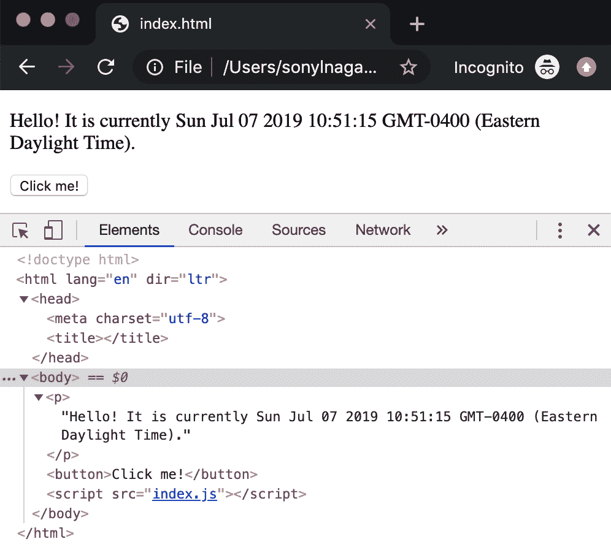
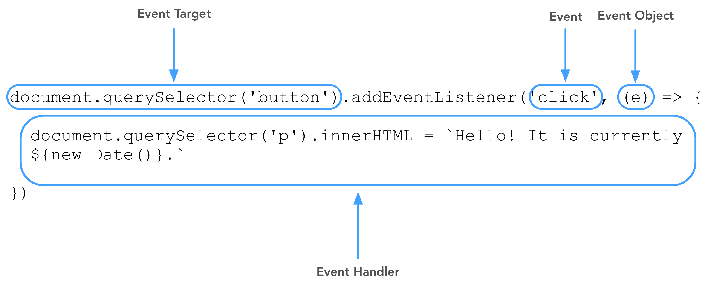
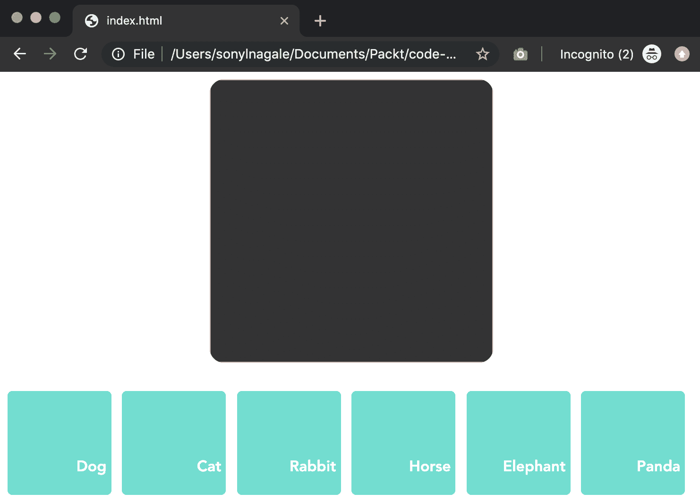
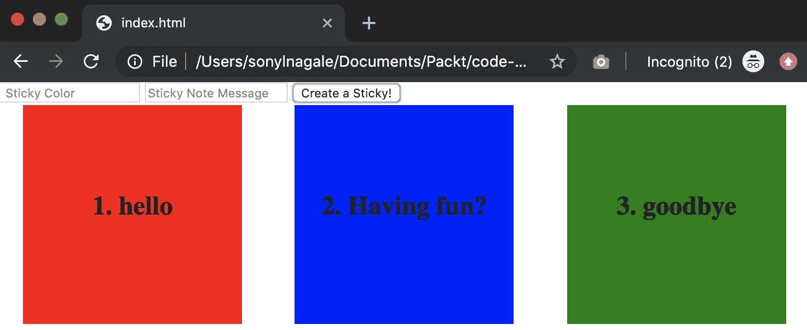

The Document Object Model (DOM)

**文档对象模型**(**DOM**)是浏览器公开的一种 API，它允许 JavaScript 与 HTML 通信，并间接与 CSS 通信。 由于 JavaScript 的主要功能之一是动态更改页面上的内容，所以我们应该知道如何做到这一点。 进入 DOM。

在本章中，我们将学习如何使用这个强大的 API 来阅读和更改页面上的内容。 我相信你见过一些网站在不重新加载页面的情况下改变内容。 这些程序使用*DOM 操作，*，我们将学习如何使用它。

本章将涵盖以下主题:

*   选择器
*   属性
*   操作

# 技术要求

请确保在`Chapter-6`目录中有现成的[https://github.com/PacktPublishing/Hands-on-JavaScript-for-Python-Developers](https://github.com/PacktPublishing/Hands-on-JavaScript-for-Python-Developers)存储库。

# 使用选择器

到目前为止，我们只使用`console.log`和警报和提示来输入和输出信息。 虽然这些方法对测试很有用，但它们并不完全是您在日常生活中使用的方法。 我们使用的大多数 web 应用，从搜索到电子邮件，都使用 DOM 与用户交互以获得输入和显示信息。 让我们来看一个小例子:[https://github.com/PacktPublishing/Hands-on-JavaScript-for-Python-Developers/tree/master/chapter-6/hello](https://github.com/PacktPublishing/Hands-on-JavaScript-for-Python-Developers/tree/master/chapter-6/hello)。

如果你在浏览器中打开 HTML，我们会看到一个非常简单的页面:


Figure 6.1 Our basic page

如果我们点击按钮，我们不会收到警告或控制台消息，相反，我们会看到:


Figure 6.2 An in-page response to our click!

耶! 这是我们的第一个**DOM 操作**实例。

## DOM 操作说明

让我们看看支持这个惊人例子的 JavaScript:

```js
document.querySelector('button').addEventListener('click', (e) => {
 document.querySelector('p').innerHTML = `Hello! It is currently ${
  new Date()}.`
})

```

首先要注意的是，我们正在对`document`对象进行操作。 `document`是 JavaScript 对浏览器页面组成的概念。 还记得我提到 DOM 是浏览器公开的 API 吗? 这是用来访问 DOM 的向量:`document`。

在分析 JavaScript 之前，让我们看看 DOM 和 HTML 有什么不同。 这是我们页面的 HTML:

```js
<!DOCTYPE html>
<html lang="en" dir="ltr">

<head>
  <meta charset="utf-8">
  <title>Example</title>
</head>

<body>
  <p></p>
  <button>Click me!</button>
  <script src="index.js"></script>
</body>

</html>
```

如果我们现在使用控制台来检查 Elements 而不是 console，我们会看到:


Figure 6.3 The DOM of our page

如果您仔细查看并将此截图与前面的 HTML 进行比较，您实际上不会发现任何差异。 然而，现在点击按钮，看看发生了什么`<p>`标签:



Figure 6.4 After clicking the button

啊! 现在我们看到 HTML 和 DOM 之间的区别:在段落标签中添加文本。 如果我们重新加载页面，噗的一声，我们的文本就消失了，我们又回到了开始。 因此，我们看到的是，没有什么改变*在磁盘*，只有*在内存*。 DOM 只存在于内存中。 您可以在 Elements 视图中进行实验，改变值，甚至删除整个**节点**。 节点是 HTML 标记的 DOM 反射。 你可能会听到*节点*和【显示】标签交替使用,但使用 JavaScript 时,这是一个好习惯使用*节点*与 JavaScript 的命名法是一致的,我们会看到。

回到我们的 JavaScript。 到目前为止，我们已经讨论了`document`，这是 DOM 在内存中对 HTML 的解释。 我们正在使用的`document`方法是一个强大的方法:`.querySelector()`。 这个方法返回我们传递给该方法的参数的*第一个*匹配。 在这种情况下，我们要求的是`button`。 由于页面上只有一个按钮，我们可以简单地使用标记名。 然而，`querySelector`比它更强大，因为我们也可以基于 CSS 选择器进行选择。 例如，假设我们的按钮上有这样一个类:

```js
<button class="clickme">Click me!</button>
```

然后我们可以像这样访问按钮:

```js
document.querySelector('.clickme')
```

注意在`clickme`前面的“`.`”，就像一个 CSS 选择器。 类似地，当访问带有 ID 的元素时，您将使用“`#`”。

现在我们可以访问我们的按钮，我们想用它做*一些*的事情。 在这种情况下，*是指点击按钮时采取行动。 为此，我们添加了一个**事件监听器**。 我们将在[第 7 章](07.html)、*事件、事件驱动的设计和 api*中更深入地研究事件监听器，所以现在，让我们只触及表面。*

这是一个事件监听器的结构:



Figure 6.5 Event listener structure

首先，我们的**事件目标**是我们想要监听的节点; 在本例中，我们的目标是按钮。 然后我们使用`.addEventListener()`方法，将`click`的**事件**指定为我们正在听的事件。 事件监听器的第二个参数是一个名为**事件处理程序**的函数。 我们可以将实际的**事件对象**传递给我们的处理程序。 事件处理程序不必像这个一样是匿名的，但这是常见的做法，除非您需要为几种事件类型重复功能。 我们的处理程序再次使用`querySelector`来锁定`p`节点，并将其`innerHTML`属性设置为带有日期的字符串。

关于节点属性:一个节点的*属性*是一个 HTML 元素属性的 DOM 在内存中的表示。 这意味着有很多这样的词:`className`、`id`和`innerHTML`，仅举几个例子; 当我们讲到*属性*部分时，我们会更深入地了解它们。 这几行代码告诉浏览器，“嘿，当点击这个按钮时，将`p`标签的内容更改为这个字符串。”

现在我们已经大致了解了这一点，让我们深入了解实现 DOM 操作所涉及的每一部分。

## 使用选择器

让我们考虑一个更复杂的页面。 我们将打开一个示例页面，并使用提供给您的一些元素:

1.  在浏览器中打开[https://github.com/PacktPublishing/Hands-on-JavaScript-for-Python-Developers/tree/master/chapter-6/animals](https://github.com/PacktPublishing/Hands-on-JavaScript-for-Python-Developers/tree/master/chapter-6/animals)中的`index.html`:


Figure 6.6 The animals page

2.  如果你将鼠标悬停在一个橙色按钮上，它会变成蓝绿色，当你点击它时，页面顶部的黑盒子会显示动物:


Figure 6.7 A selected animal

3.  花一分钟来查看页面并检查其行为。 另外，试着将鼠标悬停在照片上; 会发生什么呢?

现在让我们看看 JavaScript。 同样，这也非常简单，但我们在故事中加入了一些新角色:

```js
01: const images = {
02:   'path': 'img/',
03:   'dog': 'dog.jpg',
04:   'cat': 'cat.jpg',
05:   'elephant': 'elephant.jpg',
06:   'horse': 'horse.jpg',
07:   'panda': 'panda.jpg',
08:   'rabbit': 'rabbit.jpg'
09: }
10: 
11: const buttons = document.querySelectorAll('.flex-item');
12: 
13: buttons.forEach((button) => {
14:   button.addEventListener('click', (e) => {
15:     document.querySelector('img').src = 
         `${images.path}${images[e.target.id]}`
16:   })
17: })
18: 
19: document.querySelector('#image').addEventListener('mouseover', (e) => {
20:   alert(`My favorite picture is ${e.target.src}`)
21: })
```

第 1-9 行包含一个对象作为数据存储。 太棒了! 我们在第 5 章[中介绍了这个用法](05.html)，*Hello World! 您的第一个应用*。

第 11 行引入了一种使用选择器的新方法:`.querySelectorAll()`。 如前所述，当我们使用`.querySelector()`时，我们将获得与查询匹配的*第一*项。 该方法将返回一个包含所有匹配节点的数组。 然后，我们可以在第 13 行中对它们进行迭代，为每个对象提供一个单击处理程序。 在第 15 行，我们在事件处理程序中定义*所发生的事情*:将唯一`img`节点的源设置为来自数据对象的路径和图像源的连接。

但是等等! 什么是`e.target`? 我们将深入探讨了事件[第七章](07.html)、【显示】事件,事件驱动的设计,和 api,但是现在,它只需要知道`e.target`是*事件的 DOM 节点目标*。 因此，在本例中，我们将遍历`.flex-item`类的所有 DOM 节点。 在每个节点上，我们分配一个事件处理程序，因此`e.target`等于 DOM 节点，`e.target.id`等于它的 HTML 属性`id`。

太棒了。 让我们看一看第 19 行，我们正在做类似的事情，但这次使用的 CSS 选择器`id`-`image`。 看看 HTML:

```js
    <div class="flex-header"></div>
```

我们看到标签上有一个 ID 为`image`，这意味着我们的 DOM 节点也有这个 ID。 现在，当我们移动(或悬停)在图像上时，我们将得到一个警告消息，说明图像文件的本地路径。

如果你对 CSS 不是很熟练，现在你可能会问自己:但是 JavaScript 在哪里可以把橙色的盒子变成绿色呢? 哈! 技巧的问题! 让我们看看`style.css`文件中的第 45-48 行:

```js
.flex-item:hover {
  cursor: pointer;
  background-color: turquoise;
}
```

如果你注意到项目上的`:hover`的*伪类*，我们会看到 CSS 规则将光标从箭头改变为指针(在大多数用户界面中表示可点击性)以及背景颜色的变化。 惊喜!

这不是一本关于 CSS 的书; 相反，我们将尽量避免过多的样式依赖。 然而，需要注意的是，CSS 通常允许我们更改 HTML 元素的某些表示方面。 但我们为什么要关心呢? 毕竟，我们正在编写*JavaScript*。 答案很简单:计算费用。 通过 JavaScript 修改元素比通过 CSS 更贵*(也就是说，它需要更多的处理能力)。 如果您在操作不需要逻辑的 CSS 属性，请尽可能使用 CSS。 然而，如果您需要逻辑(如在我们的示例中拼接变量以显示图像)，那么 JavaScript 是正确的选择。*

 *## 使用其他选择器

值得注意的是，在`querySelector`和`querySelectorAll`作为 ES6 和 HTML5 的一部分被标准化之前，还有其他更普遍的选择器，你肯定会在野外遇到它们。 其中包括`getElementById`、`getElementsByClassName`和`getElementsByTagName`。 现在，使用`querySelector`的变体被认为是一种标准实践，但与 JavaScript 的一切一样，有一个警告:从技术上讲，`querySelector`方法比`getElement`风格的方法要贵一点。 通常，与`querySelector`方法的功能和灵活性相比，这种开销可以忽略不计，但在处理大型页面时，需要记住这一点。

现在，让我们看看*，我们可以改变什么*后，我们已经选择了我们的元素。 这些是元素的**属性**。

# 属性

我们已经处理了一些属性:节点的`innerHTML`，图像的`src`和节点的`id`。 我们可以使用大量的属性，所以让我们来看看 CSS 是如何与 JavaScript 结合的。

只是为了论证,让我们改变我们的动物程序使用 JavaScript 来改变目标的背景颜色相反的 CSS (https://github.com/PacktPublishing/Hands-on-JavaScript-for-Python-Developers/tree/master/chapter-6/animals-2):

```js
const images = {
  'path': 'img/',
  'dog': 'dog.jpg',
  'cat': 'cat.jpg',
  'elephant': 'elephant.jpg',
  'horse': 'horse.jpg',
  'panda': 'panda.jpg',
  'rabbit': 'rabbit.jpg'
}

const buttons = document.querySelectorAll('.flex-item');

buttons.forEach((button) => {
  button.addEventListener('mouseover', (e) => {
    e.target.style.backgroundColor = 'turquoise'
  })
  button.addEventListener('click', (e) => {
    document.querySelector('img').src = 
     `${images.path}${images[e.target.id]}`
  })
})

document.querySelector('#image').addEventListener('mouseover', (e) => {
  alert(`My favorite picture is ${e.target.src}`)
})
```

如果我们检查 mouseover 处理程序，我们可以注意到两件事:

*   活动的名称是`mouseover`，而不是`hover`。 稍后再详细介绍。
*   我们正在修改目标的样式属性，但名称是`backgroundColor`，而不是 CSS 中的`background-color`。

CSS 中属性的驼峰规则也是 JavaScript 中的标准。 在 JavaScript 中使用一组不同的名词似乎有点违反直觉，但在实践中，这样做更好，因为您不必使用括号符号和引号来处理属性名中的连字符(这将被解释为无效的减法语句)。

但是，现在让我们运行我们的程序并将鼠标悬停在所有的方框上。 你看到颜色从一种颜色变成另一种颜色了吗，像这样?



Figure 6.8 All the boxes are changed!

是的，如果你猜我们没有包含“重置”处理程序，你是对的。 我们可以通过`mouseout`事件来做到这一点。 然而，您是否明白在可能的情况下使用 CSS 是有意义的?

当然，没有必要记住 DOM 节点上可用的所有不同属性，但是`id`、`className`、`style`和`dataset`可能是最有用的。

你会问，这个`dataset`是什么? 您可能不熟悉 HTML 中的数据属性，但它们非常方便。 考虑 MDN 中的这个例子:

```js
<article id="electric-cars" data-columns="3" data-index-number="12314" data-parent="cars"> ... </article>
```

当后端可以将标记插入 HTML 但与 JavaScript 分离时，“`data-`”属性非常方便(几乎总是这样，而且可以论证，应该对结构进行架构)。 要访问`article`中的`data-index-number`，我们使用:

```js
article.dataset.indexNumber // "12314"
```

再次注意我们的驼峰情况和`.dataset.`的新用法，而不是`data-`。

我们现在所知道的足以用我们的元素做一些更令人兴奋的工作。 我们可以用选择器定位元素并读取元素的属性。 接下来，我们来看看**手法**。

# 操作

当通过 JavaScript 处理 DOM 时，我们不仅可以读取*，而且可以操作*这些属性。 让我们通过制作一个小程序:便利贴创建器来练习操作属性。

## 便利贴的创造者

我们将创建一个带有颜色和消息的便利贴创建器，并将这个带颜色的框添加到带有序号的 DOM 中。 下面是我们最终的产品:



Figure 6.9 Final product

看看入门代码:[https://github.com/PacktPublishing/Hands-on-JavaScript-for-Python-Developers/tree/master/chapter-6/stickies/starter-code](https://github.com/PacktPublishing/Hands-on-JavaScript-for-Python-Developers/tree/master/chapter-6/stickies/starter-code)。 [](https://github.com/PacktPublishing/Hands-on-JavaScript-for-Python-Developers/tree/master/chapter-6/stickies/starter-code) 

您的目标是重新创建这个功能。 以下是我们还没有介绍的两种方法:

*   `document.createElement()`
*   `container.appendChild()`

## 解决方案的代码

你做得怎么样? 让我们看看解决方案代码:

```js
const container = document.querySelector('.container') // set .container to a variable so we don't need to find it every time we click
let noteCount = 1 // inital value

// access our button and assign a click handler
document.querySelector('.box-creator-button').addEventListener('click', () => {
  // create our DOM element
  const stickyNote = document.createElement('div')

  // set our class name
  stickyNote.className = 'box'

  // get our other DOM elements
  const stickyMessage = document.querySelector('.box-color-note')
  const stickyColor = document.querySelector('.box-color-input')

  // get our variables
  const message = stickyMessage.value
  const color = stickyColor.value

  // blank out the input fields
  stickyMessage.value = stickyColor.value = ''

  // define the attributes
  stickyNote.innerHTML = `${noteCount++}. ${message}`
  stickyNote.style.backgroundColor = color

  // add the sticky
  container.appendChild(stickyNote)
})
```

好的! 其中一些行不应该是神秘的，但最有趣的是第 7 行(`const stickyNote = document.createElement('div')`)和第 28 行(`container.appendChild(stickyNote)`)。 如前所述，为了完成本课程，您需要研究这两种方法。 第 7 行是在内存中创建一个 DOM 节点! 我们可以对它进行操作，比如添加内容和样式，然后在第 28 行，我们将它添加到 DOM。

# 总结

耶，我们终于进入 DOM 并操纵它了! 恭喜你到目前为止取得的成就!

使用 JavaScript，我们现在可以动态更改页面上的内容，而不是只使用警报和控制台消息。 以下是我们学到的东西的概述:

*   `querySelector`和`querySelectorAll`是我们进入 DOM 魔法王国的大门。
*   DOM 只存在于内存中，作为加载页面时 HTML 所在位置的动态表示。
*   这些方法的选择器将使用 CSS 选择器; 遗留方法不会。
*   节点的属性可以更改，但命名方法是不同的。

在下一章中，我们将更多地研究*事件*。 **事件是 JavaScript 程序的核心，所以让我们来了解一下它们的结构和用法。**

 **# 问题

考虑以下代码:

```js
  <button>Click me!</button>
```

请回答以下问题:

1.  选择按钮的正确语法是什么?
    1.  `document.querySelector('Click me!')`
    2.  `document.querySelector('.button')`
    3.  `document.querySelector('#button')`
    4.  `document.querySelector('button')`

看看这段代码:

```js
<button>Click me!</button>
<button>Click me two!</button>
<button>Click me three!</button>
<button>Click me four!</button>
```

请回答以下问题:

1.  `do``cument.querySelector('button')`将满足我们在每个按钮上放置点击处理程序的需求。
    1.  真正的
    2.  假
2.  要把按钮的文字从“点击我!”变成“先点击我!”，我们应该怎么做?
    1.  `document.querySelectorAll('button')[0].innerHTML = "Click me first!"`
    2.  `document.querySelector('button')[0].innerHTML = "Click me first!"`
    3.  `document.querySelector('button').innerHTML = "Click me first!"`
    4.  `document.querySelectorAll('#button')[0].innerHTML = "Click me first!"`
3.  我们可以用什么方法添加另一个按钮?
    1.  `document.appendChild('button')`
    2.  `document.appendChild('<button>')`
    3.  `document.appendChild(document.createElement('button'))`
    4.  `document.appendChild(document.querySelector('button'))`
4.  如何将第三个按钮的类改为`third`?
    1.  `document.querySelector('button')[3].className = 'third'`
    2.  `document.querySelectorAll('button')[2].className = 'third'`
    3.  `document.querySelector('button[2]').className = 'third'`
    4.  `document.querySelectorAll('button')[3].className = 'third'`

# 进一步的阅读

欲了解更多信息，请参考以下链接:

*   MDN:*文档**对象模型(DOM)*:[https://developer.mozilla.org/en-US/docs/Web/API/Document_Object_Model](https://developer.mozilla.org/en-US/docs/Web/API/Document_Object_Model)
*   MDN:*Document.createElement()*:[https://developer.mozilla.org/en-US/docs/Web/API/Document/createElement](https://developer.mozilla.org/en-US/docs/Web/API/Document/createElement)
*   MDN:*Node.appendChild()[:https://developer.mozilla.org/en-US/docs/Web/API/Node/appendChild](https://developer.mozilla.org/en-US/docs/Web/API/Node/appendChild)****