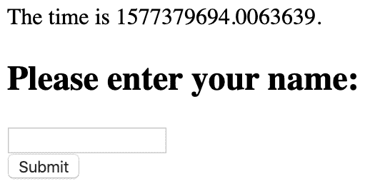
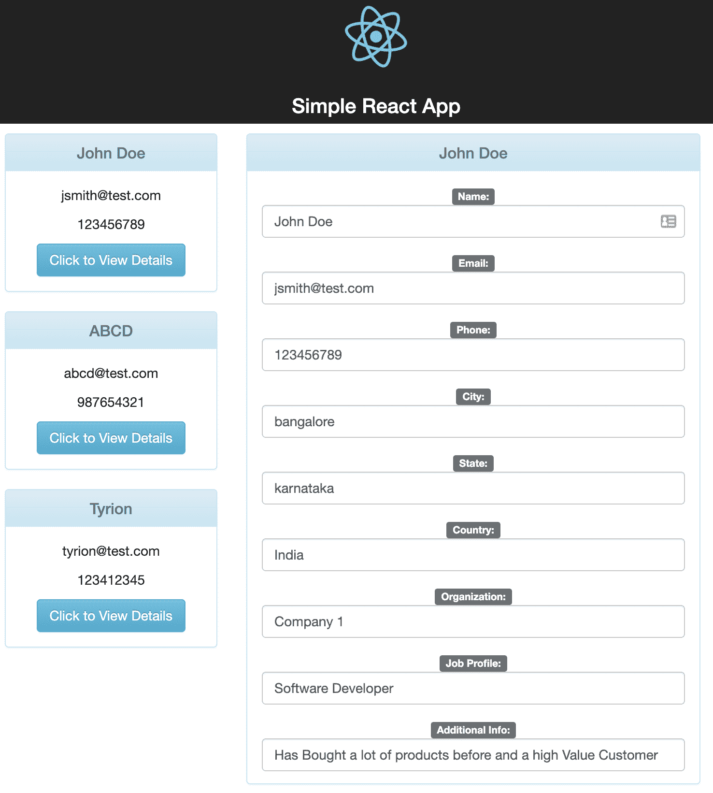

JavaScript, Ruler of the Frontend

如果你开始意识到 JavaScript 是现代网站和 web 应用程序功能不可或缺的一部分，那么你就走对了路。 如果没有 JavaScript，大多数我们认为理所当然的用户界面将不复存在。 让我们仔细看看 JavaScript 是如何将前端整合在一起的。 我们将使用几个 React 应用程序，同时比较和对比一个 Python 应用程序，以进一步理解 JavaScript 在前端的重要性。

本章将涵盖以下主题:

*   建立交互
*   使用动态数据
*   理解现代应用程序

# 技术要求

准备使用存储库[https://github.com/PacktPublishing/Hands-on-JavaScript-for-Python-Developers/tree/master/chapter-10](https://github.com/PacktPublishing/Hands-on-JavaScript-for-Python-Developers/tree/master/chapter-10)中的`Chapter-10`目录提供的代码。 由于我们将使用命令行工具，还需要提供终端或命令行 shell。 我们需要一个现代化的浏览器和本地代码编辑器。

# 建立交互

让我们来看看简单的**单页应用**(**SPA**)

1.  导航到`chapter-10`(`cd simple-reactjs-app`)中的`simple-reactjs-app`目录。
2.  使用`npm install`安装依赖项。
3.  使用`npm start`运行应用程序。
4.  访问应用程序在`http://localhost:3000`。 以下是你将看到的:


Figure 10.1 – Simple React app

当您单击细节按钮并检查网络选项卡时，您将看到页面没有重新加载，它只从服务器加载 JSON 数据。 这是 SPA 如何运行的一个非常基本的例子:使用最小的服务器，用户体验的交互是流线化的，有助于实现高效、低开销的工作流。 您可能熟悉其他 spa，如 Gmail、谷歌 Maps 和 Facebook，尽管底层技术各不相同。

在当今这个互联网技术时代，这可能是理所当然的，但 JavaScript 是这些应用程序工作的基础。 如果没有 JavaScript，即使使用 Ajax，我们也会有大量的页面重新加载和高等待时间。

让我们通过比较一个基本的 Python 示例和一个现代的 React 应用程序来看看如何处理动态数据。

# 使用动态数据

让我们首先来看一个 Python Flask 示例:

1.  导航到`chapter-10`(`cd flask`)中的`flask`目录。
2.  您需要为我们的设置安装一些组件。 以下是针对 Python 的说明:
    1.  用`python3 -m venv env`创建一个虚拟环境。
    2.  使用`. env/bin/activate`激活它。
    3.  安装要求:`pip3 install -r requirements.txt`。
    4.  现在可以启动应用程序:`python3 app.py`。
3.  进入`http://localhost:5000`页面。 你会看到:



Figure 10.2 – Basic Flask application

尝试输入或不输入您的名字，并查看这样做时页面重新加载的事实(我添加了一个时间戳，以便更容易看到，因为页面重新加载可能发生得太快而无法看到)。 这是一个非常基本的 Flask 应用程序，使用 Python 和 JavaScript 组合进行验证工作有更有效的方法，但在基本级别上，即使使用一些基于 Flask 的表单验证工具，我们看到的验证和交互都是在后台进行的。 每次我们点击 Submit，服务器都会被点击。 下面的截图显示了服务器端验证，如果你不输入字符串:


Figure 10.3 - Basic Flask validation

注意，时间戳发生了变化，这表明从服务器重新呈现。

让我们通过修改简单的 React 应用程序来让表单验证交互变得更好:

1.  导航到`reactjs-app-form`目录:`cd reactjs-app-form`。
2.  安装依赖项:`npm install`。
3.  启动服务器:`npm start`。
4.  进入`http://localhost:5000`页面。 这是我们的简单应用程序的更新版本:



Figure 10.4 – Simple app with dynamic data

现在尝试使用它，注意如果更改一个主要字段，左边的字段也会发生变化。 此外，当你编辑时，它会保存 JSON*，这样如果你刷新页面，你的更改就会保持不变。 这要归功于 JavaScript 的强大功能:React 前端处理你在应用程序的各个部分所做的所有更改，而 Express 后端则提供并保存 JSON 文件。 在这种情况下，对页面上标记的更新是实时发生的。 当然，我们在每次编辑时都使用保存和读取操作来访问服务器，但这是因为应用程序的设计方式。 要持久保存更改，只需创建一个 Save 按钮，而不是在更改字段时进行保存。*

如果你想使用这个例子，有几件事你需要做:

1.  首先，在新的 shell 窗口中导航到该目录(让前一个实例运行):`cd client`。
2.  执行`npm install`。
3.  节目开始:`npm start`。

然后，Express 服务器将收集 React 的运行进程创建的构建文件，以及目录中已经存在的预构建文件。

## 输入验证和错误处理

我们可以看到，对于这样的应用程序来说，动态数据的一个重要部分是*输入验证*和*错误处理*。 注意，在我们的应用程序中，如果电子邮件字段是空的，或者我们没有输入有效的电子邮件，它将有一个红色的大纲。 否则，它将有一个绿色的轮廓线。 当您键入一个有效的电子邮件地址并选择下一个字段时，您可以看到红色的大纲将更改为绿色，而不会碰到服务器(除了保存数据，正如我们前面讨论的)。 这是客户端验证，它在创建流线用户体验时非常强大:用户不必点击保存并等待服务器响应来查看他们是否输入了错误的数据。

在处理 Phone 字段时，您可能注意到了一个细节:它被限制为数字。 如果你看一下`client/src/CustomerDetails.js`，我们在这里将类型限制为数字:

```js
<Input name="phone" type="number" value={this.state.customerDetails.data.phone || ''} onChange={this.handleChange} />
```

这里还有一些其他的 React 组件。 让我们看一下`handleChange`函数:

```js
handleChange(event) {
   const details = this.state.customerDetails
   details.data[event.target.name] = event.target.value
   this.validate(event.target)

   this.setState({ customerDetails: details })
   console.log(this.state.customerDetails)

   axios.post(`${CONSTANTS.API_ROOT}/api/save/` + 
   this.state.customerDetails.data.id, details)
     .then(() => {
       this.props.handler();
     })
 }
```

Axios 是一个简化 Ajax 调用的库，我在这里使用它而不是`fetch`，只是作为演示。 您可能会看到在 React 中使用 Axios，尽管您总是可以选择使用原始的`fetch`。 然而，让我们关注`this.validate(event.target)`这一行。

这是函数的内容:

```js
validate(el) {
   const properties = (el.name) ? el : el.props

   if (properties.name === 'email') {
     if (validateEmail(properties.value)) {
       this.setState({ validate: { email: true }});
     } else {
       this.setState({ validate: { email: false }});
     }
   }
 }
```

`validateEmail()`是一个神奇的功能! 您可以在`client/src/validation.js`中找到它，它使用*正则表达式*对输入字符串进行模式匹配，以查看它是否像格式化正确的电子邮件地址。 然后，根据函数是否返回`true`或`false`，我们设置一个验证状态，React 将使用该状态来设置电子邮件字段的边框颜色。

前端验证和错误处理对于流畅的用户体验非常重要，但这只是故事的一部分。 另一部分是安全。

## 安全性和数据

正如您在使用浏览器中的开发人员工具时所知道的，如果您足够努力的话，几乎可以绕过任何前端限制。 例如，对于 Phone 字段，尽管我们在前端限制了它，但我们总是可以检查 HTML 并输入我们想要的任何值。 顺便提一下，在后台验证数据以确保其格式化正确也是很重要的。

企业数据泄露和黑客攻击的一个共同点是，攻击者利用了正在使用的系统中的一个弱点。 密码泄露的情况很少发生; 更常见的是，它是弱密码学，甚至是一个前端问题。 我们将在[第 17 章](17.html)，*安全和密钥*中进一步讨论安全性。 你可以在[OWASP.org](https://OWASP.org)了解更多。

让我们继续复习我们学过的内容。

# 理解现代应用程序

在这一点上，所有现代 web 应用程序都不可避免地使用 JavaScript 就不足为奇了。 没有它就没有现代网络，因为没有它互动就无法实时发生。 服务器端有它的位置和重要性，但用户看到的和与之交互的关键是由 JavaScript 控制的。

就像 CSS 是 HTML 的补充一样，JavaScript 是小组中的第三个朋友，它从标记和样式集合中创建有意义的体验。 作为 web 应用的肌肉，它为我们提供了丰富的交互和逻辑，是所有 spa 的基础。 它确实是一种创造奇迹和美丽的工具。

# 总结

有了 JavaScript，我们可以超越“网页”，创造出完全成熟的 web 应用程序。 从电子邮件系统到银行，再到电子表格，再到几乎任何你用电脑做的事情，JavaScript 都能帮到你。

在下一章中，我们将大胆地在服务器端使用 Node.js。 我们不会把前端完全抛在脑后，而是要看看它们是如何结合在一起的。