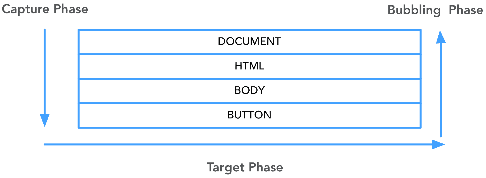
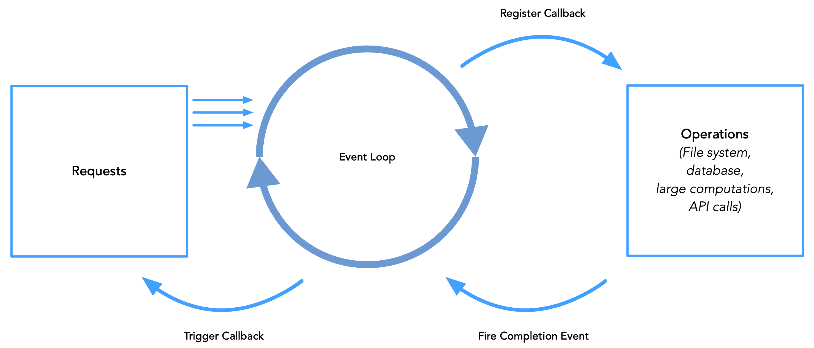

Node.js versus Python

为什么开发者会选择 Node.js 而不是 Python? 他们能合作吗? 我们的程序是什么样子的? 这些问题以及更多的问题是 Python 和 Node.js 之间一些差异的核心，理解何时何地使用特定语言是很重要的。 例如，在某些任务中，某一种语言比其他语言更适合，而提倡使用适当的语言是技术人员的责任。 让我们研究一下在选择 Node.js 和 Python 时的用例和不同的注意事项。

本章将涵盖以下主题:

*   Node.js 和 Python 之间的哲学差异
*   性能影响

# 技术要求

准备使用存储库[https://github.com/PacktPublishing/Hands-on-JavaScript-for-Python-Developers/tree/master/chapter-12](https://github.com/PacktPublishing/Hands-on-JavaScript-for-Python-Developers/tree/master/chapter-12)中的`Chapter-12`目录提供的代码。 由于我们将使用命令行工具，还需要提供终端或命令行 shell。 我们需要一个现代化的浏览器和本地代码编辑器。

# Node.js 和 Python 之间的哲学差异

拥有一种你知道、使用和熟悉的主要语言是很常见的。 然而，重要的是要认识到并非所有编程语言都是为了相同的目的而创建的。 这就是为什么使用正确的工具来完成手头的工作是非常重要的。 就像你不会试图用小刀盖房子一样，你可能也不会用台锯把树枝削成尖头，用来生火做夹心饼干。

如果你在这个行业已经有一段时间了，你可能听说过**堆栈**这个术语。 在技术中，堆栈是用于在生态系统中创建一个或多个程序的技术的架构组合。 在过去，应用往往是大型的**巨石**，建立在“一个应用统治所有”的心态。 在今天的世界里，单一的应用正在减少，越来越多的小型应用和**微服务**得到了青睐。 通过这种方式，工作流的不同部分可以分布到完全独立的过程中，大大提高了整个系统的稳定性。

下面以 Office 软件为例。 你肯定不会试图用微软 Excel 来写你的下一本畅销小说，你可能也不想用微软 Word 来报税。 在这些项目之间有一个关注点分离。 它们可以很好地结合在一起，形成一个统一的整体，但在你的工作流程中，每一个都有自己的部分。

同样，web 应用中不同的技术也有各自的用途和关注点。 一个更传统的栈用于 web 应用被称为**LAMP**(**Linux, Apache, MySQL，和 PHP**):


Figure 12.1 – LAMP stack

你可以看到，当讨论具体的 web 应用时，我们将 web 浏览器和客户端堆栈作为给定的和未知的，而不是在缩写 LAMP 中列出。 在本例中，LAMP 只是服务器端组件。

随着网络的发展，支持它的底层技术及其栈也在不断发展。 更常见的两个堆栈你可能听说现在**的意思是**(**MongoDB,表达、角和 node . js)**和**MERN**(**MongoDB,表达、反应和 node . js**)。 技术上的唯一区别是 Angular 和 React，这并非巧合。 它们在一个稳定的系统中扮演着基本相同的角色。 我们将探索表达,node . js 的无处不在的网络服务器框架,在【显示】第十三章,*使用表达*,在【MongoDB 病人】18 章,*node . js 和 MongoDB*。 现在，让我们关注一下*为什么使用 Node.js?* 。

在为项目选择语言时，有许多因素要考虑。 其中一些建议如下:

*   类型的项目
*   预算
*   上市时间
*   性能

这些听起来可能是非常基本的因素，但我确实看到过选择的技术不适合项目类型的例子。

对于那些专注于软件 web 方面的人来说，在后台使用 JavaScript 还是使用其他语言之间做出选择似乎是显而易见的。 JavaScript 是现代网络使用的基础，因此它听起来应该同时在客户端和服务器端使用。

然而，Python 已经存在了更长的时间，并且在开发社区中有着稳固的立脚点，特别是随着对数据科学和机器学习的兴趣的爆炸式增长，Python 在这些领域占据了主导地位。 Flask 和 Django 都是非常强大的 web 框架。 那么，为什么我们要使用 Node.js 呢?

决定使用什么技术堆栈的第一部分是理解项目的*类型。 对于我们今天讨论的范围，让我们将项目类型限制在合理的用例中。 我们不会向物联网/连接设备打开蠕虫罐头，因为它们大多是用 Java 编写的。 让我们也尽可能排除机器学习和数据科学的用例，因为已经确定 Python 更适合这些用例。 然而，对于使用 JavaScript 开发桌面和移动应用，确实存在争议。*

首先，让我们考虑一下我们的项目是否是一个 web 应用。 在大多数情况下，Node.js 在逻辑上比 Python 更适合，原因有很多，我们已经探讨过了:它的异步特性、更少的上下文切换、性能等等。 我很难想出一个合适的用例，在 web 应用中使用 python 后端会优于 Node.js。 我相信有一些是存在的，但一般来说，即使在处理更大、更复杂的系统时，今天的首选也不是一个单片的后端应用，而是一个通过数据切换相互交互的*微服务*的组合。

让我们来看看一个可能的**高层架构**(**HLA**)图。 如果您正在处理复杂的应用，了解系统的 HLA 是非常有用的。 即使您只积极地处理应用的一部分，了解其他系统的需求和结构也是非常宝贵的。 在这个例子中，我们有一个可能的电子商务网站架构，它也有一个移动应用:


Figure 12.2 – High-level architecture

我们可以看到有多种微服务，包括一些*而不是*Node.js 或 JavaScript。 Python 更适合作为一个微服务，为整个应用提供建议，因为这需要数据分析，而 Python 和 R 比 Node.js 更擅长做数据分析。 此外，您可以看到，在应用中，可以有多个不同的数据源，从第三方到不同的数据库类型。

我们的项目怎么样了? 我们是在构建一个庞大的生态系统，还是其中的一个特定部分? 在这个例子中，web 应用、支付服务、帐户服务和库存服务都是 Node.js，因为使用为异步通信设计的技术是有意义的。 然而，推荐引擎可以是一个*完全独立的堆栈*，没有任何问题，因为它包含在整个微服务生态系统中。 只要应用的各个部分适当地相互通信，每个服务就可以几乎是独立的。

为什么这很重要? 简单地说，这是一种让更小、更敏捷的团队并行工作的好方法，以创建比单片应用交付更快、更稳定的软件。 让我们来看一个例子:你点击一个大型零售商的网站进行购买，但看到的不是主页，而是以下内容:


Figure 12.3 – 500! Error, error, danger, danger!

任何 web 应用开发人员生命中的祸根:由代码问题引起的全面宕机。 相反，如果网站大部分时间都能正常运行，不是更好吗?但是，也许当结账的时候，它说:“对不起，我们的支付处理系统目前离线。” 我们把你的车留到以后用。” 或者假设推荐引擎的 python 部分崩溃了——我们可以在一个静态的项目集合中提供服务。 为了创造性地为一个大的微服务生态系统构建一个真实的用户体验，重要的是要考虑终端用户的立场*和*业务目标。 在我们的电子商务商店的情况下，我们不希望整个应用因为一个小错误而崩溃。 相反，如果出现问题，我们可以明智地降低体验。 这是通常被称为容错计算原则的一个例子，在设计大型应用时，为了更容错，将整体分割为微服务是非常强大的。

在讨论预算之前，我想向您展示一个 JavaScript 在桌面领域的强大功能。 让我们在 GitHub 存储库[https://github.com/PacktPublishing/Hands-on-JavaScript-for-Python-Developers/tree/master/chapter-12/electron](https://github.com/PacktPublishing/Hands-on-JavaScript-for-Python-Developers/tree/master/chapter-12/electron):中运行一段示例代码。

1.  使用`npm install`安装依赖项。
2.  使用`npm start`运行应用。

[第 7 章](07.html)、*事件、事件驱动设计和 api:*


Figure 12.4 – It's a desktop app!

这是怎么发生的? 我们利用了一个很棒的工具:电子。 你可以在[https://electronjs.org/](https://electronjs.org/)上阅读更多关于 Electron 的内容，但要点是它是一个容器工具，可以将 HTML、CSS 和 JavaScript 作为桌面应用呈现。 你可能已经在没有意识到的情况下使用过 Electron: Spotify、Slack 和其他流行的桌面应用都是用 Electron 构建的。

让我们快速浏览一下它的内部结构:

```js
.
├── fonts
│   ├── pokemon_solid-webfont.woff
│   └── pokemon_solid-webfont.woff2
├── images
│   └── pokemon-2048x1152.jpg
├── index.html
├── main.js
├── package-lock.json
├── package.json
├── poke.js
├── preload.js
├── renderer.js
└── style.css
```

如果我们比较这 PokeAPI 项目从[第七章](07.html),*事件,事件驱动的设计,和 api*,[(https://github.com/PacktPublishing/Hands-on-JavaScript-for-Python-Developers/tree/master/chapter-7/pokeapi/solution-code),我们会发现有很多相似之处。](https://github.com/PacktPublishing/Hands-on-JavaScript-for-Python-Developers/tree/master/chapter-7/pokeapi/solution-code)

**等待。**

不仅仅是相似之处…这是我们在浏览器中使用的代码的*相同的*! `main.js`更名为`poke.js`以避免命名冲突，但这是一个小细节。 是的:你刚刚用现有代码成功地创建了一个桌面应用。

那么，回到预算问题:如果你需要一个网页应用*和*桌面应用呢? 现在你应该明白了，有了 JavaScript，你就可以同时拥有两个世界的优点，用最小的改变就可以拥有一个现代的 web 应用*和一个桌面应用*。 细微差别比我们在这里做的要多一点，但电子的力量应该是显而易见的。 编写一次，多次使用——这难道不是 DRY 编码的咒语吗?

然而，这种观点也有另一面。 由于 Python 比 Node.js 成熟得更久，所以 Python 开发人员的时薪可能比 Node.js 开发人员更划算。 然而，我认为这是次要的问题。

同样，作为次要考虑，*上市时间*确实是在选择技术时出现的问题。 不幸的是，这里的数字并不是决定性的。 因为 Node.js 是 JavaScript，从理论上讲，它可以快速迭代地开发。 然而，Python 显式且简单的语法有时会使编写速度更快。 这是一个很难解决的问题，所以最好考虑时间方面的另一部分:技术债务。 技术债务是工程团队的祸根，它只是意味着，以最优解决方案为代价，实现了一个更快的解决方案。 此外，技术的损耗会导致技术债务。 还记得千年虫吗? 当人们发现世界上许多主要应用都依赖于两位数年份时，人们担心 1999 年到 2000 年的变化会对计算机系统造成严重破坏。 幸运的是，只发生了一些小故障，但出现了技术债务的问题:许多系统使用的语言后来变得晦涩难懂。 找到开发这些修复程序的程序员是困难和昂贵的。 同样地，如果您选择一种技术是因为它更快，您可能会发现自己在预算和时间方面的初始投资是它的两倍或三倍，以重构应用以满足持续的需求。

让我们把注意力转向性能。 这里有很多需要考虑的问题，所以让我们继续讨论下一节，并讨论为什么在讨论 Node.js 时总是要考虑性能。

# 性能影响

当 Node.js 刚开始流行时，有人担心它的单线程特性。 单线程意味着一个 CPU，而一个 CPU 可能会被大量流量淹没。 然而，在大多数情况下，所有这些线程问题都被服务器技术、托管和 DevOps 工具的进步所缓解。 话虽如此，单线程本质本身也不应该是一个威慑:我们将在这里讨论一点，为什么*Node 事件循环*在任何关于 Node.js 性能的讨论中扮演着重要的角色。

简而言之，要真正区分性能，我们应该关注*感知*性能。 Python 是一种易于理解、健壮、面向对象的编程语言; 对此没有争议。 然而，有一件事它不能、不能、也不会在浏览器中运行。 这个位置被 JavaScript 占据了。

为什么这很重要，它与绩效有什么关系? 简而言之:*Python 不能对浏览器的变化做出反应。* 当页面的 UI 发生变化时，可以执行 Ajax 请求，但这对于浏览器和服务器来说都是非常昂贵的计算。 此外，您必须让浏览器在每次更改时等待来自服务器的响应，从而导致非常滞后的体验。 因此，我们在浏览器中做的客户端工作越多越好。 我们的目标是在需要与服务器通信之前在浏览器中使用 JavaScript 来处理逻辑。

关于使用 Node.js 的讨论中隐含着一个你可能从上一节中得到的想法:*Node.js 也不能在浏览器中运行! 那是真的! 然而，Node.js 是基于 Chrome 解释器的，因此，它的设计中隐含了异步的想法。 Node.js 的事件循环是为事件而设计的——事件的固有概念是它们是异步的。*

让我们回顾一下[第 7 章](07.html)、*事件、事件驱动设计和 api*中的下图:



Figure 12.5 – The event life cycle

如果您还记得，这个图表示浏览器事件的三个阶段:捕获、目标定位和冒泡。 DOM 事件特别与用户或程序本身在浏览器中引起的动作、交互或触发器有关。

类似地，Node.js 的事件循环也有生命周期:



Figure 12.6 - The Node.js event loop

让我们解释这个。 单线程事件循环在 Node 应用的生命周期中运行，接受来自浏览器、另一个 API 或其他源的入站请求，并执行其工作。 如果它是一个简单的请求或指定为同步请求，则可以立即返回。 对于更密集的操作，Node 将注册一个*回调*。 记住，这是一个术语，指的是传递给另一个函数，以便在传递的函数完成其工作时执行的函数。 到目前为止，我们已经在 JavaScript 中广泛使用了*事件处理程序*。 js 事件循环提供了一种有效的方法来访问和向应用提供数据。

如果您不太熟悉线程和进程的概念，也没关系，因为我们不会在这里深入研究。 但是，有必要指出关于 Node 使用进程和线程的一些事实。 一些计算机科学家表示，Node 的单线程特性本质上是不可扩展的，它无法承受成熟的 web 应用所需要的流量。 然而，正如我前面提到的，我们的应用并不是生活在竖井中。 没有一个需要为规模设计的应用会单独挂在服务器上。 随着 Amazon AWS 等云技术的出现，可以很容易地合并多个虚拟机、负载平衡器和其他虚拟工具，以适当地分配应用的负载。 是的，Python 可能更适合作为一个单箱应用来接收成千上万的传入请求，但这个性能基准已经过时，并且与当今的技术状态不符。

## 购者自慎

既然我们已经爱上了 Node，那么让我们回到当前任务的正确工具的概念上来。 Node 不是解决世界上所有计算问题的灵丹妙药。 事实上，它是专门为瑞士军刀设计的*而不是*。 它有它的用途和它的位置，但它并不试图成为每个人的一切。 Java“无所不能”的特性可能被认为是它的弱点之一，因为尽管您可以一次编写 Java 代码并针对几乎任何体系结构进行编译，但仍然存在一些限制、考虑和权衡。 从本质上讲，Node.js 和 JavaScript 都试图保持自己的风格。

那么，有什么条件呢? 我们知道 JavaScript 快速、强大、有效且易于理解。 就像任何技术一样，总会有一些细微的差别，JavaScript 和 Node 的细微差别之一就是在某些 Linux 系统中，当你第一次以超级用户身份登录时，会出现这样的咒语:“能力越大，责任越大。” 虽然这句话的出处很模糊，但在执行任何对他人有影响的事情时，一定要考虑清楚。 (不要用催眠术做坏事!)

抛开玩笑不谈，异步环境可能会出现一些非常现实的问题。 我们知道，我们可以很容易地用自己的客户端 JavaScript 代码让用户的浏览器陷入无限循环，从而崩溃。 考虑以下代码:

```js
let text = ''

while (1) {
  text += '1'
}
```

太好了。 如果您要在浏览器中运行此脚本，可能发生的最佳*是浏览器会识别出一个无限循环，并提示您退出脚本，因为页面没有响应。 第二种结果是浏览器崩溃，在最坏的情况下，用户的整个机器可能会因为内存不足而崩溃。 有大能力……*

 *类似地，我们可能会因为不正确地处理状态和事件而严重影响用户在 Node 中的体验。 例如，如果您的前端代码依赖于某个 Node 进程，而该进程从未返回，该怎么办? 幸运的是，在大多数情况下，内置的 Ajax 保护措施可以防止这种情况，因为 HTTP 请求在默认情况下会在一段时间后关闭，并在必要时出错。 话虽如此，有很多方法可以迫使连接保持打开状态，从而给用户的浏览器造成绝对的混乱。 这样做有充分的理由，比如对实时数据的长轮询，这就是它们存在的原因。 另一方面，它也可能意外地给用户造成重大问题。 故障安全措施，如超时请求，是为你提供保护的，但任何优秀的工程师都会告诉你:不要依赖故障安全措施，避免在设计过程中出现错误。

# 总结

Python 是伟大的。 节点是伟大的。 两者都是伟大的。 那我们为什么要谈这个? 虽然这两种技术都是强大和成熟的，但它们在技术生态系统中都有自己的角色。 并不是所有的语言都生来平等，也不是所有的语言都以同样的方式处理问题。

综上所述，我们学到了以下几点:

*   Node.js 是异步的，可以很好地配合基于事件的思想，比如浏览器中响应页面事件的 JavaScript。
*   Python 已经成为数据分析和机器学习领域的领导者，因为它能够快速处理大型数据集。
*   对于网络工作来说，这些技术可能是可以互换的，但是一个复杂的体系结构可能包括这两种技术(甚至更多!)

在下一章中，我们将开始使用 Express，这是 Node.js 的基础 web 服务器。 我们将创建自己的网站，并与他们合作。

# 进一步的阅读

这里有一些关于这些主题的阅读资料:

*   statofjs:[https://2019.stateofjs.com/](https://2019.stateofjs.com/)
*   [https://www.similartech.com/compare/nodejs-vs-python](https://www.similartech.com/compare/nodejs-vs-python)
*   模式-微服务架构:[https://microservices.io/patterns/microservices.html](https://microservices.io/patterns/microservices.html)
*   亚马逊 API 网关:[https://aws.amazon.com/api-gateway/](https://aws.amazon.com/api-gateway/)
*   电子:[https://electronjs.org/](https://electronjs.org/)
*   Y2K bug:[https://www.britannica.com/technology/Y2K-bug](https://www.britannica.com/technology/Y2K-bug)
*   Node.js 多线程:[https://blog.logrocket.com/node-js-multithreading-what-are-worker-threads-and-why-do-they-matter-48ab102f8b10/](https://blog.logrocket.com/node-js-multithreading-what-are-worker-threads-and-why-do-they-matter-48ab102f8b10/)*