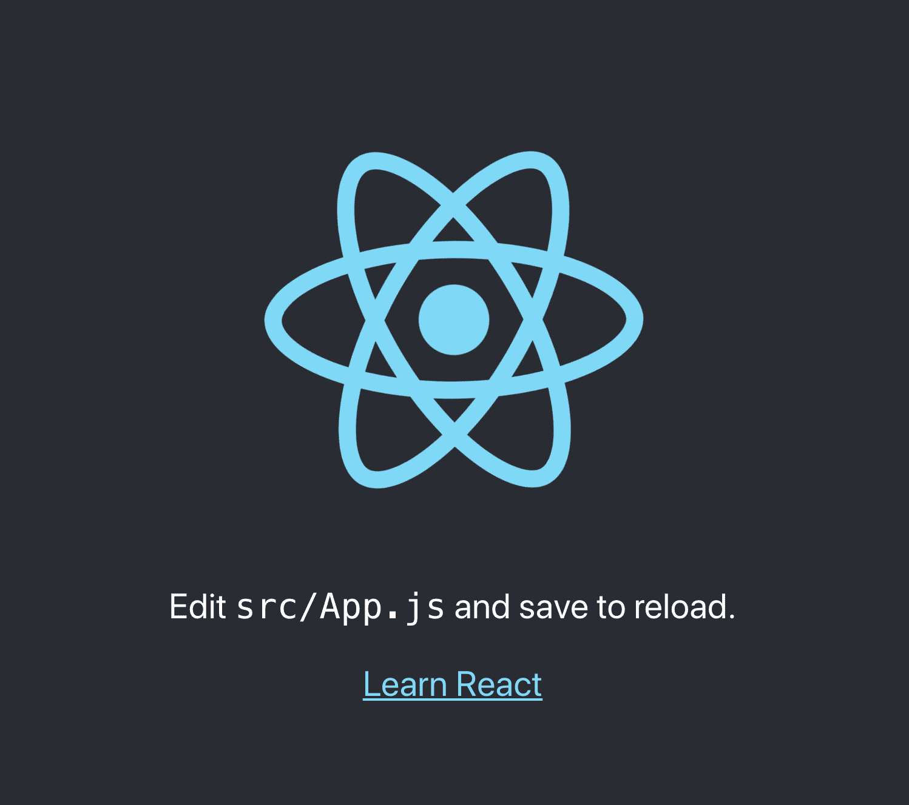
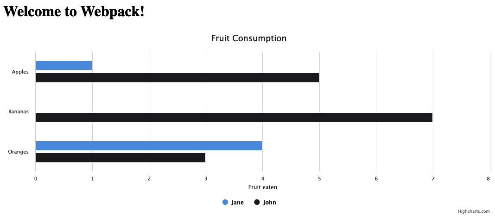

# 十六、Webpack 入门

现在你有了漂亮的前端和后端代码。 太棒了! 放在你的笔记本电脑上看起来很漂亮，那么下一步该怎么办呢? 把它发布给全世界! 这听起来很简单，但当我们使用高级 JavaScript 时，比如 React，我们可能需要采取更多的步骤来确保我们的代码以最高效率运行，所有依赖项都得到解决，并且一切都与现代技术兼容。 此外，下载大小也是一个主要考虑因素，所以让我们来探索 webpack，一个帮助缓解这些担忧的工具。

我们将在本章中讨论以下几点:

*   对绑定和模块的需求
*   使用 webpack
*   部署

# 技术要求

准备使用存储库的`Chapter-16`目录中提供的代码:[https://github.com/PacktPublishing/Hands-on-JavaScript-for-Python-Developers/tree/master/chapter-16](https://github.com/PacktPublishing/Hands-on-JavaScript-for-Python-Developers/tree/master/chapter-16)。 由于我们将使用命令行工具，还需要您的终端或命令行 shell。 我们需要一个现代化的浏览器和本地代码编辑器。

# 对绑定和模块的需求

理想情况下，网站上的一切都将无缝运行，而不需要采取任何额外的步骤。 你把你的源文件，放到一个网络服务器上，然后 voilà:一个网站。 然而，情况并非总是如此。 例如，使用 React，我们需要运行`npm run build`来为我们的项目生成一个输出分发目录。 我们也可能有其他类型的非源文件，比如 SASS 或 TypeScript，它们需要被转换成浏览器能够理解的本地文件格式。

那么，什么是*模块*? 有**模块化编程**的概念，它将大型程序通过关注和封装(范围)将它们分离成更小的、包含的块，称为模块。 模块化编程背后的思想有很多:范围、抽象、逻辑设计、测试和调试。 类似地，包是浏览器可以轻松使用的代码块，通常由一个或多个模块构建。

现在是有趣的部分:*我们已经工作了模块*! 让我们看一下我们在[11 章](11.html)，*中编写的 Node.js 代码。*

```js
const readline = require('readline')
const randomNumber = Math.ceil(Math.random() * 10)

const rl = readline.createInterface({
 input: process.stdin,
 output: process.stdout
});

askQuestion()

function askQuestion() {
 rl.question('Enter a number from 1 to 10:\n', (answer) => {
   evaluateAnswer(answer)
 })
}

function evaluateAnswer(guess) {
 if (parseInt(guess) === randomNumber) {
   console.log("Correct!\n")
   rl.close()
   process.exit(1)
 } else {
   console.log("Incorrect!")
   askQuestion()
 }
}
```

在第一行中，我们使用了一个名为`readline`的模块，如果您回想一下我们的程序，它将用于从命令行获取用户输入。 我们也在 react 中使用了它们——在任何需要使用`npm install`的时候，我们都在使用模块的概念。 为什么这很重要呢? 让我们从头开始考虑一个标准的`create-react-app`安装:

1.  使用`npx`创建一个新的 React 项目:`npx create-react-app sample-project`。
2.  导航到该目录并安装依赖项:`cd sample-project ; npm install`。
3.  以`npm start`开始项目。

如果你还记得，这给了我们一个非常有趣的开始页:



Figure 16.1 – The React start page

当我们运行`npm install`时，我们真正得到的是什么? 让我们看看我们的文件结构:

```js
.
├── README.md
├── package-lock.json
├── package.json
├── public
│   ├── favicon.ico
│   ├── index.html
│   ├── logo192.png
│   ├── logo512.png
│   ├── manifest.json
│   └── robots.txt
├── src
│   ├── App.css
│   ├── App.js
│   ├── App.test.js
│   ├── index.css
│   ├── index.js
│   ├── logo.svg
│   ├── serviceWorker.js
│   └── setupTests.js
└── yarn.lock
```

到目前为止很简单。 但是，在这个清单中，我特意排除了`node_modules`目录。 这里面有 18 个文件。 尝试在我们项目的根目录下运行这个命令，它不排除那个目录:`tree`。 享受观看代码行——32418 个文件! 这些都是从哪里来的呢? 我们的朋友，`npm install`!

## package.json

我们项目的结构部分是由管理依赖关系的`package.json`文件控制的。 大多数绑定器，比如 webpack，会利用这个文件中的信息来创建依赖关系图和小模块。 让我们来看看:

*包装。 json:*

```js
{
 "name": "sample-project",
 "version": "0.1.0",
 "private": true,
 "dependencies": {
   "@testing-library/jest-dom": "^4.2.4",
   "@testing-library/react": "^9.3.2",
   "@testing-library/user-event": "^7.1.2",
   "react": "^16.13.1",
   "react-dom": "^16.13.1",
   "react-scripts": "3.4.1"
 },
 "scripts": {
   "start": "react-scripts start",
   "build": "react-scripts build",
   "test": "react-scripts test",
   "eject": "react-scripts eject"
 },
 "eslintConfig": {
   "extends": "react-app"
 },
 "browserslist": {
   "production": [
     ">0.2%",
     "not dead",
     "not op_mini all"
   ],
   "development": [
     "last 1 chrome version",
     "last 1 firefox version",
     "last 1 safari version"
   ]
 }
}
```

这是一个标准的、基本的包文件; 它只包含六个依赖项:一半用于测试，一半用于 React。 现在，有趣的部分来了:每个依赖项依次有自己的依赖项，这就是为什么我们最终在我们的`node_modules`目录中有 32400 个文件。 通过使用模块，我们不必手工构建或管理依赖; 我们可以遵循 DRY 原则，并利用其他人(或我们)以模块形式编写的现有代码。 正如我们在比较 Python 和 Node.js 时所讨论的，`npm install`类似于`pip install`，因为我们在 Python 程序中使用的是带有`import`关键字的包，而在 Node.js 中使用的是`require`。

当我们使用`npm install`安装一个新包到我们的项目中，它将添加一个条目到`package.json`。 如果您要对这个文件进行任何编辑，您需要非常小心。 一般来说，您不需要进行太多的更改，尤其应该避免对依赖项进行实质性的更改。 利用`install`命令。

## 构建管道

让我们看看准备 React 项目部署时会发生什么。 运行`npm run build`，观察输出。 你应该看到类似如下的输出:

```js
Creating an optimized production build...
Compiled successfully.

File sizes after gzip:

  39.39 KB  build/static/js/2.deae54a5.chunk.js
  776 B     build/static/js/runtime-main.70500df8.js
  650 B     build/static/js/main.0fefaef6.chunk.js
  547 B     build/static/css/main.5f361e03.chunk.css

The project was built assuming it is hosted at /.
You can control this with the homepage field in your package.json.

The build folder is ready to be deployed.
You may serve it with a static server:

  yarn global add serve
  serve -s build

Find out more about deployment here:

  bit.ly/CRA-deploy
```

如果查看构建目录，您将看到经过精心压缩的 JavaScript 文件，这些文件被打包用于高效部署。 下面是有趣的部分:`npm run build`*来自*`create-react-app`*在引子下使用 webpack ! `create-react-app`设置为我们处理这些部分。 修改`create-react-app`webpack 设置的内部是有点棘手的，所以现在让我们看看如何在 React 的使用案例之外直接使用 webpack。*

# 使用 webpack

现在，webpack 是可以在你的程序中使用的许多模块化工具之一。 此外，与 React 脚本不同的是，它可以在 React 之外使用:它可以作为许多不同类型的应用的捆绑器。 为了让我们动手，让我们创建一个小的、无用的示例项目:

1.  创建一个新目录并导航到它:`mkdir webpack-example ; cd webpack-example`。
2.  我们将使用 NPM，所以我们需要初始化它。 我们也将接受默认值:`npm init -y`。
3.  然后我们必须安装 webpack:`npm install webpack webpack-cli --save-dev`。

注意，我们在这里使用`--save-dev`是因为我们不需要将 webpack 构建到我们的生产级文件中。 通过使用开发依赖，我们可以帮助减小包的大小，如果包膨胀，这个因素会减慢应用的速度。

如果你在这里查看`node_modules`目录，你会看到我们已经安装了超过 3500 个来自我们的依赖项的文件。 我们的项目相当无聊，因为我们没有任何内容! 让我们修复这个问题并创建一些文件，如下所示:

【index.html】

```js
<!DOCTYPE html>
<html lang="en">
<head>
 <meta charset="UTF-8">
 <meta name="viewport" content="width=device-width, initial-scale=1.0">
 <title>Webpack Example</title>
</head>
<body>
 <h1>Welcome to Webpack!</h1>
 <script src="index.js"></script>
</body>
</html>
```

src/index.js

```js
console.log('hello')
```

到目前为止，非常令人兴奋和有用，对吧? 如果您在浏览器中打开我们的索引页，您将在控制台中看到您所期望的内容。 现在我们将引入 webpack:

1.  将`package.json``scripts`节点修改为:

```js
"scripts": {
    "test": "echo \"Error: no test specified\" && exit 1",
    "dev": "webpack --mode development",
    "build": "webpack --mode production"
  },
```

2.  运行`npm run dev`。 你应该看到这样的输出:

```js
> webpack --mode development

Hash: 21e0ae2cc4ae17d2754f
Version: webpack 4.43.0
Time: 53ms
Built at: 06/14/2020 1:37:27 PM
  Asset      Size  Chunks             Chunk Names
main.js  3.79 KiB    main  [emitted]  main
Entrypoint main = main.js
[./src/index.js] 20 bytes {main} [built]
```

现在继续，在你新创建的`dist`目录中查找:

```js
dist
└── main.js
```

如果你打开`main.js`，你会发现它看起来*和我们的`index.js`很不一样! 这是 webpack 在做一些底层工作，使我们迈出模块化的第一步。*

等待。 我们从一行代码变成了 100 行。 这到底为什么更好? 好吧，对于这个简单的例子，它可能不是，但幽默我一段时间。 让我们尝试`npm run build`并比较输出:`main.js`现在是一行，缩小了。

看看我们的`package.json`文件，除了我们操作的脚本节点，我们还会看到一些值得注意的部分:

```js
{
 "name": "webpack-example",
 "version": "1.0.0",
 "description": "",
 "main": "index.js",
 "scripts": {
   "test": "echo \"Error: no test specified\" && exit 1",
   "dev": "webpack --mode development",
   "build": "webpack --mode production"
 },
 "keywords": [],
 "author": "",
 "license": "ISC",
 "devDependencies": {
   "webpack": "^4.43.0",
   "webpack-cli": "^3.3.11"
 }
}
```

我们看到一个`"main"`节点，它指定了一个`index.js`作为我们的主入口点，或者 webpack 开始查找它的依赖项。

在使用 webpack 时，有三个重要的概念需要理解:

*   **入口**:webpack 开始工作的地方。
*   **Output**:webpack 输出成品的地方。 如果我们查看前面测试的输出，我们会看到`main.js 3.79 KiB main [emitted] main`。 webpack 不是“吐出”这个短语，而是更优雅地将它定义为“发出”它的包。

*   :如前所述，webpack 可以用于各种不同的目的; 然而，默认情况下，webpack 只处理 JavaScript 和 JSON 文件。 因此，我们使用*装载机*做更多的工作。 我们将在一分钟内使用一个操作`index.html`文件。

模式和插件的概念也很重要，尽管更容易解释:模式，就像我们在`package.json`中添加脚本时看到的那样，定义了我们的环境优化是需要开发、生产还是“不需要”。 还有更多的模式，但现在，我们不会疯狂- webpack 是相当复杂的，所以表面的理解是一个很好的地方开始。 插件基本上做了加载器做不到的事情。 不过，我们将保持它的简单性，现在我们将添加一个理解 HTML 文件的加载器。 振作起来，输出并不是你所想的

 *1.  运行`npm install html-loader --save-dev`。
2.  现在我们需要一个配置文件，所以创建`webpack.config.js`。
3.  进入`webpack.config.js`:

```js
module.exports = {
  module: {
    rules: [
      {
        test: /\.html$/i,
        loader: 'html-loader',
      },
    ],
  },
};
```

4.  修改`index.js`如下:

```js
import html from './index.html'

console.log(html)
```

5.  修改脚本标签`index.html`，如下:`<script src="../dist/main.js"></script>`。
6.  重新运行`npm run dev`，然后在浏览器中打开该页面。

如果我们查看控制台，就会看到 HTML! 哇! 除了我们的`<script>`标签在`src`上写着`"[Object object]"`外，其他的东西都差不多。 现在你应该问问自己:“我们到底完成了什么?”

事实证明，加载器*不是我们想要的*! 当你需要插件时使用加载器是一个常见的错误，反之亦然。 现在让我们展开我们所做的，并安装一个 HTML 插件，*将*做我们期望的事情:用优化的`main.js`文件将`index.html`插入`dist`目录:

1.  我们实际上并不需要 HTML 加载器来完成这个任务:`npm uninstall html-loader`。
2.  安装正确的插件:`npm install html-webpack-plugin --save-dev`。
3.  用以下配置完全替换`webpack.config.js`的内容:

```js
var HtmlWebpackPlugin = require('html-webpack-plugin');
var path = require('path');

module.exports = {
 entry: './src/index.js',
 output: {
   path: path.resolve(__dirname, './dist'),
   filename: 'index_bundle.js'
 },
 plugins: [new HtmlWebpackPlugin({
   template: './src/index.html'
 })]
};
```

4.  将`index.js`修改为原来的`console.log('hello')`行。
5.  将`<script>`标签从`src/index.html`中移除。 它将为我们建造。
6.  执行`npm run dev`。
7.  最后，在浏览器中打开`dist/index.html`。

这应该更符合您的喜好，也更符合您使用 webpack 的期望。 不过，这是一个非常基本的例子，我们看看能不能做点更有趣的。 编辑文件如下:

【index.html】

```js
<!DOCTYPE html>
<html lang="en">
<head>
 <meta charset="UTF-8">
 <meta name="viewport" content="width=device-width, initial-scale=1.0">
 <title>Webpack Example</title>
</head>
<body>
 <h1>Welcome to Webpack!</h1>
<div id="container"></div>
</body>
</html>
```

src/index.js

```js
import Highcharts from 'highcharts'

// Create the chart
Highcharts.chart('container', {
 chart: {
   type: 'bar'
 },
 title: {
   text: 'Fruit Consumption'
 },
 xAxis: {
   categories: ['Apples', 'Bananas', 'Oranges']
 },
 yAxis: {
   title: {
     text: 'Fruit eaten'
   }
 },
 series: [{
   name: 'Jane',
   data: [1, 0, 4]
 }, {
   name: 'John',
   data: [5, 7, 3]
 }]
});
```

对于本例，我们使用 Highcharts，一个图表库。 这是他们的样板例子，直接取自他们的网站; 除了将第 1 行修改为`import Highcharts from 'highcharts'`外，我没有对它做任何花哨的操作。 这意味着我们将使用一个模块，所以让我们安装它-

1.  将此脚本添加到您的`package.json``scripts`节点:`"watch": "webpack --watch -- mode development"`。
2.  运行`npm run watch`。

3.  在浏览器中加载`dist/index.html`



Figure 16.2 – Webpack with Highcharts

更有趣，你不觉得吗? 另外，花点时间看看`index_bundle.js`文件，并注意更大的文件和缩小的代码。 如果你在`src`中编辑一个文件，使用`watch`，webpack 会自动为你重新打包文件。 如果您正在使用动态服务器进行热加载，例如使用 Visual Studio Code，它还会为您刷新页面，便于快速开发!

是时候试试我们一直在打造的东西了。 让我们尝试构建接下来部署的项目。

# 部署我们的项目

到目前为止，我们已经完成了大量的开发工作，现在是时候尝试我们项目的产品构建了。 运行`npm run build`，嗯，它不是很开心，不是吗? 你应该得到如下警告:

```js
WARNING in asset size limit: The following asset(s) exceed the recommended size limit (244 KiB).
This can impact web performance.
Assets: 
  index_bundle.js (263 KiB)

WARNING in entrypoint size limit: The following entrypoint(s) combined asset size exceeds the recommended limit (244 KiB). This can impact web performance.
Entrypoints:
  main (263 KiB)
      index_bundle.js

WARNING in webpack performance recommendations: 
You can limit the size of your bundles by using import() or require.ensure to lazy load some parts of your application.
For more info visit https://webpack.js.org/guides/code-splitting/
Child HtmlWebpackCompiler:
     1 asset
    Entrypoint HtmlWebpackPlugin_0 = __child-HtmlWebpackPlugin_0
    [0] ./node_modules/html-webpack-plugin/lib/loader.js!./src/index.html 522 bytes {0} [built]
```

这到底想告诉我们什么? 还记得我说过 bundle 大小对性能的影响吗? 让我们尝试优化它，使我们不再得到这些消息。 我们将研究一些实现此目的的开发技术。

## 组块

简单地说，分块就是将大文件分割成小文件块的方法。 我们可以通过在插件节点后添加`webpack.config.js`文件来轻松完成这部分:

```js
optimization: {
   splitChunks: {
     chunks: 'all',
   }
 }
```

现在，继续建设; it'll be a*little*happier:

```js
Built at: 06/14/2020 3:46:38 PM
                 Asset       Size  Chunks                    Chunk Names
            index.html  321 bytes          [emitted]         
        main.bundle.js   1.74 KiB       0  [emitted]         main
vendors~main.bundle.js    262 KiB       1  [emitted]  [big]  vendors~main
Entrypoint main [big] = vendors~main.bundle.js main.bundle.js
```

不幸的是，它还是会抱怨。 我们将 1.74 KB 压缩到一个单独的文件中，但是我们的`vendors`包仍然是 262kb。 如果您查看`dist`，您现在将看到 HTML 中的两个`js`文件以及两个`<script>`标签。

没有进一步分割的原因是，供应商(Highcharts)捆绑包已经相当独立，所以我们需要探索其他方法来完成我们需要的内容。 然而，如果我们有很多自己的代码，它可能会将其进一步分割成多个块。

那么，我们的下一个选择是什么? 我们调整优化!

试试这一件:

```js
optimization: {
   splitChunks: {
     chunks: 'async',
     minSize: 30000,
     maxSize: 244000,
     minChunks: 2,
     maxAsyncRequests: 6,
     maxInitialRequests: 4,
     automaticNameDelimiter: '~',
     cacheGroups: {
       defaultVendors: {
         test: /[\\/]node_modules[\\/]/,
         priority: -10
       },
       default: {
         minChunks: 2,
         priority: -20,
         reuseExistingChunk: true
       }
     }
   }
 }
```

如果您注意的话，这里的选项要明确得多，包括块的最大大小、重用现有供应商块和块的最小数量。 让我们试一试。

没有改变,对吗?

让我们尝试一些不同的东西:修改`index.js`来使用承诺和**webpack 提示**来打破 Highcharts 的依赖到它自己的包中:

```js
import( /* webpackChunkName: "highcharts" */ 'highcharts').then(({ default: Highcharts }) => {
 // Create the chart
 Highcharts.chart('container', {
   chart: {
     type: 'bar'
   },
   title: {
     text: 'Fruit Consumption'
   },
   xAxis: {
     categories: ['Apples', 'Bananas', 'Oranges']
   },
   yAxis: {
     title: {
       text: 'Fruit eaten'
     }
   },
   series: [{
     name: 'Jane',
     data: [1, 0, 4]
   }, {
     name: 'John',
     data: [5, 7, 3]
   }
   ]
 });
})
```

我们的输出从`npm run build`现在看起来更像这样:

```js
Version: webpack 4.43.0
Time: 610ms
Built at: 06/14/2020 4:38:41 PM
                        Asset       Size  Chunks                    Chunk Names
highcharts~c19dcf7a.bundle.js    262 KiB       0  [emitted]  [big]  highcharts~c19dcf7a
                   index.html  284 bytes          [emitted]         
      main~d1c01171.bundle.js   2.33 KiB       1  [emitted]         main~d1c01171
Entrypoint main = main~d1c01171.bundle.js
```

好吧，那*仍然*没有做我们想做的! 虽然 Highcharts 有一个单独的块，但它仍然是一个大的、独立的文件。 那么，我们该怎么做?

## 投降

举起白旗。 承认失败。

几乎。

这里是每个供应商包可能不同的地方，每个导入都是唯一的; 我们想要做的是尝试找到我们的供应商库中适合我们需求的*最小的*块。 在这种情况下，导入所有 Highcharts 是创建一个巨大的文件。 然而，让我们看看`node_modules/highcharts`。 在`es-modules`目录中，有一个有趣的文件:`highcharts.src.js`。 这是我们想要的一个更模块化的文件，所以让我们尝试导入它，而不是一次性导入整个库:

```js
import( /* webpackChunkName: "highcharts" */ 'highcharts/es-modules/highcharts.src.js').then(({ default: Highcharts }) => {

...
```

现在看看如果我们使用`npm run build`会发生什么:

```js
Version: webpack 4.43.0
Time: 411ms
Built at: 06/14/2020 4:48:43 PM
                        Asset       Size  Chunks             Chunk Names
highcharts~47c7b5d6.bundle.js    170 KiB       0  [emitted]  highcharts~47c7b5d6
                   index.html  284 bytes          [emitted]  
      main~d1c01171.bundle.js   2.33 KiB       1  [emitted]  main~d1c01171
Entrypoint main = main~d1c01171.bundle.js
```

啊哈! 好得多! 在这种情况下，答案是钝器。 为了只添加特定的代码片段，Highcharts 捆绑可以被解除。 该*在所有情况下都不起作用，特别是在不包括源的情况下; 然而，这是我们目前的一种方法:将所包含的包缩减到所需的最小集。 还记得我们选择性地在 React 中包含部分库吗? 同样的道理在这里也适用。*

## 部署完成

现在我们做什么? 所有你真正需要做的是采取的内容，你的`dist`目录，并把它放在一个网络服务器上，让世界看到! 让你的辛勤工作展现出来。

# 总结

Webpack 是我们的朋友。 它模块化、最小化、块化，使我们的代码更高效，并在某些部分没有适当优化时警告我们。 有一些方法可以让这些警告安静下来，但总的来说，倾听它们是一个好主意，至少尝试*解决它们。*

然而，还有一个亟待解决的问题:增加下载文件的数量不会增加加载时间吗? 这是一个常见的误解，从早期的 web 流传:更多的文件==更多的加载时间。 然而，事实上，多个浏览器可以同时打开许多非阻塞流，允许一个*比*更有效的下载，而不是一个巨大的文件。 这是所有多个文件的解决方案吗? 不:例如，CSS 图像精灵仍然是更有效地使用图像资源。 对于性能，我们必须在如何提供最佳用户体验的同时将其与最佳开发人员体验结合起来的问题上小心谨慎。 整本书都是关于这个话题的，所以我不会给你所有的答案。 我想让你们知道:

Optimize, optimize, optimize.

在下一章中，我们将讨论所有编程部分的一个非常重要的主题:安全性。*